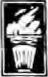

DIALECTICAL [MATERIALISM]{.underline}

Its Laws, Categories, and Practice

> {width="1.4736111111111112in"
> height="2.3618055555555557in"}

Ira Gollobin

**DIALECTICAL MATERIALISM**

**DIALECTICAL\
MATERIALISM**

*Its Laws, Categories, and Practice*

> {width="0.34652777777777777in"
> height="0.5201388888888889in"}

*Ira Gollobin*

**NOBODYOWNSLAND**

*Petras Press\
New York*

*Contents*

**Acknowledgments 13**

**Author\'s Note 15**

> **On the Scope and Mode of Exposition 15**
>
> **Some Limitations 18**

**Preface 21**

> **Popular Views of Philosophers and Philosophy, Past and Present 21**

**PART I: INTRODUCTION**

1.  **Workers and Scientific Philosophy 29**

> **Why Workers Should Learn Scientific Philosophy 29**
>
> **Workers Can Learn Scientific Philosophy 32**
>
> **A History of Philosophy in the United States: An Overview of**
>
> **Bourgeois Predominance 34**
>
> **For a Marxist-Leninist History of Philosophy in the United States.
> 37**

2.  **The Main Stages of Philosophical Development 40**

> **Prescientific Philosophy 40**
>
> **Scientific Philosophy 42**
>
> ***The Birth of Scientific Philosophy* 42**
>
> ***Scientific Philosophy and Scientific Criteria* 44**
>
> ***Scientific Philosophy and Scientific Method* 44**
>
> **Antiscientific Philosophy 45**
>
> ***Existentialism\'s Social Diagnosis* 46**
>
> ***Existentialism\'s Social Program* 48**
>
> ***Philosophic Aspects of Existentialism* 49**
>
> ***Analytical Philosophy* 51**
>
> **Partisanship in Philosophy 53**

**PART II: MATERIALISM**

3.  **Materialism: Laws and Categories 59**

> **A Preliminary Clarification: Materialism and Idealism 59**
>
> **Prescientific Views 60**
>
> ***Child Development* 60**
>
> ***Preclass Society* 62**
>
> ***Class Society* 63**

***7***

> 8 CONTENTS
>
> Scientific Views 72
>
> *The Nature of Truth* 72
>
> *The Test of Truth* 74
>
> Antiscicntific Views 76
>
> *A Preliminary Note* 76
>
> *Antiscientific Views on the Nature of Truth* 78
>
> A*ntiscientific Views on the Test of Truth* 83
>
> A Brief Summary 85
>
> **PART III: DIALECTICS**

*Section 1. Dialectics of the Object: Very General Aspects of All \'I
bings*

> *(Including Consciousness)* 88
>
> *A. **Laws** of Dialectics of the Object* 89

4.  Introduction to Laws of Dialectics of the Object 89

5.  From the Outer Nature (Appearance) of Things to the First Law of

> Dialectics 91
>
> Why a Transition Chapter to the First Law of Dialectics? 91
>
> Sameness and Difference 92
>
> Connection and Change 93
>
> *Connection* 93
>
> *Change* 97
>
> Internal Change and External Change 103 Internal Change and Nonchange
> of Things (Self-Movement **and**
>
> Identity): Contradiction 106
>
> Contradiction and Consistency 107

6.  The First Law of Dialectics: The Unity and Conflict of

> Opposites---Contradiction 110
>
> Polarity 111
>
> *Prescientific Views* 111
>
> *Scientific Views* 112
>
> *Antiscientific Views* 117
>
> The Principal Aspect of a Contradiction 120
>
> A Thing as a Sum of Contradictions 122
>
> The Principal Contradiction Within a Sum of Contradictions 123
>
> Quality and the Principal Aspect of the Principal Contradiction .. 124
>
> The Interpenetration of Opposites 125
>
> The Absoluteness of the Conflict of Opposites and the Relativity of
>
> Their Unity 129

Antagonistic and Nonantagonistic Contradictions: A Special Sphere

> of the First Law of Dialectics 131
>
> *Scientific Views* 131
>
> A*ntiscientific Views* 136
>
> CONTENTS 9

7.  The Second Law of Dialectics: The Transition of Quality into

> Quantity and of Quantity into Quality 147
>
> The Inseparability of Quality and Quantity 147
>
> *Prescientific Views* 147
>
> *Scientific Views* 149
>
> *Antiscientific Views **153***
>
> Balance-Imbalance and a Thing\'s Transition to a Limit 160
>
> Gradualness, Subordinate Leaps, and Nodal Line of
>
> Measurements 164
>
> Nodal Point, Leap, and New Quality 166

8.  The Third Law of Dialectics: Negation of Negation 169

> Negation 169
>
> *Meanings of Negation: Verbal Denial, Mechanical Negation, and*
>
> *Dialectical Negation* 169
>
> *The Positive and the Negative* 170
>
> *Antiscientific Views* 174
>
> Negation of Negation 178
>
> *Prescientific and Scientific Views* 178
>
> *Antiscientific Views* 181

9.  Laws of Dialectics of the Object as a Whole 185

> ***B.** Categories of Dialectics of the Object* 188

10. Introduction 188

11. Appearance and Essence 192

> Prescientific Views 192
>
> Scientific Views 194
>
> Antiscientific Views 198

12. Form and Content 204

> Prescientific Views 204
>
> Scientific Views 206
>
> Antiscientific Views 210

13. The Relative and the Absolute 213

> Prescientific Views 213
>
> Scientific Views 214
>
> Antiscientific Views 218

14. The Finite and the Infinite 223

> Prescientific Views 223
>
> Scientific Views 226
>
> Antiscientific Views 228

15. Possibility and Actuality 231

> Prescientific Views 231
>
> Scientific Views 232
>
> Antiscientific Views 236

+----------------------------------------------------------------+-----+
| > 10 CONTENTS                                                  |     |
+================================================================+=====+
| > 16\. Contingency and Necessity                               | 241 |
+----------------------------------------------------------------+-----+
| > Connections of Possibility and Actuality with Contingency    | 241 |
| > and                                                          |     |
| >                                                              |     |
| > Necessity                                                    |     |
+----------------------------------------------------------------+-----+
| > Contingency and Necessity: An Overview                       | 242 |
+----------------------------------------------------------------+-----+
| > Causality                                                    | 246 |
+----------------------------------------------------------------+-----+
| > *Prescientific Views*                                        | 246 |
+----------------------------------------------------------------+-----+
| > *Scientific Views*                                           | 251 |
+----------------------------------------------------------------+-----+
| > *Antiscientific Views*                                       | 252 |
+----------------------------------------------------------------+-----+
| > Law                                                          | 254 |
+----------------------------------------------------------------+-----+
| > *Prescientific Views*                                        | 254 |
+----------------------------------------------------------------+-----+
| > *Scientific Views*                                           | 255 |
+----------------------------------------------------------------+-----+
| > *Antiscientific Views*                                       | 256 |
+----------------------------------------------------------------+-----+
| > Social Laws                                                  | 259 |
+----------------------------------------------------------------+-----+
| > *Scientific Views*                                           | 259 |
+----------------------------------------------------------------+-----+
| > *Antiscientific Views*                                       | *   |
|                                                                | \'* |
|                                                                | 262 |
+----------------------------------------------------------------+-----+
| > Freedom                                                      | 268 |
+----------------------------------------------------------------+-----+
| > *Scientific Views*                                           | 268 |
+----------------------------------------------------------------+-----+
| > *The Social Context of Freedom*                              | 269 |
+----------------------------------------------------------------+-----+
| > *Antiscientific Views*                                       | 273 |
+----------------------------------------------------------------+-----+
| > Conclusion                                                   | 282 |
+----------------------------------------------------------------+-----+
| > 17\. The Particular and the General                          | 284 |
+----------------------------------------------------------------+-----+
| > Prescientific Views                                          | 284 |
+----------------------------------------------------------------+-----+
| > Scientific Views                                             | 285 |
+----------------------------------------------------------------+-----+
| > Antiscientific Views                                         | 292 |
+----------------------------------------------------------------+-----+
| > 18\. Categories of Dialectics of the Object as a Whole       | 298 |
+----------------------------------------------------------------+-----+
| > Scientific Views                                             | 298 |
+----------------------------------------------------------------+-----+
| > Antiscientific Views                                         | 301 |
+----------------------------------------------------------------+-----+

*Section 2. Dialectics of the Subject: Very General Aspects of Rational*

> *Consciousness Per Se (Epistemology)* 303
>
> A. *Laws of Epistemology* 304

19. introduction 304

20. Laws of Epistemology 309

> Prescientific to Scientific 309
>
> *Child Mental Development: From Birth to Adolescence* 310
>
> *An Initial Framework* 310
>
> *Cognitive-Affective Stages in Child Mental Development* 313
>
> *Overall Stages in the Socialization of Child Thought* 315
>
> *Convergence between the Child\'s Maturation and the Early*
>
> *Historical Record of Society\'s Mental Development* 323\
> *Aspects of the History of Cognition (Societal Development):
> Prescientific*
>
> *to Scientific* 326
>
> CONTENTS 11
>
> Antiscientific Views on Cognition 335
>
> *Downgrading Conceptual Thought: Depleted Cognition* 335
>
> *Downgrading Conceptual and Perceptual Thought: Denuded*
>
> *Cognition* 338
>
> Conclusion 342
>
> ***B.** Categories of Epistemology* 344

21. Introduction 344

> Overall Framework: Inductive and Deductive Inference 344
>
> Scientific Views 346
>
> Antiscientific Views 347

22. The Abstract and the Concrete 350

> Prescientific Views 350
>
> Scientific Views 352
>
> Antiscientific Views 355
>
> Special Spheres of the Abstract and the Concrete 356
>
> *Mathematics* 356
>
> *Logic* 359
>
> *History* 360
>
> *The Arts* 362
>
> *Values, Ethics* 363
>
> *Humanism* 364

23. Analysis and Synthesis 369

> Prescientific Views 369
>
> Scientific Views 371
>
> Antiscientific Views 374

24. Theory and Practice 378

> Prescientific Views 378
>
> Scientific Views 381
>
> Antiscientific Views 386
>
> *C. Epistemology as a Whole* 391

25. Laws and Categories of Epistemology as a Whole 391\
    > Certainty and Completeness in Knowledge: Relative and Absolute

> Views 391
>
> Antiscientific Views 395
>
> *Section 3. Dialectics as a Whole* 399

26. Dialectics of the Object and of the Subject as a Whole 400

> Laws of Nature and Laws of Thought 402
>
> Dialectical Logic and Formal Logic 403
>
> Dialectics, Epistemology, and Logic 404
>
> An Overview of the Exposition Sequence of Dialectics 406
>
> 12 CONTENTS
>
> Aspects of Dialectics: A Summary and an Application by Lenin 407
>
> Antiscientific Appraisals of Dialectics as a Whole 409
>
> **PART IV: CONCLUSION**

27. Dialectical Materialism as a Whole 419

> Scientific Views 419
>
> Antiscientific Views 424
>
> Conclusion 432

28. Wisdom 434

> Prescientific Views 434
>
> Scientific Views 438
>
> Antiscientific Views 444
>
> Conclusion 452
>
> **ADDENDUM**
>
> On Historical Experience with Socialist Revolution and Its
>
> Consolidation: A Query and a Hypothesis 457
>
> A Query 457
>
> Socialism in the USSR and the Post-Stalin Period 462
>
> Socialism in the People\'s Republic of China and the Post-Mao
>
> Period 472
>
> A Hypothesis 496
>
> Notes 507
>
> Bibliography 561
>
> Index 574
>
> {width="0.3236111111111111in"
> height="0.5069444444444444in"}

*Acknowledgments*

This treatise culminates a journey of many years which at its inception
had a very limited objective. In 1950 I proposed to a publisher that I
write a primer based mainly on *A Texibook of Marvin Philosophy,*
prepared in the early 1930s by the Leningrad Institute of Philosophy.
The publisher agreed.

Aware that there were areas of the subject that I knew little about, I
began a course of reading that I believed would be completed in a
relatively short time. Contrary to my expectations, the more I read the
more I realized how much more there was to know. As years passed, it
seemed to family and friends that I was engaged in a mission impossible,
and that the reading and the writing were a kind of perpetual motion
without end.

This impression was reinforced by numerous protracted interruptions
neces­sitated by my work as an attorney. During the 1950s and 1960s I
represented persons attacked in the Cold War witchhunts---some in
deportation proceedings based on their affiliation with or membership in
left-wing organizations and some subpoenaed by the House Un-American
Activities Committee or the Senate Internal Security Committee. In the
1970s my focus shifted to defense of refugees. Other activities also
made considerable demands on my time. Actu­ally, these involvements were
an integral part of work on the book. They provided many opportunities
for practical testing of my formulations of the concepts of dialectical
materialism and, in turn, of correcting or deepening these formulations.

Crucial to the completion of the book was the help of my family and
their forbearance during the endless hours spent in studying and
writing, as well as the help---including indispensable technical
assistance---of friends. For many valuable criticisms and suggestions I
am particularly indebted to Bernard Seeman and Susan Warren. Linda
Briggs (who designed the book) and Susan Loves (who gave advice and
other help in the production of the book) ably helped in a laborious
undertaking. To all, my profound thanks!

My hope is that in the present period of increasing complexity,
intensifying turmoil, and accelerating tempo of events, the book\'s
comprehensive account of dialectical materialism will enable readers to
understand better---and more ef­fectively change---the world and
themselves. Above all, I hope the book will be useful for those striving
to achieve a socialist society.

13

> *Author\'s Note*
>
> **ON THE SCOPE AND MODE OF EXPOSITION**
>
> **While imperialism\'s signs of decay multiply and deepen, many people
> who previously believed socialism to be the solution now have become
> unsure, or even hostile. Because of events in the Union of Socialist
> Soviet Republics (USSR), particularly after the mid-1950s, and of
> events in the People\'s Republic of China (PRC), particularly after
> the mid-1970s, many of those who before then had been favorably
> disposed to Marxism---Leninism---including its philoso­phy, dialectical
> materialism---now view it with skepticism regarding its truth and
> cynicism regarding its values. Buttressing this skepticism and
> cynicism, experience has falsified many prophecies made periodically
> by Marxist-Leninists that capitalism\'s collapse was imminent or at
> least not far off, and this has led many persons to conclude, on the
> contrary, that capitalism, despite manifest infirmities, is as a
> system essentially stable and endowed with pro­tracted life.**
>
> **It is the purpose of this book to expound the concepts of
> dialectical mate­rialism as a science, and at the very end of the book,
> in an addendum, to try to apply these concepts to explain the
> unsettling developments in the socialist world as basically a
> law-governed process, and to delimit this process\' further overall
> course.**
>
> **The book is intended to provide a comprehensive and coherent account
> of dialectical materialism. Included are the laws and categories
> present in all things and processes\* at all times, and other laws and
> categories present always but only, in rational thinking. The final
> chapter, \"Wisdom\"---for millenia the de­clared preserve of ruling
> classes---provides a synthesis for the book as a whole.**
>
> **To facilitate concreteness a broad range of illustrations is drawn
> from ancient cultures (including Chinese, Indian, African, and Greek),
> the special sciences (including anthropology, biology, chemistry,
> geology, mathematics, physics and especially economics and politics),
> and the humanities, especially history and literature. Included also
> are references to U.S. history and illustrations from daily life. The
> very general laws and categories of dialectics are not pre­sented as
> postulates and the illustrations as their proof. The illustrations
> are**
>
> **\*For the sake of convenience and to avoid repetition, \"thing\"
> (which emphasizes the aspect of stability) and \"process\" (which
> stresses the aspect of mobility) are hereafter used interchangeably
> each implying the other, unless otherwise indicated. Thing
> \"represents *anything* (e.g., objects, entities, qualities,
> properties, systems, levels, etc.)\" (David Bohm, *Causality and
> Chance in Modern Physics,* p. I45n).**
>
> **15**
>
> **16** AUTHOR\'S NOTE
>
> solely intended to illuminate, not demonstrate, the laws and
> categories, which cannot be reduced to a sum of examples, no matter
> how considerable.
>
> Tracing the origins and development of concepts of dialectics is vital
> for their comprehension, yet most expositions of dialectical
> materialism do not treat its aspects fully historically---in terms of
> the main stages in the history of philosophic cognition:
> prescientific,\* scientific, and antiscientific stages. The stages are
> not rigid pigeonholes but at best approximate and reflect innumerable
> advances and regressions in the discernment---however partial,
> imprecise, and uncoordinated---of aspects of scientific philosophy.
> More concretely, the prescientific stage is a sum, a complex of
> subsidiary levels in which the nonscientific is predominant but is
> intermingled with scientific and antiscientific formulations of very
> general aspects of nature, society, and thought.
>
> In this book the exposition of each aspect of dialectical materialism
> is divided into prescientific (including data from preclass and class
> society and from the development of thought in the child, especially
> in the research done by Jean Piaget and his colleagues); scientific
> (including data from the natural sciences and selections from Hegel,
> Marx, Engels, Lenin, and Mao); and antiscientific (including
> selections from Sidney Hook, Karl Popper, Herbert Marcuse, Soren
> Kierkegaard, Jean-Paul Sartre, Ludwig Wittgenstein, Erich Fromm, Karl
> Jas­pers, Gabriel Marcel, Burrhus F. Skinner, Paul Tillich, and **J.**
> Khrishnamurti).\*\* Based on the book as a whole, readers can judge
> for themselves the accuracy and relevancy of this three-stage
> classification.
>
> **In** addition, an effort is made to integrate each of these stages
> with data from historical materialism so as to illuminate the
> interrelationship between the evo­lution of the concepts relevant to
> dialectical materialism, on the one hand, and of the level of
> technology and of the society\'s mode of production, on the other. Two
> prime sources of data regarding the prescientific stage are child
> mental development (►which illuminates the development of primitive
> cognition, only meager records of which arc now extant) and recorded
> social history. At a certain level of development (about seven to ten
> Years), child cognition con­verges with the level shown in early
> societal records, such as pre-Socratic physics, and data on this
> convergence is cited.
>
> Science begins in toolmaking as **well** as in myths and
> superstitions, which to some extent represent efforts to grapple with
> reality and which develop from
>
> more absurd to less absurd beliefs. Without this evolution in outlook
> and modes
>
> of thought, science would have no \"base from which to start,\" nor
> any \"certain direction in which to proceed.\"\' (M. R. Cohen)
> Prescientific perceptions of
>
> reality contain \"the seeds of truth as well as the noxious weeds of
> error and illusion.\"\' (M. R. Cohen) In this context \"previous
> philosophy\"---despite its focusing largely on the world of the
> supernatural---\"itself belongs to this world
>
> \*Cognition\'s philosophic ascent in stages (from the prescientific)
> is to some extent also an ascent in levels (from the philosophic
> aspects of less general spheres---such as the arts and special
> sciences---to the very• general, to philosophy as such). In this book
> the terms \"scientific philosophy,\" \"Marxist philosophy,\" and
> \"dialectical materialism\" are used interchangeably.
>
> \*\*The exposition given in the introductory and synthesis chapters
> does not adhere to this tripartite division.
>
> AUTHOR\'S NOTE 17
>
> and is its, albeit idealist, elaboration.\"\' (Marx) \\lao, for
> example, described the literary work *Heaven Asks* as \"really
> fantastic, thousands of years ago it raised all kinds of questions,
> relating to the universe, to nature, and to history.\"\'
>
> In philosophy, as in economics and politics, the birth of scientific
> philosophy (an achievement of Marx and Engels) as an integral science
> simultaneously gave rise to its antagonistic opposite, antiscientific
> philosophy. Scientific and antiscientific philosophy necessarily
> contend with each other. \". . . the \'polem­ical character\' of the
> system \[of Nlarx\] is only the accurate reflection of the \`polemical
> character\' of capitalism itself.\"\' (Lenin)
>
> Those instructed in scientific philosophy but not in antiscientific
> philosophy are inadequately equipped to withstand even normal social
> stresses. \"The true, the good and the beautiful always exist by
> contrast with the false, the evil and the ugly, and grow in struggle
> with them . . . Marxists should not be afraid of criticism from any
> quarter. . . . Plants raised in hothouses are unlikely to be
> hardy.\"^6^ (Mao) Though the danger of error is especially acute in
> the sphere of philosophy, there is no way to the true path of
> scientific philosophy which bypasses false ones: \"Now, in order to
> follow the true path, without being led astray by all the religious
> and philosophical gibberish, it is necessary to study the falsest of
> all false paths, \[antiscientific\] philosophy.\"\' (Dietzgen)
> Erroneous philosophy cannot be ignored with safety.
>
> In a fundamental sense, philosophy is integral; the prescientific and
> the antiscientific phases are facets of scientific philosophy,
> demarcating and il­luminating it. \"The history of Philosophy is itself
> scientific, and thus essentially becomes the science of
> Philosophy.\"\" (Hegel) In order for the prescientific and the
> antiscientific to enlarge the domain of the scientific and to enhance
> its comprehension, the exposition focuses on and places in the
> forefront their connection with the scientific.
>
> Neither the chapters nor their topical subparts are inflexible
> compartments; rather, they overlap and crisscross. These segments have
> at best a relative absoluteness; they are somewhat tentative divisions
> of the subject matter de­signed to facilitate insights into its nature.
> In addition, although each chapter is an integral part of the subject
> as a whole, most chapters are written as complete units and are thus
> separately printable.
>
> The sequence of chapters is a logical order, not a temporal one
> recapitulating the sequence in which one learns. \"The temporal order
> in which we learn or acquire our knowledge is not, in general, the
> same as the logical order of the propositions which are constituents
> of that knowledge.\'\"\' (M. R. Cohen and E. Nagel) Reasons for the
> topical sequence are given in Chapter 26, \"Dialectics as a Whole,\"
> in the section entitled \"An Overview of the Exposition Sequence of
> Dialectics.\" Though this sequence has elements of the systematic, it
> is essen­tially pedagogical and is not intended to portray dialectical
> materialism as being a system of nature, which it is not.
>
> This book is an intermediate---between a primer (a much briefer
> presentation of dialectical materialism\'s laws, categories, and
> practice) and a much more complete exposition (on each of dialectical
> materialism\'s laws and categories one or more books can be written).
>
> 18 AUTHOR\'S NOTE
>
> In a basic sense this book is not one but two interwoven books: one
> that is dramatic, consisting of numerous quotations (some used more
> than once be­cause of their different significant contexts) in which in
> the course of many centuries many brilliant pioneers and keen
> contestants, directly quoted, vividly and eloquently speak for
> themselves, while 1 stand off-stage, taking part only through the
> choice of the participants, the selection of the writings used, and
> the sequence of presentation. In summary or paraphrase the original
> texts would tend to become anemic, if not lifeless, because much of
> their richness and vitality would be lost. In the second book I speak
> explicitly for myself. I hope the \"two books\" constitute an ensemble
> that furthers accuracy and insight, as well as clarity and
> readability, in treating a subject that in many books is usually much
> vexed by distortion, ambiguity, incomprehensibility, and dullness.
>
> **SOME LIMITATIONS**

1.  Due to my inadequate access to data and to incompleteness of
    > research, European and United States sources have been
    > disproportionately used, result­ing in the slighting of
    > contributions of other cultures. Racism is especially flagrant and
    > grievous with regard to Africa. For example, the racial bias as
    > well as ignorance of many Western scholars have tended to hinder
    > and distort ap­praisals of ancient Egypt as an African civilization
    > and of Egyptian cultural contributions to Western civilization.
    > However significant the advances made by the early Greeks,
    > Professor George M. James in his work *The Stolen Legacy* makes
    > clear that they stood on the shoulders of five millennia of
    > Egyptian culture.\* Included among those who studied in Egypt are
    > Thales, Pythagoras, Parmcnides, Zeno, lieraclitus, Democritus,
    > Socrates, Plato, and Aristotle.^1^° (Williams)

2.  In order to help orient the reader, there are two introductory
    > chapters: \"Workers and Scientific Philosophy\" and \"The Main
    > Stages of Philosophical Development.\" The singling out of workers
    > in the first of these chapters is intended to stimulate workers\'
    > interest and not to discourage the interest of others or to limit
    > the relevancy of dialectical materialism to any group. This focus
    > is especially necessary because many workers tend to
    > minimize---unlike many scientists who tend to exaggerate---what
    > they know of dialectical mate­rialism, without having studied it as
    > a sphere of knowledge.

3.  In this book---particularly in the parts of each chapter on
    > prescientific views and antiscientific views---references to
    > religion focus on its philosophic

> content and on the use of religion by rulers to maintain an oppressive
> status quo. As regards its philosophic aspect, its theology, religion
> is rooted in super­stition and is in fundamental irreconcilable
> conflict with science. Admittedly,
>
> \*The contributions of interior Africa to Egyptian cultural
> development are detailed in *The African Origin cf Ciriliwtion: Myth
> or Reality?* and in *Civilization or Barbarian, both by* Dr. Cheikh
> Arita Diop, and in Legrand Clegg, \"The First Invaders,\" Journal of
> African Civilizations, Vol. 3, No. I (April 1981. p. IS). As regards
> the contribution of prehistoric Africa to the culture of Europe,
> Africoid Gpimaldis (who displaced the Neanderthalers from about 40,000
> B.C.) \"brought \'civilization\' such as tt was, from prehistoric
> Africa to prehistoric Europe\" (ibid., p. 17).
>
> AUTHOR\'S NOTE 19
>
> religious dignitaries and some scientists contend otherwise: \"Science
> doesn\'t need religion; it can do its research without religion. . . .
> Notwithstanding the tensions, science and religion have to exist
> side-by-side.\" (Cardinal Konig)
>
> In this book my restriction of the analysis of religion to its
> philosophic aspect and to its socially repressive use by exploiters is
> one-sided and incomplete. For example, many of the ethical imperatives
> of, for instance, Buddhism, Islam, Christianity, and Judaism (such as
> those of Isaiah on war and peace) to some extent hark back to the
> egalitarianism and nonantagonism of primitive com­munal society and in
> a sense anticipate some aspects of modern communal society. Engels
> noted that \"in the history of early Christianity, there are points of
> contact with the present-day movement of the workers that are worthy
> of attention.\" And, referring to certain themes in the Epistles of
> Paul, he declared that \"these appeals could have been written with
> equal success by some pro­phetically minded enthusiast from the
> International \[Workingmen\'s Associa­tion\].\" Millions of the
> religious deem adherence to those imperatives paramount to any
> conflicting commands by the imperialist-dominated state, as shown, for
> example, in their demands to end production of nuclear weapons and
> their support of freedom for many who are oppressed. Nevertheless, the
> central thrust of many of the traditional religious imperatives and of
> many religious institutions is contrariwise, namely the subordination
> of the individual to the ideology, interests and values of exploiters
> and to the dictates of the exploiter-ruled state. In the very contrast
> in terms, of \"liberation theology\" with \"Reformation\" (which
> betokened the changeover from feudalism to capitalism) on the one
> hand, and with \"fundamentalism\" on the other hand, lies implicit the
> far more profound social upheaval that impends.
>
> As imperialism\'s antagonisms deepen, the communal, liberational
> impera­tives, albeit still in religious form, tend to foster among
> millions of people a crusading and more insightful militancy and to
> diminish certain barriers be­tween them, rather than serving as a
> continuing total bar to social cooperation with many of the
> irreligious like-minded. In the widening conflict, for instance,
> between imperialist governmental policies and pristine Christian
> ethical impera­tives, the latter arc deemed paramount for many. As for
> those on the far left, \"Unity in this truly revolutionary struggle of
> the oppressed class for the creation of a paradise on earth is more
> important to us than unity of opinion among the proletarians about a
> paradise in heaven.\"\" (Lenin)
>
> 4\. Of a very different nature than the limitation of the depiction of
> religion in this book is the absence of references in the exposition
> to the contributions of women to philosophy as such, except in the
> contemporary period. Since ancient times many women have been notable
> as philosophers but their insights were usually appropriated by others
> and seldom written and acknowledged as their own (or if they were,
> they were not widely disseminated) and have been sparsely preserved.
> They had to surmount very adverse social conditions which drastically
> obstructed the development of women as philosophers. The fact that in
> patriarchal society and its successor, class society, with its intense
> male supremacist credo, the most outstanding philosophers recorded in
> history are men is not a judgment on the inherent capabilities of
> women. The insights of
>
> {width="0.3368055555555556in"
> height="0.5298611111111111in"}

*Preface*

This preface and the first two chapters (\"Workers and Scientific
Philosophy\" and \"The Main Stages of Philosophical Development\") are
to be taken together as constituting the book\'s introduction to
dialectical materialism. Philosophy is so troubled a subject that this
varied and somewhat lengthy introduction is provided to help clarify and
resolve certain threshold problems (including pre­liminarily validating
the historical mode of exposition) and thereby place dialec­tical
materialism in a more precise focus before undertaking its elaboration.

**POPULAR VIEWS OF PHILOSOPHERS AND PHILOSOPHY, PAST AND PRESENT**

Public esteem for philosophers has varied widely. For a long time, many
have regarded Confucious, the Buddha, Socrates, Plato, and Aristotle
with con­siderable respect, even with awe, as embodiments of wisdom and
nobility of character. Often quoted arc the words of Socrates, a martyr
to philosophy, who compared himself to a gadfly \"rousing and exhorting
and reproaching\" his fellow citizens, and who warned that if they
rashly put him to death, they would \"not easily find anyone else\" to
fill his place.\'

Another viewpoint depicts philosophers, especially professional
philoso­phers, with derision. They are seen as impractical in their
search for profun­dity---as in the much-relished legend of Thales who,
preoccupied with star­gazing, fell into a well. They have also been seen
as imposters and poseurs, pretending to be profound---as in the gibes of
the Romans: \"Be silent and you will pass as a philosopher,\" or \"
\`This man is a philosopher.\' Why?\"He wears a cloak and long hair.\'\"
Or they have been viewed as mere windbags with scant knowledge of
scientific facts---as in the retort of Lord Rutherford, the noted
physicist, to the English philosopher Samuel Alexander: \"What is it
that you have been saying all your life, Alexander? Hot air. Nothing but
hot air!\'\" For still others, philosophers are a dreary lot---as in the
colloquy between the distin­guished writer Samuel Johnson and Oliver
Edwards, when the latter confessed to an inability to emulate him: \"You
arc a philosopher, Dr. Johnson. I have tried too in my time to be a
philosopher; but, 1 don\'t know how, cheerfulness was always breaking
in.\"^4^ The poet Heine mocked philosophers as duffers: \"With

\*By the sixteenth century, philosophers had earned a spectrum of
epithets: \". . . among the commonfolk to call anyone a philosopher is
tantamount to insulting him as a quack, a good-for-nothing, a howling
pedant, a charlatan, a mountebank, a mere cheat, good only as
entertainment at home and as scarecrow in the fields\" (Giordano Bruno,
*Cause, Principle and Unity,* pp. 63-64).

21

> **22 PREFACE**
>
> **his night-cap and his night-shirt tatters, / He botches up the
> loop-holes in the structure of the world.\"\' Morris R. Cohen, for
> three decades a gadfly in the So­cratic tradition, commented that \"the
> successful man of affairs\" denigrates a \"creative cultural life\"
> and feels that \"those who devote themselves to it are either
> pretentious frauds or deficient in virility.\"^6^**
>
> **This scorn for the philosopher is conjoined with a disdain for
> philosophy as being divorced from real life. Hegel noted the \"common
> prejudice that the science of philosophy deals only with abstractions
> and empty generalities, and that sense-perception, our empirical
> self-consciousness, natural instinct, and the feelings of everyday
> lift lie, on the contrary, in the region of the concrete and the
> self-determined.\"\'**
>
> **The satirist Ambrose Bierce defined philosophy as \"a route of many
> roads leading from nowhere to nothing.\"\' In like vein, an anonymous
> wit derided philosophy\'s method: \"Philosophy always begins at the
> beginning and ends up in the mind of one man.\"**
>
> **Bertrand Russell equated philosophy with fallacy and immaturity:
> \"Philoso­phy has been defined as \'an unusually obstinate attempt to
> think clearly\'; 1 should define it rather as \'an unusually ingenious
> attempt to think falla­ciously\'. . . . Philosophy is a stage in
> intellectual development, and is not compatible with mental
> maturity.\'**
>
> **This low esteem for much of philosophy is based to a considerable
> degree on the public\'s perspicuity, and not on its myopia.
> Distortions, platitudes, hair­splitting, jargon, and other vices are
> the hallmark of a considerable portion of philosophy. For most of the
> relatively small number of those in the United States as yet
> concerned, these \"vices\" have become their image of philosophy. Very
> few of those interested have any inkling that philosophy might be a
> science and fewer still have any accurate and comprehensive familarity
> with dialectical materialism as such a science and of its relationship
> to wisdom and to developments in the USSR and the PRC.**
>
> **SCIENTIFIC PHILOSOPHY**
>
> **\"The truth of science,\" Hegel wrote, \"is a calm light that
> illuminates and delights everything, like the warmth in which
> everything simultaneously flourishes and explicates the internal
> treasures in the breadth of life.\"\'° Scientific philosophy is such a
> science, concretely described as dialectical materialism---a composite
> of very general aspects present in nature, society, and thought. This
> universality constitutes its domain, its uniqueness, which sets it
> apart from other sciences. The other sciences are special sciences, in
> that each has a lesser degree of generality.**
>
> **In affirming that dialectical materialism is scientific philosophy
> and in using it as a science that is ceaselessly in process of
> refinement, Marxist-Leninists and others reject blind faith: \"We must
> believe in science and nothing else, that is to say, %ye must not have
> blind faith in anything.\" (Lenin) And he further de­clared: \"We do
> not want anything to be accepted with the eves shut, to be an**
>
> PREFACE 23
>
> article of faith. Everyone should keep his head tight on his own
> shoulders, and think out and verify everything for himself.\"
>
> William Harvey, who made a major contribution to the discovery of
> blood circulation in animals and humans, in the dedication to his book
> on his research described the balanced openness of mind that
> scientifically grounded philoso­phers must at all times maintain:
>
> True **philosophers, who are only eager for truth and knowledge,
> never** regard themselves as already so thoroughly informed, but they
> welcome further information from whomsoever and from whencesoever it
> may come; nor are they so narrow-minded as to imagine any of the arts
> or sciences transmitted to us by the ancients, in such a state of
> forwardness or com­pleteness, that nothing is left for the ingenuity
> and industry of others; very many, on the contrary, maintain that all
> we know is still infinitely less than all that still remains unknown;
> nor do philosophers pin their faith to others\' precepts in such wise
> that they lose their liberty, and cease to give credence to the
> conclusions of their proper senses.\"
>
> The high degree of generality, the abstractness of scientific
> philosophy, does not entitle an exposition of it to be obscure: \"when
> a philosophical author writes with a misty profundity, he is talking
> nonsense.\"\" (Whitehead) Profundity and lucidity arc not
> incompatible. On the contrary, lucidity is a criterion of genuine
> profundity:
>
> Philosophical expositions which cannot be grasped by every educated
> per­son do not, in our opinion, deserve the printer\'s ink expended on
> them. What has been clearly thought out can also be said clearly and
> without circumlocution. The philosophical evils which disfigure the
> writings of the erudite seem to aim more at concealing thoughts than
> at revealing them.\" (Engels)
>
> Being lucid does not mean that a thought is immediately graspable. An
> exposi­tion of complex, abstract subject matter, however lucid, may
> require more than one reading and does become more clearly understood
> in the course of practical application.
>
> An exposition of dialectical materialism should itself be materialist
> and dialec­tical, rooted throughout in historical materialism and with
> some specificity to the country in which it is written, an integral
> portion of totality, a history of a sphere of culture, a lively,
> well-told epic story, an artistic whole, a work of science and of
> literature,\* of logic and of passion, of general scientific import,
> as well as, in this final period of class society, of special
> relevance to those strug­gling for socialism. To the extent these
> criteria arc achieved, a book on dialecti­cal materialism can be \"a
> glimmer in the east, an arrow whistling through the forest, a bud at
> the end of winter. . . .\"\'s (Lu Elsun)

**\*Referring to 1-lege1\'s \"Logic,\" Engels termed it \"a dialectical
poem\"** *(Dialectics of Nature,* **p. 224).**

**DIALECTICAL MATERIALISM**

**PART I.**

**INTRODUCTION**

**CHAPTER 1.**

*Workers and Scientific Philosophy\**

**WHY WORKERS SHOULD LEARN SCIENTIFIC PHILOSOPHY**

**Everyone with the power of thought, however uncultivated, has a
world-view, some curiosity and some intimation about totality. No
thinking person is a philosophic vacuum. For this world-view to be
scientific, comprehension of dialectical materialism is indispensible.**

**Scientific philosophy (dialectical materialism; Marxist philosophy) is
a branch of knowledge that includes the most comprehensive general
truths of the cos­mos, the uniformities present in all things, in all
processes, at all times---the totality of universality. As a composite,
these truths constitute a scientific world-view of nature, society, and
thought.**

**Why should workers---including those in capitalist lands, as well as
those in dependent/neocolonial countries---learn scientific philosophy?
First and fore­most, because it is profound, extremely useful truth,
necessary for winning both daily and long-range struggles. For example,
knowledge of the very gen­eral truth that all things are interconnected
and changing, that nothing is com­pletely isolated and fixed, is a
necessary tool for the scientific method of examining things. Those who
view things as isolated and fixed are prepro­grammed to commit errors,
and this vulnerability will continue until this gen­eral, underlying
source of error in their mode of thought is uprooted. As Giordano Bruno
noted, \"If the first button of a man\'s coat is wrongly buttoned, all
the rest will be crooked.\"\'**

**Equally, unscientific philosophy\*\* is vital for the bourgeoisie.
Capitalists have two kinds of property---material and spiritual:
ownership not only of the state, of the means of production, and of a
worker\'s hands, but also of his mind. \"The tradition of all the dead
generations weighs like a nightmare on the brain of the living.\"\'
(Marx) Scientific philosophy helps ferret out and dissipate the
oppressive mental carryovers of age-old exploitive rule. Workers\'
knowledge of**

**\*In focusing at the outset on workers, the intent is not to exclude
others from scientific philoso­phy, but rather only to emphasize the
importance and feasibility of the inclusion of workers, who are so often
excluded.**

**\*\*Unscientific (that is, prescientific or antiscientific) and
scientific philosophy are contrasting technical terms as precise as, for
example, alchemy and chemistry. Like chemistry, which after a struggle
consigned alchemy to a museum of antiquities, scientific philosophy will
eventually dis­place unscientific philosophy as the prevailing world
outlook and then can be known simply as philosophy.**

**29**

30 DIALECTICAL MATERIALISM

> scientific philosophy radically weakens capitalist control of the mind
> and, in turn, of the hands without which capitalism cannot long
> continue. The antago­nism in class society between hand and brain
> coincides with that between ruled and ruler. Long ago, Chinese
> ideologists wrote: \"\'Those who work with their brain arc rulers,
> those who work with their brawn arc ruled. Those who are ruled feed
> others, and those who rule feed off others.\' \"\'
>
> Every exploiting class---slaveholders, feudal lords, and capitalists
> alike---guards philosophy from the mass of people. Over 2,000 years
> ago the philosopher Plato, in order to buttress a declining slave
> society, urged that \"philosophers become kings\" and kings \"become
> philosophers\"\' and declared that \"philosophy is impossible among
> the common people,\"\' the baseborn---the slaves, artisans, and others
> performing slave society\'s productive labor, as well as the
> merchants. The conqueror Alexander of Macedon reproached his tutor,
> Aristotle, for publishing his philosophic writings, which enabled
> nonaristocrats to read them. In China, the philosopher Lao Tzu (c. 4th
> century) castigated those who imparted knowledge to the people: \"The
> difficulty of ruling the people is commensurate to the amount of their
> knowledge. Therefore those who rule by giving knowledge arc despoilers
> of the state. Those who rule without giving knowledge, arc the
> state\'s good fortune.\"°
>
> Aristotle disclosed an oath by the oligarchs ruling certain cities:
> \"I will be an enemy to the people (the free citizenry; slaves were
> not considered to be people\], and will devise all the harm against
> them which I can. . .\"\' Aristotle favored more finesse: \"oligarchs
> should profess to maintain the cause of the people, and should take
> oaths the opposite of those which they now take . . . in the form of
> their oath there should be an express declaration-1 will do no wrong
> to the people.\' \"•
>
> Similarly hostile to the people, the philosopher Kant opposed \"an
> appeal to the multitude, of whose applause the philosopher is ashamed.
> . . .\"^9^ He affirmed that \"it is quite obvious that to be a
> breadwinner is contrary to the nature of Philosophv. . .
>
> For philosophers who arc not apologists, the ruling class has an
> implacable animus. The threatened Athenian ruling class sentenced a
> questioning philosopher, the aristocrat Socrates, to death. The
> institution of fearful feudal rulers, the Inquisition, condemned the
> philosopher and natural scientist Gior­dano Bruno to be burned.\* In
> striking down working-class leaders---outstanding thinker-doers of our
> time---in order to maintain bourgeois control of the workers\'
> ideology, the ferocity of imperialists, the last guardians of class
> society, exceeds even that of their predecessors. The leader of
> Hitler\'s Labor Front, Robert Ley, understood well philosophy\'s
> central role in workers\' basic thinking: \"The crux of the Nazi
> program for the sciences and the arts---as,
>
> **\*1 lege! characterized Bruno as a \"very original mind\"**
> *(Lectu►rs on the History of Pbilosopby,* **Vol. 3, p. 123). Bruno
> popularized the Copernican theory. Asked by the judges of the
> Inquisition if he wished to say anything before being sentenced, he
> responded: \"You fear mere to pronounce my sentence than Ito hear
> it.\" In his** *Spiritual Exerciser,* **St. Ignatius, a leading figure
> in the Inquisition, defined faith: \"We should always be prepared, so
> as never to err, to believe that what I see as white is black, if
> the** hierarchic Church defines it thus\" (cited in Camus, *The
> Rebel,* **p. 242).**
>
> **WORKERS AND SCIENTIFIC PHILOSOPHY 31**

**indeed, of all Nazi programs, civil and military, domestic and
foreign---is to be found in their \'struggle for the worker\'s soul.\'
\"\"**

**Most workers, if told \"love your employer,\" would ridicule and
reject this advice because they are well aware that there is an
antagonism of interests between themselves and their employers. Yet many
unknowingly adhere to the capitalist-dictated, overall mode of thought
which helps the employer to snatch his profits from workers\' labor. As
long as workers arc unaware of this philosophic entanglement, they
cannot escape it. No jail is more secure than one whose very existence
is unknown to its inmates. \"If,\" however, \"I know that I know little,
I shall strive to learn more. . . .\" (Lenin) Mental malnutrition and
undernourishment are the necessary consequences of the bourgeois mode of
thought, which secs mainly the surface and overlooks much of the deeper,
inner fullness of things. \"If people cat with a spoon that leaks half
its contents be­tween bowl and lip, arc they not likely to go hungry?\"
(Bellamy) This question answers itself. For the mass of workers---and
for scientists, writers, artists, and others who identify themselves
with the workers\' cause---insights into the pro­found is vital. The
hands of workers cannot be completely or permanently untied while their
minds remain bound.**

**Workers reject much bourgeois philosophy as trash. But those who go
further and reject all philosophy---even scientific philosophy---\"are
slaves to precisely the worst vulgarized relics of the worst
philosophers.\" (Engels) Unaware of scientific philosophy, their
comprehension and actions tend to be almost en­tirely confined to the
superficially practical, to narrow day-today perspectives, causing them
to continually stumble as life\'s larger vistas suddenly emerge from
obscurity. \"The practical man is always looking down at his feet so as
not to fall into some trap. He is very careful to guard himself against
petty failures . . . but . . . loses all control over the general
direction of his life. . . .\"\" (Pisarev)**

**Common sense, an elementary level of realism useful in many relatively
simple everyday affairs, exceeds its range of validity when elevated to
an over­all, world outlook, a philosophy. In that context, to some extent
\"common sense is what has trickled down from the science, philosophy,
art, and religion of yesterday to the level of common
misunderstanding.\" (Kaufmann)**

**Joseph Dietzgen (whom Karl Marx singled out as \"our
worker-philosopher\"), a defender of the Haymarket martyrs and a
popularizer in the United States of scientific philosophy, long ago
advised:**

> Manual laborers do not sufficiently appreciate the real value of
> mental labor. Their healthy distrust against the leading scribblers of
> bourgeois society\' leads them too far. They see how much wrong-doing
> is going on under the cloak of intellectual work and arc therefore
> inclined to undervalue mental labor and to overestimate manual labor.
> This brutal materialism must be counteracted. Physical vigor, bodily
> superiority, was always the prerogative of the working classes. But in
> default of mental training they have so far been outwitted. The
> emancipation of the working classes requires that they should lay hold
> on the science of the century.\"

**Equally, in properly valuing mental labor, an indiscriminate, largely
abstract distrust of intellectuals as such---not based on rounded
knowledge and careful**

> 32 DIALECTICAL MATERIALISM
>
> analysis of the specific features of an individual or group in
> question and that views them as simply servitors of the bourgeois
> status quo---is fundamentally counter to truth and working-class
> interests. Even though bourgeois oriented, many intellectuals have
> inherited society\'s great cultural treasures to which they creatively
> add. They cannot justifiably be lumped together and regarded *en
> masse,* in every respect, and under all circumstances, as antagonists
> of the work­ing class.
>
> Economic and political bonds cannot be cast off while spiritual ones
> are not challenged and broken. The use of bourgeois methods of
> thinking will ruin even the finest workers\' political program.
> *Scientific politics requires scientific philosophy.*
>
> Engels termed scientific philosophy \"our \[Marx\'s and Engels\'\]
> best working tool and our sharpest weapon\....\" Marx\'s classic work,
> *Capita!,* is a product of this tool\'s use. Mao Zedong urged:
> \"Liberate philosophy from the confines of the philosophers\' lecture
> rooms and textbooks, and turn it into a sharp weapon in the hands of
> the masses.\" *(Peking Revira)* Without scientific philosophy, the
> working class cannot fundamentally advance. \"If this \[philosophy.\]
> is not grasped, we \[Marxists\] will not have a common language or any
> common method.\" (Mao) Mastery of scientific philosophy is both a
> prerequisite and *a* short cut to revolutionary success.
>
> **1VORKERS CAN LEARN SCIENTIFIC PHILOSOPHY**
>
> Every normal person is born with the capability of developing some
> theoret­ical powers, but no one is born a theoretician. \". . . the art
> of working with concepts is not inborn and also is not given with
> ordinary everyday conscious­ness, but requires real thought. . . .\"\"
> (Engels) For those unwilling to make the requisite effort,
> \"incomprehensibility means only the want of habituation for the
> effort needed to grasp an abstract thought. . . .\" (Hegel) This
> habituation, like any other skill, is gained through an
> apprenticeship.
>
> Humans do not begin their education in dialectics when they first hear
> the word and its meaning. Without realizing it, they already have a
> head start. \"Men thought dialectically long before they knew what
> dialectics was, just as they spoke prose long before the term prose
> was known.\"\" (Engels) Much of the worker\'s \"uncommon\" philosophic
> sense often passes unrecognized or is deni­grated by bourgeois
> ideologists as simply common sense. The study and appli­cation of
> dialectical materialism enable thought to achieve more quickly ever
> higher levels of comprehensiveness, profundity, precision, and
> consistency.
>
> Capitalists claim that workers lack theoretical capacity. To make this
> fraud seem true, they try very hard---through the institutions they
> control (e.g., the media, the educational system)---to stunt and
> stifle this capacity. The bourgeoisie contends that the intellectual
> sluggishness of some workers is a gift of nature. Actually, it is a
> mental deformity, a carefully cultivated product of bourgeois
> expertise. Despite myriad obstacles, many workers do secure, mainly in
> the school of hard knocks, the vital education that spurs the
> awakening of latent philosophic powers. \"Poverty gives rise to the
> desire for change, the desire for action, and the desire for
> revolution. On a blank sheet of paper free
>
> WORKERS AND SCIENTIFIC PHILOSOPHY 33
>
> from any mark, the freshest and most beautiful pictures can be
> painted\" (Mao). The ignorant are closer to truth than the
> misinformed.
>
> Converting the capacity of workers for theory into an actuality
> requires conscious and constant struggle. The exercising of
> inadequately developed mental powers can raise them to a higher level
> of comprehension. \"Every begin­ning is difficult, holds in all
> sciences.\" (Marx) The great truths of scientific philosophy are not
> obtained without considerable effort: \"There is no royal road to
> science, and only those who do not dread the fatiguing climb of its
> steep paths have a chance of gaining its luminous summits.\" (Marx) A
> physicist notes: \"But in scientific matters, it usually happens that
> the deepest truths are \`self-evident,\' if at all, only for those who
> have learned them laboriously, or applied them very often, or---even
> better---for those who have made or at least reconstructed them by
> themselves.\" (Bunge) In fact, *\"real comprehension of a notion or
> theory implies the reinvention of this theory by the subject,\"\"*
> (Piaget) a process a truly skilled teacher can facilitate.
>
> Scientific philosophy cannot be learned mainly by reading; above all
> else, it must be learned by applying, in living, meaningful ways, what
> is learned. By patiently combining study with application, and through
> further study with further application to daily and basic problems,
> sketchy knowledge will surely be transformed into ever more profound
> understanding. Continual small steps eventually traverse even long
> distances. Knowledge will deepen: \"what is un­clear at a first reading
> will become clear at a second reading, or when you subsequently
> approach the question from a somewhat different angle.\" (Lenin)
> Engels urged study of Hegel and counseled: \"If you come to a \'bog\'
> with Hegel do not let it stop you; six months later in the same bog
> you will find firm steppingstones and get across quite smoothly.\"
>
> Philosophic study depends mainly on self-study, assisted by whatever
> formal study is available. Teachers must avoid sectarianism, and there
> can be none when \"the role of the \'intelligentsia\' is reduced to
> the task of making special leaders from among the intellectuals
> unnecessary.\" (Lenin) Eventually, under socialism, there are few
> workers who are not to some extent intellectuals and few intellectuals
> who are not to some extent workers.
>
> While some workers think they cannot understand philosophy, even by
> studying it, others believe that they know philosophy with little or
> no study because of varied experience. But this experience, no matter
> how varied, can provide at most only a relatively small part of the
> vast knowledge from which scientific philosophy is derived. A
> worker\'s experience eases philosophic study, but does not make it
> unnecessary. Through constant effort, consciousness can make fissures
> in, and eventually level, the highest, widest, and hardest
> intellec­tual walls. \"The initially concealed and locked up essence of
> the universe has no strength to resist the courage to know; it must
> uncover its wealth and its depths before the eyes of such courage and
> let it enjoy them.\" (Hegel)\*
>
> \*Piaget formulated the general principle involved: \"while the result
> of all mental work is con­scious, its mechanism remains hidden\"
> *(Play, Dreams and Imitation in Childhood,* p. 172). The French child
> psychologist Clapartcle termed this delayed cognition of mental
> mechanisms the \"law of conscious realization.\"
>
> 34 DIALECTICAL MATERIALISM
>
> A **HISTORY OF PHILOSOPHY IN THE UNITED STATES:\
> AN OVERVIEW OF BOURGEOIS PREDOMINANCE\***
>
> For most of the early colonial settlers, the need to change the
> world---and not, as some philosophers were inclined, merely to
> interpret it---was hardly argu­able. Action-oriented and lacking a
> scientific world view, these settlers pro­fessed a disdain for theory.
> At the same time they adhered uncritically, in their practice, to a
> patchwork of philosophies current in their native lands. Despite the
> small number of philosophy\'s acknowledged votaries, there was no
> philosophic vacuum in colonial America.
>
> Although class lines in philosophy were, at various times and places,
> con­siderably blurred or altogether opaque, class divisions did make
> themselves felt and, based on the American experience, resulted in
> modifications of the im­ported philosophies. The \"village
> philosopher,\" a respected local personage, even though he usually
> lacked substantial classical background in philosophy, typically
> articulated **a** popular consensus---\"homespun,\" \"cracker-barrel\"
> phi­losophy---regarding basic economic and political values, and
> humanity\'s place in the scheme of things. Many professional groups
> (such as lawyers, doctors, and representatives of the Crown, who had
> the advantage of knowing classical philosophy) and propertied
> interests (large landholders and commercial and manufacturing groups)
> expressed economic and political values hostile to those of the
> majority. Their views found spokesmen among members of the American
> Philosophical Society, founded in 1743 by Benjamin Franklin.
>
> After independence from England, class cleavages widened. David Brown,
> a soldier who had fought in the Revolution, was imprisoned in 1798 and
> fined \$400 for involvement in erecting a liberty pole with the
> following inscription: \"No Stamp Act, No Sedition, No Alien Bills, No
> Land Tax. Downfall to the tyrants of American peace and retirement to
> the President. Long live the V ice-President \[Thomas Jefferson) and
> the minority; may moral virtue be the basis of civil government!\" One
> of his statements helps to clarify some of the issues underlying
> Shay\'s Rebellion (1786-1787) and the Whiskey Rebellion (1794):
>
> And 500 out of the union of 5,0(X),000 receive all the benefit of
> public property and live upon the ruins of the rest of the community.
> . . . There always has been an actual struggle between the laboring
> part of the commu­nity and those lazy rascals that have invented every
> means that the Devil has put into their heads to destroy the laboring
> part of the community; and those that we have chosen to act as public
> servants act more like the en­thusiastic ravings of mad men than the
> servants of the people and are deter­mined to carry their measures to
> the point of a baronet.\"
>
> A secret Constitutional Convention in 1787 to consolidate the economic
> and political supremacy of the manufacturers, slaveholders, landlords,
> and mer-
>
> \'The views here expressed regarding the impact of class division on
> philosophy in the United States since early colonial times are
> provisional. So far as the writer knows, there is no
> working-class-oriented history of philosophy in the United States, or
> even a working-class-oriented history of *peopk\'s pbilosopky* in the
> United States. Eventually, such histories of philosophy for many
> countries will provide the basis for **a** truly comprehensive,
> accurate, and profound history of philosophy. . . to a true
> philosopher every country is his fatherland\" (Giordano Bruno. *Cause,
> Principle and Unity,* **p. 63).**
>
> WORKERS AND SCIENTIFIC PHILOSOPHY 35

chants had its philosophical counterpart: Scottish common-sense realism,
a popular philosophy of the ousted British rulers. Commencing in the
1780s, courses to train professional philosophers were introduced in
colleges. \"Despite the multitude of sects, the Scottish common-sense
philosophy introduced at the end of the eighteenth century at Princeton
by President Witherspoon spread until it formed almost the sole basis of
philosophic instruction. . . . It did not rely upon subtle arguments,
but appealed to established beliefs. It could easily be reconciled with
the most literal interpretation of the Bible and could thus be used as a
club against freethinkers.\"\" (M. R. Cohen)

For the untutored mass of people and even for many of the
university-trained few, education in philosophy seemed to be a frill.
Youthful capitalism mainly posed acute but resolvable problems of
growth, not theoretical, systemic chal­lenges. In the 1830s, de
Tocqueville began his classic study on *Democracy in America* by
referring to the \"Philosophical Method of the Americans\": \"I think
that in no country in the civilized world is less attention paid to
philosophy than in the United States.\" He noted the principal
characteristic of their philosoph­ical method: \"in most of the
operations of the mind each American appeals only to the individual
effort of his own understanding.\"

Referring to the 1880s, John Dewey observed that \"teachers of
philosophy were at that time, almost to a man, clergymen; the supposed
requirements of religion, or theology, dominated the teaching of
philosophy in most col­leges. . . . It \[the teaching of philosophy\] has
been so allied with theology and theological morals as representative of
men\'s chief interests, that radical altera­tion has been shocking.\"\"

As to why academic philosophy remained so long mired in theology, Mor­ris
R. Cohen, writing in the 1950s, declared: \"hostility of the social and
eco­nomic milieu \[in the main a euphemism for ruling-class interests\]
to intellectual enterprise may be regarded as an important factor which
contributed to the subordination of philosophy either to practical
pursuits or to practical religious consolation. But whatever the causes,
the fact can hardly be disputed that American philosophy has, in large
part, been a branch of Christian apologetics. Though living in a
political democracy our clerical philosophers were the cour­tiers of a
celestial monarchy. . . .\"^16^ Expressive of this persisting
orientation is the \"widespread assumption in the United States that an
avowed atheist is *eo ipso* no philosopher.\"\" (Kaufmann)

The fact that other-worldliness is so firmly anchored in ruling-class
interests (bourgeois as well as slaveholder) is also the reason why no
\"really significant influence on American academic philosophy \[was\]
exercised by our colonial organization, by the Revolutionary War, by the
slavery struggle, by the Civil War, by our unprecedented immigration, or
by the open frontier life. . . .\"\" The predominance of theology, of
apologetics rationalizing the status quo, helps explain the ambivalence
on slavery, evident in \"the fact that, excepting some passages in John
C. Calhoun, none of our important philosophic writings men­tions the
existence of slavery or of the Negro race, \[and\] that liberal
democratic philosophers like Jefferson \[author of the Declaration of
Independence and

> **\*References 38 to 41 are from Morris R. Cohen.**
>
> **36 DIALECTICAL MATERIALISM**
>
> **president of the American Philosophical Society from 1797 to 1815\]
> could continue to own and even sell slaves and still fervently believe
> that all men arc created free and equal. . . .\"^19^\***
>
> **This preemption of bourgeois philosophy by theology gave short
> shrift to philosophy\'s cosmic concerns and to the contributions of
> science to the disclo­sure of very general aspects of things.
> \"Anglo-American philosophy since Locke\*\* has, on the whole, been
> unduly centered about man\'s psychologic nature and moral duties.\"\"
> This kind of preoccupation has its ancient ruling class parallels:
> \"Such concentration on human affairs has always made philoso­phy
> narrow and illiberal---witness the Roman and later Greek
> periods.\"\'**
>
> **Though theology has, until the present time, retained a major place
> in academic philosophy, commencing about 1900 it took a back scat to
> pragma­tism, which also gained considerable public acclaim. William
> James was the apostle and first popularizer of this philosophy, which
> was largely based on the concepts of Charles S. Peirce.**
>
> **Conscious that the advance of science and the maturing of the
> working class were significantly eroding the hold of religion on the
> masses, William James offered pragmatism as the philosophic means to
> buttress the status quo: \"You want a system,\" he counseled his
> bourgeois mentors, \"that will combine both things, the scientific
> loyalty to facts and willingness to take account of them, the spirit
> of adaptation and accommodation, in short, but also the old confidence
> in human values and the resultant spontaneity, whether of the
> religious or of the romantic type.\" Accordingly, \"I offer the
> oddly-named thing pragmatism as a philosophy that can satisfy both
> kinds of demand. It can remain religious like the rationalism, but at
> the same time, like the empiricisms, it can preserve the richest
> intimacy with facts.\" James concluded: \"I hope I may lead you to
> find it \[pragmatism\] just the mediating way of thinking that you
> require.\"\"**
>
> **Pragmatism was eminently suited to the entrance of U.S. capitalism
> (the \"you\" in James\'s \"you want . . . you require\") into the
> imperialist arena at the turn of the century, when it was propelled by
> a \"manifest destiny\" to seek world domination. After World War 11,
> at the apogee of advance toward this goal, the Rockefeller Foundation
> invited the American Philosophical Society (870 mem­bers in 1945) to
> \"undertake an examination of the present state of philosophy and the
> role philosophy might play in the postwar world.\" But bourgeois
> philosophy\'s preoccupation with arid factional disputes left it
> ill-equipped to serve as the militant, ideological adjunct of U.S.
> imperialism\'s worldwide eco­nomic, political, and military plans. As
> noted in the introduction of the report which the Society prepared for
> the Rockefeller Foundation, \"There is not in our contemporary
> situation an authoritatively accepted body of doctrine called
> \'phi­losophy\' for which duly accredited spokesmen can pretend to
> speak. There are philosophies and philosophers, and they differ
> philosophically on just the issues with which we are called upon to
> deal.\"\'**
>
> **\*On the cultural views of Jefferson and Franklin (a founder of the
> American Philosophical Society) regarding Blacks, sec Stephen Jay
> Gould, *The .11ismearurr of 3Ian,* p. 32.**
>
> **\*\*Since the so-called Glorious Revolution of 1688, which sealed
> British capitalism\'s victory over feudal power.**
>
> WORKERS AND SCIENTIFIC PHILOSOPHY 37
>
> Pragmatism was the prime philosophy of a once-confident capitalism.
> The defeats of U.S. imperialism in China, Korea, and Vietnam, as well
> as other crises and evidence of decadence, have caused pragmatism to
> fall considerably in bourgeois favor; it cannot defuse the growing
> disillusionment with capital­ism. Now it is existentialism which
> presents important advantages, for it affirms the reality of the
> immediately perceptible, the existential, and denies the exis­tence of
> a more profound material reality underlying the perceptible. It can
> maintain contact with the masses by admitting, and even openly
> depicting, some of the degeneracy and absurdities of monopoly
> capitalism while deflecting responsibility for them from the
> bourgeoisie onto the vile biological impulses it asserts are inherent
> in each individual, and especially in the mass of people. It declares
> that man\'s biologic nature dooms him to a capitalist hell on earth as
> inexorably as the biblical original sin. Existentialism\'s foreclosure
> of an escape on earth eases disbelievers in the hereafter back into
> the theological fold; it is in essence a secular transition to
> theology.\* According to this theology, \"two forces represent the
> gates of hell---\'world communism and dialectical mate­rialism.\"\'\"
> (Rev. E. R. Palen)
>
> Another philosophic approach, linguistic analysis---more accurately,
> an anti-philosophy still calling itself philosophy---which focuses on
> rarefied analyses of words, finds considerable favor in academic
> philosophy. Even if not overly useful for its bourgeois patrons, it is
> at least safe for its practitioners:
>
> After the death of Dewey in 1952 . . . a great change came over the
> face of American philosophy as it used more and more refined logical
> techniques, squinted its eyes, and peered into smaller and smaller
> places. . . . From Edwards \[Jonathan Edwards, a theologian,
> 1703-1758j to Dewey, Ameri­can philosophers were the most respected
> commentators of their times just because they were interested in such
> things as religion, politics, and educa­tion. But their successors, for
> the most part, did not keep in touch with the wider world.\" (M.
> White)
>
> **FOR A MARXIST-LENINIST HISTORY OF PHILOSOPHY IN THE UNITED
> STATES\*\***
>
> Oppressed classes and oppressed nations never cease their search for
> funda­mental social truths. In seeking freedom, no matter in how zigzag
> a fashion, they necessarily try to peer beneath the surface of events,
> to transcend trivia and mere particularities, to discover profound,
> general truths, including philosophic truths, that will guide and
> strengthen them in their liberation struggles. Their thoughts and
> their actions are usually suppressed in ruling-class histories and, if
> recorded, are distorted and maligned. Yet despite this drastic
> limitation in extant, reliable sources, some materials which have been
> preserved in the most
>
> \*Factual documentation of this description of existentialism is given
> in Chapter 2 and other chapters. There is also another trend within
> contemporary theory of the use of biblical source material, termed
> \"liberation theology,\" as a rationale for resistance to oppression
> as **well** as for a linkage to socialism.
>
> \*\*Singling out the need for a Marxist-Leninist history of philosophy
> in the United States is not intended to preclude or overlook the worth
> of such a history for other countries, where as yet no such history
> has been produced.

**38 DIALECTICAL MATERIALISM**

**varied places can help reconstruct a history of the strivings in the
United States for a people\'s history of philosophy.**

**Without minimizing the role of farmers, artisans, and others doing
produc­tive labor in their own enterprises, especially in the colonial
period, the major portion of this country\'s economic growth has
depended on wage and slave labor and on scmifeudal peonage. For some
immigrants there was upward mobility (especially for their children)
into petty-bourgeois and bourgeois ranks. But for the mass of Blacks,
Native Americans, Chicanos, and Asians, class and national
oppression---and their struggles against it---have never ceased.**

**In much of the literature, folk-sayings, songs, and struggles of these
minorities and of workers generally, explicitly as well as implicitly
expressed, one finds overall viewpoints on society, human life, and
modes of thought. Illiteracy is an impediment, but not a total bar to
profundity. Though \"with rare exceptions . . . the study of philosophy
in the United States has always been an academic pursuit,\" (I-I. M.
Jones) there have always been self-educated philosophers who were to
some extent materialist and dialectical in their orien­tation. Whether
scientific or otherwise, \"thoughts and ideas and arguments of
philosophical import have played their part in shaping and directing the
course of American history from its beginnings.\"\' (Werkmcister)**

**Through the writings of the people\'s poet, Walt Whitman, materialism
and dialectics had a significant influence on democratic movements. In**
*Leaves of Grass,* **Whitman proclaims: \"I accept Reality and dare not
question it,/ Mate­rialism first and last imbuing./ Hurrah for positive
science! Long live exact demonstration!\"\" But it is in Whitman\'s
commentary\* on Flegel\'s dialectics that the poet shows his profound
intellectual depth and discloses the impact of dialectics on his
thinking:**

> **The most profound theme that can occupy the mind of man---the
> problem on whose solution science, art, the bases and pursuits of
> nations, and every­thing else, including intelligent human happiness .
> . . depends for compe­tent outset and argument, is doubtless involved
> in the query: What is the fusing explanation and tie---what the
> relation between the (radical, demo­cratic) Me, the human identity of
> understanding, emotions, spirits, etc., on the one side, of and with
> the (conservative) Not plc, the whole of the material objective
> universe and laws, with what is behind them in time and space, on the
> other side? . . . G. F. Hegel\'s fuller statement of the matter
> probably remains the last best word that has been said upon it, up to
> date. . .\"**

**Hegel\'s concepts of totality, of self-movement through the conflict
of opposites, provided a framework and rationale for Whitman\'s
\"fusing,\" his** *\"en masse,\"* **and for acceptance of the
inseparability of opposite forces as the norm: \"Above all, it
\[Hegel\'s approach\] provided a pattern in which conflict could be
understood and accepted as \'dialectic.\' . . . It was the perfect
philosophy for Whitman\'s concept of democratic \`merging.\"\" (H.
Schneider)**

**\*I lis commentary on J. Gostick\'s abstract of I level\'s
philosophy.**

> **1VORKERS AND SCIENTIFIC PHILOSOPHY 39**
>
> **In essence, the philosophic group known as the Transcendentalists
> (who founded Brook Farm and other utopian communist communities)
> sought to transcend not reality, but bourgeois reality: \"the
> Transcendentalists \[were\] not so much a collection of exotic
> ideologues as the first outcry of the heart against the
> materialistic\* pressures of a business civilization.\"\" (P. Miller)
> Ralph Waldo Emerson, one of their most distinguished adherents,
> affirmed: \"And truly I honor the generous ideas of the Socialists,
> the magnificence of their theories and the enthusiasm with which they
> have been urged.\"\" He also defined the place of dialectics among the
> sciences: \"As there is a science of stars, called astronomy; a
> science of quantities, called mathematics; a science of qualities,
> called chemis­try; so there is a science of sciences---I call it
> Dialectic---which is the Intellect discriminating the false and
> true.\"\"**
>
> **Socialism\'s roots in the United States reach back to early
> nineteenth-century working-class struggles and to model utopian
> socialist communities for revamp­ing society. The unfolding of
> socialism as a scientific perspective was strengthened by infusions
> from veterans of the 1848 Revolution in Germany (e.g., Joseph
> Wcydcmeyer) and of the 1905 Revolution in Russia who immi­grated here.
> In general, \"American philosophy has continually been given new life
> and new directions by waves of immigration.\"\" (I^-^I. Schneider)**
>
> **Outstanding is the role of Joseph Dietzgen, the worker-philsopher
> who for­mulated dialectics without studying Hegel. As editor of a
> socialist publication he defended the Hay-market martyrs in 1888.
> Dietzgcn, through his writings *(The Positive Outcome of Philosophy*
> and *Philosophical Essays)* and many lectures, popularized important
> aspects of dialectical materialism among workers. Nota­ble also is
> Edward Bellamy\'s widely circulated novel about a socialist society,
> *Looking Backward.***
>
> **Scientific philosophy---dialectical materialism---has deep roots in
> the United States. Its history will surely be written. And the advent
> of such an enlightened history and the emergence of a
> socialist-oriented working class arc correlated.**
>
> **\"Materialistic\" is here used in its ethical rather than its
> philosophical meaning. These two meanings of the term \"materialism\"
> arc discussed in the beginning of Chapter 3, \"Materialism and
> Idealism,\" below.**

**CHAPTER 2.**

*The Main Stages of Philosophical Development\**

**PRESCIENTIFIC PHILOSOPHY**

The philosopher Hegel termed philosophy the *\"thinking study of
things,\"\'* the insights of thought which disclose the inner nature of
things. This \"thinking study\" is two-pronged: the constructive
processes of the intellect (the concep­tual) and those of the emotions
(the affective). The intellect attains ever more comprehensive logical
powers, while the emotions orient toward systems of values.

IN\'hether or not philosophy begins in \"wonder\" (Aristotle)= or in
\"doubt\" (lliderot)\'---or to some extent in both---the origins of
\"thinking study\" go back w very remote times, far beyond the
beginnings of recorded history. This thinking interacts with
accumulating technology and culture, probing directly when able---and
imagining when not---the features of a deeper, hidden reality underlying
the immediately visible, the apparent. To equate the beginning of
civilization with the advent of slavery, as some sociologists do, is
somewhat arbitrary. \". . . in temperament and in capacity for logical
and symbolical thought, there is no difference between civilized and
primitive man.\"^4^ (Radin) Primitive peoples had their outstanding
thinkers who grappled with fundamen­tal general questions and grasped
certain rudiments of scientific philosophy, such as comprehending many
things objectively, their dynamism and intercon­nections.\' (Radin)
Philosophy, as wisdom, occupied a respected place in prc-class,
primitive conmunal (clan, gentile) society. In that society the wise
man---who was both thinker and doer---was highly regarded as the
embodiment and guardian of the collective\'s wisdom. \"The philosophy of
every epoch, since it is a definite sphere in the division of labor, has
as its presupposition certain definite intellectual material handed down
to it by its predecessors, from which it takes start. \"^6^ (Engels) The
history of philosophy has an inner logic, and this history \"is not a
blind collection of fanciful ideas, nor a fortuitous progression . . .
but represents the necessary succession of stages in the development of
this science. . .\"\" (Hegel)

Periodic advances in social practice provided a considerable supply of
infor­mation ranging from raw, simple data to more comprehensive facts to
be ana-

-   **This chapter provides a general introduction, especially to the
    tripartite division of philosophy\'s stages (prescientific,
    scientific and antiscientific) made throughout this book in the
    presentation of each of dialectical materialism\'s aspects. The
    intent is only to preliminarily familiarize the reader with, and
    validate, this historical mode of presentation. A more concrete
    rationale for this course is given in the historical mode of
    exposition provided for each law and category•, viewed as a whole.**

40

> **MAIN STAGES OF PHILOSOPHICAL DEVELOPMENT 41**
>
> **lyzed and used in posing and answering ever more comprehensive
> questions. Progress in social practice was in the last analysis the
> yeast which leavened thought; in turn, thought reacted on practice
> in^,^**
>
> **a spiral process. In Aristotle\'s opinion, \"Man first begins to
> philosophize when the necessities of life are sup­plied.\"\'
> Comfortable leisure---provided in Aristotle\'s time for a few wealthy,
> privileged slaveholders and their retinues---to some extent
> facilitates philosophic study. But an empty stomach does not
> necessarily entail a vacuous mind. On the contrary, philosophy as the
> search for, discovery, and use of very comprehensive answers to
> problems may at times be spurred, rather than pre­cluded, by a
> curtailment of the necessities of life.**
>
> **In its prescientific stage, philosophy developed as a changing
> amalgam of fragmentary, somewhat general truths and superstition
> (i.e., magic and, later, religion). Primitive humans had a practical
> consciousness \"of an objective world distinct from supernatural
> causation\" and sought the aid of supernatural beings not for \"the
> normal events and happenings of life\" but \"only at crises.\"\'
> (Raclin) In preclass society, humans believed that magic heightened
> their powers, en­abling them to impose their will on nature and on
> other humans. In class society, the ruling class ceaselessly endeavors
> to keep the exploited class on its hands and knees, not only
> materially but also spiritually through religion. In religion, unlike
> magic, humans do not command nature but abase themselves begging for
> favors from an omnipotent supernatural being (or beings). Among the
> seventy-two names of the Persian deity Ahura Mazda, the god of gods,
> arc Creator, Protector, Most Pure, Most Knowing, and Most Ruling at
> Will.^10^**
>
> **Religion is primitive philosophy. As a \"general theory of the
> world,\"\" (Marx) religion focuses on the whole of human existence.
> \". . . God is nothing but the compendium, the totality of the most
> general properties extracted from na­ture. . . .\"\" (Feuerbach)
> Philosophic advance---a part of the history of science---is at times
> the clearing away of nonsensical conceptions, or their \"replacement
> by fresh but already less absurd nonsense.\"\" (Engels) Preclass
> philosophy reached its highest expression in primitive natural
> materialism and in naive dialectics.**
>
> **In ancient Athens, when the corruption of its slave society was
> already well advanced, the term for wise---sophirtes---became
> identified with a group of teachers who instructed the ruling class in
> successful living, including the art of deception through specious
> reasoning, sophistry. A pioneer mathematician, Pythagoras, invented
> the term \"philosopher\" (literally, lover of wisdom) to distinguish
> from the Sophists those who sought profound knowledge, the large-scale
> search for which had as yet hardly begun.**
>
> **Philosophy has two major components:**

1.  **Affective goals---systems of values based on vistas going beyond
    > the here and now, and rules for a way of life consonant with the
    > interests of society, of others, and of oneself. These involve the
    > relations of humans to the universe and to each other, class as
    > well as classless relations.**

2.  **Intellectual means---accurate knowledge of the external world and
    > of one­self, derived from the whole of science, to whose
    > development the mathematical discoveries of Euclid and Pythagoras
    > gave a significant impetus. Included in this**

**42 DIALECTICAL MATERIALISM**

**scientific advance is inquiry regarding the place of humans in the
overall scheme of things.**

**Philosophy has levels of generality, extending from the very
general---the sphere of philosophy as such---to lesser levels of
generality, for example, the philosophies of physics, chemistry, and
other special sciences, including eco­nomics and politics, as well as the
philosophies of the arts, of branches of technology, and of various
occupations.**

> **Prescientific philosophy, with its focus on general aspects of
> things---both the very general aspects that all things possess and the
> less general aspects that only some things have in common---provided
> the matrix in which all science was nurtured. For \"the earliest Greek
> thinkers . . . the distinction between science and philosophy did not
> exist.\" (Piaget) The special sciences (e.g., mechanics, mathematics,
> physics, and biology), in their rudimentary prescientific stage, were
> treated as branches of philosophy. Aristotle called \"philosophy the
> science of truth.\"\" Isaac Newton entitled his great work *The
> Mathematical Principles of Natural Philosophy.* This parental
> relationship between philosophy and the sci­ences continued until as
> late as the nineteenth century. John Dalton called his pioneering
> treatise *New Principles of Chemical Philosophy.***
>
> **Only after capitalism\'s triumph over feudalism did the emancipation
> of the special sciences occur. Rapid advances in technology and the
> systematic ac­cumulation of data accelerated scientific discoveries in
> many fields, but philoso­phy itself and social science still remained
> in prescientific immaturity. Yet in the various objects and processes
> studied by each of the special sciences, there are overlapping
> features, aspects shared by all of them. These are very general and
> arc present, as far as is known, in all things and processes of the
> universe. The sum of these very general aspects---the scientific
> residues left in philosophy after the special sciences came of
> age---is a science by itself. Dialectical materialism, as the
> scientific formulation of philosophy, is scientific philosophy. Hegel
> pro­phetically declared: \"The true form in which truth exists can only
> be the scientific system of it. To contribute to this end, that
> philosophy might come closer to the form of science---the goal being
> that it might be able to relinquish the name of love of knowledge and
> be actual knowledge---that is what I have resolved to try . . . to
> demonstrate that the time has come for the elevation of philosophy to
> a science. . . .\"\" (I legel)**
>
> **SCIENTIFIC PHILOSOPHY**

***Tbe Birth of Scientific Philosophy***

**Hegel made a fundamental advance toward this scientific goal,
formulating much of the dialectical component. But elaboration of
scientific philosophy, dialectical materialism, was the joint
achievement of Marx and Engels, who utilized the scientific
contributions of Hegel and Feuerbach and their innumer­able predecessors
in philosophy and the special sciences. \". . . the principles \[of
knowledge, including dialectical materialism\], are not the starting
point of the**

> MAIN STAGES OF PHILOSOPHICAL DEVELOPMENT 43
>
> investigation, but its final result; they are not applied to Nature
> and human history, but abstracted from them; it is not Nature and the
> realm of humanity which conform to these principles, but the
> principles are only valid in so far as they are in conformity with
> Nature and history.\"\" (Engels)
>
> The economic, political, and ideological development of
> capitalism---of En­glish economics, French socialism, and German
> philosophy---as well as the emergence of physics, chemistry, and other
> sciences, finally provided the condi­tions for the systematic
> formulation, by Alarx and Engels, of the most general laws of the
> universe and of the special laws of social development (historical
> materialism), including those of capitalism. Of necessity, scientific
> philosophy and social science were born as revolutionary twins,
> defying the capitalist status quo, whose certain demise they
> scientifically foretold. \". . . the most radical rupture with
> traditional property relations . . . involves the most radical rupture
> with traditional ideas.\" (Marx and Engels)
>
> These scientific advances, coupled especially with Darwin\'s, for the
> first time enabled a fundamental division of knowledge to be
> accurately made between scientific philosophy\* (the sole very general
> science) and the rest of knowledge
>
> **(the less general truths of things). As a result of this division,
> the true relation­ship** between the parts of knowledge could now be
> defined. Scientific philoso­phy derives its universal facts from the
> data provided by all other spheres of knowledge\": \"it is the
> philosopher\'s task to be able to view things in a total way.\"\'^9^
> (Aristotle) Included in its sources are not only the physical and
> biolog­ical sciences but also theoretical disciplines (such as logic
> and mathematics) and valuational disciplines (such as ethics,
> esthetics, and the philosophy of history). Reciprocally, this
> philosophy helps nourish all other spheres of knowledge and is
> science\'s \"fundamental theoretical root\" (Lenin). As the hub of
> greatest gener­ality---\"the central sun from whom light goes forth to
> illuminate not only Polit­ical Economy, but the whole course of human
> development\" (Dietzgen)---scientific philosophy is the theory of
> theories, the knowledge of knowledge, the science of sciences, but
> only as an inseparable partner with the rest of knowl­edge, each
> enriching the other. Neither is a lord or a menial to the other. What
> is true or false in one is equally so in the other.
>
> \*The terms \"scientific philosophy\" and \"philosophy of science\"
> are not equivalent. \"Scientific philosophy\" is both (1) less
> comprehensive in that it refers to philosophy that is scientific and
> excludes nonscientific formulations, and (2) more comprehensive in
> that it covers the very general, scientific aspects of all spheres,
> including the arts and special sciences.
>
> Conversely, the term \"philosophy of science\" is both (1) more
> comprehensive in that it covers scientific and nonscientific
> formulations of the philosophy of science as such, and (2) less
> com­prehensive in that it is limited to the general aspects of the
> special sciences and does not, for example, cover the arts and ethics
> (though each of these does have the same, very general scientific
> aspects that pervade the special sciences).
>
> \*\*The ascent to the overall generalizations of scientific philosophy
> is not made directly from the unrefined data of other spheres of
> knowledge, but via the philosophies of these spheres---e.g., politics,
> physics, music, or ethics. These intermediate, lesser levels of
> generality crisscross and form ascending rungs which bridge the
> distance between the simplest, \"rawest\" data and the most
> \"refined,\" most comprehensive objective generalizations. The
> bridging term is \"ideology,\" used in the sense of a system of
> ideas---including philosophy. In the past the term \"ideology\" was
> com­monly equated to illusory, false consciousness, to an idealist
> approach.

44 DIALECTICAL MATERIALISM\
*Scientific Philosophy and Scientific Criteria*

> Scientific philosophy adheres to criteria of science---it is an
> objectively de­rived, consistent, coherent body of knowledge,
> possessing its own categories, laws, and methods; and it has
> verifiability, predictive power, and nondogmatic finality. The tests
> of truth are not limited to those often used in the physical sciences,
> i.e., to controlled, observable experiments in a laboratory. As Marx
> noted in his preface to *Capital,* \"neither microscopes nor chemical
> reagents are of use\" in the study of non-observablcs.\" Here, the
> mind\'s powers of abstrac­tion and concretization, of analysis and
> synthesis, which culminate in theory and practice must supplement
> physical methods of investigation. The various modes of apprehending
> facts necessarily correspond to the nature of the facts to be
> apprehended. The power of thought to verify scientific philosophy\'s
> asserted truths is as real and substantial as the powers of the hands
> and senses to conduct tangible tests in the physical sciences.
>
> Similarly, the predictive powers of scientific philosophy and of the
> special sciences arc inseparable, a mutually dependent function of
> each. Just as special truths cannot exist apart from general truths,
> so equally the predictive powers of the special sciences become
> drastically circumscribed and distorted when severed from scientific
> philosophy. Very general philosophic aspects, which are commonly taken
> for granted or covertly incorporated, pervade the special sci­ences.
> Without these generalities, physics, chemistry, etc., would cease to
> be sciences. True, some \"natural scientists believe that they free
> themselves from philosophy by ignoring it or abusing it. They cannot,
> however, make any headway without thought, and for thought they need
> thought determina­tions.\"\" (Engels) Scientific philosophy is both
> fore-thought and after-thought.
>
> Like other sciences, scientific philosophy must continually be
> examined criti­cally, as historically evolving, as to some degree
> always imperfect: \"philosophy is *its time comprehended in
> thought.\"* (Hegel) Scientific philosophy must be con-standy checked
> against the objective world and developed on the basis of scientific
> discoveries. It gains stability not by blind assent or dogmatic
> rigidity but by openness to scientific refutation and by endless
> inquiry.
>
> Scientific philosophy is the antithesis of dogmatism: \"There can be
> no dog­matism where the supreme and the sole criterion of a doctrine
> is---whether it corresponds to the actual process of . . .
> development. . . .\" (Lenin)

*Scientific Philosophy and Scientific illetbod*

> Truths are not only known but applied. The universal truths of
> scientific philosophy arc universally applicable. Since they arc
> always present, they can always be sought and, when found, used.
> Knowing *what* is correlated with knowing *how.* Conversely, as a mode
> of doing, an asserted universal truth can be continually tested. The
> methods of the special sciences and of scientific philoso­phy are
> constituents of scientific method as a whole. Dialectical materialism
> provides very general aspects of method for the special sciences and
> is the basis

**MAIN STAGES OF PHILOSOPHICAL DEVELOPMENT 45**

> **for their methodological unity. For example, the \"dialectical
> method . . . is nothing more or less than the scientific method in
> sociology. . . .\"\" (Lenin) Scientific philosophy is \"the fullest
> blossom. . . . The multifarious whole is reflected in it as in the
> single focus. . . .\"^26^ (Hegel)**
>
> **The method of scientific philosophy is a guide, not a blueprint; a
> flexible dissecting instrument, not a sacrosanct rule-of-thumb, a very
> useful tool for grasping deeply hidden, elusive truths, and not magic.
> A tool or instrument, no matter how perfectly contrived and
> maintained, does not wield itself. Its effec­tiveness depends to a
> considerable degree upon the user\'s mastery of its features as well
> as of the things to which the instrument is applied. The fact that the
> most skillful carver does the least cutting does not depend simply
> upon the quality of the instrument he uses but upon the totality of
> his knowledge and experience, especially^,^ with regard to the
> instrument involved. Comprehensive knowledge of scientific philosophy
> does not in and of itself guarantee its expert application. Struggle
> trains and tempers the working class and will surely pro­duce a large
> corps of knowledgeable persons equal to the task of expertly apply­ing
> to the special conditions of each country the very general truths
> (embodied in Marxism-Leninism) of the philosophic and social sciences.
> Lenin counseled that those who want \"to vanquish capitalism must have
> the perseverance to try hundreds and thousands of new methods, means
> and weapons of struggle in order to elaborate the most suitable of
> them.\"\" Expertise in dialectical mate­rialism is invaluable for
> scientifically finding and applying the most suitable methods.**
>
> **ANTISCIENTIFIC PHILOSOPHY**
>
> **Piaget describes the turning away from science in certain recently
> elaborated philosophical systems:**
>
> **For the great philosophical innovators of the past there was . . .
> no opposi­tion between science and philosophy. . . . The elaboration of
> systems having for their goal the attainment of philosophical
> knowledge *sui generis* and dis­tinct from scientific knowledge, is
> therefore only a relatively recent phenom­enon . . . a mode of
> knowledge conceived as peculiar to philosophy, and as alien to all
> scientific knowledge.\"**
>
> **This elaboration of philosophical systems hostile to science derives
> its inspira­tion and impetus from trying to stem basic changes in the
> social situation. The multiplying and insoluble problems of capitalism
> are causing an increasing number of workers and intellectuals,
> especially among the youth, to question the viability of capitalism
> and to consider socialism and the means to achieve it. This
> reorientation, this ferment, while occurring mainly in the social
> sciences, also extends to philosophy and presents a fundamental
> challenge to the status quo. In this section the focus is on two
> responses to this ferment, existentialism and analytical philosophy,
> here presented generally and preliminarily and in subsequent chapters
> discussed with regard to specific aspects of dialectical
> ma­terialism.**

46 DIALECTICAL MATERIALISM

*Existentialism\'s Social Diagnosis*

> One of the principal bourgeois philosophies used in the United States
> to confuse and immobilize militant intellectuals has been
> existentialism, especially its Sartrean variety. Mainly an export from
> a bourgeois France and Germany battered by two world wars,
> existentialism is basically a trend of a middle class with waning
> confidence in capitalism, but still hostile to socialism. Thus Sartre,
> in opposition to Auguste Comte\'s positivism of a century earlier,
> declared: \"We do not believe in progress.\"
>
> This philosophy has both a social and a philosophical thrust against
> the working class. \"Existential philosophers . . . display a very
> fundamental unity . . . all the philosophers of Existence share a
> common opposition **to** a common foe, and all have a common aim,
> though they try **CO** attain it in very different ways. What all
> philosophers of Existence oppose is the \'rational\' system of thought
> and life developed by Western industrial society and its philosophic
> representatives.\" (Tillich) Existentialists especially resist the
> \"encroachments\" of science on philosophy. \"To a large extent, they
> prove to be continuators of the idealistic reaction against a
> science-oriented philosophy. . . .\"\" (Farber) Existentialists
> propose to save humanity---not through science, but from it.
>
> Existentialism\'s social attractiveness, and the basis for the easy,
> quick rapport that many disaffected petty-bourgeois intellectuals have
> with existentialism, is largely its wrath, its self-proclaimed nausea,
> and its anxiety about the intensify­ing, bourgeois-generated political,
> economic, cultural, and other evils. The source of a decadent
> society\'s illnesses is attributed to immutable human nature.
> Capitalism\'s demise is seen as the end of society as such, the end of
> human existence, rather than the transition to nonantagonistic
> conditions of social exis­tence and a transformed human nature. The
> contradictions of capitalism are posed as those of human existence
> itself. Abstract, subjective, biological bonds arc substituted for
> real, objective, social chains. \"Man \[in general, rather than the
> inhabitant of a specific bourgeois-ruled society\] is conceived as
> suffering from what Kierkegaard called a \'sickness unto death,\' and
> Heidegger a \'being toward death.\' \"\" Kafka associates knowing with
> dying: \"A first sign of nascent knowledge is the desire for
> death.\"\"
>
> In the face of mounting mass struggles against the death which
> capitalists impose on millions in wars and during \"peace,\" Sartre
> speaks without hope: \"Every existing thing is born without reason,
> prolongs itself by weakness, and dies by fortuitousness.\" \"Hell,\"
> instead of being class exploitation, imperialist wars, etc., \"is
> other people.\"\"
>
> Hell is also oneself: \"A dull and inescapable nausea perpetually
> reveals my body to my consciousness.\" In fact, nausea is of the very
> essence of \"Being\":
>
> \"Being will be revealed to us by some immediate means of access, like
> nuisance, nausea, etc.\"\" There is no escape: \"The existentialists
> say at once that man is anguish.\" The situation is inherently
> hopeless: Man is a \"useless passion\"---in fact, a humdrum mush, a
> \"common marmalade.\" The inevitability of death deprives life of
> meaning: \". . . if we must die then our life has no meaning.\"^4^°
>
> Albert Camus, in *The Myth of Sisyphus* (written in occupied France in
> 1940),
>
> **MAIN STAGES OF PHILOSOPHICAL DEVELOPMENT 47**
>
> **uses a fable of slave society as an analogy for human society in
> general. The hope of betterment is an illusion. Mankind is forever
> doomed to oppressive labor---like Sisyphus, perpetually failing when
> at the point of successful com­pletion of arduous advance, perpetually
> forced to start again from the begin­ning. \"Living is keeping the
> absurd alive.\" Confronted by an irrational world, \"man\" absurdly
> seeks for light in the darkness, a scientific guide to a way out of
> bondage: \"But what is absurd is the confrontation of this irrational
> \[the ir­rationalities of existence\] and the wild longing for clarity
> whose call echoes in the human heart. The absurd depends as much on
> man as on the world.\"**
>
> **Like Camus, Gabriel Marcel views the social crisis as one of
> \"humanity\"; the world for him has turned topsy-turvy because of the
> entry of the masses onto the social stage as the prime actors,
> destroying his image of them as submissive. \"But we tried hard to
> believe that humanity in the West could withstand the assault of the
> forces that were driving it toward catastrophe.\" Repeatedly shaken by
> events, he cannot maintain his equanimity. He places responsibility on
> forces external to the \"West\" and has contempt for the masses:
> \"Because the masses partake of the human only in a degraded state,
> they are themselves a degraded state of the human. . . . It
> \[propaganda\] arouses \[the masses\] not to life, but to that
> appearance of life which particularly manifests itself in riots and
> revolution.\'\" Marcel plainly opposes the struggles of the masses to
> sweep aside oppression. For him the masses and the universal are
> antagonistic, mutually preclusive terms: \"the philosopher knows that
> the mass itself is a lie and it is *against the mass* and *for the
> universal* that he must be witness.\"**
>
> **Paul Tillich, an existentialist and theologian, addresses himself to
> intellectu­als breaking away from the Protestant fold: \"Conflicts
> between the old, which tries to maintain itself, often with new means,
> and the new, which deprives the old of its intrinsic power, produce
> anxiety\' in all directions.\" The social situation has a dual
> character: the old as \"a trap without exit\" and the new as \"an
> empty, dark and unknown void.\" Though truthfully describing bourgeois
> society as a trap, Tillich, by calling the alternative a void, would
> make escape impossible. Instead of alignment with the working class in
> struggle for social revolution, for socialism, Tillich preaches to a
> disintegrating middle class a sterile \"courage to be,\" persistence
> in a lovelorn, waning independence, bled white by the big bourgeoisie
> and remaining aloof from the proletariat. Prejudice, Marx noted,
> inclines the middle class backward to the bourgeoisie, while reason
> impels it forward to the proletariat. Tillich would imprison the petty
> bourgeoisie, his abstract \"man,\" in its prejudice, its folly. He
> declares that its blindness is irremediable. \"Man is a fragment and a
> riddle to himself. The more he experi­ences and knows that fact, the
> more he is really man.\"**
>
> **Karl Jaspers views society as essentially not composed of classes;
> rather, it is a conglomeration of individuals who should love instead
> of feud with one another. He decries \"the darkness in which the
> individual finds himself . . . his sense of forlornness when he stares
> without love into the void. . . .\"^48^ The petty-bourgeois Jaspers
> was accustomed, during a comparatively calm period of capitalist
> development, to prattle about \"love\"---a merely verbal papering-over
> of class antagonisms at the expense of workers. Now, in an epoch of
> proliferat-**
>
> **48 DIALECTICAL MATERIALISM**
>
> **ing national and working-class-led revolutions, he feels no \"love\"
> for the op­pressed---just \"forlornness\"---and he stares \"into the
> void,\" the end of the petty bourgeoisie\'s privileged position.**
>
> ***Existentialism\'s Social Program***
>
> **And what is to be done in the face of looming disaster? Resist its
> capitalist architects? Put an end to capitalism? Not at all. On the
> contrary, its rulers are to be strengthened and the masses weakened.
> Kierkegaard presents a fundamental credo: \"The witness for the truth
> . . . has nothing to do with politics.\" The \"masses\" arc \"hordes\"
> to be dispersed. The \"martyr is the suffering individual who educates
> others through his Christian love of mankind, translating the masses
> into individuals---and there is joy in heaven over every individual
> whom he thus saves out of the masses.\"\'° The unalleviated suffering
> of the isolated individuals who arc saved is \"described as a joyous
> one: \'over 70,000 fathoms, miles and miles from all human help, to be
> glad.\'\"**
>
> **This quixotic advocacy of a life of utter aloneness as the way to
> gladness has understandably failed to entice any considerable number
> of the \"masses\" into becoming kierkegaardian \"individuals.\" To
> offset insufficient spiritual induce­ments for the masses to fragment
> and abase themselves, Gabriel Marcel pro­poses a secular medievalism,
> the recreation of an aristocracy: \"it is absolutely necessary that
> aristocracies should be recreated, for we must face the terrible fact
> that every levelling process must proceed downwards, to be \[the) base
> of the hierarchy: there is not, and cannot be, such a thing as
> \'levelling up.\"\"**
>
> **Jaspers approvingly quotes the \"stoic Epictetus\": \"Philosophy
> arises when we become aware of our weaknesses and helplessness.\"\"
> But unlike Epictetus who lived at the height of the Roman slave
> empire, Jaspers counsels submission to class oppression when it is
> increasingly moribund. His special target is Marx­ism, whose adherents
> \"lay claim to absolute knowledge of the whole man . . . extinguishing
> . . . their own humanity, the humanity which is freedom and relation
> to God.\"\" According to this upside-down logic, by using Marxism\'s
> knowledge of the \"whole man\" (a euphemism for class society) to win
> freedom from oppression now, rather than in a hereafter, the exploited
> \"extinguish their humanity.\"**
>
> **Sartre castigates as *\"les salamis* \[filthy, dishonorable
> persons\] . . . \[those who\] try to hide from themselves with their
> idea of *rights. What* a poor lie! *Nobody has rights!\"* In place of
> such \"poor lies\" as \"liberty, equality, and fraternity\" and \"all
> \[persons) arc created equal\" and \"endowed with certain inalienable
> rights,\" Sartre substitutes the abased individual preoccupied with a
> docile form of masochism. In Sartre\'s *The Devil and the Good God,*
> evil triumphs over good. Consistently, in *Being or Nothingness,*
> nothingness is the only alternative offered to social wretchedness.
> Thus there is only wretchedness until nothingness. Happily, in the
> latter part of his opus he finds a way to alleviate bad faith and fill
> nothingness with something more positive: \"I am what I have. . . .
> Money represents my power . . . it represents my magic bond with the
> object.\"s^6^**
>
> **Happily, too, Jaspers makes clear that the nothingness of atheistic
> Sartre is an**

MAIN STAGES OF PHILOSOPHICAL DEVELOPMENT 49

> alter ego for God: \"The futility of human designs and realizations .
> . . brings us to the edge of the abyss, where we experience
> nothingness or God.\"\" Philoso­phy\'s role, Jaspers declares, is
> auxiliary: to assist the errant in the transition back from science to
> faith: \"The philosopher cannot possibly tell the theologians and the
> churches what to do. The philosopher can only hope to create the
> preliminary requirements.\'\"^6^
>
> Should philosophers join with the people in collective action?
> According to Marcel, \"the imperishable glory of a Kierkegaard or a
> Nietzsche consists per­haps mainly in this, that they have proved . . .
> that a philosopher worthy of the name cannot be a man of congresses,
> and that he deviates from his path every time that he allows himself
> to be torn from the solitude which is his calling.\" In glorifying
> Nietzsche, a prime ideological progenitor of fascism, Marcel makes
> clear that the solitude he extols is to be found atop a structure of
> oppression resting on a mass of silenced humanity, immured in a
> mental, as well as a physical, prison. For Nietzsche, \"life itself is
> *essentially* appropriation, injury, overpowering of what is alien and
> weaker; suppression, hardness . . . and at least, at its mildest,
> exploitation. . . .\"^6^\"
>
> Camus counsels: \"There is but one truly serious philosophic problem
> and that is suicide.\"^61^ Similarly, Marcel states that \"the fact
> that suicide is possible is the essential starting point of any
> genuine metaphysical thought.\"\" Since \"genuine\" metaphysical
> thought may impel Marcel and company to suicide, he urges reliance on
> miracles: \"hope is only possible in a world where there is room for
> miracles. . . .\"\"
>
> A staunch anticommunist, Abraham Kaplan, sums up existentialism\'s
> value to its adherents: \"At best, existentialism teaches us only how
> to be good losers. . . . A philosophy which expresses defeat---or
> better, which struggles for a mature acceptance of defeat---has
> something to say to everyone: to this favor we must all come.\"\"
>
> In their descriptions of vileness and in their perspectives of death,
> existential­ists arc no further away from truth than a change of nouns:
> much of capitalism, not \"man,\" is accurately described. The vista of
> the working class in the present epoch, when it will cast class
> society and its miseries and absurdities into oblivion, greatly
> differs from the largely illusory, narrow perspective of chattel
> slaves living at the beginning of class society. For the latter, it
> was an epoch of darkness with very little, if any, light; the real
> basis of deliverance, the requisite material conditions to end
> exploitation, still lay below the horizon of thought.

*Philosophic Aspects of Existentialist?,*

> Existentialism\'s social credo of shadow-boxing with evil while
> actually sup­porting imperialism\'s values has its philosophic
> counterpart. Jaspers equates philosophy with bourgeois philosophy and
> declares that philosophy is incom­patible with science: \"philosophy
> *is* not science. . . . My philosophizing ceases to be philosophizing
> to the extent to which I want to be nothing but objective.\"\" Any
> insight \"recognized by all has ipso facto become scientific knowledge
> and ceased to be philosophy. . . .\"^66^ Philosophy\'s \"methods
> differ from those of

**SO DIALECTICAL MATERIALISM**

**science in that they have no object of inquiry. . . . The methods of
philosophy arc methods of transcending the object.\"^6^\'**

> **I-laving severed philosophy from science, Jaspers then circumscribes
> science: \"Superstitious belief in science must be exposed to the
> light of day.\" And what is \"superstitious belief in science\"? Any
> claim by science regarding knowledge of the world as a whole. There
> cannot be \"a knowledge of being as a whole, which is beyond the scope
> of science.\" This sphere he reserves for the truths of nonscience, of
> religion. Philosophy is wholly different from science; it is \"the
> source of a truth that is inaccessible to scientifically binding
> knowledge.\"\'**
>
> **Nineteenth-century class struggles and scientific advances,
> especially those of Marx, Engels, and Darwin, made the retention of
> religious obscurantism among bourgeois intellectuals and advanced
> workers increasingly difficult. \"Existen­tialism can only be seen
> clearly against the background of the failure of classical religious
> philosophies.\"\' (A. Kaplan) This failure was dramatized by
> Nietz-sche\'s pronunciamcnto \"God is dead!\"; in 1-lis place, to
> subdue the masses, Nietzsche conceived of a superman and a
> super-race\--later to come alive in the \"Fuehrer\" and \"the master,
> Aryan race.\"**
>
> **Sartre, an arch-exponent of the atheistic variant of existentialism,
> takes his cue from Dostoycvsky\'s \"If God did not exist, everything
> would be allowed.\" Sartre declares: \"That is the point of departure
> of Existentialism.\" In other words, if the will of God is discarded,
> then, for existentialism, human will---not objective, law-governed
> necessity---is paramount and is free to do as it pleases. Such a
> viewpoint is a device to promote antiscicncc\* in a more subtle,
> mundane guise when its cruder supernatural version becomes too
> difficult to retain.**
>
> **Sartre\'s existentialism lacks originality. Its principal
> philosophic contribution is to give religious essence a lay
> appearance. \"This laicization\" (secularization) of religious motifs
> of thought \"is characteristic of modern existential philosophy.
> Sartre, by constantly stressing his atheism, emphasizes that he
> intends to stay within the sphere of immanence. His *mauvaise foi*
> \[bad faith, self-deceit\] . . .**
>
> **conceals from itself the fact that, in order to clarify its own
> goals, it has had to fall back, and constantly has fallen back, upon
> transcendence (Sartre\'s \'Abso-**
>
> **lute\').\"\" (Richter) This is a prime basis for the philosophic
> compatibility of**
>
> **\"atheist\" existentialists (e.g., Sam-c) and existentialist
> theologians (e.g., Mar­cel). And for good measure, in constructing a
> bridge back to God, Sartre terms**
>
> **the theory of evolution offered by \"materialism\" \"a crude myth
> about the origin of the species whereby the more complex forms of life
> proceed from the simpler ones.\"**
>
> **Sartre candidly states: \"It \[existentialism\] is a parasitical
> system living on the margin of Knowledge, which at first it opposed
> but into which today it seeks to**
>
> **be integrated.\" The \"knowledge\" Sartre refers to is Marxism.
> Marxist philoso­phy having increased its adherents despite a frontal
> attack, Sartre seeks to emasculate it from within. He makes clear that
> existentialism does not intend to play second fiddle in the
> philosophic orchestra: \"Absorbed, surpassed and con-**
>
> **\*Sartre\'s \"dislike for mathematics, science, and especially
> engineering\" reached the point that** \"~w~h~e~n he was **once told
> that he resembled an engineer he considered it 2** \'violent insult\"
> (Stern,
>
> ***Sartre,* p. 10),**
>
> MAIN STAGES OF PHILOSOPHICAL DEVELOPMENT 51
>
> served by the totalizing movement of philosophy, it will cease to be a
> particular inquiry and will become the foundation of all inquiry.\"\"
>
> Such an integration, if effected, would convert Marxism into
> anti-Marxism: the parasite would leave its host lifeless. It is in
> this context of assisting in this bourgeois objective that Sartre\'s
> affirmation must be interpreted: Marx \"is *abso­lutely* right\" that
> \"the ideas of the dominant class arc the dominant ideas.\"\" In
> essentially assisting a bourgeoisie whose religious underpinnings have
> been considerably weakened, Sartre\'s existentialism is a bridge back
> to capitalism.\*
>
> Karl Popper makes explicit the connection between science versus
> religion on the one hand, and class struggle versus class conciliation
> on the other: \"The nineteenth-century conflict between science and
> religion appears to me to be superseded. Since an \'uncritical\'
> rationalism is inconsistent, the problem cannot be the choice between
> knowledge and faith, but only between two kinds of faith . . . this
> choice is at the same time a choice between an attitude that
> recognizes the unity of mankind and an attitude that divides men into
> friends and foes, into masters and slaves.\" Popper would have science
> recede from philosophy (an \"uncritical rationalism\"), leaving the
> way clear for religion, and he would have the oppressed love their
> masters, the spurious \"unity of mankind\" in class society.
>
> *Analytical Philosophy*
>
> Vying with existentialism for the favor of intellectuals is analytic
> philosophy (a variety of positivism), a philosophy to end philosophy.
> This so-called philoso­phy is designed to induce withdrawal to the
> highest known ivory tower, where initiates can engage partly in the
> study of linguistics and largely in arid verbal gymnastics, feeling
> comparatively safe from scientific challenge or the dangers of overt
> social relevance. Intellectually considered, of contemporary
> philoso­phies this philosophy is \"the most aristocratic. . . . In its
> aloofness it seems to be free from all social involvements, while
> existentialism blares forth human woes raucously and without
> restraint.\"\" (Rieser) Behind its aristocratic appearance is \"a
> strong element of conformism . . . a deep reluctance to stick out
> one\'s neck. . . .\"\'^9^ (Kaufmann)
>
> Analytic philosophy\'s main thesis is that philosophy\'s prime role is
> auxiliary to the special sciences---to help clarify and correct by
> \"analysis\" their usage of words; philosophy is not a coequal to the
> special sciences, as the science of the very general. A central thrust
> of this \"clarifying and correcting\" role is to try to sever the
> special sciences from scientific philosophy.
>
> Analytic philosophy maintains that there can be no scientific quality,
> no sureness, no \"positiveness\" in overall generalizations---they are
> merely conve­nient formulations---and affirms that certainty,
> \"positiveness,\" is limited to logical analysis of the meaning of
> words or construction of \"model\" languages.
>
> \*Sartre, a former Communist Party member, is essentially a militant
> petty-bourgeois reformer of capitalism. His basically bourgeois
> ideology and allegiance do not gainsay the esteem to which he is
> entitled for his vigorous stands against racism, fascism, colonialism
> (as in Algeria) and imperialist war (as in Vietnam). Equally, this
> esteem does not immunize his existential philosophy from an
> examination on its merits.
>
> **52 DIALECTICAL MATERIALISM**
>
> **Ludwig Wittgenstein declares that \"all philosophy is a \'critique
> of lan­guage. . . ;\' \"\'\" *\"the limits of my language* mean the
> limits of my world.\"\" Very general statements that transcend this
> world are necessarily \"metaphysical\" and therefore nonsensical.\"
> \"We must do away with all *explanation,* and description alone must
> take its place. . . . In philosophy we do not draw conclusions. . . .
> Philosophy only states what everyone admits.\"\" Wittgenstein
> explicitly pro­poses to sever philosophy and science. \"The word
> \'philosophy\' must mean something whose place is above or below the
> natural sciences, not beside them. . . . The correct method in
> philosophy would really be . . . to *say* nothing except what can be
> said, i.e., propositions of natural science---i.e., something that has
> nothing to do with philosophy. . . .\"\"**
>
> **A philosophy \"above\" science is religion, with which Wittgenstein
> has no quarrel. Only scientific philosophy, philosophy \"beside the
> natural sciences,\" is denied any existence and excluded from
> scientific generality. Scientific inquiry is to be limited to
> semantics: \"Philosophy is not a body of doctrine, but an activity . .
> Philosophy does not result in \'philosophical propositions\', but
> rather in the clarification of propositions.\"\" Similarly, Alfred
> Aver writes that \"the propositions of philosophy . . . arc purely
> linguistic propositions. . . .\"\" And Suzanne Langer maintains that
> \"the continual pursuit of meanings---wider, clearer, more negotiable,
> more articulate meanings---is philosophy.\"\"**
>
> **Among these \"clearer, more negotiable, more articulate meanings\"
> which some analytic philosophers pursue is the rejuvenation of
> religious concepts, thereby staging a comeback for superstition.
> Scientific philosophy, the seeking and finding of the most general
> truths of things, is taboo, a \"mistake.\" Only verbal skill, words
> chasing words, is possible. Logical positivism, as the histo­rian Peter
> Munz observed, \"is a view to end all views . . . it is like a
> philosoph­ical *perpettium mobile:* it invites endless linguistic
> analyses. . .\"\"**
>
> **While these analyses may sometimes result in modest improvements in
> gram­mar and in the dictionary, their prime thrust is conceptual
> constriction, the walling-off of thought from scientific philosophy.
> In the guise of preoccupation with clarity, both analytic philosophers
> and existentialists confuse the clear instead of clarifying the
> complex. As the poet Shelley said in a similar context, they use words
> as a \"shroud to hide us from the sun of this familiar life.\"\***
>
> **Wittgenstein concedes that his linguistic \"method would not be
> satisfying to the other person---he would not have the feeling that we
> were teaching him**
>
> **philosophy---this method \[nevertheless\] would be the only strictly
> correct one. In a soliloquy he poses the question \"What is your aim
> in philosophy?\"**
>
> **and answers: \"To show \[show\] the fly the way out of the
> fly-bottle.\'\'\'\'\'\' Leaving**
>
> **aside his invidious comparison of the mass of people to flies,
> Wittgenstein offers his expert services not as fly liberator, but as
> fly catcher, keeper, and bottle**
>
> **(prison) maker. For Wittgenstein, \"the method of science\" is not
> the way out; it is philosophy\'s undoing, because it induces a
> \"craving for generality\"---**
>
> **\*Cf. analytic philosophy\'s interpretation of the \"Three Blind
> Mice\" jingle as an \"artificially constructed
> triple-principle-Blindness-Nlousery asymmetric sequence constructed
> according to the pure principles of ideography\" (Margaret Masterman,
> \"Metaphysical and Ideographic Language,\" in Mace, ed., *British
> Philosophy in tbe Mid-Century,* p. 323).**

MAIN STAGES OF PHILOSOPHICAL DEVELOPMENT 53

> \"philosophers constantly sec the method of science before their eyes,
> and arc irresistibly tempted to ask and answer questions in the way
> science does.\"\'\"
>
> Actually, analytic philosophy\'s seeming aloofness from social
> concerns is a sham. Backtracking toward superstition, Aver declares:
> \"For to say that \'God exists\' is to make a metaphysical utterance
> which cannot be either true or false
>
> . . . the atheist\'s assertion that there is no god is equally
> nonsensical. . . In\
> the same vein, Willard Quine states that from the standpoint of the
> theory of knowledge, \"physical objects and the gods differ only in
> degree and not in kind.\"\'\"
>
> Both existentialism and analytic philosophy arc roads to religion, to
> keeping the oppressed in their place. Scientific philosophy is denied;
> the subjection of science to religion is affirmed. Herbert Nlarcuse,
> the protagonist of \"buoyant pessimism,\'\" who is not an
> existentialist or analytic philosopher, declares: \"The function of
> science and of religion has changed . • . \'scientific\' becomes
> almost identical with denouncing the notion of an earthly paradise.
> The scientific attitude has long ceased to be the militant antagonist
> of religion. . . . In the household of culture, the functions of
> science and religion tend to become complementary. . .
>
> Bourgeois professors of philosophy propose to dictate the terms for
> the sur­vival of science: \"Modern, cultured fideism\" declares to
> scientists: \"We will, sirs, surrender science to you scientists,
> provided you surrender epistemology, philosophy, to us---such is the
> condition for the cohabitation of the theologians and professors in
> the \'advanced\' capitalist countries.\"\' (Lenin)
>
> **PARTISANSHIP IN PHILOSOPHY\***
>
> Since the inception of class society, ideologists of the exploiters
> have monopo­lized the philosophic works that were written and
> preserved. Thus, 2,500 years ago Hcraclitus was dubbed \"the
> obscure,\" and the fragments of his pioneering works on dialectics
> which have survived---fragments regarding which Hegel declared that
> there was not one that he did not find of value---arc mainly those
> referred to in the writings of his opponents.
>
> Philosophy did not make its way to being a science by serenely
> advancing in a straight line, above the turmoil of class conflict.
> From the inception of class society, class antagonisms left their
> imprint on the prescientific phase of de­velopment of the special
> sciences. But class society\'s lacerating impact was especially acute
> with regard to philosophy\'s very general aspects (including
> humanity\'s place in the cosmos), and with regard to the sphere of
> values (includ­ing ethics and esthetics, and their correlation with
> wisdom). The dominant philosophy significantly affects the growth,
> maintenance, and demise not only of a particular class society but of
> class society in general. The oppressed and the oppressor have
> basically divergent concepts of philosophic truths as well as of
> justice, beauty, and wisdom. Though representing only a parasitic
> minority,
>
> \*This section is essentially a general introduction to the question
> of partisanship in philosophy. The question is treated in a more
> detailed and comprehensive way in the discussions in other chapters on
> laws and categories of dialectical materialism.
>
> **54 DIALECTICAL MATERIALISM**
>
> **exploiter ideologists present themselves as representatives of
> society as a whole, as being above class rather than for only one
> class.**
>
> **The material conditions of class society provide the basic nutrients
> for its philosophies. In class society (slave, feudal, or capitalist)
> the interests of differ­ent classes change at different stages of
> development during the rise, maturity, and old age of the society.
> These interests fundamentally influence the nature of philosophies and
> their acceptance or rejection by different classes at particular
> times. The social conditions tend to impact indirectly on
> philosophers. Philosophies arc not a mirror image of these conditions
> but are like light bent and split into many variegated patterns and
> colors in its passage through a prism.**
>
> **The degree of correlation between class conditions and philosophies
> varies from very considerable to minimal. Illustrative of substantial
> correlation is the viewpoint of certain patricians during slave
> society that the aim and mode of philosophy arc contemplative: \"For
> the *contemplation of the eternal is the end* \[the goal\] *of
> philosophy. . . .\"°^7^* (Plutarch) Or the goal is consolation,
> stoicism: \"there is no profit in philosophy . . . if it does not
> expel the suffering of the mind.\" (Epicurus) Plato characterized
> philosophy as \"the dialogue of the soul with itself.\" lie excluded
> the baseborn and slaves as lacking a soul, and hence justifiably
> subject to rule by a philosopher-king in his model slave state, the
> Republic. A wide range of philosophers in slave and feudal society
> share a basic orientation, whether consciously intended or not, that
> makes their views, even if somewhat disagreeable to the rulers of
> these societies, at least tolerable. Most of these philosophers offer
> various modes of interpreting the world but few, if any, of changing
> it, and least of all for the better.**
>
> **The less developed social conditions of precapitalist society tended
> to limit philosophic and social knowledge to their prescientific
> level. Coincident with the revolutionary scientific advances in social
> and philosophic knowledge---the formulation of historical and
> dialectical materialism by Marx and Engels---capitalists became
> extremely hostile to fundamental scientific inquiry about philosophy
> and society. For Marx and Engels, \"the point\" of scientific
> philoso­phy is, above all, \"to *change\"* the world.\" Most bourgeois
> ideologists abandoned any disinterested inquiry in these spheres so
> vital to the bourgeois order (while continuing objective inquiry in
> the physical sciences). \"In place of disinterested inquirers, there
> were hired prizefighters; in place of genuine scientific research, the
> bad conscience and the evil intent of apologetic.\"\'\" (Marx)\***
>
> **Ruling-class ideologists, however, did not abandon, and in fact
> intensified, their pretense of impartiality in philosophy while
> accusing working-class thinkers of bias that precluded
> objectivity.\*\* Sidney Hook, a high priest of**
>
> **\*Compare Oliver 1Vendell 1 lolmes\' statement: \"1 always think of
> a remark of Brooks Adams \[a social analyst at the turn of the
> century) that the philosophers were hired by the comfortable class to
> prove that everything is all right\" *(Holmes-Pollock Letters, vol.*
> 1, Letter 6/17/1908, p. 139).**
>
> **\*\*The** fact **that many bourgeois ideologists sincerely believe
> in their philosophic impartiality makes their belief even more
> hazardous for the people: \"the influence of the *intelligentsia,*
> which does not participate directly in exploitation, educated in
> operating with general terms and concepts, parading all kinds of
> \'good\' thoughts, and sometimes, out of sincere thickheadedness,
> elevating its interclass status into the *principle* that parties and
> politics do not represent classes---the influence of**
>
> MAIN STAGES OF PHILOSOPHICAL DEVELOPMENT 55
>
> anticommunist philosophers, declares that capitalists are impartial
> upholders of truth: \"There is no state philosophy in America and no
> authority is recognized except good argument and cogent
> evidence.\"\'°\' Another bourgeois philosopher, Marvin Farber, is more
> candid: \"The selection of academic philosophers and the pressures
> upon teachers arc such that only those who support the status quo are
> able to have such a career. \"\'°^2^
>
> According to Hook, the Marxist conception of class truth undermines
> belief in the objectivity of truth and represents \"a party line in
> philosophy.\" Without offering any examples, he states: \"This is
> carried to extreme lengths by the current dialectical materialistic
> interpretation of science which denies its class­less, international
> character and asserts that all sciences, social as well as physi­cal,
> are class sciences and party sciences.\"\' Similarly, Gustav Wetter,
> former rector of the Papal Institute of Soviet Studies, maintains that
> working-class philosophy is not \"an unprejudiced pursuit of truth . .
> . it is subordinated instead to practical interests, and ultimately to
> politics. Its first duty is no longer to find out what is
> true.\"\'\'\"
>
> What is truth, and who is for it, are different questions. Philosophic
> and social truths arc, like every scientific truth, truths for all,
> and not only for a class---merely \"class truths.\" Truth is
> objective, but the attitude regarding philosophic and social truth may
> be objective or subjective. In a class society, basic philosophic and
> social truths---unlike those of physics or chemistry, for
> example---have another, a special aspect: they endanger the social
> order. In a class-divided society, the attitude of the working class
> and capitalists toward these truths fundamentally differs, so that
> these truths also have a class aspect.\* Suppression of social and
> philosophic truths is crucial to bourgeois preservation; their
> disclosure is a vital step in working-class liberation. The working
> class vitally benefits from these truths; the capitalists are vitally
> harmed. For in­stance, the truth that capitalist society moves toward
> socialist revolution is eventually recognized and upheld by the
> working class, but it is denied and opposed by the capitalists. In
> class society, social and philosophic truths are thus simultaneously
> nonclass truths, truths for all---as well as class truths with regard
> to their acknowledgment and espousal. Such truths are consistently
> disseminated and fought for only by Marxists-Leninists and eventually
> by the majority of the working class. The theologian Reinhold Niebuhr
> concedes that \"the industrial worker\'s most characteristic
> philosophy is Marxism.\"^10^S
>
> The bourgeois complaint is actually not that these ideas championed by
> the working class are unscientific, but the reverse. The bourgeoisie
> finds no fault with false working-class ideas, ideas which would
> necessarily result in action against working-class interests---for
> instance, that the state is above classes, impartial, or that a period
> of bourgeois concessions is a harbinger of enduring class peace, or
> that economics takes precedence over politics. Such ideas are
>
> this bourgeois intelligentsia upon the people is dangerous\" (Lenin,
> \"In Memory of Count I Ieiden,\" *Soviet Studies in Philosophy,* Fall
> 1969, pp. 143-44).
>
> \*Jean Piaget, child psychologist and genetic epistemologist, refers
> to the facts which \"convinced me of the close relation that exists
> between philosophical thought and the underlying social factors\...
> *.\"(Insigbis and Illusions of Philosophy,* p. 15).
>
> 56 DIALECTICAL MATERIALISM
>
> deemed nonpartisan and scientific. In fact, the bourgeoisie invariably
> tries to provide an abundance of them. Bourgeois ideologists are
> concerned with purg­ing the working class of basic social truths, not
> errors.
>
> Nonpartisanship is a bourgeois deception: \"There can be no
> \'impartial\' social science in a society based on class struggle. In
> one way or another, *all* official and liberal science *kends*
> wage-slavery. . . .\"\'°° (Lenin) Those who preach impartiality in
> social science and philosophy practice submission to bourgeois rule.
> \"To expect dispassionate science in a society of wage slavery is the
> same kind of petty, stupid naiveté as to expect manufacturers to be
> impartial with respect to raising their workers\' pay at the cost of
> reducing the profit on capital.\"\'\" (Lenin) Dispassionate science
> and working class interests coincide: \"the more ruthlessly and
> disinterestedly science proceeds the more it finds itself in harmony
> with the interests and efforts of the workers.\"^1^°^8^ (Engels)
>
> Hook and Wetter understandably do not criticize the partisan
> opposition of capitalists to the working class. Capitalists are not
> expected to act against their interests and to cooperate in their own
> demise. As Joseph Dietzgen observed, \"All the deeds and thoughts of
> our rulers are concentrated in the logical idea: We arc at the top and
> we mean to stay there for good.\"\'°\' Only the workers and their
> vanguard, Marxists-Leninists, are accused of being biased because they
> oppose \"impartial\" capitalists.
>
> In pragmatism, capitalists have raised this practice of lying to a
> philosophic level. One of its major exponents, William James, to whose
> blatant credo most capitalists privately subscribe, proclaimed that
> \"truth is only the expedient in the way of our thinking,\" \"truth is
> made,\" and if \"false ideas \[were\] the only useful ones, then . . .
> our duty would be to *shun* truth, rather. \"\"°
>
> The certain exposure of basic social lies is a key element in the
> ultimate defeat of the bourgeoisie, while the increasing comprehension
> of basic social truths is a prime foundation of working-class success.
> Lacking fundamental truth, the working class fails to achieve
> revolutionary victors\'. \"As philosophy finds its *material* weapon
> in the proletariat, so the proletariat finds its *spiritual* weapon in
> philosophy.\"\"\' (Marx) Only with the ending of systemic
> antagonism---economical, political, and ideological---in a fully
> communist society, will parti­sanship cease. NVhen all are for social
> and philosophic truth, none are partisans.

**PART II.**

**MATERIALISM**

**CHAPTER** 3.

*Materialism: Laws and Categories*

> A **PRELIMINARY CLARIFICATION: MATERIALISM AND IDEALISM**
>
> Materialism and idealism have two meanings---ethical and
> philosophical---and many bourgeois ideologists, through ignorance or
> design, muddle them.\* In the ethical context, materialism connotes
> selfishness, with its self-centered, crude sensual values, as well as
> cynicism about attaining a better world; ideal­ism connotes altruism,
> with its self-sacrificing, refined spiritual values, as well as belief
> in the possibility, if not the certainty, of a better world.
> Capitalists arc impelled to materialism, to drowning all spiritual
> values \"in the icy water of egotistical calculation.\"\' (Marx and
> Engels) Reversing the reality, bourgeois ideologists depicts
> capitalists as noble, and militant workers and communists\*\* as evil.
> Actually, as capitalism becomes moribund, the mass of workers are
> increasingly motivated to idealism, to collective self-sacrificing
> struggle against oppression. Such actions---in the immediate and
> long-range interests of the vast majority---are especially
> characteristic of communists. The scientific theory to end exploitive
> society and establish a classless, communist society, \"the theory of
> Marx, is the *most idealistic theory which has ever existed in the
> history of human thought.\"\'* (Plekhanov)
>
> Some bourgeois ideologists not only reverse the ethical roles of
> workers and capitalists, but frequently present the ethical meaning of
> materialism and ideal­ism as constituting their sole meaning. This
> artifice conceals and distorts the philosophic meaning, tending to
> repel inquiry or restrict it to futile thrashing about in bourgeois
> philosophic swamps. Eliminating this confusion of ethical with
> philosophic materialism and idealism helps clear the way for a
> philosoph­ical delineation of materialism and idealism.
>
> Materialism is the world outlook that the external world exists
> independently of consciousness and is primary, and that consciousness
> is dependent, deriva­tive. \"The \'naive realism\' of any healthy
> person who has not been an inmate of a lunatic asylum or a pupil of
> the idealist philosophers consists in the view that things, the
> environment, the world, exist independently of our sensation, of our
> consciousness, of our *self,* and of man in general.\"\' (Lenin) This
> realism is the
>
> \*To avoid ambiguity, throughout this book **a** term\'s meaning in
> scientific philosophy is differ­entiated from any other meanings a term
> may have.
>
> \*\*The term \"communist\" has become ambiguous, in that many persons
> who superficially under­stand Marxism-Leninism, or pretend to adhere to
> it, declare themselves to be communists. **In** this book the term
> \"communist\" describes only those who substantially comprehend and in
> their actions basically adhere to Marxism-Leninism.

59

60 DIALECTICAL MATERIALISM

basis for science: Walt Whitman gave popular expression to this
viewpoint when he proclaimed: \"I accept Reality• and dare not question
it,/Materialism first and last imbuing.\"\'

In its philosophic context, idealism represents the opposite viewpoint
that consciousness is primary and the external world dependent. There
are profound reasons for idealism\'s persistence during the millennia of
class society. It is deeply and widely rooted in class society\'s
material conditions of life and cannot be overcome simply by ridicule.

Philosophy\'s starting point is the philosophy of antiquity, one major
compo­nent of which is \"primitive, natural materialism.\'\" In the
overall, thought moves from this comparatively limited level of
materialism---via a period of the dominance of idealism---to a profound
materialism, dialectical materialism.

This chapter on materialism and idealism covers certain threshold and
very general features of a scientific approach to reality. These
features are differ­entiated from other very general features discussed
in subsequent chapters on dialectics. In endeavoring to elaborate a
totality of very general features of reality, scientific exposition can
begin with materialism as the gateway to there­after comprehending
things/processes in their depth, their dialectical aspects---the
perusal, urged by Galileo, of \"that great book that lies before our
eyes---I mean the universe.\"\'

**PRESCIENTIFIC VIEWS\*\***

*Child Development*

Goethe\'s \"at the beginning was the deed\" is as true for the
child\*\*\* as for humanity\'s childhood. Actions, random or intended,
mark the genesis of knowledge in the child and in human beginnings:
\"life involves before every­thing else eating and drinking, a
habitation, clothing and many other things. The first historical act is
thus the production of the means to satisfy these needs, the production
of material life itself.\"\' (Marx and Engels) Similarly, an infant\'s
reflection begins with actions, especially those satisfying elementary
needs. Starting from the instinctual, there is a \"progressive
objectifying of the universe in its relations to the activity of the
hands.\"\"\*\*\*\* Thus a child\'s concepts of space arise through
actions which become internalized as insights into the con­nections among
things in a continual alternation and interaction between reflect­ing and
responding. Actions nourish mental life, leading to \"indirect
interaction between subject and object, which takes effect at ever
increasing spatio-temporal distances and along ever more complex
paths.\'\'

\*Primitive natural materialism will be referred to as primitive
materialism. The other major component of the philosophy of antiquity is
naive dialectics.

\*\*For the sake of convenience and to avoid repetition this section
heading, and similiar subse­quent ones, **are** not preceded by the word
\"Some\" but this qualifying term should be implicitly understood.

\*\*\*References to \"the child,\" unless otherwise indicated, relate to
the child in both preclass and class society.

> \*\*\*\*References 8 to 12 and IS to 18 are from Piaget.
>
> MATERIALISM 61
>
> In a child\'s understanding, things arc not differentiated as subject
> (human consciousness) and object (the external world). \". . . the
> distinction between thought and the external world is not innate in
> the child but is only gradually evolved and built up by a slow
> process.\"\'° Children first refer to themselves in the third person,
> as merely an animated coequal amid the universe of alive things. Only
> at a later stage of comprehension and differentiation do they begin to
> use \"I.\"\" For the child, \"reality is impregnated with self and
> thought is conceived as belonging to the category of physical
> matter,\"---i.e., all things think, thinking beings dwell within all
> things.\"
>
> The road to objectivity is not straight. \"The \'objective
> world\"pursues its own course,\' and man\'s practice, confronted by
> this objective world, encounters \'obstacles in the realization\' of
> the End, even \'impossibility. . . .\'\"\" (Lenin) Mental categories
> originate in maladaptation; error precedes truth. Categories \"only
> come into being through some defect in adaptation.\"\" (Claparede)
> De­feats, defects in adaptation, serve as solvents eroding the
> undifferentiated pris­tine mental joinder of the self and nonsclf. \"In
> order to build up the idea of objects and to distinguish the different
> physical objects from one another, the mind proceeds by a series of
> the most laborious experiments, of which the essential task is to
> become conscious of the innumerable resistances set up by the external
> world.\"\" Obstacles continually spur intelligence in the cognitive
> construction of objects. Intelligence has many systems and does \"not
> confine itself to operating on objects in order to combine them in
> classes, to serialize or to number them.\"^16^ The child\'s
> intelligence constructs objects, ceaselessly ab­stracting from and
> concretizing, as well as analyzing and synthesizing them.
>
> These advances in objectivity arc inherent in society, in the
> socialization of thought, and are not a saga of the solitary child
> whose chances of unaided survival arc practically nil. \"In becoming
> conscious of his \'I,\' the child clears external reality of all its
> subjective elements, and thus attains to objectivity; but it is, above
> all, social life that has forced the child to become conscious of his
> \'ego.\' \"\"
>
> The mind is not a mere passive mirror of the external world:
> \"Although it is in its origin practical and teleological, like the
> simple sensory-motor coor­dinations, the child\'s first reasoning
> contains from the start the possibility of distortion . . . distortion
> of reality is a direct result of the first deductive constructions. .
> . .\"\'^8^ In the process of mental construction, abstractions may
> seem to be independent powers, underived rather than reflecting the
> external world. \"The influences of the external world upon man
> express themselves in his brain . . . as \'ideal tendencies,\' and in
> this form become \'ideal powers.\' \" (Engels) Primitive man, like the
> child, tends to regard thought (and its affective process, will) as an
> entity present in a tree, rock, or other object. Both the child and
> the savage believe that spiritual beings inhabit things, endowing them
> with life and force. In thought and action \"the child vivifies the
> external world and materializes the internal universe.\" (Piager)
>
> Maladaptation to an object---for example, stumbling over it---is
> commonly deemed resistance by an entity dwelling within the object,
> its purposive hostil­ity. \"The idea of object is undifferentiated from
> the idea of resistance. And the

**62 DIALECTICAL MATERIALISM**

**idea of resistance itself is undifferentiated from the ideas of
activity, of will, of purpose, in short of living force.\'\"\' (Piaget)
Mountains, rivers, plants, animals, the sun, the moon, and all else are
believed to be made for human benefit. Appropriately summoned and, if
necessary, propitiated, the beings inhabiting these objects make them
serve human purposes.**

***Preclass Society***

**The actions of the hand nourish the mind; the \"hand is the cutting
edge of the mind.\"\" (Bronowski) Toolmaking, the basic step with which
labor begins, is a prime manifestation of objectivity, utilizing nature
to satisfy human needs. There is evidence that man\'s \"evolving hand
and thumb, his front-focusing eyes, his upright posture and his larger
brain had, together, made him a tool­maker. . .\"21\***

**This toolmaking antedated man as such: \"The origin of humanoid
toolmaking has been pushed back to a creature who was not yet human
within any accept­able scale of brain size. . . .\" In a key sense the
origins of toolmaking, of labor, arc the origins of man, of the
transition from humanoid to human. \". . . labor created man
himself.\"\" (Engels) The pebble tools found at Olduvai Gorge in Africa
indicate that this labor process of man and his manlike progenitors,
however incipient and inchoate, was under way some two million years
ago. The charcoal in the hearths at Zhoukoudian (Choukoutien), China,
shows that fire was in use some 500,000 years ago: \"the life of Peking
Man was already structured in time, artificially and culturally, across
long seasonal periods and within shorter diurnal periods.\"**

**More than 200,000 years have elapsed since hunters \"used at least 26
tool types, including hand axes, cleavers, picks, borers, scrapers,
knives and points\*\* . . . cultures of the Upper Paleolithic periods
showed a rapid expansion in their tool kit, 93 types of chipped stone
tools being classified, apart from *a* large and diversified kit of bone
tools.\"\" There survive from the Upper Paleolithic not only the
hunter\'s artifacts but also art, symbols, and notations (such as
markings carved on bones found in widely dispersed places) which
correspond to a lunar calendar with its lunar phases. \"The art,
symbols, and notations, therefore, imply a structure, continuity, and
periodicity in the eco­nomic and cultural life of the Upper Paleolithic
hunter. . . . Though in the Upper Paleolithic explanations were by story
and via image and symbol, there was a high intelligence, cognition,
rationality, knowledge, and technical skill involved.\"**

**Storytelling was an age-old method of transmitting the knowledge of
prior generations: \"Every process recognized and used in human culture
becomes a story, and every story is an event which includes characters
(whether spirit, god, hero, person, \'mum,\' or, in modern terms,
element, particle, force, or law) who change or do things in time.\" The
cultures of the late Pleistocene or**

> **\*References 23, 24 and 26 to 30 are from Alfred Marshack.**
>
> **\*\*The artifacts that have survived because of their comparatively
> more durable materials cannot**

**be equated to the total number of artifacts possessed by that
particular culture.**

> **MATERIALISM 63**
>
> **Upper Paleolithic \"provided the crucial preparations\" for the
> subsequent cul­tures \"within which the steps were taken towards
> agriculture and the domes­tication of animals.\"^10^**
>
> **The primitive man immediately preceding civilization is only
> primitive in comparison to the present epoch, and that only in certain
> respects. However great a watershed is the advent of
> civilization---the name currently affixed to the period commencing
> with slavery---in its technology, as well as in its philoso­phy, it
> commenced not close to ground zero but at a peak of a Mount Everest of
> prior social development. No matter how considerable the sphere of
> supersti­tion, primitive man was far from impotent or prostrate before
> nature. \"If he had kept to his magico-religious and his religious
> dreams, he could never have** *done* **anything . . . there exist in
> the most primitive thought traces of the scientific spirit.\"\"
> (Farrington) The appeal to the supernatural was complementary to, and
> not a substitute for, reliance on the natural---on the increasing
> knowledge of nature derived from and confirmed by practical
> experience. This knowledge included observations of weather and of
> plant and animal life, vital for survival. For both the child and the
> primitive adult there is no gap in the order of nature. \"There is
> certainly no question of a creation** *e. nibilo,* **a notion which
> appears neither in infant nor in primitive cosmogonics.\"\" (Piagct)**
>
> **For the child---just as, for example, in the Australian aborigines\'
> ideology of totemism---\"the world of nature is reduced to order by
> projecting on to it the organization imposed by nature on society. The
> world order is a reflection of the social order---a reflection which,
> owing to man\'s weakness in the face of nature, is still simple and
> direct.\"\" (Thomson) For primitive man \"the divisions of Nature were
> limited by moral boundaries, because they were actually the same as
> the divisions of society.\"\" (Cornford) Equally, for primitive man,
> prac­tice---albeit crude, circumscribed, and narrowly generalized---was
> the test of the nature of an object. An ancient folk-saying counseled:
> \"Let the sea deter­mine as to the quality of the canoe.\"\"**

*Class Society*

> **Class society places its special imprint on the philosophic division
> between materialism and idealism. In slave society most of humanity
> was cast out of the legendary Eden of primitive communist society and
> no longer secured suste­nance, however meager, by gathering or catching
> the victuals available in forest and stream, but was compelled to toil
> onerously for others with little or no recompense.**
>
> **The poet Virgil describes the onset of class society:**
>
> Before Jove reigned no busy husbandmcn\
> Subdued the ground; there was no usage then\
> Of landmarks, lines and severance of the fields,\
> All goods were common, and the liberal earth\
> Gave every gift unsued. Twas Jove
>
> Concealed the seeds of fire, stopped the flow
>
> Of streaming rills that once ran red with wine.

64 DIALECTICAL MATERIALISM

\... Then iron in hot forge

Took temper and the chill-edged saw was made,

> For driven wedges first were used to cleave
>
> The yielding grain of wood. Then later times
>
> Brought forth of other arts the varied skill.
>
> Work conquered all, relentless, obstinate,
>
> While poverty and hardship urged it on.\"

This description strikingly resembles an ancient Chinese one. Chuang Tzu
(who lived c. 290 BC) wrote: \"When the Great Virtue lost its
togetherness, men\'s lives were frustrated. 1\\hen there was a general
rush for \'knowledge,\'\" men\'s covetousness outran their possessions.
Then the next thing was to invent axes and saws, to kill by laws and
statutes set up like carpenters\' measuring-lines, to disfigure by
hammers and gouges. The world seethed with discon­tent. . .\"\" (Needham)

> Primitive communist societv---in Chinese tradition known as the period
> of the Great Togetherness---was not torn by social antagonisms. Its
> unity, collec­tive confrontation with nature, and \"simple moral
> grandeur\" (Engels) stemmed from its productive weakness and its
> limited knowledge of nature. Life was not idyllic. Beset by hunger,
> disease, and natural calamities, few survived to adult­hood and fewer
> to old age. The social division of labor rested mainly on such
> variables as age, sex, aptitude, and knowledge. Land and implements
> were shared in common.
>
> The ancients nostalgically romanticized this bygone era: \"The people
> were gentle, following Nature without wrangling and strife . . . there
> were no princes nor lords . . . they neither ploughed nor harvested. .
> . . Thus they lived in joy and bliss, having no private property. . .
> .\"\" (The Book of Master Lieh) In superseding primitive communism,
> class society \"takes with all progress also a step backwards,
> relatively speaking,\" as regards its ethics.\' (Engels)
>
> Technical progress---the domestication of plants and animals, and the
> ensu­ing development of agriculture, cattle-raising, pottery-making,
> spinning, weav­ing, and metalworking---brought an enormous increase in
> productive power. Instead of humans having a pittance insufficient for
> their needs, a surplus, including new, much wanted goods, became
> available for trade with neighbors. Things were no longer solely
> secured or produced for personal use; an increas­ingly large portion
> was for exchange with others. Continual increase in produc­tion
> resulted in (and was fostered by) the development of broader, simpler
> modes of exchange and, finally, by the use of money as an equivalent
> for any item exchanged. This greatly facilitated individual
> accumulation of goods and money.
>
> The development of new technology, such as the use of metals and
> animals, was furthered by new social relations---the private
> appropriation not only of the resources of soil, forest, and stream
> but, most valuable of all, of labor power. Humans captured in
> internecine warfare were enslaved to further enrich the
>
> **\*Cf. the biblical version of the origin of toil.**

**\*\*Cf. The biblical version of the role of knowledge in dooming
mankind to oppressive labor and**

> **to wretchedness.**
>
> MATERIALISM 65
>
> few. Society became polarized into antagonistic classes of exploited
> and exploi­ters, slaves and masters; and some features of the
> democratic institutions of the preceding society were used in creating
> a repressive instrument, a state, to maintain the power of the
> slaveowning class.
>
> However diabolical and morally retrogressive slavery was in certain
> respects, the rate of development of its productive powers greatly
> exceeded that of primi­tive communal society. A key element in this
> increase was the new division between the large-scale manual labor of
> many slaves and the mental labor of an aristocracy and their servitors
> (artisans, merchants, priests, and others). The development of mental
> powers---e.g., through the computations involved in the exchange of
> goods and in land surveying, through the discovery of a calendar based
> on astronomical observations and calculations, and through the use of
> a written language---was absolutely essential for the functioning of
> slave society. The slaves performed society\'s basic manual productive
> work, and a select few, together with despised free artisans, did much
> of the intellectual work.
>
> People were occupationally divided into two principal types: those
> whose work mainly cultivated their mental powers and those whose work
> mainly cultivated their manual powers. This distorted development of
> integral human powers, although a necessary advance from their much
> slower unified de­velopment in the prior society, had special
> ideological consequences. With the divison between manual and mental
> labor, and the consequent separation of mental labor from much of
> social practice, \"consciousness *can* really flatter itself that it
> is something other than consciousness of existing practice, that it is
> *really* conceiving something without conceiving something *real;*
> from now on con­sciousness is in a position to emancipate itself from
> the world and to proceed to the formation of \'pure\' theory,
> theology, philosophy, ethics, etc.\" (Marx and Engels) An ideal world
> is created, and this unreal world is placed in charge of the real, the
> material one. Thus the Taoists in China affirmed: \"When your eyes sec
> nothing, your ears hear nothing, and your mind knows nothing, your
> spirit will keep your body. . . . The still mind of the sage is the
> mirror of heaven and earth, the glass of all things. . . . Vacancy,
> stillness, placidity, tastelessness, quietude, silence, and
> doing-nothing are the root of all things.\"\" As in the legend of the
> Garden of Eden, Taoists declared: \"Great indeed is the disorder
> produced in the world by the love of knowledge.\"
>
> Silencing the senses, the suppression of its messages from the
> external world, was made the means to escape from class society\'s
> oppression and to regain the ethical norms of primitive communism. In
> the \"Fire Sermon,\" Buddha pro­claimed that the sensations arc on fire
> \"with the fire of passion . . . with the fire of hatred. . . . With
> birth, old age, death, sorrow, lamentation, misery, grief, and despair
> are they on fire . . . the learned and noble disciple conceives an
> aversion for the eye . . . for impressions received by the eye. . . .
> And in conceiving this aversion, he becomes divested of passion, and
> by the absence of passion he becomes free . . . \[and\] is no more for
> this world.\"\'
>
> The slaveowners and their ideologists planned the labor process, but
> enforced its execution by others, thereby severing the previous unity
> between doer and thinker, between social practice and its conscious
> reflection. About 2,500 years
>
> 66 DIALECTICAL MATERIALISM
>
> ago the philosopher Xenophancs described the resulting ruling-class
> illusion: \"But without toil he sets everything in motion, by the
> thought of his mind,\"\" Similarly, in China the philosopher Mencius,
> 2,300 years ago, rationalized and eternalized slave society\'s
> separation of hand and brain. Rejecting the principle that \"ruler and
> subject should both till the soil,\" he declared. \"\'Some labor with
> their brains and some labor with their brawn. Those who labor with
> their brains govern others; those who labor with their brawn arc
> governed by others. Those governed by others, feed them. Those who
> govern others are fed by them.\' This is a universal principle in the
> world . . **2^\'46^**
>
> Trade (commodity exchange), industry, art, science, law, politics,\* a
> state structure, and religion---all these appeared to the ruling class
> to be products of the mind, dominating society, rather than in an
> interacting process a super­structure resting basically on economic
> practice, primarily the meagerly re­munerated labor of slaves and
> artisans. \"All merit for the swift advance of civilization was
> ascribed to the mind, to the development and activity of the brain.
> Men became accustomed to explain their actions from their thoughts,
> instead of from their needs---(which in any case are reflected and
> come to consciousness in the mind)---and so there arose in the course
> of time that ideal­istic outlook on the world which, especially since
> the decline of the ancient world, has dominated men\'s minds. \'^4^\'
> (Engels)
>
> Illustrative of this change from primitive materialism to idealism is
> the shift in meaning of the term *brabman.* In the literature of
> India\'s primitive communal society (the early Vedas), *brabman* meant
> \"wealth\" in the form of \"food\"---literally \"that which is
> increased by all the animals \[through procreation\], which ioes not
> decrease in spite of being always eaten\"---and was viewed as \"the
> undamental reality.\"\" In the literature of India\'s class society
> (the Upanishads), *brabman* came to mean \"the ultimate reality as
> pure consciousness,\" the cardi­nal tenet of idealism.
>
> The role of labor in this transition remained central: \"Underneath
> each flight of fantasy in antiquity, it is easy to discover its
> awakener, and this awakener is always the striving of people to ease
> their work.\"c° (Gorky) Reflecting class society\'s new branches of
> technology, \"the most ancient myths knew no other gods but such that
> were endowed with some skill: they were expert smiths, hunters,
> herdsmen, sailors, musicians or carpenters; the goddesses also knew
> crafts, such as spinning, cooking and healing.\" (Gorky)\*\*
>
> These myths, expressing man\'s achievements and his aspirations for
> mastery over nature, were invented by slaveholders and the enslaved.
> The tools created
>
> \*The etymology of \"politics\" (and \"police\") is from *polis,* a
> word originally meaning \"fortified place,\" as in the ancient
> Athenian Acropolis and others, each designating the highest fortified
> place which sometimes grew into a city or district. Such
> fortifications first appear with the rise of class society (and the
> breakdown of primitive communal society) as a base from which to wage
> predatory attacks and, equally, as **a** citadel for defense against
> acquisitive or outraged neighbors.
>
> \*\*There is an interesting parallel in the reactions of working-class
> children in capitalist society. If \"the child is left to his
> spontaneous conceptions, he finds nothing very sacred about God. He is
> just **a** man like anyone else, who lives in the clouds or in the
> sky, but who, with this exception, is no different from the rest. \'A
> person who works for his master.\"A man who earns wages,\' these are
> of the type of definition that working-class children of about 7-8
> give of God\" (Piaget, *The Child\'s Conception cf the World,* p.
> 381).
>
> MATERIALISM 67
>
> by human imagination and arduous labor became the gifts of gods who
> decreed the toil of slaves and used these tools to suppress revolts.
> The ancient Sumerian poem, \"The Creation of the Pickax,\" proclaims:
>
> The lord whose decisions arc unalterable,
>
> Enlil, who brings up the seed of the land from the earth. . . .
>
> He brought the pickax into existence, the \"day\" came forth,
>
> He *introduced labor,* decreed the fate. . . .
>
> The pickax and the basket build cities,
>
> The steadfast house the pickax builds\... .
>
> The house which rebels against the king,
>
> The house which is not submissive to the king,
>
> The pickax makes it submissive to the king. . . .\"
>
> Freedom from manual labor became the hallmark of nobility: \"The noble
> are those who have escaped the yoke of manual labor.\"\" (I-Ierodotus)
> Anything deserving of being called \"action\" involved no manual
> labor. Its prerequisite was leisure: \"The first principle of all
> action is leisure.\"^54^\* This leisure de­pended on having wealth:
> \"birth and education arc commonly the accompani­ments of wealth.\"\"
> This excluded slaves. \"For truly as the proverb says, \'There is no
> leisure for slaves.\' . . .\"\" Nature ordained slavery and its
> correlative, the inherent inferiority of slaves: \"It is clear, then,
> that some men arc by nature free, and others slaves, and that for
> these latter slavery is both expedient and right. . . .\"\"
>
> This disparagement of manual labor extended to free craftsmen.
> Xenophon wrote: \"What arc called the mechanical arts carry a social
> stigma and arc rightly
>
> dishonored in our cities ind in some cities, especially the warlike
> ones, it is\
> not legal for a citizen to ply a mechanical trade.\" S\" In Rome,
> Cicero declared: \"the work of all hired men who sell their labor and
> not their talents is servile and contemptible. The reason is that in
> their case wages constitute a payment for slavery. . . . All mechanics
> work in contemptible professions because no one born of free parents
> would have anything to do with a workshop.\"\"
>
> The ruling class had two kinds of illusions: those they believed
> themselves, and those they impressed on the slaves, chiefly in the
> form of religion. Slave-owners were well aware that nonearthly
> sanctions were a necessary prop to their state power, which could not
> long be maintained solely by force. Aristotle wrote: \"our ancestors
> in the remotest ages have handed down to their posterity traditions in
> mythical form that these celestial bodies \[sun, moon, stars\] are
> gods and that the divine encompasses the whole of nature. And the
> other traditions have been added in mythical form for the persuasion
> of the multitude and further legal and social uses. . . .\"^6^° The
> historian Polybius, in his description of the then nascent Roman
> Empire, was more explicit:
>
> The foundation of Roman greatness is superstition. This has been
> in­troduced into every aspect of their private and public life with
> every artifice to awe the imagination. For the masses in every state
> arc unstable, full of lawless desires, irrational anger and violent
> passion. All that can be done is
>
> \*References 54 to 57 are from Aristotle.

**68 DIALECTICAL MATERIALISM**

> **to hold them in check by fears of the unseen and similar shams. It
> was not for nothing but of deliberate design that the men of yore
> introduced to the masses notions about God and views on the after
> life.°**
>
> **The slaveholders\' social needs dictated their ideologues\' spheres
> of scientific concentration. Stressing the role of leisure, Aristotle
> noted that \"in Egypt mathematical sciences first commenced, for there
> the nation of priests had leisure.\"\' Likewise, in ancient Greece and
> Egypt, mathematical activity became the prerogative of certain
> initiates, \"the men who were in possession of \'hidden things.\"\'
> (Chapclon) In Greek the very word for \"truth\" is derived from two
> words meaning \"concealment,\" \"secrecy,\" \"the hidden.\" Structures
> used in reasoning, various modes of inference, also were a sphere of
> inquiry. Aristotle achieved in his formal logic a classic initial
> description of this sphere of knowl­edge.**
>
> **Though mathematics and logic were the preeminently favored spheres
> of inquiry, physical investigation was not neglected---for example, in
> the sphere of biology (notably by Aristotle) and in physics. Thales
> (c. 640-546 BC), in a pioneering expression of the scientific search
> for overall simplicity in nature, hypothesized that all things were
> derived from water, \"a stupendous proposal\" whose significance lies
> not so much in its choice of water but in positing \"that there was a
> single underlying principle behind all matter.\"\" (Holliday) And 1
> leraclitus (c. 500 BC) affirmed that all things arc equally subject to
> an indepen­dently existing, self-created world: \"This world, which is
> the same for all things, was made by no god or man.\"^61^\* (Novack)**
>
> **Lucretius, the outstanding materialist poet of the Roman era---a
> minority voice---wrote:**
>
> **Then Nature, delivered from every haughty lord, And forthwith free,
> is seen to do all things l-lersclf and through herself of own accord,
> Kid of all gods.\"**
>
> **Similarly, Hsiang I-lsiu and Kuo Hsiang wrote in the third century:
> \"Hence the origination of things has no lord; all things originate
> themselves. Everything produced itself. . . . This is the very
> normality of the universe.\"^67^ (Needham)**
>
> **The antagonism between head and hand in the economic and political
> realms was correlated with a hostile contention in the philosophic
> sphere. Basing them­selves on the brain\'s sensory-perceptual powers,
> adherents of a superficial real­ism extolled, as exclusive truth,
> knowledge of tangible things studied one-sidedly, in their isolation
> and fixity (a truncated materialism). Basing themselves on the
> brain\'s conceptual powers, protagonists of a disembodied profundity
> (idealism) exalted** as **exclusive, independently existing truth a
> thing\'s inner, intangible aspects: \"Socrates\' great principle
> \[is\] that ultimate reality lies in**

**\*Over 2,000 years ago, the poet Xenophanes satirized the nature of
gods (quoted in Karl Popper,**

> ***Objective Knotthdge,* p. 348):**
>
> **\"Yet if cattle or horses or lions had hands and could draw**
>
> **And could sculpture like men, then the horses would draw their
> gods**
>
> **Like horses; and cattle like cattle, and each would then shape**
>
> **Bodies of gods in the likeness, each kind, of its own.\"**
>
> **MATERIALISM** 69
>
> consciousness, since . . . all reality is Thought.\"\" (Hegel)
> Idealism contended that its mode of thought was the sole way to truth,
> and that materialism\'s approach afforded a mere appearance, an
> illusion.
>
> Slaveholders and their retinues considered slaves to be nonpersons,
> mere talking tools who were stringently excluded, except for a favored
> few, from any knowledge of, or participation in, the debates among
> contending philosophic schools. In *The Sophist,* Plato wrote:
>
> Why, this dispute about reality is a sort of Battle of Gods and
> Giants. One side drags everything down to earth, literally laying
> hands on rocks and trees, arguing that only what can be felt and
> touched is real, defining reality as body. . . . So their opponents in
> the height of the unseen defend their position with great skill,
> maintaining forcibly that true existence consists in certain
> intelligible, incorporeal forms, describing the so-called truth of the
> others as a mere flowing sort of becoming, not reality at all, and
> smashing their so-called bodies to pieces.\"\'
>
> The \"Giants\"---the materialists---affirmed the exclusive reality of
> the sensorily observable; the \"Gods\"---the idealists---affirmed the
> exclusive reality of incor­poreal, self-subsistent entities manifested
> in the activity of things.
>
> Furthermore, for these materialists the sensuous study of an object
> essentially involved contemplation, inactive observation, the inactive
> real. For the idealists this study essentially involved human
> activity, albeit abstract, the active unreal. Marx described this
> dichotomy: \"The chief defect of all hitherto existing mate­rialism . .
> . is that the object, reality, sensuousness is conceived only in the
> form of the *object* or *contemplation* but not as *human sensuous
> activity, practice,* not subjectively. Thus it happened that the
> *active* side, in opposition to materialism, was developed by
> idealism---but only abstractly, since, of course idealism does not
> know real sensuous activity as such. (Marx)\*
>
> Idealism (literally idea-ism), the one-sided, dissevered exaggeration
> of the role of ideas, has had both a godlike and a plebeian form. In
> the former, objective idealism (the asserted objective existence of
> the idea)---a mode of ruling-class thought preeminent in both slave
> and feudal society---the idea, the superrnind, God, was primary, the
> creator, while the external world was secondary, the created. Prime
> objects of scientific concern in these societies were abstract
> sciences, such as mathematics and logic, and their application to
> astronomic observation.
>
> The abstract sciences tend to center on the subject; the physical
> sciences, on the object. The \"living and acting subject is conceived
> by biology merely in relation to material reality, and consequently in
> terms of the object. If mathe­matics attempts to reduce the object to
> the subject, biology, on the contrary, effects or tends to effect the
> opposite reduction.\" (Piaget)
>
> **\*\"It** \[reuerbach\'s contemplative materialism\] does not see
> that the surrounding sensory world is not at **all some kind of
> eternally given thing, always equal to itself, but that it is a
> product of industry and the state of society . . the result of the
> activity of many generations, each of which has stood on the shoulders
> of the preceding one\" (Marx and Engels, quoted in Y. Pakhamov,
> \"Contemporary Physics and Lenin\'s Conception of Objective Truth,\"
> *Soviet Studies in Philosophy,* Summer 1970, p. 62).**
>
> **70 DIALECTICAL MATERIALISM**
>
> **Idealism also has a subjective, plebeian form. The rise of
> capitalism---cru­cially dependent on the physical sciences, such as
> mechanics, physics, and chemistry---caused emphasis to shift from an
> empyrean to a mundane sphere. The world\'s existence became dependent
> on a human, a moral, mind rather than on a superhuman, an eternal,
> mind. Instead of a Genesis contrived by God, subjective idealism
> declared that each individual\'s consciousness creates the world.
> Immediate experiences (the criterion that to be is to be perceived)
> replaced abstract universals (the criterion that to be is to be
> conceived) as the bourgeois-favored focus and credo of philosophic
> knowledge. Subjective ideal­ism\'s seeming earthiness was a more
> effective instrument to repel science\'s intrusions into the
> philosophic realm than absolute idealism\'s overt reliance on the
> supernatural.**
>
> **This primacy of plebeian consciousness, supplanting an aristocratic
> deity as creator of the world, left an insurmountable wall between the
> creator and the created world. For David I lume, the sole alternatives
> were objective idealism or subjective idealism, each a mode of mental
> suicide: \"We have therefore no choice left but betwixt a false reason
> \[objective idealism\] and none at all \[subjective idealism\].\" As
> for belief in objects independent of the mind (mate­rialism), Flume
> declared that such conclusions \"arc directly contrary to those which
> arc confirmed by philosophy.\"\"**
>
> **Objective and subjective idealism arc idealist in that each denies
> the primacy of the external world, treating it as the appearance of
> reality and maintaining that consciousness is the essence of reality.
> Each also involves a false relation­ship to consciousness. By making
> the conceptual or the perceptual, respec­tively, the exclusive source
> of truth, objective idealism and subjective idealism sever integral
> cognitive processes. Idealism, the doctrine that the external world is
> derivative, is itself a product of certain material conditions:**
>
> **As is argued by the idealists, it is impossible to prove the primacy
> of matter because the very organ of such a proof would be thought
> itself and as such would imply the primacy of the spirit. However, the
> premise of the de­tached thought, upon which such arguments rest, is
> itself the product of the social conditions under which thought is
> actually detached from action and exalted over it.\"
> (Chattopadhyaya)**
>
> **Referring to Spinoza\'s affirmation that \"substance . . . must,
> therefore, be its own cause,\"\" Hegel characterized Spinoza\'s very
> general concept of \"sub­stance\"---the disclosure of an underlying
> common feature present in all things amid their seeming lack of any
> uniformity---as the foundation of philosophy: \"when man begins to
> philosophize, the soul must commence by bathing in this ether of the
> One Substance, in which all that man has held as true has disap­peared;
> this negation of all that is particular, to which even• philosopher
> must have come, is the liberation of the mind and its absolute
> foundation.\" (Hegel) Important also for scientific advance was
> Spinoza\'s correlation of substance with causality. His very general
> declaration that substance was self-originated and self-moving (\"its
> own cause\") excluded God as an external prime mover, focus­ing
> inquiry• on the dynamics of the thing itself.**
>
> **MATERIALISN1 71**
>
> **Yet in bourgeois society, as in prior forms of class society,
> idealism remains deeply rooted in material conditions and plays a role
> in every sphere. Idealism\'s religious or other philosophic
> manifestations arc essentially the most com­prehensive, the most
> general, of this society\'s inversions of the real. Idealist
> philosophy---consciousness as primary and the world as derivative, the
> standing of the universe on the human head---is only the most general
> inversion. Idealism reinforces, and is sustained by, less general,
> specific inversions of class society in economics, politics, and
> kinship relations:**
>
> **---In the religious \"world the productions of the human brain
> appear as independent beingS endowed with life, and entering into
> relation both with one another and the human race. So it is in the
> world of commodities with the products of men\'s hands.\"\" (Marx)
> Instead of economic relations clearly evidencing themselves as being
> basically between producers, in bourgeois soci­ety they appear to be
> relations among products, among commodities rather than people, a
> division of things rather than a division of labor.**
>
> **---Labor, a necessity of life and, in the making and use of tools, a
> prime distinction between humans and animals, is for most people in
> class society a drudgery performed under compulsion, despised as a
> curse, as animal-like. The functions that humans share with
> animals---eating, sleeping, and sex---are deemed the human, the prime
> content of leisure time after the workday, when many workers consider
> themselves whole again and not, as during their work, severed from
> their vital nature, mere hyphenated humans. \"What is animal becomes
> human and what is human becomes animal.\" (Marx)**
>
> **---The \"State\"---the concentrated political reflection of these
> economic rela­tions, of the class antagonisms of exploited and
> exploiter, \"the form in which the individuals of a ruling class
> assert their common interests\" (Marx and En­gels)---presents itself as
> above classes, as an eternal feature of human relations, rather than
> as simply temporary, a historic product of the economic relations of
> class society.**
>
> **---Instead of kinship relations, commencing with small units, being
> mainly a powerful springboard that impels humans toward unity in the
> larger whole, toward the kinship of all---where common human origin,
> needs, and interests would be paramount---the family structure of the
> rich and of many poor in class society is dominated by paternity and
> often, in essence, possesses only one parent. For many people the
> family is a unit of division, of offense and defense against others
> outside and against each other within, permeated and besieged by the
> antagonisms that rend this society, \"entangling the lonely
> stranger\"---as in Sophocles\' *Oedipus---\"in* abominable relations
> with his nearest kin.\"^80^ (Thomson)**
>
> **Materialism is more than a demand for the people to abandon
> illusions about their real conditions of life. In the present epoch,
> materialism is a demand that the people, and especially the working
> class, extirpate the conditions that re­quire illusions:**
>
> **. . . fear of the blind force of capital, which is blind because it
> cannot be anticipated by the masses of the people, and which, at every
> step in the life of the proletarian and petty owner, threatens to, and
> does, bring him to \"sudden,\" \"unexpected,\" \"accidental\" ruin,
> downfall, transformation into a**

72 DIALECTICAL MATERIALISM

> beggar, a pauper, a prostitute, brings him death by starvation\*: this
> is the *root* of religion today that the materialist must keep in mind
> above and beyond all else, if he does not wish to remain a
> kindergarten materialist.\" (Lenin)
>
> **SCIENTIFIC VIEWS**

*The Nature of Truth*

> The domain of science ranges from the physical to the biological,
> psycho-sociological, and logico-mathematical sciences. These sciences
> illuminate the integral relationship among subnuclear levels of
> matter\*\* and more complex levels. This course of development
> eventuates in a special product of nature, the human brain, with its
> property of consciousness. Matter can be transformed, but not created
> or destroyed. There are gaps in understanding, but not in nature.
> \"There is . . . no metaphysical jump, no vacuum, no gap in the order
> of the world.\"\" (Dietzgen) Thus, \"in all living organisms
> examined,\" from the most simple to the most complex, an example of
> their \"unity is the discovery that except for minor differences the
> same triplet groups of bases arc used for coding, transcribing, and
> translating genetic information. . . .\"\" (Handler)
>
> Nlatter is infinite in its presence and levels---in its cyclical
> movements con­tinually filling the cosmos with intcrlinked types of
> objective being. So-called empty space comprises relatively less
> complex levels of matter (objective being), just as any so-called
> ultimate level describes at most only a presently existing limit of
> knowledge.
>
> In addition to this genetic unity of nature,\*\*\* this unity of its
> components as evolving links in a totality, there is also a dichotomy
> which the sciences illumi­nate. Nature is differentiated between the
> psychical (the mind, consciousness, the subject) and the physical (all
> other things, the material, the object).
>
> The psychical and the physical are each real aspects of being,
> differing in their modes of existence. Their sameness, each an aspect
> of the real, cannot be exaggerated to the point of obliterating their
> difference. The psychical cannot
>
> \*At the height of the Great Depression (1932), Pope Pius XI
> admonished in an encyclical: \"Let the poor and all those who at this
> time are facing the hard trial of want and scarcity of food, let them
> in a like spirit of penance suffer with greater resignation the
> privations imposed upon them by these hard times and the state of
> society, which Divine Providence in an ever-loving but inscrutable
> plan has assigned them\.... Let them take comfort in the certainty
> that their sacrifices and troubles borne in a Christian spirit will
> concur efficaciously to hasten the hour of mercy and peace\" (quoted
> in Corliss Lamont, *Humanism as a Pbilosopby,* p. 275).
>
> \*\*The term \"matter,\" which in common usage refers to the physical
> nature of things (corporeal substance), derives from the Latin word
> for \"wood\"---i.e., trees cut and readied for use.
>
> \*\*\*Aristotle\'s \"four wars of being \'one\': being naturally
> continuous, being a concrete whole, being numerically one and being
> generically one\" *(.letapbysia,* p. 201) are each true aspects of the
> objective world, of matter with its spatial and temporal internal
> attributes. This unity of nature is manifested in innumerable ways.
> Lenin noted: \"The unity of nature is revealed in the \'amazingly
> analogous character\' of differential equations pertaining to diverse
> categories of phenomena\" (quoted in \"On the Means of Generalizing
> Scientific Theory,\" *Soviet Studies in Philosopby,* Spring 1967, p.
> 31).
>
> **NIATER1ALISM 73**
>
> **be reduced to the physical, nor the physical to the psychical.
> Equally, their difference---with respect to their modes of existence
> as object or subject\*---cannot be exaggerated to the point of
> obliterating their sameness. Consciousness is both a part of, and
> distinct from, the rest of the world.**
>
> **The crucial question remains: which is primary and which
> derivative---consciousness or the external world? Physics, chemistry,
> geology, biology, anthropology, genetic epistemology (the development
> of thought in a child), and other special sciences indicate that the
> external world (the world external to consciousness) exists
> independently, that it is primary, and that consciousness is
> secondary, derivative. \"For the *sole* \'property\' of matter with
> whose recognition philosophical materialism is bound up with is the
> property of *being an objective reality,* of existing outside our
> mind.\"\" (Lenin) *This is materialism\'s cardinal propo­sition, its
> only absolute.* Thus \"the mathematical laws of the movement of the
> stars determined this movement since the world came into existence and
> long before Kepler demonstrated them.\"\" (Ampere) Nature\'s \"laws
> were in force before the men lived who formulated them, and . . . will
> be in force when men no longer exist.\"\" (Planck) Discovery of
> scientific laws has a central role in materialism: \"The recognition
> of objective law in nature and the recognition that this law is
> reflected with approximate fidelity in the mind of man is
> materialism.\"\" (Lenin)**
>
> **In becoming known, a thing comes into consciousness, adding
> existence as a subject to a thing\'s previous existence, solely as an
> object. Cognition is the \"transformation of the \'thing-in-itself\'
> into phenomenon, into the \'thing-for-us\'.\"\" (Lenin) Science does
> augment knowledge, however impure (admixed with the incorrect) and
> incomplete this knowledge may be at any time.**
>
> **True, nature is not accepted as is. 1-lumans modify nature. But this
> power is founded on knowledge of nature. Knowledge of nature makes
> compliance with its mandates possible. The ignorant arc powerless.
> \"Nature to be commanded must be obeyed.\'^89^ (Bacon)**
>
> **Based on knowledge of the primacy of the external world, it becomes
> possible to scientifically describe the very general nature of truth.
> \"\\Vhat is truth?\" is the question with which, according to legend,
> Pontius Pilate mocked Jesus before condemning him.^9^° (Hegel) *Truth
> is accurate reflection---the correspondence, the con­cordance, of
> consciousness with the features of the object reflected.* Truth,
> objective reflection, rejects nonobjective exclusions (areas
> arbitrarily excluded from scientific scrutiny) and nonobjective
> inclusions (nonscientific views deemed equally correct as those of
> science). Correspondence is not confined to the present, to a
> restricted objectivity---the object in its fixity, \"as is,\"
> incompatible with scientific prediction---but extends to the object in
> its development, \"as becoming.\"\*\* Accurate prediction is based on
> a profound correspondence, on**
>
> **\*To avoid ambiguity, in this text when used as nouns, \"objective\"
> refers to the external world and \"subjective\" to human
> consciousness. Used as adjectives or adverbs, the terms refer to the
> mode of functioning of consciousness: accurately, i.e., objectively
> reflecting the external world, or inaccurately, i.e., subjectively.**
>
> **\*\*Cf. \"Descriptions of what will happen are, at present, neither
> true nor false\" (Frederick 1Vaisman, \"I low I See Philosophy,\" in I
> I. D. Lewis, *contemporary British Philosophy,* 3rd Series, p. 456).
> This assertion reduces to either a tautology (what will happen has not
> yet happened) or an**
>
> 74 DIALECTICAL MATERIALISM
>
> comprehending---through knowledge of laws and through concrete
> investiga­tion---an object in its past, present, and future
> development.
>
> Neither clarity and distinctness (the viewpoints of Descartes and
> Leibniz), nor consistency (coherency) with other knowledge
> (nonvariancc), is the cardi­nal, overall criterion of the nature of
> truth. Rather, all of these are important and helpful means to make
> the concordance criterion (the concordance of thought with the nature
> of its object) usable, to facilitate objective reflection. They arc
> part of practice, the central mode by which the accuracy of
> concord­ance is tested.
>
> Alfred Whitehead affirms that truth is \"the conformation of
> Appearance to Realitv.\"^9^\' No matter how diverse \"appearance\" (a
> thing\'s outward nature) and \"reality\" (a thing\'s inward nature)
> may be, they arc both part of a thing\'s nature. This diversity does
> not affect the criterion of truth (concordance) but it does account
> for much of the difficulty which consciousness encounters in attaining
> truth. Concordance involves conforming consciousness to totality,
> including a thing\'s inner and outer aspects.
>
> In the overall relations between the external world and consciousness,
> there arc (1) unknown things (which have only a physical existence);
> (2) known things (which have both a physical and a psychical
> existence); and (3) mental states (which have only a psychical
> existence)\--e.g., a dream, a real event of the nervous system, has
> correlations with memories of objects but is not a direct and present
> reflection of an external object.
>
> *The \'rest of Truth*
>
> Truth involves dual, very general aspects: (1) the absolute,
> unconditional objectivity of the external world\'s existence, and (2)
> the both relative and abso­lute objectivity of consciousness, the
> instrument of reflection. Consciousness reflects more and more bits of
> absolute truth, but never attains complete and final truth regarding a
> thing. Knowledge is always capable of being made more accurate and
> complete but---because of the imperfect powers of consciousness, as
> well as the external world\'s infinitude of aspects and their
> ceaselessly chang­ing nature---is never completely perfect, remaining
> always to some degree in­complete and in error.\*
>
> The correctness (in its overall context) of reflection, of ideas, is
> ascertained through practice. Our perceptions and ideas arc images of
> them. \"By checking and applying the correctness of these reflections
> in his practice and technique, man arrives at objective
> truth.\'(Lenin)
>
> Even before verification, perceptions or conceptions are true or
> false, but
>
> untruth (predictions of what will happen that are either true or false
> cannot be made). The responses of an organism to an environment,
> including the reflexes of a worm, involve a varying time scale of
> anticipations which are either true or false when made, although
> confirmed as such only later by the event itself.
>
> \*The absolute and relative aspects of knowledge are discussed more
> fully in Chapter 25, \"Epistemology as **a %Thole.\"**
>
> MATERIALISM 75
>
> only after scientific verification does their status in consciousness
> justifiably change from something known to something known to be
> true---for example, from a hypothesis to a scientific law, something
> proven to be true.
>
> The test of correspondence of consciousness with the features of the
> object reflected has very general, inseparable constituents: (1)
> verifiability by all inves­tigators, using objective methods, and (2)
> practice as the very general mode of this verifiability. Universality
> of scientific access to verification is a prerequisite to the
> establishment of truth, an indispensable credential.
>
> Equally, the cardinal overall mode of verifiability, *the cardinal
> overall criterion for the test of truth is practice.* Apart from
> practice, verifiability remains abstract and suppositious. Only
> through the test of practice can objective reflection pass from
> abstractness to profound concreteness, the status of confirmed truth,
> of scientific knowledge. \"The success of our actions proves the
> correspondence of our perceptions with the objective nature of the
> things perceived.\"\' (Engels) To be specific: \"A man in a dark room
> may discern objects dimly, but if he does not stumble over the
> furniture and does not walk into a looking-glass instead of through a
> door, it means that he sees some things correctly. \"^14^ (Engels) It
> is on the basis of this very general criterion and of a sufficient
> level of social prac­tice---especially of technology and social
> struggle---that scientific laws are dis­cerned.
>
> Consciousness is not a mere passive contemplator, a photographic plate
> im­printed, mirrorlike, with impressions from the external world.
> Reflection and response, from action to thought and from thought to
> action, are complemen­tary, ceaseless cycles in the unitary processes
> of the construction and organiza­tion of intelligence, of adaptation to
> the world. In the course of organization-adaptation, actions become
> less random, more focused, more scientific-rational. They form
> patterns, become scientific practice.
>
> The object is the product of historic, social practice. \"The whole of
> human experience should enter the full \'definition\' of an object. .
> . .\"\"\* (Engels) This practice consists, above all, in the
> transformation of things. Transformation is a fundamental aspect of
> practice. In times of acute social crisis, \"the only criterion of
> truth is the revolutionary practice of the millions of people.\"\"\'
> (Peking Re­view) In that practice lies the scientific source material
> of revolutionary truth.
>
> Adherence to the materialist criterion of truth requires keeping the
> searchlight of consciousness focused on the objectively existing.\*\*
> This process includes seeking information, as much as possible, from
> original sources; mainly relying on representative and not atypical
> examples or merely analogies; and examining an object without
> fictional additions or factual substractions, no matter how arduous,
> protracted, painful, and disillusioning the inquiry may be: one must
> not merely \"look from afar and, after glimpsing the rough outline,
> immediately. . . try to resolve the contradiction (to answer a
> question, settle a
>
> \*The processes of reflection are further discussed in Chapter 20,
> \"Epistemology,\" and in Chapters 22, 23, and 24.
>
> \*\*This *does* not preclude consciousness from studying itself, but
> it does require that this study, to be scientific, must derive the
> content of consciousness from the external world.

76 DIALECTICAL MATERIALISM

dispute, handle work, or direct a military operation). This way of doing
things is bound to lead to trouble.\"°\'\*

To start with the investigation of facts, and not dogmatically apply
princi­ples, is crucial. \"The most fundamental method of work which all
Communists must firmly bear in mind is to determine our working policies
according to actual conditions.\" No problem can withstand solution by
correct and com­plete investigation of the relevant actual conditions.
\"Investigation may be

> likened to the long months of pregnancy, and solving a problem to the
> day of

birth. To investigate a problem is, indeed, to solve it.\" Scientific
investigation of social and related conditions requires ascertaining, at
the outset, the opinions

> of the masses, the carrying out of the \"mass line.\" Scientific
> search for social
>
> truth means being the pupil of the masses before trying to be their
> teacher.
>
> Objectivity cannot be merely delegated to others. Changers of the
> world cannot be robots or a claque. Those who blindly apply principles
> and me­chanically carry out directives adopt the slavish mode of
> conduct used by exploiting classes to keep the masses in subjection.
> Such a code foredooms progressive causes to defeat. \"Communists must
> always go into the why and wherefores of anything, use their own heads
> and carefully think over whether or not it corresponds to reality and
> is really well-founded; on no account should they follow blindly and
> encourage slavishness.\"\"\" Doctrines accepted on faith sooner or
> later become prisons safeguarding the bourgeoisie. As for commu­nists,
> \"we do not want anything to be accepted with the eves shut, to be an
> article of faith. Everyone should keep his head tight on his own
> shoulders, and think out and verify everything for himself.\"\'°\'
> (Lenin)
>
> **ANTISCIENTIFIC VIEWS**

A *Preliminary Note*

> After ousting feudalism from power,\*\* the bourgeoisie continued the
> philosophic domination of objective idealism, now geared to the
> maintenance of bourgeois rule. The advance of science, the growth of
> industry, the intensified exploitation and consequent formation of a
> militant working class, the increased oppression of nations and
> heightened national resistance, culminated in the 1848 revolutions,
> causing a philosophic shift.
>
> In place of objective idealism, the bourgeoisie gave its principal
> approval to positivism, a form of subjective idealism first
> popularized by Auguste Comte in the 1850s. Positivism emphasized the
> positive: the reliability and completeness of sensors\', immediate
> knowledge (and the unreliability and superfluousness of
>
> **\*References 97 to 100 are from Mao.**
>
> **\*\*The bourgeois viewpoint on the role of religion coincided in
> certain respects with that of feudal rulers. Jean Bodin (1530-1596), a
> French lawyer and political philosopher, had counseled these rulers:
> \"The prudent prince, therefore, will remember that just as the worst
> tyranny is less**
>
> **miserable than anarchy. , so the worst superstition is far less
> detestable than no religion at all\... . For in the reverent fear
> which religion awakes, there lies a mighty power for controlling a
> tumultuous people\....\" (quoted in Jones, .4 *History of Western
> Philosophy,* p. 552).**
>
> MATERIALISM 77
>
> concepts) and the positive values of bourgeois society. Capitalism was
> declared to be an eternal way of life based on human nature, endlessly
> furthering social progress. Positivism\'s more earthbound focus and
> its approval of the physical sciences made it better suited to exclude
> science from the philosophic sphere and to repel working-class efforts
> to attain scientific philosophy. Auguste Comte proclaimed (1853):
> \"Ideas govern the world.\" The then minor trend, objective idealism,
> was modernized by Kierkegaard, who defined truth as fol­lows: \"An
> objective uncertainty held fast in the most passionate personal
> experi­ence is the truth, the highest truth attainable for an Existing
> individual.\"\'°\'
>
> About 1900, with the advent of imperialism on a world scale,
> pragmatism---another form of subjective idealism, mainly popularized
> by William James---supplanted positivism in bourgeois favor.
> Pragmatism identified truth with success (and not with objective
> reflection), giving a green light to the use of any means to effect
> imperialist aims: *\"The true\' . . . is only the expedient in the way
> of our thinking, just as \'the right\' is only the expedient in our
> way of behaving. \"^10^\'* The concept of God, hard-pressed in many
> quarters by the ogre Science, remained useful and had to be saved from
> the atheists. James urged prayers for the \"victory\" of religion:
> \"In the interests of our own ideal of systematically unified moral
> truth, therefore, we, as would-be philosophers, must postulate a
> divine thinker, and pray for the victory of the religious cause.\"\"
>
> Periodically, bourgeois \"successes\" in resolving contradictions at
> the price of their long-run intensification, such as the temporary
> fascist silencing of work­ing-class or national liberation movements,
> arc offered as proof that Marxism-Leninism has become passe.
> Confronted by the sequel to these successes---two world wars,
> socialist revolutions in major countries, defeats inflicted on
> im­perialism by national liberation movements, and other accelerating
> signs of capititalism\'s decay---bourgeois philosophy shifted its
> approval. The bourgeois accolade is now bestowed on a different form
> of subjective idealism, existential­ism, mainly popularized by
> Jean-Paul Sartre. Existentialism focuses on the existent (the
> immediately experienced, as opposed to rationalist emphasis on the
> essence of things, conceptually grasped), no longer described in terms
> of positivism\'s and pragmatism\'s glowing vistas of technological
> progress and hu­man betterment. It is hostile to science and emphasizes
> despair and aloneness, asserting that these features of present-day
> capitalist society are omnipresent, eternal aspects of man\'s
> biological nature. Christian existentialists openly seek to entice the
> masses, especially the intelligentsia, back to the transcendental.
> Atheistic existentialists, less obtrusively, endeavor to snare those
> straying from the bourgeois fold and inclining toward Marxism, in
> order to return them captive to eternal religious verities.
>
> A theologian, E. W. Hobson, provides a conspectus of religion\'s
> decline from preeminence and its present-day return to bourgeois
> favor:
>
> There was a time when Theology claimed to occupy the whole territory
> of Natural Science, and held it in complete thraldom. The history of
> the prolonged struggle of Science for autonomy on its own territory
> has been one in which Theology has lost every battle. Unfortunately,
> Science has not
>
> 78 DIALECTICAL MATERIALISM
>
> always remained content with vindication of its freedom, but has
> attempted to extend its dominion into territory which is not its own.
> There are happily at the present time hopeful signs pointing to a
> cessation or at least a mitiga­tion of the conflict . . . Ito) the
> necessity of granting freedom to those who pursue the different lines
> of thought and investigation appropriate to these different parts or
> aspects of our whole experience.m
>
> Instances of such \"hopeful\" affirmations of idealism by scientists,
> which leaves \"the old \'materialistic\' frame of ideas\" are \"What
> is matter? . . . matter is an image in our mind . . mind is thus prior
> to matter\"^1^°6 (described by the physicist Schroedinger) and the
> astronomer Jeans\'s \"I incline to the idealist theory that
> consciousness is fundamental and that the material universe is
> de­rivative from consciousness, not consciousness from the material
> universe.\"\'°\'
>
> *Ann:scientific Views on the Nature of Trutb*
>
> Objective idealism, whether secular or clerical, frontally challenges
> mate­rialism. On the basis of child development, Piaget demonstrates
> the absurdities inherent in the hypothesis that universals subsist
> independently: \"What then arc we to think of the concepts
> successively constructed by the child in the course of the different
> stages of his development? Do the \'schemata\' of preverbal practical
> intelligence \'subsist\' outside the subject? And what of those of
> animal intelligence?\"\"
>
> Existentialism,\* a variety of subjective idealism, presents a
> subtler, less fron­tal challenge to materialism.
>
> *Jean-Paul Sartre* Liselotte Richter describes Sartre\'s views. \"Our
> existence is a constant evasion, filled with profound horror and
> nausea, before the absur­dity of the naked, brute existence of
> objects.\"w He makes capitalist society\'s horrors (its \"brute
> existence\") inherent in \"objects\" rather than in a specific,
> decaying society, which is thereby immunized from challenge.
>
> Sartre acknowledges as his mentor the phenomenologist and
> existentialist forerunner Edmund Musser\' (1859-1938). The
> existentialist Maurice Merleau-Ponty describes Husserl\'s
> phenomenology as \"above all a disavowal of science\" and elaborates
> its fundamental premise: \"1 am the absolute source . . . \[The
> horizon\] would have no such property as distance were I not there to
> view it.\"\"°\*\* Sartre poses the reality of the universe
> conditionally-1f the universe exists. . . . But it is not *necessary*
> that the universe exist. . .\"\"\'\*\*\* He writes: \"In Husserl\'s
> view, the world is \'the world for me.\"\" 11-lusserl\'s correlative
> posi-
>
> \*The ensuing exposition centers on Sartre, who in his extensive
> writings assumed the role of paladin for existentialism, battling all
> its opponents, especially Marxists.
>
> \*\*Nlerleau-Pontv pointedly declares: \"That first command which I
> lusserl gave to the new phenomenology, that it be a \'descriptive
> psychology\' or that it return \'to the things themselves\' is above
> all a disavowal of science\" (\"What Is Phenomenology?,\" in Friedman,
> *The Worlds of Existentialism,* p. 83).
>
> \*\*\*References 111 to 122 are from Sartre.
>
> MATERIALISM 79
>
> tion, Liselottc Richter points out, is to abstain \"from all judgments
> concerning the world\'s reality. . . .\"\'\"
>
> That Sartre has abstained is questionable, considering his view that
> \"this notion of *world* has long since vanished beneath the criticism
> of methodolo-gists. . . .\"\'\" For these methodologists this notion
> of \"world\" is unreal, a \"synthetic totality,\" not ascertainable by
> applying \"the methods of the positive sciences.\"\"s In other words,
> for Sartre, only particular, observable things (like apples and
> pears), verifiable by the physical sciences, have reality---but not
> generalizations (like fruit, which no one has seen or tasted as such).
> By the same logic, particular individuals exist, but not humans.
>
> Sartre states only that such general notions have \"vanished,\" but
> not how they originated in the first place. Child psychology,
> especially genetic epis­temology, shows how young children, in becoming
> adults, pass from conscious­ness of particular things to discernment of
> common aspects in diverse things, to construction of generalizations.
> This mental advance has important social impli­cations. Slavcholders
> typically obstructed the mental development of slaves, trying to keep
> them at a childlike level. Sartre, however, declares he is en­deavoring
> to free \"revolutionary workers\" from \"the myth\" of materialism
> which \"crushes them.\"\"^6^ Workers are to be liberated from
> oppression by regres­sing cognition to a childlike level of unawareness
> of the basis of their oppression and of the means to successfully
> challenge it.
>
> Although Sartre declares that such notions as \"world\" and \"truth\"
> have van­ished because they lack physical verifiability, he utilizes
> these abstractions in constituting his nonobjective world. There is
> only the \"universe of human subjectivity.\"\'\" \"Subjectivity must
> be the starting point.\"\"\' The world of the subjective is also the
> limit of cognition: \"man cannot pass beyond human subjec­tivity. It is
> \[this\] which is the deeper meaning of existentialism.\"^4^
>
> In *Being and Nothingness,* Sartre inquires into the world of
> subjectivity. At the outset he notes that \"subjectivity is powerless
> to constitute the objective,\"\"° i.e., consciousness cannot establish
> the external world. With objectivity excluded, the way is cleared for
> the transition to what he deems to be the real: \"Thus we have left
> pure appearance and have arrived at full being.\"\'\" Essence has
> evan­esced. By research within himself, Sartre discovers three
> definitions of this \"being\": \"Being is. Being is itself. Being is
> what it is.\"\'\" Sartre\'s very evident success in empyting his
> consciousness of objective content and attaining a noth­ingness of
> being confirms once again Hegel\'s dictum that \"pure Being and pure
> Nothing arc, then, the same. . . .\"^12^\' Here are Sartre\'s own
> words to describe his epic philosophic voyage: \"the
> nothing-making-being made-nothing,\"^124^\"
>
> Since the onset of slavery, subjectivity has been the forte of mystics
> counsel­ing mental withdrawal from class society. A contemporary Indian
> spokesman,
>
> \*Sartre states that knowledge of a table \"is of course not
> sufficient to permit me to affirm that this table exists *in
> itself---but* rather than it exists *for me\" (Being and Nothingness,*
> p. lxi).
>
> \*\*Nietzsche sardonically characterized the philosophic concepts of
> being and nothing as **\"the** last cloudy streak of evaporating
> reality\" (Alisdair Macintyre, \"Existentialism,\" in Warnock,
> *Sartre,* pp. 43-44).
>
> **80 DIALECTICAL MATERIALISM**
>
> **Krishnamurti, delineates the philosophic implication of Sartre\'s
> subjectivity: \"Truth can only come to the mind that is empty of the
> known.\"\'\" \"1-low necessary it is for the mind to purge itself of
> all thought . .. to die to all thought, to all of yesterday\'s
> memories, and to the coming hour!\"\'\" Bereft of thought, the mind
> becomes receptive to God. \"To be religious is to be sensitive to
> reality. . . . Religion is the seeking out of ►what is truth, what is
> God . . . man exists for only one purpose, which is to find reality or
> God.\"\'\"**
>
> **Sartre declares that he rejects idealism: \"Idealism deceives him
> \[revolutionary man striving for communism) in that it binds him with
> rights and values that are already given. . . .\"\'\" But he believes
> in transcendence: \"Revolutionary philoso­phy should be a philosophy of
> transcendence.\"\' Idealism (the primacy of \"the idea,\" of
> consciousness) and transcendence (the going beyond the objective) are
> complementary ideas, a sequence. Belief in the primacy of
> consciousness is a foundation for orienting thought toward
> transcendence, toward God, the being who transcends the objective.
> Sartre affirms that transcendence---aspiration toward God---is
> inherent in \"man\'s\" nature: \"To be man means to reach toward being
> God.\"\"°\***
>
> **Sartre\'s professed belief in atheism and professed rejection of
> idealism on the one hand, and his affirmation of transcendence on the
> other, arc consistent: the former is not a fixed position but a
> tactical starting point in his attempted rapport with
> materialist-minded workers; the latter defines the goal in a process
> of converting materialists into idealists---an ideological
> counterrevolution rather than a revolution.\*\***
>
> **Sartre variously describes materialism as \"a religion,\"\'\"; \"the
> *only myth* that suits revolutionary requirements\"\'\"; an outlook
> based on \"intuition or a** *priori* **reasoning\"\"\'; \"an opinion .
> . . \[that) destroys the science ►which should analyze and establish
> it\"\"^4^ and that causes \"the real to disappear\"\'\". He also says
> \"the whole system remains suspended in air, perpetually floating
> between being and nothingness.\"^16^**
>
> **Though existentialism has impeccable claims to all these beatitudes,
> Sartre has generously attributed them to materialism. Spurred by the
> need to have materialism\'s truths \"freed from the myth which crushes
> them,\"\'\" Sartre has devised a suitable philosophy: \"Without
> preconceived ideas, we have allowed revolutionary demands to speak for
> themselves and we have seen chat they trace, of themselves, the
> features of an odd sort of philosophy that dismisses idealism and
> materialism. . . .\"\'\" Tantalizingly, he provides no further
> explicit clues to this \"odd sort of philosophy,\" but it could well
> be a system \"suspended in air, perpetually floating between being and
> nothingness.\"**
>
> **\*Cf. the existentialist Nicholas Berdvaev: \"God is engendered, is
> realized out of divine nothingness . . . the inexpressible nothing.
> Such is the deepest and most secret idea of German mysticism\" (quoted
> in Friedman, *The Worlds of Existentialism,* p. 34).**
>
> **\*\*Sartre writes: \"The existentialist .. . thinks it very
> distressing that God does not exist, because all possibility of
> finding values in a heaven of ideas disappears along with I lirn. . .
> .\" (Jean-Paul Sartre, \"Existentialism,\" in Friedman, *The Worlds of
> Existentialism,* p. 245). Regrettably, the rationale for values will
> therefore have to be sought in secular criteria.**
>
> MATERIALISM 81
>
> If Sartre has few, if any, superiors in expounding existentialism, he
> does at least have expert predecessors among those who strove
> ideologically to maintain Catholic theology and feudal society. In a
> polemic entitled \"Against the Scho­lastic Philosophy,\" John Milton
> wrote: \"Finally, the supreme result of all this earnest labor is . .
> . to endow you with a more expert ignorance; and no wonder, since all
> these problems at which you have been working in such torment and
> anxiety have no existence in reality at all, but like unreal ghosts
> and phantoms without substance obsess minds already disordered and
> empty of all true wis­dom. , **, ^\"139^**
>
> To round out the presentation of Sartre\'s views and show that he
> represents a trend, the views of a few others who labor in the same
> arid vineyards are now presented.
>
> *Karl Popper* At the outset of *Objective Knowledge,* Karl Popper
> writes: \"My
>
> thesis is that realism\* is neither demonstrable nor
> refutable.\"\'^4^° On the contrary, the universality of the
> materialist criterion of truth means that it is an omnipres­ent
> constituent of every act, of every relationship between consciousness
> and the external world. This criterion makes it demonstrable and
> refutable in every act at every instant. The consequences of action
> continually confirms that effec­tive actions arc based on the
> concordance of reflection with the nature of the things perceived (or
> conceived).
>
> In attempting to give \"realism\" its *coup de grace,* Popper
> declares: \"Because of its (apparent) lack of testability, I myself
> happen to prefer to call realism \'meta­physical\' rather than
> \`scientific.\"\'\"\'
>
> The metaphysical, the beyond-the-objective in Popper\'s use of the
> term, is the province of idealism and not of materialism which
> irrevocably roots con­sciousness in the objective. The qualifying terms
> \"apparent\" and \"happen to prefer,\" indicating an openness of mind,
> arc a facade to make his characteriza­tions of materialism more
> palatable.
>
> In the concluding portion of *Objective Knowledge,* Popper proposes a
> refinement of technique in dealing with realism. The \"concept of
> truth . . . does not give us a means of finding truth, or of being
> sure that we have found it even if we have found it. So there is no
> criterion of truth, and we must not ask For a criterion of truth.\"\'
> This outlawing of any criterion goes further than Sartre\'s
> affirmation of a third road that is different from materialism and
> idealism. To the dubious who reject the \"inscrutable\" ways of God,
> Popper declares that \"we must not ask for a criterion of truth.\"
> Thus, while closing the door to mate­rialism, he leaves ajar a
> passageway to truths based on revelation.
>
> Contrary to Popper, a criterion of the nature of truth is a means to
> find truth---the primal, overall one that determines whether
> investigation will start materialistically in the external world or
> idealistically in consciousness. The rightness or wrongness of these
> alternative modes is tested in practice.
>
> \*Popper uses the term \"realism\" instead of \"materialism.\"
> \"Realism\" seems more concrete, but it is more vague. In bourgeois
> circles so much opprobrium is attached to the term \"materialism\"
> that many bourgeois ideologists are squeamish about its use.
>
> 82 DIALECTICAL MATERIALISM
>
> Popper\'s three assertions (we have no \"means of finding truth\" or
> \"of being sure that we have found it\" and \"no criterion of truth\")
> are self-contradictory because the truth of these statements does
> depend on a criterion of truth; otherwise Popper would have no means
> of affirming he is making true state­ments. This contradiction involves
> the same kind of fallacy as Zeno\'s more-than-2,000-year-old paradox
> about the Cretan who asserts that all Cretans are liars.
>
> Not only is the question of a criterion to be discarded, but Popper
> proposes to further reinforce bourgeois philosophic chaos by casting
> even the word \"truth\" into limbo: \"So I think we should also
> discard the question, \'What is truth?\' My first reason . . . one may
> call \`anti-essentialism.\'\* My second reason . . is that we should
> altogether avoid, like the plague, discussing the meaning of words. .
> . . One should always keep away from discussing concepts. . . . Having
> said this, I intend now to stop using the word \'truth.\"\" Popper
> rejects discus­sion of the criterion of the nature of truth and then
> affirms, without discussion, the accuracy of his own criterion. His
> interdiction of the word \"truth\" does not alter Piagct\'s
> observation that \"the world exists before knowledge,\" ceaselessly
> from birth to death, confronting humans with the question \"%\\\'hat
> is truth?\" even though they may never ask themselves the question in
> this very general, scientific form. Popper\'s attempt to terminate
> discussion of the essential con­cepts involved in truth is basically a
> device to foreclose discussion of the essen­tial concepts inherent in
> his own idealist version of truth. As compared to Sartre, his
> technique is no less brash. Popper\'s more casual and cursory mode of
> argumentation tends to buttress the misapprehensions of an
> ill-informed petty bourgeoisie\"; Sartre needs more sophisticated
> arguments to achieve the more difficult aim of turning
> materialist-minded workers into idealists.
>
> *Paul Tillicb* In contrast with the two extremes---Sartre\'s criterion
> of truth which is neither materialist nor idealist, and Popper\'s
> disavowal of any crite­rion---theologian Paul Tillich straddles the two
> criteria: \"\'Marxists may accuse me of idealism and idealists may
> complain of my materialism, but I am actually on the boundary between
> the two.\'\" This is sheer illusion. Materialism and idealism do not
> adjoin each other. There is no common boundary between them, only an
> unbridgeable, infinite gulf. The primacy of the external world and
> that of consciousness are inconsistent concepts, \"concepts of
> ultimate com­prehensiveness . . . one or the other must be taken as the
> primary .\"^14^s (Lenin) Having one foot on each side of a boundary
> may be feasible for a theologian as regards heaven and hell, but the
> demarcation between materialism and idealism is by its very nature not
> amenable to abridgment or removal.
>
> \*Essentialism ascribes exclusive truth to essences undetectable by
> the senses. Antiessentialism equates truth with sensory knowledge.
>
> \*\*Cf. the low-keyed naivete in Popper\'s comment that the
> \"traditional question of political theory, \'Who should rule?\' . . .
> suggests, incidentally, such silly alternatives as \'Who should be our
> rulers: the capitalists or the workers?,\' analogous to \'What is the
> ultimate source of knowledge: the intellect or the senses?\'\"
> (Popper, *Conjectures and Refutations,* p. 25). This analogy equates
> the fundamentally different: antagonistic social processes and
> complementary mental ones.
>
> MATERIALISM 83
>
> Tillich does not state that Marxists consider him a Marxist. In fact
> they would not merely \"accuse\" him of idealism, but would
> categorically describe him as an idealist, an
> existentialist-theologian. In *The Eternal* Now he writes:
>
> Man is alone because he is man! .. . he asks why he is alone, and how
> he can triumph over his being alone. For this aloneness he cannot
> endure. Neither can he escape it. It is his destiny to be alone and to
> be aware of it. Not even God can take this destiny away from him. . .
> . Only he who is alone can claim to be a man. This is the greatness
> and this is the burden of man. . . . The sighing of innumerable lonely
> people, all around us and over the world, fills the cars that arc
> opened by love.\"^6^
>
> What is this \"aloneness\"? It is another name for the condition of
> the slaves, serfs, or workers who, when disunited, arc unable to
> overcome oppression, Tillich\'s would-be \"eternal now.\" Tillich
> defines this state of aloneness: \"It is the general human situation
> to be heavy laden and to labor restlessly under a yoke too hard to be
> endured. . . . Their greatness \[that of humans\] lies in their humble
> acceptance of things as they are.\"\'^47^
>
> What, then, is \"destiny,\" this new power that theologian Tillich
> summons forth, a power more potent in irrevocally keeping the poor in
> their place than almightly God, the creator of all? In essence, in
> Tillich\'s version destiny is bourgeois domination. Why is this
> secular version brought forward upon the social stage now, as the
> prime actor? Because, Tillich answers in *The Shaking of the
> Foundations (the* title bespeaks the problem), millions are shaking
> the founda­tions of exploitive rule. The concept \"destiny\" is thrown
> into the fray to rein­force that of God in maintaining illusions and
> rendering impotent the wrath of millions whose belief in the
> supernatural is waning. Herbert Marcuse writes: \"Material and
> intellectual progress has weakened the force of religion below the
> point where it can sufficiently explain the sense of guilt.\"\"B The
> mission of Tillich\'s \"destiny\" is to refurbish the eroding bonds of
> original sin.
>
> Here the Christian and the atheist existentialist join hands. Sanre
> declares: \"The existentialist . . . thinks it very distressing that
> God does not exist, because all possibility of finding values in a
> heaven of ideas disappears along with Him . . . there can no longer be
> an *a priori* Good. . . .\"^149^ Sartre\'s lamenta­tion expresses not
> his resignation to growing disbelief in God\'s existence, but his
> determination to revive waning mass belief in the Deity. The necessity
> is plain. When the door opens for the oppressed to find values on
> earth, to libera­tion from oppression, the door closes to sacrosanct
> (\"a *priori\")* values---to the exploiters\' \"heavenly\" world on
> earth.

*Antiscientific Views on the Test of Truth*

> During the period of capitalist success, when bourgeois ideologists
> enjoyed substantial credibility with most people in propagandizing a
> vista of endless progress, the pragmatic view prevailed that the
> success of an action indicated its truth. What \"worked\" was ipso
> facto true. The dominant principle was practi-
>
> 84 DIALECTICAL MATERIALISM
>
> cality, a subjective test, rather than the objective test of
> practice---verification of the concordance of reflection with the
> external world. For many, pragmatism\'s temporary successes often tend
> to obscure its long-range failures.
>
> At the turn of the century, coincidental with the advent of U.S.
> imperialism, William James\'s pragmatism constituted an explicit
> encomium of imperialist power: what counts \"is the truth\'s
> cash-value in experimental terms.\"\"° How is this value determined?
> \"The attitude of looking away from first things, princi­ples,
> \'categories,\' supposed necessities; and of looking towards last
> things, fruits, consequences, facts.\"\"\' A pragmatist turns
> \"towards facts, towards ac­tion and towards power.\"\"r\*
>
> James\'s emphasis on success as the test of truth---well-suited to a
> period of imperialist victories---becomes inapt in a period of
> imperialist disasters. But the subjective---the core principle of
> expediency, i.e., that truth is what \"works\"---remains the
> capitalist norm of pseudorationality for mass consumption despite the
> shift in bourgeois philosophic emphasis from pragmatism to
> existentialism. Existentialism\'s parameters of gloom and doom, its
> focus on the immediate, on day-to-day survival, mirror the narrowing
> range of bourgeois expediency. In keeping with his supposed third road
> (neither idealism nor materialism), Sartre considers pragmatism
> outdated: \"The pragmatic conception of truth will not do, for it is
> subjectivist idealism, pure and simple.\"\"r And for further
> befuddle­ment he adds: \"That is why the materialist myth was
> invented.**^\"154^**
>
> When Sartre pastes new labels over those no longer effective in
> deceiving the public---part of the continuing bourgeois psychological
> warfare against the mass of people---he leaves intact the common
> subjective content of pragmatism and existentialism. For both, the
> yardstick of truth is ultimately the self alone, solipsism. For a
> materialist and an idealist, \"success\" is comprehended in
> dra­matically opposite ways:
>
> Knowledge can be useful . . . only when it reflects an objective truth
> independent of man. For the materialist, the \"success\" of human
> practice proves the correspondence between our ideas and the objective
> nature of the things we perceive. For a solipsist, \"success\" is
> everything needed *by me in practice,* which can be regarded
> separately from the theory of knowledge.\'\" (Lenin)
>
> It is hardly surprising that this pseudofreedom of the adult to
> disregard the objective has its paradigm in the child: \"The only
> verification of which the child is capable is of the type of *success*
> and not of *trutb.\"\"^6^* (Piaget) In the child, this subjective mode
> of verification is a necessary stage in its forward development toward
> deeper objectivity as an adult. The increasing freedom of the
> oppressed is grounded in knowledge of an objective criterion of the
> nature of truth and of its objective mode of verification.
> Existentialism\'s subjective mode of
>
> \*Mussolini gratefully acknowledged his debt to James: \"The
> pragmatism of %William James was of great use to me in my political
> career. James taught me that an action should be judged by its results
> rather than by its doctrinary basis. I learnt of James that faith in
> action, that ardent will to live and fight, to which Fascism owes a
> great part of its success .. .\" (from an interview in *The Sunday
> Times* \[London\], April 11, 1926, quoted in R. B. Perry, *The Thought
> and Character of William James,* Vol. I, p. 317).
>
> MATERIALISM 85
>
> verification represents a backward thrust toward a decaying
> rationality and a diminishing freedom of the oppressed.
>
> A **BRIEF SUMMARY**
>
> \"It is not the consciousness of men that determines their being, but,
> on the contrary, their social being that determines their
> consciousness.\"\' (Marx) Two roads leading in opposite directions
> confront the working class:
>
> *Idealism---in* this era the guile of the bourgeoisie that seeks to
> beautify, to idealize, to eternalize exploitation, \"changing *real,
> objective* chains that exist *outside me* into *mere ideal,* mere
> *subjective* chains existing *in me,* and thus to change all
> *exterior,* palpable struggles into pure struggles of thought.\"\'\"
> (Marx and Engels)
>
> *Materialism---the* foundation for a scientific outlook on the world.
> \"Marx\'s philosophical materialism has shown the proletariat the way
> out of the spiritual slavery in which all oppressed classes have
> hitherto languished.\"\'\" (Lenin)

**PART III.**

**DIALECTICS**

SECTION 1.

Dialectics of the Object: Very General Aspects of All Things (Including
Consciousness)

> A. **LAWS OF DIALECTICS OF THE OBJECT**

**CHAPTER** 4.

*Introduction to Laws of Dialectics of the Object*

> In ancient Greece, dialectics referred to seeking truth in
> conversation---the etymology of dialectics is \"to talk between\"---by
> posing opposite ideas and logically examining their consequences. In
> bourgeois usage, dialectics fre­quently means deceptive modes of
> argument, a sophistry designed to \"prove\" the true to be false and
> the false to be true.
>
> In scientific philosophy, dialectics refers to very general truths
> derived from an objective, materialist approach to the external world:
> (1) aspects possessed by all things---in nature, society, and ,human
> consciousness; and also (2) aspects limited to but ever-present in the
> functioning of consciousness at a rational, scientific level. In this
> book the universal aspects---the dialectics of the object---are
> presented first. Those aspects present only in consciousness (at a
> rational, scientific level), the instrument of knowledge---the
> dialects of the subject---are elaborated later.
>
> On the basis of a materialist world outlook in which the external
> world is deemed primary and consciousness of things is secondary,
> derivative, cognition in the course of practice eventually passes from
> the superficial to the disclosure of profound, very general,
> dialectical aspects of the external world and of con­sciousness. This
> process begins in childhood: \"Adaptation to new realities, before
> achieving the relationships essential between subject and object,
> always starts from the surface, both of the ego (egocentrism) and of
> the objects (imita­tion).\"\' (Piaget) In both spheres the choice
> between the relatively superficial and the relatively more profound is
> an endless process that continues throughout the life of the adult:
>
> the general law . . . is that cognizance proceeds from the periphery
> to the center. . . . Thus cognizance, starting from the periphery
> (goals and results) moves in the direction of the central regions of
> the action in order to reach its internal mechanism: recognition of
> the means employed, reasons for their selection or their modification
> en route, and the like. . . .^2^ (Piaget)
>
> Dialectics is counterposed to metaphysics, a term derived from the
> Greek words *meta* (after or beyond) and *physika* (relating to
> nature, physis). Unlike his writings on nature, Aristotle\'s
> philosophic works were found only after his death. In compiling them,
> Andronicus of Rhodes placed the philosophic works after *(meta)* those
> on nature *(physika)* and entitled them \"metaphysics.\" Since then,
> the term metaphysical has been widely used to mean *beyond* the
> physical, i.e., beyond the sensory (the conceptual level) or beyond
> the objective (the spirit world).

89

**90 DIALECTICAL MATERIALISM**

**Metaphysics has also acquired a concrete philosophical meaning. In
scientific philsophy, metaphysics is the antithesis of dialectics. At
each step in the efforts of a materialist to grasp more of the
object---especially^,^ its inner, very general aspects---the road forks,
presenting a choice between a dialectical road forward to greater
profundity and a metaphysical one that veers toward superficiality and
away from further advance. Each step forward in dialectical knowledge is
made only by further vanquishing metaphysics.**

**Dialectical materialism is the fully, profoundly objective, completely
mate­rialist overall approach to the external world, the striving to
comprehend the totality, the whole object---both its inner and outer
aspects. Metaphysical mate­rialism---a crude, *incomplete* materialism
which tends to mistake the merely outer aspects for the whole
object---is only partly objective, thus partly idealist and partly
materialist, an inconsistent materialism. *For materialism to be
consist­ent, complete, fully scientific, it must be dialectical.***

> **CHAPTER** *5 .*
>
> *From the Outer Nature (Appearance) of Things\
> to the First Law of Dialectics\**
>
> **WHY A TRANSITION CHAPTER TO THE FIRST LAW OF DIALECTICS?**
>
> Science would be superfluous if all aspects of things, their inner and
> outer nature, were accessible to simple inspection. But many of
> nature\'s important truths are deeply hidden. Only by considerable
> labor---manual and mental---does scientific inquiry advance further
> and further into the depths of things, where these truths lie. \". . .
> truth is not a minted coin which can be given and pocketed
> ready-made.\"\' (Hegel)
>
> One of these innermost aspects is the first law of dialectics---the
> unity and conflict of opposites---the cardinal law of the three very
> general laws present in the movement of all things. The voyage from
> ordinary understanding to com­prehension of this law (known also as the
> law of contradiction) traverses a considerable distance. \"Ordinary
> imagination grasps difference and contradic­tion, but not the
> *transition* from the one to the other, *this however is the most
> important.\"^2^* (Lenin) To facilitate making this transition, a
> sequence of logical steps has been constructed in this chapter,
> commencing with \"Sameness and Difference\"---two comparatively
> external, more readily cognizable aspects of things---and concluding
> with the first law. This sequence is neither found in nature nor
> adhered to in discovery of the first law. However, for adults, it can
> serve as a reasonably effective mode of introduction to this law, a
> pedagogical procedure that does not profess to mirror the process of
> development of human thought. These steps overlap, are incomplete, and
> constitute one of many se­quences that doubtless could be constructed
> to introduce the law of the unity and conflict of opposites.
>
> Each of the four intermediate steps used in his chapter to arrive at
> the first law is also a universality, a constituent of dialectics,
> and, as such, a component of very general scientific methodology.
>
> In many books on dialectics, expositions of the first law often have
> no in­troduction, no transition from everyday experience to cognizance
> of the first law. Some expositions present the second law of
> dialectics---the transition of
>
> \*An alternate, approximately accurate title is \"The Premises of
> Dialectics,\" in the sense that the scientific generalizations used in
> this chapter as transitional steps to the first law of dialectics (the
> unity and conflict of opposites) serve as an introduction not only to
> the first law but also to the entire subject matter of dialectics.
>
> 91
>
> 92 DIALECTICAL MATERIALISM
>
> quantity into quality and of quality into quantity---before the first
> law, in effect using the second law as a lead-in to the first. This
> inverts the logical relationship between these laws, since the first
> law describes the very general source of motion\'s development from
> one qualitative state to another. This inversion also breaks the
> logical continuity between the second law and the third law of
> dialectics---negation of negation---and creates an arbitrary gap
> between the first and third laws. In short, presenting the second law
> before the first is unscientific. It results in distorting the basic
> interrelationships of the three laws.
>
> **SAMENESS AND DIFFERENCE**
>
> The detection of sameness\* and difference in things involves
> elementary learning processes that Piaget notes commence in infancy
> and continue through life. \". . there is a certain notion of identity
> in sensory-motor intelligence and a child realizes that an object has
> a certain permanency.\"\'\" This notion of iden­tity, as a somewhat
> stable composite of sensorily cognizable features, he indi­cates, is a
> variable: \"What it means for something to preserve its identity
> changes according to the age of the child and according to the
> situation in which the problem is presented.\"\' \"Self-identity . . .
> has no other meaning than continuity within a constant restructuring
> process. . . .\"^5^
>
> In primitive communal society, \"kinship is the primitive form of all
> likeness.\'\'° (Cornford) In that society, the axioms of
> magic---\"like can only act on like\" and \"like knows like\'
> (Cornford)\--are modes of asserting control over nature and people at
> the point where genuine knowledge or power ceases. Philosophers in
> pre-100 BC China, by generalizing from extensive social experi­ence,
> ascertained \"the fifth paradox\": \"All things are in one way all
> similar, in another way all different. This is called the great
> similarity-and-difference.\"\' (Tung)
>
> No two things are completely alike, no matter how seemingly identical,
> whether they arc leaves of a tree, blades of grass, fingerprints, or
> any other thing. In having an identity, a thing has a sameness with
> other things (as well as with itself, despite all changes, during its
> lifetime) that stops short of complete identity, or sameness in all
> respects. Difference is always present. Among 50,000 species of
> molluscs, not only does \"each species \[have\] a unique form and
> color pattern but no two individuals within each species are precisely
> identi-cal.\"^9^ (IV. K. Emerson) This is true for all species. \"For
> there are never in nature two beings which arc exactly alike and in
> which it is not possible to find an internal difference. . . .\"^1^\"
> (Leibniz) Belief in the complete sameness or differ­ence of any thing
> stems from incomplete knowledge. No matter how extensive

-   **\"Sameness\" is here used as equivalent to \"identity.\" which in
    > books on logic is commonly juxtaposed to \"difference.\" This
    > avoids ambiguity arising from identity\'s variant meanings.
    > \"Sameness\" is also preferable to \"likeness,\" which sometimes
    > refers to resemblance rather than sameness, and thus does not
    > present a polar antithesis to difference.**

> **••\". . . (Cllassification, initially based on the simple, logical
> coordination of resemblances and differences chosen quite arbitrarily,
> finally reaches the stage at which it aspires to place things in
> \'natural\' classes based on observable characteristics\" (Piaget,
> *Biology and Knowledge,* p. 76).**
>
> FROM THE OUTER NATURE OF THINGS 93
>
> the resemblance may be, \"Identity of coexistents, and exact
> repetition of succes-sives . . arc found to obtain to within a
> non-vanishing error only; total identity of concrete objects is an
> appearance sooner or later corrected by finer observa­tions and deeper
> theoretical analyses.\"\" (Bunge)
>
> Sameness and difference do not simply subsist side by side in mere
> conjunc­tion. They cannot exist apart from each other. Nor arc they
> merely cotenants sharing separate rooms in the same house. Lacking
> differentiation, a thing would be indistinguishable from others. Every
> affirmation of a thing\'s features is simultaneously a denial of its
> possession of other features. To declare that a house is painted red
> is at the same time a denial that it is another color. If all colors
> were red, red would cease to be a color. \"Every determination \[the
> defining, the ascertaining of an aspect of things\] is a denial\"\"
> (Spinoza)---an affirmation that is simultaneously a limitation, an
> exclusion, a denial that a thing simultaneously possesses certain
> other aspects.
>
> On the other hand, if all things were *only* different from each
> other, difference would lose its meaning. Difference and sameness in a
> thing are each other\'s limits, boundaries that are to some degree
> mobile, enlarging or diminishing but never completely vanishing. They
> are not irreconcilable opposites, but \"one-sided poles the truth of
> which lies only in their reciprocal action. . . .\"\" (Engels) Each
> inherent in the other, difference and sameness constitute a totality
> of aspects of a thing. The same is realized through the different, and
> the different through the same---\"similar differences and different
> similarities.\"\" (Bohm)
>
> Objective limitations, such as the inchoate or as yet inaccessible
> character of a process, may make an accurate, comprehensive assessment
> of it difficult or, for a time, impracticable. Bourgeois ideologists
> are confronted by the opposite situation, patent decay, which they
> seek to obfuscate. Two major methods used are to combine the basically
> unlike and to sever the basically alike. One common instance is the
> compiling of statistics which, instead of averaging out differences
> among the essentially alike (homogeneous data), obliterate differences
> among the essentially unlike---e.g., lumping together data regarding
> the rich and the poor to establish average income and lifestyle. Such
> statistics provide \"arbitrary columns of figures\" rather than \"a
> digital illumination of those diverse social types in the phenomena
> under study that have clearly manifested themselves or are being made
> manifest by life.\"\" (Lenin)
>
> **CONNECTION AND CHANGE**
>
> Connection and change carry the process of inquiry beyond sameness and
> difference which mainly consider things in their isolation and fixity.
>
> *Connection\**
>
> Recognition of this duality, the copresence of both sameness and
> difference in a thing, is only a first step.
>
> \*Synonyms for connection are nexus, link, the related.
>
> **94 DIALECTICAL MATERIALISM**
>
> **In the child \"every idea begins by being grasped in an absolute
> sense, and is only gradually and laboriously understood by means of
> relations.\"^16^ (Piaget) Piaget describes three indissociable
> processes involved in the transition to the universe of relations:
> \"Progressive separation of the outer from the inner world \[of
> objects\], and progressive reduction of adherences \[the child\'s
> early mental linkages\] . . . arc the two fundamental aspects of . . .
> passage from \[naive\] realism \[the child conceiving his own point of
> view as absolute\]\* to objectiv­ity. . . . The second characteristic
> process in the evolution of the idea of reality is the passage** *from
> \[naive) realism to reciprocity . . .* **\[i.e., to conceiving
> reality\] by what is common to all points of view taken together. . .
> . \[In\] the third process . . . thought evolves** *from realism to
> relativity. . . .* **In this way there comes into being a universe of
> relations which takes the place of a universe of independent and
> spontaneous substances. . . . There is no truth without relations. . .
> .\"\"\" (Piaget)**
>
> **For many adults as well as for children, the amplitude of their
> universe of relations is considerably circumscribed by \"narrow
> conditions \[which\] produce narrow views . . . the self-satisfied
> \'objectivity\' which looks no further than its nose,\" (Engels)
> seeing mainly one-by-one the trees of isolated day-to-day events but
> not the forest of broader, longer-range trends. According to this
> viewpoint, \"each thing is equal to itself . . . \[and\] cannot
> simultaneously be itself and something else.\" (Engels) At this stage,
> mental horizons arc restricted, somewhat like those of the well-frog:
> \"You cannot speak of ocean to a well-frog. . . . You cannot speak of
> ice to a summer insect. He is restricted by his time.\" (Chuang Tzu)**
>
> **Thus the comprehension of certain connections in a limited sphere is
> distinct**
>
> **from comprehending, on the basis of objective data, the generality
> that every­thing that exists is connected with other things. From early
> times a few have**
>
> **surmised this universality of connection, but they based their
> belief to a con-**
>
> **siderable degree on imagined, fantastic connections rather than on
> connections present in the objective world. Only with the development
> of capitalism to its**
>
> **final imperialist stage does such an overall generalization gain a
> broad and secure**
>
> **foundation in large-scale production, in a world market, in the
> development of the special sciences, especially cosmic research, and
> in the severe intensification**
>
> **of social antagonisms (especially those that lead to socialist
> revolutions) which bring to the forefront basic features of bourgeois
> society and sweep away obfus­cations. \"When is our understanding of
> the world true? When the interconnec­tions of our conceptions
> correspond to the interconnections of the things.\" (Ricmann)**
>
> **\*The child\'s realism involves \"a confusion between thought and
> things, or between the self and the external world\" (Piaget, *The
> Child\'s Conception of the World,* p. 50).**
>
> **\"^-^On the one hand, the logic of relations is foreign to the
> child. . . On the other hand, a syncretism, which makes the child
> connect everything with everything else (a kind of pre-objective
> cognition, a discordant synthesis\], and prevents him from making the
> excisions and distinctions necessary to analytical thought, will have
> the natural consequence of making him concentrate heterogeneous
> elements within a single word\" *(Piaget,Judgment and Reasoning in the
> Child,* pp. 240­4 I ).**
>
> FROM THE OUTER NATURE OF THINGS 95
>
> At the dawn of bourgeois society, proof of the heliocentric theory
> vitiated the concept of an earth-centered closed universe. Thereafter,
> Newton\'s laws inter­related the movements of celestial bodies; Nlayer
> and Joule formulated the general principles governing the
> transformation of kinds of energy from one form into another;
> Mendcleyev discerned a system determining the linkages between
> chemical elements, the periodic table; Darwin found certain ordered
> relationships between species; and Einstein\'s theories of special and
> general relativity disclosed certain basic connections of matter,
> energy, space, and time. Discovery by Marx and Engels of the general
> laws of social development and the special laws of capitalism filled
> vital gaps in our knowledge of the historical course of the network of
> social relations.\*
>
> These scientific advances, and many more, demonstrate that all things
> arc connected with others and that nothing exists completely scaled
> off, unaffected by other things. Data from economic and scientific
> development under capital­ism, and much more so under
> socialism---including the interdisciplinary coop­eration of various
> sciences, as in industrial technology, medicine, and other
> fields---substantiate the philosophic generalization that the
> innumerable connec­tions of each thing with others is a fact of the
> universe. During its existence, a thing always exists by itself and in
> relation to other things. \". . . our general experience shows that
> all things arc interconnected in some way and to some degree.\"\"
> (Bohm)\*\* Self-likeness, definite identity, always exists only in
> rela­tion to other things: \"the logic of classes \[i.e., groupings of
> things or of a thing\'s aspects based on possessing one or more
> aspects in common\] is correlative to that of \'relations.\' . . .\"\"
> (Piaget) Classes \"arc snapshots which it is possible to take at any
> given moment of the moving flux of relations . . . correct reasoning
> always assumes, under the classes the existence of a substructure of
> relations.\'^24^ (Piaget)
>
> The connectedness of things requires that inquiry should always be
> oriented toward completeness of connections, to all-sidedness as
> opposed to onc-sidedness. The necessity for overallness is
> demonstrated in every specialized field of inquiry. The side effects
> of drugs on an organism, or of pesticides on an ecosystem (\"the biome
> approach\"), must be investigated as completely as possi­ble.
> Physicians or other health practitioners must study an organism
> holistically and consider disease as a reflection of not only a local
> but also a systemic malfunction of an organism within its environment.
> A nurse must care for the whole patient---his or her psychological as
> well as physiological needs. In indus­try and in the special sciences,
> systems analysis and cybernetics are premised on an integrated
> interdisciplinary, overall approach. In a social struggle, and
> espe­cially class battles, one\'s own and an opponent\'s strong and
> weak points must be
>
> \*Cf. Marx: \"the real intellectual wealth of the individual depends
> entirely on the wealth of his real connections\" (Marx and Engels,
> *The German Ideology,* p. 27).
>
> \*\*This interconnection does not, however, extend to the point that
> \"everything in the world is connected with *everything* else in *all*
> respects\" (Bunge, *Causality,* p. 98). The concept is also ex­pressed
> in scientific method as the principle of sufficient reason:
> \"Everything is connected in definite ways with definite other things,
> so that its full nature is not revealed except by its position and
> relations within a system\" (Cohen, *Reason and Nature,* p. 150; see
> also pp. 151-156).
>
> 96 DIALECTICAL MATERIALISM
>
> considered. Those who arc trying to change the world must be
> comprehensive-minded, continually seeking the deeper interconnections
> of things, such as between economics, politics, psychology, and
> ideology on local, national, and international levels. Truth requires
> comprehension of aspects of reality which also seem to be independent
> and separate. Only in their aggregate, \"the interde­pendence and the
> closest, indissoluble connection of *all* sides of every phenome­non
> (while history constantly discloses ever new sides),\" is the true
> cognized.\" (Lenin)
>
> Separating a thing from its context and viewing it one-sidedly as
> isolated is like the legendary treatment accorded to lodgers by the
> innkeeper Procrustes, who lopped off the portion of their legs that
> was too long for his bed. A prime instance of this severing approach
> is to ascribe independent existence to certain properties (attributes)
> or composites of properties, such as democracy, dictator­ship, or
> freedom, which have no existence apart from specific, changing social
> systems. Much as in the bourgeois world of exclusive ownership of the
> instru­ments of production, such attributes are treated like
> independent owners---proprietors, self-subsistent,
> sovereign\--existing apart from their specific relations to things.
> But just as with bourgeois ownerships of tangibles, an attribute\'s
> independence is mere outward semblance. A thing\'s properties do not
> basically stem from but arc disclosed in its relationship to other
> things. A \"property\" (conceived as exclusive, immutable, dissevered
> ownership) is only a chrysalis of human reflection, a semiquiescent
> and insular stage of cognition that matures in scientific
> consciousness as a sum of dynamic, many-sided rela­tions. \"We do not
> perceive an object, move it, move with respect to it or understand it,
> except in relation to other objects or to earlier actions involving
> the same object.\"\' (Plage° Beneath the chaotic world of this *or*
> that aspect (e.g., the good *or* the bad, the old *or* the new, cause
> *or* effect), deeper reflection discloses the interrelated world of
> this *and* that aspect. Dialectics \"knows no hard and fast lines, no
> unconditional, universally valid \'either-or!\' . . . and
>
> besides \'either-or!\' recognizes also in the right place \'both
> this---and that\" "2;\
> (Engels) Sovereignty, whether of aspects of things or of kings, cannot
> exist apart from dependence. On the eve of the French Revolution of
> 1789, Loustallot **wrote: \"The** great only seem great to us only
> because we kneel. Let us rise!\"\"
>
> One common bourgeois prescription for curing social evils is to cut
> out a thing\'s \"bad\" aspects and replace them with \"good\" aspects
> from other things. Like fish out of water, these good aspects arc
> unable to survive in their artificial environment; nor can the bad
> aspects be excised. In effect, such reformers \"undertake to contrive
> a system of society in which the wolves will not go hungry while the
> sheep remain safe and sound.\"\" (Lenin) Usc of this sociolog­ical
> method in studying the early development of capitalism led to \"an
> inability to understand and utilize the really progressive,
> revolutionary sides of the new \[capitalist\] system: and to sympathy
> for measures which perpetuate . . . a \[semi-feudal\] system which
> contains all the horrors of exploitation and oppression, and holds
> forth no possibility of escape.\" (Lenin)
>
> Another bourgeois tactic is to give lip service to overallness by
> constructing a
>
> FROM THE OUTER NATURE OF THINGS 97
>
> make-believe model society or focusing on some comparatively minor,
> gerry­mandered social domain, far removed from the nerve centers of
> bourgeois soci­ety. Instead of using knowledge of a part of society as
> a clue to knowledge of the whole of society---the true line of
> connection---most bourgeois ideologists ex­clude study of the whole,
> which they accept basically as is. In place of study of the whole,
> they offer a hodgepodge of discrete, superficial, distorted analyses
> of \"factors,\" such as population, environment, social psychology,
> urbanization, the role of the market, etc. This attempts to deflect
> the responsibility for sharp­ening social crises away from their
> bourgeois architects and toward the vic­timized mass of people. Through
> class struggle, despite many obstacles, the working class comes to
> recognize that war, poverty, racism, and other such allegedly eternal
> verities arc linked to a common imperialist source and, equally, to
> the first stage of their eradication: a socialist revolution.

*Change\**

> The notion that things are isolated is commonly associated with the
> concept that they are fixed, islands of timeless \"is-ness,\" lacking
> both connection and movement. At an early stage of child development
> \"the child\'s tendency \[is\] to explain everything dynamically and
> to leave out any static consideration.\"\" During that period of a
> child\'s self-centeredness, \"his ignorance of his own ego reaches its
> highest point, childish dynamism \[attributing movement to
> super­natural entities dwelling in things\] is complete. . . . During
> the later stages, as the child gradually becomes conscious of the
> inner world and of the specificity of his ego, dynamism is ousted from
> the child\'s conception of the world by a more mechanical way of
> thinking.\"\" This transition from a naive dynamic to a mechanistic
> way of thinking \"is a universal process in the evolution of chil­dren.
> . . .\"\" Though the dynamism of childish realism fills the universe
> \"with living and substantial forces to a degree that adult
> commonsense would find it hard to imagine,\" the child \"is not so
> anthropomorphic as is usually supposed. He only endows things with
> consciousness when it is strictly necessary in order that they may
> fulfill their respective functions.\"\"
>
> Similarly, in the tribal culture of Native Americans, the universe
> \"moves and breathes continuously.\"\" (Chapman) Everything acts upon
> everything else. Primitive man\'s dynamic view of nature---\"the All
> is alive\" (hylozoism)---is reflected in the early meaning of
> \"nature\" (from \"to be born\"); of \"physical\" (\"physis,\" from
> \"growth,\" at this stage \"a meaning . . . nearer to \'life\' than to
> \`matter\' \"\" (Cornford)); and of \"exist\" (from \"to emerge\").
>
> In advancing beyond the animism (the view that everything is alive and
> is moved by spiritual entities) and the magic endemic to primitive
> thought, early scientific inquiry discovered the universality of
> change and also formal logic, a mode of inquiry predicated on a
> thing\'s immobility. The *Book of Changes*
>
> \*Adjectives indicative of change are: developing, dynamic, evolving,
> fluid, moving, transient,
>
> varying.
>
> \*\*References 31 to 35 are from Piaget.
>
> **98 DIALECTICAL MATERIALISM**
>
> ***(I Ching;* China, c. 1100 BC) delimits \"change: that is the
> unchangeable.\" Another text universalizes: \"Change is inherent in
> the nature of I-leaven and Earth.\"\'\" Similarly, 1.feraclitus
> (Greece. c. 500 BC) declares: \"The sun is new every day. . . . You
> cannot step twice into the same river; for fresh waters are ever
> flowing in upon you.\"**
>
> **Lucretius (99-55 B.C.) formulated change as a cosmic law:**
>
> **For lapsing aeons change the nature of**
>
> **The whole wide world, and all things needs must rake**
>
> **One status after other, nor aught persists**
>
> **Forever like itself. All things depart;**
>
> **Nature she changeth all, compelleth all**
>
> **To transformation.\"**
>
> **Some 200 years after 1-leraclitus, Aristotle\'s biological research
> led him to examine about 500 species and to dissect fifty.
> Correlatively, his logical research led him to the discovery of formal
> logic, a mode of thought that corresponded to the isolation and fixity
> of dissective investigation. Nevertheless, Aristotle em­phasized the
> integral nature of an organism\'s constituents. Thus, \"a hand, e.g.,
> when hewn off from the body is, as Aristotle has observed, a hand in
> name only, not in fact.\" (I legel)**
>
> **This dissective way of thinking, as an intermediate transition, is
> another step forward in objectivity. The taking apart of a thing\'s
> components for the purpose of a more precise inquiry into its nature
> is not the beginning of human thinking, but an advanced stage. Only by
> dissection, by examining things as isolated and immobile, does it
> become \"possible to examine processes. One had first to know what a
> particular thing was before one could observe the changes going on
> in**

-   **onncction with it.\"\`\' (Engels)**

> **In the first step forward of casting aside a thing\'s isolatedness
> as a mere mblance, consciousness equally rejects viewing a thing\'s
> nature as static. The ca of the simply existing---in cursory
> reflection---vields to the concept of )ccoming; a thing is then
> comprehended as a composite of changing connec­tions. To find that a
> thing has certain connections is equally to discern that it possesses
> certain movements. The comprehensive connections discovered by
> Newton,\* Mendeleyev, Darwin, Marx, and Einstein---all have movement
> as a common denominator.**
>
> **Just as Darwin put an end to the view that the species of animals
> and plants are unconnected among themselves, fortuitous, \"created by
> God\" and im­mutable, and was the first to put biology on an absolutely
> scientific basis by establishing the mutability and succession of
> species, so Marx put an end to the view that society is a mechanical
> aggregation of individuals, which will tolerate any kind of
> modification at the will of the powers that be (or, what**
>
> **°Though not based on clear-cut evidence, the relativist inference
> that the earth is moving despite its seeming stationary character was
> made as early as the first century BC in China: \"The Earth is
> constantly in motion, never stopping, but men do not know it; they are
> like people sitting in a huge boat ee ith the windows closed; the boat
> moves but those inside feel nothing\" (Needham, *Science and
> Civilication in Cbina, Vol. 3.* p. 224).**
>
> FROM THE OUTER NATURE OF THINGS 99
>
> amounts to the same thing, at the will of society and the government)
> and which arises and changes in a fortuitous way, and was the first to
> put sociology on a scientific footing by establishing the concept of
> the economic formation of society as the sum-total of the given
> relations of production and by establishing the fact that the
> development of these formations is a process of natural history.\"\*
>
> For science, an object fragmented into lifeless parts is not the
> terminus of investigation, but rather only a temporary stopping place
> that is simultaneously a bridge leading to a fuller grasp of a thing:
> \"scientific consideration demands the demonstration of difference,
> connection, transition. Without that the simple positive assertion is
> incomplete, lifeless, dead.\'\" A difference in a thing\'s con­nections
> is also a difference in its transitions.
>
> The term \"connection\" is a shorthand description, a partial
> reference which, when more fully expressed, implies movement. \"In the
> fact that these bodies \[all material existence\] arc interconnected
> is already included that they react on one another, and it is
> precisely this mutual reaction that constitutes motion.\"\" (Engels)
> All \"connection *is* transition.\"\'\"
>
> All things arc in flux, varying only in life span---from the minuscule
> instants of subnucicar particles to the billions of years of a galaxy.
> Viewed on the scale of a cosmic year---the approximately 200 million
> years it takes the sun to orbit in the Milky Way galaxy---even the
> highest mountains on earth would arise and erode like a flowing river.
> The term \"fixed stars\" is only comparative, indicating a position
> change so small during a comparatively short period on earth, e.g., a
> hundred years, that for certain purposes this change can be
> disregarded as inconsequential. The \"stationary\" earth rotates at a
> speed of over three miles a second. Its \"rigid\" crust actually
> bulges twice a day, following the sun\'s and moon\'s gravitational
> pull. A ceaseless slowing of the earth\'s rotation, and its changing
> distance from the sun, cause the \"uniform\" length of a day to
> increase and to require clocks to be stopped about once a year for a
> \"leap second.\" According to general relativity theory, \"uniform\"
> time on earth is slower in January than in July. Since the onset of
> geologic time the sun has become forty times brighter. The
> \"gravitational constant\" actually varies with the strength of an
> electrical field. Not only shore lines, but continents and poles
> shift. Sea \"level\" is not one uniform level, but a variant depending
> on locale. \"Stagnant\" water is a vortex of the motion of hydrogen
> and oxygen particles---the so-called \"Brownian movement.\" The
> ocean\'s abysses are the locale of storms. Certain \"noble\" gases,
> previously believed to be inert, combine with others. Bars of
> \"immobile\" pure iron, zinc, tin, or certain other metals, if left
> clean in a closed container, extrude---\"grow\"---pure metallic
> whiskers, filaments. Cylinders of natural uranium, cut from rolled
> rods, become longer when heated and cooled. Steel and concrete beams
> stretch and warp, become \"tired.\" Magnets lose their
>
> \*References 43, 44 and 46 arc from Lenin.
>
> \*\*The very general measure of motion, of interaction, is time. in
> the overall. connections can be
>
> considered a composite of coexisting (lateral) and sequential
> (vertical) connections.
>
> 100 DIALECTICAL MATERIALISM
>
> magnetism. The \"inert\" inorganic differs from the organic not in
> immobility but in mode of movement. All objects ceaselessly emit
> radiations.
>
> Space, long thought to be unchanging and measurable only by Euclidean
> geometry, varies in its nature with the distance being measured and
> requires three basic geometries. A triangle, for example, has either
> more than 180 de­grees, 180 degrees, or less than 180 degrees,
> depending on whether one is measuring very large stellar distances
> (Ricmann\'s geometry), intermediate, ter­restrial distances (Euclid\'s
> geometry), or very small microcosmic distances (Lobachevskv-Bolyai
> geometries). Time, mass, and dimension, once believed to be absolutely
> independent and invariant, change with the rate of motion, espe­cially
> as objects approach the speed of light. \"Now,\" simultaneity, is not
> an identical fixed instant throughout the cosmos, but depends on the
> particular moving celestial objects used as a basis for measurement.
> Referring to the modifications made by Einstein\'s relativity theory
> in Newton\'s concepts of *absolute* time and space, the mathematician
> Hermann Nlinkowski writes~:~ \"I lenceforth space by itself, and time
> by itself, arc doomed to fade away into mere shadows, and only a kind
> of union of the two will preserve an independent reality.\"\"
>
> Humanity is no exception to this mobility and interconnection. \"It
> would be a fatal mistake to consider \[biological) man as something
> static.\"\" (1^-^landler) A fundamental scientific precondition for
> Nlarx\'s analysis of society is that he starts with human beings
> studied \"not in a fantastic fixity and completeness, but in their
> real, empirical, perceptual process of development. As soon as their
> active life process is described, history ceases to be a collection of
> dead facts, as it still is among abstract empiricists, or an imaginary
> activity of imaginary subjects as among the idealists.^49^ (Marx)
>
> Today is never a carbon copy of yesterday. \"I\'llhe whole of nature,
> from the smallest element to the greatest, from grains of sand to
> suns, from protista single-celled organisms) to men, has its existence
> in eternal coming into being ind passing away, in ceaseless flux, in
> unrcsting motion and change. . . .\'\"°\* (Engels) \"Pure\" immobility
> is merely disregarded or undetected slowness of change or undiscovered
> modes of transition. Motion is change in general and pervades all,
> both objects and their mental images in their ceaselessly coming into
> being and passing away. \"Is\" constitutes a fragment mentally torn
> from the ceaselessly shifting continuum of \"was\" and \"will be.\"
> Being and non---Being \"are vanishing moments,\"\"\*\* a duality of
> what is coming into being and what is passing out of being. Things
> *\"are,* but the truth of their being is their end.\"\" The
> absoluteness of all rest, its definiteness, is relative---partial in
> scope and temporary, never total and eternal. There is no modicum of
> matter or moment of its existence without movement. Motion is the mode
> of matter\'s existence, the unity of space and time: \"the essence of
> space and time is motion.\"\" The universe is ceaselessly en route.
>
> **\'Cf.** Alfred N. 1Vhitehead: \"the flux of things is one ultimate
> generalization around which we
>
> must wCaVe **our philosophical system\" *(Process and Reality.* p.
> 31**7).
>
> **\*\*References 51 to 53 are from I It-gel.**
>
> FROM THE OUTER NATURE OF THINGS 101
>
> The universality and inseparability of connection and change mandate
> their universal, inseparable use in inquiry: consciousness searching
> for both coexist­ing connections and sequential connections. \"It is
> necessary to unite, to con­nect, to combine the general principle of
> development with the general principle of the unity of the world of
> nature, of movement, of matter, etc.\"\" (I .enin)
>
> Breadth of correlation, precisely focused, is conducive to depth of
> understand­ing. This totality is an orientation, and not the
> mechanical, unnecessary, and impossible goal, at any time, of finding
> all connections and changes. Inquiry properly stops at connections and
> changes of negligible significance: \"negli­gible\" is itself a
> boundary subject to context and to revision based on more accurate and
> complete knowledge, as well as on changes occurring in things.
> \"Abstract identity,\" the examination of things as isolated and
> immobile, \"suffices for *everyday* use, where small-scale conditions
> or brief periods of time arc in question. . . .\"\" (Engels) In order
> for the dialectical method to remain practicable, users of the method
> must always be conscious of its limited bound­aries. Certainly \"the
> method of studying Marxism-Leninism statically and in isolation should
> be discarded.\"S° (Nlao) One must constantly struggle for a
> com­prehensive, profound mode of reflection and against a narrow,
> superficial one.
>
> A widespread source of difficulty is \"common sense, which prolongs in
> each of us the habits of infantile realism. . . .\"\" (Piaget) Common
> sense, however narrow a mode of discerning reality, is, as a world
> outlook, a step forward. But it is equally a limitation, attributing
> to boundaries, classifications, distinctions, and antagonisms a degree
> of definiteness and fixity that tends to completely and eternally
> sunder interchange among neighbors. According to this way of think­ing,
> a thing must be wholly one thing or another, never to some degree
> both. Any ambivalence, any duality, is considered an inaccurate
> description. Some common examples of supposedly mutually exclusive,
> irreconcilable either-ors are: right-wrong, economics-politics,
> cause-effect, positive-negative, Want-animal, motion-rest,
> helpful-harmful. Yet each of these polarities has only^,^ a relative
> validity; the distinctions within them arc not impassable barriers to
> mutual transition. For example, depending on its context, a thing is
> cause or effect, helpful or harmful. \"The recognition that these
> antagonisms and distinc­tions are in fact to be found in nature, but
> only with relative validity, and that on the other hand their imagined
> rigidity and absoluteness have been in­troduced into nature only by our
> minds---this recognition is the kernel of the dialectical conception
> of nature.\"\" (Engels)
>
> The danger of rigidity in comprehending a thing\'s stability^,^ is
> inherent in the necessity of grasping the whole by first severing it
> into parts. Knowing the artificiality of this severance, we can
> minimize it but never altogether overcome it. And while casting aside
> the illusion that any part of nature is absolutely rigid, we must
> avoid the opposite pitfall of thinking we can grasp movement
> perfectly. Perfect reflection of movement is impossible. The mobility
> of the mind can never fully encompass all the ceaseless changes in the
> object.
>
> The difficulty of understanding connection and change commonly lies
> not in acknowledging these principles in the abstract, but in applying
> them in the
>
> 102 DIALECTICAL MATERIALISNI
>
> concrete. The universality of change means, for example, that history
> must be given its due. The future cannot be adequately known apart
> from the past. Thus \"a worker who is indifferent to the history of
> his movement cannot be a class-conscious \'worker.\" (Lenin) An ever
> larger historical perspective is always necessary. \"To win,\" I.enin
> declared, \"we must understand the entire history of the old bourgeois
> world. \"^6^\" In order to \"always and everywhere represent the
> interests of the \[working-class\] movement as a whole,\"\" (Marx and
> Engels) communists must tirelessly enlarge their knowledge of the
> movement as a whole. With millions of oppressed people reaching for
> true social history, its traditional trivialization and distortion
> less and less suffice to deceive the masses. Some bourgeois
> ideologists---both atheist and theist---attack the study of history as
> not offering any basis for useful knowledge of the present or future.
> Paul Tillich eulogizes such a nonhistorical approach: \"Salvation is
> the salvation of individuals from time and history, not the salvation
> of a community through time and history.\"^6^\' This nonhistorical
> approach, this hopelessness as to the social outcome, this opting for
> succor for \"individuals\" only in a timeless heavenly hereafter, is a
> thin veneer for submission to oppression in the earthly here-and-now,
> precisely when \"time and history\" arc placing the demise of class
> society ever more insistently on the social agenda.
>
> Similarly, Karl Popper inveighs against Marx for having \"misled
> scores of intelligent people . . . Marx is resixrnsible for the
> devastating influence of the historical method of thought within the
> ranks of those who wish to advance the cause of the open society.\"\"
> Popper\'s \"open society\" is an exploitive, class society which he
> seeks to eternalize---to protect from \"devastating\" change to a
> classless society. Ile would like to turn the clock back to a prior
> capitalist stage, one not decadent and menaced by mass struggles for
> fundamental change and thus capable of conceding more ample bourgeois
> democratic forms of rule.
>
> The Indian philosopher Krishnamurti wants to regress even further than
> Popper, to the beginnings of class society, to a consciousness \"free
> from all becoming.\"\" In his view, the problem is merely mental:
> \"the mind is the maker of time, it *is* time.\"\" To find truth, the
> eternal, time must be transcended: truth \"is a timeless state.\"\' In
> this ascent the innumerable, ephemeral things must be cast aside as
> mere semblances of truth: \"The division between the many and the one
> \[eternal truth\] must cease for truth to be.\"^6^\'
>
> At the outset of class society Buddhist monks similarly counseled the
> op­pressed masses to achieve salvation from social misery by escape
> from time:
>
> And in the mind of him who thus perceives the insecurity of transitory
> life . . . the thought arises: \"All on fire is this endless becoming,
> burning, and blazing! Full of pain is it, of despair! If only one
> could reach a state in which there were no becoming, there would be
> there calm, that would be sweet---the cessation of all these
> conditions, the getting rid of all these defects . . . the end of
> cravings, the absence of passion, peace, Nirvana!\" And therewith does
> his mind leap forward into that state in which there is no becoming,
> and then has he found peace, then does he exult and rejoice at the
> thought: \"A refuge have I gained at last!\"\"
>
> FROM THE OUTER NATURE OF THINGS 103
>
> \'The historical method finds scientific laws in social history. This
> is \"devastat­ing^.^\' for the bourgeoisie and its hangers-on, who seek
> to make timeless and eternal the age-old dungeons of despair:
>
> All **fixed, fast-frozen relations, with their train of ancient and
> venerable prejudices and opinions, are swept away, all new-formed ones
> become anti-**
>
> **quated before they can ossify. All that is solid melts into air, all
> that is holy**
>
> **is profaned. and man is at last compelled to face with sober senses
> his real conditions of life and his relations with his kind.\'•° (Marx
> and Engels)**
>
> **INTERNAL CHANGE AND EXTERNAL CHANGE**
>
> Change is universal and incessant. But this generality is not an
> ultimate fact beyond which inquiry cannot go, for there is the further
> very general question of how change occurs: the role of the internal
> and the external as very general sources of change.
>
> For the child, internal change and external change arc not an
> either-or. Move­ment is deemed to have not only an external but also an
> internal source, a being dwelling within each thing whose commands
> (free will) constitute the source of a thing\'s self-movement:
>
> **the further back we go in the intellectual evolution of the child,
> the less occasion have we to find even the smallest trace of this
> commonsense idea, according to which every movement is controlled from
> outside. . . . The**
>
> most **general characteristic of these primitive explanations of
> movement given by children is what may be called their bipolarity: the
> movement of a**
>
> **body is regarded as due both to an external will and to an internal
> will, to a command and an acquiescence. . . . The internal motor is
> always the free will of the objects. The external force is the sum of
> bodies morally attracting or repulsing the moving object.\" (Piaget)**
>
> In class society the dominant view is that the source of a thing\'s
> movement lies in the action of external forces. Whether its form is
> material (a visible, tangible object striking another) or nonmaterial
> (a godlike being,\* or its surro-gate---e.g., papal or royal will,
> whose commands impel things to move), in both cases the source of
> movement is outside the object moved. Both the sphere of mechanics
> (one of the first scientific disciplines under slavery to amass data
> in connection with construction, irrigation, and other projects) and
> that of religion (with a ruler\'s will deemed the embodiment of a
> deity\'s decrees) supported the underlying concept that the external
> provided the motive power of movement. Movement was believed to have
> not only an outside source, but a beginning, a prime mover: God.
> Aristotle maintained that \"there is always a mover of things moved,
> and the first mover is itself unmoved.\"
>
> \*Early language forms indicate that primitive man classified things
> according to whether they were believed to be inanimate or animate
> rather than by gender. Animation, life, was deemed to be an afflatus
> conferred by a spiritual power, a \"breath,\" a soul which entered
> into an object---a temporary stopping place during an object\'s
> lifetime---endowing it with movement. Attributing gender to deities is
> characteristic both of the transition to class society and of class
> society.
>
> **104 DIALECTICAL MATERIALISM**
>
> Similarly, Aquinas, the arch-theologian of Europe\'s feudal society,
> declared that it is impossible that a thing \"should move itself.
> Therefore, whatever is moved must be moved by another . . and that by
> another again. . . . Therefore it is necessary to arrive at a first
> mover, moved by no other; and this everyone understands to be God.\"\*
> Early in Western Europe\'s capitalist development, when the science of
> mechanics made great advances, Newton reduced God\'s celestial role to
> setting in motion the cosmic scheme which thereafter me­chanically
> continued on its course without further intervention. Locke affirmed
> that \"no parcel of matter can give itself either motion or rest; and
> therefore a body at rest will remain so eternally except some external
> cause puts it in motion, and a body in motion will move eternally,
> unless some external cause stops it.\"\"
>
> Basically, this view divided objects into types---those at rest and
> those in motion---and attributed all movement to the external action
> of mechanical or spiritual forces. But progress in the special
> sciences undermined the theological explanation and restricted the
> exaggerated claims made for mechanical forces. Study of the nature of
> things disclosed that not only external action is real, but also the
> self-movement of all things, both inorganic and organic. The organic
> is a product of inorganic self-development. Objects generate their own
> movement and arc impacted on externally---they are conditioned by and
> in turn condition others. All things---from the smallest and simplest
> to the largest and most complex---arc impelled at all times from
> within as well as from without. The two oppositely generated motions
> constitute an integral totality of movement.
>
> Though internal and external movement arc omnipresent and mutually
> es­sential, their roles in a thing\'s existence differ. The external
> provides the *condi­tions* for the internal to manifest and develop its
> inherent, *basic* nature.\*\* The differing effect of the external
> depends upon the differing nature of the internal. The same warmth
> simultaneously applied to a rock, a plant, and an egg can make the
> first merely warm, the second flower, and the third hatch. The
> external is necessary, but the internal determines a thing\'s
> essential course. The \"external conditions will be efficient solely
> to the extent to which they succeed in modifying those inner
> processes\" of a thing.\" (Bunge)
>
> An organism normally tends to shield itself from inimical external
> forces and to be receptive to those forces which are favorable to its
> existence. The basic line of defense against disease is not the
> elimination of germs, but the reversal of the adverse balance of
> internal conditions (e.g., physiological imbalances resulting from
> excessive stresses or accumulation of toxins) that impair vital
> functions and
>
> enable omnipresent microbes to become sufficiently virulent and
> numerous to result in disease. Pasteur \"insisted on the importance of
> the disease-producer\" in
>
> his debates with the physiologist Claude Bernard, who emphasized \"the
> body\'s own equilibrium\" as primary. On his deathbed Pasteur
> acknowledged that
>
> \*A popular counterpart of Aquinas\' view of an omnipresent external
> source of movement was the search for \"a philosopher\'s stone\"---a
> stone of wisdom, an elixir---capable of turning base metals into gold
> or silver, of curing diseases, and of rejuvenating people.
>
> \*\*Cf. Lcibniz: \"Every passion of a body is spontaneous or arises
> from an internal force, though upon an external occasion\" (quoted in
> Bunge, *Causality,* p. 195).
>
> FROM THE OUTER NATURE OF THINGS 105
>
> \"Bernard was right. The microbe is nothing, the soil is
> everything.\"\" In correct­ing his one-sided preoccupation with the
> role of microbes in disease, Pasteur was led by his mechanical
> either-or framework into an opposite error of con­sidering the microbe
> of no importance.
>
> Similarly, external, geographic conditions may cause a society to
> flourish or wither, depending upon that society\'s internal nature. In
> a decadent society, the Yellow River was \"China\'s sorrow,\" but in a
> socialist China, control measures made this river a benefactor.
>
> The principle of self-movement is vital for pedagogy. For effective
> learning, major emphasis in teaching should be placed on providing the
> data, instrumen­talities, and motivation for the child\'s
> self-learning, rather than on directly providing a solution to a
> problem.
>
> Bourgeois versions of history are typically an elaborate hodge-podge
> that emphasizes the external and obscures the primary role of the
> internal.
>
> **It has become a popular jest in history to allow great effects to
> spring from small causes. . . . Such a so-called cause is to be looked
> upon as nothing more than an occasion or external stimulus. . . .
> Consequently these ara­besques of history, where a huge shape is
> depicted as growing from a slender stalk, arc a sprightly but a most
> superficial treatment:^6^ (Hegel)**
>
> The primacy of the external is a centerpiece of bourgeois psychology.
> George Orwell writes: \"A thousand influences constantly press a
> working man down into a *passive* role. He does not act, he is acted
> upon.\"\" Though the external may at times be preponderant, the
> internal asserts itself as primary in the overall and long run---the
> working man as actor: \"The advance of industry . . . replaces the
> isolation of the laborers, due to competition, by their revolutionary
> combina­tion, due to association.\"\" (Marx and Engels)
>
> For the young and for the working class, receptivity to advanced ideas
> basi­cally depends on internal maturation: \"a revolution cannot be
> \`made\'\* . . . revolutions *grow out* of objectively (i.e.,
> independently of the will of parties and classes) matured crises and
> turns in history. . . .\"\" (Lenin) Correlatively, *\"every* worker\'s
> party, in a great country, can only develop itself by internal strug-
>
> gle. . . (Engels)
>
> An increasing knowledge of self-movement---which affirms that the
> internal decay of monopoly capitalism can be impeded but not
> stopped---increasingly endangers imperialism. To the \"inert
> masses\"---a libel that exploiters, through force, periodically but
> vainly seek to make true---Sartre declares in his essay \"Materialism
> and Revolution\" (more aptly, \"Idealism and Counterrevolution\"):
>
> **Now the fact is that matter is characterized by its inertia. This
> means that it is incapable of producing anything by itself. It is a
> vehicle of movements and of energy, and it always receives these
> movements and this energy from without. It borrows them and
> relinquishes them.\"**
>
> Sartre tries to bolster his position: \"And let us not forget,
> moreover, that a body always receives its energy from without (even
> intra-atomic energy is so
>
> **\*Cf. Wendell Phillips: \"Revolutions are not made. They come. A
> revolution is as natural a growth as an oak. It comes out of the past.
> Its foundations arc laid back in history.\"**
>
> **106 DIALECTICAL MATERIALISM**
>
> **received). . . .\"\" He cites no data; clearly, the scientific fact
> is that the atom\'s prime source of energy comes from within, as
> evidenced in radioactivity, atomic reactors, atomic bombs, and stellar
> processes. Sartre concludes: \"To make en­ergy the vehicle of the
> dialectic would be to transform it by violence into *idea.\"\"*
> Actually, Sartre\'s \"idea\" nullifies self-movement and does violence
> to \"energy,\" which proceeds from within a thing as well as from the
> impact of other things upon it. His divorce of \"energy\" from
> dialectics in effect keeps the masses relying not on self-help but on
> outside help, on an idea, on God---in essence, eternally married to
> the bourgeois status quo. It is unlikely that Sartre\'s ukase against
> self-movement will have any more restrictive effect in immobilizing
> people than did the views of Aquinas, who sought to eternalize a
> feudal order.**
>
> **INTERNAL CHANGE AND NONCHANGE OF THINGS (SELF-MOVEMENT AND
> IDENTITY): CONTRADICTION**
>
> **In ancient Greece, at the dawn of science in Europe, the dominant
> view in inquiry was that the affirmation of the simultaneous reality
> of change and of constancy entangled thought in inconsistency, in
> error. Only one or the other---change or constancy---could be true.**
>
> **Inquiry divided the world into the outer and the inner---a major
> step for­ward. In seeking the generality underlying the outer variety
> and individuality of things, this inquiry asserted that the inner,
> invisible, unchanging world of essences grasped by rational thought is
> the sole reality; it rejected the outer, visible, changing world of
> appearance, accessible to perceptual thought, as mere illusion.**
>
> **Heraclitus had suggestively written: \"Nature loves to hide.\"\" But
> in search­ing beneath the surface of nature\'s appearances, the
> idealist mode of inquiry discarded the outer as illusory dross and
> tended often to veer beyond nature altogether. Heraclitus himself
> insisted \"on the unity and continuity of the one real Being . . .
> \[and on a) condemnation of the many \[the infinite multiplicity of
> sensibly known things\] to comparative unreality or \'seeming\'. . . .
> He calls it \[Ionian science and rationalism\] \'polymathy,\' a
> learning of *many* things, \'which does not teach insight.\' . . .
> There is one *logos,* one reason for everything, throughout \'the one
> cosmos, which is the same for all.\' \"\" (Cornford)**

**In his philosophic poem \"\'l\'he Way of Truth and the Way of
Belief,\" Par-menides affirmed that \"being is, nonbeing is not\" and,
correlatively, that \"all things are, none change.\"\* Aristotle agreed:
\"In general, it is absurd to present the fact that familiar objects
appear to change and never to remain in the same state as a criterion of
truth. For in the pursuit of truth one must start from whatever is
always in the same state and does not undergo change.\"86\*\* Zeno\'s
paradox on the arrow in flight, yet unable to move, dramatized
Parmcnides\' views on the unreality of motion.\*\*\***

\*(:orgies, Zeno\'s pupil, pointed out that eternal being has no
existence. Thus being and nothing are identical, a reduction of
Parmenides\' thesis to absurdity.

\"Aristotle\'s formal logic is based on these principles of isolation
and fixity: (I) identity (all A is A; whatever is, is); (2)
contradiction (nothing is both A and non-A, nothing can both be and not
be); (3) excluded middle (a thing is either A or non-A; everything must
either be or not be).

> \*\*\*Zeno\'s paradox will be discussed in the next chapter.
>
> **FROM THE OUTER NATURE OF THINGS 107**
>
> **The search for the oneness underlying all things took place not only
> in the sphere of intangible essences but also in the sphere of the
> tangible. Early Greek science, in seeking the prime, permanent
> substance from which all things are engendered (the \"oneness\" of
> things), found it in such things as water (Thales) or air
> (Anaximencs). Early Greek philosophy, seeking the prime, permanent
> source of all movement (the \"oneness\" of movement), found it in
> \"the \'divine.\' The All is not only alive, but full of demons.
> Thales\' Water is \'pervaded by *a divine* power capable of moving it.
> . . \'r (Cornford)**
>
> **Plato\'s forms\--omnipresent, eternal essences---provided a key link
> for the fusing of many \"demons\" into one, the transition from many
> divinities into *the* divine. The essences became the attributes, the
> perfections, of this sole posses­sor of self-movement. Despite the
> inaccuracy of the answers, the two very general questions posed by
> Greek science and philosophy---whether there was a common underlying
> substance or essence, and a single source of movement---were profound,
> objective steps forward in the history of knowledge.**
>
> **For nearly 2,000 years the predominant idealist philosophy immured
> self-movement in unreality (as the monopoly of a deity) and declared
> change and constancy inconsistent. Both could not coexist in all
> things. Only constancy, fixity, was deemed real, while change was
> disdained as transient and a mere appearance. In the bourgeois era in
> the West the shift from a predominant idealism to a predominant
> mechanism further narrowed the sphere of self-movement that for long
> had been deemed the sole domain of God.**
>
> **Change and nonchange are conjoined at all times in a thing. Far from
> being inconsistent, they are inseparable. There is \"stable motion and
> mobile stabil­ity\"\" (Dietzgen)\--at every instant in a thing\'s
> lifetime, change in at least certain respects and nonchange in certain
> others. \"Living things change yet stay the same, they are dynamic but
> in equilibrium.\"\'\" (Gerard) Knowledge that a thing, during its
> lifetime, ceaselessly changes from within (self-moves), as well as
> from external influences and simultaneously preserves its identity
> (continues as a particular entity; does not change) opens the door to
> other, deeper comprehen­sive questions: Is there a very general basis
> for this self-movement? Similarly, is there a very general basis for
> the preservation of identity, for invariance of a composite of aspects
> essential for a thing\'s continuance as a particular entity?**
>
> **Self-movement derives from a thing\'s internal opposites, and not
> from eternal command, will, or spirit. A thing contains polar
> opposites whose ceaseless conflict is indispensable for its movement
> and life. A *thing\'s very general internal source of change is the
> conflict of its opposites. And its very general internal source of
> nonchange\--the preservation of its identity from birth to death as
> varying states of the same entity---is the inseparability of its
> opposites.* In dialectics a unity and conflict of opposites is termed
> a contradiction.**
>
> **CONTRADICTION AND CONSISTENCY**
>
> **To declare opposites to be inseparable instead of incompatible,
> seems to common sense to be directly contrary to reality. Actually,
> there are two types of opposites and common sense tends to focus only
> on one and be unaware of the other. Contradictions (literally,
> \"opposite sayings\") involve two principles,**
>
> 108 DIALECTICAL MATERIALISM
>
> reflecting the truths of scientific philosophy and of the special
> sciences. These principles describe two overall types of opposites:
> (1) those things (or aspects of things) that cannot be combined, their
> combination being inconsistent with their nature (e.g., in the
> assertions that a thing is both a horse and a pencil, or that Lincoln
> died in 1865 and in 1910---neither item in each pair may be true, but
> at least one of each pair is necessarily false); and (2) those that
> cannot be separated, their combination being inherent in their nature
> (e.g., in the asser­tion that change and nonchange are not always
> copresent in every thing, or that a human being can exist with only
> anabolism or only catabolism, or that capital­ism can exist without
> capitalists or without workers). The rejection of the first type
> (subjective joinder, logical inconsistency) and the retention of the
> second (objective bipolarity, dialectical contradiction) arc
> complementary processes. Both arc essential for truth. Science can
> dispense with neither. Without the former, certain false statements
> would not be differentiated from true ones. Without the latter,
> certain true statements would not be differentiated from false ones.
> Both the affirmation of false, arbitrary combinations (the
> nonjoin-able, the subjectively inconsistent) and the denial of true,
> integral ones (the nonseverable, dialectical contradictions) result in
> untruth.
>
> The truths of consistency and of contradiction\* arc vital tools of
> the working class. The truths of contradiction arc anathema to the
> bourgeoisie. William Jamcs---troubador of the views that truth is what
> \"works,\" that all things are either this or that (i.e., a matter
> only of consistency and not also of inherent bipolarity, the unity of
> opposites)\--indicates \"why I am *not* a Hegelian\": \"We cannot cat
> our cake and have it; that is, the only real contradiction there can
> be between thoughts is where one is true, the other false .. . a chasm
> is not a bridge in a utilizable sense . . . the continua, time, space,
> and the ego, are bridges, because they are without chasm.\"^90^
>
> As regards such either-or absolutes and rejection of bipolarity,
> Morris R. Cohen commented: \"The belief that the world consists of all
> change and no constancy is no better than the belief that all vessels
> have insides but no out-sidcs.\"°\' Fle pointed out that nothing is in
> flux \"except by reference to some­thing constant.\"^9^\'

From sameness and difference to connection and change, to external
change and internal change, to internal change and non-change
(self-movement and identity), i.e., contradiction---this series of
logical steps is here suggested as desirable and practicable for an
adult to take in a transition from understanding the commonplace to a
more profound comprehension of things, of the unity and conflict of
opposites. Knowledge is deepened, passing from perception of
superficial, random difference to insight into essential, necessary
difference---the *conflict* of opposites. Similarly, cognition of casual
sameness is deepened to essential, necessary sameness---the *unity* of
opposites. In dialectical logic \"the relations ( = transitions =
contradictions) of notions (ideas, concepts\] = the main content of
logic by *vthicb* these concepts (and their relations, transitions,
contra-

\*In his book, unless othenvise indicated, the term \"contradiction\" is
used to designate dialectical contradiction, and the term
\"consistency\" to refer to logical consistency.

> **FROM THE OUTER NATURE OF THINGS 109**
>
> **dictions) arc shown as reflections of the objective world.\"\'\"
> (Lenin) Cognition here moves from the outer nature of things to
> cognition of the first law of dialectics, a very general, inner aspect
> of things:**
>
> **Thinking Reason . . . sharpens (so to speak) the blunt difference of
> Variety, the mere manifold of imagination, into *essential*
> difference, that is, *Opposition.* The manifold entities acquire
> activity and vitality in relation to one another only when driven on
> to the sharp point of Contradiction; thence they draw negativity,
> which is *the inherent pulsation of self-movement and vitality. . .
> .\"* (emphasis in original).\" (Hegel)**
>
> **CHAPTER** 6.
>
> *The First Law of Dialectics:*
>
> *The Unity and Conflict of Opposites---Contradiction\**
>
> The preceding chapter covered the transition of cognition from the
> outer nature of things, their appearance, to knowledge of the first
> law of dialectics, the first of the three very general laws of motion.
> Under \"Prescientific Aspects,\" im­mediately following, is presented a
> complementary and more direct mode of cognitive transition to the
> first law. Neither should be construed as a replica of the way in
> which many people learn this law, yet each involves aspects of the
> historical course typically followed in learning it. Together the two
> modes provide a more profound comprehension of this law. The
> exposition sequence is intended to facilitate understanding of the law
> of the unity and conflict of opposites and its application as an
> integral whole.
>
> The exposition of prescientific development in this chapter focuses on
> Flerac-litus, mainly because the historical account here is largely
> geared to philosophic development in the West. Without minimizing the
> important contributions to dialectics by Plato, Aristotle, and others,
> it may be said that in many key respects almost 2,000 years elapsed
> before Hegel made major advances in the knowledge of dialectics, in
> the main taking up where Heraclitus left off. Throughout this text
> Hegel\'s contributions arc usually incorporated under the \"Scientific
> Aspects\" sections of the various components of dialectics. As for
> philosophy in Western Europe during this two-millennium interval, the
> con­cept of opposites was largely relegated to the recesses of the soul
> where, in the form of church-defined good and evil spirits, God and
> the Devil plagued the oppressed. The origins of these concepts of the
> soul arc partly attributable to Plato, who, reflecting schisms of
> slave society, declared that two souls con­tended in every human breast
> for mastery: \"we must not suppose that there are less than two---one
> the author of good, and the other of evil.\"\'
>
> As European feudalism was coming to its close, Giordano Bruno
> secularized contradiction: \"The beginning, middle, and end of the
> birth, growth, and perfection of whatever we behold is from
> contraries,\*\* by contraries, and to
>
> \*Also known as \"the law of contradiction\" because a unity and
> conflict of opposites constitutes a contradiction; as \"the law of the
> interpenetration of opposites\" since interpenetration is the critical
> aspect of their unity; and simply as \"the unity of opposites\"
> because opposites imply conflict.
>
> \*\*Bruno used the term \"contraries\" as essentially identical with
> contradiction. In formal logic, contrariety refers to the
> inconsistency between universal affirmative and negative statements on
> the same subject matter (e.g., \"all A is B\" and \"no A is B\"), and
> contradiction refers to the inconsistency between universal
> affirmative and particular negative statements on the same subject
> matter (e.g. \"all A is B\" and \"some A is not B\").
>
> 110
>
> **THE FIRST LAW OF DIALECTICS I I I**
>
> **contraries; and wherever contrariety is, there is action and
> reaction, there is motion, diversity, multitude, and order, there are
> degrees, succession and vicis­situde.\"\'**
>
> **POLARITY**

*Prescientific Views*

> *'Vord* **usage in ancient times indicates that in an earlier mode of
> thought regarding opposites, the conjunction of opposites preceded
> their separation. Alan Watts refers to the research of the German
> philologist Carl Abel indicating that \" \'man has not been able to
> acquire even his oldest and simplest conceptions otherwise than in
> contrast with their opposite; he only gradually learnt to separate the
> two sides of the antithesis and think of the one without conscious
> comparison with the other.\' Abel then cites a number of words from
> the earliest known forms of Egyptian which have such meanings as
> \`strongweak,\"old-young,\"farnear,\"bindloose,\' and
> \'outsidcinsidc.\' And there are many more recent examples: \'Altus
> (Latin) = \'high\' and \`deep\'; saccr (Latin) = \'holy\' and
> \'accursed\'; boden (German) = \'attic\' and \'ground floor.\"\'
> Similarly, L. S. Vygotsky refers to \"ancient languages---Hebrew,
> Chinese, Latin---in which one word also sometimes indicated opposites.
> . . . Such a marriage of opposite meanings is possible only as a
> result of thinking in complexes.\"\' The African people, the Dogon of
> Mali, have a \"concept of twin-ness \[manifested in\] princi­ples of
> imperfection/perfection; singularity/duality; disorder/order;
> male/female and human/divine. These principles of twin-ness are very
> important, for through their antagonistic** *yet* **complementary
> character, which the entire philosophical, social, and territorial
> organization of the Dogon reflects, a sys­tematic knowledge of the
> nature and purpose of human existence is revealed to the initiate.\"\'
> (H. Adams)**
>
> **This etymology is paralleled by cosmogonies of considerable
> antiquity, reaching back to the beginnings of class society (if not
> further)---Indian (the** *Rig-Veda),* **Babylonian, Egyptian, and
> Greek (Orphism)---describing how from the primal unity of the
> universe, sundered by a god or by another process, the opposites Earth
> and Sky were formed. In Chinese Taoism, \"chaos\" halves itself,
> forming \"Yang and Yin, the regions of light and darkness associated
> with heaven and earth.\"^6^ For Taoism, Yang represented the
> dynamic---also light, dryness, warmth, and masculinity; and Yin, the
> opposites of Yang: the static---also darkness, wetness, coldness, and
> femininity. The conflict between the two Nvas deemed cosmic,
> underlying all other contentions: \"One Yin and One Yang; that is the
> Tao!\"\' For the Taoist, \"the Yin and Yang arc more to a man than his
> parents are.\"^8^ Ascending to a peak of generality, Ch\'eng Hao
> declared: \"Among all things, there is none that does not have its
> opposite.\"\' In like vein, Chang Tung-sun commented on the
> \"correlative logic\" of a Taoist classic (c. 300 BC): \"The meaning
> of a term is completed only by its oppositc.\"\'°**
>
> **On the basis of advances in technology and other scientific
> knowledge (in­cluding astronomy), myths regarding genesis via sundering
> of the primal unity**
>
> 112 DIALECTICAL MATERIALISM
>
> were undermined. Even if not completely supplanted, much of the focus
> shifted to a secular cosmology, in which the role of opposites became
> central to knowl­edge of world governance. In Greece, \"Anaximander had
> \[c. 560 BC\] main­tained that the world was brought into being by the
> differentiation of the opposites out of the unlimited. . . .\"\"
> Empedocles stressed the clash of attraction and repulsion. The ten
> pairs of opposites which the Pythagorean school deemed vital included
> motion-rest, light-darkness, and male-female.
>
> Greek thought regarding opposites attained its classic, most general
> formula­tion in Heraclitus (c. SOO BC): \"all things come into being
> and pass away through strife.\" Indicating the polarity present in all
> things (such as their identity and difference, their constancy and
> change), Heraclitus wrote: \"In the same river, we both step and do
> not step, we arc and we are not\"; and \"men do not know how what is
> at variance \[with itself\] agrees with itself. It is an attunement of
> opposite tensions, like that of the bow and the lyre.\" While
> acknowledging the generality of opposites, Aristotle limited it: (1)
> \"the basis of all contraries is the contrast between unity and
> plurality\"\"; and (2) \"the theory of opposites is not a separate
> science, but belongs to whatever science the particular opposition
> belongs to.\"
>
> Taking up the cudgels for Heraclitus, and in opposition to
> Parmenides\' ver­sion of the \"one\" (his abstract principle underlying
> and determining all things), Hegel declared: \"This one is not an
> abstraction, but the activity of dividing itself into opposites; the
> dead infinite \[Parmenides\' unchanging, eternal and ubiquitous
> \"one\"---God, spirit\] is a poor abstraction as compared with the
> depths of Heraclitus.\"\"

*Scientific Views*

> Consciousness enriched by extensive social practice and scientific
> theory penetrates the outer shell of a thing, the readily visible
> vestments of its nature, disclosing its inner polarity, its
> conflicting opposites, the source of its self-movement. \"The
> splitting of a single whole and the cognition of its contradic­tory
> parts . . . is the *essence* (one of the \'essentials,\' one of the
> principal, if not the principal, characteristics or features) of
> dialectics.\" (Lenin) These opposites are not random, trival
> contrasts, but involve the relationship between *polar, mutu­ally
> exclusive* opposites which are necessarily co-present and
> interdependent. The two poles, as in a magnet, constitute a totality.
> \"To know opposition in unity, and unity in opposition---this is
> absolute knowledge; and science is the knowledge of this unity in its
> whole development by means of itself.\"^19^ (Hegel)
>
> Oppositeness is latent in the simple affirmations:
>
> To begin with the simplest, most ordinary, commonest, etc.,
> *proposition, any* proposition one pleases: the leaves of a tree are
> green; John is a man; Fido is a dog, etc. Here already we have
> *dialectics* (Hegel\'s genius recog­nized): the *singular is the
> general. . . .* Consequently, opposites (the singular
>
> **\'Cf. Giordano Bruno\'s \"this whole universe . . . owe(s\]
> existence to the strife of the concordant and the love of the
> opposed\"** *(Cause, Principle and Unity,* **p. 33).**
>
> **THE FIRST LAW OF DIALECTICS II 3**
>
> **as opposed to the general) arc identical\*: the singular exists only
> in the connection that leads to the general. The general exists only
> in the singular and through the singular.\" (Lenin)**
>
> **Opposites in a thing arc not only mutually exclusive, polar,
> repelling, each other; they also attract and interprenetrate each
> other. They begin and cease to exist together and are not created one
> from the other---as, in legend, Eve from Adam. These dual aspects of
> opposites---conflict and unity---arc like scissor blades in cutting,
> jaws in mastication, and two legs in walking. Where there is only one,
> the process as such is impossible: \"all polar opposites in general
> arc determined by the mutual action of the two opposite poles on one
> another, the separation and opposition of these poles exists only
> within their unity and interconnection, and, conversely, their
> interconnection exists only in their sep­aration and their unity only
> in their opposition.\"\'\" In fact, \"where one no sooner tries to
> hold on to one side alone then it is transformed unnoticed into the
> other. . . ^\"22^**
>
> **The universality of contradiction is crucially reflected in the
> nature of mo­tion. Zeno\'s paradox on the impossibility of motion was
> based on isolated, abstract either-or alternatives (a thing is, or is
> not, in a particular place at a particular time). In a thing\'s motion
> these opposite aspects are inherent, not inconsistent. \"Motion itself
> is a contradiction: even simple mechanical change of place can only
> come about through a body at one and the same moment of time being
> both in one place and in another place, being in one and the same
> place and also not in it. And the continuous assertion \[i.e.,
> occurrence\] and simultane­ous solution of this contradiction is
> precisely what motion is.\"\"**
>
> **Continuity and discontinuity are motion\'s inseparable opposites:
> \"Motion is the unity of continuity (of time and space) and
> discontinuity (of time and space). Motion is a contradiction, a unity
> of contradictions.\"^24^ (Lenin)**
>
> **Similarly, contradiction is basic to the life of things. Parmenicles
> abstractly counterposed being and nonbeing as isolated either-or
> alternatives. But a thing\'s life is not a static, simple state of
> being either existent or nonexistent. Life, a thing\'s movement from
> birth to death, is a duality---the ceaseless, opposite processes of
> coming-into-being and passing-out-of-being. \"Everything in the world
> is a unity of opposites.\"\" (Mao)**
>
> **The relationship between the \"many\" (the innumerable things,
> knowable by the senses, which Parmenides and Plato rejected as mere
> semblances) and the \"one\" (the hidden truth---the one principle
> pervading and ruling the universe---which they sought as the sole
> reality, is not an either-or but a duality: \"unity**
>
> \*Lenin used the formulations \"unity of opposites,\" \"identity of
> opposites,\" and \"coincidence of opposites\" interchangeably (\"On
> Dialectics,\" ***Selected Works,* Vol.** I I, p. 81). Identity here
> refers to **a dialectical interpenetration** and not to complete
> identity of the sides, a yes-and-no in one and the same respect and at
> the same instant. In his analysis of economic crises, Marx referred to
> the views of \"the apologist economist. Because there is unity there
> can be ***no*** crisis. Which in turn is nothing but to say that the
> unity of opposite \[factors\] excludes their antagonism\.... (This isl
> the expression of contradictions that are really present, but which
> they vainly desire ***should*** not exist\" ***(Theories of Surplus
> Value,*** pp. 377, 397).
>
> \*\*References 21 to 23 are from Engels.
>
> **I14 DIALECTICAL MATERIALISM**
>
> **and plurality arc inseparable, mutually penetrating, concepts and
> that plurality**
>
> **is not less contained in unity than unity is in plurality.
> (Engels)**
>
> **Lastly, contrary to Plato and Aristotle, truth and falsehood retain
> either-or validity only in a comparatively small, simplistic domain.
> The imperfection of human comprehension of an object is inherent in,
> on the one hand, the lim­itedness of the brain, and, on the other, the
> unlimitedness of the object in its internal and external connections
> as well as in its incessant movement. In the inescapable
> incompleteness of all conceptions, in the inseparable interchange of
> the false and the true in human thought, \"lies the essence of
> dialectics. And it is this essence that is expressed in the formula,
> the unity, the identity of oppo­sites.\"\" (Lenin)**
>
> **knowledge of a thing as a unity and conflict of opposites is more
> than an affirmation of polarity. For example, \"Proletariat and wealth
> \[the Nvealtliv, the capitalist class\] are opposites. As such they
> form a single whole. They arc both begotten by the world of private
> property. The question is what particular place each occupies within
> the antithesis. It is not sufficient to declare them two sides of a
> single whole.\"\" (Lenin) The concrete ways in which each opposite (of
> a pair of opposites) comes into conflict and interdependence with
> *its* other; the definite position each opposite occupies in a
> contradiction, in the maze of relations, must be discerned. In
> studying capitalist and working-class relations, evolution and
> revolution in class society or any set of opposites, the concrete ways
> each side of the polarity comes into conflict and unity with its
> opposite must be ascertained. In addition to polarity and
> inseparability, opposites have other very general features which arc
> important in defining the \"particular place each \[opposite\]
> occupies within the antithesis.\"**

***Examples of Polarity***

> **Illustrations illumine, but cannot prove, a law. They are by their
> nature infinite in number; those presented here are solely to help
> concretize com­prehension of contradiction\'s universality---namely,
> that \"opposing and con­tradictory motions are the rule throughout the
> universe, and this is an essential aspect of the very mode of
> things.\" (Bohm)**
>
> **In *mechanics: Ever• action has a reaction. Revolving* bodies have
> centrifugal and centripetal properties. In the southern hemisphere, as
> compared to the northern hemisphere, winds move and water drains in
> opposite directions (the Coriolis effect).**
>
> **In *physics:* An atom is composed of oppositely charged electrons
> and a nu­cleus. Every charged particle has an antiparticle with an
> opposite charge. Light has particle (corpuscular, discrete) and wave
> (undulatory, continuous) proper­ties. Electrons behave like particles
> when in a magnetic field, and like waves when diffracted by a crystal.
> Quantum mechanics involves a synthesis of the continuity of the wave
> aspect and the discontinuity of the corpuscle aspect.**
>
> **In *chemistry:* The combination and disassociation of atoms are
> inseparable opposites. Electrolytes in solution are composed of pairs
> of oppositely charged**
>
> THE FIRST LAW OF DIALECTICS 115
>
> ions (cations and anions). Protein is a union of acid and base
> components. The basic organic compound DNA is composed of adenine
> paired with thvnine and cytosine with guanine. DNA is structured in
> the form of a double helix.
>
> In */VT/0/0p:* Chromosomes arc paired, and in the cell division of an
> egg a polarization occurs, forming an \"animal\" pole and a
> \"vegetable\" pole. Polarity in the genes is present at every level of
> organic organization. A cell has positive and negative polarity. The
> thymus gland in humans has a growth promoter (pro-mine) and an
> inhibitor (refine). Likewise, in other kinds of life, substances with
> similar opposite functions arc present (e.g., cytokirins and
> gibberellins, and auxins as well as dormins). In cells, anabolism and
> catabolism---and in humans, inhaling and exhaling---arc conjoined
> processes, Nerves have both excitory and inhibitory functions. A
> neuron has two kinds of elongated fibers: dendrites and axons. The
> body has afferent nerves (leading to the brain) and efferent nerves
> (leading from the brain). The human brain has two kinds of hemispheres
> with digital and analog properties (\"or\" as well as \"and\" gates).
> Regulatory genes which \"either activate or prevent the functioning of
> other genes---present a case of bipolarity\* found at every level of
> organic organization. . . .\"\"\' (Piaget)
>
> Certain \"borderline\" things have a doubled duality: a liquid crystal
> has the fluid aspects of a liquid and the optical aspects of a
> crystal; a virus possesses certain properties of a chemical molecule
> and of a living organism; and some organisms have both plant and
> animal features (chlorophyll for photosynthesis and flagcllae for
> locomotion).
>
> In *anatomy:* The contraposition of thumb and other fingers is the
> prime aspect in the hand\'s physiology that makes grasping possible.
>
> In *mathematics:* Addition and subtraction, multiplication and
> division, and differential and integral calculus are instances of
> opposites.
>
> In *education:* Nurture and nature arc opposites.
>
> In *music:* Major and minor keys, sharps and flats arc opposites; and
> in the arts generally, form and content.
>
> In *linguistics:* Definitions involve a qualitative aspect (intension)
> and quantita­tive limits (extension). Expansion and restriction of the
> meaning of words arc \"two movements in opposite directions existing
> simultaneously.\" (Br6a1)
>
> In *economics* and *politics:* In every society both communal and
> class, a contra­diction exists between the productive forces and the
> relations of production. In class society\'s evolution, classes
> polarize into slaves and slavehoklers, serfs and lords, workers and
> capitalists. Under capitalism, commodity production comes to the fore.
> A commodity is a duality having both use and exchange value. Capital
> is divided between constant and variable, and labor between necessary
> labor and surplus labor. Despotism in the factory, in the production
> of goods, is coupled with anarchy in the marketplace, in the selling
> of the goods produced. The wealth of exploiters is inseparable from
> the impoverishment of the ex­ploited, and private appropriation from
> social production. \"Accumulation of wealth at one pole is, therefore,
> at the same time accumulation of misery, agony of toil, slavery,
> ignorance, brutality, mental degradation, at the opposite
>
> \*In this book \"polarity\" and \"bipolarity\" are used as
> equivalents.
>
> **116 DIALECTICAL MATERIALISM**
>
> pole. . . .\"\" (Marx) This state of affairs---bourgeois rule---is
> maintained by force and deception (lies, concessions, etc.), by overt
> and covert means\*:
>
> the bourgeoisie inevitably works out two systems of rule. . . They
> arc, firstly, the method of force, the method which rejects all
> concessions to the labor movement, the method of supporting all the
> old and obsolete institu­tions, the method of irreconcilably rejecting
> reforms. . . . The second method is the method of \"liberalism,\"
> which takes steps towards the de­velopment of political rights, towards
> reforms, concessions and so forth.\"
>
> (Lenin)\*\*
>
> In *working-class political theory:* The unity and conflict of
> opposites, an aspect of all processes occurring independently of human
> intervention, arc also a fea­ture of scientific modes of response to
> social reality, such as political theory. Working-class leaders must
> maintain close ties with the masses, concentrate (and refine) the
> truth derived from the masses, and then test and maintain it among the
> masses in ceaseless interchange. Theory must be integrated with
> practice, revolutionary comprehension with revolutionary fervor and
> will. Leaders must practice criticism and self-criticism, and be both
> \"red\" (politically sound revolutionaries) and \"expert\"
> (technically qualified). Firmness in princi­ple must be coupled with
> flexibility in strategy and tactics. A communist party must be based
> on democratic centralism: democracy in making decisions, and
> centralized authority and discipline in their execution.
>
> In order to win, the working class needs united fronts. A united front
> in­volves both working-class independence of other classes and varying
> degrees of dependence on them: maintenance of the revolutionary,
> overall long-range goal (based on the fact that the working class is
> the only consistently revolutionary class) is fused with evolutionary,
> limited, temporary objectiVes (based on the opposite fact that the
> working class cannot win by itself alone). Struggle must be waged on
> two fronts: against enemies within and without. While evaluating the
> enemy strategically as a paper tiger, tactically the enemy should not
> be slighted. On the contrary, while \"correctly pointing out that in
> appraising the situation as a whole and from the strategic standpoint
> we should slight the enemy, we must never slight him in regard to any
> particular situation or on any specific question.\"\" (Mao) Similarly,
> in the allocation of forces: \"Divide our forces to arouse the masses,
> concentrate our forces to deal with the enemy\" (Mao).
>
> Proletarian dictatorship is democratic for the people and dictatorial
> against the exploiting classes and their servitors. As regards the
> national question, a socialist government supports a culture socialist
> in content and temporarily national in form, so that eventually a
> culture that is communist in both content
>
> \*Early in **class** society **Aristotle described the means used in
> power shifts among exploiting groups: \"Revolutions are effected in
> two ways. by force and by fraud\" (quoted in W. T. Jones,** *A History
> of Western Philosophy,* **p. 247).**
>
> **\*\*This polarity in methods of rule is correlated with a polarity
> in ruling class psychology. N. A. Dobrokubov\'s characterization of
> the Russian ruling class of the mid-19th century has a general
> validity. An exploiting class---a slaveholder, feudal lord, or
> capitalist---in** a crisis basically views **the mass of people as
> \"wild beasts\" or \"dumb cattle,\" \"capable only of apathy, or of
> brutality\"** *(Selected Philosophical Essays,* **pp. 520, 542).**
>
> THE FIRST LAW OF DIALECTICS *117*
>
> and form is created. Equally, the socialist policy of \"two
> participations\"---workers taking part in intellectual work and
> intellectuals in manual work---helps resolve the historic cleavage in
> class society between the intellectual and the manual worker. Other
> contradictions that continue in socialist society arc, for example,
> between centralization and local autonomy, and between the masses and
> leaders.
>
> In order to truly love what is good, one must, as Gorky observed, hate
> what is evil. The true, the good, and the beautiful grow stronger in
> struggle with the false, the evil, and the ugly. \"Fierce-browed I
> coolly defy a thousand pointing fingers, / Head-bowed, like a willing
> ox I serve the children.\"\" (Lu lisun)
>
> *Antiscientific Views*
>
> Some of the principal bourgeois arguments against the first law of
> dialectics arc that contradictions arc (1) self-created
> \"incompatibilities\" (William James); (2) \"trivial\" or not
> \"universal\" (Sidney (\'look); and (3) present in \"human\" but not
> \"material\" relationships (Jean-Paul Sartre).
>
> *William James* William James, whose pragmatism proclaims that \"the
> true\" is
>
> what \"works,\" criticizes Hegel for espousing the identity of
> contradictories, a principle \"which utterly defies understanding. . .
> . The common man who looks at space believes there is nothing in it to
> be acquainted with beyond what he sees; no hidden machinery, no
> secrets, nothing but the parts as they lie side by side and make the
> static whole. . . . But Hegel cries to him: \'Dupe! dost thou not see
> it to be one nest of incompatibilities?\'**^\"^** And James concludes
> that Hegel is \"creating paradoxes and impossibilities where none were
> suspected. . . .\"\"\*
>
> If there are some \"common men\" who, like James, believe space to be
> without \"secrets\" and a \"static whole,\" he provides no evidence of
> their existence. For primitive man, and still more for modern man,
> space is not empty but an arena of hidden, unsuspected processes.
> Gravitation, invisible rays, electromagnet­ism, and three geometries of
> space were all known in James\'s time. Since then, space curvature and
> space-time correlation have been ascertained. James has no difficulty
> with the spectral aspects of God\'s \"hidden machinery,\" affirming
> the Deity\'s reality for those willing to believe. The nub of his
> problem is how to bar the special sciences and scientific philosophy
> (dialectical materialism) in \"the common man\'s\" understanding, how
> to substitute unrealities for realities---the intensifying social
> contradictions.
>
> As for the charge that universal contradiction creates \"paradoxes and
> impos­sibilities,\" this accusation---in the very same words---was
> leveled against Hera-clitus, for his contemporaries, like Homer
> earlier, wished that \"strife would cease.\" With this wish,
> exploiters, who identified strife with the resistance of the
> oppressed, heartily concurred. Actually, the principle of
> contradiction,
>
> \*James praises Emerson\'s credo, \"I embrace the common. I explore
> and sit at the feet of the familiar, the low.\" But he bypasses
> Emerson\'s vitalizing of the common: \"Let me see every trifle
> bristling with the polarity that ranges it instantly on an eternal law
> .. . and the world lies no longer a dull miscellany and lumber-room\"
> (see Morton 1Vhite, *Science and Sentiment in America,* p. 114). In
> his essay \"Compensation\" Emerson declares that polarity is present
> \"in every part of nature.\"
>
> **1 1 8** DIALECTICAL MATERIALISM
>
> \"which utterly defies\" James\'s understanding, ceaselessly haunts
> the bourgeoisie and \"utterly defies\" their control.
>
> *Sidney Hook* Writing when 1Vorld War II was under way, Hook, unlike
> James, did not consider contradictions a Hegelian concoction. In
> commencing his critique I-look cautiously set as his first goal the
> diminution of the law of contradiction to a minor truth, a nonlaw,
> contending that it is either \"trivial\" or not \"universal\": \"polar
> opposition means no more than that there arc differences in nature,
> which is true but trivial since it is the kind, quality and degree of
> difference that arc scientifically important or polar opposition is
> not at all a universal phenomenon but must be empirically established.
> . . .\"\" I-look is concerned only with what \"polar opposition
> *means,\"* which is merely a matter of its definition and not of
> whether such opposition demonstrably exists. He proves nothing for or
> against the universality of polar opposition. A claim of falsity
> requires evidence, which 1-look does not offer. Hegel (with whom Hook
> has some familiarity, haying written a book entitled *From Hegel to
> Marx)* made clear that pular opposition is not *any* difference, but
> scientifically important, *essential, profound* difference, namely,
> polar opposition, the source of self-movement.\* Even primitive man
> had some awareness that a generality, polar opposition, lurked behind
> the infinite variety of differences in nature---in their quality and
> degree. !look tries to muddle and downgrade cognition\'s great advance
> in grasping polar opposition as universal by his fiat that polar
> difference is no more than casual difference (ant\' \"differences in
> nature\"), and thus trivial. In essence he says to workers and others
> reaching for the more profound nature of things, especially in order
> to comprehend the nature and perspectives of worker-capitalist polar
> opposition, that this oppposition is only a trivial differ­ence.
>
> As for I-look\'s alternative refutation of polar opposition, that it
> is not \"univer­sal,\"\*\* he declares that difference in \"structure
> of the polar opposition\" in various examples cited by Engels makes
> the expression \"systematically ambigu­ous and . . . of no help in any
> concrete inquiry which seeks to discover how various elements within a
> situation are functionally related to each other.\"\" I-look is
> eminently correct in his observation that the polar opposition
> between, for example, male and female that results in children is
> quite different from that between the proletariat and the bourgeoisie,
> which eventually results in social­ism. But he is quite silent as to
> how differences in the \"structure of polar antagonism\" substantiate
> his contention that *polar opposition as such* is not a common
> denominator, and is absent in relations between the sexes or classes,
> or in anything else. Certainly, the workers\' use of the concept of
> \"polar opposition in a concrete inquiry\" regarding how the state and
> capitalists are \"functionally related\" to workers would be of \"no
> help\" to capitalists. His real complaint
>
> \'Elaboration of this point regarding difference was presented in
> Chapter 5.
>
> \"Cf. Karl Popper: \"all the examples proffered by dialecticians just
> state that the world in which we live shows, ***Tometimes, a***
> certain structure which could perhaps be described with the help of
> the word \'polarity\" ***(Conjectures and kutations,*** p. 329).
>
> THE FIRST LAW OF DIALECTICS 119
>
> against polar opposition is not its \"ambiguity\" but its clarity, the
> insight it gives to those seeking to escape exploitation. This creates
> difficulties in vending his own \"systematically ambiguous\" version.
>
> I-look states that he has \"materially interpreted\" the concept of
> polar opposi­tion. Use of this interpretation might be troublesome in
> determining the nature of idealism. The only materialist aspect is the
> label he has affixed to idealism.
>
> Engels describes how consciousness, in its increasingly accurate
> reflection of the external world, sometimes proceeds from more absurd
> to less absurd non­sense. Such transitions have occurred in the
> emergence of the natural sciences (e.g., the development of chemistry
> via magic and alchemy), as well as in the history of the social
> sciences (e.g., the development from polytheism to mono­theism). Hook,
> however, finds it \"hard to understand how, by operating with absurd
> contradictions and actual nonsense, we could so successfully predict,
> construct and explain things. \"^4^° Actually., the working class, in
> its progress toward knowledge of true contradictions, has to run a
> gauntlet of \"absurd contradictions and actual nonsense,\" plentifully
> supplied by imperialists and their ideologists. We can \"successfully
> predict\" that these will continue as long as capitalists or would-be
> capitalists arc around. The working class successfully predicts,
> constructs, and explains things, not by means of absurdities, but by
> casting absurdities aside to disclose truths.
>
> 1-laying succeeded, to his own satisfaction in trimming the first law
> of dialect­ics down to a trivial or nonunivcrsal truth, I-look then
> sets as his goal the elimination of comprehension of the first law of
> dialectics---its conversion into an untruth, an \"absurdity,\" or at
> most a mere \"appearance.\" Hook concludes his attack on the first law
> by summarily dismissing it as mere \"appearance\": \"In none of the
> illustrations considered has Engels demonstrated the presence of
> contradiction. In all of them, the appearance of contradiction is due
> to inaccu­racy of phrasing or disregard of context.\" 1-look does not
> stoop to analyzing examples, vouchsafing only his unsubstantiated
> conclusion. Similarly, the gist of what capitalists very often tell
> workers is that any contradiction between capital and labor is due to
> mere \"appearance,\" sheer \"inaccuracy of phrasing\" or \"disregard
> of context.\" In effect, for Hook, an examination discloses, deep down
> beneath a contrary appearance, that the capitalists have regard, even
> love, for \"their\" workers and that the latter have reason to
> reciprocate these cordial feelings. All in all, deceptive appearance,
> inaccuracy of phrasing and disregard of context accurately describe
> three techniques Hook himself uses to concoct absurdities. For Hook
> the vice of the first law of dialectics is not its absurdity, but its
> truth.
>
> *Jean-Paul Sartre* 1Vriting after the carnage of World War II, Sartre
> de-
>
> clares he has no difficulty in acknowledging the reality of
> contradictions in human relationships, but he excludes them from the
> \"material\" world: \"The idea of a conflict of opposites constitutes
> a projection of human relationships upon material relationships.\"
> This description of human and material relation­ships as mutually
> exclusive has certain implications: e.g., to find a conflict of
>
> 120 DIALECTICAL MATER I A USN!
>
> opposites in exploitation---plainly a material relation (involving
> factories, farms, mines, etc., as well as labor-produced goods, the
> sale of goods, the use of money, etc.)---would be, according to
> Sartre\'s dichotomy, to impose a human relationship on a nonhuman one
> in which the conflict of opposites is not pres­ent. True, the line here
> between a nonhuman and inhuman relationship would become blurred. In
> any event, in this material sphere, Sartre informs us, con­tradictions
> do not prevail; presumably, therefore, amid these nonhuman-inhuman
> conditions, there is only sweetness and light and not strife and
> resistance by the oppressed. It is to be hoped that Sartre would
> relent regarding his exclusion of material relationships from the
> human realm, since they affect how people cat, sleep, and
> reproduce---human-material relations which involve contradictions.
>
> Insistence on this exclusion would restrict human relationships to
> nonmate­rial, i.e., spiritual ones, which in bourgeois society arc
> centrally concerned with the hereafter. In brief, Sartre\'s
> restriction of contradiction to human---that is, for him,
> nonmaterial---relationships is a road back to God and a defense of the
> bourgeois status quo. Essentially, Sartre favors the credo of the
> church father Tertullian (c. third century AD), who, observing the
> absurdities of slave society and church doctrine, nevertheless
> declared: \"I believe because it is absurd.\" In an upside down
> society the rational is treated as false, and the absurd as true.
>
> **TIIE PRINCIPAL** ASPECT **OF A CONTRADICTION**
>
> Opposites arc not only inseparably conjoined, but at any instant one
> of the opposites comes to the fore. In their mutual relations, one
> opposite plays the principal role and its other the secondary role.
> This jointness of both opposites and subordination of one require that
> the principal\* aspect must be treated neither as the only aspect nor
> as merely equal.
>
> In sum, on the one hand, each of two opposites, as inseparable, is
> alike, of equal, coordinate importance; on the other hand, opposites
> are also different and unequal, in that within the range of their
> joint existence, of their interde­pendence, one opposite is preeminent
> at any given time. For a thing\'s existence to continue, the primacy
> of one opposite over its other cannot increase to the point where
> their inseparability, their equality as opposites, is destroyed; one
> opposite cannot be enlarged to the point of totally excluding its
> other. Nor can the primacy of one be diminished to the point where
> inequality is destroyed by each opposite weighing in every respect
> equally in the scale.
>
> In both nature and society, opposites are like the two cerebral
> hemispheres: \"one hemisphere or the other generally prevails at any
> given time\") (Sperry) for instance, language is the function of the
> left hemisphere. Preeminence is fre­quently conveyed in such
> expressions as \"gaining the initiative,\" \"first things
>
> \'The terms \"preeminent,\" \"predominant,\" and \"principal\" are
> here used synonymously concern­ing opposites. The shift in preeminence
> from one opposite to its other is discussed later in this chapter.
>
> THE FIRST LAIN\' OF DIALECTICS 121
>
> first,\" \"the man before the dollar,\" and \"human rights above
> property rights.\" Conversely, the disregard of preeminence is
> expressed in: \"putting the cart before the horse,\" \"the tail
> wagging the dog,\" and \"putting the tail in where the head should
> go.\"
>
> In politics, as in other spheres, recognition of the principal aspect
> is crucial for success. The bourgeoisie utilizes democratic forms to
> mask its rule, such democracy being, as the English journalist Walter
> Bagehot observed, the great­est illusion of power in the hands of the
> people conjoined with its smallest actuality. As for the relationship
> between politics and economics, Marxist-Leninists maintain that
> \"politics must take precedence over economics. To argue otherwise is
> to forget the ABC of Marxism. \"^4^\' (Lenin) In the relationship
> between a communist party and a proletarian army, \"the Party commands
> the gun, and the gun must never be allowed to command the Party.\"
> (Mao) Equally, as regards war, he declared: \"Weapons arc an important
> factor in war, but not the decisive factor; it is people, not things,
> that arc decisivc.\"^46^
>
> Reforms arc a by-product of a revolutionary struggle. To make them
> preemi­nent means to concentrate on petty politics, \"forgetting the
> basic interests of the proletariat, the main features of the
> capitalist system as a whole and of capitalist evolution, as a whole,
> and in sacrificing these basic interests for the real or assumed
> advantages of the moment.\"\' (Lenin) The reformist view of socialism
> was classically expressed by Eduard Bernstein, a leader of the German
> socialist movement (1899): \"The final aim is nothing, the movement
> everything. **^\"48^** Con­trary to Bernstein, however, communists
> \"must grasp the principle of subor­dinating the needs of the part to
> the needs of the whole.\"\'^9^\*
>
> Complexities, pressures, a myriad of subtle influences tend to make
> difficult this subordination, this continual grasping of the main link
> in a chain. Branch currents often try to overwhelm the main currents,
> leading people to identify the branch as the main stream. Preeminence
> must be given to the long-range over the momentary, to the national
> over the local, to the international over the national. A deviation
> must not be mistaken for a main route, or the twists and turns of
> bourgeois politics (especially liberal concessions by the bourgeoisie)
> for a transition to socialism. And
>
> within the revolutionary ranks, it is necessary to make a clear
> distinction between right and wrong, between achievements and
> shortcomings and to make clear which of the two is primary and which
> is secondary. For in­stance, do the achievements amount to 30 percent
> or to 70 percent of the whole? It will not do either to understate or
> to overstate. . . . It would be entirely wrong to describe work in
> which the achievements arc primary as work in which the mistakes are
> primary.\'°
>
> When a revolutionary struggle is described in literature, although
> cruelty and arduousness arc depicted, the emphasis is properly on
> heroism and optimism; otherwise \"the trend of bourgeois pacifism may
> arise.\'\"\' In political work, \"In

**\*References** 49 to 52 **are from Mao.**

> 122 DIALECTICAL MATERIALISM
>
> any given place, there cannot be a number of central tasks at the same
> time. At any one time there can be only one central task, supplemented
> by other tasks of a second or third order of importance.\"\" The main
> task in each stage of a process constitutes a guiding link in a
> series, sequentially grasped in achieving the desired objective.
>
> A **THING AS A SUM OF CONTRADICTIONS**
>
> A thing, no matter how simple, contains more than one pair of
> opposites. Whether at the human or the subatomic level, in which
> certain opposite features of a particle and field arc conjoined,
> matter at every level is complex, an ensem­ble of opposites, a network
> of contradictions. A thing is a wholeness constituted from numerous
> divisions, a unity of many dualities. Among these polarities arc very
> general opposites.\*
>
> A host of opposites arc present in even the simplest single-celled
> organism: \"in nature the growth of plants is . . . regulated by a
> combination of promoting and inhibiting hormones. Thus growth is
> controlled by an interplay of coun­teracting mechanisms much like that
> involved in driving a car.\"\" (Overbeck) Similarly, the brain is like
> \"a knot of numerous threads that pull in the most diverse directions.
> • . . \'Spontaneous\' activity is the result of a continual and
> shifting interplay of forces in the central nervous system.\" ^34^
> (1-lolst and Saint Paul) Each organ is geared to varied functions. The
> eve, for example, has three sets of muscles to provide lateral,
> vertical, and circular motion. \"Vectors\" and \"parameters\"---terms
> commonly used in the special sciences---denominate the multiplicity of
> opposites present in a process.
>
> Referring to \"the dialectic concept of progress, through clashes of
> opposites,\" Jerome Frank, a bourgeois liberal, complains:
>
> The ancient notion of pairs of opposites here unfortunately persists.
> It bobs up constantly, for instance, in legal thinking. Thus Dickinson
> writes, \'The broad principles of the law have a significant habit of
> traveling in pairs of opposites . . .\' and Cook says, \'Legal
> principles---and rules as well---arc in the habit of hunting in
> pairs.\' Green, however, sagely comments, \'Perhaps it is more
> accurate to say that these principles and rules travel and hunt in
> \"packs\" instead of \"pairs.\" ..
>
> Elsewhere Frank states that \"America is wedded to the profit system\"
> and that the system is menaced from the right by fascism and from the
> left by commu­nism. \"The way out of this dilemma is for liberty-loving
> Americans to make it plain that our traditional American liberalism
> has no use for either . . . and that by such liberalism alone can we
> solve America\'s problems.\"\'^6^ Willy-nilly, no matter what gloss is
> applied, the capitalist United States is clearly an unstable sum of
> contradictions.
>
> \'The relationship of the first law of dialectics to the very general
> categories (such as the general and the particular) and to those of
> consciousness (such as the abstract and the concrete) are discussed
> later in the chapters on these categories, and in Chapter 26,
> \"Dialectics as a Whole.\"
>
> THE FIRST LAW OF DIALECTICS 123
>
> **THE PRINCIPAL CONTRADICTION** kVITHIN **A SUM OF CONTRADICTIONS**
>
> A thing contains many contradictions, many pairs of opposites, each an
> integral part of the whole and in this sense alike, equal. In
> addition, the contra­dictions possess a fundamental difference, an
> inequality, one contradiction be­ing preeminent at a given time and in
> a given context, and all others secondary.
>
> For example, each cell of an organism is a kind of universe, a sum of
> con-
>
> tradictory^,^ systems kept in compatible relationship by
> enzyme-coenzyme sys-
>
> .
>
> terns. These start processes when need arises and stop them when the
> need is satisfied. \"Every cell is and does as its enzymes dictate\"
> in starting and stopping processes within the cells.\" (Gerard)
> Similarly, among the myriad of contradic­tions in a particular
> organization, country, or world situation, only one contra­diction at a
> time is preeminent, although others may have considerable
> significance. At various turning points in history, the contradictions
> among the mass of people in the United States were overshadowed, but
> not eliminated, by the contradiction between them and another
> grouping: in the American Revolu­tion, between most farmers, artisans,
> capitalists, and slaveholdcrs---and the English ruling class; in the
> Civil War, between most farmers, workers, slaves, and
> industrial-merchant capitalists---and the slaveholders; and in World
> War 11, between workers, farmers, and most capitalists---and the Axis
> powers. As re­gards ocean tides, \"movements by which the ocean yields
> to the moon and the sun, . . the moon, far more than the sun, controls
> the tides.\"\" (Carson)
>
> Preeminence occurs not only among coexisting contradictions, but also
> among a series of contradictions linked sequentially, temporally. In
> such a chain, only one contradiction at a time constitutes the *main*
> link permitting command of the entire chain. In the U.S. Civil War, in
> the Anti-Japanese War in China, and in World War II, the mobilization
> and the use of potentially superior ideological, political, and
> economic reserves of one side determined the outcome. In war, as in
> any struggle, the overall series of contradictions which ends in
> victory is only the apex of many subseries---each with its main link,
> its key to success that must be grasped at a given time---extending
> from the role of privates to that of generals, from the frontline to
> the rear. In the U.S. Civil War, the election and reelection of
> Lincoln, the Emancipation Proclamation, the Homestead Act, and the
> selection of Grant as commander-in-chief were among the series of
> subsidiary main links in the overall mobilization and use of the
> North\'s greater potential strength.
>
> Pressed by sharpening social conflicts and growing acceptance of
> Marxist social theory, bourgeois ideologists increasingly rely on
> eclecticism, on depict­ing society as \"an unanalyzable muddle
> consisting of an infinity of \'factors,\' all of them standing on the
> same footing.\"S° (Bohm) Typically they jumble together as significant
> opposites items chosen from an arsenal of fictitious, vague,
> second­ary, trivial, or unrelated opposites which lack any (or have an
> incorrect) preemi­nence, and which frequently are presented as new
> scientific knowledge that refutes Marxism.
>
> Liberals frequently offer their services in operating a social
> gyroscope, trying
>
> I24 DIALECTICAL MATERIALISM
>
> by slight shifts to insure that the capitalist ship \"balances\" and
> does not capsize in storms. Some sociologists center attention on the
> give-and-take of a hodgepodge of \"groups,\" or on \"group conflict,\"
> \"group interests,\" \"who gets what, when, where and how\"---rather
> than on the preeminent class contradic­tion between workers and
> capitalists. The \"functional requirements\" for bourgeois society,
> according to ^-^falcon Parsons, arc the balances between sta­bility and
> flexibility, involvement and indifference, consensus and cleavage, and
> progress and conservation. Change is sometimes stressed, rather than
> stability; but typically this change involves petty concessions puffed
> up as major ad­vances. Like Jerome Frank, sociologists concede that the
> economic base is \"es­sential,\" but lamely declare that Marx is
> \"one-sided\" in holding that this base, in relation to the
> superstructure, is preeminent, \"controlling.\"\"\' (Frank) If, as
> they claim, Marx is \"one-sided\" and outdated, why has life not long
> since buried his doctrines without requiring bourgeois theorists to
> wage increasingly intensive war against them?
>
> Although, among a sum of contradictions present in a thing at a given
> time, only one is preeminent, the others cannot be left out of
> account. Cognition discovers only one contradiction at a particular
> time as preeminent among the totality of contradictions in a thing,
> and then integrates the main and the subordinate contradictions into
> their natural whole. This is crucial for socialist revolution, the
> up-front goal and incredibly complex process with which all demands
> must be coordinated.
>
> The socialist revolution . . . *cannot be anything else than* an
> outburst of mass struggle on the part of all and sundry of the
> oppressed and discontented elements. Sections of the petty bourgeoisie
> and of the backward workers will inevitably participate in
> it---without such participation, *mass* struggle is *impossible,*
> without it *no* revolution is possible---and just as inevitably will
> they bring into the movement their prejudices, their reactionary
> fantasies, their weaknesses and errors. But *objectively* they will
> attack *capital,* and the class conscious vanguard of the revolution,
> the advanced proletariat, ex­pressing the objective truth of a
> heterogeneous and discordant, motley and outwardly incohesive, mass
> struggle, will be able to unite and direct it, to
>
> capture power. . (Lenin)
>
> **QUALITY AND THE PRINCIPAL ASPECT OF THE PRINCIPAL CONTRADICTION**
>
> The analysis up to this point has elaborated two preeminences, two
> principal aspects of a thing: the principal aspect of a contradiction,
> and the principal contradiction in a sum of contradictions. These
> prceminences do not exist in isolation from or merely alongside each
> other, but are integrally connected. In a sum of contradictions the
> principal one has its principal opposite.
>
> At this point the question of the relationship between contradiction
> and quality arises. A quality manifests itself as an inner
> definiteness \"in an external relation.\" ^6^\' (liege!) Contradiction
> and quality are interrelated terms. Each con­tradiction (a unity and
> conflict of opposites) involves a quality, a wholeness
>
> **THE FIRST LAW OF DIALECTICS 125**
>
> **within a thing.\* The road to knowledge of contradictions (and thus
> of key aspects of qualities) commences with finding seemingly random
> properties (as­pects, attributes, features, e.g., of a human being, a
> worker, of a society) of a thing\'s inner definiteness in relations
> with other things. \"Many different Things are in essential Reciprocal
> Action by virtue of their Properties; Property is this very reciprocal
> relation, and apart from it the Thing is nothing. . . .\"\" (Hegel)
> Knowledge then advances to discovery of an essential inner
> configuration of properties,\" a certain ensemble---a quality. For
> example, the qualitative nature of an acid and of an alkaline
> substance, each of which is a composite of many properties, is above
> all shown in their combining to form a salt. Similarly, the
> fundamental qualitative nature of the many properties of workers and
> capitalists is manifested only in their relations to each other as the
> prime classes of capital­ist society. There is a continuing requisite
> preeminence to be able to realize the socialist goal, \"the working
> class must lead in everything.\"\'\" (Mao)**
>
> **A thing as a sum of qualities is equally a sum of contradictions:
> \"if you know all the qualities of a thing, you know the thing itclf.
> . . .\"\" (Engels)**
>
> **To know these qualities, they must be differentiated into one prime
> quality (at a given time) and secondary ones. A thing\'s prime quality
> depends mainly on its two preeminences: the principal opposite of the
> principal contradiction. \"The nature of a thing \[its prime quality\]
> is determined mainly by the principal aspect of a contradiction, the
> aspect which has gained the dominant position.\"^66^ (Mao)**
>
> **THE INTERPENETRATION OF OPPOSITES**
>
> **Up to this point, for convenience of analysis, only a limited
> mobility has been ascribed to opposites. This mobility has been within
> a narrow range that did not result in altering the basic relationship
> of opposites to each other. This restric­tion can now be discarded and
> the frame of reference enlarged so as to disclose a key feature of the
> movement of opposites.**
>
> **The unity (identity, coincidence) of opposites is not only their
> intimate adhe­sion, the continuance of some degree of stability in
> their joint relationships. The unity of opposites is, above all, their
> interpenetration, the polar movement between opposites, their changing
> of places with each other, the transformation**
>
> **\*The terms \"contradiction\" (as here defined) and \"quality\"
> evolved historically from somewhat different avenues of inquiry, which
> at the present level of analysis tend to converge in meaning, thereby
> facilitating a more integral understanding of both terms as two ways
> of approaching, of designating, the same basic aspect of a thing.
> \"Contradiction\" discloses the very general components of
> \"quality.\" Quality, for many a terminus of inquiry, here becomes a
> gateway to deeper analysis, *a* transition to contradiction. In
> \"quality,\" essence is intuited as a whole; while in
> \"contradiction,\" essence is dissected into its constituent, very•
> general, parts. In the German word *qua!,* meaning \"torment,\"
> quality and contradiction arc somewhat cognate (Engels, *Ludwig
> Fetterbaeb,* p. 89n.). In his pioneering study of quality, Aristotle
> identified qualities with classificatory features, e.g., \"a man is an
> animal of a certain quality (two-footed), and a horse is of the
> quality four-footed. . . .\" *(ilktapbysics,* p. 108).**
>
> **\*\*The poet Lucretius wrote of this inner definiteness: \"And all
> from all cannot become, because/ In each resides a secret power its
> own.\" *(Of the Nature of Things,* p. 8).**
>
> 126 DIALECTICAL MATERIA LISM
>
> of opposites into one another. The unity of opposites is a bridge, not
> a bar, to their movement, to their transformation into one another.
>
> *Dialectics* **is the teaching which shows** *Opposites* **can be and
> how they happen to be (how they became)** *identical---under* **what
> conditions they are identi­cal,\* becoming transformed into one
> another---why the human mind should grasp these opposites not as dead,
> rigid, but as living, conditional,**
>
> **mobile, becoming transformed into one another All-sided, universal
> flexibility of concepts, a flexibility reaching to the identity of
> opposites---that is the essence of the matter.\"\*\* (Lenin)**
>
> This flexibility may be applied in an objective way, reflecting things
> ever more accurately and profoundly, or in a subjective way,
> reflecting things inac­curately and superficially: \"This flexibility,
> applied *objectively,* i.e., reflecting the all-sidcdness of the
> material process and its unity, is dialectics, is the correct
> reflection of the eternal development of the world.\"^68^ (Lenin)
>
> The kinds of opposites involved arc: (1) very general opposites; and
> (2) less general opposites. Some of the very general opposites
> shifting positions with each other arc, for example, the preeminent
> and subordinate contradictions and opposites of a thing. The principal
> contradiction, under certain conditions, **becomes** a subordinate
> one, and a subordinate one becomes the principal contra­diction.
> Similarly, the principal and subordinate aspects of a contradiction
> shift positions with each other. For instance, in World 'Var II the
> contradiction between the U.S. working class and capitalists,
> previously preeminent, became temporarily subordinate, while the
> contradiction between the United States and Germany-Japan-Italy,
> previously subordinate, became preeminent. Like­wise, in labor and
> other social struggles, back-and-forth fluctuations continually occur;
> e.g., workers have had a limited preeminence (with regard to scope and
> time) over certain capitalists. A change in preeminence between
> opposites or among contradictions marks a new stage in a thing\'s
> movement.
>
> Shifts in the polar positions of very general opposites, with each
> opposite transforming itself into its other, are a ceaseless feature
> of the dialectical hind-scape. As regards the \"fixed opposites of
> basis and consequence, cause and effect, identity and difference,
> appearance and essence . . . analysis shows one pole already present
> in the other *in mace* \[\"in a nutshell\"---i.c., in latent form, as
> in a seed that at a definite point the one pole becomes transformed
> into the other, and that all logic develops only from these
> progressing contradictions.\"\' (Engels)
>
> The interchanging of places with each other also involves less general
> oppo­sites. Some common expressions of turning into the opposite, of
> this Jekyll-and-Hyde aspect of things, are: the last shall be the
> first and the first, last; the plan boomeranged; it\'s a two-edged
> sword; David and Goliath; one who lives in a
>
> \*Identical in the sense of changing places with each other, each
> occupying the same position formerly occupied by the other **as,
> c.g.,** the principal aspect becoming the subordinate aspect, and
> vice-versa.

-   \*Cf. Piaget: \"Actually transformation and identity arc forever
    > inseparable, and it is the possibil­ity\' of composing them among
    > themselves that constitutes the proper work of reason\"
    > *(Psycbology and Epistemology.* p. 37).

> THE FIRST LAW OF DIALECTICS 127
>
> glass house should not throw stones; lifting a rock to throw at
> another and having it fall on one\'s own feet; the road to Hell is
> paved with good intentions; turning a sword into a plowshare, or a
> stumbling block into a stepping stone; failure is the mother of
> success; a boon becomes a misfortune, a misfortune, a boon; one
> person\'s meat is another\'s poison; the cure may be worse than the
> disease. Familiar, too, are shifts in what is respected and what is
> despised, in what is a help and a hindrance, in who are friends and
> enemies, the hunter and the hunted, a place of safety and a place of
> danger, victory and defeat (e.g., a Pyrrhic victory), offense and
> defense, and legal and illegal.
>
> Other examples of interchangeability in the positions of opposites
> arc: pe­riodic reversals in the polarities of the earth\'s hemispheres;
> reversals of polarity of a cell membrane during transmission of neural
> impulses; erosion of a moun­tain into ocean sediments and the upheaval
> of ocean sediments to become a mountain; making desert places fertile
> and fertile places into wastelands; con­version of waste products into
> useful ones and of useful things into worthless ones (changing social
> needs and improvements in technology result in mutual transitions);
> acceptance of error in language as standard usage (\"in the matter of
> languages the errors of the people gradually become truths\") (B cal)
> and vice-versa.
>
> Similarly, failure may be transformed into success. Although the
> alchemists failed to find a way to turn base metals into gold, their
> work \"led to the discovery of . . . alcohol, the mineral acids, and
> many metallic salts.\"\" (Parting-ton) Scientists, like the Curies,
> unable to find what they are seeking, often discover something else
> even more important. \"Scientific crises arc just tempo­rary failures
> preceding decisive advances.\"\" (Bunge)
>
> Some examples of things turning into their opposites occur in tribal
> proverbs, e.g., \"The mouth which ate fat shall eat excrement and that
> which ate excre­ment shall eat fat\"; and \"The slayer of the enemy has
> become a coward and the poltroon has become a brave man.\"\" (Radin)
> In ancient China: \"Prosperity tilts over to misfortune, and good
> fortune comes out of bad\"; \"there was never a decay which was not
> followed by a growth.\"\" Also, \"Reversal \[opposites\' ex­change of
> positions\] is the movement of tao \[the inner basic course of
> things\].\"\" In Greece, Heraclitus commented: \"The sea is the purest
> and the impurest water \[with respect to fish and to men\].\" The poet
> Pindar observed: \"Where all men sought there was no door/Where no man
> sought, there was the door.\" And Aristotle generalized: \"But all
> existing things and intermediates in fact change into their
> opposites.\"\"
>
> Shakespeare described the transforming power of gold:
>
> . . . What is here?
>
> Gold? Yellow, glittering, precious gold? . . .
>
> Thus much of this ►will make black ►white, foul fair;
>
> Wrong right, base noble, old young, coward valiant . . .
>
> 11/ill knit and break religions; bless the accursed;
>
> Make the hoar leprosy adored; place thieves
>
> And give them title, knee and approbation
>
> With senators on the bench. . . **• 79**
>
> 128 DIALECTICAL MATERIALISM
>
> In *Paradise Lost,* Milton wrote: \"The mind is its own place, and of
> itself/Can make a hell of heaven, a heaven of hell.\"
>
> Under capitalism, abundance becomes the source of poverty for most
> people; automatic machinery and advanced technology displace workers
> and are used for aggressive war, while under communism this machinery
> and technology become a blessing and cease to be a curse. Economic
> relations established at the inception of a social system initially
> further its development, but later turn into a fetter. In India, the
> clan relations of primitive communal society, at one time historically
> progressive, continue in the decayed, oppressive form of a caste
> system.\"\" (Chattopadhyaya)
>
> What constitutes a historical evil and what constitutes historical
> progress continually change places with each other: \"There is no
> great historical evil without a compensating historical progress.\"
> (Engels) In 1776 England cut off shipments of manufactures to the
> American colonies and blockaded the coast, forcing them to develop
> their own manufacturing capacity. Similarly, industry in the People\'s
> Republic of China progressed despite the U.S. trade ban. In politics
> and other spheres the French maxim of retreating in order to jump
> better *(reculer pour mina saucer}---taking* one step backward in
> order to take two or more steps forward can be contrasted with the
> reverse opportunist principle of one step forward in order to take two
> or more steps backward. In 1934, after the fifth encirclement campaign
> by the Chiang Kai-shek---led Kuomintang against the Liberated Areas\'
> government and its army, a retreat---the Long March to
> Yenan---permitted enlargement of these areas and eventual nation­wide
> victory.
>
> Persons and governments change from being revolutionary to
> counter­revolutionary, and vice-versa; for example, many Kuomintang
> soldiers who became members of the People\'s Liberation Army, and
> masses of people gener­ally (including a few capitalists), eventually
> changed from anticommunists to adherents of communism. The period of
> socialist transition is two-faced; during the entire period of
> socialist development to full communism; the possibility of
> counterrevolution, of capitalist restoration, persists. Concessions
> wrung from the capitalists by a militant working class and its allies
> (e.g., in the U.S. in the 1930s), if treated as the main objective,
> weaken the revolutionary struggle; however, if treated as by-products
> and used to heighten the revolutionary strug­gle, these concessions
> strengthen the working class. As regards diehards, \"They always get
> the opposite of what they want. They invariably start by doing others
> hard but end up by ruining themselves\" (Mao).
>
> Emile Zola\'s \"I accuse!\" in the Dreyfus case turned the accused
> into the accuser. Bartolomeo Vanzetti, on the eve of his and Nicola
> Sacco\'s execution, wrote: \"Nov we are not a failure. This is our
> career and our triumph. . . . That last moment belongs to us---that
> agony is our triumph!\"\"
>
> For workers to grasp adequately the course of social movement and its
> muta­bility, one essential requirement is to trace the evolution of
> contradictions, their transient nature and inevitable transformation
> into a different form. In analyz­ing the defeats suffered by the
> working class in the 1848 Revolution, Marx concluded that \"what
> succumbed in these defeats was not the revolution. . . . \[It
>
> THE FIRST LAW OF DIALECTICS 129
>
> was the) illusions, conceptions, projects from which the revolutionary
> party . . . was not free, from which it could be freed . . . only by a
> series of defeats.\"\'
>
> Defeat can be turned into victory: \"Learn from defeat. Do over again
> more thoroughly, more carefully, and more systematically, what has
> been done badly.\"\" (Lenin) The working class---the side that is
> qualitatively superior but may be quantitatively weaker---can prevail
> over the capitalists, the side that is qualitatively inferior but may
> be quantitatively stronger, by \"bringing all posi­tive factors into
> play, . . . uniting with everyone that can be united with, and . . .
> doing everything possible to turn negative factors into positive
> ones.\"\' (Mao)
>
> **THE ABSOLUTENESS OF THE CONFLICT OF OPPOSITES\
> AND THE RELATIVITY OF THEIR UNITY**
>
> In the analysis made so far, unity and conflict have simply been
> countcrposed as mutually essential aspects of opposites. A
> contradiction continues only for as long as these aspects coexist. As
> mutually essential, both unity and conflict have the same, equal
> importance, and in this respect arc alike. But in another respect
> their roles differ dramatically.
>
> Unity\'s scope is the maintenance of its temporary life; conflict\'s
> scope is constant partial change and the eventual destruction of
> unity. In relation to conflict, unity is temporary and limited in
> scope, relative. In relation to unity, conflict is incessant and total
> in scope, absolute. \"The unity (coincidence, iden­tity, equal action)
> of opposites is conditional, temporary, transitory, relative. The
> struggle of mutually exclusive opposites is absolute, just as
> development and motion are absolute.\"\" (Lenin) Hegel wrote of a
> thing\'s \"inner ferment,\" its \"absolute unrest,\" its ceaseless
> striving \"not to be what it is.\" The conflict of opposites never
> becomes partial or temporary; their unity never becomes total or
> permanent.
>
> Exploiting classes commonly decree that the roles of unity and
> conflict be reversed. Slaveholders, feudal lords, and capitalists,
> seeking to eternalize their rule, proclaim class peace (harmony,
> reconciliation) as the norm, and class conflict as abnormal, a
> sickness to be overcome by skillful, intelligent manipula­tion. They
> bid class conflict, class society\'s self-movement, to slow down, even
> to cease. Their credo is that unity is basic, eternal, absolute,
> whereas conflict is superficial, temporary, relative. Lulls in class
> struggle, when its manifestations become somewhat muted and
> subterranean for a time, are treated as periods of no conflict, of
> pure peace, rather than as a momentarily somewhat unobtrusive
> intensification of the constituents of conflict that will later erupt
> into sharp, open class struggle. An interval without a strike by
> workers is inflated into an enduring era of \"labor-management
> peace\"; an interregnum between imperialist wars (imperialist
> \"peace\") is treated as ushering in an epoch of permanent peace.
>
> A professor of philosophy, Abraham Kaplan, declares that class
> conflict is merely \"intermittent,\" but that the communist with his
> blindness induced by concepts of \"dialectic\" treats instances of
> class \"cooperation\" as class \"betrayal.\" In thus \"preserving
> inviolate the proposition that class conflict is basic in soci-
>
> **130 DIALECTICAL MATERIALISM**
>
> ety,\" Kaplan says, a communist abandons \"social science\" and relies
> on \"his own wishes for society.\"\" Kaplan does not disclose any
> other basic source for profits than the sweat and toil of workers, nor
> any way in which more profits for capitalists arc not less wages for
> workers. However high wages may become, they arc always less than the
> full value that labor created. In the spirit of \"cooperation,\"
> capitalists will do anything for workers except end exploitation.
> Kaplan\'s social \"science\" consists very largely of techniques to
> depict periods of minor concessions and somewhat \"peaceful\"
> capitalist profit-taking between depressions as durable cooperation
> with workers. The conflict between workers and capitalists is
> ceaseless even if some workers, acting contrary to their inter­ests,
> arc temporarily deluded into muting their struggles. Much like the
> child who, after murdering its parents, asked for leniency as an
> orphan, Kaplan cites instances of \"cooperation\" induced by
> capitalist force and fraud as evidence of absence of conflict and of
> the capitalists\' high-mindedness rather than their high-handedness.
>
> Kaplan quotes the opening sentence of the *Communist Manifesto:* \"The
> history of all hitherto existing society is the history of class
> struggles\"---but, he says, \"history also exhibits cooperation as
> well as conflict: alliances, coalitions, part­nerships, and
> integration.\"•\" The *Manifesto\'s* declaration regarding class
> struggle implies not the absence of forms of cooperation but their
> impermanence, their secondary role. Kaplan\'s observation about the
> existence of cooperation---even of class collaboration, the
> subordination of working-class interests to those of capitalists---is
> well founded. In class society, exploiters may temporarily be
> successful in allaying social antagonisms; just as surely, these
> antagonisms doom efforts to create class peace.
>
> Kaplan offers a further rebuttal of the class-struggle thesis of the
> *114anifesto:* (1) social history \"is also a history of racial
> struggles, of national struggles, of religious struggles\" and (2)
> \"there arc also conflicts within classes. . . .\"sc The variety of
> forms of social struggle (racial, national, religious, etc.) does not
> gainsay their common underlying class nature, the absoluteness of
> class struggle in class society. Nor do intraclass struggles impugn
> the centrality of interclass struggles. In opposition to Kaplan\'s
> mechanist reduction of social struggles merely to a hodgepodge, Marx
> and Engels affirmed the unity of centrality (the central role of class
> struggles) and variety (both of forms and kinds of social struggles).
>
> \"The communist,\" Kaplan claims, \"sees the past only through his own
> vision of the future\" a view typical of some bourgeois ideologists
> who, fearing the future, seek to retain the past. On the contrary, the
> communist, welcoming society\'s future discerned from the study of the
> past and present, is happy to bid the past farewell as he struggles
> for a basically better future. Dispensing with logical argument,
> Kaplan warns: \"But if conflict is to be the central fact of human
> history, this civilization may abruptly become only a hitherto
> existing one.\" \`\'° His conditional \"if\" and his substitution of
> \"conflict\" for \"class conflict\" arc conjoined with another error.
> Class conflict is not \"the central fact of human history\" but of a
> particular period, that of class society, the period between primitive
> and modern communal society. The conflict of opposites is absolute in
>
> THE FIRST LAW OF DIALECTICS 1 3 1
>
> any society, but the conflict of classes is an absolute only during
> class society, its birth, life, and death.
>
> In the overall course of social development, class conflict is
> time-bound, limited to a social stage, relative. In an• event, truths
> do not evanesce because those adversely affected fear and deny them.
> \"The wind,\" as Chinese folk wisdom informs diehards and
> megalomaniacs, \"will continue to blow, even though the tree prefers
> calm.\" To the poet Homer\'s wish that all strife would cease,
> 1-leraclitus long ago rejoined that Homer \"did not sec he was praying
> for the destruction of the universe; for, if his prayer were heard,
> all things would pass away. . . .\"^9^\' As for the unity and conflict
> of opposites, \"contradiction is the very moving principle of the
> world.\"^92^ (Hegel)
>
> Conversely, those who foresee and welcome the demise of class society
> can­not expect the debacle of exploitation to occur without an all-out
> struggle. \"If there is no struggle there is no progress. Those who
> profess to favor freedom and yet deprecate agitation . . . want crops
> without plowing the ground, they want rain without thunder and
> lightning . . . the ocean without the awful roar of its many
> waters.\"\'\" (Douglass)
>
> For the working class to qualify itself for revolution and rule---to
> cast off the accumulated rubbish of thousands of years of exploitive
> society and start-afresh---there is no other way than ceaseless
> struggle. \"Only struggle educates the exploited class. Only struggle
> discloses to it the magnitude of its own power, widens its horizon,
> enchances its abilities, clarifies its mind, and forges its will.
> (Lenin) When asked point-blank by a newspaper reporter interview­ing
> him, \"\\\\\'hat is?,\" Marx replied: \"Struggle.\" Struggle is
> absolute; unity is relative.
>
> **ANTAGONISTIC AND NONANTAGONISTIC CONTRADICTIONS:\
> **A **SPECIAL SPHERE OF THE FIRST LAW OF DIALECTICS**
>
> Antagonistic and nonantagonistic contradictions arc types of
> contradictions. Though present in living things, they have not been
> shown to exist in all of inorganic nature, and thus cannot be deemed
> to be universal. Nevertheless, because of considerable and widespread
> confusion regarding these types of contradictions and the key
> importance of comprehending how they function in class (and especially
> bourgeois) society, they have been included as a vital exemplification
> in this book\'s exposition of universal aspects.

*Scientific Views*

> Contradictions have not only very general features, true for any time
> or part of the universe (e.g., the absoluteness of conflict), but also
> special, particular features, as in social contradictions, which vary
> with the locale and epoch of the human society involved.\* These
> social contradictions---nonantagonistic or an­tagonistic---arc the
> essence of the economic relations arising from a particular
>
> \*The generality and particularity of contradiction will be further
> discussed in Chapter 17, \"The Particular and the General.\"
>
> **132 DIALECTICAL MATERIALISM**
>
> **level of production. In class society, social relations, the product
> of class strug­gle, usually change first, impelling changes in
> technology, in the instruments of production, a process of ceaseless
> interaction. Antagonism, with its inequality, propels society from
> primitive to modern nonantagonism, from equality in poverty to
> equality in affluence.\***
>
> **These contradictions differ fundamentally in their course of
> development and mode of resolution. \"Qualitatively different
> contradictions can only be resolved by qualitatively different
> methods.\"\'\" (Mao) In the development of an antago­nistic
> contradiction, only the premises---the material conditions and the
> instru­ments---for its resolution arise. Nleanwhile the conflict
> intensifies, proceeding, via periodic head-on collisions, to deepening
> class hostilities and eventual reso­lution of the contradiction by
> violent upheavals. \"Political power grows out of the barrel of a
> gun.\'\'^06^ (Mao) In this fashion society moves from primitive
> com­munism to slavery, feudalism, capitalism, socialism, and a fully
> communist society. For example: \"Under capitalism there are no other
> means of restoring the periodically disturbed equilibrium than crises
> in industry and wars in poli­tics.\"°\' (Lenin) In class society,
> relatively peaceful evolution necessarily prepares convulsive
> revolution. \"It is only in an order of things where there are no
> longer classes and class antagonism, that *social evolution* will
> cease to involve *political revolution.\"\'* (Marx)**
>
> **Contrariwise, the course of development of a nonantagonistic social
> contra­diction is simultaneously its resolution, proceeding bit by bit
> to peaceful transi­tion to a new social level. Nonantagonistic
> contradictions, such as in the main those among the people in
> socialist society, are properly resolved not by com­pulsion but by
> persuasion, in the mode of a \"mild breeze, a gentle rain,\" because
> \"violence only touches the skin but reason touches the soul\" (Mao).
> Patience is required: \"people\'s ideology which has been shaped over
> decades of life \[cannot be changed\] by giving a few lectures or by
> holding a few meetings.\"\" (Mao) It \"is not helpful but harmful to
> resort to crude and high-handed measures for solving ideological
> questions.\"\'m (Nlao)**
>
> **Socialist transition is not necessarily a one-way street but by its
> inherent**
>
> **\*In the traditions of many peoples, the period of primitive
> communal society is memorialized as a**
>
> **Golden Age, a Garden of Eden, without social strife or oppressive
> labor. in China this period is**
>
> **known as the Great Togetherness, a time when the Great Tao
> (harmonious way of life) prevailed:**
>
> **It was when the Great Tao declined**
>
> **That \"benevolence\" and \"righteousness\" arose;**
>
> **It was when \"knowledge\" and \"wisdom\" appeared**
>
> **That the Great Lie began.**
>
> **Not till the six near ones had lost their harmony**
>
> **Was there talk of \"filial piety,\"**
>
> **Not till countries and families were dark with strife**
>
> **Did we hear of \"loyal ministers.\"**
>
> **(The Tao ^-^FE Ching, in Needham, *Science and Civilisation in
> Cbina,* Vol. 2, p. 109. This Taoist**
>
> **classic, whose title means \"Canon of Virtue lin the sense of
> power\] of the Tao,\" was written by Lao**
>
> **Tzu, who lived during the Warring States period 403-221 BC.)**
>
> **Cornford describes the world outlook of Ernpedocles, author of a
> philosophic poem (c. 450 BC):**
>
> **\"Between the two members of each pair of contraries there is
> antagonism, strife, feud. Each seeks to**
>
> **invade the province of the other, to overmaster it and usurp part of
> its domain. Out of this strife . .**
>
> **arises all individual existence, which is the offspring of
> aggression and injustice\" (Cornford, *From***
>
> ***Religion to Pbilosopby,* p. 64).**
>
> THE FIRST LAW OF DIALECTICS 133
>
> nature has the potentiality of reversal of direction. During this
> transition bourgeois relations and ideology are to some extent
> continually regenerated, especially for a formerly
> semicolonial-semifeudal country in a predominantly world imperialist
> milieu. Until socialist transition is fully completed---economically,
> politically, and ideologically\--class struggle in each of these
> spheres continues and social development follows a zigzag course,
> subject to reversal of directions, to counterrevolutionary overthrow.
> Jumps backward are conjoined with and, in the long run, offset by
> jumps forward. In the ideological sphere a series of cultural
> revolutions help bridge the changeover from the ideologies of class
> society to communist ideology. Such revolutions, especially as initial
> pioneering efforts, are susceptible to extreme one-sidedness, to
> vacilla­tion and losing their forward course, to reversal of direction.
>
> In *primitive* communal society, antagonistic social contradictions
> exist, but are not predominant and systemic. In that society radical
> deviations by indi­viduals and groups from, for instance, the
> prevailing code regarding kinship marriage relations or the sharing of
> food do occur and arc punished by ostra­cism, banishment, or other
> means. However, during the decline of that society, the period of its
> transition to class society, these contradictions become systemic and
> preeminent. Antagonistic contradictions will exist in modern, fully
> com­munal society, but only incidentally and occasionally. During the
> rise of that society, the period of socialist transition to full
> communism, these antagonistic contradictions arc overcome in one
> sphere after another and cease to be preemi­nent and systemic.
>
> Every exploitive class, no matter how decadent it has become, seeks to
> eter­nalize its existence. Capitalists are abetted in this effort by
> sectors of the petty bourgeoisie\* and by the labor aristocracy, whose
> aspirations and standard of living are largely petty bourgeois. \"The
> petty bourgeois is in such an economic situation, the conditions of
> his life are such, that he cannot help deceiving himself. . . .\"\'m
> (Lenin)
>
> The middle class, in seeking to turn social antagonisms from their
> course of intensification toward their diminution and disappearance,
> in effect acts to perpetuate and not to resolve them. \"The petty
> bourgeoisie dreams and prattles of the blunting of antagonisms and
> \'argues\' that their sharpening leads to \'harm­ful consequences.\'
> \"\'w (Lenin) The petty bourgeois considers itself the guardian angel
> who operates a balance wheel to maintain the stability of capitalist
> society and safeguard it from left (working-class) and right
> (capitalist) \"extremes\": \"and between these two is an agitated
> little man with his mean riches\" contending against the dragons of
> the left and right.m (Gorky)
>
> Peaceful evolution is the article of faith of this class; reform, not
> revolution, is its catchword; and vacillation is its hallmark. The sum
> of its wisdom is medioc­rity, the preaching of restraint and
> conciliation of the irreconcilable. \"Hallelujas and humane and
> well-meaning effusions are the alpha and omega of their \'sci­ence\'
> and of their whole political \'activity.\' \"ic\" (Lenin)
>
> \*Essentially the small proprietor---the small-workshop owner, the
> farmer, merchant, artisan, and professional---who lives by his own
> labor and/or by exploitation of a small number of workers. In
> addition, most of the higher-paid stratum of workers tends to adopt
> much of the psychology and ideology of the petty bourgeoisie.
>
> **134 DIALECTICAL NIATERIALISM**
>
> **The middle class is an ambivalent, unstable class, most of whose
> members aspire to be big bourgeois, but who in a severe economic
> crisis are thrust en masse into the ranks of the working class. \\lam•
> resolutely retain their social innocence despite repeated drubbings by
> capitalists, blaming neither the capitalist contrivers of their
> miseries nor their own gullibility, racism, and antiworking-class
> prejudice. Instead, they bemoan wayward events and work­ing-class
> \"extremism.\"\* They usually exaggerate a limited and brief reduction
> of violent conflict, proclaiming it a new era of lasting social
> peace---if only exploited humans could be induced to forego base and
> violent passions (that cause them to covet and endanger the wealth of
> their betters), learn to live and let others live in continued
> exploitation, and practice the Golden Rule by turn­ing the other check
> to their oppressors\' blows.\*\***
>
> **In a crisis, most petty lx►urgcois frenziedly rush back and forth
> between the working-class and capitalist camps, either trying to claim
> leadership of the workers or becoming frightened, confessing their own
> responsibility for oppres­sive measures against themselves by
> capitalists, and pleading to them for mercy while they curry favor,
> whine, and beg for crumbs.\*\*\* Its reason, as Marx noted, inclines
> the petty bourgeoisie forward to the proletariat, while its preju­dice
> impels the petty bourgeoisie backward to the capitalists. The petty
> bourgeoisie is both \"dazed by the magnificence of the big bourgeoisie
> and has sympathy for the sufferings of the people."\"" (Marx)**
>
> **Many seek to turn back the wheel of history, only to be ultimately
> crushed by it. Their destruction as petty bourgeois is the
> precondition for their emancipa­tion as workers. Under genuine
> working-class leadership, most of the poorer, \"lower\" petty
> bourgeoisie can unite to help turn history\'s wheel forward, and as
> co-equal workers in a socialist society, eventually free themselves
> from the values and ideology of would-be oppressors.**
>
> **One line of bourgeois preparation to forestall crisis is propaganda,
> overt and covert, on the necessity of capitalism and the
> impracticability of socialist revolu­tion. Exploitation is presented as
> being rooted in basic human psychology, an intrinsic and enduring part
> of human nature. Indeed, an egotistic, predatory psychology *is*
> endemic to capitalism\'s rulers; but this psychology, although**

-   **\"The history of all the political movements since 1830 in
    > Germany, as well as in France and England, invariably shows us
    > this (petty bourgeois) class talking big, making loud
    > protestations and sometimes even using extreme phrases, so long as
    > they see no danger; nervous, cautious and conciliatory as soon as
    > the smallest danger approaches; amazed, anxious, vacillating, as
    > soon as the movement they excited is seized upon by other classes
    > and taken seriously; betraying the whole movement for the sake of
    > their petty-bourgeois existence as soon as it comes to taking up
    > arms and fighting---and finally, thanks to their indecision,
    > always specially well cheated and ill-treated when the reactionary
    > party has triumphed \...\" (Marx. in Marx and F.ngcls, *Selected
    > Correspondence,* p. 25).**

> **\"\"Petty-bourgeois is reformism\" is a duality: \"servility to the
> bourgeoisie concealed by good little democratic and \'Social\'
> Democratic phrases and impotent desires, and petty-bourgeois
> revolutionar­ies---menacing, puffed up and boastful in words, and a
> squib of disintegration, disunity and thoughtlessness in deeds---such
> are the two \'streams\' of these waverings\" (Lenin, \"New Times, Old
> Mistakes in a New Guise,\" *Selected Works,* Vol. 9, p. 244).**
>
> **\"•ln a crisis, not only the bulk of the petty bourgeoisie, but also
> sections of the working and capitalist** classes, **usually seek to
> smooth over and reconcile antagonisms---as in the immature U.S. class
> conditions before 1776 and in the 1820 and 1850 compromises to stave
> off the conflict over slavery.**
>
> THE FIRST LAW OF DIALECTICS 135
>
> reacting upon this society and prolonging its life, is basically its
> offspring and not its creator---just as the psychology of feudal lords
> and serfs was basically an effect of the feudal mode of production.
> Once created, this social psychology lingers on even after the demise
> of the economic system which originally gave it life.
>
> The devil\'s chorus of opportunists comprises, in essence, two main
> types: right opportunists, who treat antagonistic contradictions as
> reconcilable, nonan-tagonistic; and left opportunists, who treat
> nonantagonistic contradictions as antagonistic.\* Overcoming left and
> right opportunism is absolutely necessary for working class success.
> \"The only Marxist line in the world labor movement is to explain to
> the masses the inevitability and necessity of breaking with
>
> opportunism. . . (Lenin)
>
> In the working-class movement, particularly in times of crises, new
> contra­dictions between a working-class and nonworking-class position
> continually emerge and break apart the unity of the working-class
> movement. A single group splits into two, with the principled and
> clear-visioned members of the group, despite all twists and turns,
> staying on history\'s forward-leading road, while others become
> immobilized or wander away to the right or left of this road. Such
> splits have marked the course of the First, Second, and Third
> Internationals and the ensuing world alignments, as well as the
> history of every working-class party. In opposition to those who place
> unity above principle---an indiscriminate unity superior to
> fundamental divergences in political princi­ple---communists, \"knowing
> as they do that no good can come of ideological confusion,\" prefer
> \"to \'first divide and then unite\' in order to guarantee durabil­ity
> and fruitfulness to the future unity.\"\'°\' (Lenin) Unity of
> principle is basically a question of content and not of labels. Unity
> with those injecting bourgeois content into a proletarian organization
> or into a socialist society is suicidal. Only unity based on
> proletarian principles can lead to proletarian victory. This does not
> imply that, especially in periods of great complexity, the way forward
> is ascertained simply by reference to these principles. Pat answers
> are pitfalls. There is a continuous learning process with lapses into
> error, coupled with ceaseless correction and development.
>
> Just as the working class must separate itself from, and not try to
> live under the same roof with, irreconcilable opponents, so it must
> also unite nonantago-nistic opposites (opposites which, when united,
> constitute a whole---integral and not eclectic) that arc essential for
> its basic advance. Antagonistic opposites may temporarily, and for
> limited objectives, both unite and struggle with each other. In China,
> before and during World War II, and in certain other countries during
> World War II, the working class made united fronts with sectors of the
> bourgeoisie. Under conditions of bourgeois supremacy, periods of
> partial mut-
>
> \*Anothcr facet of opportunism is that right opportunism tends **CO**
> see only the role of the secondary and temporary, and not that of the
> basic and long-range---a road without a destination. Left opportunism
> tends to see only the role of the basic and long-range, and not that
> of the secondary and temporary---a destination without a road leading
> toward it. In united fronts, right opportunists tend to minimize,
> obscure, and distort the independent role of the working class, while
> left opportunists tend to minimize, obscure, and distort the necessity
> and basis for unity, however limited and temporary, with other
> classes, strata, and groups.
>
> 136 DIALECTICAL MATERIALISM
>
> ing of antagonisms---as %yell as continuing class struggle---through a
> united front are only a prelude to their intensification. Under
> conditions of proletarian rule, the working class may be able to make
> united fronts that consolidate socialist society and thereby
> facilitate the dying out of antagonisms, the even­tual elimination of
> classes, including the working class itself, as and when communist
> society is fully and finally established.
>
> Things can be successfully combined---in the sphere of politics or
> laborato­ries or in plant or animal life---only in accordance with, not
> contrary to, their nature. Fragments torn eclectically from their
> integral contexts do not form a living union. Lenin advised: \"We have
> all been learning a little Marxism; we have been learning how and when
> it is possible to unite opposites. Even more important is the fact
> that the revolution has compelled us to be continually uniting
> opposites in practice. But let us remember that these opposites may be
> united so as to obtain either mere discords or a symphony.\"\'\"
>
> *Antiscientific Views*
>
> The difference between antagonistic and nonantagonistic contradictions
> goes to the heart of the social order. It is hardly surprising that
> the bourgeoisie in its decline mobilizes a veritable army of
> apologists to try to becloud the nature of social contradictions under
> capitalism and under communism.
>
> *Paul Tillicb* Paul Tillich has a profound nostalgia for
> nineteenth-century bourgeois liberalism, but he concedes his
> indebtedness to Marx, arch-disturber of that liberalism: \"First and
> foremost I owe to Marx an insight into the ideolog­ical character not
> only of idealism but also of all systems of thought, religious and
> secular, which serve power structures. . .
>
> Tillich indicates the focus of this insight: \"Only religious
> socialism could carry the apologetic message to the proletarian
> masses.\"° His \"apologetic mes­sage\" makes social inequality eternal
> by equating it with inequality in natural endowment: \"the greatest
> and perhaps the most painful riddle of life---the inequality of all
> things. We certainly cannot hope to solve it. . . . But this we can do
> . . . we can try to find a way to live with it, unsolved as it may
> remain.\"\' Tillich\'s \"inequality\" and \"we\" are both ambiguous.
> Inequality comprises dif­ferences in social status (such as between
> exploited and exploiter), which are surely pleasurable, not painful,
> to oppressor, and differences in natural endow­ment (e.g., in
> mathematical or artistic potential), which may never be known because
> of suppression of its development. Likewise, possession of wealth
> usu­ally stunts and warps natural endowment. In class society, as Marx
> noted, for most people the more you \"have,\" the less you \"are.\"
> Tillich\'s *\"we* cannot hope,\" \"we can do,\" \"we can try\" imply
> that the \"riddle\" is one imposed on all

-   **Instead of Tillich\'s resignation to inequality, which is a step
    > backward from at least striving for equal rights. Karl Popper
    > proposes: \"Men are not equal: but we can decide to fight for
    > equal rights\"** *(Tbe Open Society and lu Enemies,* **Vol. 2, p.
    > 278). l lowerer, to be real, equality must extend beyond mere
    > abstract equal legal rights \"to the social and economic sphere .
    > . . the real content of the proletarian demand for equality is the
    > demand for the** *abolition of classes\"* **(Engels,**
    > *Anti-Duebring,* **pp. 122. 123).**

> THE FIRST LAW OF DIALECTICS 137
>
> humanity. Actually, his \"we\" refers only to the exploited, since it
> is difficult to suppose that exploiters arc concerned with ending
> exploitation, however much they are chagrined by Marx\'s exposé. True,
> elimination of social inequality remains an open or incorrectly
> answered question in the minds of the mass of people so long as they
> arc ignorant or confused regarding this theory. This fact solves two
> real riddles: Tillich\'s contention that social equality remains an
> unsolved riddle and the blindness of his \"insight\" into Marx.
>
> Tillich recognizes that, despite any preaching of love and biological
> inferior­ity, the oppressed try to be free: \"In every revolution and
> war, the will to solve the riddle of inequality is a driving force.
> But neither war nor revolution can answer it . . . we cannot permit
> ourselves to be so shallow or foolish as to try to escape into a
> social dreamland.\"\' Here, \"we\" is again ambiguous---it now refers
> only to the exploiter, who understandably considers \"shallow or
> foolish\" all efforts to solve the \"riddle\" of social inequality.
> And history demonstrates that when the services of a Tillich fail to
> stem the struggles of the exploited, oppres­sors use the most modern
> weapons to insure that the riddle remains a riddle. If the oppressed
> were merely seeking escape to a \"social dreamland,\" oppressors would
> not use guns to bar their admission, but would render every assistance
> to get them there. On the contrary, because communism entails freedom
> from oppression, escape must be condemned and by all means prevented.
> In the revolutions and wars endemic to the rise and fall of slavery
> and feudalism and to the rise of capitalism, the \"riddle\" of social
> inequality remained unsolved, with the oppressed undergoing
> essentially only a change of masters. But under full
> communism---attained by the completion of socialist
> transition---freedom for the masses ceases to be a \"social
> dreamland\" and becomes a lasting reality. Tillich\'s \"Eternal Nov\"
> (the title of his book)---in essence, capitalism---will in due course
> become part of the \"Eternal No Longer.\"
>
> After his brief resort to a secular evaluation, Tillich\'s gloomy mood
> about mankind\'s prospects changes, and he confidently acknowledges
> that God \"ap­pears to us an oppressive power . . . \[but that when we
> accept\] the message that He *is* reconciled, everything changes . . .
> Then we realize that I-Iis love is the law of our own being, and that
> it is the law of reuniting love.\"\'\" The love inculcated by the
> \"message of the Christ,\" he affirms, endows us with His ^\"^power to
> conquer the demonic forces that control our lives, mind and body.\"
> This is but a repeat of a nearly 2,000-year-old standing invitation to
> the masses to contend with hobgoblins.
>
> *Sidney Hook* Some of those fighting for an end to exploitation
> believe that a
>
> future society will abolish not only antagonisms rooted in the social
> structure but all antagonisms, so that violence between humans will
> never occur. In the guise of attacking this exaggeration, Sidney Hook
> denies the feasibility of abol-
>
> \*For God is love. . . . The Church is the place where the reunion of
> man with man is an actual event. . . .\" (Tillich, *The New Being,*
> pp. 29, 23). The needs of the exploiting class determine certain
> features of God\'s nature. Cf. The Lord\'s Song or *Bbagavad-Giro:*
> \"The Blessed Lord said . . . arise and acquire glory. Conquering the
> enemies, enjoy the unrivalled kingdom. .. . Do thou kill and be not
> distressed by fear\" (Watts, *The Two Hands of God,* p. 82).
>
> **138 DIALECTICAL MATERIALISM**
>
> **ishing social antagonisms, claiming that this conflicts with
> biology.\* Like Til-lich\'s equating of the desire to escape or
> liquidate exploitation with an attempt to \"escape into a social
> dreamland,\" for Elook, programs to end exploitation are \"fantasies
> of millenary Utopianism which, from evidence that *some* socially
> undesirable traits of historical behavior may be removable, makes
> inferences about the future which would require that man cease being a
> biological organ­ism.\"\"\' For him, exploitation is basically
> biological, not social, and hence in­eradicable---a reflection of
> man\'s essentially unchanging animal-like nature rather than of a
> certain historic level in his material conditions of existence.
> Although proclaiming his devotion to science and his disdain for
> pseudoscience, Hook fails to cite any data regarding (1) the
> predominantly nonantagonistic social relations of prcclass society
> (which prevailed for tens of thousands of years, and their decay and
> supersession by the antagonisms of class society, and (2) the decay of
> class society (capitalism in its monopoly-imperialist stage) and its
> supersession by another society with nonantagonistic social
> relations.**
>
> **Hook writes that \"in the interests of political mythology\"
> restrictions arc placed on \"the dialectic of struggle,\"\"\" but the
> capitalist framework to which he would confine that struggle makes
> this characterization fit his own thinking very well. I-look is
> concerned not with restrictions placed on the use of dialectics, its
> nonuse or misuse (which he welcomes), but with its use (which he
> abhors). The issue, more precisely stated, is not the necessity of
> struggle---on which those concerned agree---but of revolutionary
> versus counterrevolutionary struggle. I look\'s *Reason, Social Myths
> and Democracy* merely provides somewhat attractive labels for lethal
> bourgeois medicaments.**
>
> ***J. Krisbnamurti* In a misanthropic vein similar to Tillich\'s and
> Hook\'s, Krishnamurti, a spiritual leader who urges us to cast out
> worldly desires, de­clares that \"progress . . . is a word with which
> we hypnotize ourselves . . . greed can never become non-greed, any
> more than violence can become non­violence.\"\'\" There is the \"power
> of the machine in the hands of a few . . . the exploitation of the
> stupid by the clever. . . . We all want some kind** of **power,
> whether over ourselves or over others.\"\'\" Here again the culprit is
> biology, which according to Krishnamurti eternally holds down to the
> level of a beast those who slave for their betters and who arc suited
> only to toil uncomplain­ingly for a \"clever\" master. The exploited
> must not covet the wealth taken from them by exploiters, and must cast
> out evil desire for any just recompense for their labor.**
>
> **What is the villain which engenders evil desire and illusion? The
> conflict of opposites. And what causes conflict? \". . . \[I\]deas
> always breed opposition, the conflict of opposites.\"\' Likewise,
> ideals, instead of \"liberating man from con­flict and confusion,\"
> intensify \"division between man and man.\"\'\" As for**
>
> \`Ile mocks the \"naive belief that the social harmony and peace,
> envisaged by all chiliastic doctrines (belief in the coming of a
> period of perfect happiness, of freedom from the imperfections of
> human existence\]. can ever prevail in the relations between men . . .
> a belief in the predestined day when all men will be brothers and no
> one will re-enact the role of Cain\" (I look, ***Reason, Social Mytbs,
> and Democracy,*** p. 253). In dramatic contrast with 1 look\'s
> \"realism,\" this \"naiveté\" is only a second­ary inaccuracy, an outer
> raiment for a basic realism regarding mankind\'s prospects.
>
> THE FIRST LAW OF DIALECTICS 139
>
> capitalists and feudal lords, they know Krishnamurti is not referring
> to them as troublemakers since they have already been pretty much
> liberated from any ideas and ideals other than those involving greed.
> Plainly, only workers and the peoples of colonial countries require
> Krishnamurti\'s help in being \"liberated\" from liberating ideas and
> ideals, so that capitalists won\'t be harassed by needless \"conflict
> and confusion\" and peaceful exploitation can prevail. Everyone who
> wants to live in the \"real\" world, he urges, should give up the
> \"dream\" world of liberation struggle and accept oppression without a
> murmur.
>
> \"Reality can *be* only when the opposites cease. To condemn or
> identify breeds the conflicts of the oppositcs. . . .\"\"\'
> Krishnamurti makes clear that only con­demnation of oppressors and
> identification with other workers in resistance arc proscribed, for he
> repeatedly urges condemnation of communism, which is \"a retrogressive
> movement, and is certainly not of the future.\"\'\" How is its
> \"retro­gressive\" character shown? \"Industrially the Communists may
> advance, they may equal or surpass other nations; but man doesn\'t
> live by bread alone, and we certainly don\'t want to follow *that*
> pattern.\"\'\" Who arc Krishnamurti\'s \"man\" and \"we\"? The wealthy
> \"certainly don\'t want to follow that pattern,\" for in­stead of
> enjoying the bread (and many luxuries) derived from the toil of
> others, they would have to work for it themselves. In effect,
> Krishnamurti urges the millions of people who arc presently living,
> not merely by bread alone but with hardly any bread at all, to shun
> \"retrogressive\" communism which in providing the poor with material
> things would evidently lessen the spiritual uplift being hungry would
> provide.
>
> And what is the source of these conflicts? It lies within
> \"ourselves,\" not in external conditions: \"The contradiction in
> ourselves . . . brings conflict with­out. . . .\"\"^4^ Thus each of us
> is \"responsible for wars.\"\'\" We\'re hypocrites: \"We talk about
> peace and prepare for war. Why? Because I think the majority of humans
> love to compete, to fight . . . otherwise we would stop it.\"\"^6^
> Elsewhere he concludes that it is not love of fighting but unloving
> parents who arc respon­sible: \"It is because parents do not truly love
> their children that there arc wars, that there are the rich and the
> poor.\"\'
>
> What is to be done? \"What is essential is a revolution in man\'s
> thinking, not patchwork reform.\"\' And how is this radical overturn
> to be accomplished?
>
> **^44^** (Of there is love, there is no social problem. . . . 13ccause
> we do not know\
> how to love we have social problems and systems of philosophy on how
> to deal with our problems.\"\' And where has love been so grievously
> lacking, who arc the \"ourselves\" who have been deprived of this
> great boon? Certainly, exploiters arc not deficient in the love of
> exploiting. Those who need enlightenment in this noble art of love are
> plainly the exploited. By their lack of love for the exploi-
>
> \*Similarly, Erich Fromm declares that \"man,\" through love, can
> \"unite himself with the world\" and \"acquire at the same time a
> sense of integrity and individuality\" *(Tbe Sane Society,* p.
> 31)---once again, a proposal that the exploited be steadfast in their
> love of exploiters and not opt for a divorce, since by becoming free
> they would lose \"integrity and individuality.\" Not unexpectedly, he
> finds
>
> that \"the distinction between just and unjust wars is a most
> questionable one\....\" *(Tbe Heart of\
> Alan,* p. 25). That the oppressed might rise against their oppressors,
> especially arms in hand, is in Fromm\'s eyes **\"a** most
> questionable\" act, manifesting an impermissible lack of love.
>
> **140 DIALECTICAL MATERIALISM**
>
> **ters, they create a \"social problem\" for the latter, impeding and
> endangering their profit-taking.**
>
> **Krishnamurti concedes that life is no bed of roses: \"This is our
> life, the conflict of never-satisfying escapes and mounting
> misery.\"\"° Later on he relents somewhat to allow for a little joy:
> \"This is what we call life: everlasting struggle and sorrow, with a
> little joy occasionally thrown in.\"\"\' Krishnamurti\'s *\"our*
> life\" and \"what *we* call life\" arc truly a triumph of delicacy and
> insight, lumping together the exploited and exploiters as participants
> in \"mounting misery.\" It is doubtless with the heaviest of hearts
> that oppressors sit on the backs of those who toil for them!**
>
> **And what is *not* to be done? \"Activity can never be
> liberating.\"\"^2^ One thing, above all else, is to be rejected: \"The
> activity of revolution is riddled with contradictions and so can never
> liberate. Conflict, choice, can never be a liberat­ing factor.\"\' The
> outcome of revolution is only \"to substitute one group for another.\"
> In any event, Krishnamurti declares, the likelihood is remote: \"The
> poor man is not going to revolt, because he hasn\'t the energy or the
> time to think\....\"\"\' As for communists, their activity \"only
> leads to greater misery and bloodshed, as is being shown throughout
> the world.\"\"^6^ Actually, the people\'s misery and bloodshed arc
> mounting---but this began long before there were communists, and is
> increasing under the skilled direction of capitalists and their
> hangers-on. Clearly, when communists lead in taking from the
> exploiters their state power and the ownership of key resources, and
> in establishing working-class power and public ownership of these
> resources, the exploiters will be miserable. Krishnamurti\'s concern
> is justified, for when two of the age-old prerogatives of
> exploiters---misery and bloodshed---are brought to an end, he will no
> longer be able to manifest his love for them or continue his services
> in maintaining their prerogatives.**
>
> ***Jean-Paul Sartre* Lenin defined classes as follows:**
>
> **Classes are large groups of people which differ from each other by
> the place they occupy in a historically determined system of social
> production, by the relation . . . to the means of production, by their
> role in the social organiza­tion of labor, and, consequently, by the
> size of the share of social wealth of which they dispose and the
> method by which it is acquired. Classes are groups of people, one of
> which can appropriate the labor of another owing to the different
> places they occupy in the definite system of social economy.\"**
>
> **For Sartre, the exploitation of working people is not the basis for
> its unity as an oppressed class. He has discovered a different source:
> \"the unity of the oppressed class stems from the fact that it is
> experienced as an Us-object. . . This doubtless causes some
> puzzlement: what is an \"Us-object\"? Do workers
> encounter---\"experience\"---each other as fellow Us-objects and
> thereby know they are fellow-workers? In the spirit of this charade
> and as \"a sort of sym­metry,\" Sartre calls the oppressing class \"a
> We-subject,\"\"^6^**
>
> **Having obscured and etherealized an oppressing and an oppressed
> class into a We-subject and an Us-object, Sartre refers to the
> bourgeois position on classes:**
>
> THE FIRST LAW OF DIALECTICS 141
>
> \"The \'bourgeois\' commonly denies that there arc classes\" because
> \"the very nature of the We-subject implies that it is made up of only
> fleeting experi-
>
> ences. . . .\"^14^° Presumably, these experiences arc not so
> \"fleeting\" as to interfere with both the regularity of profits, and
> their increase, from workers\' unpaid labor.
>
> Likewise, the bourgeoisie \"attributes the existence of a proletariat
> to the actions of agitators, to awkward incidents, to injustices which
> can be repaired by particular measures.\"\" (Sartre) One way to be
> rid---once and for all---of these agitators, incidents, and injustices
> would be for workers to cease to exist as workers and become
> bourgeois. A catastrophic situation would result, for who would then
> work to provide profits?
>
> Therefore another approach is in order---namely, that workers remain
> work­ers but think of themselves as capitalists or would-be
> capitalists. The capitalists would make profits while workers resist
> the blandishments of outside agitators, cease to create unpleasant
> incidents (such as strikes and other actions against imperialist
> adventures), and gratefully accept improvements in the mode of
> exploitation while continuing to aspire to become capitalists
> themselves.
>
> Sartre describes the bourgeoisie\'s noble vision of itself: the
> bourgeoisie \"offers instead of class solidarity a larger solidarity,
> natural solidarity, in which the worker and the employer are
> integrated in a *Mitsein* \[togetherness\] which sup­presses the
> conflict.\"\'\" Fine examples abound of such togetherness---e.g.,
> fascist Germany, Italy, and Japan in the 1930s and, since then, others
> who emulate their laurels.
>
> Sartre envisions a time \"when the oppressed class by revolution or by
> a sudden increase in its power posits itself as \'they-who-look-at\'
> in the face of members of the oppressing class. . . .\"\'\" For the
> oppressed to unitedly look oppressors \"in the face\" is plainly bad
> manners. Even worse: by oppressors being \"looked at\" thus, the
> oppressed will change from \"Us-Objects\" to \"They-Subjects\" and
> oppressors will \"in fear and shame\" become \"Us-objects\" in place
> of \"We-subjects.\"\"\'
>
> And worst of all from the oppressors\' point of view, looking them in
> the face can easily escalate into laying hands on their persons and
> all their property.
>
> On the next-to-the-last page of his voluminous and belabored
> investigation of \"Being and Nothingness,\" Sartre reveals to man the
> \"real goal of his pursuit. . . .\"\" The division into oppressed and
> oppressing classes is now gone, making clear that the jargon of
> \"We-subjects, Us-objects, and They-subjects\" was a bridge to neither
> subjects nor objects nor to we, us, or they but only to \"man\" as
> such: \"Existential psychoanalysis is going to reveal to man the real
> goal of his pursuit, which is being as a synthetic fusion of the
> in-itself \[human consciousness, man\] with the for-itself
> \[nonconscious being, such as inorganic matter\]. . . .\"\'\*^6^ In
> other words, through the revelations of existential psychoanalysis,
> the oppressed class will no longer be tempted to look at the face of
> the oppressor, but will look only with self-reproach at its own face.
> The oppressed will struggle against their own evil nature and leave
> capitalism intact.
>
> Sartre amplifies on his revelation: \"existential psychoanalysis is
> going to ac­quaint man with his passion.\"\" Men must \"learn its
> principles in order to make
>
> 142 DIALECTICAL MATERIALISM
>
> use of them as a means of deliverance and salvation\"\"\"---spiritual
> terms com­monly associated with admission to a heavenly hereafter.
> What, then, is this \"goal\" that imbues men with \"passion\"? \"Many
> men, in fact, know that the goal of their pursuit is being. . .
> .\"\'w\"Pursuit of being\" could mean almost anything, but just in
> case someone thought it meant seizure of material things---such as
> \"appropriation\" by the oppressed of the means of production---Sartre
> warns immediately: \"and to the extent that they \[men) possess this
> knowledge \[that the goal \"is beingl, they refrain from appropriating
> things for their own sake and try to realize the symbolic
> appropriation of their being-in-itself\"\"---i.e., fac­tories, banks,
> and other resources. And since oppressors already own these resources,
> the only \"mcn\" who arc to be satisfied with a \"symbolic
> appropria­tion\"---leaving the status quo unharmed---arc the oppressed.
>
> But even this anemic appropriation, Sartre counsels, must not be
> sought \"in the spirit of seriousness\"---in the belief that the
> \"mission of effecting the exis­tence of the in-itself-for-itself is
> written in things. . . .\"\'\" Those who look \"in things\"
> objectively and seriously and not idealistically within themselves, as
> existential psychoanalysis proposes, \"arc condemned to despair. . .
> .\"\'\" Though he does not here refer to sin, the efforts of Sartre (a
> self-declared atheist) to impel the oppressed toward a \"symbolic
> appropriation\"---one most appropri­ately consummated in a
> hereafter---facilitate the transition of the nonbeliever back to the
> religious fold.
>
> And why arc the oppressed \"condemned to despair\"? Because \"all
> human activities arc equivalent . . . all arc on principle doomed to
> failure.\"\'\" Therefore, since they cannot succeed in altering the
> existing (the \"existential\"), oppressors are also \"doomed\" to keep
> on receiving unearned wealth. But Sartre, having merged the oppressed
> and oppressors into merely abstract humans, feels there is still more
> to be done. As individuals, and not as a class, the oppressed might
> still be troublesome and attempt to upset the exploitive order.
>
> Accordingly, everyone, especially members of the oppressed class, must
> each go his separate, impotent way. \"Thus it amounts to the same
> thing whether one gets drunk alone or is a leader of nations.\"\' In
> fact, \"it will be the quietism of the solitary drunkard which will
> take precedence over the vain agitation of the leader of
> nations.\"\'\" Sartre praises cafés: \"The café is a fullness of
> being.\"\"^6^ And in his passionate pursuit of \"being,\" he has
> doubtless emptied many a glass, thereby stimulating his dexterous
> convolutions. His stock-in-trade includes mumbo-jumbo combinations of
> pronouns (especially \"we,\" \"they\" and \"us\") and prepositions
> (especially \"in\" and \"for\"), which he uses to try to befuddle and
> smother the intelligence of working-class and middle-class militants,
> en­ticed into uncritically reading Sartre by the aura of some of his
> helpful left-wing involvements. Despite his industrious efforts at
> seduction, the working class will lead the nation, leaving solitary
> drunkards to the consequences of their imbibing: hallucinations and
> increasing dyspepsia. Adhering to Sartre\'s apt admonition to judge
> his \"system in *Being and Nothingness* as a whole,\" the verdict is:
> much bourgeois ado about nothing.
>
> *Herbert Marcum* According to Herbert Nlarcuse, class struggle---the
> motor of social development in slavery, in feudalism, and in
> capitalism---has now run
>
> THE FIRST LAW OF DIALECTICS 143
>
> out of gas and is quite outdated: \"capitalist development has altered
> the struc­ture and function of these two classes \[the proletariat and
> bourgeoisie\] in such a way that they no longer appear to be agents of
> historical transformation. An overriding interest in the preservation
> and improvement of the institutional status quo unites the former
> antagonists in the most advanced areas of contem­porary society.\"\'\"
> The \"proletariat\" which Marcusc claims is increasingly con­servative
> is, on a world scale, actually only a minor segment of the
> proletariat---the \"aristocracy\" of labor, who often link their
> aspirations and actions to the existing social system.
>
> Marcusc prophesies that the standard of living in capitalist countries
> will continue to rise because of the permanent defense economy and
> political-economic integration of the capitalist countries, and the
> building of their rela­tions with the underdeveloped areas. Increased
> defense expenditure, a manifes­tation of extreme parasitism, has meant
> declining wages and social services as well as higher unemployment for
> most workers and oppressed peoples. Polit­ical-economic integration of
> the capitalist countries is a euphemism for domina­tion of one country
> by another and for more intense rivalry. As for relations with the
> industrially underdeveloped countries, in which, Marcuse says,
> capitalists and workers have a common stake, he notes the need for the
> buildup, the strengthening, of exploitive relations. These relations
> have been breaking down as a result of national liberation struggles
> and revolutions. Marcusc be­lieves that the proletariat in capitalist
> countries has an \"overriding interest\" in preserving \"the
> institutional status quo.\" This assumes that the mass of the
> proletariat, and not merely the labor aristocracy, benefit from giving
> their services, even their lives, to make the workers of such
> underdeveloped countries see, with the \"help\" of military might, the
> propriety and desirability of im­perialist control. NIarcuse, in his
> *Essay on Liberation,* indicates that matters arc well in hand: \"by
> virtue of its sharing the stabilizing needs of the system, it \[the
> working class\] has become a conservative, even counterrevolutionary
> force.\"\'\"
>
> In fact, however, unlike prior periods when temporary improvements in
> living standards were won, in the current period of accelerating acute
> capitalist decline, \"sharing\", for most workers, consists of a
> declining standard of living and risking their lives in disastrous
> imperialist adventures. Since such sharing leads to the shedding of
> illusions, the continuance of the \"conservative, even
> counterrevolutionary character\" of many workers reflects Marcuse\'s
> expecta­tions rather than the actual perspectives. He declares: \"In
> the political sphere, this trend \[proletarian-capitalist
> cooperation\] manifests itself in a marked unification or convergence
> of opposites.\"\"^9^ Plainly, with social problems becom­ing more acute
> and the resources to make concessions dwindling, there is no harm for
> capitalists---only benefit---in claiming, contrary to the actuality,
> that a \"convergence of opposites,\" is occurring, i.e.,
> worker-capitalist cooperation to maintain the status quo.
>
> Marcusc believes that this unification extends also to the
> international sphere: \"Class struggles are attenuated and
> \`imperialist contradictions\' suspended before the threat from
> without . . . the contest between capitalism and communism shifts from
> the military to the social and economic field.\"\'\"\" The spread of
> nuclear weapons and the epidemic of conflagrations and explosive
> situations in
>
> 144 DIALECTICAL MATERIALISM
>
> the international arena indicate that the only \"attenuation\" that
> has occurred is in Marcuse\'s description of these events.
>
> Marcuse affirms that it is no longer necessary for capitalist
> countries to be­come socialist: \"Confronted with the total character
> of the achievements of advanced industrial society, critical theory is
> left without the rationale for tran­scending this society. . . . With
> the growing integration of industrial society, these categories \[the
> individual, the class, the family\] are losing their critical
> connotation. . . .\"^16^\' The hallmark of \"advanced industrial
> society\" (Marcuse\'s euphemism for present-day capitalist society) is
> serious illness rather than good health. The phrase \"advanced
> industrial society\" is descriptive, for example, of both a capitalist
> and a socialist United States. For a time, those sharing Mar-cuse\'s
> view called capitalism \"people\'s capitalism,\" but this
> characterization is too explicit for an adherent of \"critical
> theory.\" Transcending *capitalism* is in the realm of possibility, if
> not within hailing distance. But the transcending of *\"advanced
> industrial society\"* would appear to be an impracticable feat, so the
> proponents of a \"critical theory\" of capitalism can rest at ease
> about the future of their system, securely sheltered by the vagueness
> of their definition. With all these asserted accomplishments of
> capitalism in mind, Marcuse plainly con-skiers it ungrateful not to
> close one\'s eyes to some of capitalism\'s obvious failings
> (destruction of the environment, prostitution, drug addiction,
> genocide, aggressive wars, etc.). In his opinion, all goes so well in
> the capitalist vineyard that \"the very idea of qualitative change
> \[socialist revolution\] recedes before the realistic notions of a
> non-explosive evolution \[continued progress of capital­ism).\"\'\"
>
> Later, in *An Essay on Liberation,* Marcuse puts aside \"these
> achievements\" of capitalism and asserts that liberation is in
> order\--certainly not via \"Marxian theory\" hut via \"the
> \'biological\' dimension in which the vital, imperative needs and
> satisfactions of man assert themselves.\"^16^\' Marcuse does not
> indicate the precise nature of \"the biological dimension,\" this way
> to radical change which is to transform the existing society.
>
> According to Marcuse, biology, with its \"death instinct,\" is
> responsible for
>
> oppression and aggressive wars: \"Freud\'s hypothesis of the death
> instinct . . .
>
> revealed the hidden unconscious tie which binds the oppressed to the
> oppres-
>
> sors, the soldiers to their generals, the individuals to their
> masters.\"^164^ Not force

and deception by oppressors and their military henchmen lead to
\"wholesale destruction,\" but \"instinctual agreement with their
executioners on the part of the human instruments and victims.\"\'\" If
it is an instinct, then *all,* presumably, arc subject to it, making
incomprehensible both the perpetuation of the species up to this point
and the reason why only members of an oppressed class are engaged in
self-destruction. Clearly, N.larcuse has in mind a special kind of
instinct that affects only the oppressed and not the oppressors, who
evidently have an opposite \"life instinct\"---i.e., to live at the
expense of the oppressed. This death instinct is moreover a selective
one even for the oppressed class, since some of them are required to
continue living; for if the entire class were killed, the oppressors
would have to modify their lifelong \"instinct\" to live off the labor
of others and would have to go to work.

> **THE FIRST LAW OF DIALECTICS 145**
>
> **With such advanced bourgeois views, it is hardly surprising that
> Nlarcuse chides Marxism for having become ancient history and a
> pseudoscience: \"The reality of the laboring classes in advanced
> industrial society makes the Marxian \'proletariat\' a mythological
> concept. . . .\"\'\" More specifically, \"in the advanced
> monopoly-capitalist countries, the displacement of the opposition
> (from the organized industrial working classes to militant minorities)
> is caused by the internal development of the society; and the
> theoretical \'deviation\' only reflects this development.\"^167^ In
> 1858 Nlarx called England the most bourgeois of na­tions, one which
> sought to create a bourgeois working class as well as a petty
> bourgeoisie and a bourgeoisie. Although capitalism\'s antagonisms arc
> sharply intensifying and its ability to make concessions is
> considerably declining (unlike Britain in 1858), Marcuse revives the
> mythology of an inert working class that has lost its historic role as
> capitalism\'s gravedigger.**
>
> **Marcuse\'s creative contributions to social mythology (a talent he
> generously attributes to his opponents) extend further. In explaining
> the rapprochement that developed between the United States and Soviet
> ruling groups, he declares: \"The possibility of constructing
> socialism on a truly popular base, without the Stalinist
> bureaucratization and the danger of a nuclear war as the imperialist
> answer to the emergence of this kind of socialist power, has led to
> some sort of common interest between the Soviet Union on the one side
> and the United States on the other.\"\'\" In short, because of the
> Soviet Union\'s turn to a \"truly popular\" socialism, the U.S.
> imperialists, not having to fear \"this kind of social­ist power,\" did
> not launch a nuclear war and instead share a \"common interest\" with
> the USSR. As regards this \"popular\" socialism and the resultant
> \"common interest\" of the U.S. and the present Soviet leadership
> there are two pos­sibilities: either the United States is presently
> becoming socialist or the Soviet Union is becoming capitalist! In
> attributing the change to the Soviet Union, Marcuse unwittingly
> intimates that its brand of socialism, so comprehensible to U.S.
> capitalists, is a nonsocialism, a pseudosocialism. In any event, the
> uneven development of the Soviet Union vis-a-vis the United States and
> the sharpening antagonisms within capitalist society increasingly tend
> toward diminishing U.S.-Soviet collusion and maximizing their
> contention. Sooner or later their present mode of coexistence will be
> shattered and eventuate in the nonexistence in both of capitalism.**
>
> **After having thus refuted Marxism and reconciled social antagonisms
> (the proletariat with the capitalists, the capitalists with each other
> and with colonial and communist countries), so that love is truly
> triumphant, and having had recourse to biology for social inspiration,
> Nlarcuse is still not satisfied that he has done enough to help
> capitalism and offers two final befuddlements. In An *Essay on
> Liberation* he refers to two \"absurd situations\" that arc quite
> insoluble:**
>
> **1. The fact that within the bourgeois status quo workers must fight
> against any attempts \"to restrict\" democracy and simultaneously for
> \"radical change\"^169^ One hesitates to suggest that the solution to
> so difficult a conundrum is that workers want to retain at least what
> democracy they do have and at the same time gain much more. By
> resisting the limitation of bourgeois democracy, they are strengthened
> in winning its radical transformation, socialism.**
>
> **146 DIALECTICAL MATERIALISM**
>
> **2. The fact that \"radical change depends on a mass basis, but every
> step in the struggle for radical change isolates the opposition from
> the masses and provokes intensified repression . . . thus further
> diminishing the prospects for radical change.\"\' ° Here again the
> opposites posed by Marcuse are a problem only in their artificial
> isolation, not in their natural inseparability. Combining immediate
> demands (\"a mass basis\") with the long-range demand for socialism
> helps workers and others to learn that only a fundamental change will
> seriously improve their conditions of life. Under these circumstances,
> when a ruling class intensifies its repression---which it is forced to
> do---it strengthens the opposition and weakens itself politically.
> Reduced to ruling almost entirely by force, capitalists eventually
> have no place to go except off the stage to oblivion. The intensified
> repression is a major element in eventually insuring radical change.
> Long ago, Talleyrand cautioned Napoleon that one \"can do everything
> with bayonets except sit on them.\"**
>
> **In sum, the \\larcuse who *in Reason and Revolution* disclosed some
> aspects of the connection between reason and revolution in Hegel\'s
> philosophy, has turned to pseudoreason and counterrevolution: in
> *One-Dimensional Alan,* the antagonism between workers and capitalists
> is waning; in *Eros and Civilization,* love---class reconcilation---is
> at bottom the prime mover of civilization; and in An *Essay on
> Liberation* there arc proposals on how to sidetrack liberation.**
>
> **Tillich, Hook, Krishnamurti, Sartre and Marcuse---beneath their
> tedious, insubstantial differences, e.g., on whether social
> antagonisms are unknowable, inescapable, disappearing, or
> nonexistent---arc united in trying to dissipate popular resistance to
> capitalist and feudal oppression, and in attempting to artificially
> engender conflicts among the people with prattle about the biological
> nature of social antagonisms.**
>
> **Contrariwise, genuine working---class leaders try to resolve, or at
> the very least allay, any antagonisms that may arise among the people.
> Equally, they do not try to alleviate antagonisms endemic to
> capitalist society---to lead, not les­sen, class struggles. Such
> leaders do not seek to calm the tempests destroying class society, but
> declare: \"Let the storm rage louder\"\' (Gorky)---\"the mighty storm
> of mass struggle\"!\'\" (Nlao)**

**CHAPTER** *7 .*

*The Second Law of Dialectics:*

*The Transition of Quality into Quantity*

*and of Quantity into Quality*

> **In** the previous chapter no explicit mention is made of the
> connection of quan­tity to the unity and conflict of opposites. Such a
> presentation of opposites---as if they exist apart from quantity---is
> incomplete, an oversimplification, justifiable only for analytic and
> step-by-step pedagogic convenience of exposi­tion. Quantity, implicit
> in the previous elaboration of particular aspects of opposites---e.g.,
> principal and subordinate aspects, principal and subordinate
> contradictions, and the different modes of resolving antagonistic and
> nonan-tagonistic contradictions---is clearly involved in the relations
> of opposites.
>
> The relationship between quality (as the term is used in the second
> law of dialectics) and the unity and conflict of opposites (the first
> law of dialectics) will be discussed further in Chapter 9, \"The Three
> Laws of Dialectics as a Whole.\"
>
> **THE INSEPARABILITY OF QUALITY AND QUANTITY**

*Prescientific Views*

> The child\'s comprehension of quality and of quantity begins in
> sensory-motor thought. Inherent in even the simple practical
> relationships between the infant\'s sensory-motor actions (such as
> grasping) and the observed result is the beginning of dual systems of
> relations; one system that is qualitative (eventually a logic of
> classes) and another that is quantitative (eventually a logic of
> relations). \"This elementary elaboration of relations . . . leads, at
> the outset, to the dis­covery of quantitative relations as
> distinguished from simple qualitative com­parisons inherent in the
> classification as such.\"\'\"
>
> Cognition of number \"results primarily from an ignoring of
> differential qual­ities which renders every individual element
> equivalent to every other clement: one orange is equivalent to one
> tree is equivalent to one person as far as number is concerned.\'\"
> The elimination of quality \"is precisely what accounts for the
> formation of the homogeneous unit 1 and the transition from logic to
> mathe­matics.\"\'
>
> Child development intersects social history. Generalizing the role of
> num-
>
> \*See p. 125n for an analysis of quality\'s relationship to conflict
> of opposites. \*\*References 1 to 3 are from Piaget.

147

> **148 DIALECTICAL MATERIALISM**
>
> **ber,\* the Pythagorean philosopher Philolaus (c. 450 BC) affirmed:
> \"Number resides within all that is known. Without it, it would be
> impossible to reason or to know.\"\'**
>
> **The predominant tendency, from very early times, was to reduce the
> qualita­tive to the quantitative as mainly cyclical alternations of the
> alike, e.g., the sequence of day and night or of the seasons. \"To the
> primitive mind, once it has grasped the specific nature of things,
> there was nothing qualitatively new. True, the world renewed itself,
> but essentially without any departure from a fixed pattern.\"\'
> (Bernal)**

**Solomon affirmed that basically all processes were purely
quantitative:**

> **What has been is what will be,**
>
> **and what has been done is what will be done;**

**and there is nothing new under the sun.**

> **Is there a thing of which it is said,**
>
> **\"See, this is new\"?**
>
> **It has been already,**
>
> **in the ages before us.\'**
>
> **Aristotle generalized: \"What is eternal is circular, and what is
> circular is eternal.\"\' Qualitative change was deemed mere
> dissimulation, ephemeral froth beneath which the essentially alike,
> differing only in degree, flowed eternally.**
>
> **Two world views collided: (I) the reduction of quality to
> quantity---the world as essentially only quantity; and (2) the reality
> of both quality and quantity, their inseparability. IVriting at a time
> of great mathematical discoveries to which he made major
> contributions, Descartes affirmed: \"Give me extension and motion and
> I will construct the universe.\" Contrariwise, two thousand years
> before, about 500 BC, Fleraclitus had discerned: \"This ordered
> universe** *(cos­mos),* **which is the same for all, was not created by
> any one of the gods or of mankind, but it was ever and is and shall be
> ever-living Fire, kindled in measure and quenched in measure.\"\'\"**
>
> **Lenin summed up:**
>
> **The two basic (or two possible? or two historically observable?)
> concep­tions of development (evolution) arc: development as decrease
> and increase, as repetition, *and* development as a unity of opposites
> (the division of the one into mutually exclusive opposites and their
> reciprocal relation).**
>
> **In the first conception of motion, self-movement, its *driving*
> force, its source, its motive, remains in the shade (or this source is
> made *external---*God, subject, etc.). In the second conception it is
> to the knowledge of the *source* of \"self-movement that attention is
> chiefly directed.**
>
> **\*The origin of cognition of number (the counting of the discrete)
> and of measurement (the counting of the continuous) involves a uniting
> of opposite processes: \"Numbers are \'constructed\' by synthesizing
> seriation and inclusion; and measurement is \'constructed\' by
> synthesizing \'partition\' and order relations\" (Piaget,
> *Structuralism,* p. 66). As regards cardinal and ordinal numbers,
> \"the fusion of seriation and inclusion of the elements into a single
> operational totality . . . constitutes the sequence of whole numbers,
> which are indissociably cardinal and ordinal\" (Piaget, *The Child\'s
> Conception of Number,* p. viii).**
>
> **\*\*Lenin commented on this metaphor: \"A very good exposition of
> the principles of dialectical materialism\" *(Philosophical
> Notebooks,* p. 349).**
>
> THE SECOND LAW OF DIALECTICS 149
>
> The first conception is lifeless, poor and dry. The second is vital.
> The second *alone* furnishes the key to the \"self-movement\" of
> everything in existence; it alone furnishes the key w the \"leaps,\"
> to the \"break in con­tinuity,\" to the \"transformation into the
> opposite,\" to the destruction of the old and the emergence of the new
> .°

*Scientific Views*

> Quantity has two opposite types: discrete units which can be counted,
> and continuous magnitudes which can be measured.\* *\"Discreteness,*
> like *continuity,* is a moment \[an aspect, a phase\] of *Quantity. .
> . .\"^10^* (Lenin) Quantity has a polarity: \"Quantity is the unity of
> continuity and discreteness. . . .\"\" (Hegel) In mathematics, the
> science of quantity, \"it has been usual to define mathematics as
> \'the science of discrete and continuous magnitude.\' \"\" (Whitehead)
> A thing\'s opposites possess quantity. \"No object in the external
> world is *inherently* non-quantitative. . . .\"\" (lunge)
>
> Quality is quantified and quantity qualified: \"Quality is implicitly
> quantity, and conversely quantity is implicitly quality.\"\" (Hegel)
> The conflict of oppo­sites is simultaneously quantitative: \"it is
> impossible to alter the quality of a body without addition or
> subtraction of matter or motion. . . .\"\" (Engels) Each of the
> qualitative levels in the hierarchy from the subnuclear to human
> society has a level, a range, of magnitude. Quality and quantity are
> inseparable.
>
> The ceaseless conflict of opposites is a continual transition of
> quality into quantity and the reverse. Amid and despite all zigzags,
> these transitions cumu­late in an overall course that eventually
> results in a qualitative change. Only in mythology does the new spring
> full-grown, like Athena from the brow of Zeus or Eve from Adam\'s rib.
> Many inorganic and organic qualitative states (the moon\'s orbit, an
> organism\'s heartbeat, etc.) involve regular rhythms, pe-riodicities,
> oscillations back and forth to points more or less proximate to the
> outermost limits of a quality, peaks and valleys, apogees and
> perigees. In the course of a quality\'s life the limits may become
> more constricted and the range of oscillation more extended, making
> the quality increasingly vulnerable to an oscillation exceeding a
> limit.
>
> A thing is a quantitative intermediate, a \"some,\" existing between
> twin ex­tremes, opposite limits of minimum and maximum, of least and
> most, of too little and too much. These two extremes demarcate the
> boundaries of a thing\'s life. A thing moves toward these extremes by
> gradations of more or less, of excess or deficiency.\*\* As Averroes
> (1126-1198) perceptively observed, \"It is
>
> \*\"Measurement is the application of a number to size, but this
> application entails the dividing up of a continuum into units and the
> methodical shifting of the chosen unit onto the other parts . .\"
> (Piaget, *Biology and Knowledge,* p. 337).
>
> \*\*Some changes from one qualitative state to another arc known as
> all-or-nothing processes, ostensibly without intermediate
> quantity-into-quality transitions. Examples arc digital computers,
> electric light switches, and nerve conduction: \"each nerve and muscle
> fiber has only two states---full activity or complete rest\"
> (Galambos, *11\'erver and Muscles,* p. *47).* Actually, the change
> from quantity into quality does occur. The readily visible
> quantitative movement of the electric light switch from off to on (and
> the reverse) or the less visible quantitative changes in a nerve fiber
> are preconditions
>
> **150 DIALECTICAL :MATERIALISM**
>
> **impossible for something to increase or decrease infinitely, because
> if the quan­tity determined by nature is passed, ►whether by increase
> or decrease, the being perishes. For the action of every being results
> from a limited quantity and quality.\" A quality has inherent
> quantitative limits. What in fable was depicted as the fate of humans
> beset in their life\'s voyage by dangers on either side, a Scylla and
> a Charybdis, is in essence a metaphor for the opposite limits of
> existence of all things.**
>
> *Examples of the Quantitative Limits of **Quality***
>
> **Shakespeare\'s insight---\"Take but degree away, untune that
> string,/And hark what discord follows! each thing meets/In mere
> oppugnancy\"^16^---is evidenced in many proverbs and in other
> expressions of folk wisdom. Some examples: make hay while the sun
> shines; a stitch in time saves nine; leave well enough alone; don\'t
> bite off more than you can chew; live within your means; too many
> cooks spoil the soup; don\'t spread yourself too thin; too much wit
> outwits itself; don\'t become dizzy with success; all work and no play
> makes Jack a dull boy.**
>
> **Every step one takes---in walking or in the journey of life---is a
> transition from a previous state whose quantitative limit has been
> overpassed. Similarly with the onset of hunger or of satiety after
> eating, and of falling asleep or waking up: each is the result of a
> vast complex of conditions which in their net aggregate diminish or
> increase a prior state beyond a critical, a qualitative, point. Every
> feeling---love, pain, anger, aversion, attraction, etc.---no matter
> how fleeting or enduring, involves a preceding quantitative
> development, a transition of quan­tity into a new qualitative state,
> the new feeling. Every perception entails a quantity-into-quality
> process in which a network of subliminal impressions reaches a
> sufficient concatenation and intensity requisite to pass the threshold
> of consciousness.**
>
> **A few of the innumerable scientific examples of quantitative changes
> in a thing reaching a level or point of qualitative change are:**
>
> **In** *pbysics:* **Only a certain range of gaseous density, of mass,
> permits planet formation. Below this range, fragments, such as
> asteroids, are formed. Above this range, \"the laws of thermonuclear
> phenomena may begin to operate . . . (Bungs) with the mass becoming a
> star. A heavier clement is formed from a lighter one by a certain
> temperature increase. Thus hydrogen is converted into helium at 120
> million degrees absolute; at 140 million degrees helium becomes
> carbon. The elements form a sequence based on their atomic weight, and
> their properties arc in periodic relationship to their weight. Any
> addition to a critical**
>
> **which, at a certain point, trigger the leap between all-or-nothing
> states. Equally, the comparatively sudden and instantaneous leap
> involves quantitative changes. All-or-nothing denominated transitions
> arc a type of, and not an exception to, the transition of quantity
> into quality (and the reverse).**
>
> **The tripartite differentiation of a thing\'s quantity into an amount
> intermediate between least and most limits, is commonly utilized in
> the concept of triage, for instance, the classification made of those
> injured in a catastrophe or battle in order to assure efficient
> allocation of limited medical personnel: to temporarily ignore those
> who would recover without such help. as well as those who would not
> recover with such help, and to pay attention at first only to those
> for whom immediate medical care would make a significant difference.**
>
> **THE SECOND LAW OF DIALECTICS 151**
>
> **mass results in uranium\'s fission, its disintegration into lighter
> elements. Light, heat, and other forms of radiation, long thought to
> be purely continuous, also are discrete quanta. \"Within that range
> \[of a few fermis\] the nuclear force is mostly attractive, but at
> very small distances (a fraction of a fermi) it becomes repulsive.\"
> (Weisskopf) The state of a substance, whether solid, liquid, or
> gaseous, corresponds to specific distances between molecules. An
> object pro­pelled into space at a speed over 8 km/sec and less than
> 11.2 km/sec orbits the earth. Below that range it falls to earth;
> above that range it escapes into outer space. For life to exist on a
> planet some of the physical conditions required are that (1) the
> planet\'s distance from the sun (the central star) must not be too far
> or too near, so that a planet is neither too cold nor too warm and the
> temperature of most of the surface is low enough for water to be
> liquid; (2) a planet must not be too large (or too dense) lest its
> gravitational attraction retain all gases, includ­ing the original
> noxious atmosphere; (3) a planet must not be too small (or too
> diffuse), lest it lose all gases.**
>
> **In *mathematics:* Subterrestrial distance, such as nuclear, is
> measured by Lobachevsky-Bolyai geometry, terrestrial distance by
> Euclidean geometry, and supraterrestrial distance, such as stellar, by
> Riemannian geometry. Similarly, Newton\'s mechanics is adequately
> accurate for comparatively small velocities and Einstein\'s relativity
> is significantly more accurate for greater velocities.**
>
> **In *chemistry:* Combining or separating atoms of different elements
> in definite quantitative proportions produces molecules of different
> compounds. Heat and pressure within definite ranges arc used to
> combine or separate compounds. An admixture within a certain
> quantitative range is basic to a substance\'s proper­ties---for
> instance, steel, which is iron with neither too much nor too little
> carbon. In refining crude oil, its constituents separate out at
> different tempera­ture ranges (fractionation). In a copper-nickel alloy
> for electrical condensers, a small admixture of iron decreases
> corrosion. Less than this amount is ineffec­tual, while more increases
> corrosion.**
>
> **In *biology:* An increase of chromosomes results in qualitative
> changes in an organism\'s heredity. A gradual increase in differences
> between varieties of the same species may finally produce differences
> as great as those between species. An organism\'s life continues only
> within the high and low limits of certain internal constituents and
> external influences. An excess or deficiency beyond these limits
> results in qualitative change. Germination, for example, is inhibited
> by both overexposure and underexposure to light.**
>
> **In *physiology:* Too much or too little of certain needed foods can
> be dangerous. There are \"deficiency\" diseases---e.g., scurvy and
> pellagra---and diseases of \"excess,\" such as gout (particularly for
> persons with lesser tolerance to foods containing purines). In the
> arithmetic of physiology the addition of pluses at a certain point
> turns into a minus, becomes bad (as in eating good food in exces­sive
> amounts); or the subtraction of minuses turns into a plus, becomes a
> state of health (as in eliminating various conditions causing an
> illness). Similarly, too much or too little stress is harmful to
> humans, and \"both too much and too little renal activity can result
> in high blood pressure.\" (Selye) Even oxygen, which in badly polluted
> or rarefied environments becomes insufficient to maintain**
>
> 152 DIALECTICAL MATERIALISM
>
> normal functions, can in excess irritate lung membranes and cause
> other dam­age. \"Our senses can perceive no extreme. Too much noise
> deafens us, excess of light blinds us, too great distance or nearness
> equally interferes with our vision. . .\" (Pascal)
>
> In *sociology:* Fundamental increases in production are correlated
> with qualita­tive changes in economic relations. For example, the
> transcending of the natural supply of food (the gathering of
> uncultivated plants and fruits, and the hunting of animals and fish)
> by the domestication of plants and animals, plus the smelt­ing of
> metals, pottery-making, and other production advances, is correlated
> with the transition from primitive communism to slavery. Similarly,
> the transi­tion from capitalism to communism requires a production
> increase during socialism from a level capable of providing plenty for
> only a few to one that is adequate to provide plenty for all. Only a
> sufficient primitive accumulation of money (gold, etc.), varying with
> the circumstances, makes possible (together with other requisites) its
> transformation into capital. In every sphere of society, as in nature,
> evolution (relatively protracted quantitative change) is the
> transi­tion from a past to a future revolution (relatively sudden
> qualitative change). For all things the gradual begins and ends in the
> nongradual, the sudden.
>
> In *poliiics:* Not every approach to the people can be deemed
> political. For this a certain size audience is required: \"Politics
> begin where the masses arc, not where there arc thousands, but
> millions. . . .^2^\' (Lenin) As distinct from merely self-proclaimed
> working-class leaders, actual leaders must be at the head of a
> working-class movement, i.e., neither lag behind it (tailism) nor be
> so far in advance as to lose contact (commandism, adventurism). As Mao
> counseled, they must make correct strategic and tactical estimates of
> an enemy\'s strength, de­spising an enemy strategically (comprehending
> one\'s own qualitative basic, long-range strength but for the time
> being quantitative weakness) and taking full account tactically
> (comprehending the enemy\'s for the time being quantitative immediate,
> relatively temporary strength but basic, long-range qualitative
> weakness). Counterrevolutionary forces err in their estimations,
> believing that \"they are all-powerful and that the revolutionary
> forces are ever futile. They invariably overestimate their own
> strength but underestimate ours\" (Mao).
>
> Contradictions with enemies must not be minimized, nor those with
> friends exaggerated:
>
> Those with a Rightist way of thinking make no distinction between
> our­selves and the enemy and take the enemy for our own people. They
> regard as friends the very persons whom the broad masses regard as
> enemies. Those with a \"Left\" way of thinking magnify contradictions
> between our­selves and the enemy to such an extent that they take
> certain contradictions among the people for contradictions with the
> enemy, and regard as counter­revolutionaries persons who arc actually
> not.\" (Mao)
>
> In proletarian politics it is necessary to develop the left, win over
> the center, and isolate the right (diehard) forces. Mao states: \"It
> has all along been our practice to divide people into the Left, the
> middle and the Right, or in other words, progressive,
> middle-of-the-road and backward. . . :122
>
> **THE SECOND LAIN\' OF DIALECTICS 153**
>
> **The course of change in capitalism and of struggle for socialist
> revolution and communism necessarily involves intermediate stages and
> zigzags, such as com­promises and setbacks. Communists \"at all the
> intermediate stations and in all compromises, which arc created, not
> by them, but by historical development . . constantly pursue the final
> aim. . . . \[communism\].\" (Engels) Those who \"imagine that merely
> because *they want* to skip the intermediate stations and compromises,
> that settles the matter . . . present impatience as a theoretically
> convincing argument.\"\" (Engels)**
>
> **A truth must be neither minimized nor exaggerated: \"For every truth
> . . . if it is exaggerated, if it is carried beyond the limits in
> which it can be actually applied, can be reduced to absurdity, and,
> under the conditions mentioned, is even inevitably converted into an
> absurdity.\"\*(Lenin) A principle is limited by the conditions of its
> application.**
>
> **In sum, in every sphere and on every level---from the subatomic to
> the sociological---quantitative change in a quality reaches a point
> where qualitative change occurs. \"When all the Conditions of a thing
> arc present, it enters into existence. . . .\"\'^7^ (Hegel)**

***Antiscientific Views***

> ***The Mechanist Reduction of Quality to Quantity\*\** The scientist
> Lavoisier,**
>
> **overly generalizing the implications of his discovery of oxygen,
> reduced the qualitatively different to the merely quantitative: \"Even
> the work of an artist or a plumber can now be expressed and measured
> in the same unit as the work of a horse or of an earthquake.\" Though
> such a leveling down would now find few, if any, supporters among
> natural scientists, in sociology and philosophy many bourgeois
> ideologists strongly support mechanism. In opposition to the overall
> concept of development---both in nature and in society---as being a
> quality\'s transition into quantity, and of quantitative change as a
> transition to another quality, these ideologists affirm that
> development involves only quantitative change. In their view, in
> sociology and philosophy, development is merely repetition, an
> increase or decrease in that which, despite superficial differences,
> qualitatively remains essentially^,^ unchanged. Accordingly, the more
> a thing changes---as the French witticism affirms---the more it
> remains the same. \"True, the sign has changed but the wine is the
> same as ever. Today is only younger brother to yesterday.\" (Balzac)
> Social history is regarded as basically a seamless web, varying only
> in being more or less of the same texture. Similarly,**
>
> **\*Cf. George Cantor\'s theorem on classes. Cantor \"proved *that*
> there are always more classes of things of a given kind than there arc
> things of that kind; more classes of cows than cows. . . . I lis
> theorem establishes that for every class, even every infinite class,
> there is a larger class: the class of its subclasses\" (Quine,
> \"Paradox,\" *Scientific American,* April 1962, pp. 93-94). The limits
> of this truth arc *the* class of everything; this is no longer *a*
> class. This limitation does not invalidate the theorem but only its
> exaggeration, its unlimitedness, its pure absolutization. \"The\" and
> \"a\" are ineradicable polar aspects of things.**
>
> **\*\*The reverse, the reduction of quantity merely to quality, also
> occurs\--e.g., in biology, vitalism emphasize the emergence of the
> qualitatively new but minimize or bypass the requisite prior
> quantitative development.**
>
> 154 DIALECTICAL MATERIALISM
>
> William James characterized the world as a \"block
> universe\"---something basi­cally preformed, like a prepared filmstrip
> whose photos are disclosed to a viewer in the course of time. \"The
> essence of the mechanistic position lies in its as­sumption of fixed
> basic qualities, which means that the laws \[of science\] them­selves
> will finally reduce to purely quantitative relationships.\"\" (Bohm)
>
> In the working-class movement, right opportunists tend to see only
> slow quantitative change in capitalism, reducing qualitative social
> development to quantitative change. Left opportunists tend to see only
> sudden qualitative change, reducing quantitative social development to
> qualitative change and arbitrarily shortening or skipping the period
> of quantitative transition required for a qualitative change. These
> two reductions, opposite in form, arc alike in misoricnting the
> working-class movement for socialism, the first with regard to the
> necessary qualitative revolutionary change, and the second with regard
> to the necessary quantitative evolutionary transition. Both tend to
> prolong capital­ism.
>
> *Albert Cams Camus,* a partisan (Maquis) during World 1Var 11,
> reflected the postwar malaise of many petty-bourgeois intellectuals
> who were repelled by a decaying, weakened French imperialism, vet were
> critical of features of social­ism in the Soviet Union and elsewhere
> and rejected a socialist way forward. Referring to socialism, with its
> working-class role, Camus declares: \"The dialectic miracle, the
> transformation of quantity into quality, is explained here: it is the
> decision to call total servitude freedom. Moreover, as in all the
> examples cited by 1 legel and Marx, there is no objective
> transformation, but only a subjective change of denomination. In other
> words, there is no miracle.\"\"
>
> Camus doesn\'t cite even one of these \"examples\" and show its
> \"subjective\" character. The transition of one quality into another
> via quantitative change, as we have shown, is manifested in everyday
> ways, such as eating, breathing, falling asleep or waking, walking, or
> becoming ill, as well as in the natural sciences and politics. These
> transitions, which occur in the natural order of things, arc exactly
> opposite to a miracle in which the action of a superhuman power
> contravenes the natural order of things. Some nine years before, Camus
> did comprehend that \"quantity sometimes constitutes quality,\" basing
> this on \"restatements of scientific theory,\" and noted that \"it is
> easy to find an analogy in human experience.\"\"
>
> Camus does not refer to Engels, who in his polemic with Duehring gave
> a formal exposition, with examples in chemistry, physics, mathematics,
> and sociology, of these transitions as constituting a scientific
> law.\" Nor is Camus original in his charge about \"dialectic
> miracles.\" Engels quotes Duchring who, some seventy-five years before
> Camus, referred to these transitions and declared that Marx\'s method
> consists in \"performing dialectical miracles for his faithful
> followers.\"\" Very likely, until capitalism\'s last trumpet is
> sounded, bourgeois ideologists will continue to ask the masses to wait
> on bended knees for liberation and will continue to characterize
> socialist revolution---the necessary outcome of bourgeois
> evolution---as inherently tyranny.
>
> As regards miracles, Camus is modest about his own talents, witness
> his
>
> THE SECOND LAW OF DIALECTICS 155
>
> \"decision\" to call control by the vast majority over a small
> minority of capitalists \"total servitude.\" True, ousted capitalists
> consider such a situation \"total ser­vitude.\" They strive to
> reestablish the \"pre-miraculous natural state\" with its \"freedom\"
> for a minority to oppress the majority. True also, for Camus and many
> others, the serious errors and eventual reversals of direction in the
> first countries constructing socialism arc deemed the necessary
> products of a false path and goal inherent in socialism, rather than
> of a fundamentally adverse relationship of forces and of deviations
> from a correct socialist course and goal.\*
>
> Camus has no confidence in the ability of the working-class-led masses
> to equip themselves to rule and guide society during a period of
> socialist transition: \"If the only hope for nihilism lies in thinking
> that millions of slaves can one day constitute a humanity which will
> be freed forever, then history is nothing but a desperate dream.\" In
> other words, to rely on the oppressed to destroy capital­ism and
> construct a higher society is in Cams\' view \"nihilism,\" a desperate
> dream---this in the very epoch that social evolution is creating the
> conditions for socialist revolutions on a much higher plane. Prior to
> the regression of some socialist revolutions, \"millions of slaves\"
> did demonstrate their potential in transforming technology, as well as
> themselves. Since Camus does not indicate any other \"hope\" (a
> nondesperate dream), for him the only hope is a desperate one. In
> short, Camus\' Rebel (the title of his book) devotes his efforts to
> persuad­ing the oppressed that freedom is beyond their grasp, and that
> therefore there is no point in taking power into their own hands.
> IVith such \"rebels\" as friends, real rebels need no enemies. What he
> calls the \"desperate dream of slaves\" is actually the nightmare of
> capitalists.
>
> *Herbert Marcuse* In France, where millions favor socialism, Camus de-
>
> clares that socialism brings \"total servitude.\" In the United
> States, Marcuse smugly asserts that \"capitalist progress\" makes
> \"freedom\" unnecessary: \"Capitalist progress thus not only reduces
> the environment of freedom, the \`open space\' of the human existence,
> but also the \'longing,\' the need for such an environment. And in
> doing so, quantitative progress militates against qualita­tive change
> even if the institutional barriers against radical education and
> action are surmounted.\"\"
>
> \"Capitalist progress\" or decline, as the case may be, does not take
> place in the abstract, but in particular countries. i\\larcusc is
> chary of the specifics of this progress that makes him so hopeful
> regarding capitalism\'s prospects. In any event, it is certain that
> capitalists everywhere arc striving, with varying success, to
> \"progress.\" A cardinal feature of this lofty purpose is to extract
> greater profits from workers\' labor. And to make this more
> practicable, despite workers\' in­creased resistance, capitalists are
> making considerable progress in the increasing use of armaments
> against the growing resistance of their own peoples and against
> others. Such \"capitalist progress,\" if successful, does reduce the
> \"envi­ronment of freedom,\" the \"open space\" of those attacked,
> especially of those in cemeteries or jails. On the other hand,
> successful resistance by the people to such \"progress\" enables them
> to live above ground, to go about their affairs
>
> \*This question is discussed in the Addendum.
>
> **156 DIALECTICAL MATERIALISN1**
>
> **unhindered, and eventually to make a radical improvement in society,
> to wit, dispensing with capitalists.**
>
> **Marcuse does nor make clear how reduction in the \"environment of
> freedom\" also reduces the \"longing,\" the need, for such an
> environment. Alas for the capitalists, the contrary would appear to be
> the case: suppressing or attempting to suppress a people\'s freedom
> increases their longing, need, and, even more serious, their struggle
> for freedom. As for Marcuse\'s claim that \"quanitative progress
> militates against qualitative change,\" this \"progress\" in the decay
> of sick capitalism, of imperialism, and in the strengthening of
> working-class forces, actually moves imperialism on a world scale
> closer to its demise. Like many bourgeois and petty-bourgeois
> ideologists before World NN\'ar 1, and again in the decade before 1929
> in the United States, he exaggerates and distorts a period of partial
> capitalist stabilization into permanent \"capitalist progress,\" a
> reconciliation of social antagonisms. The escalation in the 1980s on a
> world scale of class society\'s antagonisms belies Marcuse\'s halcyon
> projections.**
>
> **In Marcuse\'s view (in 1960), dialectics• has become outdated:**
>
> **Today, this dialectical mode of thought is alien to the whole
> established universe of discourse and action. It seems to belong to
> the past and to be rebutted by the achievements of technological
> civilization. The established reality seems promising and productive
> enough to repel or absorb all alter­natives. Thus acceptance---and even
> affirmation---of this reality appears to be the only reasonable
> methodological principle. Moreover, it precludes neither criticism nor
> change; on the contrary, insistence on the dynamic character of the
> status quo, on its constant \"revolutions,\" is one of the strongest
> props for this attitude. Yet this dynamic seems to operate end­lessly
> within the same framework of life: streamlining rather than abolishing
> the domination of man, both by man and by the products of his labor.
> Progress becomes quantitative and tends to delay indefinitely the turn
> from quantity to quality---that is, the emergence of new modes of
> existence with new forms of reason and freedom.\"**
>
> **By 1968, as public awareness of basic capitalist ills mounted,
> Marcuse\'s sanguine outlook weakened and he expressed uncertainty as
> to whether quan­titative changes in capitalism would eventuate in
> socialism. As to whether \"advanced industrial society is capable of
> containing qualitative change for the foreseeable future\" or whether
> \"forces and tendencies exist which may break this containment and
> explode the society,\" Marcuse does \"not think that a clear answer
> can be given.\"**
>
> **Dialectics is in truth \"alien\" (in fact, as Marx and Engels said,
> \"an abomina­tion\") to Marcuse\'s \"whole established universe of
> discourse and action\"---a euphemism for the capitalist elite, which
> excludes the \"nonestablished\" vast majority. Inasmuch as these
> prophecies of the amelioration of antagonisms do not jibe with the
> course of capitalist events, and with multiplying and intensify­ing
> civil conflicts and imperialist wars, Marcuse is pushed into inventing
> a special defense against revolution. While professing his sympathy
> for the \"alienated\" underdog who needs a socialist revolution, he
> declares that revolu­tion cannot win: \"This is the vicious circle: the
> rupture with the self-propelling**
>
> **THE SECOND LAW OF DIALECTICS 157**
>
> **conservative continuum of needs must *precede* the revolution which
> is to usher in a free society, but such rupture itself can be
> envisaged only in a revolu­tion. . .**
>
> **According to this analysis, revolutionary aspirations are at a dead
> end from which there is no way forward. Marcuse claims that the
> \"rupture\" with a people\'s needs---assuming that \"rupture\" refers
> to \"needs\" and specifically to those of the people---\"can be
> envisaged only in a revolution.\" This ignores both the need and the
> ability of capitalists to trample on people\'s needs long before a
> revolution. Sectors of the working class and the exploited peasantry
> become somewhat conservative only while their needs are in the main
> satisfied. But when these needs arc not met, most of them eventually
> become militant and, finally, revolutionary.**
>
> **Marcuse need not have any anxiety concerning revolutionary
> prospects. Capitalists are laboring with might and main, and in many
> places very success­fully, to insure the \"rupture with\" people\'s
> needs that is a prerequisite to revolution. In the course of
> working-class-led struggles against fascism and imperialist wars, the
> capitalist \"continuum\" becomes fragile, inevitably placing on the
> agenda its destruction in a socialist revolution. Contrary to Marcuse,
> what a socialist revolution ruptures is not a people\'s needs, but the
> fundamental bourgeois barriers to their satisfaction.**
>
> **Of course, if by the words \"such rupture\" Marcuse simply means the
> rupture of capitalism, i.e., its overthrow, his \"vicious circle\"
> collapses. A revolution is certainly necessary to \"rupture\"
> capitalism. Such a revolution can occur after the \"rupture with\" the
> needs of a people propels them to struggle. The terrible dilemma with
> which Marcuse confronts the working class is concocted from a mere
> verbal artifice.**
>
> ***Jean-Paul Sartre* Unlike Camus and Marcuse, who confine their
> surgery on**
>
> **the second law of dialectics mainly to amputating the transition of
> capitalism to socialism, Sartre extirpates the law also in the natural
> sciences. He contends that there is no transition of one quality to
> another via quantitative change. In his view, qualities are illusions
> of one\'s perception and only quantity is real.**
>
> **Sartre sallies forth in the sphere of biology against Engels, a
> leading Marxist expositor** of this **transition as a law of the
> universe, and asserts that both Darwin and Engels are mechanical and
> not dialectical. He attacks Engels\' statement that \"Darwin inflicted
> a severe blow to the metaphysical conception of Nature by
> demonstrating that the entire organic world . . . is the product of a
> process of development that has been going on for millions of years .
> . . first of all, it is obvious that the notion of *natural history*
> is absurd . . . only human history \[not natural history\] is
> possible. Besides, if Darwin has shown that the species derive from
> one another, his attempt at explanation is of a mechanical and not
> dialecti­cal order. \"^79^**
>
> **Fortunately, we do not have to search very far for an explanation
> that would satisfy Sartre\'s criterion, an origin of species that does
> not involve the \"absurd notion of natural history\": qualitatively
> speaking, God created all things as they presently are. Though not
> stated explicitly, for Sartre this is evidently \"dialecti-**
>
> 158 DIALECTICAL MATERIALISM
>
> cal\" truth. 1-fis scientific pretensions here consist essentially of
> the humdrum bourgeois technique of switching labels and characterizing
> dialectics as me­chanical. Sartre\'s assertion that \"it is obvious
> that the notion of natural history is absurd\" is not scientific
> argument, but only a psychological technique to dis­courage the naive
> from asking for evidence.
>
> Haying excommunicated dialectics from the sphere of biology, Sartre
> turns to physics: \"Is Engels more responsible when speaking of
> physics? \'In physics,\' he tells us, \'every change is **a**
> transition from quantity to quality, from the quantity of
> movement---of any form whatever---inherent in the body or com­municated
> to the body. Thus, the temperature of water in the liquid state is, at
> first, unimportant, but if you increase or diminish the temperature of
> the water, there comes a moment when its state of cohesion is modified
> and the water is transformed, in one case into vapour and in another
> into ice.\' \"^40^ These state­ments by Engels, Sartre hastens to
> inform us, are not facts---and elementary ones at that---but rank
> deception by a magician. The real truth, according to Sanre, is
> exactly the reverse: \"But he is tricking us; it is all done with
> mirrors. The fact is that scientific investigation is not in the least
> concerned with demon­strating the transition from quantity to quality;
> it starts from the perceptible quality, which is regarded as an
> illusory and subjective appearance, in order to find behind it the
> quantity which is regarded as the truth of the universe.\"
>
> Sartre\'s claim that quality is only illusory would mean that social
> systems (primitive communism, slavery, feudalism, capitalism, and
> socialism), and in fact all objects in the universe (such as the stars
> and the earth with its plants and animals), differ essentially only in
> degree in being more or less of the same thing. Furthermore, these
> various things, in lacking within them a conflict of opposites (which
> constitutes a quality), would also lack self-movement. Indeed, any
> trick done with mirrors is puny compared to Sartre\'s magical leveling
> and transforming things to different-sized piles of the same
> substance. Contrary to Sartre, \"there is a reciprocal influence of
> the qualitative state of matter on the quantitative laws which apply
> in any particular domain or level.\"^4^= (Bohm)\* Measurement does not
> obliterate the boundaries between qualities; rather, it depends upon,
> delimits, and confirms them. \"The assumption that all qualita­tive
> changes are, at bottom, just passive \'shadows\' of quantitative
> changes of some basic set of entities, like the one that higher level
> laws arc reducible completely to those of some fundamental level,
> cannot be founded on any conceivable kinds of experimental facts.\"
> (Bohm)
>
> Nevertheless, Sartre\'s willingness to sacrifice science is not
> without social justification. I laving in mind that his \"scientific
> investigation\" is part of his essay \"Materialism and Revolution,\"
> he is legitimately anxious regarding the question of the revolutionary
> transition from capitalism to socialism. Certainly, on this point
> Sartre is correct: bourgeois \"investigation is not in the least
> con­cerned with demonstrating the transition\" of capitalism to
> socialism. Here,
>
> \*Similarly. in epistemology, Magri noted~:~ \"Our results do. in
> fact. show that number is orga­nized. stage after stage, in close
> connection with the gradual elaboration of systems of inclusions
> (hierarchy of logical classes) and systems of asymmetrical relations
> (qualitative seriations) . . . .\" (Piaget. *The Child\'s Concepcion
> of Number,* p.
>
> **THE SECOND LAW OF DIALECTICS 159**
>
> **happily for the bourgeoisie, Sartre\'s \"quantity,\" as \"the truth
> of the universe,\" would sweep aside any qualitative difference
> between capitalism and socialism \"as an illusory and subjective
> appearance.\" These social systems, in his view (similar to Marcuse\'s
> \"progress\" under capitalism), differ only in degree, thus obviating
> any revolutionary transition and limiting any transition to a
> non-revolutionary one. A nonrcvolutionary transition to socialism is
> as likely** as a **capitalist class welcoming a socialist
> expropriation of its property.**
>
> **Sartre resumes his attempted debunking of Engels, who he avers
> \"naively regards \[changes in\] temperature\" as leading to a
> qualitative change. Sartre refers to \"The scientist\" and relies on
> this anonymous \"scientist\" to elaborate his views: \"The
> transformation of water into steam . . . exists for him \[\"The
> scientist\"\] only as quantity. . . . For the scientist, quantity
> gives rise to quantity; laws arc quantitative formulas and science
> possesses no symbol for the expres­sion of quality as such.\"\" This
> view that all change is only quantitative leads directly to the
> doctrine that things arc preformed, so that, for example, an acorn is
> deemed a miniature tree, with its branches and roots imperceptible
> only because of their smallness. Similarly, a fertilized human egg
> cell is considered a miniature adult.**
>
> **But quantity is always a quantity of something. Pure quantity,
> quantity apart from a thing, is an illusory entity. A thing\'s quality
> defines the limits of its existence, and thereby the quantitative laws
> used to measure a thing\'s move­ment within these limits. Qualitative
> changes arc not simply \"passing shadows that have absolutely no
> independent existence of their own.\"\" (Bohm)**
>
> **Sartre declares that \"quantity gives rise to quantity.\" On the
> contrary, in­crease in the quantity of a quality (and not pure
> quantity) gives rise to the quantity of a new quality. Even though
> Sartre claims that the transformation of water into ice is a purely
> quantitative matter, he would hardly propose skating on water or
> swimming** on **ice, but would in practice recognize their
> qualitatively** distinct **properties. Similarly, to establish that
> the potable properties of water and the locomotive driving power of
> steam differ only\' in degree and not in kind mght well tax the powers
> of Sartre\'s \"scientist\"---and even the legendary prow­ess of Baron
> von Munchhausen, who pulled himself out of the water by his hair.
> \"The qualitative causal relationship that water becomes ice when
> cooled and steam when heated is a basic part of the essential
> properties of the liquid, without which it could not be water.\"^47^
> (Bohm)**
>
> **Sartre concludes: \"But the universe of science is quantitative, and
> quantity is the very opposite of the dialectical unit. . . . Thus, as
> scientific matter repre­sents, in a way, the realization of quantity,
> science is, by reason of its inmost concerns, its principles and its
> methods, the opposite of dialectics.\"\" On this issue Einstein and
> Infeld wrote: \"One of the most important characteristics of modern
> physics \[as well as of any science\] is that the conclusions . . .
> are not only qualitative but also quantitative.\"\'**
>
> **This naturally leads to the question of who Sartre\'s \"scientist\"
> is. He is not identified in any way. Sartre quotes no scientists or
> their treatises. All this easily leads to the surmise that the
> \"scientist,\" presented as the epitome of science, is none other than
> Sartre himself, deterred only by sheer modesty from**
>
> 160 DIALECTICAL MATERIALISM
>
> publicly disclosing his incognito. His *sub sileniio* assumption of
> the role is justified, since what scientist could have been found who
> would be willing to affirm principles suicidal for science? Yet
> Sartre\'s death-wish for science is perfectly normal and
> understandable as a subterranean life-wish for capitalism, since he is
> a spokesman for existentialism. To a public fearful of certain
> death-dealing achievements of science, Sartre declaims against
> scientifically foretold revolutionary social upheavals. 1^1^1That in
> the development of prescience is an immature one-sidedness---an effort
> to reduce quality to quantity---is for Sartre a ruse of social
> antiscience in its defense of capitalism.
>
> Under the circumstances, a substitution of Sartre\'s name (for
> Engels\') would make his description of Engels fully descriptive of
> himself: \"What \[Engels\] claims to present as a scientific procedure
> is the pure and simple movement of his mind.. .\"
>
> Sartre in his philosophic writings is at times somewhat materialist in
> appear­ance but is basically and consistently antidialectical (and to
> this extent idealist in essence). Unlike Sartre, Hegel is typically an
> idealist in much of his appearance but essentially dialectical in much
> of his writing (and to this extent profoundly materialist):
>
> **But just as in the case of a child the first breath it draws after
> long silent nourishment terminates the gradualness of the merely
> quantitative progres­sion---a qualitative leap---and now the child is
> born, so, too, the spirit that educates itself matures slowly and
> quietly toward the** new form, **dissolving one particle of the
> edifice of its previous world after the other, while its tottering is
> suggested only by some symptoms here and there: frivolity as well as
> the boredom that open up in the establishment and the indeterminate
> apprehension of something unknown are harbingers of a forthcoming
> change. This gradual crumbling which did not alter the physiognomy of
> the whole is interrupted by the break of day that, like lightning, all
> at once reveals the edifice of the new world. .. . Thus science, the
> crown of a world of the spirit, is not complete in its beginning. The
> beginning of the new spirit is the product of a far-reaching
> revolution in ever so many forms of culture and education; it is the
> prize for an immensely tangled path and an equally immense amount of
> exertion and toil.\" (Hegel)**
>
> **BALANCE-IMBALANCE AND A THING\'S TRANSITION TO A LIMIT**
>
> The very general quantitative relations of an opposite with its other
> opposite involve their balance or imbalance. \"Equilibrium is nothing
> but a temporary, relative, unity of opposites.\"\" (Mao) As regards
> the nature of an equilibrium, whether of physical or mental processes,
> a system is in equilibrium when all of the \"potential
> transformations\" compatible with the system \"compensate each
>
> other insofar as they conform to laws of reversibility. . . (Piaget)
>
> The ceaseless conflict of opposites results in changes in their
> interrelation-
>
> ships. These changes cumulate, reaching a point where a particular
> balance is
>
> \*Equally *apt* is Engels\' reference to Duehring\'s \"airs about
> \'science,\' of which he \'really never learnt a word\'\"
> ***(Anri-Duebring,* p. 11).**
>
> THE SECOND LAW OF DIALECTICS 161
>
> upset, these opposites become unbalanced, and a new balance arises. An
> equilibrated system is mobile, each level of equilibrium preparing for
> a dis-equilibrium in a ceaseless alternation.
>
> By a series of such transitions between balance and imbalance, of
> periodic alternations between periods of relative stability and
> periods of relative instabil­ity, a thing moves toward a limit of its
> existence. A thing as a sum of opposites is equally a sum of balances
> and imbalances. The number of such balances during a thing\'s life
> depends on variations in the complexity of its internal nature and
> external circumstances (for instance, a single-celled organism as
> compared to a human being). \"Each kind of thing is maintained in
> existence by a balance of opposing processes in its infinite
> background and substructure, which arc tend­ing to change it in
> different ways.\' (Bohm) All balances arc dynamic; all equilibria arc
> time-bound.
>
> The concept of balance is popularly expressed in such phrases as being
> level­headed, maintaining one\'s balance, a balanced diet or exercise
> program, the balance between courage and caution, ecological balance,
> a balanced, nonex-treme viewpoint (the \"golden mean\"), and is also
> manifested in devices to main­tain a balance on the basis of feedback
> and compensating actions (such as a thermostat, a gyroscope, a
> programmed computer). Ordinary light\* involves a balancing, the
> resultant of periodic alternations in the intensity of electric and
> magnetic fields with regular frequency. Physical structures, such as a
> bridge or telephone pole, arc erected with limits of balance (factor
> of safety) substantially greater than any likely stress could upset.
> An adequate description must be neither too general (too wide) nor too
> particular (too narrow).
>
> A continual sequence of compensatory, reciprocally offsetting changes
> in a composite of processes is termed \"a steady-state.\" Such a
> system tends to main­tain itself with minor or inconsequential
> alterations over a relatively lengthy interval of time. For example,
> as regards the chemical composition of the oceans, \"geochemists
> showed that the chemical elements dissolved in sea water were being
> precipitated onto the bottom as sediments at about the same rate as
> they were being supplied to the ocean in solution by the world\'s
> rivers. Thus we now see the oceans as the product of a steady-state
> process. . . . Our view of Earth history has been sharply altered by
> the gradual recognition that steady-state processes are the rule
> rather than the exception.\"\" (Press) No matter how minuscule the
> rate of change, a steady-state ceaselessly involves quantitative
> movement, a shift in the balance toward qualitative change.
>
> Similarly, an organism\'s development depends on \"homeostatic
> regulation---i.e., on the maintenance of stability in the internal
> dynamic environment of the body \"f^6^ (Handler)\*\* Many variables
> (such as temperature, sugar, water, oxygen---carbon dioxide, and
> alkalinity---acidity) are kept constant, within
>
> \*Light is both corpuscular and undulatory in nature \"and whenever
> the speed of the particle reaches that of light---as in the case of
> the photons---the mechanical and wave velocities arc equal\"
> (Werkmeister, A *Philosophy of Science,* p\_ 248).
>
> \*\*Homeostasis involves self-regulation, a noninnate coordination of
> acts that Piaget terms \"the equilibration factor,\" i.e., \"the
> active compensatory adjustments made by the subject in reaction to
> external changes\" (Piaget, *Main Trends in Psychology,* pp. 44-46).
> This factor is vital for development and basically differs from the
> maintenance of a mechanical balance of forces as with a gyroscope.
>
> **162 DIALECTICAL NIATER A1.1 SN1**
>
> **narrow limits, by the cooperative action of body processes. Centers
> \"within the central nervous system \[are\] concerned with regulating
> the regulators. . . .\"\" (Handler) For instance, the hypothalamus
> regulates the osmotic pressure (the basis for thirst and water intake)
> and hydrostatic pressure (the basis for surfeit and water
> discharge).**
>
> **An organism\'s growth is \"controlled by a delicately balanced
> complex of syncrgists and of stimulating and inhibiting
> substances.\"\' (Steward) One type of gene in a cell nucleus
> ultimately determines the particular protein to be made; another type,
> its rate of production. Both a coagulant (thrombin) and an
> anticoa­gulant (antithrombin) circulate in the blood. Capillary walls
> must not be too impermeable lest they interfere with cell nutrition,
> and not too permeable so as not to let the cell contents leak out.
> Similarly, \"plants on dry land need in their cell walls a balance
> between the rigidity necessary to hold the plant upright and an
> extensibility---perhaps even a controlled breakdown---that will allow
> the plant to grow.\"\'\" (Preston) Pavlov generalized: \"all life,
> from that of the simplest to the most complex organism, including man,
> \[is\] a long series of more and more complicated *equilibrations*
> with the outer world.\"\"\' This equilibration, he found, is central
> to all animal behavior. \"The entire *behavior* of the animal . . . is
> dependent upon the balancing of the excitatory and the inhibitory
> proc­esses. . . .\"\^\'**
>
> **An organism tends to preserve itself---to maintain relatively stable
> condi­tions, the composite of vital and secondary balances---by control
> systems em­ploying the principle of negative feedback, ceaselessly
> increasing or diminishing the amounts and rates of many variables.
> \"It is the fixity of the *milieu inferieure* \[internal environment\]
> which is the condition of free and independent**
>
> **life. . . (C. Bernard)**
>
> **The concept of balance also has a political context. Whether in
> slave-based Athens, feudal China, or capitalist United States, the
> ruling class considers that it can indefinitely maintain a desired
> social order in equilibrium by a wise exercise of pmer.**
>
> **The mythology of the Greek slaveholders expressed their earthly
> insights, which counseled moderation *(sophrosyne)* in all things and
> condemned excess *(hubris).* Transgression of a limit (Moira) led to
> retribution (Nemesis) carried out by the Furies (Erinyes), who imposed
> justice (Dike).\* The Delphic Oracle advised doing \"nothing in
> excess.\" And in the heyday of Athenian slave society the epitome of
> its wisdom, Solon, urged the rich not be overly greedy---for their own
> well-being and safety: \"Calm the eager tumult of your hearts. Yc have
> forced your way to a surfeit of good things; confine your swelling
> thoughts within moderate bounds.\"\"\'\" Aristotle was not sanguine
> over the outcome of this preaching of self-restraint: \"it is the
> nature of such things to be destroyed by defect and excess.. .**
>
> **\'This credo has its contempmary counterpart: \"the rath of Gad . .
> against human pride and arrogance . . . is the reestablishment of the
> balance between God and man, which is disturbed by man\'s elevation
> against Gad O\'Neil, *The Shaking of the Foundations.* p. 7 l).**
>
> **\*\*Solon considered \"the golden mean\" to be midis ay between
> extremes and to be maintainable by judicious use of external means.**
>
> THE SECOND LAW OF DIALECTICS 163
>
> In the *Book of Changes,* China\'s ancient classic, adherence to
> limits is invested with a mythological sanction: \"The dragon exceeds
> its proper bounds; there will be occasion for repentance.\"\'\"
> Confucius, who became the arch-spokesman of feudal China\'s
> ruling-class wisdom, advised the state\'s ministers and great officers
> to abide by the laws and rules: \"then the people would be able to
> honor the upper classes, and the higher classes would be able to
> preserve their in­heritances.\' Confucius also declared: \"1 am not
> concerned over poverty, but over the lack of equality.\"^6-^ And a
> leading Confucian disciple comments: \"Therefore in his
> \[Confucius\'\] governing of men he differentiates between up­per and
> lower (classes), permitting the rich to have enough to display their
> noble position, but not to the point of arrogance, and the poor to
> have enough to support life, but not to reach the point of anxiety. If
> a harmonious balance is maintained according to this rule . . . upper
> and lower (classes) 'rill be mutually at peace. Therefore good
> government will be conducted with case.\"m
>
> An exploiting class believes that deception (lies, petty concessions,
> etc.) and force---wisely combined in amount, allocation, and
> timing---can do all. A lib­eral spokesman for capitalism cautions
> against \"an over-reliance on persuasion and a too hasty resort to
> force. . . . I luman conflicts are real and lasting. They arc not the
> product of insufficient education, understanding, or good will.
> Politics is the art of moderating and manipulating chronic
> conflict.\"\" (Shannon) In imperialism\'s moribund period,
> \"equilibrium\" economics (Keynes, *et al.)* is relied on to keep
> economic zigzags within a tolerable range. Enamored of elec­tronic
> technology, a protagonist of U.S. capitalism exults: \"Whole cultures
> could now be programmed to keep their emotional climate stable in the
> same way that we have begun to know something about maintaining
> equilibrium in the commercial economics of the world.\"\' (N1cLuhan)
>
> This supertechnology, far from stabilizing bourgeois relations,
> increasingly clashes with them and accelerates their demise. Waning
> capitalist power re­quires increasing violence: \"all reactionary
> forces on the verge of extinction invariably conduct a last desperate
> struggle against the revolutionary forces . . . \[al phenomenon of
> outward strength but inner weakness. . . .\"\" (Mao) The more the
> people dissent from bourgeois policies, the more the liberal method of
> bourgeois rule, with its limited toleration of dissent, declines.
>
> Karl Popper, a self-proclaimed liberal, declares that \"in a
> democracy, the full protection of minorities should not extend to
> those who violate the law, and especially not to those who incite
> others to the violent overthrow of the democ­racy.\" The democracy
> referred to is bourgeois democracy---for Popper the only
> democracy---which initially the masses seek not to overthrow but only
> to extend so that it provides real and major benefits for themselves,
> and not only for the bourgeoisie. When the bourgeoisie, a minority,
> considers itself en­dangered by popular resistance to intensified
> domestic oppression and imperial­ist adventures, it tries to stifle
> this resistance by violently overthrowing the facade of limited
> democratic rights and imposing fascism.
>
> The working class endeavors to establish and maintain, within a
> limited scope and for a temporary period, united fronts---an
> equilibrium---with other classes, strata, groups, and individuals. In
> such united fronts the working class\'s at­titude \"is neither all
> alliance and no struggle nor all struggle and no alliance, but
>
> 164 DIALECTICAL NIATERIALISNI
>
> combines alliance and struggle. . . .\"\" (Mao) \". . . \[S\]truggle
> is the means to unity and unity is the aim of struggle. If unity is
> sought through struggle, it will live; if unity is sought through
> yielding, it will perish.\"\' (Mao)
>
> Two opposite lines of development, each a zigzag course, ceaselessly
> confront each other: That which, however weak today, continually grows
> stronger, becomes a mighty power and eventually prevails over that
> which, however strong today, continually grows weaker, becomes feeble
> and eventually per­ishes, no matter that at critical times to many the
> prospects of victory for the former may seem hopeless and of defeat
> for the latter, especially in expending its final convulsive strength,
> may seem impossible.
>
> **GRADUALNESS, SUBORDINATE LEAPS, AND NODAL LINE OF MEASUREMENTS**
>
> Quantitative change of a thing, leading to its qualitative change,
> involves both the continuous and the discontinuous, both gradual and
> sudden changes. Gradualness does not exist without leaps, nor leaps
> Nvithout gradualness. Each arises from the other and cannot be reduced
> to the other. Purely uninterrupted or absolutely interrupted
> development is a fantasy.
>
> Lcibniz, like Linnaeus and Aristotle, maintained that nature does not
> make leaps: \"it is one of my great maxims, and one of the best
> confirmed, that nature never makes leaps: this is what 1 called the
> Law of Continuity. . . .\"\" True, nature does not make leaps from
> nowhere, no matter how subterranean and difficult to detect the prior
> changes may be. There is \"no vacuum, no gap in the
>
> order of the world. . . (Dietzgen)
>
> Leaps---discontinuity---are the necessary outcome of continuity.
> \"Both con­tinuity and discontinuity are conspicuous traits of the
> world, and they are not external to each other but arise one from the
> other,\" in an endless interpenetra­tion.\" (Runge) For instance, in
> the organic realm: \"Like all insects, the young roaches (nymphs) grow
> in spurts; they have an average of eight molting periods, with a
> noticeable increase in size after each molt.\"\" (Scharrer) Similarly,
> in the sociological sphere: \"Capitalism *cannot* develop in any other
> way except in leaps and zigzags, now rapidly advancing forward, now
> dropping temporarily below the previous level.\" (Lenin)
>
> This unevenness of tempo and diversity of direction inhere in all
> de­velopment: \"An onward march in a straight line, with neither turn
> nor winding, would be a new experience in human affairs. On the
> contrary, human achieve­ments appear to us as laborious things,
> thwarted without ceasing by the surviv­als of a past that cannot be
> annulled, by collateral enterprises conceived in a different spirit,
> or even by the unlooked-for results of the attempts actually in
> progress.\' (Breal) These turns and windings average out as neither
> straight lines nor circles: \"Dialectic over and over again
> substitutes \'spirals\' for the linear or \'tree\' models with which
> we start, and these famous spirals or non-vicious circles are very
> much like the genetic circles or interactions characteristic of
> growth.\'\"\' (Piagct)
>
> The gradualness of a line of development is an evening out of
> unevennesscs, of the innumerable breaks in gradualness which summate
> over a relatively lengthy interval as a gradual change. Movement is a
> continual series of peaks
>
> TILE SECOND LAW OF DIALECTICS 165
>
> and valleys and of crests and troughs which correlate in a broader
> context as a relatively gradual course of development.\* An
> accumulation, a concatenation of discontinuous changes in subordinate,
> subsidiary aspects (as in the battles of a war, in a strike, or in a
> construction project) constitute, overall, a course of comparatively
> continuous quantitative change. \"In this continuous inter-ruptedness
> of the infinite number of qualitatively definite aspects of a thing,
> proceeds that relatively uninterrupted development of its general,
> basic quality which thus prepares for its leap.\'\": (Lenin) Pure
> continuity is undialectical, a fiction. \"I-low does a dialectical
> transition differ from an undialectical? By a leap; by
> contradictoriness; by a break in gradualness. . . .\"\" (Lenin)
>
> Gradualism and jumps arc relative to each other, not only in regard to
> changes at a particular level but also in regard to the relations of a
> particular level to more comprehensive or less comprehensive
> levels---for example, in the relations between local, regional,
> national, and international levels. What is a leap at a particular
> level can, in relation to a more comprehensive level, be an aspect of
> gradualness. Correlatively, what is gradualness at a particular level
> can, in relation to a less comprehensive level, be a jump.
>
> In place of a mass of unrelated, empirically ascertained quantities,
> science (for example, lendeleyev\'s periodic table of elements)
> discloses the internal connec­tions of these quantities, converting
> them into phases of an overall, law-governed line of quantitative
> measurements connected with qualitative states. This internal
> connection of measurements, which evaluates the peculiarities of each
> stage in a thing\'s development and integrates the changes of each
> stage into an overall line leading to a qualitative change, is termed
> a nodal line of mea­surements.
>
> Such a line facilitates comprehension of and adherence to a basically
> consist­ent course toward a goal. It also facilitates scientific
> measurement of where (the point, in direction and degree) a process is
> at a particular time in its course of development. The more complex
> the processes, the more numerous the sub­sidiary nodal lines that tend
> to converge and merge into points in the overall nodal line of
> measurements. In contrast to opportunism, characterized by \"the
> changing of principles, lack of principle . . . jumping over gaps,\"\"
> (Lenin) Marxist-Leninists maintain a proletarian line throughout all
> stages of the con­flict.
>
> The imperialists and the people each have their nodal line:
>
> lake trouble, fail, make trouble again, fail again .. . till their
> doom; that is the logic of the imperialists and all reactionaries the
> world over in dealing with the people\'s cause, and they will never go
> against this logic. This is a Marxist law. . . . Fight, fail, fight
> again, fail again, fight again . . till their victory; that is the
> logic of the people, and they too will never go against this logic.
> This is another Marxist law.\"\" (Mao)
>
> In sum, \"while the prospects arc bright, the road has twists and
> turns.\"\'\" (Mao)
>
> \*For instance, the earth\'s spin slows irregularly *(Science* News,
> Dec. 28, 1968, p. 643). Over a sufficiently protracted interval these
> irregularities average out as a gradual trend.
>
> 166 DIALECTICAL NIATERIALISNI\
> **NODAL POINT, LEAP, AND NEW QUALITY**
>
> The quantitative point or instant where and when qualitative change
> com­mences---the nodal point---has many names, such as critical mass,
> boiling point, turning point, breaking point, weakest link (\"a chain
> is as strong as its weakest link\"), cut-off point or deadline, flash
> point, zero hour, and \"crossing the Rubi­con.\" A process moving
> toward moreness or lessness reaches a nodal point of most or least. A
> nodal point may be relatively invariant, as with certain con­stants of
> nature; or relatively variable, as in human points of fatigue or in
> the boiling point of water, which depends on atmospheric pressure and
> other fac­tors.
>
> Eventually, in the course of a thing\'s quantitative change, a level
> is reached when only a comparatively minute additional alteration
> bridges the gap to a nodal point---as with the proverbial straw that
> breaks the camel\'s back. liere a small, quantitative change triggers
> a basic, qualitative change, the transition from the ordinary to the
> extraordinary---e.g., a slight shift sets off an avalanche or
> earthquake, a spark ignites a conflagration. Such popular phrases as
> \"seize the moment\" and \"strike while the iron is hot\" give
> recognition to the fragile, transient character of a thing at a nodal
> point, to its radical mobility.
>
> Both in nature and in society there are often warnings of an approach
> to a nodal point. In factories and mines, as well as in meteorology
> and governmental operations, devices arc used to give alarm signals of
> a thing\'s close approach to a nodal point. Sometimes \"in the
> fluctuations of a quantity, those in the neighbor­hood of a maximum or
> minimum arc virtually imperceptible.\"\"\' (Brunet)
>
> A nodal point may be so imprecise that it can only be described as
> lying within a certain range of change. Examples of this are the
> ancient paradoxes of Zeno regarding the moment when, in removing hairs
> from a head, a person becomes bald or when, in taking grains of sand
> from a heap, it ceases to be a heap. The degree of indefiniteness in
> determining just when a nodal point is reached does not gainsay that,
> within a definite range of change, such a point is passed. Though, in
> the instances just cited, physical methods of measurement can be used,
> often in social matters measurement must to a considerable extent be
> scientifically inferred from intangibles. In the course of
> working-class strug­gles, for example, a totality of correlated
> measurements of a process must repeatedly be made, substantially
> precise though falling short of a laboratory level of precision, to
> determine nodal points---and especially the historic point at which a
> capitalist class is no longer able to rule in the old way and the
> people are no longer willing to be ruled i~n\ t~h~e\ o~ld ~wa~y.
>
> At what strategic balance of forces should such a breakthrough to
> socialism be sought? The October Revolution and the Chinese Revolution
> demonstrated the correctness of first seeking to achieve socialism
> where imperialism is weakest. Alarcuse urges an opposite strategy:
> \"The chain of exploitation must break at its strongest link.\' Common
> sense, not to speak of political insight, makes clear that breaking a
> social chain at its weakest link rather than at its strongest point is
> far more practicable and expeditious.
>
> The prime feature of an overall leap is a relatively sudden and rapid
> qualita­tive transition from one thing to another. Examples of this
> suddenness arc the
>
> TI IF. SECOND LAW OF DIALECTICS 167
>
> change of water into ice; the compaction of a critical mass in nuclear
> fission; the sudden appearance, some 600 million years ago, *of* most
> of the basic divisions of the plant and animal kingdom; the growth of
> plankton (\"in a sudden awakening, incredible in its swiftness, the
> simplest plants of the sea begin to multiply\') (Carson); the sudden
> shift toward independence from England by many Ameri­cans after reading
> Thomas Paine\'s *Common Sense;* and an archduke\'s assassination in
> starting 'Vorld \'War II. In human psychology there is often a
> \"triggering action of stimuli; small changes in the external world
> set off what seem to be relatively enormous responses in the
> organism.\"\' (Sandford)
>
> Nature and society make jumps, but not without preparation. Paine\'s
> sudden success was the outcome of a lengthy prior process described in
> the Declaration of Independence: \"all experience bath shown, that
> mankind arc more disposed to suffer, while evils arc sufferable, than
> to right themselves by abolishing the forms to which they arc
> accustomed,\" even when these involve \"a long train of abuses and
> usurpations. . . .\" No matter how seemingly bottomless a nadir of
> mass passivity, long nurtured by an exploitive class may be, a point
> of insuffer­able evil, conjoined with other circumstances, is reached
> that becomes the prelude to revolution.
>
> As Gorky noted:
>
> Before the October Revolution bourgeois \"thinkers\"---politicians,
> sociolo­gists, journalists---wrote of the Russian workman and peasant
> as being a most \"uncultured,\" hard-drinking and illiterate
> \"people,\" a people who pos­sessed an infinite capacity for
> submissiveness and patience. . . . But \"came the hour,\" history
> ordered: \"full steam ahead\" and the people, who had once made you
> boil with indignation at their ignominiously passive attitude to­wards
> life, transformed themselves into the most active force of the
> work­ingmen\'s world.\"
>
> Lenin\'s classic first sentence in a September 25-27, 1917, letter
> describes his measurement of social conditions, his calculation that
> \"the hour\" had come: \"1-laving obtained a majority in the Soviets
> of Workers\' and Soldiers\' Deputies of both capitals, the Bolsheviks
> can, and must, take over the power of govern­ment.\"°= Nleasurement of
> both the tangible and the intangible, at all stages in a process, is
> crucial for science. \"For the scientist only that exists which can be
> measured.\"°\' (Planck)
>
> In addition to general, omnipresent features, a leap has certain
> varying, particular features, such as rate and duration, as well as
> mode of transition. Rate and duration, for example, varies from
> billions of years in the formation of a galaxy to decades in a social
> revolution, to hours or minutes in childbirth; to minute fractions of
> a second (10^-^\") in the transition of a nickel atom from a liquid to
> a crystalline state.\*
>
> Correct or incorrect reflection, by consciousness, of the
> particularity of a political transition---its rate, duration, and
> mode---can affect each of these as well as the continuance of this
> transition. Right opportunists, for example, tend
>
> \*In the form of catastrophe theory, leaps have become the subject of
> a mathematical discipline.
>
> 168 DIALECTICAL NIATERIALISN1
>
> to arbitrarily protract---and left opportunists to arbitrarily
> shorten---the rate and duration of a socialist transition, and thereby
> provide more favorable pos­sibilities for counterrevolution.
>
> In social development, as in that of the child, \"every transition
> from one stage to another is likely to provoke temporary
> oscillations.\"\" (Piagct) At birth, the qualitatively new is weaker
> than the old: \"When the new has just been born, the old always
> remains stronger than it for some time; this is always the case in
> nature and in social life.\"\' (Lenin) This was demonstrated in
> Giordano Bruno\'s and Galileo\'s experiences with the Inquisition in
> connection with their espousal of the heliocentric theory.
> \"Nothing,\" as Goethe noted, \"is more endangering to a new truth
> than an old mistake,\" particularly when the new truth endangers an
> old social order.
>
> The new must be carefully tended. \"The point is to foster each and
> every shoot of the new; and life will select the most virile . . .
> those who want . . . to vanquish capitalism must have the perseverance
> to try hundreds and thousands of new methods, means and weapons of
> struggle in order to elaborate the most suitable of them.\'\" (Lenin)
> Often, in the winnowing, the narrowing of negative choices---in the
> sciences (including the political and military spheres, as well as in
> technology, the arts, crafts, and professions---what at times may seem
> end­less failures finally reach the point where they become the
> antechamber to basic success.

**CHAPTER** 8.

*The Third Law of Dialectics:\
Negation of Negation*

> **NEGATION**

*Meanings of Negation: Verbal Denial, Alecbanical Negation,\
and Dialectical Negation*

> **In its literal everyday meaning of \"saying no,\" negation means
> denial, e.g., rejecting the truth of a statement. To alternately say
> \"yes\" and \"no\" regarding the nature of the same thing---that a
> daisy is and is not a daisy---is mere word play divorced from
> development, a verbal negation that results in confusion and does not
> add an iota to knowledge.**
>
> **The term \"negation\" is also used to describe very general modes of
> change in things. To say that a living thing---such as a plant or an
> animal---is \"negated\" usually indicates that it ceases to exist,
> that its development is terminated. Frequently the demise of an entity
> occurs under conditions precluding its repro­duction. To kill a young
> plant by uprooting it, a larva by stepping on it, a species by
> extirpating it through hostile conditions, or a civilization by
> an­nihilating it (for instance, the burying of Pompeii by the eruption
> of Mount Vesuvius; the razing of Carthage by the Romans; and the
> extermination of certain African and Indian tribes by
> capitalists)---each is simply a destruction, a dead end. This mode of
> passing-out-of-being, which forecloses a thing\'s further development,
> is termed mechanical negation.**
>
> **This concept of \"negation has its origins in the most primitive
> forms of behavior: a baby can put an object in front of himself, then
> push it away; when he starts to talk, he is able to say \'no\' before
> he says \'yes.\' \"\' (Piaget and Inhelder) In the child\'s learning
> to say \"yes,\" mechanical negation becomes correlated with a similar
> level of affirmation: \"In effect the capacity of coordinating the
> schemata \[mental constructs, including goal and obstacles\] involves
> that of con­trasting them or of feeling them to be incompatible.
> Affirmation presupposes the power of negation. . . .\"\' (Piaget)**
>
> **Everyday experience shows that mechanical negation is not the only
> mode of change. Many things, favored by material conditions, give
> birth to successors and thereby assure the continued survival and
> development of a species, a social community, or other entities. This
> mode of passing-out-of-being, which pro­vides for the further
> development of a thing, of a species, is termed dialectical**

**169**

> 170 DIALECTICAL MATERIALISM
>
> negation.\* \"Negation in dialectics does not mean simply saying no,
> or declaring that something does not exist, or destroying it in any
> way one likes.\"\' (Engels) Negation, as in the poet Shelley\'s \"Ode
> to the West Wind,\" is both \"destroyer and preserver.\" In like vein,
> Goethe wrote:. \"And until you have possessed/ dying and rebirth/you
> arc but a sullen guest/on the gloomy carth.\"^4^
>
> A specific mode of negation permitting and facilitating further
> development is inherent in an organism, in a society, in any level of
> matter. \"Each class of things therefore has its appropriate form of
> being negated in such a way that it gives rise to a development. . .
> .\"\' (Engels)
>
> In the process of negation---of the destruction of some aspects of a
> thing and the preservation of other aspects---a new qualitative state
> is established. This qualitative state tends to perpetuate, to affirm,
> its existence. Thus negation passes into affirmation\*\* and
> affirmation into negation as repetitive, alternating phases in the
> chain of development of successive, qualitatively distinct things.
>
> Two key opposites ceaselessly present in these alternating phases of
> supplant­ing and of preservation arc the positive and the negative (in
> their very general, philosophic meaning).
>
> *The Positive and the Negative*
>
> The terms \"positive\" and \"negative\" have a very general (in
> scientific philoso­phy) and a less general (in the special sciences)
> level of reference. At the less general level, positive and negative
> have many meanings, as in physics (e.g., opposite magnetic poles) or
> in the sphere of values (the desirable and the unde­sirable).\*\*\*
> Thus natural and social processes are classified as good or bad,
> constructive or destructive, depending on whether they further or
> obstruct human purposes.
>
> On the philosophic, very general plane, the positive in a thing\'s
> nature refers to that complex of aspects, of processes, which,
> responding to the thing\'s envi­ronment, tends to affirm, to continue a
> thing\'s life (buttressing and, for a time, perpetuating it). The
> negative in a thing\'s nature is that complex of aspects, of
> processes, which, responding to the thing\'s environment, tends to
> deny, to terminate, a thing\'s life (a transition from growth to
> decline to eventual de­mise).\*\*\*\*
>
> \*Unless otherwise indicated, the term \"negation.\" when described
> without any qualifying adjective,
>
> refers to dialectical negation. In describing dialectical negation I
> uses the term *aufbeben:* \"To\
> transcend (aufheben) has this double meaning that it signifies to keep
> or to preserve and to make to cease, to finish\" (I legel, *Science of
> Logic.* Vol. 1. p. 119). The term \"sublation\" comprises these dual
> aspects of *auThikn.*
>
> \*\*Unless otherwise indicated. the terms \"affirmation\" and
> \"negation\" are used in their dialectical, not their simple, verbal
> meaning.
>
> \*\*\*Other special meanings of \"positive\" and \"negative\" occur in
> sociology, nuclear physics, mathe­matics, statistics, psychology
> (persons sure of their viewpoints and in their personalities as
> con­trasted with those unsure), physiology, and photography.
>
> \*\*\*\*Cf. Hegel: \"Self-likeness which contains in itself the
> relation to Unlikeness. is the Positive: Unlikeness, which contains
> the relation to \... Likeness, is the Negative\"(Tbe *Science of
> Logic,* Vol. 2, **p.** 51). The philosophic, very general meaning of
> \"positive\" and \"negative\" is related to their etymology:
> positive---to \"put away,\" one contest of which is putting a thing in
> **a** place; negative---to \"say no,\" one context of which is
> rejection of the correctness of a thing\'s place. The philosophic
>
> THE THIRD LAW OF DIALECTICS 171
>
> In negation, destruction and preservation affect both the positive and
> the negative aspects of a thing. Some aspects of each are preserved,
> becoming part of the new negative or of the new positive---in the
> main, what is preserved are aspects of the former negative. Other
> aspects of each arc destroyed---in the main, what is destroyed arc
> aspects of the former positive.
>
> Negation, a type of qualitative change, is not a distortion of a
> thing\'s nature. On the contrary, it is the culmination of
> quantitative changes in the balance of a thing\'s positive and
> negative opposites. In the biblical version of negation, \"God chose .
> . . even things that arc not, to bring to nothing things that arc.
> \"^6^ In the continued development of things, self-movement---the
> prime source of move­ment---results in a rebirth (a new affirmation)
> and not simply a \"naught.\" Those aspects of the prior stage which
> tend to help the development of the new stage arc preserved, while
> those aspects which tend to obstruct the new stage are destroyed. The
> conflict of positive and negative arc the expression of a thing\'s
> \"negative self-relation, the internal source of all activity, vital
> and spiritual self-movement, the dialectic soul which all truth has in
> it and through which it alone is truth. . .\"^7^ (Hegel)
>
> The truth of the positive and negative \"consists only in their
> relation to each other, and therefore in the fact that each contains
> the other in its own concept. This must be understood and remembered,
> for without this understanding not a step can really be taken in
> philosophy.\"\' (Hegel) The two poles of contradic­tion---the positive
> and the negative---\"are just as inseparable from each other as they
> are opposed . . . they mutually penetrate each other.\"^6^ (Engels)
> Dialectics \"demands the demonstration of *\'unity,\'* i.e., of the
> connection of negative and positive, the presence of this positive in
> the negative.\" (Lenin)
>
> Class society places its special imprint on concepts of the positive
> and nega­tive. Passing-out-of-being and passing-into-being arc declared
> hostage to pre­serving the ruling-class status quo. Thus Plato
> declared: \"I call anything that harms or destroys a thing evil, and
> anything that preserves and benefits it good.\"

*Examples of Negation*

> A relatively more complex form of motion (such as biological motion)
> does not simply annul the less complex kinds (such as chemical,
> atomic, and nuclear motion) from which the more complex form evolved;
> rather, it incorporates them within itself in a subordinate role.
> Likewise, in various stages of mental development, \"in spite of the
> relative discontinuity of the structures, there is a certain
> functional continuity, each structure preparing for its successors
> while utilizing its predecessors.\" (Piagct) In the successive stages
> of construction of intelligence, \"the activity begins on each stage
> by a reconstruction of that which was already acquired in the
> preceding stage, but under a more restricted
>
> context of positive and negative may not coincide with what is
> positive or negative in terms of values. In the context of values,
> what is positive or negative varies with the varied and changing
> viewpoints of those involved regarding their own interests.
>
> 172 DIALECTICAL MATERIALISM
>
> form.\"\" (Piaget) This linkage of negative and positive is
> indispensable for pro­found reflection. \"To hold fast the positive in
> its negative . . . is the most important part of rational cognition. .
> . .\" (Lenin)
>
> Similarly, in sociology, mankind\'s institutions \"have sprung up in a
> progres­sive connected series . . . ,\"\" (Morgan) an accretion of
> positives (for example, in technology) and a sloughing off of
> negatives (for example, outworn social in­stitutions). \"The arts by
> which savages maintain their lives arc remarkably persistent. They arc
> never lost until superseded by others higher in degree.\"^16^ (Morgan)
> Likewise in science, Einstein\'s theory of gravitation \"shows the
> merits as well as the limitations of the old theory \[of Newton\] and
> allows us to regain our concepts from a higher level. . . . The old
> theory is a special limiting case of the new one.\" (Einstein and
> Infcld) In philosophy also, \"in general, the refuta­tion of a
> philosophic system does not mean discarding it, but developing it
> further, not replacing it by another, one-sided opposed system, but
> incorporat­ing it into something more advanced.\" (Lenin) The viewpoint
> that the \"whole history of philosophy is nothing but a pile of the
> \'ruins\' of broken-down sys­tems\"\" (Engels) is superficial and
> one-sided.
>
> Slavery, feudalism, capitalism, and communism---each builds on the
> tech­nological and other advances of its predecessors. Some sectors of
> the oppressed, displaced by new technology, initially seek to turn the
> social clock back---e.g., the Luddites, for whom labor-saving
> machinery was simply a negative, some­thing to be destroyed. Socialist
> revolution is, in its practical consummation, enormously complex,
> beset with a myriad of deviations from its forward course.
> Nevertheless, basically in a socialist revolution the people smash
> their bourgeois fetters, not humanity\'s achievements. As gardeners,
> not nihilists or vandals, communists cultivate the living ideas of the
> past in new socialist soil, \"letting a hundred flowers bloom and a
> hundred schools of thought contend,\" while criticizing \"mistakes\"
> and fighting \"poisonous weeds.\" (Mao) For them espe­cially, \"the
> negative is to an equal extent positive.\" (Hegel)
>
> As regards the transition to socialism, opportunists in the
> working-class movement separate the positive from the negative. Right
> opportunists assert that a stage involving destruction is not needed
> in the transition from capitalism to socialism.\* Conversely, left
> opportunists, such as the anarchist Bakunin in \"Catechism of the
> Revolution\" (Article 5), assert that a stage simply of destruc­tion,
> without any preservation of positive aspects, suffices in the
> transition from capitalism to socialism: \"The new revolutionist . . .
> knows only one science, the science of destruction.\"
>
> Typically, in relatively peaceful periods of exploitation, liberals
> tend to per­ceive only the positive (for many of them the continuance
> of plunder from which some receive a small part), but not its
> connection with the negative (for them, the forthcoming mass
> struggles). In periods of struggle, liberals tend to
>
> \*For instance: During World War I. Karl Kautskv, the head of the
> Social Democratic Party of Germany, abandoned the revolutionary
> struggle for socialism and supported German imperialism. During World
> War 11, Earl Browder, chairman of the Communist Party of the United
> States, played a leading role in the decision to dissolve the Party
> and replace it with a \"political association.\" The decision was
> later rescinded and Browder was expelled from the Party.
>
> THE THIRD LAW OF DIALECTICS 173
>
> comprehend only the negative, the suffering and casualties (which they
> com­miserate) resulting from repression, and tend to be blind to the
> masses using their defeats to gain the knowledge and organization that
> eventually lead to revolutionary success. Liberals often reprove the
> masses for struggling and advise the powers-that-be to moderate their
> repressive measures. Liberals typi­cally urge minor concessions, the
> better to speedily restore stability to a shaken exploitive status
> quo. Lenin wrote:
>
> We revolutionary Social-Democrats regard the attempts at uprising as
> the *beginning of the uprising of the masses, as* an unsuccessful,
> untimely, incorrect beginning; but we know that the *masses learn* how
> to rise successfully only from the experience of unsuccessful
> uprisings. . . . For a liberal, a soldier who mutinies is not the
> subject of the revolution, not the first herald of the rebellious
> masses, but an *object* of governmental evil (\"drive to
> desperation\"), who serves the purpose of demonstrating that evil.\"
>
> What to skeptics or to dilettantes in socialist activity may \"seem to
> be years of useless, hopeless, senseless squabbles, of disintegration
> and ruin, were in reality years in which the Social-Democratic Parties
> were led out of the swamp of liquidationist and otzovist\* wavcrings
> on to the high road.\" (Lenin) The social movement of the oppressed
> goes from one level of unity, via a particular period of struggle, to
> a higher level of unity.
>
> In scientific inquiry as in revolutionary struggle, negative learning
> moves cognition nearer to positive knowledge. A present \"is,\"
> followed by \"is-not,\" and in turn by a new \"is\"---this is a
> sequence in cognition as well as in action. There \"is no construction
> without destruction. . . .\"^24^ (Mao)
>
> In bourgeois revolutions the masses are mainly limited to a negative
> role: \"In bourgeois revolutions, the principal task of the masses of
> the toilers was to fulfil the negative or destructive work of
> abolishing feudalism, monarchy and medievalism. The positive or
> creative work of organizing the new society was carried out by the
> property-owning bourgeois minority of the population.\" (Lenin) In
> socialist revolutions---and thereafter in consolidating and completing
> socialist transition to a fully communist society---the oppressed have
> both nega­tive and positive roles. To the working class uniquely falls
> the responsibility and the honor of leading---not only in the
> destruction of a moribund exploitive society, but in the construction
> of a new classless society.
>
> . . . Mhe experiences of every crisis in history, of every great
> calamity and every sudden turn in human life, stun and break some
> people, *but they enlighten and harden others;* and, taken on the
> whole, taking the history of the whole world, the number and strength
> of the latter, except in individual cases of the decline and fall of
> this or that state, have proved to be greater than that of the
> former.\" (Lenin)
>
> Lenin summarized varieties of undialectical negation and contrasted
> them with dialectical negation:
>
> \*Those who demanded the dissolution of the Party (liquidationists) or
> the recall of Bolshevik representatives from participation in the
> czarist Duma (otzovists).
>
> **174 DIALECTICAL NI ATERIA LIS I**
>
> **Not empty negation \[a mere negative, a cutting off of a thing\'s
> further development), not futile negation \[a mere aimless,
> ineffectual negative\],** *not sceptical* **negation, vacillation and
> doubt \[mere paralyzing, immobilizing doubt) is characteristic and
> essential in dialectics---which undoubtedly con­tains the clement of
> negation and indeed as its most important element---no \[none of these
> blind alleys which turn away from the highway of a thing\'s further
> development\], but negation as a moment of connection, as a moment of
> development, retaining the positive, i.e., without any vacillations,
> with­out any eclecticism.\"**
>
> *Antiscientific Views*
>
> *Sidnry Hook* **The** main philosophic thrust of bourgeois apologists
> against negation is a mechanist attack on its universality.
>
> Sidney Hook quotes Engels\' statement: \"If I grind a grain of barley
> corn or crush an insect, I have indeed completed the first act \[of
> negation\] but have made the second impossible.\" Hook declares that
> Engels\' \"admission\" that sometimes the *\"normal\"* conditions
> required for the perpetuation of a species are not present \"disproves
> the *universality\"* of negation:=^8^ \"Consumption \[of the barley
> corn) is,\" he says, \"just as much a part of its nature, under
> determinate conditions, as its sprouting.\" In brief, Hook contends
> that qualitative de­velopment via negation is not universal and hence
> not a law, since nondevelop-ment may occur.
>
> Negation is a law describing the content of qualitative development,
> and not a law requiring the conditions for this development to exist
> in every case. These conditions for development exist in some
> instances and not in others. For nega­tion to be a law, development of
> a thing via negation must occur when these conditions arc present, and
> not when they are lacking. Negation as a law of the nature of
> development is confirmed, not disproved, by showing the
> non-development of this content when the conditions for development
> are fore­closed. A law describing the very general mode of species
> continuation does not cease to be a law because some organisms perish
> without perpetuating their kind. As regards the requisites of
> development, negation is not merely a \"nor­mality\" but a law. Hook\'s
> sophistry consists in turning a law *of* development into a *law
> requiring* development.
>
> ! look emphasizes that \"for purposes of scientific inquiry and human
> wel­fare,\" the fact that a thing \"can be \'negated\'
> undialectically\" is \"just as impor­tant\" as that \"it can be
> \'negated\' dialectically.\"^30^ This uses the term \"negated\"
> ambiguously, muddling the dialectical and mechanical meanings of
> negation, confusing development with the termination of development.
> Certainly, the \"scientific inquiry and human welfare\" of capitalists
> causes them to endeavor to persuade the oppressed that the only
> alternative to capitalist existence is the nonexistence of human
> society as such, i.e., only a negative, rather than the dissolution of
> capitalism is a negative leading to a new positive---socialism.
>
> Another bourgeois ideologist, Frank Kluckhohn, offers a less
> sophisticated version of Hook\'s contention about the nonuniversality
> of negation:
>
> **THE THIRD LAW OF DIALECTICS 175**
>
> **The theory of Negation---that each entity negates itself but, in
> dying, creates new and multiplied reproductions---is even more easily
> disproved. The human being can produce many times without dying. If a
> man, he never dies giving birth; if a woman, she does not die in the
> vast majority of instances. . . . In truth, the Law of Negation proves
> nothing.\"**
>
> **Negation requires that provision for continuity be made before
> death, not \"in dying\" with each childbirth. The law of negation, as
> a scientific law, describes and does not \"prove.\" Negation is no
> more than a guide, albeit a very important one, in coming to
> conclusions by first establishing them with facts, carefully and
> comprehensively.**
>
> ***Albert Camus* Like I-look\'s and Kluckholn\'s, Albert Camus\'
> conception of**
>
> **the qualitatively different allows only for negativity, for
> destruction, and not for preservation of positive aspects of the prior
> quality:**
>
> **According to Zhdanov, Marxism is \"a philosophy that is
> qualitatively differ­ent from any previous system.\" This means, for
> example, either that Marx­ism is not Cartesianism, which no one would
> dream of denying, or that Marxism owes essentially nothing to
> Cartcsianism, which is absurd.\"**
>
> **Unlike Camus\' version which treats the qualitatively new as either
> simply equated to or entirely divorced from the old, a quality can be
> the beginning of something new only by, to some extent, simultaneously
> being both the termina­tion of some aspects and the preservation of
> other aspects of a predecessor quality, in some respects different
> from and at the same time in other respects the same as its
> antecedent. Marxist philosophy drew sustenance from, incor­porated
> certain aspects of, preceding philosophy, including Cartesianism, and
> discarded other aspects of these philosophies.**
>
> **Unlike Hook, Camus is more explicit in making clear that the social
> target underlying his attack on dialectical negation is socialism:
> socialism \"has only means which are guaranteed by nothing unless by a
> value foreign to evolution. In this sense, it is correct to remark
> that the dialectic is not and cannot be revolutionary. From our point
> of view, it is only nihilism. . . .\"\"**
>
> **Who the \"our\" is in \"our point of view\" of negation as
> mechanical negation, Camus does not indicate. Capitalists, for
> example, learned from the Paris Com­mune (and then from the October
> Revolution in 1917 and the Chinese Revolu­tion in 1949) that
> revolutionary development involves negation: the shattering of some
> aspects of capitalism and the preservation of other aspects in the
> construc­tion thereafter of socialism. Accordingly, capitalists can
> agree, without any reservation, with Camus\' \"our point of
> view\"---which would make dialectical negation appear fearsome to
> workers and others---that the dialectic is not only an abomination to
> them but also is not \"revolutionary,\" \"only nihilism,\" purely
> destructive, without any worth in socialist construction, in socialist
> evolution.**
>
> **Camus continues: Marxism as a \"value\" \"is a dogma without
> foundation that can be adopted only as the desperate effort to escape
> of a mind which is being stifled by solitude or by nihilism . . . it
> is an arbitrary and terroristic princi­ple.\"\" \"Desperate effort,\"
> \"solitude,\" \"nihilism,\" \"arbitrary and terroristic prin-**
>
> **176 DIALECTICAL MATERIALISM**
>
> **ciple\"---all arc apt references from the lexicon of a petty
> bourgeois for whom the destruction of capitalism destroys society as
> such, leaving only nothingness. Socialism, consummated through mass,
> working-class-led struggles and based on working-class dictatorship
> (genuine democracy for the mass of people), is \"terroristic\" only
> against counterrevolution, and is the antithesis of a desperate,
> nihilistic, arbitrary effort in solitude. Although, under socialism,
> capitalists cease sooner or later to be capitalists, a considerable
> number---unless they remain diehards---can have a place as skilled
> technicians: a dialectic negation.**
>
> ***Herbert Marcuse* Unlike Camus, who focuses on the wholly bad life
> under**
>
> **socialism, I Icrbert Marcusc describes \"the good life\" under
> imperialism\'s \"most advanced stage,\" with antagonisms reconciled
> instead of being extremely acute:**
>
> **At its most advanced stage, domination functions as administration,
> and in the overdeveloped areas of mass consumption, the administered
> life be­comes the good life of the whole, in the defense of which the
> opposites are united. This is the pure form of domination. Conversely,
> its negation ap­pears to be the pure form of negation.\"**
>
> **For Marcusc, resistance by the oppressed exists \"in the pure form
> of negation,\" \"of an abstract demand for the end of domination,\"
> \"of absolute refusal\"---in short, as sheer negativity without a
> socialist perspective. This resistance \"seems the more unreasonable
> (to people) the more the established system develops its productivity
> and alleviates the burden of life.\"\"**
>
> **Under imperialism\--especially \"at its most advanced stage\"---the
> de­velopment of productivity comes more and more into conflict with
> restrictive capitalist relations and worsens, not \"alleviates,\" the
> living conditions of mil­lions, particularly in colonies and dependent
> countries. The negation in the offing will not have the infirmities of
> being \"pure\" and \"unreasonable,\" but will be impure and
> reasonable---i.e., will effect the destruction of decayed or out­worn
> aspects of capitalist society and the preservation of those aspects
> which foster the development of socialist society.**
>
> ***Jean-Paul Sartre* Sartre goes even further than Marcuse and extends
> the**
>
> **attack on the universality of negation to the sphere of natural
> science: \"As to the struggle for existence, it cannot *produce* a new
> synthesis through the fusion of opposites; it has strictly negative
> effects, since it *eliminates* definitively the weaker elements.\"\"
> The struggle for existence does, e.g., in the mating of the sexes,
> produce a \"fusion of opposites\" in offspring, unless Sartre means to
> claim**

-   **Mshnamurti, who caters to a different, less intellectual audience,
    > presents a less idyllic picture of imperialism: \"There must be a
    > fundamental. radical revolution, because everything about us has
    > collapsed . the wave of destruction is constantly overtaking the
    > wave of life. . . . Seeing the whole of this catastrophe---the
    > constant repetition of wars, the ceaseless conflict between
    > classes, between peoples, the awful economic and social inequality
    > . . . seeing all this, there must be a revolution, there must be
    > complete transformation, must there not?\" *(The First and tart
    > Freedom,* p. 285). Krishnamurti stipulates only that this
    > revolution not be \"based on an idea.\" Self-purification (the
    > overcoming of the evil within each individual by withdrawal from
    > contaminating thoughts and contacts with others), and not
    > communism, is for him the way to liberation.**

> **THE THIRD LAW OF DIALECTICS 177**
>
> **that offspring have the traits of only one parent or antecedent. If,
> as Sartre states, the struggle for existence \"has strictly negative
> effects,\" neither he nor any human would be living, for such a
> struggle for existence would have stifled organic development in its
> infancy. The survival of the better-adapted plainly indicates that the
> struggle for existence has positive, adaptive effects providing for
> continuity of various species, as well as negative ones, and that in
> fact the negative and positive are inseparable. If a species either
> reproduced without limitation or stopped reproducing, there would be
> no \"effects\" thereafter. Moreover, social development, which for
> humans has superseded the survival of the fittest (the animal and
> plant modes), does proceed through the fusion of opposites in
> society---of productive forces and production relations (which
> to­gether constitute a mode of production), e.g., of slaves and
> slavcholders, serfs and feudal lords, and wage workers and capitalists
> (which constitute the succes­sive essential relations of class
> society). Sartre\'s statement that \"the struggle for existence . . .
> *eliminates* definitively the weaker elements\" in society is pure
> NIalthusianism,\* slightly disguised with dialectical-sounding
> terminology re­garding \"synthesis through the fusion of opposites.\"**
>
> **Sartre makes his principal attack on negation in *Being and
> Nothingness.* Instead of treating negativity (i.e., coming-into- and
> passing-out-of-being) as opposite tendencies inherent in all things,
> Sartre makes nothingness a thing, an entity: \"Nothingness is not, it
> *is* been\" or \"it is naught.\" In his critique of Sartre, Alfred
> Stern correctly notes that \"nothingness is only a grammatical noun
> expressing a logical relation between a particular subject and a
> particular predi­cate, and not at all a designation of a substantial
> being. . . . Existentialists have transformed the grammatical
> substantive \'nothingness\' into a metaphysical force which acts by
> \`naughting,\' and can be \'present\' or \'absent\' like a
> thing.\'\"^9^**
>
> **Sartre elaborates on nothingness: \"The Being by which Nothingness
> comes into the world is a being in which the question arises within
> its being of the nothingness of its being: the Being by which
> Nothingness comes into the world must be its own nothingness.\"^49^
> This is the reverse of the biblical solution, which starts from
> nothingness to explain being---both the being of the universe and
> social being. In the biblical version social being is depicted as
> beginning, because of human transgression, with onerous labor, a
> symbolic reference to the transition from primitive communal society
> to class society\'s first form, slavery. The biblical legend of class
> society\'s rise from nothingness is paralleled by the Sartrcan thesis
> that class society\'s demise would return society to nothingness. To
> thingify nothingness is Sartre\'s oblique way of preserving a bridge
> to an**
>
> **idealist Holy Ghost, as well as to the rest of the Trinity.
> Sartre\'s powers of discernment would put to shame those which the
> King in *Alice in Wonderland***
>
> **credits Alice with possessing. When she says she sees \"nobody on
> the road,\" he marvels at the keenness of her eyesight---that she is
> \"able to see Nobody! And at that distance too!\"**
>
> **\*This refers to the doctrines of Thomas Malthus (published 1798)
> that (1) population increases geometrically and the food supply
> arithmetically, and that (2) the resulting \"excess\" population in
> social distress is periodically eliminated by war, famine, and
> disease.**
>
> 178 DIALECTICAL MATERIALISNI
>
> In reifying nothingness---in trying to create a something out of
> nothing---Sartre abstracts negativity, an aspect of things, and turns
> it into an entity. In consequence, instead of the antithesis between
> two processes---what is passing-out-of-being and what is
> passing-into-being, and the connection between nega­tive and
> positive---Sartre counterposes two fixed states isolated from each
> other, being and nothingness, i.e., pure negativity that does not lead
> to preservation of the positive. The social content of Sartre\'s
> negativity is the assertion that the demise of capitalism is a passing
> of social being, of society as such, into noth­ingness, rather than a
> transition to a higher society, socialism. Such a transition, he
> declares, is impossible. \"The being of human reality is suffering . .
> . with no possibility of surpassing its unhappy state.\"\"\*
>
> I laving proclaimed socialist revolution impossible because of human
> nature, Sartre sheds the vestments of the cleric and dons the attire
> of a \"revolu­tionary\": \"Thus the revolutionary act demands that we
> transcend, in the unity of a synthesis, opposition---which can account
> for a society\'s disintegration, but not the *construction* of a new
> society. . . .\"\" In short, according to Sartre, in order to be
> revolutionary \"we\" must transcend the conflict of opposites, class
> struggle, the negative which he declares leads only to \"a
> society\'s\" (capitalism\'s) disinte­gration, anti not to socialism\'s
> construction. Only in this way can Sartre\'s \"we\" have a
> \"synthesis,\" the conciliation of classes. %Vith such revolutionaries
> at the helm, counterrevolutionaries can relax.
>
> A commentator on Sartre aptly notes that \"each of Sartre\'s key
> philosophical terms corresponds to a I legelian term \[\"a partial
> list\" of fourteen is enumer­ated\]. . . . 1 lowever, the use to which
> Sartre puts his 1-legelian categories is radically un- and even anti-I
> legelian.\"\" According to 1-legel (with whose forms of expression
> Sartre flirts, thereby giving an appearance of profundity to his
> obscurantism), \"The contradictory resolves itself not into nullity,
> into abstract nothingness, but essentially only into the negation of
> its particular content.\" As regards Sartre and his \"Nothingness,\"
> it is safe to prophesy that he will, in Flegers words, \"come from
> nothing through nothing to nothing.\"\" No matter how ingenious the
> sophistries used, it is \"quite vain to try to retain the forms of an
> earlier stage of development when the inner structure of spirit has
> been transformed; these earlier forms are like withered leaves which
> arc pushed off by the new buds already being generated at the
> rotas.\"\" (Hegel)
>
> \"Revolutions\"---especially socialist revolutions---arc not the
> sickness of soci­ety, a dead end, but a negation, society\'s
> restoration to health, \"the festivals of the oppressed and
> exploited.\" (Lenin)
>
> NEGATION OF NEGATION
>
> *Prescientific and Scientific Views*
>
> Negation of negation has long been enveloped in mystery. Yet negation
> of negation is \"a very simple process which is taking place
> everywhere and every
>
> \*Cf. Theologian Reinhold Niebuhr: \"The negative sins of man are
> Dionysian . . . all the dark unconscious impulses of nature. . . . We
> are prevented from virtue by slavery to passions which exert a more
> cruel mastery than the inertia of nature\'^.^ *(Beyond Tragedy,* pp.
> 266-67).
>
> **TI^-^IE THIRD LAW OF DIALECTICS 179**

day, which any child can understand, as soon as it is stripped of the
veil of mystery in which it was wrapped by the old idealist philosophy.
. . .\"\" (Engels)

The question that the myriad of sequential changes posed to the ancients
was what, if any, was the overall course of change, the connection
between these changes. The *Book of Changes (I Ching,* c. **1100** BC),
depicted ruling-class power as continuing under a succession of rulers
in an endless negative-positive, cyclic process: \"When decadence and
overthrow have completed their work at one end, re-integration commences
at the other, and hence this is followed by *fit* (meaning return). . .
.\"^47^

Aristotle singled out the cyclical character of development, and deemed
it to be circular: \"It follows that the coming-to-be of anything, if it
is absolutely

necessary, must be cycliell It is in circular movement, therefore, and
in\
cyclical coming-to-be that the absolutely necessary is to be found.\"\"

Cycles of development arc very common, but the question remains whether
they are circular, a complete return to a previous beginning. There is
also the opposite question: if development involves a succession of
qualitatively different states, of negations, is there any very general
linkage between some of these states, some aspects of a spiral?

In the plant world, development from sccd A to plant 13 to sccd C is an
everyday occurrence. Seed C involves a return to certain similarities of
seed A\'s form. From a superficial point of view, one that does not
search beneath appear­ances, seeds A and C arc simply alike, a completely
circular process. Actually, sccd C\'s nature, its content, embodies the
course of development from A to C, and is not identical to A. An overall
aspect of the relationship between these three successive qualitative
states is that the first and third arc somewhat differ­ent in content and
very much alike in form. Notably, also, in the intermediate state B,
there is both a breakdown of seed form A and a reconstitution of seed
form C. In negation of negation there is at a higher stage \"a
repetition . . . of certain features and properties of the lower . . . a
return as it were to the old.\" (Lenin)

Negation of negation illuminates certain very general relationships of
form and content in successive qualitative stages of a thing\'s
development. Negation of negation is a law describing very general
connections between certain stages in a thing\'s development, but is not
a law requiring development to continue.

Development does have a cyclical aspect but, contrary to Aristotle, it
is not simply circular, the repetition of completely equivalent states.
Development does involve a succession of qualitative states, of
negations; but, contrary to the mechanist view, a very general
connection exists between certain successive states (not simply any
two), the negation of negation, a sameness as well as a difference.

In modern communism, society returns to some features of primitive
commu­nism\'s forms, but on the basis of the new content (technology,
etc.) of the intervening period of class society.\* Class society\'s
private property in the

\*One of the many specific ways in which this return to certain forms of
primitive communal society is reflected is in the word \"comrade.\" In
that stage of society in India the word meant chat \"those who cat
together from the same plate arc friends\" (Chattopadllyaya, *Lokayata:
A Study in Ancient Indian Materialism,* **p.** 541).

> 180 DIALECTICAL MATERIALISM
>
> means of production, and the consequent social antagonism, represent a
> com­plete breakdown of the communal property and nonantagonistic social
> relations of primitive communal society. Via class society\'s
> inequality in wealth, the transition is made from primitive
> communism\'s equality in poverty (based on technological weakness in
> the control of nature) to modern communism\'s equal­ity in plenty
> (based on technological strength in the control of nature). On the
> basis of his study of ancient society and class society, Lewis Morgan
> wrote that \"the next higher plane of society to which experience,
> intelligence and knowl­edge are steadily tending . . . will be a
> revival, in a higher form, of the liberty, equality and fraternity of
> the ancient gentes.\"\'\" Modern communal society is a negation of
> negation, completing one cycle of development and commencing another.
>
> Communism is the phase of negation of the negation, and is
> consequently, for the next stage of historical development, a *real*
> and necessary factor in the emancipation or rehabilitation of man.
> *Communism* is the necessary form and the active principle of the
> immediate future, but communism is not itself the aim of human
> development or the final form of human society.\" (Marx)
>
> Within the time span of this transition between social systems there
> arc innumerable less general negations of negations which are
> cumulated in the overall one. The self-earned property of the farmer
> and of the craftsman (small-scale, isolated production) is
> expropriated in bourgeois society by capitalists (large-scale
> production, world market), and in turn capitalist property is
> expro­priated. This third stage does not reestablish private property
> in the instru­ments of production, which arc now socially owned, but
> individual property only in consumption goods. Negation of negation is
> a vital facet of the *Commu­nist Manifesto* and of *Capital.*
>
> The capitalist mode of appropriation, the result of the capitalist
> mode of production, produces capitalist private property. This is the
> first negation of individual private property, as founded on the labor
> of the proprietor. But capitalist production beeets, with the
> inexorability of a law of Nature, its own negation. It is the negation
> of negation. This does not reestablish private property for the
> producer, but gives him individual property based on the acquisitions
> of the capitalist era: i.e., on cooperation and the posses­sion in
> common of the land and of the means of production.\" (Marx)
>
> Protracted, complex wars (e.g., World Wars I and II; the U.S.
> Revolutionary and Civil Wars-1776-1781, 1861-1865; the civil war after
> the October revolu­tion; and the Sino-Japanese War, 1937-1945) commonly
> have three stages: an initial period of offensive by A and defense by
> B; a second period of stalemate, during which neither A nor B is
> predominantly on the offensive or the defen­sive; and a third, final
> one, of offensive by B and defense by A. The third stage returns to
> features of the first stage\'s form, but on the basis of the new
> content developed during the intervening period.
>
> Mao described the Sino-Japanese War:
>
> THE THIRD LAW OF DIALECTICS 181
>
> The first stage covers the period of the enemy\'s strategic offensive
> and our strategic defensive. The second stage will be the period of
> the enemy\'s strategic consolidation and our preparation for the
> counter-offensive. The third stage will be the period of our strategic
> counter-offensive and the enemy\'s strategic retreat. . . . The second
> stage may be termed one of strategic stalemate. . . . China moving
> from inferiority to parity and then to superiority, Japan moving from
> superiority to parity and then to inferiority; China moving from the
> defensive to stalemate and then to the counter­offensive, Japan moving
> from the offensive to the safeguarding of her gains and then to
> retreat---such will be the course of the Sino-Japanese war and its
> inevitable trend.\"

During World War 1, the Brest-Litovsk Treaty between the Soviet Union
and German imperialism, ceding Soviet territory, dramatized the passage
from an offensive-defensive stage (on the part of Germany against the
Soviet Union) to one of stalemate; this was followed by an
offensive-defensive stage (on the part of the Soviet against the German
forces). As regards negation of the negation in the sphere of culture, a
writer in People\'s China likened the cultures of Asia and Africa, long
suppressed and despoiled by imperialism, to an ancient tree again
growing green to release its spring fragrance.

In sum, the idea of development, \"as formulated by Marx and Engels on
the basis of Hegel, . . . is far more comprehensive, far richer in
content than the current idea of evolution. A development that seemingly
repeats the stages already passed, but repeats them otherwise, on a
higher basis (\'negation of negation\'), a development, so to speak, in
spirals, not in a straight lint;---a development by leaps, catastrophes,
revolutions. . . .\"^34^ (Lenin)

*Antiscientific Views*

Opposed to the concept of negation, of development in a spiral, is the
tradi­tional mechanical concept of circular development---a
generalization to some extent derived from observation of natural
regularities (such as the cycles of the seasons, of tides, and of day
and night, and the birth, growth, and death of organisms), as well as
social regularities (repetitive phenomena of class society, particularly
in a caste-constituted structure, as in India).

Much like Aristotle, Nietzsche wrote: \"All things pass, all things
return; eternally turns the wheel of Being . . . eternally the house of
Being builds itself the same. All things part, all thing welcome each
other again; eternally the ring of Being abides by itself.\"\" In like
fashion, the historian Arnold Tovnbee affirmed a \"theory of cycles\"
that history is in essence circular. Understandably, bourgeois
ideologists who anchor the social psychology of humans to a biolog­ical,
animal-like base, rather than to their social existence, deem
Aristotle\'s wisdom on this subject still wise. What for Aristotle was a
prescientific intui­tion, at a time when scientific knowledge was
extremely limited, is for bourgeois ideologists mere apology, an
antiscience. They ignore or distort a mass of

> **182 DIALECTICAL MATERIALISM**
>
> **scientific evidence regarding the emergence of the new, and
> especially of a new society, socialism, which in its essence never
> \"was before.\"**
>
> **Mechanists, attacking the concept of negation of negation,
> frequently reduce it to a triadic form arbitrarily imposed on any
> three stages of a course of development. In addition, bourgeois
> critics frequently equate negation of nega­tion with a certain form of
> argumentation: thesis, antithesis, and synthesis.**
>
> **The latter trio refers to three steps in an argument involving
> opposing views: first a statement of an affirmative position (thesis),
> then of an opposing position (antithesis), and last, a resolution of
> the conflicting views (synthesis). Karl Pop­per defines negation in
> terms of this three-step procedure and falsifies I-Icgel (whom he does
> not quote): \"Dialectic (in the modern sense, i.e., especially in the
> sense in which Hegel used the term) is a theory which maintains that
> some­thing---more especially, human thought\-\--develops in a way
> characterized by what is called the dialectical triad:** *thesis,
> antithesis, and synthesis.*
>
> **On the contrary, Hcgcl derided this \"triad\":**
>
> **That this unity \[negation of negation\], as well as the whole form
> of the method, is a *triplicity* is wholly, however, the merely
> superficial and external side of the manner of cognition. . .
> Formalists, it is true, have also seized upon triplicity, and have
> held fast to its empty *framework;* and this form has been rendered
> tedious and of ill-repute by the shallow misuse and the barrenness of
> modern so-called philosophic** *construction,* **which consists sim­ply
> in attaching the formal framework without concept and immanent
> deter­mination to all sorts of matter and employing it for external
> arrangement. But its inner value cannot be diminished by this vapid
> misuse, and it must still be deemed of high value that the outward
> form of the rational has been discovered, albeit not
> understood.\`^-^\***
>
> **Marx also ridiculed such \"wooden trichotomies.\"\" And Lenin wrote:
> \"No other role remains for the triads than as a lid and a skin. . .**
>
> **Gustav Wetter (the rector of the Vatican\'s Institute of Soviet
> Studies when he wrote his critique of dialectical materialism)
> contends that the \"law of the negation of the negation therefore
> provides at best a** *description,* **in highly general terms, of
> certain evolutionary processes in the world, but . . . \[not\] an**
> *eaplana-tion . . .* **of the \'tendency and direction\' of
> evolution.\"(^4^**
>
> **Negation of negation is not limited to \"certain evolutionary
> processes\" but describes certain aspects of *all* evolutionary
> processes. These aspects comprise universal aspects of motion---a
> law---and as such** *are* **an \"explanation\"---albeit in very
> general terms, and not a blueprint---\"of the \'tendency of
> direction\' of evolution.\" For Wetter, socialist revolution as a
> negation of negation is not even an \"explanation\"\--good or bad. For
> him, negation of negation may illuminate past, but definitely not
> future, evolution. Yet negation of negation, by its very terms,
> involves a double negation and thus projects a further negation in
> the**
>
> **\*\"Fichte introduced into German philosophy the three-step of
> thesis, antithesis, and synthesis, using these three terms. . . . I le
> ~II~ legell never once used these three terms together to designate
> three stages in an argument or account in any of his books\....
> Whoever looks for the stereotype of the allege\...die I legelian
> dialectic in I legel\'s *Phenomenology* will not find it\" (Kaufmann,
> Nrgd***,* **p. 168).**
>
> **TILE THIRD LAW OF DIALECTICS 183**
>
> **future. The most, therefore, that 1Vetter can claim is that negation
> of negation offers an *incorrect* explanation, but not that it offers
> *no* explanation, *no* projection \"of the \'tendency and direction\"
> of future evolution. Understandably, the Vatican is even less willing
> now to peer through the social telescope of negation of negation than
> Cardinal Bellarmino was to look through Galileo\'s instrument and
> become convinced concerning the reality of the motion of the earth in
> relation to celestial bodies.**
>
> **Much like Wetter, Erich Fromm finds that negation of negation is
> divorced from real history:**
>
> **In conceiving the negation of the negation . . . 1 legel has merely
> discovered *an abstract, logical* and *speculative* expression of the
> historical process, which is not vet the *real* history of man as a
> given subject, but only the history of the *act of creation,* of *the
> \'nests of man.\"***
>
> **Fromm\'s contention that negation of negation\'s high degree of
> generality makes it \"abstract\" and \"speculative\" would restrict
> cognition to knowledge of the external, the superficial. On the
> contrary, the negation of negation, the same as cognition of any
> scientific generalization or law, is in part a product of the mind\'s
> powers of accurate reflection of inner aspects of objects. It is a
> very general law, not limited to human history. The profoundly
> concrete is distin­guished from the delusive, merely superficial
> concrete of immediate, first-glance perception. In the profoundly
> concrete, the object as a whole is more ade­quately comprehended by
> integrating objective generalities with the particulars (the less
> general aspects) of a thing.**
>
> **In essence, Fromm has exhumed Duehring\'s argument against negation
> of negation, which Engels refuted a century ago:**
>
> **It is obvious that in describing any evolutionary process as the
> negation of the negation I do not say anything concerning the
> *particular* process of development, for example, of the grain of
> barley from germination to the death of the fruit-bearing plant. For,
> as the integral calculus also is a nega­tion of the negation, if I said
> anything of the sort l should only be making the nonsensical statement
> that the life-process of a barley plant was the integral calculus or
> for that matter that it was socialism. That, however, is what the
> metaphysicians arc constantly trying to impute to dialectics. When I
> say that all these processes arc the negation of the negation, I bring
> them all together under this one law of motion, and for this very
> reason I leave out of account the peculiarities of each separate
> individual process.\"\' (Engels)**
>
> **In deeming \"the act of creation, . . . the genesis of man\" out of
> nothing a manifestation of negation of negation---its only one---Fromm
> has added a refinement to Wetter\'s views, who had at least
> acknowledged, albeit vaguely, the relevance of negation of negation to
> \"certain evolutionary processes.\" The self-proclaimed humanist Fromm
> is more restrictive in his speculative or­thodoxy than one of the
> Vatican\'s top theologians!\***
>
> **\*Fromm\'s confinement of negation of negation to safe theological
> pastures is also evidenced in his comment on the \"great achievement\"
> of Feuerbach who rejected teleology: \"Thus Feuerbach con-**
>
> 184 DIALECTICAL MATERIALISM
>
> For the legion of bourgeois apologists, the problem is not to illumine
> the darkness but to obscure the light. For the scientist, the casting
> aside of decep­tions, of trivialities, provides clarity and reveals
> universality:
>
> What therefore is the negation of negation? An extremely general---and
> for this reason **extremely** comprehensive and important---law of
> development of
>
> Nature, history and thought . . . (Engels) the *innermost* and *most
> objective* moment of Life.\' (I Icgel)
>
> ceives the negation of the negation as being *only* a contradiction
> within philosophy itself, which ~a~ffirms theology (transcendence,
> etc.) after having superseded it . .\" *(Marr\'s Concept of Man,* pp.
> 171, 172)..\\s regards the unoriginal, moldy nature of Fromm\'s
> theological brand of negation of negation, we read in Engels\'
> response to Duehring (1878): \"it is no one but I lerr Duehring who is
> mystifying us hen he asserts that the negation of the negation is . .
> . borrowed from the sphere of religion and based on the story of the
> fall of man and redemption\" *(Anti-Ducbring,* p. 161). .\\ lay this
> ghost finally rest in *puce!*
>
> **CHAPTER** 9.
>
> *Laws of Dialectics of the Object as a Whole*
>
> Completion of this seriatim study of the dialectical laws provides a
> basis for their synthesis. These laws do not exist in things
> independently, as air-tight compartments, but as an integral whole.
>
> The three laws of dialectics are laws of development. Development is
> one type of motion, distinguished mainly from other kinds of motion by
> three aspects: direction, succession, and irreversibility. Laws of
> development com­prise very general laws (those of dialectics) and less
> general laws (for instance, those of genetics and historical
> materialism). Laws of development arc aspects of the ceaseless
> movement of things, their absolute instability.
>
> Laws of development arc connected with, but distinct from, laws of
> structure and laws of function. Laws of structure include those of
> geometry, crystallog­raphy, and anatomy. Laws of function include those
> of physiology and sociol­ogy. Laws of structure and of function arc
> aspects of a thing\'s partial and temporary fixity, its relative
> stability.
>
> The successive, overall levels of comprehension of development arc (1)
> naive dialectics (characteristic of primitive communal society), (2)
> metaphysics (characteristic of class society), and (3) dialectics
> (characteristic of modern com­munal society). Agreement on the
> principle of development does not advance truth very far: \" \`All are
> agreed\' on the \`principle of development\' in the 20th century (and,
> for that matter, at the end of the 19th century). Yes, but that
> superficial, half-baked, accidental, philistine \'agreement\' is *the
> kind* of agreement by which truth is throttled and rendered banal.\"
> Comprehension of dialectics is required for the concept of development
> to be deepened. The idea of de­velopment \"in the formulation offered
> by Marx and Engels, resting upon Hegel, is vastly more comprehensive,
> vastly richer in content, than the popular idea of evolution.\'\"
>
> The three laws of dialectics arc the same in certain respects. Each is
> a very general law of a thing\'s self-movement, an exemplification of
> certain universal interconnections in nature, society, and thought.
> Each is an indispensable con­stituent of self-movement and, in this
> context, equally important. The omission of any dialectical law leaves
> incomplete one\'s knowledge of very general aspects of development.
>
> The three laws are simultaneous processes and integrally affect a
> thing\'s
>
> \*References 1 to 4 arc from Lenin.
>
> 185
>
> **186 DIALECTICAL MATERIALISNI**
>
> **development at every instant of its life. The life process of a
> thing comprises not only self-movement as such but, equally and more
> concretely, birth, course of lift, and transformation, *ad infinitum,*
> for the period of time that material condi­tions permit a thing\'s
> development to continue. The very general *source* of movement is
> never separate from its very general *course.***
>
> **The three laws also differ from each other. The unity and conflict
> of oppo­sites (contradiction, the first law) \"embodies the essence of
> dialectics\"\'---in the sense of the cardinal, very general basis of
> self-movement, of a thing\'s ceaseless change. \"The condition for the
> knowledge of all processes of the world in their \'self-movement,\' in
> their spontaneous development, in their real life, is the knowledge of
> them as a unity of opposites. Development is the \'struggle\' of
> opposites.\'\" In the course of a contradiction\'s development its
> transformation (the second law) occurs, and eventually, if development
> continues, negation of negation (the third law) takes place. In their
> sequential aspect the second and third laws arc very general processes
> in the stages of unfolding of the unity and conflict of opposites.**
>
> **For a process to have direction, it must have movement. The first
> law de­scribes a thing\'s very general source of internal movement; the
> second, during the period of a thing\'s existence, the very general
> direction and outcome of this self-movement, the line of development
> leading to a thing\'s transformation; and the third, the longer-range,
> more overall direction and content of movement, the very general link
> between a series of transformations. As an ensemble, the three laws
> constitute the very general, sequential totality of aspects of a
> thing\'s movement.**
>
> **The fact that the first law is the cardinal law---i.e., it describes
> the source of self-movement of all things---does not reduce the second
> and third laws to mere exemplifications of the first. The first law of
> dialectics can be primary only on the basis of the other laws being
> secondary. The inequality of their roles arises and continues only
> within the framework of their equality---namely, all three are the
> same as laws. No matter how their roles differ, in their
> inseparability they remain equal as laws. This equality of roles
> necessarily extends to the components of the second law---quality and
> quantity---in their relationships to the first law and to each other.
> The second law can be better comprehended as an advance in synthesis
> and concreteness, a fleshing out, as cognition proceeds from an
> ultimate in analysis and abstractness of the very general source of
> self-movement, the first law, toward integrating this law with the
> other two very general laws of motion.**
>
> **The second law is a twofold expression of synthesis and
> concretization: (1) The term \"quality\" (in the second law) is
> essentially an outgrowth from---and not equivalent to---the term
> \"contradiction\" (the first law). A thing\'s quality in its fullness
> stems mainly from the principal aspect of the principal contradic­tion
> of a sum of contradictions.\* Ever• thing has various qualitative
> definite-nesses, specific composites of contradictions. As regards
> contradiction, quality**

-   **Sec discussion in Chapter 6. section entitled \"Quality and the
    > Principal Aspect of the Principal Contradiction.\"**

> **LAWS OF DIALECTICS OF THE OBJECT 187**
>
> is a coordinate, not a subordinate term. (2) The term quantity, in an
> ultimate analytical and abstract sense, can be considered a kind of
> quality. More con-cretel• viewed, in the objective world quality and
> quantity coexist inseparably in all things. As regards quality,
> quantity is a coordinate, not a subordinate, term. To treat quality as
> merely a manifestation of contradiction or quantity as merely a
> manifestation of quality would involve a mechanistic reduction of the
> nature of each. This reduction would tend to obscure and confuse the
> nature of the first and second laws of dialectics. In order that
> comprehension of the laws be adequate for knowing and changing the
> world, they must be integrated with each other as well as with other,
> less general aspects of things. Cognition of the laws, while they arc
> still separated from each other and from a thing\'s other aspects,
> remains unsynthesized, abstract, and impaired. Although knowledge of
> the laws is not, in and of itself, a blueprint of truth, in lacking
> knowledge of the dialectical laws, consciousness stumbles and tends to
> be entangled in the superficial and the erroneous. Knowledge of the
> laws can be on two main levels: (1) as universals or (2) merely as
> present in several things---i.e., without having formulated and
> generalized the laws as laws, as being present in all things. Though
> unaware of the laws as such, mane people apply them intuitively, but
> imprecisely---they apply them in limited spheres, sporadically, not
> comprehen­sively, and not consistently.
>
> The laws of dialectics arc features of scientific description. There
> can \"be no question of building the laws of dialectics into Nature,
> but of discovering them in it and evolving them from it.\'\" (Engels)
>
> Just as in the interconnections of different forms of motion \"the
> general law of the change of form of motion is much more concrete than
> any single \'concrete\' example of it,\"^6^ (Engels) so also the three
> very general laws of motion---the laws of dialectics---are more
> concrete than any single \"concrete\" example of such a law.
>
> In order to facilitate comprehension of the laws of dialectics, a
> transition to them was provided in Chapter 5, \"From the Outer Nature
> (Appearance) of Things to the First Law of Dialectics.\" In turn, the
> laws of dialectics---which are integrally connected with another part
> of the very general, the dialectical categories---help provide
> cognition with the dynamic tools needed to scientifically grasp and
> comprehend these categories.
>
> **B. CATEGORIES OF DIALECTICS\
> OF THE OBJECT**

**CHAPTER 10.**

*Introduction*

> A category is a classification, an affirmation that certain things
> share one or more aspects. These classifications arc benchmarks of the
> course that historical processes have taken, ever more comprehensive
> and profound mental constructs arising from the interconnection of
> social practice with reflection of the external world.
>
> Man is confronted with a *web* of natural phenomena. Instinctive man,
> the savage, does not distinguish himself from nature. Conscious man
> does dis­tinguish; categories arc stages of distinguishing.\* i.e., of
> cognizing the world, focal points in the web, which assist in
> cognizing and mastering it. . . . The categories have to be *derived*
> (and not taken arbitrarily or mechanically) (not by \"exposition,\"
> not by \"assurances,\" but *with proofs)* proceeding from the
> simplest, most fundamental\....\' (Lenin)
>
> Categories range from comparatively limited generalizations, such as
> mother, father, house, ant, or potato, to very general groupings like
> time, space, and matter. Embedded in the endless variety of things and
> groups of things coming into and passing out of being arc universal
> aspects---present in nature, society, and thought. Some examples of
> these very general groupings, these universal aspects, are form,
> potentiality, contingency, content, actuality, and necessity.
>
> The roots of inquiry into the profound go back to primitive technology
> and underlie mythology with its admixture of creation myths and its
> outreach to­ward the cosmic. In an early Egyptian account the sun
> god---creator arises from the paired components of chaos: \"The first
> pair was Nun and Naunet, primeval, formless Ocean and primeval Matter;
> the second pair was Huh and Hauhet, the Illimitable and the Boundless.
> Then came Ktik and Kauket, Darkness and Obscurity; and, finally, Amon
> and Amaunet, the Hidden and Concealed ones. . . .\"\' (Frankfort)
> Anthropologists H. and H. A. Frankfort cite this myth as lacking
> philosophic content. According to this view, the ancient Egyptians,
> and \"the Ancient Near East in general, had no true philosophy because
> for them the phenomenal world was primarily what Frankfort calls a
> \'Thou\' while for modern man, that is, with the period beginning, let
> us say, with the Pre-Socratics, it is an \`It.\"\'\" This viewpoint
> predicates \"a special kind of mentality
>
> \*What \"man makes into language and expresses in language, contains,
> shrouded, mixed in, or
>
> elaborated, a category . ..\" tl lege!. quoted in Walter Kaufmann,
> *Hegel,* p. 196).
>
> \*\*References 3 to 5 are from Radin.

188

> INTRODUCTION 189
>
> for all but the Greeks and their cultural descendants.\"\' Actually,
> the ancient Greeks, in making their philosophic contributions, stood
> on the shoulders of their philosophic predecessors in preclass and
> early class society.\'
>
> Class society in ancient Greece was a latecomer, benefiting from the
> technol­ogy and culture developed by its neighbors (especially Egypt
> with its con­siderable African contributions) and from a broader, less
> restricted ruling class, without a hereditary ruler claiming descent
> from a deity. Pythagoras\'s collation (580-500 BC) of ten paired
> opposites---freed from any obeisance to cos­mogony---reflects certain
> generalized concerns of the society. The ten are an admixture of the
> very general (limited and unlimited, rest and motion, one and many),
> the mathematical (square and rectangle, odd and even), the physical
> (straight and crooked, right and left, light and darkness), the
> biological (male and female), and the social (good and bad).
> Aristotle\'s enumeration and formula­tion of the categories attain a
> more comprehensive level of generality: form, matter, quality,
> quantity, relation, genus, part, whole, necessary, accidental, *inter
> alia.^6^*
>
> Yet, of necessity, the generalizations of Pythagoras and Aristotle
> (and the host of their contemporaries and successors in India, China,
> and elsewhere in slave and feudal society) sprang largely from gifted
> intuitions based on the then limited development of the special
> sciences.
>
> The elucidation of certain groupings, classifications, and categories
> was indis­pensable for the great advances made in the special sciences
> since the fifteenth century:
>
> The analysis of Nature into its individual parts, the grouping of the
> differ­ent natural processes and natural objects in definite classes,
> the study of the internal anatomy of organic bodies in their manifold
> forms---these were the fundamental conditions of the gigantic strides
> in our knowledge of Nature which have been made during the last four
> hundred years.\' (Engels)
>
> Only with the onset of bourgeois society do the material conditions
> arise for dialectically comprehending scientific philosophy\'s very
> general categories. Construction of classifications of an intermediate
> level of generality spurred the scientific refinement of very general
> categories, already glimpsed but inade­quately conceived as
> independent, separate sovereignties. A concatenation of scientific
> influences led to the formulation of the laws of dialectics and,
> simulta­neously, to comprehension---on the basis of these laws---of the
> very general categories as polar, inseparable opposites, each pair
> constituting a totality, such as form-content, potentiality-actuality,
> and contingency-necessity. The very general, polar
> categories---present in every thing---are termed dialectical
> catego­ries.\*
>
> Each pair, as a unity of opposites, is a very general reflection of
> the unity of
>
> \*The term \"dialectical categories\" also comprises very general
> categories of rational consciousness per sc in its reflection of the
> external world (epistemology), such as sensation and thought, analysis
> and synthesis, the abstract and the concrete, and theory and practice.
> These very general categories of consciousness arc discussed in the
> section on epistemology (Chapters 19 to 25).
>
> 190 DIALECTICAL MATERIALISM
>
> opposites in things. At a certain point in cognizing, pair by pair,
> this polarity of very general categories, consciousness further
> generalizes and finds that all these categories arc paired. In sum,
> the first law of dialectics, together with the other two laws,
> constitutes a guide to scientific comprehension of the movement of
> things---not only of their less general aspects but of their very
> general aspects, the dialectical categories. The dialectical
> categories \"arc not an auxiliary tool of
>
> man, but an expression of laws both of nature and of man. . . (Lenin)
>
> In the exposition of the categories, the sequence used is intended to
> facilitate learning them. It is to some extent arbitrary, and does not
> indicate an order of importance. Some sets of dialectical categories
> were discussed in prior chapters, such as sameness-difference and
> internal-external. These categories explicitly, and other dialectical
> categories implicitly, were utilized in grasping the three dialectical
> laws. *Now the three laws will be utilized in grasping seven other
> sets of dialectical categories. In the movement of things, each pair
> of these categories evinces the presence, the role, of the dialectical
> laws---a eery general, ever-present manifestation of the unity and
> conflict of opposites, the transition of quantity into quality (and
> its reverse), and the negation of negation. ll\'ithout use of the
> laws, comprehension of the dialectical categories is lifeless,
> undialectical, unscientific.*
>
> As Piaget has shown in his studies of children. cognition of these
> categories is not accidental but arises in the process of overcoming
> the obstacles that reality interposes to the realization of needs.
> \"Anti there is good reason for believing that his \[the child\'s)
> interest was only directed to these \'categories\' when his action was
> unadapted to one of them. *Need creates consciousness,* and the
> conscious­ness of cause (or of aim, or of place, etc.) only arose in
> the mind when the need was felt for adaptation in relation to the
> cause (or the aim, etc.).\"^9^ This need is rooted in social
> processes, especially in the role of labor and in the development of
> technology and, in class society, in class struggle.
>
> Almost four hundred years ago Giordano Bruno, breaking with feudal
> fet­ters, compared the arduous search for very general truths to the
> hunting of beasts in their remote and hidden recesses:
>
> *Through the wood:* wild and solitary, visited and explored by very
> few men, and therefore with few traces of human footsteps. . . . There
> the path is most rugged, thorn• and deserted, making the greatest
> demands on skill and patience: yet here it is that he \[the human
> intellect\] is running his mastiffs and hounds \[the intellect\'s
> powers of scientific investigation and discovery\] *along the trails
> of the forest beasts. These* beasts are the intelligible aspects of
> ideal concepts. They arc in their fastnesses, hunted by very few,
> discovered by fewer still, and very rarely captured.\'° (Bruno)\*
>
> \'Charles S. Peirce characterized the process of comprehending the
> \"Doctrine of Categories\" as **\"a** most difficult, perhaps the most
> difficult of its (philosophy\'s\] tasks, demanding very peculiar
> powers of thought, the ability to seize clouds, vast and intangible,
> to set them in orderly array, to put them through their exercises\"
> (quoted in Buehler. *The Philosophy of Peirce, p. 71).* Much of the
> difficult• stems from trying to grasp the categories without a
> clear-cut recourse to the laws of dialectics and apart from historical
> stages and historical materialism.
>
> INTRoDucTiox 191
>
> Unlike in Bruno\'s time, working-class millions can now find and
> \"capture\" these categories, can now learn to skillfully wield these
> indispensable social tools. Unlike the ghosts of theology, in rational
> human consciousness the dialec­tical categories arc, as in Walt
> Whitman\'s words, infused with \"life, immense in passion, pulse and
> power.\"

**CHAPTER 1 1 .**

*Appearance and Essence*

> Exposition of the dialectical categories be~t~zin\'s with
> appearance-essence as the threshold set of categories. This sequence
> is fundamental to exposition of the other dialectical (very general)
> categories inasmuch as they are aspects of a thing\'s essence. In this
> context, essence is the cornucopia from which other dialectical
> categories pour forth into understanding. Appearance-essence\'s
> pedagogic primacy coincides in the main with its historical
> relationship to other dialectical categories: appearance-essence is
> among the first dialectical categories comprehended lw humans.
>
> Appearance as the outer aspect of things (and essence as the inner
> aspect) is distinguished from appearance in the sense of coming into
> being or becoming known for the first time. To the appearance-essence,
> outer-inner levels of the object---of the external world---there
> corresponds the perceptual-conceptual levels of the subject, of the
> instrument of reflection: consciousness. These levels will be
> discussed in Chapter 20, on epistemology.
>
> **PRESCIENTIFIC VIEWS**
>
> Primitive man early became aware that nature hides many of its truths.
> From most ancient times, self-preservation depended on swift
> recognition of dangers lurking behind apparently harmless facades, on
> distinguishing real from seem­ing dangers. Forests, streams, and skies
> might seem placid and safe but could also harbor predators and other
> hazards. Sudden silence in a forest or brush­wood area when ordinarily
> there were sounds, or vice-versa, belied the visual absence of danger,
> alerting humans to its hidden presence. Animals and plants might
> resemble edible species but could actually be poisonous, or might
> appear inedible and actually be nutritious. The fact that objects fall
> to earth through no observable cause was construed as but one of many
> proofs that powerful beings lurked everywhere behind the scenes,
> ordaining the movement of things.
>
> This dichotomy in the nature of the real is reflected in the etymology
> of the term \"appearance.\" In its Greek origin the term has the same
> root-meaning of \"to shine, to be visible\" as the equivalent German
> *Schein.* Through struggle with nature, through advances in productive
> practice, humans repeatedly learned that to know the truth of things
> requires more than merely knowing their exterior, their superficial
> aspects, their appearance. Beneath the outer, readily perceptible
> vestments of a thing there is an inner, hidden, basic nature, its
> essence, less accessible to understanding. Profound truths elude
> superficial in­quiry.

192

> **APPEARANCE AND ESSENCE 193**
>
> **An ancient proverb of an African tribal people reflects this
> duality: \"When an event occurs only a part of the truth is sent
> abroad, the rest is kept back.\"\' For a West African people, the
> Dogon of \\tali, levels of truth arc embodied in words: \"At first
> they received the \'word at face value\' (simple knowledge), then
> \'the word on the side,\' then the \'word from behind\' .. . \[and
> finally\] the \'clear word,\' the abstract and esoteric knowledge.\"\'
> A tribe has its professional diviners, and class society its clergy,
> for liaison with concealed supernatural beings, to charm essence from
> its hidden recesses and induce it to manifest itself and be amenable
> to human purposes.**
>
> **In making the inner, the hidden, a basic target of knowledge---a
> goal drasti­cally limited by the then immature social
> conditions---humans oriented them­selves toward both science and
> fantasy. The level of technology and the corresponding social
> relations of preclass society necessarily result not only in
> disclosing some truths of the inner, but also in tenanting it with
> supernatural beings. So diametric and widespread seemed the cleavage
> between the outer and inner nature of things that in the traditions of
> many people the divergence was personified in a mythological figure,
> the Trickster.**
>
> **With the rise of class society and its higher level of technology,
> comprehen­sion of this dichotomy in things achieved a more general,
> secular form. In ancient China, I-lsun-tzu wrote: \"If the mind can
> penetrate beneath the external appearance of things and sec their
> fundamental reality, then only can it have true knowledge of them.\"\'
> Similarly, in Greece, Hcraclitus generalized that \"nature likes to
> hide\' and Dcmocritus cautioned that \"appearances arc deceit­ful.\"**
>
> **With the onset of class society, inner social truth became not only
> more obscure but fundamentally at variance with the outer. Social
> vestments were in the main converted into a more deceitful semblance.
> The inner social world (economic, political, familial) became
> considerably divergent from the outer. Fraud became the necessary
> concomitant of force in the amassing of property as well as in the
> seizure and retention of exploitive rule over the majority. Homer\'s**
> *Odyssey* **honors \"the ability to lie, deceive and beat the other
> fellow through chicanery. . . . Odysseus, uttering many tics, made
> them seem like truth. This is mentioned as a compliment, not a
> condemnation.\'\" (C. H. Gordon) The goddess Athena like her mortal
> favorite, Odysseus, \"was also expert at decep­tion.. . . This standard
> of character---which equates successful skulduggery with
> intelligence---permeates the Patriarchal Narratives \[in the Bible\]
> as well. Jacob\'s impersonation of Esau to secure the blessing of
> primogeniture to which Esau was entitled is a case in point. Jacob\'s
> and Laban\'s relationship was charac­terized by mutual cheating. Laban
> palmed off the wrong bride (Leah) on Jacob, who had labored for
> Rachel. Jacob later made off with more than his just share of Laban\'s
> flocks. . . .\"^6^ Homer declaimed against the pervasive duplicity:
> \"For I hold that man as hateful as the gates of Hell/Who says one
> thing, while another/ In his heart lies hidden well.\" One of the Tcn
> Commandments condemns bearing false witness, and the New Testament
> admonishes: \"I)o not judge by appearances. . . .\"\'**
>
> **Machiavelli scientifically generalized fraud, then widely practiced,
> into rules**
>
> 194 DIALECTICAL MATERIALISM
>
> of feudal statecraft. In his compendium of requisite deceptions by
> rulers, he notes that a prince who has and applies certain \"good
> qualities . . . will find them ruinous; if he only appears to have
> them, they will render him service.\"\"
>
> Though the force or guile of exploiters often slowed and impelled into
> subter­ranean channels the search for the profound, this deep-seated
> challenge to social limitations found, in every epoch, an articulate
> voice in certain philosopher-poets.
>
> Lucretius, the premier poet of Roman science, more than 2,000 years
> ago set as his goal:

To bear all toil and wake the clear nights through,

Seeking with what of words and what of song

I may at last most gloriously uncloud

For thee the light beyond, wherewith to view

The core of being at the centre hid,\"

> With jesting irony, Shakespeare has pompous Polonius---complaisant and
> no seeker of inner depths---rather than Hamlet, grandiloquently
> declaim (Act 2, Scene 2): \". . . I will find/Where truth is hid,
> though it were hid indeed/Within the centre.\" And Gocthc\'s daring,
> irreverent Faust, probed, \"That I may know what holds the world
> together in its innermost parts.\"
>
> Scientific knowledge of appearance and essence is the product of an
> immense intellectual and technological confluence of the searches, by
> countless inves­tigators extending back to the childhood of humanity,
> for the reality behind sensorilv perceptible aspects of things. In
> this history, philosophic unevenness---forward and backward
> movements---abounds. Conspicuous in this complex respect is Plato. In
> emphasizing, and seeking to generalize, the division between
> appearance and essence to the level of discovery of very general,
> ever-present aspects, he made an important advance in the knowledge of
> dialectics. Con­trariwise, in denying any reality to appearance and in
> attributing sole reality to essence---and some of the essences he
> affirmed were neither objective nor very general---Plato detoured
> philosophic inquiry into unreality and side roads. Nloreover, the
> division between appearance and essence is not simply a question of
> the reality of outer and inner levels. Above all, appearance and
> essence constitute a contradiction, a unity and conflict of opposites.
>
> Marx-Engels\' simultaneous scientific formulations of philosophic
> essence (dialectical materialism) and of economic-political very
> general essence (histor­ical materialism) are integrally related.
>
> SCIENTIFIC VIEWS
>
> All science is founded on the outer-inner duality of a thing, the
> coexistence of appearance and essence. The totality of a thing cannot
> be known solely by inspection of its exterior: \"all science \[both
> the special sciences and scientific philosophy) would be superfluous,
> if the appearance, the form, and the nature of things were wholly
> identical.\"\' (Marx) As regards the nature of essence. \"what is an
> \'essence\' if not a logico-mathematical structure leading to an
> under­standing of a material object?\" (Piaget)
>
> APPEARANCE AND ESSENCE 195
>
> Not to go beyond appearance \"is tantamount to a renunciation . . . of
> philoso­phy,\"\" (Lenin) to cutting off inquiry at the threshold of the
> profound. Con­sciousness cannot simply swallow a thing\'s nature whole,
> cannot take it \"as is,\" but in progressing toward the whole must
> separate it into its external and internal parts. For example,
> scientific laws---a fundament of science---are as­pects of a thing\'s
> essence, its inner nature. Failure to recognize nature\'s ambiva­lence,
> the \"intelligible and objective reality hiding behind the
> appearances,\"\" (13ungc) is in effect to remain a kindergarten
> materialist.
>
> Appearance and essence are a sequence of levels in the disclosure of
> aspects of a thing\'s nature. Knowledge advances, via a thing\'s
> outward manifestations, to its inner nature. \"When we look at a
> thing, we must examine its essence and treat its appearance merely as
> an usher at the threshold. . . .\" (Mao) Accord­ingly, in ascertaining
> a thing\'s nature it must be examined from different per­spectives, at
> close range as well as from a distance: \"merely to look from afar
> and, after glimpsing the rough outline, immediately to try to resolve
> the contra­diction (to answer a question, settle a dispute, handle
> work, or direct a military operation), this way of doing things is
> bound to lead to trouble\" (Mao).
>
> Not only essence but \"semblance also is objective, for it contains
> *one of the aspects* of the *objective* world.\"\* The \"unessential,
> seeming, superficial, vanishes more often, does not hold so
> \`tightly,\' does not \'sit so firmly\' as \`Essence\' . . . \[is
> approximately like\] the movement of a river---the foam above and the
> deep currents below. *But even the foam* is an expression of
> essence!\" There is \"a transition, a flow from the one to the other:
> The essence appears. The appear­ance is essential.\"
>
> The juxtaposition of appearance and reality is a mode of expression of
> appear­ance and essence, and as commonly used (where deceptive
> appearance is in­volved), emphasizes the cleavage between an untrue
> outer and a true inner. Yet, however delusive the outer may be as
> regards the nature of the inner, the outer remains real (exists)
> and---as in the case of hypocrisy---is as much a constituent of the
> object as its inner nature. Appearance and essence represent a
> division of a thing into levels of reality, and are not limited to a
> division between the unreal and the real. Essence has both deceptive
> and nondeceptivc appearances, and shows itself in an infinitude of
> appearances.
>
> In contrast to the idealized, Platonic view of essences as
> independently existing, static, and noncontradictory, dialectics
> investigates essences in their objective connections, movement, and
> contradictions. \"Dialectics in the proper sense is the study of
> contradiction *in the very essence of objects:* not only arc
> appearances transitory, mobile, fluid, demarcated only by conventional
> bound­aries, but the *essence* of things is so as well.\"\'
>
> In passing beyond the superficial, humans begin an endless journey to
> a thing\'s innermost aspects. \"1 luman thought goes endlessly deeper
> from appear­ance to essence, from essence of the first order, as it
> were, to essence of the second order and so on *without end\" ---from*
> the less profound to the more profound. Apperance and essence arc the
> open sesame to a sphere of the inner-

\*References 15 to 19 arc from Lenin.

> **196 DIALECTICAL NIATERIALISA I**
>
> most, the other dialectical categories. Even an untutored savage or a
> young child has some intuitive understanding, however indistinct, of
> the nature, for exam­ple, of form, content, contingency, and necessity.
> Progress in dialectical knowl­edge partly involves the transition from
> a superficial level of cognition of these categories to a more
> profound level, to a level of essence in which, for instance, they arc
> comprehended in their duality (as inseparable and in conflict, such as
> form ***and*** content, contingency ***and*** necessity) and in their
> mutual transitions.
>
> **EXAMPLES OF THE INSEPARABILITY OF APPEARANCE AND ESSENCE**
>
> Many common phrases and expressions evidence this contrast between the
> outer and inner, between the relatively public and the relatively
> private aspects of a thing, the fact that things arc often different
> from what they seem: keeping up appearances, the power behind the
> throne, reading between the lines, get­ting to the bottom of things, a
> rhetorical question, Aesopian language, double-talk, giving lip
> service, being two-faced, actions speak louder than words, good
> reasons and real ones, all that glitters is not gold (fool\'s gold),
> every cloud has a silver lining, many a true word is said in jest,
> still water runs deep, a wolf in sheep\'s clothing, you can\'t judge a
> book by its cover, a rose by any other name would smell as sweet,
> speak softly but carry a big stick, waving the red flag to oppose the
> red flag, and being easygoing, urbane in manner but clear-headed,
>
> **unyielding on principles *(ruariter modo, forliler in re---a*
> favorite maxim** of Marx).
>
> Deceptive appearances abound in nature. For example, \"The placid and
> symmetrical appearance of a crystal of ice is certainly deceiving.
> inside, at the molecular level, the perfection is punctuated by
> imperfections, the order is disrupted by fascinating varieties of
> disorder, and \[there is\] an astonishingly busy traffic of molecules.
> . . . In short, there is a great deal more to ice than meets the
> eye.\" (Runnels) In the organic sphere, mimicry is widespread; cer­tain
> nonpoisonous plants, insects, and fish simulate others avoided by
> predators as poisonous. Medical diagnosis of a disease often has to
> reckon with deceptive symptoms.
>
> Under capitalism especially, many social relations are deceptively
> attired. In Europe the struggle of the nascent bourgeoisie had a
> religious guise. The state, the instrument of the bourgeoisie, appears
> to be above classes. The productive power of labor appears as a power
> inherent in capital. Productive relations, the social division of
> labor, appears not as a relation between producers (persons), but
> rather as a relation between commodities (things). The mass of workers
> are seemingly fully paid for the value of their labor, but actually
> receive only an amount related to the cost of their subsistence and to
> their bargaining power. Profit, seemingly derived mainly from selling
> goods above their value, is actu­ally in the overall based on selling
> them at their real values---i.e., the value of the labor, both paid
> and unpaid, incorporated in them. \"This seems paradox and contrary to
> everyday observation. It is also paradox that the earth moves
> **round** the sun, and that water consists of two highly inflammable
> gases.
>
> APPEARANCE AND ESSENCE 197
>
> Scientific truth is always paradox, if judged by everyday experience,
> which catches only the delusive appearance of things.\" (Marx)
>
> For communists, especially, grasping the linkage between appearance
> and essence is vital. \"Dialectics call for a many-sided investigation
> of a given social phenomenon in its development; that we reduce the
> exterior, the apparent, to the fundamental driving forces, the
> development of productive forces and to the class struggle.\" (Lenin)
>
> Bourgeois common sense is one-sided and mechanical, and usually stops
> short at appearances. \"The stiff-kneed cart-horse of bourgeois common
> sense naturally shies at the ditch which separates essence from
> appearance . . . but if one wants to hunt over the broken country of
> abstract thought one must not ride a cart-horse.\"\" (Engels)
>
> Oppressors use deceitful appearances to maintain oppression, and the
> op­pressed use deceitful appearances in their resistance. The checks
> and balances of the U.S. Constitution are presented as mutual
> restraints of the President, Con­gress, and the courts upon each other,
> in the interests of the people. In essence, each is not so much a
> check on the other two as all three are a check upon the people, three
> lines of bourgeois defense against the people. Many slave spiri­tuals
> before and during the Civil War, such as \"Steal Away to Jesus\" and
> \"Go Down, Moses,\" had an inner meaning of escape from slavery that
> was quite different from their religious, submissive semblance.
>
> The bourgeoisie struggles openly against the working class and also
> covertly, from within working-class ranks. Marxism\'s victory in the
> sphere of theory increasingly compels many bourgeois apologists to
> present themselves as Marx­ists.
>
> The bourgeoisie and the revisionist leaders of formerly socialist
> parties and governments fabricate a devil\'s dictionary, an
> upside-down world of appear­ances contrary to essences. Thus injustice
> for the mass of people is depicted as justice for all; imperialist war
> as national defense and the safeguarding of peace\*; fascism as
> maintenance of democracy; efforts to enslave a people as preserving
> their national independence; collusion in dividing spheres of
> in­fluence as peaceful coexistence; economic domination as economic
> cooperation; and the emasculation of Marxism-Leninism as its creative
> development. Re­visionists have added certain refinements, such as
> disguising domination as liberation---\"socialism in words,
> imperialism in deeds.\"\"\*\*
>
> As in the thief\'s cry of \"Stop, thief,\" imperialists invert who is
> who and claim that communists are masters of deceit. They declare
> proletarian essence to be the deceitful appearance of a wolf, and a
> lamblike bourgeois stance to be a genuine reflection of essence.
>
> In its decline, the bourgeoisie paints \"forward\" on signposts
> leading back­ward, and \"backward\" on those leading forward.
> Communists reject such simulated \"painted scenery. The party of the
> proletariat demands the truth.\"\"
>
> \*Cf. the historian Tacitus\' mordant and sorrowing requiem on certain
> victories of imperial
>
> Rome\'s armies: \"They make a desolation and call it peace.\"
>
> \*\*References 24-26 are from Lenin.
>
> 198 DIALEurtcAL NlATERIALISM
>
> Grasping the truth requires grasping the class essence beneath social
> appear­ances. People will always be deceived \"in politics until they
> learn to discover the *interests* of some class behind all moral,
> religious, political, and social phrases, declarations and
> promises.\"\'\"

Bourgeois denunciations attest to proletarian correctness:

We hear the voice of approbation

Not in the dulcet sounds of praise

Rut in the roar of irritation.\'\' (Nekrasoy)

> Bourgeois repression may for a time produce a graveyard silence, and
> appear to have drowned all resistance in cynicism and fear. But
> ceaselessly there is \"the infinite exertion of minute forces, which
> produce a tremendous result from what appears insignificant \...
> behind the loud noises at the surface .. . \[there is\] going on the
> labor and production of a work, an internal, quiet, secret work in
> which the essential force of all these transitory phenomena is stored
> up.\"\'\" (1 legel) This is true in social change as well as in
> nature.
>
> Nlarx wrote:
>
> The so-called Revolutions of 1848 were but poor incidents---small
> fractures and fissures in the dry crust of European society. I
> lowever, they denounced the abyss. Beneath the apparently solid
> surface, they betrayed oceans of liquid matter, only needing expansion
> to rend into fragments continents of hard rock.\'
>
> Forced by dwindling reserves and the rising struggle of the peoples of
> the world to resort more and more to force, decadent capitalism\'s
> liberal-democratic mask becomes increasingly threadbare and tom. This
> fallback to greater re­liance on force weakens and eventually destroys
> popular illusions about power under capitalism. This display of force
> also gives rise temporarily to illusions of bourgeois strength among
> those who do not comprehend the overall historical course of decline
> and see only the isolated display of sharply increased bourgeois
> violence. Invariably, \"reactionary forces on the verge of extinction
> put up a last-ditch struggle against the revolutionary forces, \[and)
> some revolu­tionaries are apt to be deluded for a while by this
> phenomenon of outward strength, but inner weakness, and so fail to
> grasp the essential fact that the enemy is nearing extinction while
> they themselves arc approaching victory.\"\`° (Mao)
>
> ANTISCIENT1FIC **VIEWS**
>
> The comprehension that a thing is bifurcated into an outer and inner
> nature was an advance made by the ancients. But distortions in
> presenting the charac­ter of each---which in Plato\'s time could be
> ascribed in considerable part to ignorance---are now a stock-in-trade
> of bourgeois apologists.
>
> Religion affirms the existence of appearance\* and essence. Religion
> cter-
>
> \*Appearance here is deemed real. This differs from the view asserting
> that appearance is unreal, an illusion. Maya.
>
> APPEARANCE AND ESSENCE 199
>
> nalizes the essence of class society---the time-bound, historic
> antagonisms cor­related to a level of production---as expressing the
> will of an inscrutable God regarding the faulty clay from which human
> nature was first constituted. Paul Tillich writes: \"The truth which
> does *not* disappoint dwells below the surfaces in the depth. . . .
> The name of this infinite and inexhaustible depth and ground of all
> being is *God. . .* He who knows about depth knows about God.\"\" This
> viewpoint severs essence---which consciousness discovers in
> things---from things, and turns essence into a self-subsistent entity
> commanding things, as well as the mass of people, to serve bourgeois
> interests.
>
> For 1111ich the essence of tragedy, its primal source, lies in an
> ultimate, hidden level of human nature, where sinful, infernal
> impulses eternally prevail. For him, such impulses underlie the
> Oedipus myth as a dramatization of human fate in general.
>
> Marxism can be understood as a method for unmasking hidden levels of
> reality. . . Unmasking is painful and, in certain circumstances,
> destructive. Ancient Greek tragedy, e.g., the Oedipus myth, shows this
> clearly. Man defends himself against the revelation of his actual
> nature for as long as possible. Like Oedipus, he collapses when he
> sees himself without the ideologies that sweeten his life and prop up
> his self-consciousness.\"
>
> But Oedipus is not only a myth and, beneath this, a human tragedy. At
> bottom, Sophocles\' play (even though doubtless he was unaware of its
> basic societal import) dramatizes the contradiction between the
> technological advance made by slave society and its oppressive social
> relations, not yet comprehended as endemic to class society\'s
> transition from primitive to modern communism:
>
> Who, then, is Oedipus, and who is Apollo the invisible god who has
> caught him in his toils? Oedipus is man, the new man, the individual
> owner of commodity-producing society, cut off from his kin,
> independent, free, yet caught as by some superhuman power, elusive and
> inescapable, in a \"net­work of social relations spontaneous in their
> growth and entirely beyond the control of the actors.\" Just as the
> fire of Heraclitus is \"the universal equiva­lent\" fat one time cattle
> and, later gold\] so the Sophoclean Apollo is the \"radical leveler,\"
> who \"does away with all distinctions\" \[the kinship rela­tions and
> egalitarian, sharing mores of primitive communal society), en­tangling
> the lonely stranger in abominable relations with his nearest kin.\"
> (Thomson)
>
> Early in bourgeois society, theologians tried to meet the challenge of
> science by affirming that causal explanations focus only on
> appearance, and in no respect on essence. Thus Bishop Berkeley
> maintained that causal explanation in physics is not based on the
> disclosure of a thing\'s essence: \"real efficient causes of the
> motion . . of bodies do not in any way belong to the field of
> mechanics or of experimental science. Nor can they throw any light on
> them. . . .\"\"
>
> For Berkeley, behind the physical there was only the nonphysical,
> viz., God. Many positivists, phenomenalists, empiricists, and
> pragmatists---four variations of a common preoccupation with the
> superficial---covertly keep open the way to God, asserting that
> appearance exhausts the objective nature of things. William
>
> **200** DIALECTICAL **MATERIALISM**
>
> **James declared: \"Behind the bare phenomenal facts . . . there is
> *nothing.\"* To insist that \"behind the facts there is the Ground
> \[essence\],\" James states, \"is a sham.\"\"**
>
> **Another, half-way method to save religion (as well as idealism in
> general) from the onslaught of science affirmed the reality of both
> appearances and essence in things, but denied the knowability of
> essence. Only those aspects of things capable of being directly
> experienced, their appearance, arc deemed knowable. Kant,
> arch-exponent of this standpoint, maintained (in Hegel\'s words) that
> \"it would be completely arbitrary and reckless to ascribe any truth
> to them \[reflections of the inner nature of things\] in and for
> themselves, since they *can occur in no kind of experience.\"\'***
>
> **Kant proposed to restrict the challenge of science to bourgeois
> essence by declaring essence unknowable. Sartre goes further. I-le
> proposes to eliminate the dangers posed by increasing scientific
> knowledge of the essence of things, dangers rendered more acute in the
> period since Kant, by declaring essence to be nonexistent: all is
> appearance. In accord with Nietzsche (who declared the inner world of
> things to be an illusion), this would completely close the door to
> scientific essence, still left partly ajar by Kant (who allows it an
> existence, albeit an unknowable one):**
>
> **Modern thought has realized considerable progress by reducing the
> existent to the series of appearances which manifest it. Its aim was
> to overcome a certain number of dualisms which have embarrassed
> philosophy and to replace them by the monism of the phenomenon. Has
> the attempt been successful?**
>
> **In the first place we certainly thus get rid of that dualism which
> in the existent opposes interior to exterior. There is no longer an
> exterior for the existent if one means by that a superficial covering
> which hides from sight the true nature of the object. Anti this true
> nature in turn, if it is to be the secret reality of the thing. . . .
> this nature no longer exists. The appearances which manifest the
> existent arc neither interior nor exterior; they are all equal, they
> all refer to other appearances. . . But if we once get away from what
> Nietzsche called \"the illusion of worlds-behind-the-scene,\" and if
> we no longer believe in the being-behind-the-appearance, then the
> appearance becomes full ixisitivity. . . For the being of an existent
> is exactly what it *appears.* Thus we arrive at the idea of the
> *phenomenon. . . .* Relative the phenomenon remains, for \"to appear\"
> supposes in essence somebody to whom to appear. But it does not have
> the double relativity of Kant\'s *Erscbeinung* \[appearance\]. It does
> not point over its shoulder to a true being which would be, for it,
> absolute.\' (Sartre)**
>
> **I-laving extirpated essence by means of his word play and thereby
> regressed the cognition of an adult to the level of a very young
> child, Sartre proposes to reduce cognition even further, to the
> autistic, self-centered level of an infant:**
>
> **The first procedure of a philosophy ought to be to expel things from
> con­sciousness and to reestablish its true connection with the world .
> . . there must be an immediate, non-cognitive relation of the self to
> itself. . . . This self-consciousness we ought to consider not as a
> new consciousness, but as *the only mode of existence which is
> possible for a consciousness of something.\"***
>
> APPEARANCE AND ESSENCE 201
>
> Sartre\'s attempt to reduce the content of cognition to nothingness,
> to solip­sism, contains the least possible amount of science. His
> monumental collation of nothingness about \"being\" (in his opus,
> *Being and Nothingness)* provides an appro­priate epitaph for decayed
> bourgeois philosophic aspirations. This contrasts with the
> orientation, during class society\'s youth, of inquirers serving the
> ruling class who sought objective essences behind deceptive
> appearances---for exam­ple, \"Tales, Parmenides, Hcraclitus, Plato, and
> Aristotle.
>
> As sharpening social antagonisms impel masses of people to penetrate
> the appearances, the disguises of bourgeois essence, Sartre
> entices---by means of abstruse, seemingly profound terminology and
> pseudologic; his empty depths---intellectuals and others to give up
> their genuine insights and mute their struggles against oppression. A
> relevant description is: \"His art is not that of disclosing what is
> hidden, but of hiding what is disclosed.\'\" (Marx and Engels)
>
> In addition to these very general, \"wholesale\" distortions of
> appearance and essence by Sartre and others, many bourgeois apologists
> offer some that arc less general. One approach is to chain economic
> truth to bourgeois appearance and to declare that essence is unreal.
> For Karl Popper, the prices of goods in capital­ist society arc
> determined by demand and supply. According to Popper, Marx\'s view,
> which mainly bases prices on the value of the labor incorporated in
> the merchandise, is sheer fantasy: \"The whole idea . . . that there
> is something *behind* the prices, an objective or real or true value
> of which prices arc only \'a form of appearance,\' shows clearly
> enough the influence of Platonic Idealism\* with its distinction
> between a hidden essential or true reality, and an accidental or
> delusive appearance.\"^4^° In Popper\'s view, the essence is that
> things, com­modities, are endowed with life; they enter into relations
> with each other (de­mand and supply) and command humans to do their
> bidding. The shoe of idealism plainly fits Popper, not Marx. Inverting
> who-is-who, this defender of ghosts, of the fetishism of commodities,
> accuses Marx of Platonic idealism!\*\* Marx wrote:
>
> A commodity is therefore a mysterious thing, simply because in it the
> social character of men\'s labour appears to thcm as an objective
> character stamped upon the product of that labour; because the
> relation of the producers to the sum total of their own labour is
> presented to them as a social relation, existing not between
> themselves, but between the products of their labour . . . \[With
> commodities\] it is a definite social relation between men, that
> assumes, in their eves, the fantastic form of a relation between
> things. In order, therefore, to find an analogy, we must have recourse
> to the mist-
>
> \*Platonic idealism divided a thing into its appearance and essence,
> but maintained the exclusive---and a priori---reality of essence. For
> Plato, a thing is a manifestation of an essence existing apart from a
> thing.
>
> \*\*An insight into and a measure of the triviality and bourgeois bias
> of Popper\'s critique of Marxism is his political credo: \"And there
> is our present free world, our Atlantic Community. It is a fatherless
> society ruled by the interplay of our own individual consciences. And,
> as I have tried to convince you, it is the best society that has ever
> existed\" *(Conjecturer and Refutations,* p. 375). Popper\'s professed
> desire to learn how to \"tame them (dangerous ideas\], and how to use
> them in our struggles, including our struggle to get a little nearer
> to the hidden truth\" (ibid., p. 376), is actually his desire to
> become more expert in hiding the truth.
>
> **202 DIALECTICAL NIATERIALISM**
>
> **enveloped regions of the religious world. In that world the
> productions of the human brain appear as independent beings endowed
> with life, and entering into relation with one another and the human
> race. So it is in the world of commodities with the products of men\'s
> hands. This I call the Fetishism which attaches itself to the products
> of [[labour. so]{.underline}](http://labour.so) soon as they arc
> produced as commodities, and which is therefore inseparable from the
> pro­duction of commodities.\"**
>
> **A second technique in inverting who-is-who is to atrributc to
> Marx\'s *capital* the deceitful paradigm of bourgeois economics in
> which an appearance** of real­ism conceals the unreal economic essence.
> Robert Tucker writes: Marx\'s *\"Capital* **is** basically a work of
> German philosophy in its post-I legelian de-
>
> velopment into myth Although he documented it *\[Capital\]* **with**
> materials from real economic history, and thus made it *appear*
> **economically real to** many people, it was not, even in his own
> time, descriptive of an actual capitalist economic system. And the
> discrepancy with economic reality has been growing plainer and plainer
> ever since.\"\" For Tucker, what is the true \"economic real­ity\"?
> \"Real economic systems of a capitalist character . . . have not
> obeyed the laws that Marx formulated for them . . . have not,
> moreover, begot their own negations in a **cataclysmic final episode,
> but have evolved . . .** \[into a\] post-capitalist type often called
> the \'welfare state.\'\"
>
> Marx\'s development of Hegelian philosophy---his extracting its
> \"rational ker­nel\" from its \"mystical shell\"---provided him with a
> sharp tool to penetrate bourgeois appearances, including its myths,
> and to uncover the scientific es­sence of bourgeois relationships.
> 1Vhile Tucker declares that *Capita/* is basically unreal and not
> \"descriptive of an actual capitalist system,\" capitalists and their
> henchmen, some with pens and others with guns, ceaselessly try to
> stifle this viewpoint. **The October Revolution and the Chinese**
> Revolution **of 1949 (not even** mentioned by Tucker) were
> \"cataclysmic episodes.\" The \"welfare state\" is not a
> \"post-capitalist state.\" Rather, it is, through concessions, a
> temporarily shored-up **capitalist state in a late stage** of its
> decline---one not overly far re­moved from socialist revolution. The
> \"discrepancy\" that becomes \"plainer\" is between bourgeois economic
> fantasies and the reality that continually exposes and refutes them.
> Like the water-spider described by John M. Keynes (a prime architect
> of **the welfare state), Tucker skims \"the surface of the stream
> without any contact at all with the eddies** and currents
> underneath.\"\~ 0. Lewis)
>
> Bourgeois economic make-believe has a political counterpart. Erich
> Fromm extols \"political democracy in the **Western sense: a
> multiparty system, and free** elections (provided they are real, and
> not sham).\" Bourgeois elections arc inherently a sham. Democracy for
> all---the platform used by the bourgeoisie in the United States to
> gain and maintain state power---is only a facade for demo­cracy for
> themselves, and essentially for their rule over the vast majority. One
> bourgeois authority candidly stated that bourgeois \"democracy is the
> way to give the people the greatest illusion of power while allowing
> them the smallest amount in realitv.\"\'° (Bagehot) Although the rich
> in the United States and elsewhere patently are getting richer and the
> poor poorer, Fromm refers to \"systems like those of the United States
> and Great Britain, where, in spite of
>
> .APPEARANCE AND ESSENCE 203
>
> considerable inequality, there is a tendency toward increasing the
> equalization of economic benefits.\"^4^\'
>
> As regards democracy, Fromm and other bourgeois apologists take
> capitalist appearance as true essence, and communist essence as false
> appearance. Com­munism, Abraham Kaplan declares, is like ancient
> Athenian democracy: only for the few and not for the masses. The
> \"masses arc regarded fundamentally as tools and materials to bring
> about and maintain the social revolution. They ai.e manipulated for
> the achievement of ends which are not for them, save through the
> symbols of a utopia by which they arc assured that they shall inherit
> the earth.\"\" This \"manipulation\" aptly describes bourgeois
> promises in bourgeois revolutions (liberty, equality, and fraternity;
> life, liberty, and the pursuit of happiness), which inveigle the
> masses to win political power for the bourgeoisie. In a socialist
> revolution, the masses act to end exploitation and not to substitute
> masters.
>
> I-laying turned the facts of capitalism into the fictions of
> communism, Kaplan then turns facts of communism into fictions of
> capitalism: \"individual human beings that make up America arc the
> ends, and not merely the means, of social reconstruction.\'\" A person
> as both end and means---the primacy of individual­ity in cooperation
> instead of competition in individuality---characterizes a com­munist
> society and not capitalist United States, now in its decadent phase.
>
> Capitalists and their apologists fear to openly avow their real views
> and aims. False appearance---lying, hypocrisy, cheating, frameup,
> treachery---is essential for their power. Despite their utmost efforts
> at concealment, in the course of working-class-led struggles against
> them the appearances obscuring essence be­come increasingly thinner and
> fissured to the point where, for the majority of people, eventually
> this opaque screen becomes transparent.
>
> For the working class, truth is strength. \"Communists disdain to
> conceal their views and aims.\" (Marx and Engels) Come what may, they
> retain their vision of a higher society, humanity\'s next step
> forward. Defying the world of social antagonism, Giordano Bruno wrote:

Blind trickery, the short span of life, evil fate

The dirt of envy, the heat of bestiality in enmity,

> Cruelty and foul wishes
>
> Attacking ceaselessly, lack the power
>
> To pull a shroud over my eyes,
>
> And hide the beautiful rays of the sun.\"

**CHAPTER 1** 2 .

*Form and Content*

> The term \"form\" is not used in this book to mean a thing\'s
> appearance or its type (species). ll\'hen used to refer to type, form
> comprises both form and content. Similarly, the terms \"reformation\"
> or \"transformation\" usually de­scribe a basic change in form as well
> as in content. In like fashion, the term \"content\" is not used in
> this book to refer to what is physically placed in a container. The
> container\'s function, its use, arises not from what is dialectically
> *within* this form but from what is mechanically placed *in it.*
>
> Many may consider appearance-essence and form-content to be very much
> alike and the distinction between them somewhat blurred and
> indistinct, with form tending to be associated with the outer (a
> thing\'s appearance) and content with the inner (a thing\'s essence).
> Actually, form does not refer to the superficial, the
> outward-appearing as such. \"Form is essential. Essence is formed.\"\'
> (1 legel) Nor is content equivalent to essence. Form and content are
> very general categories, and in that respect alike. Though each is an
> aspect of the profound, they arc only two of the aspects of a thing\'s
> essence, essence being a very comprehensive term, a totality
> comprising many categories, many as­pects. Some constituents of a
> thing\'s form may in particular instances be out­wardly visible but
> that they arc such constituents remains a conclusion based on
> knowledge of a thing\'s essence.
>
> **PRESCIENTIFIC VIEWS**
>
> The Old Testament, a bequest of ancient legends, has preserved for
> posterity a usage of the term \"form\" dating back to early class
> society: \"In the beginning, God created the heavens and the earth.
> The earth was without form and void. . . .\"^1^ Later, \"God formed
> man of dust from the ground. . . .\"\' How the heavens and the earth,
> as well as humans, were actually formed, a matter both of their form
> and content, at that epoch lay shrouded in obscurity, and the
> legitimate question of their mode of formation could be answered only
> in fan­tasy.
>
> Yet the concepts used to formulate humanity\'s beginnings and place in
> the universe were partly derived from everyday practice in making
> specific things. The basic origin of much of the conglomeration of
> concepts from which the concept of form derives is earthly; it arises
> in human labor. Implicit components of the biblical usage of
> \"forming\"---of the constituting of the universe, including
> humans---were the processes of taking raw materials and shaping and
> joining

204

> FORM AND CONTENT 205
>
> them together into objects. Apparently unformed things, lacking any
> outward regularity in contour (such as nonuniform, irregularly shaped
> rocks or lumps of clay), or things already formed (such as trees,
> bones, reeds, or shells), were used as-is or carved, pounded,
> stretched, woven, or altered in other ways to produce things more
> suitable for human purposes.
>
> Primitive humans lacked the material basis in technological
> development to make a scientific generalization about the nature of
> form as such. Yet the very recognition of objects as distinctive
> entities (a rock, a tree, other humans) in­volved cognizance, to some
> degree intuitive, that each of those entities was an ordered
> arrangement and a cohesion of parts (in this rough sense, a form)
> possessing functions required for the continued existence of the
> entity.
>
> From age-old times mankind sought answers---the biblical Genesis was
> only one of innumerable versions---about the why and how of things,
> their beginning and course of development---about what invested some
> things merely with movement and others with life. The very posing of
> such questions marked an important intellectual advance. Because
> humans were unable to derive this aspect of the content of things from
> their form, separate entities, self-subsisting potencies, were
> fantasized.
>
> The data of child mental development (genetic epistemology) and that
> of humanity\'s childhood (anthropology) tend to converge, each
> evidencing por­tions of this early line of human intellectual
> development. In children,
>
> the \"why,\" whose appearance \[emergence) coincides exactly with the
> need to seek for a purpose in everything, begins to arise between the
> ages of 2 and 3. . . . The most probable course of the child\'s mind
> is, therefore, that which lies in first seeking for purposes and not
> till then classifying the subjects to which the purposes arc related .
> . . \[as belonging to the creator or belonging to the things
> themselves\].\' (Piaget)
>
> Similarly, in Maori folklore,
>
> the earth has its own form of life, as has the water, fire, trees,
> rocks; all plants of every description have their own particular form
> of life. The air, the moon, the sun, the stars, have their own form of
> life; everything, also, that has been mentioned above has its spirit.
> . .
>
> Progress in productive practice---including technique and the
> organization of labor---continually enlarged knowledge of the cosmos
> and multiplied the variety of objects contrived to satisfy human
> needs, \"Nature\'s material adapted by a change of form to the wants
> of man.\"° (Marx) Based on this higher technical level and on the
> conjoined, more complex social relations, it became possible and
> necessary to make more accurate, comprehensive generalizations of form
> (in economics, politics, ethics, esthetics, etc.).
>
> Under the natural materialism prevailing in primitive communal
> society, form and content were conjoined. Probing deeper, philosophers
> in ancient Greece in the main shifted their mode of inquiry to
> separate examination of form and of content, with the focus almost
> exclusively on form. The positive and much-needed benefits of
> specialized study of form in its more rarefied, abstract domains had
> its price in one-sidedness, in conceptions of form becom-
>
> 206 DIALECTICAL MATERIALISM
>
> ing unhinged from their earthly origins and content. In the course of
> the search for unities---very general aspects---underlying the variety
> of things, and espe­cially for \"the\" unity of unities, \"the
> oneness\" of the universe (Parmcnidcs), these asserted unities or
> forms (a key part of essence) became converted into self-subsistent
> entities. Thus, for Plato these intangibles---e.g., of justice or
> beauty---are the profound, truly real, eternal verities, as contrasted
> with the world of specific, delusive, ephemeral things.
>
> Similarly, Aristotle idealistically believed that the human mind
> imposes form on matter, which otherwise is \"brute,
> undifferentiated.\"\' I-le generalized all existence into two
> categories: \"The result of the Aristotelian analysis of exis­tence was
> to find in it the two elements, matter and form. Form is the
> intelli­gible aspect \[not graspable by the senses\] of what exists,
> matter the tangible. The object of science is to arrive at a knowledge
> of forms.\"\" (Farrington) This oneness, unity of unities, form of
> forms, was a philosophic antechamber to monotheism.
>
> Such a one-sided emphasis on form persisted well into the capitalist
> era. \"For 2,000 years the study of life was the study of structure\*.
> . . . Yet structure alone is dead, not living. . . .\"\" (Gerard) The
> idealist imprint still afflicting science during the lifetime of the
> chemist Robert Boyle impelled him to disassociate himself from this
> viewpoint and to declare that form is \"not a real substance distinct
> from matter, but only the matter itself of a natural body, considered
> with its peculiar manner of existence. . .
>
> **SCIENTIFIC VIEWS**
>
> In the very general sense of the term, a form is an orderly
> arrangement of parts (as in composition, shape, and alignment), a
> configuration having a degree of distinctive, continuing cohesion
> sufficient to constitute these parts into an identifiable whole. Each
> part has a role, certain functions, in the continued existence of the
> form. In this overall sense, \"even a stack of pebbles can be said to
> have *form. . . .\"\"\"*
>
> A structure is a type of form. In living things a structure is
> self-regulating but not static, i.e., self-perpetuating while
> transforming itself, forming itself as well as being formed,
> preserving its identity amid change.\'\] \"Only self-regulating
> transformational systems arc structures.\" A structure is an integral
> whole (and not, as asserted by mechanists, a mere aggregation or
> association of similar basic units) and a product of development (and
> not, as asserted by idealists, an emergent totality, essence springing
> into being fully developed): \"the idea of *structure* as a system of
> transformations becomes continuous with that of *con­struction as*
> continual formation.\"\"
>
> In the study of fossils (paleontology) or of artifacts (archeology),
> reconstruc­tions are made of their functions. \"\[The search for
> functional dependence is only a stage towards the discovery of
> structural mechanisms. . . .\" The term \"func-

-   The relationship between form and structure, terms often used
    > interchangeably, is discussed in the next section of this chapter.
    > The term \"structure\" derives from the Latin \"to build, to
    > arrange.\" ••Refcrcnces 11 to 16 are from \[Naga.

> FORM AND CONTENT 207
>
> tion\" is used in two distinct, special senses: mathematical function
> and biolog­ical function. Each contains \"the idea not only of
> variations but also of determining activities.^\"1°^
>
> Function and content arc not equivalents. For example:
>
> The form and functioning of thought arc manifested every time the
> child comes into contact with other children or with an adult and
> constitute a form of social behavior, observable from without. The
> content, on the contrary, may or may not be apparent and varies with
> the child and the
>
> things of which it is speaking. It is a system of intimate beliefs
> Above all it is a system of mental tendencies and predilections of
> which the child
>
> himself has never been consciously aware and of which he never
> speaks.\" (Piaget)\*
>
> Form has special features, different in each sphere---such as in
> technology, physics, chemistry, biology, sociology, logic,
> mathematics, and the arts. In logic, mathematics, the arts, or other
> spheres, investigation of form and con­tent, each in isolation and
> immobile, may in some instances be necessary, but only as a stepping
> stone, a momentary analytical stopping place in a transition to form
> united with content. Apart from each other, form and content, no
> matter how finely chiseled or precisely depicted, are only amputated
> fragments of reality.
>
> Form and content are inseparable opposites. Form has within itself
> content; content has within itself form. Lenin writes of I legcl\'s
> *Logic,* a pioneering work on dialectics: \"What l-legcl demands is a
> Logic, the form of which would be *gehaltvolle Formen* \[forms replete
> with content\], forms of living, real content, inseparably connected
> with the content.\"
>
> The dissolution of one form and content is the emergence of another.
> There are neither things without form---\"no formless matter\"
> (I-legel)---nor things without content (contentless matter). \"Form
> alone is nothing; it can neither be defined nor give rise to a
> cognition.\" (Piaget) The formless or the contentless are illusions
> stemming from superficial investigation, semblances that more precise
> and complete examination casts aside. At no level of being, from the
> subnuclear to the sociological, does content or form exist without the
> other.
>
> The whole of organic nature is one continuous proof of the identity or
> inseparability of form and content. Morphological and physiological
> phenomena, form and function, mutually determine one another. The
> dif­ferentiation of form (the cell) determines differentiation of
> substance into muscle, skin, bone, epithelium, etc., and the
> differentiation of material in turn determines difference of form.\"
> (Engels)
>
> Form and content have a relativity. A thing is not simply a single
> form and content. A thing\'s parts have subparts. Each subpart has a
> form and a content, so that a thing is a sum, a composite, of forms
> and contents. Form and content

-   As regards form and content in their psychical context, intelligence
    > and effectivity involve an opposition between structure (a *key*
    > type of form) and energetics-functioning (a key type of content).
    > The completeness and stability of a mental structure---its
    > closure---are provisional, **\"as** the system serves toward a
    > broader and more stable equilibrium\" (Piaget, *Intelligence and
    > Affectivity,* pp. 10-11).

> 208 DIALECTICAL ATERI ALISN I
>
> arc not rigidly fixed poles but interpenetrate, changing places with
> each other at different levels: \"neither forms nor contents exist
> *per se:* in nature as in mathe­matics every form is content for
> \'higher\' forms and every content \[is\] form of what it
> \'contains.\' \"\" (Pingo)
>
> Form and content arc not only inseparably united but also opposed,
> each continually effecting changes in the other. They coexist in
> ceaseless opposition, in reciprocal interaction; changes in one
> produce changes in the other. Content passes into form; form passes
> into content. Thus, the development of an organ­ism is affected both by
> its content and its form, each influencing the other. Similarly, in
> society, production relations and productive forces affect each other.
>
> In their conflict, form and content have different roles. In their
> overall rela­tionship, content is usually the principal aspect. But
> form is not always second­ary. In limited spheres and temporarily, form
> can be primary, as in the search for, and discernment of, new forms of
> struggle. Attention to changes in form ordinarily lags behind
> awareness of changes in content. \"It is the old story: form is always
> neglected at first for content.\" (Engels)
>
> Both form and content have changing dimensions---both involve
> differences of degree and their measurement---as well as a course of
> development having qualitative limits. At a thing\'s birth its form
> helps to nourish and---in its com­paratively greater structural
> rigidity---to protect content from destructive exter­nal forces. In
> this process, certain external aspects of structure---for instance, a
> turtle shell or the exterior of a cactus\*---may for a time be more
> conspicuous. These aspects may prove inadequate for survival. External
> forces---e.g., one kind of life preying upon another, cataclysms of
> nature, or inimical climatic conditions---may cause the destruction of
> living things, of their form and con­tent, which then disintegrate to
> less complex levels. The dissolution of one or more levels of form and
> content is never the destruction of all levels. The primary role of
> the internal in a form\'s destruction during the course of a thing\'s
> development may be concealed and its destruction may seem solely
> attributable to external forces. Internal forces are usually the major
> hidden aspect and always play a role even when the external is
> primary, for example, a volcanic eruption destroying organisms in a
> particular locale.
>
> In social development the role of form changes from a spur to an
> obstacle, from progressive to regressive, as a society moves from
> vigorous youth to de­crepit age. In the development of human society,
> the internal conflict ultimately reaches a level of intensity, of
> incompatibility with the social form, resulting in weakening,
> whittling away, and rendering brittle or withered and basically
> fragile the particular form. In the antagonistic social relations of
> class society the contrary often seems to occur. The closer such a
> form\'s time of dissolution comes, the greater may be its final
> exertion of convulsive strength. Any further increase of internal
> opposition breaks, crushes, and obliterates this form. There
>
> \*^-^The horny integument of the cactus secures its free development
> in desert regions, but if it should grow moist, this integument would
> cramp its development and the skirt would either be discarded or the
> cactus would be crowded out by more thin-fleshed plants\" (Caudwell,
> *Illusion and Reality.* p. 181).
>
> FORM AND CONTENT 209
>
> is a \"struggle of content with form and conversely. The throwing off
> of the form, the transformation of the content.\" ^2^\' (Lenin)
>
> **EXAMPLES OF THE INSEPARABILITY OF FORM AND CONTENT**
>
> In *physics,* differences in a particular substance\'s structure, its
> form, arc cor­related with its solid, liquid, or gaseous state. In
> *chemistry,* compounds of the same elements, united in the same
> proportions by weight, can differ in their properties because of
> differences in structure (isomerism); also, the successive compounds
> of a series can possess, in addition to a similarity of structure, a
> regular difference in formula (homology). Examples are hydrocarbons,
> the paraffins in which the regular difference in formula is CI-1~2~:
> CI-1~4~, C~2~I-1~6~, C~2~11~8~, etc. Niels Bohr\'s research
> demonstrated a relationship between the structures of atoms and their
> physical and chemical content.
>
> In *biology,* a correspondence occurs in the structure of organs or in
> parts of different organisms due to differentiation by evolution from
> the same or corre­sponding part or organ of some remote ancestor
> (homology). For example, there is the correspondence between human
> arms and legs, as well as the correspon­dence between human arms, the
> forelegs of a horse, the wings of a bird, and the pectoral fins of a
> fish. Changes, whether in structure or content, interact, as in the
> present structure and content of the human pineal gland, originally a
> third eye, or the vestigial character of the human appendix.
>
> In *linguistics:* \"Every utterance has content of meaning as well as
> form,\" (Brea\[) \"Syntax is simply *the logical form of our language.
> . .* .\"^26^ (Langer)
>
> In *art:* \"Form in art consists in the organization of those
> elements---pitches, colors, rhythm, spatial relations, words and their
> connotations\--into structures . . . form is defined by content and
> vice versa. The more concretely we examine form, the more we become
> involved in content.\"\" (1-larap) Art ostensibly with­out a
> content---so-called pure form---actually^,^ has a content. There \"can
> be no work of art devoid of idea. Even those works in which the
> authors arc concerned only with form and ignore content, express some
> idea, in one way or another.\" (Plekhanov).
>
> In *economics* and *politics,* certain production relations basically
> correspond to a level of productive forces. Contrary to liberal
> assertions, the state is not above classes, without class content. In
> bourgeois society---whether the political form is democratic,
> monarchic, or fascist---the content in all three is bourgeois rule.
> The bourgeoisie frequently preserves political forms whose content has
> become antiquated. The forms are infused with a new content, as in the
> continuance of certain feudal institutions after a bourgeois seizure
> of power.
>
> The bourgeoisie proclaims a parliamentary republic as the form for
> reconcil­ing social antagonism, but actually such a republic is a form
> for the extreme intensification of class conflicts.
>
> Parliamentarism does not remove, but rather lays bare the innate
> character even of the most democratic bourgeois republics as organs of
> class oppres­sion. By helping to enlighten and to organize immeasurably
> wider masses of the population than those which previously took an
> active part in political
>
> **210 DIALECTICAL MATERIALISM**
>
> **events, parliamcntarism does not make for the elimination of crises
> and political revolutions, but for the maximum accentuation of civil
> war during such revolutions.\"**
>
> **Only by comprehending this necessary course of intensification of
> conflict is one \"able through parliamentarism to conduct propaganda
> and agitation that are consistent in principle and really prepare the
> working-class masses to take a victorious part in such
> \'disputes.\'\"**
>
> **Similarly, during the period of socialist transition, class struggle
> does not cease, but merely changes its forms. In the ideological
> sphere, where the bourgeoisie for a protracted time remains stronger,
> as well as in the political and economic spheres, where they
> continually---with a variety of disguises and ceaseless intrigue---try
> to worm themselves back into power, class struggle continues:
> *\"thcforms* of the struggle may and do vary in accordance with
> vary­ing, relatively particular and transitory causes, but the
> *essence* of the struggle, its class *content, cannot* change while
> classes exist.\"\" In the sphere of culture, com­bining socialist
> content with national forms is a step toward the development of a
> culture that is communist in both form and content.**
>
> **Except in extraordinary circumstances, content maintains its
> preeminence, with changes in content eventuating in changes in form.
> For example, party unity of communists with those who have become
> revisionists eventually puts bourgeois content in command and leads to
> liquidation of a Marxist-Leninist party. Conciliators preach unity
> with revisionists, but such conciliationism fails, as it has in the
> past, \"because the content of the work *separated* the liq­uidators
> from the Social-Democrats, and *no* forms, no diplomacy or game of the
> conciliators *could* overcome this process of separation.\"
> Proletarian unity can be based only on proletarian principles.**
>
> **Within working-class ranks, two main distortions regarding form
> manifest themselves: one mode tends to worship old forms as sacrosanct
> and the other tends to completely reject them as worthless.**
>
> **Right doctrinairism persisted in recognizing only old forms, and
> became totally bankrupt, for it did not perceive the new content. Left
> doctrinairism persists in the unconditional repudiation of certain old
> forms and fails to sec that the new content is forcing its way through
> all and sundry forms, that it is our duty as Communists to master all
> forms, to learn how to supplement with the maximum rapidity one form
> with another, to substitute one for another, and to adapt our tactics
> to every change that is called forth by something other than our
> class, or our efforts.\"**
>
> **In social struggles adeptness and flexibility in the use of forms
> must be con­joined with profundity and firmness as regards content.**
>
> **ANTISCIENTIFIC VIEWS**
>
> **Some bourgeois apologists endeavor to rationalize or prettify
> diseased social content. Others, reluctant to openly praise decayed
> bourgeois content, extol**
>
> **\*References 29 to 33 are from Lenin.**
>
> **FORM AND CONTENT 211**
>
> **pure form in logic, art, and other spheres as superior to form
> \"spoiled\" by being combined with mundane, concrete content.**
>
> **As regards logic, \"there is no need to suppose logical laws to be
> other than purely procedural and formal, quite without
> content---without, if you will, meaning.\" (McGee) Similarly, Bertrand
> Russell affirms: \"It is the business of philosophical logic to
> extract this knowledge \[of logical forms\] from its concrete
> integuments, and to render it explicit and pure.\"\" In a** *reductio
> ad absurdum* **of this indifference to the objective, integral world,
> Morris R. Cohen asks such purists: \"And how can that which is empty
> of all content have any meaning?\"m Logic is an effective tool, first
> and foremost, on the basis of unity with its objective content.**
>
> **Instead of directly severing form from content, Otis Lee proceeds
> indirectly by excluding form from dialectics and content from logic as
> such (formal or otherwise): \"dialectical logic is irrational, for it
> fails to account for structure, the true subject of logic.\"\"
> Structure is certainly an aspect of dialectical logic, as well as of
> formal logic. But to make structure** *the* **whole (\"the true
> subject\"), and to divorce structure from content, turns the
> philosophic clock back to Platonic, self-subsistent, self-created
> forms. This kind of rationalism, which prevailed in Western Europe for
> over 1,500 years, is fundamentally hostile not only to dialectics but
> to the special sciences as well. Piaget provides an overview:**
>
> Since logic **is concerned with the form of** knowledge, not its
> content, **it is** *prima facie* **a privileged domain for structures.
> Yet, as we hinted earlier, this is not so if by \"logic\" we mean
> \"mathematical\" or \"symbolic\" logic, the only logic that really
> counts today. On the other hand, if we start from a rather broader
> perspective . . . we find that the \"opposites\" in terms of which we
> just now characterized logic, namely, \"form\" and \"content,\" arc
> correla­tives, not absolutes: the \"contents\" on which logical forms
> are imposed are not formless; they have forms of their own; else they
> could not \"potentially be logicized.\" And the forms of what
> originally appeared to** *be* **\"pure con­tent\" in turn themselves**
> *have* **content, though less distinctly made out, a content with its
> own form. . . .\"**
>
> **And why the infatuation with contentless form? Morris R. Cohen
> charitably attributes it to an obsession: \"But obsessed by the
> monistic prejudice, philosophers have refused to recognize any
> ultimate polarity or duality, and have perpetually sought to reduce
> everything either to form or to content. The former effort leads to
> empty panlogism \[that is, all is logic, the reduction of everything
> to logic\], the latter to dumb mysticism. . . . we may avoid the
> dilemma by recognizing that matter and form arc strictly correlatives
> in every concrete situation. . . .\"\"**
>
> **This pervasive \"monistic\" obsession is no accidental psychological
> quirk.** The **philosophic history of the West shows that idealism and
> metaphysics (the superficial \"either-or\") are a stage in the
> development of knowledge engendered by class society and guarded by
> its rulers. Nlany of those who continue to be publicly \"obsessed\"
> have a well-founded aversion to dialectical cure as likely to be
> penalized, not rewarded, by capitalists.**
>
> **Worship of pure form, ostensibly uncontaminated by content, is also
> mani-**
>
> **212 DIALECTICAL MATERIALISM**
>
> **fested in the field of art. Clive Bell states: \"to appreciate a
> work of art we need bring with us nothing from life, no knowledge of
> its ideas and affairs, no familiarity with its emotions. Art
> transports us from the world of man\'s activity to a world of
> aesthetic exaltation. For a moment we *are* shut off from human
> interests.\"^40^ Not surprisingly, the exaltation resulting from being
> \"shut off from human interests\" is shared by the wealthy who provide
> funds for this type of art. A portrayal centrally of either the
> inhuman aspects of those scrambling for profits unlimited or of the
> \"human aspects\" of their opponents, the mass of people---for many
> art patrons and much of the media such a deliniation would be very
> uncongenial. Art rooted in the needs and aspirations of the oppressed
> endangers oppressors. Art, as Balzac wrote in *Lost Illusions,* is
> nothing \"more than concentrated nature . . . . the greatest possible
> intensification of the con­tent, the social and human essence of a
> situation.\"**
>
> **Contentless form or formless content may have some artistic worth
> but exalt­ing \"pure\" form mainly helps keep on their knees those who
> do the work of the world. Pure form is impoverished form, serving to
> confuse and stymie cultur­ally famished people. For the working class,
> uniting form with content and integrating in every sphere the new
> forms and content of struggle with the positive aspects of past forms
> arc vital in surmounting difficulties that obstruct the way to the
> future.**

CHAPTER 1 3 .

*The Relative and the Absolute\**

> **PRESCIENTIFIC VIEWS**
>
> A Chinese folk-tale describes how, for a well-frog, the whole world
> consists of a well and the patch of sky above it. For a long time it
> was much the same for humanity. In the main, geographic and social
> walls stemming from a rudimen­tary technology hemmed the knowledge
> primitive humans possessed within a narrow locale and vista. Yet,
> unlike the well-frog, no matter how limited the panorama in the
> horizontal line of sight was, the sky with its panoply of stars, as
> well as the sun and moon and other planets from an early time
> insistently raised questions of cosmogony, as well as stirred musings
> regarding the place of hu­mans in the total scheme of things.
>
> On the basis of technological advances of early class society, two
> tendencies emerged in the philosophic concepts of change and nonchange
> in things: an emphasis on the outward aspects of change (the
> dependent, ephemeral, particu­lar aspects of things) and their
> relativity; and an opposite emphasis on the inner aspects of nonchange
> (the independent, eternal, general aspects of things) and their
> absoluteness.
>
> Thus, Lucretius affirmed regarding the duration of things: \"It
> follows that the doorway of death is not barred to sky and sun and
> earth and the sea\'s unfathomed floods. It lies tremendously open and
> confronts them with a yawn­ing chasm.\"\' In ancient China an observer
> wrote regarding the dimension of things: \"If looking at things
> according to their graduated differences, we say they are not big,
> then there is nothing in the universe which is not big; if we say they
> are relatively small, there is nothing in the universe which is not
> small. To know that the universe CHeaven and Earth\') is but a
> tare-seed, and that the tip of a hair is a mountain: this is the
> expression of relativity.\"z Equally, as regards time, \"a single
> instant may be a hundred or a thousand aeons; a hundred or a thousand
> aeons may be a single instant.\"\' As regards morality, \"there is no
> such thing as right or wrong.\"\' In like vein, Satan, in Milton\'s
> *Paradise Lost,* when cast from Heaven into \"profoundest Hell,\"
> declares: \"The mind is its own place, and of itself/Can make a hell
> of heaven, A heaven of hell,\" and Shakespeare\'s Ham­let affirms that
> \"there is nothing either good or bad, but thinking makes it so.\" In
> short, all is relative and nothing is absolute.
>
> \*This chapter discusses the relative and absolute aspects of all
> things, including human cognition. The relative and absolute aspects
> of rational human cognition per se are referred to in Chapter 25,
> \"Epistemology as a Whole.\"

213

> **214 DIALECTICAL MATERIALISNI**
>
> **An opposite tendency, absolutism, considers the absolute as the only
> reality, thus dissolving the relative in the absolute. In ancient
> Greece, Parmenides posited the temporary, the changing, as a mere
> illusory facade, beyond which lies the timeless, the eternal, the
> absolute. \"And there is not, and never shall be, anything besides
> what is, since fate has chained it so as to he whole and
> immov­able.\"\' This absolute, the only unmoved identity in the
> universe, was subse­quently personified in God.**
>
> **Similarly, Newton divided time into \"absolute, true\" and
> \"relative, appar­ent\"; and space into \"absolute . . . immovable\"
> and \"relative . . . vulgarly taken for immovable space.\"\' For him,
> absolute time, as fixed by astronomical calcula­tions, was simply the
> correct time, as contrasted with errors made in fixing the time of an
> event (\"vulgar time\") by an average person: \"Absolute time, in
> astronomy, is distinguished from relative, by the equation or
> correction of the vulgar time.\'\"**
>
> **Two lines of inquiry intersect here and disclose two opposite
> aspects of a thing. One line focuses on the objective fixity of a
> thing\'s aspects---they abso­lutely exist. A second line focuses on the
> objective variableness of a thing\'s aspects---they exist relatively,
> dependent on changing relations.**
>
> **SCIENTIFIC VIEWS**
>
> **A thing\'s existence---the fact of its existence for no matter how
> brief a time or in how small a space---is an absolute (the term
> derives from the Latin, \"to loosen from\"), unconditionally and
> eternally true. Equally, a thing\'s existence is rela­tive, ceaseless,
> dependent on a network of connections from its inception to its
> demise: \"the whole universe \[the totality of things and their
> dynamic connec­tions\] is the real subject of every significant
> proposition.\"\' (M. R. Cohen) A relativity inheres in all
> relations.**
>
> **An absolute is a resultant, a domain of balanced relativities---of
> space, time, and their referents compositcd in an integral, delimited
> whole. In order for a thing to be complete and final---absolute---it
> must also be partial and tempo­rary---relative (and vice-versa). It is
> limitless only within its limited domain and for its limited life
> span---the temporary integration of certain internal and exter­nal
> conditions. A thing has an independent, absolute existence only in a
> depen­dent, time-bound realm. \"All things are relative, all things
> flow and are subject to change.\'\" (Lenin) \'\[he absolute is more
> and more precisely delimited in the endless disclosure of aspects of
> the relative.**
>
> **Each relationship has in it a certain content that is absolute, but
> this content must, as we have seen, be defined to a closer and closer
> approxima­tion, with the aid of broader concepts and theories, that
> take into account more and more of the factors on which this
> relationship depends. . . . The essential character of scientific
> research is, then, that it moves towards the absolute by studying the
> relative, in its inexhaustible multiplicity and diver­sity .^14^
> (Bohm)**
>
> **A thing is both an absolute and a relative in another sense. Each
> thing exists at one of the levels in the series of integrative levels
> of matter, ranging from**
>
> **THE RELATIVE AND THE ABSOLUTE 215**
>
> **subatomic to more complex levels. Each thing thus exists in a dual
> relationship, facing in opposite directions---subordinating more
> elementary levels within it, and itself subordinated to more complex
> ones. These opposite relativities help demarcate a thing\'s
> definiteness, its absoluteness within a defined range of
> relativitics.**
>
> **As regards samenesses and differences, each exists as an absolute
> only within relative limits: \"distinction must not be exaggerated.
> All differences can only be relative.\"\" (Dietzgen) The imposition on
> things of overly sharp cleavages results in absolutism. Conversely,
> the denial of any division because of the somewhat gradual character
> of a transition---for instance, among the colors of a
> spec­trum---results in relativism.**
>
> **No real thing is entirely absolute: the boundary line, \"the
> difference between the relative and the absolute is itself relative.\"
> (Lenin) Nor is there any real thing that is entirely relative: \"For
> objective dialectics there is an absolute even *within* the
> relative.\" (Lenin) A thing\'s absoluteness arises from a sum of its
> relativities. The relative and absolute are inseparable.**
>
> **EXAMPLES OF THE INSEPARABILITY OF THE RELATIVE AND THE ABSOLUTE**
>
> **Everyday phrases indicative of cognition of the inseparable
> absoluteness and relativeness of things include: it all depends, it\'s
> all in how you look at things, it could have been worse, circumstances
> alter cases. A thing\'s features change with one\'s perspective and
> perspicuity, the nature of one\'s interests, and the depth of inquiry.
> Under the microscope a smooth surface is disclosed to be uneven, and
> clear-appearing water may teem with organisms. A locality\'s iron,
> coal, and oil lie unused until a level of technology makes their use
> practicable and needed. \"Everything, even among the greatest sons of
> man, is incomplete, mixed, relative . . . every virtue neighbors
> elements of incongenial alloy; all heroism may hide points of
> littleness; all genius has its days of shortened vi­sion.\" (Diderot)**
>
> **What is simple or difficult to understand varies with the person,
> and even with the same person from time to time: \"simplicity is
> always relative to a specific complex. What is simple in one context
> may be very complex in another.\"\" (M. R. Cohen) The acuity of
> sensory reflection greatly varies, so that \"the delicious melodies of
> Purcell or Cimarosa might be disjointed stammerings to a hearer whose
> partition of time should be a thousand times subtler than ours, \[just
> as\] the edge of a razor would become a saw to a finer visual
> sense.\"^16^ (Taylor-Coleridge)**
>
> **In *logic,* as regards basic propositions (postulates) and derived
> propositions (theorems): \"The propositions which are \'primitive\' in
> one formulation are \'de­rived,\' i.e., figure as theorems, in another
> . . . *What is a postulate and what is a theorem is always a relative
> matter.\"* (Langer)**
>
> **In** *physics* **generally, and in particle laws in particular, \"no
> principle of in­variance can be absolute, i.e., accurate to any desired
> degree, since finite dis­turbing influences from the environment are
> always present. . . .\"\'s (Whyte)**
>
> **For many centuries (even up to the time of Leibniz), space was
> considered**
>
> **216 DIALECTICAL MATERIALISM**
>
> **separated not only from time but from bodies as well. Leibniz
> categorically rejected as absurd the idea of space with no bodies in
> it.° Many physicists ignored the fact that they were using the earth
> as a coordinate system. Einstein and Infeld noted, \"We took no notice
> of the fact that all observations must be made in a certain coordinate
> system. Instead of describing the structure of this coordinate system
> we just ignored its existence.\"**
>
> **In place of space and time as pure absolutes separate from each
> other, each unaffected by the other, Einstein\'s theory of relativity
> disclosed their relative aspect as space-time:**
>
> **\[I lc\] proves to us . . . \[thtJ there is no single length of a
> bod, nor time on the body, but length and time arc relative and vary
> with the conditions under which they arc observed, with the relative
> speed of the observer, just as the color of a body varies with the
> kind of light under which it is seen\_ . . . In other words,
> simultaneous in time and being earlier or later in time arc only**
>
> **relative. . (Steinmetz)**
>
> **Experiments have confirmed the relativity of time: \"There seems to
> be little basis for further arguments about whether clocks will
> indicate the same time after a round trip \[around the world in
> opposite directions, as compared to each other and to a stationary
> clock) for we find that they do not.\'\"^2^ *(Science News)*
> Conceptions of space and time as sovereigns apportioning the world
> between them have been discarded as illusions: \"From now onwards
> space and time \[as separate absolutes\] are to degenerate to mere
> shadows and only a sort of union of both retain\[s\] independent
> existence.\"\" (Minkowski)**
>
> **Some physicists refer ominously to the continuous transfer of heat
> from warmer to cooler areas occurring in a free exchange (Second Law
> of Ther­modynamics), so that heat expended through radiation into
> space, and in other ways, is no longer available (entropy, an
> irreversible change). They maintain that the operation of this law
> will necessarily bring about a total dispersion of heat, a leveling of
> temperature of all things, resulting eventually in the \"heat death\"
> of the universe. Contrariwise, science has disclosed the existence of
> \"dissipative structures,\" i.e., those that counter their entropy in
> an integrative process, integration being primary and entropy
> secondary, as in the origins of life. In certain chemical reactions an
> orderly oscillation, a relativity, spontane­ously occurs. In certain
> fluids, cells form or disappear, depending on the appli­cation or
> withdrawal of heat. The Second Law of Thermodynamics does not exist as
> a pure absolute, in lonely eminence apart from other laws. Like any
> other law, it is only one of a complex of interdependent laws,
> existing in a complex of circumstances which set limits to the scope
> of the Second Law.**
>
> **Scientific research has discovered what are termed universal
> constants (such as the speed of light). Many scientists, e.g., Max
> Planck, see \"in the universal constants . . . \'the immutable
> building blocks of the edifice of theoretic phys­ics.\'\" Yet
> invariants are generalizations based on data of relationships, and no
> law has yet been adduced to explain why these constants should have
> the ascertained quantitative values. In fact, \"invariants . . . are
> symbolic representa­tions of conceptualized \'super-things\' or
> \'super-relations\' in a \'super-theory\'**
>
> THE RELATIVE AND THE ABSOLUTE 217
>
> which purports to arrive at the most general, the most comprehensive
> formula­tion of all physically possible regularities.\"\" (Yourgrau)
>
> Some scientists believe the question remains open as to whether such
> con­stants of nature arc eternally constant, so that, allowing for a
> sufficient period of time and consequent variation in conditions,
> these invariants would prove to be not pure absolutes, but, like all
> other known aspects of nature, absolutes within a relative set of
> conditions. Thus, according to Dirac\'s principle, a basic con­stant of
> physics, the force constant (the electric force/gravitational force
> ratio) \"varies directly as the age of the universe. (Singh) Science
> has not yet estab­lished whether the constants of physics arc, like
> other uniformities of nature, absolutes within relatives that change
> in the course of time and, accordingly, require modifications in these
> constants, but \"there is no a priori ground for rejecting this
> possibility. . . .\"\" (Bunge) For Engels, all laws have a history,
> all constants a set of limitations on their constancv: \"Even the
> universal, absolute, eternal laws of Nature . . . arc essentially
> historical laws, historic in the sense that they emerge in different
> ways, under different conditions, at different stages in the
> development of Nature.\"
>
> Laws also have a relative aspect in their cognition:
>
> In effect, physical laws express criteria implicitly used in treating
> systems as isolable. Theory might therefore benefit from an explicit
> analysis of the conditions involved in treating any system as if the
> rest of the universe did not exist, showing how and when and what we
> can know about any one system, without knowing all about everything.\"
> (Whyte)
>
> In *mathematics,* the largncss or smallness of a number exists in
> relation to other numbers and not by itself: \"great or small in any
> absolute sense have no abstract application to numbers. We can say of
> two numbers that one is greater or smaller than another, but not
> without specification of particular circumstances that any one number
> is great or small.\"\'° (Whitehead)
>
> Similarly, as regards geometrical properties, absolute and relative
> arc insepa­rable:
>
> straightness or any other geometrical property cannot be directly
> proved empirically, but is only relative to definite geometrical
> properties of the apparatus used in the measurement (straightness of
> the ray of light, rigidity of parts of the instrument). . . No matter
> whether the measurement concerns lengths, times, forces, masses,
> electrical currents, chemical affinities, or anything else, all that
> is actually observable consists of space-time coincidences.\" (Born)
>
> Many mathematicians (also logicians and others) have sought to
> construct formal systems in which every proposition of a system is
> proven, derivable within the system. Godel demonstrated that every
> such system has an incom­pleteness. Given any consistent set of
> arithmetical axioms, no matter how elabo­rate, there will always remain
> true arithmetical \"statements that cannot be derived from the
> set.\"\" (Nagel and Newman) The absoluteness of any such system is
> thus dependent on and relative to data outside the system.
>
> That a whole is equal to the sum of its parts is sometimes asserted as
> simply
>
> 218 DIALECTICAL MATERIALISM

an absolute truism, but the assertion has relative aspects. For example,
in\
mathematics a part can be equal to a whole, as in the numbers of the
paired

> series: 1 2 3 4 5 . . ; 2 4 6 8 10 . . In this paired series when
> carried to infinity there arc just as many even numbers in one series
> as there arc even and odd combined in the other. Conversely, in
> politics a whole can be greater than the sum of its parts. Typically,
> the collective strength of social groups with com­mon objectives is
> greater than their separate strengths.
>
> In *sociology,* capitalism has two types of surplus value derived from
> human labor power: absolute, extensive, having in the twenty-four-hour
> day (part of which is needed for sleep) an absolute impassable limit
> as regards die hours worked; and relative, dependent on the intensity
> of labor (machinery, speedup, and other means). Capitalism\'s tendency
> for the absolute, completely unlimited expansion\* of productive
> forces, Marx noted, conies into conflict with the relative, the
> limited, \"the poverty and restricted consumption of the masses.\"
>
> For the bourgeoisie, democratic rights---wrested by the people in
> struggle---are relative, and the bourgeois-ruled state is absolute.
> Yet this absolute power, like Louis X I V\'s pronunciamento \"The
> State, it is I,\" is no pure absolute. For one person or group to be a
> ruler, others have to be subjects. From the working-class standpoint
> of gaining democratic rights, as during capitalism\'s rise, these
> rights arc mainly an absolute, a fixed standard to which adherence is
> usually sought. During capitalism\'s decline, when the working class
> moves to transcend these rights, they arc mainly relative, a milestone
> on the course of social ad­vance. \"Democracy is of great importance
> for the working class in its struggle for freedom against the
> capitalists. But democracy is by no means a boundary that must not be
> overstepped; it is only one of the stages in the process of
> development from feudalism to capitialism, and from capitalism to
> commu­nism.\"\" (Lenin)
>
> Nor in the proletarian party, even though adherence to democratic
> centralism is a vital principle of party functioning, is adherence to
> the majority a pure absolute. \"Lenin never became a captive of the
> majority, especially when that majority had no basis of principle . .
> . he did not fear on such occasions literally to stand alone against
> all, considering---as he would often say---that a policy based on
> principle is the only correct policy. (Stalin) There is no one
> political principle so completely all-encompassing that it can be
> applied without regard to other principles and to variations in
> circumstances. The search for such a perfect rule-of-thumb is a step
> backward and as hopeless as that of the alchem­ists for an *elixir
> vitae* that could prolong life indefinitely.
>
> ANTISCIENTIFIC \\•IEWS
>
> Marx erred in certain revolutionary time forecasts, capitalism\'s
> lifetime prov­ing more protracted than he anticipated. Some bourgeois
> scribes trumpet these miscalculations as proof that Marx\'s essential
> doctrines arc either false or al­together dated and purely relative to
> his time. Thus, in *The New World of*
>
> \*The absolute includes the two quantitative extremes: the completely
> limited and the completely unlimited.
>
> **THE RELATIVE AND TIIE ABSOLUTE 219**
>
> *Philosophy,* Abraham Kaplan declares that Marx predicted \"the middle
> class would progressively disappear, and the lot of the proletariat
> would become increasingly miserable. I should think that only the most
> hardened doctrinaire could pretend that this forecast has not been
> dramatically falsified, as far as
>
> America is concerned at any rate Thlthus, for instance, made gloomy\
> predictions not altogether unlike this one, but in entirely different
> terms and with incomparably better confirmation in the subsequent
> course of events.\"\" Actually, only \"the most hardened\" bourgeois
> sycophant \"could pretend\" that in the United States the economic
> conditions of the middle class---as well as those of the working
> class---arc not being seriously undermined, if not, de­teriorating and
> that the prospects of substantial recovery arc poor. As for Malthus\'
> prediction that population growth would outstrip food production
> improvements, this has been \"dramatically falsified.\" In the United
> States, fewer than three of every one hundred persons produce enough
> food not only for themselves and ninety-seven other Americans, but for
> many others abroad. In addition, there is the produce stored for
> emergencies, the payments made to farmers not to produce, and the
> implications, for cereal productivity, of recom­binant biology and of
> other technological advances. True also, in bourgeois society such
> advances mainly benefit the wealthy and arc of little benefit in the
> long run in alleviating the hunger of the hungry.
>
> Many liberals and some Marxists view decadent capitalism\'s turning
> toward a fascist mode of rule in simple, absolutist terms. They
> rationalize nonresistance to untrammeled force, ignoring fascism\'s
> relative side, the fact that fascism is a sign of weakness, a sign of
> the acute deterioration, the precariousness of bourgeois rule. In
> similar fashion, many, entrapped in superficiality, com­pletely
> absolutize the ups or the downs of capitalism\'s course and do not sec
> their overall relativity, their basic line of connection.
>
> Some liberals subscribe to the doctrine that civil rights arc either
> completely absolute, existing for all, including fascists, or arc
> wholly relative, with no assurance that they exist for anyone. They
> absolutize form and treat it as having limitless, exclusive validity
> in any conflict with content. Emerson aptly declared that \"a foolish
> consistency is the hobgoblin of little minds.\" **In** contrast to
> some petty-bourgeois liberals, during a social crisis the liberal
> section of the bourgeoisie treats civil rights, including the Bill of
> Rights with its absolute guarantees as not law but merely
> \"admonitions to forbearance,\" lacking any absolute meaning.\'^6^ (L.
> I-land) However, when the rights of capitalists are involved, the Bill
> of Rights is judicially interpreted as absolute and not as a list of
> \"admonitions to forbearance.\" In a time of social stress the
> bourgeoisie dis­cards even forbearance: \"The foundation of Fascism is
> the conception of the State. . . . Fascism conceives of the State as
> an absolute, in comparison with which all individuals or groups arc
> relative, only to be conceived of in their relation to the State.\"
> (Mussolini)
>
> Not surprisingly, the laws of history formulated in historical
> materialism arc a principal target for attack.\* Bourgeois pundits
> assert that humans arc adrift on a sea of relativities, with no firm
> moorings other than those they choose to
>
> \*Laws of history are more full• referred to in Chapter 16, on
> contingency and necessity.
>
> **220 DIALECTICAL MATERIALISM**
>
> **contrive. In place of an absolute deity ordaining all events (with
> humans serving as marioncttcs)---a doctrine no longer capable of
> repelling science\'s invasion of the sphere of histon•---up-to-datc
> bourgeois realists stress relativism, i.e., they assert that events
> depend wholly on human will. Thus Karl Popper states:**
>
> **the historicist interpretation may be compared to a searchlight
> which we direct upon ourselves. It makes it difficult if not
> impossible to sec anything of our surroundings and it paralyzes our
> actions . . . the historicist does not recognize that it is we who
> select and order the facts of history. but he believes that \"history
> itself,\" or \"the history of mankind.\" determines, by its inherent
> laws, ourselves, our problems, our future, and even our point of
> view,\"**
>
> **I lumans do make their history, but not as they please, just as an
> infant does not make the world into which it is born. For Popper,
> ideas basically originate from other ideas and, as in Comte\'s world
> outlook, they govern the world. Popper is right in that the discover•
> of history\'s laws, of social laws, does make \"it difficult, if not
> impossible,\" for workers to continue to accept Popper\'s version of
> \"our surroundings,\" i.c., bourgeois society, bourgeois property.
> This does \"paralyze our actions,\" i.e., the actions of Popper and
> others to befuddle workers.**
>
> **Charles A. Beard satirizes as self-contradictor• \"the formula of
> historical relativity\*---the formula that makes all written history
> merely relative to time and circumstance, a passing shadow, an
> illusion\":**
>
> **the apostle of relativity is destined to be destroyed by the child
> of his own brain. If all historical conceptions are merely relative to
> passing events, to transitory phases of ideas and interests, then the
> conception of relativity is itself relative. When absolutes in history
> are rejected, the absolutism of relativity is also rejected. So we
> must inquire: to what spirit of the times, to the ideas and interests
> of what class, group, nation, race, or region does the conception of
> relativity correspond? As the actuality of histon• moves for­ward into
> the future, the conception of relativity will also pass. . .**
>
> **As regards the outcome of relativist know-nothingistn\--of
> imagination, re­lativism, given free rein---historian R. C.
> Colling^-^wood describes his own pre­dicament: \"1 am now driven to
> confess that there are for historical thought no fixed points thus
> given: in other words, that in history, just as there arc properly
> speaking no authorities, so there are properly speaking no data.\"
> This would eliminate history as a source of truth, a substantial
> service for capitalists in condemning the masses to repeat history
> because of ignorance of its lessons.**
>
> **Ethics is another sphere in which bourgeois relativism has ousted
> absolutism as the principal tendency.\*\* In place of the categorical
> imperative of Kant and others (when capitalism was on the rise), in
> the pragmatist\'s \"New World of**

-   **Relativity is used by Beard in the same sense 25 relativism, all
    > is relative.**

> **\*•Initially, ethical rules are absolutized, but \"the moment a
> child decides that rules can be changed, he ceases to believe in their
> endless past and in their adult origin. In other words, he regards
> rules as having constantly changed and as having been invented and
> modified by children themselves\" (Piaget, Tbr *Moral Judgment of the
> Cbild,* p. 74).**
>
> **THE RELATIVE AND THE ABSOLUTE 221**
>
> **Philosophy,\" obeisance is made to relativism: \"All values arc
> instrumen­talities. . . . Values arc relative to the persons and
> circumstances to which the valuation refers.\"\' (Kaplan) It doesn\'t
> matter what anyone thinks concerning \"whether what is taken to be
> good** *is* **indeed good. This is not relative to the judger, but
> only to those whose good is being judged . . pragmatism espouses an**
> *objective relativism.\"^4^\'* **(Kaplan)**
>
> **The ethical jungle espoused by pragmatism is a mirror image, in the
> ideolog­ical realm, of capitalist competition and its
> devil-take-the-hindmost psychology. Even the legendary Ten
> Commandments of Western class society\'s youth---whose restrictions
> are almost always placed on the oppressed and rarely on the
> oppressor---are considered too stringent in class society\'s old age
> and arc fre­quently** supplanted by a **mundane do-as-you-please. Small
> wonder** that **such \"objective relativism\" finds much favor with
> fascists, who likewise consider that the only criterion for the good
> is what is \"good\" for themselves, no matter how catastrophic it may
> be for millions of others.**
>
> **Until William James\'s time, absolutism in philosophy (objective
> idealism, monistic idealism, religion) held sway in the United States
> as bourgeois sociolo­gy\'s prime philosophic defender against the
> intrusions of social science. Under the new conditions of the
> twentieth century, James championed relativism as a preferable weapon;
> he believed that religion, unaided, was inadequate to repel science
> from the domain of sociology. In \"A Pluralistic Universe,\" W. H.
> Werkmeister points out that James states his reasons for directing his
> arguments**
>
> primarily against \"monistic idealism.\" As absolute, James contends,
> \"the world repels our sympathy. . . . The absolute neither acts nor
> suffers, nor loves nor hates; it has no needs, desires, or
> aspirations, no failures or suc­cesses, friends or enemies, victories
> or defeats.\" All such things pertain to the world ***as
> relative\-\-\--to*** the world \"in which our finite experiences lie,
> and whose vicissitudes alone have power to arouse our interest. What
> boots it to tell me that the absolute way is the true way, and to
> exhort me, as Emerson says, to lift mine eyes up to its style, and
> manners of the sky, if the fact is impossible by definition?\"
>
> **By the 1960s, a staunch defender of absolutism concedes that
> relativism has won out: \"The absolute has surrendered to the
> relative.\'\"\' (NlacIver) Absolutism has truly fallen in bourgeois
> esteem. Sartre, an arch-exponent of pragmatism, in** *Nausea* **deals
> monistic idealism the final humiliation, coupling it with the absurd:
> \"the absolute or the absurd.\"\"**
>
> **Crucial to relativism\'s victory in the bourgeois arena is its claim
> to superiority over absolutism in deluding the mass of people that
> social antagonisms are reconcilable. \"The last decisive aspect of
> positivism, Comte states . . is its tendency \'everywhere to
> substitute the relative for the absolute.\' From this \`irrevocable
> predominance of the relativist point of view\' he derives his basic
> view that social development has a naturally harmonious character.\"\"
> (Marcuse)**
>
> **Unlike Comte, present-day relativists, in defending capitalism, no
> longer prattle about permanent solutions to social antagonism.
> Relativism is currently used to give a veneer of rationality to the
> assertion that no enduring solutions to social problems posed by
> capitalism arc possible:**
>
> **222 DIALECTICAL NIATERIALISM**
>
> **contextualism means that no problem can be solved once and for all,
> for the simple reason that we can confront a problem only in the
> situation in which we happen to find ourselves; in other situations,
> the problems that we will face will also be quite other. There arc no
> ultimates, no absolutes, because there is no ultimate and absolute
> context---or if there is, it is the habitat of God alone. For man,
> \"sufficient unto the day is the evil thereof\"; the prag­matist adds
> only, \"and the good therefore as ►well.\"\" (Kaplan)**
>
> **Kaplan\'s relativism, which precludes any solution \"once and for
> all,\" would make social antagonism eternal. Nothing remains for
> Nlarxism and socialism but removal to \"the habitat of God\"---a
> generous offer, considering that absolut­ism traditionally consigns
> these devils to hell. Kaplan does indicate an un-sureness regarding
> God\'s habitat, so we can assume his abstractly described \"man\" is
> actually earthbound: the oppressed, who are to await, without hope of
> redemption, each day\'s \"evil,\" and the oppressor, who ►will
> endlessly garner each day\'s \"good.\"**
>
> **Contrary to this chaos and hocus-pocus, Morris R. Cohen maintains
> that ethics is to some degree capable of being a science:**
>
> **Science views nature from the point of view of universal laws, and
> the progress of science consists in making such laws more certain,
> accurate, and systematically connected. This process is as applicable
> to the material of ethics as to the field of physics or mathematics..
> . . The ideal of definiteness in ethical judgment remains a valid
> scientific ideal even though it be incap­able of complete human
> attainment\'^.^**
>
> **People make judgments of right and ►wrong, and the judgments of
> those who pretend to be indifferent to such considerations \"arc not
> better by reason of their failure to receive explicit critical
> examination. . . .\"^4^\' (\\I. R. Cohen) Cohen does not elaborate on
> the content of ethics as a science. I-le leaves the field wide open to
> variant views of ethical science and declares that the clarification
> of ethics \"may or may not reveal a basic and ultimate uniformity. . .
> .\"^4^\"^3^ Never­theless his clarifications conjoin the absolute and
> the relative:**
>
> **at least it (this process of clarification) can free us from the
> twin evils of the vicious absolutism that, by ignoring the variability
> of human taste and objectives, would condemn all mankind to a
> Procrustean bed and, on the other hand, the vicious relativism that,
> by deriving all universal principles and objective truths, would
> imprison us in an isolated subjective world.\'**
>
> **For bourgeois apologists the relative and absolute arc separated by
> \"a bridgeless chasm,\" with \"one praised to the skies and the other
> damned to the lowest pit.\"\" (Dietzgen) For the scientist, they arc
> inseparable.**

**CHAPTER 14.**

*The Finite and the Infinite*

> **PRESCIENTIFIC VIEWS**
>
> Since remote times, humans have contrasted the limited (the finite)
> with the unlimited (the infinite) in space and in time, juxtaposing,
> for example, the circumscribed dimensions and transient duration of
> many objects observed on earth---the narrow, restricted domain of the
> here-and-now\--with the endless expanse of the sky and the eternal
> life of celestial objects.
>
> In primitive concepts, the ephemeral and the eternal were separate
> worlds. Human aspiration sought through supernatural intercession to
> bridge this chasm between the mortal and the everlasting. Thus the
> cyclic phase in the dying and rebirth of an organism\'s sheath,
> manifested in snakes sloughing off their skin, was apotheosized into a
> means to immortality: \"In the Melanesian languages the current phrase
> for \'everlasting life\' means literally to \'cast off the slough.\'
> In the Egyptian Book of the Dead the deceased prays to become like the
> serpent: \'I am the serpent Sata. . . . I die and am born again . . an
> explanation of the Greek word for \'slough,\' which was *geros,* \'old
> age\' (Latin *senectus).\"\'* (Thomson)
>
> The myths, the superstitions, and later the religions were part,
> albeit largely negative, of an ever more embracive effort to
> comprehend, to humanize the unlimited, to advance beyond the
> \"uncultivated sense of infinity which is called *Religion.\'\"*
> (Dictzgen) The never-ending, the infinite, was believed to be the
> progenitor of the ever-ending, the finite. God---in the poet John
> Milton\'s world, a being \"who fills infinitude\"---was a general
> answer, albeit false, to a genuine question regarding the nature of
> the infinite.
>
> In the course of class society\'s development, the broadening base for
> scientific inquiry was reflected in affirmations of the infinity of
> space. In one of his paradoxes, an ancient Chinese sage reflected:
> \"The greatest has nothing beyond itself and. . . the smallest has
> nothing within itself. . . .\"\' As regards the large, another ancient
> Chinese thinker declared: \"The lesser is always enclosed by the
> greater, without ever reaching an end. Heaven and earth, which enclose
> the ten thousand things, are themselves enclosed in some outer shell,
> which must *be* infinite.\"\' As regards the small: units exist as a
> level in an endless series of subunits of \"seeds within seeds\"
> (Anaxagoras). Lucretius described the compo­site:
>
> . . . space
>
> To all sides stretches infinite and free,
>
> And seeds, innumerable in number, in sum
>
> Bottomless, there in many a manner fly,
>
> Bestirred in everlasting motion there. . .

223

> 224 DIALECTICAL MATERIALISM
>
> In like vein Epicurus wrote: \"Moreover, the universe is boundless
>
> world is a circumscribed portion of sky And that such worlds arc
> infinite in\
> number we can be sure, and also that such a world may come into being
> both inside another world and in an interworld. . . .\"^6^ Similarly,
> with regard to time, other inquirers in ancient China declared that
> the flux of things was infinite, with neither a beginning nor an end:
> \"There was a beginning. There was a beginning before that
> beginning.\"\' Similarly, \"Life springs into existence with­out a
> visible source and disappears into infinity. It stands in the middle
> of a vast expanse, without visible exit, entrance or shelter.\"\'
>
> Rejecting the notion that the finite and infinite were isolated from
> each other, some inquirers discerned that they were in fact
> inseparable: \"Nature in the universe was fitted together from the
> Non-Limited and the Limiting, both the universe as a whole and
> everything in it.\' (Philolaus) Thus \"mortals are immor­tals and
> immortals arc mortals, the one sharing the others\' death and dying
> the others\' life\"° (I leraclitus)---an infinite series of finites.
> The immortal is mortal, being based on mortal things; and the mortal
> is immortal, the unending succes­sion of mortals being the basis for
> the immortal. Dictzgcn explicated I ler-aclitus\'s aphorism: \"Eternal
> and imperishable matter exists in reality only as the sum total of its
> perishable forms.\" (l)ietzgen)
>
> Starting from the reality of the finite and the infinite, the focus of
> inquiry shifted to their measurement. As regards the infinite, this
> seemed to pose the impossible task of measuring the immeasurable:
> \"the infinitesimally small has no form, and the infinitesimally great
> is beyond all measurement.\"^12^ (Chuang Tzu) In contending against
> the reality of movement of things, Zeno endeavored to show that the
> infinite divisibility of space-time intervals precluded their
> measurement. In his paradox of Achilles and the Tortoise, the runner
> never overtakes the moving tortoise---the space-time interval between
> them declines but never becomes nil: \"The fallacy that emerges is the
> mistaken notion that any infinite succession of intervals has to add
> up to all eternity.\" (Quine) A finite interval is like an infinite
> interval, infinitely divisible. Yet unlike an infinite interval, a
> finite interval remains finite, and does not become infinitely large
> when infinitely divided. The infinite divisibility of the respective
> space-time intervals in the Achilles- Tortoise race does not preclude
> these intervals\' even­tual convergence---the moment when the Tortoise
> is overtaken. Gorgias, cast­ing aside the I leraclitean concept of
> finite-infinite duality, carried Zeno\'s views one step further: \"The
> infinite is nowhere . . . The infinite does not thus exist.\"
>
> Yet Zeno\'s and Gorgias\' rejection of movement and of the infinite
> was not a mere empty negative. Though Zeno\'s erroneous description of
> the infinite cast doubt on human ability to know finite movement, his
> popularization of the presence of the infinite in the most everyday
> events was a step forward. Moreover, implicit in their assertions was
> a positive---the necessity for science at that stage in its advance to
> concentrate on the finite and to examine things in their fixity and
> isolation.
>
> This rationale also underlies Aristotle\'s definition of the finite
> and infinite. He referred to them, in conformity with the either-or of
> his formal logic, as mutual exclusives, impassably separated, and
> treated the infinite as unreal. The infinite
>
> THE FINITE AND THE INFINITE 225
>
> is \"not that beyond which there is nothing, but that beyond which
> there is always something more. . . .\"\" And the finite---\"what has
> nothing outside itself is complete and whole, for we define a whole as
> that from which nothing is left out, like a man or a chest.\"^1^° For
> Aristotle the infinite has no actual existence and is no more than a
> potential---the possibility of an endless sequence, such as 1, 2,
>
> 3 . or I, ^1^/~2~, ^1^/~4~ . . \"the infinite cannot exist actually.
> For then any part of it\
> that might be taken would be infinite.\"
>
> The long period, in the West, of theistic preemption of the finite and
> the infinite was radically undermined by Copernicus and Galileo.
> Basing his work on their discoveries, Giordano Bruno resumed in the
> philosophical sphere the advance from the duality of the finite and
> the infinite, highwater-markcd by Heraclitus, Epicurus, and Lucretius:
> \"each of infinitely numerous worlds is itself finite and is in finite
> space. . . .\" Infinity has an overall duality: \"Thus there is a
> double sort of infinity, in size of the universe and in number of
> worlds. . . .\"\'^9^ No matter how endless the search, the infinite, a
> part of nature, is amenable bit-by-bit, though never absolutely
> completely to human comprehen­sion. \"It is however perfectly in accord
> with nature that the infinite, from the very fact of its infinitude,
> should be infinitely pursued. . .\" In the final stanza of his opus,
> *Of the Infinite, the Universe and the Worlds,* Bruno launches
> humanity into infinite space in the quest for knowledge of the cosmos,
> of new worlds for exploration:
>
> Wherefore I spread my wings upon the air
>
> No crystal spheres\* I find nor other bar
>
> But flying to the immense I cleave the skies.
>
> And while from my small globe I speed elsewhere
>
> And through the ethereal ranges further rise
>
> I leave behind what there is seen from far.\"
>
> While Bruno emphasized the duality of the finite and infinite,
> Descartes and Locke in their scientific inquiries reiterated the
> position taken by Aristotle regarding the nonexistence of the infinite
> (except as a mere mental possibility): \"Hence we must not trouble
> ourselves with investigations respecting the infinite; for seeing that
> we are finite, it is absurd for us to say anything about it\"
> (Descartes); and \"The idea of the infinity of space . . . is nothing
> but a supposed endless progression of the mind, over what repeated
> ideas of space it pleases. . .\" (Locke)
>
> Yet soon after Descartes\' denial (and coincident with Locke\'s) of
> the actuality of the infinite, especially in the overall expanse of
> the cosmos, the needs of technology led to the discovery by Leibniz
> and Newton of a scientific mode of computing infinitesimal magnitudes
> of space and time: differential and integral calculus. Leibniz
> generalized the relationship between the finite and infinite as a
> duality: \"Individuality \[the finite\] contains the infinite within
> it, as it were, in the germ.\"\'^4^
>
> Advances in the special sciences made increasingly fragile and
> anachronistic
>
> \*In Bruno\'s time, according to the Catholic Church\'s cosmology, the
> earth was the center of the universe and was enclosed in a crystal
> sphere on whose surface the stars were appended.
>
> **226 DIALECTICAL MATERIALISM**
>
> **the mechanist wall separating the finite and infinite (which had
> facilitated a more rudimentary level of inquiry), as well as the
> idealist myth that the finite was the offspring of the infinite. In
> these mechanist-idealist concepts (charac­terized by Hcgcl as \"bad
> infinity\"), infinity is \"qualitatively counterposcd to finitude, not
> connected with it, \[but\] separated from it, and \[as\] if the finite
> were on this side and the infinite on that side, as if the infinite
> stood *above* the finite, *outside* it. . . . In fact, however, they
> are (the finite and the infinite) *inseparable.* They *arc a unity.\"*
> (Hegel)**
>
> **SCIENTIFIC VIEWS**
>
> **The life of things is equally their ceaseless corning-into-being and
> their ceaseless passing-out-of-being. Integral to their particularity,
> their limited life span, and their finiteness is their
> generality---their continual renewal, their infiniteness: \"Thus the
> finite in perishing has not perished; so far it has only become
> another finite . . . and so on perhaps *ad infinitum\"*
> (1-legel)---the infinitude of finiteness. Amid the welter of change in
> all things, there is no gap in nature\'s finitude in any sphere and at
> any instant. \"The finite is transformed into the infinite, the
> infinite is transformed into the finite.\'\'\'\' (Mao) If finitude
> alone prevailed, the universe would have had to have a beginning which
> would also have been its end. \"Eternity in time, infinity in space,
> mean . . . that there**
>
> **is no end in *any* direction. . . (Engels) Every instant is half
> past and half\
> future, eternally inseparable opposites in the continuum between the
> infinite past and the infinite future.**
>
> **The \"infinite is infinite only with reference to the finite. They
> are insepa-**
>
> **rable. . . (Hegel) In finite-infinite interpenetration lies the
> reality and depth\
> of each, the infiniteness of the finite and the finiteness of the
> infinite. No longer relegated in thought to a never-never land beyond
> the finite, the concept of the infinite ceases to be unreal, gaining
> in cognition an objective context; and, correlatively, the concept of
> the finite ceases to be trivial, providing a route to its essence.**
>
> **Goethe wrote of every substance and every moment:**
>
> **No substance can turn into naught The eternal stirs in everything .
> . The moment is eternity.\"\'**
>
> **The incessant perishing of the finite, of the infinite in its parts,
> the never-ending connection of the discontinuous, constitutes a
> contradiction.**

**From the outset it is a contradiction that infinity is composed of
nothing but**

> **finites. . . . finiteness of the material world leads no less to
> contradic­tions than its infiniteness, and every attempt to get over
> these contradictions leads . . . to new and worse contradictions. It
> is just *because* infinity is a contradiction that it is an infinite
> process, in time and in space. The removal of the contradiction would
> be the end of infinity.\" (Engels)**
>
> **The infinity of space and of time are correlatives: \"the eternally
> repeated succession of worlds in infinite time is only the logical
> complement to the**
>
> THE FINITE AND THE INFINITE 227
>
> coexistence of innumerable worlds in infinite space. . . .\"\"
> (Engels) Equally, the universe is infinite in its levels of matter;
> e.g., \"the electron is as *inexhaustible* as the atom, nature is
> infinite\"\" (Lenin)---both in the kinds and in the features of
> matter: \"the results of scientific research to date strongly support
> the notion that nature is inexhaustible in the qualities and
> properties that it can have or de­velop.\" (Bohm)
>
> The philosophic sphere is only the apex of finite-infinite generality
> whose base is constructed from the most everyday computations,
> intuitive as well as conscious. Practical contact with the infinite
> begins in infancy with the infinitesimal and continues throughout life
> in, for example, innumerable daily transitions between conscious
> reflection and the subliminal:
>
> To us, who can *see,* hear and speak, it seems that such capacities as
> \"sit­ting,\" \"taking,\" \"putting down,\" and at a definite spot at
> that, \"walking,\" and to a definite place at that and with an object
> in view---are \"simple\" acts, and that they arc formed in man easily
> and unnoticed, by themselves, in the course of his activities. In
> reality this is not at all the case. These arc highly complex
> (\"integral\") acts, which arc formed (more correctly, they arc bcing
> formed) on the basis of \"infinitely small\" magnitudes.\"
> (Spkolyansky)
>
> Many branches of mathematics (and especially differential and integral
> cal­culus), in their descriptions and modes of calculation of
> finite-infinite relations, play an important role in building
> construction, industrial technology, and space travel. In the
> mathematics of infinite classes (unlike that of finite entities) a
> part is equal to---and not less than---the whole: thus the series of
> consecutive numbers carried to infinity (1, 2, 3, 4 . . .) and of even
> numbers (2, 4, 6, 8 . . .) can be put in one-to-one correspondence and
> arc therefore equal. \". . . . a finite class can simply be defined as
> a class which is not equinumerous with any one of its proper
> subclasses.\" (Tarski) The inseparable relationship between the finite
> and the infinite is also reflected in any real number: \"A real number
> is an infinite decimal and an infinite decimal is an infinite sequence
> of finite decimals.\"\" (Adler)
>
> Discovery of the relationships between the finite and infinite is a
> key aspect in the establishment and further development of both
> scientific philosophy and the special sciences. The course of
> knowledge from the superficial toward the pro­found is equally a
> cognitive transition from the finite by itself toward its unity with
> the infinite---the universal, the eternal. Common sense tends to
> magnify the role of cognition of the finite---the immediately
> perceptible aspects of a thing, its seemingly isolated and unchanging
> aspects---into a be-all and end-all of knowledge. Engels gives a
> conspectus of scientific cognition of the finite and infinite:
>
> We can know only *the finite, etc.* This is quite correct in so far as
> only finite objects enter the sphere of our knowledge. But the
> statement needs to be completed by this: \"fundamentally we can know
> *only the infinite.\"* In fact all real, exhaustive knowledge consists
> solely in raising the single thing in thought from singularity into
> particularity and from this into universality in seeking and
> establishing the infinite in the finite, the eternal in the transi-
>
> **228 DIALECTICAL MATERIALISM**
>
> tory. The form of universality, however, is the form of
> self-completeness, hence infinity: it is the comprehension of the many
> finites in the infinite. We know that chlorine and hydrogen within
> certain limits of temperature and pressure and under the influence of
> light, combine with an explosion to form hydrochloric acid gas, and as
> soon as we know this, we know also that this *takes place everywhere*
> and *at all times* where the above conditions are present, and it can
> be a matter of indifference, whether this occurs once or is re-
>
> peated a million times, or on how many heavenly bodies true knowledge
> of nature is knowledge of the eternal, the infinite, and hence
> essentially absolute.
>
> But this absolute knowledge has an important drawback. just as the
> infinity of knowable matter is composed of the purely finite, so the
> infinity of thought which knows the absolute is composed of an
> infinite number of finite human minds, working side by side and
> successively at this infinite knowledge, committing practical and
> theoretical blunders, setting out from erroneous, one-sided, and false
> premises. pursuing false, tortuous, and un­certain paths, and often not
> even finding the right one when they run their noses against it
> (Priestley).\*
>
> The cognition of the infinite is therefore beset with double
> difficulty and from its very nature can only take place in an infinite
> asymptotic\*\* progress. And that fully suffices us in order to be
> able to say: the infinite is just as much knowable, and that is all
> that we need.\"
>
> Moving from an idealist understanding of the finite and infinite
> (which con­structed a supernatural bridge between them), to a
> metaphysical level of under­standing (which separated them and
> discarded the infinite as unreal), to a scientific, a dialectical
> comprehension (which discerns them as a unity of oppo­sites), \"Man\'s
> thought probes ever deeper into the infinite. . . .\" (Lenin).
>
> **ANTISCIENTIFIC \\ • IEWS**
>
> In the sphere of the finite and infinite, as elsewhere in philosophy,
> metaphy­sics and idealism vie with dialectics and materialism.
>
> *Alfred North Itlitehead* Whitehead writes:
>
> We cannot understand the flux which constitutes our human experience
> unless we realize that it is raised above the futility of infinitude
> by various successive types of modes of emphasis which generate the
> active energy of a finite assemblage. The superstitious awe of
> infinitude has been the bane of philosophy. The infinite has no
> properties. All value is the gift of finitude which is the necessary
> condition for activity.\'\"
>
> Exclusive preoccupation with the finite is a hallmark of metaphysical
> mate­rialism. This replaces the \"futility of infinitude\"---conceived
> as awesome, be-

-   Priestly discovered oxygen without knowing it.\
    > \*\*Asymptotic. in the sense that the more cognition

> .. encompasses portions of the infinite, the\
> larger this domain is disclosed to be. Thus each step forward in
> knowledge absolutely reduces the domain of the infinite while
> relatively enlarging it. more accurately and concretely disclosing the
> endless vastness of the infinite.
>
> THE FINITE AND THE INFINITE 229
>
> vond the finite---with a picayune finitude restricted to the
> here-and-now. By itself, separate from the finite, the infinite is
> empty, \"has no properties.\" But in unity with the finite, the
> infinite has pervasive, fundamental properties: above all, that of
> being essentially law-governed, and involving a ceaseless
> contradic­tion.
>
> *Jean-Paul Sartre* What in 'Vhitehead\'s concept of the finite and
> infinite is a
>
> limitation of a scientist, is for Sartre a verbal legerdemain serving
> as a bridge back to theology, to fearsome infinitude. In contrast to
> Whitehead\'s path to superficiality via declaring the infinite
> nonexistent (thereby leaving only an isolated and fixed finite),
> Sartre\'s route affirms the duality of the finite and infinite, but
> confines their dualism to the world of appearance;
>
> The appearance does not hide the essence, it reveals it; it *is* the
> essence. . . . Does this mean that by reducing the existent to its
> manifestations we have succeeded in overcoming *all* dualisms? It
> seems rather that we have con­verted them all into a new dualism: that
> of finite and infinite. . . . This new opposition, the \"finite and
> the infinite,\" or better \"the infinite in the finite,\" replaces the
> dualism of being and appearance.°
>
> This is not progress toward profundity in cognition of the finite and
> the infinite, but a regression toward their obfuscation, an
> impoverishment of cogni­tion. Cognizance of the interpenetration of the
> finite and the infinite is a disclo­sure, not a displacement, of
> essence. Restriction of the finite and the infinite to the world of
> appearances makes their cognition a matter of chance and excludes the
> law-governed. It is a transition back to obeisance, to prostration
> before the supernatural version of infinitude---God---an infinitude
> external to and com­manding the finite.
>
> *Reinhold Niebuhr* Distorted concepts of the finite-infinite arc not
> only
>
> rooted in the complexities of nature and history, but anchored in a
> social order that stands guard over the concept of art omnipotent,
> omniscient, ubiquitous, eternal being as the initiator and controller
> of all finite things.
>
> Reinhold Niebuhr states:
>
> all evil in human life is derived from an effort to transmute finite
> values into infinities, to seek infinite power, and infinite wealth
> and infinite gratification of desire. There is no sharp line between
> the infinity in man and the infinity beyond man and yet there is a
> very sharp line. Man always remains a creature and his sin arises from
> the fact that he is not satisfied to remain so. I. le seeks to turn
> creatureliness into infinity; whereas his salvation depends upon
> subjecting his creature!y weakness to the infinite good of God.\"
>
> In Nicbuhr\'s cosmogony, an infinitely \"good God\" endows finite
> humans with an infinite attribute: his \"creature\" never ceases being
> impelled toward \"evil.\" Superstition, an expression of the
> intellectual limitation of primitive man, has here become apologetics
> for social anachronism. Lumped together in Niebuhr\'s \"man\" are the
> finite, the decadent oppressing minority (who \"seek infinite power
> and infinite wealth and infinite gratification of desire\"), and the
>
> 230 DIALECTICAL MATER\' A USN!
>
> infinite, the creative, the revolutionary oppressed majority. For this
> majority, \"salvation\" hinges on accepting \"weakness,\" the smallest
> possible portion, the infinitesimal: i.e., values, power, wealth, and
> gratification of desires, barely above and often considerably below
> the survival level. In Niebuhr\'s dictionary, sinners especially are
> militant workers and intellectuals who reject the spiritual abasement
> that exploiters seek to foist on them, as ordained by God.
>
> The ancients did not err in conceiving infinity as a real aspect of
> existence and in seeking the means to disclose and control it. Knowing
> little of nature\'s laws, they had no other option but to endow it
> with supernatural powers---a realm ruled by chance---which they sought
> by sacrifices and entreaty to influence in gaining good and warding
> off ill fortune. Where all depends on the caprice of supernatural
> beings and nothing is excluded in the realm of the possible, this lack
> \"of all determination is an empty infinity.\"\" (Schiller)
>
> The narrowness of metaphysical materialism\'s objectivity replaced a
> wholeness largely based on superstition. While this materialism\'s
> level of objec­tivity regarding die finite, however superficial, is a
> step forward, its restriction of reality to the finite and its
> rejection of inquiry regarding the infinite is a step backward.
> Finitude conceived as an exclusive reality is presently retrogressive.
> Metaphysical materialism\'s one-sided, limited objectivity is
> historically a way-station from obeisance to a concept of wholeness
> largely dominated by ghosts, to a fuller objectivity, a dialectical
> materialist outlook with regard to natural and social forces.
>
> 131aise Pascal declared that \"the silence of infinite space frightens
> me.\" No longer a silent and intimidating dimension of nature, today
> in class society\'s final phase, a portion of what in all previous
> ages was deemed the completely inaccessible has even been converted
> into a military arena. In classless society, despite all hazards, the
> infinite in space and time becomes for humanity---through endless
> finite steps---infinite riches, an ever-extending workshop and
> habitation. Vastness and human liberation become correlatives, an
> infinite progress of finite steps within the infinite. Though the
> infinite appears as a continual repetition of the same thing, in
> reality \"it is no repetition, but a development, an advance or
> regression, and thereby it becomes a necessary form of motion\"\"
> (Engels) of nature, society, and thought.

**CHAPTER 1** 5 .

*Possibility and Actuality*

> **PRESCIENTIFIC VIEWS**
>
> The term \"possibility\" (potentiality) stems from the Latin for \"to
> be able\" and refers to the capacity of a thing-or a state of affairs
> to change---its \"iffyness.\" The term \"actuality,\" like
> \"activity,\" derives from \"act\" (something done) and refers to
> consummated possibility, a thing or state of affairs that has come
> into being. The processes of moving from possibility to actuality and
> from actuality to possibility arc transitions from \"can be\" to
> \"is,\" and the reverse.
>
> Primitive observation of a thing\'s properties (e.g., the flaking
> capability of certain kinds of stone) or of a thing\'s course of
> development (e.g., an acorn becoming a tree) provides data regarding a
> thing\'s capacity to change or to be changed from one state to
> another. By knowing certain conditions, humans can shape a certain
> kind of rock into an axe and can, by cultivation, develop wheat from a
> wild grass. In contriving the simplest tool or weapon, or in the
> domes­tication of plants and animals, primitive man utilized accurate
> data, developing and assembling the conditions requisite for the
> transformation of possibilities into actualities.
>
> From sensorimotor trial-and-error transfer to the most sophisticated
> experi­mental hypothesis, adaptation to present reality is complemented
> by a pro­gressive adaptation to future reality. Thus possibility enters
> the adaptation process, in the field of adaptations indispensable to
> action, in the form of the potential future . . . i.e., in every case
> in which the subject, after having imagined where each of two or
> several possible courses of action leads, must make a choice.\' (Maga)
>
> The mind constructs integral structures, organized to serve \"at a
> given moment as sources or reservoirs of possible operations. Only
> some of these come to be realized, but their realization is a function
> of the total system and consequently a function of the *potential* as
> much as the *actual.\'\"* (Piaget) For primitive man these objective
> possibilities were incorporated in magical explanatory systems used to
> explain any conceivable event.
>
> In the writings of the ancient Chinese scholar Chuang Tzu,
> potentiality\* is disclosed to be universal: \"Everything has its
> inherent character and its proper capability.\"\' Human powers come
> from the capacities of things. \"Man\'s capac-
>
> \*In this chapter, \"potentiality\" and \"possibility\" arc used
> interchangeably. As distinct from less clearly defined random
> possibilities, a thing\'s general properties arc sometimes referred to
> as poten­tialities, potencies, capacities or capabilities (literally, a
> power to do).

.7 3 I

> **232 DIALECTICAL** MATERIALISM
>
> ity derives from the total potentiality of the universe. . . .\"^4^
> Human actions bring into being the conditions needed for a possibility
> to become an actuality: \"if a fan is agitated, a wind is produced and
> the chhi\* becomes palpable as wind . . . if wood is bored (to make
> fire), fire is produced. . . .\"\' Similarly, a Buddhist classic
> refers to potentiality as conditions \"which are now producing their
> ef­fect, or still have in them the inherent possibility of producing
> effect. . . .\"6
>
> For Aristotle, the relation between potentiality and actuality is that
> between what can be and what is: \"The actual is to the potential as a
> man building is to a man who can build, as waking to sleeping, as one
> who is seeing to one who possesses sight but has his eves closed. . .
> .\'\" In defining potentiality and actuality, he notes, \"power and
> act differ. . . . A thing is \'capable,\' therefore, when there
> results no impossibility from its actually doing what it is said to
> have the power to do.\"\"
>
> The relationship between possibility and actuality is mobile, not
> static. \"The word \'actuality,\' which is associated with
> \'fulfillment,\' has been derived from movements, though it can be
> applied in other ways; for to be in act seems, above all, to be a
> movement. \"^9^\*\* In this way, movement provides the nexus between
> the potential and the actual: motion \"is thus the continuous
> actualization of what is potential, taken as being potential.\"\'°
> This capacity for change is inher­ent in nature. \"For nature, too, may
> . . . be placed in the same genus with power, since it is a source of
> change; not of change in something else, but in a thing\'s own
> being.\"\"
>
> In transcending the barrier of the narrow immediate, some, like
> Herodotus, projected a vista of possibilities without any limits:
> \"Given endless time, any­thing can happen.\"
>
> **SCIENTIFIC VIEWS**
>
> Possibility and actuality, the able-to-be and the has-become, the
> realizable and the realized---each is an inseparable aspect of a
> thing\'s nature. Development is the continuous conversion of
> possibility into actuality, and of actuality into possibility. A thing
> exists only by ceaselessly realizing a potential to become otherwise.
> Actuality is realized possibility, and possibility is not yet realized
> actuality. Reality, the objective, exists as much in its potentiality
> as in its actuality. Being is both an actualization of and a potential
> for becoming. Pos­sibilities arc links, modes of transition between an
> existing state and other states of a thing, between a present and
> future state of a thing.
>
> From the psychological point of view, possibility has two contexts: a
> person\'s awareness of the operations and relations he can effectuate
> in an object or pro­cess; and operations and relations he is capable of
> effecting without awareness of them.\" (Piaget)
>
> Possibility has two objective spheres: formal thought (logic:
> deductive instru­ments, such as the syllogism, and other general,
> mental structures); and con-
>
> \*\"Chhi\" has several meanings. including pneuma (suul or spirit) and
> matter-energy. \*\*Footnotes 9 to I I are from Aristotle.
>
> POSSIBILITY AND ACTUALITY 233
>
> crete things (physics, sociology, etc.). The \"synthesis of deductive
> necessity and *possibility* characterizes the use of possibility in
> formal thought, as opposed to
> possibility-as-an-extension-of-the-actual-situation in concrete
> thought and to unregulated possibilities in imaginative fictions.\"
> (Piaget)
>
> Possibilities (whether in nature, society, or thought) are apertures
> to change in a thing, the conditions for which have not yet been
> completely assembled. Possibility projects an outcome implicit in a
> frame of reference, an actuality realizable only through a concurrence
> of conditions, some of which presently exist, while others are
> inchoate or not yet conjoined.
>
> Real possibility, true capability, is both an affirmative and a
> negative: the presence of conditions requisite for a thing\'s
> existence and the absence of condi­tions precluding its existence. A
> thing, an act, a state of affairs, is a composite of conditions.
> \"Thus Real Possibility constitutes the *totality of conditions.\"*
> The coincidence of this sum **of conditions objectifies the transition
> of possibility into** actuality. \"When all the Conditions of a Fact
> are present, it enters into Exis­tence.\" In the context of requisite
> conditions that are completely, eventually available but as yet
> incompletely assembled, \"the Fact *is* before it *exists.\"*
>
> Apart from these conditions, a possibility is only imaginary. \"We
> must dis­tinguish between bare possibility \[divorced from the
> objective\] and the pos­sibilities of any existing object. . . .
> Concrete possibilities, however, are functions of existing objects. .
> . .\"\" (M. R. Cohen)
>
> Concrete knowledge is necessary for awareness of concrete
> possibilities. The less a man \"knows of the specific connexions of
> the objects to which he directs his observations, the greater is his
> tendency to launch out into all sorts of empty possibilities. . . .
> Many of the proverbs of common life express the same con­tempt \[that
> reasonable and practical persons have\] for what is abstractly
> possi­ble. \'A bird in the hand is worth two in the bush.\' \'^1^°
> (Hegel)
>
> Similarly, a mechanical viewpoint that tends to consider a thing
> eclectically, in isolation and statically, provides only an anemic
> caricature of a thing\'s mul­tifarious possibilities. The dialectical
> reflection of possibilities is indispensable for survival as well as
> for progress.
>
> Possibility has two limits: the actual, the **existent;** and the
> impossible, the nonexistable. This latter limit is not only absolute
> but also relative, conditional, mobile. Some of yesterday\'s
> impossibilities---through changes in an object (that naturally occur
> and/or resulting from human action), as well as through more accurate
> and complete knowledge of an object\'s nature on the basis of advances
> in technology---become today\'s actualities (space flight, etc.).
> Equally, many things presently possible become impossible as a result
> of irreversible changes: \"There is a tide in the affairs of men/Which
> taken at the flood leads on to fortune;/Omitted, all the voyage of
> their life/Is bound in shallows and in mis­eries.\" (Shakespeare) A
> classic instance of this timing of possibilities is the role played by
> Lenin and the Bolsheviks in understanding and using the revolu­tionary
> possibilities inherent in the October 1917 momentary coincidence of

\*References 15 to 17 are from !lege!.

> 234 DIALECTICAL MATERIALISM
>
> conditions. Any change involves addition and subtraction, providing
> new pos­sibilities and precluding some previous ones.
>
> This relativity of possibilities itself has limits, as in the absolute
> impossibility of making a perpetual-motion machine or squaring a
> circle by purely geometric means. Furthermore, appearances sometimes
> arc deceiving. The apparently possible at times hides the impossible,
> and the apparently impossible sometimes obscures the possible---for
> example, the belief that gravity and the nature of air made impossible
> the flight of heavier-than-air machines.
>
> Consideration of the spectrum of possibilities, of permutations and
> combina­tions of helpful and hazardous conditions in relation to
> actuality, is an everyday occurence: crossing a street; driving a
> vehicle; shipping fragile, perishable, hazardous, or valuable goods;
> choosing food; and planning work. Common words evidence this
> recognition of possibility: if, unless, may, opportunities, danger,
> hope. Numerous popular sayings illustrate the routine reflection of
> possibilities: there\'s many a slip betwixt the cup and the lip;
> don\'t count your chickens before they are hatched; look before you
> leap; eternal vigilance is the price of liberty. Possibility is a
> vital facet of the Chinese folk-talc \"The Foolish Old Man Who Removed
> the Mountains\" and of many legends. In crises, the transitions
> between actuality and possibility accelerate, so that a heightened
> awareness of these possible transitions becomes critical.
>
> Types of possibility include logical (those \"free from
> contradiction,\" e.g., in the relationship of premises to conclusion
> of a syllogism), formal (those \"defined for each system of
> knowledge\"---such as Euclidean geometry or Mendeleyev\'s Table of the
> Elements), real (those comporting \"with the known structure of
> reality\"), technical (those \"within the power\" of humans), and
> empty (those \"physically impossible\"). (Farber)
>
> Though possibility is never absent, its role is sometimes inflated.
> The com­mon expression \"anything can happen\" is an exaggerated mode
> of emphasizing the degree of openness of possibilities in a particular
> situation or in general. *Many* things can happen, but not *anything.*
> A cardinal aspect of possibilities is their limitation by material
> reality---the primacy of the objective, such as the existence of the
> law-governed and the nonexistence of the supernatural.
>
> The levels of matter and the types within each level, organic and
> inorganic, were once possibilities and have become actualities through
> the coming into being of all the conditions needed.
>
> Consider any statement about the nature of any object. What can we say
> about such a thing as a table without including its possible
> transformations? If, for instance, we say it has mass, we mean that
> certain things will happen under certain conditions. Thus, not only do
> all physical laws have reference to possibility but concrete
> statements about this or that physical object would be incomplete if
> we were to exclude reference to the possible.\" (M. R. Cohen)
>
> In technology and the special sciences as well as in the arts,
> possibility and actuality are fundamental aspects. In *physics,* the
> potential is evidenced in electri­cal potential, in ionization
> potential, and in energy as capacity to do work. The
>
> POSSIBILITY AND ACTUALITY 235
>
> mode of construction of a bridge, tunnel, or building accords with an
> ascer­tained factor of safety---i.e., a range of construction strength
> sufficiently greater than a believed ordinary range of adverse
> possibilities of stress. In *chemistry,* nature and human skill,
> through development of new substances, continually demonstrate the
> transition of possibilities into actualities. Through experimen­tation,
> humans pass from possibilities to discoveries and inventions. In
> *biology---*as in plant or animal breeding or in health
> care---investigation of possibilities is crucial. Possibilities of
> harm due to synergistic effects of drugs require thorough research
> into beneficial and harmful interactions. In its everyday functioning,
> the human eye embodies the duality of actuality and possibility,
> simultaneously having a conscious focus and receiving subliminal
> impressions, with the focus and the subliminal continually changing
> places with each other.
>
> In *mathematics,* the sphere of possibilities is coextensive with
> mathematics\' general role in the special sciences. \"Mathematics
> consists not only of all actual transformations but of all possible
> transformations.\" (Piaget) Mathematics \"is an exploration of the
> field of possibility just as truly as astronomy is an explora­tion of
> the field of stellar motions.\" (M. R. Cohen) In their interlinking of
> the sciences, \"mathematics and logic arc the sciences of the
> possible.\"\" (Piaget)
>
> In *logic,* possibility refers to the noncontradictory; whatever is
> noncontradic-tory is possible. The disclosure of logical possibilities
> aids and gives guidance in finding real (as contrasted to empty)
> possibilities. \"By ruling out certain combi­nations of premises and
> conclusions we achieve determinate results. In this development of
> limited possibilities lies the fruitfulness of logic.\" (M. R. Co­hen)
> On the other hand, to enshrine formal possibility as the sole
> criterion of possibility---viz., \"everything is possible which is not
> self-contradictory\"---opens the door to \"limitless multiplicity. . .
> . This merely formal predication of something---that it is
> *possible---is as* flat and empty . . . \[and\] has as much
> significance as A is A.\"^27^ (Hegel) Using the standard of formal
> possibility, anything that is not self-contradictory can occur,
> including 1,000-feet-tall hu­mans or literate ants. \"The Possible,
> however, contains more than does the bare law of identity,\" (Hegel)
> namely that A cannot be both A and non-A at the same time.
>
> In *sociology,* each mode of production has its potential of
> development. In *Capital,* Marx demonstrated that a commodity contains
> in embryo all the pos­sibilities of capitalist development, including
> economic crises. As regards a society\'s continuing development, only
> after its constructive possibilities reach a critical point of
> depletion is it superseded from within by another society. The working
> class views capitalism in its youth as possible to live with---its
> numer­ous manifest evils are seen as reformable. The impossibility of
> the protracted continuance of the old is equally the possibility and,
> eventually, the actuality of the new. In the course of economic
> production and class struggle, the working class changes itself in
> actuality as well as in potentiality. Talented leaders are not simply
> self-made, but are basically the product of a general social trend:
> \"were it not for that trend they would never have crossed the
> threshold that divides the potential from the real.\" (Pickhanov)
>
> Fundamental social advances first see the light of day as
> possibilities. Thus in
>
> 236 DIALECTICAL MATERIALISM
>
> czarist Russia, Lenin posed the profound possibility of victory in one
> country alone, and he led the successful struggles that brought into
> being a socialist actuality. Dogmatists arc closed to real
> possibilities and revisionists open to unreal ones.
>
> As for the possibility of a peaceful transition to socialism, all
> historical experi­ence confirms that \"force is the midwife of every
> old society pregnant with a new one.\" (Marx) Class society can be
> cast off only in the course of a revolu­tionary paroxysm. A critical
> issue is whether this transition will also involve a world war. \"With
> regard to the question of World War there are but two possibilities.
> One is that the war will give rise to revolution and the other is that
> revolution will prevent war (Mao).\"
>
> A communist is continually confronted with a myriad of potential
> courses of action and must choose those possibilities which are most
> significant for the purpose to be actualized. It is necessary to
> determine the conditions needed for these possibilities to attain
> actuality so that political activities do not remain isolated acts
> that have a minimal impact on the course of events. The relations
> between workers of different countries present a similar criterion:
> \"The thor­ough and all-sided utilization of all possibilities in all
> spheres of activity comes only as result of the class struggle of the
> workers of various countries.\"\" (Lenin)
>
> Objective possibilities for the working class arc actualized, not
> mechanically or passively, but in struggle against bourgeois
> economics, politics, psychology, and ideology. Converting possibility
> into actuality requires a determined effort that relics on the
> people\'s inexhaustible creative powers.
>
> Walt Whitman celebrated \"the people . . . their measureless wealth of
> latent worth and capacity.\" Capitalists do their utmost to stifle, or
> at least distort, this capacity. In consequence, many people deem
> impossible what could be achieved if only they really tried.
>
> Referring to difficulties encountered during the Long March, Mao
> called for surmounting obstacles by exploring every possible way of
> coping with them:
>
> At that time we called for surmounting the difficulties by a thousand
> ways and a hundred devices . . A thousand ways mean 999 ways plus one,
> and one hundred devices mean 99 devices and another thrown in. . . .\"
>
> **ANTISCIENTIFIC VIEWS**
>
> **For** the classic type of idealism, possibility is deemed as
> inscrutable as the purposes of the Deity whose will determines what
> can be and, at His caprice, converts it into actuality. Thus A. N.
> Whitehead states: \"We conceive actuality as in essential relation to
> an unfathomable possibility.\"\"
>
> Mechanist attacks on the possible have a social context. For the
> bourgeoisie in the course of its struggle for ascendancy, the world
> **of bourgeois** possibility, compared with constricting feudal
> actuality, was challenging and inviting. The Platonic philosopher
> Ficino, a contemporary of Columbus, expressed the de­veloping
> venturesome outlook, the feeling of limitless powers: \"All is
> possible.\" **Today, like** the slavemasters and feudal barons in
> their time of trouble, the
>
> POSSIBILITY AND ACTUALITY 237
>
> bourgeoisie finds uninviting the objectively developing world of the
> socially possible. The principal antiscientific thrust against
> possibility-actuality is made by existentialists and logical
> positivists.
>
> For some existentialists, such as Sartre, only actualities exist; the
> potential is nonexistent: the potential is one of \"those dim
> nonfactual categories which have so bedeviled our race. . . .\"\" (D.
> C. Williams) Correlatively, Sartre affirms the exclusive reality of
> actuality---\"whatever is is actual\"---and he equates possibil­ity
> with \"nothingness.\" Actualization is termed \"nothingizing\" and its
> resultant, the \"nothingized.\"\" And he further affirms, \"The
> Possible is not . . . the possible determines in schematic outline a
> location in the nothingness. . . .\"^16^ Sartre\'s realism---the
> unrealness of possibility---is in essence a drab, untenanted version
> of medieval scholasticism with its \"schematic outline\" and
> \"location\" of angels and devils in the realms of God and Satan.
>
> With social criticism on the rise, another variety of existentialists
> seeks to maintain a seeming rapport with newcomers to the philosophic
> fold: \"Existen­tialism emphasizes not only constraints but also
> possibilities.\"\" (Kaplan) Though affirming the reality of the
> possible, Kant-like they deny its knowabil-ity: \"This manifold of
> possibility gives rise to the final basic existentialist cate­gory:
> *ambiguity,* what Jaspers calls \'the endless ambiguity of all
> existence and all action.\' We live, he says, \'in a seething cauldron
> of possibilities.\'\" (Kaplan) The truly seething cauldron of social
> possibilities, to which advances in the natural sciences have
> considerably contributed, is not characterized by com­plete, endless
> ambiguity. While a considerable degree of obscurity continues
> regarding the tempo and forms of the social process, as well as
> concerning the overall course and outcome, more and more people have
> increasing clarity.
>
> In a chapter entitled \"On What There Is,\" logical positivist Willard
> Quine decries \"expanding our universe to include so-called *possible
> entities.\"* He avers that attributing reality to possibles leads to
> an \"overpopulated universe \[which is\] in many ways unlovely. It
> offends the aesthetic sense . . . but this is not the worst of it.
> \[Such a\] slum of possibles is a breeding ground for disorderly
> elements.\"
>
> Quine asserts that this expanded universe of possibilities includes
> unreal possibilities, such as a winged horse, Pegasus---i.e., mere
> ghosts of the actual, unrelated to any conditions that would invest
> these possibilities with existence in time and space. In short,
> according to Quine, the category of possibilities includes the absurd
> and is therefore absurd. This overpopulation of the cate­gory of
> possibility, the resulting \"slum of possibles,\" is Quine-made and
> not universe-made. That some possibilities are absurd does not
> preclude others from being real. It is Quine who has ridden to
> absurdity on his fictional Pegasus. Possibilities can have
> objectivity, however inchoate and short of ac­tualization that they may
> for the moment be. Possibility is as much an objective category as
> actuality. One without the other is impossible.
>
> Quine offers a lament rather than a logic. Though the logical content
> of tagging all possibilities as absurd is nil, the social content is
> substantial. Quine\'s aversion to admitting the proliferation of
> possibilities can hardly be directed at the natural sciences, which
> have indisputably enlarged human possibilities for
>
> 238 DIALECTICAL MATERIALISM
>
> good and ill. The identity of the miscreant offending his aesthetic
> sense and creating \"a slum of possibles\" is understandable: it is
> the social sphere. \"Disor­derly elements,\" working people, living in
> overpopulated slums, actually offen­sive to the aesthetic sense, arc
> acquiring increased know-how and material means---revolutionary
> possibilities---of eliminating a slum-creating society.
> \"Progress\"---the objectivity of a certain regular selection from
> among the spec­trum of possibilities---the catchword of the bourgeoisie
> in its ascendancy, has become an embarrassment. Only the capitalist
> status quo without any possibil­ity of fundamental change is deemed to
> have objectivity.
>
> Herbert Marcuse scoffs at Quinc\'s \"slum of possibles\" and
> \"disorderly ele­ments\" as Establishment law-and-order in the guise of
> logic. Instead, Marcuse proposes to defuse the working people\'s
> revolutionary potential by mechanizing their view of human nature:
> \"from plunging into history, we learn that, al­though human nature as
> a system of interlocking potentials remains constant . . . distortions
> do indeed occur.\"\' In essence, he maintains that human nature is a
> fixed fund of possibilities, and the change in this nature from
> primitive communal society is essentially only the disclosure, the
> surfacing, of what was always latently present in miniature
> dimensions, with other possibilities deemed the result of
> \"distortions.\" On the contrary, humans basically do change their
> social conditions of existence and, thereby, the actuality of their
> human nature as well as its potential. NIarcuse, however, refers only
> to the role of social consciousness: \"We may put the matter as
> follows---differential social consciousness actualizes certain
> potentials of being and nullifies others.\'\" Social conditions and
> social consciousness are conjoined and do interact, but for
> mate­rialists the former is primary.
>
> Ludwig Wittgenstein, a key protagonist of logical positivism, flatly
> denies the objectivity, the reality, of possibility: \"our
> investigation, however, is directed not towards phenomena, but, as one
> might say, towards the *\'possibilities\'* of phenomena.\" Conducting
> this \"investigation,\" he states: \"When does one have the thought:
> the possible movements of a machine are already there in it in some
> mysterious way?---Well, when one is doing philosophy. . . . What is
> this *possibility* of movement? It is not the *mcroement. . . .\"* He
> concludes that \"possi­bility of movement\" is a \"queer idea\" of
> philosophy, a sphere we should avoid if we do not want to regress to
> the superstitious level of savages: \"When we do philosophy we are
> like savages, primitive people, who hear the expressions of civilized
> men, put a false interpretation on them, and then draw the queerest
> conclusions from it.\"\" In severing possibilities from actuality,
> Wittgenstein reduces them to empty possibilities, thus validating the
> speculations of theology and of superstition in general.
>
> The physicist I\'Iario Bunge describes the implications for science as
> well as for everyday life of Wittgenstein\'s views:
>
> Positivism had told us that the sole business of theoretical physics
> is the calculation of possible results of possible measurements
> without worrying about understanding the processes whereby the present
> becomes future. Now we are, strictly speaking, not even allowed to
> predict future events in a probable way, since this task is presented
> as a vicious circle. Physics is
>
> POSSIBILITY AND ACTUALITY 239
>
> certainly not supposed to yield a complete account of the present or a
> completely certain prediction of the future, but only a reasonable
> foresight of future events and some insight, the most detailed
> possible, into the mech­anism of change. . . .\"
>
> A halfway mode of denying the objectivity of possibility is the
> contention that the potential exists only in the human mind as a means
> to know the world and is dependent on the existence of human beings:
> \"Possibility is a cognitive, not an ontological category.\" The
> reason given is that a logic can be constructed in which paradoxes
> occur by the inclusion of possibility---for instance, based on the
> traditional formulation \"\'a possible proposition is true.\'\"^6^
> (Lukasiewicz) A \"possible proposition\" here refers to one that is
> not inconsistent---for example, to declare that a thing is a square
> circle is plainly inconsistent.
>
> Possibility is limited by the impossible, the nonactualizable (as well
> as by the actual), and this may be temporary. Inconsistency is merely
> one manifestation, one basis, of impossibility. There is still another
> basis of impossibility: when the conditions requisite for a
> possibility to become an actuality are precluded from ever existing.
> Thus the assertion that six angels can dance on a pinhead, while not
> inconsistent, is still impossible, inasmuch as the supernatural is
> con­trary to the objective nature of things. Objective possibilities
> differ from those which, albeit not inconsistent, involve mere mental
> gymnastics. When possibil­ity and actuality are mechanically severed
> from each other, both an actual proposition and a possible one are
> each incompletely true.
>
> The sphere of possibility, with its projected transformations of
> actuality, is action-oriented and is not restricted to the empty
> verbalisms of medieval scho­lastics and their inept imitators. \"To
> speak of transformations is to speak of actions or operations, the
> latter being derived from the former, and to speak of the possible is
> to speak not simply of a linguistic description of some ready-made
> immediate reality but of the assimilation of immediate reality into
> certain real or virtual actions.\"•^7^ (Piaget)
>
> The existence of human beings increases the range of possibilities and
> enables more possibilities to be known than were previously known by
> other species. Possibilities independent of human consciousness, and
> those dependent on hu­man consciousness in its objective reflection of
> the external world, are equally real, albeit intangible.
>
> Another mode of rejecting the objectivity of possibility is the
> assertion that possibility is merely a preliminary, minuscule version
> of actuality: \"Possibilities that fail to get realized arc, for
> determinism, pure illusions; they never were possibilities at all.\"
> (W. James) This concept considers possibilities me­chanically, as
> predetermined, rather than dialectically, making proper allow­ance for
> the contingent and the necessary, as, for example, changing
> possibilities by means of improved technique or more skillful, firmer
> struggle. Possibilities, the realizable, arc dual: the to-be-realized
> and the not-to-be-realized. Each is a condition for the existence of
> the other. Without unrealized possibilities, there could be no
> realized possibilities. An unrealized possibility does not ipso facto
> become one that was never realizable, an illusion.
>
> Still another version that straddles the issue of the objectivity of
> possibilities
>
> 240 DIALECTICAL MATERIALISM
>
> is the viewpoint that possibilities are not inherent in a thing\'s
> nature, but are extrinsic, solely derived from a thing\'s reaction
> with other things: \"Potentialities are not fixed and intrinsic, but
> arc a matter of an indefinite range of interactions in which the
> individual may engage.\" (Dewey) A thing\'s \"powers are not unfolded
> from within, but are called out through interaction with other
> things.\" f^0^ (Dewey) A thing\'s possibilities do partly depend on
> its interactions with other things. The internal and external are a
> two-way street, each a condi­tion of the other in the realization of
> possibilities through interaction. But these interactions are not a
> mere free-for-all. They derive basically from a thing\'s in­ner nature,
> its self-movement. Two molecules of oxygen combine with one of
> hydrogen to produce water, not arbitrarily, but in accordance with the
> inner nature of each element.
>
> Comprehension of the interpenetration, the transformation into each
> other, of possibility and actuality, is vital for science\--in the
> laboratory, in everyday life, and in the political arena---for its
> orientation and achievements.

CHAPTER 16.

*Contingency and Necessity*

> Two histories are involved in knowledge of necessity and contingency:
> a history of these overall concepts as such (an overview), and a
> history of their very general constituents: causality, law, and
> freedom. This overview is presented first. Similarly, in the
> prehistory sections of this chapter, the child\'s notions are
> presented first, inasmuch as their history converges with social
> history and significantly illuminates scientific and antiscientific
> conceptions of causality, law, and freedom.
>
> Causality is \"a special but very common form of necessity.\"\' (Bohm)
> Law here refers to the necessary, to scientific laws independent of
> human will, not those that are man-made, such as legislative laws.
> Scientific laws arc immanent, objective patterns in things---inherent
> uniformities---and not conformities im­posed by human will or any other
> external agency. Such laws do not rule over things; rather, they exist
> within things as aspects of their nature. Scientific laws describe;
> they do not command. The phrase \"necessity knows no law\" refers to
> human necessity disregarding *man-made* laws (e.g., a hungry,
> penniless person appropriating food). Persons acting under the spur of
> human (personal) neces­sity remain subject to objective, *scientific*
> laws.
>
> In this chapter, \"chance,\" \"accident,\" and \"contingency\" arc
> used inter­changeably, as roughly equivalent. The term \"contingency\"
> used in the title of this chapter is preferred because it is more
> accurate and more complete. Chance or accident connotes only an
> isolated event coming from nowhere, a bolt from the blue, while
> contingency\* contains also an element of conditionality, of the
> dependency, the interconnectedness of events. Chance is \"a certain
> very com­mon form of contingency. . . .\'\" (Bohm)
>
> **CONNECTIONS OF POSSIBILITY AND ACTUALITY\
> WITH CONTINGENCY AND NECESSITY**
>
> Contingency and necessity are linked with actuality and possibility.
> The overall continuity between them is, in brief, as follows.
> Actuality and possibil­ity are opposite aspects of a thing\'s
> essence---its existent aspects (what \"is\") and its realizable
> aspects (what \"can be\"). A thing is a composite of closed and
> closable links, some of which become actualized in the course of its
> development while others become precluded. Contingency and necessity
> are like artificers
>
> \*Other terms substantially related to contingency, as describing the
> non-necessary, are fortui­tous, casual, irregular, arbitrary, random,
> wayward, unpredictable.

241

> 242 DIALECTICAL MATERIALISM
>
> ceaselessly selecting, from a multitude of such \"links,\" the
> possibilities to be embodied in newer actuality and those to be
> foreclosed. Contingency and neces­sity arc modes in which possibility
> turns into actuality and actuality into possi­bility. They arc
> inseparable ways in which possibility becomes embodied with actuality
> and actuality becomes pregnant with possibility, dual means by which
> things are born, grow, and die.
>
> Possibility and actuality arc the antechamber to contingency and
> necessity, which provide the basis for assembling the conditions
> needed for a possibility to become an actuality. \"Whether a thing is
> possible or impossible, depends al­together on the subject-matter: that
> is, on the sum total of the elements in actuality, which, as it opens
> itself out, discloses itself to be necessity.\"\' (Hegel)
> Correlatively, when \"valued at the rate of a mere possibility, the
> actual is a Contingent or Accidental. . . .\"^4^ (Hegel) Thus both
> possibility and actuality involve contingent and necessary aspects.
> \"Causality\"---like law, a component of contingency and
> necessity---\"renders possibility possible.\"\' (Runge) Neces­sity
> (above all, law) and contingency (including human freedom, where
> rele­vant) consummate the coming together of the conditions for
> possibility to become actuality.
>
> Probability, a degree of possibility, is not merely a measure of \"our
> ignorance or our belief,\" but possesses \"objective relativity.\"^6^
> (M. R. Cohen) It provides useful knowledge and helps us make the
> transition from possibility-actuality to a more profound comprehension
> of the objective. Probability involves integra­tion of the law-governed
> and the contingent aspects present in all things and events.
> Considered as a degree of possibility, probability is measured on a
> scale extending from just beyond the impossible (zero) to just less
> than the certain (one), based on known data and/or future experiments
> or developments.
>
> **CONTINGENCY AND NECESSITY: AN OVERVIEW**
>
> The concept of necessity is wrested from nature only through toil.
> \"Nothing
>
> in nature herself can give the child the idea of necessity. To
> immediate percep-
>
> tion nature is full of whims. . . .\"\' (Piaget) Through observation,
> labor, and
>
> experimentation, through an immense variety of actions since time
> immemorial,
>
> humans penetrate ever more deeply into the nature of things. Cognition
> ad-
>
> vances from readily knowable regularities, such as the alternation of
> the sea-
>
> sons---\"No one,\" an ancient Chinese scholar noted, \"was ever seen
> to command
>
> the four seasons, yet they never swerve from their course\"^6^---to
> the discovery of less discernible invariant connections, occurrences
> that cannot be otherwise. The etymology of the term \"necessity\"
> preserves the original meaning of the term, derived from the Latin
> \"not to go away\"---in other words, that which persists, the
> unchangeable, the unavoidable. The \"external necessity of natural
> events is our first and most real school mistress.\" (Volkrnann) It is
> \"the intimate guide who conducts man through every lesson, and
> necessity has in man a naturally apt pupil, equipped as he is with
> hands, speech, and mother-wit for every purpose.\"\'° (Siculus)
>
> Simultaneously with this recognition of the existence of things which
> *cannot*
>
> CONTINGENCY AND NECESSITY 243
>
> be otherwise, humans recognized the existence of things which *can* be
> other­wise: not only what must be but also what need not be---what may
> or may not be, contingency. Hegel defined the contingent as \"what may
> or may not be, what may be in one way or another, whose being or
> not-being, and whose being on this wise or otherwise, depends not upon
> itself but on something else.\"
>
> From very early times the intrusion of the \"shot of accident,\" the
> \"dart of chance,\"\" (Shakespeare) into the best-laid plans---the
> fact, in other words, that chance is an uninvited guest at every
> event, impeding or furthering human purposes---has been known, and was
> personified in the trickster tales of Ameri­can Indians and in the
> trickster-god Loki, in Norse mythology a contriver of mischief and
> discord.
>
> In the mythology of slave society in Greece, necessity and chance were
> generalized in the form of deities (Ananke and Tyche). Significantly,
> the con­cept Ananke bears the imprint of its social context, its use in
> Greek literature from Homer onwards to denote slavery, a yoke that
> could not be cast off.\" (Thomson) Aristotle understandably affirmed
> that necessity acts contrary to desire. Similarly, in the slave
> society of India, karma (Sanscrit for work, action), through a cycle
> of rebirths, inalterably effects retribution for conduce\' In like
> fashion, in ancient Greece, slaveholder-influenced mythology
> proclaimed to the slaves their powerlessness. Birth, life, and death
> in a condition of servitude were predetermined by the caprice of the
> Fates, by supernatural beings not subject to human control---Lachesis
> who ordained the length and pattern of the thread of human life,
> Clotho who spun the thread, and Atropos who cut it: \"As they spin,
> they sing, with the sirens \[who lure humans to destruction\], the
> music of the spheres; Lachesis the past, Clotho the present, Atropos
> the future.\"\" (XV. C. Greene)\* this mythologically decreed
> necessity was to a considerable extent chance operating amid the
> necessity of nature.
>
> Against the decrees of Fate, not even the wealthy and powerful could
> con­tend:
>
> Strange arc *the* ways of Fate, his power\
> Nor wealth, nor arms withstand, nor tower;\
> Nor brass-prowcd ships that breast the sea\
> From Fate can flee.^1^° (Sophocics)
>
> In the assembly of Greek gods, known as the Pantheon, Zeus, the
> wielder of lightning, rules over the other forces of nature, but even
> his power is subordi­nate to that of Necessity, whose decrees take
> precedence over those of all others. \"It is impossible even for a God
> to avoid the fate that is ordained.\"\' (1-lerodotus) Necessity is the
> ultimate power. The Athenian poet Simonides wrote: \"Against Necessity
> not even the gods fight. . . .\" and Euripides in his play
> *\"Alcestis\"* declared that \"necessity is all-powerful and
> accomplishes what Zeus intends.\" Affirming the reality of necessity
> but casting aside the gods, Heraclitus wrote:
>
> \*In contrast to the stern, immutable rates is the monotheistic deity
> (Judeo-Christian, Islamic). \"A concept, however, congenial to man\'s
> self-love, is that nature does not act with immutable necessity, but
> that above the necessity of nature \[there\] is .. . **a** being that
> loves mankind\" (Fcuerbach, quoted in Lenin, *Philosophical
> Notebooks,* p. 73).
>
> 244 DIALECTICAL MATERIALISM
>
> \"This ordered universe . . . was not created by any one of the gods
> or of mankind. . .\"19\*
>
> In striving to grasp objectively the regularities hidden beneath the
> apparently purely accidental, some early scientific investigators,
> such as Democritus, ex­cluded chance altogether, deeming it mere
> ignorance of necessity: \"Men have fashioned an image \[idol\] of
> Chance as an excuse for their own stupidity.\" Necessity is
> all-encompassing: \"By necessity were fore-ordained all things that
> were and arc and arc to be.\" (Democritus) Thus \"nothing happens at
> random; everything happens . . . by necessity.\"\" (Leucippus)
>
> Disagreeing with Democritus\' and Leucippus\' reduction of chance to
> neces­sity, Aristotle left a niche for chance: \"Not everything exists
> and becomes by virtue of necessity, but some things depend upon
> chance. . . .\"\" Though the necessary does present itself in the
> guise of the accidental, the accidental is not wholly reducible to the
> necessary.
>
> On the surface of Nature . . . Chance ranges unchecked. . . . The
> problem of science, and especially of philosophy, undoubtedly consists
> in eliciting the necessity concealed under the semblance of
> contingency. That however is far from meaning that the contingent
> belongs to our subjective conception alone, and must therefore be
> simply set aside, if we wish to get at the truth.\" (Hegel)
>
> Conversely, uncertainty in knowledge of a process cannot be equated
> with contingency in nature or society. \"Uncertainty in knowledge is
> far from being the unequivocal sign of physical indeterminacy or
> haziness.\" (Bunge) Neces­sary and random aspects arc inherent in all
> things and in their relations with other things, from the largest
> aggregates to the smallest units of being. \"World history would . . .
> be of a very mystical nature, if \'accidents\' played no part.\'^76^
> (Marx) Equally, without necessary relations \"there can be no rational
> experi­ment or significant doubt.\" (M. R. Cohen) Only in artificial
> severance from other things is a thing all accident or all necessity,
> a metaphysical either-or. In the relations of nature, society, and
> thought, \"chance is only one pole of an interrelation, the other pole
> of which is called necessity.\" (Engels)
>
> Given a sufficient interval of time in driving a vehicle, a defective
> steering mechanism will necessarily malfunction and result in loss of
> control. But for the vehicle to mount a sidewalk and kill a certain
> pedestrian at a particular place and time, a medley of contingent
> factors must coincide---relating to the driver, the locale, weather
> conditions, and the victim. Contingency, *inter alia,* affects the
> form as well as the rate and timing of events, providing in some
> instances the critical quantitative addition or subtraction that
> precipitates qualitative change, as in physics, chemistry, biology, or
> sociology. Where, when, and how a single spark will ignite combustible
> materials is not necessarily predetermined---for example, in mine
> explosions or in the assassination of an archduke which trig­gered
> World War I. While in the overall not decisive as regards an
> individual\'s role in history, contingent factors may considerably
> influence the rate (and for a
>
> \*\"Plato . is alleged to express the I leraclitean philosophy when he
> says: \'Necessity binds together the essentiality of Being\' \...\"
> (Lenin, *Philosophical Notebooks,* p. 348).
>
> CONTINGENCY AND NECESSITY **245**
>
> time also the course) of a process---for instance, in Louis
> Bonaparte\'s seizure of power\* and in the wounding of Lenin in 1918,
> which hastened his death and affected the Soviet Union\'s development.
>
> Lenin illustrated aspects of necessity and contingency, the contexts
> in which one or the other is preeminent: \"It would be laughable to
> attempt to guess beforehand the precise forms and dates of the steps
> of the revolution in the future.\" (Lenin) This imprecision in
> prevision of details does not gainsay scientific foresight of basics:
> \"having studied the actual situation and relation­ship among classes,
> we arc capable of foreseeing the inevitability of some par­ticular
> trend in their historical development---of one or another principal
> form of their ongoing action.\" (Lenin) Every event, regardless of how
> comparatively simple it is, is a resultant of the many necessary and
> the many contingent aspects present in a sum of processes.
>
> Necessity and contingency are not merely inseparable. They
> interpenetrate, changing places with each other: what is contingent in
> one context becomes necessary in another, and vice-versa. Thus what
> may be contingent in a vehicu­lar accident occurring at a comparatively
> low speed tends to become necessary as the speed increases. Similarly,
> an individual\'s height is, within limits, deter­mined by the
> individual\'s genetic endowment. Yet this height varies with such
> contingent factors as early upbringing, nutrition, and the absence of
> injury or disease. What is contingent for one individual may become
> necessary for a very large collection of individuals. A certain
> mathematical theorem refers to a very large number of individual
> events, having a range of possibilities which are independent of one
> another. The theorem states that the range of possibilities for the
> ensemble or collection of events necessarily has a fixed mathematical
> character, the so-called normal probability curve or distribution. The
> heights of a very large collection of individuals will cluster in a
> symmetrical fashion around an average value. The number of individuals
> shorter or taller than the average will decrease in a symmetrical,
> determinable manner as the heights diverge from the average value.
> This central-limit theorem of mathematical probability theory is a
> basic concept underlying the use of statistics in the study of a
> multitude of natural phenomena. Thus, by adequately sampling the
> heights of individuals in a given population, reliable predictions can
> be made regarding the number of individuals who will attain certain
> heights, an instance of \"chance fluctuations that tend towards
> approximately determinate laws for the mean behavior of large
> aggregates.\" (Bohm)
>
> In the present period, bourgeois philosophy---and especially one of
> its major trends, existentialism---seeks to excise necessity from
> popular thought. The vision of the intelligentsia, as well as of the
> masses, is to be restricted to living at the very surface of
> existence, from one minuscule moment to another, with consciousness
> fixated---much like that of children---to a perceptive level in which
> only contingency is present. Sartre, in *Nausea,* seeks to establish
> rapport with widespread revulsion to bourgeois society, and offers the
> disenchanted public a \"free gift\":
>
> \*Described by Marx in *The 18th Brumaire of Louis Bonaparte.*
>
> 246 DIALECTICAL MATERIALISM
>
> The essential thing is contingency. I mean that one cannot define
> existence as necessity. To exist is simply *to be there;* those who
> exist let themselves be encountered, but you can never deduce anything
> from them. I believe there arc people who have understood this. Only
> they tricd to overcome this contingency by inventing a necessary,
> causal being. But no necessary being can explain existence:
> contingency is not a delusion, a probabiltv which can be dissipated;
> it is the absolute, consequently, the perfect free gift.\'
>
> Sartre\'s \"existent,\" his \"to be there,\" is a triviality, a narrow
> sliver of reality lacking breadth and depth, a mere chaotic
> conglomeration of individuals bereft of class connections or even
> family tics---drifting each to himself alone, un­guided by the past,
> uninterested in the future. Acceptance of his \"free gift\" is, like
> the Trojan horse, lethal to the recipient\'s freedom. Knowledge of
> neces­sity---of causality and of law, especially social laws--- makes
> possible a true and considerable degree of freedom, circumscribing the
> sphere of contingency to that which is truly contingent and is not
> merely concealed necessity. \"Necessity is blind only so long as it is
> not understood.\"\" (Hegel)
>
> CAUSALITY

*Prcscientific Views*

The child\'s thought starts the voyage to law and freedom at
precausality:

> At the sensorimotor level, the few-months-old baby first discovers
> causal connections solely through his own physical action; only
> subsequently does he perceive them in the ways objects act on other
> objects. At the \"repre­sentation\" levels, on the other hand, the
> child\'s grasp of causality is initially limited to attributing to the
> objects activities that arc analogous to his own
>
> actions; only later will he attribute to objects activities analogous
> to opera­tions.\"
>
> Initially the child does not distinguish between the self and the
> external world: \"it is for lack of having discovered his own
> subjectivity that the young child feels his gestures, his words, and
> his thoughts to be bound up with the objects themselves. . . .
> Causality\*\* is the result of a sort of bodily contact between the
> organism and the world, which is prior to consciousness of self. . .
> .\"\" Before the age of seven or eight, the child believes that
> \"everything in nature has been willed\"\"\--that all is will---and
> does not distinguish between causality and motivation. Piaget defines
> precausality:
>
> The term precausal may be applied to any explanation which is merely
> conceptual and which cannot possibly be based on any algebraic
> calculation of a general kind (symbolic logic, etc.) or on any
> experimental verification
>
> that involves measurement in the widest sense (ordinal, hvperordinal,
> or metric).\"
>
> \*References 34 to 47 are from Piaget.
>
> \*\*In *The Cbild\'s Conception of Physical Causality* (pp. 258-73),
> Piagct distinguishes seventeen forms of causality in children and
> describes the stages in their desubjectivation. \"Chance is at first
> conceived only in a negative sense, **as** an obstacle to
> deductibility\" (Piaget, *The Psychology of the Child,* p. 113).
>
> CONTINGENCY AND NECESSITY 247
>
> This centering of the world on the self necessarily entails magic
> causality in which anything results in anything, independently of
> spatial and physical prox­imity. \". . . the real cause that the child
> tries to connect with the phenomenon is precisely a purpose.\" In
> seeking \"to systematize these feelings\" that all objects and himself
> are involved on a willed basis with one another (\"participation\"),
> the child \"has recourse to animistic and artificialist myths,\"\'^9^
> attributing things to a human creator (artificialism) rather than to
> the creative activity of the things or to beings dwelling within
> specific things (animism). These myths stem from the child\'s limited
> ability to investigate connections of things and the resultant dearth
> of knowledge of the inner nature of things. \"1-le creates
> participations owing to his failure to establish comparisons.\"\'
>
> Initially, either imitation prevails (the acceptance of the purely
> empirical, of inferences from the mere juxtaposition or proximity of
> things); or assimilation\* is dominant, in which \"the child seems not
> to trouble in any way about objec­tive observation, and rushes headlong
> into dynamism, animism, and participa­tion \[all things self-move, have
> conscious life, and serve human purposes\]. Such a situation as this
> is not an accident in the history of thought, but a biological
> necessity\"---that is, uniform features in child development, as well
> as of pris­tine human thought.
>
> The antagonistic relationship between assimilation and imitation is
> unstable, and they soon begin to collaborate: the former \"ceases to
> deform, i.e., to alter reality in terms of the self,\" and the latter
> \"loses its servility and grows into intelligent adaptation to the
> external world.\" Equally there is a transition from one-way,
> irreversible thought, as in magical causality (expressed in action
> with­out prior careful scrutiny and appraisal of a thing\'s features
> and other options), toward two-way, reversible (operational) thought.
> Starting from the initial lack of differentiation between the
> psychical and physical---this \"confusion of the self and the
> universe\"---there is constructed a \"progressive separation with
> objectification of the causal sequences,\" in which the inanimate is
> distin­guished from the animate.
>
> The progress from irreversibility to reversibility is thus continuous.
> This process, moreover, seems extremely natural if we bear in mind the
> manner in which the idea of reality grows up in the child\.... Events
> cannot happen over again in the same way. It is the mind that builds
> up reversible se­quences underneath perception. To the extent that the
> child\'s universe is removed from these constructions and close to the
> immediately given, it is irreversible. Thus the advance towards
> reversibility shown by the *de­velopment* of child causality follows
> exactly the same lines as those underly­ing the processes defined in
> connection ►with the idea of reality:\"
>
> The child\'s focus on the \"why\" of things---on their assumed role in
> a plan designed for human good---eventually shifts to their \"how\":
> toward the com­prehension of their objective, interconnected
> development.\" There is \"a gradual
>
> \*In assimilation the object is modified to accord with the concept.
> Accommodation involves the reverse process. Both processes are
> discussed more full• in Chapter 20, \"Laws of Epistemology.\"
>
> 248 DIALECTICAL MATERIALISM
>
> progression from irrational dynamism . . . to a generally mechanistic
> view of causality.\"\" This changeover is accelerated in a modern
> milieu: \"►without the spectacle of modern civilization the children
> we examined would have stayed much longer in the primitive
> mythological stages. The modern child moves in an atmosphere of
> mechanism and scientific explanation . . . nowadays to walk down a
> street imposes a whole conception of the world.\"^47^
>
> The child\'s magical causality corresponds with aspects of early
> social history. The most elementary actions of hands and feet in
> leading to certain definite effects, the simplest observations of such
> natural forces as wind and rain, or of one living thing giving birth
> to another, provide data of a \"this\" resulting in a \"that.\"
> Accumulation of such discrete, isolated data on causes and effects
> even­tually makes possible a probing beyond the immediate, the
> sensually observ­able, into the cause of a thing\'s action, what gives
> it movement, the power to act as cause. In trying to answer this
> question which arises from practical activity, in trying to discover a
> thing\'s nonobscn-able, hidden cause, primitive humans tended to
> identify the rest of the world with themselves, believing that a thing
> moved because, like themselves, it possessed a living force, a
> \"breath,\" a \"will.\" Often having only the scantiest knowledge of
> the material forces underlying the action of things, humans attributed
> many movements that caused good or ill to acts of unseen beings,
> without whose intervention things were believed to remain quiescent or
> hostile. In addition to direct practical steps to raise crops and
> animals, primitive society sought supplementary means, an illusory
> super­natural technique, to compel forces of nature to more fully do
> human bidding---by magic, as in rites linking female fertility ►with
> soil fertility\" (Chatto-padhyaya)---and thereby to bridge the gap
> between the society\'s primi­tive level of technique and its expanding
> needs, between its knowledge and its ignorance.
>
> The aid sought from spirits ►was auxiliary only. While trying by
> other­worldly means to transcend a level of technique, so as to make
> man\'s grasp closer to a desired reach, some sense of realism
> prevailed, with \"great care taken among many tribes not to demand
> impossible tasks from their deities.\" (Radin) In normal events,
> deities played no part. \"It is only at crises that their aid is
> solicited.\'\" (Radin)
>
> The domain of submission to these supernatural powers was thus at most
> partial and incomplete, as well as continually shifting. Human
> productive prac­tice, no matter how crude its level and uncomprehended
> its implications, re­stricted the spheres in which the might of deities
> was alloted sovereignty. This practice was also simultaneously an
> affirmation---at first vague, slight, and occa­sional---of collective
> human powers in the advance toward self-sufficiency, to­ward control
> over an ever larger part of nature and over human nature itself.
> Adherence in words to the absolute power of the supernatural tended,
> in deeds, to be confined to power over the as yet unknown. Humans more
> and more practiced self-reliance while continuing to profess total
> dependence on spectral forces. **By** utilizing mental and physical
> capabilities to make tools from nature\'s raw materials in order to
> secure food, clothing, and shelter in accordance with a
>
> **CONTINGENCY AND** NECESSITY **249**
>
> **preconceived purpose and plan, humans confirmed and developed their
> own real powers and to that extent implicitly spurned and steadily
> reduced those attributed to deities:**
>
> **But not only do we find that a particular motion is followed by
> another, we find also that we can evoke a particular motion by setting
> up the condi­tions in which it takes place in nature, indeed that we
> can produce motions which do not occur at all in nature (industry), at
> least not in this way, and that we can give these motions a
> predetermined direction and *extent. In this way,* by *the activity of
> human beings, the* idea of *causality* becomes established, the idea
> that one motion is the *cause* of another. True, the regular sequence
> of certain natural phenomena can by itself give rise to the idea of
> *causality: the* heat and light that come with the sun; but this
> affords no proof . . . a regular *post hoc* \[after this\] can never
> establish a *propler hoc* \[because of this\]. But the activity of
> human beings *forms the test* of causality. If we bring the sun\'s
> rays to a focus by means of a lens and make them act like the rays of
> an ordinary fire, we thereby prove that the heat comes from the sun.\"
> (Engels)**
>
> **The shift in the social history of cognition from the preeminence of
> magical causality converges with a similar development in child
> cognition. Many of the child\'s explanations \"are not unlike those of
> the pre-Socratics\" in ancient Greece---for example, explanations of
> the cause of lightning and the formation of rain.\" (Piaget)
> Similarly, as regards the movement of projectiles, the child\'s
> explanations \"bear a close (or distant) resemblance to the two famous
> explana­tions of projectiles which Aristole has discussed in his
> *Physics.\"* (Piaget)**
>
> **Many scientifically minded thinkers of the slaveholding class, in
> turning to the study of nature, focused on the study of causes and
> their effects. Clearly, temporal succession per se---even though
> invariant, as in the succession of the seasons or of night and
> day---does not establish causal connection. In and of itself, sequence
> does not demonstrate consequence. Sequence can be at most a clue to
> causality.**
>
> **In ancient China one inquirer wondered:**
>
> **How (ceaselessly) heaven revolves! How (constantly) earth abides at
> rest! Do the sun and the moon contend about their respective places?
> Is there someone presiding over and directing these things? Who binds
> and connects them together? Who causes and maintains them, without
> trouble or exer­tion? Or is there perhaps some secret mechanism, in
> consequence of which they cannot but be as they arc? . . . I venture
> to ask about the causes.\"**
>
> **And another declared: \"All phenomena have their causes.\"\" In
> ancient Greece, Democritus stated his credo: \"(I would) rather
> discover one cause than gain the kingdom of Persia!\". And Epicurus
> concluded that inquiry could lead to suc­cess \"if one always remembers
> the method of manifold causes and investigates hypotheses and
> explanations consistent with them. . . .\"\" In imperial Rome, the
> poet Virgil wrote: \"Happy is he who can know the causes of
> things.\"\" His**
>
> 250 DIALECTICAL MATERIALISM
>
> contemporary, Ovid, described the difficulty in discovering them:
> \"The cause is hidden/The fountain\'s enervating power is well
> known.\"\"\*
>
> For the oppressed, inquiry into causes was taboo. For them Plato
> proposed \"noble lies,\" and Buddha counseled his followers \"not to
> raise questions con­cerning the causes of things . . . but to seek
> refuge in a suitable illusion.\"\")
>
> The search for causes proceeded on two levels: for the causes of
> particular things (which took an empiricist, antigencral form) as well
> as for the cause of things in general (which took an idealist,
> antiempirical form). The multitudin­ous spiritual entities of preclass
> society were transformed into a female-dominated pantheon, and then
> into a male one (e.g., in India)\--largely corresponding with the
> shift from the preeminence of agriculture to that of
> cattle-raising---which in turn, during slave society in the \\Vest,
> \\vas supplanted by a monotheist cause.
>
> Aristotle\'s final cause---\"for what end\"---provided a basis for a
> generalized deity who was the instigator and controller of all
> movement, and hence the cause of all. Similarly, in ancient India,
> \"the all-knowing Brahman is to be considered the cause of the
> world.\"^6^\'
>
> In the West, commencing in decaying slave society and continuing in
> feudal society, God is the prime mover. Thomas Aquinas **concluded:**
> \"Therefore we cannot but admit the existence of some being having of
> itself its own necessity, and not receiving it from another, but
> rather causing in others their necessity. This all men speak of as
> God.\"^6^= God shared his sovereignty over necessity, Aquinas
> affirmed, with demons: \"It is a dogma of faith that the demons can
> produce wind, storms, and rain of fire from heaven.\"^6^\'
>
> Spinoza describes the vulnerability of empiricists harried by
> idealists: \"And thus they will pursue you from cause to cause until
> you are glad to take refuge in the will of God, that is, the asylum of
> ignorance.\"\" This asylum of ignorance is equally an overextended
> kingdom of contingency. Ascribing all events to the will of God is in
> essence to ascribe them to an uncontrolled, unsubstantiated will and
> hence to chance, since nothing is deemed objectively determined. Thus
> Martin Luther called Copernicus \"an ass who wants to pervert the
> whole art of astronomy and deny what is said in the book of Joshua,
> only to make a show of ingenuity and attract attention.\"^65^
>
> Considerable advances in the science of mechanics (and in other
> physical sciences), coupled with a rationalist critique of theology by
> Voltaire, Diderot, Paine, and others, set the stage for a mechanist
> effort to give idealist causality its comeuppance. In affirming a
> causal explanation of all events, without any re­course to a general
> causal principle, Laplace told Napoleon that belief in the existence
> of God was a hypothesis not needed for a scientific cosmogony: \"We
> must, therefore, conceive the present state of the Universe as the
> effect of its preceding and the cause of its future state.\"\" In
> Laplace\'s view, \"for an intelli­gence which knows at a given instant
> all forces acting in nature and the respec­tive position of **all**
> things . . . Nothing would be uncertain to it, future as well as
>
> \*In a compilation of famous quotations this is rendered: \"The cause
> is hidden, but the result is known.\"
>
> CONTINGENCY AND NECESSITY 251
>
> past would be present before its eyes.\"^67^ This reduced contingency
> to nil and necessity to the external.

*Science Views\**

> Innumerable words in common use exemplify causal relations, actions
> that result in transitions from one state to another---for example: to
> satisfy, encour­age, offend, restrain, help, deceive, persuade, answer,
> remind, transmit, tar­nish, inflame, bruise, bend, corrode, break,
> expel, undermine, push, **drop,** freeze, destroy, make.
>
> Through trial and error, successes or failures, cognition progresses
> \"from the results of the action to its internal mechanism\"---to
> consciousness of hitherto unconscious elements.^6^\'\*\* In a series
> of effective interpretations of the results of successive actions,
> cognition moves from knowing the \"why\" of a thing to \"the \`why\'
> of the \'why\' or the cause of the cause,\" the \"how.\" This is an
> endless, cyclical, concept-action process of refinement and
> correction. The role of the random \"is proportionately reduced as the
> stages arc passed in which trial and error . . . constitute the normal
> method, and the stages arc reached in which deductive coordination
> predominates.\"
>
> A cause and its effect do not merely exist, each ensconced in a
> sovereign sphere, but they change places with one another in a series
> of interactions: \"The cause effects and the effect causes.\"\"
> (Dietzgen) Although, in changing places with each other, causes and
> effects are alike, they retain their distinctness, their difference,
> as opposites. In actuality, \"no event ever happens more than once, so
> that the causes and effects cannot be the same in *all* respects.\"\"
> (Maxwell)
>
> Objective, causal, genetic connections, including principal and
> secondary causes, do exist; to deny them any reality would chain
> cognition to the level of the superficial. Yet cause and effect are
> only a fragment, a phase of \"universal reciprocal dependence, of
> (universal) connection, of the reciprocal concatena­tion of events,
> merely links in the chain of the development of matter.\"\" (Lenin) In
> the network of connections between things, to single out and isolate
> one aspect as cause and another as effect is to restrict explanation
> via these abstrac­tions to an approximate validity in a limited
> framework. \"The all-sidcdness and all-embracing character of the
> interconnection of the world . . . is only one-sidedly, fragmentarily
> and incompletely expressed by causality.\" (Lenin)
>
> The limited validity of these abstractions is shown in a causal chain.
> When carrying a causal chain beyond a limited number of interactions,
> the addition of relevant impinging connections, of an infinity of
> neglected background factors (omitted in singling out a cause and
> effect), cumulatively attenuates the chain to the point where even its
> approximate validity ceases. *\"Strict and pure causation\"---*a
> perfect correspondence between cause and effect, in which background
> con­nections play no role whatsoever---\"works *nowhere and never.\"*
> (Bungc) Emphasizing this multi-sidcdness, Hegel commented that
> \"whatever has life
>
> \*The relationship of causality to law is discussed in the section of
> this chapter entitled \"Law,\"
>
> below.
>
> \*\*References 68 to 70 arc from Piaget.
>
> **252 DIALECTICAL MATERIALISM**
>
> **does not allow the cause to reach its effect, that is, cancels it as
> cause.\" The validity of causal chains \"is sooner or later ruined by
> branching, convergence, or discontinuity.\"\" (Bunge) In more
> precisely defining causality\'s limitations---the scope of its sphere
> of accuracy and its relationship to more comprehensive modes of
> inquiry---the concept of causality is not vitiated or weakened but
> scientifically strengthened.**

***Antiscientific Views***

> **In opposing the socially unsettling \"negativism\" of Elegel\'s
> dialectics, Comte, the founder of positivism, espoused a \"positive,\"
> favorable philosophic attitude to bourgeois society. For him,
> causality involved \"the vain search for causes.\"\" However, for
> Wittgenstein the search is not merely vain, but antiscientific, a
> belief in superstition: \"V\'e *cannot* infer the events of the future
> from those of the present. Superstition is nothing but belief in the
> causal nexus.\"\'**
>
> **The special sciences (physical, chemical, biological, social, and
> logico-mathematical) and the varied transactions of daily life involve
> the use of causal relations to make accurate predictions. To
> characterize prediction based on objective causality as a superstition
> is not to reject superstition but to sanctify it, to preserve God as
> cause, and thereby the future as inscrutable. In place of objective,
> genetic connection, the experiencing person (human consciousness) or
> God is substituted to serve as the \"glue among facts that would
> otherwise be disconnected or simply nonexistent. The entirely negative
> attitude taken by indeterminism and by empiricism toward the principle
> of causation is inconsis­tent with the very goal of science. . .
> .\"^8^° (Bunge)**
>
> **Unlike Wittgenstein\'s overtly negative attitude, Karl Popper\'s
> attack on caus­ality is covert, a caricature of causality as an
> explain-all principle. He defines causality as \"the assertion that
> any event whatsoever *can* be causally explained---that it *can* be
> deductively predicted.\"\" This exaggerated, mechanist version of
> causality implies that all causative aspects of an event can be fully
> known and that all contingent aspects can be eliminated. Causality is
> an indispensable constituent of prediction and does affirm that
> nothing happens without a cause. Popper states that he will \"neither
> adopt nor reject the \'principle of causality\'; I shall be content
> simply to exclude it, as \'metaphysical,\' from the sphere of
> science.\'\"\'\* To reconcile \"neither adopt nor reject\" with
> \"simply excluding\" would tax the talents of the ablest medieval
> scholastic. Popper generously affirms that he is \"content simply\"
> with a death sentence for causality. In casting out causality from
> science, he joins Wittgenstein in consigning it to the misty realm of
> nonscience, of superstition. At bottom, his position does not
> essentially differ from that of Christian Science, which, without
> equivocation, \"explains all cause and effect as mental, not
> physical\" (Mary Baker Eddy).**

-   **After excluding causality from science. Popper---some 180 pages
    > later---finds it \"more fertile\" than another variety of
    > \"metaphysics\": \"The metaphysical belief in causality seems thus
    > more fertile**

> **. than any indeterminist metaphysics of the kind advocated by 1
> leisenberg\" *(The Logic of Scientific Ditcorery,* p. 248).**
>
> CONTINGENCY AND NECESSITY 253
>
> Contrary to Popper\'s mechanist and Wittgenstein\'s idealist versions,
> \"the causal principle is neither a panacea nor a superstition.\"\'
> (Bunge)
>
> Sartre also joins in the game of confusing and denigrating causality,
> but is more explicit and does not simply attack causality as such:
> \"the causal link is not scientific . . . materialist causality
> remains suspended in air.\"^8^\* Nonmaterialist causality---that is,
> subjective, idealist causality, God---doubtless, for Sartre, is not
> suspended in air, being rooted in superstition and submission among
> the masses. Certainly, to maintain this state of affairs, to keep the
> thinking of the mass of people actually suspended in \"air,\"
> materialist causality must be ex-chided. Materialist causality,
> concretized in effective, working class-led strug­gles, does endanger
> bourgeois profits.
>
> Having invented a materialist causality \"suspended in air,\" Sartre
> attributes the suspension to metaphysical materialism: the origin of
> materialist causality (his version) \"lies in the metaphysical
> intention of reducing mind to matter and explaining the psychological
> by the physical.\"\" Materialism does affirm that mind is a function
> of the brain, which is a complex kind of matter. \"Matter,\" as
> Spinoza discerned, \"is its own cause.\" Sartre\'s animus is thus
> fully justified, since materialism leaves no room for the Holy Spirit,
> for God, as an indepen­dent being. Instead of man and the rest of the
> world being created by God, materialism sets God rightside-up as a
> creation of the human brain. This ex­plains the supernatural by means
> of the natural (in Sartre\'s terms, \"the psycho­logical by the
> physical\"), rather than the reverse.
>
> Continual advances in causal explanations by the special sciences
> buttress materialism and erode the idealist domain, but Sartrc affirms
> the reverse, that materialism lacks support: \"Disappointed because
> science offers *too little to* bolster his causal explanations, the
> materialist reverts to the dialectic.\"\"
>
> The transition from metaphysical, superficial materialism and idealist
> dialec­tics to knowledge of inseparably connected dialectics and
> materialism is a funda­mental step from prescientific to scientific
> philosophy. Sartre\'s scenario of the (metaphysical) \"materialist\"
> who \"reverts to the \[idealist\] dialectic\" turns the philosophic
> clock back to the prescientific stage.
>
> \"But,\" continues Sartre, \"the dialectic contains *too much;* the
> causal link is linear and the cause remains external to its
> effect.\"^87^ True, the mechanist version of causality does claim
> \"too much\"---reducing all connection to the mechanical, the linear,
> and excluding multi-sided, essential, internal connection,
> self-movement, a zigzag process as the prime source and course of
> movement. In showing causality to be only a part (one phase, one side)
> of universal connec­tion, of the general interaction of things,
> dialectics corrects this mechanist exaggeration, endemic in causality.
>
> Sartre concludes his critique of causality: \"Thus, the materialist
> cause can neither draw its support from science nor hang on to
> dialectic. . . **^\"88^** Substitut­ing the word \"idealist\" for
> \"materialist\" sets this rightside-up. Materialism and dialectics,
> joined together, constitute one of science\'s powerful weapons for
> thrusting aside idealist illusions and mechanist superficialities.
>
> Sidney Hook also makes his contribution to the subject: \"The
> dialectic
>
> 254 DIALECTICAL MATERIALISM
>
> method presumably shows that the . . . cause-effect and
> stimulus-response relationships within any system can exist only as
> part of the means-end relation. Not the means-end relation of ordinary
> purposive action but Means-End rela­tion in some cosmic sense.\" In
> this version of dialectics, causality is treated not as a general
> principle of scientific explanation but as one concerned with
> means-ends relations. This teleology is the hallmark of divinity, not
> of science and its very general component, dialectics. According to
> Hook, dialectics rejects sci­ence and preoccupies itself with mystic
> lucubrations on the role of human purposes in the cosmic **scheme,
> rather than, for instance, with revolutionary** causes and effects on
> earth. Leaving aside Hook\'s vague, facile qualification
> \"presumably,\" this fantasy of \"Means-End relation in some cosmic
> sense,\" that is, a final cause---like the Aristotelian, a rationale
> of religion---is imputed by Hook to antisuperstitition, to dialectics!
>
> 1Vittgenstein, Popper, Sartre, and Hook are in this respect basically
> alike. They all attack the principle of causality in science and, in
> essence, defend superstition. Their mode of argumentation is
> essentially the same: mere word­play with their own concoctions,
> instead of quotes of the .Marxist views they purport to criticize, or
> citation of supportive scientific data.
>
> **LAW**

*Prescientific Views\**

> The concept of lawfulness constitutes a basic advance beyond causality
> in deepening the understanding of the necessary and contingent aspects
> of the objective world. Lawfulness, as used here, refers solely to
> objective laws of nature, that is, laws independent of human will, as
> distinguished from man­made laws. With the child \"there is a kind of
> immediate fusion of objects\"---in their supposedly willed
> \"participation\" with one another---\"which will only later, when
> their law is understood, become dissociated and reunited into a
> class.\"°^0^ (Piaget)
>
> With the concept of objective lawfulness, cognition takes a third,
> fundamen­tal step in its forward movement \"from coexistence to
> causality and from one form of connection and interdependence to
> another, more profound, more gen­eral\" (Lenin).
>
> As in the case of causality, a level of technology was a prime
> prerequisite for such a systematic, objective, and profound wondering
> about, search for, and discovery of universality. This first occurred
> on a significant scale in slave society. An ancient Chinese observer
> generalized: \"The ten thousand events are all gathered into a unity,
> the hundred measures all conform to a law.\"\' Another urged \"Riding
> on the Normality of the Universe.\"\' Knowledge of the invariant is
> vital: \"(Now) knowing the Unchanging means Enlightenment/Not knowing
> it means going blindly to disaster. . .
>
> \*The development of the child\'s concept of law **in** relation to
> explanation, and of logical necessity in relation to moral necessity,
> is described in Piaget\'s *Tbe Child\'s Conception of Physical
> Causality;* see especially pp. 158-59, 176, 274-75, and 278-79.
>
> CONTINGENCY AND NECESSITY 255
>
> In ancient Greece, Aristotle differentiated the \"universal law of
> Nature\" from the \"particular law ordained by a particular people. .
> . .\"\" Heraclitus advised: \"Therefore one must follow (the universal
> Law, namely) that which is common *(to* a//).\"\" The poet Lucretius
> wrote, at the time of Rome\'s heyday, \"Then be it ours with steady
> mind to clasp/The purport of the skies---the law behind/The wandering
> courses of the sun and moon. . . .\"\"
>
> In a later age, Leonardo da Vinci wrote a paean to necessity and its
> law: \"0 wonderful, 0 stupendous Necessity, thou by thy law
> constraincst all effects to issue from their causes in the briefest
> possible way!\"°\' Giordano Bruno also spoke for modern science in his
> definition of nature and in his resistance to the Inquisition:
> \"Nature is nothing but the power implanted in things and the law by
> which they complete their proper course.\"
>
> Contrariwise, Hume, a spokesman for the English bourgeoisie after its
> sei­zure of power, denied the objectivity of necessity and reduced it
> to
>
> that propensity, which custom produces, to pass from an object to the
> idea of its usual attendant. This, therefore, is the essence of
> necessity. Upon the whole, necessity is something that exists in the
> mind, not in objects; nor is it possible for us ever to form the most
> distant idea of it, considered as a quality in bodies.^9^\'

*Scientific Views*

> Laws do not offer themselves to cognition, ready to be grasped like
> ripe fruit on a tree. Thus \"Marx\'s *historical materialism* was one
> of the greatest achieve­ments of scientific thought. The chaos and
> arbitrariness that had previously reigned in the views on history and
> politics gave way to a strikingly integral and harmonious scientific
> theory. . . .\"\'°° (Lenin)
>
> Laws are part of the essence of things. \"But where on the surface
> accident holds sway, there actually it is always governed by inner,
> hidden laws and it is only a matter of discovering these laws.\"\'\"
> As regards the laws of dialectics, \"for the most part in human
> history, these laws assert themselves unconsciously in the form of
> external necessity in the midst of an endless series of seeming
> accidents. \"^102^
>
> Laws are invariant regularities, exceptionless uniformities, within a
> domain of validity. \"The form of universality in nature is law. . .
> .\"\'°\' Laws express not \"what happens but what would happen if
> certain conditions were met.\"^1^Pi (Mey­erson) These regularities are
> invariant, as in mechanical laws, or manifest them­selves amid and
> through a sum of irregularities, of seemingly wholly random events, as
> in statistical laws. Statistical laws permit predictions of collective
> behavior, while certain other scientific laws (e.g., mechanical laws,
> dynamic laws) permit predictions of individual behavior\'s (Bunge)---a
> difference mainly in kind rather than in degree of completeness or
> accuracy. There arc structural laws (e.g., in engineering), functional
> laws (e.g., in physiology), and de­velopmental laws (e.g., the three
> laws of dialectics).
>
> As descriptions of nature---not constraints on nature---laws arc
> omnipresent,
>
> \*References 101 to 103 arc from Engels.
>
> **256 DIALECTICAL MATERIALISM**
>
> **but they arc not a sovereign, ruling over the subjects of their
> sphere of mani­festation. Nor does a law exist in solitary splendor in
> a thing, but only as one of a composite of laws in reciprocal
> dependence upon each other. Every thing, *\"every single fact is the
> locus of a set of laws.* \"^106^ (gunge)**
>
> **Laws differ in their degree of generality and also in the
> integrative levels of matter in which they exist---for example,
> nuclear, mechanical, chemical, biological, and social laws. The laws
> of a less complex level give rise to and are subsumed, not eliminated,
> in those of a more complex level. Just as there is no supreme
> law-giver or God, so there is no first law of which all others arc
> offspring.**
>
> **The reflection, in consciousness, of a law is never a perfect
> paradigm, a completely accurate copy of its objective nature. Every
> law, as grasped by cognition, falls short of complete correspondence
> to its objective model and is to some extent \"narrow, incomplete,
> approximate.\"m\' (Lenin) In its ceaseless movement, in its infinite
> internal and external connections, a thing\'s nature is richer than
> cognition of a law and any totality of laws.**
>
> **Still another reason exists (aside from, to some degree, the
> imperfect powers of consciousness to reflect this ceaseless movement
> and infinite connection) why a thing \"is richer than the law\": a
> thing is never wholly reducible to laws. Contingency, arising from a
> thing\'s infinite internal and external connections, is always present
> as inherent in its nature. \"Contingency can never be eliminated, no
> matter how general law may be.\"\'th\' (M. R. Cohen)**
>
> **Lawfulness, a fundamental aspect of necessity in nature, is
> inseparable from contingency. \"Our world, however, is neither machine
> nor chaos . . . contin­gency is never a suspension or a violation of
> causal laws. \"t^0^° (Lamprecht) Contin­gency is the mode of
> manifestation of law. To affirm, like Einstein, \"the perfect rule of
> law,\" would be to affirm that nature lacks contingency. The
> limitations of law (both in its objective nature and conscious
> reflection), the inability to ever reduce contingency to nullity, does
> not reduce law to impotence and open wide the gates to indeterminism
> and chaos. On the contrary, in the ever more com­plete reflection of
> the laws governing a thing, and in the control achieved thereby, the
> role of contingency may often be diminished to a comparatively
> negligible importance (for instance, an approximately constant
> background) in the context involved, thus giving prediction a
> scientifically tolerable range of accuracy.**

***Antiscientific Views***

> **For logical positivists such as Rudolf Carnap, \"the use of laws is
> not indis­pensable for making predictions. Nevertheless, it is
> expedient, of course, to**

-   **Einstein wrote Max Born: \"You believe in the dice-playing god.
    > and I in the perfect rule of law. . . .\" (Max Born, *Natural
    > Philosophy of Cause and Chance,* p. 122). Conversely, biologist
    > Jacques .\\lonod reduces the emergence of life to a purely chance
    > event: \"The universe was not pregnant with**

> **life nor the biosphere with man. Our number came up in the Monte
> Carlo game Man at last\
> knows that he is alone in the immensity of the universe out of which
> he emerged only by chance\" (Nlonod, *Chance and Necessity,* pp. 137,
> 167). 1 le affirms that \"anything can be reduced to simple, obvious
> mechanical interactions. The cell is a machine; the animal is a
> machine; man is a machine\" (ibid., Foreword, p. ix).**
>
> CONTINGENCY AND NECESSITY 257
>
> state universal laws in books on physics, biology, psychology,
> ete.\"\"° He terms scientific, universal laws \"efficient
> instruments.\"\"\' Utilizing nonuniversal \"laws,\" children and
> poorly informed adults, and also cavemen, have been making predictions
> that arc narrow in scope, short-term, and often highly unreliable. In
> allowing scientific, universal laws, merely for the sake of
> expe­diency---as \"efficient instruments\"---to be stated in books on
> the special sci­ences\* (for which these laws are foundational), Carnap
> plainly indicates that the prospects of these sciences for continued
> vitality under his regressive regi­men would not be bright.
>
> Wittgenstein is more categoric in his rejection of laws: \"For all
> that happens and is the case is accidental. What makes it
> non-accidental cannot lie *within* the world, since if it did it would
> itself be accidental.\"\'\" Wittgenstein\'s fiat that all that happens
> is accidental (his bare affirmation without any evidence) does
> implicitly deny reality to the lawful (\"the non-accidental cannot lie
> *within* the world\"). On the same undocumented basis, the opposite is
> equally assertible, namely, that all that happens is lawful, which
> implicitly would exclude the accidental from reality. Inherent in the
> resulting dilemma of choice between two equally comprehensive fiats,
> each the negative of the other, is a positive, the solution. In
> essence, what Wittgenstein has abstractly provided is not a proof that
> only the accidental is true---or, the reverse, that only the lawful is
> true---but that each has equal merits and accordingly that the lawful
> and the accidental are inseparable. Each is an objective aspect and is
> cognizable only through its opposite, \"its\" other---the accidental
> through the nonaccidental, i.e., the lawful, and vice versa.
>
> Having rejected law as an objective concept---which reduces it to a
> merely subjective concept---Wittgenstein proposes to discard even its
> use by an indi­vidual: \"The man who is philosophically puzzled secs a
> law \[rule\] in the way a word is used, and, trying to apply this law
> consistently, comes up against cases where it leads to paradoxical
> results.\"\'\"
>
> There are two major opposite ways to relieve the puzzlement of the
> philo­sophically-inclined man over the subjective use of the concept
> \"law.\" One is to plunge him into deeper ignorance by making him less
> aware, and eventually even unaware, of the term \"law,\" a mentally
> dormant state (based on un­awareness even of the problem and therefore
> unconcern over its solution). Meanwhile he pays the price in the
> setbacks that ignorance of the inner nature of things necessarily
> entails. The other way is to enlighten him by casting aside the
> subjective framework and mechanical one-sidedness so as to aid him to
> comprehend \"law\" materialistically and dialectically. Thereby he is
> aided in grasping the world scientifically and in making a rational
> response.
>
> Since, in \'Wittgenstein\'s view, law and its cognate
> term---necessity---do not come from reality, this raises the question
> of their origin. For an answer Witt­genstein refers to the
> \"liberation\" effected by the conventionalist theory (to which he
> adheres), making necessity, with its laws, a matter of linguistic
> con­vention. According to conventionalism, necessity is not imposed by
> reality, but
>
> \*The special sciences comprise all the sciences other than scientific
> philosophy (dialectical mate­rialism), the sole very general science.
>
> 258 DIALECTICAL MATERIALISM
>
> by the use of language. This makes \"necessity\" a matter of mere
> verbal manipu­lation, and not one of objective fact.
>
> In order to overcome ignorance of necessity, magicians in ancient
> times sought the words needed to enlist supernatural help. In
> bourgeois society, entrepreneurs contrive the words needed to pry open
> a consumer\'s pockets and to politically deceive him. In asserting
> that the concept of necessity does not derive from reality (i.e., the
> objective world), but is imposed by language (i.e., consciousness),
> conventionalists in effect ascribe the concept\'s source to a mys­tic,
> self-originated linguistic usage. Yet in linguistics itself, necessity
> intrudes on conventionalism. Noam Chomskv and other linguists maintain
> that the structures of all human languages have the same properties
> and derive from features of human biology and psychology. On this
> basis, language
>
> itself---which, semantically, reflects lawfulness in nature---is,
> syntactically, as a reflec­tion of human biology and psychology, also a
> law-governed product.
>
> Popper differentiates himself from Carnap, but quotes Kant\'s idealist
> pro-nunciamento: \"Our intellect does not draw its laws from nature,
> but imposes its laws upon nature.\"\"\' Popper states his own views:
> \"While 1 regard this formula­tion of Kant\'s as essentially correct, I
> feel that it is a little too radical, and I should therefore like to
> put it in the following modified form: \'Our intellect does not draw
> its laws from nature, but tries---with varying degrees of success---to
> impose upon nature laws which it freely invents.\' \"SR In short,
> Popper does not find fault with the idealist character of Kant\'s
> position. On the contrary, his only caveat is that Kant went too far
> and weakened his idealist position in the direction of materialism by
> implying that these invented laws (mental con­structs) arc invariably
> successful. Popper, a pragmatist, denies the objectivity of laws and
> merely affirms that mental constructs of laws are sometimes useful.
> Nevertheless Popper has no qualms about declaring elsewhere, \"I
> reject in­strumentalism,\"\" a rejection clearly more verbal than real.
> In sharp contrast with Francis Bacon\'s fundamental maxim of science,
> formulated during the rise of bourgeois society in England (\"Nature
> to be commanded must be obeyed\"), Popper\'s total derogation of
> nature\'s laws (laws that the \"intellect . . . freely invents\")
> evidences a declining bourgeoisie\'s awareness of objective social
> laws and the intensifying efforts to render opaque this window to
> bourgeois vulner­ability.
>
> In any event, the difference between Carnap and Popper is not great.
> Popper, who explicitly declared that I \"exclude\" causality \"from
> the sphere of sci­ence,\"\'\" has in essence subjected laws to the same
> fate. The hidden rationale for Carnap\'s and Popper\'s variety of
> idealism is thus basically very much the same as that of Kant who
> wanted to erect a bulwark to secure religion from being
>
> undermined by science. For all three, as well as for Wittgenstein,
> their expul­sion of laws from science means, in practice, dragging in
> the laws of religion: \"the power of nature deprived of its foundation
> by ignorance, and of its bounds by fantasy, is divine omnipotence.\"\'
> (Feuerbach) Beyond these laws of religion lie the views of Nietzsche,
> for whom God is dead; in his place a scornful superman thrusts aside
> laws as simply being alibis of the weak: \"nature\'s conformity to
> law,\' of which you physicists talk so proudly . . . is no matter of
>
> CONTINGENCY AND NECESSITY 259
>
> fact, no \'text,\' but rather only a naively humanitarian emendation
> and perver­sion of meaning, with which you make abundant concessions to
> the democratic instincts of the modern soul!\"\"°
>
> In opposition to this denigration of science, Max Planck wrote:
>
> causality is something fundamental . . . it is ultimately independent
> of our senses and of our intelligence and is deeply rooted in that
> world of reality where a direct scientific scrutiny becomes
> impossible. For surely it will be admitted that even if the earth with
> all its inhabitants were to perish, the cosmic events would still
> continue to obey their causal laws, even though no human being alive
> were to test the meaning and justification of such a claim.\"°
>
> SOCIAL LAWS\*

*Scientific Views*

> The question of the existence, or nonexistence, of laws in the
> development of society has a special importance. Superficially viewed,
> chance rules in social development, and humans make history as they
> please. But in actuality, amid a welter of accidents, fundamental
> regularities---laws\--do exist. Thus, in the capitalist marketplace,
> \"the sphere of competition . . . considered in each indi­vidual case,
> is dominated by accident. In other words, the internal law, which
> enforces itself in these accidents and regulates them, does not become
> visible until large numbers of these accidents arc grouped together.
> It remains invisible and unintelligible to the individual agents in
> production.\"\'\" (Marx)
>
> Social laws originated when social development superseded biological
> de­velopment, resulting in the transformation of the subhuman primate
> horde to a first form of human society. For this transition the labor
> process was decisive, a process that \"begins with the making of
> tools.\"\'\" (Engels) Man\'s genesis was protracted: in a basic sense,
> \"labor created man himself.\"\'\" (Engels)
>
> Only through labor could humans assure for themselves the necessary
> condi­tions of existence: \"men must be in a position to live in order
> to be able to \'make history.\' But life involves before everything
> else eating and drinking, a habita­tion, clothing and many other
> things. The first historical act is, therefore, the production of
> material life itself.\"\'\" (Marx)
>
> In a social process, Plckhanov writes, five distinct phases or levels
> arc present:
>
> \(I\) the state of the productive forces; (2) the economic relations
> determined by it; (3) the socio-political system which has grown up on
> the economic \"basis\" in question; **(4)** the psychology of social
> man as determined in part directly by the economy and in part by the
> socio-political system which has grown up on it; (5) different
> ideologies reflecting the properties of this psychology. . . .\'\"

The first two constitute the mode of production, the base; the other
three, the\
superstructure. All five interact in a complex crisscrossing and
constitute an

\*The laws discussed in this section are very general social laws, those
of historical materialism.

> 260 DIALECTICAL MATERIALISM
>
> integral composite.\* \"The productive forces consist of t►o factors:
> one is man and the other tools.\'\" (Mao) Tools arc the products of
> human labor; \"the primary productive force of human society as a
> whole is the workers, the working people.\"\" (Lenin)
>
> The very general social contradiction between the level of productive
> forces and the system of production relations is the prime motive
> force of social development. A system of production relations
> essentially corresponds to a level of productive forces. At the
> commencement of a new system, these relations facilitate the
> development of these forces. A point is reached in their de­velopment
> when the relations become a fetter and are superseded by a new system
> more conducive to further development. Engels summarizes the
> condi­tions that led to the supersession of primitive communal society
> by slavery:
>
> The increase of production in all branches---stock raising,
> agriculture, do­mestic handicrafts---enabled human labor power to
> produce more than was necessary for its maintenance. It increased at
> the same time the amount of daily work that fell to the lot of every
> member of a gens, a household, or a single family. The addition of
> more labor power became desirable. It was furnished by ►war; the
> captured enemies were transformed into slaves. Under the given
> historical conditions, the first great division of social labor, by
> increasing the productivity of labor, adding to the wealth, and
> enlarging the field of productive activity, necessarily carried
> slavery in its wake. Out of the first great division of social labor
> arose the first great division of society into two classes: masters
> and servants, exploiters and exploited. . . . The distinction between
> rich and poor was added to that between free men and slaves. This and
> the ne►w division of labor constitute a new division of society into
> classes.\"\'\*\*
>
> As regards the relationship between the base and the superstructure,
> each reacts on the other, with the base, \"the economic movement,
> being by far the strongest, most elemental and most decisive. . .
> .\"\"^9^ Through innumerable zigzags, through a vast interaction of
> human wills---with each person affected by and reacting upon social
> conditions---the economic movement in the long run manifests its
> primacy. Balzac\'s unqualified dictum \"Tell me what you own and I\'ll
> tell you what you think\" and Feuerbach\'s \"Man is what he eats\" are
> both one-sided exaggerations that express significant but yet only
> limited truths. \"So it is not, as people try here and there
> conveniently to imagine, that the economic position produces an
> automatic effect . . . \[but\] the economic relations, however much
> they may be influenced by the other political and ideological ones,
> are still ultimately the decisive ones. . . .\"^1^\"
>
> The wider the field covered and the longer the time span, the more do
>
> \*In **a letter to Franz Mehring shortly before his death, Engels
> referred to the considerable importance of the superstructure, its
> impact on the base, a point which \"Marx and I did not generally
> stress enough in our writings\.... We all laid, and were bound to lay
> the main emphasis at** first on the derivation **of political,
> juridical and other ideological notions . . . from basic economic
> facts. But in so doing we neglected the formal side---the way in which
> these notions come about---**for the sake **of the content\" (Marx and
> Engels, *Selected Correspondence,* p. \$10-11).**
>
> **\*\*References 128 to 131 are from Engels.**
>
> CONTINGENCY AND NECESSITY 261
>
> forward and backward movements in the superstructure\'s development
> ap­proach being \"parallel to the axis of the curve of economic
> development. . . .\"\'\" Similarly, within the superstructure, major
> changes in the system of social organization (in class society, in the
> sociopolitical system) tend to provide the major impetus to changes in
> social psychology; in turn, major changes in the latter tend to effect
> changes in ideology.
>
> In addition to the very general social laws present throughout
> history, special laws are operative only during the lifetime of a
> particular society. These laws may *be* averages. Thus, \"it is quite
> natural that in a society of separate pro­ducers of commodities, who
> arc united only by the market, law can reveal itself only as an
> average, social, mass law, when individual deviations to one side or
> the other mutually compensate one another.\"\' (Lenin)
>
> In class society as such, the major motive force of history is class
> struggle, mainly between the exploited class (slave, serf, wage
> worker) and the exploiting class (slaveholder, feudal lord,
> capitalist). Each particular type of class society has special laws
> that are valid only for that type, as well as more limited laws
> present in each only during particular stages of its development.
> Social antago­nism is the necessary outcome of nonantagonism, i.e., of
> the maturation of primitive communal society, a society that,
> especially in its final phase, made major advances in controlling
> nature. Equally, the necessary sequel of social antagonism is
> nonantagonism, i.e., modern communal society (a society which will
> have a substantial and growing control over external and human
> nature). Class society\'s inequality, its rich few and many poor, is
> an aspect of the intermediate stage in the productive forces\' form of
> development from equality in poverty to equality in plenty.
>
> A certain level of technique and social development is requisite for
> social laws to become known. Only at a particular stage in
> capitalism\'s development are these necessary conditions present.
> Consciousness of a task imposed by histor­ical development arises, Marx
> observed, only when the conditions required for the solution are at
> hand or in process of formation. This is a two-way change in which
> \"circumstances make men just as much as men make circumstances.\"\'\"
> (Marx and Engels) Individuals are born into a world they did not make.
> Their psychology, as they mature, is basically^,^ molded by, and can
> be effective only within, the framework of conditions which are the
> product of all that has previously taken place:
>
> history makes itself in such a way that the final result always arises
> from conflicts between many individual wills, of which each again has
> been made what it is by a host of particular conditions of life. Thus
> there are innumer­able intersecting forces, an infinite series of
> parallelograms of forces which give rise to one resultant---the
> historical event.\"\' (Engels)
>
> Greatness is primarily not the greatness of the individual:
>
> society is the supreme unit, and the individual can only achieve his
> inven­tions and intellectual constructions insofar as he is the scat of
> collective interactions that are naturally dependent, in level and
> value, on society as a whole. The great man who at any time seems to
> be launching some new line
>
> **262 DIALECTICAL MATERIALISM**

**of thought is simply the point of intersection** or synthesis of ideas
which\
have been elaborated by a continuous process of atoperation. . . .^1^\"
(Piaget)

> Amid and through the contending wills, certain laws determine the
> funda­mental outcome, and uncliminable contingencies have in the
> overall a secondary influence affecting the form, rate, and human cost
> of social development. \"These accidents themselves fall naturally
> into the general course of de­velopment and are compensated for, again,
> by other accidents.\"\"^6^(Nlarx) Law­fulness is as much a feature of
> being as materiality. Subtraction of lawfulness from social relations
> is as impossible as turning matter into nothingness. Social
> laws---historical materialism---indicate the time-bound, historical
> nature and basic, eventual course of a particular social system.
>
> A society is neither eternal nor solely law---governed or mere
> happenstance, a sphere exempt from law or from contingency. Lawfulness
> is a universal feature of existence and the prime basis for scientific
> prediction. \"Prophecy by magic is a myth. But prophecy by science is
> a fact.\"\'\" (Lenin)

*Antiscientific Views*

> In such revolutions as the English of 1640, the American of 1776, and
> the French of 1789, the bourgeoisie appealed to history for support of
> their claims to legitimacy. The bourgeoisie nourished the study of
> prehistory but disowned and sought to stifle the study of history the
> moment history came of age and proclaimed itself a science: \"Only
> when Marx used the argument of history for the case of the socialist
> revolution did the conservative malaise with history come to the fore.
> The retreat from the social realm . . . may testify to our bankruptcy
> in history.\"\'\" (Taubes) The pragmatist William James, at the dawn
> of the imperialist era, affirmed chance\'s monopoly of the social
> process: \"The community *may* evolve in many ways. The accidental
> presence of this or that ferment decides in which way it *shall*
> evolve.\"\"°
>
> The bourgeois retreat from history, which in the main began with the
> **1848 revolutions** and *the Communist Manifesto,* has now
> intensified. The more the masses begin to grasp the science of
> history, the more frenetic become the bourgeoisie\'s efforts to
> confuse and immobilize them, to have them believe that history has no
> laws---that time has stopped at the imperialist hour. Just as,
> politically, imperialism increasingly relics on feudal forces, so
> also, ideologi­cally, do many bourgeois spokesmen seek to refurbish
> religious versions of history prevalent in the feudal era. \"Christian
> interpretations of history, in the Augustinian tradition,\" a
> historian notes, \"have asserted themselves strongly after a lapse of
> a few hundred years.\"\"° (Meyerhoff) These \"few hundred years\" so
> abstractly referred to are the period of capitalist hegemony after its
> defeat of feudalism. Social laws are now exorcised, and much of
> history is deemed a saga of the wretched, sinful individual rewarded
> for submission to his exploiters with a promissory note for happiness
> in a hereafter.
>
> In this latter-day crusade, divergent philosophies have pooled forces
> to repel unbelievers and guide the errant back to the prison of faith
> in their oppressors:
>
> CONTINGENCY AND NECESSITY 263
>
> In a strange alliance, logical positivism, atheistic existentialism
> and dialecti­cal theology join forces in reviving and supporting
> antihistorical tendencies in the modern world. In fact, both
> positivism and existentialism unwittingly help the religious cause . .
> . if \"history proves to be impenetrable\" to rational comprehension
> and reconstruction, the natural way out of such an impasse has always
> been an escape into the irrational paradoxes of faith.\"\'
> (Mey-erhoff)
>
> The help is not \"unwitting,\" nor is the alliance \"strange.\" Nor is
> the \"escape\" motivated by history\'s impenetrability \"to rational
> comprehension,\" but by the opposite, the growing need for bourgeois
> ideologists to obscure history\'s ra­tional penetrability. Behind the
> divergent catchwords and techniques suited to various disbelievers
> (from different classes and social strata and at different degrees of
> estrangement from capitalism) is the common effort of all three
> philosophies to defend decadent capitalism by denying that there are
> laws in history---historical materialism.
>
> Sartre, arch-spokesman for the atheistic variety of existentialism,
> categori­cally denies the existence of laws in history: \"Does History
> have a meaning, you ask? Has it an objective? For me, these are
> questions which have no meaning.**^\'442^** For him the question has a
> pragmatic, idealist answer: the primacy of human will rather than of
> the external world. The \"problem is not to *know* its objective, but
> to *give* it one . . . that meaning which seems best to us. ,
> ..\"\'+\'\*
>
> Thus Marjorie Grene, in her exposition of Sartre\'s views, writes:
> \"It is meaningless to say with the materialist that my environment
> has made me what I am; for it is I who have, by the values I read into
> it, made it an environ­ment.\"\'\*\' Adhering to Sartre\'s view that
> only the individual makes his environ­ment and that the environment\'s
> role is \"meaningless,\" each individual would then start at birth
> with a nonenvironment and commence making it into an environment.
>
> Though the newly born child is new in the world, the world is not each
> day completely new. Even if Sartre (and others) were endowed at birth
> as truly an *enfant terrible* with formidable precocious powers, his
> one-way viewpoint would require individuals, in the realization of
> their values, to repeat humanity\'s cul­tural and technological
> history. But even assuming all infants possessed such superhuman
> powers, his viewpoint leaves unexplained how this environment---for
> which each individual, as he enters it as godlike as Sartre\'s
> individual, assumes prime responsibility---is not, for instance, at
> the Neanderthal rather than at its present level. In sum, to find a
> way not to be born into a world which is made in advance, and which
> molds one\'s nature, would tax Sartre\'s powers even if they were as
> formidable as Baron Ntunchhausen\'s. Humans are preemi­nently molded by
> the world into which they are born. They basically change the world
> only in conformity with its objective nature---its laws and level of
> development. Contrary to Sartre, who contends that the general as well
> as the special features of his views arise mainly from his choice, the
> substantial correla-
>
> \*An American existentialist, Abraham Kaplan, similarly accords
> primacy to human will: \"But the essence of a thing is only the shadow
> it casts in the light of some purpose or other. . . .\" (Kaplan, *The
> New World of Philarophy,* p. 145).
>
> 264 DIALECTICAL MATERIALISM
>
> tion of these features with the social conditions (\"environment\")
> and world outlook of a major sector of the petty bourgeoisie of France
> commencing some fifteen years after his birth in 1905 is no mere
> coincidence.
>
> For Karl Popper, capitalism is the best society, and he undertakes to
> refute social science (\"historicism\") scientifically. Popper
> proposes to strike at the source of social infection: \"Hegel and Marx
> replaced the goddess Nature in its turn by the goddess History. So we
> get laws of History; powers, forces, tenden­cies, designs, and plans,
> of History; and the omnipotence and omniscience of historical
> determinism.\"\' .Marx and Engels did not replace one goddess by
> another, but filled a gap in science by formulating social science.
> \"All mythol­ogy,\" as Marx noted, \"surmounts, subordinates, and forms
> the powers of nature in the imagination and with the help of the
> imagination. Hence, mythology disappears with the onset of a real
> dominance over these powers of nature.\" When confronted with
> knowledge of scientific laws, concepts of goddesses tend to evanesce,
> their insubstantial nature dissipated like mist confronted by the
> morning sun. Popper, unhappy with laws of history, prefers a mythology
> of history. Not citing even a word of Hegel or Marx, he refers to
> goddesses and has appended all the words after \"So we get laws of
> history\" as his contribution to bourgeois mythology about Marxism.
> Scientific laws, whether of nature or society, arc descriptions
> (albeit profound) but not prescriptions (powers, de­signs, and plans
> conferring \"omnipotence and omniscience\").
>
> In the to-be-expected ultimate distortion of roles, the defenders of
> religion accuse as superstitious those who uphold social science.
> Popper declares that \"historicism . . . is born of fear\" and that it
> represents \"precisely what is usually described as superstition. . .
> . Like gambling, historicism is born of our despair in the rationality
> and responsibility of our actions. It is a debased hope. . . .\"\"^6^
> Fear of the future, gambling, despair, and debased hope---these terms
> aptly describe the decadent state of bourgeois society and of the
> philosophic adher­ents of antihistoricism, of \"twistorv.\" Scientist
> Mario Bunge notes in *Causality* that the denial by some
> \"philosophers of social sciences . . . that man is capable of
> learning some socio-historical laws\" is due to prejudice:
>
> a prejudice suspect of being allied to powerful social (or antisocial)
> interests that arc vitally interested in preventing deep insights into
> the social mecha­nism. *Et pour cause!* \[And for good reason\]. People
> who are able to take the social mechanism apart in theory may wish to
> change it in practice, and---what is more dangerous for those who live
> on the persistence of fossil social forms---such men may even succeed
> in their attempt.\'\"
>
> As the final count in his indictment, Popper states: \"Historicism, I
> assert, is not only rationally untenable, it is also in conflict with
> any religion that teaches the importance of conscience.\"\" For the
> bourgeoisie, \"conscience\" is, above all, consciousness of its own
> interests and insuring the proletariat\'s lack of con­sciousness of its
> interests. Marx noted that \"the economic relationships of each
>
> \*The term \"antihistoricism\" will be used as a synonym for
> \"antisocial science,\" paralleling the
>
> practice of calling social science \"historicism.\" More accurately,
> social science involves bourgeois
>
> not simply a historical approach but a special one: historical
> materialism.
>
> CONTINGENCY AND NECESSITY 265
>
> given society are manifested primarily as interests.\"\"Q For the
> bourgeoisie, \"ra­tionality\" in sociology requires continuance of this
> lack of working-class con­sciousness. Belief in omnipotent chance
> (antihistoricism), whether secular or deified, eventually narrows
> bourgeois conscience to effecting, in actuality or merely in
> semblance, the degree of alleviation of oppression needed for the
> effort to preserve bourgeois interests.
>
> Another \"crisis\" philosopher, Hans Meyerhoff, candidly describes
> antihis-toricism\'s social base: history \"seems to present a gigantic
> jigsaw puzzle for which there is no solution, or resemble a powerhouse
> in which \'the past is being ground to pieces and senselessly used up
> as so much raw material in the fabrica­tion of an unthinkable future.\'
> . . . There is a deep craving for an escape from the nightmare of
> history into a mode of existence beyond history: art, mythol­ogy,
> religion, or apathy.\"\"° For the working class, unlike the
> bourgeoisie which loses its sinecure, history is hope, liberation,
> socialist revolution, communism.
>
> Historical materialism is attacked on the philosophical as well as the
> social plane. Time and again, bourgeois interpreters foist upon
> Marxism their mechanistic caricatures. Some, like Sidney Hook,
> exaggerate, clamoring that Marxism makes the economic the sole rather
> than the ultimately decisive deter­minant in its interaction with the
> superstructure which plays a vital role:
>
> the theory of historical materialism in most of its customary
> formulations is inadequate. It seeks to explain all major political
> and cultural changes in terms of development in the mode of economic
> production. Such a sweeping claim cannot be established except on a
> statistical basis after piecemeal investigations of major political
> and cultural phenomena have been under­taken. Marx\'s fundamental
> errors arise from . . . a disregard of the enormous influence which
> political, national, and moral forces have exerted on the development
> of capitalism as an economic system.\"\'
>
> In like fashion, Camus refers to \"the purely economic explanation of
> history offered by Marx.\"\'\"
>
> Popper informs the uninitiated that Marxism is inane: Marx adopted a
> \"dis­paraging attitude toward political power.\"\' Yet some have
> become enticed by the vista of socialist revolution, which, in
> Popper\'s opinion, is a sheer waste of time, leading to a return \"to
> the beasts\"\* and the \"slow process of human evolution\" back to
> \"another capitalist period.\" As proof, Popper submits that \"there
> is no earthly reason why a society whose traditional set of values has
> been destroyed should, of its own accord, become a better society
> unless you believe in political miracles. . . .\"\'\" But
> capitalism---for Popper, the pinnacle of social progress---arose in
> England and elsewhere only by a destruction of \"the tradi­tional
> values\" of feudalism (and feudalism arose by a destruction of the
> values of slavery; and so on). How, then, did these \"political
> miracles\" occur? True, these revolutions involved only a change of
> one kind of exploiter for another, and thus only a partial rupture of
> \"traditional values,\" whereas socialism uproots exploi-
>
> \*This hobgoblin of \"return to the beasts\" is a hardy perennial of
> ruling-class apologists, as witness Mencius in China 2,000 years ago:
> \"To be without the relationships of ruler and of father is to be like
> the beasts\" (hung Yu-Ian, *A History of Chinese Philosophy,* Vol. 1,
> p. 302).
>
> 266 DIALECTICAL MATERIALISM
>
> tation as such and makes the masses, led by the working class, the
> master of society. Evidently, Popper considers only a socialist
> takeover to be a \"miracle,\" and deems capitalism the eternal norm of
> social development. As for a \"return to the beasts\"---a very
> inadequate characterization of the extreme brutality routinely
> practiced in the final phases of slavery and feudalism---its
> contempo­rary denouement is in fascism and in imperialist \\var. In
> *estremis,* exploiters contend that only an atavistic \"will\"
> prevails, not laws. Alfred Rosenberg, Hitlerism\'s main theoretician,
> wrote:
>
> The life of the race, the nation, is not a logically developing
> philosophical system nor a process developing on the basis of the laws
> of nature, but the evolution of a mystical synthesis, the activity of
> the soul which cannot be explained on the basis of inference nor by
> means of any type of causalistic interpretation.\'\"
>
> \"Marxists, of course, will not admit,\" Popper declares, that their
> expectation that \"society will naturally tend to become beautiful and
> good\" by breaking up \"the conspiracy of the devilish capitalists\"
> is only a pipedream.\'\" Popper\'s derisive reference to \"the
> conspiracy of the devilish capitalists\" is understand­able because,
> for him, the menacing reality is the devilish mass movements of
> workers and their allies to do away with the \"beautiful and good\"
> for the few, the world of capitalism.
>
> Socialist revolution is not only uncalled for; even worse, according
> to Popper, it rests on \"historicist assumptions\": \"But the .Marxist
> view, that is to say, the view that social revolution will lead to a
> better world, is only understandable on the *historical assumptions*
> of Marxism. . . . But with the elimination of the histori­cist
> doctrine, the theory of revolution becomes completely untenable.\"\'\"
> Of course, for those who, knowing the historical data provided by
> Engels (in *Origin of the Family, Private Property and the State)* and
> by Lenin (in *Imperialism)* and knowing of the October 1917 Revolution
> in the Soviet Union and of the 1949 Revolution in China, have
> difficulty in understanding that Marxism rests on \"assumptions\" and
> that \"the theory of revolution\" is \"completely untenable,\"
> capitalists have various \"educative\" methods, such as imprisonment,
> torture, murder, starvation, and wars. Apparently, Popper considers
> the very existence of socialist states to be mere \"Historicist
> assumptions of Marxism.\" For him, only counterrevolution is tenable,
> and refutation by sophistry, is, for the obdu­rate, the precursor to
> obliteration by force.
>
> Though opposed to socialist revolution, Popper is benevolently
> disposed to grant some amelioration to those oppressed by capitalism:
> \"The appeal of Utopianism arises from the failure to realize that we
> cannot make heaven on earth. What I believe we can do instead is to
> make life a little less terrible and a little less unjust in each
> generation.\"\'\" At a time when imperialist wars are on the increase
> and the masses in capitalist and neocolonial/dependent countries are
> rising in struggle against worsening conditions of life, Popper is
> understandably cautious and offers only to make life under capitalism
> \"a little less terrible and a little less unjust.\" If people would
> only be realists, like Popper, and be satisfied with a worm\'s-eye
> view of progress under capitalism, all would be well: \"All
>
> **CONTINGENCY AND NECESSITY 267**
>
> **this we might achieve if only we could give up dreaming about
> distant ideals and fighting over our Utopian blueprints for a new
> world and a new man.\"\'\" Since capitalists arc not known to dream
> over ideals, distant or otherwise, but over profits, Popper\'s \"we\"
> is actually addressed only to the exploited, and he urges them not to
> upset profits by \"fighting\" for or even dreaming of \"a new world\"
> of communism. The poverty of the many is the concomitant to the wealth
> of the few. \"You must abolish the system or accept its
> consequences.\"\'^60^ (B rown son)**
>
> **Popper extends his \"we\" fighting over ideals to \"explain\" wars:
> \"Our wars are fundamentally religious wars; they are wars between
> competing theories of how to establish a better world.\"^16^\'
> Popper\'s \"better world\" purpose for \"our wars\" is undoubtedly a
> sentiment shared by Rudyard Kipling with his \"white man\'s burden\"
> and empire-builder Cecil Rhodes, both of whom dedicated themselves to
> accumulating a bigger sphere of domination for British imperialism and
> substantial benefits for themselves.**
>
> **Having to his satisfaction squelched Marxist historicism, Popper
> casts cau­tion to the winds and no longer limits himself to making life
> \"a little less terrible\" for the masses. The piecemeal social
> engineer, he says, \"does not believe in his method of re-designing it
> \[society\] as a whole. Whatever his ends, he tries to achieve them by
> small adjustments and re-adjustments which can be continually improved
> upon. . . .\"^162^**
>
> **Paying effusive homage to capitalism, Popper declares: \"Let me give
> you a list of what I believe to be some of the greatest of those evils
> which can be remedied, or relieved, by social cooperation: They** arc:
> Poverty, Unemployment . . . **Sickness and Pain, Penal Cruelty,
> Slavery and Other Forms of Serfdom, Reli­gious and Racial
> Discrimination, Lack of Educational Opportunities, Rigid Class
> Differences, War.\"^16^\' As proof of this potential for class
> collaboration,** Popper **cites: \"Let us sec what has been achieved;
> not only here in Great Britain, through the Welfare State, but by one
> method or another everywhere in the free world. Abject poverty has
> been practically abolished. Instead of being a mass phenomenon, the
> problem has almost become one of detecting the isolated cases which
> still** exist.\"\'\'
>
> In sum, as **regards Popper, who wrote** *The Poverty of Historicism*
> **and who affirmed in** *The Open Society and Its Enemies* **that**
> *\"History has no meaning,\'\"* **common sense---let alone Marxist
> science---concludes: if only capitalism would** not **be capitalism
> and socialism not socialism---if only the impossible would be
> possible---Popper could be right.**
>
> **While bourgeois apologists extol the endless exploitation of
> \"fallen man\"---a class society they strive to eternalize in its
> final imperialist form---the people declare:**
>
> **\'Popper\'s theses are a worthy competitor to those of Alfred
> Korzybski (a patron saint of the semanticists), who contends that a
> mistaken belief in the logical law of identity, \"the \'is\' of
> identity\" (that all A it A), is responsible for \"unrest,
> unhappiness, nervous strain, irritability, lack of wisdom, and absence
> of balance, the instability of our institutions, the wars and
> revolutions, the increase of mental ills, prostitution, criminality,
> commercialism as a creed, the inadequate standards of educa­tion, the
> low professional standards of lawyers, priests, politicians,
> physicians, teachers, parents, and even of scientists. . . .\"
> (Korzybski, *Science and Sanity,* p. 185).**
>
> **268 DIALECTICAL MATERIALISM**

**Enough of living by laws**

> **that Adam and Eve have left.**
>
> **Hustle old history\'s horse.**
>
> **Left! Left! Left!\'\" (Nlayakovsky)\***
>
> **FREEDOM**

*Scientific Views*

> Freedom has a very general, philosophic context, as well as a
> particular, social frame of reference. In its human connotation,
> freedom commences with the first form of human society, no matter how
> tenuous and limited but yet nevertheless a collective approach to
> nature that initiates the process of the self-creation of human beings
> through their own labor. Inherent in this approach, and based on
> advances in productive labor and mutual exchange, new qualitative
> possibilities arise of knowing the necessities of nature and of human
> nature, and thus of achieving ever greater human control over both.
>
> In its philosophic context, to be free does not mean to be free of
> *all* restraint. On the contrary, freedom requires the presence of
> natural and social constraints independent of human will. Necessity
> with its laws is the material basis for freedom.
>
> Knowledge of the necessary is the first prerequisite of freedom.
> Freedom apart from knowledge of necessity lacks content and is a mere
> abstract \"identity of the will with itself. . . .\"\'°\' (Hegel)
> Freedom, a \"free necessity\" (Spinoza), can begin only where
> ignorance of necessity ends.
>
> Freedom \"is not a violation of lawlike behavior but a type of it,
> namely, self-determination,\"\'\" (Bunge) human actions knowingly
> based on the law-gov­erned. To insist on freedom via independence of
> laws is to perpetuate error and defeat. Walt Whitman---who wrote
> \"Song of the Open Road,\" a paean to humanity\'s forward
> course---discerned that we attain freedom only by knowl­edge of and
> implicit \"obedience to law.\" Thus, in devising a rocket sufficiently
> powerful to escape the earth\'s gravitational pull, the law of gravity
> is known and respected, and not deified or defied. Human powers are
> neither like those of a god doing all that he wills, nor like those of
> a robot doing only as it must.
>
> But such knowledge takes the knower only part way to freedom. Mere
> know-
>
> CONTINGENCY AND NECESSITY 269
>
> ing does not suffice for doing. A person\'s psychology has a critical
> role. Many know what is necessary, but do otherwise. Objective
> reflection must be fused with subjective control, the power to use
> this knowledge for human purposes---above all, in transforming the
> world. Necessary knowledge chained to impotent will is merely a
> caricature of freedom. \"Freedom is the understanding of neces­sity
> *and* the transformation of necessity---one has some work to do
> too.\"\'\" (Mao)
>
> Freedom also involves a matter of degree, dependent on the breadth and
> profundity of knowledge possessed---mankind\'s \"may\" is in
> proportion to its knowledge of the world\'s \"must\"---and on the
> level of rational application, on how closely this use comes to
> conforming with the highest interests of those involved (nations,
> classes, groups, or individuals). To choose not to use beneficial
> knowledge of necessity to satisfy one\'s needs, or to use such
> knowl­edge in ways that are inimical---whether willfully or through
> miscalculation---is the illusion of freedom, and the reality of
> drastic limitation of its scope.\*

*The Social Context of Freedom*

> Freedom\'s philosophic meaning is inseparable from its less general,
> social context. In the immediate, literal sense, freedom means having
> a range of choices among available and avoidable positives and
> negatives, a freedom \"to\" and a freedom \"from.\" Knowledge of
> necessity and rational control of feeling (\"will\") are instruments
> that further the realization of freedom\'s \"to\'s\" and \"from\'s.\"
> What is crucial is the quality of choices, for good or ill, rather
> than their number.
>
> The fundamental basis of these choices is societal, the relations of
> socially organized humans to nature and to each other. Apart from
> society, freedom is a void. The individual isolated since infancy from
> contact with others cannot rise above animal consciousness to a human
> level: \"only in the community, there­fore, is personal freedom
> possible.\"\"° (Marx and Engels) Historically, freedom is a variable,
> a measure of the attainment of constructive human powers in the
> difficult ascent of humans toward increasing control over nature and
> them­selves.
>
> Freedom spans the gamut from a primitive level to a universality of
> needs, capacities (especially productive powers), and
> enjoyments---from primitive communism to class society and then to
> modern communal society, three over­all modes of production that
> decisively affect freedom\'s nature and scope. Free­dom attains this
> universality in modern communal society---the elimination of classes
> and of the division between town and countryside, between industry and
> agriculture and between manual and mental labor, as well as the
> shortening of the work day and the achieving of payment to each
> according to need. The
>
> \*This exposition of freedom\'s philosophic nature has drawn on
> Engels\' definition (\"Freedom therefore consists in the control over
> ourselves and over external nature which is founded on knowledge of
> natural necessity,\" *Anti-Duebring,* p. 131); on Mao\'s addition
> (\"Freedom means the recognition of necessity and the transformation
> of the objective world,\" quoted in *Peking Review,* Dec. 12, 1969, p.
> 16); and on Leibniz\'s formulation (freedom is to be impelled by
> reason toward the realization of one\'s highest interests).
>
> 270 DIALECTICAL MATERIALISM
>
> loss of one kind of freedom in social relations through the imposition
> of exploita­tion is a necessary transition to gaining freedom for all
> in relations with nature and each other, the stage in social
> development during which scientific means of commanding nature
> completely supplant supernatural means.
>
> In ancient as well as modern communal society, each person\'s basic
> range of choices, such as it is, tends to be uniformly accessible to
> all, except during the decline of the former, when for most persons
> this range deteriorates, and during the rise of the latter, when it
> ameliorates. In class society, uniformity in access to substantial
> choice is typical only for the ruling few, a class whose member­ship is
> subject to sudden and frequent change. In each of the three stages of
> class society (slavery, feudalism, and capitalism), an increase in the
> freedom of the few rests on a decrease in the freedom of the vast
> majority.\* In capitalist society sophisticated rulers flexibly
> allocate various-sized crumbs of freedom to differ­ent sectors of the
> people, with increases or reductions, especially during eco­nomic and
> political crises when mass struggles erupt against intensified
> ruling-class repression.
>
> In freedom\'s individual context (in contrast to its social context),
> an individu­al\'s actions always involve contingent aspects, many of
> which are almost en­tirely a matter of a wide range of voluntary
> choices. Simultaneously, they involve necessary aspects, many of which
> have roots so subterranean and elu­sive that unaware individuals
> believe they arc exercising a completely free, undetermined choice.
> Spinoza noted: \"men believe themselves to be free, sim­ply because
> they are conscious of their actions, and unconscious of the causes
> whereby those actions arc determined.\"\'\" (Spinoza) Ile also wrote
> that to object to necessity \"would be just as absurd as for a circle
> to complain that God has not given it the properties of a sphere.\"
> Purposes---human will---do not arise simply from one\'s head,
> independent of the world, a matter of pure contingency, but germinate
> and grow, mainly nourished by the soil of historically determined
> material conditions.
>
> The etymology of \"free\" indicates that the term referred to clan
> members in contrast to slaves. This is evidence that \"free\" (at
> least as regards this meaning) did not originate in the heyday of
> primitive communal (clan) society when slavery did not exist (and thus
> no contrast was known between the enslaved and the \"free\"). The term
> derives from the period of dissolution of clan society, during its
> transition to slavery, as **a** concept of resistance and nostalgia.
> In ancient society, humans were narrowly circumscribed by nature but
> not in the
>
> **\*ln early class society, human \"will\" was less effective, seeking
> such latitude as necessity (masked as the will of gods, as fate or
> destiny) allowed. During slave society, in the wretchedness, the
> frustration of will, of the masses and of segments of the educated
> strata, many (e.g., Christians, Buddhists, and Stoics) turned inward,
> away from the world, to safeguard their freedom. Some denuded their
> consciousness to the point that an individual became practically
> will---less, with involvement in worldly affairs reduced to the barest
> minimum: \"When the sage of silence, the Mutter, closes the doors of
> his soul and, resting his inner gaze between the eyebrows, keeps
> peaceful and even the ebbing and flowing of breath; and with life and
> mind and reason in harmony, and with desire and fear and wrath gone,
> keeps silent his soul before final freedom, he in truth has attained
> final freedom\" *(The Bbagavad Gila.* p. 68). The reference to being
> \"will---less\" is not intended to disparage the purifying and
> rejuvenating powers of meditation that is conjoined with social
> involve­ment.**
>
> CONTINGENCY AND NECESSITY 271
>
> main enslaved by each other. A relatively small domain of actual
> freedom based on knowledge of necessity coexisted with a relatively
> large domain of illusory freedom---the use of magical means to command
> nature.
>
> In class society, the enslavement of some humans by others plays a
> necessary role in enormously augmenting knowledge of nature and
> thereby greatly reduc­ing one mode of humanity\'s enslavement, that
> stemming from ignorance of nature. For the few there are immediate
> benefits; for the many, for millennia, only a vision of a better
> society, a people\'s utopia. Here freedom is socially polarized, with
> the oppressed and the oppressor irreconcilably divided regard­ing their
> conception of the nature of freedom (freedom from oppression and
> freedom to oppress being necessarily mutually preclusive). In modern
> com­munal society, the term \"freedom\" loses its enslaving contrasts
> with regard to nature as well as to society, being simply juxtaposed
> to a diminishing ignorance of necessity. In confronting nature, the
> expanding powers of an essentially united society continually elevate
> freedom to higher levels.
>
> Alexander Hamilton, an ideologist of nascent U.S. capitalism,
> declared: \"in­equality of property exists among us and will continue
> so long as liberty exists.\" Hamilton is here contending against
> \"levellers,\" those who after casting off colonial domination wanted,
> early in U.S. capitalism\'s development, to end social oppression by
> mandating an equality of property, a society without rich or poor.
> Considering the existing level of productive forces and corresponding
> productive relations, the levellers\' program was utopian. Hamilton\'s
> \"liberty\" is a misnomer, a catchword obfuscating the reality, the
> liberty by the few to oppress the many.\* The ending of inequality of
> property based on a society of plenitude for all will end not freedom
> as such (in essence the context of his narrower term liberty) but its
> antithesis, the denial of freedom to the many. For bourgeois
> ideologists, inequality of property sterns from inequality in natural
> endowment of ability rather than from a historic level of productive
> practice, from an eternal human variability in ability rather than
> from a particular social level of development.
>
> Seeing the working masses of England of his time, as they labored
> half-starved under inhuman capitalist conditions, the poet Shelley
> defined freedom minimally, as regards property, in terms of the
> possession by the vast majority of an equality of adequate means to
> satisfy their basic needs:

What art thou Freedom? Oh! could slaves

Answer from their living graves . . .

> For the labourer thou art bread,
>
> And a comely table spread
>
> From his daily labour come
>
> In a neat and happy home.
>
> Thou art clothes, and fire, and food
>
> For the trampled multitude. .. .\'\"
>
> Contrariwise, in identifying inequality of access (the wealthy few and
> the impoverished many as the necessary, the eternal social norm) with
> freedom,
>
> \*Cf. Abraham Lincoln\'s aphorism that the wolf and the lamb are not
> agreed on the definition of liberty.
>
> 272 DIALECTICAL MATERIALISM
>
> capitalists make contingency the king. \"This right to the undisturbed
> enjoy­ment . . . of fortuity and chance has up to now been called \[by
> capitalists\] personal freedom: but these conditions arc, of course,
> only the productive forces and forms of intercourse at any particular
> time.\"\"\' (Marx and Engels)
>
> Continuance of the masses\' ignorance of necessity, of the social laws
> that circumscribe capitalism\'s tenure, is a contingency vital for the
> capitalists\' con­tinued undisturbed enjoyment of their property. Once
> the nature of social forces \"is grasped, in the hands of the
> producers working in association they can be transformed from demoniac
> masters into willing servants. This is the differ­ence between the
> destructive force of electricity in a thunderstorm and the tamed
> electricity of the telegraph and the arc light; the difference between
> a conflagration and fire in the service of man.\"\" (Engels)
>
> In class society,
>
> the worker only feels himself \[when\] outside his work, and in his
> work feels outside himself. He is at home when he is not working, and
> when he is working he is not at home. His labor is therefore not
> voluntary, but coerced; it is *forced labor. It* is therefore not the
> satisfaction of a need; it is merely a *means* to satisfy needs
> external to it. . . . As a result, therefore, man (the worker) no
> longer feels himself to be freely active in any but his animal
> functions---eating, drinking, procreating . .. and in his human
> functions .
>
> but a \[work\] animal.\"\' (Nlarx)
>
> For the mass of people only in modern communist society does work
> cease to be drudgery, a curse, and become a means of self-fulfillment.
> Only in that society can the many-sided potential of each human\'s
> powers in technology, in the sciences, arts, and other spheres be
> realized---\"an association in which the free development of each is
> the condition for the free development of all.\"\" (Marx and Engels)
>
> No longer dependent on the imprecise and somewhat illusory insights,
> as well as rationales for oppression, of oracles or prophets, and at
> long last shed­ding the naive egoism of belief in a world created and
> designed for man by a deity, humanity---with increasing foreknowledge
> and material resources, and harmoniously guided instead of onerously
> dragged by necessity---ascends more speedily and less painfully to
> higher social and scientific levels. In comparison to the meager
> realization of their capabilities in ancient times, humans become as
> superbeings, possessing powers greater than those that they, in their
> ignorance-bedeviled aspirations, had previously conferred on deities.
>
> The laws of his own social activity, which have hitherto confronted
> him as external, dominating laws of Nature, will then be applied by
> man with complete understanding and hence will be dominated by man. .
> . . it is only from this point that men, with full consciousness, will
> fashion their own history; it is only from this point that the social
> causes set in motion by men will have, predominantly and in constantly
> increasing measure, the effects willed by men. It is humanity\'s leap
> from the realm of necessity to the realm of freedom.\'\" (Engels)
>
> **CONTINGENCY AND NECESSITY 273**
>
> **This leap is a net resultant of forward and backward steps. Only in
> and through enormous zigzags can class society be fully and finally
> left behind and humanity securely drop anchor at the new communist
> shore.**

***Antiscientific Views***

> **Bourgeois mystifiers of \"freedom,\" in defending class society,
> offer superfici­alities and a profusion of false alternatives.
> Typically they countcrposc a one-sided, exaggerated, absolute
> determinism (in which human will is reduced to a nullity) and
> indeterminism (a voluntarism in which human will wholly deter­mines
> itself and is not itself basically determined). In the present period
> the preeminent bourgeois emphasis is on the absolute power of human
> will.**
>
> **Human will is both free and unfree, an inseparable linkage of
> necessary and contingent aspects: \"only with a determinist view is a
> rigorous and correct evaluation possible, rather than making anything
> and everything the result of free will.\"\"\' (Lenin)**
>
> **Most of those who affirm a \"balanced,\" nonexaggerated freedom of
> the will declaim the superficiality---not far removed from
> tautology---that freedom is freedom of choice or the absence of
> limitation. They shy away from the view­point that freedom\'s
> philosophic foundation is knowledge of necessity, and that its social
> foundation is based on society\'s production level and relations.
> Simi­larly, some scientists exaggerate the role of scientific technique
> and denigrate that of ideals as having no basis in social laws. For
> them,**
>
> **there is only one authority, namely, science, conceived as the
> classification of facts and the calculation of probabilities. The
> statement that justice and freedom are better in themselves than
> injustice and oppression is scientifi­cally unverifiable and useless.
> It has come to sound as meaningless in itself as would the statement
> that red is more beautiful than blue, or that an egg is better than
> milk.\" (Horkheimer)**
>
> **Bourgeois philosophical and social connotations of freedom arc
> integrally related and cut from the same unscientific cloth. The fact
> that social laws exist and that knowledge and application of these
> laws are vital to freedom for the masses---to socialist
> revolution---is anathema to the bourgeoisie. A central bourgeois
> objective is to suppress in the masses any confidence in their
> strength, any faith in the inevitability, the necessity, of their
> victory.**
>
> **Typically, in their discussion of freedom, bourgeois apologists
> focus on three social stages (capitalism, socialist revolution, and
> socialism) and on three levels of social comprehension (the
> conservative, the liberal, and the revolutionary) of the worker, the
> petty bourgeois, and the intelligentsia in an effort to regress them
> to and chain them at an inferior level of social understanding.**
>
> ***Jean-Paul Sartre* Sartre in effect proposes to emasculate the
> concept of**
>
> **necessity, leaving humans the prey of contingency: all is
> contingency. in Sartre\'s view man\'s \"existence is not without law,
> it is not arbitrary. It follows *a***
>
> 274 DIALECTICAL MATERIALISM
>
> law which he himself has established.\"^40^ And in *Nausea* he
> categorically affirms:
>
> \"I know that it \[nature) has *no laws. . . .* It has nothing but
> habits. . . Having\
> now been informed by Sartre that laws of nature are only \"habits,\"
> we have to be grateful that these habits, unlike those of errant
> humans, are all good and absolutely reliable. For instance, the law of
> gravity holds us on terra firma; humans, along with the oceans, don\'t
> just disappear into space at some way­ward moment; nor does the earth
> stray from its orbit too far from the warming rays of the sun or move
> so close to the sun that all life is burned away. Similarly. Sartre\'s
> concept has the corollary that nature\'s good habits give birth to
> other good ones. Humans should therefore be especially thankful that
> for billions of years nature has apparently had good habits: humans
> evolved from single-celled organisms to worms, and eventually to
> humans; on the other hand, fortunately, humans produce humans and not
> worms.
>
> Sartre\'s views that \"laws\" arc only \"habits\" has a historical
> precursor, the state of consciousness antedating the first forms of
> human society, the aloneness of an animal-like existence. In his *Age
> of Reason* Sartre includes the professor of philosophy in this
> primeval state, \"alone in a monstrous silence . . . *condemned
> forever to be free.\"\'\"* Since infants are unable to read books,
> self-realization of this \"freedom\" is necessarily deferred. Only
> those fortunate adults who learn from Sartre (or otherwise become
> aware) of their true state of aloneness can realize that all the
> creations of social labor (food, clothing, houses, factories, books,
> etc.) produced by nonsilent, nonalone people are an aberration. Of
> course, all of us had to learn a language (to speak, read, and write)
> so that Sartre or others could make us aware that there is nothing to
> talk about and do collectively---just \"monstrous silence.\"
>
> Sartre declares laws to be nonexistent, but in the sphere of social
> relations he affirms that people are a law unto themselves. In *The
> Flies,* a play about the human condition, he writes: \"Suddenly
> freedom dashed upon me and pene­trated me . . . I am condemned to have
> no law other than my own . . . each man has to invent his own
> way.\"\'\" Sartre\'s \"each man has to\"---a uniform neces­sity---is
> inconsistent with his \"no law,\" as well as with his views that only
> habits (and not laws) exist, and with his view of freedom as being
> incompatible with compulsion. Perhaps the explanation, obviating the
> inconsistency, lies in the concept \"condemned\" and in its
> implication of sin, judgment, and punishment, as in the biblical
> account. Though his principle of social anarchy does not explain how
> society organized itself in primitive communal times---nor, in turn,
> during slavery, feudalism, and capitalism---the \"mc first\" and
> \"devil take the hindmost\" that he proclaims as the eternal human
> condition does conform to the bourgeois version of freedom. Far from
> being the epitome of freedom, the \"absolute freedom of \'I\'
> inevitably demands the enslavement of all the other pronouns. . .
> .\"\'\" (Gorky) The omnipotent will is the misanthropic counterpart of
> the impotent will: the \"freedom and the glory of spirit come from its
> impo­tence . . . by its impotence it is invulnerably supreme.\"\'\"
> (Santayana)
>
> But what if one falls behind in the cutthroat race for riches and,
> alas, becomes
>
> *\'Similarly, in The Reprieve,* Sartre writes: \"freedom is exile, and
> I am condemned to be free\" (quoted in *Richter, Jean-Paul Sartre,* p.
> 68).
>
> CONTINGENCY AND NECESSITY 275
>
> or remains a worker---whose fault is this? Sartre answers in
> *\"Existentialism Is a Humanism\": \"Man* is nothing else but that
> which he makes of himself. Such is the first principle of
> existentialism . . . man is responsible for what he is. . . . \[He\]
> places the entire responsibility for his existence squarely upon his
> own shoulders.\"\'\" Anyone who denies in the slightest this absolute
> responsibility, this absolute freedom of choice, is guilty of what
> Sartre calls acting in \"bad faith\"---in truth, a breach of faith in
> bourgeois psychology.
>
> Evidently, this \"making of himself\" begins in the cradle, with the
> wise child shouldering his responsibility by picking wealthy parents.
> According to this principle, a rich man makes himself rich and the
> poor man makes himself poor---truly, if this were so, the best of all
> possible worlds for some capitalists.
>
> Nov that belief in God is waning among the educated strata and other
> sectors, Sartre\'s problem is how to keep them enmeshed in
> superstition and away from objective necessity. In effecting the
> substitution of one superstition for another, he takes a cue from
> Dostoevsky: \"If God did not exist, everything would be permitted.\"
> With God nonexistent, riches can unfortunately no longer be deemed the
> just reward for good deeds, and poverty the proper requital for sin.\*
> In this grievous situation, Sartre, who is described as \"ration­ally
> atheistic,\"\*\* places \"squarely upon his own shoulders\" the
> responsibility for providing a more up-to-date rationale for eternal
> exploitation, one in which classes---with their hardening lines of
> division and increasing inequality of wealth---are treated as fantasy
> and Sartre\'s \"man\" as such is treated as real.
>
> With his credo of each individual\'s \"entire responsibility,\" Sartre
> declares that he eliminates not only necessity but contingency as
> well: \"Thus there are no *accidents* in a life.\"\'\" He illustrates
> the consequence of this thesis: \"If I am mobilized in a war, this war
> is *my* war; it is in my image and I deserve it. I deserve it because
> I could always get out of it by suicide or by desertion. . . .\"\'\"
> Without overtly calling on the services of God, who hitherto was
> needed, this shifts from oppressors onto the oppressed the onus for
> murderous conflicts.\*\*\*
>
> For Sartre, exploiters and exploited are unreal; the true reality is
> his abstract man who chooses and is responsible for any chains he
> bears. God\'s services are no longer needed since, in essence, beneath
> inconsequential differences of ap­pearance, all the sanctions imposed
> by the supernatural God have been transmuted by Sartre\'s lexicon into
> those borne by his mundane man. So much is this the case that Sartre
> even invests his \"man\" with \"guilt\" and \"sin\": \"We are cast
> into the world, already face to face with the other person; our
> springing up
>
> \*More candid than the professed atheist Sartre, who indulges in
> pseudoscientific word-play, the theistic existentialist Karl Jaspers
> openly avows the obscurantist, irrational character of existential­ism:
> \"Every insight into man, if it is absolutized into a supposed
> knowledge of man as a whole, destroys his freedom. And this is the
> case with such theories of man .. . \[as\] Marxism. .. • For in so far
> as we make ourselves the object of scientific inquiry, we see no
> freedom, but factuality, finiteness, form, relation, causal necessity.
> . . . That he \[man) can stand by himself, he owes to an intangible
> hand, extended to him from transcendence, a hand whose presence he can
> feel only in his freedom\" (Jaspers. *The Perennial Scope of
> Philosophy,* pp. 59, 60-61, 65).
>
> \*\*Adrienne Koch\'s laudatory characterization of Sartre in her
> *Philosophy for a Time of Crisis,* p. 247.
>
> \*\*\*This does not gainsay exercising the right to conscientious
> objection to an imperialist war, a right accorded at most to a small
> minority, mainly from the middle class.
>
> 276 DIALECTICAL MATERIALISM
>
> in it is a free limitation of his freedom. . . . It is from this
> strange situation that the concept of guilt and sin originates. It is
> vis-A-vis the other person that I am guilty.\"\'\" Though Sartre
> attributes guilt and sin to inherent human nature rather than to
> legends of man\'s fall from grace, it is hardly surprising that the
> Catholic existentialist Gabriel Marcel admits \"fully the validity and
> power of some of Sartre\'s premises\" and calls his version of
> anthropology \"irrefutable.\"\'\" Sartre, the \"rational atheist,\"
> builds bridges for the confused captives of his absolute \"freedom\"
> to wend their way in solitary despair back to God.\* Sartre\'s version
> of an eternal source of guilt and sin, inherent in the human
> condition, would rivet workers to damnation even more securely than
> the biblical account, with its historic content, its implication of a
> paradise to be regained, as in John Milton\'s epic.
>
> Though he has declared freedom accursed---a matter of guilt and
> sin---it still has life. Sartre is not satisfied with this, and in
> *Being and Nothingness* he defines freedom as \"the human being
> putting his own past out of action by secreting his own
> nothingness.\"^19^\' Those who complete this secretion of nothingness
> and obliterate their past attain freedom: \"freedom in its foundation
> coincides with the nothingness which is at the heart of man.\"\'\" As
> for this special kind of secretion which Sartre says all humans
> possess, the only certain aspect is that his proposition at least
> affirms his own secretion of nothingness!
>
> In *Being and Nothingness* Sartre addresses himself to non-Marxist
> intellectuals, informing them that freedom is a mirage. But in other
> writings he focuses on Marxist-oriented intellectuals/workers and
> states that Marxists practice decep­tion with respect to freedom:
> dialectical materialism \"endeavors to ascribe free­dom to things, not
> to man---which is absurd.\"\'\" Sartre is correct that such a view of
> freedom is absurd. Equally, for two reasons, it is absurd to ascribe
> this view to dialectical materialism. In the first place, since that
> philosophy deems freedom essentially to be knowledge of necessity,
> this (according to Sartre\'s interpretation) would affirm that things,
> not man, comprehend necessity. Sec­ondly, if Sartre\'s interpretation
> is correct (that \"man\"---a euphemism here for workers---has no
> freedom), it would be absurd for capitalists to be concerned, since
> this view corresponds with their own. There is an alternative to
> believing that Marxists arc absurd, that capitalists oppose what they
> favor, and that both have the same view of freedom for workers. The
> alternative is to conclude that the absurdity Sartre attributes to
> dialectical materialism should be ascribed to himself.
>
> Several pages later, Sartre explicitly states his view of how workers
> learn freedom: \"Thus the worker really learns of his freedom through
> things. . . . And it is here that materialism deceives him and becomes
> in spite of itself, an instrument in the hands of the oppressors. . .
> . The materialist revolutionary\'s
>
> \*Sartre\'s pessimistic theology of Man is the antechamber to
> Tillich\'s notion of God: \"man in his very existence is estranged
> from God, . . . a distorted humanity is our heritage, and . . . no
> human endeavor and no law of progress can conquer this situation. . .
> . In this respect above all, Protestant theology must be orthodox at
> all times\" (Tillich, ***The Protestant Era,*** p. xxiv). For Sam^-^e,
> as for Tillich, the abolition of exploitation, the social realm of
> freedom, comes only at the termination of human history.
>
> CONTINGENCY AND NECESSITY 277
>
> conception harmonizes with that of his oppressors.\"\' According to
> this version of learning, the physical relationship (factories, farms,
> mines, etc., with their machines)---not the social one (which can be
> capitalist or communist)---teaches and provides freedom to workers. In
> effect, this equates freedom under capital­ism (in which workers are
> exploited) with freedom under communism (in which workers are not
> exploited). One bourgeois writer on Sartre, who entitled her book
> *Dreadful Freedom,* aptly comments that his \"revolution for freedom
> implies revolution against freedom.\"\' More precisely, Sartre\'s
> so-called revolution for freedom is counterrevolution against
> workers\' freedom.\*
>
> In his essay \"Materialism and Revolution\" he declares that
> materialism \"mystifies him \[the revolutionary worker\] by robbing
> him of his freedom.\"\'\" Sartre does not specify what kind of freedom
> is involved. Since theft can occur only if something is possessed, his
> thesis is in essence that materialism---with its principle of
> objectivity, \"that the necessity of nature is primary and human will
> and mind secondary\"\'^97^(Lenin)---\"robs\" revolutionary workers of
> bourgeois \"freedom\" and thereby \"mystifies\" them. It is true that
> under capitalism, as in chattel slavery and feudalism, those who
> provide ideological education to the exploited, orienting them toward
> the means to escape their fetters, are deemed to have committed theft
> and other very serious crimes. There is thus the capital­ist view that
> materialism is guilty of robbery, as well as the opposite, proletarian
> view that, by adhering to materialism, \"the expropriators are
> expropriated.\"\' (Marx) This poses a question regarding Sartre: who
> is mystifying whom?\*\*
>
> *Herbert Marcuse* Marcuse avows his indebtedness to Schopcnhauer, who
>
> in *The World as Will and Idea* declared that \"every man is what he
> is through his
>
> Marcuse states: \"What Schopenhauer declared about individuals---that
> they are an expression of the blind will to existence and
> well-being---is at present becoming apparent with regard to social,
> political and racial groups in the whole world.\"m In essence the
> concept of the world as will or idea (both the pessimistic
> Schopenhauer and the optimistic Comte---William James variants) dates
> back to the youth and heyday of capitalism, and to its model of
> society as the war of all against all---a view well suited to the
> chaotic, individual bourgeois scramble for profits and supremacy. What
> has become clear to the bourgeoisie is the necessity, for its safety,
> to intensify an ideological war designed to insure that the cognition
> of intellectuals and of the masses remains debased to the level
>
> \*Abraham Kaplan, an admirer of Sartre, writes: \"it is to its
> (existentialism\'s moral philosophy) credit that it will not help us
> to escape from freedom\" *(The New World of Philosophy,* p. 122). This
> is a modest appraisal of existentialism, since existentialism not only
> does not propose to help the exploited to escape from bourgeois (or
> semifeudal) \"freedom,\" but acts as an ideological gendarme to
> recapture escapees from this freedom. Bourgeois freedom is somewhat
> like bourgeois justice on important social matters: \"Only the rich
> can get justice, only the poor cannot escape it.\"
>
> \*\*The existentialist Nicholas Berdyaev states bluntly: \"The revolt
> of slaves always established new forms of slavery\" (\"Slavery and
> Freedom,\" in l-lerberg, *Four Eristentialist Theologians,* p. 144).
> From one point of view, he is correct in that, up to the present
> epoch, the revolt of the slaves was key to placing feudal lords in
> power, and that of the serfs in putting capitalists in control, i.e.,
> in both instances the exploited continued to be enslaved. From an
> opposite point of view, the struggles of the oppressed brought them
> closer to ultimate emancipation from every kind of exploitation.
> Berdy-aev uses the past one-sidedly and superficially to distort and
> conceal the future.
>
> 278 DIALECTICAL MATERIALISM
>
> of superficial understanding of history. They are to be kept unaware
> of its laws, of the basic social necessity lurking beneath apparently
> purely random events. Marcuse\'s formulation is self-fulfilling---an
> imposition of social blindness on \"social, political and racial
> groups\" which were gaining illumination.
>
> While assessing his own view of society---as a nonclass, aimless,
> chaotic struggle---as \"philosophic thought that is a match for
> reality,\"^201^ Marcuse con­cludes that Marx\'s ideas are not of that
> caliber: \"However, the dialectical logic insists, against the
> language of brute facts and ideology, that the slaves must be *free
> for* their liberation before they can become free. . . .\"^1^°^2^ In
> other words, Marcuse finds it to be contrary to \"brute facts and
> ideology\" (what these are, he does not say) that the workers can gain
> freedom by first liberating themselves from bourgeois ideology and
> learning social necessity. \"Brute facts and ideol­ogy,\" in his view,
> regrettably preclude workers getting such an education in advance of
> liberation, and thus reduce liberation to an idea having no basis in
> reality: \"Marx\'s proposition that the liberation of the working
> class must be the action of the working class itself states this a
> *priori.\"\'* Thus, according to Marcuse, Marx concocted this
> proposition out of his head and not from the wealth of objective data
> in *Capita/.*
>
> Marcuse\'s \"brute facts\" arc understandably the instruments of
> bourgeois re­pressive power (police, armies, their weapons, etc.), and
> his \"ideology\" consists of the myriad bourgeois modes of deception.
> His confidence in the lasting efficacy of these instruments seems
> somewhat unjustified, considering the di­verse czars, emperors,
> sultans, shahs, and fuchrers whose diligent and even ferocious use of
> them since 1848 has conspicuously failed to exorcise the specter of
> communism.
>
> Some peoples, well prepared---contrary to Marcuse\'s view---have
> effected socialist revolutions. But he does not see this as a radical
> change in their condi­tions of life: \"the transition from capitalism
> to socialism appears, in spite of the revolution, still as
> quantitative change.\' The ending of exploitation and the
> establishment of rule by the vast majority in their own interest,
> instead of by a handful of capitalists, is, in Marcuse\'s eyes, only a
> change of degree and not qualitative. Socialism, he declares, is not
> merely basically kin to capitalism; under socialism, the enslavement
> of people is even worse: \"The enslavement of man by the instruments
> of his labor continues in a highly rationalized and vastly efficient
> and promising form.\"^20^f How, under socialism (that is actually
> social­ism), workers (Marcuse\'s \"man\") getting the benefit of the
> machines\' output constitutes enslavement, Marcuse doesn\'t indicate.
> Under capitalism his \"man\" splits into workers slaving over machines
> and capitalists bowed down under the heavy profits they extract from
> this labor.
>
> For Marcuse, not only is liberation via the Marxian route an illusion;
> there is not even any need to look for freedom elsewhere, since
> capitalism already provides it: \"Marx\'s image of the realm of
> necessity does not correspond to today\'s highly developed industrial
> nations.\"\'\" While developments since 1968 (when Marcuse\'s book was
> published) have made his vista of further progress under capitalism a
> propaganda ploy of rapidly diminishing public credence, the Marxian
> image of the realm of necessity has secured more adherents. The
>
> CONTINGENCY AND NECESSITY 279
>
> inherent necessity of imperialism in its development is the
> intensification of antagonisms.
>
> Marcuse labels \"romantic\" the leap from capitalism to communism,
> from the realm of necessity to that of freedom: \"And in view of the
> frantic expansion of totalitarian mass democracy, the Marxian image of
> the realm of freedom beyond the realm of necessity must appear
> \'romantic.\' \"\'°^7^ For him, calmness, democ­racy, and realism
> characterize the desperate efforts of capitalists to preserve their
> system by fascism at home and imperialist adventures abroad, whereas
> \"frantic,\" \"totalitarian,\" and \"romantic\" characterize the
> absence of exploitation and aggression and the *use* of a country\'s
> resources for the benefit of its people. This image of the world
> upside-down appears real, provided only that one is looking through
> bourgeois glasses.
>
> *Karl Popper* Popper also presents his version in the tripartite
> series of bourgois deceptions regarding capitalism, socialist
> revolution, and socialism. He commences with a bold pronunciamento:
> \"we demand that the state should limit freedom to a certain extent,
> so that everyone\'s freedom is protected by law.\"^8^ Yielding to this
> wise demand, capitalists, as rulers of the state, reserve for
> themselves the essence (for them) of freedom, namely, the ownership of
> the means of production and the exploitation of workers, while
> allotting to the latter only the appearance of freedom, namely, at
> most for a limited time, only crumbs, minimally enforced rights and
> vague promises. The logical corollary of Popper\'s \"state\" principle
> is that when the masses endeavor to endow these limited forms of
> freedom with substantial rights for themselves, the bourgeoisie moves
> to dispense with this appearance and to impose a fascist state.
> Accord­ingly, the fascist theoretician Giovanni Gentile, in enunciating
> \"The Philosophic Basis of Fascism,\" declares: \"For freedom can
> exist only within the State. . . . Fascism has its own solution to the
> paradox of liberty and authority. The authority of the State is
> absolute.\"\"°
>
> In Popper\'s opinion, Marx was \"naive\" and \"never grasped the
> paradox of freedom and . . . never understood the function which state
> power could and should perform, in the service of freedom and
> humanity.\" X^10^ indeed, Marx never did grasp this
> \"paradox\"---because in fact it is not a paradox. In the *Critique of
> the Gotha Programme* and in other writings he made clear that in class
> society the state is not an instrument for freedom but for
> domination---for the bourgeoisie, the suppression through force and
> deception of the majority\'s resistance to exploitation.
>
> Unabashedly, Popper revives the clichés of the mid-Victorian era:
> \"What Marxists describe disparagingly as \'mere formal freedom\'
> becomes the basis of everything else. This \'mere formal freedom,\'
> i.e., democracy, the right of the people to judge and dismiss their
> government . . . is the control of the rulers by the ruled.\'\" Over
> three hundred years ago, the bourgeois English theorist James
> Harrington, when the bourgeoisie was still only aspiring to rule,
> dis­cerned\* that \"power follows property.\" Yet Popper, a paladin of
> a much de-
>
> **\*In his utopia, *Commonwealth of Oceana,* written in 1656, just
> after the 1640 bourgeois revolution.**
>
> 280 DIALECTICAL MATERIALISM
>
> caycd British imperialism, in essence preaches that property is the
> servant of political power, a power above classes, and that the
> contrary doctrine is an illusion, an invention by Marx.
>
> In an effort to refurbish his shopworn homilies in twentieth-century
> rain-merit, Popper declares: \"It is a demand \[that the state should
> protect everyone\'s freedom\] which permits the social technologist to
> approach political problems rationally. . . .\'\"\" Truly, the reason
> and unreason, the freedom and unfreedom, of the oppressed and
> oppressor arc opposites which the most expert manip­ulators of public
> opinion, using the most advanced technology, can only partly and
> temporarily conceal but never bridge.
>
> For those who do not agree with Popper\'s \"rational\" approach and
> favor Marx\'s, Popper minces no words. He warns them they will turn
> humanity back not merely to the caves but even further, reducing the
> human to the subhuman: \"We can return to the beasts. But if we wish
> to remain human, then there is only one way, the way into the open
> society.\"\'\" The \"open society\" for which Popper crusades is the
> democratic form of a class society, as in ancient Athenian slave
> society or in certain capitalist countries. He treats the preservation
> of the democratic form (a preferred form of bourgeois rule) as if it
> basically depended on the intelligence and will of rulers.\*
>
> Popper concedes that he has difficulty in promoting his \"open
> society\" doc­trines, and ascribes this to Marx: Marx was a \"false
> prophet . . . responsible for the devastating influence of the
> historicist method of thought within the ranks of those who wish to
> advance the cause of the open society.\'\"\" That the historical
> materialism formulated by such a \"false prophet\" should, more than
> one hun­dred years after its discovery, so insistently trouble Popper
> is due to the fact that it discloses that \"the open society\" is not
> only an illusion, but a hoax designed to keep society closed under
> capitalism. To the chagrin of all falsifiers, \"Marx,\" as George
> Bernard Shaw declared, \"keeps his head like a god. He has discovered
> the law of social development, and knows what must come. The thread of
> history is in his hands.\"
>
> Terming communism \"Utopian,\" and the \"dream of heaven\" on earth
> un­realizable, Popper declares that if, nevertheless, the working class
> accomplishes this impossible feat, society would be at an inhuman
> level: under communism the \"Inquisition,\" the \"Secret Police\" and
> \"romanticized gangsterism\" would result in \"the most brutal and
> violent destruction of all that is human.\"\'\" In depicting this trio
> as constituents of communist society, Popper purblindly, if not
> designedly, obscures their incidence in the present as necessary
> features of capitalist societies sliding into *extremis.* The escapee
> from Nazism lends his services to discredit those warning and
> preparing against the renewed approach of an imperialist holocaust.
>
> *B. F. Skinner* B. F. Skinner\'s techniques for behavior control of
> pigeons tend to provide an aura of science to his pronouncements on
> behavior control of
>
> \*Popper earnestly declares that there is no reason \"why the workers,
> who have learned by experience that they can improve their lot by
> gradual reform, should not prefer to stick to this method .. . why
> they should not compromise with the bourgeoisie and leave it in
> possession of the means of production rather than risk all their gains
> by making demands liable to lead to violent clashes\" *(Tbe Open
> Society and Its Enemies,* Vol. 2, p. 135).
>
> **CONTINGENCY AND NECESSITY 281**
>
> **humans. He stresses studying \"the relation between behavior and the
> environ­ment and neglecting supposed mediating states of mind,\"
> knowledge of which is not needed \"in order to get on with a
> scientific analysis of behavior.\"^6^ The role of consciousness is of
> no consequence: \"A scientific analysis of behavior must, I believe,
> assume that a person\'s behavior is controlled by his genetic and
> en­vironmental histories rather than by the person himself as an
> initiating, creative agent. . .\"^2^\"**
>
> **In Skinner\'s view, societal growth and decline do not involve
> objective laws necessarily beyond human control, but spheres amenable
> to manipulation. Therefore, skillful manipulation of behavior, the
> services of the right social doctor, can stabilize a desired social
> situation, no matter how \"mature,\" i.e., decayed, it may be:**
>
> **1Vc have no reason to call any culture mature in the sense that
> further growth is unlikely or that it would necessarily be a kind of
> deterioration . . . it is a crude form of jingoism to imply that any
> government, religion, or economic system is mature.\"\'**
>
> **Thus, the level of expertise of those at the helm of affairs is
> deemed responsi­ble for the rise and fall of governments as well as of
> societies: \"The necessary order in the historical determinism of Karl
> Nlarx is in the contingencies.\"^219^ In short, in the social sphere,
> all is contingency and nothing is a matter of neces­sity. Skinner
> affirms that behavior control is a superior technique that can
> supersede class struggle, a method he labels \"crude\": \"Class
> struggle is a crude way of representing the ways in which men control
> each other.\"^220^ Noting \"the disaffection and revolt of the
> young,\" he declares that \"what we need\"---i.e., those endangered by
> this disaffection and revolt---\"is a technology of behav­ior.\"\"\'**
>
> **Skinner attributes the source of capitalist society\'s ills to
> people\'s minds rather than primarily to the development of class
> antagonisms:**
>
> **To work for peace we must deal with the will** *to power* **or the**
> *paranoid delusions* **of leaders; we must remember that wars begin in
> the** *minds* **of men, that there is something suicidal in man---a**
> *death instinct* **perhaps---which leads to war, and that man is
> aggressive by** *nature.* **To solve the problems of the poor we must
> inspire** *self-respect,* **encourage** *initiative,* **and
> *reduccfrustra-tion.\"^2^ ***
>
> **Setting the stage for society\'s rescue via behavior control, he
> declares that the fundamental evils stemming from inherent flaws in
> human character are com­pounded by excessive demands of individuals for
> happiness:**
>
> **it is not difficult to demonstrate a connection between the
> unlimited right of the individual to pursue happiness and the
> catastrophes threatened by un­checked breeding, the unrestrained
> affluence which exhausts resources and pollutes the environment, and
> the imminence of nuclear war.\"\'**
>
> **Skinner is entranced by the vistas of behavior control as the way to
> preclude these disasters. \"A scientific view of man offers exciting
> possibilities. We have not yet seen what man can make of man.\'\"**
>
> **However novel and scientific his techniques of rewards and
> punishments may**
>
> 282 DIALECTICAL MATERIALISM
>
> be in effecting pigeon behavior control, such measures arc an old
> \"science\" with respect to humans. Investigation in this sphere
> commenced at the beginning of class society with the problems faced by
> the few oppressors in maintaining domination of the many oppressed.
> Since that time techniques for behavior control have been the
> stock-in-trade of exploitive regimes, including the pro­claimed
> thousand-year reign of Hitler\'s Third Reich, with new pundits
> con­tinually touting additional \"exciting possibilities\" of behavior
> control.
>
> Skinner dots not indicate who will control whom, and refers only to an
> abstract \"man.\" In *Beyond Freedom and Dignity (an apt* title for
> his views) he offers merely an eclectic hodgepodge and somewhat new
> scientific labels, in essence a scientized version of pragmatism. His
> streamlined methods of behavior control, however much they may assuage
> bourgeois anxiety, can at most deflect and retard, but not
> substantially alter or halt, the fundamental social course.
>
> Based on the innumerable and decisive class struggles waged by the
> masses for thousands of years, the social signposts finally read: for
> the working class, \"To Freedom and Dignity!\" and for the
> imperialists and fcudalists, \"Beyond Freedom and Dignity,\" viz, into
> limbo!
>
> **CONCLUSION**
>
> Understandably, bourgeois apologists would like the masses, and
> especially the workers, to believe that they enjoy freedom---in
> keeping with Goethe\'s insight that \"none arc more hopelessly
> enslaved than those who falsely believe they arc free.\" And when that
> ruse fails, then the masses arc told that individu­als should suppress
> (\"conquer\") as worthless any aspirations for freedom: \"This world
> is without importance and he who recognizes it conquers his
> freedom;\"?\" (Camus) or they are told that freedom is a mirage:
> \"Dark, unfeeling and unlov­ing powers determine human destiny.\"\"\"
> (Freud) Heidegger, Hitler\'s savant, glorified the \"freedom\" of
> self-destruction, *\"of Being itself, rather, in an impassioned
> Freedom Towards Death. . . .\"\"\'*
>
> Sartre\'s absolute freedom of choice in which \"I\" have \"no law
> other than my own,\" Marcusc\'s genuflections before Schopenhauer\'s
> *The World as Will and Idea,* Popper\'s inviolable \"pursuit of
> personal interests,\" and Skinner\'s \"behavior control\"---the
> catchwords of these sycophants of the self above all else are designed
> to perpetuate bourgeois society\'s mores, the pursuit of money and
> exploitive power as the essence of all human essences. This lust is
> far more depraved than that of cannibals who killed only for food. The
> obdurate efforts by these overt or covert protagonists of capitalism
> to stave off the passing of such a hell-bent society and its
> replacement by one which will no longer gener­ate and require the
> oppressive psychology of class society---what are these efforts but
> lamentations and premonitory tremors of rigor mortis. In place of
> their cunning innuendos and evasions, the bourgeoisie later adopts
> Nietzsche\'s open appeal to the subhuman, to an animalistic
> psychology: \"Freedom denotes that the virile instincts which rejoice
> in war and in victory, prevail over other instincts; for instance,
> over the instincts of \'happiness.\'\"
>
> Humanity\'s future lies not in this miasma of the subhuman devouring
> the
>
> CONTINGENCY AND NECESSITY 283
>
> human, but in the efflorescence\--under communism---of the people\'s
> colossal creative powers, no longer fettered by class society.
>
> Just as the savage must wrestle ►with nature, in order to satisfy his
> wants, in order to maintain his life and reproduce it, so civilized
> man has to do it, and he must do it in all forms of society and under
> all possible modes of produc­tion. With his development the realm of
> natural necessity expands, because his wants increase; but at the same
> time the forces of production increase, by which these wants arc
> satisfied. The freedom in this field cannot consist of anything else
> but of the fact that socialized man, the associated producers,
> regulate their interchange ►with nature rationally, bring it under
> their com­mon control, instead of being ruled by it as by some blind
> power; that they accomplish their task with the least expenditure of
> energy and under condi­tions most adequate to their human nature and
> most worthy of it. But it always remains a realm of necessity. Beyond
> it begins that development of human power which is its own end, the
> true realm of freedom, which, however, can flourish only upon that
> realm of necessity as its basis.\'s (Marx)

**CHAPTER 1**7.

*The Particular and the General*

> **PRESCIENTIFIC VIEWS**
>
> **As in the child whose reasoning proceeds \"by a passage from
> particular to particular (transduction),\"\' (Piagct) the mental
> constructs or transitions involved in generalizations derive from
> particular interrelations of objects: \"man first sees and recognizes
> himself in other men. Peter only establishes his own identity as a man
> by first comparing himself with Paul as being of like kind. And
> thereby Paul, just as he stands in his Pauline personality, becomes to
> Peter the type of the genus homo.\"\' (Marx)**
>
> **The etymology, in various languages, of the terms \"general\" and
> \"particular\" helps illuminate their historical materialist
> origins---the social practice from which ascent to these concepts was
> made. As Marx jocularly commented: \"But what would old Hegel say in
> the next world if he heard that the** *general \[Allgemeine\]* **in
> German and Norse means nothing but the common land**
> *\[Gerneinland\],* **and the** *particular, Sundre, Besondere,*
> **nothing but the separate prop­erty divided off from the common land?
> Here are the logical categories coming damn well out of \'our
> intercourse\' after all.\"\' (Marx)**
>
> **\"General\" derives from the Latin term meaning to generate, to
> beget---referring to those born of a common ancestry, as determined by
> the kinship relations of clan society. \"Particular\" stems from the
> Latin *particula,* meaning a small part, and is etymologically akin to
> the Greek term meaning to allot, to sell.**
>
> **In the Chinese, \"The word** *cbib* **literally means \'a finger,\'
> to point out,\' to designate,\' . . . meaning by this, that which is
> designated by a name. The explanation is that names serve two purposes
> . . . any name points out its corresponding particular . . . a name
> also designates the universal which under­lies this particular. Thus
> besides this or that particular horse, there is the horse as such. , .
> .\"^4^ (Hung) Similarly, in the Chinese classic writers Lao-tzu and
> Chuang-tzu,** *\"Tao* **is what all things (including man) follow.**
> *Te* **is what things individually obtain from it.\'\"**
>
> **In Greece, Heraclitus proclaimed the universal as the guide:
> \"Therefore one must follow (the universal Law, namely) that which is
> common** *(to all). \"^6^* **The term \"universal\" sterns from words
> meaning \"turned toward the one.\" \"One\" here refers to the oneness
> of things, to their generality, rather than to one as a unit, a
> singular. Thus Aristotle wrote of things \"of the same kind or genus.
> . . . All such things are said to be \'one,\' because the genus to
> which the differentiae** refer **is one; for example horse, man, and
> dog are \`one something,\' because they**

**284**

> THE PARTICULAR AND THE GENERAL 285
>
> are all animals. . . .\'\"\* And he affirmed the inseparability, the
> unity, of the general and the particular: \"Hence it is clear that no
> universal exists next to and in separation from its particulars.\"\'
>
> For Plato, only the Idea (the Universal) exists, is reality, the true:
> \"When Plato spoke of tableness and cupness, Diogenes the Cynic said:
> \'I sec a table and a cup, to be sure, but not tableness and
> cupness.\' Right,\' answered Plato; \'for you have eyes wherewith to
> see the table and the cup, but mind, by which one secs tableness and
> cupness, you have not.\' \"^9^ (La&tius)
>
> In searching for the overall oneness or generality of the universe as
> differ­entiated from its particularity, slave society in India
> idealistically expressed generality and particularity as a World-Soul
> (Brahman) in contrast with a hu­man soul (Atman).
>
> With the rise of capitalism, in reaction to the arid, one-sided
> \"realism\" which treated universals as independently existing
> entities, key philosophic spokesmen of the new bourgeois order denied
> any reality to universals. Thus Locke de­clared that *\"general* and
> *universal* belong not to the real existence of things, but *are the
> inventions* and *creatures of the understanding,* made by it for its
> own use, *and concern only signs. . . .\"\'°* Similarly, Flume
> affirmed that descriptions of intercon­nections in things are only
> mental constructs: \"When we say, therefore, that one object is
> connected with another, we mean only that they have acquired a
> connexion in our thought.\"
>
> But in the sphere of technology, commencing with the Renaissance, a
> more dialectical view of the general and particular was practiced.
> Progress here de­pended on the marriage of the particular and
> general---for example, in machine construction the design of uniform
> parts (springs, valves, pistons, etc.) in order to have uniform
> machines. Before Leonardo da Vinci, \"every machine had been regarded
> as *sui generis\--a* unique contraption operating in its own peculiar
> way. Leonardo was the first to recognize that each machine was a
> composition of certain universal mechanisms that were common to
> machines in general.\" (Reti) In the sphere of machine construction
> Leonardo took the step of \"seeing the general in the particular.\"
> (Klemm) The mathematician Niccolo Tartaglia, in his theoretical
> treatise on gunnery (1546), described the relationship between the
> particular and the general as complementary, as two levels of truth:
> \"It is true that the outer sense doth tell us the truth in particular
> things, but not in universal things: for universal things are subject
> only to understanding, and not to any sense.\"
>
> **SCIENTIFIC VIEWS**
>
> At a certain level in the development of cognition, a thing is
> reflected as being by itself, a single thing unrelated to other
> things. Thus Descartes wrote: \"And
>
> \*Aristotle also wrote: \"For I call a genus whatever unites things
> into being one and the same, though it has differentiae which are not
> accidental . . . what they \[for example, a horse and a man\] have in
> common is differentiated into species, one animal as such being one
> sort, and the other another sort---one a horse and the other a man.
> This difference, accordingly, must be an otherness intrinsic in the
> genus, that is, **a** difference which marks the genus itself with
> variety\" *(Metaphysics,* p. 216).
>
> **286 DIALECTICAL MATERIALISM**
>
> **when we conceive of substance, we merely conceive an existent thing
> which requires nothing but itself in order to exist.\"\" In
> penetrating a thing\'s semblance of aloneness, cognition begins to
> discern its general and particular features. \"In fact all real,
> exhaustive knowledge consists solely in raising the single thing in
> thought from singularity into particularity and from this into
> universality, in seeking and establishing the infinite in the finite,
> the eternal in the transitory.\"^16^ (Engels) The seemingly alone
> object is supplanted in consciousness by the related object, different
> from and also like other objects. \"To sec what is general in what is
> particular and what is permanent in what is transitory is the aim of
> scientific thought.\"\" (Whitehead)**
>
> **At a superficial level of understanding the particular and general
> exist side by side in cognition, like neighbors in adjoining houses.
> More profound reflection reveals that \"all things arc . . . a
> universal which is bound together with individuality \[a single thing)
> through particularity. . . .\"\"**
>
> **Such a universal is quite distinct from casual, eclectic, fleeting
> reflections of generality that arc not rooted in a thing\'s internal
> nature, its essence. Such a universal, grasped merely at a glance, and
> not as essence, \"is a meager determi­nation.\" \". , • \[I\]t is of
> the utmost importance that the real universal should not be confused
> with what is merely held in common,\" such as shared, random external
> characteristics.**
>
> **The apprehension of \"real universals\" constitutes a protracted,
> arduous proc­ess. \"The universal does not exist externally to the
> outward eve as a universal . . . the laws of the celestial motions are
> not written on the sky. The universal is neither seen nor heard. . .
> .\"\" Grasping them requires a penetration of appear­ance to reveal
> inner essence. \"The scientist attempts to disclose the universals
> hiding in the bosom of the singulars \[individual things\] themselves;
> that is, he does not regard the universals** *ante rem* **\[before a
> thing, preexisting, the thing being deemed simply a manifestation of
> the universal\], nor** *post rem \[after* **a thing, arising
> thereafter\], but** *in re. (Bungs)*
>
> **At first approach, logic seems to be a self-contained system of
> abstractions isolated from the special sciences, and existing \"in the
> colorless cold simplicity of its purely formal determinations . . .
> ,\"\" in anemic splendor away from the less rarefied labors of the
> special sciences. At the outset, cognition of these abstractions
> appears as completely divorced from specific, sensorilv perceptible
> things but this is cognition only in its childhood, a necessary yet
> limited stage in the advance of knowledge. The universal, separated
> out from its integuments in things by the abstractive, analytical
> powers of consciousness, becomes vital and full-blooded in the further
> articulation (concretization and synthesis) of its myr­iad ties to the
> particular. \"It is only through a profounder acquaintance with other
> sciences that Logic discovers itself to subjective thought
> \[consciousness\] as not a mere abstract Universal, but as a Universal
> which comprises in itself the full wealth of Particulars. . .
> .\"^2^4\*\***

-   **References 18 to 21 and 23 to 25 are from Hegel.**

-   **\'Lenin characterized this as \"a beautiful formula . . .
    > universal which comprises in itself .. all the wealth of the
    > particular and single! Very good!\"** *(Philosophical Notebooks,*
    > **p. 99).**

> THE PARTICULAR AND THE GENERAL 287
>
> This wealth of particulars arises only in society and is no mere
> individual undertaking. \"All life is process within itself, is
> mediated \[interconnected\], and this is all the more true of
> spiritual life; for it is the passing from . . . the merely natural
> and sensuous to the spiritual . . . the universal is not in immediate
> knowledge, but is a result of the culture, the education, and the
> self-revelation of the human race.\" True generalizations become ever
> more profound in an endless process of their social enrichment.
>
> Universals are lines of kinship present in the ostensibly purely
> diverse and discontinuous. True universals are not disembodied
> creations of thought. A true general is always a component of things
> and does not weaken or sever its multitudinous lifelines with the
> external world, no matter how generalized this general becomes in
> cognition.
>
> Only in integral union with the particular does the universal have
> life and strength.
>
> Consequently, opposites (the singular as opposed to the general) are
> identi­cal: the singular exists only in the connection that leads to
> the general. The general exists only in the singular and through the
> singular. Every singular is (in one way or another) a general. Every
> general is (a fragment, or a side, or the essence of) a singular.
> Every general only approximately comprises all the singular objects. .
> . . Every singular is connected by thousands of transitions with other
> *kinds* of singulars (things, phenomena, processes), etc.\" (Lenin)
>
> The universal in a thing coexists with the unique, the uniform with
> the varied, the repeated with the unrepeated, the samenesses of
> species with their differ­ences, genus with the *sui generis.*
>
> A thing is at every stage in its development both infinitely
> particular and infinitely general, possessing an infinite number of
> aspects of particularity and generality. The endless reflection of a
> thing\'s generality cannot ever dissipate its particularity---nor
> vice-versa---any more than the existence of a thing\'s same-nesses to
> another thing can dispel its differences from it:
>
> In a sense, by classifying events (and every application of law
> statements involves a previous classification), we turn concrete
> objects into abstract ones; but, if the classification is
> adequate---that is, if the attribute or set of attributes chosen for
> the grouping is actually possessed by every member of the class---then
> the universals concerned will have a real counterpart. . . . Hence the
> uniqueness, specificity, individuality of every member in a col­lection
> does not render classifications illusory; the elements of the
> collection will all be the same *in certain respects,* never in all
> particulars---that is, if they are concrete objects. This applies, of
> course, not only to properties at any given instant but to their
> changes in time as well.\" (Runge)
>
> The general and particular aspects of things have not only an absolute
> but also, in terms of their context, a relative aspect. For instance,
> class society is a general aspect vis-à-vis capitalist society and a
> particular aspect with reference to human society as such. Things have
> an unlimited number of sides and,
>
> **288 DIALECTICAL MATERIALISM**
>
> **accordingly, may be constituents of many different classes of
> varying levels of generality.**
>
> **The general and the particular have another relative aspect. Each is
> a relative, a limited sphere. To know \"the limitation of the
> universal . . . is only possible in connection with the whole system
> of actuality.\" (Hegel) The general and the particular interpenetrate
> and arc mobile. Each, for example, becomes trans­formed into the other,
> depending on certain conditions. In the course of a thing\'s movement,
> they can change places with each other---a general becoming a
> particular and a particular becoming a general. Thus, in the course of
> biolog­ical revolution, occasional, unique aspects may become a species
> feature, a general, or, in the case of social development, a norm.
> Conversely, a general may, in the course of development, be
> transformed into one or more particulars, for example, in the
> transformation of Latin into various Romance languages.**
>
> **There is also a relativity of the particular and the general in
> terms of the development of knowledge. An illustration of this is
> Newton\'s laws, long deemed ultimates of generality but now
> ascertained to be a special application of more general laws. \"From a
> certain point of view, under certain conditions, the universal is the
> individual, the individual is the universal.\" (Lenin)**
>
> **Grasping the particular and the general has a central role in the
> construction of concepts. There is a ceaseless *\"movement* of thought
> within the pyramid of concepts, constantly alternating between two
> directions, from the particular to the general, and from the general
> to the particular.\"\' (Vygotsky) This alterna­tion tends to provide a
> more accurate, profound, and complete delineation of each component.**
>
> **Some examples of the universality of the general-particular as
> inseparable opposites present in a thing, in its contradictions,
> arc:**
>
> **In *physics,\* chemistry,* and *biology:* Atoms, in relation to
> matter, arc simply one of its particular levels, one mode of matter.
> All the elements (hydrogen, oxygen, etc.) are alike in that they arc
> composed of subatomic particles, but each element has its unique
> spectrum (identifying radiation) and other properties peculiar to it
> alone. Most of the elements are actually each a \"species\" consisting
> of isotopes having identical chemical properties but differing atomic
> weights.\" (Korsunsky) Isotopes are alike in having the same atomic
> number, but their weights and energies differ as do their lifetimes.**
>
> **The effects of cosmic forces acting uniformly on all parts of the
> earth vary with local conditions:**
>
> **The tides present a striking paradox, and the essence of it is this:
> the force that sets them in motion is cosmic, lying wholly outside the
> earth and presumably acting impartially on all parts of the globe, but
> the nature of the tide at any particular place is a local matter, with
> astonishing differences**

-   **Some physicists posit a \"big bang\" theory of the universe\'s
    > origin as involving only a \"singular­ity,\" a one-time, wholly
    > unique event, the beginning point of matter and motion, of the
    > universe rather than of this particular universe in the endless
    > evolution of universes. \\latter and motion are inseparable and
    > eternal. Their stages, as well as their levels of development,
    > are, so far as known, each a composite of unique, particular, and
    > very general aspects, as regards both the universe as a whole and
    > each of its constituent parts.**

> **THE PARTICULAR AND THE GENERAL 289**
>
> **occurring within a very short geographic distance. . . on Chesapeake
> Bay we may find that the time of high water each day varies by as much
> as 12 hours in different places on the shores of the same bay.\"
> (Carson)**
>
> **Similarly, rivers (and sections of a river) differ from each other.
> \"In taming rivers, one should strive to master both the general laws
> of streams and the specific laws of each stream, down to the specific
> laws of each section of a**
>
> ***stream.\"\" (People\'s Daily)***
>
> **Proteins, each composed in part of different combinations of amino
> acids and other substances, possess \"marked individual peculiarities
> \[and\] have as rich an individuality as the entirety of the English
> language.\"\' (Gerard) This uniqueness extends to the cellular level:
> \"There arc proteins unique not only to every species of plant and
> animal but, even within one animal, to its various kinds of races of
> cells.\"\" Yet there is an overall unity: \"all known forms of life
> arc based on nucleic acids and proteins . . . except for minor
> differences the same triplet groups of bases are used for coding,
> transcribing, and translating genetic information in all living
> organisms examined.\"\' (Handler) Certain cell structures (nucleus,
> chromatin, cytoplasm, membrane, etc.) common to all cells are \"unique
> in size and distribution for each kind of cell though common to all. .
> . .\"\" (Gerard) Heredity, a composite of general, or species,
> features, is always conjoined with individual features. \"The specific
> chemical and biological properties of proteins arc due to variations
> in the order in which their amino acid residues are assembled.\"
> (Handler) A disease, often equated with the locale of its particular,
> more extreme manifestations (lungs, heart, or other organs),
> simultaneously involves general, systemic conditions of an organism
> (such as excessive stress, toxicity syndromes): \"in actual practice,
> it is impos­sible to separate the specific from the nonspecific.\"
> (Selyc)**
>
> **Geology, biology, and certain other sciences that were previously
> considered general sciences (i.e., true of the universe)---though
> based largely or exclusively on data from one source, the earth---arc
> now casting off their geocentric chrys­alis. These sciences are
> becoming cosmic sciences, a more profound differentia­tion between what
> is general and what is particular, no longer limited to the earth
> alone.**
>
> **In *mathematics:* Euclidean geometry is a particular aspect of a
> general doctrine of space. Geometry is a genus that \"includes a
> variety of specics,\"^4^° (Whitehead) such as mathematical, physical,
> and perceptual geometries. Similarly, algebras, commutative and
> noncommutative, have a particularity: \"numbers are, as it were,
> *specific elements* of the universe of arithmetic.\" (Langer) Numbers
> also have general aspects.**
>
> **In *linguistics:* \"Linguists investigate what is unique about
> individual languages and formulate such facts in *linguistic
> descriptions . .* .\[and\] investigate what is common to all natural
> languages and formulate these more general facts about language in
> *linguistic theory.\"\"* (Katz) Words have general meanings as well as
> a particularity that manifests itself in nuances of meaning not fully
> translatable into other languages.**
>
> **In *literature:* Great literature combines the riches of the general
> with those of individuality, as in the characters Hamlet, and Don
> Quixote, and Faust. Shake-**
>
> 290 DIALECTICAL MATERIALISM
>
> spcarc\'s personalities summarize the most characteristic features so
> that they arc \"at one and the same time a type and an individual, a
> representative of the mass and a single personality.\" (R. Fox) Works
> of art concentrate and distill the characteristic aspects of a type
> and then embody this composite with compelling life. Goethe referred
> to the poet\'s grasping the universal by beholding \"the universal in
> the particular. . . . Whoever grasps this particular in a living way
> will simultaneously receive the universal, too, without even becoming
> aware of it---or realize it only later.\"\"
>
> In literature and art, an advanced social trend, the communist ideal,
> is artis­tically expressed only when embodied in works in which the
> aspirations of the great majority of people arc fused with profoundly
> vivid style, form, and themes: \"Life as reflected in works of
> literature and art can and ought to be on a higher plane, more
> intense, more concentrated, more typical, nearer the ideal, and
> therefore more universal than actual everyday life.\"\'i (Mao)
>
> In *sociology:* \"Whatever may be the social form of production,
> laborers and means of production always remain its main elements. But
> either of these factors can become effective only when they unite. The
> special manner in which this union is accomplished distinguishes the
> different economic epochs from one another.\"\"\'\*
>
> Class society---a particular epoch in relation to overall social
> development---is a general in respect to the three particular types of
> class society. As regards exchange-value, a commodity is like all
> other commodities, undifferentiated, and in this aspect, general; as
> regards use-value, a commodity is individual, particular. Particular
> circumstances somewhat change the mode of mani­festation of social
> laws. Thus *\"the absolute general law of capitalist accumulation*
> \[is\] like all other laws . . . modified in its working by many
> circumstances. . . .\"\" Under capitalism the mass of workers arc,
> despite all variations in the nature of capitalists and of the
> enterprises involved, exploited by all of them: \"enslave­ment to
> capital is only concealed by the variety of capitalists to whom it
> \[labor
>
> power\] sells itself. . . Exploitation is the common denominator.
>
> In a period of economic depression, capitalists invert the general and
> the particular. Instead of the capitalist system being blamed as the
> general basis for the social malaise, capitalists try to induce
> certain workers to blame themselves (the unemployed; members of
> corrupt unions, etc.) or, failing that, the inept­ness, depravity,
> etc., of certain capitalists and workers. The beliefs of many workers
> in capitalist society shift from initially viewing their particular
> em­ployers at a particular time as the source of their oppression to
> eventually comprehending that the whole capitalist class, the
> capitalist system in general, is the real, fundamental, general basis
> of their oppression. Unlike fragmented, petty exploitation,
> \"large-scale capitalism . . . inevitably severs all the workers\'
> ties with the old society, with a particular locality and with a
> particular ex­ploiter; it unites them, compels them to think and puts
> them in conditions which enable them to commence an organized
> struggle. (Lenin)
>
> \*References 46 to 48 are from Marx.
>
> THE PARTICULAR AND THE GENERAL 291
>
> A petty bourgeois tends to be blind to the generality of his nature,
> to his mediocrity, to his vacillation, and to his tailism of events,
> and to grossly exag­gerate his individuality, his importance: \"Dead
> drunk with conceit, he imag­ines, like any drunkard, that not he, but
> the earth under him is wobbly. . . . The fundamental characteristic of
> every petty bourgeois is his conviction that he is \'unique,\' and
> \`exceptioinal.\' He considers himself the \'bridegroom\' at every
> wedding and the \'corpse\' at every funeral.\" (Gorky)
>
> The universality of the particular and the general has methoclologic
> implica­tions. For the oppressed, a vital advance is to comprehend that
> present in the innumerable specificities of social illness is an
> ongoing, systemic malady. In 1860 a gifted Russian writer described a
> type of opponent of czarism whose outlook and concern were confined to
> identifying \"abuses\"; he \"imagined that every manifestation of evil
> that he noticed was nothing more than an abuse, which could only be a
> rare exception, of the system which in itself was splen­did. Holding
> views such as these, the Russian hero can, of course, do nothing more
> than confine himself to petty details without thinking of the general.
> . . .\" (Dobrolyubov) In a similar way, the bourgeoisie in the United
> States strives to have the people believe that fundamental social
> evils of their present society---such as racism, unemployment,
> poverty, and militarism---are momentary, cor­rectable abuses of a
> wholly unique, basically satisfactory, never-ending capitalist
> society.
>
> Amid the welter of particular interests under capitalism, only the
> working class can consistently represent society\'s general interests.
> Communists must not only champion these general interests, but also
> \"investigate, seek, divine, grasp that which is peculiarly national,
> specifically national, in the concrete manner in which each country
> approaches the fulfillment of the single interna­tional task\" (Lenin).
> And each nation approaches these tasks in special ways: \"Every
> country contributes its own valuable original traits to the general
> stream. . . .\"\" (Lenin) Every nation will contribute an
> individuality to the democratic form of the proletarian dictatorship.
> \"All nations will arrive at socialism---this is inevitable, but all
> will reach it in not exactly the same way, each will contribute
> something of its own to some form of democracy.\" (Lenin)
>
> Marxist-Leninists must strive, in all spheres and at all times, to be
> correct in both their general line and specific policies. In building
> a collective, the general goals applicable to the entire group must be
> united with the special interests and idiosyncracies of each member:
> \"the common aims arc not only the principal, dominating ones, but
> they are also linked with my personal aims.\" (Nlakarenko)
>
> Working-class leaders can qualify to give general guidance only by
> first secur­ing specific experience. On the other hand, such leaders
> must guard against being so immersed in the specifics of political
> work that they forget or arc hazy about the general line. Otherwise,
> they become \"blind, half-baked, muddle­headed revolutionaries,\"
> vacillating \"now to the left and now to the right. . . .\"\" (Mao)
> Correctly grasping the generality and particularity of contradictions
> is at all times a fundamental prerequisite for working-class success.
>
> 292 DIALECTICAL MATERIALISM
>
> **ANTISCIENTIFIC VIEWS**
>
> In *history:* The literary critic Malcolm Cowley describes \"a general
> literary movement that seems to be dominant everywhere in Western
> literature: a move­ment from sociology to psychology, from political to
> personal problems, in a **word, from the public to the** private.\"
> (Pappenheim) The **historian Robert** Maciver lauds this trend toward
> giving preeminence to the particular: \"For the personal is a far
> higher category than the abstract universal.\"\"
>
> In the social sciences---spheres that directly affect the maintenance
> of the social order---decadent, endangered capitalism ceaselessly
> tries to narrow work­ers\' comprehension to trivia of the unique, the
> individual, the particular, and to obscure basic general aspects of
> society. As increasing millions of the exploited grasp
> Marxism-Leninism and attain a knowledge of history\'s laws, many
> bourgeois historians affirm that nothing general can be learned from
> history, that history is only the specific, and, accordingly,
> basically unenlightening.
>
> Karl Popper writes: \"I wish to defend the view, so often attacked as
> old-fashioned by historicists, that *history is characterized by its
> interest in actual, singu­lar, or specific events, rather than in laws
> or generalizations.\"\"* In the justified position that the best
> defense is an offense, Popper entitled his book *The Poverty of
> Historicism.* According to him, history is impoverished when the
> presence of social laws is discerned; and correlatively, when social
> laws arc declared absent, history is enriched. For Popper in social
> relations, capitalist chaos is eternally king.\* The mass of people
> arc to remain endlessly orbiting amid \"singular or specific events\"
> of exploitation. Fashions admittedly change, but understand­ably, for
> Popper, this does not justify surrendering \"old-fashioned\"
> capitalism in favor of new-fashioned socialism. Popper\'s opus is a
> modest contribution to the bourgeois wonderland of the world
> upside-down. As with many bourgeois products, the lavish claims on the
> label are the opposite of the package\'s harmful contents.
>
> 'Vhatever differences pragmatist Popper may have with existentialist
> Sartre regarding things that matter little, on things that matter
> much---such as the doctrine that laws arc absent in history---they see
> eve to cvc. Sartre declares: \"Existentialism, then, can only affirm
> the specificity of the historical *event; it* seeks to restore to the
> event its function and its multiple dimensions.\"
>
> Knowledge by the masses of the social laws underlying a \"historical
> event\" undoubtedly gives them considerable power. \"Concrete, hence
> unique, objects, such as historical events, may be viewed as
> *intersections* of a large (perhaps infinite) number of laws.\"^641^
> (Runge) Under such circumstances---and what capitalist is unaware that
> such menacing knowledge is growing?---it is plainly necessary to
> denude \"the historical event\" of laws so as to \"restore\" to
> bourgeois history its former effectiveness, \"its function and its
> multiple dimensions\" in keeping the people under heel. Who can
> question that the overthrow of capital­ism would cause it to lose its
> \"function and its multiple dimensions\"? One can at
>
> \*An analysis of Popper\'s position that history lacks laws is given
> in the preceding chapter. \"Contingency and Necessity.\"
>
> **THE PARTICULAR AND THE GENERAL 293**
>
> **least say of this foray by Sartre in his *Search for a Method,* that
> it is most timely as new methods of confusing the people arc needed.**
>
> **Sartre lauds existentialism\'s virtues as \"an enriching
> cross-reference between the object . . . and the period. . . .\"\" In
> what does this \"enriching cross-reference\" consist? Sartre answers:
> \"In fact, when the object is *rediscovered in* its profundity and in
> its particularity, then instead of remaining external to the
> totalization (as it was up until the time when the Marxists undertook
> to integrate**
>
> **it into history), it enters immediately into contradiction with it.
> In other\
> words, according to Sartre, Nlarxist historical materialism\'s
> discernment of laws in history results in shallowness and not
> comprehending history in its totality, whereas existentialism\'s
> finding of only historical particularity leads to rediscov­ery of
> profundity in history, in comprehending history in its totality. For
> Sartre, historical materialism\'s doctrine of class struggle as the
> motive force of class society provides only a \"simple, inert
> juxtaposition of the epoch and the object\" and not \"a living
> conflict?\"**
>
> **Admittedly, such a version of class struggle---one that is converted
> into \"the object\" (an abstraction which comprises all things,
> animate and inanimate) jux­taposed to \"the epoch\" (in brief, an
> object in time, anywhere in the cosmos, in the past, present or
> future)---is \"simple\" and \"inert,\" being nonexistent. Since for
> Sartre class struggle is inert, \"a living conflict\" is doubtless a
> livable one for him---namely, the mirage of class peace.**
>
> **Many professional historians arc not as vague and devious in their
> language as Popper and Sartre, but openly indicate some of the social
> significance involved in preventing history\'s laws from becoming
> widely known. Langlois and Seig-nobos aver: \"It is absolutely
> illusion to suppose that history supplies informa­tion of practical
> utility in the conduct of life, lessons directly profitable to
> individuals and peoples. . .\"\" This would imply, for example, that
> Locke, in his *Two Treatises on Civil Government,* and Montesquieu, in
> *The Spirit of the Laws,* did not derive from history \"information\"
> of \"practical utility\" to Jefferson in drafting the Declaration of
> Independence, and to Madison and others in for­mulating the
> Constitution. Equally well known arc the historical sources, and
> practical value to exploiters, of such historical writings as Plato\'s
> *Republic* and Machiavelli\'s *The Prince,* and to the working class
> of such treatises on economic history as Marx\'s *Capita/* and
> Lenin\'s *Imperialism.* Messrs. Langlois and Seig-nobos arc
> dispensing, not dispelling, an \"illusion\" concerning the existence
> of laws of history and the practical utility to the people of knowing
> them.**
>
> **Another historian, Charles A. Beard, who correctly focused his
> research on the basic and general in history, candidly states
> regarding many of his col­leagues: \"But the only escape from the dust
> and storm of the present conflict, and from the hazards of taking
> thought, now before the historian, is silence or refuge in some minute
> particularity of history as actuality . . . the historian may confine
> his attention to some very remote and microscopic area of time and
> place. . . .\"^6^\' Naturally, such escapist historians arc not
> harried by capitalists, but they may be cut off the payroll. Their
> services in confining history to the trivial are comparatively
> piddling and not nearly as deserving as those of Sartre,**
>
> **294 DIALECTICAL MATERIALISNI**
>
> **who indefatigably searched for improved methods to extirpate from
> militant intellectuals and workers any awareness of history\'s general
> laws and instructive lessons.**
>
> **In *philosophy:* In philosophy. as in history, bourgeois apologists
> arc concerned with sanctifying the singular and damning the general.
> Because of advances in the special sciences, capitalists cease to be
> securely protected in the philosophic sphere by such abstract
> generalizations, to be accepted on faith, as God com­manding the real
> world. The turn toward dethronement of the abstract general and
> obeisance to the particular is signaled in the writings of Berkeley
> (as well as of Flume), who assumes as a \"\'universally received
> maxim\' that whatever exists is particular.\"\" (Weinberg)**
>
> **Sartre and Kierkegaard arc linear descendants of this preoccupation
> with the particular. Sartre puffs up the superiority of his variety of
> existentialism as being more sophisticated than Kierkegaard\'s: \"it
> does not, as Kierkcgaard did apropos of 1-legel, set the irrational
> singularity of the individual in opposition to universal Knowledge.
> But into this very Knowledge and into the universality of concepts, it
> wants to reintroduce the unsurpassable singularity of the human
> adventure.\"\"\'**
>
> **The head-on collision of Kicrkegaard\'s \"irrational singular\" with
> \"universal Knowledge\" (a euphemism for dialectical materialism and
> Marxist social sci­ence) as the mode of immunization against Marxism,
> Sartre feels, is too defen­sive. Instead of withdrawal from the
> \"universality of concepts,\" Sartre urges participation \"to
> reintroduce . . . singularity.\" The epitome of \"singularity of the
> human adventure\" to be sure, is the capitalist credo of devil take
> the hind­most, which truly does provide an \"unsurpassable
> singularity\" of inhuman \"adventure\" in the pursuit of personal
> profit, of millionaires striving to be billionaires, and of
> billionaires aspiring to be trillionaires.**
>
> **For Sartre, \"the contemporary Marxist\" is a kill-joy who wishes to
> put a stop to this adventure. \"I le \[the Marxist\] claims to
> discover the object in the histor­ical process and the historical
> process in the object. In actuality, he substitutes for both alike a
> collection of abstract considerations which immediately refer to
> principles.\"\" Marxists do \"discover\" the essence of the
> *objective---social* laws---in the historical process. These arc
> *concrete,* not \"abstract,\" universals, acknowl­edged as such when
> bourgeois apologists attack Marxists for connecting, for uniting,
> these principles with a particular social situation. The use of these
> principles by the masses in effecting social change is also a
> demonstration of the real vice, for Sartre, of these
> principles---their concreteness, that they arc inte­grally linked with
> working-class struggles.**
>
> **In opposition to Marxist \"abstract\" principles (Sartre\'s
> characterization), Sartre proposes his own method, presumably concrete
> and not flawed by ab­stractness: \"The existentialist method, on the
> contrary, wants to remain *heur­istic.\'\"* The *Random House
> Dictionary of the English Language* (1973) defines \"heuristic\" as
> \"serving to indicate or point out; stimulating interest as a means of
> furthering investigation.\" Science can certainly use props (auxiliary
> tools to facilitate research)---but as modes of inquiry and not, as
> Sartre proposes, as a substitute for scientific generalizations.
> Understandably, in the social sciences**
>
> THE PARTICULAR AN!) THE GENERAL 295
>
> the bourgeoisie proffers to the exploited, instead of knowledge of
> social laws, an admixture of the erroneous, the distorted and the
> petty, i.e., a Tantalus-like blind-alley search for knowledge and, in
> the meantime, the continuance of the capitalist \"adventure.\"
>
> In his charge that .\\ larxist principles arc \"abstract,\" Sartre
> cannot be credited with any originality. A half-century before, Eduard
> Bernstein, a leading re­visionist of Marxism, \"declared that the
> \'snare\' of dialectic consists in its inap­propriate \'abstraction
> from the specific particularities of things.\'\" Philosophic
> particularism is a diseased concept of the particular in which the
> particular---one-sidedly, cancerlikc.^,^---wildly proliferates in
> consciousness, totally preempt­ing the general. In Bernstein\'s case,
> the features peculiar to a nation became counterrevolutionary national
> chauvinism---\"defense of the fatherland\" in an imperialist war, the
> abandonment of proletarian internationalism.
>
> Semanticists arc more forthright than Sartre and lack his finesse in
> giving short shrift to the general. Ludwig Wittgenstein bluntly
> reduces the law-governed, the general, to the accidental: \"To be
> general means no more than to be accidentally valid for all
> things.\"\" He associates the searching for the general with
> philosophic confusion: \"This craving for generality is the resultant
> of a number of tendencies connected with particular philosophical
> confusions.\"\"
>
> Alfred Aycr writes: \"The assertion that relations arc universals
> provokes the question, \'What is a universal?\'; and this question is
> not, as it has traditionally been regarded, a question about the
> character of certain real objects, but a request for a definition of a
> certain term. Philosophy, as it is written, is full of questions like
> this, which seem to be factual but arc not.\"\" Similarly, Stuart
> Chase, in *The tyranny of Words,* denies the reality of universals.
> Aver rejects the traditional idealist view that turns universals into
> independently existing en­tities. For him, the answer to \"11\'hat is a
> universal?\" is not a \"factual\" truth but merely a matter of
> definition of the term \"universal.\" Scores of outstanding
> philosophers, commencing over 2,500 years ago in Greece, China, India,
> and elsewhere have debated the nature of universals as a fundamental
> question of materialism versus idealism. Ayer, to support his
> contention that the question they debated is unreal, offers only his
> bare assertion---in essence, a philosophic position, disguised
> idealism.
>
> Taking our cue from this philosophic dragon-slaver, we consult the
> *Random House Dictionary* and find the universal defined; one
> definition is that which is \"existing or prevailing everywhere;
> present in all parts, places, etc.\" After a good look around, as
> suggested in the folk-tale of the emperor\'s new clothes, we find we
> arc exactly where we started. Definition, no matter how subtle and
> comprehensive, has not enabled us to move an inch in determining
> whether a universal, so defined (or defined in any other way), exists
> as an entity, or as an aspect of real objects, or does not exist at
> all. Without minimizing the value of improvements in definitions that
> Ayer and others may make, definition, how­ever descriptive, is not a
> substitute for factual, scientific resolution of a philosophical
> inquiry.
>
> Presumably, for Ayer factual inquiry is appropriate, and research into
> definitions is insufficient, as regards questions that arc not
> philosophic, i.e., that
>
> 296 DIALECTICAL MATERIALISM
>
> do not involve the factuality of universals. This would permit a
> challenge merely to the secondary aspects and trivia of the social
> system, since for Aver only such features are factual. In effect,
> militant workers, intellectuals, and other dissenters are admonished
> to walk around, not with Marxist texts but with dictionaries. Thereby
> they can, whenever tempted into \"factual\" philo­sophic inquiry as to
> the nature of the profound, murmur over and over again that the
> universal is unreal or consult the dictionary definition, the gist of
> which is that the universal is the universal. In this way, *inter
> alia,* they can be deterred from questioning whether capitalism, a
> particular society, is truly the best of all societies, \"existent or
> operative everywhere or under all conditions.\" Seman­ticists cannot
> exclude universal aspects from reality but at most for a time, for
> some persons, the objective, profound comprehension of these aspects.
>
> Willard Quine declares that classes are generals, which is true
> enough--- for instance, apples, fruit, pencils, trees, human beings,
> stars, etc., arc each a class, a general. Ile then raises the question
> whether any classes arc real. For him, only two alternatives exist:
> classes, universals, arc either existing, *real entities*
> (self-subsistent, like a god) or nonexisting, *abstract entities*
> (mere mental con­structs). A third alternative---that classes,
> universals, may be neither of these but involve real objective, common
> aspects of a group of things---is cavalierly ignored. Thus Quine
> writes, referring to a heap of stones:
>
> The heap is indeed a concrete object, as concrete as the stones that
> make it up; but the class of stones in the heap cannot properly be
> identified with the heap. For, if it could, then by the same token
> another class could be identified with the same heap, namely, the
> class of molecules of stones in the heap. But actually these classes
> have to be kept distinct . . . the one has just, say, a hundred
> members, while the other has trillions. Classes, therefore, arc
> abstract entities. . . .\"
>
> Quinc does not enlighten us why the presence of two or more classes,
> each having a different number of members, in the same group of
> objects, makes these classes indistinct and unreal. No problem arises,
> for example, when a person simultaneously belongs to a number of
> organizations; each organization and the member can recognize and
> \"keep distinct\" his membership in each. Each of the organizations
> collects its dues and accords the rights of participa­tion. The truth
> of the matter is that even• thing in its various aspects is
> simulta­neously a member of an infinite number of classes---each of
> which, if known through objective knowledge of common aspects shared
> with other things and of each thing\'s individual aspects---can
> become, in man\'s consciousness, a real, a concrete universal. The
> multifarious subclasses from which each class is con­stituted
> concretize, and do not undermine or invalidate, the science of
> taxon­omy. Quine\'s \"distinct class,\" which does not share quarters
> with any other class, is truly an \"abstract entity,\" a mere
> imaginary construct.
>
> I.-lis scornful parting shot at classes is that \"they arc universals.
> That is, if there *are* classes.\"\" Taking this skepticism from the
> realm of the abstract to a concrete context, we find that doubt about
> the existence of classes is a capitalist theme song, very familiar to
> workers. That workers the world over have gen-
>
> **THE PARTICULAR AND THE GENERAL 297**
>
> **eral, universal interests is also not \"iffy\" or unreal. Those who
> deny as well as those who doubt the existence of universals, of
> classes, as objective common aspects of things, are not crossing
> swords with ghosts but arc attacking a central aspect of a worker\'s
> consciousness.**
>
> **Other positivists, like Lawrence Resnick, are more positive: \"class
> boundaries do not exist in nature, but must be drawn. . . . Not
> recognizing this as a psychological fact about ourselves, we imagine
> that we see the divisions there in reality.\" Indeed, the abstract
> universal, so honored in the West during the long feudal era, is
> relegated to the philosophic dung heap as a creation of mere
> \"psychological\" imagination. This is, however, shadow-boxing to
> conceal the real target of attack, the concrete universal.**
>
> **Idealists, upholders of the abstract universal, \"want to have the
> general with­out the particular . . .\"\" (Dietzgen), whereas
> empiricists favor the particular without the general. Logical
> positivists decry the philosophic dispute as lacking any reality.
> Scientific-minded workers and intellectuals reject these bourgeois
> ploys and strive to grasp this portion of totality: the concrete
> universal---the universal, inseparable from and enriched by the full
> wealth of the particular.**

**CHAPTER 1**8.

*Categories of Dialectics of the Object\
as a Whole*

> **SCIENTIFIC VIEWS**
>
> Thought---enriched by advances in social practice---separates out
> aspects and constructs the dialectical categories from a vast
> composite of less general catego­ries derived from things. These very
> general categories can be scientifically examined, described, and
> used. **In** conformity with their existence in things as an integral
> whole, they can then be scientifically constituted and more accu­rately
> and profoundly comprehended in consciousness as they exist in life.
>
> The exposition of dialectical categories made in previous chapters is
> a prelimi­nary, rough, telescoped, somewhat fragmentary version of the
> fullness of their objective counterparts---a comparatively paler and
> indistinct reflection of the kaleidoscope of their past and continuing
> embodiment in nature and human practice. A much more complete
> exposition of the dialectical categories would be as a part of a
> general history of knowledge. Concepts of categories are historically
> evolved---and arc still evolving, in tandem with ceaseless objective
> development---products of knowledge, high points reached in the
> continuing ascent to ever higher peaks endlessly ahead.
>
> To facilitate knowledge of the first law of dialectics, some
> better-known dialectical categories (such as sameness and difference,
> connection and change, external and internal) were elaborated at the
> beginning of the exposition of dialectics (Chapter 5) but they were
> not referred to as dialectical categories. They were simply correlated
> in a sequence that orients and facilitates a mental transition from
> the outer nature of things (their appearance) to comprehension of a
> cardinal aspect of their essence, the first law of dialectics. After
> completing the exposition of the three very general laws of
> dialectics, then, on the basis of using the three laws, seven pairs of
> dialectical categories\* were discussed.
>
> The sequence in expounding the seven pairs of dialectical categories
> involves objective aspects (such as a special relatedness between
> certain pairs of catego­ries, as well as pedagogic considerations) and
> arbitrary factors. Each of the seven pairs has a special, overlapping,
> conjunctive relationship with another pair, constituting to some
> degree a doubled pair (doublet), a cluster---for exam­ple,
> appearance-essence and form-content, sameness-difference and
> particular-general, relative-absolute and finite-infinite,
> possibility-actuality and contingency-necessity.

-   Appearance-essence, form-content, relati►a-absolute,
    > finite-infinite, possibility-actuality, con­tingency-necessity,
    > particular-general.

298

> CATEGORIES OF DIALECTICS 299
>
> For pedagogic and logical reasons, the very general laws and
> categories (of nature, society, and thought) were presented before the
> laws and categories which arc descriptive of certain processes
> ever-present in rational, adult con­sciousness,\* such as the
> abstract-the concrete, analysis-synthesis, and theory-practice. These
> three pairs of categories will be discussed in the section on
> epistemological categories, Chapters 21-24.
>
> The dialectical categories arc not sequentially arranged in things as
> an evolu­tionary schema, as in Mcndcicycv\'s Table of the Elements or
> the species in Darwin\'s classifications. Those schemas of elements
> and species are historical products, with each clement or species
> arising as a stage, a link, in a chain of objective development. The
> dialectical categories are present at every stage in the development
> of matter and are as variegated in their concrete content as the
> things in which they are manifested.
>
> The dialectical categories arc both equal and unequal. They arc equal
> and alike in their objectivity, universality, and
> irreducibility---their underivable ultimateness. In these respects
> they resemble King Arthur\'s Knights of the Round Table: none has a
> preeminent place, yet each has a reserved seat. The enlargement of
> knowledge may disclose other dialectical categories. Here there is
> neither firstness nor lastncss, nor, necessarily, completeness.
>
> For human purposes the dialectical categories arc unequal in their
> roles---in certain contexts, certain categories are preeminent. This
> preeminence shifts from one set of categories to others (for instance,
> from form-content to contin­gency-necessity), depending on the concrete
> context. Consciousness does not grasp simultaneously or fully all
> these categories present in different things, nor for human purposes
> are all equally relevant in different things at every instant. Yet
> throughout, one set of categories, the particular and the general,
> retains a key role, illuminated in Mao\'s \"On Contradiction\": \"The
> relation of the general to the special is the clear and typical
> category underlying all other categories,\'\" (Dietzgcn) and for this
> reason, *inter alia, it* is presented last, as a kind of summit in the
> exposition. The particular and the general define the very general
> quan­titative range in which sameness and difference among things arc
> manifested.
>
> Not only do the simplest relations contain very general aspects of
> things, dialectical categories, but the latter illuminate the most
> complex relations. **In** *Capita/,* the dialectical categories arc
> like guideposts, spokes that in a variety of ways helped guide Marx
> from the periphery of reality towards its hub, the innermost features:
> for example, in differentiating *objective* reality from *subjective*
> fancy and basing himself on an *objective* approach; in finding that
> commodities---seemingly simple and well-understood entities---had a
> hidden *essence* behind their *appearance;* in tracing *the forms* of
> exchange from barter to the use of money as a universal equivalent and
> the *content* of each *form;* in delineating the produc­tion of
> *absolute* and of *relative* surplus---value; in ferreting out, in the
> welter of seemingly purely fortuitous economic occurrences, those that
> are *contingent* and those that are *necessary;* in determining the
> *particular* and the *general* in various economic relations. The use
> of these and other dialectical categories greatly
>
> \*Other organisms attain use of some of these categories, if at all,
> at most to a considerably lesser degree.
>
> **300 DIALECTICAL MATERIALISM**
>
> **facilitated Marx\'s concrete study of capitalism and its special
> categories (surplus value, etc.) and his discovery of its laws of
> development. He used these catego­ries like chemical reagents to
> corrosively decompose the most socially en­crusted, obscure reality,
> and thereby exposing, and clarifying understanding of its inner
> intricacies.**
>
> **Knowledge of the dialectical categories becomes a force of thought,
> a direction-finder, helping to orient the \"eyes of the mind\" toward
> a target. Detecting the presence of these categories in things helps
> to unravel their vital secrets, to decipher the hieroglyphics of
> nature, society, and thought. The categories are useful as a checklist
> of key lines of inquiry, a mental prevision of certain kinds of
> universals present in things that facilitates finding them where they
> are in fact present, rather than arbitrarily imposing classifications
> where they do not belong. Treasures arc more easily located when they
> are known to exist. For both the formulation and verification of
> hypotheses, use of the dialec­tical categories is indispensable to
> scientific method.**
>
> **The dialectical categories continue amid the ceaseless flux of
> things, in the course of which many less general categories emerge
> and, after a time, disap­pear---such as certain social strata, e.g.,
> slaveholders, feudal lords, and capital­ists. Contemporary social
> categories provide clues to past social relations:**
>
> **The categories which express its \[bourgeois society\'s) relations,
> the com­prehension of its structure, thereby also allow insights into
> the structure and the relations of production of all the vanished
> social formations out of whose ruins and elements it built itself up,
> whose partly still unconquered rem­nants are carried along within it,
> whose mere nuances have developed ex­plicit significance within it,
> etc.\' (Marx)**
>
> **1-laying as their base the totality of other less general
> categories---of nature, society, and thought---the dialectical
> categories do not suffer eclipse by the demise of some classes of
> things in which these categories were for a time particularized.**
>
> **Some presently important spheres in which certain categories are
> manifested may diminish or increase. For example, in class society, a
> wide divergence between appearance and essence ordinarily exists in
> many social relations, and the mass of people are for a more or less
> protracted period of time unaware of the essence of these relations.
> In modern communal society appearance and essence will have a lesser
> role in the sphere of social relations. In such a society, as compared
> to class society, there is less divergence in social relations between
> appearance and essence, and most people better understand essence in
> social relations. Correlatively, in modern communal society, the role
> of the contingent and the necessary in social relations will greatly
> change. In that society humans will more objectively grasp the
> contingent and the necessary in their relations to each other, using
> this more profound comprehension to enlarge their mastery over nature
> and themselves.**
>
> CATEGORIES OF DIALECTICS 301
>
> **ANTISCIENTIFIC VIEWS**
>
> Bertrand Russell declares that Hcgcl\'s \"general conception of
> \'categories\' with which he operates throughout . . . is, **I**
> think, essentially a product of logical confusion, but it seems in
> some way to stand for the conception of \'qualities of Reality as a
> whole\' . . . of such essentially Hegelian conceptions as the
> \'concrete universal.\' . . .\'\" A category is a classification, a
> generalization. Only very general categories are descriptive of
> aspects of reality as a whole. For the subjec­tive idealist who
> restricts reality to the perceptual, generalizations---especially the
> very general---are unreal, the products of logical errors
> (\"confusion\"). \"Con­crete\" and \"universal\" are deemed
> incompatible terms.
>
> Equally, for an objective idealist, such as the Vatican theologian
> Gustav Wetter, a definition of \"dialectical category\" as an
> objective generality is con­sidered to be vague:
>
> The concept of \"category\" is not very accurately formulated. The
> *Short Philosophical Dictionary* \[Soviet\] gives the following
> definition: Categories rep­resent \"the basic logical concepts
> reflecting the most general and essential properties, aspects and
> relations of things and phenomena in reality.\" Tugarinov likewise
> asserts: \"The philosophical categories arc concepts des­ignating the
> most general objects, properties, aspects and connections in
> reality.\"
>
> If these definitions are compared with that generally employed in
> philoso­phy: The root-concepts or highest genera, from which all other
> concepts are derived, and which cannot themselves be referred to any
> higher genus, the vague nature of the Soviet definition of a
> \"category\" immediately becomes clear.\'
>
> **In** essence, for Wetter, the only clear, not \"vague,\" concept of
> categories is as a hierarchy stemming from the most general---much as
> in the depiction of the spirit world where the entire heavenly host
> are obedient to a supreme deity\'s will and are positioned in order of
> fealty. As regards the centrality of this ordering, Paul Tillich
> affirms: \"When idealism elaborates the categories that give meaning
> to the various realms of existence, it seeks to fulfill that task
> which alone is the justification of philosophy.\"s
>
> Wetter\'s objective idealism has hierarchically ordered categories,
> but the pre­cision of idealist illusions is at most a semblance. In
> terms of objective content, illusions arc the acme of vagueness, while
> objective universality is an ultimate of verifiability and of access
> to concreteness.
>
> The physicist Mario Bunge counterposes to Wetter\'s view a scientific
> one:
>
> the deduction of the particular from the general---such a view
> suggests a metaphysics holding the monistic belief that there must be
> one or at least a few universal essences, ultimate substances . .. the
> history of science shows that the number of law statements and of
> categories *increases,* that the num­ber of fields of research
> *increases* as well, that the number of irreducible but eventually
> connectible concepts *increases* accordingly. A progressive
> *differ­entiation,* instead of a progressive reduction, is the sign of
> scientific advance­ment . . . . The advancement of knowledge follows
> Bernard\'s law of biological progress, namely, \"Plus l\'organisme est
> *eleve,* plus it y a de varidte
>
> **302 DIALECTICAL MATERIALISM**
>
> **dans plus d\'unite.\" \[\"The more the organism advances in its
> development, the more there is variety in more of unity.\"\]6**
>
> The idealist conversion of the objectivity of dialectical categories
> into a noth­ing has a counterpart in a mechanist ultra simplification
> which grossly distorts the role of these categories to the point where
> the dialectical laws are reduced to mere constituents of the
> categories: \"the content of the categories is richer than that of the
> laws \[in that the categories include\] . . . the laws of the
> interconnec­tion between the aspects or elements of reality reflected
> by these categories.\"\' (Shcptulin)
>
> The subsumption of the dialectical laws (as being a kind of category)
> under the dialectical categories may make the categories mechanically,
> superficially richer than the laws but it leaves both the categories
> and the laws dialectically, essentially poorer. Instead of deepening
> scientific knowledge, this merely ver­bal, monistic reduction of the
> fundamental objective duality of aspects of things and their
> relations---of their fixity and change, the dialectical categories and
> laws---distorts sameness and difference, and turns the definition of
> terms by overbroadness into its opposite, a muddle. As **Kurt Godcl
> demonstrated** in his incompleteness theorem,\* classes of things and
> their relations---and their corre­sponding logics, such as that of the
> categories and that of the laws---are not reducible to each other but
> arc complementary-, coequals. In their functional, concrete nature
> neither the categories nor the laws are richer than the other. Their
> richness, like their truth, lies in their inseparability, their
> coordinate mutuality, their unity as inseparable opposites. This
> formulation in using terms of the first law of dialectics, dots not
> subsume the categories under the laws but only again confirms that
> dialectics is integral, that its explication, if dialectical,
> necessarily exemplifies and does not contradict or transcend
> dialectics. The categories of dialectics are like structures. The laws
> of dialectics arc like energet­ics. These structures and energetics
> constitute a fundamental whole. In certain contexts, as well as for
> certain purposes---for example, pedagogical considera­tions---the
> preeminence between the laws and the categories of dialectics shifts
> back and forth.
>
> \*(1) \"No consistent formal system sufficiently \'rich\' to contain
> elementary arithmetic . . . can. by its own principles of reasoning .
> *demonstrate* its own consistency; (Piaget, *Structuralism,* p.
> **33)** and (2) any formal system has propositions whose falsity or
> truth is undecidable, using only the formal means that the system
> itself provides.
>
> SECTION 2.

Dialectics of the Subject: Very General Aspects\
of Rational Consciousness Per Se (Epistemology)

> **A. LAWS OF EPISTEMOLOGY**

**CHAPTER 19.**

*Introduction*

> **Prior chapters have discussed the laws and categories of dialectics
> (exclusive of epistemology)---universal aspects present in nature,
> society, and thought. These very general aspects depend on the human
> brain for their cognizance, but not for their objective existence. In
> addition to these universal aspects, certain other features are always
> present in the brain\'s functioning at the rational level. These
> features constitute the theory of knowledge. This theory is part of
> dialectics: \"Dialectics, as understood by Marx, and in conformity
> with Hegel, includes what is now called the theory of knowledge, or
> epistemology. . . .\"^1^ (Lenin)**
>
> **Epistemology---a term derived from the Greek \"to stand
> upon\"---involves the attainment of a profound level of knowledge, a
> knowledge of knowledge needed as a base on which science can securely
> \"stand\" and build. \"Epistemology** is **the theory of valid
> knowledge. . . (Piaget)\* As a process of movement from lesser to
> greater validity, epistemology necessarily involves \"questions of
> both fact and validity.\"\' (Piaget) Epistemology is both a very
> general culmination and an endless continuation of countless
> transitions from superficial to more** profound **cognizance of
> features of the theory of knowledge. if development occurs not only in
> things, but also in \"the most general** *concepts* **and**
> *categories* **of thought . . . \[this) means that there is a
> dialectics of concepts and a dialectics of cognition which has
> objective significance.\"\' (Lenin)**
>
> **Everyday life provides a plethora of source material for
> generalizations re­garding the nature of knowing. Thought corrects**
> *action;* **action enriches thought. But the very fact that problems
> and their mode of resolution are often deemed so simple and so
> adequately understood that they are acted upon almost automatically
> militates against easily singling out and comprehending the very
> general cognitive aspects present. The research of Jean Piaget
> indicates that \"it** is **at the end of knowledge and not in its
> beginnings that the mind becomes conscious of the laws immanent to
> it.\"\'**
>
> **Scientific laws and scientific categories are not innate ideas and
> do not mani­fest themselves in consciousness ready-made: \"the
> necessary connections im­pose themselves little by little, as evolution
> proceeds.\"^6^ (Piaget) Don Quixote\'s question about \"the reason of
> reason\" is posed and the very general answer wrested---the laws and
> the categories of dialectics---only through an arduous,**
>
> **\*Unless otherwise indicated, \"epistemology\" is used to refer only
> to scientific epistemology. The qualifying terms scientific, valid or
> rational, as regards epistemology, are used here as essentially
> equivalent.**

**304**

> INTRODUCTION 305
>
> protracted, and often painful gathering and sifting of data derived
> from exten­sive social practice and ceaseless constructive processes
> involving intermediate levels of generalization. \'these laws arc
> abstracted \"from the history of nature and human society. . . . For
> they arc nothing but the most general laws of these two aspects of
> historical development, as well as of thought itself.\"\' (Engels)
> Similarly, \"the theory of knowledge or epistemology . . . must regard
> its subject matter historically, studying and generalizing the origin
> and development of knowledge, the transition from non-knowledge to
> knowledge.\"\$ (Lenin)
>
> This transition---the growth of knowledge, the development of
> scientific con­cepts, the formation of the tools of cognition---is both
> sociological and psycho­logical.\*
>
> ^Ct^. . . order to understand man we must know something of
> epistemology,\
> and in order to understand epistemology we must have a knowledge of
> man.\"^9^\*\* Among the sources of epistemology---the knowledge of
> cognition\'s course of maturation to a conceptual, a logical
> level---arc two histories, each complement­ing the other: (1) the
> development of cognitive functions from the neonate to the adult
> level, and (2) the socialization process, the general cultural
> features passed on from one generation to another, as well as \"the
> particular cultural transmis­sions which crystallized in a different
> manner in each society.\"^1^°
>
> The second history, the social history, starting from a primitive
> level of understanding, is unrepeatable and is less and less
> completely and certainly known the further back into ancient times the
> inquiry proceeds. The other history is the child\'s course of mental
> development from birth to adolescence: genetic epistemology. This
> process of a child\'s cognition, starting at birth, is directly and
> repeatedly observable and testable: \"child psychology constitutes a
> kind of mental embryology not only as a description of the
> individual\'s stages of development but chiefly as the study of the
> very mechanisms of this de­velopment.\"\" Child development provides
> insights into human mental history in remote times: \"the mental
> development of the human child is only a still more abbreviated
> repetition of the intellectual development of these same ancestors, at
> least of the later oncs.\"\" (Engels)
>
> Scientific epistemology (the same as any part of scientific
> philosophy) arises **from,** and cannot be adequately comprehended
> apart from, its prescientific basic material origins (historical
> materialism), \"the dependence of philosophical ideas in relation to
> social or even political change.\" Piaget recites numerous facts which
> convinced him \"of the close relation that exists between
> philosoph­ical thought and the underlying social factors. . . .\"\"
>
> The social history of cognition and the history of the child\'s mental
> de­velopment are indissociahlc and form an integral whole. These two
> histories dovetail in providing significant insights into humanity\'s
> passage from darkest ignorance to a significant degree of knowledge of
> cognition\'s very general as­pects. The processes and stages of a
> child\'s mental development help clarify the
>
> \*The development of intelligence also has \"a neurological as well as
> a psychological (and logical) interpretation. And these two
> interpretations, far from contradicting each other, can only agree\"
> (Piaget, ***The** Psychology of Intelligence,* p. vi).
>
> \*\*References 9 to I I and 13 to 20 and 22 to 24 are from Piaget.
>
> 306 DIALECTICAL MATERIALISM
>
> social history of epistemology---the origins and course of development
> of cogni­tion---and vice versa. \"A scientific epistemology, conceived
> as an analysis of multiple cognitive processes in their diversity, is
> comparable to a kind of com­parative anatomy of the structure of
> knowledge which would confront the most distant intellectual
> constructions in different scientific fields to reveal invariants and
> transformations.\"\"\*
>
> Certain evolutionary laws \"appear to be common both to the
> development of the child and to that of scientific thought.\"\" Adult
> consciousness cannot be adequately known by an inquiry that excludes
> the child\'s course of mental development: \"it is impossible to talk
> about objectivity or object without referring back to the previous
> condition of the cognitive organization.\"\'\' Thus, \"the formation
> of mental mechanisms in the child best explains their nature and
> functioning in the adult,\"\" both \"in the primitive and even in the
> civilized state, for the child has something predating the stage of
> primitive and even of prehis­toric man.\"\"\*\*
>
> Since the child\'s maturation is indissolubly connected with the
> development of emotions, some references lw Piagct on the emotions
> (affectivitv) arc in­cluded in the chapter on laws of epistemology. The
> correlation of a ffectivity and intelligence clarifies each and
> comports with their integral existence in each individual.
>
> Affective life and cognitive life . . . arc inseparable although
> distinct. They are inseparable because all interaction with the
> environment involves both a structuring and a valuation, but they are
> nonetheless distinct, since these two aspects of behavior cannot be
> reduced to one another. Thus we could not reason, even in pure
> mathematics, without experiencing certain feelings, and conversely no
> affect can exist without a minimum of understanding, or of
> discrimination. . . . What common sense calls \"feelings\" and
> \"intelli­gence,\" regarding them as two opposed \"faculties,\" arc
> simply behavior relating to persons and behavior affecting ideas or
> things; but in each of these forms of behavior, the same affective and
> cognitive aspects of action emerge, aspects which arc in fact always
> associated and in no way represent independent faculties!\'
>
> A thing, whether inanimate or animate, has a definite nature which
> reflects and responds to the impacts of its environment, as, for
> example, clouds im­pelled by a wind or stones pulverized into sand by
> ocean surf. Unlike this general property of reflection inherent in all
> matter, in the case of plants, animals and humans reflection involves
> the processing and use of data derived from objects. The \"fields of
> knowledge from which the theory of knowledge and dialectics should be
> built \[are\] the history of the special sciences, of the mental
> development of the child, and the mental development of animals.\"
> (Lenin)
>
> \*Cf. Einstein: \"Einstein preferred to use the genetic method for the
> study of basic ideas. To clarify them, he made use of his observations
> of children\" *(Einstein, Centenaty Volume,* **C.** P. Snow,
> \"Reminiscences,\" in *Einstein,* .1 *Centenary Volume, ed.* A. P.
> French, p. 10).
>
> \*\*The somewhat lengthy exposition of genetic epistemology (the
> processes of cognitive maturation from infancy to adulthood) given in
> Chapter 20, \"Epistemology,\" is nor an overfull elaboration of the
> collateral. Genetic epistemology and epistemology are an integral
> composite.
>
> **INTRODUCTION 307**
>
> **Only through correlations of these genetic processes can the adult
> be scientifically known: \"it is only by observing the formation of
> behavior and how it operates in animals and children (before studying
> pre-perceptions and move­ments in plants) that its nature and the way
> it operates in adults may be understood.\"\"**
>
> **Cognitive reactions commence at the lowest rungs of the animal
> kingdom. As regards \"systematic comparisons between different levels
> of what may be con­sidered to be cognitive functions on every rung of
> the animal kingdom, . . . we can speak of \'learning\' or \'memory\'
> at the level of Protozoa, already regarding these processes as a
> beginning of cognitive reaction.\"\" There is some \"con­tinuity
> between organic self-regulation . . . and that self-regulation or
> mental self-correction, which is logic.\"**
>
> **The human brain has three prime evolutionary systems:**
>
> **In essence, the reptilian brain determines which body part will be
> used in response to an input, the paleomammalian \[early, remote
> mammal\] gives**
>
> **orders and the ncomammalian \[new, late mammal\] analyzes situations
> and permits or inhibits emotion. Total brain functioning is a
> composite of these**
>
> **interconnected controls, each \"with its own special intelligence,
> its own subjectivity, its own sense of time and space, its own memory,
> motor and other functions.\"\" (Gevartcr)**
>
> **Comparison with higher animals helps delineate the unique nature of
> human mental powers, among which language is not a differential.
> \"Language is a general system of which human language is a
> particular, albeit remarkably refined, form. . . . \[If\] an ape can
> be taught the rudiments of the human language, it should clarify the
> dividing line between the general system and the human one.\'^26^ (A.
> J. and D. Premack) Experiments demonstrate that \"apes are capable of
> thought processes similar to those required for speech and
> reading.\'\"^7^ With regard to certain elementary mental processes,
> man and higher animals have important resemblances:**
>
> **All activity of the understanding we have in common *with animals:
> huhu.-tion, deduction,* and hence also *abstraction, . . . analysis*
> of unknown objects (even the cracking of a nut is a beginning of
> analysis), *synthesis (in* animal tricks), and, as the union of both,
> *experiment* (in the case of new obstacles and unfamiliar
> situations).\* In their nature all these modes of procedure---hence
> all means of scientific investigation that ordinary logic
> recognizes---are abso­lutely the same in men and the higher animals.
> They differ only in degree (of development of the method in each
> case). The basic features of the method are the same and lead to the
> same results in man and animals, so long as both operate or make shift
> merely with these elementary methods.**
>
> **\*For instance \"apes can match objects by touch to photographs of
> identical objects\" *(Science News,* Oct. 23, 1971, p. 281). In
> comparing the organization of cognitive functions at different levels
> of the organism, Piaget warns, first, against projecting \"into
> structures or phenomena of inferior order the characteristics of
> structures or phenomena of a higher order (intelligence, intentional
> consciousness, etc.); and second . . . lagainstl suppressing the
> original characteristics of the higher orders and reducing them
> outright . . . to the processes of the lower orders (reducing
> intelligent comprehension to *the* level of conditioned associations,
> etc.)\" *(Biology and Knnrw•ledge,* pp. 38-39).**
>
> 308 DIALECTICAL MATERIALISM

**On the other hand, dialectical thought---precisely because it
presupposes**

> investigation **of the nature of concepts---is only possible for man,
> and for him only at a comparatively high stage of development. . .
> (Engels)**
>
> **In** achieving this knowledge of the processes of knowledge, humans
> deci­sively surpass the rest of nature. This self-knowledge has its
> base in the mastery of nature: \"it is in the measure that man has
> learned to change nature that his intelligence has increased.\"\'
> (Engels)
>
> Regardless of significant resemblances, the constructive processes of
> even the most expert insects arc essentially inferior to the
> productive labor of humans:
>
> **A spider conducts operations that resemble those of a weaver, and a
> bee puts to shame many an architect in the construction of her cells.
> But what distinguishes the worst architect from the best of bees is
> this, that the architect raises his structure in imagination before he
> erects it in reality. At the end of every labour process, we get a
> result that already existed in the imagination of the labourer at its
> commencement. 1-le not only effects a change of form in the material
> on which he works, but he also realises a purpose of his own that
> gives the law to his modus operandi, and to which he must subordinate
> his will.\"\' (Marx)**
>
> \'Nagel stresses the comparatively undeveloped level of contemporary
> psy­chology of **intelligence:** \"In spite of the abundance and the
> value of well-known studies, the psychological theory of intellectual
> mechanisms is only in its in­fancy, and we are barely beginning to
> glimpse the sort of precision of which it might be capable.\" Ile
> emphasizes this provisional, incomplete aspect of epis­temological
> research: \"It is this feeling of research in progress that I have
> sought to express.\" This research must be scientific and replace the
> \"speculative or implicit psychology with controllable analyses (on
> the scientific mode, there­fore, of what is known as a control).\"\"
> Piaget stresses that \"scientific epistemol­ogy, like any other
> discipline, both inductive and deductive, can only proceed step by
> step, thanks to the accumulation of partial results . . . and not from
> a system stated beforehand. This is work requiring patience and
> careful research which can only slowly vanquish our mental habits
> oriented toward speculation of the whole.\'
>
> In this sphere, as in other scientific disciplines, \"the progress of
> knowledge is the work of an indissoluble union between experiment and
> deduction, in other words, a necessary collaboration between the data
> offered by the object and the actions or operations of the subject. .
> . .\"\" (Piaget) The sciences of the object and the sciences of the
> subject are inseparable. Each group is the touchstone for the other.
> Einstein concluded: \"The reciprocal relationship of epistemology and
> science is of noteworthy kind. They arc dependent upon each other.
> Epistemol­ogy without contact with science becomes an empty scheme.
> Science without epistemology is---in so far as it is thinkable at
> all---primitive and muddled.\"

**CHAPTER** 20.

*Laws of Epistemology*

> **PRESCIENTIFIC TO SCIENTIFIC**
>
> This chapter\'s mode of exposition differs in three main respects from
> the tripar­tite division (prescientific, scientific, antiscientific) in
> most chapters:

1.  The first section---Child Mental Development---is an admixture
    > of (a) as­pects of child mental development which continue, albeit
    > modified, in adult rational functioning (for example, certain laws
    > relating to scnsorimotor and intuitive thought) and (b) aspects of
    > child mental development which do not continue at the adult level.

2.  Similarly, the second section---Aspects of the History of
    > Cognition---is an admixture, the first part focusing on the
    > prescientific kind of development and the second part on aspects
    > of scientific cognition.

3.  Epistemology concerns itself with the theory of scientific
    > knowledge. Ac­cordingly, the laws and categories of dialectics of
    > the object---which are con­stituents of scientific comprehension of
    > the object, and arc the subject matter of the prior exposition in
    > this book---being ^-^components also of epistemology, arc used in
    > this chapter. For instance, form and content as well as the
    > particular and the general are aspects of both the external world
    > and of human thought. To deepen and consistently maintain
    > dialectical materialist comprehension and ac­tion, it is essential
    > to know very general aspects of the universe (present in nature,
    > society, and thought) and very general, ever-present aspects of
    > rational thought (not present in nature) used in comprehending the
    > universe. For exam­ple theory and practice are aspects (mental
    > processes) ever-present in rational thought but not in nature.

> The portion of this chapter on child mental development is very
> largely based on the encyclopedic psychological research and seminal
> insights of Jean Piaget and his colleagues.\* Piaget emphasized that
> these insights are not sacrosanct and require confirmation by
> historical, sociological, and other methods before his findings could
> scientifically qualify as laws of epistemology. Further data,
> con­tinually being accumulated through refining and modifying certain
> aspects of Piaget\'s work, including the timing and rigidity of stages
> (e.g., making earlier the possible age at which a child begins a step
> in its development or manifests aspects of a more advanced stage),
> tend to confirm Piaget\'s basic concepts,
>
> \*Piaget and his colleagues at the Institut de Jean Jacques Rousseau
> in Switzerland also used and fully acknowledged the contributions of
> others. **Because of** limitations of scope, space and emphasis, only
> certain highlights of the societal history of thought and of the
> history of the child\'s mental de►•elopment arc presented here.

309

> 310 DIALECTICAL MATERIALISM
>
> including the actuality of stages. On this basis the term \"Laws of
> Epistemol­ogy,\" however provisional and subject to correction and
> further delineation, is used here as having a scientific basis.
>
> A description of the general features of thought construction from
> infancy to adulthood is essential for comprehension of rational
> thought and is not a frill or tangent. Yet, certain difficulties in
> attaining this comprehension do place extra demands upon a reader:

1.  Piaget\'s theory is integral, a totality whose parts are
    > indispensable for retention of the theory\'s quality, but the
    > theory does cover a very considerable body of knowledge, much of
    > it unfamiliar to many readers.

2.  Elaboration of the general features of child thought development
    > necessar­ily involves abstractions and assigns scientific meanings
    > to terms which to many readers initially seem imprecise and
    > elusive, all the more because these terms usually have a variety
    > of meanings in everyday usage. Although at the outset his
    > terminology may seem vague, through rereading and practical
    > application one comes to see that his concepts are actually quite
    > precise.

> Trying to case this situation for the reader by excising integral
> portions of Piaget\'s theory, or by diluting his terminology through
> substituting other for­mulations, would be counterproductive and
> detract from scientific comprehen­sion of this theory. However, a
> pruning of parts of Piaget\'s theory not needed for an exposition of
> dialectics and a clarification of the meaning of his concepts (not
> simply presenting them \"as is\") arc scientifically proper and very
> necessary.
>
> In correlating and compressing highlights of over twenty-five books by
> Piaget into a relatively brief conspectus, the exposition given in
> this section may well sin on the side of inadequate pruning and
> clarification. In any event, a rereading of this section of the book
> will substantially facilitate its comprehension and, hopefully, will
> stimulate readers to peruse Piaget\'s books in full. In the main, his
> abstractions rest on specific descriptions of research in child
> development and greatly help in the sphere of epistemology to
> establish a scientific underpin­ning for dialectics.

*Child Mental Development: From Birth to Adolescence*

> *An Initial Framework* The beginning of life, an organism\'s very
> first in­teractions with its external environment, is equally the first
> manifestation of an organism\'s reflective powers. \"Life is
> essentially autoregulation\" and \"cognitive processes\" are products,
> as well as instruments, of this self-regulation, its \"most highly
> differentiated organs.\"\'\* Classification is involved \"in the very
> mecha­nism of physiological exchanges with the environment\" and
> constitutes a struc­tural likeness \"between biological and cognitive
> organizations.\"\'
>
> An infant\'s heredity endows it with \"a sort of material
> understanding,\" an \"anticipatory knowledge of the external
> environment.\"\' This innate capability makes elementary learning
> possible.
>
> \*References 1 to 131 (except 121) are from Piaget. (Nos. 8, 10, 19,
> 26, 30, 67, 88, 109, 131 arc in collaboration with Inhelder.)
>
> LAWS OF EPISTEMOLOGY 3 I 1
>
> At birth the infant lacks any data directly imparted to its senses
> from the world outside the womb, but it does possess structures and
> immediate orienta­tions, autorcgulatory processes, vital for survival
> and development. These adap­tive instruments and techniques include (1)
> needs, (2) reflexes and instincts to satisfy these needs and to
> protect the child, and (3) two inchoate adaptive dynamisms:
> assimilation and accommodation. All three help set the course of
> actions oriented to the development of the child\'s intellectual and
> affective powers. The infant\'s intelligence \"constitutes an
> organizing activity whose functioning extends that of the biological
> organization, while surpassing it due to the elaboration of new
> structures.\"\'
>
> Needs \"mark the transition between organic life, from which they
> emanate, and psychic life, of which they constitute the motive
> power.\"\' Needs are the outward-moving, climactic processes connected
> with the organism as a whole which set in motion inner adaptive
> mechanisms. \"The basic needs do not exist, in effect, prior to the
> motivating cycles which permit them to be gratified. They appear
> during functioning.\"^6^ Need is the expression of readiness, the
> precipitat­ing agent, the final link setting these cycles in motion.
> \"It is because these \[useful\] movements arc already directed that
> need sets theni in motion. In other words, organized movements, ready
> for repetition, and need itself constitute only one whole.\"\'
>
> The reflex is a part of a physiological rhythm, an internal response
> pattern to types of external stimuli. \"The point of departure of
> development should not be sought in the reflexes conceived as simple
> isolated responses, but in the spon­taneous and total activities of the
> organism.\"^6^ Reflexes, commencing with the simplest associations,
> provide transitions from the physiological to the cogni­tive. \"What
> does disappear, with the bursting of instinct, is hereditary
> pro­gramming, and this is in favor of two new kinds of cognitive
> autorcgulations, mutable and constructive.\" The sequence \"is a
> continuous progression from spontaneous movements and reflexes to
> acquired habits and from the latter to intelligence.\"
>
> Instincts---like reflexes, a mode of physiological response to the
> environ­ment---constitute \"the logic of the organs.\"\" Possessing a
> structure that pre­programs from within the organism certain types of
> reactions to the external world, \"instinct is a vast system of
> surprising kinds of anticipation. . . .\" And \"anticipation is . . .
> one of the most generally found characteristics of the cognitive
> function.\"\" Reflexes and instincts arc essentially alike: \"There is
> no difference in nature between reflexes and instincts, the first only
> consists of differentiations starting from the more global rhythmic
> activities.\"\"
>
> There arc three basic types of knowledge: \"innate knowledge, whose
> pro­totype is instinct, knowledge of the physical world, by which
> learning is ex­tended in terms of the environment, and
> logico-mathematical knowledge. . . .\"^14^
>
> Assimilation and accommodation are two functions of the organism, two
> basic modes of its response to the environment. Assimilation is the
> \"objective modification of external movements and positions by the
> movement of the subject, as well as the subjective modification
> resulting from the fact that per-
>
> 312 DIALECTICAL MATERIALISM
>
> ception or comprehension of these movements and positions essentially
> depends on the subject\'s point of view. . . .\" For example,
> assimilation confers \"on the object seen the meaning of an object to
> be grasped.\"\"
>
> Assimilation is correlated with interest. \"Mental assimilation is the
> incorpora­tion of an object into the activity of the subject, and this
> incorporative relation­ship between the object and the ego is none
> other than interest in the most immediate sense of the term
> (\`inter-esse\' \[literally, to be between\]).\"\"
>
> Conversely, accommodation is the \"modification of the movements and
> point of view of the subject under the influence of the movements and
> positions of external objects. . . .\" Molding the world in conformity
> with mental schemas (assimilation), and molding these schemas in
> conformity with the world (accom­modation), are complementary processes
> needed for adaptive development, \"distinct poles of one and the same
> activity. . . .\" Accommodation without assimilation precludes
> coordination or comprehension; correlatively, assimila­tion without
> accommodation \"would distort the object to suit the subject.\"
> Assimilation and accommodation occur \"at all stages of the
> development of intelligence . . . but they arc increasingly
> differentiated, and consequently more and more complementary in their
> increasing equilibrium.\"
>
> Needs arc conjoined with obstacles to their satisfaction. \"The
> difference between primitive intelligent behavior\" and intelligent
> behavior at subsequent levels results \"from the fact that obstacles
> arise between intention and realiza­tion and necessitate the use of
> intermediate means.\'^22^ In brief, \"consciousness arises from
> dis-adaptation and thus proceeds from the periphery to the center,\"\"
> that is, \"from the results of the action to \[cognizance of\] its
> internal mecha­nism.\"
>
> The reflexes and instincts of the infant arc the beginning point for
> nonreflex-ive and noninstinctual activity. Just as \"the same state of
> awareness could not twice reproduce itself identically,\'\"\' so the
> responses of the reflexes and instincts to newly perceived objects
> entail, through conflicts and maladaptations, new mental
> constructions, schemas. \"A scheme is the structure or organization of
> actions as they arc transferred or generalized by repetition in
> similar or analo­gous circumstances.\" Schemas, mental constructs, are
> \"not autonomous en­tities but the products of a continuous activity
> which is immanent in them and of which they constitute the sequential
> moments of crystallization . . . the organization of schemata\* is
> only the internal aspect of their adaptation which is simultaneously
> accommodation and assimilation.\"\"
>
> The infant\'s motor actions and sensory responses continually broaden
> the world to which adaptation must be made by new means. This in turn
> differ­entiates assimilation from accommodation, freeing them to
> commence (con­joined with needs and sensorimotor actions) their
> distinct functional roles in the construction of reality in the child,
> in the development of its intelligence and emotions. For example, an
> infant\'s random grasping tends toward deliberate action. This
> grasping is \"an indispensable connecting link between organic
> \[reflex\] adaptation and intellectual adaptation.\"\" A cumulative
> resultant of the

**\"The terms \"schemata,\" \"schema,\" and \"scheme\" arc here used
interchangeably.**

> **LAWS OF EPISTEMOLOGY 313**
>
> **infant\'s efforts in grasping is coordinations and changes in
> assimilation. \"This coordination which crowns the acquisition of
> prehension \[grasping\] also indi­cates an essential progress in
> objectification. . . . As soon as there is coordination . . . the
> object tends to be assimilated to several schemata simultaneously.\"**
>
> **For the young baby, \"the universe . . . is a world without objects,
> consisting only of shifting and unsubstantial \'tableaux.\' . . .\"
> Subsequently the child constructs a practical universe \"of permanent
> objects.\"\" From the outset there are two foci of observation and
> response: (1) objects and (2) actions with respect to objects. These
> foci arc inseparably connected.**
>
> *Cognitive-Affective Stages in Child Mental Development* **Mental
> activity has**
>
> **organizational forms consisting of \"variable structures---motor or
> intellectual on the one hand and affective \[emotive\] on the other. .
> . .\"\"**
>
> **The research of Piaget and his colleagues indicates that the welter
> of transi­tions from birth to adolescence involves six main stages of
> development. These stages \"mark the appearance of these successively
> constructed structures\":**

1.  **The reflex or hereditary stage, at which the first instinctual
    > nutritional drives and the first emotions appear.**

2.  **The stage of the first motor habits and of the first organized
    > percepts, as well as of the first differentiated emotions.**

3.  **The stage of sensorimotor or practical intelligence (prior to
    > language), of elementary affective organization, and of the first
    > external affective fixations. These first three stages constitute
    > the infancy period---from birth till the age of one and a half to
    > two years---i.e., the period prior to the development of language
    > and thought as such.**

4.  **The stage of intuitive intelligence, of spontaneous interpersonal
    > feelings, and of social relationships in which the child is
    > subordinate to the adult (ages two to seven years, or \"early
    > childhood\").**

5.  **The stage of concrete intellectual operations (the beginning of
    > logic) and of moral and social feelings of cooperation (ages seven
    > to eleven or twelve, or \"middle childhood\").**

6.  **The stage of abstract intellectual operations, of the formation of
    > the personality, and of affective and intellectual entry into the
    > society of adults (adolescence).\"**

> **The stage of abstract intellectual operations is the outcome of a
> maturation that begins with the education of the senses at birth. The
> initial manifestations are sensorimotor coordinations and then
> sensorimotor operations; \". . . it is primarily preverbal
> sensorimotor activity that is responsible for the construc-**
>
> **tion of a series of perceptual schemata. . . Sensorimotor
> intelligence \"func-**\
> **tions like a slow motion film, representing one static image after
> another instead of achieving a fusion of the images.\" Eventually,
> sensorimotor schemata be­come inadequate and restrictive to mental
> growth and are superseded by per­ceptual intelligence. At this point,
> \"all that the sensorimotor intelligence has constructed must first be
> reconstructed by the growing perceptual intelligence before this
> overruns the boundaries of that which constitutes its
> substructure.\"36**
>
> **314** DIALECTICAL MATERIALISM
>
> Perceptions are not simply sensations---mere photographic images of
> external stimuli---but \"a product, and already an extremely complex
> one, of practical intelligence. . . .\"\" A perception is \"the
> momentary form of equilibrium reached by a multitude of elemental
> sensory rhythms which combine or conflict in various ways.\"\"
> Percepts involve not only the apprehension of objects by direct and
> immediate contact, but also \"perceptual activity\" such as the making
> of comparisons, experiments and analyses.\" \"At all levels perception
> is active and cannot be reduced to passive reception. As Karl Marx
> said in his objections to Feuerbach, sensibility must be considered as
> \'the practical activity of man\'s senses.\' \"^40^
>
> Perception is inseparably linked with assimilation and accommodation:
> \"All perception is an accommodation (with or without regrouping) of
> schemata which have required, for their construction, systematic work
> of assimilation and organization; and intelligence is only the
> progressive complication of this same work, when immediate perception
> of the solution is not possible.\"+\' The educa­tion of the senses is
> the development of intelligence. \"To perceive is to construct
> intellectually . . . ,\"^42^ but perceptual structures arc essentially
> not vet opera­tional.
>
> The operational stage marks a basic advance in cognition from one-way
> thought. \"Operations arc possible actions reduced to an anticipatory
> schema by which they arc speeded up and become capable of a two-way
> movement; they are actions expressed by signs instead of being
> actually performed, and finally they arc a guarantee of correspondence
> between individual points of view, which can achieve objectivity only
> through coordination.\"+\'
>
> Concrete operations are \"operational groupings of thought concerning
> objects that can be manipulated or known through the senses.\'\"
> Unlike actions taken without forethought, and thus irreversible, in
> concrete operations possible courses of action regarding sensorily
> grasped things arc first analyzed. There is a movement forward and
> then backward in thought, actions arc done and undone mentally, and
> are thus reversible---before practical action is taken. Such thought
> is a condensed form of action. At the preoperational level, the
> child\'s \"elementary action is a one-way process oriented toward a
> goal, and the child\'s entire thought, reduced to an interiorization
> of actions by image representa­tions, remains irreversible precisely
> because of subordination to immediate ac-tion.\"\'s In abstract mental
> operations (in contrast with concrete operations involving things),
> abstractions---mental constructs---arc manipulated in thought.
>
> Children pass through these stages (unless further development is
> aborted at an intermediary stage), but in a myriad of ways and at
> varying rates. At each stage a structural advance in intelligence
> places its preeminent imprint on the prior development. \" . . .
> \[Title advent of each new stage does not abolish in any way the
> behavior patterns of the preceding stages . . new behavior patterns
> arc simply superposed on the old ones.\"\'\" Thus \"sensory-motor
> intelligence never­theless remains, all through life . . . the
> essential tool for perceptive activity and the indispensable
> intermediary between the perceptions and conceptual intelli-
>
> LAWS OF EPISTEMOLOGY 315
>
> gence.\"^4^\' Each stage matures the conditions for transition to a
> succeeding stage: \"in spite of the relative discontinuity of the
> structures, there is a certain func­tional continuity, each structure
> preparing for its successors while utilizing its predecessors.\"
> Mental development sometimes has sudden and obscure transi­tions but
> not jumps from nowhere.
>
> Although the stages have a definiteness, an absoluteness, they also
> possess a relativity. Their definiteness exists only within relative
> limits, i.e., (I) the stages \"arc never more than averages . . .
> \[hence) telescoping or even momentary individual regressions\" arc
> not excluded;\"\' (2) there arc \"overlaps,\" unevennes-SCS~I~ in
> development at each stage, so that in one or more respects a child may
> linger in one stage while in other respects moving to a succeeding
> one; (3) a notion may first appear implicit in practical action at a
> particular stage and only in a subsequent one become \"the object of a
> conscious elucidation or of reflec­tion\"; and (4) \"each stage of
> development is characterized much less by a fixed thought content than
> by a certain power, a certain potential activity, capable of achieving
> such and such a result according to the environment in which the child
> lives.\"\" Environment \"is the sum total of external objects on which
> the intelligence is brought to bear . . .\"\" and which impact on
> intelligence.
>
> *Overall Stages in the Socialization of Child Thought* From the
> standpoint of a
>
> social course of development, the six stages can be coalesced into
> three: (1) autism, (2) egocentrism, and (3) the conceptual stage
> (logical thought). In an overall line of transition from the first to
> the third, intelligence which is acted out moves toward intelligence
> which is thought.\"
>
> *Autism* Autism is essentially the \"motor and quasi-solipsistic stage
> of the
>
> baby.\"\" The child here makes no \"distinction between the self and
> the not-self . . . between internal and external, and between thought
> and things. . . .\" Its world lacks duality, and its thoughts arc as
> yet neither directed nor communi­cable by language. For it there exist
> not two worlds (one external and the other within itself) but only a
> private world known to itself alone, possessing its own special laws
> of immediate satisfaction and symbolism. \"Autistic thought is
> sub­conscious, which means that the aims it pursues and the problems it
> tries to solve arc not present in consciousness; it is not adapted to
> reality, but creates for itself a dream world of imagination; it
> tends, not to establish truths, but so to satisfy desires, and it
> remains strictly individual and incommunicable as such by means of
> language.\" Autism fundamentally differs from the concepts of
> intelligent reasoning: \"Autism, unlike intelligent reasoning,
> consists of the con­densation of images guided by feeling.\"
>
> Yet no matter how zigzag the process and how distant a goal from
> attainment, some success does attend the searching in sensorimotor
> operations \"for coher­ence and organization.\"\" Autism does involve
> intellectual work and through a crisscross of intermediate processes
> is linked with logical thought. \"In autistic thought, intellectual
> work is carried on by means of images and motor schemas. In logical
> thought, word and concept replace these primitive instruments.
>
> 316 DIALECTICAL MATERIALISM
>
> Thcsc two processes mingle in the child\'s mind, the first retaining
> its power in so far as thought is secret and unformulatcd, the second
> undergoing de­velopment in so far as thought becomes socialized.\"S°
>
> *Egocentric Thought* Autistic thought is the precursor of logical
> thought, not
>
> directly but via an egocentric stage. Egocentric thought is the
> central connecting aspect of the varied intermediate thought processes
> involved in the transition from autism to logical thought. The child
> here \"does not distinguish between external and internal, subjective
> and objective . . . he mingles his own fantasies with accepted
> opinions, whence arise pseudo lies (or sincere lies), syncretism, and
> all the features of child thought.\" °° Syncretism involves efforts to
> grasp the whole, to synthesize it from the singular, without
> intervening processes of abstraction and correlation.
>
> In correctly striving to go above the class of the purely individual
> to a clearer, more profound comprehension of totality, egocentrism
> hastens directly to all-inclusive (global), unanalyzed schemas. At the
> egocentric stage assimilation and accommodation tend to be severed and
> polarized---assimilation in the form of play, accommodation in the
> form of imitation.
>
> Egocentric thinking \"occupies a place situated exactly between the
> \'autistic\' and the social . . . this \[the egocentric\] type of
> thought is still autistic in its structure\" but \"its interests tend
> not merely towards organic \[such as food\] or \`ludistic\' \[such as
> games, play\] satisfaction as in pure autism, but towards intel­lectual
> adaptation as in adult thought;\'\" For the egocentric child to pass
> to logical thought, one requisite is attainment of the linguistic
> level in the socializa­tion of thought.
>
> *Prelinguistic Forms of Representation* Language is preceded by more
> elemen-
>
> tary modes of communication. Representation involves signifiers of
> absent ob­jects, the signified. It \"goes beyond the present, extending
> the field of adaptation both in space and time. . . Representation is
> thus the union of a \`signifier\' that allows of recall, with a
> \'signified\' supplied by thought.\"^6^ Both imitation and play in the
> egocentric stage lead \"from activity to repre-sentation.\"^6^\' The
> development of representation is tied to a general \"semiotic
> function\"\* that \"comprises, besides language, all forms of
> imitation. . . .\"\"
>
> Anterior to representation are such perceptible clues to reality as
> the index (e.g., a footprint) and the signal (e.g., a conditioned
> reflex), which involve significant sensorimotor coordinations. The
> index and the signal \"arc actually merely parts of aspects of what is
> signified and not representations permitting their evocation.\"\"\'
> Yet the constructs involved in the index and signal play a role in
> preparing the conditions for elementary forms of representative
> thought. \"Representation begins when sensory-motor data are
> assimilated not to ele­ments that are actually perceptible but to those
> that are merely evoked . . . by means of \'signifiers\' that recall
> them to mind when they are not actually pres­ent. **^\"66^**
>
> The index and the signal facilitate images, an elementary form of
> repre-

\*Thc conveyance of meaning, such as through use of signs: the index,
signal, etc.

> LAWS OF EPISTEMOLOGY 3 1 7
>
> scntation. images serve as an \"intcriorized imitation,\" a stand-in
> for absent objects, facilitating their recall. \"The image is at first
> no more than an internal imitation of previously performed actions,
> then later, of actions capable of being performed.\"\"\' In turn,
> images as such condense into imaged symbols---into portions of the
> complete image, abbreviations---which serve to represent the object.
> \"Between the index and the sign, or between the sensory-motor schema
> and the logical concept, the symbolic image and imaged or
> pre-conceptual representation have their place.\"
>
> The symbol, unlike the index, is not a part, effect, or attribute of
> the object; it \"depends on resemblance between the present object
> which is the \'signifier,\' and the absent object symbolically
> \'signified.\' . . .\"^69^ Thus a child playing with dolls evinces a
> symbolic representation of its experiences. \"It is at the age when
> symbolism is at its height that names and dreams arc projected into
> external reality. . . . The symbol is the expression of the compulsion
> felt by the mind to project its content onto objects, for lack of
> consciousness of itself, while the progress of operations is
> essentially linked with the reflective development that leads to this
> consciousness and thus dissociates what is subjective from external
> reality.\"
>
> In \"its content, it \[symbolic play\] is the unfolding and flowering
> of the self and a realization of desires, as opposed to rational
> socialized thought which adapts the self to reality and expresses
> shared truths. . . .\"\" Concealed in its imagery, \"symbolic thought
> contains an element of logic, a pre-logic. . . .\"\" There is both
> \"condensation\" (the coalescence of the attributes of many objects
> into one object) and \"displacement\" (the transfer of the identity of
> one object to another), which \"according to Freud, arc constituents
> of the unconscious sym­bol. . . . In the conscious symbolism of play,
> we find all the intermediary stages between the initial condensations
> and displacements and the corresponding logical processes which make
> their appearance as the symbol tends towards conceptualization.\"\"
> This is equally a transition between \"the relatively arbi­trary\" (the
> symbol), which may have an individual origin, and the \"radically
> arbitrary\" (the *\"sign,\"* such as language), whose origin is always
> social.\"
>
> *Language* Intelligence \"antedates language and is independent of
> it.\"\" Ac-
>
> tion and sensorimotor mechanisms arc prime movers in the early
> development of thought: \"the structures that characterize thought
> have their roots in action and the scnsorimotor mechanisms that arc
> deeper than linguistics.\" But lan­guage, a key manifestation of the
> socialization of thought, is crucial for the transition to logical
> thought. Without speech, thought remains at the percep­tual---the
> preconceptual---level. Conversely, language is not in and of itself
> \"a sufficient condition for the construction of logical
> operations.\"\"
>
> According to the poet Wordsworth, \"the word is not the dress of
> thought, but its very incarnation.\" Actually, language is neither. It
> is more than the dress of thought, being the prime means by which
> thought is socialized. And it is less than the incarnation of thought.
> It \"is not thought, nor is it the source or the sufficient condition
> of thought. The roots of thought must thus be sought in
>
> action. . . Languages are a comparatively late acquisition, a product
> of the
>
> 318 DIALECTICAL NIATERIALISM
>
> time when the demands of social intercourse---the accumulation of
> production experience and the variegation of social
> relations---attained a richness of scope and depth that pressed for
> more adequate modes of communication. Social labor, in its
> technological progress, spurred the advance in socialization
> mani­fested in speech.
>
> Words arc not inherited. Actions, not words, are \"the starting point
> for the future *operations* of intelligence.\" At birth, an infant,
> whether deaf-mute or normal, commences its mental digestion of the
> consequences of motor move­ment. Assimilation and accommodation help
> orient sensorimotor actions in the formation of increasingly accurate
> operative patterns: \"unconscious thought merges into action. An
> unconscious thought is a series of operations, not actual but
> potential . . unconscious life can be resolved into movements. . . .
> These movements and operations arc a preparation for conscious
> reasoning in so far as they reproduce and prepare anew the manual
> operations of which thought is a continuation.\"\' Only after a
> child\'s wordless intelligence has already made substantial progress
> does language, a product of social history, help carry thought from a
> preconceptual to a conceptual level. \"Intelligence, just because it
> undergoes a gradual process of socialization, is enabled through the
> bond estab­lished by language between thoughts and words to make an
> increasing use of concepts. . . .\"\"
>
> Language is a sign, a social and arbitrary mode of evocation---the
> repre­sentation of absent objects or realities, as contrasted with
> symbolic or imaged representation. \"Verbal representations
> constitute, in fact, a new type of repre­sentation, the conceptual. .
> .\"\"
>
> Verbal representation has an initial preconceptual form:
>
> Pre-concepts are the notions which the child attaches to the first
> verbal signs he learns to use. The distinguishing characteristic of
> these schemata is that they remain midway between the generality of
> the concept and the indi­viduality of the elements composing it,
> without arriving either at the one or at the other.\"
>
> The coordination of preconcepts constitutes transductive reasoning
> (literally, reasoning that \"leads across,\" that bridges) which
> brings thought closer to the conceptual level. Transduction \"operates
> by means of concepts which have the appearance of being very general .
> . . but arc, in point of fact, merely syncre­tistic schemas resulting
> from the fusion of singular terms.\"\"
>
> *Intuition* Imaged representation provides a basis for the development
> of a more advanced mode of representation: intuitive thought.
> Intuition falls short of the conceptual level (logical thought) but
> does act as a transition to it. \"An intuitive thought is intermediary
> between the image and the concept. It repre­sents only by imagining, in
> contrast to logic, which represents by deducing relationships.\"\"
> Intuition is a rudimentary logic, \"still phenomenalist, because it
> copies the outlines of reality without correcting them, and
> egocentric, because it is constantly related to present action. . .
> .\"\" The special rapport that intuition
>
> LAWS OF EPISTEMOLOGY 319
>
> claims to have with the nature of things frequently falls short of
> objectivity. When proofs arc sought for its asserted superior insight
> into and its intimate contact with truth, \"intuition separates into
> experiment and deduction.\"\"
>
> *The Conceptual Stage (Logical Thought)* Language and logic arc not
> equiva-
>
> lents. Language \"does not constitute the source of logic but is, on
> the contrary, structured by it. The roots of logic arc to be sought in
> the general coordination of actions. . .\"\" Though having a central
> role, language is only one of many conditions necessary for the
> construction of logical operations.
>
> Equally, \"physical experience\* is by no means a simple recording of
> phenom­ena but constitutes an active structuration. . . . The
> logico-mathematical struc­tures arise from the coordination of the
> actions of the subject and not from the pressures of physical
> objects.\"\' On every level, logico-mathcmatical knowledge *\"is
> richer* in itself than whatever it absorbs from its environment.\"\"
>
> Some basic features of the conceptual stage arc:
>
> 1\. *Operational thought.* The prime characteristic of operational
> thought is its reversibility. At the egocentric stage, the child\'s
> thought operations \"work only in one direction. . . . This kind of
> thinking leads to the discovery of dependency relationships and of
> covariations, that is, that variations in one object arc cor­related
> with variations in another.\"\' Two-way, reversible relations, the
> reversi­bility of transformations of thought, arc not yet comprehended
> at this stage. Thus opposites are considered each by themselves, as
> one-way processes, mov­ing in one direction at a time only, so that
> \"plus\" or \"cause\" or \"good\" or \"a conclusion\" are simply plus
> or cause or good or a conclusion and not simulta­neously transformable:
> plus into minus, cause into effect, good into bad, a conclusion into a
> premise, and vice-versa. At the conceptual stage the trans­formability
> of relationships into their opposites, their logical reciprocity,
> their reversibility, is a transition from ccntration of thought to its
> decentration,\" a passing from \"scmilogic\" to logic.
>
> Mental construction proceeds from organic self-regulation (such as
> reflex and instinctual rhythms\*\*\*), to lower-type regulations, and
> then to operational regulations, a regulation being a mode of
> maintaining the relative equilibrium of a structure. \"If regulation
> of the lower or ordinary type is a process for correct­ing or modifying
> errors, then operational regulation is seen as a process for
> precorrecting, avoiding, or eliminating errors, which is something
> much greater.\"\' The development of intelligence is never simply a
> continuous ad-
>
> \*There \"arc two types of experience: (a) physical experience, which
> consists of acting upon objects in order to abstract their properties
> . . . ; and (b) logico-mathematical experience, which consists of
> acting upon objects with a view to learning **the result of the
> coordination of the actions\....\" (Piaget and Inheldcr, *The
> Psybology of ibc Child, ***p. 155).
>
> \*\*\"By decentering is meant the liberation of subjective adherences
> (freeing the mind from non­objective correlations and modes of thought(
> or of pre-notions which arc assumed to be accurate simply because they
> are simpler for the subject\" (Piaget, ***Biology and Knowledge,*** p.
> 65).
>
> \*\*\*Rhythm \"characterizes the functions that are at the junction
> between organic and mental life \... (and) heralds in an elementary
> form what will appear as the reversibility characteristic of the
> higher mental processes\" (Piaget, ***The Psychology of
> intelligence,*** p. 169).
>
> **320 DIALECTICAL NIATERIALISM**
>
> **vance, but a zigzag: \"The evolution of intelligence is . . .
> rhythmical; it seems at times to go back upon itself, it is subject to
> waves, to interferences, and to \'periods\' of variable
> length.\"\'\"**
>
> **The ceaseless correlation of assimilation and accommodation based on
> rever­sibility enables thought to become operational. These constructs
> have a degree of stability, of equilibrium. \"Equilibrium consists in
> preserving the living as­pects of the past by continual accommodation
> to the manifold and irreducible present.\"\'\" Maintaining equilibrium
> provides the basis for thought to become operational. \"This
> coordination in permanent equilibrium \[of assimilation and
> accommodation\] constitutes operational thought.\"\"\* This
> coordination is essen­tial for objectivity of thought. Permanent
> equilibrium, though necessarily mobile and not static, is nevertheless
> stable, with adaptive balance continuously maintained amid change
> through \"modifications of reality and the regulated transformations
> of thought, i.e., through operational reversibility.**
>
> **Equilibrium, the product, a state of balance, is inseparable from
> recquilibra-tion, the process---the ceaseless alternation of balance
> and imbalance. Transi­tions from less complex to more complex
> integrative levels form neither a straight line nor a mere series of
> constructions. The various \"hierarchical eche­lons which lead from
> genetic, to cmbrvogcnctic, to physiological or functional
> organization, and finally to behavior, and from the elementary,
> hereditary, or acquired to the higher form of knowledge, cannot
> possibly be distributed in simple linear series but consist, generally
> speaking, of more or less complex series of \'convergent
> reconstructions with overtakings,\' and these oyertakings vary a great
> deal.\' Rational operations are the outcome of transitions from lower
> to higher levels of equilibrium.**
>
> Rational operations are, in fact, systems of aggregates, characterized
> by a definite mobile and reversible structure, which cannot be
> explained by neurology, sociology, or even psychology, save as forms
> of equilibrium towards which the whole development tends. In order to
> account for the fact that the successive structures (sensory-motor,
> symbolic or preconcep-tual, and intuitive) culminate in these general
> systems of action constituted by rational operations, it is essential
> to understand how each of these behav­iors is continued in the one that
> follows, the direction being from a lower to a higher equilibrium.\"
>
> **Nov in movement toward permanent equilibrium amid change each
> behav­ior is incorporated in its successors can be studied: \"the
> functional dynamism of assimilation and accommodation, while
> respecting structural variety, makes it possible to trace the
> evolution towards equilibrium and thus to grasp the specific role of
> mental life: the achievement of complete mobility and reversibil-**
>
> **ity. .\'\"\" This dynamism of assimilation and accommodation is
> basic to scientific thinking, in which \"accommodation to reality is
> nothing but experi­ment, while assimilation is deduction, or
> incorporation of objects into logical or mathematical
> schernas.\"\'\'\'\'\'**
>
> \*An equilibrium of operations, consisting of actions **\"internalized
> and** organized in complex

\"a grouping\" (Piaget, *The Psychology of Intelligence,* p. **36).**

> **structures.\" is termed**
>
> LAWS OF EPISTEMOLOGY 321

2.  *Formal or propositional logic.\** At the prior \"concrete
    > operations\" stage (seven---eight to eleven years of age) the
    > level of abstraction, of generalization of relationships, reached
    > only to the construction of \"classes and relations of ob­jects
    > themselves; and they are organized apropos of the real or imagined
    > manipulation of these objects. This . . . involves only the
    > additive and multi­plicative operations upon classes and relations
    > which result in classifications, seriations, correspondences,
    > etc.\"\' An instance would be classifying certain objects as
    > apples, and then adding or multiplying them or arranging them
    > according to size or color. At the level of concrete operations,
    > classification and striation are done on sensorily observable
    > concrete objects. The level of manipulation and abstraction of
    > classes leads to a more generalized one involv­ing relations among
    > classes, i.e., to propositional logic (appearing at age eleven or
    > twelve and systematically organized at age twelve to fifteen).
    > These class interrelations arc separated from their specific
    > source data and refined into structures, frameworks, and forms
    > such as the syllogism, a deductive instru­ment by which a variety
    > of relationships can be correlated and the validity of conclusions
    > inferred. Upon filling with propositions the slots reserved for
    > prem­ises, the syllogism becomes a conduit for mental movement from
    > these premises to a deduced conclusion.

> Formal logic is a logic of deductive reasoning. Deduction, proof, and
> collec­tive judgments come to the fore in place of the primacy of
> intuition, analogy, visual schemas, personal judgments, and
> indifference to proof---characteristics of egocentric semilogic: \"the
> whole of logic consists in establishing invariant schemata aimed at
> organizing into thought form the irreversible stream of exter­nal
> happenings and the continuous development of the stream of internal
> con-sciousness.\"^102^

3.  *Socialization of thought.* Social development, much like biological
    > evolution, is a movement in \"the domain of the evolution of
    > reasoning power\" toward \"increasing \`opening,\'\" a
    > \"progressive equilibration.\"\'m

> The transition of thought (which begins with the noncommunicable,
> autistic world of the infant) to logical thought vitally depends on an
> intervening growth of social relations. Intelligence \"undergoes a
> gradual process of socializa­tion. . . **^\"1°4^** Only in society is
> argument possible and necessary. This public argument in turn
> strengthens private argument, arguments within oneself, and leads to
> logical reasoning, to the formulation of the syllogism, and to other
> constructions of thought. \"Logical reasoning is an argument which we
> have with \'ourselves, and which reproduces internally the features of
> a real argu-ment.\"cos
>
> \*As regards the relationship of memory to logic, they are not \"two
> distinct departments: the essential data are the perceptual
> sensorimotor or operational schemata; the conservation of these action
> schemata is what constitutes memory, and their organization is what
> constitutes logic, but conservation cannot take place without
> organization nor organization without conservation\" (Piaget, *Biology
> and Knowledge,* p. 13). \"What is commonly called memory, then, once
> rid of the remnants of facultative psychology, is simply the
> figurative aspect of the systems of schemes as a whole. . . .\"
> (Piaget and Inhelder, *The Psychology of the Child,* p. 81). The types
> of memory are recognition (in the presence of a previously encountered
> object) and evocation (of an absent object by means of an
> image-memory). *Memory and Intelligence* by Piaget and Inhelder gives
> an exposition of major aspects of memory•.
>
> 322 DIALECTICAL MATERIALISM
>
> This social integument of thought is also confirmed in the negative,
> in the breakdown of an individual\'s power of logical thought.
> Pathological thought has been shown to be \"the result of the given
> individual\'s inability to submit to social habits of thought. . . .
> When a man cannot fit his personal thoughts and emotions into this
> schema \[of social intercourse\], when he ceases to think so­cially,
> the mere fact of this isolation destroys the logical structure of his
> thought.\"\"\" Many, if not all, adults regress at times---under
> stresses of varying intensities and in distorted, very individualized
> ways---to some of the modes of thought prevalent in childhood, i.e.,
> to egocentric and even autistic levels.
>
> The series of adaptations to an ever-widening socialized reality made
> in the process of development to the conceptual level arc integrally
> connected with a sequence of affective changes. Feelings and
> intelligence arc not opposed facul­ties: \"There is a constant parallel
> between the affective and intellectual life throughout childhood and
> adolescence. This statement will seem surprising only if one attempts
> to dichotomize the life of the mind into emotions and thoughts. Rut
> nothing could be more false or superficial.\"\'\"\" In the transition
> from autism to logical thought, affectivit• gradually disengages
> itself \"from the self in order to submit, thanks to the reciprocity
> and coordination of values, to the laws of cooperation.\"\" The
> rational is as much an affective level as it is an intellectual one.
>
> There is no behavior pattern, however intellectual, which does not
> involve affective factors as motives; but, reciprocally, there can be
> no affective states without the intervention of perceptions or
> comprehensions which constitute their cognitive structure. Behavior is
> therefore of a piece, even if the struc­tures do not explain its
> energetics and if, vice versa, its energetics do not account for its
> structures. The two aspects, affective and cognitive, arc at the same
> time inseparable and irreducible.\"\"
>
> As with intelligence, so equally with feelings, rationality requires
> the attain­ment of permanent equilibrium, an effective stability
> attained by a constantly coordinated mobility between affective
> assimilation and accommodation: \"It is insofar as this equilibrium
> between affective assimilation and accommodation is achieved that
> there is the possibility of conscious regulation of feelings, and of
> the standards of values constituted by moral sentiments, under the
> direction of the will.\"\"
>
> The will is the instrument that maintains standards of values, the
> regulation of the feelings:
>
> to the extent that the emotions become organized, they emerge as
> regula­tions whose final form of equilibrium is none other than the
> will. . . . Will appears when there is a conflict of tendencies or
> tensions. . . . Will power involves reinforcing the superior but
> weaker tendency so as to make it triumph \[over the inferior but
> stronger tendency\].\"\'
>
> Affectivity and intelligence have a crucial interrelationship:
>
> affectivitv is always the incentive for the actions that ensue at each
> new stage of this progressive ascent, since affectivity assigns value
> to activities and
>
> LAWS OF EPISTEMOLOGY 323
>
> distributes energy to them. But affectivity is nothing without
> intelligence. Intelligence furnishes affectivity with its means and
> clarifies its ends.\"\'
>
> All behavior involves \"motives and final values (goals): the
> sentiments,\" as well as the means to attain these goals, the
> \"instruments and a technique: movements and intelligence.\"\' Thus
> \"feelings express the interest and the value given to actions of
> which intelligence provides the structure.\"\'
>
> Reason, rational cognition, is \"a combination of judgments of which
> some serve as means and the others as ends.\"\'\" At the rational
> level, \"the mental instruments which will facilitate logical and
> moral coordination arc the opera­tion in the field of intelligence and
> the will in the field of affectivity.\"^9^ Logic constitutes the rules
> of control of intelligence, and morality those of the feel­ings.\'\"
> Logic and morality arc conjoined in both thought and action, each
> serving as the basis of the other: \"Logic is the morality of thought
> just as morality is the logic of action.\'\"
>
> Rationality has a collective base, the total social process: \"the
> individual is not capable of achieving this conscious realization
> \[logical and moral consciousness\] by himself . . . reason in its
> double aspect, both logical and moral, is a collective product. . . .
> It is only through contact with the judgments and evaluations of
> others that this intellectual and affective anomy \[lawlessness\] will
> gradually yield to the pressure of collective logical and moral
> laws.\"^9^
>
> Based on this collectivity, the individual can go beyond the
> superficiality and narrowness of egocentrism---a world of the
> particular and of unanalyzed to­talities---and come to terms with the
> general: \"being rational consists in \'situat­ing oneself\' so as to
> submit the individual to the universal.\"\'\"
>
> In linking cognitive with emotional development, Piaget helps depict
> the maturation of the whole human being. Individual differences arc
> both cognitive and affective, and Piaget treats differences in each as
> not essential to the scope of his inquiry. In elaborating very general
> aspects of each in their coordinated development, he is as much a
> psychologist as he is a genetic epistemologist. He justifiably \"is
> considered to be the father of modern child psychology.\"\' *(Science*
>
> *News)*
>
> *Convergence between the Child\'s Maturation and the Early Historical
> Record of Soci-*
>
> *ety\'s Mental Development* 1-laving reached the conceptual stage in
> the exposi-\
> tion of some features of child mental development, it becomes
> practicable to consider the interrelationships between child
> development and social history, such as the question of convergences
> \"between the true conceptual thought of the child and that of
> primitive or ancient societies.\"\'\" Among the \"points of
> similarity\" Piaget noted, arc
>
> the striking resemblances between the beginnings of rational thought
> in the child of from seven to ten and in the Greeks. We find, for
> example. explana­tion by identification of substances (stars which are
> produced by air or clouds, air and earth coming from water, etc.), by
> atomism resulting from this identification and the use of the ideas of
> condensation and rarefaction,
>
> **324 DIALECTICAL MATERIALISM**
>
> **and even the exact explanation of certain movements by reaction of
> the air**
>
> **. . . used by Aristotle.\'\"**
>
> **This correspondence arises from \"the same genetic mechanisms\" of
> thought development being operative in the mind of the child today as
> \"in the minds of those who, like the pre-Socratics, were just
> emerging from mythological and pre-logical thought.\"\'**
>
> **Coupled with these elementary materialist coincidences are
> dialectical ones. For example, the \"child\'s tendency to explain
> everything dynamically and to leave out any static
> consideration,\"\'\" and to think in terms of global schemas before
> having adequately abstracted, analyzed, and comprehended a thing\'s
> aspects or parts, resemble the naive dialectics of many pre-Socratic
> thinkers.**
>
> **The earlier the historical period, the greater is the convergence
> between societal and child mental development. \"However far back we
> go into history or pre-history, the child has always preceded the
> adult, and it can be assumed that the more primitive a society, the
> more lasting the influence of the child\'s thought on the
> individual\'s development, since such a society is not as yet capable
> of transmitting or forming a scientific culture.\"\'\" Thus the
> similarities arc even closer between magic or mythology and the
> child\'s first conception of causality.\"\'**
>
> **Piagct examines child development to uncover its laws through
> studying the child\'s development in society as such, separate from
> the laws of social de­velopment, historical materialism. Yet without
> the workings of these laws, society would still be at a primitive
> level, with the mortality age so early and the transmitted social
> cultures so scanty, that at such a pristine period of human
> development the differences between the child\'s then very limited
> mental de­velopment and the social level would be comparatively
> minor.**
>
> **Piagct points out that certain views of Freud, Jung, and the logical
> positivists are based on an unscientific study of the adult and are
> inconsistent with** a **scientific appraisal of child mental
> development. However valid and sufficient for Piaget\'s purpose his
> frame of reference may be, nevertheless his critique of errors in
> these views leaves their societal source undisclosed. Divorced from
> their class content, these views cannot be adequately understood and
> seem to spring from nowhere, mere intellectual happenstance, rather
> than basically reflecting the material conditions of bourgeois
> society.**
>
> **In uncovering laws of child\'s development, scientific inquiry
> justifiably severs these laws momentarily from those of social
> development. The analysis can then move to a synthesis of the two sets
> of laws. The child cannot mature apart from society; society cannot
> develop apart from the child. Epistemological laws and social laws are
> integral: \"the development of formal structures in adoles­cence is
> linked \[not only) to maturation of cerebral structures . . . \[but
> to\] the social milieu as well.\"\" Thus there is a degree of social
> relativity to the rate and modes of transition in each level, as well
> as to the level attained in the mental development of the child. \"A
> particular social environment remains indispens­able for the
> realization\"\" of the variegated possibilities in the maturation of
> the psyche at a given stage.**
>
> LAWS OF EPISTEMOLOGY 325
>
> In class society there are not only the general laws of mental
> development (epistemological laws) but also special social laws, those
> of historical mate­rialism, which differentiate the mental development
> of a child of the oppressed from that of a child of the oppressor. On
> both, a distorted intellectual, emo­tional, and physiological
> development are imposed. Piaget finds that conscious­ness of the laws
> of reciprocity and cooperation arc prerequisites for attaining the
> level of socialized thought, the \"rational\" level of thought and
> feelings. In class society these laws plainly operate in an
> antagonistic social context. For the oppressed majority---both adult
> and child---the range of possibilities for coordi­nation in maintaining
> equilibrium (both affective and intellectual) between as­similation and
> accommodation has lain within very narrow limits of social necessity.
> For thousands of years the coordination in equilibrium---the
> adapta­tions to and modifications made in a status quo---feasible for
> the oppressed has been effected through class struggles, climaxing
> from time to time in successful revolutions and the establishment of a
> new basic equilibrium. In class society the laws of cooperation and
> reciprocity that affect mental development are distorted by special
> social laws: the antagonistic interests of classes, with the
> exploiting class imposing oppression and the oppressed resisting it.
>
> Piaget describes the child\'s \"systematic propensity for the
> reification of the contents of consciousness that are shared by all
> minds, whence his tendency to materialize and project into the
> universe the realities of social life.\"\" There ensues a transition
> \"from subjective centering in all areas to a decentering that is at
> once cognitive, social, and moral.\"\'
>
> Piaget and his colleagues set themselves the important task of
> uncovering epistemological laws relating to the genesis of cognition,
> but not the further task of correlating these laws with social laws
> and studying \"the difference between a generalized, potential
> capacity and the specific cultural expressions of that
> po­tential.\"\'\" (Marshack) To the accomplishment of their appointed
> task, one whose results can be fully used only by a classless society,
> they have made important contributions. Though Piaget does not deal
> with the impact of class struggle and its perspectives, his work is
> antielitist and in its scientific objectiv­ity is oriented to each
> person\'s intrinsic capacities.
>
> In its imperialist stages, society stunts and distorts the development
> of most children. The rulers of such a decaying society and their
> ideologues cannot fully use Piaget\'s exposition of genetic
> epistemology (and his other important contri­butions to social
> science), which helps unfold the rational potential of the child and
> various modes for its realization. Like dialectical and historical
> materialism, genetic epistemology is basically a tool and weapon for
> the working class to wield. All three are part of the prerequisites to
> the full and final liberation of oppressed children and to the
> assurance of opportunities to develop their ever-increasing rational
> potential. In some ways moribund capitalism narrows the gap between
> the child and many adults by regressing the latter to the sublogical,
> while in a firmly established socialist society there is a
> proliferation of bridges by which children can more rapidly have
> access to society\'s continually growing heritage of scientific
> knowledge, of culture.
>
> 326 DIALECTICAL MATERIA USN\'
>
> Piagct stresses the need for other sciences to investigate and confirm
> whether the research by his colleagues and himself has established
> epistemological laws:
>
> To put things more concretely, it may very well be that the
> psychological laws arrived at by means of our restricted method can be
> extended into epistemological laws arrived at by the analysis of the
> history of the sciences: the elimination of realism, of
> substantialism, of dynamism, the growth of relativism, etc., all these
> are evolutionary **laws** which appear to be common both to the
> development of the child and to that of scientific thought.
>
> We are in no way suggesting. it need hardly be said, that our
> psychologi­cal results will admit straight away of being generalized
> into epistemological laws. All we expect is that with the cooperation
> of methods more powerful than our own (historical, sociological
> methods, etc.), it will be possible to establish between our
> conclusions and those of epistemological analysis a relation of
> particular case to general law, or rather of infinitesimal variation
> to the whole of a curve.\"\' (l\'iaget)
>
> The title of this chapter, \"Laws of Epistemology,\" must, as a
> minimum, be deemed subject to Piaget\'s reservations.

*Aspects of the history of Cognition (Societal Development):\
Prescientific to Scientific*

> \"In the beginning,\" Goethe wrote with poetic insight, \"was the
> deed\" *(Faust),* and not an elementary conscious realization of the
> nature of things preceding any contact with them. Doing, especially
> productive labor, is the primal basis of human knowing. Commencing
> with the most primitive movements, doing in­teracts with reflecting,
> and eventually leads to the construction of conceptual knowledge.
> \"All activity is a conception which does not yet exist, but whose
> subjectivity is abrogated.\"\"^4^ (1 legel)
>
> The surviving products of primitive technology---cave drawings,
> Stonehenge, and bone artifacts, some over 30,000 years old with
> carvings clearly explicable as a mode of showing phases of the lunar
> cycle and the solstice---indicate that even in remote times some
> persons passed beyond a prclogical level to man• aspects of a
> conceptual one.
>
> Many persons in preclass or early class society---in Africa,
> Australia, and elsewhere---did attain philosophic thought. One of many
> examples cited by Paul Raclin indicates that the Maoris---scorned by
> their colonial enslavers as biologically inferior---laud knowledge,
> spurring humans to strive for the level of the divine, \"lo\":
>
> Cause to descend, outside, beyond,
>
> Cause to enter into these offspring, these sons,
>
> The ancient prized knowledge, the esoteric learning. 0 to! . . .
>
> Nlav it grow, the fullness of this knowledge---This ancient knowledge,
> this original learning, And be like thine, 0 lo-omnieruditc!\"
>
> LAWS OF EPISTENIOLOGY 327
>
> This invocation is the preamble to a discourse affirming that \"matter
> consists of four fundamental ingredients---earth, water, fire, and
> air.\"\"\' Primitive com­munal society in India formulated not only a
> world outlook \"that the material human body is the microcosm of the
> universe,\" but also \"a cosmogony attribut­ing the origin of the
> universe to the \'union of the male and the female.\"\'\"
> (Chattopadhyaya) The extant evidence bears out the conclusion that
> \"in tem­perament and in capacity for logical and symbolic thought,
> there is no differ­ence between civilized and primitive man.\"\'\"
>
> Yet many bourgeois ideologists date the commencement of philosophic
> con­cepts to the birth of class society and assert that the first
> philosophers arc those from the slaveholder class and their retinue.
> The corollary to this myopic view is \"that there is a dead level of
> intelligence among primitive peoples , . .\[and\] that thinkers and
> philosophers as such do not exist. . . .\"\"^9^ To this general
> rationale which exploiting classes use to justify their subjugation of
> \"inferior\" people, bourgeois ethnologists in the West conjoin a
> special myth. They \"predi­cate a special kind of mentality for all but
> the Greeks and their cultural descend­ants,\"\' declaring these others
> to be intellectually like children and emotionally like animals.
>
> The conceptual reflections of the slaveholder class peak in
> philosophy, a summit furthest removed from the world of the senses. In
> their efforts to peer into the world of the unseen, the principal
> philosophers of this class associated the senses not only with the
> cognitively erring but with the socially inferior---the manual labor
> of slaves and artisans. The aristocracy\'s dominant philosophic credo
> regarded the senses as completely unreliable, a world of illusions,
> beyond and beneath which lay a deeply hidden world of
> truth---self-subsistent, pure thought forms.
>
> This distrust of the sensory was also expressed by those seeking to
> dissociate themselves from the ethical vileness of class society by
> establishing a haven within monastic walls as well as a base for
> proselytism. Somewhat protected in their sealed-off islet communities,
> they sought to turn the social clock backward and practice among
> themselves---and as an example to others---the ethical credo of
> primitive communal society. Greed, brutality, gluttony, and lust were
> ban­ished, and sharing, solicitude, moderation, and harmony were the
> rule. Thus from the beginning, \"the \`World,\' for the Buddhists, was
> not only \`the world, the flesh, and the devil,\' but the world of
> Nature itself. According to early Buddhist rules, the monk should keep
> the door of his senses guarded. . .**^\"41^** (Needham)
>
> In essence this reduced consciousness to abstract thought. Not only
> did thought here expel sensation, but thought\'s offspring,
> superthought---spirit, gods, or God---was declared to be the creator
> of the external world. Par-mcnides, the protagonist of the \"one\" (a
> concept of the unity of all being), attacked the \"much-erring sense
> organs.\'\"
>
> Socrates made explicit this denigration of the senses and deification
> of
>
> \*References 138-140 are from Radio.
>
> **328 DIALECTICAL MATERIALISM**
>
> **thought. l-legel notes: \"Thus we find Socrates expressing himself
> to the effect that the body and what relates to the body is a
> hindrance in striving after wisdom, the sole business of Philosophy,
> because the sensuous perception shows nothing purely, or as it is in
> itself, and what is true becomes known through the removal of the
> spiritual from the corporeal.\"\" Plato, Socrates\' pupil, in his
> Allegory of the Cave equated the sensible to a world of shadows, of
> illusion. Secluded as in a cave, humans with their backs to the
> opening see only**
>
> **the shadows on the cave\'s walls cast by light from outside. This
> world of light,**
>
> **of truth, he declared, is composed of thought forms.**
>
> **Conversely, Epicurus denied the reality of abstract thought and
> stressed the truth of \"every image which we obtain by an act of
> apprehension on the part of the mind or of the sense-organs . . . if
> it \[the image\] is confirmed or not contradicted, it is true.\"\"\'
> \"All the senses,\" declared Epicurus, \"are the heralds of
> truth.\"\"**
>
> **Aristotle similarly upheld the senses, affirming that \"Without
> sensation a**
>
> **man would not learn or understand anything. . . This sensory
> reflection he\
> characterized as purely passive: \"Sense is that which is receptive of
> sensible forms \[outward pattern or contours\] apart from their matter
> \[content\], as wax receives the imprint of the signet-ring apart from
> the iron or gold of which it is made.\"\" The sensory was deemed a
> constituent in a hierarchy of \"forms\" (three \"souls\"). Beneath a
> spiritual soul which oriented human thought, Aristotle relegated---in
> diminishing order of perfection---a motor soul responsible for animal
> life, and at the lowest rung a vegetative soul imitating plant life.
> \"Noth­ing was further from Aristotle\'s mind than the idea of
> evolution in reasoning power, since his \'forms,\' though not situated
> in a suprasensible world as were Plato\'s Ideas, gave assurance of a
> permanent harmony between their triple manifestations. . . .\" ^144^
> (Piaget)**
>
> **The end of slavery did not alter the predominance of abstract
> thought over the senses. In Western European feudalism the sovereignty
> of abstract thought was anchored in a sacrosanct theology beyond the
> reach of earthbound critical inspection. In an effort to secure this
> ideological edifice against undermining by burgeoning science, Thomas
> Aquinas sought to confine science to the sensory and to keep it from
> crossing the philosophic moat protecting feudalism\'s articles of
> faith, the realm of the theological unseen: \"Holy teaching assumes
> its princi­ples from no human science, but from divine science. . . .
> What is exclusive to this science\'s knowledge is that it is about
> truth which comes through revela­tion, not through natural
> reasoning.\"^1^.^9^**
>
> **For the merchants and artisans, harbingers of a bourgeois order, the
> central philosophic objective was the upgrading of the sensory, long
> in exile. Leonardo da Vinci articulated this new public esteem for the
> empirical: \"But to me it seems that all sciences are vain and full of
> errors that are not born of experience, mother of all certainty, and
> that are not tested by experience, that is to say, that do not at
> their origin, middle or end pass through any of the five
> senses.\"\'\'°**
>
> **But what of the situation when abstract insight and sensory data are
> at loggerheads? Are sense data to be treated as sacrosanct? Science in
> its objective, materialist rationality soon passed from implicit to
> explicit challenge of feudal**
>
> LAWS OF EPISTEMOLOGY 329
>
> reason, anchored in insight through revelation, and in so doing struck
> at a central aspect of clerical cosmology\_ Galileo described the
> event: \"Those experi­ences which overtly contradict the annual motion
> of the Earth have so much more of the appearance of convincingness,
> that I cannot find any bounds for my admiration how reason was able in
> Aristarchus and Copernicus to commit such a rape upon their senses as,
> in despite thereof, to make herself mistress of their belief.\"\"\'
>
> Feudal society moved unevenly toward bourgeois revolution. In Germany
> in 1525 this revolution was aborted. Martin Luther put the philosophic
> capstone on the nascent German bourgeoisie\'s submission to the feudal
> class. Bourgeois reason, the militant weapon used elsewhere to crumble
> feudalism\'s ideological battlements, was disowned:
>
> The devil\'s bride, *ratio* (reason\], the beautiful whore, comes in
> and thinks she is clever. . . . Lady Reason does not fear God, does
> not love him . . . and has no care of all his promises and threats. .
> . There is on earth among all dangers no more dangerous thing than a
> richly endowed and adroit reason, especially if she enters into
> spiritual matters which concern the soul and God. For it is more
> possible to teach an ass to read than to blind such a reason and lead
> it right; for reason must be deluded, blinded, and de­stroyed.\"\_
>
> Luther did not hide a social basis of his bias: \"They would judge the
> word \[the Bible\] according to their reason. . . . Would we like it
> so well if our servants and maids behaved like this towards us?\"\'\"
>
> In successful bourgeois revolutions, the philosophic emphasis shifted.
> With an appeal to reason such as Voltaire\'s, Rousseau\'s, and
> Paine\'s, the bourgeoisie challenged in the philosophic sphere the
> divinity of the feudal order. But their marriage to reason xvas
> short-lived. On the morrow after the revolution, the philosophic
> pendulum swung away from reason and the bourgeoisie opposed Paine\'s
> Age of Reason or, as with Locke, proclaimed its adherence to the
> sensual and distrust of the rational. This obeisance to the sensory
> provided some scope for natural science to flourish in the service of
> an Industrial Revolution, while at the same time the bourgeoisie
> strove to confine scientific inquiry to non-philosophic limits that
> left intact the foundations of theology.
>
> Locke\'s pronunciamento that nothing is in the intellect that was not
> first in the senses\* signaled the new turn which conferred on the
> sensory a central role. Its long banishment from the philosophic
> sphere had ended. But its lodging beyond the pale of philosophy was
> not to remain untenanted. For Locke\'s aphorism also portended that
> the exile of the conceptual (long identified with medieval
> scholasticism) was now to begin. Thus Isaac Newton wrote that real
> knowledge was limited to only the outward, sensorily graspable level
> of things: \"What the real substance of any thing is we know not. In
> bodies, we see only their figures and colours, we hear only the
> sounds, we touch only their outward surfaces, we smell only the
> smells, and taste the savours; but their inward
>
> \*The term \"nonsense\"---etymologically referring w knowledge not
> based on the senses---has come to mean the untrue, the absurd.
>
> **330 DIALECTICAL MATERIALISM**
>
> **substances are not to be known either by our senses, or by any
> reflex act of our minds.\"\'**
>
> **However, Newton\'s disregard of concepts was more apparent than
> real. In trying to mangle concepts so that they would fit into a
> sensory pigeonhole, he treated concepts as being the same, for
> example, as tangible building blocks, such as wood or stone, and
> turned a summit of inference into its base. Hegel observed that \"what
> arc really the final results of reflection \[such as the power of
> inertia or the force of acceleration) arc represented \[by Newton) as
> their first grounds.\" ass**
>
> **Natural science\'s reliance on investigation of the objective was
> vital for capitalist technology. But equally this scientific inquiry
> would, if unchecked, be carried to the philosophic realm, where it
> could endanger bourgeois power. Locke and Newton had reduced the
> conceptual to the perceptual. Bishop Berke­ley muted even further the
> challenge of empiric scientific inquiry by inverting the relationship
> of the sensory to the external world. Discarding the Platonic and
> feudal \"to be is to be conceived,\" he affirmed that \"to be is to be
> perceived.\" The senses supplanted abstract thought as the creator of
> the world, an idealist version of the perceptual in place of an
> idealist version of the conceptual.**
>
> **Under the Platonic idealism of slave society or under the religious
> dogmas of feudalism, abstract thought preempted consciousness (casting
> the sensory aside) and declared itself the originator and ruler of the
> world. Under capitalism this same type of structure continued, with
> only a change of the occupant reigning in solitary philosophic
> splendor: the perceptual enthroned in place of the con­ceptual.
> Berkeley accordingly affirmed the reality of the multitude of things
> perceived by the senses---that each was material---but denied the
> reality of \"matter\" as such. I le was concerned that the equating by
> thought of all kinds of being, both animate and inanimate---as similar
> manifestations of objective be­ing, of \"matter\" as such---provided
> the foundation for a profound philosophic challenge to the bourgeois
> order and its clerical allies. The objective unity of being eliminates
> any gap within which spiritual being could survive. This unity also
> provides a scientific base for the cardinal materialist philosophic
> proposi­tions that the external world is primary and unoriginated, and
> that conscious­ness, a product of matter in its development. is
> secondary, derivative.**
>
> **1 km assumed the task of perfecting the containment of science to
> the per­ceptual and of completely blocking any possible scientific
> challenge to an ideal­ist version of the perceptual. As regards the
> relation between percepts and concepts, he declares that \"It seems a
> proposition that will not admit of much dispute that all our ideas are
> nothing but copies of our impressions. . . .\" and that \"an idea is
> by its very nature weaker and fainter than an impression. . .
> .\"\'s\"**
>
> **As for the relation of perceptions (i.e., percepts) to each other,
> Hume goes beyond Berkeley, who had left perceptions free to unite with
> other perceptions and thus provide a base for objective
> generalizations: \"In short, there are two principles, which I cannot
> render consistent; nor is it in my power to renounce either of them;
> viz., *that all our distinct perceptions are distinct existences, and
> that the mind never perceives any real connexion among distinct
> existences.\"\'\"***
>
> **As for the connection of perceptions with the external world, he
> declares this**
>
> **LAWS OF EPISTENIOLOGY 3 3 1**
>
> **connection unknowable: \"The mind has never anything present to it
> but the perceptions, and cannot possibly reach an• experience of their
> connexion with objects. The supposition of such a connexion . . . is,
> therefore, without any foundation in reasoning.\"\'\" This makes
> perceptions a merely mental reality. Contrary to Hume\'s rationale,
> \"when I perceive a house, I do not see an image which enters through
> the eye; on the contrary, I see a solid into which I can enter.\'
> \"\"u (Weizacker)**
>
> **Under Flume\'s regimen, each perception (and each thing) must, like
> Robinson Crusoe, fend for itself without help from other perceptions.
> Accord­ingly, specific things like this apple or this building exist,
> but not generic things such as fruit or houses. Any such connection or
> classification was for him a chimera, mere mental bedevilment. The
> outcome of the proposition that each thing is disconnected from others
> was that Hume himself is left alone in the world---in short,
> solipsism. But, happily, in his personal life Hume rejects his
> \"reason\" and is thereby spared the pains of \"melancholy and
> delirium\":**
>
> **The *intense* view of these manifold contradictions and
> imperfections in hu­man reason has so wrought upon me, and heated my
> brain, that I am ready to reject all belief and reasoning, and can
> look upon no opinion even as more probable or likely than another.
> Where am I, or what? . . . Whose favour shall I court, and whose anger
> must I dread? .**
>
> **Most fortunately it happens that, since reason is incapable of
> dispelling these clouds, nature herself suffices to that purpose, and
> cures me of this philosophical melancholy and delirium. . . . 1 dine,
> 1 play a game of back­gammon, 1 converse, and am merry with my friends.
> . . .^16^)**
>
> **While continuing to affirm that belief in an external world was an
> \"error,\" Hume acknowledged: \"whatever may be the reader\'s opinion
> at this present moment, \[it is clear) *that an hour hence be will be
> persuaded there is both an external and an internal world. . .*
> .\"\'°\'**
>
> **As with the medieval scholastics, only a miracle could bridge the
> 1-lumean chasm between the external world and its objective
> reflection. In his *critique of Pure Reason,* Kant kept the door open
> for the miraculous: \"1 have therefore found it necessary to deny
> *knowledge* in order to make room *forfailb.\"\'* For him reason was
> confronted with an eternal dilemma between unavoidable and insoluble
> questions which made reason impotent: \"Human reason has this peculiar
> fate that in one species of its knowledge, it is burdened by questions
> which, as prescribed by the very nature of reason itself, it is not
> able to ignore, but which, as transcending all its powers, it is also
> not able to answcr.\"\'°\' The dilemma he described is actually the
> bourgeoisie\'s, which strives to extend science insofar as it relates
> to nature, and to preserve superstition insofar as it relates to the
> social status quo and, especially, to philosophy.**
>
> **An advantageous balance between these antagonistic goals was found
> in em­piricism, with its focus on the superficial as constituting the
> whole of the real. In Dickens\' *Hard Times,* Gradgrind placed this
> philosophic doctrine in its practical economic context of stupefying
> future factory workers with the \"facts\" the ruling class wanted them
> to know:**
>
> **332 DIALECTICAL MATERIALISM**
>
> **\". . . Teach these boys and girls nothing but Facts. . . . Plant
> nothing else, and root out everything else. You can only form the
> minds of reasoning animals upon Facts; nothing else will ever be of
> any service to them. . .**
>
> **. . We hope \[says another character of like mind\] to have before
> long a board of fact, composed of commissioners of fact, who will
> force the people to be a people of fact, and of nothing but fact. . .
> .\"\'\"**
>
> **Dickens\' satire of empiricism has its counterpart in Schiller\'s
> jibe at rational­ism. In *The Philosophers* he writes: \"Long have I
> used my nose for sense of smell Indeed, what right have I to do this,
> pray tell.\" For such philosophers there is, as Fcuerbach suggested,
> only one way to proceed: \"To tear the eyes from their head in order
> to think more clearly.\"**
>
> **In opposition to 1-lume\'s subjective idealism, associationist
> psychologists in­vestigated epistemology objectively, albeit
> superficially. Their metaphysical materialist approach \"attempted to
> explain the life of the mind as a whole by means of essentially static
> elements . . . to reduce intellectual activity to combi­nations of
> inert psychic atoms (sensations and images) and to find a model for
> mental operations in inherently passive forms of connection (habits
> and associa-tions).\"m\* Instead of the primacy of self-movement, a
> self-regulatory process, control of development was attributed to
> external connections. Associative con­nections do occur, but
> associationism singles out this mode of thought as the centerpiece and
> sole originator of development: \"association is only one stage,
> singled out artificially from the whole process of
> assimilation.\"\"^4^**
>
> **Associationism\'s isolated and static view of the sensory as
> unsynthesized parts is paralleled by gestaltism\'s isolated and static
> view of the perceptual as a whole (a \"gestalt,\" a form), which
> emerged as is, preformed, and not as a complex resultant of
> protracted, constructive thought-action processes. A ges­talt is deemed
> to be preformed: \"\'pure,\' unpolluted by history or genesis,
> functionless and detached from the subject . . . \[actually\] what is
> given is always from the start a whole. . . .\"\"\' From these
> perceptions, used as building blocks, gestaltism erects the world of
> intelligence. Its notion of equilibrium \"makes no allowance for
> progressive equilibration by means of auto-regulation but is a mere
> balance between forces in the usual sense of equilibrium in
> physics.\"\'^6^\'**
>
> **In brief, we first see an object as a whole and do not, as
> associationists assert, first see its parts. After seeing the object
> as a whole, we abstract aspects from the object and analyze these
> aspects and do not, as gestaltists maintain, view these aspects as
> preformed and unconstructed wholes.**
>
> **Leaving aside sensations as physiological reactions, from a
> psychological viewpoint sensation is not an elementary synthesis nor
> perception a secondary svnthesis. \"There is immediate perception as
> totality . . . perception is not composed of \[separate\] sensations
> but is an immediate composition of them.\"\'^69^ Perceptions are
> structuring, i.e., they form totalities from the structured components
> provided by sensations. In disclaiming the solely sensory origin of
> knowledge, its purely perceptual origin is not affirmed:**

**Our knowledge stems neither from sensation nor from perception alone
but\
from the entire action. . .. Indeed, we only know an object by acting on
it**

> **\*References 165 to 172, 174 and 175 are from Piaget.**
>
> **LAWS OF EPISTEMOLOGY 333**
>
> **and transforming it. . . . One (way\] consists in modifying its
> positions, its movements, or its characteristics in order to explore
> its nature: this is action known as \"physical.\" The other consists
> in enriching the object with charac­teristics or new relationships
> which retain its characteristics or previous relationships, yet
> completing them by systems of classification, numerical order,
> measure, and so forth: these actions are known as
> \"logico-mathematical.\"\"**
>
> **The mental activity of the subject (which the empiricist view
> minimizes or disregards) adds nonperceptual content to concepts.
> Generalization involves more than abstracting from the percept and
> retaining the common parts (general facts). This would merely \"result
> in making the concept an impoverished scheme of the percept.\"\' This
> process is additive: \"constructive generaliza­tions\" modify and
> correct percepts. As \"operatory\" and \"linked from the very outset
> to action itself,\" generalizations are further enriched by \"systems
> of transformations\"---unlike perception, which \"is satisfied with
> impoverished static structures.\"\"^2^**
>
> **Classes, categories, involve conceptual generalizations that are
> vital for per­ceptual reflection. Perceptual facts do not swarm into
> conceptually empty minds. In both the social and physical sciences,
> facts arc not presented by nature \"as is,\" ready to be directly
> grasped by the mind, unassisted by hypoth­eses based on networks of
> ordered relationships. Perceptual and conceptual knowledge are
> inseparable: \"That which we now know immediately is conse­quently a
> result of infinitely many mediations.\"\"\' (Hegel)\***
>
> **For empiricists like Maurice Nlerleau-Ponty, the perceptual is the
> foundation of scientific knowledge: \"The whole universe of science is
> constructed on the lived world \[the world as experienced\].\"^4^ This
> turns the world of science upside down:**
>
> **In fact, if the world of science is really \"constructed\" on the
> lived world, it is not in the manner of an edifice constructed on its
> foundations, for the aim of scientific thought is always to get
> further away from this lived world, con­tradicting it instead of
> utilizing it. On the other hand, the true starting point of the
> universe of science is to be looked for in the world of action and not
> in perception abstracted from its motor and practical context, for the
> thought operation extends action by simply correcting instead of
> contradicting it.\"\'**
>
> **The preeminence of action in the acquisition of knowledge does not
> gainsay the role of sensation in providing primary contact with the
> external world: \"sensation is indeed the direct connection between
> consciousness and the exter­nal world; it is the transformation of the
> energy of external excitation into a state of consciousness.\"6
> (Lenin) Equally, sensations, no matter how superficial and incomplete,
> do reflect aspects of reality: \"For the materialist, sensations are
> images of the ultimate and sole objective reality, ultimate not in the
> sense that it**
>
> **\'Not all errors in perceptions are the result of an individual\'s
> faulty powers of observation, as in hallucinations. For example, as
> regards the convergence in the distance of railroad tracks, or the
> bending of a twig in water, the visual image in the eye is real. The
> error consists not in \"seeing\" the convergence or bending, but in
> taking these perceptions as reliable \"in all other perspectives\"
> (Cohen, *American Thought: A Critical Sketch,* pp. 306-07), i.e.,
> divorcing perceptual from conceptual knowledge.**
>
> **334 DIALECTICAL :MATERIALISM**
>
> **has already been explored to the end, but in the sense that there is
> not and cannot be any other.\"\'\" (Lenin)**
>
> **The real can neither be divorced from nor equated to the directly
> observable. Reflection of reality, of the correspondence of thought
> with reality, requires not only a mental copy of observable aspects
> but also a reflection of unobservables through the reworking of
> reality, fitting it \"into structures and organizations that lend it a
> previously unrealized \`potential.\'\" (Piaget and Inhelder)**
>
> **The senses arc not a fixed, unchanging primeval endowment, but are
> con­tinually modified and enriched in the course of man\'s increasing
> mastery of nature and of enlarging social relations. The development
> of the senses meshes with the level of technology and the norms of
> social intercourse. Thus the senses of civilized man differ
> considerably from those of prehistoric man, whose senses (in terms of
> survival by primitive means in a primitive environment) possessed
> considerably greater acuteness than do those of modern man. In
> changing the external world, a process of continual interaction, man
> simulta­neously educates the senses: \"For not only the five senses but
> also the so-called intellectual and practical senses (will, love,
> etc.), in a word *human* senses and the humanity of senses, come into
> being as a result of . . . humanized nature. The formation of the five
> senses is the work of the entire history of the world up to now.\"\"°
> (Nlarx)**
>
> **Formation of the senses involves not only the construction of
> rational thought but also the development of intuitive thought as
> complementary, not hostile, processes: \"there always remains an
> intuitive residue in the most purified pat­tern (just as there is
> already an element of schcmatization in all intuition).\"\' (Piaget)**
>
> **In essense, intuition in an adult, when objective, is a culmination,
> a leap prepared by a prior level of perceptual-conceptual
> development---however scanty, fragmentary, and subterranean the
> linkages. Leaps from nowhere arc as unreal in consciousness as they
> are in the rest of nature. The key feature of intuition is not that it
> comes from out of the blue, from no data, but often tangentially, from
> less data than is normally required, and sometimes from very
> fragmentary intimations. Intuition, while not a routine, clearly
> visible harvest­ing of a long-ripening cognitive crop, does derive from
> prior processes of mental development. It \"is essentially a leap of
> the imagination, in that it goes beyond a mere necessary conclusion
> which any reasonable man must draw from the data in hand. It is a
> process of creative thought.\"\'\" (Bunge)\***
>
> **Conceptual intelligence, integrated with its
> subordinates---sensorimotor and intuitive intelligence---which are
> essential for its functioning, constitutes the steering wheel of
> thought. \"True thoughts and scientific insight arc to be won only
> through the work of the Concept. This alone can produce the generality
> of knowledge which is neither the common vagueness and paltriness of
> common sense, but educated and complete knowledge. . . .\"\'\" (Hegel)
> Scientific concepts arc dialectical. A concept \"must be hewn,
> treated, flexible, mobile, relative,**
>
> **\*intuition and logical thought may have different physiological
> locales: \"Observations strongly suggest that those functions we
> describe as \'rational\' live mainly in the left hemisphere \[of the
> brainl, and those we consider \'intuitive,\' mainly in the right\"
> (Sagan, *The Dragons of Eden,* p. 167).**
>
> LAWS OF EPISTEMOLOGY 335
>
> mutually connected, united in opposites, in order to embrace the
> world.\"\" (Lenin)
>
> **ANTISCIENTIFIC VIEWS ON COGNITION**
>
> *Downgrading Conceptual Thought: Depleted Cognition* The appeal to
> \"reason\"
>
> was an ideological battle cry of the bourgeoisie in its youth when
> contending against feudal \"irrationality\" and also after its
> accession to power. But this at least verbally unqualified commitment
> \\vas short-lived. The formation and de­velopment of the working class,
> of its class consciousness and militancy---dramatically signaled by
> the *Communist Slaniftsto* and the 1848 revolutions---caused the
> bourgeoisie to shy away from any permissive attitude toward reason in
> its social and philosophical contexts. This shift occurred at the very
> time in \"the middle of the 19th century that our present
> assumption---that a better way of doing something is almost always
> based on a new scientific discovery---became widespread.\"\'\" (L.
> White, Jr.) For the bourgeoisie, reason (scientific reflection in
> depth) in regard to sociology and philosophy became anathema. In these
> spheres, accordingly, the sensory-perceptual (\"scientific\"
> reflection of the superficial) became the nub and boundary of truth.
>
> Reflecting this new orientation, Comte offered positivism in
> opposition to negative, Hegelian dialectics---which when placed right
> side-up, materialistic­ally, had revolutionary philosophic and
> political implications. Positivism had political and philosophical
> contexts: political in that it affirmed the capitalist status quo as
> good (\"positive\"); and philosophical in that it affirmed the
> exclu­sive certainty (\"positiveness\") of perceptual knowledge. For
> positivism, only such knowledge is deemed factual, and hence reliable
> (unlike concepts, which are termed nonfactual, unsure). The political
> and philosophical meanings were conjoined in positivism\'s restriction
> of sociology to the perceptual, the non-profound.
>
> In the period after the 1848 revolution the bourgeoisie in Germany,
> like their English and French counterparts, opted in the social sphere
> for perceptual knowledge, for \"hard, solid facts.\" Henceforth facts
> were to be liberated from constraining concepts and left free to speak
> for themselves. Nietzsche, a prophet of this new philosophic order,
> coupled his proclamation of the death of theistic rationalism---\"God
> is dead\"---with the affirmation in *Beyond Good and Evil* that \"all
> truth\" emanates \"only from the senses.\" His contemporary, the
> phenomenologist\* Edmund Flusserl, chimed in with the slogan \"Back to
> the things themselves,\" characterizing as unreal any ventures into
> conceptual realms. Things do have an essence, but this, he asserted,
> is intuited directly and immediately---not indirectly and
> intermediately via a transition from percep­tions to conceptions.
> Husserl\'s criterion eliminated all statements that things exist \"in
> space, time,\" and abolished \"causal connection . . . \[and\] the
> existence of the investigator himself. . . .\"\"S (Farber)
>
> The U.S bourgeoisie climbed on this philosophic bandwagon with William
>
> \*The terms \"phenomenological,\" \"phenomenal,\" \"existential,\" and
> \"empirical\" are here used as essentially synonymous.
>
> 336 DIALECTICAL MATERIALISM
>
> James\'s espousal of \"radical empiricism\" and his attack on
> rationalism. \"Only the experienced,\" he declared, possesses truth.
> In A *World of Pure Experience* he states: \"To be radical, an
> empiricism must neither admit into its constructions any clement that
> is not directly experienced, nor exclude from them any ele­ment that is
> directly experienced.\"\'\"
>
> For James the exclusion of conceptual \"transcmpirical objects\" is a
> purely practical matter. Actually, he is willing \"to admit any number
> of noumenal \[conceptual\] beings or events into philosophy if only
> their pragmatic value can be shown,\" i.e., their \"usefulness,\"\'\"
> such as the concept that God exists: \"The truest scientific
> hypothesis is that which, as we say, \'works\' best; and it can be no
> \[sic\] otherwise with religious hypotheses.\"\'\" This has its
> paradigm in \"sen­sory-motor intelligence \[of the child which\] aims
> at success and not at truth\"\'\" (Piaget)---but with the fundamental
> difference that, for the child, sensorimotor thought is a necessary
> stage in its progression to rational thought, whereas advocacy of the
> predominance in the adult of sensorimotor thought involves a socially
> impelled regression from rational thought.
>
> In Karl Popper\'s version, empiricism has shed the brashness of its
> Jamesian youth and no longer flaunts itself as radical or even as
> empiricism. Instead its protagonists simply term it \"scientific
> method\" and disclaim affiliation with any \"philosophic method.\" In
> Popper\'s *Logic of Scientific Discovery,* he states:
>
> I now turn to the last group of epistemologists---those who do not
> pledge themselves in advance to **any philosophical method, and who
> make use, in epistemology,** of the analysis of scientific problems,
> theories, and proce­dures, and, most important, of scientific
> discussions. This group can claim, among its ancestors, almost all the
> great philosophers of the West.\'^95^
>
> Popper then identifies the great unpledged philosophers who would be
> expected to speak in neuter vein, being neither materialists nor
> idealists: this group\'s \"most important representatives during the
> last two hundred Years were Kant, 1Vhewell, Mill, Peirce, Duhem,
> Poincare, Nleverson, Russell and---at least in sonic of his
> phases---Whitehead.\'\" Needless to say, all those named (Whitehead
> \"in some of his phases\") as philosophers unpledged \"to any
> philosophic method\" arc protagonists of the idealist philosophic
> method and doctrines (either objective or subjective idealism) in
> epistemology and other philosophic spheres.
>
> Even professed antiscientists, in Popper\'s view, adhere more to
> science than materialists do: \"It \[Popper\'s group of \"great
> philosophers\" upholding scientific method\] can claim even the
> ancestry of Berkeley despite the fact that he was, in an important
> sense, an enemy of the very idea of rational scientific knowledge and
> that he feared its advance.\"\' Understandably, Popper did not ascribe
> ancestry of the scientific method to Francis Bacon, an opponent of
> idealism and a noted protagonist of experiment and the inductive
> method.
>
> Going further than Popper, who at least affirmed the reality of the
> sensory, Karl Jaspers equates the objective with the sensory and then
> rejects the reality of the objective: \"Objective reality is whatever
> corresponds in general to a sensation. . . . Existentially, on the
> other hand, there is no objectivity. . . .\"\'\"
>
> **LAWS OF EPISTEMOLOGY** 337
>
> Jaspers **informs us that all thinking is subjective. However, there
> are at least two exceptions: the assertion itself is an objective
> fact, and presumably also his own existence. Otherwise there is no way
> for him to know he is making a statement and that it is objective or
> not.**
>
> **Jaspers describes this subjectivity: \"there are leaps and new birth
> of Existenz in appearance.\"\' This affirms that, aside from mere
> changes in appearance, the world that is remains essentially the same
> as the world that was, and that it will be the same, for instance,
> with regard to people, animals, plants, etc., whose birth, life, and
> death arc declared to be \"appearance.\" If all this is appearance,
> and nothing essence, how does Jaspers know what appearance is and thus
> prevents this affirmation from being a nullity?**
>
> **In any event, Jaspers is more forthright than Popper. While Popper
> upholds empiricism in the name of science, Jaspers condemns reason and
> science as inconsistent with empiricism. Referring to Nietzsche and
> Kierkegaard, he de­clares that \"what is common to their thought \[is\]
> the questioning of reason . . . both suspect truth in the naive form
> of scientific knowledge.\"\' For Jaspers the irrational is rational
> and the rational, irrational: \"I am genuinely rational only if my
> whole reason factually and for my knowing is grounded upon
> unreason.\"\' And irrationality is the way to freedom: \"In
> particular, reason can not grasp how freedom is possible, that is, how
> the \'revolution in mode of thought\' can occur by which I can become
> positively free from the radical evil of my intellig­ible nature.\"\'
> To paraphrase Jaspers: The irrational is the way to freedom, a true
> revolution in thought liberating me from evil, not by eliminating evil
> but by ceasing to make my nature intelligible to myself, thereby
> eliminating awareness of evil. Beyond a doubt, superstition and
> theology enhance the \"free­dom\" of the oppressed to continue to be
> oppressed.**
>
> **Though Husserl maintained that intuition directly grasped essence,
> he at least affirmed the reality of essence. But in the severely
> shaken bourgeois milieu of post---World War II France, evaluation of
> social essence had become taboo for the bourgeoisie. Sartre,
> streamlining the views of Husserl, his mentor, al­together excludes
> essence (the conceptual) from the realm of the real, limiting the real
> to the existential (the perceptual): \"We noted that the philosophy of
> existence is essentially the affirmation that existence has no essence
> (thereby going further than merely stating that essence comes after
> existence.)\"\'\"**
>
> **This casting out of essence, like the medieval exorcism of evil
> spirits, has mundane undertones. Sartre declares: \"But we may add, as
> a second character­istic of the philosophy of existence, that one\'s
> existence, because it is without essence, is the risk itself.\"\' In
> other words, in coping with the world (existence as \"the risk
> itself\"), people have to take their chances on the basis of knowing
> only the sensory world, the world of appearance. The greatest risks
> occur from ignorance of the essential nature of things, especially of
> law-governed necessity. In evaluating concretely Sartre\'s aphorism,
> we must also note that the risks of existence occur in a particular
> society at a particular time for particular classes. Society is
> differentiated, class-divided and is not a vague, abstract
> \"existence\" in which all the anonymous Sartrcan \"ones\" face equal
> risks. For capitalists and for workers, the risks of hardship,
> disease, or early death are decidedly different.**
>
> 338 DIALECTICAL MATERIALISM
>
> As applied to workers, Sartre\'s formulation alibis capitalist
> oppression and catastrophes as being part of the risk of existence
> itself for everyone in any society at any time. In excluding essence,
> Sartre excludes the finding of any exit from the risks of
> capitalism---the existential is declared eternal. On the con­trary, for
> the working class there is the necessity and inevitability of ending
> those risks that arc inherent not in \"existence\" as such, but in a
> particular, decayed capitalist existence. Unawareness of fundamental
> class features (of social essence grasped by conceptions) underlying
> the trivia of day-to-day exis­tence assuredly leaves workers wide open
> to extreme risks. Conversely, prole­tarian awareness of social and
> philosophical essence endangers, and eventually makes precarious, the
> existence of the bourgeoisie and of capitalism.
>
> Sartre states that the inquiring man (his incognito for workers), when
> he questions himself---i.c., questions the role of workers in
> bourgeois society---endangers \"the world which he is developing in
> some sense, around himself.\"\' This bourgeois world that workers arc
> \"developing in some sense\" is not so much \"around\" them as resting
> on their backs! Lacking a grasp of scientific social essence, they
> would continue \"developing\" bourgeois society, making the rich
> richer; possessing such a grasp of scientific social essence, they
> would oust this society and in establishing a socialist society move
> toward one in which classes would be completely eliminated.
>
> Plato explored the nature of essence and glorified the role of the
> philosopher-king in a Republic that he hoped would make a declining
> Athenian slavocracy secure. Equally, in the final epoch of the
> exploitive drama, Plato\'s epigones seek---by disseminating
> nonantagonistic, abstract versions of class society---to block the
> threatening advance of proletarian essence, of socialist revolution.
> Popper writes: \"Reason for him \[the \"true rationalist\"\] is the
> precise opposite of an instrument of power and violence: he sees it as
> a means whereby these may be tamed.\"\'
>
> *Downgrading Conceptual and Perceptual Thought: Denuded Cognition* In
> cap-
>
> italism\'s final period, the decay of bourgeois philosophic
> consciousness tends to become total: waning objectivity dies.
> Positivism, a creation of capitalism\'s adulthwd, seeks to amputate
> philosophic consciousness, excising the concep­tual. Logical
> positivism, a creation of capitalism\'s old age, carries this surgical
> process further. Under its ministrations only a shadow of the thinking
> human survives, an emaciated consciousness offered no other
> nourishment than word­play, the analysis of words and of grammar.
> Ironically this would-be lethal blow to objective reflection is
> administered in the name of reason, of logic. A prime social source of
> this illogic was the repression, revolution, and counter­revolution in
> Austria and elsewhere during and shortly after World War I, which left
> many of the liberal intelligentsia feeling impotent and afraid and
> impelled them to seek safe havens.
>
> Logical positivism provides an ivory tower within which intellectuals
> can count on material support, or at least benign indifference, from
> the powers-that-be as they fearlessly and acrimoniously contend over
> trivia of language and grammar. With much commotion logical
> positivists busily preoccupy them-
>
> **LAWS OF EPISTEMOLOGY 339**
>
> **selves, to the exclusion of all philosophic inquiry, with an
> analysis of words and with symbolic representation of grammatical
> relations. They propose to consign to oblivion not only the conceptual
> as metaphysical, as unreal, but also the perceptual. In place of
> perceptual-conceptual nutrition, cognition is proffered a pauper\'s
> broth of word and sentence analysis. Confined to such a diet, rational
> consciousness would shrivel and soon become practically lifeless.**
>
> **Wittgenstein, a theoretician of logical positivism, affirms: \"if we
> construe the grammar of the expression of sensation on the model of
> \'object and designation\' the object drops out of consideration as
> irrelevant.\"^20^! This focuses analytical attention on grammar, with
> grammatical examination of names and phrases replacing examination of
> objects. He scoffs at the reality of sense data: \"Philosophers say it
> as a philosophical opinion or conviction that there arc sense data.
> But to say that I believe that there are sense data comes to saying
> that I** *believe* **that an object may appear to be before our eyes
> even when it isn\'t.\"^201^ In brief, according to Wittgenstein, those
> claiming that sense data arc real arc like those having
> hallucinations, seeing an object \"before \[their\] eyes even when it
> isn\'t.\" Rather than excluding bedlam from sane society, this
> contention allows bedlam to take over the whole of society---an
> idiot\'s delight.**
>
> **But we need not follow such a Samson in his efforts to shatter
> sensory cognition. We can say an object** *is not* **before our eyes
> only on the basis of distinguishing an image of an object from the
> object itself. The negative cannot exist apart from the affirmative,
> the \"is not\" separate from the \"is.\" The actual­ity and the
> nonactuality of the object, its physical presence and absence, arc
> known only by reference to each other. At bottom, Wittgenstein here
> offers no more than another version of the hackneyed fallacy that the
> senses arc com­pletely unreliable because they are not perfectly
> reliable. By exaggeration, doubt becomes diseased and ceases to be a
> guide to truth.**
>
> **For Wittgenstein the peril for cognition lies in failing to
> distinguish between two kinds of grammar involved in statements about
> sense perceptions and ob­jects: \"Now the danger we arc in when we
> adopt the sense datum notation is to forget the difference between the
> grammar of a statement about sense data and the grammar of an
> outwardly similar statement about physical objects.\"^2^°\' True,
> there is a difference between an** object and **its conscious
> reflection. For Witt­genstein the danger is in finding a correspondence
> between sensation and a physical object rather than an unbridgeable
> cleavage imposed by grammar. The danger here is real enough, not to
> those who maintain objective contact with the world but to those who
> find this contact unpalatable. A concept of grammar here takes the
> place of original sin in condemning those who labor to total and
> perpetual impotence. The oppresssed would not even know that their
> sensa­tions of oppression reflect the actuality of real oppressors.
> Medieval scholastics are here reincarnated as grammarians, this time
> in secular garb, waging the good fight against materialism.**
>
> **An admiring commentator concedes his difficulty in \"trying to
> understand\" Wittgenstein\'s \"constructivism\": \"Part of the
> difficulty . . . is generated by his murky use of the term \'concept\'
> which for some reason he does not bother to define.\"^20^f (Chihara)
> All that Wittgenstein offers is an analogy: \"\'Concept\' is**
>
> **340 DIALECTICAL MATERIALISM**
>
> **something like a picture with which one compares objects.\"^206^
> (Chihara) Witt­genstein\'s \"murky use of the term \`concept,\" his
> failure to define it, is inherent in his system, whose clarifications
> of the meaning of terms are minor and its obfuscations fundamental. A
> prominent logical postivist, A. J. Ayer, acknowl­edges that the
> doctrines of Wittgenstein \"arc themselves the logical outcome of the
> empiricism of Berkeley and David Hume.\"\' And the eventual product of
> this empiricism is the same as 1-fume\'s: solipsism. In essence,
> logical positivism is an ultra-sophisticated bourgeois invention to
> immobilize the consciousness of intellectuals. An appearance of active
> involvement in the objective world is maintained (such as seeming
> rapport with the abstractionism of computer tech­nology), while a
> severance from this world is actually effected. \"Thought creates
> language and then passes beyond it, but language turns on thought and
> seeks to imprison it.\"\"\*(Piaget)**
>
> **Another mode of immobilization is also offered, especially for
> disenchanted petty-bourgeois intellectuals. There is a revival of
> mystic cults, prevalent in slave and feudal society, as modes of
> escape from the cauldron of social antago­nisms to sanctuaries where
> harmony and love arc to prevail. Some mystics\* proclaim the objective
> world to be mere appearance. They advocate purging this world from
> consciousness and turning inward to discover, in a conscious­ness
> emptied of external reality, the basic truths of being.**
>
> **As an advocate of withdrawal, Krishnamurti assails not only\'
> rational thought but thought itself---much like the early Church
> father Tertullian, who declared that \"thought is evil.\" For
> Krishnamurti, thought---the basis for consciousness of evil---is the
> very source of evil: \"Whatever thought does it breeds misery, sorrow,
> conflict, and when thought realizes that, it will come to an end by
> itself, the vicious circle is broken; thought, which means time, has
> come to an end.\' Thought, he affirms, interferes with grasping the
> whole picture of things: \"One can sec the totality of something only
> when thought doesn\'t interfere. . . .\"\"° Furthermore, thought
> fragments things: \"Thought, the whole process of the machinery of
> thinking, is fragmentation, it breaks up everything.\"^21^**
>
> **Krishnamurti\'s diatribe against thought\'s
> abstracting---concretizing and ana­lyzing---synthesizing modes has a
> practical political thrust: \"Are all ideas---whether the Christian
> ideas or Communists\', Socialists\', Capitalists\' ideas, whatever
> they are---are all ideas in the past? All ideas are always in the
> past, therefore when I am functioning according to ideas, dogmas,
> beliefs, conclu­sions, 1 am living in the past, therefore I am
> dead.\'\"\" Ideas---other than Krish-namurti\'s ideas against
> ideas---also obstruct learning: \"It is only a very sensitive mind
> that can learn and that sensitivity is denied when there is the
> domination of an idea. That is, as a Communist with all the
> Marxian-Leninist doctrines, or with all the learning and the
> accumulated ideas of the bourgeois, or with dialec-**

-   **This type of mysticism is socially regressive, a turning backward
    > not only toward the primitive mental level but to passivity.
    > Another type. for instance that of Giordano Bruno in a period of
    > great transition, has---as regards essence---one nonmystic foot in
    > the future and---as regards appearance---one mystic foot in the
    > past. Such mysticism is largely one of the vestments and
    > ambivalences in which at that juncture the forward scientific
    > movement in philosophy and sociology manifested itself. merely
    > attired, not basically mired in [[superstition.
    > an]{.underline}](http://superstition.an) essentially progressive,
    > not regressive.**

> **movement.**
>
> LAWS OF EPISTEMOLOGY 341
>
> tical ideas and so on. I am no longer sensitive, the mind is no longer
> quick, pliable, alert---it is incapable of learning.\"\'
>
> In this upside-down outlook on the world, the ejection of \"ideas\" is
> for Krishnamurti only the first step necessary for those \"dead\" to
> exploitation to **regain acceptance of an oppressive life. The second
> requisite is to sever** all remaining contact with the external world,
> namely, with sensations, experi­ence: \"Knowledge, belief, conviction,
> conclusion and experience arc hindrances to truth . . the known, the
> experienced must cease for the unknown to be. . . .
>
> To rely on experience as a means to the discovery of what *is,* is to
> be caught in illusion . . . it \[experience\] is the outcome of the
> past; and how can a mind which
>
> is the result of experience, of time, understand the timeless?\"\"\'
> Infants would
>
> comport most fully with Krishnamurti\'s criterion of minds which are
> not \"the result of experience\" and so presumably would be best
> equipped to \"understand
>
> the timeless.\" Of course, since infants do not possess langauge,
> Krishnamurti
>
> would have a problem in verifying their comprehension. For those who
> survive infancy and have the misfortune to grow up and to accumulate
> experience---this
>
> \"hindrance to truth\"---there is a problem. For his preachments,
> Krishnamurti depends on comprehension of language, and language only
> arises on the basis of experience. Here again in his attempted
> elimination of experience, in effect Krishnamurti\'s goal, his model,
> is essentially the wordless world of the infant.
>
> For Krishnamurti, extirpation of thought (both conceptual and
> perceptual) constitutes liberation of the mind: \"The thinker is
> always the old\" and the \"problem\" is \"How to free the mind from
> itself as the thinker . . . \[from\] the accumulation of experience?
> Without freedom from the residue of experience, there can be no
> reception of the new.\"\'\" Freed of this \"experience,\" the mind can
> be open to love, a new \"state of being. Love is eternally new.\"^6^
> Even the oppressed can then love their oppressors. Aldous Huxley, in
> his laudatory introduction to Krishnamurti\'s book, writes that here
> the reader \"will find a clear contemporary statement of the
> fundamental human problem, together with an invitation to solve it in
> the only way in which it can be solved---for and by himself. The
> collective solutions, to which so many so desperately pin their faith,
> are never adequate.\'^2^\"
>
> In capitalism\'s old age, a person is counseled, as in capitalism\'s
> youth, to resolve class antagonisms \"for and by himself.\" But with a
> difference. The solution to social problems proposed by Huxley and
> Krishnamurti is to declare these problems nonexistent. Capitalism and
> its evils are to be perpetuated by emptying the consciousness of
> workers and others of painfully learned social truths, instead of the
> working class using these truths to end bourgeois society through
> \"collective solutions\"---mass struggles. Those rendered unconscious
> of evil (oppression, exploitation, socially engendered misery) would,
> like unfeeling robots, endure it without complaint as \"timeless.\" In
> brief, the differences between such mysticism and logical positivism
> are largely in the wording of their obfuscations, in the facades
> encasing their common bourgeois philosoph­ical essence.
>
> From the standpoint of epistemology, Krishnamurti, in opposing
> perceptual thought, turns an adult back to the egocentric world of the
> child; then, in
>
> 342 DIALECTICAL MATERIALISM
>
> opposing experience, he regresses the adult even further, toward the
> autistic world of the infant. Piagct notes:
>
> Many adults arc still egocentric in their way of thinking. . . . Does
> egocen­trism point the way to a truer introspection? On the contrary,
> it can easily be sccn that there is a way of living in oneself that
> develops a great wealth of inexpressible feelings, of personal images
> and schemas, while at the same time it impoverishes analysis and
> consciousness of self.\"\' (Piaget)
>
> Other ways of stifling cognition---such as witchcraft and
> astrology---which hark back to preclass society arc being given a
> bourgeois green light. Not satisfied with this primitive level, which
> still preserves some degree of social unity (collective
> consciousness), Marshall McLuhan proposes to depress con­sciousness to
> a subhuman level. I le maintains that rational thought fragments human
> beings, that \"integral\" man is \"intuitive and irrational man,\" and
> that \"the stage has been cleared of the archetypes or postures of
> individual mind, and is ready for the archetypes of the collective
> unconscious.\"\'
>
> Translated into plainer language, this clearing of \"the stage of the
> archetypes or postures of individual mind\" and replacing them with
> the archetypes of the \"collective unconscious\" means dispensing with
> the intelligentsia and with intel­lectual activity and returning the
> mass of people to the cognitive level of the primeval horde. Thus
> Hitler ranted: \"The intelligentsia are a useless refuse of the
> nation.\"\'\"\' And Goebbels, I litler\'s top propagandist, has the
> hero of his novel *Michael* say: \"Intellectual activity has poisoned
> our people.\"^221^ In short, \"the archetypes of the collective
> unconscious,\" for which McLuhan avers the stage is now ready, evince
> bourgeois readiness to convert the masses into fascist catspaws. The
> people are to regress from rational to mindless beings geared to
> violence, in keeping with the views of Ludwig Klages, a philosopher of
> fascism
>
> in Germany (1937), who regarded \"the mind as a disease. • They are to
> be\
> imbued with warlike impulses and murderous hate of anything
> progressive, ready to serve as imperialist pawns.
>
> **CONCLUSION**
>
> Epistemology and politics arc not casual bedfellows, but integrally
> con­nected. This is true for both the working class and bourgeoisie
> alike. But the epistemology espoused by the working class and that
> favored by the bourgeoisie arc diametrically opposed. Bourgeois
> philosophic emphasis shifts first from rationalism (the conceptual
> apart from the perceptual and sensory, the exaggera­tion of the role of
> conceptions), to empiricism (the perceptual and the sensory apart from
> the conceptual, the exaggeration of the role of perceptions and
> sensations), and then in the period of acute bourgeois decline to the
> denigration of both (conceptual as well as perceptual and sensory
> knowledge). Cognition here moves from the incomplete to the vacuous,
> from being one-sided to being completely unhinged from the objective.
>
> In contrast, the working class advances from emphasis on common sense
> (perceptual knowledge), to the conceptual, to integrating perceptual
> and con­ceptual knowledge. Cognition here proceeds from one-sidedness
> to wholeness.
>
> **LAWS OF EPISTEMOLOGY 343**
>
> **Hence our proletarian logic instructs you not to rack your brain by
> mere introspection, as the ancient philosophers used to do, not to
> call the senses imposter nor to search for truth without eves, nose,
> and cars, nor on the other hand to start out with the idea of certain
> natural scientists who try to see, hear, and smell understanding
> without the help of the intellect. . . .\"\' (Dictzgcn)**
>
> **Percepts apart from concepts engender trivia. Concepts apart from
> percepts produce illusions. Percepts united with concepts provide ever
> more profound knowledge.**
>
> **The prescientific history of epistemology reflects not only certain
> generic stages in individual maturation which will continue to exist
> in communist soci­ety, but also many twists and turns endemic and
> peculiar to class society. The masses struggling for communist society
> and its scientific philosophy have the task of comprehending
> scientific epistemology and of cleansing themselves of bourgeois
> epistemology.**
>
> **For proletarian logic to prevail, bourgeois epistemology---a deeply
> hidden, pervasive form of bourgeois power---must be rejected.
> 1Vorking-class knowl­edge of scientific epistemology is indispensable
> for working-class victory.**
>
> **B. CATEGORIES OF EPISTEMOLOGY**

**CHAPTER 21.**

*Introduction*

> In the exposition so far of dialectics, including that of
> epistemology, certain very general cognitive instrumentalities, sets
> of categories, were used but not elaborated: the abstract-the
> concrete, analysis-synthesis, and theory-practice. These elusive
> mental \"tools\" helped in comprehending both the very general laws
> and categories of dialectics of the object (aspects present in all
> spheres, including thought), as well as the very general
> epistemological laws. Now, in turn, these laws and categories can be
> employed to illuminate these \"tools\" and thereby elucidate the as
> yet undiscussed remaining portion of dialectics of the subject
> (aspects limited to rational consciousness and always present in
> rational consciousness), the dialectical categories.
> Induction-deduction, an overall cogni­tive framework within which these
> three sets of categories function, is used as an introduction, a
> foundation for their exposition.
>
> Since the abstract-the concrete and analysis-synthesis involve
> concurrent, interlinked processes, their exposition sequence is
> somewhat arbitrary. In these processes both the right and the left
> hemispheres of the brain are involved:
>
> **Our objective is to abstract patterns from Nature (right-hemisphere
> think­ing), but many proposed patterns do not in fact correspond to the
> data. Thus all proposed patterns must be subjected to the sieve of
> critical analysis (left-hemisphere thinking). The search for patterns
> without critical analysis, and rigid skepticism without a search for
> patterns, are the antipodes of incomplete science. The effective
> pursuit of knowledge requires both func­tions.\' (Sagan)**
>
> In the same way as the very general categories present in all things,
> each of the three sets of epistemological categories always present in
> the functioning of rational consciousness is not only an important
> tool aiding comprehension of the external world and of oneself but,
> above all, is an instrument to change the world.
>
> **OVERALL FFtANIEWORK: INDUCTIVE AND DEDUCTIVE** INFERENCE
>
> Insights into the historical process of transition from observed to
> inferred and constructed reality are provided by observations of child
> development. Trans-duction (literally, leading across, bridging---in
> this case merely lateral move­ment from one particular to another as
> distinct from vertical movement between the particular and general)
> prepares the conditions for the appearance of deduc-

**344**

> **INTRODUCTION 345**
>
> tion \"on a plane which begins to become differentiated from direct
> perception and action. \"=\*
>
> Cognition that attains two-way movement (reversibility)---so that it
> can re­construct in thought past schcmas and foresee future
> ones---becomes simulta­neously **operational and deductive, able to
> generalize: \"For deduction pre­supposes** general propositions,
> whether these serve to characterize the indi­vidual objects with which
> the reasoning process is concerned, or whether they constitute the aim
> which the process of deduction has set out to reach.\"\' Unlike
> transduction, deduction has logical necessity; the necessary relations
> connect \"not one fact with another, but . . . a judgment with its
> proof or logical antecedent.\"\'
>
> Empirical intelligence (inductive course of cognition) \"consists in
> operations controlled by the things themselves and not by deduction
> alone.\" Logical, systematic intelligence (deductive course of
> cognition) \"consists in operations controlled from within by the
> consciousness of relationships and thus marks the beginning of
> deduction.\'\" Logic is latent in all relations. Even \"motor
> intelli­gence contains the germs of completed reason. \"^6^ In like
> fashion, \"all relations bear within themselves both their own
> verification and their own fertility,\'\" and deduction helps disclose
> and tap these inner riches, which are only scantily accessible to
> merely perceptual understanding.
>
> With the emergence of rational generalization, scientific inquiry was
> launched in antipodal directions, classically manifested in ancient
> Greece---on the one hand in the discovery of formal logic and
> geometry, and on the other in the discovery of biological
> classification and certain basics of physics. Protago­nists of each
> approach, the abstract logico-mathematical and the empirical
> phy-sico-biological, proclaimed their respective approach to be the
> exclusive prototype of scientific method. The catchwords \"deduction
> versus induction\" described only the outer, opposite perimeters of
> their conflict. Uniquely for his time, Aristotle realized the
> interdependence of deduction and induction, the fact that each
> induction is also deductive (and vice versa): \"the method by which
> even sense-perception implants the universal is inductive.\"\' (W. T.
> Jones) Yet even Aristotle, despite his pioneering research in biology,
> modeled his logic on the geometrical procedure of proof. This
> procedure emphasized \"the superior­ity of *proof* over *discovery* and
> of *deductive* logic based on self-evident principles over *inductive*
> logic based on observations and experiments.\" (Bernal)
>
> In the West, from the heyday of slavery to the rise of capitalism,
> deduction held sway and Euclidean geometry was enthroned as the model
> for scientific method. In sounding the tocsin for the liberation of
> natural science from the absolutist, distorted form of deduction
> conceived by the scholastics, Francis Bacon placed experimental method
> on a pedestal and relegated deduction to the position of a mere
> flunkey. But the development of science itself continually belied the
> claims of those asserting induction\'s infallibility. \"If induction
> were really so infallible,\" Engels queries, \"whence came the rapid
> successive revolu­tions in classification of the organic world? They
> are the most characteristic product of induction, and yet they
> annihilate one another.\"^1^° (Engels) Induction
>
> \*References 2 to 7 arc from Piaget.
>
> **346 DIALECTICAL MATERIALISM**
>
> cannot \"claim to be the sole or even the predominant form of
> scientific dis­covery. . . .\"\" (Engels) Similarly, Albert Einstein
> pointed out that \"there is no inductive method which could lead to
> the fundamental concepts of physics. Failure to understand this
> constituted the basic philosophical error of so many investigators of
> the 19th century.\"
>
> **SCIENTIFIC VIEWS**
>
> In induction, emphasis is \"on investigation, reliance on first-hand
> materials, exhaustive research, use of the historical mednxl, critical
> analysis, creative thinking, modesty and an open mind.\"\" (I lou)
> Induction involves inferences from factual instances deemed
> representative samples of a process. As such, these inferences remain
> within the bounds of probability and do not, as in deduction, attain
> the level of necessary inference. \"Induction is still essentially a
> subjective syllogism,\" i.e., **a mode** of inference deficient in
> logical structure, so that the conclusions arc somewhat speculative
> and lack logical rigor.\" (Engels) \"In so far \[to that degree\] the
> conclusion of induction remains problematical,\" and does not attain
> the level of necessity.\" (Engels) Continual classificatory revisions,
> as in biology, confirm the provisional \"problematic\" (probabilist)
> character of inductive inference. Yet, while differing in their degree
> of cer­tainty---a difference as wide as that between probability and
> necessity---induction and deduction are alike in their qualitative
> orientation: both involve constructive mental activity.
>
> Inductive methods to ascertain a thing\'s nature vary: (1)
> *qualitatively* (a) in taking an object as-is and varying the
> conditions, including time of observation; or (b) in modifying the
> object, either through physical action (by altering its positions,
> movements, or features) or through logico-mathematical action (by
> endowing the object with features or new connections which preserve
> its previ­ous features or connections, but make them more comprehensive
> by modes of classifications, ordering, etc.); and (2)
> *quantitatively,* **a few instances** of uni­formities sometimes
> sufficing to establish physical laws, and many instances being
> required to establish statistical laws.
>
> Deductive methods include (1) the *axiomatic,* **in which the starting
> point is a system of statements (premises), accepted as self-evident
> (true without proof) in relation to a** specified sphere of objects,
> to which premises certain rules of inference are applied; and (2)
> *thegenetic,* in which the starting point is the object (or objects)
> being investigated, to which certain operations arc applied so as to
> unfold the object\'s nature. Deduction is constructive and not simply
> tautolog­ical:

**The explanation** operation is not a mere **drawing of an element out
of a given**

> **collection . explanation consists, rather, in the** *inclusion* **of
> the given object**
>
> **(fact or idea) in its class. And this is a** *constructive,*
> synthetic operation. .
>
> Deduction, **and** in particular **explanation, always entails a
> novelty in knowl-cdge---and this is why we care to perform it.\".
> (Bungs)**
>
> This is **equally true** of formal logic:
>
> INTRODUCTION 347
>
> when we speak of the conclusion being contained in the premises, we
> arc resorting to an uncritical spatial metaphor. The inexhaustible
> theorems of algebra are assuredly not contained in its few axioms or
> primitive proposi­tions in the way in which the chairs and other
> objects are contained in a room.\'\" (M. R. Cohen)
>
> This constructive activity considerably differs from the duality
> between rules and the games played in accordance with them, as in
> chess---\"not only arc the games contained in the rules but the rules
> arc contained in the multitude of games, as invariant changes or
> transformations common to all of them.\" (M. R. Cohen) This involves
> more a disclosure of inherent relations, however unsus­pected, than the
> building of new ones.
>
> In contrast with the one-way, mechanical stereotype which limits
> deduction to transitions from the general to the particular,
> \"deduction is a form of rea­soning that proceeds from particular to
> particular, from universal to particular, or from particular to
> universal, but always with logical rigour,\" (Piaget) and always
> interlinked with induction. Induction uses the same logical
> construction as deduction, but not consciously, and hence without
> logical rigor---imprecisely and erratically:
>
> Explanation is a logical structure based on law, but there is not a
> logic of law and a logic of explanation, a logic of induction and a
> logic of deduction . . . there is only one logic, but the
> constructions peculiar to deduction arc at first free from any fixed
> rule and directed only by action (and this is what induction consists
> in). . . .\" (Piaget)
>
> The empirical and the logical, induction and deduction, arc
> inseparable oppo­sites, endemic to all thought. Rational cognition is
> never the unilateral, exclu­sive product of either: \"each induction is
> also a deduction. . . . Induction always signifies that observations
> arc instituted, experiments made, experience re­garded, and front this
> the universal determination is derived.\" (Hegel) Induc­tion passes
> over into deduction, as in scientific hypotheses which are terminals
> of inductive inference and \"starting points of deductive chains the
> last links of which . . . arc to pass the test of experience.\"
> (Runge) The theorist \"must first discover his principles and then
> draw the conclusions which follow from them.\'\"\' (Einstein) Equally,
> \"experimental knowledge is never possible without logico-mathematical
> structuration.\'\"^4^ (Piaget)
>
> **ANTISCIENTIFIC VIEWS**
>
> In defending empiricism as the epitome of scientific method, many
> scientists believe they arc defending the integrity of science from
> the attacks of dogmatists more concerned with adhering to their
> convictions and narrow interests than with facts, typified by the
> unwillingness of Cardinal Bellarmino (canonized as St. Robert
> Bcllarminc) to look through Galileo\'s telescope. Empiricists try to
> reduce deduction to induction, \"thus making induction the only
> genuine rea­soning.\"\" (Piaget)
>
> In keeping with this overweening empiricist predilection, they
> maintain that
>
> **348 DIALECTICAL MATERIALISM**
>
> **no normative science (ethics, esthetics) is possible. They posit as
> the cognitive starting point an imaginary human, into whose blank but
> observant mind facts pour. But the acquisition of knowledge is a
> protracted constructive process requiring a complementary relationship
> between levels of objectivity. One level is immediate, a starting
> point, and the others intermediate to a more profound level of
> objectivity: the particularized (empirically observable) and the
> general­ized (logically necessary). \"The facts of nature do not stream
> into empty minds.\"\" (M. R. Cohen)**
>
> **Rebuffing empiricism\'s grandiloquent claims, Bertrand Russell swung
> to the opposite extreme. In his effort to unify logic and mathematics
> in a single, demonstrable deductive system (an effort which foundered
> on insoluble anti­nomies), he asserted that all inference is at bottom
> deductive: \"What is called induction appears to me to be either
> disguised deduction or a mere method of making plausible
> guesses.\"\"**
>
> **In place of a one-sided \"all is induction\" or \"all is
> deduction,\" Karl Popper has contrived a third position which goes
> beyond rationalist reduction of induc­tion to a facet of deduction.
> While proclaiming his fealty to science, he denies the reality of
> induction: \"Induction, i.e., inference based on many observations, is
> a myth. . . . The actual procedure of science is to operate with
> conjectures: to jump to conclusions---often after one single
> observation. . . .\" True, science does utilize conjectures; but these
> conjectures, to be fruitful, must originate from an insightful grasp
> of facts: \"A hypothesis is something very different from**
>
> **a figment of imagination. . . (Piaget and Inhelder) Lacking this
> insight, these conjectures will not have objective moorings and will
> open the door to wild speculation, including religious obscurantism.**
>
> **There is a historical paradigm for Popper\'s stress on conjectures
> divorced from the observations and inferences provided by labor and
> experiment: mythology with its use of fanciful conjectures to flesh
> out an inductive inference drastically circumscribed by meager
> observations. The central target of Pop­per\'s skepticism (like
> Flume\'s, whose views on this he accepts) is science, both its methods
> and its universal truths:**
>
> **13v *the traditional philosophical problem of induction* I mean . .
> IVhat is the justification for the belief that the future will be
> (largely) like the past? Or, perhaps, What is the justification for
> inductive inferences . . . the first \[formulation) *assumes that the*
> future will be like the past---an assumption which 1, for one, regard
> as mistaken, unless the word \"like\" is taken in a sense so flexible
> as to make the assumption empty and innocuous. The second formulation
> assumes that there are inductive inferences, and this, again, is an
> assumption . . . which I also regard as mistaken.\'**

**Referring to \"Flume\'s logical problem of induction,\" Popper
affirms:**

> **no number of true test statements would justify the claim that an
> explana­tory universal theory is true . . . \[but) *the assumption of
> the truth of test statements sometimes allows us to justify the claim
> that an explanatory universal theory is false.\"***
>
> INTRODUCTION 349
>
> In short, we can only be certain of error, but never of truth. At the
> outset, Popper characterizes inductive inference as a mistaken
> \"assumption\"\"; and then, somewhat anticlimatically, as a
> \"muddle.\"\" In any event, having passed beyond the point of muddle,
> Popper feels free to explicitly disclose the central target of his
> fiats and skepticism---the laws of science: \"Genuine induction by
> repetition does not exist . . . the apparent \'uniformity of nature\'
> is quite unreli­able.\"\" We can \"at best conjecture, what these
> connections\" of nature are which do not change and \"call them \'laws
> of nature.\' \"\"
>
> Sciences bases itself as much as possible on experience---in contrast
> with \"scholasticism and dogmatic systems of philosophy. But if it is
> taken . . . to mean the elimination of all non-observablcs from
> theory, it leads to nonsense.\"\'\' (Born) Induction and hypothesis
> (and analogy) arc complementary forms of inference needed for
> scientific inquiry. \"Non-deductive, or ampliative infer­ence, is of
> three kinds: induction, hypothesis, and analogy. . . . All are
> essen­tially inferences from sampling.\"\" (Peirce)\--i.e., observed
> instances as constituting a representative sampling of a totality.
>
> Popper\'s exaltation of conjecture, while at the same time denigrating
> empir­ical inference (as well as scientifically grounded
> generalizations), does have an analogue: the world of the child. For
> the child, the world of the possible is as real as the physical world.
> But for adults, the world of the possible is not coequal with that of
> observation:
>
> Thus the adult will be able to make an indefinite number of deductions
> in the realm of the possible, or of hypothesis, so long as he is able
> to conform to the rules of logical deduction. But any illusion he may
> have of building up reality in this way will disappear the moment he
> remembers that the world of hypotheses is subject to the world of
> observation.\" (Piaget)
>
> In primitive communal society, induction and deduction, though united,
> were comparatively sketchy and undeveloped as methods of cognition. In
> class society these processes have advanced considerably. Yet they
> remain distorted and hindered by (I) their separation in social and in
> philosophic inquiry, and (2) the restriction of leisure and material
> means to an elite. In socialist society, for millions
> induction-deduction becomes increasingly integral and enlarged in
> scope, and thereby effective in comprehending and changing the world.

**CHAPTER** 22.

*The Abstract and the Concrete*

> Many workers believe that \"the abstract and the concrete\" is
> actually the ab­stract versus the concrete, and that the choice
> involved is between the unreal, the abstract, on the one hand, and the
> real, the concrete, on the other---between fantasy and fact. The
> decision is therefore simple: nothing abstract, only the concrete.
> Common sense accepts as real only those things \"real enough to be
> touched\"---and these \"as is,\" uncontaminated by mental constructs.
> Abstrac­tions are deemed to be vague, unreliable concoctions, fakes or
> ghosts, having at best a barely recognizable kinship with actual
> things---a usually useless, albeit not always harmful preoccupation of
> many academics, politicians. and clergy­men. \"Practical\" people shun
> these ventures into never-never land and stick to the
> concrete---first, last, and always. As Wordsworth phrased it,
>
> Give us for our abstractions, solid facts;\
> For our disputes, plain pictures.
>
> Originally the term \"abstract\" was not discredited As its etymology
> indi­cates, to abstract merely described an act: to take out and,
> correlatively, to ignore other aspects not regarded as relevant.
> Humans do take tangible things from the external world with their
> hands. But they also \"take\" intangibles from the external world with
> their minds\--e.g., sense impressions, images---and then in the course
> of reworking these intangibles proceed to other levels of mental
> construction. \"Abstraction\" is here used in this mental context.
>
> **PRESCIENTIFIC VIEWS**
>
> The abstractive power of humans has its primal basis in their
> physiology. Scientific experiments confirm
>
> the existence of networks of particular brain cells that respond
> selectively to lines perceived by the eve in different orientations.
> There arc cells for horizontal, and cells for vertical, and cells for
> diagonal. each of which is stimulated only if lines of the appropriate
> orientation are perceived. At least some beginnings of abstract
> thought have thereby been traced to the cells of the brain.\' (Sagan)
>
> The earthbound nature of abstraction,\* an essential function of the
> brain, is also manifested in child development. Abstraction starts in
> infancy, and its
>
> \*.'n abstraction refers to the completed act, the product of the
> process of abstracting. \"\... (Sluch abstract ideas as rest,
> dependence, expectation, obedience, virtue, wicked, heavy, round, bear
> on

350

> THE ABSTRACT AND THE CONCRETE 351
>
> principal nutrient is action and not mere passive contemplation of the
> world. Initially thcsc actions arc individual, such as sucking,
> rubbing, touching, and throwing. \"It is these individual actions that
> give rise most of the time to abstraction from objects. This is the
> simplest type of abstraction. . . .\"z\* At this stage the child
> merely registers mentally the perceptual fact without making any
> corrections. \"Generalization in this case would only consist in
> retaining the common parts of the facts and in abstracting them from
> others, which would result in making the concept an impoverished
> scheme of the percept.\"\'
>
> In the course of an increasing variety of actions and their repetition
> and modification, the child gradually passes beyond individual actions
> and their simple reflection to coordinated actions and eventually
> logical structures. Types of coordinated actions includes actions
> involving (1) joining (addition); (2) tem­poral order (sequential or
> ordinal); (3) correspondence between actions; and (4) intersection
> among actions. These \"forms of coordinations have parallels in
> logical structures, and it is such coordination at the level of
> action\" that, in Pia-get\'s view, is \"the basis of logical
> structures as they develop later in thought.\"\'
>
> Two very general modes of effecting the various kinds of coordination
> of actions, of the structuring of actions, arc: (1) relatively simple,
> \"empirical ab­straction of information from objects \[which\] allows
> the child to represent all their observable features starting from
> isolated facts or events and heading toward functions, repeatable
> relationships and general laws,\'\" and (2) \"\'reflec­tive
> abstraction,\' the mode of abstraction that derives its knowledge not
> from objects as in the cast of simple abstraction but from actions and
> from the subject\'s operations.\"\' The products of the latter process
> are termed \"reflected abstractions.\"
>
> Unlike relatively simple, empirical abstraction, in which the mind in
> the main takes aspects directly from an object, mirroring them in
> consciousness, reflected abstraction is primarily an indirect, a
> constructive process. Reflected abstraction reflects \"on to a higher
> level what it derives from a lower level . . . and enlarges and
> enriches the structures from which it starts, reconstructing them on a
> conceptual level, and in this way ends at new structures, which are
> now operational in character, and arc no longer due to the simple
> reflection from which they originated.\'\'\*\* For example, the
> concept of order in the relations among objects is not \"the product
> of abstraction direct from the object. . . . It is the result of
> reconstructing the object through ordered actions, and not a di­rectly
> abstracted quality.\"\' A person\'s actions can bring about
> characteristics in the object which it previously did not have. \"In
> this sense, knowledge is stracted from action as such and not from the
> physical characteristics of the object.\'
>
> the face of them the marks of their concrete origin: to rest is to
> resist movement, to depend is to hang on, to expect is to watch out
> for, to obey is to listen to, virtue is manliness, wicked is
> bewitched. heavy is hard to lift. round is wheel-like\" (Thomson.
> *Studies in Ancient Greek Society,* Vol. 2, p. 40). \*References 2 to
> 9 are from Piaget. (No. 8 is in collaboration with Inhelder.)
>
> \*\*One attains self-consciousness of one\'s own processes of
> abstraction only after a more or less prolonged period of unawareness,
> known as reflexive abstraction. In the course of passage through the
> stage of \"reflexive abstraction, the new conceptual instructions
> \[arise\] whose use is governed consciously\" (Piaget, *The Gratp of
> Consciousness,* p. 320).
>
> **352 DIALECTICAL \\•1ATERIALISM**
>
> **The child\'s progress from simple to reflected abstraction
> illuminates an aspect of primitive man\'s lint of intellectual
> advance:**
>
> **Contrary to what our first thought might be, the idea of reasoning
> mathe­matically with abstract elements is far from being new. The
> equality or the inequality of two numbers arc two properties relative
> to two sets of elements whose nature does not play any part; even a
> savage takes it for granted.\'° (Frdchet)**
>
> **In wresting secrets from nature---e.g., discovery of how to make
> fire or of the lunar calendar---primitive humans enlarged their
> abstractive powers, their pow­ers of generalization; this in turn
> spurred discoveries and inventions in an interacting action---mental
> technological movement. \"The earliest inventions were the most
> difficult to accomplish because of the feebleness of abstract
> reasoning. Each substantial item of knowledge gained would form a
> basis for further advancement. . . .\"\" (Morgan) Social practice and
> powers of abstraction have an interrelated ascent: \"the fact that the
> majority of abstract nouns \[in many languages) arc feminine\"
> (13rtal) may be correlated with the enrichment of thought
> C011SellUelli on women\'s major role in the domestication of plants in
> early society.**
>
> **This ascent is a zigzag, not a straight line. The hostile separation
> of hand and brain in class society made the abstractive powers of the
> mind a chain with which oppressors bound those who labor with their
> hands. For the exploited this oppressive use of a potentially
> liberating power made the power itself seem necessarily alien.**
>
> **SCIENTIFIC VIEWS**
>
> **Hegel compared the relation between the abstract and the concrete to
> that of the bud and the fruit, the acorn and the oak tree. The process
> of cognitive maturation and enrichment begins with the immediately
> reflected, the \"bud,\" the \"acorn\" of knowledge, and eventuates in
> scientific knowledge. He con­cludes: \"science is more concrete than
> sense-perception.\"\"**
>
> **The object examined as-is is only the cognitive starting point to
> the object deep-within. \"Science can proceed only by simplifying
> reality. The first step in its process of simplification is
> abstraction.\" (Weizenbaum) In stepping beyond the immediate,
> cognition moves via abstraction toward the concrete, com­prehended more
> profoundly. \"The movement of cognition *to* the object can always
> only proceed dialectically: to retreat in order to hit more surely. .
> . .\"\" (Lenin)**
>
> **Abstraction is an instrument to discern the general; abstractions
> \"tend to have a certain generality.\" (Bohm) Generalization depends
> on abstraction. \"In order to find regularities NVC must make an
> extensive use of abstraction, which alone**
>
> **can go beyond the maze of appearances into the essence of things. .
> . (Bunge)**
>
> **Common sense\'s naive realism identifies the real with the
> superficial concrete, and rejects the abstract as unreal, or at least
> as an inferior reality. Cognition\'s steps toward the profound by
> means of the abstract do encounter the hazard of possibly being
> missteps, of being incorrect or incomplete abstractions. But this**
>
> THE ABSTRACT AND THE CONCRETE 353

is mainly the fault of inexperienced or inept travelers and not of
abstraction as such. \"Thought proceeding from the concrete to the
abstract---provided it is *correct . . .* does not get *away from* the
truth but comes closer to it. The abstraction of *matter,* of a *law* of
nature, the abstraction of *value, etc.,* in short *all* scientific
(correct, serious, not absurd) abstractions reflect nature more deeply,
truly and *completely.\"* (Lenin)

The abstract is not an end point of cognition, but an intermediate
stage, a momentary resting place between the superficial concrete and
the profound concrete. \"The concrete concept is concrete because it is
a synthesis of many definitions, thus representing the unity of diverse
aspects\" (Nlarx)\--the dis­covery of the same (general, as well as very
general), as well as the different (particular, as well as unique)
aspects conjoined in things.

The generalities discerned in the process of abstraction arc real parts
of the object, but they arc not real apart from it. Abstraction is
properly a phase in a transition, in a continuum, and not a terminus of
inquiry. Permanent severance of aspects turns dissection into
dcssication. \"Healthy human reason goes out towards what is concrete .
. .\" (legcl)\--the abstractions discerned by thought concretely
integrated in the object. \"The fundamental thesis of dialectics is:
there is no such thing as abstract truth, truth is always
concrete.\"\'\' (Lenin) The vitality of generalities depends on their
unity with particulars in constituting the object, the concrete
profoundly comprehended, the object as a whole, both its inner and outer
aspects.

The abstract and the concrete arc inseparable opposites. The abstract,
severed from the concrete, is immobile, a lifeless fragment. Equally,
the con­crete cannot be profoundly concrete apart from the abstract. \"It
is necessary to advance unceasingly toward greater generality without,
however, wanting to cut the bonds which unite abstraction to concrete
reality.\" (Le Lionnais)

The abstract and the concrete interpenetrate each other, ceaselessly
changing place, each transforming itself into the other. Abstractness
becomes con­creteness; concreteness becomes abstractness. What is
concrete in one context can become abstract in another context, and
vice-versa. Similarly, progress in knowledge continually discloses
errors and the incompleteness in what previ­ously was believed to be
fully concrete. Thus the concrete can be concrete only by leaving open
the door to---and by never being walled off from---further abstraction.
\"The words \'abstraction\' and \'generalization\' describe not static
stituations or end results but dynamic processes directed from some
concrete stratum to some \'higher\' one.\"\" (Courant) The absoluteness
of each never ceases to be also relative, an absolute only within a
relative context.

The concrete is inexhaustible. The universal is not a finale---as such,
\"it is dead, impure, incomplete, etc.\"---\"but it alone is a *stage*
towards knowledge of the *concrete,* for we can never know the concrete
completely. The *infinite* sum of general conceptions, laws, etc., gives
the *concrete in* its completeness.\'^24^ (Lenin) The movement of the
mind toward comprehension of \"the concrete in its com­pleteness\" arises
in a ceaseless interchange between knowing and doing. \"The process of
(transitory, finite, limited) cognition and *action* converts abstract
concepts into *perfected objectivity.\"\"* (Lenin)

> The predominance of the abstract over the concrete, and of the
> concrete over
>
> 354 DI A LECTICA L ATERI A LIS \\
>
> the abstract, shifts. At the moment of abstracting, concreteness is
> predominant because of the primary importance of completing the
> process of abstracting (and not leaving abstractions hanging in
> midair), of uniting the general with the particular in order to
> constitute the object in consciousness as more profoundly concrete.
> Conversely, when the concrete is constituted, the predominance shifts
> to the abstract, to the necessity of subjecting it to a further
> process of abstract­ing in order to constitute a new, more accurate,
> more complete, and more profound concrete reflection of things. In the
> course of abstracting, emphasis shifts toward concretizing; and in the
> course of concretizing, emphasis shifts toward abstracting. Though
> each concrete in a series may be virtually the same in form, each
> return to the concrete is a negation, a preservation and enrichment of
> all that was objective and vital in the content at the prior stage, as
> well as a purging and destruction of what in the prior stage was
> incorrect or one-sided, or has become outworn.
>
> Thus, cognition rolls forward from content to content. This progress
> deter­mines itself, first, in this manner that it begins from simple
> determinatenes-ses Ian object as seemingly isolated and fixed, as
> seemingly unique, singular\] and that each subsequent one is *richer*
> and *more concrete.* For the result contains its own beginning, and
> the development of the beginning has made it the richer by a new
> determinateness . . it raises to each next stage of determination the
> whole mass of its antecedent content, and by its dialecti­cal progress
> not only loses nothing and leaves nothing behind, but carries with it
> all that it has acquired, enriching and concentrating itself upon
>
> itself. . .\'\" (Hegel)
>
> **EXAMPLES OF ABSTRACTING AND CONCRETIZING**
>
> The processes of abstracting and concretizing---and their products,
> the ab­stract and the concrete---as a mode of thinking that ranges from
> the most superficial to the most profound, for long have been and
> increasingly arc at the hub of the everyday life of humanity,
> facilitating its forward movement.
>
> Any classification, any generalization, any recognition of an object
> involves abstracting:
>
> Tlic peasant who speaks of times and of seasons, the merchant who
> adver­tises his assortment of wares, the child who brings his notes of
> conduct or progress, all move in a world of abstractions. The words
> *number, form, distance, situation,* are so many concepts of the mind.
> Language is a transla­tion of reality, a transposition in which objects
> appear already generalized and classified by the work of thought.\'\'
> (Breal)
>
> Similarly, in science such a fundamental concept as \"matter\" is
> \"nothing but the totality of material things from which this concept
> is abstracted. . . . Words like matter and motion are nothing but
> *abbreviations* in which we comprehend many different sensuously
> perceptible things. . . .\"=\" (Engels) Discovery of a scientific law
> is a step forward in concreteness: \"The general law of the change of
> form of motion is much more concrete than any single \'concrete\'
> example of it.\" (Engels)
>
> In scientific research, the discernment of typicality---separating
> out, abstract-
>
> THE ABSTRACT AND THE CONCRETE 3*55*
>
> ing from the individual aspects of a thing---is crucial. \"The
> physicist either observes physical phenomena where they occur in their
> most typical form and most free from disturbing influence, or,
> wherever possible, he makes experi­ments under conditions that assure
> the occurrence of the phenomenon in its normality.\" (Marx) Examples
> of such severance from particular linkages arc: particle and atom in
> physics; element and molecule in chemistry; organism in biology; and
> mathematical abstractions. \"The point of mathematics is that in it we
> have\' always got rid of the particular instance, and even of any
> particular sorts of entities.\"\" (Whitehead) Thus \"the fundamental
> notion at the base of Algebra . . . \[is\] Any example of a given
> sort, in abstraction from some particular exemplification. . . .\"\"
> (Whitehead)
>
> In the natural sciences a variety of physical instruments and
> techniques is used to facilitate abstraction.\* But these arc not
> available in economics. \"In the analysis of economic forms,
> moreoever, neither microscopes nor chemical rea­gents are of use. The
> force of abstraction must replace both.\"\" (Marx) Only by an endless
> interchange, a continuing series of abstractions starting from what is
> commonly deemed concrete---things \"as they arc,\" elementary
> abstractions, boring commonplaces---can a thing be better known in its
> profundity, its true wholeness. For example, economic analysis based
> on population is a beginning, not a final point, of analysis in a
> two-way sequence of enrichment of content:
>
> Population is an abstraction if, for instance, one disregards the
> classes of which it is composed. These classes in turn remain empty
> terms if one does not know the factors on which they depend, e.g.,
> wage-labor, capital, and so on. These presuppose exchange, division of
> labor, prices, etc. For exam­ple, capital is nothing without
> wage-labor, without value, money, price, etc. If one were to take
> population as the point of departure, it would be a very vague notion
> of a complex whole and through closer definition one would arrive
> analytically at increasingly simple concepts; from imaginary concrete
> terms one would move to more and more tenuous abstractions until one
> reached the most simple definitions. From there it would be necessary
> to make the journey again in the opposite direction until one arrived
> once more at the concept of population, which is this time not a vague
> notion of a whole, but a totality comprising many determinations and
> relations.\" (Nlarx)
>
> **ANTISCIENTIFIC VIEWS**
>
> The human mind has the power to separate out aspects from the
> objective, to accurately abstract aspects. Inherent in this power of
> abstraction is the possibil-
>
> \*The role of abstraction is especially important in a total approach
> to health care. This includes knowledge of and incorporating and
> further refining the key insights, the generalizations that health
> practitioners in Asia and elsewhere distilled from thousands of years
> of experience. This experience illuminates (I) the major roles, in
> maintaining vital balances, of certain body systems---intensively
> studied in Eastern research and now ceasing in the West to be deemed
> esoteric (e.g., the channels of energy, used in health care modes such
> as acupuncture); (2) the variety of ways these balances are impaired
> and the courses of impairment; and (3) the strategic and tactical
> modes of utilizing these systems (as key parts of the totality of the
> body\'s resources) to correct imbalances, ranging from those in
> minimally less-than-optimal health to those implicated in the acute
> stage of a life-threatening disease.
>
> 356 DIALECTICAL MATER\' ALISN I
>
> ity of passing from objectivity to fantasy, \"the possibility of the
> *transformation* (moreover, an unnoticeable transformation, of which
> man is unaware) of the abstract concept, idea, into a *fantasy* (in
> the final analysis = God).\"\" (Lenin)
>
> The abstract in its deified form dwells completely and eternally apart
> from the concrete. In such a cosmogony, God is \"the Principle of
> Concretion,\"\'6 (Whitehead) the merely abstract, imperial power
> responsible for concreteness, for the coming-into- and
> passing-out-of-being of things. Abstractionism is a one-sidedness, a
> distortion of the mind\'s objective, abstractive power. In bourgeois
> society the concept of God has to share the podium with an increasing
> number of secular incarnations. \"The smile of a Cheshire cat floats
> over the head of Alice---not only in *Alice in ►Wonderland,* but in
> everyday bourgeois life. Thus words often arc deemed infused with
> life, self-subsistent entities living \"a life peculiar to themselves
> . . . (in which they\] arc born, fight, propagate, and die.\"\"
> (13rdal) This belief is in essence much like the savage\'s viewpoint
> that knowledge of a person\'s name confers power over the person.
>
> Two opposite antiscientific tendencies develop: in mathematics and
> logic, the abstract separate from the concrete (the concrete being
> deemed the mani­festation, the product of the abstract); and in ethics
> and history, the concrete separate from the abstract (the superficial
> concrete being deemed the whole object), a centerpiece of positivism.
> \"The fundamental fallacy of positivism is the assumption that facts
> of physical perception arc in themselves definitely determinate and
> thus objective in a unique sense inapplicable to realms of value or
> pure mathematics.\" (NI. R. Cohen) On the contrary, experience depends
> on logico-mathematical operations: \"Experience is accessible only
> through logico-mathematical limits consisting of classifications,
> functions, and so forth.\"\' (Plage° Thus \"perception itself is a
> geometric and logical organization.\' (Piaget)
>
> **SPECIAL SPHERES OF THE** ABSTRACT **AND THE CONCRETE**

*,Ilathematics*

> Some mathematicians consider arithmetic \"a calculus which starts only
> from certain conventions but floats as freely as the solar system and
> rests on noth­ing.\" (Waismann) Similarly, Karl Gauss maintained that
> \"the functions, as all mathematical combinations of concepts, arc
> only our own creations . . . .\"^42^; and Bertrand Russell declared
> that \"mathematics is the science in which one never knows what one is
> talking about, nor whether what one is saving is true.\"
>
> The concepts of mathematics arc not simply our own self-originated
> crea­tions, with no basis in the objective nature of things.
> Nlathematical abstractions have their genesis in the child\'s concrete
> operations: \"abstraction based on actions (is\] the source of
> mathematical deduction and abstraction . . . mathe­matical abstraction
> is of an operational nature and develops genetically through a series
> of unbroken stages that have their first origin in very concrete
> opera-dons.\" (Piaget)
>
> THE ABSTRACT AND THE CONCRETE 357
>
> Mathematics is rooted in society.\* \"Mathematics was born when the
> material needs of life required its existence and when the technology
> of some society had attained a certain level. . . . \[In the\]
> Languages of primitive people some­times . . . after four they say
> only, \`There arc many\'. . . . The influence of these productive
> forces continues beyond the initial period and dominates the whole
> history of mathematics.\" (Chapelon) Reflecting the impact on
> mathematical thinking of the level of productive forces, in the
> language of the Yoruba people of Africa \"the double vowel with which
> each of the counting numbers \[the first ten\] begins is actually a
> contracted form of the word (rico, meaning \'cowrie\' or \'money.\'
> The original system, whose age is unknown, was expanded for the
> purpose of counting cowries.\" (Zaslayskv)
>
> A mercantile economy (ancient Egypt, Babylonia, India, etc.)
> needs---for instance, in connection with navigation, transportation,
> and bookkeeping---\"techniques requiring the use of rudiments of the
> theories of arithmetic,
>
> geometry, astronomy, mechanics, etc In Greece the introduction of\
> Egyptian papyrus was the prelude to the birth of mathematical
> thought.\" (Chapelon) In the Industrial Revolution, discovery of the
> infinitesimal calculus \"played the decisive role in the rapid
> development of mechanics, astronomy and the first great theories of
> physics in the 18th century.\" (DeBroglie) And, in turn, the study of
> physical phenomena posed \"a great number of new problems whose
> solution considerably advanced the progress of mathematics
> itself.\'^49^ (DeBroglie) Mathematical inspiration, the mathematician
> Fourier concludes, derives from nature: \"An intense and deep *study
> of nature is the source* of the most fruitful discoveries of
> mathematics.\"s°
>
> In this study of nature, mathematics cannot ignore the insights of
> philosophy, and vice-versa. As sciences, they arc equal and
> inseparable. Bacon affirmed that \"mathematics should be regarded as
> the alphabet of all philosophy.\" And Lcib-niz declared,
> \"Mathematicians ought to be philosophers, no less than philosophers
> ought to be mathematicians.\"
>
> Mathematical concepts, when first conceived, may seem to be a pure
> product of thought, without objective origins and applications. It
> took \"Lobachevsky almost 30 Years to abandon the name \'imaginary
> geometry\' and call his collected works \'pan-geometry.\' However, we
> know the end that relativity had in store for \'imaginary\' or
> \'absurd\' geometries.\"\" (Laberenne) Similarly, the \"notion for
> imaginary quantity, which seemed abstract and somewhat mysterious,\"
> is used by physicists, \"notably in the study of vibrating phenomena
> and in the wave theory of light. . . .\" (DeBroglie) Though for
> centuries geometry was placed in a world apart from the real one, it
> \"has no favored rank above the other branches of physical science.
> The geometrical concepts depend in the same way on the actual behavior
> of natural objects as the concepts in other parts of physics.\" (Born)
>
> \*Mathematics and logic, Piaget finds, have their pristine roots in
> biological organization: \"unless one is an empiricist or an *a
> priorist* (or Platonist), it is difficult to see how mathematics can
> apply so admirably to physical reality if the logico-mathematical
> structures arc not deeply rooted in biolog­ical organization, which is
> at once the origin of the subject\'s activity and the reason for this
> fundamental applicability\" (Piaget, *Insights and Illusions of
> Philosophy,* p. 99).
>
> 358 DIALECTICAL. MATERIALISM
>
> The physicist Mario (hinge takes the opposite stance and excludes
> mathe­matics from science as not coequal to other sciences, thereby
> reducing it to only a tool serving science: \"mathematics does not
> apply either to reality or to experi­ence, but to some of the *theories
> . . .* that refer to reality: in other words, mathematics may occur as
> a formal tool in theories. . . .\"\" This creates an artificial schism
> between the sciences and mathematics. Mathematics consti­tutes an
> integral portion of the objective and, like other sciences, sits as a
> co­equal at the same round table.
>
> Mathematics does not simply serve the other sciences as a ghostlike
> \"formal\" valet. Only by being *a science does mathematics become a
> tool* for other sci­ences. Scientific applicability is inherent in
> scientific objectivity: \"it is applica­bility alone which elevates
> arithmetic from a game to the rank of a science. So applicability
> necessarily belongs to it.\"\'h (Frege) Mathematics can be applied
> only by first being objectively derived. Unawareness of the concrete
> sources of one\'s abstractions does not make them undcrived.
>
> The relations and space forms of mathematics have earthy origins: \"it
> is not at all true that in pure mathematics the mind deals only with
> its own creations and imaginations. . . . Pure mathematics deals with
> the space forms and quantity relations of the real world. . . .\"\'\"
> (Engels) Thus the various sciences such as \"physics could not be
> understood as \'applied mathematics\' if mathematics were not in some
> sense \'abstracted\' and \'manipulated\' physics.\"\'\" j. I-I.
> Randall, Jr.) Objective necessity, not mere convenience, is the basis
> of the marriage between physics and mathematics. \"It seems to be one
> of the fundamental features of nature that fundamental physical laws
> are described in terms of a mathematical theory of great beauty and
> power. . . .\" (Dirac)
>
> Sartre takes a dim view of this marriage and of similar ones among
> **the sciences that are tending more and more toward interdisciplinary
> relations:**
>
> he \[the scientist) studies not the concrete totality, but the general
> and ab­stract conditions of the universe. Not the *particular* event
> which catches and absorbs into itself light, heat and life. . . .
> Dialectical enrichment lies in the transitions from the abstract to
> the concrete, that is, from elementary con­cepts to notions of greater
> and greater richness. The movement of the dialectic is thus the
> reverse of that of science.\'
>
> In brief, in place of four marriages, four unities, Sartre decrees
> four divorces, four severances: (I) in the special sciences, involving
> the unity of theoretical sciences (abstract) with applied sciences
> (concrete), he equates science with only the theoretical sciences and
> with movement only from the concrete to the abstract; (2) in
> dialectics, involving movement from the abstract to the concrete, and
> from the concrete to the abstract, he equates the dialectical movement
> with only one part, the abstract to the concrete; (3) in dialectical
> materialism, involv­ing the unity of dialectics and materialism, he
> equates the notion of movement with only dialectics; and (4) in
> science as a whole, involving the unity of the very general science
> (dialectical materialism) with the special sciences, he equates
> science with only the special sciences. Fortunately for the married
> partners, since their marriages are dictated by necessity, they can
> continue living together
>
> **TI-11..7. ABSTRACT AND THE CONCRETE 359**
>
> **fruitfully, unperturbed by Sartre\'s declamation of \"greater
> richness,\" stemming from a divorce.**
>
> **Contrary to Sartre, mathematics, like all sciences, instead of
> becoming \"a science divorced from practice, . . . a science spun out
> of the mind without any reference to the external world . . . went
> into deeper abstractions in order to become more conerete.\"6\'
> (Struik) In mathematics \"the Hight into abstraction must be something
> more than a mere escape; start from the ground and reentry are both
> indispensable, even if the same pilot cannot always handle all phases
> of the trajectory.\"6= (Courant)**

***Logic***

> ***For* a long time formal logic (such as the principles of the
> syllogism) was deemed the exclusive logic. Like geometry, formal logic
> was considered a superior reality---part of an elite world of pure,
> undcrived, self-subsistent, eternal forms amid a multitude of
> inferior, quasi-real ephemeral things. \"The independent existence of
> logico-mathematical entities\" is logically and psycho­logically
> arbitrary. It has been demonstrated that such a realism of classes,
> relations, and numbers leads to insoluble dilemmas, to \"the
> antinomies relating to the \'class of all classes\' and to
> infinity.\"^61^(Piaget)**
>
> **Some logicians, such as Charles I. Lewis, treat formal logic as
> merely a convenient tool lacking any correspondence with the
> objective:**
>
> **The logic which construes its basic categories as extensional \[as
> having members\] and in terms of truth-values, would seem to be
> strangely miscon­ceiving itself as one of the natural and empirical
> sciences. Logic can certify no existential and empirical fact; and no
> empirical fact or set of such can certify any truth of logic.\"**
>
> **In Lewis\' rationale, the objective, the scientific, is only the
> empirical, i.e., facts verifiable by the senses. Such a scientific
> model does not exist. Profounder reflection discloses that the
> \"existential and empirical fact\" is only a meager version of
> totality, of both particular and general facts, including very general
> aspects comprised in logic.**
>
> **All scientific procedure rests upon our ability to consider the
> abstract gen­eral characteristics possessed by all the objects of a
> group, leaving out of account the more specific nature in which they
> differ . . . not things but a complex of things-in-relation is the
> subject-matter of science. From this point of view propositions about
> abstractions and abstract relations no more falsify reality than do
> propositions about particulars.\" (M. R. Cohen)**
>
> **In eschewing logic as a science, Lewis\' \"natural and empirical
> sciences\" would disintegrate into fragments. Lacking logic, the
> sciences would cease to be sci­ences.**
>
> **Although the forms of logic, on casual inspection, may seem
> underived, they arc actually general facts, distilled and abstracted
> from extensive practice. Logic stems from life: \"the practical
> activity of man had to lead his consciousness to the repetition of the
> various logical figures thousands of millions of times *in order***
>
> 360 DIALECTICAL MATERIALISM
>
> *that* these figures *could* obtain the significance of
> *axioms.\"\"\"* (Lenin) Logic teems with life. Logic \"is no more than
> the expression of operational coordinations essential to action.\'\"a
> (Piagct)
>
> Epistemology includes the very general laws of thought. Formal logic
> is *a* particular exemplification of these laws: \"Just as rest is a
> special case of motion, so thought according to the rules of formal
> logic (the \'laws\' of thought) is *a* special case of dialectical
> thinking\" (Engels). Formal logic rests on the premise of the
> isolation and fixity of things. This logic suffices only \"for
> evervelar use, where small-scale conditions or brief periods of time
> arc in question: the limits within which it is usable differ in almost
> every case and are determined by the nature of the object.\"\"\'
> (Engels) Formal logic is absolute within its relative limits. Within
> these limits formal logic helps objective reflection. Beyond these
> limits, significant errors in reflection occur. Idealists exaggerate
> and even ab-solutizc the scope of formal logic, while empiricists
> minimize and even deny its objectivity. In rejecting idealist and
> empiricist versions, formal logic is dialecti­cally negated and not
> idealistically enlarged or mechanically diminished, be­coming more
> objective, more scientific than before.

*History*

> The discovery of historical materialism by Marx and Engels---of the
> law-governed unity in history of the universal and the particular. of
> the abstract and the profound concrete---catapulted history onto the
> center of the scientific stage.
>
> In keeping with Comte\'s positivism---professing adherence to science
> while confining it to the empirical---the historian Ranke attacked
> Hegel\'s affirmation of universals (albeit idealist ones) in history:
> \"The spirit manifesting itself in this world is not of a conceptual
> nature . . . \[it is impossible\] to subsume it \[the wealth of
> historical life\] under abstractions. . . . Life disappears in
> \[Hegelian\] scholasticism.\" \"^9^ Ranke proclaimed as the
> historian\'s credo: \"to show only what really happened. . . The
> strict presentation of the facts is . . . the supreme law of
> historiography.\'\"
>
> Charles Beard, who viewed history as necessarily involving both the
> concep­tual and empirical (\"the facts\"), rightly scoffed at \"the
> assumption that the actuality of history is identical with or closely
> akin to that of the physical world, and the assumption that any
> historian can be *a* disembodied spirit as coldly neutral to human
> affairs as the engineer to an automobile. . .\"\" He pointed out that
> exclusion of overall conceptions, of abstractions, is in actuality
> submission to unscientific ones: \"when grand philosophy is
> ostentatiously put out at the front door of the mind, then narrow,
> class, provincial, and regional prejudices come in at the back door
> and dominate, perhaps only half-consciously, the thinking of the
> historian.
>
> Rejecting \"grand philosophy\" and Ranke\'s \"events as they actually
> hap­pened\" (a supposedly scientific historiography based on
> empiricism) as being \"incredibly naive,\" John Dewey maintained:
> \"The question is not . . . whether \`History can be a science.\' It
> is: Upon what grounds are some judgments about a
>
> **THE ABSTRACT AND THE CONCRETE 361**
>
> **course of past events more entitled to credence than arc certain
> other ones?\"\" In response to his own query, Dewey affirms a science
> of history that lacks scientific laws and is only relative, pragmatic:
> \"For historical inquiry is an affair (1) of selection and
> arrangement, and (2) is controlled by the dominant problems and
> conceptions of the culture of the period in which it is written.\"**
>
> **Karl Popper goes much beyond Dewey in restricting and depleting the
> pro­found-concrete in history: \"But is there really no such thing as a
> universal history in the sense of a concrete history of mankind? There
> can be none. . . . A concrete history of mankind, if there were any,
> would have to be the history of all men. . . . For there is no one man
> more important than any other. Clearly, this concrete history cannot
> be written. We must make abstractions, we must neglect, select. But
> with this we arrive at the many histories. . . .\"\"**
>
> **This version equates the concrete with the superficial-concrete,
> reducing the universal, the abstract, to a mere sum of the crudely
> cognized particulars com­posing the superficial-concrete. For Popper
> only many histories---relativism---are possible, and not a
> comprehension of history as primarily a law-governed process.
> Accordingly, \"history has no meaning. . . .\" Having supposedly
> eliminated, with this word-play, any challenge to the status quo by
> those affirming scientific laws operative in history, Popper relents
> and allows for reforms:** *\"Although history has no meaning, we can
> give it a meaning . . .* **we can try to become a little more rational
> . . . by defending and strengthening those democratic institutions
> upon which freedom, and with it progress, depends.\"\" Popper\'s
> \"we\" divides into irrational, decadent imperialists and the victims
> of their cupidity and violence. Popper urges the victims \"to become a
> little more rational,\" i.e., give up as meaningless or hopeless any
> fundamental concepts of a better society and strive merely for petty
> alleviations of oppression.**
>
> **Like Popper, Karl Jaspers\' philosophic target is the denigration of
> the scientific universal:**
>
> **It is precisely this universal, however, which cannot constitute the
> true unity of mankind. Just the reverse. If we turn our gaze upon the
> depths of the truth that is manifested, we shall find the historically
> great within the particular, but in the universal the commonplace, the
> unhistorically con­stant, which is, so to speak, the fluid medium of
> the factual and the correct. . . . The unity of mankind can take root
> only in the relationship of these historical particulars to one
> another. . . .\"**
>
> **This praise of only the particular (the superficial-concrete, the
> particular relations of things, of persons) as constituting the unity
> of mankind is philo­sophically a worm\'s-eye view of the world, and
> politically an each-person-for-himself-alone outlook---in short, the
> capitalist credo. The profound-concrete (the unity of the universal
> and the particular), \"not merely an abstract universal but a
> universal which comprises in itself the wealth of the particular\"
> (Hegel)---indispensable for the working class to lead society to
> socialism and, via socialism, to a classless society---does embody the
> \"unity of mankind\" that will be achieved.**
>
> **For those not dissuaded from the universal on the ground that it is
> \"common-**
>
> **362 DIALECTICAL NlATERIALISM**
>
> **place,\" Jaspers shifts tactics: \"The unity of history \[the more
> immediate target of obfuscation rather than the more remote \"unity of
> mankind\") is not to be apprehended by knowledge. . . . Unity cannot
> be comprehended by reference to the identity of a universally valid
> truth. . . .\"°° In short, those who reject the theological
> interdiction of very general social knowledge as original sin are now
> told by secular-garbed clerics that the apple of knowledge (including
> his­tory\'s universal truths) is beyond their reach---a clear
> confirmation that it is becoming ready to be grasped.**
>
> **Those who want to put history beyond the reach of scientific inquiry
> declare that it is essentially irrational: \"History is like a living
> tree. And as far as that tree is concerned, reason is an axe. You\'ll
> never make it grow by applying reason to it. (Solzhenitsyn) On the
> contrary, imperialism\'s \"growth\"---the convulsions, the
> catastrophes it inflicts on billions of peoples---only can and will be
> \"axed\" by those \"applying reason to it\"---a science of society
> guiding those billions in extirpating bourgeois society and
> constructing socialism.**

*The* **.4** *its*

> **The psetidodilernma which bourgeois ideologists contrive in the
> sphere of the sciences---the Flobson\'s choice between the
> superficial---concrete or the indepen­dently existing abstract---exists
> also in the arts, e.g., literature, painting, sculp­ture, music. Some
> impressionists, not content with considering \"impressions\" as mainly
> descriptions of the outward (with some insights to the inward)---a
> form of art with its domain of values, albeit somewhat
> circumscribed---exalt the outer, directly visible aspects of an object
> as the true whole. Similarly, some abstractionists pay obeisance to
> some inner aspects of an object, more or less purified of sensory
> impressions, yct deemed to be the genuine whole. Kan­dinsky declares
> that \"form, even if it is quite abstract and geometrical, has an
> inward clang; it is a spiritual being with effects that coincide
> absolutely with that form.\" \"The impact of the acute angle of a
> triangle on a circle is actually as overwhelming in effect as the
> finger of God touching the finger of Adam in** M**ichelangelo.\"\"\'
> (J a fid)**
>
> **The impressionist and abstractionist schools portray levels, and in
> that con­text, wholes in art. The sensory concrete or the conceptual
> abstract provide vital artistic insights, but each exaggerates its
> valid dimensions in arrogating for itself preeminent or exclusive
> artistic value. The outwardly vivid and the inwardly profound are
> inseparable components of artistic totality. To depict reality more
> completely, an \"artist must draw from the well of the fullness of
> life,\"\" (Hegel) from its surface as well as its deeper waters. Life
> ceaselessly challenges the artist to create intellectually and
> emotionally profound and vivid portraitures, the crucially typical,
> richly individualized: \"life as reflected in works of literature and
> art can and ought to be on a higher plane, more intense, more
> concentrated, more typical, nearer the ideal, and therefore more
> universal than actual everyday life.\"\" (Mao) The impressionist,
> abstractionist, and wholistic comple­ment, and do not supplant, each
> other.**
>
> **For the people, beauty, truth, and morality are kin, and
> indispensable for**
>
> THE ABSTRACT AND THE CONCRETE 363
>
> concreteness. For the bourgeoisie, art, in this period, because of its
> potential of profound insights and commitment to truth and morality,
> is increasingly to be trivialized, distorted or practically emptied of
> social content and restricted to form, to \"art and nothing but art\"
> (Nietzsche). During a period of revolutionary upheaval, with social
> truth deemed the people\'s continuing submission to unre­mitting
> oppression rather than early liberation, art\'s role is deemed to the
> concealment or emasculation of the truth---to focus on and embellish
> deceptive appearances so as to make continued living more palatable
> than suicide: \"we have art,\" Camus quotes Nietzsche, \"in order not
> to die of the truth.\"\"
>
> An artist cannot escape the social schisms of the present epoch. The
> insights and aspirations of people in their millions arc the
> fundamental wellspring, and provide the ultimate test, of artistic
> concreteness, of its level of profundity: \"Art belongs to the people.
> Its roots should penetrate deeply into the very thick of the masses of
> the people. It should be comprehensible to these masses and loved by
> them. It should unite the emotions, the thoughts and the will of these
> masses and raise them to a higher level. It should awaken artists in
> these masses and foster their development.\"\" (Lenin) No matter how
> dark the social outlook may seem, in a deeper sense William Morris
> wrote, \"yes, surely these times are wonderful, and fruitful of
> change\" and he urged trying
>
> to set our workshop ready against tomorrow\'s daylight---that
> tomorrow, when the civilized world, no longer greedy, strifeful, and
> destructive, shall have a new art, a glorious art, made by the people
> and for the people, as a happiness to the maker and the user.\"

*Values, Ethics*

> Values, ethics, is also a sphere for a confusing war between the
> superficial---concrete of empiricism and the dissevered abstract of
> rationalism. The logical positivist A. J. Ayer maintains that ethics
> is entirely relative and lacks any objectivity, any foundation in
> sensory experience or objective abstractions: \"it is impossible to
> find a criterion for determining the validity of ethical judgments. It
> is not because they have an \'absolute\' validity which is
> mysteriously indepen­dent of ordinary sense-experience, but because
> they have no objective validity whatsoever.\'\" Aver contends that
> \"ethical concepts are pseudo-concepts and consequently
> indefinable.\"\'\" In short, values according to Ayer are completely
> arbitrary, completely relative to the individual and the moment, and
> no scientific generality lurks in value judgments. Accordingly,
> everyone is entitled to his own moral code and to insist that others
> respect it.
>
> It is true that \"human facts have the additional character, not
> shared by most physical *facts,* of being emotionally polarized, that
> is, the object of admiration or dislike, attraction or repulsion.\"\"
> (M. R. Cohen) But this individualization does not exclude ethics from
> necessity and scientific law. The categories and laws of the special
> sciences as well as those of dialectical and historical
> mate­rialism---including those of a particular social system at a
> particular stage in its development---do provide objective criteria in
> evaluating the needs, interests,
>
> **364 DIALECTICAL MATERIALISM**
>
> **and aspirations of individuals and classes. \"Ethics is an
> incomplete science, and will no doubt always be incomplete. That does
> not undermine its value, how­ever, as most sciences arc
> incomplete.\"\'\'\' (Farber) Despite its fiat denying objec­tivity to
> and excluding science from the sphere of values (law, etc.),
> positivism---as Morris R. Cohen observes---\"does not escape judgments
> of value but only hides them. . .**
>
> **Yet while affirming polarity as a general truth and averring that
> ethics is a science, Cohen is silent as to the general historical
> forms of ethics and their content in class society. At the very time
> that the press of social discoveries and of practice compels
> recognition of ethics as a science, he leaves ethical science as a
> bare affirmation, a totally unknown domain to be explored by
> individuals nobly dedicated to \"the pursuit of ethical truth, like
> other high adventures of the human spirit. . . .\"^91^ While correctly
> contending against the superficial---concrete, he offers in its place
> only a foredoomed, rootless abstract, a classless search for profound,
> scientific, concrete ethics.**
>
> **Positivism\'s reduction of values to a chaos, a jungle of competing
> norms, conforms with bourgeois obscurantism and not with scientific
> fact. Long be­fore, Spinoza had queried: \"Do we desire things because
> they are good in themselves, or do we merely honor and justify our
> desires by calling their object \'good\'?\" Unlike Hobbes, who
> maintained that values are merely particular (\"Whatsoever is the
> object of any man\'s appetite or desire, that is it which he for his
> part calleth good\"), Helvetius indicated the objective generality of
> values, their social roots:**
>
> **Human beings arc born neither good nor wicked but ready to become
> one or the other according as social interest unites or divides them.
> If citizens could not achieve their private good without achieving the
> general good, there would be no vicious people except fools.\"**
>
> **In the overall, a society\'s prevailing moral code---in primitive
> communal, class, and modern communal socicty---is to some extent a
> happenstance, but basically stems from social necessity. \"Right can
> never be higher than the economic structure of society and the
> cultural development thereby deter­mined.\" (Marx) In class society,
> morality bifurcates, polarizing in the moral codes of the exploited
> and of the exploiters. Class needs underlie class right and wrong.
> Those who would eternalize bourgeois \"is\" use pseudoscience to
> conceal or distort the objectivity of proletarian \"ought.\" For an
> oppressed class, the \"ought to be\" is the precursor of the \"will
> be.\" Not what \"is real is rational\" (Hegel) but what \"is rational
> is destined to become real\" (Marx)!**

***Humanism***

> **Humanism, a major manifestation of ethical abstractness, has a class
> essence.**
>
> **In its classical origins, humanism appears primarily as an ideal of
> superior quality, selectiveness and exclusiveness, with complete
> indifference to the number of persons capable of sharing it---the
> ethical tradition of the *aristoi* or best. The classical trinity of
> the Good, True and Beautiful, the virtues of**
>
> THE ABSTRACT AND THE CONCRETE **365**
>
> **Plato\'s guardians, the Aristotelian intellectual and moral virtues,
> the cardi­nal virtues of the Scholastics, the Renaissance ethic of
> *horn° universak,* down to and including Matthew Arnold\'s apotheosis
> of the Victorian gentleman---all testify to the identity of the \"good
> life\" with the vocations and avocations of the gentleman. From its
> inception humanism has represented the ethical values, interests and
> commitments of privileged individuals dedicated to leading noble
> lives. Its goal of self-sufficiency, freedom, and the de­velopment of
> human capacities has yet to become accessible to other classes. . . .
> Contrary to current opinion, the most important virtues, like their
> material conditions, arc scarce goods. Since the independent pursuit
> of culture requires both leisure and breeding, the virtue or happiness
> of the few has been historically dependent upon the labor and
> ignorance of the many.\" (I-lodges)**
>
> For Emerson, America was humanism\'s home, free of the ailments
> afflicting it elsewhere. In his I**844** lecture \"To the Young
> America\" he proclaimed: \"One thing is plain for all men of common
> sense and common conscience, that here, here in America, is the home
> of man.\"^97^ And at about the same time Whitman wrote that
> \"Yankeedoodledom will never *never* be guilty of furnishing
> dupli­cates to the Chinese war,\* \[and of\] the \'operations of the
> British in India, or the \'extinguishment of Poland.\"\'\" Yet this
> \"home of man,\" even in Emerson\'s time, also housed chattel slaves
> as well as Indians, Nlexicans, and Chinese treated often as subhumans,
> and women denigrated and abused as inferior adjuncts to men. Despite
> considerable advances, currently, this \"home\" and
> \"Yan-keedoodledom\" are much in eclipse, making clear that prophecies
> hinged on abstract man\'s continued progress away from the cave
> furnish no reliable clues to long-range social development.
>
> Bourgeois apologists, replacing misguided, hopeful bourgeois
> democrats, have now assumed the role of protagonists of abstract man
> and also of bestial man---either \"raising\" the moral code of that of
> an anemic abstract human who loves humanity (oppressed and oppressor
> alike), or lowering it to the crudely sensual, instinctive compulsions
> of a subhuman. The subhuman is deemed everyone\'s inner being that
> surfaces in persons under excessive stress. Either option severs the
> mass of people, and especially workers, from their basic interests,
> from the profound---concrete. Gorky characterized such thinking:
> \"Abstract thinking was done by man of most recent times, that lonely
> man of whom Aristotle wrote in *Politics:* \'Man outside society is
> either a god or a beast.\" **^\"99^** (Kozlov) In substituting an
> abstract human nature for servility to God, bourgeois humanism leaves
> this human nature unearthly, centered in an ab­stract individual. But
> \"the human essence\" is earthly, concrete, and not an \"abstraction
> inherent in each single individual. In its reality it is the
> *ensemble* of the social relations.\"\" (Marx) Specifically, \"to call
> cosmopolitan exploitation universal brotherhood is an idea that could
> only be engendered in the brain of the bourgeoisie\" (Marx).
>
> The secular piety of bourgeois humanism, in its jousting with social
> oppres-
>
> \*The British attack on China in the Opium War 0839-1842) in which
> opium was foisted on the Chinee people and extra-territorial rights
> were seized.
>
> 366 DIALECTICAL MATERIALISM
>
> sion (\"inhumaneness\"), is perpetually defeated. Social antagonism
> can be over­come not by shadow-boxing with inhumaneness, but only by
> eliminating, through proletarian leadership in class struggle, the
> material conditions that require social antagonism, as well as the
> institutions and ideology that foster these antagonisms.
>
> Attributing positivism to Marxists, Sartre, declares: \"We must
> resolutely reject the so-called \'positivism\' which imbues today\'s
> Marxist\" **w**ho, \"perfectly absurd,\"\'°\' denies human qualities
> to man: \"When one is studying man, what can be more exact or more
> rigorous than to recognize *human properties in bim?\"\'°\'* Sartre\'s
> \"exact\" and \"rigorous\" reasoning that man has the properties of
> man is an impeccable tautology, just as much as his premise---the
> \"man\" he proposes to study in an unspecified social milieu---is
> mythical. Sartre chooses to study \"man,\" but workers and others
> seeking liberation from oppression study capital­ists, feudalists, and
> other classes. In short, the term \"man\" is a fig-leaf covering over
> the concrete antagonisms of class society. Sartre\'s
> creation---\"man\" above class society---is no more real than the
> theologians\' God who created man. In terms of subtlety and rigorous
> proof from an absurd premise, Sartre has much to learn from medieval
> scholastics. Even if, in trying to refine their tools---tautology and
> mythology---he has not yet attained the \"perfectly
> absurd\"---perfection in absurdity---he has at least achieved the
> patently absurd.
>
> Whatever its limitations, humanism does have for certain strata,
> primarily intellectuals, for a time significant positive aspects in
> its critiques of inhumanity in capitalist (whether bourgeois
> democratic, fascist or otherwise) and feudal-like societies, as well
> as in its aspirations for a better society and its summonses to wage
> the good fight. Yet, however accurate and useful these critiques,
> aspira­tions and summonses for a time and for certain strata may be,
> humanism provides, as struggles greatly intensify, at most a very•
> limited, and indistinct delineation of the basic roots of
> inhumaneness, as well as of the basic antagonists (the prime
> forward-moving forces and their allies, and the prime backward-moving
> forces and their allies), and of the goals and means of the struggles.
>
> In the political sphere as in the ethical, the abstract apart from a
> historically evolved ensemble of social relations is a bourgeois
> staple, true of the best of bourgeois democrats. Jefferson\'s \"equal
> and exact justice for all men of whatever state or persuasion\"
> basically, on what matters most, replaces feudal special privilege by
> mere formal equality of the rich and the poor, of the rich who can get
> \"justice\" and the poor who cannot avoid it. Similarly, as regards
> democracy, ''\'alt Whitman in *Democratic Vistas* proclaims the
> preeminence of democratic forms, and his alarm that \"wolfish
> \[political) parties\" endanger \"the idea of ensemble and of equal
> brotherhood.\" John Dewey also defines democracy ab­stractly:
> \"Democracy is the faith that the process of experience is more
> impor­tant than any special result attained, so that special results
> achieved arc of ultimate value only as they are used to enrich and
> order the ongoing process.\"\'°\' Democracy is viewed not as a mode of
> expression of bourgeois society\'s ineradi­cable antagonisms, but as if
> in this society there is the merely quantitative, essentially
> repetitive \"ongoing process\" of experience of abstract human beings
> in a nonclass-divided society.
>
> THE ABSTRACT AND THE CONCRETE 367
>
> The bourgeois democrat (and the modern opportunist Socialist who walks
> in his footsteps) imagines that democracy eliminates the class
> struggle; and that is why he presents all his political demands in an
> abstract, sweeping,
>
> \"unqualified\" way from the standpoint of the interests of the
> \"whole people\" or even from that of an eternal and absolute moral
> principle. The Social-Democrat\* will always and everywhere ruthlessly
> expose this bourgeois illusion. . .^1^e\" (Lenin)
>
> Rejection of abstractionism---of glossing over or excluding the
> profound---concrete---is a basic condition for socialist success,
> especially in a revolution: \"The substitution of the abstract for the
> concrete is one of the greatest and most dangerous sins in a
> revolution.\"\' (Lenin)\*\*
>
> *extremis,* imperialists and feudalists intensify their efforts to
> destroy one of the greatest social treasures, the capacity of the
> workers for abstract thought, and to thrust them back to the mental
> caves of society\'s childhood, to the intuitive level of preadolescent
> children as yet incapable of sustained conceptual thought. In
> chauvinist propaganda \"\'abstract\' theories are \[deemed\] semitic
> creations while the \'intuitive\' ones (meaning the good ones) are
> Aryan, as was maintained in the Third Reich.\"^1^°^6^ (Runge)
>
> Fearing the abstract-concrete capacities of the masses, exploiters
> have for thousands of years professed scorn for, while .waging
> ruthless and incessant war to stifle or at least maim, these
> capacities. Referring to \"the substance of human­ity,\" Karl Jaspers
> declares:
>
> Progress in substance is refuted by the facts. The peoples which had
> reached the highest levels perished, succumbing to those inferior to
> them. Cultures were destroyed by barbarians. The physical annihilation
> of the highest types of men by the oppressive realities of the mass is
> a fundamental phenomenon of history. The average that multiples the
> most, the growth of the thoughtless populace, triumphs without a
> struggle through mere exis­tence *en \'muse* over *that* which is
> spiritually higher.\'
>
> On the contrary, in crushing slavery and then feudalism the oppressed
> masses bore the brunt of the casualties and sacrifices needed to
> triumph over the technologically inferior and the socially obsolete.
> Meanwhile, by guile and force---\"the oppressive
> realities\"---capitalists appropriated for themselves the fruits of
> the masses\' victory. Despite extreme and unrelenting repression
> thoughout the millennia of class struggle, the abstract---concrete
> powers of the masses have been a mighty instrument in moving society
> forward.
>
> Lenin wrote in 1917:
>
> We do not claim that Marx knew or Nlarxists know the road to socialism
> down to the last detail. It would be nonsense to claim anything of the
> kind. What we know is the direction of this road, and the class forces
> that follow
>
> ^4^1Vritten by Lenin in 1903, before the split in the Russian
> Social-Democratic Party between Bolsheviks and Mensheviks.
>
> \*\*E.g., those who on the eve of (and during) the American Revolution
> (just before publication of Thomas Paine\'s *Common Sense)* and the
> Civil War (just before John Brown\'s Harpers Ferry raid) continued to
> urge conciliation.
>
> **368 DIALECTICAL MATERIALISM**
>
> **it; the specific, practical details will come to light only through
> the *experience of the millions* when they take things into their own
> hands.\'°\'**
>
> **The creative abstract-concrete powers of the masses, ►•omen and men
> equally, arc as inexhaustible as they arc invincible.**

**CHAPTER** 2 3 .

*Analysis and Synthesis*

> Analysis and synthesis, in the sense of a breaking down and a building
> up, is an objective, very general process, ceaselessly occurring in
> all things, at every level of being, inanimate and animate, including
> the human body. Thus \"living cells continually synthesize proteins
> from amino acids and continually take proteins apart. In healthy
> tissues the mass of protein inside the cells is kept in equilib­rium by
> a balance between synthesis on the one hand and degradation \[on the
> other\] . . . the degradation process is as important as
> synthesis.\"\' (Thomsen) Resembling this bifurcation in the objective
> process arc two streams of thinking in the sciences, one centering on
> the analytic aspect and the other on the synthetic.
>
> Analysis and synthesis arc also a mode of cognition, an instrument
> that mentally breaks down an object into components and then
> integrates or builds up these components into objects, the better to
> comprehend their nature. This chapter will focus on features of
> analysis and synthesis as a very general mode of cognition.
>
> The term \"analysis\" and \"synthesis\" also have specialized
> meanings. For instance, in logical semantics: in a formalized
> language, propositions whose truth is ascertainable by the rules
> governing the system arc termed analytic; propositions requiring
> recourse to facts arc termed synthetic. Thus, logicians distinguish
> between (1) logical (analytic) truths that arc the necessarily valid
> deductions from certain assumptions or premises which arc not
> established as true (including a *priori* truths), such as the
> \"truths\" of religion; and (2) factual (synthetic) truths that arc
> directly, physically verifiable. *\"Synthetic sentences are the
> genuine statements about reality.\'\"* (Carnap)
>
> **PRESCIENTIFIC VIEWS**
>
> The possession of hands uniquely endows humans with a precise
> instrument to pull things apart and then put them together, thereby
> exposing their nature to scrutiny. But hands do not function by
> themselves. Their movement and dexterity develop in coordination with
> sensory organs. Sensory organs have analyzers, an apparatus that
> breaks down data received from the external world into constituents
> and transmits them to the brain. \"Consider the retina, **it**
> decomposes the vibrations of light; take the acoustic part of the ear,
> it analyzes the vibrations of air, etc. . . . With our ear analyzers
> we classify tones according

369

> 370 DIALECTICAL MATERIALISM
>
> to their wave lengths, wave amplitudes, wave forms.\"\'\* Thus one
> function of the nervous system is \"the analysis of the surrounding
> medium, the analysis of different complexities of the world into their
> separate parts.\"^3^
>
> The brain has not only sensory analyzers but also internal organizers.
> In addition to analyzers
>
> relating to external phenomena, to the outer world, there . . .
> \[are\] in the cerebrum special analyzers, whose purpose it is to
> decompose the enormous complexity of the inner phenomena which arise
> within the organism itself. . . The most important of these inner
> organizers is the *analyzer of movements . . . a* special analyzer,
> which decomposes the motor act with its enormous complexity into a
> large number of the finest elements, whereby is attained the
> multiplicity and exactness of our skeletal movements.\'
>
> The early social history of analysis-synthesis is to some extent
> illuminated by studying the course of a child\'s mental maturation.
> The lack in the young child \"of any concern about the \`how\' of
> things leads naturally to a complete absence of order \[mere
> juxtapositions\] in the relations subsisting between the parts.\'\" In
> the mind of the young child \"everything is connected with everything
> else . . . any two phenomena perceived at the same moment become
> caught up in a schema which the mind will not allow to become
> dissociated. . . . Such then, is syncretism: immediate fusion of
> heterogeneous elements, and unquestioning belief in the objective
> inter-implication of elements condensed in this way.\'\"
>
> Though analysis and synthesis at this preliminary stage do not rise
> much above arbitrary and superficial connection (syncretism), the
> child, in its concep­tions of the overall, the global, has no feeling
> of chaos or discontinuity. In the child, \"for any deficiency in
> objective relations there is a corresponding excess of subjective
> relations.\"\" At this stage \"the child\'s intuitive judgment is not
> yet combined with operations \[reversibility, the two-was\' movement
> of thought\] through which the elements isolated by his analysis can
> be put together again.\"^9^ Instead, there is irreversibility, \"and
> this irreversibility or lack of reciprocity between analysis and
> synthesis of the whole is the best possible illustration of the
> difficulties which beset incipient thought.\"\"
>
> This expression of analytic-synthetic immaturity is not simply a
> negative but a link, a mode of transition, to objective dissociation
> and conjunction, to scientific analyses and syntheses. For a child, as
> for a society, analysis and synthesis arc processes of the brain\'s
> functioning that become stronger only through activity and through the
> concomitant construction and accumulation of accurate data relevant to
> satisfying needs.
>
> While analysis is going on. there is also synthesis, and while
> synthesis is going on, there is also analysis. When people ear animals
> and plants, they
>
> also begin with analysis. Why don\'t we eat sands After many tens of
> thousands of vears, analysis finally revealed clearly what could be
> eaten, and what could not.\" (Mao)
>
> \*References 3 to 5 are from Pavlov.
>
> \*\*References 6 to 10 are from Piaget. (No. 10 is in collaboration
> with Inhelder.)
>
> ANALYSIS AND SYNTHESIS 371
>
> The social development of these powers of analysis and synthesis,
> through accretion and practical application of increasingly
> comprehensive and accurate data, fosters in the adult some of the
> conditions for the development of awareness of these powers.
> Strengthened and impelled by a more profound and vaster accumulation
> of knowledge, the brain eventually attains a new level of reflection,
> construction, and consciousness, able to scrutinize its own modes of
> functioning.
>
> Analysis-synthesis functions at empirical and logico-mathematical
> levels. In furthering (for an elite) and in restricting (for the vast
> majority) the transition from a mainly empirical level to a
> logico-mathematical one, class society de­velops analysis-synthesis
> functions one-sidedly, severing and antagonistically counterposing
> these levels. Slavcholdcrs attributed to the slaves inferior (mainly
> empirical), and to themselves superior (logico-mathematical), powers
> of analy­sis-synthesis. By force and guile they endeavored to suppress
> and conceal, except from some house servants, any development and
> conspicuous indication of the slaves\' powers of analysis-synthesis.
> For the slaveholders, logico-mathematical knowledge was the exemplar
> of knowledge, the epitome of analy­sis-synthesis, while empirical
> knowledge was viewed with disdain and associated with the coarse and
> unreliable product of the subhuman powers of slaves. The revolts of
> the slaves periodically shattered these myths.
>
> Bourgeois society, in its youth, accorded the empirical level of
> analysis-synthesis an honored place in knowledge as the acme of
> scientific method, reducing the logical and mathematical to servitors,
> mere devices with no neces­sary connection to truth. As for the
> revealed truths of religion---independent of logic and the
> empirical---capitalists, just like slaveholders and feudalists, uphold
> these truths, differing essentially only in the means used. But the
> unavailability of empirical proof of the Deity\'s existence posed a
> basic problem.
>
> Kant \"represents the main question of philosophy to be this, \'How
> arc syn­thetic judgments *a priori* possible?\' \"\" (Hegel) He asked
> how a question of fact (a \"synthetic\" question), such as the
> existence of the Deity, can be established without proof. On the one
> hand, this query expressed nostalgia for the slave and feudal eras,
> when revealed truths needed no proof. On the other hand, in essence
> this query looked forward, expressing the necessity for scientific
> phi­losophy to terminate both this artificial *a priori* limitation on
> the scope of analy­sis-synthesis as well as their artificial
> separation. The idealist (whether wholly or only partly like Kant)
> cannot bypass the empirical in the formation of con­cepts---the product
> of numerous analyses and syntheses. \"The coincidence of concepts with
> \'synthesis,\' with the sum, summing up of empiricism, sensations, the
> senses, is *undubitable* for the philosophers of *all* trends.
> *Whence* this coinci­dence? From God (I, the idea, thought, etc., etc.)
> or from (out of) nature?\" (Lenin) The issue is materialism versus
> idealism.
>
> SCIENTIFIC VIEWS
>
> Two very general opposite modes of analysis-synthesis are:
>
> \(1\) \"Analysis into units\" (integral, elementary wholes) which
> retain \"all the
>
> 372 DIALECTICAL MATERIALISM
>
> basic properties of the whole and which cannot be further divided
> without losing them.\" (Vygotsky) This mode of inquiry can be helpful
> in disclosing how a relatively primitive, smaller process gives rise
> to, or is the protorype of, a larger process---for example, atomic
> theory in physics and chemistry, cell theory in biology, and, in
> economics, the commodity in Marx\'s *Capital.* This mode helps discern
> the evolutionary course.
>
> \(2\) Analysis of a unit or end result into its component parts or
> aspects. This mode of inquiry helps reveal the inner dynamics of the
> unit or end result. For instance, \"by breaking the whole \[the cell\]
> into its components and studying each alone,\* we can find the through
> chemical boulevards, the blind alleys, the one-way streets, and the
> traffic circles; and later, by recombining the details, we can plot
> the molecular routes through the cell.\" (Gerard) Similarly, as a
> method of dealing with difficult problems, Descartes proposed \"to
> divide up each of the difficulties under examination into as many
> parts as possible, and as might be necessary for its adequate
> solution.\"\'b In both methods the central focus is the contradictions
> in things: \"By analysis, we mean analyzing the contradictions in
> things.\"\' (Mao)
>
> A thing, no matter how relatively simple, is always a complex of
> components, or processes. Every recognition or identification of an
> object involves a compo­site of present and prior analyses-syntheses
> which link the most rudimentary with their most scientific
> counterparts. To comprehend a thing\'s inner nature simply through the
> use of immediate perception is beyond human power. The **insightful**
> capacities of the human mind require the nutrition and the
> construc­tive strength of a network of intermediate analyses and
> syntheses: \"thought consists just as much in the analysis of objects
> of consciousness into their elements as in the synthesis of related
> elements into a unity.\"\'\" (Engels) Every object, no matter how
> complex, is capable of simplification by separation (disas­sembly\')
> into its parts, and then reconstitution into a more adequately
> com­prehended whole. No object to which the mind has access can
> indefinitely resist its dissective and compositive powers.
>
> For science these powers arc crucial. \"All experiments boil down to
> two very simple operations: taking apart and putting together again;
> or, in scientific language, *analysis* and *synthesis.\"* (Bernal)
> Similarly, with respect to inventions, Lcibniz declared that \"the art
> of inventing is as much synthetic as analytic.\"\'°
>
> A thing or process becomes lifeless when severed into its parts. Thus
> Pushkin wrote of music:

**After destroying the sound**

**I dissected the music, like a corpse**

**I tested the harmony with** algebra.

> However, analysis is not merely a terminus, but a step toward
> constituting the whole. Mental vivisection of a thing is a necessary
> precondition to synthesis, to profoundly comprehending its life as a
> totality.
>
> \*Analytical tools (physical, logical. or mathematical)---a kind of
> sophisticated extension of the powers of the mind and hands on which
> the sciences, technology, the arts, and other spheres increasingly
> depend---are themselves products of a complex of analyses and
> syntheses.
>
> ANALYSIS AND SYNTFIESIS 373
>
> Analysis and synthesis are inseparable opposites, each present in the
> other. Contrary to the mechanical concept that synthesis is simply a
> unification of opposites, \"the philosophical method is both
> analytical and synthetical, but not in the sense of a bare
> juxtaposition or a mere alternation of these two methods of finite
> cognition, but rather in such a way that . . . *in every one of its
> movements . . .* it proves itself simultaneously analytical and
> synthetical.\'\'\'\' (1-legel) Within this duality there arc shifts in
> the primacy of analysis or synthesis, with one trans­forming itself
> into the other. For example, Leyerrier\'s analysis of certain
> discor­dant data in the orbit of the planet Uranus led to his
> synthesis, his conclusion, regarding the existence of a hitherto
> undiscovered planet, Neptune. Likewise, chemists, \"using the logic of
> chemical transformation, were able to imagine the most complicated
> patterns of atoms in space and actually to make substances having
> those patterns, thus proving by *synthesis* what they had previously
> estab­lished by *analysis.\"* (Bernal)
>
> Though analysis and synthesis arc both omnipresent in cognition of a
> proc­ess, one or the other is preeminent at a particular stage in
> knowing, and this preeminence shifts. In a preliminary, foundational
> stage of development of a science, analysis is usually
> preeminent---for instance, Linnacus\' botanical classifications were
> an important basis for Darwin\'s later syntheses. Linnaeus\'
> classifications are each syntheses which, in relation to Darwin\'s
> more com­prehensive syntheses, become analyses. Analysis passes into
> synthesis and vice-versa. This preeminence of one or the other does
> not reach the point of exclusion of its other. Thus, *\"Chemict/y,* in
> which *analysis is* the predominant form of investigation, is nothing
> without its complementary pole: *synthesis.\"* (Engels)
>
> At the classification stage, some participants in scientific inquiry
> one-sidedly and prematurely tend to consider their inadequate data as
> sufficiently complete and accurate to make reliable generalization
> feasible. Equally one-sidedly, at the stage of synthesis some simply
> set up permanent residence on a new peak of knowledge and do not
> consider this peak as a stepping stone to more distant and higher
> summits. No analysis or synthesis is so complete and final as to be
> exempt from further analyses and syntheses. Analysis-synthesis, new
> analysis---new synthesis, is an endless progression, with each new
> series capable of attain­ing a higher level of accuracy, profundity,
> and completeness. The ascent of knowledge from lower to higher
> analyses-syntheses is a ceaseless cross-fertilization between past
> insights of cognition and its present outreach.
>
> In every sphere, especially in social struggles, correct analysis is
> necessary for correct synthesis, and vice-versa. Synthesis involves
> not only mental con­structs, but also physical acts expressive of these
> constructs, which test their objectivity. In the context of
> antagonistic contradictions, Mao writes: \"What is synthesis? You have
> all witnessed how the two opposites, the Kuomintang and the Communist
> Party, were synthesized on the mainland. The **sy**nthesis took place
> like this: their armies came, and we devoured them, we ate them bite
> by bite. . . . One thing eating another, big fish eating little fish,
> this is synthesis!\'\"
>
> In its objective manifestations, synthesis centrally involves
> organization, whether that evolved by nature in the form of organisms
> or that contrived by
>
> 374 DIALECTICAL MATERIALISM
>
> the scientist, inventor, worker, or artist in the form of an integral
> object or social grouping. After the October Revolution, Lenin
> characterized organization as the crux of socialist construction:
>
> This new organization of thc state is being born with the greatest
> difficulty because to overcome disorganizing, petty-bourgeois lack of
> discipline is the most difficult thing, is a million times more
> difficult than overcoming the landlord violator or thc capitalist
> violator, but it is a million times more fruitful for the creation of
> a new organization free from exploitation. When proletarian
> organization solves this task, then socialism has won finally.\" (K
> rupskaya)
>
> **ANTISCIENTIFIC VIEWS**
>
> For a lengthy period, the bourgeoisie left natural science to the
> natural scien­tists. This is a fine arrangement, from the bourgeois
> point of view, so long as natural scientists stick to natural science
> and leave philosophy to bourgeois philosophers. But many natural
> scientists, and especially those who arc Nlarx-ists, arc unwilling to
> do this.
>
> Responding to this trespass on their traditional sacrosanct domain,
> some bourgeois philosophers who have sought to extirpate synthesis
> from social sci­ence now seek to excise it from natural science as
> well. Spearheading this attack, Sartre declares that---aside from
> occasional merely verbal use of \"the word \`synthesis\'
> \"---science\'s legitimate concern is only with analysis:
>
> Science does occasionally empkw the 'vord \"synthesis,\" for example,
> in regard to chemical combinations. But it never does so in the
> Hegelian sense; the particles forming a combination retain their
> properties. If an atom of oxygen combines with atoms of sulphur and
> hydrogen to form acid, it retains its identity. Neither water nor acid
> is a real whole which changes and governs its composing elements, but
> simply a passive resultant, a ***state.*** The entire effort of
> biology is aimed at reducing the so-called living syntheses to
> physicochemical processes. And when M. Naville, who is a materialist,
> feels the need to construct a scientific psychology, he turns to
> \"behaviour­ism\" which regards human conduct as a sum of conditioned
> reflexes.\'
>
> In other words, for Sartre there is at various levels of matter only a
> me­chanical joining of primal building blocks which simply disclose
> their properties and do not undergo qualitative change. It is true
> that, for example, oxygen and hydrogen, on being combined in certain
> proportions, do retain some of their properties. At the same time,
> they lose certain properties, such as their gaseousness, and gain
> those of a liquid having special properties which at that temperature
> neither oxygen nor hydrogen possesses. Synthesis of the two thus does
> involve qualitative and not merely quantitative change. Equally,
> biologists are making a major effort to discover the structure and
> function of organic matter at qualitatively different levels,
> including the transition from the inor­ganic to the organic. Only
> anachronistic diehards are still engaged in the long-ago demonstrated
> sterile effort to reduce \"living syntheses to physico-chemical
>
> ANALYSIS AND syx^-^rumsis 375
>
> processes.\" Similarly, in psychology, a \"materialist\" trying to
> reduce \"human conduct\" to \"a sum of conditioned reflexes\" is a
> mechanical materialist, a superficial materialist, trying to turn the
> scientific clock backward. But for Sartre, society, human beings, and
> intermediate levels arc merely assemblages of properties present in
> subatomic levels. Evidently, in taking billions of years to produce
> humans, nature simply wasted time, and scientist Sartre should be put
> to work expediting the production of human life-endowed jumbles of
> sub­atomic particles.
>
> Sartre concludes his scientific news from \"nowhere\":
>
> Nowhere in the universe of science do we encounter an Organic
> totality. The instrument of the scientist is analysis. His aim is to
> reduce the complex to the simple, and the rccomposition which he
> afterwards effects is only a counterproof, whereas the dialectician,
> on principle, considers these com­plexes as irreducible.\"
>
> Organic totalities---human beings, animals, plants---arc the beginning
> and the end of biological science. In the intermediate processes of
> analysis-synthesis is preeminent is not \"only a counterproof,\" a
> mere verification of the unitary process of discovery of an organic
> totality\'s nature. The stage at which synthesis\'s preeminent is not
> \"only a counterproof,\" a mere verification of the truths gathered in
> the predominantly analytic stage; an organism cannot be reduced to a
> mere sum of severed, examined parts. Total truth is found solely in
> comprehending an organism\'s integral existence and course of
> development.
>
> Sartre\'s scientist knows only analysis and is clearly accursed, a
> blind Frank­enstein. Analysis, severed from synthesis, is aimless and
> impotent. The model for the analyzing activities of Sartre\'s
> scientist is not \"the universe of science\" but a child\'s nursery,
> an infant\'s random movements. Sartre\'s word-play di­vorces the
> scientist from the dialectician. His \"dialectician\" lacks the power
> to analyze (is unable to commence inquiry by effecting an analysis of
> the organic whole into its parts) and his \"scientist\" lacks the
> power to synthesize (is unable to conclude an inquiry by effecting a
> synthesis of the severed parts into their organic whole). In this
> \"universe of\" pseudo---science, workers will be doomed, like
> Sisyphus, to pushing the stone of analysis upward only to have it
> eternally fall short of the summit, the point of scientific synthesis.
>
> Sartrc makes this clear in his works *Search for a Method* and
> \"Materialism and Revolution.\" In the first he happily, and not
> surprisingly, finds in existentialism the answer to his \"search.\"
> \"We shall define the method of the existentialist approach as a
> regressive-progressive and analytic-synthetic method.\" A method that
> is simultaneously regressive and progressive would seem to be a
> remarkable accomplishment. But there arc precedents for the Sartrcan
> variety, such as Karl Kautsky\'s political method of one step forward
> and two steps back or, even simpler, a progressive blurb for a
> regressive essence. Furthermore, as regards existentialism, the
> reference to synthesis (\"analytic-synthetic method\") is unwarranted.
> Existentialism denigrates rational thought because it involves
> synthesis. Existentialism confines itself to the experienced, to the
> perceived (the sensory), and treats the conceived (the rational) as
> unreal.
>
> 376 DIALECTICAL MATERIALISM
>
> In \"Materialism and Revolution\" Sartre openly selects proletarian
> analyses and syntheses in politics and philosophy as his targets:
>
> the bourgeoisie is materialist; its method of thinking is analysis,
> and its ideology is science. . . . the proletariat is idealist; its
> method of thinking is synthesis, and its ideology is dialectic. And as
> there is a struggle between the classes, the ideologies should be
> incompatible. But this is not the case. It seems that the dialectic is
> the crown of science and makes full use of its results. It seems that
> the bourgeoisie, availing itself of analysis and then reducing the
> higher to the lower, is idealist, whereas the proletariat---which
> thinks synthetically and is guided by the revolutionary idea---even
> when affirming the irreducibility of a synthesis to its elements, is
> materialist.
>
> ~What\ are\ we\ to\ make\ of\ this?~„,
>
> More accurately stated: The bourgeoisie\'s ethics are materialist
> (i.e., ego­tistic), its philosophy is idealist and metaphysical, and
> its political ideology as regards capitalism and socialism is opposed
> to scientific analyses and syntheses. The revolutionary proletariat\'s
> ethics arc idealist (i.e., service to the people, proletarian
> internationalism), its philosophy is materialist and dialectical, and
> its political ideology is founded on scientific analyses and
> syntheses. Though both the bourgeoisie and the proletariat use
> analysis and synthesis, Sartre splits them, assigning one to the
> proletariat and the other to the bourgeoisie. This invention is
> coupled with another. The bourgeoisie and proletariat are each
> declared to be both materialist and idealist and to have compatible
> ideologies. These inventions provide a foundation for a third. Instead
> of ideologies (a part of the superstructure) conforming ultimately to
> the economic (the material base), the door is left open for the
> opposite. On the basis of this supposed ideological compatibility,
> workers and capitalists are to mute, if not completely cease, their
> class struggles. Deftly sugar-coating this thrice-compounded
> distor­tion and hodgepodge regarding materialism and dialectics, Sartre
> affirms \"that the dialectic is the crown of science\"!
>
> After this tangle of obfuscations, he asks in mock perplexity: \"What
> arc we to make of this?\" I lis answer: \"One feels throughout their
> \[Marxists\'\] confused discourse that they have invented the slippery
> and contradictory notion of reducible irreducibles.\" In short,
> Marxist analysis of capitalism\'s essential fea­tures (for Sartre, its
> sacrosanct \"irreducibles\")---the disclosure in this society of its
> contradictions---is truly \"confused\" and \"slippery,\" for bourgeois
> apologists. Sartre\'s formula is simple: instead of using science,
> muddle truth by juggling with words, declaring the false true and the
> true, false.
>
> For Sartre the central problem is to weaken, to disintegrate the
> NIarxist synthesis, especially the concept of proletarian
> dictatorship. In separating analysis from synthesis, he accordingly
> attributes synthesis to the working class and analysis to the
> bourgeoisie. For Heidegger in the 1930s the central problem was to
> promote, to strengthen synthesis---the synthesis of the Nazis, the
> fascist state. In separating analysis from synthesis he declares: \"It
> \[National Socialism\] recognized as decisive for the fate of a nation
> the synthesis of blood and land, and on that account fought against
> the homeless and rootless Jews who are born protagonists of
> analysis.\"\"
>
> **ANALYSIS AND SYNTHESIS 377**
>
> Sartre\'s and Heideggcr\'s seemingly opposite views of analysis and
> synthesis arc in essence twin prongs of complementary bourgeois
> attacks on the masses. The bourgeoisie, like every endangered
> exploiting class, seeks---by trivializing, stupefying, and, when
> needed, suppressing working-class analysis-synthesis---to protect
> itself from their corrosive effects on the bourgeois status quo and to
> thwart construction of a socialist society. Workers are, on the one
> hand, con­tinually told that existent social reality is an unanalyzable
> complex or that the desired social reality is an unsvnthesizable,
> visionary whole. On the other hand, they are bedeviled with trivial or
> fanciful analyses and syntheses labeled as scientific profundities.
> The more antagonisms sharpen, the more fragile bourgeois social
> structures become and the more intense and the less effective arc
> efforts to deceive the mass of people. At a certain point the
> people\'s myriad analyses and syntheses attain fundamental clarity and
> homogeneity, a collectiv­ity expressed in socialist revolution.

**CHAPTER** 24.

*Theory and Practice*

> **PRESCIENTIFIC VIEWS**
>
> Theory and practice first appear in adolescence, the outcome of
> constructive mental processes that begin in infancy as random doing
> and knowing: \"in infants, practical intelligence precedes reflexive\*
> intelligence . . . the latter consists, to a large extent, in
> achieving a conscious grasp of the results of the former.\"\'\"
> Conversely, \"when a sufficiently high level of mental development is
> reached, practice is seen as an application of theory.\"\' Thus, \"in
> the normal individual, the solution of a problem of practical
> intelligence results either from lucid theoretical representations or
> from a process of empirical groping, in which it is not difficult to
> discern the constant influence of previous theoreti­cally established
> knowledge.\"\'
>
> Theories get their start in adolescence (commencing usually at ages
> eleven---twelve) when the child \"forms theories about everything.
> \"^4^ The principal char­acteristic is \"liberation from the concrete
> \[the superficial-concrete, the immedi­ately observable\] in favor of
> interest oriented toward the nonpresent and the future. This is the
> age of great ideals and of the beginning of theories . . . \[of\] a
> transformation of thought that permits the handling of hypotheses and
> rea­soning with regard to propositions removed from concrete and
> present observa­tion.\"\'
>
> Theory and practice arc high level outgrowths of reciprocal processes
> of mental enrichment occurring in continual doing and knowing. Acts
> engender ideas, and ideas engender acts, in an interconnected spiral
> process involving abstracting-concretizing and analyzing-synthesizing
> until ideas attain an initial level of generality, of profundity, of
> theory, and acts achieve a comprehen­siveness in uniformities and
> individuality of practice. What had been a vexing practical problem
> becomes an inner light; and \"what had been inner light be­comes a
> consuming flame which turns outward.\"^6^ (Marx) Action is not limited
> to the physical but includes language:
>
> language is a partial substitute for action . . . verbal behavior is
> an action, doubtless scaled down and remaining internal, a rough draft
> of action which constantly runs the risk of being nothing more than a
> plan, but it is never-
>
> \"Reflexive\" was defined in Chapter 22, \'\'The Abstract and the
> Concrete.\" In the course of development of constructive operations
> known as *rylecred* abstraction, there is an intermediate stage known
> as *reflexive* abstraction during which a person is not yet aware of
> the nature of these opera­tions, but only of their results.

\"References I to 5 are from !Nage\'. (Reference 5 is in collaboration
with Inhelder.)

378

> THEORY AND PRACTICE 379
>
> theless an action, which simply replaces things by signs and movements
> by their evocation, and continues to operate in thought by means of
> these spokesmen.\' (Piaget)
>
> In their etymology, \"practice,\" which derives from the root meaning
> \"fit for doing\" (feasible, appropriate action), and \"theory,\"
> which stems from the word for \"beholding,\" \"contemplation\"
> (insightful, comprehensive knowing), bespeak mental advance beyond
> random doing and knowing. Doing and knowing orient humans toward
> mastery of the external world, and this centrally begins with
> production:
>
> Thanks to the repetition of this process the ability of these objects
> to \"satisfy people\'s needs\" becomes imprinted in their minds;
> people and animals learn \"theoretically\" to distinguish external
> objects that satisfy their needs from all other objects. At a certain
> stage in their further development, when people\'s needs and the forms
> of activity by which they satisfy them have multiplied and advanced,
> people give names to whole classes of these ob­jects, which they have
> now learned by experience to distinguish from the rest of the external
> world. . . . But this lingual naming merely expresses in the form of
> representation that which repetitive activity has converted into
> experience.\` (Marx)
>
> In essence, many myths (such as those on the origin of the world) arc
> primi­tive theories, arising at a time when there has been sufficient
> social practice to provide a base to pose justified general queries
> but not sufficient to discern scientific answers.
>
> Both practice and theory bear the imprint of class society. With
> nostalgia, China\'s ancient *Book of Changes* characterizes the period
> of primitive communal society as \"\'not the time for active doing.\'
> This is the Age of Universal Peace. . . . There were then no religious
> leaders nor political rulers.\" Referring to the labor of slaves, a
> prime component of productive practice in slavery, the *Bbagavad-Gina*
> (a holy book of the I-Iindus) decrees: \"You have the right to work
> but for the work\'s sake only. You have no right to the fruits of
> work. . . . Perform every action with your heart fixed on the Supreme
> Lord. Renounce attachment to the fruits.\"\'° In Indian slave society
> the very word originally meaning \"action\"---Karma---became a concept
> of a vicious circle, typically en­chaining slaves to being born and to
> dying in a succession of wretched reincarna­tions as untouchables.
> Despising action in the form of labor, and deeming abstract thought
> crucial to their superiority and safety, slaveholders and their
> cohorts regarded benevolently potential troublemakers who rejected
> action and idolized pure contemplation. A Vedanta *sutra* declares
> that \"the fire of knowl­edge reduces all actions to ashes. . . .\"\"
>
> Slavcholders also viewed with favor the study of abstract disciplines,
> such as logic and mathematics, as well as speculations based on them
> regarding the basic nature of things. Pythagoras did not ruffle ruling
> class feelings in praising \"the passionless contemplation of
> rational, unchanging truth . . . a release of the intellect to soar
> into the untroubled empyrean of *tbeo►y.\"\"* (Cornford) Into this
> empyrean allocated to \"rational truth\" action did not intrude.
>
> 380 DIALECTICAL MATERIALISM
>
> While like Pythagoras reserving for theory the realm of truth,
> Aristotle also ambiguously accorded scientific stature to action. He
> maintained that \"a theo­retical science ends in truth, as a practical
> science ends in action. . . .\"\" In his view, practice existed to
> serve theory: \"The best life is the life of sheer knowing, of
> *theoria;* and . . . the life of practice . . . is ultimately \'for
> the sake of knowing.\"\" (Randall) Plato did allow action some access
> to truth but affirmed as \"the law of nature that performance can
> never hit the truth as closely as theory.\"\" In a summary of Greek
> philosophy Marx wrote:
>
> The form which we sec emerge at the conclusion from the workshop of
> Greek philosophical consciousness, out of the darkness of abstraction,
> and veiled in its dark garb, is the same form in which Greek
> philosophy walked, alive, the stage of the world, the same form which
> saw gods even in the burning hearth, the same which drank the poison
> cup, the same which, as the God of Aristotle, enjoys the greatest
> bliss, theory.\'
>
> Rejecting the divorce of truth from action, an ancient Persian proverb
> mocked the separation of knowing from doing: \"I-Ic who learns and
> learns and yet does not (take action on) what he knows is one who
> plows and plows yet never sows.\"
>
> For nearly 2,000 years in the West, philosophic homage to theory---to
> the exclusion of practice---continued unabated. With the Renaissance,
> the identification of theory with detested scholasticism, which for so
> long had monopolized the theoretical sphere, led to a rejection of
> theory as such. In contrast with Aristotle\'s view, truth was deemed
> the outcome solely of practice.
>
> Leonardo da Vinci derided this reverse one-sidedness: \"Those who fall
> in love with practice without science arc like a sailor who enters a
> ship without a helm or a compass, and who never can be certain whither
> he is going.\"\"^1^ The new credo of exclusive reliance on practice,
> and of disdain for theory and for the Platonic ideal of the
> philosopher-king, was also described by Spinoza: \"Accord­ingly as in
> all sciences, which have a useful application, so especially in that
> of politics, theory is supposed to be at variance with practice; and
> no men are esteemed less fit to direct public affairs than theorists
> or philosophers.\"
>
> Practice in the form of manual work and experimentation was considered
> the sole path to worthwhile knowledge and to wealth. To be
> \"practical\" and to shun the fantasies deemed inherent in all theory
> was set down as a prerequisite of science. Yet this disclaimer of
> theory was more fanciful than real. The much-publicized ouster of
> theory from science was sheer self-deception; the ostensible rejection
> of theory was a facade for its covert use. Stripped of the more
> pro­found comprehension, the inner orientation, provided by theory,
> practice would regress to disproved, obsolete or cruder theories of
> what was fit for doing and feasible; also the sphere of random doing
> would be enlarged.
>
> If theory is excluded, adherence to science becomes impossible. Both
> the experimental sciences and the logico-mathematical sciences are the
> joint fruit of immediate and mediate capabilities, the integration of
> the hands and senses with the logical powers of the intellect.
> \"Theories are nets. Only he who casts will catch\" (Novalis).\*

\"Novalis is the pseudonym of the poet Friedrich **L.** I lardenberg
(1772-1801).

> THEORY AND PRACTICE 381
>
> A \"practical man\" who professes his reliance solely on \"facts\" and
> considers theory taboo \"practices the errors of his forefathers.\'
> (Disraeli) The Devil\'s advice in Goethe\'s *Faust,* his negative
> estimation of theory as lacking in vitality because it is
> abstract---\"All theory is grey and dry;/But green grows Life\'s
> all-golden\* tree\"\"---in going beyond the primacy of practice was
> calculated to entrap the naive realist. For development from naive
> realism (simplistic com­mon sense) to \"the scientific mind in both its
> aspects---logico-mathematical and experimental or even technical,\"
> theory and practice are indispensable.\" (Piaget)
>
> Urging a closer unity between \"the experimental and the rational\" (a
> key aspect of modern science), Francis Bacon wrote:
>
> Those who have handled sciences have been either men of experiment or
> men of dogmas. The men of experiment arc like the ant; they only
> collect and use; the rcasoncrs resemble spiders, who make cobwebs out
> of their own substance. But the bee takes a middle course; it gathers
> its material from the flowers of the garden and of the field, but
> transforms and digests it by a power of its own. Not unlike this is
> the true business of philosophy \[the matrix within which the special
> sciences were then still incubated\]. . . .\"
>
> SCIENTIFIC VIEWS
>
> Everyone has the potential, in varying degrees, to be theoretical as
> well as practical. \"Cognition (\`theoretical\') and \'will,\'
> practical activity,\' are . . . two sides, two methods, two means of
> abolishing the \'one-sidedness\' both of subjec­tivity and of
> objectivity.\"\"\" (Lenin) Theory and practice arc products of com­plex
> and protracted constructive processes arising from interaction between
> doing and knowing, between abstracting and concretizing, between
> analyzing and synthesizing. \"From living perception to abstract
> thought, *and from this to practice,---such* is the dialectical path
> of the cognition of *truth,* of the cognition of objective
> reality.\"\" (Lenin)
>
> Theories first take form as suppositions and, intermediately, are
> hypotheses that culminate in attaining a substantial level of
> profundity and generality (for the sphere involved), as well as a
> level of verification through practice:
>
> A theory, at least a good one, is thus not merely a kind of data bank
> in which one can \"look up\" what would happen under such and such
> conditions. It is rather more like a map . . . of a partially explored
> territory. . . . One use of a theory, then, is that it prepares the
> conceptual categories within which the theoretician and the
> practitioner will ask his questions and design his experi­ments.\"
> (Weizenbaum)
>
> Theories are mental summits, increasingly profound insights enabling
> social and individual practice to modify and adjust ever more
> scientifically to material conditions of existence so as to satisfy
> expanding human needs; \"only a clear theoretical vision can guide the
> way through the labyrinth of facts\" and
>
> \"Golden\" is also translated interpretively as \"eternal\" (Lenin,
> *Selected Works,* Vol. 6, p. 34).
>
> \"Nlarx noted: \"Even in I legel \'the theoretical was essentially
> contained in the practical.\"One must not imagine that man thinks on
> the one hand and wills on the other, that he has Thought in one pocket
> and Will in another; this would be a vacuous notion.\"\' (quoted in
> Korsch, *Marxism and Philosophy,* p. 94).
>
> 382 DIALECTICAL M**ATERIALISM**
>
> scientifically solve questions of essence.\" (Engels) A critical level
> of this clarity of vision is the discernment of laws. Theory \"is a
> systematic aggregate of statements of laws. Its content, its very
> value as theory, lies at least as **much in** the structure of the
> interconnections that relate its laws to one another, as in the laws
> themselves.\"\" (Wcizenbaum)\*
>
> Theory and practice constitute instruments nurtured in and furthering
> the struggle for production, class struggle, and scientific
> experiment. \"Nature does not build machines, locomotives, railroads,
> electric telegraphs, automatic de­vices, et cetera. All these arc the
> products of human activity. . . . All of them arc *organs of the human
> brain created fry human bands,* the realization of the forces of
> knowledge.\" (Marx) Thus \"the history of industry is the open book of
> man\'s essential faculties\" (Marx), especially the
> practical-theoretical.
>
> Social needs are the prime impelling force in the development of
> technology. True, \"technique largely depends on the state of science
> \[but\] science depends far more still on the *state and* **the**
> *requirements* of technique. If society has a technical need, that
> helps science forward more than ten universities.\"\'\" (Engels) Needs
> arc decisive not only in the discovery of a theory but also as regards
> the time when the theory wins mass acceptance. \"Theory is fulfilled
> in a people only insofar as it is the fulfillment of the needs of that
> people. . . . It is not enough for thought to strive for realization,
> reality must itself strive towards thought.\" (Marx)
>
> Every sphere of human concern has a practical and a theoretical side.
> Ob­servers or experimenters and theoreticians arc engaged in a joint
> scientific enter­prise. Practical and theoretical endeavor are
> complementary facets of scientific human relations with the universe.
> In describing their interdependence, the physicist William Thomson
> (Lord Kelvin) compared theory
>
> with millstones and experimental data with the grain being poured into
> the millstones. The resulting product---flour---is most valuable. It
> is perfectly obvious, however, that the millstones alone, no matter
> how long they turn, can never contribute anything useful; this is
> theory working in a vacuum, for its own sake. But the quality of the
> flour is determined by the quality of the grain---moldy grain cannot
> possibly be ground into nourishing flour. It thus follows that a high
> quality of experimental work is the very heart of what is needed to
> formulate meaningful theory and to achieve good practical results.\"
>
> Pure and applied theory in science arc no exception to the
> interdependence of theory and practice. They are not two kinds of
> theory, but two phases of unitary theory and practice in ceaseless
> mutual transitions. The purity of ab­stract, nonapplicable scientific
> theories is only a semblance, a temporary hiatus in the comprehension
> of their nature and scope. Pure and applied theory mark the ceaseless
> commencement and completion of a division of labor among scien-
>
> \*In physics these \"fundamental concepts and postulates, which cannot
> be further reduced logi­cally, form the essential part of a theory,
> which reason cannot touch. It is the grand object of all theory to
> make these irreducible elements as simple and as few in number as
> possible, without having to renounce the adequate representation of
> any empirical content whatever\" (Einstein, \"On the Method of
> Theoretical Physics,\" *Einstein, A Centenary Volume,* p. 311).
>
> THEORY AND PRACTICE 383
>
> tists and workers, a division needed to endow a theory with both form
> and content, thereby enabling it to pass from abstract to concrete
> life: \"the mark of theoretical fertility in a science is its capacity
> for practical application.\"\" (Piaget)
>
> Practice and theory arc united by their truth---their concordance with
> the objective nature of things---and arc separated from it by the
> falsity of either. There can be nothing which is true in theory but
> false in practice, and vice-versa. Theory purely for theory\'s sake is
> confined to a vacuum, and practice purely for practice\'s sake is
> deprived of a compass. Pure practice or pure theory is at most
> justified as an impermanent, initial stage in abstracting-concretizing
> and in analysis-synthesis. They arc mere semblances of isolation and
> fixity, temporarily concealing their underlying inner dynamic
> interconnection, which sooner or later openly asserts itself. Reliance
> only on theory or only on practice is a siren song that will lure
> thought and action to shipwreck in a whirlpool of unreality or on a
> reef of superficiality. Theory and practice flower in their unity and
> wither in their severance. The \"real chemist,\" the real transformer
> of nature and society, \"must be a theorist and a practical
> person,\"\" (Lomonosov) combin­ing the more immediate and limited
> here-and-now of practice with the more distant and comprehensive
> there-and-then of theory.
>
> Though practice and theory arc inseparable, they arc not of equal
> stature: \"The standpoint of life, of practice, should be first and
> fundamental in the theory of knowledge.\"\"\* Practice is in direct
> contact with the objective world. Practice equals \"the coincidence of
> one of the infinite aspects of the real.\" Practice also comprises and
> utilizes the generality contained in things: *\"Practice is higher
> than (theoretical) knowledge,* for it has not only the dignity of
> universality, but also of immediate actuality.\"\"
>
> Practice is the beginning and the end of a cycle of knowledge, while
> theory occurs in the in-between phase: \"theoretical work only
> provides replies to the problems which practical work raises. . .
> .\"\" Only comprehensive social prac­tice, a social experience that
> encompasses knowledge of the interrelations of all classes, provides
> the firm and broad base for working-class receptivity to and mastery
> of Marxist theory:
>
> The consciousness of the masses of the workers cannot be genuine class
> consciousness, unless the workers learn to observe from concrete, and
> above all from topical, political facts and events, *every* other
> social class and *all* the manifestations of the intellectual, ethical
> and political life of these classes; unless they learn to apply
> practically the materialist analysis and the mate­rialist estimate of
> *all* aspects of the life and activity of *all* classes, strata and
> groups of the population . . the working class must not only have a
> theoretical . . . rather it would be more true to say . . not so much
> a theoretical as a practical understanding acquired through experience
> of political life, of the relationships between *all* the various
> classes of modern society.\"
>
> An additional, special reason exists as regards workers for the
> supremacy of practice: \"In the trade unions, too, there arc very
> backward elements. . . . All these elements really think that their
> interests arc represented in parliament.
>
> \*References 35 to 40 are from Lenin.
>
> 384 DIALECTICAL MATERIALISM
>
> This must be combated by work in parliament, and the truth must be
> proved to the masses by means of facts. You will not convince the
> backward masses with theory; they need practical experience.\'\"° In
> fact, \"it is impossible simply to drill a theory in an abstract
> dogmatic way into a great nation, even if one has the best of
> theories, developed out of their own conditions of life. . . .\'\"\'
> (Engels)
>
> Theory and practice not only arc inseparable but also interpenetrate,
> chang­ing place with each other. Practice continually accumulates data
> to modify old theories and formulate new ones. Simultaneously, the
> implications of theories, their applications, arc continually
> disclosed, altering and transforming practice. Theory becomes the
> basis for a leap in practice: \"in our most theoretical moods we may
> be nearest to our most practical applications.\'\"^2^ (Whitehead)
>
> Every theory has a relativity, a limitation that no theoretician can
> eliminate. A theory at most approximates an object, necessarily
> falling short of its entirety, the infiniteness of its changing
> external and internal connections: \"no theory can exhaust all that is
> involved in the existence of any object however limited. . . . All
> theory is a simplification and therefore incomplete.\"\' (M. R. Cohen)
> It is no disparagement of theory to acknowledge that it \"at best only
> outlines the main and the general, and only *approximates* to an
> inclusive grasp of the complexities of living reality.\"\" (Lenin) A
> scientific theory is no more than a guide and never a blueprint. Lenin
> noted: \"We would be committing a great mistake if we attempted to
> force the complex, urgent, rapidly developing practical tasks of the
> revolution into the Procrustean bed of narrowly conceived \'theory\'
> instead of regarding theory primarily and mostly as a *guide to
> action.\"\"*
>
> A scientific theory (as well as scientific practice) is absolute only
> within relative limits, not only in its incompleteness in scope but
> also in its imperfect­ness in truth. No theory is exempt from scrutiny
> and modification based on objective facts, a ceaseless, an endless
> process of disclosure. On the contrary, \"it is essential to realize
> the incontestable truth that a Marxist must take cognizance of actual
> events, of the precise facts of *reality,* and must not cling to a
> past theory. . . .\"^46^ (Lenin)
>
> On the one hand, Marx\'s historical theory remains \"the fundamental
> condi­tion of all *reasoned* and *consistent* revolutionary tactics. .
> . .\"^47^ (Engels) On the other hand, \"we do not at all regard
> Marx\'s theory as something complete and untouchable; on the contrary,
> we arc convinced that it has only laid the founda­tions of that science
> which socialists *must* advance in all directions if they do not wish
> to lag behind life.\"\" (Lenin)
>
> Theories arc not to be buried while they remain alive, nor treated as
> alive after they are dead. The unity of theory and practice never
> ceases to be mate­rialistic, i.e., based on the objective, as well as
> dialectical, i.e., the ever more profound reflection of the objective
> in its connections and changes. \"There can be no dogmatism where the
> supreme and sole criterion of a doctrine is---whether or not it
> conforms to the actual process of social and economic de­velopment. . .
> .\" (Lenin)
>
> In being superseded, a theory is not mechanically annihilated. An
> appraisal is required to ascertain whatever continues to be timely and
> true admixed in the outdated or incorrect. Theories, \"whether formal
> or factual, are not like build-
>
> **THEORY AND PRACTICE 385**
>
> **ings that crumble if their foundations arc replaced; they arc rather
> like growing organisms, with perishable and mutually controllable
> parts.\"\`° (Bunge) Out­dated theories are somewhat like outmoded
> stages in human evolution, each a link incorporating some of its
> features in the current level of development. Einstein and InkId wrote
> that \"creating a new theory is not like destroying an old barn and
> erecting a skyscraper in its place. It is rather like climbing a
> mountain, gaining *new* and wider views, discovering unexpected
> connections between our starting point and its rich environment,\"\"**
>
> **Even a false theory may not be (and frequently is not) devoid of
> positive import; on the contrary, it may lead to a true theory.
> Profound truths are often attained by repeated failures. Through a
> depletion of \"nots,\" thought moves closer to the disclosure of their
> inner \"is\"; \"A false hypothesis may direct our attention to
> unsuspected facts or relations between facts, and so increase the
> evidence for other theories. . . . The phlogiston theory in chemistry,
> the theory of caloric, or specific heat substance, the corpuscular
> theory of light, the one-fluid theory of electricity, the contract
> theory of the state, the associationist theory of psychology---these
> are a few examples of such useful hypotheses.\"\" (M. R. Cohen and E.
> Nagel)**
>
> **Similarly, in the sphere of applied theory, such as inventions, the
> painful and arduous rejection of negatives is commonly the
> prerequisite for achievement of the positive.**
>
> **An invention consists of two parts: the idea and its execution. How
> does the idea originate? It may be that it sometimes emerges like a
> flash of lightning; but usually after laborious searching it will
> hatch itself out of innumerable errors. . . . An invention is never a
> purely mental product, but is the result of a struggle between thought
> and the material world. . . . Between the conception and the completed
> invention there lies always the time spent by the inventor in work and
> suffering.\" (Diesel)**
>
> **From practice to theory to practice is a never-ceasing series of
> levels that are ever more profoundly concrete in practice and more
> discerning in theory. \"Practice, knowledge, again practice, and again
> knowledge. This form repeats itself in endless cycles, and with each
> cycle the content of practice and knowl­edge rises to a higher
> level.\"\" (Mao)**
>
> **In the present epoch of imperialist decay and social revolution, the
> political struggle is increasingly the vortex into which the struggle
> for production and all other struggles flow. In this new period
> Lenin\'s maxim written in 1902 that \"without a revolutionary theory
> there can be no revolutionary movement\'+::\* has a correlative:
> without the development and correction of revolutionary theory there
> can be no revolutionary movement.**
>
> **Revolutionary theory requires more than the work of devoted,
> brilliant revo­lutionaries. Only through prolonged, strenuous, and
> costly mass struggles can, for example, Marx\'s general guiding
> principles be developed and concretized so that they can be applied in
> detail to a country\'s particular conditions at a particular time. A
> revolutionary theory \"assumes complete shape only in close**
>
> **\*References 55 to 57 are from Lenin.**
>
> **386 DIALECTICAL MATERIALISM**
>
> **connection with the practical activity of a truly mass and truly
> revolutionary movement.\'\"^6^ Only the practice of the mass movement
> can provide the data needed to refine and concretize revolutionary
> theory, strategy, and tactics. The unity of theory and practice
> requires investigation of conditions at the grass­roots, taking as a
> point of departure \"living individuals . . . with the \'thoughts and
> feelings\' that arc actually created by the conditions of their lives
> and the given system of production relationships\" and not \"a doll\"
> whose head one stuffs with one\'s \"own \'thoughts and feelings.\'
> \"\"**
>
> **The correlative movement from theory to practice---to \"put your
> creed into a deed,\" Emerson\'s admonition to Thoreau in the fight
> against chattel slavery---is equally a class question. Those who know
> arc not always willing to act:**
>
> **The actions of people arc not always determined by their knowledge
> and are never determined only by their knowledge, but also---and
> chiefly---by their position, which is merely made clear and
> comprehensible by the knowledge they possess.. . The \"consciousness\"
> of a man from the \"intelligentsia\" is more highly developed than the
> consciousness of a man from the \"masses.\" But the \"being\" of a man
> from the masses prescribes to him a far more definite method of action
> than that which the social position of the intellec­tual prescribes to
> the latter.\" (Plekhanov)**
>
> **Workers must clearly distinguish between themselves and the
> bourgeoisie and also the petty bourgeoisie, \"between the
> *philistines* (frail, pitifully unstable, fatigued, despairing,
> self-contemplating, god-contemplating, god-building, god-conniving,
> self-disparaging, *ineptly-anarchistic . . . )* and the *proletarians*
> (who can be courageous not in word alone and who can distinguish the
> \'science and public opinion\' of the *bourgeoisie* from their own,
> and bourgeois democracy from proletarian democracy).\" (Lenin)**
>
> **ANTISCIENTIFIC VIEWS**
>
> **Poets of the people voice the people\'s profound thoughts. For the
> mass of people the advances of the Industrial Revolution meant, in
> \\Vali Whitman\'s words:**

**\\lam• sweating, ploughing, thrashing, and then the chaff for**

> **payment receiving,**

**A few idly owning, and they the wheat continually claiming.°**

> **It also meant the question posed by Robert Burns:**
>
> **11rhy has man the will and power\
> To make his fellow mourn?°\'**
>
> **Somewhat sobered by the 1848 revolutions and the *Communist
> Manifesto,* the bourgeoisie of many countries were not inclined to
> dispute the proposition that socialist theory \"becomes a material
> force as soon as it has gripped the masses.\"\' (Marx) To help
> trivialize and disperse militant mass movements, the bourgeoisie
> widely popularizes apologists in philosophy, as well as in sociology.
> Positivism (founded by Auguste Comte in the 1850s)---with its
> affirmation of the basic**
>
> THEORY AND PRACTICE 387
>
> social status quo and its philosophic upholding of description,
> unhindered by theory---was, together with intuitionism and
> phenomenology, well suited to confine in bourgeois swamps those
> searching for scientific theory in philosophy and sociology. A
> physicist describes positivism\'s intellectual (not social)
> mainsprings: \"Pure description, \'unhampered by theory,\"unbiased by
> interpre­tation,\' entirely hypothesis-free, is a myth invented by
> traditional positivism, intuitionism, and phenomenology.\"^6^\'
> (Runge) All three in essence arc variants of empiricism, attributing
> exclusive reality to the perceptual and rejecting the rational as
> fantasy.
>
> Experience is a necessary nutrient for scientific inquiry as well as
> for the development of intelligence. But experience and empiricism arc
> not equivalents:
>
> Empiricism is primarily a certain conception of experience and its
> action. On the one hand, it tends to consider experience as imposing
> itself without the subject\'s having to organize it, that is to say,
> as impressing itself directly on the organism without activity of the
> subject being necessary to constitute it. On the other hand, and as a
> result, empiricism regards experience as existing by itself and either
> owing its value to a system of external ready-made \"things\" and of
> given relations between these things (metaphysical empiricism), or
> consisting in a system of self-sufficient habits and associa­tions
> (phenomenalism).\" (Mager)
>
> In the more than a century since Comte, bourgeois enthusiasm for
> empiri­cism has grown. Particularly attractive features of empiricism
> are its ties to the naive realism of many people who consider it to be
> down-to-earth common sense. In addition, its professed support for
> science facilitates its acceptability among intellectuals, including
> scientists. A key contemporary protagonist of empiricism, Karl Popper,
> asserts that *\'from the point of view of objective knowledge, all
> theories remain conjectural.\'\"\'* In his view, \"theories or
> \'laws\' have no logical status.\" Thus, he asserts, a theory is
> scientific \"if, and only if, it is an attempt to correlate
> experimental or observational quantities.\"\" In other words, for
> Pop­per, phenomena that depend on thought for proof of their existence
> are inher­ently impervious to scientific investigation. Though even
> very primitive humans were aware of regularities, such as the
> succession of day and night, and of the seasons, yet in *The Logic of
> Scientific Discovery* he declares that the existence of uniformities
> in nature is a matter of faith on which he is noncommittal:
> \"scientific method presupposes *the immutability of natural
> processes,* or the \'princi­ple of the uniformity of nature.\' . . .
> Consistently with my attitude towards other metaphysical questions, I
> abstain from arguing for or against faith in the existence of
> regularities in our world.\"^6^\'
>
> The principle of the uniformity of nature---for example, that its
> laws, such as that of gravity, operate uniformly within a certain
> range of conditions (and not sporadically at certain times or
> places)---is at most only partially observable as such by the senses.
> For this reason Popper dubs the principle \"metaphysical\" (literally
> \"beyond the physical\") and unknowable, resting, like religious
> revela­tion, only on faith. After these categoric assertions, Popper
> declares that on this question he is an agnostic, unable to commit
> himself as a believer or as a nonbeliever. Since the principle of the
> uniformity of nature is cardinal to sci-
>
> **388 DIALECTICAL MATERIALISM**
>
> **ence (as well as to technology, to social relations, and to the
> whole range of natural processes), Popper has reduced science to a
> parity with religious super­stition, to a competition in conjectures in
> which Aquinas\' *Summa Tbeologica* would surely win the palm. In
> essence, this updated, more extreme version of Kantian
> agnosticism---the world as independently existing but unknowable---is
> a response to the demands that intensifying social antagonisms place
> on bourgeois apologists.**
>
> **Popper makes clear that his central target is the laws of science:
> *\"the more a statement asserts, the less probable it is\";*
> therefore, as regards \"universal laws . . . their probability is
> zero. . . .\"\" In short, science\'s universal laws lack not only
> certainty and necessity but even an degree of probability. He states
> categoric­ally: \"Scientific theories can never be \'justified\', or
> verified.\"\'\" The one certainty in Popper\'s brand of empiricism is
> that it precludes his establishing even his own existence. Any
> learning to distinguish between oneself and the external world and to
> build up the idea of objects, including knowledge of their sameness
> and difference, does depend on processes of abstraction-concretization
> and analysis-synthesis leading to generalizations, to theories, the
> correctness or in­correctness of which is tested in practice. The
> consequences of Popper\'s empiri­cism arc that (I) the senses, instead
> of being only initial links, a way station in the construction of
> concepts, arc also its terminus, and (2) consciousness per­petually
> remains at the autistic level of an infant (or of a child nurtured by
> animals), continually positioned at the outer door of knowledge of the
> world but never able to gain admission to its inner precincts. The
> consciousness of the child, unable to advance toward the level of the
> adult\'s, would remain rudimen­tary, possessing little more than the
> instinctual responses with which the child was endowed at birth.**
>
> **In brief, one backhanded proof of the objectivity of concepts (and
> of logical thought) is the illicit, covert effort of empiricists to
> treat their anticoncepts (a kind of concept) as true in order to prove
> the impossibility of knowing whether *any* concepts arc true. The
> cream of Popper\'s scientific jest is that he declares that ideas and
> the world are the twain that never meet.\* He submits as proof: Ideas
> \"arc produced by us, and not by the world around us. . . .\" Popper,
> in pontificating, \"1 who claim to be a rationalist\"---Popper, the
> empiricist *par excellence---at* least confirms that empiricism and
> idealism have a common de­nominator of seriously limited objectivity.
> As regards Popper\'s agnostic views on science, aside from trifling
> variations in wording, medieval scholastics would have found little
> difficulty in welcoming him into their fraternity.**
>
> **Popper\'s special target is the social sciences:**
>
> **What then is the task of the social sciences, and how can they be
> useful? In order to answer this question, I shall first briefly
> mention two naive theories of society which must be disposed of before
> we can understand the function of the social sciences. The first is
> the theory that the social sciences study the behavior of social
> wholes, such as groups, nations, classes, societies, civiliza­tions,
> etc. These social wholes are conceived as the empirical objects which
> the social sciences study. . . . This view must be rejected as naive.
> It**

**\*Popper entitles his broadside against science *The Logic of
Scientific Discovery!***

> THEORY AND PRACTICE 389
>
> **completely overlooks the fact that these so-called social wholes are
> very largely postulates of popular social theories rather than
> empirical ob­jects. • . . Accordingly, the belief in the empirical
> existence of social wholes or collectives, which may be described as**
> *naive collectivism,* **has to be re­placed by the demand that social
> phenomena, including collectives, should be analyzed in terms of
> individuals and their actions and relations.\"**
>
> Popper makes clear the reason for his concern regarding a science of
> \"social wholes\":
>
> **But this demand may easily give rise to another mistaken view . . .
> the** *conspiracy theory of society. It is the view* **that whatever
> happens in society---including things which people as a rule dislike,
> such as war, unemployment, poverty, shortages---arc the results of
> direct design by some powerful indi­viduals or groups. This view is
> very widespread, although it is, I have no doubt, a somewhat primitive
> kind of superstition!\'**
>
> Thus for Popper the task of the social sciences is clear-cut: proclaim
> them­selves nonscienccs and close shop. His answer to \"how can they be
> useful?\" is that they should declare themselves useless, As regards
> unknowable, nonempir-ical, \"so-called social wholes,\" they doubtless
> include the visible United King­dom government to which Popper pays his
> taxes. Far from being disturbed by Popper\'s implicit attack on its
> existence---after all, why pay taxes and obey an entity which is
> unknowable?---this government did not lock him up but actually
> knighted him. What really \"must be rejected as naive\" is that
> workers will view Popper\'s admonitions concerning the unreality of
> social wholes, and of the noninvolvement of imperialists in causing
> social ills, with anything but derision.
>
> More than a century ago, when Comte\'s empiricism was becoming the
> vogue, Darwin commented on the superficiality of those who denied the
> role of theory: \"How odd that anyone should not sec that observation
> must be for or against some view if it is to be of any service. . . .
> There must be a view preceding observation, that is, a theory or
> hypothesis which lends value to the fact finding. No one could be a
> good observer unless he was an active theorizer.\"\"
>
> Empiricism (with its skeptical rejection of theory), one of the
> principal present-day bourgeois philosophic modes of attack against
> the working class, separates practice from theory.\* Conversely,
> rationalism (with its dogmatic disdain of experience) separates theory
> from practice. Both are bourgeois weapons.
>
> The mere reading of Marxist theory produces not theoreticians but
> pedants. Knowledge of scientific theory must be united with scientific
> application to change the world. \"Without work, without struggle, an
> abstract knowledge of communism obtained from communist pamphlets and
> books would be abso­lutely worthless, for it would continue the old
> separation of theory from prac­tice, that old separation which
> constituted the most disgusting feature of the old bourgeois
> society.\"\" (Lenin)
>
> Working-class revolutionary theory and practice---the priceless
> creations of
>
> \*The bourgeoisie regards political events \"from the point of view of
> the interests of the moment or of a few days\' success . . . treats
> all theories with contempt and shrinks from making any class analysis
> of present events\" (Lenin, ***Selected Works,*** Vol. 3, p. 477).
>
> 390 DIALECTICAL NIATERI A LISN I
>
> thousands of years of arduous labor and sacrifice by the masses and
> their lead­ers---and their ever more profound unity arc vitally needed
> in purging society of bourgeois-feudal social theories, psychology,
> practices, and institutions and in constructing those of communism.
> Referring to Marxism, of which dialectical materialism is an integral
> part, Lenin wrote:
>
> The irresistible force of attraction which draws the Socialists of all
> countries to this theory consists indeed in the fact that it combines
> a strict and su­preme scientific spirit (representing as it does the
> last word in social science) with a revolutionary spirit, and combines
> them not by chance, not only because the founder of the doctrine
> combined in his person the qualities of a man of learning and a
> revolutionary, but does so intrinsically and insepar­ably within the
> theory itself.\"
>
> C. EPISTEMOLOGY AS A WHOLE

CHAPTER 25.

*Laws and Categories of Epistemology as a Whole*

> **CERTAINTY AND COMPLETENESS IN KNOWLEDGE:\
> RELATIVE AND ABSOLUTE VIEWS\***
>
> Just as truth and error never completely part company, though their
> boundaries change, so also doubt is to some degree the constant
> companion of certainty. An old Chinese aphorism cautioned: \"Great
> doubts, deep wisdom---small doubts, little wisdom.\" In like vein the
> Sufis\*\* affirmed: \"Indeed he does not know how to know, who knows
> not also how to unknow.\"\' And the Talmud admonished, \"Teach thy
> tongue to say, \'I do not know.\' \"^2^
>
> In classic Greek philosophy one view tended to absolutize knowledge,
> to deem it wholly perfect---i.e., complete and final, as in the pure,
> eternal Platonic forms. A second view tended to equate knowledge with
> the relative, to deem it wholly imperfect---i.e., incomplete and
> transient: \"Everything has a relative truth only.\"\' (Protagoras)
> Only guesses arc possible: \"But as for certain truth, no man has
> known it,/Nor will he know it. . . ./For all is but a woven web of
> guesses.\' (Xcnophanes) Uncertainty was proclaimed the only certainty.
> Con­trariwise, Aristotle declared: \"While no one person can grasp
> truth adequately, we cannot all fail in the attempt . . . the
> combination of all the conjectures results in something big.\"\' Even
> those \"far wrong in their guesses . . . have helped to form our
> scientific way of thinking.\"^6^ (Aristotle) Ironically, almost two
> millennia later, these cautions of Aristotle were disregarded and
> certain of his doctrines made sacrosanct to the point that \"in 1624
> the Paris Parliament decreed that persons maintaining or teaching
> atomism, or any doctrine contrary to Aristotle, would be liable to the
> death penalty.\"\' (Whyte)
>
> Cognition does have a relative aspect. By its inherent nature, the
> human brain, as one of nature\'s own finite processes, cannot, despite
> its infinite poten­tial, its all-encompassing orientation, reflect more
> than an ever-larger part of the infinite. The limited subject can
> never perfectly comprehend the unlimited object. Each object, a thing,
> is infinite, not only in its scope (its outer range of connections and
> its infrastructure), but also in the ceaseless movement of its
>
> \*The relative and absolute have two distinct contexts, a universal
> one and the other limited to rational consciousness. Chapter fifteen
> discussed the relative and absolute considered as a universal,
> ever-present aspect, including in consciousness. In this chapter an
> additional, limited feature of the relative and absolute is discussed
> **as** an aspect ever-present solely in rational consciousness.
>
> \*\*A Muslim order of mystics originating in the eighth century. As in
> early Christianity, in their credo renunciation of ownership of or
> desire for worldly possessions was vital in order to open the door to
> truth and truly human relations.

391

> 392 DIALECTICAL MATERIALISM
>
> constituents (their past and future) and their interconnections. Human
> con­sciousness is time-bound. \"The individual is the offspring of his
> people, of his world . . he may spread himself out as he will, he
> cannot escape out of his time
>
> any more than out of his skin. . . (Hegel) Piaget points out that what
> is \"reason was built up by stages and continues to evolve. • . .\"^9^
> Fic notes, correla­tively, concepts of \"reality, \[other than its
> independent existence\] as the scientific thought of our time
> conceives it,\"\'° continually change.
>
> The historical level of social practice is decisive in determining the
> limits of social thought (which presses practice forward), the level
> of its advance at a particular time toward completeness of knowledge
> of any thing. \"Each mental image of the world system is and remains
> in actual fact limited, objectively through the historical stage and
> subjectively through the physical and mental constitution of its
> makers.\" (Engels) One basic confirmation of this relativity is the
> history of what for long was deemed the self-evident (such as a
> geocentric universe and the invariance of time), a concept which
> \"changes throughout history, and sometimes as a result of sudden
> intellectual crises.\"\" (Piaget) Simi­larly, in science no set of
> fundamental constants should be taken as wholly pure, absolute truth,
> permanently immune from any challenge or modification. Such
> open-mindedness does not reduce even a science in its infancy, such an
> epis­temology (Piaget\'s characterization of its present level), to
> mere surmises or suppositions. \"Epistemology is the theory of valid
> knowledge, and even if this knowledge is never in a state \[i.e.,
> static and isolated\] and always forms a process, this process is
> essentially the passage of a lesser to a greater validity.\"\"
> (Piaget)
>
> The process of one-sided, superficial, and erroneous reflection
> becoming more many-sided, profound, and accurate is necessarily not a
> straight road. \"The approach of the (human) mind to a particular
> thing, the taking of a copy (= a concept) of it *is not* a simple,
> immediate act, a dead mirroring, but one which is complex, split into
> two, zig-zag-like, which *includes* in it the possibility of the
> flight of fantasy from life. . . .\"^14^ (Lenin) Only in fantasy and
> in megalomania can a person\'s reflection of the external world
> become, as Hegel mordantly observed, simply a conversation of
> \"objective reason talking to it­self.\" The nature of the external
> world and of consciousness precludes a perfect correspondence and
> mandates a relativity of reflection---its incompleteness and impurity.
> Reality is ever---richer than its reflection.
>
> Many expressions manifest popular understanding of the fallibility of
> judg­ment and the necessity for caution: two heads arc better than one;
> measure your cloth more than once before you cut it; haste makes
> waste; wait for second thoughts; sleep on it.
>
> This omnipresent, irremovable relativity of thought does not banish
> ab­soluteness from cognition. The absolute aspect of reflection
> commences with meager sensory impressions that a thing exists. The
> object\'s dependence on other things, and its ceaseless movement, do
> not detract from the absolute correctness of reflection of the object
> as a definite entity existing during certain periods of time. \"The
> simplest truth obtained in the simplest inductive way is *always*
> incomplete, for experience is always unfinished. Ergo: . . . the
> relativity of all knowledge and the absolute content in each step
> forward in cognition.\"\"
>
> **LAWS AND CATEGORIES OF EPISTEMOLOGY 393**
>
> **(Lenin) Short of the insane, drugged, or dream state, the mind
> retains at least some elements of demonstrable objectivity, an
> omnipresent relativity as well as absoluteness of reflection.**
>
> **Social practice, through trial and error and other modes of
> investigation, discloses bit by bit the internal and external
> connections of a thing and its changes, illuminating its course of
> development from origin to demise. The accumulation of knowledge has a
> duality. I-lcgcl\'s aphorism \"When all the Conditions of a thing are
> present, it enters into existence. . . .^16^ applies not only to the
> mode of coming-into-being of objects in the external world, but to the
> coming-into-consciousness of bits of absolute truth. The absolute
> exists within the relative and, in the ceaseless process of knowledge
> becoming more accurate and comprehensive, emerges in consciousness as
> the product of a sufficient sum of relativities. Bits of absolute
> truth arc constituted in consciousness from corre­lations of a sum of
> relativities that form a composite, integral whole. Uncondi­tional
> knowledge depends on and is continually more accurately and completely
> delineated by means of accretions of conditional knowledge:**
>
> **Human thought then by its nature is capable of giving, and does
> give, absolute truth, which is compounded of a sum-total of relative
> truths. Each step in the development of science adds new grains to the
> sum of absolute truth, but the limits of the truth of each scientific
> proposition are relative, now expanding, now shrinking with the growth
> of knowledge.\" (Lenin)**
>
> **Contrary to initial appearance, for \"dialectical materialism there
> is no impass­able boundry between relative and absolute truth.\"
> (Lenin) They are insepa­rable and interpenetrating, changing places
> with each other. Not only does the relative pass into the absolute
> but, conversely, the absolute passes into the relative. Engels
> declared that in living nature there is**
>
> **such a diversity of interrelationships and causal connections that
> not only does each solved problem raise a vast number of new ones, but
> each indi­vidual question is capable of solution in the majority of
> cases only piecemeal, by a series of investigations, which often
> require whole cen­turies. Moreover, the need for systematization of the
> examined connections gradually compels us, in the final reckoning, to
> surround decisive truths with a thick forest of hypotheses.\'^9^
> (Engels)**
>
> **Thus, accurate refinement of an aspect of knowledge unfailingly
> discloses new vistas, new relativities, that in a ceaseless
> back-and-forth operation add bits of absolute truth. \"The essential
> character of scientific research is, then, that it moves toward the
> absolute by studying the relative, in its inexhaustible multi­plicity
> and diversity.\" (Bohm) Humans can always know more, but never know
> all. Moreover, variation in the precision of observers using the same
> instruments is well recognized in science, as in astronomy, where
> subjective variability is commonly known as the \"personal equation.\"
> Einstein demon­strated that \"conceptual judgments were always relative
> to the position of the observer making those judgments. . . .\"\"
> (Piaget)\***
>
> **In the sphere of social struggle, imperialists have a class
> predisposition to**
>
> **\*\"For Piaget the theory of relativity had special allure.\"
> (Elkind, Editor\'s Introduction to Piaget, *Six Psychological
> Studies,* p. xi).**
>
> **394 DIALECTICAL MATERIALISM**
>
> **exaggerate their strategic strength and to minimize that of the
> people. For example, in the 1918-1921 intervention to restore
> capitalism in the Soviet Un­ion, the imperialists miscalculated \"not
> because they lack people capable of calculating correctly . . . but
> because it is not possible to calculate correctly when you arc on the
> road to downfall.\'\"^2^\* Contrariwise, the historic tendency of the
> working class and its communist vanguard is to cast aside all that
> hinders, narrows, or distorts the completeness of objective
> reflection. Yet even as regards this vanguard, with its credo of
> reflection of the world as it is---without any reservation
> whatsoever---history considerably differs from the anticipations of
> the most conscious vanguards.**
>
> **A misapprehension as to the finality and infallibility of beliefs by
> some in the vanguard is paralleled by the demand of opportunists that
> revolutionaries should make perfect foresight a condition for
> revolutionary actions: \"An at­tempt to calculate the chances \[of
> revolutionary success\] beforehand** *with com­plete accuracy* **would
> be charlatanism or hopeless pedantry.\" This inherent limitation of
> knowledge, this relativity, is an aspect of every working-class
> struggle. As a method, the maintaining of a balanced relationship
> between the absolute and relative aspects of knowledge means firm
> adherence to principle (coupled with unfailing receptivity to facts)
> and ceaseless checkup (especially through broad, mass contacts) on the
> objectivity of theories, plans, and actions. The omnipotence of
> Marxism---as based on adherence to truth---is maintained by constant
> questioning and investigation; nothing is to be treated as an article
> of faith exempt from scientific inquiry and criticism.**
>
> **In the preface to** *Capital,* **Marx declared: \"Every opinion
> based on scientific criticism I welcome.\" Errors are made by all,
> including geniuses. \"There arc no such people \[who make no
> mistakes\], nor can there be any. He is intelligent who does not make
> very serious mistakes and who can easily and quickly correct them.\"\"
> Thus the formation of correct views is not a straight line. \"The
> correct line is formed in the struggle with the incorrect line. To say
> that mistakes can all be avoided, \[so that\] there are only correct
> things, and no mistakes, is an anti-Marxist proposition. The problem
> lies in committing fewer mistakes and less serious ones.\"\*\* This
> certainty of error in carrying out difficult but vital tasks mandates
> caution, but does not mean that communists should stew in their own
> juice and be passive.**
>
> **As regards treatment of the erring, other than diehards, \"those who
> have made errors should be washed clean in warm water. If it is too
> hot they can\'t stand it. . . .\'\"^6^ In this way the illness can be
> cured and the patient can \"take warning from the past in order to
> safeguard the future.\*\*\* Unity---criticism---unity,\" a negative
> leading to a strengthened, higher positive.**
>
> **Errors, Lenin emphasized, may be committed also by a political party
> and**
>
> \*References 22 to 24 arc from Lenin.
>
> \*\*References 25 to 27 arc from Mao.
>
> \*\*\*Cf. Goethe\'s advice (in ***Wilhelm Meister)*** to educators:
> \"Not to keep from error is the duty of the educator of men, but to
> guide the erring one, even to let him swill his error out of full
> cups---that is the wisdom of teachers. Whoever merely tastes of his
> error, will keep house with it for a long time and be glad of it as of
> a rare good fortune; but whoever drains it completely will have to get
> to know it, unless he be insane\" (Goethe, quoted in Walter Kaufmann,
> ***Hegel,* p.** 170.)
>
> LAWS AND CATEGORIES OF EPISTEMOLOGY 395
>
> not merely by individuals, such as by revolutionaries mistaking
> *\"their desire,* their ideological-political attitude, for objective
> reality. This is the most danger­ous mistake revolutionaries can
> make.\" For example, the fact that some revolutionaries declare
> parliamentarism obsolete---and their comprehension of social
> institutions justifiably deems it outworn---does not make it obsolete
> for those millions of workers who still favor it. What is to be done
> as regards such party errors? \"To admit a mistake openly, to disclose
> its reasons, to analyze the conditions which gave rise to it, to study
> attentively the means of correcting it---these are the signs of a
> serious party; this means the performance of its duties, this means
> educating and training *the class,* and then the *masses.\"* (Lenin)
>
> The mass line of reliance on truth as emanating from the masses (which
> is then concentrated and refined by working-class leaders and brought
> back to the masses in a ceaseless, ever more profound interchange) as
> well as from practic­ing criticism and self-criticism, in the social
> sphere concretely expresses this unity of absolute and relative truth:
>
> the sovereignty of thought is realized in a series of extremely
> unsovereignly-thinking human beings; the knowledge which has an
> unconditional claim to truth is realized in a series of relative
> errors . . . human thought is . . . \[in\] its capacity for knowledge
> just as much unlimited as limited. It is sovereign and unlimited in
> its disposition, its vocation, its possibilities and its historical
> purpose; it is nor sovereign and it is limited in its individual
> expression and in its realization at each particular moment.\"\'
> (Engels)
>
> ANTISCIENTIFIC VIEWS
>
> Quite different from scientific doubt (and its constant readiness to
> keep knowledge responsive to the latest scientific advances) is the
> lamentation, \"We are ignorant and we shall be ignorant.\" Pushed
> beyond its proper dimension to the point where it is severed from
> certainty, doubt---a sign of mental health---ceases to be doubt and
> gives way to skepticism, a disease, a \"paralysis of thought\"
> (Hegel).
>
> In classic Greece, skepticism was an ideological outgrowth of social
> decay. During capitalism\'s rise, skepticism secured a new lease on
> life as a means of confining scientific inquiry to the natural
> sciences. Berkeley, Hume, and Kant, as well as other idealists, both
> subjective and objective---despite differing predi­lections for
> empiricism (\"to be is to be perceived\") or rationalism (\"to be is
> to be conceived\")---were united in propagating skepticism regarding
> the power of advancing knowledge to establish sciences in the spheres
> of social knowledge and philosophy. Kant commented, in the preface to
> his *Critique of Pure Reason,* that in espousing natural science he
> prudently had nevertheless left \"room for faith.\" Science was
> admonished to let religious superstitution flourish.
>
> During the periods just before and after the 1848 revolutions in
> Europe, Auguste Comte articulated the bourgeoisie\'s concern with
> confining the masses to the immediate, the unsure, the incomplete, the
> relative: \"The last decisive aspect of positivism, Comte states, . .
> . is its tendency \'everywhere to substitute the relative for the
> absolute.\' From this \'irrevocable predominance of the relativ-
>
> 396 DIALECTICAL MATERIALISM
>
> ist point of view\' he derives his basic view that social development
> has a natu­rally harmonious character.\" (Nlarcuse)
>
> Dramatizing the turn for the worse in the bourgeoisie\'s fortunes,
> Karl Popper is in the forefront of merchandisers of skepticism in the
> name of science. The title of his book, *Conjectures and
> Refutations---pinpointing* two vital facets of science---is a facade
> for doubt unlimited: \"If you ask me, \'How do you know?\' my reply
> would be, \'I don\'t; I only propose a guess.\'\" **In** *Objective
> Knowledge* he states: \"we must regard *all laws or theories as
> hypothetical or conjectural; that is,* as guesses.\"\" **In** *The
> Logic of Scientific Discovery, a* treatise ostensibly devoted to
> elaborating the rationale of science, he one-sidedly damns certainty
> in scientific knowledge as an \"idol\" and \"obscurantist,\" and he
> declares any degree of cer­tainty to be accursed:
>
> With the idol of certainty (including that of degrees of imperfect
> certainty or probability) there falls one of the defences of
> obscurantism which bar the way of scientific advance. . . .\"
>
> Like the thirst of Tantalus, this quest for truth is to remain forever
> completely unsatisfied: *\"we are seekers for truth but we are not its
> possessors.* ^**\"***s*^*\"* Instead of the fruitful collaboration in
> cognition of truth and doubt, doubt alone will remain.
>
> This approach would reduce science to a morass of incertitude. This is
> not the logic of scientific discovery but of solipsism. When all is
> doubt, doubt dies, leaving only the doubter. And even he vanishes, for
> no basis exists to concede as undoubted his own existence. In short,
> lurking in the background---as also with Berkeley, Hume, and
> Kant---ready to lay claim to the realm of philosophy, is the spirit
> world: fideism. Like them, Popper maintains that the relative
> pre­cludes the absolute; moreover, he takes the relativity of cognition
> as a subjectiv­ism that divorces cognition from the object. Rejecting
> scientific certainty as a superstition, Popper relegates Marxism and
> dialectical materialism to the status of dubious hypotheses.
>
> Popper avers that his quarrel is not with \"commonsense realism\"
> (that is, the reality of raw, ungeneralized experience), which he will
> \"uphold to the last.\" His target is \"the *commonsense theory of
> knowledge\"---\"a* subjectivist blunder.\" Popper proposes to
> extirpate this theory and to wall off perceptual data (\"com­monsense
> realism\") from conceptual construction (\"commonsense theory\"): \"I
> have made an attempt to eradicate it, and to replace it by an
> objective theory of essentially conjectural knowledge.\"\" But Popper
> is still concerned about people being able to successfully explain
> things. Despite this limiting of knowledge to the conjectural, many
> inquirers might breach the barriers of skepticism by generalizing
> their successful actions and theory, thereby\' partaking of the apple
> of epistemology: *\"no theory of knowledge,\"* he interdicts,
> *\"should attempt to explain why we are successful in our attempts to
> explain things. \"\'^8^*
>
> The caveat of the scientist regarding the possibilities of refutation
> and refinement of concepts is not an open sesame to skepticism.
> Absolute truth cannot be dissociated from acceptance of the reality of
> the external world. \"To
>
> **LAWS AND CATEGORIES OF EPISTEMOLOGY 397**
>
> **acknowledge objective truth, i.e., truth not dependent upon man and
> mankind, is . . . to recognize absolute truth.\" (Lenin)**
>
> **Like doubt unlimited, the opposite cognitive extreme, blind faith,
> is incom­patible with objective truth. \"Once we give in to blind faith
> our minds become cramped and our thought cannot burst out of its
> confinement. Unless you have a conquering spirit it is very dangerous
> to study Marxism-Leninism.\"^40^ (Mao) Marxism is not religious
> revelation: \"We do not want anything to be accepted with the eyes
> shut, to be an article of faith. Everyone should keep his head tight
> on his own shoulders, and think out and verify everything for
> himself.\" (Lenin) Doubt and verification go together. Doubt is, at
> most, an openness, a guide to inquiry and is not in and of itself a
> terminus obviating concrete knowl­edge.**
>
> **Marx counseled his children: \"Doubt everything.\" This is a demand
> for proof, not an insistence on total doubt after the proof is
> adduced. Openness to the possibility of refutation is not in and of
> itself an affirmation of present cause for doubt, or a rationale for
> completely suspending judgment regarding what is conceived to be true.
> Correlatively, to maintain perpetual resistance to convic­tion when
> confronted by proof turns a belief into a dogma, into a rationale for
> error. In maintaining a balance, a scientist avoids skepticism and
> remains cease­lessly aware of the necessity to base a determination of
> the adequacy of a theory on a critical examination of both the
> supporting and contrary evidence.**
>
> **Thus, to** take the most characteristic example of this equilibrium
> of con­cepts, an exact science, despite the \"crises\" and reforms on
> which it prides itself to prove its vitality, constitutes a body of
> ideas whose detailed relation­ships arc preserved and even strengthened
> with every new addition of fact or principle; for new principles,
> however revolutionary they may be, justify old ones as first
> approximations drafted to a certain scale; the continuous and
> unpredictable work of creation to which science testifies is thus
> ceaselessly integrated with its own past. We find the same phenomenon
> again, but on **a** small scale, in every sane man.^42^ (Piagct)
>
> **Popper envelops social science and scientific philosophy in doubt,
> and en­shrines decaying capitalism in certainty. He muddles the
> distinction between subjectivism and dialectics. \"The distinction
> between subjectivism (skepticism, sophistry, etc.) and dialectics,
> incidentally, is that in (objective) dialectics, the difference
> between the relative and the absolute is itself relative. For
> objective dialectics there s an absolute *within* the relative. For
> subjectivism and sophistry the relative is only relative and excludes
> the absolute.\" (Lenin)**
>
> **Long ago, Sextus Empiricus, a protagonist of skepticism, wrote that
> \"the effective principle of skepticism is the hope of attaining to
> security. . . . For if \[one\] holds anything to be good or evil by
> nature, he never is at rest, whether it be that he does not possess
> what he holds to be good, or that he thinks himself vexed and assailed
> by natural evil.\"\" This skepticism, Hegel comments, \"Is not doubt.
> Doubt is just the opposite of the tranquility that is the result of
> skepti-**
>
> 398 DIALECTICAL MATERIALISM
>
> cism.\"•\` Unlimited doubt is increasingly pervading the social
> institutions and world outlook of the bourgeoisie and their
> ideologists, an authentic reflection of impending mortality.
> \"Skepticism belongs to the decay both of Philosophy and of the
> world,\"\'\" (Ilegel)---more precisely, of a particular social world
> and its philosophy.
>
> The working class---well able to kccp doubt within its rational,
> scientific limits---thrives on doubt and does not fear it. In
> rejoinder to the motley crew of bourgeois apologists, Lenin declared:
>
> You will say that this distinction between relative and absolute truth
> is indefinite. And I shall reply: Yes, it is sufficiently
> \"indefinite\" to prevent science from becoming a dogma in the bad
> sense of the term, from becoming something dead, frozen, ossified; but
> it is at the same time sufficiently \"definite\" to enable us to
> dissociate ourselves in the most emphatic and irrevocable manner from
> fideism and agnosticism, from philosophical ideal­ism and the sophistry
> of the followers of Hume and Kant.\" (Lenin)
>
> Rational doubt and scientific certainty, the relative and the absolute
> in knowl­edge---these inseparable opposites are crucial to
> working-class vitality and vic­tory.
>
> SECTION 3.
>
> Dialectics as a Whole

**CHAPTER** 26.

*Dialectics of the Object and of the Subject as a Whole*

> Dialectics as a whole, its totality, comprises two overall parts: the
> *dialectics of the object* (the very general aspects of the
> universe---aspects present in nature, soci­ety, and thought) and the
> *dialectics of the subject* (the very general aspects of rational
> cognition, of epistemology, including genetic epistemology, i.e., the
> very general aspects of the processes involved in attaining the
> rational, the scientific level of cognition).
>
> The *dialectics of the object* includes laws and categories present in
> all processes, in all things---nature, society, and thought. As
> regards the presence of these laws and categories, humans are like the
> rest of the cosmos.
>
> The *dialectics of the subject* refers to aspects in which humans
> differ from the rest of the cosmos. At a rational level, human
> cognition possesses aspects that are not found in other things, except
> in more or less rudimentary modes in certain other forms of life.
> Consciousness serves as the instrument that, in a ceaseless
> interchange, through actions reflects the nature of the object and of
> itself, of its own mode of functioning. In the development of children
> to adulthood, and of society from a primitive to a relatively advanced
> level, con­sciousness ascends (1) to knowledge of the very general laws
> and categories present, so far as known, in all things throughout the
> universe, and (2) to a high level of self-awareness---to knowledge of
> the additional laws and categories present in attaining, and in the
> functioning of, rational cognition---scientific epistemology.
>
> Knowledge of the dialectics of the object and of the dialectics of the
> subject developed somewhat separately. Dialectical knowledge of
> cognition, i.e., of the subject, is more elusive and harder to
> achieve, and its scientific investigation is severely hindered by
> capitalists, so that much of this self-knowledge is learned later than
> knowledge of the dialectics of the object. Yet, without the use by
> consciousness, albeit not fully consciously, of the very general
> epistemological laws and categories, cognition of the dialectics of
> the object---of the very general aspects of all things---would be
> impossible.
>
> The term \"dialectics\" is frequently equated with dialectics of the
> object. This limitation creates confusion and a distortion separating
> the dialectics of the object from that of consciousness---the very
> general source and aspects of knowledge from its instrumentality, the
> known from the knower, dialectics from epistemology, a whole from one
> of its parts.
>
> Philosophy in its prescientific stage was the matrix within which the
> prescientific development of many special sciences was nurtured. The
> separa-

400

DIALECTICS OF THE OBJECT AND THE SUBJECT 401

> tion of these special sciences from philosophy is being completed with
> the emergence of epistemology as a special science. Piaget describes
> this stage:
>
> As for epistemology or the theory of scientific knowledge. . . .Thc
> symp­toms of this dissociation \[in relation to metaphysics\] are
> numerous and they all indicate more or less clearly the desire felt by
> scientists to take charge themselves of a systematic study of the
> processes of investigation and of knowledge inherent in scientific
> thought, without relinquishing this essen­tial task in allowing it to
> intermingle with that of the philosophical theory of knowledge in
> general.\'
>
> Piaget also stresses the interconnections of scientific research in
> epistemology with research in other special sciences:
>
> scientific psychology would not be able to work without a
> philosophical problem. . . . \[The\] psychologist constructs his
> epistemology as a function of the progress or the turning points of
> his science, and especially as a function of the increasing number of
> relationships between it and other disciplines.\'
>
> This interdisciplinary trend does not obviate, but on the contrary
> makes more fruitful, the input of scientific philosophy (the very
> general aspects of the object and of the subject) in helping to
> disclose both the very general and the less general aspects of
> epistemology. The very processes which establish the bedrock for
> epistemology\'s independence (its less general aspects) as a special
> science also establish its dependence (characteristic also of the
> other special sciences), i.e., its objective connections with
> scientific philosophy---dialectical materialism, the sole very general
> science. Piaget notes that \"there is no differ­ence in nature between
> philosophical and scientific cognitive problems. . .
>
> All philosophical cognitive problems are also scientific cognitive
> problems. Logic, including dialectical logic, is geared to scientific
> inquiry: \"Demonstra­tion, research for truth is therefore the true
> function of logic.\"^4^
>
> The process of constructing \"a complete epistemology\" is just as
> endless as in other special sciences. No less than in these
> sciences---and, more likely, for the present to an even greater
> extent---scientific philosophy remains indispensable for
> epistemology\'s progress as a science. The role of knowledge of the
> very general aspects of the object (the dialectics of the universe)
> and of the very general aspects of the subject (the dialectics of
> consciousness in rationally cog­nizing the universe) will grow and
> become more fruitful, the more closely knit the network among the
> special sciences, and between them and dialectical materialism,
> becomes. Without \"a firm philosophical foundation modern sci­ence
> \[which includes a scientific theory of knowledge, epistemology) risks
> cap­sizing.\"\'
>
> Hegel declared that \"the Dialectical constitutes the moving soul of
> scientific progress, and it is the only principle thanks to which *an
> immanent connection and a necessity* penetrate into the content of
> Science. . . .\"^6^ Engels characterized \"dialectics as the science
> of the total connections . . . the science of the most general laws of
> *all* motion . . . equally valid for motion in nature and human
> history and for the motion of thought.\"\' And Lenin described
> \"dialectics as a
>
> \*References 3 to 5 are from Piaget.
>
> 402 DIALECTICAL MATERIALISM
>
> *living,* many-sided knowledge (with the number of sides eternally
> increasing) with an infinite number of shadings of every sort of
> approach and approxima­tion to reality. . . .\"\'
>
> **LAWS OF NATURE AND LAWS OF THOUGHT**
>
> The objectivity of consciousness with regard to the external world and
> to itself involves, *inter alia,* two correspondences: between the
> history of thought and the laws of thinking, and between these laws
> and those of the external world.
>
> These correspondences have their genesis in the cognitive development
> of the child. In his research into the relations between the child\'s
> development of logical structure and the corresponding objective
> categories (causality, matter, time, space, etc.), Piaget noted \"the
> astonishing similarity of the general proc­esses which condition the
> evolution of logic and that of the idea of reality:^4^
>
> In the course of historical zigzags arising from objective development
> and the functioning of the human mind in reflecting and changing the
> external world as well as constructing itself, an overall,
> scientifically oriented cognitive de­velopment toward profound
> objectivity attains a fullness and definitive form, manifested in
> knowledge of logic: \"just as reality is real, so reality is log­ical.
> . . .\"^1^° (Piaget)
>
> Logic evidences the conformity of the history of thought with the laws
> of thinking. As regards the general course of this history of
> thought---its essence---*\"Insofar* Flegel\'s dialectic is a
> generalization of the history of thought. . . . In logic, the history
> of thought *must,* by and large, coincide with the laws of
> thinking.\"\" (Lenin) Equally, Engels pointed out, logic is a method,
> \"the histor­ical method; only divested of its historical form and
> disturbing fortuities.\"\" Furthermore, he noted that objective
> connections comprehended in the course of historical development
> attain, in logic, \"complete maturity and classical form.\" Thus,
> \"the entire world of reality can be expressed . . . in logical
> terms.\"\" (Piaget)
>
> The dynamics of cognition in interrelationship with practice result in
> the increasingly accurate reflection of aspects of the external world.
> This correlation stems from an inherent necessity. In their exposition
> of the evolution of physics, Einstein and Infeld wrote: \"We have
> tried to show the active forces which compel science \[the physical,
> biological, psycho-sociological, logico-mathematical, and
> philosophical sciences\] to invent ideas corresponding to the
> reality^,^ of our world.\" (Einstein and Infeld) These \"active
> forces\" include class struggle, the struggle for production, and
> scientific experimentation.
>
> Consciousness, in its development, constructs categories of thought,
> and these categories express objective laws: \"the categories of
> thought are not an auxiliary tool of man but an expression of laws
> both of nature and of man. . .\"\" (Lenin) The source of these laws is
> not the dialectics of ideas: \"The dialectics of *things* produces the
> dialectics of *ideas,* and not vice versa.\"^16^ (Lenin) The fact that
> \"physical laws conform to the most universal logical structure\"
> (Piaget) is the necessary outcome of a dialectical constructivism by
> consciousness:

**DIALECTICS OF THE OBJECT AND THE SUBJECT 403**

> **in the domain of the sciences themselves structuralism has always
> been linked with a constructivism from which the epithet
> \"dialectical\" can hardly be withheld---the emphasis upon historical
> development, opposition be­tween contraries, and \"Aufhcbungcn\"
> (dialectical negation) is surely just as characteristic of
> constructivism as of dialectic, and that the idea of wholeness figures
> centrally in structuralist as in dialectical modes of thought is
> obvious.\" (Maga)**
>
> **Consciousness, the instrument of knowledge, eventually attains, in
> the course of social practice, to a level of rational
> self-consciouncss, to generalizations regarding a scientific mode of
> functioning of cognition, to comprehension of the dialectics of the
> subject. \"Dialectics, so-called *objective* dialectics, prevails
> throughout nature, and so-called subjective dialectics, dialectical
> thought,\* is only the reflex of the movement in opposites which
> asserts itself everywhere in nature, and which by the continual
> conflict of the opposites and their final merging into one another, or
> into higher forms, determines the life of na-ture.\"\'^9^\*\***
>
> **Scientific thinking meshes with nature: The \"laws of thought and
> laws of nature are necessarily in agreement with one another, if only
> they arc correctly known.\"\" The two sets of laws have, as laws, a
> scientific kinship and parity: \"the general laws of motion---both of
> the external world and of human thought---\[are\] two sets of laws
> which are identical in substance. . . .\"\"**
>
> **knowledge of the laws of nature and of \"the sciences which
> investigate the laws of human thought, i.e., logic and dialectics,\"\"
> remains always subject to correction and modification.**
>
> **DIALECTICAL LOGIC *AND* FORMAL LOGIC**
>
> **Logic provides the sinews for rational thought. \"Logic is the
> mirror of thought . . . the axiomatics of reason. . . .\"\" (Piagct)
> Correlatively, science depends on logic: \"Every science is applied
> logic.\"\"\` (Lenin) Logic, a hierarchy** of **structures, comprises
> dialectical logic (the most general logic) and less general logics.
> Dialectical logic pervades the less general logics, cach of which
> describes a sphere of scientific generality. \"The most common logical
> \'figures\' \[such as the syllogism\] . . . are the most common
> relations of things. . . .\"\" (Lenin)**
>
> **Formulated by Aristotle, formal logic drew sustenance from his
> trail-blazing, foundational research in classificatory zoology. His
> initial primary groupings necessarily viewed zoological objects in
> their fixity and isolation, with little inkling of their
> interconnections, evolution, and transformation. Formal logic was a
> generalized conceptual formulation of this classificatory zoology,
> con­sidered as a scientific model.**
>
> **Equally, emergence of this logic required the level of socialization
> of thought of Aristotle\'s time. \"Logic\" derives from the Greek term
> for \"word,\" and this**
>
> **\*I Jere the terms \"subjective dialectics, dialectical thought\"
> comprise both those very general aspects that human thought shares
> with all other processes in the universe and those additional aspects
> always present only in human, rational, scientific thought.**
>
> **\*\*References 19 to 22 are from Engels.**
>
> 404 DIALECTICAL MATERIALISM
>
> etymology embalms its historic connections with discourse. In logical
> reasoning an individual reproduces and develops modes of thought
> derived from argument with others and with himself: \"Logic
> constitutes the system of relationships which permit the coordination
> of points of view corresponding to different individuals, as well as
> those which correspond to the successive percepts or intuitions of the
> same individuals.\" (Piaget)
>
> Formal logic \"is guided exclusively by what is most customary, or
> most often noted.\"\" (Lenin) Viewing this logic historically, Hegel
> noted its liberating ef­fect: Subjectivity \"dialectically \'breaks
> through its Barrier\' and \'opens out into objectivity by means of the
> syllogism.\'\" (Hegel)\*
>
> Formal logic, which examines things in their fixity and isolation,
> affirms that a thing is either A or not A, but not simultaneously
> both. This logic has adequate accuracy in reasoning about things whose
> motion is sufficiently slow, and in situations in which the impact of
> connections outside the restricted range of those considered is
> sufficiently small, during the period of interest, so as not to result
> in errors of significant magnitude. \"For everyday use, for the small
> change of science, the metaphysical categories retain their
> validity.\" (Engels) Science requires more. Dialectical logic is \"an
> absolute necessity for natural science, which has forsaken the field
> where rigid categories sufficed, as it were the lower mathematics of
> logic, its everyday weapons.\" (Engels)
>
> Moreover, the syllogism, with its limited formalization and
> generality, falls short of the more comprehensive formalization and
> generality required by ex­panding scientific needs. Formal logic
> \"cannot come as close to the actual methods of the mathematical and
> dynamic sciences as does the more modern logic of De Morgan, Boole,
> Peirce, Peano, Frege, Russell and Whitehead.\" (M. R. Cohen) Logic and
> the special sciences stimulate each other\'s advance.
>
> Logic has two inseparable spheres: classes (with their aspects of
> definiteness, fixity, absoluteness, discontinuity) and relations (with
> their aspects of indefiniteness, mobility, relativity, continuity):
> \"the logic of classes is correla­tive to that of \'relations.\' . .
> .\"\" (Piaget) The dialectical categories and laws are the very
> general components of these twin inseparable logics of classes and of
> relations.
>
> This logic is never completely self-sufficient: Godel proved that
> logic cannot \"form a closed circuit . . . logical structuralism is
> not static but constructivist . . . \[a\] building up of structures
> balancing themselves one after the other, but always relying on those
> that follow to fill their gaps and rebalance them on broader ground.\"
> (Naga)
>
> **DIALECTICS, EPISTEMOLOGY, AND LOGIC**
>
> The history of very general knowledge is a history of dialectics,
> logic, and epistemology, three spheres of knowledge long deemed
> competitive rather than
>
> \*Aristotle described the syllogism as \"a statement which when
> something is asserted, something other than that which **was
> asserted** necessarily follows, precisely by virtue of what the
> something was\" (quoted in P. V. Tarenets, \"Formal Logic and
> Philosophy,\" Soviet *Review,* Spring 1964, p. 54).

DIALECTICS OF THE OBJECT AND THE SUBJECT 405

> complementary. Only with Marx\'s and Engels\' discovery of materialist
> dialec­tics---the revolutionary transformation of idealist dialectics
> and of metaphysical materialism---did rational comprehension become
> possible of the three spheres\' inner connections, of their ceaseless
> confluence in the integral development of knowledge. \"In *Capital,*
> Marx applied to a single science logic, dialectics and the theory of
> knowledge of materialism (three words arc not needed: it is one and
> the same thing). . . .\"\"\* Each, based on \"the practice of mankind
> and of human history,\" contributes to the discovery of dialectical
> laws and categories.\" And just as \"dialectics is the theory of
> knowledge of (Hegel and) Marxism,\"^36^ so also \"logic is the science
> of cognition. It is the theory of knowledge.\"\"
>
> In its broadest context, logic is a bridging term between subject and
> object, comprising very general knowledge of both. Logic is \"the most
> general of all the sciences . . . the invariants in the
> transformations of all possible objects.\" (M. R. Cohen) Logic
> possesses the prime constituents of a science, viz., laws and
> categories. Specifically, \"logic is the science . . . of the laws of
> development of \'all material, natural and spiritual things,\' i.e.,
> of the development of the entire concrete content of the world and of
> its cognition, i.e., the sum-total, the conclusion of the *History* of
> knowledge of the world.\"\" Yet, no matter what level of accuracy and
> completeness the formulations of this logic may attain, the history of
> knowledge always remains richer and fuller than this conclusion. \"The
> best theory of knowledge . . . is the history of knowledge. \"\'^0^
>
> The dialectical movement of cognition, starting from an emphasis on
> the mode of functioning of the external world, simultaneously turns
> inward to study the mode of functioning of consciousness. The outward
> movement to­ward comprehension of the dialectics of the universe and
> the inward movement toward comprehension of the dialectics of
> consciousness are effected through the use of logic. Only at the
> logical level do the external world and human consciousness become
> knowable in depth.
>
> The threefold identity (coincidence, congruence, confluence) of
> dialectics, epistemology, and logic provides a profound scientific
> theory of the nature of truth and precludes a metaphysical or idealist
> view. Separately and as a whole---as an outline of the history of
> human knowledge---the identity of dialectics, epistemology, and logic
> confronts the duality of truth, its two inseparable levels. An object
> has an outward, superficial nature as well as an inward, profound
> nature. Corresponding to these levels of an object, consciousness has
> two levels of reflection of an object, a perceptual level as well as a
> conceptual, that is, a logical one. This threefold identity delimits
> truth in a balanced, objective framework so as (1) not to
> metaphysically restrict the truth of abstrac­tions (thought forms) to
> the point where all are excluded as false, including those that are
> objective, and (2) not to idealistically extend the truth of
> abstrac­tions to the point where all are included as true, even those
> that are not objec­tive. The content and the form of knowledge, Hegel
> affirmed, are inseparable.\" \"What Hegel demands is a Logic, the
> forms of which would be gehaltvolle Formen \[forms replete with
> content\], forms of living, real content, inseparably
>
> **\*References 34 to 46 (except 38 and 41) are from Lenin.**
>
> 406 DIALECTICAL MATERIALISM
>
> connected with the content.\"^42^\* Scientific knowledge of the world
> is the neces­sary correlative of scientific functioning of the brain.
>
> Constant awareness of the identity of dialectics, epistemology, and
> logic helps develop and sustain a more profound scientific overview
> of, and coordina­tion between, the processes of the external world and
> of consciousness. This is important for long-range theory and planning
> as well as for certain less conse­quential day-to-day concerns. The
> principle of the threefold identity helps orient thought and action in
> profoundly comprehending and steadily applying, with increasing depth
> and precision, the laws and categories of dialectics as an integral
> whole.
>
> **AN OVERVIEW OF THE EXPOSITION SEQUENCE OF DIALECTICS**
>
> A summary of certain key aspects of the rationale for the sequence in
> this book\'s exposition is now feasible and may be helpful.
>
> Materialism is foundational and accordingly is presented before
> dialectics. Only by from the outset focusing on the objective as the
> source of knowledge (materialism) can consciousness, the instrument
> for securing knowledge, se­curely base itself on the objective and then
> go from its surface to its depths (dialectics). Dialectical
> materialism involves aspects of the objective in its profun­dity, its
> universality.
>
> As regards dialectics of the object and dialectics of the subject
> (epistemol­ogy)---the two prime components of dialectics---the former
> is presented first. Dialectics of the object is more readily
> apprehensible, and is accordingly used to facilitate the grasping of
> the dialectics of the subject---the more difficult task of
> consciousness, the self, profoundly comprehending itself.
>
> Pedagogic considerations are also involved in the tripartite division
> made in the exposition of dialectics of the object: the transition of
> cognition from the outer nature of things (appearance) to the first
> law of dialectics (Chapter 5), then the three laws of dialectics, and
> lastly the section on dialectical categories. To have confronted the
> reader at the outset with the first law of dialectics---the most
> general law of motion of the universe (as presently known)---would
> pre­sent special obstacles to comprehension; these obstacles have been
> somewhat lessened by providing a transition, an introduction, to the
> first law, which simultaneously presented some more readily graspable,
> important aspects of dialectics.
>
> This prefatory chapter was designed to provide a series of logical
> steps so as to make the passage from everyday understanding to the
> first law easier and more manageable. A commonly used transition was
> rejected, the one that pre­sents the second law as an introduction to
> the first. Such a transition would invert the true sequence in which
> the second law is a logical outgrowth of the first, the cardinal very
> general law of motion (the very general source of mo­tion). This
> distorted solution to the problem of appropriately introducing the

-   Cf. Piaget: \"form and matter are inseparable in epistemology. Form
    > alone is nothing: it can neither be defined nor give rise to a
    > cognition . . \[to) the continuity between cognition and *life\"
    > (Tae Child\'s Conception of Physical Causality,* p. 287).

**DIALECTICS OF THE OBJECT AND THE SUBJECT 407**

> **first law would have complicated and confused comprehension of the
> connec­tion of the first law to the second law, and of the second to
> the third.**
>
> **The laws of dialectics were elaborated before the dialectical
> categories. The main reason for this sequence is that knowledge of the
> laws is basic to com­prehension of the forms of movement of the
> categories, which arc as elusive as they are very general. Without
> knowledge and use of the laws, people tend to view the categories as
> isolated and fixed, as lifeless. Consequently, their con­crete,
> scientific mode of functioning is initially less adequately
> understood. Comprehension of the dialectical laws help vitalize
> comprehension of the dialec­tical categories.**
>
> **As regards the categories involved in the transition to the first
> law---such as same-different, and internal-external---they are not a
> temporary bridge to be discarded once the pedagogic destination, the
> first law, is reached. This se­quence having served its pedagogic
> bridging purpose, these very general catego­ries can thereafter be
> logically included with those discussed in the section on the
> dialectical categories. The overall division of dialectics of the
> object would then not be tripartite, but dual (as it objectively is):
> very general laws and very general categories. Similarly, the
> exposition of dialectics of the subject is di­vided into very general
> laws and very general categories of rational conscious­ness *per se,*
> with the laws discussed first. In like fashion, this sequence
> facilitates grasping the epistemological categories.**
>
> **ASPECTS OF DIALECTICS: A SUMMARY AND AN APPLICATION BY LENIN\***
>
> **In *Philosophical Notebooks---source* material for an intended
> treatise on dialecti­cal materialism---Lenin listed as elements of
> dialectics:**

1.  **The *objectivity* of consideration (not examples, not divergences,
    > but the Thing-in-itself).**

2.  **The entire totality of the manifold *relations* of this thing to
    > others.**

3.  **The *development* of this thing (phenomenon, respectively), its
    > own movement, its own life.**

4.  **The internally contradictory *tendencies (and* sides) in this
    > thing.**

5.  **The thing (phenomenon, etc.) as the sum *and unity of
    > opposites.***

6.  **The *struggle,* respectively unfolding, of these opposites,
    > contradictory strivings, etc.**

7.  **The union of analysis and synthesis---the breakdown of the
    > separate parts and the totality, the summation of these parts.**

8.  **The relations of each thing (phenomenon, etc.) arc not only
    > manifold, but general, universal. Each thing (phenomenon, process,
    > etc.) is con­nected with *every other.***

9.  **Not only the unity of opposites, but the *transitions of ever)^,^*
    > determina­tion, quality, feature, side, property into *every* other
    > (into its opposite?).**

10. **The endless process of the discovery of *new* sides, relations,
    > etc.**

11. **The endless process of the deepening of man\'s knowledge of the
    > thing,**

> **\*A brief description of the dialectical method is also given in
> Nlarx\'s *Capital,* Author\'s Preface to Second Edition, pp. 22-26.**
>
> 408 DIALECTICAL MATERIALISM
>
> of phenomena, processes, etc., from appearance to essence and from
> less profound to more profound essence.

12. From coexistence to causality and from one form of connection and
    > reciprocal dependence to another, deeper, more general form.

13. The repetition at a higher stage of certain features, properties,
    > etc., of the lower and

14. The apparent return to the old (negation of the negation).

15. The struggle of content with form and conversely. The throwing off
    > of the form, the transformation of the content.

16. The transition of quantity into quality and *vice versa* (15 and 16
    > arc *examples* of 9).^11^

> Lenin characterized the unity and conflict of opposites as central to
> dialectics: \"In brief, dialectics can be defined as the doctrine of
> the unity of opposites.\"\" Lenin gives a concise illustration of the
> dialectical method:
>
> In his *Capita/,* Marx first analyzes the simplest, most ordinary,
> fundamental, most common and everyday *relation* of bourgeois
> (commodity) society, a relation that is encountered billions of times,
> viz., the exchange of com­modities. In this very simple phenomenon (in
> this \"cell\" of bourgeois soci­ety) analysis reveals all the
> contradictions (or the germs of all the contradic­tions) of modern
> society. The subsequent exposition shows us the de­velopment *(both*
> growth and movement) of these contradictions and of this society in
> the sum of its individual parts, from its beginning to its end.
>
> Such must also be the method of exposition (or study) of dialectics in
> general (for with Marx the dialectics of bourgeois society is only a
> particular case of dialectics). To begin with the simplest, most
> ordinary, commonest, etc., *proposition . . .:* the leaves of a tree
> are green; John is a man; Fido is a dog, etc. Here already we have
> *dialectics* (as Hegel\'s genius recognized): *the singular* is the
> general . . . .
>
> Consequently, opposites (the singular as opposed to the general) are
> iden­tical: the singular exists only in the connection that leads to
> the general. The general exists only in the singular and through the
> singular. Every singular is (in one way or another) a general. Every
> general is (a fragment, or a side, or the essence of) a singular.
> Every general only approximately comprises all the singular objects.
> Every singular enters incompletely into the general, etc., etc. Every
> singular is connected by thousands of transitions with other *kinds*
> of singulars (things, phenomena, processes), etc. *Here already* we
> have the elements, the germs, the concepts of *necessity,* of
> objective connection in nature, etc. Here already we have the
> contingent and the necessary, the appearance and the essence; for when
> we say: John is a man, Fido is a dog, *this* is a leaf of a tree,
> etc., we *disregard* a number of characteristics as *contingent;* we
> separate the essence from the appearance and put one in opposition to
> the other.
>
> Thus in *any* proposition we can (and must) reveal as in a \"cell\"
> (\"nucleus\") the germs of *all* the elements of dialectics, and
> thereby show that dialectics is characteristic of all human knowledge
> in general. And natural science shows us (and here again it must be
> demonstrated in *any* given simple instance) objective nature with the
> same qualities, the transformation of the singular

**DIALECTICS OF THE OBJECT AND THE SUBJECT 409**

> **into the general, of the contingent into the necessary, transitions,
> modula­tions, and the reciprocal connection of opposites. Dialectics,
> *is* the theory of knowledge of (Hegel and) Marxism.\"**
>
> **No feature of dialectics can be excised without distorting the
> reflection of and reaction to reality: \"dialectics are the most
> generalized laws possible.\"^46^ Con­versely, the various features of
> dialectics presented in this book by no means exhaust the subject of
> dialectics, nor are they by themselves sufficient to solve concrete
> problems: \"Not a single principle of dialectics can be converted into
> an abstract schema from which, by purely logical means, it would be
> possible to infer the answer to concrete questions. These principles
> are a guide to activity and scientific research, not a dogma.\"\"
> (Soviet Encyclopedia) Dialectics has its limits, a relativity it
> cannot transcend and still remain dialectical. For instance,
> particularity requires generality; generality requires particularity.
> Dialectics is both indispensable and, by itself, insufficient for
> thought and action.**
>
> **Dialectics does not wield itself; like the finest tool or weapon,
> when ineptly used, it falls far short of its potential: \"Dialectics
> is not unlike a Stradivarius violin, a most perfect instrument in the
> world, but one which, in order to give forth beautiful sounds, demands
> that the player be a good musician with a knowledge of music.
> Otherwise it will squeak just as dreadfully as the crudest fiddle.\"\"
> (Kapitsa)**
>
> **Expertly used, dialectics is a master weapon and tool to profoundly
> com­prehend and change the world. \"The decisive feature of Marxism . .
> . \[is\] its revolutionary dialectics.\" (Lenin)**
>
> **ANTISCIENTIFIC APPRAISALS OF DIALECTICS AS A WHOLE**
>
> **Many natural scientists in capitalist countries are becoming more
> receptive to an objective evaluation of dialectics. Though
> well-intentioned, some of them at times accept telescoped and
> distorted versions of dialectics as true descriptions. A theoretical
> physicist, Mario Bunge, writes:**
>
> ***Not every interaction is dialectical,* unless it is agreed to
> attach the label \"dialec­tical\" to *every* sort of change, whether
> qualitative or not---which would render the word \"dialectics\"
> inoperative. Not every interaction produces a qualitative change; only
> the \"interpenetration\" type of interaction, charac­terized by the
> mutually determined *qualitative* modifications in *heterogeneous*
> interacting systems, should properly be described as
> dialectical---whence dialectics cannot be regarded as an exhaustive
> theory of change.\***
>
> **In truth, dialectics is not an exhaustive theory of change.
> *Dialectics is the omnipresent, not the whole---the all* in *all
> aspects of connection and change, not the all* of *all.* These very
> general aspects are found in objects or processes and are not a
> \"label\" mechanically pasted on them. Dialectics involves not the
> whole of mo­tion but aspects present in all motion, the three very
> general laws of motion (exemplified in the dialectics of the very
> general categories), and not merely the transition of quantity into
> quality and of quality into quantity (the second law).**
>
> **410 DIALECTICAL MATERIALISM**
>
> **The universality of these laws does not make them \"inoperative.\"
> Bunge\'s criticism of dialectics is but another instance that all too
> often even \"the most outstanding theoreticians exhibit\"\" a gross,
> and at times, \"a complete ignorance of dialectics.\"\" (Lenin) Yet
> dialectics is vital for science. Engels stressed that it \"is
> precisely dialectics that constitutes the most important form of
> thinking for present-day natural science, for it alone offers the
> analogue for, and therefore the method of exploring the evolutionary
> processes occurring in Nature, inter­connections in general, and
> transitions from one field of investigation to another.\"**
>
> **Among bourgeois philosophers, ill-intentioned, as well as ignorant
> versions of dialectics are common. Karl Popper\'s mode of refutation
> of dialectics is simplicity itself, and rests on the assumption that
> his audience is aware only of the meaning of contradiction in formal
> logic and not of its meaning in dialectics. He equates the term
> \"contradictions\" to its meaning in formal logic (where it refers to
> inconsistent statements---i.e., aspects or things which cannot
> objec­tively be conjoined) and ignores its meaning in dialectics (where
> it refers to the unity of opposites---i.e., aspects or things which
> cannot objectively be sepa­rated). On this basis he declares that
> dialectics denies the truths of formal logic and that it affirms that
> inconsistent statements are true. Thus, he affirms, dialectics \"would
> mean a complete breakdown of science.\"\"**
>
> **Similarly, addressing himself to those with slight information,
> Alexandre Koje.ve states that Flegel\'s method is not concerned with
> essence, but only with the superficial: \"For in fact Hegel\'s method
> is nothing but the method that we nowadays call \'phenomenological.\'
> \"\" Furthermore, Koje.ve informs us, Hegel\'s method is completely
> undialectical inasmuch as dialectics is merely dialogue: \"Hegel\'s
> *method,* then is not at all dialectical. . . . Hegel was the first to
> abandon Dialectic as a philosophical *method. . . .* For the
> dialectical method is nothing but the method of dialogue\--that is, of
> discussion.\"s^4^ KOieVC avers that such thought and discourse
> (\"dialectical movement\") is totally unrelated to reality, and thus
> not even \"phenomenological\": \"The dialectical movement is a
> movement of human thought and discourse; but the reality itself which
> one thinks and of which one talks is in no way dialectical.\"\" In
> short, according to Kojeve, dialec­tics is the dialogue of those whose
> thought and discourse have nothing to do with reality, such as the
> insane. Presumably, those who have ventured to the point of perusing
> his *Introduction to the Reading of 1-legel* will then thankfully shun
> an• firsthand contact with Hegel\'s works.**
>
> **Unlike Kojevc, Sidney 1-look addresses himself to sane persons who
> have some familiarity, albeit scanty, with dialectics. Over 2,000
> years ago Aristotle wrote that \"it is the philosopher\'s task to be
> able to view things in a total way.\" Yet from the outset Hook
> carefully avoids giving the reader even the slightest intimation that
> dialectics (coupled with materialism) comprises an entire sphere of
> knowledge---that of the very general, and not merely one or a few
> aspects of knowledge---and is, moreover, a science. Instead, Hook
> undertakes to refute dialectics as if it simply connotes one or a few
> aspects of knowledge, none of which he presents accurately:**

DIALECTICS OF THE OBJECT AND THE SUBJECT 4 1 1

**In this section we have distinguished in the major works of Engels
seven**

**distinct meanings of the term dialectic insofar as it bears upon
natural**

> **phenomena. They arc:**

(1) **dialectic as a constitutive principle of all things---a universal
    > form of behavior to which there arc no actual or conceivable
    > exceptions . . .**

> (Dialectics comprises universal constituents, and is not \"a
> constitutive princi­ple,\" \"a universal form of behavior.\" Dialectics
> connotes a sum of very general aspects present in things/processes, as
> contrasted with the mystifying, idealist use of the term \"the
> dialectic,\" which ascribes to dialectics a single, directing
> \"constitutive principle.\")

(2) **dialectic as the logical pattern of transition and continuity . .
    > .**

> (\"Pattern\" is vague, giving no inkling of the three laws of
> dialectics \[very general laws of motion\] and the dialectical
> categories. Similarly, \"logical\" is here not clearly used as meaning
> the objectively universal.)

(1) dialectic as **the logic of disjunction in situations where two
    > alternatives arc exclusive and exhaustive . . .**

> (This describes formal logic with its either-or, and not dialectics
> with its first law---the inseparable unity and conflict of polar
> opposites, their interpenetra­tion, etc.)

(3) **dialectic as the principle of polar opposition . . .**

> **(This omits mention** of the *unity* of polar opposites and is a
> reworded formula­tion of \[3\], \"polar opposition,\" in place of
> \"exclusive and exhaustive\" alterna­tives. Here again a fragment of
> dialectics---and that distorted---is equated to the whole.)

(4) **dialectic as a special constitutive principle whose existential
    > locus is the development of** *concepts . .*

> (Dialectics as scientific epistemology, as what Piagct calls \"a norm
> toward which reason tends as it is gradually refined and purified,\"
> has a source in child cognitive development---genetic epistemology,
> the processes in which reason and logic arc constructed and formed.
> Dialectics comprises very general aspects of the objective and is not
> a \"constitutive principle\"---\"special\" or otherwise. The
> characterization \"existential locus in the development of
> *concepts\"* is a mere hocus-pocus.)
>
> \*Anthony Nlanser illuminates some of the social implications of
> \"constitutive\": \"Sartre distin­guishes between **a
> \'constitutive\'** and a \'constituted\' dialectic \[i.e., one derived
> from the objec­tive). . . . Only the former !according to Sartre\' is
> really \'dialectic.\' Part of what Sartre wants to claim is that men
> make their own chains, rather than being chained by an existing
> society\" (\"Practice and Dialectic in Sartre\'s *Critique,\"* in
> Warnock. *Sartre,* p. 344). Contrary to this either---or version,
> actually constituent and constitutive are conjoined. By understanding
> dialectics as disclosing very general constituents of the world (and
> this as primary), the mind has **a** guide to organizing the world to
> one\'s purposes, for the mind to be constitutive of things on an
> objective basis. In this process the constitutive discloses new
> constituents.
>
> 412 DIALECTICAL MATERIALISM

(6) dialectic as the constitutive and heuristic principle that all
    > things are systematically interrelated . . .

> (As regards dialectics, all things are interrelated, not
> \"systematically inter­related,\" whatever that may be. Universal
> interrelatedness is *an* aspect of dialectics---of the nature of all
> things---but is not \"the constitutive principle\" and not even a
> constitutive *principle.* Universal interrelatedness does provide a
> \[not \"the\"\] very general facet in a scientific mode of inquiry. As
> such, it is useful \[among many ways\] as a \"heuristic principle,\"
> i.e., serving to discover or reveal the truth and expose fallacies and
> rhetoric as regards arguments and methods of demonstration which may
> be psychologically persuasive rather than are logi­cally compelling.)

(7) dialectic as a groping, first approximation to the logic of
    > scientific method.\"

> (Dialectics comprises very general objective aspects \[involving a
> level of cogni­tion derived from the whole of knowledge---the special
> sciences, technology, the arts, etc.\] and, as such, together with
> materialism, a science. As universally present, these aspects are
> equally universally applicable, and constitute a very general,
> indispensable part of scientific method, basically distinct from \"a
> grop­ing, first approximation to the logic of scientific method,\" such
> as that described in genetic epistemology.)
>
> With this enumeration as his foundation, Hook learnedly proceeds, with
> permutations and combinations of the \"seven distinct meanings of the
> term dialectic,\" to show that they are incompatible with one another.
> Presumably, after the buffeting I-look gives his imaginary versions of
> dialectics, a reader\'s initial interest in dialectics is turned into
> arrogant scorn. The \"term \'dialectic,\" Hook declares, \"is so
> infected with ambiguity, that it is not likely to function as a
> serviceable designation for any concept or intellectual procedure in
> any in­quiry which aims at the achievement of reliable knowledge about
> ourselves and the world we live in.\"\"
>
> Hook\'s supercilious sophistries---a hodge-podge of distortions,
> inventions, and bombast attributed to Engels\--conform in the
> ideological sphere to a top capitalist\'s demand: \"We badly need
> lusty new champions in dialectics---men who love a fight, men who can
> take Communism apart ideologically and expose
>
> it for the social madness that it is. . . (C. B. Randall)
>
> In addition to his piecemeal \"refutation\" of dialectics, Hook tries
> to effect its
>
> demise with a single thrust:
>
> If the dialectic is a description of the ways in which human beings
> actually think, then all thinking, good, bad, or indifferent, is
> dialectical, and as pure descriptive psychology, it has little bearing
> upon the laws of *valid* proof or discovery. If dialectic is not
> concerned with psychology and sets itself up as a theory of consistent
> and valid thinking in all fields, then since it has been granted that
> some people think undialectically and yet not always incor­rectly, then
> the dialectic is universal neither as fact nor norm.60

**DIALECTICS OF THE OBJECT AND THE SUBJECT 413**

> **Aspects present always, but only in rational thought, constitute the
> dialectics of the subject (contrary to 1-look, not in \"all
> thinking,\" a \"pure descriptive psychol­ogy\"). Thereby, dialectics is
> also, for rational thought, an ever applicable method, universal both
> as \"fact\" and \"norm.\" Correlatively, aspects ever pre­sent in all
> things, including consciousness (the dialectics of the object), and
> thereby also an ever applicable method, arc universal both as \"fact\"
> and \"norm.\" The correspondence between the options in Hook\'s
> contrived dilemma regard­ing dialectics (his omitting the dialectics of
> the object and overextending that of the subject to all thinking) and
> the actuality of dialectics, is minimal.**
>
> **Moreover, not only some people, but all sane adults, at all times,
> think somewhat dialectically (and at least to that extent correctly,
> scientifically), and also think somewhat undialectically (and at least
> to that extent incorrectly, unscientifically). Intelligent thought is
> both pure and impure, partly true and partly false, partly profound
> and partly superficial. This admixture is not a refutation of
> dialectics but a confirmation. Pure descriptive psychology (apart from
> valid, rational thinking) and pure valid, rational thinking (apart
> from descriptive psychology) are unreal mcntalisms. Dialectics, Engels
> states, is**
>
> **the science of the general laws of motion---both of the external
> world and of human thought---two sets of laws which arc identical in
> substance, but differ in their expression insofar as the human mind
> can apply them con­sciously, while in nature and also up to now for the
> most part in human history, these laws assert themselves unconsciously
> in the form of external necessity in the midst of an endless series of
> seeming accidents. Thereby the dialectic of the concept itself became
> merely the conscious reflex of the dialectical motion of the real
> world. . . .\"**
>
> **Less elaborate than Hook with his seven concocted versions of
> dialectics, other antidialecticians, less subtle, simply find
> inconsistency in the universality of dialectics. Thus Thomas Weldon
> declares: \"For the fact that the dialectic movement is held to be
> omnipresent and all-pervasive is precisely what reveals its emptiness
> and futility. . . . Because it is said to control everything it is
> completely useless as an explanation of anything in particular. It is
> logically futile because there is no antithesis with which it may be
> contrasted.\"\" Simi­larly A. J. Ayer contends: \"It is only when these
> principles of dialectics are interpreted so loosely as to cover
> everything that they fulfill no function. Their unlimited tolerance
> makes them vacuous.\"**
>
> **Like Hook, both Weldon and Ayer have excluded dialectics of the
> object from dialectics. Furthermore, dialectics is not a deity
> \"controlling everything\" or even anything. For dialectics---unlike
> theology---the omnipresent is not the omnipotent. Matter, as Spinoza
> noted, is its own cause, and dialectical aspects dscribe only a part
> of the totality, its very general aspects, affecting a thing\'s life.
> Dialectics as comprising aspects of truth does possess an antithesis:
> falsity. Its very universality, far from immunizing it, maximizes its
> vulnerability to disproof by a single exception to its laws.
> Dialectics is not a tautology, all aspects of everything; the less
> general aspects are the subject matter of the**
>
> 414 DIALECTICAL MATERIALISM
>
> special sciences. For bourgeois apologists, universality has \"no
> function\" and is \"vacuous\" only when scientifically described and
> no longer accepted as the preserve of the supernatural.
>
> Having ostensibly stripped dialectics of universality, these
> apologists cast it aside as mere rationalization. For Weldon,
> dialectics \"is not strictly speaking a method of solving puzzles,
> since we have to know the answer before we can see how to achieve it
> by means of the method. But when we do know the answer, we always can
> invent a dialectical process for reaching it.\"\' In like vein, J. N.
> Findlay states that dialectics is a method \"for rearward-gazing
> admiration, and not for contemporary use.\"\" Irwin Edman terms
> \"\`dialectic\' . . . the systematic self-deception of the mind where
> there were no facts at hand to begin with.\"\" C. Wright Mills writes:
> \"For us the \'dialectical method\' is either a mess of platitudes, a
> way of doubletalk, a pretentious obscurantism---or all three.\"6\' And
> Sartre declares that \"one finds in nature only the dialectics one has
> put into it.\"\"
>
> The contentions that dialectics is mere afterthought, useless,
> \"systematic self-deception,\" \"platitudes,\" \"doubletalk,\"
> \"pretentious obscurantism,\" and essen­tially a fake arc hardy
> bourgeois perennials. Over a century ago, in his polemic with
> Duchring, Engels, after refuting their antiscientific character with a
> wealth of scientific data concluded:
>
> there could be no question of building the laws of dialectics into
> Nature, but
>
> of discovering them in it and evolving them from it Nature is the test
> of dialectics, and it must be said for modern natural science that it
> has fur­nished extremely rich and daily increasing materials for this
> test, and has thus proved that in the last analysis Nature\'s process
> is dialectical and not metaphysical.\"\'
>
> Bourgeois ideologists arc not antiquarians, flaying the ghosts of
> long-dead doctrines. On the contrary, for them dialectics is a very
> much alive abomination because of its increasing contribution to basic
> scientific social forethought, as well as its day-to-day role in
> helping set the social stage for revolutionary action for socialism by
> the working-class-led mass of people. Thus Weldon writes:
>
> we can have bitter controversies as to what is the correct dialectical
> account to give of historical events for which the explanations in the
> ordinary histor­ical sense arc perfectly well known.
>
> What it all leads to is a historicism much more vicious and misleading
> than that of Hegel himself or of any of the other practitioners who
> have specialized in historical determinism. For the genuine Nlarxist
> is committed to saying that capitalists and proletarians are somehow
> forced or compelled to behave in certain *predictable* ways.
> Capitalist democracy must lead to unemployment and war . . there is
> nothing merely probable about this. It is not predicted empirically by
> studying economic trends and tendencies. It has to happen because the
> dialectics requires that it should happen. \[Emphasis addcd.io\*
>
> \*Responding to a similar contention by Duchring one hundred rears
> ago. Engels wrote: \"On the contrary, after he INlarx1 has proved from
> history that in fact the process has partially already occurred, and
> partially must occur in the future, he then also characterizes it as a
> process which develops in accordance with a definite dialectical law\"
> (A *nti-Duebring,* p. 152).

DIALECTICS OF THE OBJECT AND THE SUBJECT 415

> Rejecting \"ordinary historical sense---the bourgeois reduction of
> history to a jumble of accidents---Marx in *Capital* and Lenin in
> *Imperialism* used dialectics as a guide to disclose social laws in
> the midst of economic accidents. As scientific laws, social laws are
> neither \"vicious\" nor kindly, and the study of economic trends and
> tendencies is a necessary process in the discovery of those laws.
> Predictability tests their truth. The characterization of dialectical
> materialism\'s social truths as vicious portends the bourgeoisie\'s
> fate and is its self-condemnation.
>
> Aftcr dispensing their distorted versions of dialectics, Sartre,
> Popper, and Hook don the mantle of intellectual impartiality. Sartre
> declares: \"Each one is free to *believe* that physico-chemical laws
> express a dialectical reason or *not to believe* it.\"\" Popper,
> offering a tame bourgeois version of dialectics (based on confusing
> the objective and the merely verbal meanings of \"contradiction\"),
> adds: \"I have tried to outline the idea of dialectic in a way which I
> hope makes it intelligible, and it was my aim not to be unjust about
> its merits.\"\" Yet caution is needed because \"a theory of dialectic
> has been put forward, for example by Hegel and his school, which
> exaggerates its significance, and which is danger­ously
> misleading.\"\"\*
>
> For Popper and 1-look the optimal course would be disuse of the term
> \"dialectic.\" Popper declares that dialectics involves a \"loose,
> metaphorical and ambiguous way of speaking . . . one should be very
> careful in using the term \`dialectic.\' It would be best, perhaps,
> not to use it at all\....\"\" Hook concludes that \"it would be more
> conducive to clear thinking if the phrase \[the dialectical method\]
> were dropped.\"\"
>
> Generations of \"rearward-gazing\" ideologists have sought to
> extirpate dialec­tics and anathematize the term, starting 2,500 years
> ago, when Fleraclitus was dubbed \"The Obscure.\" His writings were
> suppressed, and many fragments survived only in the would-be
> refutations made by his opponents.
>
> Hegel declared that he made good use of every scrap of Hcraclitus\'
> writings. In 1870 Marx---three years after publishing his epochal work
> Capital---referred
>
> to \"Hegel\'s method and . . . my critical application of it. . . In
> 1890, near the\
> end of his life, Engels pointed out: \"What these gentlemen all lack
> is dialectic. They never see anything but here cause and there effect.
> . . . Hegel has never existed for them.\"\" Lenin wrote in 1913 that
> Marx had \"enriched\" social science, \"especially . . . \[with\] the
> Hegelian system,\" and that \"the chief of these acquisi­tions is
> *dialectics. . . .\"\"* In 1922, as the leader of the Soviet state,
> Lenin urged communists and others to establish a \"Society of
> Materialist Friends of Hegelian Dialectics.\" And Mao Tsetung, at a
> critical point in the revolutionary struggle (1937), considered
> dialectics of such key importance that he wrote \"On Contra-
>
> \*Popper\'s caution extends not only to dialectics but also to any
> kind of logic: \"it is not possible to predicate of the rules of logic
> that they are \'fitting the facts of the world\' or \'not fitting the
> facts of the world\'\" (Popper, *Conjectures and Refutations,* p.
> 204). William James is more forthright in restricting thought to the
> superficial: \"For my own part, 1 have finally found myself compelled
> to *give up the logic,* fairly, squarely, and irrevocably. . .
> Reality, life, experience, concreteness, immediacy . . . exceeds our
> logic, overflows and surrounds it\" (quoted in Morton White, *Science
> and Sentiment in America,* p. 212).
>
> **416 DIALECTICAL MATERIALISNI**
>
> **diction\" and \"On Practice.\" The fullness of cognition of
> dialectics is drawn from the fullness of life. In the extremely
> complex and consequential period impend­ing, with the tempo of events
> accelerating, proficiency in dialectics becomes more necessary than
> ever before.**

**PART IV .**

**CONCLUSION**

> CHAPTER 27.
>
> *Dialectical Materialism as a Whole*
>
> **SCIENTIFIC** VIEws
>
> Dialectical materialism as a whole is a synthesis of syntheses, a peak
> from which to take an overview of the historic ascent of consciousness
> to knowledge of very general aspects of the cosmos, including
> consciousness itself. The unity of the world is absolute in that all
> things objectively exist; and it is relative in that the existence of
> each at a particular level of development, including human­ity, is
> temporary.
>
> In materialism, consciousness bifurcates reality into the external
> world (the object) and consciousness of the external world (the
> subject), Truth involves the cardinal overall relationship between the
> object and the subject, and mate­rialism affirms the primacy of the
> object and that practice is the test of truth. This \"bifurcation\"
> (with its categories of object and subject) and this \"overall
> relationship\" (with its categories of truth and of the test of truth)
> arc law-governed.
>
> **In** dialectics, consciousness proceeds, using this materialist
> foundation, to disclose the inner nature of the object and the subject
> and makes further bifurca­tions, splitting each into two parts. In
> dialectics of the object, the object is at the outset divided by
> consciousness, disclosing two levels of truth about the ob­ject---an
> outer, relatively superficial truth (appearance) and an inner,
> relatively profound truth (essence). Inner truth, very general
> aspects, comprises a duality of very general categories and laws. In
> dialectics of the subject, the subject (consciousness) is at the
> outset divided, disclosing two levels of truth in the subject\'s mode
> of cognizing the object: an outer, relatively superficial mode
> (perception) and an inner, relatively profound mode (conception).\*
> These bifur­cations of the object and the subject arc correlated: the
> outer aspects of the object with perceptual reflection and the inner
> aspects with conceptual reflec­tion. The dialectics of the object and
> the subject, of the thing known and the instrument of knowing, are
> inseparable. Truth is integral.
>
> Materialism and dialectics are intermeshing coordinates, but the
> numerous aspects of dialectics and their very abstract and less
> well-known character tend

-   The subject is also divided on the basis of products of reflection:
    > knowledge, structured in logic (the outcome of the constructive
    > development of the intellect), and values, structured in ethics
    > (the outcome of the constructive development of the emotions).
    > Very general knowledge and rational values arc inseparable
    > components of scientific thought. Prior chapters referred
    > explicitly, **as** well as implicitly, to values, but in a
    > somewhat oblique way. They will be more centrally discussed in the
    > final chapter, \"Wisdom.\"

> 419
>
> 420 DIALECTICAL MATERIALISM
>
> to result in materialism and dialectics being treated differently,
> focusing on the materialist conception of history and not on
> materialist epistemology. \"That is why Marx and Engels laid the
> emphasis in their works on *dialectical* materialism rather than on
> dialectical *materialism . . .* \[and\] on *historical* materialism
> rather than on historical *materialism.\"\'* (Lenin) Though
> materialism is the starting point in exposition of scientific
> philosophy and dialectics is emphasized, materialism and dialectics
> arc in unceasing interdependence.
>
> Basically, dialectical materialism derives from the social practice
> over the ages of millions of people as **well** as from the scientific
> advances made by outstanding persons. In turn these advances provided
> the basis and impetus for many major philosophic systems:
>
> philosophy has been regularly enriched by great individual scientific
> dis­coveries. . .. Platonism was born from the reflection on
> mathematical truth \[Euclid, Pythagoras, etc.\], Aristotelianism from
> the discovery of biological classification, Cartcsianism from the
> application of algebra to geometry, Leibnizism from infinitesimal
> calculus, and Kantism from Newtonian sci­ence) °Nage°
>
> The \"history of philosophy\" is \"the world\'s history in its
> innermost significa­tion. This work of the human spirit in the recesses
> of thought is parallel with all the stages of reality. . . .\"\'
> (Hegel) The varying social reality of primitive-communal, class, and
> classless society is equally a series of ideological transi­tions. No
> philosophy fundamentally oversteps the social practice of its epoch.
> Materialism and dialectics, twin offspring of the sum of social
> practice, com­menced their integral, public career when, in the
> *Communist Manifesto,* Marx and Engels formulated the proletariat\'s
> socialist and scientific world outlook---its politics and its
> philosophy.
>
> The separation, the antagonism, between perceptual and conceptual
> powers, inherent in class society, spurs their development from a
> comparatively rudi­mentary, somewhat dormant state in primitive society
> to the level where they reunite, elevated to a scientific world
> outlook and a very general scientific method. Just as the division in
> class society of hand *and* brain into hand *or* brain provides a
> bridge from primitive to modern communism, so also in the ideolog­ical
> realm class society\'s division between metaphysical materialism and
> idealist dialectics is an advance, an ideological bridge linking
> primitive communism\'s natural materialism and naive dialectics to
> scientific philosophy\'s unity of dialectics and materialism. Both
> materially and ideologically, the historical course is unity,
> disunity, unity, a negation of the negation---the essentially
> coordinated overall course of development of the social base and its
> ideological superstructure.
>
> In initiating its classic investigation of the object, Greek slave
> society severed it into \"matter\" (the real as sensorial, perceptual)
> and \"form\" (the real as ra­tional, conceptual). These lines of
> inquiry were deemed hostile, each ascribing prime or exclusive reality
> to its own focus and disparaging the reality of the other. This
> antagonistic philosophic course resulted in dialectical idealism and
> metaphysical materialism. In Plato\'s dialectical idealism only
> \"forms\"---very
>
> DIALECTICAL MATERIALISM AS A WHOLE 421
>
> general inner aspects of the object, its essence---were deemed real
> while the object\'s outer aspects were disparaged as illusory or as an
> inferior reality. In metaphysical materialism the reality ascribed to
> the outer and inner aspects of the object was the reverse. Appearance
> was deemed real and essence became unreal.
>
> In casting aside metaphysics from materialism (shedding the illusory
> idea that equated the object with only its outer, visible appearance,
> and moving inward) and in casting aside idealism from dialectics
> (shedding the illusory idea that equated the object with only its
> inner, its invisible essence, and moving out­ward), consciousness
> advanced toward comprehending the integral object (ap­pearance united
> with essence), i.e., toward dialectical materialism.
>
> Neither the scientist familiar only with the special sciences but
> uninstructed and unpracticed in scientific philosophy, nor the
> philosopher familiar only with dialectical materialism but
> uninstructed and unpracticed in the special sciences, has expertise in
> scientific philosophy. Yet many scientists and philosophers believe
> they have immediate access to philosophic essence---the former
> meta­physically, based only on expertise in a special science, and the
> latter idealistic­ally, \"without any personal initiation into what is
> meant by controlled scientific research.\"^4^ (Piagct) The lesser
> generality of the special sciences (including the social sciences) and
> the greater generality of scientific philosophy arc integral
> components of science:
>
> It must be realized that no natural science and no materialism can
> hold its own in the struggle against the onslaught of bourgeois ideas
> and the restora­tion of the bourgeois world-outlook unless it stands on
> solid philosophical ground. In order to hold his own in this struggle
> and carry it to a victorious finish, the natural scientist must be a
> modern materialist, a conscious adher­ent of the materialism
> represented by Marx, i.e., he must be a dialectical materialist.\'
> (Lenin)
>
> The abolition of idealism (nonobjective reflection) and of metaphysics
> (superficial reflection) as principal, broadly based, systemic,
> limited tendencies, and their reduction to relatively occasional,
> temporary lapses, requires abolition of the material conditions that
> impelled and nourished their rise. Only through the active ideological
> struggle of millions to make dialectical materialism their own, as
> well as through class struggle and scientific experiment in
> establishing and consolidating the material conditions (economic,
> political, familial, and cultural) of a fully communal society, can
> idealism and metaphysics, as basic ideological trends, wither and
> eventually be uprooted, and the transition to communism be completely
> and finally effected. Until that time, for the mass of people,
> philosophy cannot be equated with scientific philosophy. In ultimately
> prevailing over prescientific and antiscientific philosophy,
> scientific philosophy can, like its peers in the special sciences,
> eventually^,^ dispense with the embattled adjective \"scientific,\"
> which until then it needs in order to be distinguished from its
> prescientific forebears and its decadent current antagonists, and be
> thereafter known only as philosophy, a science among sciences.
>
> Dialectical materialism will never be complete. As in other sciences,
> each
>
> 422 DIALECTICAL MATERIALISM
>
> refinement of dialectical materialism, including changes in
> materialism\'s form resulting from important discoveries in the
> special sciences, sows seeds for a new crop of problems. \"A branch of
> science is full of life as long as it offers an abundance of problems;
> a lack of problems is a sign of death.\"6 (I-filbert)
>
> Idealism and materialism are rooted in class society, and these
> societal roots weaken and eventually decay in the socialist transition
> to, and further de­velopment of, communist society. But idealism also
> has a nonclass root in all human reflection, which will survive in
> classless society---for instance, it will continue in the relative
> aspect of human reflection, in a tendency of youth to rcctilincarity\*
> and of the elderly to rigidity.\' (Lenin) Class society ceaselessly
> generates idealism and metaphysics as central tendencies, while in
> modern communist society the social climate is increasingly hostile to
> idealism and metaphysics, continually restricting their shoots so that
> they tend to grow only sporadically and not beyond a limited,
> localized level except in times of social crisis, when mass reversions
> arc temporarily possible.
>
> Dialectical materialism comprises the common constituents of the
> spheres of nature delimited by the special sciences. But, however
> useful a systematic organization of aspects of dialectical materialism
> may be pedagogically, in order to facilitate their cognition and their
> application in the special sciences, this systematic exposition will
> not be a system of nature, no matter how complete and ordered the
> exposition may become. Thus Engels declared that a philosophical
> system of nature is \"not only superfluous but a step backwards,\"
> away from science. As regards an ordered exposition, its relativity,
> its limited worth is conjoined with another relativity, that of all
> knowledge, and especially that of an individual researcher. In this
> context---the congealing of an ordered exposition into a system of
> nature---Piaget wrote of his very comprehensive research in genetic
> epistemology, a special science, that \"to the extent to which one
> would be able to speak of \`Piaget\'s system,\' this would be a
> conclusive proof of my fa i 1 u re.\"\' ( Pi aget)
>
> The differentiation of the very general from the less general, and the
> correla­tion, the integration, of very general aspects into a
> composite, or science, arc only an intermediate step. Ideological
> ascent makes possible a strengthened descent to the physical, to the
> more complete integration in social practice of the very general with
> the less general in the total process of cognition of a thing\'s
> development. \"The truth is the whole. The whole, however, is merely
> the essential nature reaching its completeness through the process of
> its own de­velopment.\"\' (Hegel) Two very general principles are
> involved in striving for the whole: the never-ending unity of the
> world (which is basic to materialism) and its never-ceasing
> development (which is fundamental to dialectics): \"the universal
> principle of development must be combined, linked, made to corre­spond
> with the universal principle of the *unity of the world,* nature,
> motion, matter, etc.\" (Lenin)
>
> To apply dialectical materialism requires more than mastery of its
> main principles. By themselves they are no more than abstractions, a
> formalism

-   \"Rectilinearity: movement in a straight line toward **a** goal,
    > neglectful or unaware that all social movement is a zigzag process
    > with interpenetrating opposites turning into each other.

> DIALECTICAL MATERIALISNI AS A WHOLE 423
>
> without specific content. Dialectical materialism helps to orient, not
> obviate, concrete inquiry. It is not a magic incantation to summon
> truth forth from hidden recesses, nor a tape measure with which the
> truth of things can be mechanically gauged. Lenin stressed that \"the
> most essential thing in Marxism, the living soul of Marxism \[is\] the
> concrete analysis of concrete conditions.\" As regards the effect of
> lack of concreteness, of the separation of knowledge from practice,
> \"idealism and mechanical materialism, opportunism and adventurism,
> are all characterized by the breach between the subjective and the
> objective, by the separation of knowledge from practice.\"\" (Nlao)
>
> Working people eventually reject bourgeois and feudal philosophy as
> hostile to their interests and make dialectical materialism an
> effective and constantly used instrument to revolutionize society and
> the use of nature. The objective existence, independent of human
> consciousness, of the external world (mate­rialism)---this is the
> primary, cardinal aspect---and the objective existence of other very
> general aspects of the cosmos (dialectics of the object) arc both, as
> universal facts, equally universal methods of reflection and action.
> To be scientific, inquiry must commence and continue
> materialistically, rooting itself in study of the objective.
> Simultaneously, this inquiry must proceed dialecti­cally, studying the
> objective in its profundity. *To fail to start objectively---with the
> concrete study of concrete conditions---turns dialectical inquiry into
> idealist irrelevancies or sophistries, a mere semblance of profundity,
> a pseudo dialectics.*
>
> Dialectical materialism assesses the place of every variety of thought
> in the overall movement of human thought: \"Every shade of thought = a
> circle on the great circle (a spiral) of the development of human
> thought in general.\" These intersecting circles average out as a
> forward course, a spiral, only as a result of many backward and
> forward movements in society and their reflection in thought: \"it is
> undialectical, unscientific and theoretically wrong to regard the
> course of world history as smooth and always in a forward direction
> without occasional gigantic leaps back.\"\"
>
> In mandating objectivity and facilitating a more profound and
> consistent, a rational, level of intelligence, dialectical materialism
> does not denigrate the emotions: \"without \'human emotions\' there
> has never been, nor can there be any human *quest* of truth.\"\"
> Reason, a high level of mental functioning, has both affective and
> intellectual components. In the main, the emotions generate the aims
> while intelligence elaborates a multitude of means and scrutinizes the
> aims. Nothing great, Lenin wrote, is accomplished without passion.
>
> Those who are rational arc not emotionless; nor arc they dreamless or
> lacking in imagination. Dreams are not necessarily empty daydreaming,
> opposed to
>
> rationality and lacking in objectivity and depth. Dreams and
> imaginative in­sights may be profound anticipations of events, as well
> as powerful energizers to surmount difficult obstacles barring the way
> to great goals, however distant.
>
> Nlv dream may run ahead of the natural progress of events or may Hy
> off at a tangent in a direction in **which no natural progress of
> events will ever proceed. In the first case the dream will not cause
> any harm; it may even support and strengthen the efforts of toiling
> humanity. There is nothing in**
>
> **\*References 12 to 14 arc from Lenin.**
>
> 424 DIALECTICAL MATERIALISM
>
> such dreams that would distort or paralyze labour power. On the
> contrary, if man were completely deprived of the ability to dream in
> this way, if he could never run ahead and mentally conceive, in an
> entire and completed picture, the results of the work he is only just
> commencing, then 1 cannot imagine what stimulus there would be to
> induce man to undertake and complete extensive and fatiguing work in
> the sphere of art, science and practical work. . . . Divergence
> between dreams and reality causes no harm if only the person dreaming
> believes seriously in his dream, if he attentively observes life,
> compares his observations with the airy castles he builds and if,
> generally speaking, he works conscientiously for the achievement of
> his phantasies. If there is some connection between dreams and life
> then all is well.\" (Pisarev)\*
>
> Lenin commented on this analysis: \"Nov of this kind of dreaming there
> is unfortunately too little in our movement.\"\' Lenin noted that a
> \"revolution is made, at the moment of its climax and of the exertion
> of all human capacities, by the class consciousness, the will, the
> passion and the fantasy of tens of millions who arc spurred on by the
> most acute class struggle. \"r The dreams and imagination of
> millions---nourished in the special sciences, in scientific
> philoso­phy, in technology, in class struggle, the struggle for
> production, and scientific experiment as well as in the arts---are a
> mighty force enabling society to realize epochal advances, vistas
> hitherto undreamed, in human mastery of nature. Einstein \"is said to
> have discovered his theory of relativity by actually seeing himself
> riding on a beam of light. Physicist Niels Bohr himself disclosed that
> in his dreams the structure of the atom was revealed.\" (Adams)
>
> **ANTISCIENTIFIC VIEWS**
>
> Bourgeois needs ceaselessly engender bourgeois philosophies. These
> philoso­phies not only help keep much of the working class and most of
> the petty bourgeoisie, including the intelligentsia, mental captives
> in the capitalist fold. They also serve to ensnare and drag escapees
> back to servitude from whatever level of philosophic liberation they
> from time to time attain in the course of class struggles and
> scientific experiments.
>
> The stages in U.S. capitalism\'s development have left their imprint
> on its philosophies. Since nationhood these stages, very roughly in
> terms of overall dominant philosophic mood, arc (1) from the halcyon
> \"age of reason\" credo in 1776 to the rise of imperialism circa 1900;
> (2) from then to its defeat in Viet­nam; and (3) the period since. In
> each of these periods a welter of bourgeois philosophies have vied
> with each other and in their sum helped effectuate overall bourgeois
> needs. Preeminent in the first period was theological rational­ism
> (absolute idealism), affirming divine approval of self-aggrandizement;
> in the second, pragmatism (a variant of positivism) expressed U.S.
> imperialism\'s opti­mistic advance to world supremacy; and in the
> current period, existentialism and logical positivism, philosophies
> reflecting imperialism\'s growing insecurity, have become preeminent:
> existentialism, mainly directed at the mass of people, and logical
> positivism, centrally focused on the intelligentsia.
>
> \*Dimitry Pisarev, ^Russian^ revolutionary democrat, 1840-1866.
>
> DIALECTICAL MATERIALISM AS A WHOLE 425
>
> The distortion of Marxist philosophy has become a central focus of
> bourgeois apologists. Sartre, one of the best-known spokesmen for
> existentialism, profes­ses its kinship with Marxism: \"It is Marx with
> whom we claim kinship. . . .\"\" In like vein he affirms that Marxism
> remains \"the philosophy of our time\" and that the \"unsurpassable
> framework of knowledge is Marxism. . . .\" Such high praise, however,
> is merely the prelude to demanding (1) autonomy for existen­tialism
> *within* the Marxist fold (\"we arc in profound agreement with Marxist
> philosophy and yet for the present maintain the autonomy of the
> existential ideology\"\") and (2) that the locale of existentialism\'s
> autonomous place be \"at the heart of Marxism.\" Sartre declares the
> consequences to Marxism, if it refuses this heartfelt offer to
> integrate with existentialism, will be dire: \"Marx­ism will degenerate
> into a non-human anthropology if it does not reintegrate
> \[existentialism\'s\] man into itself as its foundation.\'^24^
>
> For those not enlightened about Marxism (or for those enticed away
> from it) but who still retain some objectivity in their world outlook,
> Sartre makes clear that his ultimate philosophic goal is the
> regression of thought back to belief in the reality of magic: \"What
> happens, then, when the superstructures labori­ously built by reason
> cave in and man finds himself once again abruptly plunged into the
> original magic?\" He alludes to the \"world itself which abruptly
> reveals itself as being magical. . . . Of course, magic as a real
> quality of the world is not strictly limited to the human. . . . The
> horrible can only appear in the kind of world whose existents are
> magical by nature. . . .\"^26^ The \"horrible\" is undeni­ably an
> ever-present staple of the life of the mass of people in many
> bourgeois or semifeudal-semicolonial countries. For Sartre this is all
> due to the magical nature of the afflicted\'s social situation, and
> not to imperialism or even to original sin!
>
> With regard to Sartre\'s allocation of magic to all \"existents,\"
> Piaget with droll humor inquires: \"it can then be asked if the magic
> is inherent in Sartre . . .\"\" and he notes that the
> \"anti-intellectualism of Sartre secs \`magic\' everywhere. . . .\"\"
> Piaget pointedly declares: \"Sartre regards it as his duty and
> contribution to truth to proclaim the existence of irrationalities . .
> . \[this\] carries the fear of \'objectivism\' so far that it neglects
> \'objectivity.\' . . .\"\"
>
> In a reversal of his asserted fealty to i\'Vlarxism and its philosophy
> expressed in his *Search for a Method,\** Sartre declaims against
> \"the spurious unity of \'dialecti­cal materialism.\' . . . Actually,
> it must be admitted that materialism, in claiming
>
> to be dialectical, slides into idealism.\"^10^ Since what \"actually .
> . must be\
> admitted\" cannot be denied, the only question is: \"must\" it be
> admitted? When a Pope in medieval times made such a pronunciamento,
> one was at least given some assurance of its divine origin. Sartre,
> unhelpfully, acts like a Pope but makes no claim to divine
> inspiration. Left to our own resources, we can proceed with a mundane
> analysis by writing his sentence with the terms defined: \"mate­rialism
> \[the primacy of the external world, objectivity\], in claiming to be
> dialec­tical \[providing knowledge of the external world and of
> consciousness in their connections and changes, the objective in its
> profundity\], slides into idealism \[the primacy of consciousness,
> subjectivity\].\" In brief, Sartre asserts that objec­tivity, by
> becoming more profound, becomes nonobjective (subjective). Even a
>
> *\*Search for a Method* is from Sartre\'s larger work, *Critique of
> Dialectical Reason.*
>
> 426 DIALECTICAL MATERIALISM
>
> deity would have insuperable difficulty in converting this proposition
> from an absurdity into one that \"actually . . . must be admitted.\"
>
> I-laving severed materialism from any unity with dialectics, Sartre
> urges Marxists, in the interest of revolution, to give up their still
> remaining connec­tion with objectivity, materialism: It is \"obvious
> that materialism is a mere myth, in the Platonic sense of the word . .
> . the communists arc stuck, caught between the fact that the
> materialistic myth has become decrepit, and the fear of a split or at
> least indecision in their ranks if they adopt a new ideology. . . .
> What will happen on that day when materialism chokes the revolutionary
> proj­ect?\"\"
>
> Choking \"the revolutionary project\" would admittedly be bad for
> commu­nists. And the best way to avoid this choking, Sartre advises, is
> to adopt a \"new ideology\" opposite to materialism, namely, idealism,
> and contend against ghosts. Sartre believes that materialism, i.e.,
> the view that the world exists independent of consciousness, is \"a
> mere myth.\" If one interprets \"world\" as referring to the
> capitalist world, his concern for the decrepit myth of its eternal
> life becomes entirely understandable and justified. Sartre\'s
> philosophy is like his psychology: \"All verification is replaced by
> arbitrary fiat,\"\" (Piaget) all truth by falsity, the world turned
> upside down.
>
> A prime feature of Sartre\'s technique for inducing others to turn
> away from the twin sins of materialism and dialectics is the blitz. In
> categoric, sweeping pronunciamentos, gargantuan idiocies are presented
> as obvious, self-evident truths needing little or no elaboration or
> documentation. By creating the maxi­mum amount of muddle with the
> fewest words, his drumfire of seeming im­peratives is calculated to
> stun and silence opponents and thereby succeed in confusing
> intellectuals and others about philosophic truths and their own
> inter­ests.
>
> In tandem with Sartre, Erich Fromm in his introduction to Sartre\'s
> *Search for a Method,* proclaims the theistic kinship (disguised in
> \"secular language\") be­tween dialectical materialism and
> existentialism: Marx\'s philosophy is \"a spiri­tual existentialism in
> secular language.\" Thus, the problem is how to \"humanize\"
> scientific philosophy: \"One of the most fundamental problems in
> contemporary philosophy . . . is how to make humanism a dialectical
> philoso­phy and dialectic a humanist method.\"\" (Nlarkowic)
> Undoubtedly this is a problem for contemporary bourgeois philosophy, a
> problem of the same mag­nitude as equating Fromm\'s abstract,
> nonexistent \"man\" with capitalists and/or proletarians, the unreal
> with the real.
>
> For Nlarcuse, like Sartre a self-proclaimed Marxist, universal
> dialectics is the virus that Engels and Lenin, acting contrary to
> Marx, injected into Marxism: \"neither Hegel nor Marx developed
> dialectic as a general methodological scheme. The first step in this
> direction was made by Engels in his *Dialectics of Nature. . . .\"\"*
> And the second step was made by Lenin, who turned \\larxism \"from a
> mode of critical thought into a universal \'world outlook\' and
> universal method. . . . To Marx . . . dialectical materialism was
> synonymous with historical materialism.\"\"
>
> Marcuse\'s mode of declaring dialectical materialism to be nonexistent
> (\"syn-
>
> DIALECTICAL MATERIALISM AS A WHOLE 427
>
> onymous with historical materialism\") is obviously more facile and
> expeditious than going through the tedious pretense of a refutation.
> Presumably, as regards *Dialectics of Nature,* Iarcuse was aware that
> \"much of it merely consists of rough \[unordered\] notes, which
> Engels hoped to work up later,\"\" (Haldane) and which were published
> when both Marx and Engels were dead. Presumably, also, he is aware
> that Engels\' *Anti-Duebring,* completed in 1878 while Marx was still
> living, is an ordered exposition of certain basic aspects of
> dialectics as a universal world outlook and a universal method. This
> method includes use of the three very general laws of motion, the laws
> of dialectics of the object. It is also known that the critique of
> Duchring\'s economic doctrines, a chapter in *Anti-Duehring,* was
> written by Marx. Plainly, Marcuse refrained from basing on
> *Anti-Duehring* his charge of Engels\' deviation from Marx. For
> Marcuse to have relied on *Anti-Duehring* for^-^ justification of this
> charge would have required Engels to play hide-and-seek with Marx, not
> disclosing to him the section Engels wrote on dialectics in their
> joint book!
>
> Marcuse also bypasses Niarx\'s statement that knowledge of dialectics
> was vital for writing *Capital* (as well as his other works). Possibly
> Marcusc did not wish to mention these other works by Marx, since this
> would have required Marcuse to extend his thesis (that Engels deviated
> from Marx) and to openly contend that Marx was contrary to Marx---the
> main target of this charade! Marx praised Hegel\'s dialectics because
> \"he was the first to present its general forms of movement in a
> comprehensive and conscious manner.\" Marcuse has invented a mythical
> Marx and Engels, the real ones being not contrary to themselves or to
> each other but to Nlarcuse.
>
> Elsewhere, in his reduction of \"man\" to one bourgeois dimension
> *(One-Dimensional Man),* Marcuse reverses position and acknowledges
> dialectics as a distinct sphere of knowledge but affirms that Marx
> considered the prospects for dialectics hopeless: \"On theoretical as
> well as empirical grounds, the dialectical concept pronounces its own
> hopelessness.\"\" Simultaneously, however, ►Mar-cuse comes to the
> defense of dialectics against its mistreatment by Engels and Lenin:
> \"The dialectics is petrified into a universal system in which the
> historical process appears as a \'natural\' process and in which
> objective laws govern over and above the individuals, not only the
> capitalist but also the socialist society.\"\" Thus, according to
> Marcuse, a \"dialectical\" view of history that treated it as
> subjective (merely a matter of human intelligence and will) and based
> on acci­dents would be full of life and not petrified. Marcuse blames
> Engels for petrify­ing history by finding objective laws. The \"blame\"
> must also be shared by Marx, who formulated general, objective social
> laws (historical materialism) as well as additional ones of
> capitalism. In short, Marcuse\'s criterion for rectifying Marxism, the
> elimination of objective laws from history, would eliminate both
> Marx\'s contributions and whatever remained of social science. Since
> 1848 and the *Communist Manifesto,* this elimination has been a
> much-sought bourgeois objective. Objective social laws and the
> sciences describing them, in vivifying Marxism and petrifying
> capitalism, do create a need for capitalists to find apolo­gists to try
> to delay the inevitable, successful working-class challenge.
>
> Lest anyone think that in dispensing with dialectical materialism,
> historical
>
> 428 DIALECTICAL MATERIALISM
>
> materialism is left intact, Marcuse declares: \"There is no Marxian
> theory which may be meaningfully called a \'world outlook\' for
> post-capitalistic societies---whether they be socialist or not.\"\"
> For Marcuse, Marxism finishes where social­ism begins since \"there is
> no Marxian theory of socialism because the antagonistic dialectical
> laws which govern presocialist history are not applicable to the
> history of mankind.\"\'
>
> Marcuse is concerned with the public gaining comprehension of the very
> general laws and categories of development (dialectical materialism)
> and of so­cial development (historical materialism), which neither
> begin nor end with their specific capitalist manifestations. If in the
> public understanding these laws and categories arc confined to
> capitalism and provide no guidance for socialism, presumably they
> would cease to haunt the bourgeoisie and leave capitalism and its
> idealist-metaphysical world outlook intact. Contrary to Marcuse, the
> laws of dialectics arc very general laws, and not limited to an
> antagonistic social system. Antagonistic social laws arc an
> exemplification of these laws, a special type prevalent in this epoch.
>
> For Karl Korsch, the problem confronting Marxists is not, a la Sartre,
> to give up materialism but to vindicate it after Lenin (according to
> Korsch) relinquished it in favor of pragmatism:
>
> It **is clear that Lenin is not primarily concerned with the**
> *theoretical problem* **of whether the materialist philosophy he
> propounds is true or untrue. He is concerned with the** *practical
> question* **of its use for the revolutionary struggle of the
> proletariat. . . .^41^**
>
> A few sentences later Korsch changes \"primarily\" to \"only\":
>
> **Lenin decides philosophical questions** *only* **on the basis of
> non-philosophical considerations and results. He does not judge them
> on the basis of their theoretical and philosophical content** *as
> well.\'*
>
> According to Korsch, Lenin acts like---in the words of Marx---the
> \"practi­cally-oriented political parts- in Germans^,^\" which
>
> **\"turns its back on philosophy, looks in the other direction and
> mutters irritable and banal remarks about it.\" . . This is not the
> place to show at greater length how Lenin\'s arguments against
> idealist philosophy largely fall into this category of Nlarx\'s. We
> will just cite one argument to** *illustrate* **this. Lenin
> \"refutes\" the transcendentalist philosophical theory of the relation
> of subject and object in experience, by invoking the former molten
> state of the earth when there could be no subjective
> \"representations\" of it. Lenin brings out this rather extraordinary
> philosophical argument again and again in various forms in the section
> of his work specifically concerned with this issue (\[\\laterialism
> and Empirio-Criticism) . . . \"Did Nature Exist Prior to
> Man?\").^4^\'**
>
> Only two fundamental positions on the relationship of the external
> world and of consciousness are possible: the primacy of the external
> world or the primacy of consciousness. If Lenin\'s citation of the
> earth\'s existence prior to man is evidence of his turning his back on
> philosophy, this means that \"philosophy,\" in
>
> DIALECTICAL MATERIALISM AS. A WHOLE 429
>
> Korsch\'s lexicon, is equated to idealism. Since Marx did not \"turn
> \[his\] back on philosophy,\" it follows from Korsch\'s logic that
> Marx, in proclaiming his adher­ence to materialism, actually embraced
> idealism. Korsch, like Nlarcusc, plainly concludes that Marx is
> contrary to Marx! What is noteworthy is the extraordi­nary distance
> Korsch would place between philosophy and elementary aspects of
> science.
>
> Karl Popper is more candid than Sartre, Marcuse, and Korsch, who did
> not openly avow their preference for idealism and metaphysics. In a
> division of labor, Popper---a self-proclaimed Marxist sympathizer (in
> \"the humanitarian aims of Marxism, I find that there is a very great
> deal . . . which I can accept\"\')---affirms that the philosophic
> problem for dialectics arises from the unscientific abandonment of
> metaphysical materialism and idealist dialectics in favor of
> dialectical materialism:
>
> But in discarding its original idealistic basis, dialectic loses
> everything which made it plausible and understandable; we have to
> remember that the best arguments in favor of dialectic lay in its
> applicability to the development of thought, especially of
> philosophical thought. Now we are faced blankly with the statement
> that physical reality develops dialectically---an extremely dogmatic
> assertion with so little scientific support. . . I want to stress the
> point that although **I** should not describe myself as a materialist,
> my criti­cism is not directed against materialism, which I personally
> should probably prefer to idealism if I were forced to choose (which
> happily I am not). It is only the combination of dialectic and
> materialism that appears to me to be even worse than dialectic
> idealism.\"
>
> Popper finds that the fault lies with Marx and makes no mention of
> Engels or Lenin as having any role: \"These remarks apply particularly
> to the \'Dialectical Materialism\' developed by Marx.\"\'\'
>
> How Popper is \"happily\" able to avoid choosing between materialism
> and idealism (the primacy of the external world versus the primacy of
> the world as expressed by one\'s idea), he does not disclose. One can
> only surmise that such a publicly avowed \"happy\" state of
> nonadherence is coupled with a private ac­ceptance of materialism,
> which he not \"probably\" but necessarily relies on, at least for
> coping with elementary matters of everyday life. Piaget notes that
> such a course of conduct would conform to the practice of \"even the
> most positivistic scientists \[who\] do not act on the credo they
> expound in their prefaces; they do just about the opposite of what
> dogma requires as soon as they turn to the analysis and explanation of
> experience.\"\" As to positivist philosophers, Piaget concludes that
> \"positivism is specifically a doctrine intended to limit science, to
> assign definite boundaries to it. . . .\"^4^B
>
> Popper gives explicit reasons for setting boundaries to science: \"I
> think that ideas are dangerous\* and powerful things, and that even
> philosophers have

-   Popper similarly states that he \"can only look with apprehension
    > upon social pseudo-science\" *(Conjectures and Refutations,* p.
    > 337). I-le enumerates some of his principles of genuine social
    > science: \"Do not aim at establishing happiness by political
    > means. . . . The attainment of happiness should be left to our
    > private endeavors. . . . Class differences have diminished
    > enormously everywhere. In Scandinavia, the United States, Canada,
    > Australia and New Zealand, we have, in fact, something

> 430 DIALECTICAL MATERIALISM
>
> sometimes produced ideas.\"\' Fie does not identify the philosophers
> who, con­trary to most of their brethren, have engaged in the dangerous
> practice of producing ideas. But in any event he makes clear that he
> is not to be numbered among them and that this threat to the status
> quo can be easily abated. Popper concludes that the most desirable
> approach is not a debate over the merits of competing philosophies,
> but the elimination of philosophy altogether: \"the naive belief that
> there is an entity such as \'philosophy,\' or perhaps \'philosophical
>
> activity,\' and that it has a certain character or essence or
> \'nature.\' Popper\'s\
> philosophic judgment that philosophy does not exist poses a paradox,
> regarding what is true, similar to that posed by Zeno\'s Cretan, who
> affirmed that all Cretans were liars. However, this blind alley can be
> easily avoided by assuming that Popper\'s proscription of philosophy
> extends only to scientific philosophy, dialectical materialism.
>
> Instead of, like Popper, dispensing with philosophy as a \"naive
> belief,\" Rudolf Carnap proposes a sophisticated substitute---logical
> positivism: *\"Philoso­phy is to be replaced by the logic ofscience. .
> . .\'\"* I-le defines this impressive-sounding doctrine: *\"the logic
> of science is nothing other than the logical syntax of the language of
> science.\"\"* Fortunately, verbal analysis will make philosophical
> analysis unneces­sary: *\"the logic of science takes the place of the
> inextricable tangle of problems which is known as philosopby.\"\"*
> Carnap warns that *\"universal words very easily lead to
> pseudo-problems;* they appear to designate kinds of objects. . . .\"\"
>
> In like fashion, Ludwig Wittgenstein declares: \"What *we* do is to
> bring words back from their metaphysical \[generalized\] to their
> everyday \[individualized\] use . . . \[which\] gives philosophy
> peace, so that it is no longer tormented by questions which bring
> *itself* in question. . . . It \[logical positivism\] leaves
> every­thing as it is. . . . Since everything lies open to view there is
> nothing to explain. For what is hidden, for example, is of no interest
> to us. . . . There is not a philosophical method. . . .,,,\"
>
> In dealing with the inner aspects of objective reality (of which they
> have meager knowledge), primitive peoples and young children, in their
> striving however dimly and erratically toward science, attribute
> magical properties to words. Oriented in the reverse direction,
> Sartre, \\larcuse, Popper, Carnap, and Wittgenstein, in their efforts
> to exclude scientific philosophy, resort to ab­surdities,
> misrepresentations, frivolities, and incantations. Their denial of
> phi­losophy\'s this-worldly scientific laws and categories is
> simultaneously the affirmation of idealist philosophy\'s
> other-worldly, supernatural crown.
>
> Karl Jaspers spells out this affirmation:
>
> in philosophical effort . man rediscovers his primal source. In this
> sense, philosophy is absolute and without aim. It can neither be
> justified through something else, nor on the basis of utility for any
> purpose. It is not a girder to support us or a straw to grasp at. No
> one can have philosophy at his disposal. No one can use it as a means.
> . . . Philosophy upholds the aspira-
>
> approaching classless societies. . . our Atlantic Community . . . is a
> fatherless society ruled by the interplay of our own individual
> consciences\" (ibid., pp. 361, 371, 375).
>
> DIALECTICAL MATERIALISM AS A WHOLE 431
>
> tion to attain the meaning of life beyond all worldly purposes . . .
> never to debase man or a man to the level of a mere instrument.\"
>
> For Jaspers, such a heavenly preoccupation of the masses is to be
> encouraged even though it is clearly a means for the realization of
> the bourgeoisie\'s worldly purposes. In his rationale, a philosophy
> becomes debased to \"a mere instru­ment\" only when it facilitates the
> liberation of the masses rather than per­petuates their enslavement.
>
> After exiling philosophy and his imaginary \"man\"-above-class to the
> heavenly-hell sphere \"beyond all worldly purposes,\" Jaspers
> confesses that he is troubled in the here-and-now by Marxism:
> \"Marxism conceives of itself as the true consciousness of the
> classless man. This quasi-religious postulate is the source of a new
> kind of fanaticism which invokes not faith but modern
>
> science. . . The infuriating part of it is that science is invoked to
> defend\
> something that runs directly counter to the scientific spirit.\"\"\*
>
> For a theologian to invoke \"the scientific spirit\" against its
> asserted misuse by Marxism may seem somewhat of a puzzle. But this is
> understandable, con­sidering that prior to the intrusion of Marxism and
> its philosophy, theologians had somewhat confined the special
> sciences, albeit with difficulty, to the worka­day world, while
> reserving to themselves the realm of the very general. Thus Jaspers
> states: \"Nor is philosophical thought, like the sciences,
> characterized by progressive development.\" In Jasper\'s view, only
> Marxist \"fanatics\" would show such a lack of faith as to upset the
> coexistence of science and superstition by extending the domain of
> science to the point of excluding faith.\*\*
>
> In the bourgeois campaign to sanitize the consciousness of the
> exploited, J. Krishnamurti goes beyond Jaspers and dispenses with
> religion, \"the sigh of the oppressed.\"SO (Marx) For rulers, even
> more desirable than a wrong idea of the general, is for the oppressed
> to completely block out the general, especially in its
> materialist-dialectical context, as unreal, nonexistent. Such a
> denuded consciousness is further distant from struggle against
> oppression: \"Every form of philosophy,\" Krishnamurti declares,
> \"every form of theological concept is merely an escape from the
> actual reality.\"^60^
>
> To illustrate modes of escape, he specifics running away \"to church,
> to drugs, to Communism, to every form of entertainment.\"\'\" Instead
> of such a running away, Krishnamurti proposes to eliminate the
> intellect. In his view, since con-
>
> \*Jaspers declares: \"Marxism owes its influence not to the particular
> insights it has contributed to scientific knowledge but to its
> totalitarian approach and unscientific character \...\" gaspers,
> \"Reason and Anti-Reason in Our Age,\" in Friedman, *The Worlds of
> Existentialism,* p. 397). The nub of Jaspers\' exasperation is not
> that Marxism is a deception but that it exposes and helps make
> untenable the traditional arrangements in which those in the special
> sciences (other than the social sciences) relinquished philosophy to
> the theologians and the theologians kept hands off the special,
> nonsocial sciences.
>
> \*\*For instance, even the outstanding physicist Michael Faraday
> wrote: \"1 claim an absolute dis­tinction between a religious and an
> ordinary belief. If I am reproached for weakness in refusing to apply
> those mental operations, which I think good in high things, to the
> very highest, I am content to bear the reproach\" (quoted in Oliver
> %Vendell I lolmcs, \"Mechanism in Thought and Morals,\" in Blau,
> *American Philosophical Addresses: 1700-1900,* **p. 454).**
>
> 432 DIALECTICAL MATERIALISM
>
> sciousness of evil is the root of resistance to evil, it is also the
> source of evil: \"when the intellect has the upper hand in human life,
> it brings about an un­precedented crisis.\" Equally, the values
> ascribed to material things are ac­cursed. Because of \"the value of
> things . . . we are killing\" each other: \"to step our of that
> crisis\" needs an action \"not based on idea, or system. . . .\"^62^
>
> The enemy, he states, is the mind: \"It is the mind that isolates,
> separates and cuts off communion. . . . Only when thought is utterly
> still is there the flight of the alone to the alone.\"\" In that state
> of aloneness, Krishnamurti\'s disciples will have plenty of company:
> the nongregarious portion of the animal world.
>
> **CONCLUSION**
>
> Popper makes explicitly clear the class content of the ideological
> barrage against dialectical materialism: \"My analysis of the role of
> prediction and prophecy \[in the social sciences\] could therefore be
> described as a criticism of the historical method of Marxism . . . the
> historicist doctrine is untenable. . . . The elimination of the
> historicist doctrine destroys Marxism completely as far as its
> scientific pretensions go.\"M
>
> I-laving by verbal fiat eliminated historical materialism, Popper then
> iden­tifies social betterment with the continuance of capitalism and
> inveighs against revolutionary methods. With respect to \\•larxism\'s
> asserted \"hope of reducing \[not eliminating\] misery and violence,
> and of increasing freedom,\" Popper declares: \"But I am convinced
> that these aims cannot be realized by revolutionary methods. On the
> contrary, I am convinced that revolutionary methods can only make
> things worse. . . . This becomes clear when we realize that a
> revolution always destroys the institutional and traditional framework
> of society.\"\" I-le equates capitalism not only with hope but with
> civilization itself: those seeking to create \"a brand new social
> system . . . should not be surprised if they find that once they
> destroy tradition, civilization disappears with it. They will find
> that . . . they have returned to the beasts.\"\"\"
>
> Not satisfied that Marxism is dead after he has executed it twice,
> Popper proceeds with a third execution: Marxist \"holists \[those who
> consider a process as a whole\] not only plan to study the whole
> society by an impossible method \[dialectical and historical
> materialism\], they also plan to control and reconstruct our society
> \'as a whole.\'\" Since this \"impossible method\" foredooms the plan,
> Popper\'s anxiety over its possible success would seem illogical.
>
> \"Erudite philosophical gibberish,\"\"\" Lenin points out, is the
> reverse side of bourgeois political platitudes. Antiscientific
> philosophy and political reaction are necessarily kin. Because of
> their social status in bourgeois society, in order to hold their
> posts, Lenin notes, many professors \"utter the most fatuous non­sense,
> the most unscrupulous drivel and twaddle against the socialists. The
> bourgeoisie will forgive the professors all this as long as they go on
> \'abolishing\' socialism.\"\'
>
> As compared to beasts who know nothing of the enslavement and killing
> of others for profit, the bourgeoisie is entitled to some credit for
> sophistication regarding ends and means. The devices of such virtuosos
> in philosophic obfus-
>
> DIALECTICAL MATERIALISM AS A WHOLE 433
>
> cation as Sartre, ?starcusc, Popper, and Krishnamurti consist largely
> in \"verbal display so as to \'mesmerize\' \[the\] reader, to stun him
> with a cacophony of words, to distract his attention away *from the
> essence of the matter* to empty trifles.\"\*
>
> The bourgeoisie\'s progress downward will produce further refinements
> in deception of the masses and the intelligentsia: \"An ever subtler
> falsification of Marxism, an ever subtler presentation of
> anti-materialist doctrines under the guise of Marxism---this is the
> characteristic feature of modern revisionism in political economy, in
> questions of tactics and in philosophy generally, both in epistemology
> and in sociology.
>
> Yet no such subtleties will avail. Dialectical materialism \"is a
> foundation, growing ever wider and firmer, which shatters all the
> efforts and strivings of the thousand and one little schools of
> philosophical idealism, positivism, realism, empirio-criticism and
> other confusionism.\"\" Communists do not complain about the
> intellectual poverty of bourgeois apologists. Bourgeois weakness opens
> the door to working-class strength. And when capitalism is *in
> extremis,* intellectual distortions take second place to outright
> intellectual abasement to fascism, as we see in the words of Martin
> Fleidegger, a professor of philosophy during the Nazi regime:
> \"Thought only begins when we shall have learned that Reason, which
> has been so exaggerated over the centuries, is the most inveterate
> enemy of thought.\" He makes explicit the kind of irrationality he
> considers conducive to thought: \"Let not doctrines and \'ideas\' be
> the rules of your being. Today and in the future, only the *Fuebrer*
> himself is German reality and its law.\"
>
> Ideological victories of the masses arc the precursors of material
> ones. The growth of existentialism, analytical philosophy, mysticism
> and its emptied con­sciousness, surrealism and its subhuman
> consciousness, and other bourgeois, dead-end, counterrevolutionary
> philosophies is a defensive reflex. Fearing the increasing strength of
> the working class, the bourgeoisie is supporting every­thing decadent
> and even the feudal. By ransacking preclass society and prior stages
> of class society, and adding subtle as well as cruder depravities, the
> bourgeoisie has amassed an arsenal of the puerile, absurd, and vile in
> philoso­phy. The theologian Paul Tillich writes: \"we feel our
> period\'s sickness unto death.\" This acute decay, this utter
> negative, is certain evidence of the gesta­tion of a positive---namely,
> that powerful working-class forces maturing deep beneath the surface
> will come to the fore and wield the weapon of scientific philosophy in
> the struggle for a socialist society.
>
> Despite the clamor of inveterate opponents, erstwhile friends, and
> pseudoadherents that Marxist philosophy is not a science or is
> outdated, \"the
>
> Marxian doctrine is omnipotent because it is true. It is complete and
> harmoni­ous, and provides men with an integral world conception which
> is irreconcilable with any form of superstition, reaction, or defense
> of bourgeois oppression.\" (Lenin)

\*References 70 to 72 are from Lenin.

**CHAPTER** 28.

*Wisdom*

> Wisdom is seldom even mentioned in presentations of dialectical
> materialism, let alone treated as a constituent part of its subject
> matter. Vet wisdom is not a mere adornment or contrived appendage to
> an exposition of dialectical mate­rialism but an integral component,
> essential to round out, to complete its wholeness. The rationale for
> including it as a chapter, and making it the finale, is that the
> aspects of dialectical materialism are very general constituents of
> wisdom and that wisdom involves a vital sphere, an integral. very
> profound level of their exemplification. Knowledge of these aspects is
> invaluable in guid­ing thought (the intellect and the feelings) to a
> high level of rationality, to a totality, a fullness of far-seeing,
> profound insights characteristic of wisdom. In providing the very
> general underpinning for a scientific approach to wisdom, philosophy
> returns to some aspects of its classic form of genesis as a sense of
> wonder and love of wisdom but enriched by the content of thought
> garnered during the intervening millennia.
>
> **PRESCIENTIFIC VIEWS**
>
> The origins of wisdom long antedate civilization\'s first
> philosophers. For Cro-Magnon man, who possessed a range of tools, as
> well as a lunar calendar, and also humans who lived in earlier epochs.
> their technology permitted a range of choices with respect to ends and
> means. I lowever circumscribed this range may have been, choice for
> them did involve some indicia of wisdom, albeit at primi­tive levels
> and in incipient, inchoate form.
>
> Preclass clan society assigned to wisdom a vital place in the scheme
> of things. Four prime spheres to which human values are oriented are
> represented on the tribal Indian :Medicine Wheel: \"Wisdom\" (the
> North); \"Innocence and Trust, and for perceiving closely our nature
> of heart\" (the South); \"the Looks-Within Place, which speaks of the
> Introspective nature of man\" (the West); and \"the Place of
> Illumination where we can sec things clearly far and wide\" (the
> East).\--­\"At birth each of us is given a particular Beginning Place
> within these Four Great Directions on the Medicine Wheel.\"\'
> (Chapman)

Attainment of a high level of wisdom entitled its possessor to an
influential status. Thus, \"There were among the Iroquois Indians . . .
a body of the Keepers of the Faith \'selected by the wise men and
matrons of each gens (clan). \' \"\' (Chattopadhyaya)

> Preclass society\'s collective, tribal wisdom was replaced by
> antagonism: the

434

> WISDOM 435
>
> wisdom of the ruled (the oppressed) and the wisdom of the ruler (the
> oppressor). Attesting to the high esteem in which the mass of people
> regarded wisdom, rulers in early class society sought to place this
> attribute beyond the reach of the oppressed. By ascribing wisdom
> exclusively to divinity, the possession of **N.%^w^is-dom** by mortals
> became a dispensation granted or withheld at a deity\'s caprice. In
> Sumerian mythology, in which possession or lack of wisdom often made
> the difference between success or disaster for humans, the god in
> charge of the abyss (Enki) \"was the god of wisdom.\"\' (Kramer)
>
> In the Book of Job in the Bible, there is the query:
>
> :Mere shall wisdom be found and where is the place of understanding?
> Man does not know the way to it and it is not found in the land of the
> living. The deep says: Not in me and the sea says: not in me. It is
> hidden from the eyes of all living and concealed from the birds of the
> air; only abyss and death say: we have heard a rumor of it with our
> ears.\'
>
> Wisdom is thus hidden in a realm beyond human aspiration, an eternal
> mys­tery, a prerogative of deity.\* \"With God is wisdom and might . .
> . he will extend a nation to destroy it, he will enlarge a nation to
> enslave it. . . . Should not his majesty cause you to shudder?\'\" For
> the mass of people there is only obeisance. A biblical maxim concisely
> sums up the essence of the wisdom that rulers reserve for the
> oppressed: \"The fear of the Lord is the beginning of Wisdom.. ,
> .\"^6^ In Greek and Roman mythology, wisdom is associated with great
> power, arising full-grown as a goddess (Athena, Minerva), the mental
> offspring of the ruler of the gods (Zeus, Jupiter).
>
> Whether in veiled form as descendants of a deity or in outright
> ruling-class garb (e.g., in ancient China), rulers in slave society
> treated wisdom as an attri­bute to which only they had access. Thus,
> Confucius \"believed that \'the upper class of men\' were \'those born
> possessing knowledge\' and \'the lowest of the people,\' namely the
> slaves, were \'those who are dull and stupid and do not learn.\' The
> wise upper class\' and \'the stupid lower class\' were born so and
> could not be changed.\"\'
>
> An awareness of this swindle, this denial of basic human capacity and
> the worth of skilled labor, is reflected in Lao Tzu\'s comment some
> 2,500 years ago: \"It was when \'knowledge\' and \'wisdom\' appeared
> that the Great Lie began.\"\' And Chuang Tzu wrote: \"Do not those who
> are vulgarly called wise prove to be but collectors for the great
> thieves? And do not those who are considered sages
>
> then prove to be but guardians in the interest of the great thieves? .
> , . There­fore, if an end were put to \'sageness\' and \'wisdom,\'
> great robbers would cease to
>
> arise. . . **^\"9^** Yet, indicating its initial positive,
> work-related connotation, the Greek word *\"sopbistes* originally
> meant \'skilled craftsman\' or \'wise man\'.\"^1^° (Freeman)

Some intellectuals among the ruling class refused to toady to the
dominant

> \*Cf. Thomas Aquinas: \"I loly teaching should be declared the wisdom
> highest above all human wisdoms, not indeed in some special department
> but unconditionally\" *(Summa Tbeologiae,* p. 50). In fact, human
> wisdom is to be extirpated: \"For it is written, \'I will destroy the
> wisdom of the wise.\'
>
> . I-las not God made foolish the wisdom of the world?\" (I Cor.
> 1:19-20, RSV).

**436 DIALECTICAL MATERIALISM**

**mores. For them \"the distinction between science and philosophy did
not exist.\"\" (Piaget) Identifying wisdom with objective fundamental
truth, Herac-litus wrote that wisdom is \"to understand the purpose
which steers all things through all things\" and \"to speak the truth
and to act according to nature, paying heed thereto\"; those \"who love
wisdom must be inquirers into very many things indeed.\" Aristotle
maintained \"that wisdom is a science dealing with first principles\"
and that \"sophistry,\" the partly true and partly specious learning
dispensed by some itinerant teachers, \"is but apparent wisdom. . •
.\"\" I le affirmed that \"physics too is a kind of wisdom. . . .\"\"**

**In a kind of people\'s mythology, as in the legends of Prometheus and
Her­cules, and in proverbs, the exploited evidenced an unshaken belief in
their own version of wise ends (values) and wise means to attain these
ends. Confronted by a world infested by monsters, both human and
supernatural, that served their oppressors, the people in their wisdom
created a hero to symbolize their defiance of material and spiritual
bonds. The Titan Prometheus was chained to a rock by Zeus for having
brought fire to mankind and instruction in the crafts. To Hermes, the
messenger of the gods, who brought Zeus\'s offer of release in return
for submission, Prometheus responded:**

> **In simple words,**
>
> **I hate the pack of gods.**
>
> **Be sure of this, I would not change my state**

**Of evil fortune for your servitude.**

**Better to be the servant of this rock**

**Than to be faithful bov to Father Zeus.**

> **(Aeschylus, *Prometheus Bound)***

**Marx concluded the foreword to his doctoral dissertation on Greek
philoso­phy: \"Prometheus is the most eminent saint and martyr in the
philosophical calendar.\"**

**Folklore constitutes a treasury of the people\'s deep inner life,
their wisdom---the basic, durable residue of age-old collective
experience and insight. Much of folklore expresses the masses\'
invincible aspirations for a better life---the values conducive to their
welfare, and the interim principles for survival and eventual success.
Gorky writes:**

> **\[the\] most profound, striking and artistically perfect types of
> heroes have been created by folklore, the oral creation of the working
> people. The perfection of such types as Hercules, Prometheus . . .
> Doctor Faust, Vasil-isa the Wise, the ironical and lucky Ivan the
> Simple, and finally Petrushka, who outwits the doctor, the priest, the
> policeman, the devil and even death---all these arc types whose
> creation provides a harmonious blending of reason and intuition,
> thought and feeling. This blending is possible only if its creator
> plays a direct part in life\'s creative work, the struggle for the
> refashioning of life. . . . The \"fool\" or simpleton of folklore, who
> was despised even by his father and brothers, always proved wiser than
> they, and was always the victor against all the adversities of
> everyday life, in the same way as Vasilisa the Wise.\" (Gorky)**
>
> WISDOM 437
>
> The same deceptive garb of wisdom, in which a wise person appears in
> the guise of the fool, is depicted in the popular Chinese folk-tale
> \"The Foolish Old Man 1Vho Removed the Mountains.\"
>
> A minority of the people turned toward introspection, seeking to
> escape oppression and scorning or fearing arduous and hazardous
> resistance. 1Vith-drawal from social involvement---where possible, to
> a life behind monastery walls---was proclaimed the way to wisdom. This
> transition is evidenced in the origins and history of the term
> *maya,\** meaning wisdom. lts roots arc in preclass society in India,
> and \"the prehistory of this concept reveals a primordial com­plex of
> theory and practice, knowledge and action. . . . The concept of wisdom
> was originally inconceivable without the concept of activity . . . in
> a society in which the contempt for *karma* or action was yet to
> develop.\" (Chattopadhyava) Later, in class society, *maya* came to
> mean illusion *(avidya),* rationalizing with­drawal from the world and
> preoccupation with introspection. Wisdom became identified with the
> sage, envisaged as a person who, through contemplation, and in serene
> detachment from the travail and strife of class society, seeks and
> finds basic, eternal truths and values which he implements in his mode
> of life.
>
> Buddha\'s \"Four Noble Truths,\" declared by his disciples to be the
> quintes­sence of wisdom, convert the very real suffering of the
> enslaved masses in class society into the unreal, eternal suffering of
> all humanity. These four truths,
>
> enunciated by Buddha in his famous Sermon at Banaras, were as follows:

This, 0 monks, is the sacred truth of suffering: Birth is suffering, old
age is

> suffering, sickness is suffering; death is suffering; to be united
> with the unloved is suffering, to be separated from the loved is
> suffering; not to obtain what one desires is suffering; in short the
> five-fold clinging (to the earthly) is suffering.
>
> This, 0 monks, is the sacred truth of the origin of suffering; it is
> the thirst (for being), which leads from birth to birth, together with
> lust and desire, which finds gratification here and there: the thirst
> for pleasures, the thirst for being, the thirst for power.
>
> This, 0 monks, is the sacred truth of the extinction of suffering: the
> extinc­tion of this thirst by complete annihilation of desire, letting
> it go, expelling it, separating oneself from it, giving it no room.
>
> This, 0 monks, is the sacred truth of the path which leads to the
> extinction of suffering. It is this sacred eight-fold path, to wit:
> Right Faith, Right Resolve, Right Speech, Right Action, Right Living,
> Right Effort, Right Thought, Right Self-concentration.\"
>
> The Buddhist way of wisdom via ceasing resistance to oppression was
> basi­cally compatible with the exploiters\' way of preserving
> themselves from assaults by the disaffected, for them a prime aspect
> of wisdom. Although exploiters regarded with disfavor Buddhism\'s
> moral code (which revived aspects of the more humane, egalitarian
> ethics of preclass society\"), the model of social with-
>
> \*\"The word is derived from the root *man,* to measure, with the
> suffix *ya* meaning \'by which the objects are given specific shape. .
> . .\'\" (Chattopadhyaya, *Lokayata: A Study in Ancient Indian Mate-*
>
> *rialism,* p. 649),

-   \"An additional positive aspect of Buddhism is regarding the role of
    > meditation.

> 438 DIALECTICAL MATERIALISM
>
> drawal---a safety valve---held up by Buddhism served to subdue and
> mute the masses\' opposition to rulers. This weighed heavily in
> inducing slaveholders to vouchsafe sanctuary and prestige to the
> minority immured in monastic dissocia­tion from society. Essentially,
> this wisdom of the few---assuring themselves a moral life based on a
> simplistic, isolated milieu, as well as safety from death or from
> enslavement by a master---was hinged on a pessimistic estimation of
> the prospects for liberation of the many. \"The individualists learnt
> to use their own fear \[of life) by trying to induce working people to
> accept it as sublime wisdom, as penetration into mysteries beyond the
> reach of reason.\"\' (Gorky)
>
> During the thousands of years of class society, despite periods when
> the masses seemed dormant, they rejected social withdrawal and
> impotence. What­ever their fantasies, however blind their actions and
> obscure their modes of resistance, a wisdom was present in their
> struggles, making these struggles links, in defeat as well as in
> victory, in social development toward a communist society. Underlying
> the struggle of the exploited---under slavery, feudalism, or early
> capitalism---there is a course of development of thought about
> commu­nism, no matter how subterranean, that connects ancient with
> modern classless society. Whether in the form of the slave\'s fantasy
> of a regained Eden (a state of nature without oppressive labor) or of
> \"islands of the Sun\" where \"land is by nature common and man by
> nature free,\"^2^° (Siculus) or of the \"land of Cokavgne---the
> serf\'s dream of a world of peace, leisure and abundance,\"\"
> (Morton)---throughout the epoch of class society, the aspiration for a
> world-to-be rid of social antagonism, continued in revolts of slaves,
> serfs, and wage workers---as well as in utopias---to challenge the
> imagination and will of the oppressed.
>
> This dream persisted, at times as an almost secret tradition under the
> social surface, while the main stream of utopian thought passed
> through other chan­nels. The great literary utopias\* \"arc the work of
> the learned, of philosophers . . . reflecting indeed historical
> development but only indirectly and in a dis­torted form the struggles
> and hopes of the people. With \[William\] Morris \[in *News from
> Nowhere\]* the two streams flow together again,\" effecting a
> \"synthesis of the most ancient with the most modern wisdom, of the
> intellect with the imagination, of revolutionary struggle with a
> simple love of the earth. . . .\"\" Morris concludes his voyage into
> the future: \"Yes, surely! and if others can see it as I have seen it,
> then it mar be called a vision rather than a dream.\"\"
>
> **SCIENTIFIC VIEWS**
>
> Almost a thousand years ago, at a time when interest in science barely
> stirred in Western Europe, the center in Cairo, Egypt, of the
> efflorescence of science in the Muslim world was named the House of
> Wisdom (Dar-el-Hikma). This acknowledged the pivotal relationship of
> science to wisdom. Joseph Dietzgen, however, maintained that such
> wisdom is a feature of the infancy of science, in which \"philosophy
> was at first impelled by the nebulous desire for universal
>
> \*Such as the utopias of Campanella, More, and the utopian socialists
> St. Simon, Fourier, and Owen.
>
> 1VISDOM 439
>
> world wisdom,\"\" and that with the advent of the special sciences
> wisdom became an anachronism:
>
> 11\'hile humanity had still little knowledge, a man might %yell be
> wise. But today it is necessary to specialize, to devote one\'s self
> to a special science, because the field of exploration has grown so
> extended. The philosopher of today is no longer a wise man, but a
> specialist.\"
>
> This view that specialization has supplanted wisdom is one-sided and
> me­chanical.\* Specialization is not a terminus of cognition, but only
> a stage in an advance that helps provide the data for a scientific
> synthesis, for a scientific level of wisdom, in place of the more
> elementary, somewhat \"nebulous\" prescientific version.
> Specialization in science may in fact often be coupled with
> philosoph­ical backwardness. \"It is true that many scientists arc not
> philosophically minded and have hitherto shown much skill and
> ingenuity but little wisdom.\" (Born)
>
> Wisdom denotes a high level of comprehensiveness and profundity of
> knowl­edge and of values, a much above the ordinary level of synthesis
> of insights, possessing a considerable degree of concordance with
> reality and with the high­est interests of the individual, group, or
> class concerned, thereby enabling choice of ends and the means for
> their effectuation to be considerably more comprehensive and integral.
> This extraordinary level of insight arises from a con­siderable range
> of knowledge, extending from a base of substantial broadness of
> experience (especially regarding critical situations) to very general,
> scientific social knowledge (historical materialism) and very general,
> scientific philosoph­ical knowledge (dialectical materialism). Wisdom
> constitutes a peak of thought, a high level of comprehension of
> wholeness, a wholeness that integrates the very general with the less
> general, as well as the intellect with the feelings, in under­standing
> and in action.
>
> Piaget states that dialectical materialism has \"all the features of a
> rational approach to the whole of reality, the concept of totality
> being central to Marx­ism.\" Dialectical materialism is scientific
> philosophy, and, as such, \"a rational approach\" to totality, just as
> chemistry, the science that superseded alchemy and other prescientific
> variants, is a rational approach to the molecular world.
>
> Previous chapters have dealt with dialectical materialism as the
> science com­prising very general aspects---laws and categories---of the
> universe, including cognition, and the very general aspects of
> rational cognition *per se.* Each of these aspects is by itself but a
> fragment of wisdom that must be conjoined with other less general
> aspects, these and the very general constituting a totality. For
> example, \"the wisdom that makes life livable . . . requires of us a
> \'measured straining in opposite directions,\' like that of the
> coachman going downhill: \'we urge our horse down . . . yet put the
> brake on the wheel.\'\" (M. R. Cohen)
>
> \*Cf. During the period of the \[louse of Wisdom, constructed in Cairo
> in 1005, \"chemistry, medicine, pharmacology, zoology, botany, and
> mineralogy knew an extraordinary development \... like Aristotle, the
> thinkers of the Islamic world were distinguished by their interest in
> every field of knowledge, their encyclopedic knowledge and by their
> very varied research\" (Adolf P. Vous-chkevitch, quoted in Beatrice
> Lumpkin and Siharn Zitzler, \"Cairo---Science Academy of the Middle
> *Ages,\" Journal of African Civilizations,* April 1982, p. 25).
>
> 440 DIALECTICAL MATERIALISM
>
> Certain features of the first and second laws of dialectics---here
> graphically illuminated as constituents of wisdom---together with the
> other aspects of dia­lectical materialism (the composite of its laws
> and categories) compose a homogeneous, integral part of knowledge of
> totality, a vital component of wis­dom. In like fashion, the
> dialectical concepts of process and of totality (ranging from
> particular spheres to existence as a whole), as elements of wisdom,
> are exemplified in Emerson\'s aphorism that \"The lesson of life is to
> believe what the years and the centuries say against the hours,\" and
> in Ilegel\'s \"The history of the world is the world\'s court of
> justice.\" Dialectical and historical materialism undergo continual
> deepening. The highest level of wisdom attainable at a par­ticular time
> and locale is vitally connected with the most profound level of the
> theory and practice of dialectical and historical materialism
> realizable under the existing material conditions.
>
> What is wise differs qualitatively from what is unwise. Each involves
> differ­ences in levels and of degree that range from profound insights
> to folly. While it is true that a genius stands on the shoulders of
> giants, it is also true that, fundamentally, genius is centrally an
> extension of the wisdom of the people. Their creative thought and
> labor brings into being the basic material conditions that make
> possible the insights of genius.
>
> There is an inherent, societal wisdom, Marx noted, in the problems
> mankind undertakes to solve:
>
> **Mankind thus inevitably sets itself only such tasks as it is able to
> solve, since closer examination will always show that the problem
> itself arises only when the material conditions for its solution are
> already present or at least in the course of formation.\'\"**
>
> For humans, values arc a central part of reality, of the totality that
> dialectical materialism helps explore scientifically. Although humans
> do seek truth for the sake of truth, they above all seek it as a means
> to improve their lot in life. Values have two interrelated spheres:
> the relations of humans to each other, and their relations to the
> universe. Both sets of relations develop and arc clarified through
> technology, the sciences, and the arts, in the course of class
> struggle, the strug­gle for production, and scientific experiment.
> Major scientific discoveries im­pact on each of these spheres of
> values, discoveries in such spheres as (1) the origin of the universe
> (of this particular universe and as a stage in a recurrent, only
> partly similar cycle) and of life (on this planet and in general); and
> (2) plate tectonics, fusion .power, computer \"intelligence\" and
> human intelligence, gene engineering, and colonization of other
> planets. This ceaseless human outreach­ing to the infinite bounds of
> basic knowledge and practice is expressed in Ivan Michurin\'s \"Man
> must not wait for favors from Nature, he must wrest them from her,\"
> and in Konstantin E. Tsiolkovsky\'s \"Our planet is the cradle of
> reason, but one cannot live forever in the cradle.\"
>
> Values arc not confined to the realm of ethics, but are present in the
> sciences as well:
>
> **Thus the world of physics does not consist of isolated atoms or
> isolated qualities, and the world of ethics does not consist of
> isolated preferences.**
>
> **WISDOM 441**
>
> The world of physics, like the world of ethics, is a world in which
> there are real connections, and if we recognize the reality or
> objectivity of these connections, then we shall have no difficulty in
> recognizing that ideals arc the proper subject matter not only of
> ethics and mathematics, but also of physical and other theoretic
> sciences.\" (M. **R.** Cohen)
>
> The \"why\" and \"how\" of values---their generality---arc largely
> susceptible to scientific analysis and synthesis. Coordinated and
> structured in systems of mor­ality (or moral theories), values arc
> mainly law-governed, and only secondarily a matter of chance. Taken as
> a whole and in the long run, systems of morality\* and moral theories
> are correlated with a society\'s mode of production, and in class
> society they exhibit an essential polarization:
>
> all former moral theories arc the product, in the last analysis, of
> the eco­nomic stage which society had reached at that particular epoch.
> And as society has hitherto moved in class antagonisms, morality was
> always a class morality; it has either justified the domination and
> the interests of the ruling class, or, as soon as the oppressed class
> had become powerful enough, it has represented the revolt against this
> domination and the future interests of the oppressed.\" (Engels)
>
> Knowledge and values are the inseparable outgrowth of the intellect
> and the emotions---the two basic components of thought. Thought and
> action involve ends, that is, a choice among values (including ethical
> and esthetic norms) and means, such as the knowledge requisite for
> attaining these ends: \"philosophy certainly includes a position of
> synthesis, which relates, however, to the coordi­nation of all human
> values, and not to the coordination of knowledge alone.\"\"\*\*
>
> Despite basic differences inherent in philosophies---in nonscientific
> philoso­phy as well as in dialectical materialism---there exists a
> uniformity of aim, the coordination of knowledge and values:
>
> There seems little doubt that philosophy has constantly had a twofold
> aim, that of knowledge and that of the coordination of values; and the
> different philosophical systems have in different ways sought their
> more or less com­plete unification . . . a thinking subject in
> possession of knowledge and values, necessarily tries to construct a
> general conception that will bring them under one form or another;
> such is the role of philosophy insofar as it is a rational approach to
> the whole of reality.\"
>
> 1Visdom involves not only an integration in thought of profound, very
> general aspects of knowledge but also a high level of rationality with
> regard to values. From the standpoint of philosophy as \"an attempt at
> coordinating values . . . , the philosopher\'s aim is essentially to
> attain \'wisdom.\' . .
>
> Dialectical materialism rejects absolutist, idealist versions of
> ethics (such as those which treat ethics as ordained by God) or
> relativist versions (whatever a person desires is deemed to be good),
> as well as an eclecticism which bases ethics on abstract norms,
> ostensibly dissociated from the needs and aims of

-   \"Ethics\" and \"morality\" arc used interchangeably in this
    > exposition, although in some contexts

> there are differences between them.
>
> \*\*References 34 to 36 are from Piagct.
>
> 442 DIALECTICAL MATERIALISM
>
> social classes, but actually grounded in the needs and aims of a
> particular class. The subordination of less general values to very
> general social values, and the preservation or destruction of an
> exploitive order, involve law-governed proc­esses. Lenin wrote:
>
> We repudiate all morality that is taken outside of human, class
> concepts. We say that this is deception, a fraud .. . our task is to
> subordinate everything to the interests of this \[class), struggle.
> And we subordinate our Communist morality to this task. We say:
> Morality is that which serves to destroy the old exploiting society
> and to unite all the toilers around the proletariat. . . .\"
>
> Ideals must be meshed indissolubly with \"the \'narrow\' and the
> earthbound questions of the everyday life of the given class. . . .\"
> (Lenin)
>
> Class society places its imprint on wisdom. The musings of the sage
> (the product of social contact and of considerable solitary
> contemplation or claimed divine inspiration) and the guile of rulers
> (in maintaining their oppression of the many) have been acclaimed as
> wellsprings of wisdom, while the masses\' hard-earned experience and
> insights, gained in labor and class struggle amid a mul­titude of
> afflictions, have been denigrated by oppressors as the responses,
> sometimes docile, sometimes violent, of beings little above the level
> of brutes. On the contrary, as regards the oppressed, \"in a sense the
> fighters with the most practical experience arc the wisest and the
> most capable.\" (Mao) The mono­polization of the term \"wisdom\" by
> exploiters has for centuries been so perva­sive that not only for the
> mass of people in class society is wisdom usually remote, awesome, and
> elusive, but many Marxists study and even write about dialectical
> materialism without being aware that there is any significant gap left
> by their omission of wisdom.
>
> In the last analysis, the masses are the makers of history: \"All
> wisdom comes from the masses\"\" (Mao); and \"the wisdom of tens of
> millions of creators creates something incomparably higher than the
> greatest prediction of genius.\'\" (Lenin) Throughout the ages, the
> role of the people is central: \"The people are not merely the force
> which has created all material values; they are the exclusive and
> inexhaustible source of spiritual values; in time, beauty and genius,
> they are, collectively, the first and foremost philosopher. . .
> .^1^\'^4^\' (Gorky) Observing workers who were joining the socialist
> movement, Marx declared: \"On their lips, human brotherhood is not a
> phrase but a truth, and human nobility radiates upon us from their
> work-roughened faces.\'\" (Marx) Laboring people arc \"rich in
> wisdom\"\" (Mao) and \"arc far better than those lofty, erudite
> literati \[Confucian classicists\] at distinguishing between right and
> wrong.\"\' (Lu Elsun) It is absolutely essential for socialist
> intellectuals to \"feel themselves the same flesh and blood as the
> most humble, the most backward, and the least aware of our workers and
> peasants.\"\'\' (Gramsci) Only in this way can intellectuals root
> themselves in the wisdom of the people and these two streams of wisdom
> realize their integrated and continually enlarging potential as the
> wisdom of the wise.
>
> Admittedly, the average intellectual knows more than the average man
> in the street but at issue in wisdom is not only what one knows but
> also what one does:
>
> The \"consciousness\" of a man from the \"intelligentsia\" is more
> highly de­veloped than the consciousness of a man from the \"masses.\"
> *But the \"being\" of*
>
> WISDOM 443
>
> ***a man from the masses prescribes to him a far more definite method
> of action than that which the social position of the intellectual
> prescribes to the latter.•\'*** (Plekhanov)

Wisdom is not the exclusive prerogative of the longer living. Contrary
to Hegel, who declared that \"the owl of Minerva begins its flight only
at dusk,\"\" history continually evidences the talents and profound
insights of the young in the sciences, in the arts, and in technology,
as well as in philosophy. In its full potential wisdom is truly a
collective, ceaseless intermingling of new infusions from the three
generations (young, middle-aged, and longer-living), an inter­mingling
which in communist society will be pervasive and without systemic social
barriers, whether of class, nationality, age or gender.

Such a collectivity of expertise in dialectical and historical
materialism is essential for profound, wise foresight and provides the
basis of scientific investi­gation and theory: \"the Marxist is *the
first* to foresee the onset of a revolutionary epoch and to begin to
arouse the people and ring the alarm bell, while the philistines sleep
the slavish sleep of the loyal subject.\" (Lenin)

This foresight has limits. Marx rejected a dogmatic anticipation of the
future and the elaboration of ready-made solutions for all future times.
Similarly, Lenin disclaimed such superhuman wisdom: \"We do not claim
that Marx or the Marxists know the road to socialism in every concrete
detail. That would be nonsense. We know the direction of the road, we
know what class forces arc following the road; but the concrete and
practical details will be learned only from the experience of the
millions, when they begin to take action.\"

The most profound, the most complete, the wisest anticipation
necessarily falls short of the actual dimensions of an historical event,
especially as regards social revolutions. A flexibility comporting with
history\'s partial predictability is requisite, a wise anticipation
coupled with an adequate receptivity to the totality of events:

> History in general, and the history of revolutions in particular, is
> always richer in content, more diverse, many-sided, alive, \"shrewd\"
> than is imag­ined by the very best of parties and the most conscious
> vanguards of the most advanced classes. This is understandable, for
> the very best vanguards express the consciousness, will, passion and
> fantasy of tens of thousands, while a revolution is carried out at
> moments of particular elan and tension of all the human capacities,
> consciousness, will, passion and fantasy of tens of millions, whipped
> up by the most acute struggle among classes.\" (Lenin)

Such passion is not incompatible with logic. In fact, \"Nothing great in
the world has been accomplished without passion. . . .\"\" (Lenin) For
full rational­ity, passion must be combined with logic, with logic in
command, especially in the struggle against bourgeois power: \"criticism
is no passion of the head, it is the head of passion.\"\" (Marx)\*
Marxists \"can, and must, combine the most intense passion in the great
revolutionary struggle with the coolest and most sober estimation of the
mad ravings of the bourgeoisie.\" (Lenin) In such a struggle, the
integration of these levels of feeling (expressed in values) and

**\*Cf. Oppositely, Hume declared: \"Reason is, and ought to be, the
slave of the passions and can never pretend to any other office than to
serve and obey them\" *(Treatise on Human Nature,* Book Part Ill,
Section 3, p. 127).**

> **444 DIALECTICAL MATERIALISM**
>
> **intellect (expressed in logic) is the acme of rationality. Albert
> Einstein said of Lenin---a supreme example of this fusion of
> intellectual acuity and revolu­tionary fervor: \"Men of his type arc
> the guardians and restorers of the con­science of humanity.\"\"**
>
> **ANTISCIENTIFIC VIEWS**
>
> **Piaget notes that one has \"to recognize the existence of
> irrationalist trends in philosophy and in particular in contemporary
> philosophy.\"\' This irrationality has two spheres: knowledge and
> values. Some of thc important factors underly­ing these irrationalist
> trends arc the accelerating decay of bourgeois values and the
> accelerating advances of science and of working-class-led struggles.
> Actu­ally, irrationality and rationality have been constant, interwoven
> strands of ruling-class philosophy (and of concepts of wisdom) since
> the inception of class society.**
>
> **Furthermore, the widespread and long-prevailing identification of
> philosophy with wisdom, and of wisdom merely or primarily with the
> coordination of values, gave values the central historical role. Thus
> both the secular-oriented Confucius and the religious-minded
> Kierkcgaard are alike in not considering values and knowledge as
> correlations, and in making values the primary aspect of wisdom: \"the
> primary concern for both Kierkcgaard and Confucius is ethics rather
> than thc theory of** knowledge. They are concerned with the
> **existential question of** *how to live* **rather than** *what to
> know.* **To become a man of** *jen* **(or a \`sage\') for Confucius,
> and a Christian for Kierkegaard, is the ultimate goal of man,
> including the philosopher.\"\" (Jung)**
>
> **As regards \"how to live,\" the question of values, there are two
> basic ap­proaches: the absolute and the relative. Whether in the form
> of the mandates of secular self-subsistent entities (Platonic
> idealism) or of supernatural imperatives transmitted from on high, as
> in the Gospels or the Commandments at ?tt. Sinai, \"absolutism \[of
> values\] has been the \'official\' view of Western civilization
> throughout most of its history. . . .\"\" (NIcad) Eternal values
> mandated for all circumstances, without modification, accorded very
> well with** a **cosmogony and sociology little threatened by
> science---both in the East (for example, in China and India the
> long-lived, comparatively stable imperial feudal order) and in the
> West (e.g., the Roman slave empire and its continuity, through
> Constantine, with the similarly durable feudal power in western
> Europe, centralized in the Catholic Church). Only during the
> comparatively briefer periods of collapse of a social order, as in
> ancient Athens and Rome, did a relativism of values come to the
> forefront.**
>
> **During such periods of collapse, the inability of the ruling class
> to avert disaster nourishes certain value-centered philosophies. As in
> the decline of Athenian society (described by Marx in his doctoral
> dissertation on Greek philosophy),\* so today, in a period of
> increasing capitalist decay, one sees the**
>
> \*Benjamin Farrington points out that stoicism \"was at first inspired
> by astrological belief in a just society . . . \[and) later declined
> into being the social cement of the Roman state and a school of
> resignation\" ***(Head and Hand in Ancient Greece, p.*** viii).
>
> **WISDOM 445**
>
> same general range of philosophies (in addition to the special
> philosophic cur­rents characteristic of capitalist society). Unable to
> arrest the decline of a society moving toward dissolution, many of its
> ideological protagonists turn inward for succor and idealistically
> construct the pure relationships of consciousness to itself. The
> classic options are:
>
> **\[to\] decide to endure things patiently, and thus embrace stoicism
> . . . \[to\] decide upon a cautious pursuit of pleasure, and thus
> embrace epicureanism . . . \[to\] decide that all accepted values arc
> in fact contemptible, and thus embrace cynicism .. . \[or to decide\]
> that knowledge is quite impossible, that we cannot even be sure we arc
> unhappy, and thus embrace scepticism.\" (Dunham)**
>
> Symptomatically, in *The Decline of Wisdom* Gabriel Marcel writes:
>
> What is certain is **that the notion of wisdom implies what might be
> called aristocratic values, this word being taken in an altogether
> general sense and in no way related to the idea of aristocracy as a
> class. . . . But wherever egalitarianism prevails, rooted as it always
> is in envy and resentment, the sense of quality tends to vanish.°**
>
> As regards the fight against feudalism in which the exploited bore the
> brunt
>
> of the struggle, Kierkegaard finds no fault with the masses. declares
> that in\
> \"the revolt against the Popes and kings,\" in which the bourgeoisie
> participates, \"the masses . . . are themselves the power of salvation
> . . . something holy.\"\'\" Contrariwise, when ensconced in power, the
> bourgeoisie publicly reviles the masses, but privately fears their
> wisdom. Kierkcgaard scornfully comments: \"It does not occur to people
> that historical categories change, that now \[in bourgeois society\]
> the masses arc the only tyrant and at the bottom of all
> corruption.\"\'\" Correlatively, for him, \"a crowd is untruth.\"\"
>
> *Jean-Paul Sartre* Sartre stresses relativism in values, i.e., instead
> of
>
> scientific objectivity and working-class values, a disclaimer of any
> definiteness of values. Sartre declares: \"My freedom is the only
> foundation of values, and nothing, absolutely nothing justifies me in
> adopting this value rather than that, this hierarchy of values rather
> than another. \"^6^\` Thus, \"value is nothing else but the meaning
> that you choose.\"\" From the standpoint of existentialism, there­fore,
> those who fight against fascism and those who fight for it arc on the
> same moral plane! in *L\'Existentialisme,* Sartre categorically
> affirms that only this anar­chy of values is possible: \"Every time a
> man chooses his engagement and proj­ects in all sincerity and lucidity,
> whatever this choice may be, it is impossible to prefer another to
> it.\"\" To those classes and groups casting off religious stric­tures
> for accepting submission to oppression, Sartre declares that the only
> morality is amorality, dispersing them into individuals justly left to
> their own devices, each deserving whatever betides them in the
> capitalist free-for-all.
>
> Contrary to seeming unstructure, Sartre makes clear that his choice of
> values is
>
> **\'Piaget comments that Sartrc\'s views typify \"existentialism,
> which blurs all values and degrades man by reducing freedom to
> arbitrary choice and thought to self-affirmation . . .\"** *(Insights
> and Illusions of Philosophy,* **p. 2 18).**
>
> **446 DIALECTICAL MATERIALISM**
>
> **structured and not open-ended. \"I am what I have. . . . Money
> represents my power . . . it represents my magic bond with the
> object.\"^67^ This apotheosis of egoism contrasts with Marx\'s \"the
> less you *are,* the more you *have; the* less vou express your own
> life, the greater is your *alienated* life.\"^68^ Marx notes that
> \"the need for money is therefore the true need created by the modern
> economic system . . . the extension of products and needs falls into
> *contriving* and . . . ever-*calculating* subservience to inhuman,
> refined, unnatural and *imaginary* appetitics. Private property does
> not know how to change crude need into *human* need.\"^6^° That task
> is reserved for socialist society and its communist vanguard: \"Let us
> rise in ever larger masses, and let us deal one more blow at that
> accursed maxim of the old capitalist society, a maxim which . . .
> infects and perverts every one of us in a greater or less degree, the
> maxim \'each for himself and the devil take the hindmost.\' . . . it
> \[this heritage\] must be fought incessantly; more than one crusade
> will have to be declared and conducted against it,\" (Lenin) so as to
> implant the law \"all for each, and each for all.\"**
>
> **In his appraisal of Sartre, Alfred Stern notes:**
>
> **Stating that \"the revolutionary philosophy must always be a
> philosophy of transcendence,\" going beyond any state it has reached,
> Sartre\'s philosophy implies the idea of a permanent revolution
> against all constituted values and rights, even those constituted by
> one\'s own revolution. Thus the revolu­tionary would never be able to
> enjoy the values and rights he has fought for, and we may ask
> ourselves why he should fight for them? Marjorie Grene is right when
> she says, \"Here revolution for freedom implies revolution against
> freedom. . .\"**
>
> **Instead of acknowledging that capitalism is dying, Sartre (in his
> *Critique of Dialectical Reason )* declares communism dead:**
>
> **After communism had transformed us, and had eliminated for us the
> catego­ries of bourgeois thought, it failed to satisfy our need to
> *understand in* that special position into which we had been placed.
> It had no longer anything new to teach us because it had stopped
> dead.\"**
>
> **With communism dead, God can come back to life. Sartre starts this
> resur­rection by first professing rapport with the atheist: \"I invoke
> Nietzsche\'s \'God is dead.\"\" Then, declaring Marxism to be
> \"unhistorical, hence unfruitful,\" Sartre concludes that \"atheism
> has to be reexamined.\'^74^ Moving further on the road to religion, he
> proclaims absurdity, irrationality, to be fundamental not merely to a
> particular society---decadent capitalism---but to existence itself:**
>
> **The word \"absurdity\" is coming to life under my pen. . . . And
> without formulating anything clearly, I understood that I had found
> the key to Existence, the key to my Nauscas, to my own life. In fact,
> all that I could grasp beyond that returns to this fundamental
> absurdity. Absurdity . . . neither ignorance nor knowledge was
> important: the world of explanations and reasons is not the world of
> existence.\"**
>
> **In short, if existence has no rational aspects, the only remaining
> justification is faith. Liselotte Richter comments on Sartre\'s
> soliloquy: \"The old Lutheran**
>
> WISDOM **447**
>
> problem of *justification* by faith has here been unexpectedly
> resurrected, wholly secularized, in pure immanence. . . . This totally
> secularized renewal of a central religious theme originally intended
> as transcendental holds the root of Sartre\'s genuine concern. . .
> .\"^76^ Referring to\' Sartre\'s having been deprived of God in his
> childhood upbringing, Richter charitably credits him with naiveté:
> \"Sartre denies God, so to speak, only in the forefront of his
> consciousness . . . as a privation, not a negation,\" a semblance
> dissembling the essence: \"he loved what he \[merely verbally)
> denied.\"\"
>
> After turning the social clock back to feudalism, Sartre proclaims
> that \"existentialism is a humanism.\" As regards humanism, Mao noted
> that \"all the ruling classes of the past were fond of advocating it,
> and so were many so-called sages and wise men, but nobody has ever
> really practised it, because it is impossible in class society.\"\"
> Sartre\'s variety of \"humanism\" would perpetuate decadent
> capitalism, with its absurdities, as inherent in human existence.
> Lenin described such an ideological course as going \"irrevocably down
> the inclined plane of making Marxism more \'profound,\' to
> anti-revolutionary, soulless and lifeless efforts at \'wisdom.\'
>
> In his *Notes from the Underground,* Dostoyevsky declared: \"I am
> convinced that man will never renounce real suffering, that is to say,
> destruction and chaos. Suffering! Why, it\'s the sole cause of
> consciousness! . . .\"\'\") Similarly, Sartre declares suffering to be
> the central feature of human nature rather than the fate of the mass
> of the people in class society: \"The being of human reality is
> suffering. . . . Human reality therefore is by nature an unhappy
> consciousness with no possibility of surpassing its unhappy state.\"
>
> Marxism repudiates bourgeois individualism\'s \"wisdom,\" its
> indifference to the plight of working people, as well as acceptance of
> their suffering as inherent in society. In the same year that
> *Capital* was published, Marx wrote: \"I laugh at the so-called
> \'practical\' men and their wisdom. If one chose to be an ox, one
> could of course turn one\'s back on the agonies of mankind and look
> after one\'s own skin.\"\" Some of these \"practical\" persons,
> including some from the ruling class or its retinue, may at times act
> as human beings, often only^,^ covertly, in minor ways and for brief
> interludes, as if in momentary forgetfulness of a diabolically^,^
> ordered society. Facing ostracism and severe sanctions by their class,
> practically all soon repent and suppress as weakness this brief
> flicker of human feeling. They conclude that being humane part of the
> time is criminal folly and being inhumane all of the time in
> everything that matters much to them is the acme of wisdom.
>
> *Paul Tillich* To penitents seeking a way out of Sartre\'s chaos of
> values and
>
> absurdity of existence, theologian Paul Tillich declares that \"wisdom
> is not a human possibility. . . . Wisdom is not a matter of
> intellectual power; rationality is not wisdom.\"\" For Tillich wisdom
> and mystery\' go hand-in-hand: \"Wisdom and mystery do not exclude
> each other. It is wisdom to see wisdom in the mystery and the
> conflicts of life . . . acceptance of one\'s limits is the decisive
> step towards wisdom. . . . Wisdom is the acknowledgement of limits . .
> . the wisdom that comes upon us in the awe-inspiring encounter with
> the holy.\"\" Instead of
>
> 448 DIALECTICAL MATERIALISM
>
> wisdom involving a profound level of knowledge of science, wisdom is
> made subservient to obscurantism.
>
> Tillich makes clear the political implications of this subordination.
> In *The Shaking of the Foundations, Tillich* refers to the Bible as
> \"the most universal of all books, it reveals the age-old wisdom about
> man\'s transitoriness and misery.\"\" For the existentialist and the
> theologian, misery is a limit which the oppressed cannot transcend.
> Sartre and Tillich cooperatively cover both ends of the tradi­tional
> blind alleys: relativism and absolutism of values. Relativism is a
> first step in an effort to break down and sever the dialectical
> synthesis of the relative and absolute aspects of values.
> Relativism\'s secularism serves as a crossover, a con­duit to
> absolutism\'s deification of values.
>
> *Ludwig iVittgenstein* Instead of the tortuous and agonized posturing
> of Sartre, Wittgenstein has a calm, simple, \"scientific\" solution to
> the problem of values:
>
> We feel that even when all *possible* scientific questions have been
> answered, the problems of life remain completely untouched. Of course
> there arc then no questions left, and this itself is the answer. The
> solution of the problem of life is seen in the vanishing of the
> problem.\"
>
> In this \"solution,\" science also vanishes. Economics, politics,
> psychology, epis­temology, ethics, and last but not least, philosophy
> are all spheres of scientific investigation. They profoundly concern
> such questions as education, depres­sion, mass poverty, oppression,
> fascism, wars, revolution, counterrevolution and socialism. And
> answers to these questions do vitally concern the \"problem of life\"
> for the oppressed majority as well as for the oppressing minority. In
> trying to persuade his audience by verbal legerdemain that he has made
> the problem vanish, Wittgenstein is offering a solution which, for the
> bourgeoisie, has much to recommend it. At least in brevity, it
> compares favorably with Sartre\'s discourse, which requires his
> readers to wade through some 700 turgid pages to get from \"Being\" to
> \"Nothingness.\"
>
> In order to further clarify the \"vanishing of the problem,\" a
> commentator on Wittgenstein helpfully pinpoints the section (6.41) of
> the *Tractatus Logico-Philosophicus* where his \"idea is probably made
> clearest\":
>
> \"The meaning of the world must lie outside the world. In the world
> every­thing is as it is, everything happens as it does happen; there is
> no value *in* it---if there were any, it would have no value. If there
> is a value that has value, it must lie outside all happening and
> outside being this way or that. For all happening and being this way
> or that is accidental. What makes it non-accidental cannot be found in
> the world, for otherwise this thing would in its turn be accidental.\"
> And: \"God does not reveal himself *in* the world.\" (6.432)•\'
>
> Previously, in order to have the \"problems of life\" vanish,
> Wittgenstein found it necessary to have the social sciences and
> scientific philosophy vanish. For him, this destroyed values \"in\"
> this world. Now, in order to provide the way \"out\" of this world,
> Wittgenstein makes clear that he had no intention of
>
> **NV IS DOM 449**
>
> **eliminating values as such, i.e., all values, but only those that
> arc \"in\" the world. This leaves open the values \"outside\" the
> world, and this is where \"the meaning of the world must lie. . . .\"
> And to make the source of meaning, of values in life, explicit, he
> adds that \"God does not reveal himself in the world.\"**
>
> **To make this transition from \"in\" to \"outside\" the world
> feasible, \'Wittgen­stein has now done away with law in nature,
> society, and thought. There is only the accidental: \"for all
> happening and being, this way or that is acciden­tal\"---\"in\" the
> world, that is, \"What makes it non-accidental cannot be found in the
> world.\" This replaces natural, objective necessity by supernatural
> will, God. At this point all of science has vanished and \"the world\"
> has been ideologi­cally whisked back to the early feudal dark ages,
> when science had barely stirred and awareness of the scientific
> achievements of classical Greece and of other peoples lay almost
> dormant in the non-Islamic part of the West.**
>
> **Under the circumstances, Wittgenstein\'s text could appropriately
> have been in Latin, along with his title, since in both form and
> substance this *Tractatus* is entirely in keeping with the arid
> introspections of medieval scholastics. In essence, the *Tractatus*
> reflects a nostalgia for those halcyon times, with their well-ordered
> arrangements for unremitting misery for the masses during their
> \"transient\" stay on earth before taking up more permanent lodging in
> Hell or Heaven. Wittgenstein\'s treatise outdoes that of St. Thomas
> Aquinas, who at least made some concessions to science.**
>
> ***J. Krishnamurti* Wittgenstein left the oppressed in possession of
> meaning**
>
> **and values in life, albeit prostrate before God in a feudal-like
> world. Pushing the social clock even further back, Krishnamurti
> proposes to have the masses find meaning and values in life by first
> emptying their minds of knowledge:**
>
> **Knowledge is an addiction, a drink. . . . Knowledge can be taught,
> but not wisdom; there must be freedom from knowledge for the coming of
> wis­dom. . . . Thinking is an impediment to experiencing; and there is
> no wisdom without experiencing. Knowledge, idea, belief stand in the
> way of wisdom.\"**
>
> **Ideals also stand in the way: \"Unfortunately we arc educated in all
> the philosophical absurdities of ideals. . . .\"\"**
>
> **This emptying the mind of ideals (i.e., values) and of knowledge,
> and confining consciousness to \"experiencing\" (i.e., a perceptual
> level devoid of concepts), would turn an adult back to early
> childhood. Such a regressive course, one which does often occur in the
> very aged, has a social rationale that harks back to the early days of
> slavery. At a time when memories of primitive communal society\'s
> comparatively greater individual freedom still survived, one group
> among those newly enchained---feeling the hopelessness of material
> es­cape---sought surcease and a way out from horrors by
> nonparticipation in the prevailing society: materially, by withdrawal
> to monasteries; psychically, by purging their consciousness of
> thoughts relating to the world outside their haven. Within these twin
> sanctuaries they adhered to moral codes substantially derived from
> primitive communal society. Understandably, under such condi-**
>
> 450 DIALECTICAL MATERIALISM
>
> dons, wisdom (as in ancient India) was solely identified with values
> to the exclusion of knowledge. This wisdom was of necessity stunted
> and emaciated---a minor, negative movement among the masses, whose
> wisdom, predicated on both knowledge and values, impelled society
> forward in heroic class struggles.
>
> The mysticism being peddled by the Krishnamurtis of the bourgeois
> world is an ancient evasion revived by the deepening bourgeois crisis.
> This mysticism, with its politics of withdrawal from struggle against
> oppression, is not more than a small, peripheral, backward eddy amid
> the powerful currents moving toward intellectual victories for the
> rational and to the permanent severing of bourgeois ideological and
> material bonds.
>
> *Carl Jung* Still another ideological current would turn the social
> clock back to the beginning of human time, not merely to preclass
> society but to presociety when humans were as yet subhumans
> functioning mainly on a crude instinctual level. Carl Jung proposes to
> play doctor and at this level to find the source of the malaise that
> is gripping bourgeois society ever more convulsively---for the
> bourgeoisie even to the fearsome point of having to confront socialist
> upheavals:
>
> What we call civilized consciousness has steadily separated itself
> from the basic instincts. But these instincts have not disappeared.
> They have merely lost their contact with our consciousness and arc
> thus forced to assert them­selves in an indirect fashion. . . . A man
> likes to believe that he is the master of his soul. But as long as he
> is unable to control his moods and emotions, or to be conscious of the
> myriad secret ways in which unconscious factors insinuate themselves
> into his arrangements and decisions, he is certainly not his own
> master. These unconscious factors owe their existence to the auton-
>
> omy of the archetypes. Modern man protects himself against seeing his
> own split state by a system of compartments.^9^°
>
> Proposing to delve dccp,\* but focusing on the individual psyche apart
> from society as the basis to comprehend fundamental social phenomena,
> Jung pro­ceeds to peel off laver after layer of civilized concepts and
> behavior patterns. According to him, this reveals that our instincts,
> intact in their pristine, prehu-man state, underlie and sooner or
> later surface and dominate everything. 1-le maintains that these
> instincts, long repressed under the huge superstructure of civilized
> society, periodically erupt like volcanoes, opening vents in the
> brittle, thin crust of civilization. In his version of the final act
> in the social drama, humans then disclose their true, subhuman nature,
> acting like beasts in a world ruled by tooth and claw. For Jung,
> coexisting human and subhuman \"compart­ments\" in the psyche alternate
> with each other as determinants of behavior, the essential, prime
> truth being the dominance, usually hidden, of the subhuman.
>
> Class society produces classes with different psyches, such as those
> with opposite values. Substituting these concrete realities for
> Jung\'s abstract term \"modern man,\" and bourgeois society for his
> \"civilization,\" this \"split state\"
>
> \*Nothing in this appraisal of Jung\'s approach is intended to slight
> the crucial worth of research into the unconscious, including a
> non-dogmatic development of new interdisciplinary methods of
> scientific research integrating both tangible (including
> physiological) and intangible (including psy­chological) methods.
>
> **WISDOM 45 I**
>
> **emerges as a function of the antagonisms of bourgeois society. Class
> struggle is the motor of society rather than a suppressed atavistic,
> biological split within the psyche. The broad masses resist, by a
> variety of means, the bourgeois force and guile to which a section of
> the people occasionally fall prey and thus retrogress to a subhuman
> .level. The social catastrophes of bourgeois society\'s imperialist
> stage demonstrate not so much the dark forces lurking in the psyche
> ready to pounce, nor the oppressive nature of civilization as such,
> but rather the decadent nature of this society and the strength of the
> emerging forces that will sweep away imperialism-feudalism and impel
> society forward on \'a socialist course.**
>
> **Having set in motion his imaginary man possessed of a suppressed
> instinctual component poised at any moment to assert its dominance,
> Jung is now ready to come out of the dream world and dash the hopes of
> the mass of people for a better life. Counterposing the \"communist
> world\" to \"civilization\" (his term for the bourgeois world), he
> states:**
>
> **The communist world, it may be noted, has one big myth. . . . It is
> the time-hallowed archetypal dream of a Golden Age (or Paradise),
> where everything is provided in abundance for everyone, and a great,
> just, and wise chief rules over a human kindergarten. This powerful
> archetype in its infantile form has gripped them. . . . We too believe
> in the welfare state, in universal peace, in the equality of man, in
> his eternal human rights, in justice, truth, and (do not say it too
> loudly) in the Kingdom of God on Earth. The sad truth is that man\'s
> real life consists of a complex of inexor­able opposites---day and
> night, birth and death, happiness and misery, good and evil.°\'**
>
> **In short, oppressed and oppressor are eternal: social antagonism is
> rooted in the human breast and can no more be cast off than people can
> jump out of their skin or part with their viscera. The chains
> fashioned by Jung are even more eternal than those ordained by
> theologians; their doctrine at least affirms the eventual Day of
> Judgment and the coming of a Kingdom of the Righteous.**
>
> ***B. F.** Skinner* **Finally, we come to Skinner, who effected
> planned behavior**
>
> **modifications in pigeons through judicious use of rewards** and
> **punishments. Generalizing the principle involved, he constructed a
> general theory of behavior modification entitled \"operant
> conditioning.\" Observing the mounting moral and other ills of society
> in the United States, Skinner concluded that concepts of \"freedom and
> dignity\" were no longer serviceable; in fact, the use the people made
> of them was dangerous to \"the survival\" of the bourgeois order:**
>
> **Life, liberty and the pursuit of happiness are basic rights. But
> they are the rights of the individual and were listed as such at a
> time when the literatures of freedom and dignity were concerned with
> the aggrandizement of the individual. They have only a minor bearing
> on the survival of a culture.°^2^**
>
> **In Skinner\'s opinion, what is needed for the survival of the
> traditional culture (bourgeois society) is modification of the
> environment to provide \"operant con­ditioning\" of mass behavior:
> \"What we need is a technology of behavior . . . and**
>
> 452 DIALECTICAL MATERIALISM
>
> we do not need to try to discover what personalities, states of mind,
> feelings, traits of character, plans, purposes, intentions, or the
> other perquisites of au­tonomous man really are in order to get on with
> a scientific analysis of behav-

  -------------------------------------------------------------------------
  ior.   \"9)
  ------ ------------------------------------------------------------------

  -------------------------------------------------------------------------

> Essentially, Skinner\'s mode of approach is not novel. Actually, for
> several thousand years since the inception of class society, ruling
> classes have used rewards and punishments---the carrot and the
> club---without enduring success in stabilizing their particular status
> quos (one of the best-known, planned to last a thousand years, being
> the Third Reich). The class struggle of \"autonomous man\"---slave,
> serf, and wage worker---resisted blandishments as well as imple­ments
> of force far beyond the means of Skinner to improvise. The only
> aspects of consequence that are essentially new in Skinner\'s
> technology is its name, \"operant conditioning,\" and its explicit
> target of \"life, liberty and the pursuit of happiness\" as embodied
> in the Declaration of Independence and the Bill of Rights. However,
> openly proposing to the people to do away with freedom and
> dignity---for them a scarce commodity gained only through hard class
> struggles and precariously available only in small amounts and in the
> best of bourgeois times---definitely lacks sales appeal. Skinner\'s
> concept eulogizing withdrawal to a Walden 11 (trying to update
> Thoreau\'s) in order to preserve freedom is not likely to gain
> widespread favor. More likely is that those in the driver\'s seat will
> consider \"operant conditioning,\" useful in imposing fascism in the
> name of freedom, a \"friendly fascism.\"
>
> Giving Skinner due credit for his scientific background and
> intentions, one must concede that in one respect he has done the
> seemingly impossible and gone beyond Jung. The latter asserted that
> people are basically subhuman and like animals, and he proposed to
> treat them as such. But at least he considered them bipeds that still
> had hands, whereas Skinner would treat them like pigeons.
>
> Sartre, Tillich, Wittgenstein, Krishnamurti, Jung, and
> willy-nilly---what-ever the intention---Skinner\'s scientized
> pragmatism---all refer merely to \"man\" and propose to keep him in
> misery by promoting poisonous ideologies as being either delectable or
> at least as needed purgatives.
>
> **CONCLUSION**
>
> Life, freedom, and happiness, as well as truth, justice, and beauty,
> are basic to value and meaning and under material conditions that make
> practicable an abundance for all (as compared to the poverty for all
> of primitive communal society), they can become real for society as a
> whole. Freedom means both \"knowledge of necessity\" (Engels),
> providing basic knowledge of nature, soci­ety, and thought, and to be
> impelled by reason toward one\'s highest interests (Leibniz). When the
> conditions for mass freedom prevail, the schisms engen­dered by class
> society will eventually be healed, opening new vistas for the head,
> hand, and heart, no longer wrenched apart, to attain a high mass level
> of wisdom. Freedom and wisdom are each both means and end.
>
> Two diametrically opposed wisdoms presently confront each other, each
> with its appearance, one of them essential truth disclosing and the
> other one
>
> WISDOM 453

essential truth belicing. The wisdom of the working class integrates all
that is forward-moving---the scientific and the revolutionary---and
discards all that is decayed and false. Increasingly, the wisdom of the
imperialists is their cunning, encompassing all that is regressive and
enslaving---the unscientific and the coun­terrevolutionary. The epoch of
the class-society sage---such as Confucius, the Buddha, and Moses---is
nearing its close. Coming into being on a world scale is the epoch of
the long-repressed masses, able to contribute more wisely and
significantly than ever before to the shaping of their own and
society\'s future, finally ending the antagonistic dichotomy in wisdom,
\"the rift between clever hands and the clever mind\"\' (Gorky), between
culture and labor, and between social science-scientific philosophy and
the rest of the sciences.

Whole humans joined together can attain ever higher levels of scientific
wis­dom. A new and typical human, wielding the working class\' \"best
weapon, its sharpest tool\" (Engels)---dialectical and historical
materialism---makes a giant advance toward the profoundly rational, the
truly wise, in intelligence and feeling, casting aside the outworn and
constrictive, and launching society on a course much more conducive to
humanity\'s well-being: \"when the narrow bourgeois form has been peeled
away, what is wealth, if not the universality of needs, capacities,
enjoyments, productive powers, etc., of individuals, pro­duced in
universal exchange? What, if not the full development of human control
over the forces of nature---those of his own nature, as well as those of
so-called \`nature\'?\"\'s (Marx) In this epoch, for the people, the
acme of wisdom in setting social goals, on which all other wisdoms
ultimately depend, is with the least cost and in the shortest time to
achieve socialism and the transition to a fully communist society.

The wisdom of class society\'s rulers is waning; the wisdom of the
oppressed, incomparably higher, is becoming ascendant. The 1842
prediction of Marx will be fulfilled: \"Our philosophy will become a
world philosophy, the world will become a philosophical world.\" The
comparatively short period of transition from ancient to modern
communism---the epoch of class society---is coming to a close. The much
longer age of modern classless society is approaching. Hasten the time,
and, as Mao adjured, \"Be resolute, fear no sacrifice and surmount every
difficulty to win victory!\"

ADDENDUM

> {width="0.31666666666666665in"
> height="0.5in"}

*On Historical Experience with Socialist Revolution\
and Its Consolidation: A Query and a Hypothesis*

**A QUERY**

**The data in this essay are presented solely (1) to validate the query
whether, in this historical period, there exists a law affecting
socialist transition, and (2), correlatively, to sufficiently establish
as deserving further inquiry the hy­pothesis made here regarding such a
law. The intention of this exposition is to stimulate such an inquiry
and to help orient and implement the search for a scientific answer.
Clearly, validating the hypothesis requires the use of a much broader
range of data and analysis than here presented. The data adduced arc
relevant to the formulation and substantiation of the hypothesis that
the overall course of development of the USSR since 1917 and of the
People\'s Republic of China since 1949 have a common law-governed
nature.**

**Though at times in this analysis the hypothesis regarding the
existence of such a law is expressed in categoric form (as if it was a
proven law), this is done simply as a matter of convenience, to avoid
burdensome repetition that only a hypothesis about a law (and not a law)
is being posited.**

**Why is this essay included in a book on dialectical materialism, and
yet, at least in form, not included but presented as an addendum?
Because, while not a formal part of dialectical materialism, the
essay\'s subject matter is intimately connected with the vitality of
dialectical materialism\'s use. Just as in the classic tradition,
physicians were admonished to heal themselves, so also an exposition of
dialectical materialism, if it is to be centrally concerned with
changing the world and not only or primarily with interpreting it,
should appropriately conclude by utilizing this philosophy\'s concepts
in making a scientific analysis of socialism\'s basic course in this
epoch.**

**Any such scientific inquiry vitally depends on an unswerving
materialist outlook (on firm adherence to the primacy of the objective,
without reserva­tions) and on a dialectical approach, a vigorous probing
toward totality in its many-sidedness and profundity (on fully using the
laws and categories of dialectics). All the laws and categories are
importantly involved in this inquiry but especially in the forefront as
a guide are: (1) the first law of dialectics, the unity and conflict of
opposites (in this instance, centrally, antagonistic oppo­sites),
including their interpenetration, their shift in preeminence; and (2)
the dialectical categories---principally appearance-essence,
contingency-necessity, and particular-general---so as to be basically
oriented toward ascertaining the**

**457**

458 DIALECTICAL,MATERIALISM

inner nature of things, of events (and not being confined to and
confused by the superficial), above all in disclosing the law-governed
in what is seemingly only accidental, and the general in what is
seemingly only particular. The utilization of dialectical materialism in
making an assessment of society\'s fateful direction at this turning
point is, at bottom, a concrete mode of uniting dialectical mate­rialism
and historical materialism, a scientific way of delineating and fleshing
out a crucial phase in their ceaselessly evolving and integral
relationship.

As class society\'s convulsions intensify, what is wise tends to be
narrowed to a question of the sheer survival of humanity itself. For
some this is a question without an affirmative answer. Of those who
believe humanity will survive, a considerable number look to the future
with little hope. For them, only social darkness lies ahead, offering a
choice of dead ends, a choice between continuing a decayed capitalism or
supplanting it with a discredited socialism.

Plainly, the deepening and accelerating crises endemic to the capitalist
system arc paralleled by serious questions regarding a basic change in
direction of communist parties and socialist governments, once clearly
revolutionary. While some people still deem these parties and
governments to be completely faithful to their socialist mandate, others
view them as having abandoned it, thus tar­nishing the very name of
socialism and rendering suspect the Marxist-Leninist doctrines and
values these parties and governments professedly embody. To these
skeptical or cynical millions, increasingly impelled into the arena of
class struggle, the way to the social exit from capitalism and the road
to a higher society may seem either nonexistent or at best obscure, if
not a mirage. Yet somewhat as in other periods of basic social change,
lurking deep down in much of this skepticism and cynicism, there is a
duality. There is not only a closure, a rejection of the world \"as
is,\" but also a connection to a new beginning, a reaching out, as yet
inchoate and amorphous, toward a finer society.

For many of those searching for a scientific road, the present crisis in
Marx­ism-Leninism is totally unsettling, much as was the reaction in
regard to as­tronomy in Copernicus\' day. He complained that astronomers
were so

> inconsistent in these \[astronomical\] observations . . that they
> cannot even explain or observe the constant length of the seasonal
> year. . . . With them it is as though an artist were to gather the
> hands, feet, head and other mem­bers for his images from diverse
> models, each part excellently drawn, but not related to a single body,
> and since they in no way match each other, the result would be a
> monster rather than man.\'

Einstein wrote of a similar period of perplexity and instability in the
sphere of physics (circa 1910), arising from the growing inadequacy of
accepted theory to cope with somewhat discordant, accumulating data:
\"It was as if the ground had been pulled out from under one\'s feet,
with no firm foundation on which to build to be seen anywhere.\"\'

> ON HISTORICAL EXPERIENCE 459
>
> The law of capitalist society, as initially comprehended by
> Marxist---Lenin­ists, is that imperialism---as the decadent, moribund
> stage of capitalism---inev­itably will be replaced in a socialist
> revolution by socialism, a transitional stage to a fully communist
> society. Socialists revolutions occurred in the USSR and the People\'s
> Republic of China (PRC) but the conclusion predicted by the law has
> transpired only in part; a reversal ensued. Is, in consequence,
> Marxism---Leninism as such now to be deemed unscientific? Or should we
> now rather pose the question \"how is anomaly---deviation from a
> law---made law-like?\"\' (Kuhn) Is there a new law discernible beneath
> the apparent deviations from the old? And, if so, does it refute the
> law as previously formulated or involve a modification?
>
> Specifically, is there an underlying law-governed aspect present in
> the USSR\'s and the PRC\'s course of development and, if so, what
> bearing does it have on Marxism-Leninism? By way of explaining the
> overturn of socialism in the USSR and the PRC, one analyst concludes
> that this reversal discloses an abnormality, a \"hitherto unsuspected
> Nlarxist anomaly, namely the tenden­cies of revolutionary leadership
> espousing Marxism to transform themselves\" into
> counterrevolutionaries.4 (Swcczy) Another views socialism as mission
> impossible; a finer society and a modernized one arc the twain that
> never can meet: \"Communist regimes are always torn between two
> incompatible aspira­tions---modernization and utopia.\"\'
> (Schlesinger)\*
>
> Socialist revolutions involve the most basic changes in history so far
> known. Such revolutions, manifested especially in the three historic
> breakthroughs---the Paris Commune in 1871 (which survived for
> sixty-three clays), the 1917 October Revolution in Russia, and the
> 1949 victory in China---take place in four spheres, corresponding to
> four kinds of capitalist property: economic (factories, lands, banks,
> etc.), political (the state), psychological (values), and ideological
> (culture, philosophy). The economic and political are tangible and
> permit of direct, physical confiscation, unlike the psychological and
> ideological. Confisca­tion is only the threshold to the far more
> difficult, protracted process of con­struction and class struggles in
> which socialist economic-political relations, psychology, and ideology
> contend with both surviving and newly engendered capitalist-feudal
> ideology, psychology and economic-political relations. The changeover
> to socialist ideology necessarily entails a very complex and lengthy
> process---within the society, primarily persuasive and indirect, and
> externally, with regard to bourgeois states, primarily confrontational
> and direct.
>
> The 1917 and 1949 breakthroughs required a modification of Nlarx\'s
> concept of socialist revolutions occurring first in advanced
> industrial countries where capitalism was strong, rather than in
> mainly agricultural ones where capitalism
>
> \*Lcsnek Kolakowski, formerly a philosophy professor in Poland, in the
> epilogue to the third volume *(Breakdown)* of his opus on Marxism---a
> study Sidney I look lauded as \"magisterial\" and as \"opening a new
> era in Marxist criticism\"---declares: \"Marxism has been the greatest
> fantasy of our century. . . . Messianic hopes arc the counterpart of
> the sense of despair and impotence that overcomes mankind at the sight
> of its own failures\" (Kolakowski„Sfain *Currents in Marxism,* Vol. 3,
> pp. 522, 530). Kolakowski treats the evolution of the USSR and the PRC
> as demonstrating the failures of socialism and places responsibility
> on the doorstep of \"mankind.\"

460 DIALECTICAL MATERIALISM

was puny.\* Conversely, the adverse outcome of the struggle to
consolidate these breakthroughs has to that extent validated his theory.
Is there a law involved, and, if so, how is it to be formulated?

The 1917 and 1949 socialist breakthroughs occurred in largely, if not
pre­dominantly, semifeudal-scmicolonial countries with a relatively very
small working class, where capitalist development was limited and
imperialism was weak, and, as regards 1917, at a time when imperialist
countries were locked in sanguinary struggle, and, with respect to 1949,
this was the climactic outcome of a process well underway before the war
began. Difficult as these socialist revolutions were to achieve, they
were only the prelude to, and simply set the stage for, the much more
intricate, arduous, and prolonged struggle for their consolidation.

> The transition from capitalism to communism represents an entire
> historical epoch. Until this epoch has terminated, the exploiters will
> inevitably cher­ish the hope of restoration, and this *hope* will be
> converted into *attempts* at restoration. And after their first
> serious defeat, the overthrown exploiters---who had not expected their
> overthrow . . .---will throw themselves with tenfold energy, with
> furious passion and hatred grown a hundredfold, into the battle for
> the recovery of their lost paradise. . . **.^6^** (Lenin)

From their inception, and in their ensuing course of development, the
USSR and the PRC had innumerable accidental aspects, unique to each,
including some of considerable importance, such as Lenin\'s five short
years of effective life after 1917 and Mao\'s long life after 1949.

These accidental individual aspects were conjoined with a composite of
nec­essary general features. At their birth both the USSR and the PRC
were confronted with imperialist military attacks and with internal
chaos, including runaway inflation and collapsed production. Each
started with the world of commodity economy and of bourgeois values in
operation, such as the inequal­ity inherent in equal pay for equal
work.\*\* Each started with the three major differences inherited from
class society: between mental and manual labor, between industry and
agriculture, and between town and countryside. Each started with an
economy heavily weighted on the side of small-scale production, an
economy that ceaselessly engendered capitalism. Each started with an
intel­ligentsia and technically trained cadres almost exclusively rooted
in an idealist or metaphysical world outlook and in bourgeois values.
All these conditions were inevitable legacies of countries largely or
mainly semifeudal-semicolonial, embarking on socialist transition in the
epoch of imperialism; none of these conditions were purely happenstance
and individual, though each had such aspects.

Equally, from inception to completion (the full establishment of modern
communal society---economically, politically, psychologically, and
ideologi-

\*ln their later years, both %larx and Engels envisaged the possibility
that czarist Russia might be among the first to have a socialist
revolution.

\*\*Formal equality---for instance, paying a person who supports a
family the same wage as a single person---results in essential
inequality. For equality to be basically consistent, remuneration must
conform to need.

> **ON HISTORICAL EXPERIENCE 461**
>
> **tally), this transition has class struggle as its prime motor force:
> during the political transition period between capitalist and
> communist society, \"the state can be nothing but *the revolutionary
> dictatorship of the proletariat.\'* (Marx) In order to complete the
> abolition of classes the proletariat must continue its class war. This
> class struggle, Lenin observed, \"changes its forms and in many
> respects becomes fiercer.\"**
>
> **In the period of socialist transition, as in prior epochs, class
> struggle follows a zigzag and not a uniform, forward course. Central
> for the development of the USSR and the PRC in the given basic social
> conditions is the functioning of the communist party and of the
> proletarian dictatorship (the state conceived as democratic for the
> people and dictatorial in respect to the people\'s opponents) as the
> basic instrumentalities for the consolidation of socialism, the
> completion of the socialist phase of transition to a fully communist
> society. During this transi­tion the party is the crucial arena within
> which the antithetical, antagonistic forces---proletarian and
> bourgeois---vie for mastery.**
>
> **The data presented in this chapter indicate that in this contest for
> mastery, bourgeois-oriented forces in the USSR and the PRC eventually
> prevailed. Though the circumstances involved in the regression of the
> USSR and of the PRC differ considerably, the question remains whether
> in certain fundamental aspects of their regression, both are
> essentially the same.\* These aspects include their point of
> revolutionary, socialist beginning---the basic conditions, includ­ing
> the relationship of forces (internal and external) existing when each
> won state power (1917, 1949)---and certain key features of the
> subsequent de­velopment each underwent. The data and the analysis
> offered here center on the relevance of these conditions and this
> development in substantiating the exis­tence (at least to the point of
> constituting a hypothesis worthy of further in­quiry) of an inner,
> necessary relationship, an overall law operative in the regression of
> each.**
>
> **Characterizing the USSR and the PRC at present as capitalist
> encounters prompt objection from many, and this is entirely justified,
> if by using the term \"capitalism\" one equates this concept with one
> type, that of classically evolved capitalism, such as in the United
> States. The viewpoint presented here is that just as regression in the
> sphere of nature unexpectedly produces new types of a species, so also
> in the sphere of society socialist regression has disclosed another
> kind of capitalism, differing in many important aspects from the
> classic model, yet in certain crucial aspects the same. In brief,
> capitalism arises in two opposite ways and times: a progression, in
> the period of capitalism\'s rise, and as a regression, in the period
> of capitalism\'s decline---i.e., from a revolutionary transition from
> feudalism to capitalism, as well as from a counterrevolutionary
> transition from socialism to capitalism.**
>
> **Even for many whose minds arc open to analyzing this formulation of
> \"another kind of capitalism,\" and who do not forthwith reject it as
> unsound, the distinction between capitalism and socialism tends to
> become somewhat blurred and needs further refinement. This necessarily
> raises two interrelated questions:**
>
> **\*For the present purpose of overall analysis, and for the sake of
> brevity, the differences between the USSR and the PRC, many of which
> are important, are omitted here as not critical.**

462 DIALECTICAL MATERIALISM

what is socialism? and what is capitalism? The ensuing exposition
attempts to shed some light on these questions. In essence they involve
the basic course of action of the class in power, bourgeoisie or working
class, i.e., the composite of relations that gets stronger and the
composite of relations that gets weaker. However compromised and
marginal, socialism remains qualitatively distinct from capitalism in
its world outlook, the philosophy it inculcates, the social values it
espouses, and the fundamental economic and political course it follows.

What is clear and definite at the outset is that these distinctions
raise mainly questions of essence, of the quality of the process, and
not merely or primarily ones of appearance. For example, is adherence to
the views of Marx, Engels, Lenin and Mao as foundational, actual or
merely professed, and is collective ownership of certain resources
substantive or only formal? That in the USSR and the 1^3^11C many social
welfare benefits arc conferred is not by itself decisive.

A socialist course necessarily entails complex, arduous, and protracted
strug­gles in which backward social relations (and the technology with
which they are correlated), psychology, and ideology become increasingly
socialist. Only through such a course of development with its many
forward and backward movements can the carryovers from class
society---such as commodity economy and the differences between mental
and manual labor, between industry and agriculture, and between town and
countryside---be steadily eroded and even­tually eliminated, and can the
state, in consequence, wither away. Short of effectively and ceaselessly
carrying out such a program (which provides decisive yardsticks for
evaluating the reality of socialist transition), areas of critical
weak­ness conic to the fore and the transition forward tends toward
reversal. In assessing whether a nation is on a socialist course, to
declare as primary not conformity to these yardsticks but merely some
social welfare improvements and certain modes of central planning,
inverts basic reality. This subordinates essence to appearances, what is
necessary (fundamental, law-governed proc­esses) to what is contingent,
and what is general to what is particular.

Socialism is a ceaseless revolutionary struggle. As in transitions in
nature, so long as socialism continues to exist, it remains vulnerable
to reversal; regression to a non-classic type of capitalism can occur.
Socialism is only final when it is completely surpassed.

**SOCIALISM IN THE** USSR **AND THE POST-STALIN PERIOD**

On the first anniversary of the October Revolution in 1918, Lenin made
clear the vital importance for its consolidation that socialist
revolutions also take place elsewhere and his belief that this would
occur:

> We have always realized that if we were called upon to begin the
> revolution, which grew out of the world struggle, it was not on
> account of any merit of the Russian proletariat, or because it was in
> advance of the others. On the contrary, it was only because of the
> particular weakness and backwardness of capitalism, and the particular
> pressure of military strategic circum­stances, that we were obliged by
> the course of events to occupy a position in
>
> ON HISTORICAL EXPERIENCE 463
>
> advance of the other divisions, and to wait until they also began to
> move and rose in revolt.\'\*
>
> When the time had elapsed in which the Soviet government had endured
> for a longer time than the Paris Commune, Lenin considered this an
> enormous ac­complishment. Only later did his position shift from
> \"holding on\" until the victory of the international revolution (the
> hoped-for proletarian revolutions in certain key countries, such as
> Germany, did not materialize) to considering the feasibility of
> striving for the triumph of socialism in one country alone.
>
> Unlike the bourgeoisie, which even prior to its seizure of full state
> power had secured considerable training in the know-how of rule, the
> working class and its party arc inexperienced and arc confronted by a
> much more basic pioneering venture. True, in seizing power a
> considerable portion of the working class and the peasantry do possess
> and achieve many aspects of a scientific world outlook. Yet, at the
> revolutionary commencement, proletarian class relations and ideol­ogy
> are only seedlings amid a dense and deeply rooted thicket of surviving
> and continually engendered bourgeois-feudal relations, psychology, and
> ideology.\*\*
>
> Data on the party---the directorate of the revolution---its size,
> social composi­tion, and growth, make this initial relationship of
> forces dramatically clear. In the USSR, with a population in 1917 of
> about 130 million, party membership figures were: January 1917,
> 24,000; April 1917, 80,000; October 1917, 300,000; autumn 1919,
> 150,000. In terms of composition, as a result of the civil war in
> which many of socialism\'s most capable and dedicated protagonists
> were killed,\*\*\* by March 1919 only 8 percent were left of those who
> had belonged to the party before February 1917. In October 1919 party
> composition was 72 percent officials (53 percent government, 8 percent
> party and trade union, and 11 percent in industry) and 11 percent
> factory workers. Eight years later, in 1927, fewer than 8 percent of
> party members were workers, and 10 percent were of peasant origin,
> although peasants constituted 86 percent of the popula­tion. In keeping
> with growing stability, party growth---from time to time pruned by
> purges (as in 1922)---mushroomed: March 1920, 612,000; March 1921,
> 732,000; January 1923, under 400,000; 1924, over 860,000; January
> 1926, 1,089,000.° (Bettelheim)
>
> These figures show that after 1919 the great majority of party members
> had
>
> no experience of the party\'s earlier life and the political relations
> that then
>
> ^\*^Lenin was well aware that the October Revolution necessarily
> entailed civil war and imperialist intervention. I le also pointed out
> that \"a backward country finds it easy to begin because its opponent
> has rotted away and its capitalist class is not organized; but in
> order to go further, it requires a hundred thousand times more
> circumspection, caution and self-restraint\" (quoted in G. E.
> Glezerman, \"On the Interrelationship between Objective Conditions and
> the Subjective Factor in the October Revolution,\" *Soviet Studies in
> Philosophy,* Summer 1968, p. 20).
>
> \*\*Ideology is here used in the generic sense of an overall, very
> comprehensive mode of thought---whether prescientific, scientific, or
> antiscientific. The term is sometimes used in the more limited sense
> of false consciousness. Marx and Engels used \"ideology\" with this
> limited meaning, while Lenin used the term in its generic sense.
>
> \*\*\*As a result of World War 1, the civil war, and the dislocation
> of the economy, the working class in the USSR fell from 11 million in
> 1913 to 4.6 million employed workers in 1922, 1.2 million of whom were
> agricultural laborers. In 1920 there were only 1.7 million factory
> workers.
>
> **464 DIALECTICAL MATERIALISM**
>
> **prevailed in it. This facilitated acceptance of the establishment of
> new rela­tions, especially the lack of control by the rank and file
> over the selection of cadres, and also contributed to nonparticipation
> by the rank and file in critical analysis of the party line, of
> mistakes that the party might have made, and of the behavior of
> cadres. Furthermore, given the fundamentally new composition of the
> party (made up to the extent of about 80 percent of fresh,
> inexperienced members), those, whether among the rank and file or
> among the middle-ranking cadres who might have wished to maintain the
> old relationship in the face of the risc of new ones, found themselves
> isolated. In fact, from 1921 onward . . . a high proportion of old
> party members of proletarian origin, who had been active during the
> underground period of the party\'s history, were excluded from all
> positions of responsibil­ity, if not expelled altogether.\"\'
> (Bettelheim)**
>
> **Lenin wrote in October 1921 that the proletariat \"has become
> declassed, i.e., dislodged from its class groove, and has ceased to
> exist as a proletariat. The proletariat is the class which is engaged
> in the production of material values in large-scale industry. Since
> large-scale capitalist industry has been destroyed, since the
> factories arc at a standstill, the proletariat has disappeared. It has
> sometimes figured in statistics but it has not been held together
> economically.\"\"**
>
> **Lenin in 1922 warned that \"taken as a whole (if we take the level
> of the overwhelming majority of Party members), our Party is less
> politically trained than is necessary for real proletarian leadership
> in the present difficult situa­tion.\" This weakness of the vanguard
> significantly affected every aspect of Soviet life, including guidance
> of the masses in class struggle to raise their ideology and to
> strengthen their democratic initiatives in combatting the de­velopment
> of a bourgeois-oriented, bureaucratic state apparatus.**
>
> **Inevitably, the great majority of party recruits joined at a time
> when the revolution had triumphed and, indicative of a change in the
> nature of the party, party membership conferred social status and
> entree to preferment and privi­lege. This internal weakness of the
> working class and its party had its counter­part in the staffing and
> construction of the proletarian state. The small core of cadres
> experienced in state administration, amid an ocean of peasants
> emerging from semifeudalism and semicolonialism, was counterposed to
> the large pool of veteran officials and technicians of the old regime,
> not ideologically remolded, but whose experience was indispensable. Of
> necessity they were recruited, or found their way, en masse, into the
> new state apparatus and institutions, in­cluding the educational
> system. This infiltration began very early. Lenin noted in March
> 1919:**
>
> **The tsarist bureaucrats began to enter the Soviet institutions and
> practise their bureaucratic methods, they began to assume the coloring
> of Commu­nists and, for greater success in their careers, to procure
> membership cards of the Russian Communist Party. And so, having been
> thrown out of the door, they fly in through the window! . . . We can
> fight bureaucracy to the bitter end, to a complete victory, only when
> the whole population partici­pates in the work of government. . . . We
> have removed these \[legislative\] hindrances \[to the masses\'
> participation in the work of government\] but so**
>
> **ON HISTORICAL EXPERIENCE 465**
>
> **far we have not managed to get the toiling masses to participate in
> the work of government. Apart from the law, there is still the level
> of culture,\* which you cannot subject to any law. The result of this
> low cultural level is that the Soviets, which by virtue of their
> programme are organs of government *by the toilers* arc in fact organs
> of government *for the toilers . . . .\"***
>
> **From the outset the proletarian power was confronted by the danger
> of a self-perpetuating and expanding bureaucracy constituting itself,
> and then distancing itself from the mass of people and becoming a
> power over them, less and less subject to their scrutiny and
> responsive to their needs. With this pervasive, bourgeois-oriented
> bureaucracy increasingly in the driver\'s scat, especially re­garding
> the educational apparatus, the projected proletarianization of the
> state by the infusion of new, trained cadres of worker-peasant origin
> never mate­rialized. In fact, the infusion mainly worked in reverse.
> Instead of being the transformers of the old class relations and
> ideology, many of the new inex­perienced cadres were intimidated or
> awed by their teachers and regressed, becoming molded into the world
> outlook and bureaucratic ways and work style of the carryovers from
> the prior regime who continually proclaimed their proletarian fealty.
> To a considerable extent this regression was the outcome of an
> inadequately revolutionized educational system which favored the
> children of cadres and perpetuated key bourgeois values and techniques
> in education.**
>
> **Based on their evaluation of the Paris Commune, Marx and Engels
> concluded that a proletarian dictatorship was indispensable to
> effectuate a socialist transi­tion and that the proletarian state was
> no longer a state in the proper sense of the term, bur a transitional
> form to a society without a state. In the course of socialism\'s
> economic, political, psychological, and ideological consolidation,
> ad­ministrative processes would replace domination and thereby the
> state---less and less needed---would wither away, presiding over its
> own demise, abolishing itself. In Soviet practice, however, through an
> uneven zigzag development, in the long run the participation of the
> masses in decisions and in supervision declined and, simultaneously,
> an increasing segment of the officialdom in the USSR more and more
> went their own bureaucratic way. Less and less mindful of party
> decisions (with the party more and more susceptible to bourgeois
> influences, and thus itself a key and ultimately decisive part of the
> problem), the bureaucracy erected higher and higher screens or walls
> between the party and the people. Instead of the strengthening of the
> power of the people---of their proletarian ideology and means of
> self-administration and their supervision over officialdom, including
> enterprises---and the desuetude of the state, there oc­curred the
> strengthening of the state, its bourgeoisification, the development of
> a bureaucracy that tended to dominate rather than serve the people,
> and whose upper echelons constituted a state bourgeoisie. \"The
> concept of state bourgeoisie . . . refers to those agents of social
> reproduction, other than the immediate producers, who, by virtue of
> the existing system of social relations**
>
> **\*Lenin stressed that \"one can become a Communist only when one
> enriches one\'s mind with the knowledge of all the wealth created by
> mankind. . .. You must not only assimilate this knowledge but
> assimilate it critically, so that your mind is not crammed with
> useless lumber\" (Lenin, \"The Tasks of the Youth Leagues,\" *Selected
> Works,* vol. 9, p. 471).**

466 DIALECTICAL MATERIALISM

and prevailing social practice, have de facto *at their disposal the
means of production and of their products* which, formally speaking,
belong to the state.\"\" (Bettelheim)

What in the main and the long run flourished was centralism and
bourgeois relations and ideology. What in the main and the long run
withered away were democratic processes and socialist relations and
ideology: (1) within the party, to the point that local and even
national party congresses, as well as meetings of the Central Committee
and to some extent the Political Bureau, at times verged on being
rituals blatantly rubberstamping decisions of the party secretariat and
its overly powerful leaders; (2) within the soviets or people\'s
congresses, which similarly tended to become sterile formalities, mere
public ceremonies; (3) within the trade unions, at production
conferences their role essentially reduced to being sycophants of
factory managers who were invested with the power to hire, fire, and
plan, and who were increasingly oriented toward max­imizing enterprise
profitability, often through speedup. Critics came to be scorned as
fools, or to be viewed as hostile opponents or, if they persisted, as
troublemakers to be silenced, while toadying, nepotism, and cliquism
were elevated as the way of wisdom.

Within the proclaimed proletarian state, the rehired personnel of the
de­stroyed czarist state, conjoined with new cadres molded in the
bourgeois world outlook and values of their mentors, carved out ever
larger niches of bureau­cratic power. Though seemingly the USSR had
smashed the feudal-bourgeois state structures, in essence the human
constituents of these vanished structures were only momentarily
dispersed, held in temporary suspension. Over time, they coalesced,
tending to become the center of gravity, more and more infusing the new
proletarian-created structures with a bourgeois content.

Lenin was well aware that the proletarian state was beleaguered, not
only from without the USSR, but even more critically from within. Early
on, in \"The Party Crisis\" (January 1921), he wrote: \"What we actually
have is a workers\' state, with this peculiarity, firstly, that it is
not the working class but the peasant population that predominates in
the country, and, secondly, that it is a workers\' state with
bureaucratic distortions.\"\"

Aware that the bureaucracy increasingly dominated the party, Lenin a
year later in his report to the Eleventh Party Congress (March 27, 1922)
\"used the metaphor of \'the man at the steering wheel,\' meaning the
ruling party in charge of the state. The state machine, he said, \'did
not operate in the way we wanted. How did it operate? The machine
refused to obey the hand that guided it. It was like a car that was
going not in the direction the driver desired, but in the direction
someone else desired. . . As Lenin made clear, this \'someone else\' was
the capitalists, the speculators, and the administrative apparatus which
was under the influence of the bourgeoisie and tending to become
\'independent\' of the proletarian dictatorship.\"\"

Addressing the Fourth Congress of the Communist International at the end
of 1922, Lenin declared: \"We took over the old machinery of state, and
that was our misfortune . . . there arc hundreds of thousands of old
officials whom we got from the Tsar and from bourgeois society and who,
partly deliberately and

> **ON HISTORICAL EXPERIENCE 467**
>
> **partly unwittingly, work against us.\"\" On December 30, 1922, not
> long before Lenin was silenced forever by illness, he made a
> definitive appraisal of the \"Soviet\" state. He concluded that it was
> essentially the machine \"which . . . we took over from Tsarism and
> slightly anointed with Soviet oil . . the apparatus we call ours is in
> fact, still quite alien to us; it is a bourgeois and Tsarist
> hotch­potch. . .\"1B**
>
> **From its founding the Soviet state also has had a built-in
> influential bourgeois aspect because of the protracted continuance of
> the standard of \"bourgeois right\" (Marx\'s term) in paying workers.
> In bourgeois society the limit of equal­ity in wages consists in equal
> pay for equal work. True, this does involve a democratic advance as
> regards racial and gender discrimination. But it remains a formal
> equality, for example, in giving equal pay to a worker with many
> depen­dents and a worker with none. With each working according to his
> ability, only payment according to need would be truly equal, a
> communist** standard:
>
> Of course, bourgeois right in regard to distribution of articles of
> ***consumption*** inevitably presupposes the existence of the
> ***bourgeois state,*** for right is nothing without an apparatus
> capable of ***enforcing*** the observance of the standards of right.
> Consequently, for a certain time, not only bourgeois right, but even
> the bourgeois state remains under communism, without the bourgeoisieP°
> (Lenin)
>
> **This alienation, this incipient ascendancy in the state apparatus as
> well as in the management of enterprises, of bourgeois- and
> petty-bourgeois-oriented ele­ments has a complementary doctrinal
> expression in economism, a form of bourgeois ideology arising within
> Marxism in the course of class struggle. The term, as used by Lenin,
> in general refers to reducing Marxism to an economic theory. In
> evaluating the productive forces, economism tends to ascribe the prime
> role to the material means of production (such as machines and
> technol­ogy) rather than to the producers and their ideological
> level.**
>
> **The New Economic Policy (NEP) which involved
> petty-bourgeois/bourgeois concessions was initiated in the USSR in
> 1921 at the end of the civil war with its enormous destruction, severe
> economic decline, and policy of \"war commu­nism,\"\*\* involving
> enforced grain requisitions from the peasantry. Though NEP was a form
> of worker-peasant alliance and essential for the revival of
> produc­tion, it did stimulate the growth of bourgeois relations and was
> a Pandora\'s box of economism.\*\*\* In this situation, Lenin stressed
> the vital role of ideological and political mass struggle. This
> struggle was not centrally undertaken. In-**
>
> **\*An inquiry in 1922 among officials possessing an engineer\'s
> diploma disclosed that only 9 percent of the \"old officials\" and,
> even more significant, only 13 percent of the \"new\" ones expressed
> themselves in favor of the Soviet regime (Bettelhcim, *Oars Struggles
> in the USSR, Vol. I, ***p. **526). \*\'War communism\" refers to the
> complex of policies and measures appropriate to a communist society
> but applied in the USSR from 1918 to 1921 because of the civil war and
> extreme want and ruin.**
>
> **\*\*\*For documentation for the period up to 1930 on the prevalence
> of commodity relations and of the criterion of enterprise
> profitability, sec Bettelheim, *Class Struggla in the USSR,* Vol. 1,
> pp. 278, 306; Vol. 2, pp. 247, 305-306, 529-31.**

468 DIALECTICAL MATERIALISM

stead, eventually the Party explicitly maintained that the
economic-political process could be controlled from on top rather than
from below, that the Soviet government was able \"to control production,
exchange, and prices by means of economic and administrative measures. .
. .\"\" (BetteIheim)\*

Similarly, on the basis of this rationale of priorities, the Soviet
party relied mainly on enforced collectivization and on providing
tractors and other farm equipment to raise peasant productivity and
consciousness. This contrasted with primarily (but not solely) relying
on persuasion and ideological remolding and the active involvement of
the masses in struggling for a socialist cultural revolution\*\* and
opposing bourgeois ideology and practices which, for example, sustained
or increased the disparity between mental and manual labor and town and
countryside. Persuasion, ideological remolding, and mass involvement are
key means to strengthen socialist relations and consciousness and
thereby open the door to increased productivity, using higher
technology. Stalin, expressing the prevailing party belief, declared
(1931) that \"technique decides every­thing,\" rather than, first and
foremost, struggle in the sphere of ideology and class relations, a
struggle inseparable from and coordinated with improving technique.
\"The distinguishing feature\" of the mode of achieving peasant
collec­tivization was proudly proclaimed to be \"the revolution. . . .
*from above.\"\" Yet* the proletarian state is based mainly on voluntary
agreement between the work­ers and peasantry. \"Our Party,\" Lenin
stressed, \"relies on two classes and therefore its instability would be
possible and its downfall inevitable if there were no agreement between
these two classes.\"\" Even in the midst of the civil war and war
communism Lenin warned that \"coercion applied to the middle peasants
would cause untold harm. . . . *Here coercion would ruin the whole
cause.\"*

Ideology and class relations constitute an ensemble. So lOng as the
bourgeois credo of each person for himself/herself and devil take the
hindmost is fos­tered---instead by being supplanted by the
socialist-oriented outlook of all workers for one and one for
all---there is in the last analysis no basic way for production to
increase other than by material incentives and enterprise profitability
becoming the centerpiece of economic planning. Modernization and rising
living standards effected on such an economic basis increasingly produce
bourgeois, not socialist, ideology and relations.

Ideology\*\*\* is a key sphere of class struggle, and theory is a key
component. So much is this so that \"without a revolutionary theory
there can be no revolu­tionary movement.\"\" (Lenin) The history of
Marxist-Leninist ideology is a history of the contradictory currents
involved in its formation, and especially of their transformation
(including shifts in the relations of domination and subor­dination), and
of the interaction of ideology with class relations and class strug-

> \*For a further discussion of NEP, see below, pp. 493-94.

\*\*M regards the need for a cultural revolution, in 1923 Lenin
stressed: \"But the organization of the entire peasantry in co-operative
societies assumes such a standard of culture among the peasants
(precisely among the peasants as the overwhelming majority of the
population) that this entire reorganization in cooperatives is
impossible without a cultural revolution\" (\"On Cooperation,\"
*Selected Work,* Vol. 9, p. 4.08).

\*\*\*The term \"ideology\" here refers to a systematic, integral
composite of ideas about life---economic, political, psychological and
ideological---characteristic of a class.

> **ON HISTORICAL EXPERIENCE 469**
>
> **gles. This is no mere \"\'history of ideas,\' but the history of the
> effects\" on the formulation of this ideology of \"changes in class
> relations and class struggles, and in the way that the Party was
> involved in these struggles.\" (Bettelheim) Class struggle---in the
> economic, political, psychological, and ideological
> spheres---interacts with the level of technology and plays the
> decisive role in the changing of production relations.**
>
> **Bettelheim delineates a wide range of political positions affected
> by idealist and metaphysical thinking: for instance, \"the idea of the
> revolution from above,\" \"the dominance of unity over
> contradiction,\" \"the tendency to identify the Party with Marxist
> theory,\" \"the identification of theory with reality\" (Party theory
> as perfectly mirroring reality), and \"the tendency to reduce Marxism
> to a form of \'evolutionism.\' \"\"**
>
> **Given the pervasive economist stance in the USSR and the basic
> unavoidable conditions of which this stance was mainly an outgrowth,
> voluntarism---the exaggeration of the role of will so that it is
> deemed primary, regardless of circumstances---was the necessary
> concomitant. Generalizing the idealist volun­tarism involved in
> government planning for enforced collectivization of the peasantry in
> the USSR, Soviet economist Strumilin in 1927 declared: \"We arc not
> bound by any \[objective\] law. There is no fortress that Bolsheviks
> cannot storm. The question of tempo is subject to men\'s will.\"\"\*
> Four years later Stalin in like fashion affirmed that human will could
> do all: \"Everything can be achieved, everything can be overcome, if
> there is a passionate desire for it. . . . There are no fortresses
> that Bolsheviks cannot capture.\"\'\" This goes beyond casting aside
> the bonds that feudal-bourgeois society imposed on the will of the
> masses and ascribes to will an overweening, all-powerful role that
> sets at naught objective limitation. True, the revolutionary fervor of
> communists and of the masses can at times achieve feats that change
> reality to such an extent and at such a rate as to seem to dominate
> the external world, regardless of its nature. Yet, in essence, will
> power can command reality only by being based on its laws. The
> law-governed establishes the perimeters of the potential, the frame of
> reference within which aware human will has freedom. This exaggeration
> of the role of will was not happenstance but prompted by the effort to
> span the widening discrepancy between material conditions and the
> needs of socialist consolidation. Neither slogans nor an insistence on
> obedience to commands can avail to bridge this gap.**
>
> **An idealism-tainted concept of the role of will tends to undermine
> and even­tually stultify the mass-line approach of from the masses and
> to the masses, who have an awareness of objective limitation. Only by
> correct party policies**
>
> **\'In 1929, referring to the party slogan that \"tempos (rates of
> work\] decide everything\" and to the silence of specialists aware of
> the unrealistic tempos called for in the First Five-Year Plan (1928),
> Strumilin candidly noted: \"Unfortunately, it would not be reasonable
> to put to the test the civil courage of these specialists, who are
> already saving in the corridors, that they prefer to stand for higher
> tempos than sit \[i.e., in prison\] for lower ones\" (Bettelheim,
> *Class Struggles in the USSR, Vol.* 2, p. 451).**
>
> **\"Conversely, Stalin twenty years later declared those comrades to
> be \"profoundly mistaken\" who believed that \"the Soviet state and
> its leaders can abolish existing laws of political economy and can
> \`form,\"create,\' new laws\" (Stalin, *Economic Problems of Socialism
> in the USSR,* p. 7).**
>
> 470 DIALECTICAL MATERIALISM
>
> reflected in actions can people outside the party be persuaded that
> the party\'s proposals are correct.
>
> Similarly, the \"revolution from above\" (the enforced
> collectivization of the peasantry) was a revolution by default---the
> result of the failure to effect a \"revolution from below.\" Instead
> of basing itself preeminently on the voluntary agreement, on the will,
> of the poor and middle peasants, the revolution from above
> undialectically made the external rather than the internal
> contradictions primary. As regards industry, in considering the nature
> of state-owned enter­prises, Stalin in 1925 metaphysically stated that
> they had to be either wholly socialist or wholly state-capitalist when
> in fact these enterprises had aspects of both.m) (Bettelheim) Clearly
> their juridical form as state-owned did not in and of itself establish
> their socialist content. In appraising Soviet reality, Stalin in 1939
> declared that class struggle had ceased: \"The feature that
> distinguishes Soviet society from any capitalist society is that it no
> longer contains antagonistic, hostile classes. . . . Soviet society,
> liberated from the yoke of exploitation . . . is free of class
> conflicts. . . .\"\"
>
> The basic, bourgeois-fostering social conditions---including the
> proliferation of commodity relations and the strengthening of
> bourgeois right---operative in the party and the governmental
> bureaucracy, necessarily provided increasing impetus---economically,
> politically, and ideologically---for bourgeois currents, albeit at
> times subterranean. These eventually swelled to a flood tide, easily
> capable of sweeping aside seriously weakened basic socialist
> structures. Not long after Stalin\'s death, Khrushchev (and his
> supporters in the state apparatus, among industrial enterprise
> directors, and in the armed forces) in a palace coup, effected with
> military assistance, summarily defeated Stalin\'s key colleagues:
> Molotov, Kaganovich, and Malenkov. Crumbled were the last barriers in
> the upper echelons of the party, the army, and the bureaucracy to a
> new type of bourgeois society, one arising from the regression of
> socialism to capitalism.
>
> Khrushchev proclaimed that classes no longer existed in the USSR and
> that, in consequence, it had become a \"state of the whole people.\"
> In making this assessment he blithely ignored the essential reality
> that the whole basis for existence of the state---whether slave,
> feudal, capitalist, or socialist---is its role as the instrumentality
> of one class to dominate its opponents. A state cannot by its own very
> nature be a state of the *whole* people. In essence, such a state is a
> contradiction in terms, incapable of existence. Khrushchev\'s \"state
> of the whole people\" exists only as a phrase serving to mask the
> transition from a gravely weakened proletarian to a bourgeois state.
>
> To realize the professed goal of \"advancing to communism,\" he
> declared that certain \"reforms\" are needed: \"We must elevate the
> importance of profit and profitability.\" He predicted that through
> maximizing profits in the shortest time, the USSR by 1980 would be a
> fully communist, classless society. To insure that the new regimen for
> broadening commodity-money relations got off to a strong start, he
> abolished the central planning ministries. This threw enterprise
> managers into the profitability vortex of getting desired raw
> materials at the lowest price and selling finished products at the
> highest price. In order to increase \"production,\" another \"reform\"
> divided the Soviet party into industrial
>
> ON HISTORICAL EXPERIENCE 471

and agricultural branches and tied the salaries of local party officials
to the \"economic success indicators\" of the factories and farms they
supervised. This thrust party officials into the profitability race, as
well as pitted workers and farmers against each other.

Kosygin, Khrushchev\'s successor as premier, in September 1965 proposed,
both for consumer goods and for means of production, that \"in order to
orien­tate the enterprise toward raising efficiency, it is best to use
the profit index, the index of profitability.\"\" This will encourage
enterprises to \"search for ways of increasing labor productivity.\"
Also, \"it is necessary to leave to the enterprises more of their
profits,\" and for them to set up a \"material incentives fund.\"\" From
the outset managerial personnel siphoned off for themselves more than 45
percent of the funds provided for \"material incentives.\" (Kaledinova
and Tomsky) Central industrial ministries were reestablished, now geared
to max­imizing profits. Khachaturov, a key Soviet economist, wrote that
in deciding on investments \"to make for expanding and technically
improving production, . . of all the alternatives, an enterprise will
choose one that provides for the biggest rise in profitability.\"\" By
the end of 1970 the new system embraced industrial enterprises producing
about 92 percent of all industrial output and contributing over 95
percent of the total profits realized by industry.\" (Drogishinsky)

By 1973 \"production associations\"---the grouping together of
enterprises making similar products---authorized experimentally in the
1965 package of \"reforms\" were made compulsory and they quickly
proliferated. In addition to the \"industrial associations,
agrarian-industrial, scientific-industrial and indus­trial-commercial
complexes\" were set up.\' (Gubin) Free competition inau­gurated in 1965
was soon supplanted within the USSR by monopoly, by the contention among
industrial giants.

Monopoly has its social counterpart in polarization. Shortly before his
death, Soviet economist Eugene Varga deplored \"the contrast between the
excessive material well-being of the ruling aristocracy and the
extremely low wages of the majority of the workers, employees and
collective farmers.\"

As regards economic, political, and philosophical departures from
Marxist-Leninist economic and political theory, as well as philosophy,
Bettelhcim shows that since the ensconcing of the intelligentsia in the
machinery of state

> took place without the intelligentsia having been ideologically
> transformed, and without this machinery having been revolutionized,
> the overwhelming majority of the intellectuals functioned as agents of
> bourgeois practices, both on the plane of management of enterprises
> and on that of teaching, scientific and technological research, art,
> and literature. . . . What was needed here was a struggle to transform
> the ideological apparatuses and *against the separation between mental
> and manual* work---and this struggle was not undertaken.\"

This is but one of a spectrum of acts of omission and of commission
which provoke the question whether they arose from chance, from
thoughtless but remediable oversight, or whether throughout there is
present an underlying adverse, inevitable, necessary, law-governed
relationship.

> **472 DIALECTICAL MATERIALISM**
>
> **Bettelheim describes Lenin\'s method of searching out errors to
> their \"theoret­ical roots\" (including philosophical). He notes that
> in the Soviet party this method fell into disuse and that, in any
> event, alien ideological currents sur­vived despite criticism, to the
> degree that their social base remained essentially intact:**
>
> **The presence in the Bolshevik\* ideological formation of currents
> alien to Marxism was a necessary consequence of the class struggle. At
> different times, these currents had a more or less considerable
> influence on Bolshe­vism. One of the characteristic features of
> Lenin\'s activity was his striving to expose the theoretical roots of
> the conceptions which he fought against. He applied this method also
> to the mistakes which he himself made and ac­knowledged; not
> restricting himself to a correction or to a self-criticism, he
> undertook an analysis. This was an essential feature of Lenin\'s
> practice, and one that tended to disappear from subsequent Bolshevik
> practice, which preferred usually to carry out \"silent
> rectifications\" that did not contribute to a genuine development of
> Marxism and left intact the possibility of falling into the same
> errors again.**
>
> **However, the currents in Bolshevism that were alien to Marxism did
> not necessarily disappear just because they had been criticized.
> Insofar as the social foundations on which they were based continued
> to exist, they them­selves survived, though, as a rule, in modified
> forms.^41^**
>
> **Both the party\'s waning use of Lenin\'s method (which probed to the
> level of uncovering the idealist-metaphysical roots of errors) and the
> impotence of much ideological criticism to affect the party\'s social
> foundations again present the question of the presence of an inner,
> overall necessity, a law-governed process, a question that
> Bettelheim\'s documentation repeatedly evokes.**
>
> **SOCIALISM IN THE PEOPLE\'S REPUBLIC OF CHINA\
> AND THE POST-MAO PERIOD\*\***
>
> **From the inception of the Chinese party in 1921 there have been two
> lines, two antithetical courses of development within the Party, one
> working-class and the other bourgeois, that have vied for mastery.
> Commencing with the party\'s founding, for twenty-eight years the
> Chinese people struggled to cast off their feudal and imperialist
> fetters, to effectuate a democratic revolution. Reflecting the basic
> division within society in China, the united fronts the party
> fostered**
>
> **\*The terms \"Bolshevik\" and \"Bolshevism\" here refer to an
> ideological-political-organizational current in Marxism, dating back
> to a split among Russian Marxists in 1903 in which the composite of
> doctrines of the group led by Lenin (the Bolsheviks), as upholding and
> developing Marxism, had a majority at the party congress and prevailed
> over the opposing doctrines of the Mensheviks, as revisionists
> distorting Marxism. In Russian, *bolsbevik* simply means majority, and
> *mensbevik* means minority.**
>
> **\*\*Much of the material in the prior section on the USSR is equally
> relevant to the PRC. The exposition on development in the PRC is
> longer than that on the USSR because of the PRC\'s additional
> revolution---the complex of data involved in the Great Proletarian
> Cultural Revolution (GPCR) and in its overturn.**
>
> **The more extensive coverage given on the PRC\'s course of
> development also implicitly responds in some detail to a widespread
> question: if it is true that despite the GPCR\'s abuses and other
> limitations it greatly advanced the socialist consciousness and
> well-being of the mass of peasants and workers, how was it possible
> for Deng and his associates to reverse the PRC\'s course?**
>
> **ON HISTORICAL EXPERIENCE 473**

**among the Chinese people had a counterpart within the party itself
from the time of its founding, an illicit but unavoidable coalition
between two groups: (1) bourgeois democrats who proclaimed their fealty
to communism but actually sought only to end feudalism and foreign
domination and then to establish capitalism, and (2) communists who
sought to continue the revolutionary ad­vance and build socialism. By
dint of their long and active involvement in the party, the first group
(the bourgeois democrats) held many leading and inter­mediate posts and
did not have to infiltrate the party (as in the USSR) after the working
class, in alliance with the peasantry, won state power. They con­stituted
a top leadership core and provided rightist spearheads, persons in
prominent posts who struggled to weaken socialist, and strengthen
bourgeois economic and political relations, psychology and ideology,
and---especially at critical junctures in socialism\'s advance---tried
to overthrow socialism.**

**These junctures were principally the party rectification campaign
(Yan\'an) in 1942, the Great Leap Forward in 1958, and the Great
Proletarian Cultural Revolution launched in 1966. The contention between
two opposite lines of development pervades these upsurges. These surges
forward arc linked and have as their outcome the arrest of the \"gang of
four\" and developments since then. Both because these events are
sequential and their nature is hotly dis­puted, the exposition in this
section endeavors to combine a narrative form with an analysis showing
the inner dynamics of these two lines of development, the necessary
course of events in the struggle between the contending forces.**

**Having only a minimal development of industry, especially heavy
industry, and with the social center of gravity very heavily weighted on
the side of a newly liberated, formerly semifeudal peasantry, it was
patent that, in setting forth on a socialist course, the PRC confronted
problems in some respects even more extreme than those of the USSR at
the conclusion of its civil war. On the other hand, the Communist Party
of China had the benefit of Soviet experience and also of their own,
albeit essentially bourgeois-democratic, in governing liberated areas
prior to 1949. Moreover, at the outset the USSR provided considerable
material assistance.**

**The number of long-time party members amid China\'s 475 millions in
1949 was even more disproportionate than in the Soviet Union in 1920 at
the conclu­sion of the civil war and imperialist intervention. In China
in 1935, during the Long March and at a critical juncture in party
policy when Mao\'s leading position was established, membership had
fallen to about 40,000. By 1945 the membership figure had risen to
1,250,000 and by 1949 to 4,400,000. There were about 4,000,000 workers
in 1949, largely in light industry. Only a rela­tively small number of
workers were party members, the cities having been controlled by the
Guomindang until practically the end of the civil war. By 1957 party
membership had almost tripled. The then 12,720,000 members were composed
of 8,500,000 peasants, 1,880,000 intellectuals, 1,740,000 workers, and
600,000 with other social backgrounds---this in a nation of 600
million.**

**Mao was well aware of Lenin\'s warning that \"small production
*engenders* capitalism and the bourgeoisie continuously, daily, hourly,
spontaneously, and on a mass scale.\" This process tends to reinforce
the ambivalence inherent in endeavoring to remold bourgeois
intellectuals along socialist lines while at the**

> **474 DIALECTICAL MATERIALISM**
>
> **same time being forced, from the beginning of socialism, to give
> them major roles in its construction. Moreover, petty-bourgeois
> prejudices affect workers, and overcoming these prejudices involves an
> arduous, lengthy mass struggle:**
>
> **It is impossible to expel and to destroy the bourgeois
> intelligentsia, it is necessary to vanquish this intelligentsia, to
> remould, to assimilate and to reeducate it, just as it is necessary to
> reeducate---in a protracted struggle, on the soil of the dictatorship
> of the proletariat---the proletarians themselves, who do not abandon
> their petty-bourgeois prejudices at one stroke, by a miracle, . . . at
> the behest of a slogan, resolution or decree, but only in the course
> of a long and difficult mass struggle against mass petty-bourgeois
> influence.\" (Lenin)**
>
> **In overcoming these influences and, correlatively, in lessening and
> finally eliminating the three major differences (between mental and
> manual labor, between industry and agriculture, and between town and
> countryside), mass struggle is essential, and this mass struggle is
> necessarily a class struggle. Class struggle remains the key link to
> be expertly grasped throughout the complex and protracted
> revolutionary process of consolidating and eventually consum­mating
> socialist transition.**
>
> **As of 1957, imperialist domination was gone from the PRC (except for
> its seized territories), feudal ownership ended, agricultural
> cooperation estab­lished, bureaucrat-capitalist enterprises
> nationalized, national-capitalist indus­try and commerce transformed in
> the main into socialist enterprises, and individual ownership by
> peasants and handicraftsmen mostly changed into col­lective
> ownership.\' (Mao) Unlike the USSR, in the PRC this process was in the
> main accomplished voluntarily,\* with the mass of peasants (the poor
> and lower-middle peasants) becoming convinced by their own experience,
> step by step, of the preponderant advantages first of mutual aid, and
> then, in turn, of coopera­tives, collectives, and, lastly, communes. By
> the end of 1958 more than 99 percent of China\'s peasant households
> were in communes. Yet, the process was not uniform. Unavoidably, in
> some localities the communes were overquickly foisted on the peasants
> from above by zealous, poorly qualified cadres, rather than being
> adequately developed democratically from below, based on the
> peas­ants\' life experience and readiness. Especially important,
> aspects of feudal ideol­ogy and practices, including autocratic actions
> by cadres, remained deeply ingrained in the consciousness of a
> considerable proportion of the peasants.**
>
> **For the people generally, and especially for the peasants, Mao
> fostered from the very start of his career a grassroots openness of
> expression. In formulating new policies and plans and in monitoring
> the results of existing policies and plans, including rectifying
> injustices, this openness was an indispensable pre­condition to access
> to the masses, to being able to distill from their words and actions
> their basic orientation and creative proposals.**
>
> **Though torn from their traditional, bourgeois moorings, many of the
> approx­imately five million intellectuals and 700,000 capitalists
> remained adamantly**

-   **In claiming that the PRC process was involuntary, Deng Xiaoping
    > (old spelling: Teng I Isiao-ping) and his associates are long on
    > assertion and short on evidence of a prolonged \"kulak\"
    > fightback.**

> ON HISTORICAL EXPERIENCE 475

and aggressively unreconciled to the loss of their privileged position.
Bitterly hostile to a rectification-reeducation campaign against the
rightists then under way (1957), many of the intellectuals and many of
the bourgeoisie, Mao wrote, \"are mortally afraid of remoulding, saying
that it gives rise to an . . . \'inferiority complex\' . . . on the
contrary they want to remould the proletariat . . . to transform the
world in the image of the bourgeoisie. . . .\"^16^ Occupying many key
posts and existing in every city, the rightists utilized the party
policy in the arts---\"Let a Hundred Flowers Blossom, Let a Hundred
Schools of Thought Contend\"---to mount \"wild attacks against the
working class and the Commu­nist Party in an attempt to overthrow the
state power led by the working class. . . .\"^4^\' (Mao)

Each level of society affords a distinctive outreach to the arts. The
regression of society is also the recession of art, its stepping back
toward a prior social level. Exploitation and serving self as contrasted
with nonexploitation and serv­ing the people have their artistic
counterparts. In furthering the regression of socialism to capitalism,
art serves not art but reactionary politics.

An intense political and ideological struggle ensued but no heads
rolled. The outcome of \"airing views fully, holding great debates and
writing big-character posters\"---the new form of the rectification
movement \"created by the masses\"---showed that \"90 percent of our
entire population arc for socialism.\" (Mao) For the future, Mao urged
that \"rectification should, in general, be con­ducted once a year. . .
.\"^49^ He stressed that \"the intellectuals are reluctant to accept
Marxism-Leninism\" and that \"the proletariat must build up its own army
of intellectuals, just as the bourgeoisie does.\"

Despite these emphases and efforts of \\lao (and all those who supported
a socialist course) which plainly required considerable time for their
successful fruition, in the period from 1958 to 1966 rightist influence
became more perva­sive in the top echelons and in many intermediate
levels of the party and the state, as well as in educational and other
institutions, but this time, forewarned, proceeding more stealthily, on
cat\'s feet, and not prematurely with an all-out frontal assault as in
1957-1958.

Socialism, from its inception, is in a race, a total conflict, with
counterrevolu­tion in its efforts to restore capitalism. Socialism
necessarily struggles to lessen the prevalence of and eventually
eliminate, *inter alia,* bourgeois right (for in­stance, the eight level
wage system), commodity exchange, small-scale pro­duction, the \"three
major differences,\" an educational system structured in key respects
along bourgeois lines and largely administered by a bourgeois-oriented
intelligentsia, and a deeply ingrained feudal ideology. All these
aspects in their growth and synergistic interaction continually
replenished and rein­forced the ranks of those seeking to develop
capitalism in China.\* The central target of their periodic power plays
was the party and in this effort they had an additional, historic
advantage, the long period before **1949** during which they had become
deeply entrenched in the party and well-trained in intrigue. In 1959

\*In the pre-1949 period China was semifeudal-semicolonial. Thus, the
bourgeois goal of the rightists was not a restoration of capitalism, but
its institution for the first time, since, in the main, after 1949 and
up to 1976 the PRC\'s socialist course bypassed a capitalist period of
development.

> 476 DIALECTICAL MATERIALISM
>
> Peng Dehuai (P\'eng Te-huai, old spelling), the defense minister, led
> the attack on the communes, on the Great Leap Forward, as
> \"premature\" and \"an awful mess.\" Before the start of the Great
> Proletarian Cultural Revolution Liu Shaoqi (Liu Shao-ch\'i, old
> spelling), then president of the PRC, renewed the attack. He espoused
> two programs: *sari zi yi bao* and the \"four freedoms,\"\"\* and
> actually set up in certain areas what Liu termed, \"responsibility
> plots\" and \"the system of responsibility for fixed output
> quotas.\"\"
>
> Economically considered, the private plots are private enterprises as
> opposed to collectives, and free markets are anarchic as opposed to
> centralized socialist planning; both would vitiate socialist
> collectives and planning and would foster a polarization between rich
> enterprisers and poor enterprisers. Politically con­sidered, such plots
> and markets would be inimical to communes and the con­tinuance of their
> governmental functions, needed to train peasants in governing
> themselves. Psychologically considered, the outlook is every person
> for himself and devil take the hindmost, rather than all for one and
> one for all. Ideologically considered, the inherent philosophy is that
> what \"works\" is true, pragmatism rather than dialectical
> materialism. In short, it is a program to dismantle social­ism and to
> construct capitalism.
>
> Simultaneously, Liu declared that socialism had won in China, that
> class struggle was over (only minor conflicts would continue) and that
> the primary task now ►vas simply technical: \"in China the question of
> which will win out, socialism or capitalism, is already solved\" and
> \"the main task \[is\] to develop the productive forces as quickly as
> possible.\"\"
>
> On the contrary, only in socialism\'s completion by the establishment
> of a fully communist society is the question of socialism\'s winning
> out \"solved.\" Until then, socialism never ceases to be a period of
> transition, subject to rever­sal. In effect, to declare before
> completion of this transition that class struggle is no longer the key
> social motive force, and that \"the main task is to develop the
> productive forces,\" is to disarm the people and make them vulnerable
> to a turnabout toward capitalism at the very time they arc advancing
> on a socialist course. Liu and his adherents proposed to appropriate
> the benefits of the major public works (dams, bridges, canals, etc.)
> built by socialist labor and to substi­tute the capitalist development
> of the productive forces.
>
> Concretely, for example, in agriculture the basic question Liu posed
> was
>
> whether to strengthen collective agriculture, moving steadily from
> lower collective forms to higher collective forms, with the eventual
> goal of making all land and agricultural capital the property of the
> whole people, or whether to make concessions to individualism and
> private enterprise, pander to the lowest common denominator of peasant
> consciousness and enlarge private plots, expand free markets, reduce
> planning to the family level, and base production on the family as the
> unit, thus in effect bribing peasants to
>
> *\*San zi yi bao* refers to the extension of plots for private use,
> the enlargement of free markets, the increase of small enterprises
> with sole responsibility for their own profits or losses, and the
> fixing of farm output quotas for individual households with each
> functioning on their own. The \"four freedoms\" are the freedom to
> practice usury, to hire labor, to buy and sell land, and to engage in
> private enterprise. Cf. these programs with those Deng espoused since
> 1977. See pp. **484-87.**
>
> ON HISTORICAL EXPERIENCE 477
>
> produce rather than mobilizing them as revolutionaries to transform
> their lives, transform nature, and transform the world.\"
>
> Phrased generally, the issue presented was
>
> \"politics in command\" versus \"technique in command\". . .. Liu
> Shao-ch\'i\'s \"technique in command\" does not mean the *absence* of
> politics. It means the supremacy of the old politics, of bourgeois
> politics, as opposed to the supre­macy of revolutionary or proletarian
> politics. This is because, if one stresses only technique and forgets
> class struggle, if one tries only to transform productive methods and
> not productive relations and consciousness, the productive relations
> and consciousness which will develop will he capitalist, will be
> bourgeois. It follows that \"technique in command\" is not some
> alternative way to build socialism but a way of building capitalism.\"

Among the major reasons the differences epitomized in the divergent
views of Mao and Liu came to a head in 1966 were

> \(1\) the rapid development of China\'s economy and with it the
> development of bourgeois elitism and the profit motive; (2) the
> consolidation of revision­ism in the USSR and the political support
> which the Russian Communist Party, with its enormous prestige, gave to
> likeminded elements in China; (3) the mounting pressure of American
> aggression in Asia which made basic military and foreign policy
> decisions impossible to postpone; (4) the emer­gence of two lines
> sufficiently sharp and clear for the Chinese people to grasp them and
> do battle over them; (5) the inability of the Chinese Commu­nist Party
> to lead the country forward while split into two irreconcilable
> factions.\"

By mid-1966 the infiltration into leading positions in the party of
bourgeois-oriented cadres had reached a critical point. Deng Do, a
leading official of the Peking party committee, threw down the gauntlet.
In his diatribe *Amnesia* he declared, using an only slightly veiled
reference, that Mao failed to realize that the Great Leap Forward was a
catastrophe and persisted in imposing his \"gen­eral line of socialist
construction\" on an opposed and exhausted populace. \"Such a person,\"
said Deng Do, \"must promptly take a complete rest, must not talk or do
anything.\" If Mao did not heed this advice, then the therapy should be
\"hitting the patient over the head with a special club to induce a
state of shock. \'^7^

Deng Do\'s challenge was not an idle threat.\*\* CIA estimates arc not
without significance. According to summaries

> by acknowledged CIA analysts in such publications as *Cbina Quarterly
> . . .* \"capitalist roaders\" made up at least two-thirds of the
> Political Bureau of the Central Committee. They led all the regional
> bureaus, held three-fourths of the provincial governorships, and
> headed three-fourths of the provincial Party Committees. The President
> of the Republic, Liu Shao-ch\'i, the Secre-
>
> \'References 54 to 58 are from William Hinton.

\"Deng Do\'s \"literary\" contribution was only one of a spate of
similar ideological forays preparing

the way for a bourgeois overturn. Sec William Hinton, *Turning Point in
China,* pp. 34-38.

> 478 DIALECTICAL MATERIALISM
>
> tan^,^ General of the Communist Party, Teng the Chief of Staff of the
> Army \... were leaders of this group. \... \[Liu Shao-ch\'i also) had
> long led the Organization Department of the Communist Party which put
> him in a position to place key supporters in Party posts all over the
> country. . . .\"
>
> Confronted by this crisis---an opportunity as well as a danger---Mao
> called upon the people, and especially the youth, to play a leading
> role, to consolidate and to further advance the socialist revolution,
> first and foremost by repulsing the attack by bourgeois forces and
> retrieving their usurpation of party posts.\* His summons to \"Bombard
> the Headquarters\" (the capitalist grouping in key positions of power
> in the Party),\" and its corollary, \"To rebel is justified,\"
> provided the spark that ignited a nationwide conflagration, the Great
> Proletar­ian Cultural Revolution. The people\'s response---first the
> youth and the stu­dents, and then other sectors---was no slavish
> following of Mao\'s proposals. On the contrary, they responded because
> Mao profoundly expressed the conscious­ness of the masses that the
> socialism they cherished was endangered and be­cause Mao outlined key
> actions needed to keep socialism on course.
>
> Indicative of this profound upheaval, from August 18, 1966, to
> December 2, 1966, Mao reviewed eight rallies in Peking totaling eleven
> million people. The pride of China\'s youth became \"Red Guards,\"
> revolutionary committees were formed, twelve million school graduates
> settled in the countryside, party cadres regularly did productive
> labor, and the educational system was radically changed, so as to help
> narrow the differences between mental and manual labor, between town
> and countryside, and between industry and agriculture. The \"three
> constantly read\" articles of Mao\--\"Serve the People,\" \"The
> Foolish Old Man Who Removed the Mountains\" (of feudalism and
> imperialism), and \"In Memory of Norman 13ethune\" (on
> internationalism)---helped raise the socialist consciousness of
> China\'s hundreds of millions. Nlao observed that \"the people arc
> filled with an immense enthusiasm for socialism\"\" and that \"never
> before had the masses of the people been so inspired, so militant and
> so daring as at present.\"^60^
>
> At Mao\'s suggestion, the Dazhai (Tachai) commune (\"In agriculture,
> learn from Tachai\") and the Daqing (\"aching) oil field project (\"In
> industry, learn from Taching\") became nationally emulated models
> because of the results achieved in greatly increasing production by
> self-reliance and by comprehend­ing and applying a revolutionary and
> scientific approach. True, some cadres one-sidedly overstressed the
> role of ideology, and slighted and did not become proficient in the
> advanced technology practiced at Dazhai and Daqing. Yet Mao\'s
> formulation, \"grasp revolution\"---i.e., carry out a class struggle
> in eco-
>
> \*Smaller-scale rightist attacks that had erupted in 1961 and 1964
> were repulsed.
>
> \"Nlao\'s \"big-character poster\" (August 5, 1966) declared:
> \"Adopting the reactionary stand of the bourgeoisie, they (\"some
> leading comrades from the central down to the local levels\"\' have
> enforced a bourgeois dictatorship and struck down the surging movement
> of the great cultural revolution of the proletariat. They have stood
> facts on their heads and juggled black and white, encircled and
> suppressed revolutionaries, stifled opinions differing from their own,
> imposed a White terror. . . They have puffed up the arrogance of the
> bourgeoisie and deflated the morale of the proletariat. I low
> poisonous!\" (I Tinton, \"I lundred Day War: The Cultural Revolution
> at Tsinghua University.\" *Monthly Review,* July---August 1972, pp.
> 79-80).
>
> ON HISTORICAL EXPERIENCE 479
>
> nomics, politics, psychology, and ideology, follow a proletarian
> course of de­velopment as opposed to a bourgeois course---\"and promote
> production,\" pinpointed inseparable aspects of an integral process of
> socialist consolidation and brought considerable advances in the mass
> of people\'s consciousness and in their livelihood. Evidencing
> socialist stability, from 1949 to 1966 prices had not increased and,
> in fact, many had fallen. Sharing, rising together---the Yan\'an
> spirit---were greatly strengthened, a change of critical importance.
>
> The overall production figures on the effect of the GPCR were provided
> by Premier Zhou Enlai (Chou En-lai, old spelling), for whom Deng
> Xiaoping has only fulsome praise. Yet the data in Zhou\'s January 15,
> 1975, report to the State Council diametrically differs from Deng\'s
> characterization, after the 1976 coup, of the Cultural Revolution as a
> period of \"economic collapse\":
>
> We have overfultilled the Third Five-Year Plan and will successfully
> fulfill the Fourth Five-Year Plan in 1975. Our country has won good
> har­vests for thirteen years running. The total value of agricultural
> output for 1974 is estimated to be 51 percent higher than that for
> 1964. This fully demonstrates the superiority of the people\'s
> commune. While China\'s popu­lation has increased 60 per cent since the
> liberation of the country, grain output has increased 140 per cent and
> cotton 470 per cent. In a country like ours with a population of
> nearly 800 million, we have succeeded in ensuring the people their
> basic needs in food and clothing. Gross industrial output for 1974 is
> estimated to be 190 percent more than 1964 and the output of major
>
> products has greatly increased. Steel has increased 120 per cent, coal
> 91 per cent, petroleum 650 per cent, electric power 200 per cent,
> chemical fertilizer 330 per cent, tractors 520 per cent, cotton yarn
> 85 per cent and chemical fibres 330 per cent. Through our own efforts
> in these ten years we have completed 1,100 big and medium-sized
> projects, successfully carried out hydrogen bomb tests and launched
> man-made earth satellites. In contrast to the economic turmoil and
> inflation in the capitalist world, we have main-
>
> tained a balance between our national revenue and expenditure and
> con­tracted no external or internal debts. Prices have remained stable,
> the people\'s livelihood has steadily improved and socialist
> construction has flourished. Reactionaries at home and abroad asserted
> that the Great Prole­tarian Cultural Revolution would certainly disrupt
> the development of our national economy, but facts have now given them
> a strong rebuttal.\"
>
> These successes of the GPCR, Zhou concluded, gave the PRC a hcadstart
> toward completing Mao\'s long-range two-stage plan:
>
> The first stage is to build an independent and relatively
> comprehensive industrial and economic system in 15 years, that is
> before 1980; the second
>
> \"Granted that some cadres puffed up their reports and that Premier
> Zhou was presenting **a** basically collective report, and that there
> **was** some unevenness as regards those in the van and those lagging
> behind, nevertheless significant overall corroboration is provided by
> statistics issued in 1977 and thereafter. As regards rice production,
> a key crop, \"by 1971 to 1975, China was producing an average of 3.2
> tons of rice per hectare, equaling NIalaysia\'s yield and exceeding
> that of the Philip­pines, Indonesia, Thailand, Vietnam, Burma,
> Bangladesh, Sri Lmka, Nepal, India and Pakistan\" (Charles I I.
> Southwick, \"China\'s Environmental Challenge,\" *Science,* November I
> 1, 1983, p. 565). Granted also that the PRC\'s forward movement from
> 1949 to 1976 occurred in spurts, rather than at a uniform rate of
> advance.
>
> 480 DIALECTICAL MATER! ALI SM
>
> stage is to accomplish the comprehensive modernization of agriculture,
> in­dustry, national defence and science and technology before the end
> of the century, so that our national economy will be advancing in the
> front ranks of the world **.^62^**
>
> In order to achieve this goal of socialist modernization, Zhou
> declared,
>
> 1Ve must adhere to the principle of grasping revolution, promoting
> produc­tion . . . pay close attention to the socialist revolution in
> the realm of the superstructure and keep a firm grasp on class
> struggle and the struggle between the two lines. *Only when we do well
> in revolution is it possible to do well in production.* We should
> thoroughly criticize revisionism, criticize capitalist tendencies. . .
> .\" (Emphasis added)
>
> The Great Proletarian Culture Revolution was in its way somewhat like
> the Paris Commune, a first storming of new reaches of the heavens.
> Such a revolu­tion involved extremely complicated circumstances:
>
> For a revolution, a genuine and profound revolution, a \"people\'s\"
> revolu­tion, to use Marx\'s expression, is an incredibly complicated
> and painful process in which the old order dies away and a new social
> order, a new order of living for tens of millions of people, is born.
> Revolution is a most acute, savage and desperate class struggle and
> civil war. Not a single great revolu­tion in history has been able to
> dispense with civil war. . . **.^64^** (Lenin)
>
> The GPCR was a giant, pathbreaking socialist step forward.
> Necessarily, as a civil war, this step did have negative aspects, some
> of which are inherent in any revolutionary upheaval. No diminution or
> denigration of this revolution is en­tailed in forthrightly avowing
> them. In fact, the greatness of its achievements would be distorted
> and skepticism regarding the revolution would be justifiably
> engendered by an assessment of its merits that was blind to or glossed
> over negative aspects, such as unjust accusations and unwarranted
> violence. Largely, on the one hand, these negative aspects, including
> voluntarist illusions and sloganeering, stemmed from the newness and
> unknownness of the road and the inexperience and lack of technical
> knowledge of many of those catapulted into leadership roles. On the
> other hand, a technique widely practiced by the GPCR\'s bourgeois
> opponents was to provoke violence by ultraleftist tactics, as well as
> to distort and discredit the GPCR by wrongly broadening the target to
> include many who were not hostile but were confused or wavering.\"
> This resulted in their being unjustifiably lumped together with real
> opponents, in their being persecuted and gravely harmed, and in many
> eventually becoming actual opponents. In addition to bogus
> ultraleftists, the actions of sincere ul-traleftist\* members of the
> Committee in Charge of the Cultural Revolution also inflicted wounds
> on the people, dividing the many who favored socialism, instead of
> uniting them against the few who were opposed.
>
> The Great Proletarian Cultural Revolution was a follow-up on, and,
> espe­cially at its outset, a major step beyond prior PRC cultural
> revolutions, in the
>
> \*Understandably, ultraleftism was intensified by a feeling of
> insecurity, what with massive Soviet military forces poised on
> China\'s western frontier, as ►•ell as a mounting U.S. military
> presence in Vietnam on China\'s southeastern border.
>
> ON HISTORICAL EXPERIENCE 481
>
> cleansing of bourgeois influence in the thinking of the mass of
> people, as well as in the party, the state, and other institutions, a
> shift dramatized in the ouster of Liu Shaoqi (then premier) and of
> Deng X iaoping (then secretary-general of the party) from their
> official posts. The broadly based \"three-in-one\" revolutionary
> committees established in many areas were composed of delegates from
> party organizations who were revolutionary, from mass organizations,
> and from local army units.
>
> Nevertheless, the revolutionary effort fell victim to fundamental
> antago­nisms, reflected, for example, in the forming of the Shanghai
> Revolutionary Committee (initially constituted as the Shanghai
> Commune) in early 1967---near the crest of the GPCR upsurge---and then
> its desuetude and dissolution. In the upper ranks of the party there
> was a dearth of cadres who were red (Marxist-Leninist) and expert
> (technologically developed, etc.). In these spheres, to a considerable
> degree those who were red were not expert, and those who were expert
> were not red. Added to the advantages that bourgeois intellectuals
> pos­sessed at the PRC\'s founding in being disguised and entrenched in
> pivotal positions (party, state, army, education, and culture), they
> had another point of leverage from 1949 to 1967, the control of the
> educational system. *The widening cleavage between those who were red
> but lacked expertise and those who had expertise but were
> bourgeois-oriented had a correlative---the growing divergence between
> (I) the grass­roots, socialist base (and some intermediate levels) of
> the proletarian democratic dictator­ship, a base which grew much
> stronger during the first phase of the GPCR, and (2) the apex, the top
> rungs of the party (also of the state and of the People\'s Liberation
> Army), which became much weaker as bourgeois elements (especially at
> the apex and some inter­mediate levels), masquerading as communists,
> regained more influential positions during the subsiding phase of the
> GPCR. \**
>
> Despite the considerable inroads in revisionist ranks made by the
> greatly heightened socialist mass movement, bourgeois-oriented forces
> were sufficiently entrenched in upper and intermediate party, state,
> and army posi­tions that even when many were ousted in the Cultural
> Revolution, the remain­ing unscathed revisionist reserves were capable
> of recouping their losses and reinstalling in office many of their
> associates, particularly after the GPCR\'s mass movement had
> considerably subsided. *The chain of socialist advance proved to be as
> strong as its weakest link, a very influential, hostile stratum of
> intellectuals. Underlying this critically vulnerable balance of forces
> was the fact, among others, that the fundamental social conditions
> were not conducive to a sustained basic forward movement,
> substantially and irrevocably lessening the differences between mental
> and manual labor, between town and countryside, and between industry
> and agriculture.*
>
> As the ranks of the revolutionaries thinned at the apex, Mao\'s
> enormous
>
> \'This preemption, this usurpation, of many of the top and
> intermediate level party and state posts by revisionists adept in
> concealing their bourgeois stance (a considerable number managed to
> retain their positions throughout the GPCR) greatly hindered and often
> barred the way for young revolutionaries to acquire the experience,
> expertise, and prestige needed to become a highly qualified reserve of
> revolutionary successors. This entrenchment by revisionists in the
> upper spheres of the party and of the government is a major reason why
> the repeated campaigns to train revolutionary successors to Mao
> nevertheless left relatively intact a considerable revisionist block
> embedded in the topmost and in intermediate party levels.
>
> 482 DIALECTICAL MATERIALISM
>
> prestige and long life became more and more the sole remaining major
> obstacle to a full-scale bourgeois seizure of power. *Democratic
> centralism---the necessary functioning principle of a communist
> party---has two components: democracy and cen­tralism. In the crunch
> between the socialist and bourgeois forces, the stage was set for
> democracy and centralism to become antagonistically opposed, and for
> the PRC, a prole­tarian state, to become a bourgeois state. Those at
> the party apex were also at the apex of power over the rest of the
> party, especially the rank and file, for whom acceptance of party
> directives was a fundamental requirement of membership. Separated from
> and opposed to its socialist base, centralism turned into its opposite
> and became a crucial bourgeois weapon in dismantling this base.*
>
> This descending line of bourgeois party control was reinforced by
> bourgeois control of key positions in the People\'s Liberation Army
> (PLA), the one institu­tion during the GPCR which was practically
> exempted from any purification of its ranks. Presciently, Mao had
> warned of revisionism in the party\'s command post:
>
> Guard against revisionism and especially its emergence in the Central
> Com­mittee of our Party . . . What will you do if revisionism emerges
> in the Central Committee of our Party? This is highly probable and
> represents the greatest danger.\"\'
>
> Declaring that he had seen the basic error of his support of Liu
> Shaogi\'s bourgeois-oriented program, and affirming his adherence to
> the Cultural Revo­lution and to revolutionary principles, by mid-1973
> Deng Xiaoping was re­stored to office as vice-premier and in 1975
> became a regular stand-in for ailing Zhou Enlai, the head of state, in
> hosting foreign dignitaries.\* By 1975 Deng was vice-chairman of the
> Central Committee, first vice-premier of the State Council, and chief
> of staff of the People\'s Liberation Army; he thus had key positions
> of power in the party, state, and army, especially in the placement of
> his henchmen.
>
> Emboldened by Mao\'s rapidly failing health, Deng again came forward
> with his program of material incentives, profitability, and the like.
> Underestimating Mao\'s capacity to respond to this fundamental attack
> on socialism, at a Central Committee meeting in March 1976 Deng was
> stripped of all posts and ex­coriated as the number one
> \"capitalist-roader\" in the party.
>
> This deflation of the revisionists\' prime strategist and the
> resulting stalemate were only momentary. When Mao died a scant six
> months later, Deng\'s as­sociates were in pivotal positions of power in
> the party, the state, and the PLA, ready to set in motion the vast
> reversal of a socialist society---the turn away from socialism toward
> capitalism. At a Political Bureau meeting of the party, called ad hoc
> by Vice-Premier Hua Guofeng for October 6, 1976---the day before a
> scheduled plenary session of the Central Committee on October 7---four
> members of the Bureau were arrested\*\* by the commander of Mao\'s
>
> \*This was actually the resumption, and on a broader, continuous
> scale, of the role Deng previ­ously had in 1963 and 1965 as surrogate
> for Zhou when the latter was away from China.
>
> \*\*Cf. Mao\'s treatment of \"rightists\" who had launched a
> full-scale attack (1957): \"Are we going to throw the Rightists into
> the sea? No, not a single one. . . . Our practice is not to make
> arrests and not to deprive them of the right to vote \...\" (\"1 lave
> Firm Faith in the Majority,\" *Selected Works,* Vol. 5, p. 509).
>
> ON HISTORICAL EXPERIENCE 483

bodyguard and immediately dubbed the \"gang of four.\"\* Instead of
allowing the political question of the successor to Mao to be discussed
and voted on at the next day\'s plenary meeting, the Central Committee
on October 7 was con­fronted by a military fait accompli, which pointedly
warned other dissident top functionaries of the consequences of
opposition. This was an action without parallel in the party\'s
resolution of its schisms. In seizing political power, they also seized
greater control of the armed forces. Deng and his supporters were well
aware of the truth of Mao\'s dictum: \"According to the Marxist theory
of the state, the army is the chief component of state power.\"\"

The scenario was much like Khruschey\'s in the Soviet Union. Utilizing
supporters in the party, the army, and the bureaucracy, and among
industrial enterprise directors, in a takeover effected with military
assistance, Deng and his adherents easily silenced Mao\'s adherents in
the party leadership, including the \"gang of four.\" In taking power,
Deng\'s group claimed legitimacy on the basis of Mao saying before he
died that with Elua Guofeng \"in charge I am at case.\" But this saying
(assuming its authenticity and context) provided no man­date for escaping
a crucial debate by arresting party opponents. It became increasingly
clear that those who took power in October 1976 had since 1952 (when the
PRC\'s socialist measures mainly commenced) felt increasingly ill at
ease, a hostile feeling rendered acute by the Cultural Revolution.
Throughout this period Deng and his associates were in fundamental
opposition to Mao\'s socialist course\_

After their coup they declared that as of 1957-1958 practically all
bourgeois intellectuals had been remolded and had become part of the
working class, that from then on they had supported socialism, and that
class struggle had ceased to be the \"key link.\" This served to hide
from the masses that the actuality regard­ing the intellectuals and the
class struggle was the exact opposite. Instead of having been remolded,
a core group of bourgeois intellectuals in key positions had seized
power and intensified the class struggle.

Having publicly relegated class struggle to a minor role, they asserted
that socialist relations already prevailed, so that the central dynamic
had become the struggle for economic-technological \"modernization,\"
the contradiction be­tween the PRC\'s low level of production and the
people\'s need for an advanced level of production. This helped clear
the way for going ahead with a capitalist mode of modernization under
the guise of building socialism. The Great Prole­tarian Culture
Revolution was declared to have been a basic error. Practically en masse
those castigated as rightists were soon rehabilitated as having been
wrongly calumniated and then were elevated to key posts in the party,
the bureaucracy, and other institutions. By July 1977 Deng had been
restored to all

\*One of the four was Jiang Qing, the minister of culture and Mao\'s
wife. The other three occupied the top editorial posts in three key
party organs: *Hongqi* (Red Flag), *Renmin Riboo* (Peoples Daily), and
f*iefangjin Bao* (Liberation Daily). All four had strongly opposed
revisionism in the party and denounced Deng as bourgeois-oriented and
had been backed by Mao. \"Gang of four\" is a formulation plucked from
the bourgeois lexicon that bypasses and obscures a political
characteriza­tion, such as \"leftist\" or \"rightist.\" Nor were the four
the only ones arrested. The actuality was nor a conspiracy of four
individuals but of a rightist group who tagged a conspiracy label on
their opponents, the better to conceal a bourgeois seizure of power, the
beginning of a full-scale overturn of socialism in the PRC.

> 484 DIALECTICAL MATERIALISM
>
> his former posts but with a significant difference. Now it was clear
> that from the time of the coup he had been the actual leading person.
> Less than two months after the October 6 seizure of power, *New York
> Times* correspondent Fox Butterfield reported (November 28, 1976):
> \"Tong I-Isiao-ping, the Chinese leader who was purged in the Cultural
> Revolution and again earlier this Year, appears on his way to another
> comeback, analysts here believe . . . the wide press campaign against
> Mr. Teng as an alleged rightist has been stopped and his reputation is
> being restored.\" For the time being l-lua remained the titular head
> of the party and the state, as well as chairman of the Nlilitary
> Commission of the party.\*
>
> Spearheaded by Dcng, a program of \"reforms\" was initiated, designed
> to \"modernize\" China, first and foremost a shift to making
> \"profitability\" and \"material incentives\" the centerpiece of
> economic planning. The full de­velopment of commodity economy\*\* was
> declared to be the prerequisite for socialism to prevail: \"The
> productive forces cannot be highly socialized until the commodity
> economy is fully developed.\"^6^\*\*\* Commodity economy is to be
> expanded and to include even the means of production: There \"should
> be more
>
> outlets for commodities Now the means of production arc considered
> commodities too, which may be regulated through the market. \"^69^ The
> material incentives \"principle\" is to extend to state and collective
> enterprises: govern­ment policy mandates \"comprehensively implementing
> the principle of material interests among the state enterprises
> (collective) and individuals.\"
>
> The principle of material incentives, embodied in the \"responsibility
> sys­tem,\" was made applicable nationwide. As of October 1981 \"in the
> countryside more than 95 percent of the population are now under the
> household production scheme.\"\*\*\*\* The \"responsibility system\"
> now extends to state farms, thus making this system\'s coverage
> complete. These farms arc being split up (\"con­tracted\") to farm
> families. In addition, each family is allotted one-fifth of a hectare
> as a private plot and is also allowed to purchase the state farm\'s
> ma­chines and implements.\" The nationwide models of the GPCR---in
> agriculture
>
> \*I lila Cuofeng was a straddler, an opportunist who pledged himself
> to uphold Mao\'s policies while in essence fronting for Deng\'s.
> Starting out in October **1976** as the \"wise leader\" who had the
> \"gang of four\" arrested, and as chairman of the party, the State
> Council, and the party\'s Military Commission, before long I Ina was
> the target of accusations that he was a \"leftist.\" Step by step he
> was eased out of his leading posts and finally relegated to an obscure
> membership in the party Central Committee.
>
> \*\*Starting with the antagonisms inherent in a commodity
> economy---the production of goods for exchange at a profit---Marx in
> *capital* traced the development of bourgeois society. In order to
> succeed in consolidating socialism, commodity economy must in the long
> term be restricted and eventually superseded by a system of work
> according to one\'s ability and of distribution according to needs.
> \"Market socialism\"---as the growth of commodity economy in the PRC
> is sometimes denominated---is a dissimulation, a mere socialist label
> on a bourgeois process, the actuality being a transition back to the
> antagonisms of a bourgeois society.
>
> \*\*\*References **68 to 116** are, unless otherwise indicated,
> articles/editorials from periodicals pub­lished in China: *&Os^,^
> Review, Xinbua News Agency* reports, and the newspapers, *Cbina Daily*
> and *Ta Kung Pao.*
>
> **\*\*\*\*\"1lousehold** production scheme\" refers to the allocation
> (by lease or otherwise) of collective farm land, implements, and
> animals to individual families who arc then assigned production quotas
> and who pay taxes and keep their profits.
>
> **ON HISTORICAL EXPERIENCE 485**
>
> **learn from Dazhai and in industry from Daqing, the advance posts in
> grasping revolution and promoting production previously emulated all
> over China---have been castigated as \"leftist\" aberrations and
> themselves fallen prey to material incentives and the \"responsibility
> system.\"**
>
> **Material incentives center on the welfare of the individual rather
> than on that of the group. Liberated from donating their labor to a
> feudal landlord, peasants have a direct self-interest, i.e., material
> incentives, to increase productivity for their own benefit. This
> serving self and fostering private enterprise, an elemen­tal bourgeois
> credo, does spur in one sector of the population a very con­siderable
> increase in productivity over that of feudalism. In turn, this very
> freedom carries its own limitation and constraint. Just as
> capitalism\'s superior­ity is properly determined by comparison with
> its feudal predecessor, equally a socialist revolution occurring in an
> industrialialized bourgeois society provides the basis for a clear-cut
> appraisal of the comparative merits of the two systems. Even as
> regards capitalism\'s asserted superiority in productivity over a
> mainly or largely semi feudal-semicolonial country that essentially
> bypasses capitalism and embarks directly on a socialist road, the PRC
> from 1949 to the 1976 bour­geois seizure of power demonstrated
> socialism\'s qualitative superiority despite the utmost in capitalist
> hostility, both internal intrigue and external interven­tion,
> calculated to harass, impede, and eventually overthrow such a
> socialist society. Granted that the establishment and consolidation of
> communes in­volves an enormous, complex, and protracted economic,
> political, psychologi­cal, and ideological changeover. Nevertheless,
> despite all handicaps, in this process the effect of the socialist
> credo of each for all (serving the people) far outweighs that of each
> for himself (serving self) in increasing production. In the long run,
> well-managed socialist collectives (poorly managed ones can be
> im­proved) have greater potential benefits for the mass of their
> members than well-managed private enterprises have for their
> communities, polarized between the wealthy few and the majority of
> poor peasants possessing only small plots of land.**
>
> **The \"responsibility system\" is concretely reflected in the
> \"contract system,\" the freedom to make individual contracts between
> producers and consumers: \"It \[the contract system\] gives the
> peasants decision-making power in production and management. . . .
> This system has now spread from a few areas to most parts of the
> country, from the countryside to towns and cities and from agricul­ture
> to other spheres. . . . This system is gaining ground across China. .
> . .\"\" The communes are being dismembered:\* \"The \'responsibility
> system\' \[involves\] returning fields from communal to individual and
> family care\" and under the responsibility system \"sometimes farm
> animals and implements arc assigned to individual households for
> several years. . . .\"\"**
>
> **The egalitarianism and sharing fostered in the GPCR have become
> anathema: \"general prosperity\" is to be achieved by \"wiping out
> egalitarianism\" and mak­ing \"distribution according to work,\" by
> \"the development of commodity pro-**
>
> **\*In** some localities a reverse process of reestablishing the
> collectives occurred but this is a small and tenuous countercurrent
> amidst a continuing upsurge of capitalist relations.
>
> 486 DIALECTICAL MATERIALISM
>
> duction and commodity exchange in rural areas\" and \"by smashing
> eating from the same big pot.\"^76^\*
>
> Government agencies are committed \"to resolutely break blockages\"
> standing in the way of \"commodity circulation. . . . There is much to
> be done in the many-sided reform of the economic system . . . to
> reform the system of com­modity circulation so as to promote the
> production and exchange of com­modities.\"\" The China Rural
> Development Research Center in an overall survey concluded (1983) that
> \"the Chinese peasantry is in transition . . . to a commodity
> economy.\"
>
> As indicative of the acute need for \"reforms\" to help \"private
> enterprises grow healthily,\" the editors of *Beijing Review* point
> reproachfully to the decline in private enterprise in the period from
> 1953 to 1979: \"Although the number of people engaged in private
> enterprises Eby the end of 1982, on the basis of favorable measures
> adopted in 1979\] was nearly 31 times that of 1979, they equalled only
> 1.3 percent of the total number of workers and staff members in state
> and collective enterprises, far below the level of the mid-1950\'s.\"
> Ini­tially, individual enterprises were authorized to hire up to five
> helpers and apprentices and this figure has escalated as the number
> and size of enterprises has increased.
>
> As regards agriculture---the sphere in which over 800 million Chinese
> obtain their livelihood---the communes have now been stripped of their
> political self-governmental functions, so that they now have only
> economic functions.^8^° This divestiture involved a major change of
> direction. Under socialism the state is a transitional instrument
> needed for the establishment of a stateless society. In­stead of
> preserving itself, this new kind of state is oriented toward gradually
> making its functions unnecessary, thereby abolishing itself. An
> indispensable condition for the realization of this transitional role
> is for the mass of people, previously ruled by exploiters, to become
> directly experienced in governing themselves at their place of
> livelihood, to combine economic and political func­tions. If, however,
> a reversion to purely economic functions occurs, then the classic
> three major differences (between mental and manual labor, between town
> and countryside, and between industry and agriculture), instead of
> dimin­ishing, will tend to enlarge to become the deep cleavages typical
> of a class society.\*\*
>
> Comporting with this divestiture, other \"reforms\" in commune
> operation, needed to ensure the strengthening of \"material
> incentives\" for peasants, are also under way:
>
> there have been repeated suggestions in the press about giving the
> peasants\
> added incentive so that they would find it worthwhile to put more
> money
>
> **\*The \"expectation\" is that those peasants becoming \"better-off
> first . . will help the rest (0 join the ranks\" *(Cbina Daily,*
> September 6, 1983). As regards the wealthy few who prosper in a
> commod­ity economy. Marx noted that their philanthropic feelings did
> have one limitation: \"The rich will do everything for the poor except
> get off their backs.\"**
>
> **\*\*Referring to the bureaucrats from the old society, Lenin wrote:
> \"We can fight bureaucracy to the bitter end, to a complete victory,
> only when the whole population participates in the work of
> government\" (\"On the Party Programme,\" *Selected Works,* Vol. 8, p.
> 353).**
>
> ON HISTORICAL. EXPERIENCE 487
>
> and labor into the land they have contracted for. To this there is
> only one answer: though the land belongs to the collectives, the
> peasants now work­ing on it must be assured of a fairly long tenure,
> and getting the added benefit generated by all that they have put into
> the land.\"

Such \"leases,\" often for fifteen years or longer,\"= arc a fig leaf
for title deeds. What has been the effect on the mass of people of the
responsibility system?

> It is true that the difference between the rich and the poor has
> widened since the adoption of the responsibility system in the
> countryside in 1979, accord­ing to recent surveys. . . . \[In Anhui
> Province, Chuxian Prefecture\] more than 7,000 families, or 1.2
> percent of the total number, earned an average of 500 yuan per capita
> annually and 30,000 households, or 5 percent of the total, earned less
> than 60 yuan per person.\"

There is no limit on earnings and some peasants already garner over
100,000 yuan (US \$50,000) a year. Peasant households making an income
of RN113 10,000\* arc no longer the rare cases they were a year or two
ago. This rapidly developing polarization has not led to any
governmental policy change to slow down or reverse the direction. On the
contrary, \"profit is no longer a dirty word in China . . . \[despite
the \"uneven\" conditions\] the policy of encouraging a minority of the
peasantry to \'get rich\' first has been kept on course.\"\'\"

And 'vho are the vanguard of the get-rich-quick brigade? An
investigation found that

> the biggest group of those who had become rich \[46 percent\] are
> leaders of
>
> production brigades and production teams and those who had been cadres
> in communes. They have found it easy to understand and accept Party
> policy, were not afraid of being criticized for becoming rich, \[and\]
> had some experi-
>
> ence in management and many connections.\"

Concomitant with the growth in commodity relations and material
incentives since the 1979 \"reforms\" were launched has been the growth
in corruption:

> Smuggling, selling smuggled articles, embezzlement, bribery,
> speculation, swindling and other illegal and criminal activities that
> shift large amounts of
>
> state and collective property into private possession have become
> rampant in the economic field in the last two or three years.\'°

This contamination involves \"some Party members, cadres and even some
lead­ing cadres. . . .\"\" The scope of this plague exceeds even that of
the one inherited by the People\'s Republic of China at its 1949
inception:

> In the economic field criminal offenses arc far more serious than 30
> years ago
>
> . . . the influence of decadent bourgeois ideas and feudal remnants
> and the phenomena of worshipping foreign things have grown on a scale
> rarely seen
>
> since the birth of New China.\"

As regards imposition of more stringent penalties, this may reduce the
number

stands for \"renminbi,\" the official name of the PRC\'s currency, also
called \"yuan.\" RNIB10,000 = \$3,134 (as of January 1, 1986). The *New
Thrk Times* (April 10, 1983) reports that in one locality a peasant
earning 17,500 yuan was given a certificate: \"Get rich through hard
work, getting rich is glorious.\"

> 488 DIALECTICAL MATERIALISM
>
> of criminal offenses prosecuted but this diminution does not gainsay
> the reality of the onrush of bourgeois values and practices.
>
> The economic changes have been paralleled by changes in China\'s
> party. The changeover in personnel has proceeded from the top down:
> \"the Communist Party organizations in twenty seven of the twenty nine
> provinces, munici­palities and autonomous regions . . . formed their
> new bodies by April 4 \[19831.\"^89^ In terms of composition, \"many
> more members of the new party committees have a college education . .
> . many . . . are senior engineers, professors and experts in the
> cultural, scientific and technological contin­gents.\"\' The
> turn-around reached the point in the Guangdong provincial party
> committee that two-thirds of its members have a college education.
> Simulta­neously, in conformity with a 1983 joint decision by the party
> Military Com­mission and the State Council, recruiting of officers for
> the armed forces from among university and college graduates has been
> stepped up. Anticipating this \"reform,\" the air force \"promoted
> more than 40 middle-aged intellectuals to leading posts at and above
> the level of army commanders. . . .\"\" \"This is in addition to 800
> promoted to \"leading posts\" in the air force, \"most\" being
> pre-1966 college graduates, i.e., before the Cultural Revolution.
> There is also a policy of exclusion---those to be kept out of leading
> bodies: \"principles have been established to keep out of the leading
> bodies those who oppose the present policies or who stick to the past
> \'Left\' mistakes and attempt to reverse the wheel
>
> of history.\"\" Those presently at the helm in the PRC characterize as
> \"leftists\" those who,
>
> like Mao, make preeminent a working-class-led struggle against
> bourgeois in­fluences in economic and political relations (for
> instance, lessening the differ­ences between workers and peasants),\*
> in psychology (for instance, inculcating serving the people instead of
> self), and in philosophy (for instance, in applying dialectical
> materialism instead of pragmatism). After having denigrated as
> mis­takes Mao\'s views and contributions in the 1952-1976 period of
> building social­ism, the Deng-led group disguised itself as Mao
> adherents, extolling his views and contributions during the pre-1952
> period of unity with the national bourgeoisie in the struggle against
> semifeudalism and semicolonialism. In es­sence, Mao is lauded as a
> bourgeois democrat and condemned as a socialist.
>
> The media in China enthuse that the current Chinese leaders are
> outstanding patriots as well as pragmatists. This affinity for
> pragmatism was expressed bluntly by Deng Xiaoping, who said: \"It
> doesn\'t matter whether it is a white cat or a black cat, as long as
> it can catch rats it\'s a good cat.\"\'\" In rejecting proletarian
> ideology, Deng seemingly scoffs at all ideology as irrelevant to
> achieving results, while, in essence, he promotes bourgeois ideology.
> Pragma­tism---whose core idea is that truth is what \"works,\" often a
> matter of cunning
>
> \*The claim of Deng and his associates that their policies have
> lessened the differences between workers and peasants is true, but
> only for the minority of peasants and workers who have ceased to be
> workers and peasants and have become bourgeois.
>
> \*\*W h en queried in a U.S. newspaper interview whether he continued
> to be a Marxist, Premier Zhao Zivang responded: \"We still believe in
> Marxism and Mao Zedong thought. If you say that I, Zhao Zivang, am a
> Maoist, I have no objection. And if you say that Zhao Ziyang is
> pragmatic, I have no objection either---because I think that these are
> not incompatible\" *(Newsday,* January 12, 1984).
>
> ON HISTORICAL EXPERIENCE 489
>
> manipulation rather than of what exists objectively, independent of
> conscious­ness---is understandably a long-time favored philosophy of
> the bourgeoisie. Events have repeatedly demonstrated that the partial
> and temporary \"successes\" of pragmatism\'s adherents eventually
> multiply and deepen their basic failures.
>
> The 180-degree shifts in characterizations of the \"gang of four\"\*
> is reveal­ing. At the outset in October 1976 they were denounced as
> \"ultrarightists\"---capitalist-roaders, imperialist flunkeys and
> Guomindang collaborators---intent on turning the Chinese people back
> to a semifeudal-sernicolonial status:
>
> This struggle concerns whether the Party will turn revisionist, the
> country change its political colour and the people be robbed of their
> victories. The \"gang of four\" opposed and sabotaged the Great
> Cultural Revolution, the criticism of Lin Piao and Confucius and the
> struggle to criticize Teng I-Isiao-ping and repulse the Right
> deviationist attempt to reverse correct ver­dicts. . . . In trying to
> usurp Party and state power the \"gang of four\" represented the
> interests of the landlords, rich peasants, counter­revolutionaries and
> bad elements and the old and new bourgeoisie, and reflected the wishes
> of imperialism, social imperialism and the reactionaries of various
> countries. The line they pursued was an ultra-right line. . . .cm
>
> The \"gang of four\" is a gang of conspirators, big despots and
> ultra-Rightists. They arc out-and-out flunkeys of foreign imperialism,
> typical representa­tives of the bourgeoisie inside the Party. . .
>
> \[The arrest of the four smashed\] the criminal plot of the \"gang of
> four\" to usurp Party and state power . . when the Party was in danger
> of turning
>
> revisionist and the state changing its political colour, thus saving
> the Party, the state and the revolution \[and\] averting a major
> retrogression. . .
>
> \[The \"gang of four\"\] attempted to turn the Nlarxist Communist
> Party of China into a revisionist party, turn our dictatorship of the
> proletariat into a fascist dictatorship of the bourgeoisie and turn
> socialist China again into a semicolonial and semifeudal country.\'
> (Communist Party Communique)
>
> Meanwhile, as this clamor about having saved socialist China from a
> rightist coup subsided, en masse those denounced during the Cultural
> Revolution as \"capitalist-roaders\" were declared to have been
> wrongly accused and were re­stored to office. Coincident with their
> reentrenchment in key positions of power, a pervasive campaign was
> initiated stressing \"material incentives\" and the \"responsibility
> system.\" Comporting with these changes, by 1978 the domi­nant
> propaganda thrust labeling the four as ultrarightists was reversed.
> From then on they were mainly\' castigated for their opposition to
> profits, material
>
> \*Three of the four (Jiang Qing, kVenyuan, and Wang Hong^-^wen) were
> not models of revolu-
>
> tionary insight, mass leadership, and life style, and they\', and the
> fourth, Zhang Chunqiao, had made serious errors. However, they were
> arrested and denounced as enemies of socialism not because they were
> actually enemies but, on the contrary, because, no matter what their
> socialist deficiencies, they were opponents of the Deng-led group.
> Their arrest and denunciation served to constrain their adherents
> (many of whom were simultaneously imprisoned), to create a nationwide
> political symbol of arch evil, and to deflect attention from the true
> nature of the policies of the actual rightists who had seized power.
> As demonstrated at the trial of the four, only Zhang Chunqiao and
> Jiang Qing remained staunch.
>
> **490 DIALECTICAL MATERIALISM**
>
> **incentives, and modernization and for having, it was claimed,
> brought the economy to the verge of collapse. 13y 1980 they were
> called \"ultraleftists\":**
>
> **While the \"gang of four\" were running amuck, China\'s national
> economy approached the brink of collapse.\"**
>
> **\[The \[\"gang of four\"\] attacked running socialist enterprises at
> a profit as \"putting profits in command. . .**
>
> **\[The\] \"gang of four\" tried to convince the people . . . that the
> country must remain poor and the people must live a hard life. . .
> .^114^**
>
> **\[The \"gang of four\" were\] careerists and conspirators who had
> worked out and pushed an ultra-Left line to usurp Party and state
> leadership.\"**
>
> **\[1\'he \"gang of four\"\] feverishly engaged in feudal-fascist,
> anarchist and factionalist splitting activities, wilfully trampled
> underfoot the Party\'s rules and regulations and abolished the
> Party\'s leadership.\" (Communist Party resolution)**
>
> **The rationale for this diametric shift from the \"ultra-right\" to
> the \"ultra-left\" characterization of the four is not obscure. Of
> necessity, in seizing power Deng and his group sought to legitimize
> the coup d\'etat and to claim that they were Mao\'s heirs, defending
> his heritage from \"rightist\" overthrow by the four. Four years
> later, having consolidated themselves in the top and intermediate
> posi­tions of power (party, army, and state) and having so visibly
> shifted China\'s development in a bourgeois direction, they sought to
> place a Marxist gloss on their rightist course, depicting it as
> socialist, and to silence opponents by attack­ing the four as
> \"leftists.\"**
>
> **A third shift in propaganda line subsequently took place in which
> those previously denounced as \"leftists\" were termed
> \"conservatives\": \"It is time, however, that the \'Leftists\' in
> China were given the name they paradoxically
> deserve\--conservatives.\"\'w In other words, they were once more
> berated as rightists. Understandably, in depicting the four as
> rightists, Deng and his associates have not again, as they did
> immediately after the October 1976 coup, called them
> \"capitalist-roadcrs.\" This would make the margin between them­selves
> and self-condemnation uncomfortably thin. Instead they dispensed with
> a left/right political characterization and blandly portrayed their
> own shift to capitalism as a forward process, the \"new,\" and the
> Cultural Revolution and some of the Party directives issued during the
> preceding \"ten-year period\" as the old and retrogressive: \". . .
> the commentary \[in the *People\'s Daily\]* points out that to
> identify with the Party Central Committee is to dare to break with the
> old and to create the new, to dare to search for, adopt and popularize
> good methods. . . .\"\'°\'**
>
> **Data provided by *Beijing Review* itself (February 28, 1983, issue)
> illuminate the state of the economy during the height of the Cultural
> Revolution and then after Deng and his supporters seized power in
> October 1976. The percentage increase in gross value of industrial and
> agricultural production soared in 1969 to 23.8 and in 1970 to 25.7.
> But commencing in 1978 with a percentage growth**
>
> **ON HISTORICAL EXPERIENCE 491**
>
> **of 12.8, the increase in 1979 declined to 11.78, then to 7.2 in
> 1980, and to 4.5 in 1981.^105^ It can also be noted that the figures
> provided by Zhou Enlai in his January 1975 report to the State Council
> showed a considerable growth: from 1964 to 1974 agricultural output
> increased 51 percent and industrial output 190 percent. \***
>
> **Contrary to the assertions of Deng and his adherents, in October
> 1976 they seized a flourishing and not a stagnant, collapsing economy.
> Without such a solid foundation, the program of \"material
> incentives,\" \"responsibility system,\" and \"modernization\" would
> at best have gotten off to a slow start and have badly limped. In
> taking over \"as is\" the major industrial and agricultural proj­ects
> (dams, canals, bridges, railroads, roads, mines, oil fields,
> irrigation net­works, cultivated land, factories, etc.) produced
> through collective labor, they were able to skip the protracted and
> bloody period of primitive accumulation that capitalism in the west
> required at its inception for the construction of such major capital
> undertakings. They sought to conceal---by a propaganda barrage about
> \"a nearly collapsed economy\" as of October 1976---their
> expropriation of a wide range of extremely valuable assets; they spoke
> as if these assets were implicitly their handiwork and simply ascribed
> the post-1976 economic growth wholly to the merits of their
> socialist-labeled gospel of serving self.**
>
> **Moreover, the leap forward of the Cultural Revolution was made
> possible by a prior Great Lcap Forward in 1958-1959, which Deng and
> his associates similarly castigate as a leap into disaster, this time
> because it was \"overfast.\" But data provided by Deng\'s own
> supporters show the very opposite. The percent­age increase in gross
> value of industrial and agricultural production for 1958 is 32.2 and
> for 1959 is 19.5. The figure for 1957 had been 7.9. The 1958 figure is
> by far the highest in the PRC\'s history.^106^ The Leap also entailed
> a very con­siderable enlargement in the network of irrigation systems,
> as well as a surge forward in the discovery of important mineral
> resources. Actually, the pace and timing of the Great Leap Forward
> were providential. The major spurt forward in agricultural and
> industrial production enabled the PRC to hold its own, despite the
> immediately ensuing three years of severe natural calamities (floods,
> droughts, and insect pests) and the sudden cancellation in 1960 by
> Khruschev of the USSR\'s contracts to provide the PRC with advanced
> technology and techni­cians.**
>
> **Moreover, even if the Great Proletarian Cultural Revolution and the
> Great Leap Forward did to some degree involve voluntarism---i.e., an
> unrealistically fast tempo---the gravamen of Deng\'s criticism is not
> the tempo but the course,**
>
> **\*See Zhou Enlai report excerpt above, p. 479. Just as cavalierly
> as, after October 1976, verdicts against rightists were uniformly
> reversed, in March 1984 the State Statistical Bureau declared that it
> had managed to recheck data on file and to write to the \"localities
> and departments\" regarding the \"ten chaotic years\" of the Cultural
> Revolution. Then, based on asserting they had secured new
> comprehensive and reliable data, they substantially lowered the
> production figures for that period. Compounding this dubious
> operation, Zhou is praised for instituting in 1970 a reliable data
> collect­ing and reporting system. This included the previous three
> years of the Cultural Revolution but the higher production statistics
> he presented in his January 1975 report are silently disregarded. See
> Li Chengru (Director of the State Statistical Bureau), \"Arc the
> 1967-76 Statistics of China\'s Economy Reliable?,\" *Beijing Review,*
> March 19, 1984.**
>
> 492 DIALECTICAL MATERIALISM
>
> the direction of the GPCR and of the Leap.\* Tempo is here used as a
> makeweight, a rationalization for favoring a \"slowness\" that would
> preserve and enlarge capitalist relations and ideology, and for
> opposing a \"fastness\" that would tend to uproot them and engender
> socialist relations and ideology. At issue here is primarily the
> direction, not the rate, of the social process. In fact, the advances
> made during the GPCR and the Leap would have been even greater had not
> the Deng group done its utmost to slow down, distort, and reverse the
> socialist course. Their hostile actions were an effort to confer
> reality on their criticisms.
>
> Deng and his associates portray themselves as the upholders of
> stability and order, overcoming the instability and disorder of the
> Cultural Revolution. But in fact, the main faults they find in this
> revolution arc in its upholding socialist order and not in its
> disorder, which they helped to create and did their utmost to enlarge.
> In their overthrowing socialist order in the name of preserving it,
> what commenced under the cover of strengthening socialist order later
> surfaces as **a** capitalist overthrow. Their reliance on this
> socialist disguise and their initially guarded moves and slow pace
> toward capitalism provide negative confirmation of their awareness
> that they are usurpers, trampling on and not upholding the masses\'
> commitment to socialism.
>
> In scuttling socialist modernization and, in actuality, promoting a
> capitalist road to modernization, they arc turning the economic clock
> backwards. With the division of the communal land, implements, and
> animals among individual peasant families, most peasants arc
> increasingly dependent on private owners of farm machinery.
> Inevitably, wealthy peasant owners of machinery, in a variety of more
> or less disguised forms, will de facto tend to become large landowners
> and, in essence, the former members of the commune, each with a small
> un-mechanizable strip of land, will tend to end up as their hired
> hands or as wage workers in the cities.
>
> Simultaneously, as part of an \"open-door\" (later shortened to
> \"open\") policy, special \"economic zones\" have been established in
> which foreign investors, traders, and manufacturers are given tax
> abatements and other inducements. Setting up \"zones\" was only a
> preliminary step: \"China\'s relaxed policies in regard to foreign
> investments are not restricted to the country\'s coastal prov­inces and
> special economic zones.\"\'w Wholly foreign capitalist-owned factories
> in China can now market their wares in China and repatriate their
> profits in foreign currency. Simultaneously, the PRC is buying control
> of capitalist enter­prises in other countries. Whether in foreign
> capitalist exploitation of Chinese workers or in Chinese government
> exploitation of foreign workers, this exploita­tion has a common
> capitalist denominator.
>
> Those now holding the reins, as the PRC gallops toward capitalism,
> declare \"that prior to 1966 no Right revisionist danger existed
> within our party at all,\'
>
> \*A front-page commentary published *in People\'s Daily on April 23,*
> 1984 (as reported *in Ta Kong Pao,* April 26), declares chat \"The
> Cultural Revolution must be thoroughly repudiated.\" The article
> refers to the Chinese Communist Party\'s resolution adopted at a
> plenary session of the Central Committee in June 1981 (\"Resolution on
> Certain Questions in the 11istory of Our Party Since the Founding of
> the People\'s Republic of China\"). A passage reads: \"The Cultural
> Revolution did not constitute a revolution or social progress in any
> sense, nor could it possibly have done so.\"
>
> ON HISTORICAL EXPERIENCE 493
>
> and thus that \"the tumultuous 10-years \`cultural revolution\'
> confounded right with wrong and good with evil, sapped people\'s
> confidence in Marxism and communism and opened the floodgates to
> bourgeois individualism and anar­chism.\"\'°\' Set right side up, the
> usurpers\' denunciations become their self-condemnation.
>
> Mao\'s profundity, staunchness and long life---unluckily for Deng and
> his backers---compelled them to serve a more protracted period of
> training in in­trigue and dissimulation within the party than
> practically all others,\* so that they attained a level of finesse, of
> pseudo-\\larxist-Lcninist rectitude and agility even outdistancing
> their Soviet counterparts.\*\* The artful sophistries\--pegged to
> starx, Engels, Lenin, and Mao texts---reiterated during the first few
> years after seizing power have long since dwindled. What with the
> spate of blatant capitalist measures, even their vaunted propaganda
> concoction, \"socialist spiri­tual civilization,\" lost its utility as
> a facade and became a flagrant self-exposd. Though riddled from the
> start with major exceptions, even this much truncated campaign against
> \"spiritual pollution\" soon proved dangerous to the status quo and
> fizzled out. While doing their utmost to empty Chinese society of
> socialist content, they have sought to till the socialist vacuum and
> pave over the capitalist morass by endless, perfervid assurances of
> conformity to \"Mao Zedong Thought,\" in keeping with Deng\'s 1980
> directive to the party leadership \"to adhere to and develop Mao
> Zedong Thought . . . what the present Central Committee persists in is
> precisely Mao Zcdong Thought, for which we natu­rally have specific
> content in mind.\"\' (Deng Xiaoping) Deng\'s policies and actions
> bespeak the nature of this content.
>
> Deng and his associates seek to disguise and legitimize the PRC\'s
> greatly accelerated turn since 1976 toward commodity relations by
> analogizing this reversal with the USSR\'s adoption in 1921, at
> Lenin\'s behest, of the \"New
>
> \*On September 23, 1957. in his *Report on the Rectification
> Campaign,* Deng truthfully declared: \"In the course of the campaign,
> the rightists within the Party have been exposed. The discovery of
> these spokesmen of the bourgeoisie in the ranks of the Party is of
> great significance for the consolidation and purification of our
> Party. . . . These serious problems within the Party have social and
> ideological origins: (I) The majority of the Party members come from
> non-working-class families.

(2) The Party has grown rather rapidly and adequate attention has not
    > been paid to the qualification of each and every new admission,
    > and there has been a lag in the ideological and political work.

(3) What is more important is that the great majority of the Party
    > members joined the Party in the days after our Party had won
    > nation-wide victory. At the time when they joined, they lacked
    > genuine socialist consciousness. After joining the Party, they
    > have been in an environment of our cooperation with the
    > bourgeoisie for a relatively long time without experiencing direct
    > and acute class struggle against the bourgeoisie. The majority of
    > the 1,880,000 intellectuals among the Party members have not been
    > steeled in productive labour nor have they gone through serious
    > tests in class struggle.\" (Chi I lsin, *Teng Ihiao-ping, A
    > Political Biography,* p. 46.)

> At a work meeting of the Party Central Committee. October 23. 1966,
> Dcng, in a self-criticism of his conduct as secretary-general of the
> Central Committee, declared: \"In this present movement of the
> Cultural Revolution, comrade (Liul Shao-chi and myself arc the people
> in the Party and the Central Committee who represent this bourgeois
> line\.... I have not stood on the side of the masses and have opposed
> the mass movement.. . . Recent events have revealed me as an
> unreformed petit-bourgeois intellectual who has failed to pass the
> tests posed by socialism.\" (Ibid., pp. 55, 59, 64)
>
> \*\*Repeatedly, after the October 1976 coup, the Deng-led group\'s
> denunciations coupled the \"gang of four\" with Lin Biao. This
> reversed the true, basic kinship of this pariah. However much the
> feudalist Lin Biao and the bourgeois-oriented Deng differed, on the
> main thing---opposition to socialism---essentially they were united.
>
> 494 DIALECTICAL MATERIALISM
>
> Economic Policy,\" which afforded considerable latitude for the growth
> of a commodity economy. Under the 1921 conditions of extreme \"ruin,
> impoverish­ment and cultural backwardness that prevailed\"\"\' in the
> USSR (a predomi­nantly peasant country) before NEP was adopted, the
> party, Lenin declared, \"made the mistake of deciding to proceed
> directly to Communist production and distribution.\"\' Under these
> conditions continuance in the USSR of the crucial worker-peasant
> alliance, as well as---after the World War and civil war---the
> restoration of industry and with it the working class, precluded
> making socialist legal ownership immediately tantamount to socialist
> economic rela­tions. In constructing such relations, bridges as well as
> detours were indispens­able.
>
> Contrariwise, in the PRC, starting in 1952 with peasant mutual aid and
> with treating agriculture as the base and industry as the leading
> factor, by 1976 the socialist worker-peasant alliance had been
> considerably strengthened. Unlike the NEP, with its limited aims and
> its reservation of key controls in proletarian hands, the PRC\'s vast
> post-1976 enlargement of commodity relations, and the disintegration
> of socialist relations, essentially consolidate capitalism step by
> step. True, in retrospect, the very necessity of an NEP was inherent
> in winning and retaining power in a devastated, largely
> scmifeudal-semicolonial country, and the spur to bourgeois relations
> that NEP provided did to some extent contribute to the eventual
> counterrevolutionary outcome. But this denouement was inadvertent and
> not NEP\'s central, intended thrust. The analogy between Lenin\'s NEP
> and Deng\'s precisely calculated but misnamed mode of \"socialist
> modernization\" is specious.
>
> At the September 1982 party Congress, Chairman I-lu Yaobang intoned
> that \"political life in the Party and first of all in the Central
> Committee, after being seriously abnormal for so many years, has now
> gradually returned to the correct path, the path of Marxism.\"\' In
> concretizing so fully this \"path of Marxism,\" Deng and his henchmen
> have helpfully simplified the fundamental questions involved in the
> party\'s present course to one: \"\'Who is who?\"---who is for Marxism
> and who is not? They attack \"ultraleftism\" (which they also label as
> conservatism) but, like all revisionists, \"what they really are
> attacking is the quintessence of Marxism.\"\' (Mao)\*
>
> Actions by Deng and his supporters make evident that there is a
> growing awareness by many Chinese that they are victims of a hoax. In
> order for Deng and his associates to consolidate their position as
> quickly as possible and to suppress challenges to the status quo,
> resort is made to restrictive and punitive measures. At the 1982 party
> Congress the provision in the January 1975 Con-
>
> \'1•laving in substance severed themselves from Marxism-Leninism, Deng
> and his adherents have taken a major step toward dispensing from
> adherence with it even in appearance. Referring to Marx, Engels, and
> Lenin, **a** *People\'s Daily* editorial (12/7/84) declared that
> \"they did not come across the problems we face today. So we cannot
> use Marxist and Leninist works to solve our present-day problems.\" A
> later *People\'s Daily* \"correction\" inserted the word \"all\"
> between \"solve\" and \"our.\" Actually the original statement
> accurately described Deng\'s position. The error was tactical in the
> excessive rate of this position\'s public disclosure. In essence, the
> editorial served notice that posses­sors of such out-dated
> Marxist-Leninist books who do not throw them away will be criticized
> as dogmatists and be suspect---often, doubtless, correctly---that they
> are opponents of the PRC\'s present capitalist course.
>
> ON HISTORICAL EXPERIENCE 495
>
> stitution guaranteeing the right to publish \"big-character posters\"
> (the *dazibaos* so democratically used by the masses during the GPCR)
> was deleted.\* The Congress also decreed a three-year
> \"reregistration\" program, commencing in the latter part of 1983, to
> screen all party members and expel opponents of the party\'s course
> and those who were activists during the GPCR. *Ta Kung Pao*
> (summarizing an *Economic Daily* editorial of November 11, 1983)
> uneasily noted \"that a considerable number of such persons have gone
> into hiding within the Party. They cling to their factionalist ideas,
> demagogic views and counter­revolutionary stance. Many keep in contact
> by stealthy means.\"\"\' This marks a 180-degree turn in the Party
> from the time when Deng and his adherents were secret bourgeois, to
> the present when many Party members have become secret communists.
>
> Already at the end of 1978, the Deng led group proclaimed that the
> period of launching nationwide mass movements was over and decreed
> that there be \"stability and order\"---the closing of every aperture
> for public challenge of their usurpation of power.\*\* The speed of
> their moves to the right has been basically proportionate to the
> shortness of time available to secure the needed enlarge­ment of their
> initial, narrow social base and organized forces. Deng\'s directive
> early in 1979---to \"continue to resolutely eliminate the pernicious
> influence left by the Gang of Four\" and to \"awaken those under the
> poison and to deal a shattering blow\"\"^6^---continues to be invoked
> in the media but cannot make sharpening social antagonisms subside or
> render them invisible, or make what is true false and what is false
> true. Truth traduced is only seemingly muted. \"Thunder is where the
> silence is\" (Lu Nun).
>
> In essence, at this stage Dcng and his associates are striving to
> persuade the mass of Chinese people, not so much that the capitalism
> it has fostered in the PRC and mislabeled as socialism is actually
> socialism, but rather that this \"Chinese-style\" capitalism is much
> superior to socialism. The considerably accelerating tempo of world
> events and of events in the PRC are concatenating in continually
> reducing the time available for the present leadership of China to
> broaden their base of social support. In a portent of developing mass
> resistance, increasingly many of the generation of misinformed youth
> coming to the fore since the October 1976 seizure of power arc
> challenging Deng\'s policies.
>
> At bottom, the Deng-led group is an anachronism, striding onto the
> stage and making a hullabaloo about the superior benefits of an
> essentially capitalist pro­gram. In being internally
> capitalist-oriented and, in becoming externally more and more
> dependent on foreign capital, technology and trade, China\'s bourgeois
> \"modernization\" will be more and more buffeted by a world
> imperialist system in increasingly severe turmoil, and its current
> leaders will be held accountable by the majority of the Chinese
> people.
>
> Capitalism in China cannot rejuvenate a much decayed imperialist
> system and reverse its downhill course, endowing with new life the
> waning law of
>
> \*The suppression of this uncensored mode of access to the public
> contrasts with Deng\'s own use of \"big-character posters\" in
> January• 1977, demanding reinstatement to his former party and
> governmental posts.
>
> \*\*In 1984 a national identity card system was imposed, greatly
> enlarging the control exercised by public security organs.
>
> **496 DIALECTICAL MATERIALISM**
>
> **capitalist society regarding the uneven development of nations.
> Unlike a social­ist society, the PRC cannot become or remain a healthy,
> strengthening capitalist enclave amidst a world of intensifying decay,
> antagonism, and upheaval. Time is not on the side of the Deng-led
> usurpers. On the contrary, the sharpening antagonisms within the PRC,
> and those of imperialism which impact on the PRC, constitute a
> scissors that will eventually close and then sever the bonds with
> which these latter-day Lilliputians have endeavored to permanently tie
> down and immobilize the socialist Gulliver.**
>
> **In October 1976 Deng and his adherents were a relatively small
> minority and, in seizing power, necessarily claimed that they acted to
> uphold socialism. Concomitant with the widening disparity between
> ritualistic affirmations of socialism and increasingly blatant steps
> toward capitalism, the deception\'s effec­tiveness is rapidly
> diminishing. As the antagonisms of a capitalist-oriented society,
> increasingly enmeshed with an imperialism headed toward a major
> crisis, intensify in China, the widespread memory among the mass of
> people of a higher society and the Marxist-Leninist writings they
> continue to possess remain a guide and challenge that can in a crisis
> once again, and at a higher level, illuminate a socialist path and
> spur the people forward: *yu banfa---there is a way!***
>
> **A HYPOTHESIS**
>
> **The internal contradictions (which are primary) of major socialist
> societies, formerly mainly or largely semifeudal-semicolonial, have
> been conjoined from their inception with a hostile external
> environment. This includes subversion and coups d\'etat, obstruction
> of economic development, and the necessity of substantial expenditures
> for military defense. Also of considerable importance, this hostile
> encirclement sustained and encouraged, among the bourgeoisie sur­viving
> in such socialist countries, and especially among its intellectual
> protago­nists, hopes to win power, encouraging them to bide their time
> and to persist to the uttermost in planning and carrying out a
> counterrevolution.**
>
> **Uneven development of nations---a key law of capitalism---was
> manifested in two world wars between groupings of so-called \"have\"
> imperialist nations and \"have-not\" imperialist nations (as regards
> possession of colonies, outright or concealed) seeking a redivision of
> the world. Although the resultant weakening of certain countries and
> the strengthening of others made possible socialist revolutions,
> imperialism was able each time to recuperate substantially from its
> self-inflicted wounds, remaining the dominant world economic system,
> albeit fundamentally weakened, even though a few nations were
> strengthened. At the end of World War II the system proved to have
> considerably more resiliency and reserves, and certain key communist
> parties much less wherewithal to mount a revolutionary challenge, than
> many Marxist-Leninists had anticipated.**
>
> **Under such internal and external conditions, the social
> distance---economic, political (including military), psychological,
> and ideological---which the work­ing class, peasantry, and
> intellectuals in mainly semifeudal-semicolonial coun­tries must
> traverse to complete socialist transition, and the obstacles they
> must**
>
> **ON HISTORICAL EXPERIENCE 497**
>
> **overcome, are at a maximum. Such a locale of initial socialist
> breakthrough is at the outset critically advantageous, but in the long
> run critically disadvanta­geous.**
>
> **The whole burden of the Russian revolution lies in that it was much
> easier for the Russian revolutionary working class to start than it
> was for the West European classes, but it is much more difficult for
> us to continue. It is much more difficult to start revolutions in West
> European countries because there the revolutionary proletariat is
> opposed by the highest minds of culture, while the working class is in
> a state of cultural slavery.\"^.^(Lenin)**
>
> **In and through the vast and continuously changing interplay between
> those forces tending to strengthen socialist consolidation, and those
> tending to under­mine it, the basic relation of forces in the Soviet
> and Chinese parties shifted in favor of the underminers to the point
> that, soon after the death of Stalin and of Mao, a full-scale
> counterrevolutionary takeover became easily manageable, the
> differences in the two regressions involving only the mode and its
> timing. This complete political reversal within the command post was
> in part the inevitable outcome of proliferating, and sufficiently
> strengthened, bourgeois ideology and social relations in one or more
> key spheres, eventually making socialism vulner­able to total
> overthrow. In this epoch and in such countries, the deeply rooted and
> continually regenerated reserves of the old society, especially the
> realms of psychology and ideology, tend to retard and poison the
> shoots of the new society. Eventually, the shift in the balance of
> forces between the working class and the bourgeoisie reaches the point
> where the latter arc favorably positioned in one or more key sectors
> to seize power. The chain of socialism---the concate­nation of
> processes on which its continued vitality depends---is as strong as
> its weakest, major link. In general, in his study of the Paris
> Commune, Marx warned that \"the political rule of the producer cannot
> coexist with the perpetua­tion of his social slavery,\"\'\" for
> example, with the continued cleavage between mental labor and manual
> labor and the preeminence of the former with its entrenched and
> indispensable carryover of bourgeois oriented intellectuals.**
>
> **Having had the advantage of observing the regression of the USSR to
> a kind of capitalism, Mao and certain other Chinese leaders drew
> lessons for the Peo­ple\'s Republic of China. Through a cultural
> revolution and in other ways they sought to keep China on the road to
> socialism. That the PRC, despite this major advantage of historic
> hindsight, nevertheless regressed is accordingly all the more
> instructive in comprehending whether there is a common, basic essence
> inherent in the USSR\'s and the PRC\'s course of development. Giving
> due consideration to the significant scope of what was correct in the
> period of socialist development of both countries does not gainsay
> that there were also errors and weaknesses. The question that arises
> is whether in the overall these errors and weaknesses are explicable
> as only the outcome of happenstance, unaffected centrally by any
> underlying general, law-governed process. Making full allowance for
> mischances, for \"ifs\" that could have been otherwise, and given the
> concrete internal and external conditions, is there concealed amid the
> considerable randomness present in the enormous complex of
> contradictions**
>
> 498 DIALECTICAL MATERIALISM
>
> (ideological, psychological, political, and economic) in the USSR\'s
> and the PRC\'s development a basic line of connection, a covert
> uniformity?
>
> The bourgeoisie and its apologists readily agree that the development
> of these countries was law-governed. They declare that socialism was
> from its inception foredoomed to failure as contrary to an eternal
> human nature, to an egoism that capitalist society embodies. But for
> historical materialists, this law-governed aspect, if there is one,
> for both countries\' development must be sought else­where. Concretely,
> is there a necessary, fundamental course of development inherent in
> the advances and setbacks, so that under these conditions socialist
> consolidation in the party and other critical spheres became
> increasingly dis­torted and weak, to the point that eventually the
> forward process became mar­ginal and fragile and a total reversal of
> direction occurred?
>
> The hypothesis here presented is that the outcome of the 1917 and 1949
> socialist revolutions reflects not only the welter of events that may
> seem to be entirely accidental, including avoidable lapses in
> intelligence and will, but also an overall social law in this epoch
> regarding socialist breakthrough, consolida­tion, and regression.
>
> In brief, some important common denominators of the Russian and
> Chinese socialist revolutions arc:

1.  Extreme imperialist crises (world wars) give rise to the possi­bility
    > of socialist breakthroughs in the weakest imperialist links,
    > especially in major, mainly or largely, semifeudal-semicolonial
    > countries.

2.  Even in proceeding almost directly and immediately to social­ism,
    > socialist forces in such countries have a very long road to
    > traverse in order to achieve full and final consolidation of the
    > first phase of communist society, the irrevocable completion of
    > socialist transition.

3.  In the course of the ensuing complex, ceaseless, and protracted
    > contention between the forces striving for socialist consolidation
    > (economic, political, psychological, and ideological) and those
    > favor­ing capitalism, eventually the relationship of forces
    > decisively shifts, initially covertly, in the party and in the
    > army (as well as in other spheres) in favor of capitalism.

4.  The public disclosure of this shift in inherent preponderance
    > becomes manifest soon after the passing of the revolution\'s then
    > prime leader:

```{=html}
<!-- -->
```
a.  No prime, widely acknowledged, securely based revolutionary
    > successor is produced.

b.  Less and less constrained, bourgeois forces step by step mani­fest
    > their clear-cut majority in the party\'s top echelons
    > (secretariat, political bureau, and central committee) by ousting
    > opponents from key organs of power and replacing them with their
    > own henchmen. In these echelons the long duration of the disparity
    > between the bourgeois forces\' professed adherence to socialism
    > (in Deng\'s case a period of over fifty years) and their actual
    > allegiance to capitalism

> ON HISTORICAL EXPERIENCE **499**

illuminates the scope of bourgeois adaptability and its intransigence\
of purpose where the social system is at stake and imperialism re-

> mains the predominant world system. The fact that in the USSR
>
> and in the PRC usurpers took power ostensibly as guardians of
> socialism upholding the tenets of Marx, Engels, Lenin, and Nlao
> clearly demonstrated the masses\' awareness of socialism\'s monumen-
>
> tal, beneficial potential.
>
> *The hypothesis here suggested regarding a law of socialist
> breakthrough and consolida­tion in the era of imperialism is: in the
> era of continuing predominence of imperialism, with its world wars and
> uneven development of nations, the system\'s weakest links---major
> countries, mainly, or largely, semifeudal-semicolonial---constitute
> possible locales of socialist breakthrough and, correlatively, such
> locales preclude full and final completion of socialist
> consolidation.* This cleavage between the initial and the ultimate,
> between the possibility of beginning and the impossibility of
> completing, this saga of necessity and human will is a phase in
> society\'s alternating forward and back­ward course, a regression that
> is not a dead end but a connection to eventually resumed and far
> greater social advance. Is it in such a law for this historic period,
> rather than in sheer, overall randomness, that the regression of
> socialist countries to a type of state capitalism inevitably inheres?
> Would such a law provide a scientific rationale for comprehending
> socialist regression, for tracing the inner dominant dynamic
> manifesting its preeminence in an overall course of development amid
> and through the vast ensemble of interacting processes---economic,
> political, psychological, and ideological---involved in the
> revolu­tionary and counterrevolutionary forces\' contention in these
> countries?
>
> There had been in the USSR and the PRC at the outset the
> earth-reshaping dream of transition from a largely
> semifeudal-semicolonial society to socialism and then the giant step
> toward its achievement---a socialist revolution---followed by the huge
> step backward to a kind of capitalism.\* At bottom, these opposite
> movements may well be twin events. The hypothesis here formulated is
> that in the period of imperialist hegemony the necessary conditions
> for the possibility of socialist breakthrough in major countries,
> mainly or largely semifeudal-semicolonial, arc equally the necessary
> conditions making impos­sible socialist completion. Aborted socialism
> is the lawful offspring of fledgling socialism starting at a mainly or
> largely semifeudal-semicolonial social stage, and of seriously
> weakened but still preeminent and considerably powerful im­perialism.
>
> The ideas of Nlarx, Engels, Lenin, and Stalin, and in China also of
> lao, and
>
> \*The USSR and the PRC are a new type of bureaucratic capitalism, a
> blend of classic and non• classic capitalist aspects in simulated,
> make-believe socialist vestments. In these societies, key bourgeois
> features (such as the law of value) arc not waning and key socialist
> features (such as the lessening of the three major differences) are
> not strengthening. The absence (or somewhat muted or disguised
> presence) of certain key capitalist features (such as modes of
> capitalist accumulation and capitalist competition) does not, in and
> of itself, make these societies noncapitalist. Nor does the presence
> of certain limited social benefits typical of an early stage in
> socialist society, in and of itself, make these societies socialist.
>
> 500 DIALECTICAL MATERIALISM
>
> the decisions of the party and state, were only some of the
> constituents of a composite of social processes in the USSR and the
> PRC. These ideas and decisions played a very great role in affecting
> this composite. Yet, however considerable their role, this composite
> had its own inner, paramount, objective logic, a necessity, manifested
> unevenly\' and bit by bit amid a maze of interac­tions, a vast
> crisscross of forward and backward movements, of victories and
> defeats.
>
> Flow far and how long their socialist advance continues is a product
> of an immense complex of variables. Only the concatenation, the
> totality of class struggles in their development, eventually
> determines the where and when of their total reversal of social
> direction. The epoch of imperialism is equally the epoch of
> proletarian revolution. The two are inseparable. This epoch has two
> phases. In the initial one imperialism is preponderant. Yet, even in
> the initial one, the fact of the October 1917 and October 1949
> breakthroughs was, in the long run, a sign of imperialism\'s
> fundamental weakness, a portent of its certain demise. Equally, the
> fact that the locales of these breakthroughs were mainly or largely
> semifeudal-semicolonial countries was, in the relatively short run, a
> sign of imperialism\'s still continuing preponderant strength, of its
> still remaining considerable vitality.
>
> That socialist breakthroughs did not first occur in highly
> industrialized coun­tries no more constitutes a failure or refutation
> of Marxism-Leninism\'s funda­mentals than does the regression of
> socialist countries initially largely or mainly
> semifeudal-semicolonial. In affirming that Marxism-Leninism is not
> magic---a pure absolute, independent of a particular complex and level
> of historically evolved, inherited social conditions and their
> consequent basic relationship of forces---there is no disparagement or
> minimization of \\larxism-Leninism\'s po­tential or that of working
> class will. This basic relationship of forces vitally affects the key
> modes and course of development in which, at the present stage, this
> epoch\'s fundamental social necessity, inherent from the outset of
> socialist revolutions in the USSR and the PRC, manifests itself,
> eventuating in their regression to a kind of capitalism.
>
> In a fundamental reduction and distortion of this reality---of its
> basic dy­namic---some Soviet historians (who contrived a \"simplified
> Marxism\") charac­terize the overturn in the USSR and its sequel as
> simply the disclosure of the correct and good \"outcome\" of the ideas
> of Marx, Engels, and Lenin, and/or the decisions of the party and
> state in upholding socialism. These historians seek to legitimize
> counterrevolution by depicting it as the continuation, an update, of
> the revolutionary breakthrough. Conversely, some bourgeois apologists
> (aligned with the United States et al.) seek to delegitimize
> revolution, as well as the USSR-type of counterrevolution bedecked as
> revolution, by depicting this counterrevolution as simply the
> disclosure of the false and evil nature of the revolutionary heritage.
>
> Socialist regression---capitalism\'s final act of \"creativity\',\"
> spawned of its own convulsions---has two major forms: (1) in the USSR
> an extreme form of basi­cally unchanging state-capitalist monopoly,
> embellished with a socialist alias and, ostensibly, completely
> stripped of many classical capitalist features, such
>
> ON HISTORICAL EXPERIENCE 501

as individual ownership of basic means of production, hitherto deemed
indis­pensable for a society to be deemed capitalist; and (2) in the PRC,
with its less developed economy, some features of continuing
state-capitalist monopoly arc blatantly combined with classic capitalist
components of growth of a substan­tial, petty bourgeois-bourgeois
ownership base in certain means of production.

This regression of socialism in the USSR and the PRC raises the question
whether socialism in these countries was a premature implant, an
incorrect course for Marxist-Leninists to take. The question remains
legitimate even though---for opposite reasons---such an assessment
regarding the PRC would partly coincide with that of Deng and his
associates who, from the beginning in October 1949 intensified their
efforts to establish capitalism in China.

The fact that counterrevolution sooner or later necessarily prevailed in
those countries does not mean that capitalism was necessary from the
inception of their transition from semifeudal-semicolonial status, that
such countries must first undergo capitalism before they have socialism,
and thus that embarking on a socialist course was an error. Whatever the
varieties in modes and in range of regression to capitalism in these
countries, the presocialist world cannot be recreated. That world is
gone, never to return. Socialist revolutions have basi­cally and
unalterably affected society\'s course and tempo, preparing, even in
reversal, major forward steps, and at an accelerated rate. For example,
in chal­lenging idealism and metaphysics, as well as simplistic ideas of
socialist transi­tion without major forward and backward movements or
even fundamental reversals of direction, this present regression to a
kind of capitalism, this nega­tive with its sharpening of antagonisms, is
not a blind alley but a stage, a connection that eventually leads to a
basic positive. Leaving aside those who declare that the USSR and/or the
PRC arc presently socialist---some saying that either or both are good
and some that either or both are bad---still others equate noncompletion
of socialism, its overthrow, in these countries to its failure. In
truth, there has been a failure. What has failed and been refuted is not
socialism in semifeudal-semicolonial countries and least of all
socialism as such, but only an abstract, metaphysical notion of
socialism---an illusory, impatient, one-step, straight-road movement,
rather than one with twists and turns and reverses that eventually
approximates a spiral movement forward, a dialectical process.

For those striving to move society forward, at bottom what is waning arc
illusions and weaknesses, and what is also diminishing arc
imperialism\'s mate­rial and ideological resources, and what is arising
is augmented, more precise revolutionary knowledge and firmer
determination, the precondition and pre­lude to much greater strength.
Progress at times, Lenin noted, consists not so much in the achievement
of positive gains but rather in emancipation from harmful illusions.
However distorted or finally lifeless socialism has become in the
practices of certain governments professedly socialist and certain
communist parties, capitalist society\'s accelerating signs of decay
endow socialist concepts, ever more refined and developed, with
heightening vitality.

> Let the liberals and terrified intellectuals lose heart after the
> first genuinely mass battle for freedom, let them repeat like cowards:
> don\'t go where you have been beaten before, don\'t tread that fatal
> path again. The class con-
>
> 502 DIALECTICAL MATERIALISM
>
> scious proletariat will answer them: the great wars in history, the
> great revolutionary problems were solved only by the advanced class
> returning to the attack again and again; and they achieved victory
> after haying learned the lessons of defeat.\"°\*
>
> Come what may, the great economic, political, psychological, and
> ideological achievements of socialist countries before their
> regression, which have had a worldwide impact, arc in an ultimate
> sense imperishable. Commencing with the Paris Commune and continuing
> with the Russian Revolution of October 1917, the Chinese Revolution of
> 1949, and the Great Proletarian Cultural Revolution, as constituents
> of a nodal line of epochal advances toward communism---a preparation
> and necessary groundwork for moving society as a whole, after
> socialist revolutions, to completion of socialist transition---each of
> these socialist revolutions in \"storming heaven\" brought socialism
> nearer earth. Advantaged by the lessons of victories and defeats,
> socialist educators can become, and are becoming, much better
> educated.
>
> Far from the USSR\'s and PRC\'s regression having invalidated the
> fundamen­tal economic, political, and philosophic concepts and analyses
> of Marx, Engels, Lenin, and Mao---exemplified in the *Communist
> Manifesto, Capital, Anti-Duehring,* the *Critique of the Gotha
> Programme, Imperialism, The State and Revolu­tion, Problems of Strategy
> in China\'s Civil War,* and *On Protracted* War---these concepts and
> analyses remain foundational for further doctrinal refinement and
> construction that continuing social development necessitates. In
> Lenin\'s words (March, 1918):
>
> Whatever the subsequent vicissitudes of the struggle may be, however
> many partial zigzags it may be necessary to overcome . . . in order
> not to get lost in these zigzags and twists of history and to preserve
> the general perspective---in order to perceive the crimson thread that
> connects together the whole development of capitalism and the whole
> road to socialism, which, it is natural, seems to us to be straight
> and which we must picture as being straight, in order to see the
> beginning, the continuation and the end (in actual life it will never
> be straight. it will be incredibly complex)---in order not to get lost
> in these twists, in order not to get lost in the periods of retreat,
> retirement or temporary defeat, or when history, or the enemy, throws
> us back---in my opinion the important and the only theoretically
> correct thing is not to cast out the old basic programme.\'^1^°
>
> Correlatively, Lenin declared that \"we do not regard Marx\'s theory
> as some­thing completed and inviolable; on the contrary, we are
> convinced that it has only laid the foundation stone of the science
> which socialists *must* develop in all directions if they do wish to
> keep pace with life.\"\"\' To be sure, under the catchwords of
> updating and refining Marxism-Leninism, revisionists and bourgeois
> apologists propose not to develop and correct but to obscure and even
> obliterate working class understanding of basic social truths and to
> immobilize and suppress their adherents. This charade of the usurpers
> and their apologists will fail.

\*References 119 to 127 arc from Lenin.

> **ON HISTORICAL EXPERIENCE 503**
>
> **For many, their gloomy projections regarding socialism have been
> con­siderably influenced by their views of the seeming health of the
> United States, the mainstay and heartland of imperialism, the heir of
> the colonial empires of its rivals, weakened in two world wars. Yet,
> it too in turn suffered serious reverses in its efforts at the peak of
> its power after World War II to reestablish imperialist control over
> China and Korea and thereafter Vietnam. However chastening and
> undermining to U.S. strength these defeats were, some sectors of the
> U.S. economy in the decades since have continued to surge forward.
> This has led many to downplay or ignore the concomitant and paramount
> processes of ac­celerating decay which, despite still remaining
> considerable reserves, betoken the arrival of a time of reckoning.**
>
> **The state of decay of this economy\* is especially reflected in the
> level of its parasitism and of the aggravation of its antagonisms.
> This decay is conspicu­ously manifested in the escalating diversion of
> the wealth---created by a shrink­ing number of production workers in
> declining basic industries\*\*---to zooming unproductive expenditures,
> such as military, interest on governmental debts, and on prisons while
> those for essential needs of the mass of people arc being
> slashed.\*\*\* These military expenditures have been crucial in
> delaying a major depression.**
>
> **These soaring expenditures and the consequent budget deficits
> spurred a rise in interest rates and in the value of the dollar in
> international exchange. Symp­tomatic of the ensuing considerable
> widening in scope and intensification in tempo of economic swings have
> been (I) the doubling in four years (1981 to 1985) to over \$100
> billion in the interest on the greatly increased U.S. govern­ment debt
> and (2) the shift from a 1975 surplus in the U.S. balance of trade to
> a \$123 billion deficit for 1984.\*\*\*\* Though these swings arc
> touted by much of the media as basic aspects of the U.S. economy\'s
> troubles, in essence they reflect the economy\'s deepening decline,
> the accelerated depletion of considerable re­serves.**
>
> **A parallel intensification of the parasitism affecting people in the
> United States is the much increased draining of the resources of less
> well developed countries through a considerable widening of the price
> scissors (the disparity between very low prices these countries
> receive for their mainly raw material exports and the very high prices
> they pay for manufactured imports and needed services) and through
> onerous interest payments on enormous bank loans foisted on these
> countries (totaling about \$900 billion in 1984 and nearly \$1
> trillion in 1985). To enable the debtor nations to continue making
> even the large interest payments (let alone payments on the
> principal), while the lending banks**
>
> **\'Placing the spotlight on U.S. economic decay is not intended to
> minimize the importance of the mourning signs of U.S. capitalism\'s
> political and cultural decay.**
>
> **\*\*Manufacturing declined from 25.4 percent of the gross national
> product in 1970 to 21.2 percent in 1984.**
>
> **\*\*\*Manufacturing trade shifted from an S11 billion surplus in
> 1981 to a S90 billion deficit in 1984.**
>
> **\*\*\*\*Via automation (using computers and robotics) and foreign
> futon• production, the number of production workers, already less than
> a third of all workers, will shrink considerably further. Meanwhile,
> unproductive U.S. governmental expenditures are rapidly moving toward
> becoming two-thirds of these expenditures.**
>
> **504 DIALECTICAL MATERIALISM**
>
> maintain in their financial statements the fiction of viable,
> repayable loans, additional loans arc made which add further to the
> already, in effect, defaulted principal. Meanwhile, pressing the
> debtors to the utmost to meet interest and other overdue payments, the
> International Monetary **Fund** has imposed auster­ity conditions.
> These require the debtors to reduce drastically imports and social
> benefits and to freeze wages, thus substantially reducing the
> people\'s standard of living and increasing unemployment. These loans
> are a deeply imbedded time bomb threatening the solvency of the
> lending banks, several of them major, and the political stability of
> debtor nations, several of them large---all this impels the debtor
> nations to the left.
>
> As of 1985 the liquidity ratios (the ratio of liquid assets to
> obligations) of many U.S. banks, including some large ones, had
> declined to the 1929 level, while the percentage of bank failures
> after remaining flattened at a minimal point for nearly fifty years
> jumped in a mere two years (1983 to 1985) to the 1932-33 peak. At the
> same time, in 1985 the number of banks, some of them major, on the
> Federal Deposit Insurance Corporation\'s \"problem\" (precarious) list
> escalated to over 900. Pinpointing the banks\' predicament, the Wall
> *Street*
>
> *Journal* wrote (December 31,1984): \"The nation\'s banks are in a
> [box]{.underline} loan\
> losses and problem credits are at record levels and, many bankers and
> econo­mists say, are likely to persist or grow no matter which way the
> economy goes.\" Meanwhile, step-by-step, banking and other financial
> regulations imposed to safeguard against a recurrence of the 1929
> debacle have been cast aside and, es­pecially since 1982, speculation
> (futures, options, etc.) in commodities and in a wide variety of
> financial variables has tremendously increased.
>
> This deterioration in finance capital\'s underlying vitality, this
> continually increased vulnerability of key financial structures, is
> further accelerated by the growing volatility of capital in the vast
> international network---as of 1985, enticed by the higher interest
> rates, over \$450 billion poured from abroad into the U.S.
> economy---facilitated by the new electronic technology which makes
> feasible the instantaneous international transfer of funds. True,
> unlike the hal­cyon bourgeois vistas in the period just before 1929 of
> an endless economic advance, the financial community is aware of
> danger and has erected numerous, elaborate structures for financial
> monitoring and coordination in order to take timely action to avert
> any major, precipitous financial upheaval. Yet, notwith­standing these
> best laid plans and measures to maintain basic stability, what with
> multiplying areas of increasing economic-political-psychological
> fragility, \"accidental\" points of sudden breakthroughs arc in
> essence only the guise in which sooner or later the necessary, the
> law-governed manifests itself. As inte­gral parts of this tightening
> economic-political imbroglio, there is a rise in wars, in
> proliferation of arms, and in preparations for \"star wars.\"
>
> However long deferred, and despite cunning manipulation (of the money
> supply, of interest rates, and of a spate of controls and artificial
> stimulants), and despite imperious commands, chicanery and bluster,
> there finally does come a time when economic and political reality,
> ostentatiously escorted out by the front door, intrudes from the rear
> and shatters this financial-political edifice with its papered-over
> cracks. The outbreak of a major crisis is retarded, only to make an
> eventual one all the more serious. Less and less able to call the
> tune, the
>
> ON HISTORICAL EXPERIENCE 505

\"usurer state\"\'\" will eventually have to pay the piper in a world,
Lenin already noted some 70 years ago, \"divided into a handful of
money-lending states on the one side, and a vast majority of debtor
states on the other.\"\'\"

This increasing vulnerability, this enormous complex of intensifying
in­stabilities are, in the overall, reflected in the considerable
deepening of the four constant antagonisms of capitalist society in its
imperialist stage: between capitalists and workers, among capitalists,
between imperialists and neo-colonial/dependent peoples, and among
imperialists of different countries. Pressed by the sharpening
antagonisms, on every continent, more in the periph­ery but in the
heartland as well, masses of people arc moving toward the left, however
much as yet unevenly, obscurely and minimally. In the present period
each imperialist \"victory\" over a people uses up economic and
political reserves, leaving the imperialist system weaker. Imperialism
in endeavoring to resolve its antagonisms only sets the stage for their
intensification.

Far from having become outdated by much vaunted assertions of American
exceptionalism, Lenin\'s characterizations of imperialism retain their
crucial ac­curacy: as the stage of \"monopoly-capitalism,\"\'\" as
\"parasitic or decaying capitalism,\"\'\" as \"politically in general a
striving toward violence and reac­tion.\"\'\" What are these present
signs but of imperialism\'s ill-health, that im­perialism \"is the
transition from the capitalist system to a higher social order.\"\'\"
Capitalism\'s world-wide deadend is socialism\'s world-wide antechamber.

The conditions are being assembled for the permanent passage of
society\'s forward-moving forces, erratically and in cataclysmic pain,
beyond history\'s great divide, from class to classless society.\* The
transition of primitive com­munal society to class society\'s first form,
slavery, was consummated in the course of protracted civil wars in which
primitive communal society was de­stroyed and class society constructed.
In reverse, the transition from class soci­ety\'s final form,
imperialism, to modern classless society may involve protracted civil
wars in the course of which class society will be destroyed and modern
classless society constructed, a negation of negation: \"In the long run
the prob­lems of social life are decided by the class struggle in its
bitterest and acutest form, the form of civil war.\"^12^\"

It is a befitting final irony of capitalist society that the principal
adversaries, contending seemingly for mastery but actually for mutual
oblivion, are classi­cally evolved capitalism and a regressed socialism.
As in the prescient Greek legend of early class society\', from the
field of social development sown with dragon\'s teeth have sprung the
prime contending warriors of this society\'s final internecine carnage.
Equally, these events foreshadow the intervention of the peoples of the
world, above all of the working class and of truly Marxist---Leninist
parties, in shaping history\'s forward course.

> However unevenly, haltingly, and obliquely, Marxist-Leninists arc
> advanc-

\*As regards a world war occurring in which the use of nuclear weapons
will destroy humanity, 1 do not know of any data and analysis that
demonstrate this outcome is impossible. Implicit in this addendum, in
its very reason for existence, is my belief (however unproved) that,
come what may, much of humanity will survive the conflicts ahead and
that a higher, **a** communist society will eventually prevail on a
world scale.

> 506 DIALECTICAL M.^,^vr ERIALISNI
>
> ing social science and the antagonisms of imperialism arc becoming
> acute. The conditions are maturing for a major leap forward in
> socialist revolutions and for the completion of their consolidation,
> the permanent establishment of a full• communist society.
>
> [toi]{.underline}

*Notes*

**Works are cited by author\'s last name and title only; full
publication informa­tion will be found in the bibliography.**

NOTES TO AUTHOR\'S NOTE

1.  Morris R. Cohen, quoted in Hollinger, *Morris R. Cohen and the
    > Scientific Ideal,* p. 150.

2.  Ibid.

3.  Marx, *Introduction to Critique of Hegel\'s Philosophy of Right,*
    > quoted in Korsch, *Marxism and Philosophy,* p. 73.

4.  Mao, \"Talks on Questions of Philosophy,\" in Schram, *Chairman Mao
    > Talks to the People,* p. 230.

5.  Lenin, quoted in Hyman, *The Tangled Bank,* p. 434.

6.  Mao, \"On the Correct Handling of Contradictions among the People,\"
    > *Selected Works,* Vol. *5,* pp. 409-10.

7.  Joseph Dietzgen, quoted in Lenin, *Materialism and
    > Empirio•Criticism, in Selected Works,* Vol. 11, p. 391.

8.  Hegel, *Lectures on the History of Philosophy,* Vol. 1, p. 6.

9.  Cohen and Nagel, *An Introduction to Logic and Scientific
    > Method,* p. 390.

10. Williams, *\"The Stolen Legacy:* Greek Plagiarism of Dynastic
    > Egyptian Doctrines,\" *Journal of African Civilizations,* Vol. 3,
    > No. I (April 1981), pp. 31-37.

11. Frank Cardinal Konig, remarks at New York University luncheon, *New
    > York Times,* Sept. 29, 1981.

12. Quoted in A. P. Kazhdan, \"F. Engels on the Origin of
    > Christianity,\" *Soviet Studies in Philosophy,* Summer 1971, p.
    > 82.

13. Ibid.

14. Lenin, \"Socialism and Religion,\" *Selected Works,* Vol. 11, p.
    > 661.

[NOTES TO PREFACE]{.underline}

1.  Plato, *Apology,* 30/31, *in The Trial and Death of Socrates,* p.
    > 100,

2.  Oates, *The Stoic and Epicurean Philosophers,* p. 441.

3.  Hutchins, \"The Scientist\'s Morality,\" *Minority of One,* Nov.
    > 1963, p. 26.

4.  Dunham, *Man Against Myth,* p. 3.

> S. Heinrich Heine, quoted in Sigmund Freud, \"A Philosophy of Life,\"
> in Peterson,
>
> *Essays in Philosophy,* p. 341.

6.  Cohen, *American Thought: A Critical Sketch,* p. 37.

7.  Hegel, *Lectures on the History of Philosophy,* Vol. 1, p. 24.

8.  *Bierce, The Devil\'s Dictionary,* p. 139.

9.  Russell, *Unpopular Essays,* pp. 45, 55.

507

**508 NOTES TO PAGES 22-34**

10. **Quoted in Kaufmann, *Hegel,* p. 453.**

11. **Mao, \"On the Draft Constitution of the People\'s Republic of
    > China,\" *Selected Works,* Vol. 5, p. 146.**

12. **Quoted in Lewis, *Marxism and the Open Mind,* p. xvii.**

13. **William Harvey, *An Anatomical Disquisition on the Motion of the
    > Heart and Blood in Animals,* quoted in Bunge, *Metascientific
    > Queries,* p. 209.**

14. **Whitehead, *An Introduction to Mathematics,* p. 170.**

15. **Engels, *Dialectics of Nature,* p. 335.**

16. **Lu Hsun (new spelling, Lu Xun), \"A Preface to Pai Nleng\'s \'The
    > Children\'s Pagoda,^-^ *Selected Works,* Vol. 4, p. 252.**

> **NOTES TO CHAPTER 1**

1.  **Quoted in Siu, *The Tao of Science,* p. 44.**

2.  **Marx, *The 18th Brumaire of Louis Bonaparte,* p. 13.**

3.  **Lu Hsun, *Selected Works,* Vol. 4, p. 64.**

4.  **Plato, *The Republic,* Part 7, sec. 473d.**

5.  **Ibid., sec. 494a.**

6.  **Fung, *A History of Chinese Philosophy,* Vol. 1, p. 189.**

7.  **Aristotle, Politics, p. 236.**

8.  **Ibid.**

9.  **Kant, *Prolegomena to Any Future Metaphysics,* p. 7.**

10. **Quoted in Nizan, *The Watchdogs,* p. 99.**

11. **Quoted in Robert A. Brady, *The Spirit and Structure of German
    > Fascism,* 1937, p. 119; cited in Harap, *Social Roots of the
    > Arts,* p. 156.**

12. **Lenin, *On Socialist Ideology and Culture,* p. 56.**

13. **Bellamy, *Looking Backward,* p. 314.**

14. **Engels, *Dialectics of Nature,* p. 184.**

15. **Pisarev, \"Thinking Proletariat,\" in *Selected Philosophical,
    > Social and Political Essays,* p. 642.**

16. **Kaufmann, *Critique of Religion and Philosophy,* p. 95.**

17. **Dietzgen, *Some of the Philosophical Essays,* pp. 131-32.**

18. **Engels, *Ludwig Feuerbacb,* p. 44.**

19. **\"Turning Chairman Mao\'s Philosophical Thinking into Sharp Weapon
    > in Hands of Workers,\" *Peking Review,* Nov. 14, 1969, p. 10.**

20. **Mao, \"Speeches at the National Conference of the Communist Party
    > of China, *Selected Works,* Vol. 5, p. 160.**

21. **Engels, *Anti-Duebring,* p. 19.**

22. **Hegel, *Logic,* p. 165.**

23. **Engels, *Anti-Duehring,* p. 161.**

24. **Marx, Preface to first edition of *Capital,* Vol. 1, p. 11.**

25. **Marx, Preface to French edition of *Capital,* Vol. 1, p. 21.**

26. **Bunge, *Intuition and Science,* p. 26.**

27. **Piaget, *The Essential Piaget,* p. 731.**

28. **Lenin, *Selected Works,* Vol. 11, p. 640.**

29. **Engels, in Marx and Engels, *Selected Correspondence,* p. 496.**

30. **Lenin, *Selected Works,* Vol. 1, p. 326.**

31. **Kaufmann, *Hegel,* p. 281.**

32. **Quoted in Frank M. Anderson, \"Enforcement of the Alien and
    > Sedition Laws,\"**

> NOTES TO PAGES 35-43 509
>
> pp. 122, 124, in *Annual Report of American Historical Assqciation for
> 1912.* Sec also, James Morton Smith, *Freedom\'s Fetters,* pp.
> 257-274.

33. Cohen, *American Thought: A Critical Sketch,* p. 258.

34. De Tocqueville, *Democracy in America,* Vol. 2, pp. 3-4.

35. Dewey, *On Experience, Nature and Freedom,* pp. 6, 20.

36. Cohen, *American Thought: A Critical Sketch,* p. 256.

37. Kaufmann, *Existentialism from Dostoevsky to Sartre,* p. 46.

38. Cohen, *American Thought: A Critical Sketch,* p. 255.

39. Ibid.

40. Ibid., pp. 274-75.

41. Ibid., p. 275.

42. James, *Pragmatism,* p. 26.

43. Ibid., p. 33.

44. Ibid., p. 37. See also Wells, *Pragmatism,* pp. 99-115.

45. Siu, *The Tao of Science,* p. 35.

46. Ibid.

47. Rev. Dr. Ernest R. Palen, *New York Times,* Feb. 15, 1960.

48. White, *Science and Sentiment in America,* pp. 268, 301.

49. Howard Mumford Jones, *American Humanism: Its Meaning for World
    > Survival,* p. 24.

50. Werkmeistcr, *A History of Philosophical Ideas in America,* p. 3.

51. Quoted in Parrington, *Main Currents in American Thought,* Vol.
    > 3, p. 81.

52. Quoted in Schneider, *A History of American Philosophy,* p. 162.

53. Ibid., p. 163.

54. N1iller, *The American Transcendentalists,* p. ix.

55. Ibid., p. 17.

56. Scldes, *Great Quotations,* p. 237.

57. Schneider, *A History of American Philosophy,* p. vii.

> [NOTES TO CHAPTER 2]{.underline}

1.  Hegel, *Logic,* p. 4.

2.  Hegel, *Lectures on the History of Philosophy,* Vol. 2, p. 135.

3.  Pisarev, \"Popularizers of Negative Doctrines,\" *Selected
    > Philosophical, Social and Polit­ical Essays,* p. 561.

4.  Radin, *Primitive Man as Philosopher,* p. 373.

5.  Ibid., pp. 208-328. See also Chattopadhyaya, *Lokayata:* A *Study in
    > Ancient Indian Materialism, Introduction.*

6.  Engels, in Marx and Engels, *Selected Correspondence,* p. 483.

7.  Hegel, *Lectures on the History of Philosophy,* Vol. 3, p. 552.

8.  Quoted in Hegel, ibid., Vol. 1, p. 51.

9.  Radin, *Primitive Man as Philosopher,* p. 31.

10. Tylor, *Religion in Primitive Culture,* p. 441.

11. Marx, in Marx and Engels, *On Religion,* p. 41.

12. Ludwig Feuerbach, quoted in Lenin, *Philosophical Notebooks,* p. 81.

13. Engels, in Marx and Engels, *Selected Correspondence,* pp. 482-83.

14. Piaget, *Insights and Illusions of Philosophy,* p. 44.

15. Aristotle, *Metaphysics,* p. 35.

16. Quoted in Kaufmann, *Hegel,* pp. 372, 374.

17. Engels, *Anti-Duehring,* p. 44.

> 510 NOTES TO PAGES 43-49

18. **Marx and Engels,** *The Communist Manifesto,* **p. 29.**

19. **Aristotle,** *Metaphysics,* **p. 64.**

20. **Dietzgen,** *Some of the Philosophical Essays,* **p. 180.**

21. **Marx, Preface to *Capita!,* Vol. 1, p. 12.**

22. **Engels,** *Dialectics of Nature,* **p. 183.**

23. **Hegel, \"Preface to** *Philosophy of Right,\"* **in Hegel,** *The
    > Philosophy of Hegel,* **p. 226.**

24. **Lenin,** *Selected Works,* **Vol. 1, p. 326.**

25. **Lenin,** *What the \"Friends of the People\" Are and How They
    > Fight Against The Social-Democrats, in Selected Works,* **Vol.
    > 11, p. 445.**

26. **Hegel,** *Lectures on the History of Philosophy,* **Vol. 1, p.
    > 54.**

27. **Lenin,** *On Socialist Ideology and Culture,* **p. 31.**

28. **Piaget,** *Insights and Illusions of Philosophy,* **pp. 60-61.**

29. **Quoted in Stern,** *Sartre,* **p. 91.**

30. **Paul J. Tillich, \"Existentialist Philosophy,\" in Kurtz,**
    > *American Philosophy in the Twentieth Century,* **p. 516.**

31. **Farber,** *The Aims of Phenomenology,* **p. 161.**

32. **Kaplan,** *The New World of Philosophy,* **p. 114.**

33. **Franz Kafka,** *Parables and Paradoxes,* **in Friedman, *The
    > ****Worlds of Existentialism,* **p. 299.**

34. **Quoted in Stern,** *Sartre,* **p. 32.**

35. **Sartre,** *No Exit, in No Exit and Three Other Plays,* **p. 47.**

36. **Sartre,** *Being and Nothingness,* **p. 774.**

37. **Quoted in Stern,** *Sartre,* **p. 29.**

38. **Sartre,** *Essays in Existentialism,* **p. 38.**

39. **Richter,** *Jean-Paul Sartre,* **p. 22.**

40. **Sartre, quoted in Sidney Hook, \"Pragmatism and the Tragic Sense
    > of Life,\" in Kurtz,** *American Philosophy in the Twentieth
    > Century,* **p. 524.**

41. **Camus,** *The Myth of Sisyphus,* **p. 40.**

42. **Ibid., p. 16.**

43. **Marcel,** *The Philosophy of Existence,* **p. 90.**

44. **Marcel,** *Man Against Mass Society,* **p. 8.**

45. **Ibid., p. 205.**

46. **Tillich,** *The Courage to Be,* **pp. 62-63.**

47. **Tillich,** *The Shaking of the Foundations,* **p. 112.**

48. **Jaspers,** *Way to Wisdom,* **p. 121.**

49. **Kierkegaard,** *The Point of View for My Work as an Author,* **p.
    > 115.**

50. **Kierkegaard,** *The Journals of Kierkegaard,* **p. 151.**

51. **Quoted in Grene,** *Introduction to Existentialism,* **p. 38.**

52. **Marcel,** *Man Against Mass Society,* **p. 201.**

53. **Jaspers, Way** *to Wisdom,* **p. 19.**

54. **Ibid., p. 66.**

55. **Quoted in Stern,** *Sartre,* **p. 32.**

56. **Ibid., p. 187.**

57. **Quoted in Farber,** *The Aims of Phenomenology,* **p. 208.**

58. **Jaspers,** *The Perennial Scope of Philosophy,* **p. 108.**

59. **Marcel,** *The Philosophy of Existence,* **p. 93.**

60. **Nietzsche,** *Beyond Good and Evil,* **p. 203.**

61. **Camus,** *The Myth of Sisyphus,* **p. 3.**

62. **Quoted in Farber,** *The Aims of Phenomenology,* **p. 217.**

63. **Marcel,** *Being and Having,* **p. 75.**

> **NOTES TO PAGES 49-56 511**

64. **Kaplan, *The New World of Philosophy,* p. 115.**

65. **Jaspers, *Philosophy, Vol.* 1, pp. 316, 318.**

66. **Jaspers, *Way to Wisdom,* p. 7.**

67. **Ibid., p. 161.**

68. **Jaspers, *The Perennial Scope of Philosophy,* p. 178.**

69. **Jaspers, *Way to Wisdom,* p. 162.**

70. **Kaplan, *The New World of Philosophy,* p. 100.**

71. **Quoted in Novack, *Existentialism Versus Marxism,* p. 156.**

72. **Richter, Jean-Paul *Sartre,* p. 28.**

73. **Sartre, *Literary and Philosophical Essays,* p. 233.**

74. **Sartre, *Search for a Method,* p. viii.**

75. **Ibid., p. 181.**

76. **Ibid., p. 17.**

77. **Popper, *The Open Society and Its Enemies,* Vol. 2, p. 246.**

78. **Rieser, \"The Noetic Models of Contemporary Philosophy,\"Journal
    > *of Philosophy,* Aug. 18, 1960, p. 553.**

79. **Kaufmann, *Critique of Religion and Philosophy,* p. 51.**

80. **Wittgenstein, *Tractatus Logico-Philosophicus,* sec. 4.0031.**

81. **Ibid., scc. 5.6.**

82. **Ibid., sec. 6.53.**

83. **Wittgenstein, *Philosophical Investigations,* secs. 109, 599.**

84. **Wittgenstein, *Tractatus Logico-Philosophicus,* secs. 4.111,
    > 6.53.**

85. **Ibid., sec. 4.112.**

86. **Ayer, *Language, Truth and Logic,* p. 152.**

87. **Langer, *Philosophy in a New Key,* p. 293.**

88. **Peter Munz, \"Popper and Wittgenstein,\" in Bunge, *The Critical
    > Approach to Science and Philosophy,* p. 87.**

89. **Wittgenstein, *Tractatus Logico-Philosophicus,* sec. 6.53.**

90. **Wittgenstein, *Philosophical Investigations,* sec. 103.**

91. **Wittgenstein, *The Blue and Brown Books,* p. 18.**

92. **Ayer, *Language, Truth and Logic,* p. 115.**

93. **Quine, *From a Logical Point of View,* p. 44.**

94. **Marcuse, *The Critical Spirit,* p. xi.**

95. **Marcuse, *Eros and Civilization,* pp. 65-66.**

96. **Lenin, *Selected Works,* Vol. 11, p. 335.**

97. **Plutarch, quoted in Farrington, *Greek Science,* p. 45.**

98. **Epicurus, quoted in Oates, *The Stoic and Epicurean
    > Philosophers,* p. 50.**

99. **Marx, *Theses on Feuerbach,* in Engels, *Ludwig Feuerbach,* p.
    > 84.**

100. **Marx, Preface to *Capita!,* p. 19.**

101. **Hook, *American Philosophers at Work,* p. 13.**

102. **Farber, *Basic Issues of Philosophy,* p. 117.**

103. **Hook, *The Quest for Being,* pp. 183-84.**

104. **Wetter, *Dialectical Materialism,* p. 278.**

105. **Niebuhr, *Beyond Tragedy,* p. 36.**

106. **Lenin, \"The Three Sources of Marxism,\" *Selected Works,* Vol.
     > 11, p. 3.**

107. **Lenin, quoted in Z. M. Protasenko, \"Partisanship (Partiinost) in
     > Philosophy and Political Parties,\" in *Soviet Studies in
     > Philosophy,* Fall 1970, p. 126.**

108. **Engels, *Ludwig Feuerbach,* p. 60.**

109. **Dietzgen, *Some of the Philosophical Essays,* p. 145.**

110. **James, *Pragmatism,* pp. 145, 143, 59.**

> 512 NOTES TO PAGES 56-65
>
> **111. Marx, \"Contribution to the Critique of Hegel\'s** *Philosophy
> of Right,\"* **in Marx and Engels,** *On Religion, p. 57.*
>
> **NOTES TO CHAPTER 3**

1.  **Marx and Engels,** *The Communist Manifesto,* **p. 11.**

2.  **Plekhanov, I** *Defence of Materialism,* **p. 221.**

3.  **Lenin,** *Selected Works, Vol.* **11, pp. 135-36.**

4.  **Whitman,** *Poetry and Prose,* **p. 57.**

5.  **Engels,** *Anti-Duehring,* **p. 157.**

6.  **Quoted in Popper,** *Conjectures and Refutations,* **p. 13.**

7.  **Marx and Engels,** *The German Ideology,* **p. 16.**

8.  **Piaget,** *The Origins of Intelligence in Children,* **p. 121.**

9.  **Piaget,** *The Psychology of Intelligence,* **pp. 8-9.**

10. **Piaget,** *The Child\'s Conception of the World,* **p. 166.**

11. **Ibid., p. 130.**

12. **Ibid., p. 167.**

13. **Lenin,** *Philosophical Notebooks,* **p. 214.**

14. **Claparede, quoted in Piaget,** *The Language and Thought of the
    > Child,* **p. 231.**

15. **Piaget,** *The Child\'s Conception of Physical Causality,* **p.
    > 131.**

16. **Piaget,** *The Psychology of Intelligence,* **p. 46.**

17. **Piaget,** *The Child\'s Conception of Physical Causality,* **pp.
    > 251-52.**

18. **Piaget,** *Play, Dreams and Imitation in Childhood,* **p. 233.**

19. **Engels,** *Ludwig Feuerbach,* **p. 30.**

20. **Piaget,** *The Child\'s Conception of Physical Causality,* **p.
    > 255.**

21. **Ibid., p. 131.**

22. **Jacob Bronowski,** *New York Times,* **June 2, 1977.**

23. **Marshack,** *The Roots of Civilization,* **p. 62.**

24. **Ibid., p. 110.**

25. **Engels, \"The Part Played by Labor in the Transition from Ape to
    > Man,\" in** *Dialectics of Nature,* **p. 279.**

26. **Marshack,** *The Roots of Civilization,* **p. 113.**

27. **Ibid., p. 77.**

28. **Ibid., pp. 276, 280.**

29. **Ibid., p. 283.**

30. **Ibid., p. 373.**

31. **Farrington,** *Greek Science,* **pp. 134-35.**

32. **Piaget,** *The Child\'s Conception of the World,* **p. 335.**

33. **Thomson,** *Studies in Ancient Greek Society,* **Vol. 1, p. 40.**

34. **Cornford,** *From Religion to Philosophy, p.* **55.**

35. **Quoted in Radin,** *Primitive Man as Philosopher,* **p. 160.**

36. **Virgil,** *The Georgics,* **Book 1, in** *The Georgics and
    > Eclogues,* **pp. 28-29.**

37. **Quoted in Needham,** *Science and Civilisation in China,* **Vol.
    > 2, p. 108.**

38. **Engels,** *Origin of the Family, Private Property and the State,*
    > **p. 119.**

39. *The Book of Master Lieb,* **fragments from 5th to 1st century BC,
    > quoted in Needham,** *Science and Civilisation in China,* **Vol.
    > 2, p. 142.**

40. **Engels,** *Origin of the Family, Private Property and the State,*
    > **p. 80.**

41. **Marx and Engels,** *The German Ideology,* **p. 20.**

42. **Legge,** *The Texts of Taoism,* **Vol. 1, pp. 298-99, 331.**

> NOTES TO PAGES 65-73 513

43. Ibid., p. 289.

44. Tomlin, *Oriental Philosophers,* pp. 206-07.

45. Xenophanes of Colophon, in Freeman, A *ncilla to the Pre-Socratic
    > Philosophers,* p. 23.

46. Fung, *A History of Chinese Philosophy, Vol.* 1, p. 114.

47. Engels, *Dialectics of Nature,* p. 289,

48. Chattopadhyaya, *Lokayata:* A *Study in Ancient Indian Materialism,*
    > pp. 656-57.

49. Ibid., p. 546.

50. Maxim Gorky, quoted in D. F. Kozlov, \"Maxim Gorky and Socialist
    > Culture,\" *Soviet Studies in Philosophy,* Fall 1969, p. 129.

51. Gorky, *On Literature,* p. 218.

52. Kramer, *Sumerian Mythology,* pp. 52-53.

53. Herodotus, quoted in Farrington, *Head and Hand in Ancient
    > Greece,* p. 33.

54. Aristotle, *Politics, VIII,* 3, 1337b, p. 322,

55. Ibid., IV, 1293b, p. 185.

56. Ibid., VII, 15, 1334a, p. 311.

57. Ibid., I, 5, 1255a, p. 60.

58. Farrington, *Greek Science,* pp. 28-29.

59. Cicero, *De OfficiislOn Duties,* Book 1, pp. 68-69.

60. Aristotle, *Metaphysics,* 1074b.

61. Novack, *The Origins of Materialism,* p. 265.

62. Hegel, *Lectures on the History of Philosophy,* Vol. 1, p. 198.

63. Jacques Chapelon, \"Mathematics and Social Change,\" in Le Lionnais,
    > *Great Cur­rents of Mathematical Thought,* Vol. 2, p. 215.

64. Holliday, \"Early Views on Forces Between
    > *Atoms,\"Scientificilinerican,* May 1970, p. 116.

65. Novack, *The Origins of Materialism,* p. 98.

66. Lucretius, *Of the Nature of Things,* p. 85.

67. Needham, *Science and Civilisation in China,* Vol. 2, p. 564.

68. Hegel, *Lectures on the History of Philosophy,* Vol. 2, p. 1.

69. Quoted in Novack, *The Origins of Materialism,* pp. 221-22.

70. Marx, *Theses on Feuerbach,* in Engels, *Ludwig Feuerbach,* p. 82.

71. Piaget, *Psychology and Epistemology,* p. 119.

72. Quoted in Berlin, *The Age of Enlightenment,* p. 256.

73. Ibid., p. 223.

74. Chattopadhyaya, *Lokayata: A Study in Ancient Indian
    > Materialism,* p. 678.

75. W. T. Jones, *A History of Western Philosophy,* p. 690.

76. Hegel, *Lectures on the History of Philosophy,* Vol. 3, pp. 257-58.

77. Marx, *Capital, Vol.* 1, p. 83.

78. Marx, *Economic and Philosophical Manuscripts of 1844,* p. 73.

79. Marx and Engels, *The German Ideology,* p. 60.

80. Thomson, *Studies in Ancient Greek Society,* Vol. 2, p. 287.

81. Lenin, quoted in M. B. ,Minn, \"Lenin and Humanism,\" in *Soviet
    > Studies in Philoso­phy,* Summer 1968, p. 10.

82. Dietzgen, *The Positive Outcome of Philosophy,* p. 376.

83. Handler, *Biology and the Future of Man,* p. 53.

84. Lenin, *Selected Works,* Vol. 11, p. 317.

85. J. A. Ampere, quoted in Werkmcister, *A Philosophy of Science,* p.
    > 44.

86. Max Planck, in ibid.

87. Lenin, *Selected Works,* Vol. 11, p. 216.

> 514 NOTES TO PAGES 73-80

88. Ibid., p. 182.

89. Bacon, *The New Organum,* Aphorism **III,** *in The Works of Francis
    > Bacon,* Vol. **1,** Part **II,** p. 68.

90. Hcgel, *Lectures on the History of Philosophy,* Vol. **1,** p. 14.

91. Quoted in Werkmeister, *A History of Philosophical Ideas in
    > America,* p. 360.

92. Lenin, *Philosophical Notebooks,* p. 201.

93. Engels, quoted in Lenin, *Selected Works, Vol. 11,* p. 200.

94. Ibid., p. 331.

95. Ibid., Vol. 9, p. 66.

96. \"Tear Aside the Bourgeois Mask of \'Liberty, Equality and
    > Fraternity,\" *Peking Review,* June 10, 1966, p. 11.

97. Mao, *Peking Review,* Dec. 18, 1970, p. 9.

98. Mao, \"Speech at a Conference of Cadres,\" *Selected Works,* Vol.
    > 4, p. 229.

99. Mao, \"Oppose Book Worship,\" in *Selected Readings from the Works
    > of Mao Tsetung,* p. 41

100. Mao, \"Rectify the Party\'s Style of Work,\" *Selected Works,* Vol.
     > 3, pp. 49-50.

101. Lenin, quoted in Lewis, *Marxism and the Open Mind,* p. xvii.

102. Paul J. Tillich, \"Existential Philosophy,\" in Kurtz, *American
     > Philosophy in the Twen­tieth Century,* pp. 511-12.

103. James, *Pragmatism,* p. 145.

104. James, *The Will to Believe,* **p.** 214.

105. Hobson, *The Domain of Natural Science,* p. 500.

106. Schroedingcr, *Science and Humanism,* pp. 11, 12.

107. Sir James Jeans, *New York Times,* Feb. 8, 1931.

108. Piaget, *The Psychology of Intelligence,* p. 21.

```{=html}
<!-- -->
```
1.  *Richter, Jean-Paul Sartre,* p. 63.

```{=html}
<!-- -->
```
109. Maurice IvIerleau-Ponty, \"What Is Phenomenology?,\" in Friedman,
     > *The Worlds of Existentialism,* p. 84.

110. Sartre, *Literary and Philosophical Essays,* p. 233.

111. Quoted in *Richter, lean-Paul Sartre,* pp. 35-36.

112. Ibid., p. 36.

113. Sartre, *The Emotions,* p. 6.

114. Ibid.

115. Sartre, *Literary and Philosophical Essays,* p. 223.

116. Quoted in Farber, *The Aims of Phenomenology,* p. 226.

117. Sartre, \"Existentialism,\" in Friedman, *The Worlds of
     > Existentialism,* p. 136.

118. Sartre, \"Existentialism and Humanism,\" in White, *The Age of
     > Analysis,* p. 125.

119. Sartre, *Being and Nothingness,* p. lxxiv.

120. Ibid.

121. Quoted in Stern, *Sartre,* p. 56.

122. Hegel, *Science of Logic, Vol. 1,* p. 95.

123. Quoted in Marcel, *Homo Viator,* **p.** 182.

124. Krishnamurti, *The First and Last Freedom,* **p.** 153.

125. Krishnamurti, *Commentaries on Living,* 2nd Series, p. 19.

126. Krishnamurti, *Think on These Things,* pp. 184, 255, 226.

127. Sartre, *Literary and Philosophical Essays,* p. 236.

128. Ibid., p. 237.

129. Richter, Jean-Paul *Sartre,* p. 83.

130. Sartre, *Literary and Philosophical Essays,* **p.** 215.

131. Ibid., p. 223.

> **NOTES TO PAGES 80-93 515**

133. **Ibid., p. 201.**

134. **Ibid., p. 219.**

135. **Ibid., p. 247.**

136. **Ibid., p. 219.**

137. **Ibid., p. 223.**

138. **Ibid., p. 249.**

139. **Quoted in Rubinstein,** *The Great Tradition in English
     > Literature,* **p. 122.**

140. **Popper,** *Objective Knowledge,* **p. 38.**

141. **Ibid., p. 40.**

142. **Ibid., p. 318.**

143. **Ibid., pp. 309-10.**

144. **Tillich, *On ****the Boundary: An Autobiographical Sketch,* **p.
     > 90.**

145. **Lenin,** *Selected Works,* **Vol. 11, p. 208.**

146. **Tillich,** *The Eternal Now,* **pp. 15-16, 17, 18.**

147. **Tillich,** *The Shaking of the Foundations,* **pp. 94-95, 124.**

148. **Marcuse,** *Eros and Civilization,* **p. 90.**

149. **Sartre, \"Existentialism,\" in Friedman,** *The Worlds of
     > Existentialism,* **p. 245.**

150. **Wells,** *Pragmatism,* **p. 123.**

151. **Ibid., pp. 123-24.**

152. **Ibid., p. 120.**

153. **Sartre,** *Literary and Philosophical Essays,* **p. 228.**

154. **Ibid.**

155. **Lenin,** *Selected Works,* **Vol. 11, p. 202.**

156. Piaget, *The Origins of Intelligence in Children,* **p. 240.**

157. **Marx, \"Preface to A Contribution to the Critique of Political
     > Economy,\"** *Selected Works, Vol. 1,* **p. 264.**

158. **Marx and Engels,** *The Holy Family,* **p. 111.**

159. **Lenin,** *Selected Works,* **Vol. 11, p. 8.**

> **[NOTES TO CHAPTER 4]{.underline}**

1.  **Piaget,** *Play, Dreams and Imitation in Childhood,* **p. 283.**

2.  **Piaget,** *The Grasp of Consciousness, pp. 334-35.*

> [**NOTES TO CHAPTER** *5 *]{.underline}

1.  **Hegel,** *The Phenomenology of Mind,* **quoted in Kaufmann,
    > Hegel, p. 414.**

2.  **Lenin,** *Philosophical Notebooks,* **p. 143.**

3.  **Piaget,** *Genetic Epistemology,* **pp. 52-53.**

4.  **Ibid., p. 53.**

5.  **Piaget and Inhelder,** *Memory and Intelligence,* **p. 381.**

6.  **Cornford,** *From Religion to Philosophy,* **p. 134.**

7.  **Ibid., pp. 132, 133-34.**

8.  **Fung, *A ****History of Chinese Philosophy,* **Vol. 1, p. 198.**

9.  **William K. Emerson, curator of New York Museum of Natural
    > History,** *New York*

> *Times,* **Nov. 2, 1972.**

10. **Leibniz, quoted in W.** T. **Jones,** *A History of Western
    > Philosophy,* **p. 710.**

11. **Bungc,** *Causality,* **p. 266.**

12. **Spinoza, Letter 50, June 2, 1674, quoted in Hegel,** *Science of
    > Logic,* **Vol. 1, p. 125.**

13. **Engels,** *Dialectics of Nature,* **p. 183.**

> **516 NOTES TO PAGES 93-101**

14. **Bohm, *Wholeness and the Implicate Order,* pp. 115-16.**

15. **Lenin, quoted in M. P. Larionov, \"On Methods and Methodology of
    > Social Re­search in the Works of Lenin,\" *Soviet Studies in
    > Philosophy,* Summer 1970, p. 90.**

16. **Piaget, *The Child\'s Conception of Physical Causality,* p. 162.**

17. **Ibid., pp. 247, 248-49, 250, 256.**

18. **Engels, in Marx and Engels, *Selected Correspondence,* p. 425.**

19. **Engels, *Dialectics of Nature,* pp. 182-83.**

20. **Chuang Tzu (c. 290 BC), in Fung, *A History of Chinese
    > Philosophy,* Vol. 1, p. 199.**

21. **Ricmann, *Collected Works,* p. 523.**

22. **Bohm, *Causality and Chance in Modern Physics,* p. 20.**

23. **Piaget, *The Origins of Intelligence in Children,* p. 183.**

24. **Piaget, *The Child\'s Conception of Physical Causality,* p. 298.**

25. **Lenin, *Selected Works,* Vol. 11, p. 18.**

26. **Piaget, *Play, Dreams and Imitation in Childhood,* p. 80, note
    > 3.**

27. **Engels, *Dialectics of Nature,* p. 206.**

28. **Quoted in Lenin,** *Philosophical **Notebooks, *****p. 32.**

29. **Lenin, *What the \"Friends of the People\" Are and How They Fight
    > Against the Social-Democrats, in Selected Works,* Vol. 11, p.
    > 516.**

30. **Ibid., p. 270.**

31. **Piaget, *The Child\'s Conception of Physical Causality,* p. 178.**

32. **Ibid., p. 128. .**

33. **Ibid., p. 179.**

34. **Ibid., p. 128.**

35. **Piaget, *The Child\'s Conception of the World,* p. 222.**

36. **Chapman, *The Literature of the American Indians,* p. 116.**

37. **Cornford, *From Religion to Philosophy,* p. 7.**

38. **Needham, *Science and Civilisation in China,* Vol. 2, p. 440.**

39. **Burnet, *Early Greek Philosophy,* pp. 135, 136.**

40. **Lucretius, *Of the Nature of Things,* p. 221.**

41. **Hegel, *Logic,* p. 359.**

42. **Engels, *Ludwig Feuerbach,* p. 45.**

43. **Lenin, *What the \"Friends of the People\" Are and How They Fight
    > Against the Social-Democrats, in Selected Works,* Vol. 11, pp.
    > 421-22.**

44. **Lenin, *Philosophical Notebooks,* p. 227.**

45. **Engels, *Dialectics of Nature,* p. 36.**

46. **Lenin, *Philosophical Notebooks,* p. 180.**

47. **Hermann Minkowski, quoted in Rucker, *Geometry, Relativity and the
    > Fourth Dimen­sion,* p. 68.**

48. **Handler, *Biology and the Future of Man,* p. 510.**

49. **Marx, quoted in Hook, *From Hegel to Marx,* p. 277.**

50. **Engels, *Dialectics of Nature,* p. 13.**

51. **Hegel, quoted in Lenin, *Philosophical Notebooks,* p. 273.**

52. **Hegel, quoted in ibid., p. 110.**

53. **Hegel, quoted in ibid., p. 257.**

54. **Lenin, quoted in Leningrad Institute of Philosophy, *A Textbook of
    > Marxist ****Philosophy,* **p. 263.**

55. **Engels, *Dialectics of Nature,* p. 183.**

56. **Mao, \"Reform Our Study,\" *Selected Works,* Vol. 3, p. 24.**

> *S7.* **Piaget, *The Origins of Intelligence in Children,* p. 190.**
>
> **58. Engels, *Anti-Duehring,* p. 19.**
>
> NOTES TO PAGES 102-111 517
>
> S9. Lenin, \"Marxism Against Revisionism and Opportunism,\" *Selected
> Works,* Vol. 11, p. 746.

60. Lenin, quoted in \"Discussion of the Article by S. M. Dubrovskii:
    > \'Academician M. N. Pokrovskii and His Role in the Development of
    > Soviet Historical Science,\'\" *Soviet Studies in History,* Summer
    > 1962, p. 48.

61. Marx and Engels, *The Communist Manifesto,* **p.** 22.

62. Tillich, *The Protestant Era,* p. 20.

63. Popper, *The Open Society and Its Enemies,* Vol. 2, p. 82.

64. Krishnamurti, *Commentaries on Living,* 1st Series, p. 44.

65. Ibid., 2nd Series, p. 107.

66. Ibid., 3rd Series, p. 4.

67. Ibid.

```{=html}
<!-- -->
```
1.  *The Questions of King Milinda,* Vol. 2, pp. 199-200.

```{=html}
<!-- -->
```
68. Marx and Engels, *The Communist Manifesto,* p. 12.

69. Piaget, *The Child\'s Conception of Physical Causality,* pp. 114-15.

70. Aristotle, *Metaphysics,* p. 86; see also pp. 261-62.

71. Quoted in W. T. Jones, *A History of Western Philosophy,* p.
    > **445.**

72. Locke, *Elements of Natural Philosophy,* p. 2.

73. Bunge, *Causality,* **p.** 336.

74. Selye, *The Stress of Life,* p. 205.

75. Hegel, *Science of Logic,* Vol. 2, p. 196.

76. George Orwell, quoted in *Hyman, The Tangled Bank,* p. 139n.

77. Marx and Engels, *The Communist Manifesto,* p. 21.

78. Lenin, \"Collapse of the Second International,\" *Selected Works,*
    > Vol. **5,** pp. 201-02; see also p. 174.

79. Engels, In Marx and Engels, *Selected Correspondence,* p. 382.

80. Sartre, *Literary and Philosophical Essays,* p. 204.

81. Ibid., p. 218n.

82. Ibid.

83. Quoted in Burnet, *Early Greek Philosophy,* p. 133.

84. Cornford, *From Religion to Philosophy,* p. 186.

85. Aristotle, *Metaphysics,* p. 231.

86. Cornford, *From Religion to Philosophy,* pp. 134-35.

87. Dietzgen, *The Positive Outcome of Philosophy,* p. 444.

88. Gerard, *Unresting Cells,* p. 155.

89. James, *The Will to Believe,* p. 293.

90. Morris R. Cohen, quoted in Hollinger, *Morris R. Cohen and the
    > Scientific Ideal,* p. 57.

91. Ibid., p. 177.

92. Lenin, *Philosophical Notebook,* p. 196.

93. Hegel, quoted in ibid., p. 143.

> [NOTES TO CHAPTER 6]{.underline}

1.  Quoted in Kaufmann, *Critique of Religion and Philosophy,* p. 141.

2.  Bruno, *Cause, Principle and Unity,* p. 34.

3.  Watts, *The Two Hands of God,* p. 30.

4.  Vygotsky, *Thought and Language, p. 71.*

5.  Adams, \"African Observers of the Universe: The Sirius Question,\"
    > *Journal of African Civilizations,* Vol. 1, No. 2 (Nov. 1979), p.
    > 3.

6.  Cornford, *From Religion to Philosophy,* p. 67.

> 518 NOTES TO PAGES 111-121

7.  Needham, *Science and Civilisation in China,* Vol. 2, p. 274.

8.  Legge, *The Texts of Taoism, Vol.* 1, p. 249.

9.  Fung, *A History of Chinese Philosophy,* Vol. 2, p. 518.

10. Needham, *Science and Civilisation in China,* Vol. 2, p. 199.

11. Thomson, *Studies in Ancient Greek Society,* Vol. 2, p. 265.

12. Quoted in Burnet, *Early Greek Philosophy,* p. 137.

13. Quoted in Freeman, *Ancilla to the Pre-Socratic Philosophers,* p.
    > 28.

14. Quoted in Burnet, *Early Greek Philosophy,* p. 136.

15. Aristotle, *Metaphysics,* p. 66.

16. Ibid., p. 63.

17. Hegel, *Lectures on the History of Philosophy,* Vol. 1, p. 284.

18. Lenin, *Philosophical Notebooks,* p. 359.

19. Hegel, *Lectures on the History of Philosophy,* Vol. 3, p. 551.

20. Lenin, \"On Dialectics,\" *Selected Works, Vol. 11,* p. 83.

21. Engels, *Dialectics of Nature,* pp. 38-39.

22. Engels, in Marx and Engels, *Selected Correspondence,* p. 494.

23. Engels, *Anti-Duehring,* p. 137.

24. Lenin, *Philosophical Notebooks,* p. 258.

25. Mao, \"Speech at the Second Plenary Session of the Eighth Central
    > Committee of the Communist Party of China,\" *Selected Works, Vol.
    > 5,* p. 339.

26. Engels, *Dialectics of Nature,* p. 254.

27. Lenin, quoted in Adoratsky, *Dialectical Materialism,* p. 28.

28. Lenin, *Philosophical Notebooks,* p. 26.

29. Bohm, *Causality and Chance in Modern Physics,* p. 149.

30. Piaget, *Biology and Knowledge,* p. 206.

31. Brdal, *Semantics,* p. 115.

32. Marx, *Capita,* Vol. 1, p. 709.

33. Lenin, \"Differences in European Labor Movements,\" *Selected
    > Works,* Vol. 11, P. 741.

34. Mao, \"Dialectics Is the Algebra of Revolution,\" *Peking Review,*
    > Nov. 15, 1960, P-^11^

35. Lu Hsun, quoted in Mao, \"Talks at the Yenan Forum on Literature and
    > Art,\" *Selected Works,* Vol. 3, p. 96.

36. James, *The Will to Believe,* p. 276.

37. Ibid., p. 277.

38. Hook, *Reason, Social Myths and Democracy,* p. 190.

39. Ibid.

40. Ibid., p. 209.

41. Ibid.

42. Sartre, *Literary and Philosophical Essays,* pp. 250-51.

43. R. W. Sperry, \"The Great Cerebral Commissure,\" *Scientific
    > American,* Jan. 1964, p. 52.

44. Lenin, *Collected Works, Vol.* 32, p. 83.

45. Mao, \"Problems of War and Strategy,\" *Selected Works,* Vol. 2, p.
    > 224.

46. Mao, \"On Protracted War,\" ibid., p. 143.

47. Lenin, \"Marxism and Revisionism,\" *Selected Works,* Vol. 11, p.
    > 709.

48. Eduard Bernstein, quoted in ibid.

49. Mao, \"The Role of the Chinese Communist Party in the National
    > War,\" *Selected Works,* Vol. 2, p. 201.

50. Mao, \"Methods of Work of Party Committees,\" ibid., Vol. 4, p. 381.

> NOTES TO PAGES 121-131 519

51. \"Hold High the Great Red Banner of Mao Tse-tung\'s Thinking,\"
    > *Peking Review,* April 29, 1966, p. 8.

52. Mao, \"Some Questions Concerning Methods of Leadership,\" Selected
    > *Works,* Vol. 3, p. 121.

53. Johannes von Overbeck, \"The Control of Plant Growth,\" *Stier\*
    > American,* July 1968, p. 79.

54. Erich von Hoist and Ursula von Saint Paul, \"Electrically Controlled
    > Behavior,\" *Scientific American,* March 1962, p. 59.

55. Frank, *Fate and Freedom,* pp. 251-52.

56. Ibid., p. 54.

57. Gerard, *Unresting Cells,* p. 145.

58. Carson, *The Sea Around Us,* pp. 142-43.

59. Bunge, *Causality,* p. 97.

60. Frank, *Fate and Freedom,* p. 67.

61. Lenin, *Selected Works,* Vol. 5, p. 304.

62. Hegel, *Science of Logic,* Vol. 1, p. 126.

63. Hegel, quoted in Lenin, *Philosophical Notebooks,* p. 150.

64. Mao, quoted in \"Developing China\'s Chemical Industry by Our Own
    > Efforts,\" *Peking Review,* Dec. 5, 1969, p. 23.

65. Engels, *Socialism, Utopian and Scientific,* p. 14.

66. Mao, \"On Contradiction,\" *Selected Works,* Vol. 1, p. 333.

67. Lenin, *Philosophical Notebooks,* pp. 109, 110.

68. Ibid., p. 110.

69. Engels, *Dialectics of Nature,* p. 153.

70. Brea\', *Semantics,* p. 185.

71. Partington, *A Short History of Chemistry,* p. 41.

72. Bungc, *Metascientific Queries,* p. 210.

73. Proverbs of the Masai, in Radin, *Primitive Man as Philosopher,* p.
    > 157.

74. Tao To Ching (c. 300 BC), in Needham, *Science and Civilisation in
    > China,* Vol. 2, p. *75.*

75. Ibid., p. 492.

76. Lao-tse \[Lao TzuJ, in Wilhelm, *Eight Lectures on the I Ching,* p.
    > 34.

77. Burnet, *Early Greek Philosophy,* p. 137.

78. Aristotle, *Metaphysics,* p. 83.

79. Shakespeare, *The Life of Tinton of Athens,* Act 4, Scene 3.

80. Chattopadhyaya, *Lokayata:* A *Study in Ancient Indian Materialism,*
    > pp. 199-231.

81. Engels, in Marx and Engels, *Selected Correspondence,* p. 515.

82. Vanzetti\'s statement, April 29, 1927, in prison interview with
    > Philip D. Stong, in *The Letters of Sacco and Vanzetti,*
    > frontispiece.

83. Marx, *Class Struggles in France,* p. 33.

84. Lenin, \"The New Economic Policy,\" *Selected Works,* Vol. 9, p.
    > 286.

85. Mao, quoted in \"Working Class Triumphantly Leading the
    > Struggle-Criticism-Transformation in the Superstructure,\" *Peking
    > Review,* June 6, 1969, p. 7.

86. Lenin, *Philosophical Notebooks,* p. 360.

87. Kaplan, *The New World of Philosophy,* p. 184.

88. Ibid.

89. Ibid.

90. Ibid.

91. Quoted in Burnet, *Early Greek Philosophy,* p. 136.

92. Hegel, *Logic,* p. 223.

> **520 NOTES TO PAGES 131-140**

93. **Frederick Douglass, in Fowler, *The Life and Writings of Frederick
    > Douglass,* Vol. 2, p. 437.**

94. **Lenin, *Collected Works, Vol.* 23, p. 241.**

95. **Mao, \"On Contradiction,\" *Selected Work,* Vol. I, p. 321.**

96. **Mao, \"Problems of War and Strategy,\" *Selected Work,* p. 224.**

97. **Lenin, *Selected Work,* Vol. 5, p. 140.**

98. **Marx, quoted in Bottomore and Rubel, *Karl Marx,* pp. 239-40.**

99. **Mao, quoted in \"Great Programme for Building a Contingent of
    > Proletarian Intel­lectuals,\" *Peking Review,* .March 20, 1970, pp.
    > 13-14.**

100. **Ibid., p. 13.**

101. **Lenin, \"Constitutional Illusions,\" *Selected Works,* Vol. 6, p.
     > 182.**

102. **Lenin, \"The Collapse of the Second International,\" ibid., Vol.
     > 5, p. 189.**

103. **Gorky, On *Guard for the Soviet Union,* p. 125.**

104. **Lenin, *What the \"Friends of the People\" Are and How They Fight
     > Against the Social-Democrats,* in *Selected Works,* Vol. 11, p.
     > 532.**

105. **Marx, in Marx and Engels, *Selected Correspondence,* p. 18.**

106. **Lenin, *Imperialism and the Split in Socialism,* in *Selected
     > Works,* Vol. 11, p. 763.**

107. **Lenin, \"Vulgar Socialism and Narodism Revived by the Socialist
     > Revolutionaries,\" *Selected Work,* Vol. 2, p. 203.**

108. **Lenin, quoted in Leningrad Institute of Philosophy, *A Textbook
     > of Marxist Philoso­phy,* p. 169.**

109. **Tillich, On *the Boundary: An Autobiographical Sketch,* p. 85.**

110. **Ibid., p. 62.**

111. **Tillich, *The Eternal Now,* pp. 36-37.**

112. **Ibid., p. 41.**

113. **Tillich, *The New Being,* p. 10.**

114. **Tillich, *The Eternal Now,* p. 60.**

115. **Hook, *Reason, Social Myths and Democracy,* p. 253.**

116. **Ibid.**

117. **Krishnamurti, *Commentaries on Living,* 2nd Series, p. 15.**

118. **Ibid., p. 68.**

119. **Ibid., 1st Series, p. 189.**

120. **Ibid., p. 129.**

121. **Ibid., p. 49.**

122. **Ibid., 3rd Series, p. 129.**

123. **Ibid., p. 131.**

124. **Ibid., 1st Series, pp. 107-08.**

125. **Krishnamurti, *The First and Last Freedom,* p. 184.**

126. **Krishnamurti, *Think on These Things,* p. 231.**

127. **Ibid., p. 92.**

128. **Krishnamurti, *Commentaries on Living,* 3rd Series, p. 12.**

129. **Krishnamurti, *The First and Last Freedom,* p. 284.**

130. **Krishnamurti, *Commentaries on Living,* 2nd Series, p. 37.**

131. **Ibid., 3rd Series, p. 110.**

132. **Ibid., 1st Series, p. 49.**

133. **Ibid.**

134. **Ibid., 2nd Series, p. 17.**

135. **Krishnamurti, *Think on These Things,* p. 96.**

136. **Krishnamurti, *Commentaries on Living,* 2nd Series, p. 138.**

137. **Lenin, *On Socialist Ideology and Culture,* pp. 22-23.**

> NOTES TO PAGES 140-149 521

138. Sartre, *Being and Nothingness,* p. 524.

139. Ibid.

140. Ibid.

141. Ibid.

142. Ibid.

143. Ibid.

144. Ibid., p. 525.

145. Ibid., p. 767.

146. Ibid.

147. Ibid.

148. Ibid.

149. Ibid.

150. Ibid.\
     > 151, Ibid.

```{=html}
<!-- -->
```
152. Ibid.

153. Ibid.

154. Ibid.

155. Ibid.

156. Ibid., p. 11.

157. Marcuse, *One-Dimensional Man,* pp. xii-xiii.

158. Marcuse, *An Essay on Liberation,* p. 16.

159. Marcuse, *One-Dimensional Alan,* p. 19.

160. Ibid., pp. 21, 37.

161. Ibid., p. xiv.

162. Ibid., p. xiii.

163. Marcuse, *An Essay on Liberation,* pp. 16-17.

164. Marcuse, *Eros and Civilization,* p. 247.

165. Ibid., pp. 247-48.

166. Marcuse, *One-Dimensional Man,* p. 189.

167. Nlarcusc, *An Essay on Liberation,* p. 52.

168. Ibid., p. 85.

169. Ibid., p. 68.

170. Ibid.

171. Gorky, \"The Song of the Stormy Petrel,\" quoted in Lenin, \"Before
     > the Storm,\" *Selected Works,* Vol. 3, p. 391.

172. Mao, \"Get Organized!,\" *Selected Works,* Vol. 3, p. 158.

> NOTES TO CHAPTER 7

1.  Piaget, *The Origins of Intelligence in Children,* p. 184.

2.  Piaget and Inhelder, *The Psychology of the Child,* p. 105.

3.  Piaget, *The Psychology of Intelligence,* p. 144.

4.  Philolaus, quoted in Le Lionnais, *Great Currents of Mathematical
    > Thought,* Vol. 1, p. 68.

5.  Bernal, *Freedom of Necessity,* p. 374.

6.  Ecclesiastes 1, RSV.

7.  Quoted in Weizenbaum, *Computer Power and Human Reason,* p. 22.

8.  Quoted in Freeman, *Ancilla to the Pre-Socratic Philosophers,* p.
    > 26.

9.  Lenin, \"On Dialectics,\" *Selected Works,* Vol. 11, p. 82.

10. Lenin, *Philosophical Notebooks,* p. 116.

**522 NOTES TO PAGES 149-162**

11. **Hegel, *Science of Logic,* Vol. 2, p. 147.**

12. **Whitehead, *A Philosopher Looks at Science,* p. 97.**

13. **Bunge, *Causality,* p. 277.**

14. **Hegel, *Logic,* p. 205.**

15. **Engels, *Dialectics of Nature,* p. 27.**

16. **Shakespeare, *Troilus and Cressida,* Act 1, Scene 3.**

17. **Bunge, *Causality,* p. 212.**

18. **Victor F. Weisskopf, \"The Three Spectroscopies,\" *Scientific
    > American,* May 1968, p. 20.**

19. **Selye, *The Stress of Life,* p. 110.**

20. **Blaise Pascal, *Pensies,* in Friedman, *The Worlds of
    > Existentialism,* pp. 38-39.**

21. **Lenin, \"War and Peace,\" *Selected Works,* Vol. 7, p. 295.**

22. **Mao, \"On the Correct Handling of Contradictions Among the
    > People,\" *Selected Works,* Vol. 5, p. 396.**

23. **Mao, \"Things Are Beginning to Change,\" *Selected Works,* Vol.
    > 5, p. 445.**

24. **Engels, quoted by Lenin in *LO-Wing Communism, An Infantile
    > Disorder, Selected Work, Vol.* 10, p. 108.**

25. **Engels, quoted in ibid.**

26. **Lenin, ibid., p. 103.**

27. **Hegel, quoted in Lenin, *Philosophical Notebooks,* p. 147.**

28. **Balzac, *The Peasants,* quoted in Lukacs, *Studies in European
    > Realism,* p. 36.**

29. **Bohm, *Causality and Chance in Modern Physics,* p. 131.**

30. **Camus, *The Rebel,* p. 234.**

31. **Camus, *The Myth of Sisyphus,* pp. 46-47n.**

32. **Engels, *Anti-Duebring,* pp. 136-46.**

33. **Ibid., p. 140.**

34. **Camus, *The Rebel,* p. 234.**

35. **Marcuse, *An Essay on Liberation,* p. 18.**

36. **Marcuse, *Reason and Revolution,* \"Preface: A Note on
    > Dialectic,\" pp. vii-viii.**

37. **Marcuse, *One-Dimensional Man,* p. xv.**

38. **Marcuse, *An Essay on Liberation,* p. 18.**

39. **Sartre, *Literary and Philosophical Essays,* p. 206.**

40. **Ibid., p. 207.**

41. **Ibid.**

42. **Bohm, *Causality and Chance in Modern Physics,* p. 60.**

43. **Ibid., p. 61.**

44. **Sartre, *Literary and Philosophical Essays,* p. 207.**

45. **Ibid., pp. 207-08.**

46. **Bohm, *Causality and Chance in Modern Physics,* p. 57.**

47. **Ibid., p. 14.**

48. **Sartre, *Literary and Pbilosopbical Essays,* pp. 204-05.**

49. **Einstein and Infeld, *Evolution of Physics,* p. 28.\
    > SO. Sartre, *Literary and Pbilosopbical Essays,* p. 208.**

```{=html}
<!-- -->
```
51. **Hegel in Kaufmann, *Hegel,* p. 380.**

52. **Mao, \"On the Correct Handling of Contradictions Among the
    > People,\" *Selected Works,* Vol. 5, p. 395.**

```{=html}
<!-- -->
```
1.  ***The Essential Piaget,* p. 829.**

```{=html}
<!-- -->
```
53. **Bohm, *Causality and Chance in Modern Physics,* p. 156.**

54. **Press, *Earth,* p. 158.**

55. **Handler, *Biology and the Future of Man,* p. 369.**

56. **Ibid., p. 374.**

> **NOTES TO PAGES 162-169 523**

58. **F. D. Steward, \"The Control of Growth in Plant Cells,\"
    > *Scientific American,* Oct. 1963, p. 113.**

59. **R. D. Preston, \"Plants Without Cellulose,\" ibid., June 1968, p.
    > 108.**

60. **Pavlov, *Lectures on Conditioned Reflexes,* Vol. I, p. 129.**

61. **Ibid., p. 333.**

62. **Claude Bernard, quoted in Werkmeister, *A Philosophy of
    > Science,* p. 327.**

63. **W. C. Greene, *Moira,* p. 38.**

64. **W. T. Jones, A *History of Western Philosophy,* p. 220.**

65. **Needham, *Science and Civilisation in China,* Vol. 2, p. 283.**

66. **Fung, *A History of Chinese Philosophy,* Vol. 1, p. 314.**

67. **Ibid., Vol. 2, p. 53.**

68. **Ibid.**

69. **William Shannon, *New York Post, May* 15, 1958.**

70. **McLuhan, *Understanding Media,* p. 41.**

71. **Mao, \"The Turning Point in World War II,\" *Selected Works,* Vol.
    > 3, p. 103.**

72. **Popper, *The Open Society and Its Enemies,* Vol. 2, p. 161.**

73. **Mao, \"On Policy,\" *Selected Works,* Vol. 2, p. 442.**

74. **Mao, \"Current Problems of Tactics in the Anti-Japanese United
    > Front,\" ibid., p. 422.**

75. **Leibniz, *New Essays on the Human Understanding,* in Hampshire,
    > *The Age of Reason,* p. 174.**

76. **Dietzgen, *The Positive Outcome of Philosophy,* p. 376.**

77. **Bunge, *Causality,* p. 145.**

78. **Scharrer, \"Hormones in the Roach,\" in *Twentieth-Century
    > Bestiary,* pp. 173-74.**

79. **Lenin, \"The Agrarian Question in Russia,\" *Selected Works,* Vol.
    > I, p. 73.**

80. **Brea!, *Semantics,* pp. 5-6.**

81. **Piaget, *Structuralism,* p. 125.**

82. **Leningrad Institute of Philosophy, A *Textbook of Marxist
    > Philosophy,* p. 300.**

83. **Lenin, *Complete Works,* Vol. 29, p. 256.**

84. **Lenin, quoted in Leningrad Institute of Philosophy, *A Textbook of
    > Marxist Philosophy,* p. 353.**

85. **Mao, \"Cast Away Illusions, Prepare for Struggle,\" *Selected
    > Works,* Vol. 4, p. 428.**

86. **Mao, \"On the Chungking Negotiations,\" *Selected Works,* Vol.
    > 4, p. 60.**

87. **Pierre Brunet, \"Views on Newton\'s Mathematical Thought,\" in Le
    > Lionnais, *Great Currents of Mathematical Thought,* Vol. 1, p.
    > 255.**

88. **Marcuse, *An Essay on Liberation,* p. 82.**

89. **Carson, *The Sea Around Us,* p. 42.**

90. **Sandford, *Psychology,* p. 212.**

91. **Gorky, *On Literature,* p. 286n.**

92. **Lenin, \"The Bolsheviks Must Assume Power,\" *Selected Works, Vol.
    > 6,* p. 215; see also \"Marxism and Insurrection,\" pp. 218-32.**

93. **Max Planck, quoted in Cohen, *American Thought: A Critical
    > Sketch,* p. 324.**

94. **Piaget, *Six Psychological Studies,* p. 60.**

95. **Lenin, On *Socialist Ideology and Culture,* p. 31.**

96. **Ibid.**

> **[NOTES TO CHAPTER 8]{.underline}**

1.  **Piaget and Inhelder, *The Psychology of the Child,* p. 136.**

2.  **Piaget, *The Origins of Intelligence in Children,* p. 235. For
    > insights on the course of the**

**524 NOTES TO PAGES 170-179**

> **development of contradictions in child cognition, see Piaget,
> *Experiments in Contra­diction.***

3.  **Engels, *Anti-Duehring,* p. 160.**

4.  **Quoted in Kaufmann, *From Shakespeare to Existentialism,* p. 71.**

5.  **Engels, *Anti-Duehring,* p. 161.**

6.  **I Corinthians 28, RSV.**

7.  **Hegel, quoted in Lenin, *Philosophical Notebooks,* p. 229.**

8.  **Hegel, in ibid., p. 137.**

9.  **Engels, *Anti-Duehring,* p. 29.**

10. **Lenin, *Philosophical Notebooks,* p. 227.**

11. **Plato, *The Republic,* Book 10, sec. 608e.**

12. **Piaget, *Play, Dreams and Imitation in Childhood,* p. 6.**

13. **Piaget, *Insights and Illusions of Philosophy,* p. 96.**

14. **Lenin, *Philosophical Notebooks,* p. 226.**

15. **Morgan, *Ancient Society,* p. 58.**

16. **Ibid.**

17. **Einstein and Infeld, *The Evolution of Physics,* pp. 158, 252.**

18. **Lenin, *Philosophical Notebook,* pp. 167-68.**

19. **Engels, in Marx and Engels, *Selected Correspondence,* p. 487.**

20. **Mao, \"On the Correct Handling of Contradictions among the
    > People,\" *Selected Works,* Vol. 5, pp. 408, 411.**

21. **Hegel, quoted in Lenin, *Philosophical Notebooks,* p. 97.**

22. **Lenin, \"The Platform of the Reformists and the Platform of the
    > Revolutionary Social-Democrats,\" *Selected Works,* Vol. 4, pp.
    > 181-82.**

23. **Lenin, \"The Climax of the Party Crisis,\" *Selected Works,* Vol.
    > 4, p. 118.**

24. **Mao, quoted in *Peking Review,* June 10, 1966, p. 16.**

25. **Lenin, \"The Immediate Tasks of the Soviet Government,\" *Selected
    > Work,* Vol. 7, p. 314.**

26. **\"The Collapse of the Second International,\" ibid., Vol. 5, p.
    > 176.**

27. **Lenin, *Philosophical Notebooks,* p. 226.**

28. **Hook, *Reason, Social Myths and Democracy,* p. 212.**

29. **Ibid., p. 213.**

30. **Ibid.**

31. **Kluckholn, *The Naked Rise of Communism,* p. 41.**

32. **Camus, *The Rebel,* p. 197n.**

33. **Ibid., p. 224.**

34. **Ibid.**

35. **Marcuse, *One-Dimensional Man,* p. 255.**

36. **Ibid.**

37. **Sartre, *Literary and Philosophical Essays,* p. 206.**

38. **Quoted in Stern, *Sartre,* p. 59.**

39. **Ibid., p. 60.**

40. **Sartre, quoted in Marcel, *Homo Viator,* p. 169.**

41. **Sartre, quoted in George L. Kline, \"The Existentialist
    > Rediscovery of 1-legel and Marx,\" in Warnock, *Sartre,* p. 300.**

42. **Sartre, *Literary and Philosophical Essays,* p. 251.**

43. **George L. Kline, \"The Existentialist Rediscovery of Hegel and
    > Marx,\" in Warnock, *Sartre,* pp. 297, 298.**

44. **Hegel, quoted in Marx and Engels, *Selected Correspondence,* p.
    > 487.**

45. **Hegel, quoted in Wells, *Process and Unreality,* p. 99.**

46. **Engels, *Anti-Duehring,* p. 154.**

> NOTES TO PAGES 179-193 525

47. Fung, *A History of Chinese Philosophy,* Vol. 1, p. 389.

48. Quoted in Randall, *Aristotle,* p. 218.

49. Lenin, quoted in Leningrad Institute of Philosophy, *A Textbook of
    > Marxist Philosophy,*

> p\. 381.

50. Morgan, *Ancient Society,* p. 562.

51. Marx, quoted in Bottomore and Rubel, *Karl Marx,* p. 246.

52. Marx, *Capital,* Vol. 1, p. 837.

53. Mao, \"On Protracted War,\" *Selected Works,* Vol. 2, pp. 136-37,
    > 138, 143.

54. Lenin, \"Karl Marx,\" *Selected Works,* Vol. 11, p. 17.

55. Quoted in Marcuse, *Eros and Civilization,* p. 111.

56. Popper, *Conjectures and Refutations,* p. 313.

57. Hegel, quoted in Lenin, *Philosophical Notebooks,* p. 230.

58. Marx, quoted in Lenin, \"Karl Marx,\" *Selected Works,* Vol. II, p.
    > 18.

59. Lenin, *What* the *\"Friends of the People\" Arc and How They Fight
    > the Social-Democrats, Selected Works,* Vol. 11, p. 447.

60. Wetter, *Dialectical Materialism,* p. 364.

61. Fromm, *Marx\'s Concept of Man,* p. 172.

62. Engels, *Anti-Duehring,* p. 160.

63. Ibid., p. 159.

64. Hegel, quoted in Lenin, *Philosophical Notebooks,* p. 229.

> NOTES TO CHAPTER 9

1.  Lenin, quoted in V. P. Rozhin, \"Lenin and the Problems of the
    > Marxist Theory of Development,\" *Soviet Studies in Philosophy,*
    > Summer 1970, p. 49.

2.  Lenin, quoted in ibid., p. 48.

3.  Lenin, *Philosophical Notebooks,* p. 223.

4.  Lenin, *Selected Works,* Vol. 11, pp. 81-82.

5.  Engels, *Anti-Duehring,* p. 17.

6.  Engels, *Dialectics of Nature,* p. 224.

> NOTES TO CHAPTER 10

1.  Lenin, *Philosophical Notebooks,* pp. 93, 94.

2.  Frankfort, *Before Philosophy,* p. 18.

3.  Radin, *Primitive Man as Philosopher,* p. xxvi.

4.  ibid.

5.  Ibid., esp. pp. 229-56, 275-341.

6.  Aristotle, *Metaphysics,* especially pp. 87-122.

7.  Engels, *Anti-Duehring,* p. 27.

8.  Lenin, *Philosophical Notebooks,* p. 91.

9.  Piaget, *Language and Thought in the Child,* p. 231.

10. Giorgio de Santillana, *The Age of Adventure,* p. 271. The
    > italicized phrases arc from Bruno\'s poem \"Heroici Furori,\" with
    > interpretative commentary by de Santillana.

> [NOTES TO CHAPTER 11]{.underline}

1.  Radin, *Primitive Man as Philosopher,* p. 158.

2.  Adams, \"African Observers of the Universe: The Sirius Question,\"
    > *Journal of African\
    > Civilizations,* Nov. 1979, pp. 2-3.

3.  Fung, *A History of Chinese Philosophy,* Vol. 1, p. 369.

> **526 NOTES TO PAGES 193-203**

4.  **Freeman, *Ancilla to the Pre-Socratic Philosophers,* p. 33.**

5.  **Gordon, *B****ef**ore the Bible, *****p. 273.**

6.  **Ibid.**

7.  **John, 7:24, RSV.**

8.  **Machiavelli, *The Prince,* p. 100.**

9.  **Lucretius, *Of the Nature of Things,* p. 5.**

10. **Marx, *Capital,* Vol. 3, p. 951.**

11. **Piaget, *Biology and Knowledge,* p. 56n.**

12. **Lenin, *Philosophical Notebooks,* p. 206.**

13. **Bungc, *Causality,* p. 259.**

14. **Mao, \"A Single Spark Can Start a Prairie Fire,\" *Selected
    > Works,* Vol. 1, p. 119.**

15. **Lenin, *Philosophical Notebooks,* p. 98.**

16. **Ibid., p. 130.**

17. **Ibid., p. 253.**

18. **Ibid., pp. 253-54.**

19. **Ibid., p. 253.**

20. **L. K. !tunnels, \"Ice,\" *Scientific American,* Dec. 1966, p.
    > 126.**

21. **Marx, *Value, Price and Profit,* p. 37.**

22. **Lenin, *Selected Works,* Vol. 5, p. 178.**

23. **Engels, quoted in Mehring, *Karl Marx,* pp. 154-55.**

24. **Lenin, \"The Tasks of the Third International,\" *Collected Works*
    > (Chinese ed.), Vol. 29, p. 458.**

25. **Lenin, *Selected Works,* Vol. 2, p. 397.**

26. **Lenin, \"The Three Sources and Three Component Parts of Marxism,\"
    > ibid., Vol. 11, pp. 7-8.**

27. **Nekrasov, quoted in Lenin, ibid., Vol. 6, p. 255.**

28. **Hegel, quoted in Lenin, *Philosophical Notebooks,* pp. 315-16.**

29. **Marx, *Selected Works,* Vol. 2, p. 427.**

30. **Mao, quoted in \"Grasp the General Trend of Historical
    > Development,\" *Peking Review,* July 28, 1972, p. 7.**

31. **Tillich, *The Shaking of the Foundations,* pp. 53, 57.**

32. **Tillich, *On the Boundary: An Autobiographical Sketch,* p. 88.**

33. **Thomson, *Studies in Ancient Greek Society,* Vol. 2, p. 287.**

34. **Berkeley, *The Works of George Berkeley,* Vol. 4, p. 42.**

35. **James, *Pragmatism,* p. 170.**

36. **Kant, quoted in Lenin, *Materialism and Empirio-Criticism,
    > Selected Works,* Vol. 11, p. 172.**

37. **Sartre, *Being and Nothingness,* pp. liii-liv.**

38. **Ibid., pp. lxi, lxii, lxiv.**

39. **Marx and Engels, *The Holy Family,* p. 76.**

40. **Popper, *The Open Society and Its Enemies,* Vol. 2, p. 177.**

41. **Marx, *Capital,* Vol. 1, p. 83.**

42. **Tucker, *Philosophy and Myth in Karl Marx,* pp. 233-34.**

43. **Ibid., p. 234.**

44. **Lewis, *Marxism and the Irrationalists,* p. 95.**

45. **Fromm, *May Man Prevail?,* p. 234.**

46. **Walter Bagehot, quoted in Bernal, *Science in History,* Vol. 2, p.
    > 785.**

47. **Fromm, *May Man Prevail?,* p. 235.**

48. **Kaplan, *The New World of Philosophy,* p. 191.**

49. **Ibid.**

> **NOTES TO PAGES 203-212 527**

50. **Marx and Engels, *The Communist Manifesto,* p. 44.**

51. **Giordano Bruno, quoted in M. A. Dynnik, \"Man, Sun and Cosmos in
    > the Philoso­phy of Giordano Bruno,\" *Soviet Studies in
    > Philosophy,* Fall 1967, p. 16.**

> **NOTES TO CHAPTER 12**

1.  **Hegel, quoted in Lenin, *Philosophical Notebooks,* p. 144.**

2.  **Genesis, 1: 1-2, RSV.**

3.  **Ibid.**

4.  **Piaget, *The Child\'s Conception of the World,* p. 233.**

5.  **Radin, *Primitive Man as Philosopher,* p. 327.**

6.  **Marx, *Capita/,* Vol. 1, p. 201.**

7.  **Bernal, *Science in History, Vol.* 1, p. 145.**

8.  **Farrington, *Science in Antiquity,* p. 131.**

9.  **Gerard, *Unresting Cells,* p. 154.**

10. **Van Melsen, *From Atomos to Atom,* p. 105.**

11. **Piaget, *Structuralism,* p. 36.**

12. **Ibid., pp. 8-10.**

13. **Ibid., p. 113.**

14. **Ibid., p. 34.**

15. **Piaget, *Main Trends in Inter-Disciplinary Research,* p. *25.***

16. **Piaget, *Biology and Knowledge,* p. 54.**

17. **Piaget, *The Child\'s Conception of the World,* p. 2.**

18. **Lenin, *Philosophical Notebooks,* p. 92.**

19. **Hegel, *Logic,* p. 236.**

20. **Piaget, *The Child\'s Conception of Physical Causality,* p. 287.**

21. **Engels, *Dialectics of Nature,* p. 182.**

22. **Piaget, *Structuralism,* p. 112.**

23. **Engels, in Marx and Engels, *Selected Correspondence,* p. 512.**

24. **Lenin, *Philosophical Notebooks,* p. 222.**

25. **Breal, *Semantics,* p. xi.**

26. **Langer, *An Introduction to Symbolic Logic,* p. 31.**

27. **Harap, *Social Roots of the Arts,* p. 55.**

28. **Plekhanov, *Art and Social Life,* p. 183.**

29. **Lenin, \"Marxism and Revisionism,\" *Selected Works, Vol.* 11, p.
    > 708.**

30. **Ibid., p. 709.**

31. **Lenin, *Imperialism, The Highest Stage of Capitalism,* in ibid.,
    > Vol. 5, pp. 67-68.**

32. **Lenin, \"The New Faction of Conciliators or the Virtuous,\" ibid.,
    > Vol. 4, pp. 101­02.**

33. **Lenin, *Left-Wing Communism, An Infantile Disorder,* in ibid.,
    > Vol. 10, p. 147.**

34. **C. Douglass McGee, \"A Simple Sketch of *Language,\" Journal of
    > Philosophy,* July 21, 1960, p. 499.**

35. **Russell, *Our Knowledge of the External World,* p. 53.**

36. **Cohen, *A Preface to Logic,* p. 53.**

37. **Lee, *Existence and Inquiry,* p. 168.**

38. **Piaget, *Structuralism,* pp. 28-29.**

39. **Cohen, *A Preface to Logic,* p. 18.**

40. **Clive Bell, quoted in Louis Reid, \"Beauty and Significance,\" in
    > Langer, *Reflections on Art,* p. 38.**

> **528 NOTES TO PAGES 213-221\
> NOTES TO CHAPTER 13**

1.  **Quoted in Marx, \"Sixth Notebook on Epicurean Philosophy,\" in
    > Marx and Engels, *Collected Works,* Vol. 1, p. 490.**

2.  **Chuang Tzu, quoted in Fung, *A 114story of Chinese Philosophy,*
    > Vol. 1, p. 198.**

3.  **Ibid., Vol. 2, p. 354.**

4.  **Ibid., p. 228.**

5.  **Parmenidcs, quoted in Burnet, *Early Greek Philosophy,* p. 176.**

```{=html}
<!-- -->
```
2.  ***Newton, The Mathematical Principles of Natural Philosophy,* p.
    > 17.**

```{=html}
<!-- -->
```
6.  **Ibid., p. 18.**

7.  **Cohen, *A Preface to Logic,* p. 91.**

8.  **Lenin, *Two Tactics of Social Democracy in the Democratic
    > Revolution, in Selected Works,* Vol. 3, p. 100.**

9.  **Bohm, *Causality and Chance in Modern Physics,* p. 170.**

10. **Dictzgen, *The Positive Outcome of Philosophy,* p. 246.**

11. **Lenin, *Selected Works,* Vol. 11, p. 82.**

12. **Ibid.**

13. **Diderot, quoted in Frank, *Fate and Freedom,* p. 128.**

14. **Cohen, *American Thought: A Critical Sketch,* p. 307.**

15. **Samuel Taylor-Coleridge, quoted in John Cohen, \"Psychological
    > Time,\" *Scientific American,* Nov. 1964, p. 119.**

16. **Langer, *An Introduction to Symbolic Logic,* p. 238.**

```{=html}
<!-- -->
```
3.  ***Whyte, Essay on Atomism,* p. 92.**

```{=html}
<!-- -->
```
17. **Quoted in Whitehead, *A Milaropber Looks at Science,* p. 69.**

18. **Einstein and Infeld, *The Evolution of Physics,* p. 164.**

19. **Steinmetz, *Four Lectures on Relativity and Space,* pp. 8, 28.**

20. **\"Clock Paradox,\" *Science News,* Aug. 5, 1972, p. 88.**

21. **Hermann Minkowski, quoted in Born, *Einstein\'s Theory of
    > Relativity,* p. 305.**

22. **Wolfgang Yourgrau, \"On the Reality of Elementary Particles,\" in
    > Bunge, *The Crit­ical Approach to Science and Philosophy,* pp.
    > 370-71.**

23. **Ibid., p. 373.**

24. **Singh, *Great Ideas and Theories of Modern Cosmology,* p. 156.**

25. **Bungc, *Causality,* p. 213.**

26. **Engels, quoted in Wetter, *Dialectical Materialism,* p. 374.**

27. **Whyte, *Essay on Atomism,* pp. 92-93.**

28. **Whitehead, *An Introduction to Mathematics,* pp. 116-17.**

29. **Born, *Einstein\'s Theory of Relativity,* p. 332.**

30. **Nagel and Newman, *Godel\'s Proof,* p. 59.**

31. **Lenin, *State and Revolution, in Selected Works,* Vol. 7, p. 91.**

32. **Stalin, \"Lenin\" (speech at Memorial Meeting, January 1924),
    > *Works,* Vol. 6, pp. 59-­60.**

33. **Kaplan, *The New World of Philosophy,* pp. 182-83.**

34. **Hand, *In the Spirit of Liberty,* p. 204.**

35. **Popper, \"Has History Any Meaning?,\" in Meyerhoff, *The
    > Philosophy of History In Our Time,* p. 303.**

36. **Charles A. Beard, \"Written History As an Act of Faith,\" in
    > ibid., p. 147.**

37. **R. G. Collingwood, \"The Historical Imagination,\" in ibid. p.
    > 79.**

38. **Kaplan, *The New World of Philosophy,* pp. 37, 40.**

39. **Ibid., p. 40.**

40. **Werkmeister, *A History of Philosophical Ideas in America,* pp.
    > 233-34.**

> NOTES TO PAGES 221-227 529

43. MacIver, *The Challenge of the Passing Years,* p. vii.

44. Stern, *Sartre,* p. 32.

45. Marcuse, *Reason and Revolution,* p. 353.

46. Kaplan, *The New World of Philosophy,* p. 20.

47. Cohen, *A Preface to Logic,* pp. 170-71, 185.

48. Ibid., p. 178.

49. Ibid., p. 190.

50. Ibid., pp. 190-91.

51. Dietzgen, *The Positive Outcome of Philosophy,* p. 323.

> NOTES TO CHAPTER 14

1.  Thomson, *Studies in Ancient Greek Society, Vol. 1,* p. 119.

2.  Dietzgen, *Some of the Philosophical Essays,* p. 288.

3.  Hui Shih (c. 300 BC), quoted in Needham, *Science and Civilisation
    > in China,* Vol. 2, p. 190.

4.  Hsia Ko (5th-1st century BC), quoted in ibid., p. 198.

5.  Lucretius, *Of the Nature of Things,* p. 84.

6.  Oates, *The Stoic and Epicurean Philosophers,* pp. 4, 20.

```{=html}
<!-- -->
```
1.  *The Writings of Chuang Tzu,* in Legge, *The Texts of Taoism,* Vol.
    > 1, p. 187.

```{=html}
<!-- -->
```
7.  \"Dialogue Between Lao Tzu and Confucius,\" in Needham, *Science and
    > Civilisation in China,* Vol. 2, p. 39.

8.  Philolaus, quoted in Freeman, *Ancilla to the Pre-Socratic
    > Philosophers,* p. 73.

9.  Heraclitus, quoted in Burnet, *Early Greek Philosophy,* p. 138.

10. Dietzgen, *The Positive Outcome of Philosophy,* p. 82.

11. Chuang Tzu, quoted in Fung, *A History of Chinese Philosophy,* Vol.
    > I, p. 197.

12. Quine, \"Paradox,\" *Scientific American,* April 1962, p. 85.

13. Hegel, *Lectures on the History of Philosophy,* Vol. 1, p. 381.\
    > IS. Randall, *Aristotle,* p. 193.

```{=html}
<!-- -->
```
16. Ibid., p. 194.

17. Werkmeister, *A Philosophy of Science,* p. 184.

18. Giordano Bruno, *On the Infinite Universe and Worlds,* quoted in
    > Singer, *Giordano Bruno,* p. 344. (The title of Bruno\'s book is
    > also translated as *The Infinite, the Universe, and the Worlds.)*

19. Giordano Bruno, quoted in Giorgio de Santillana, *The Age of
    > Adventure,* p. 250.

20. Ibid., p. 275.

21. Ibid., p. 276.

22. Descartes, quoted in Hegel, *Lectures on the History of Philosophy,*
    > Vol. 3, pp. 238-39.

23. Locke, quoted in W. T. Jones, *A History of Western Philosophy,* p.
    > 728.

24. Leibniz, quoted in Lenin, *Philosophical Notebooks, p. 381.*

```{=html}
<!-- -->
```
2.  *Hegel, quoted in ibid., p. 112.*

3.  *Hegel, Science of Logic, Vol.* 1, p. 149.

```{=html}
<!-- -->
```
25. Mao, in Schram, *Chairman Mao Talks to the People,* p. 110.

26. Engels, *Anti-Duehring,* p. 60.

27. Hegel, *Science of Logic, Vol.* 1, p. 155.

28. Quoted in Kaufmann, *From Shakespeare to Existentialism, p. 71.*

29. Engels, *Anti-Duehring,* p. 62.

30. Engels, *Dialectics of Nature,* p. 24.

31. Lenin, *Materialism and Empirio-Criticism,* in *Selected Works,
    > Vol.* I I, p. 319.

32. Bohm, *Causality and Chance in Modern Physics,* p. 140.

> 530 NOTES TO PAGES 227-237

35. Spkolyansky, *Psychological Science in the Soviet Union,* Vol. 1, p.
    > 233.

36. Tarski, *Introduction to Logic,* p. 105.

37. Adler, *The New Mathematics,* p. 115.

38. Engels, *Dialectics of Nature,* pp. 326-27.

39. Whitehead, *A Philosopher Looks at Science,* pp. 17-18.

40. Sartre, *Being and Nothingness,* pp. lv, Ivi.

41. Niebuhr, *Beyond Tragedy,* pp. 16-17.

42. Schiller, as quoted by Hegel, in Kaufmann, *Hegel,* p. 53.

43. Engels, *Dialectics of Nature,* p. 248.

> NOTES TO CHAPTER 15

1.  Piaget, *The Essential Piaget,* p. 826.

2.  Ibid., p. 827.

3.  Legge, *The Texts of Taoism,* Vol. 1, p. 184.

4.  Fung, *A History of Chinese Philosophy,* Vol. 2, p. 672.

5.  Needham, *Science and Civilisation in China,* Vol. 2, p. 446.

```{=html}
<!-- -->
```
41. *The Questions of King Milinda,* Vol. 1, pp. 77-78.

```{=html}
<!-- -->
```
6.  Aristotle, quoted in Randall, *Aristotle,* p. 130.

7.  Aristotle, *Metaphysics,* p. 185.

8.  Ibid.

9.  Aristotle, quoted in Randall, *Aristotle,* p. 178.

10. Aristotle, *Metaphysics,* p. 192.

11. Quoted in Piaget, *Biology and Knowledge,* p. 273.

12. Piaget, *The Essential Piaget,* p. 823.

13. Ibid., p. 822.

14. Hegel, *Science of Logic,* Vol. 2, p. 180.

15. Ibid., p. 105.

16. Ibid.

17. Cohen, *A Preface to Logic,* p. 193.

18. Hegel, *Logic,* pp. 261, 262.

19. Shakespeare, *Julius Caesar,* Act 4, Scene 3.

20. Farber, *Basic Issues of Philosophy,* pp. 197, 198.

21. Cohen, *A Preface to Logic,* p. 68.

22. Piaget, *Biology and Knowledge,* p. 6.

23. Cohen, *A Preface to Logic,* p. 194.

24. Piaget, *Structuralism,* p. 67.

25. Cohen, *A Preface to Logic,* p. 194.

26. Hegel, *Science of Logic,* Vol. 2, p. 175.

27. Ibid.

28. George Plekhanov, quoted in Schaff, \"An Introduction to the Theory
    > of Marxism,\" p. 196.

29. Marx, *Capital,* Vol. 1, p. 824.

30. Lenin, \"Inflammable Material in World Politics,\" *Selected Works,*
    > Vol. 4, p. 303.

31. Mao, \"Talks at a Conference of Secretaries of . . . Party
    > Committees,\" *Selected Works,* Vol. 5, p. 361.

32. Quoted in W. T. Jones, *A History of Western Philosophy,* p. 977.

33. Donald C. Williams, \"The Myth of Passage,\" in Hook, *American
    > Philosophers at Work,* p. 316.

> **NOTES TO PAGES 237-244 531**

35. Sartre, quoted in George L. Kline, \"The Existentialist Rediscovery
    > of Hegel and Marx,\" in Warnock, *Sartre,* p. 303.

36. Sartre, quoted in ibid., p. 305n.

37. Kaplan, *The New World of Philosophy,* p. 117.

38. Ibid.

39. Quine, *From a Logical Point of View,* p. 4.

40. Marcuse, *The Critical Spirit,* p. 29.

41. Ibid.

42. Wittgenstein, *Philosophical Investigations,* Prop. 90, p. 42.

43. Ibid., Prop. 194, pp. 78-79.

44. Ibid., p. 79.

45. Bunge, *Metascientific Queries,* p. 262.

46. Lukasiewicz, quoted in Farber, *Basic Issues of Philosophy,* p. 191.

47. Piaget, *Biology and Knowledge,* p. 6.

48. William James, quoted in Max Black, \"Possibility,\" Journal *of
    > Philosophy,* **Feb.** 18, 1960, p. 124.

49. Dewey, *On Experience, Nature and Freedom,* p. 224.

50. Ibid., p. 237.

> NOTES TO CHAPTER 16

1.  Bohm, *Causality and Chance in Modern Physics,* p. 2n.

2.  Ibid.

3.  Hegel, *Logic,* p. 262.

4.  Ibid., pp. 262-63.

5.  Bunge, *Causality,* p. 103.

6.  Cohen, *A Preface to Logic,* p. 128.

7.  Piaget, *The Child\'s Conception of Physical Causality,* p. 279.

8.  Wing Pi, c. AD 240, quoted in Needham, *Science and Civilisation in
    > China,* Vol. 2, p. 287.

9.  Paul Volkmann, quoted in Lenin, *Philosophical Notebooks,* p. 330.

10. Diodorus Siculus, c. 60 BC, quoted in Farrington, *Greek
    > Science,* p. 84.

11. Hegel, *Logic,* p. 263.

12. Shakespeare, *Othello,* Act 4, Scene I.

13. Thomson, *Studies in Ancient Greek Society,* Vol. 2, p. 240,

```{=html}
<!-- -->
```
42. *The Questions of King Milinda,* Vol. 1, pp. 262-63.

```{=html}
<!-- -->
```
14. Greene, *Moira,* p. 315.

15. Sophocles, *Antigone,* Song IV, stanza 1.

16. Herodotus, quoted in Cornford, *From Religion to Philosophy,* pp.
    > 12-13.

17. Greene, *Moira,* **pp. 68,** 196.

18. Quoted in Freeman, *Ancilla to the Pre-Socratic Philosophers,* p.
    > 26.

19. Quoted in ibid., p. 104.

20. Democritus, quoted in Farrington, *Greek Science,* p. 65.

21. Leucippus, quoted in Freeman, *Ancilla to the Pie-Socratic
    > Philosophers,* **p.** 91.

22. **A.** G. Nikitina, \"Logical Conditions for Truth in Scientific
    > Prediction,\" *Soviet Studies in Philosophy,* Fall 1971, p. 181.

23. Hegel, *Logic,* **p.** 265.

24. Bunge, *Causality,* p. 328.

25. Marx, in Marx and Engels, *Selected Correspondence,* pp. 310-11.

532 NOTES TO PAGES 244-251

27. Cohen, *A Preface to Logic,* p. 35.

28. Engels, *Origin of the Family, Private Property and the State,* p.
    > 213.

29. Lenin, quoted in G. E. Glezerman, \"Lenin and the Problem of
    > Scientific Predic­tion,\" *Soviet Studies in Philosophy,* Summer
    > 1970, p. 15.

30. Ibid.

31. Bohm, *Causality and Chance in Modern Physics,* p. 56.

32. Sartre, quoted in *Richter, Jean-Paul Sartre,* p. 53.

33. Hegel, *Logic,* p. 269.

34. Piaget, *The Grasp of Consciousness,* p. vi.

35. Piaget, *The Child\'s Conception of Physical Causality,* p. 272.

36. Ibid., p. 275.

37. Piaget, *Biology and Knowledge,* p. 128.

38. Piaget, *The Child\'s Conception of the World,* p. 232.

39. Ibid., p. 262.

40. Piaget, *The Child\'s Conception of Physical Causality,* p. 9.

41. Ibid., p. 289.

42. Ibid., p. 290.

43. Ibid., p. 268.

44. Ibid., p. 271.

45. Piaget, *The Child\'s Conception of the World,* pp. 297-98; see also
    > Piaget, *The Language and Thought of the Child,* pp. 175-76.

46. Piaget, *The Child\'s Conception of Physical Causality,* p. 212.

47. Ibid., p. 235.

48. Chattopadhyaya, *Lokayata:* A *Study in Ancient Indian Materialism,*
    > pp. 288-90.

49. Radin, *Primitive Man as Philosopher,* pp. 22-23.

50. Ibid., p. 31.

51. Engels, *Dialectics of Nature,* p. 171.

52. Piaget, *The Child\'s Conception of the World,* pp. 310,347.

53. Piaget, *The Child\'s Conception of Physical Causality,* p. 23.

54. Chuang Tzu, quoted in Needham, *Science and Civilisation in China,*
    > Vol. 2, p. 38.

55. Lu Shi Chhun Chhiu, quoted in ibid., p. 55.

56. Democritus, quoted in Freeman, *Ancilla to the Pre-Socratic
    > Philosophers,* p. 104.

57. Epicurus, quoted in Oates, *The Stoic and Epicurean
    > Philosophers,* p. 21.

58. Quoted in Randall, *Aristotle,* p. 271.

59. Ovid, *Metamorphoses,* Book IV, lines 287-88.

60. Chattopadhyaya, *Lokayata: A Study in Ancient Indian
    > Materialism,* p. 524.

61. The *Vedanta Sutras of Badarayana, Vol.* I, p. 60.

62. Quoted in Kaufmann, *Critique of Religion and Philosophy,* p. 155.

63. Quoted in Frank, *Fate and Freedom,* p. 178.

64. Spinoza, *Ethics* (Appendix), in Hampshire, *The Age of Reason,* p.
    > 126.

65. Quoted in de Santillana, *The Age of Adventure,* p. 159.

66. Quoted in Van Nielsen, *From Atomos to Atom,* p. 164.

67. Ibid.

68. Piaget, *The Grasp of Consciousness,* p. 123.

69. Ibid., pp. 123-24.

70. Piaget, *Biology and Knowledge,* p. 120.

71. Dietzgen, *Some of the Philosophical Essays,* p. 152.

72. James Clerk Maxwell, quoted in Bunge, *Causality,* p. 50.

73. Lenin, *Philosophical Notebooks,* p. 159.

74. Ibid.

> NOTES TO PAGES 251-259 533

75. Bunge, *Causality,* p. 337.

76. Hegel, *Science of Logic,* Vol. 2, p. 195.

77. Runge, *Causality,* p. 147.

78. Ibid., p. 280.

79. Wittgenstein, *Tractatus Logico-Philosophicus,* sec. 5.1361.

80. Bunge, *Causality,* p. 334.

81. Popper, *The Logic of Scientific Discovery,* p. 61.

82. Ibid.

83. Bunge, *Causality, p.* v.

84. Sartre, *Literary and Philosophical Essays,* p. 211.

85. Ibid.

86. Ibid.

87. Ibid.

88. Ibid., p. 212.

89. Hook, *Reason, Social Myths and Democracy,* p. 261.

90. Piaget, *Structuralism,* p. 116.

91. Needham, *Science and Civilisation in China,* Vol. 2, p. 210.

92. Chuang Tzu, in ibid., p. 65.

93. Tao Te Ching, in ibid., p. 64.

94. Greene, *Moira,* p. 227.

95. Heraclitus, quoted in Freeman, *Ancilla to the Pre-Socratic
    > Philosophers,* p. 25.

96. Lucretius, *Of the Nature of Things,* p. 7.

97. From *The Notebooks of Leonardo da Vinci,* in de Santillana, *The
    > Age of Adventure,* p. 84.

98. Quoted in Randall, *The Career of Philosophy,* Vol. 1, p. 336.

99. Hume, *A Treatise on Human Nature,* in Berlin, *The Age of
    > Enlghtenment,* p. 214.

100. Lenin, \"The Three Sources and Three Component Pans of Marxism,\"
     > *Selected Works,* Vol. 11, pp. 4-5.

101. Engels, *Ludwig Feuerbach,* pp. 48-49.

102. Ibid., p. 44.

103. Engels, *Dialectics of Nature,* p. 326.

104. Meyerson, quoted in Bunge, *Causality,* p. 35.

105. Ibid., pp. 317, 3 19-20.

106. Ibid., p. 22.

107. Lenin, *Philosophical Notebooks,* p. 151.

108. Cohen, *A Preface to Logic,* p. 139.

109. Lamprecht, \"Contingency in Nature,\" *Philosophy and
     > Phenomenological Research,* Sep­tember 1971, p. 9.

110. Carnap, *Logical Foundations of Probability,* p. 575.

111. Ibid.

112. Wittgenstein, *Tractatus Logico-Philosophicus,* sec. 6.41.

113. Wittgenstein, *The Blue and Brown Books,* p. 27.

114. Popper, *Conjectures and Refutations,* p. 180.\
     > 115, Ibid., p. 191.

```{=html}
<!-- -->
```
116. Popper, *The Logic of Scientific Discovery,* p. 423.

117. Ibid., p. 61.

118. Feuerbach, quoted in Lenin, *Philosophical Notebooks,* p. 78.

119. Nietzsche, *Beyond Good and Evil,* p. 30.

120. Planck, *The Philosophy of Physics,* p. 46.

121. Marx, *Capital,* Vol. 3, p. 964.

122. Engels, *Dialectics of Nature,* p. 286.

> **534 NOTES TO PAGES 259-267**

123. **Ibid., p. 279.**

124. **Marx, quoted in Bottomore and Rubel, *Karl Marx,* p. 60.**

125. **Plekhanov, quoted in Lenin, *Philosophical Notebooks,* p. 408.**

126. **Mao, \"Speech at the Second Plenary Session of the Eighth Central
     > Committee,\" *Selected Works,* Vol. 5, p. 338.**

127. **Lenin, quoted in \"Theory of Productive Forces: Its
     > Counter-Revolutionary Es­sence,\" *Peking Review,* Nov. 30,
     > 1973, p. 14.**

128. **Engels, *Origin of the Family, Private Property and the State,*
     > pp. 195-96, 198.**

129. **Engels, in Marx and Engels, *Selected Correspondence,* p. 484.**

130. **Engels, in ibid., pp. 517-18.**

131. **Engels, in ibid., p. 518.**

132. **Lenin, \"Karl Marx,\" *Selected Works, Vol.* 11, p. 29.**

133. **Marx and Engels, *The German Ideology,* p. 29.**

134. **Engels, in Marx and Engels, *Selected Correspondence,* p. 476.**

135. **Piaget, *Biology and Knowledge,* p. 368.**

136. **Marx, in Marx and Engels, *Selected Correspondence,* p. 311.**

137. **Lenin, quoted in G. E. Glezerman, \"Lenin and the Problem of
     > Scientific Predic­tion,\" *Soviet Studies in Philosophy,* Summer
     > 1970, p. 3.**

138. **Jacob Taubes, review of Mario M. Rossi\'s *A Plea for Man,
     > Journal of Philosophy,* March 1, 1962, p. 137.**

139. **James, *The Will to Believe,* p. 229.**

140. **Meyerhoff, *The Philosophy of History in Our Tune,* p. 23.**

141. **Ibid., p. 24.**

142. **Sartre, *Situations,* p. 77.**

143. **Ibid.**

144. **Grenc, *Introduction to Existentialism,* p. 50.**

145. **Popper, *Conjectures and Refutations,* p. 346.**

146. **Popper, *The Open Society and Its Enemies,* in Koch, *Philosophy
     > for a Time of Crisis,* pp. 273-74.**

147. **Bunge, *Causality,* p. 273.**

148. **Popper, *The Open Society and Its Enemies,* in Koch, *Philosophy
     > for a Time of Crisis,* p. 274.**

149. **Marx, quoted in Mshvenieradze, \"Marxism and the Problem of
     > Values,\" *Soviet Studies in Philosophy,* Fall 1965, p. 54.**

150. **Meyerhoff, *The Philosophy of History of Our Time,* p. 22.**

151. **Hook, *Marx and the Marxists: The Ambiguous Legacy,* pp. 36,
     > 35.**

152. **Camus, *The Rebel,* p. 201.**

153. **Popper, *The Open Society and Its Enemies,* Vol. 2, p. 126.**

154. **Popper, *Conjectures and Refutations,* p. 344.**

155. **Quoted in Schaff, \"An Introduction to the Theory of
     > Marxism,\" p. 102.**

156. **Popper, *Conjectures and Refutations,* p. 344.**

157. **Ibid.**

158. **Ibid., p. 362.**

159. **Ibid.**

160. **Orestes Augustus Brownson, quoted in Blau, *American Philosophic
     > Addresses: 1700­1900,* p. 189.**

161. **Popper, *Conjectures and Refutations,* p. 366.**

162. **Popper, *The Poverty of Historicism,* p. 66.**

163. **Popper, *Conjectures and Refutations,* p. 370.**

> NOTES TO PAGES 267-279 535

164. Ibid.

165. Popper, *The Open Society and Its Enemies, Vol.* 1, p. 269.

166. Mayakovsky, \"Left March,\" in Marshall, *Mayakovsky,* p. 129.

167. Hegel, *Lectures on the History of Philosophy,* Vol. 3, p. 460.

168. Bunge, *Causality,* p. 194.

169. Mao, \"Talk on Questions of Philosophy,\" in Schram, *Chairman Mao
     > Talks to the People,* p. 228.

170. Marx and Engels, *The German Ideology,* p. 74.

171. Spinoza, *Ethics,* in *Chief Works,* Vol. 11, Part Ill, Prop.
     > II, p. 134.

172. Fagan, *Champions of the Workers,* p. 56.

173. Marx and Engels, *The German Ideology,* p. 75.

174. Engels, *Anti-Duehring,* p. 314.

175. Marx, *Economic and Philosophical Manuscripts of 1844,* pp. 72-73.

176. Marx and Engels, *The Communist Manifesto,* p. 31.

177. Engels, *Anti-Duehring,* p. 318.

178. Lenin, quoted in M. B. Mitin, \"Lenin and Humanism,\" *Soviet
     > Studies in Philosophy,* Summer 1968, p. 12.

179. Max Horkheimer, quoted in Weizenbaum, *Computer Power and Human
     > Reason,* p. 252.

180. Richter, *Jean-Paul Sartre,* p. 20.\
     > 181, Quoted in Stern, *Sartre,* p. 33.

```{=html}
<!-- -->
```
182. Ibid., p. 73.

183. Quoted in Stern, *Sartre,* pp. 73-74.

184. Gorky, *On Guard for the Soviet Union,* p. 125.

185. George Santayana, quoted in Werkmeister, *A History of
     > Philosophical Ideas in America,* p. 511.

186. Quoted in Kaufmann, *Existentialism from Dostoevsky to Sartre,* p.
     > 291.

187. Sartre, *Being and Nothingness,* p. 678.

188. Ibid.

189. Sartre, *Being and Nothingness,* Quoted in Stern, *Sartre,* pp.
     > 248-49.

190. Quoted in ibid., p. 249.

191. Quoted in ibid., p. 67.

192. Sartre, *Being and Nothingness,* p. 538.

193. Sartre, *Literary and Philosophical Essays,* p. 236.

194. Ibid., p. 243.

195. Grenc, *Introduction to Existentialism* (originally published as
     > *Dreadful Freedom),* p. 115.

196. Quoted in Stern, *Sartre,* p. 79.

197. Lenin, *Materialism and Empirio-Criticism,* in *Selected Works,*
     > Vol. 11, p. 248.

198. Marx, *Capital,* Vol. 1, p. 837.

199. Quoted in Stern, *Sartre,* p. 69.

200. Marcuse, *The Critical Spirit,* p. 71.

201. Ibid.

202. Marcuse, *One-Dimensional Man,* p. 41.

203. Ibid.

204. Ibid., p. 42.

205. Ibid.

> ^2^05. Marcuse, *Negations,* p. xvii.
>
> 207\. Ibid.
>
> **536 NOTES TO PAGES 279-286**

208. **Popper, *The Open Society and Its Enemies,* Vol. 2, p. 124.**

209. **Giovanni Gentile, \"The Philosophic Basis of Fascism,\" *Foreign
     > Affairs,* Jan. 1928, pp. 303-04.**

210. **Popper, *The Open Society and Its Enemies,* Vol. 1, p. 126.**

211. **Ibid., Vol. 2, p. 127.**

212. **Ibid., Vol. 1, p. 110.**

213. **Ibid., p. 201.**

214. **Ibid., Vol. 2, p. 82.**

215. **Ibid., Vol. 1, p. 200.**

216. **Skinner, *Beyond Freedom and Dignity,* p. 15.**

217. **Skinner, *About Behaviorism,* p. 208.**

218. **Skinner, *Beyond Freedom and Dignity,* pp. 141-42.**

219. **Ibid., p. 140.**

220. **Ibid.**

221. **Ibid., pp. 4-5.**

222. **Ibid., p. 10.**

223. **Ibid., p. 213.**

224. **Ibid., p. 215.**

225. **Camus, *Caligula,* quoted in Stern, *Sartre,* p. 202.**

226. **Sigmund Freud, quoted in Hyman, *The Tangled Bank,* p. 416.**

227. **Martin Hcidegger, *Being and Time,* in Friedman, *The Worlds of
     > Existentialism,* p. 130.**

```{=html}
<!-- -->
```
1.  ***Nietzsche, The Twilight of the Idols,* p. 95.**

```{=html}
<!-- -->
```
228. **Marx, *Capital,* Vol. 3, pp. 94-95.**

> **NOTES TO CHAPTER 17**

1.  **Piaget, *The Child\'s Conception of Physical Causality,* p. 186.**

2.  **Marx, *Capital,* Vol. 1, p. 61, note 1.**

3.  **Marx, *Pre-Capitalist Economic Formations,* p. 142.**

4.  **Fung, *A History of Chinese Philosophy,* Vol. 1, p. 206.**

5.  **Ibid., p. 225.**

6.  **Quoted in Freeman, *Ancilla to the Pre-Socratic Philosophers,* p.
    > 24.**

7.  **Aristotle, *Metaphysics,* p. 96.**

8.  **Aristotle, quoted in Lenin, *Philosophical Notebooks,* p. 369.**

9.  **Diogenes LaErtius, quoted in Hegel, *Lectures on the History of
    > Philosophy,* Vol. 2, p. 29.**

10. **Locke, *An Essay Concerning Human Understanding,* Vol. 2, Bk. III,
    > Ch. 3, sec. 11, p. 20.**

11. **Quoted in W. T. Jones, *A History of Western Philosophy,* p.
    > 781.**

12. **Ladislao Reti, \"Leonardo on Bearings and Gears,\" *Scientific
    > American,* Feb. 1971, p. 103.**

13. **Klemm, *A History of Western Technology,* p. 237.**

14. **Ibid., p. 135.**

15. **Quoted in Whitehead, *Process and Reality,* p. 79.**

16. **Engels, *Dialectics of Nature,* p. 326.**

17. **Whitehead, *An Introduction to Mathematics,* p. 4.**

18. **Hegel, quoted in Lenin, *Philosophical Notebooks,* p. 177.**

19. **Hegel, in ibid., p. 269.**

20. **Hegel, *Logic,* p. 292.**

21. **Ibid., p. 43.**

22. **Bunge, *Metascientific Queries,* pp. 48-49.**

> NOTES TO PAGES 286-294 537

23. Hegel, *Science of Logic,* Vol. I, p. 68.

24. Ibid., p. 69.

25. Hegel, *Lectures on the History of Philosophy,* Vol. 3, p. 421.

26. Lenin, *Selected Works,* Vol. 11, p. 83.

27. Bunge, *Causality,* pp. 270-71.

28. Hegel, *Lectures on the History of Philosophy,* Vol. 1, p. 419.

29. Lenin, \"On Dialectics,\" *Philosophical Notebooks,* p. 177.

30. Vygotsky, *Thought and Language,* p. 80.

31. Korsunsky, *The Atomic Nucleus,* pp. 92-94.

32. Carson, *The Sea Around Us,* p. 144.

33. *People\'s Daily* (Peking), March 29, 1962, quoted in *New York
    > Times,* April 4, 1962.

34. Gerard, *Unresting Cells,* p. 69.

35. Ibid., p. 293.

36. Handler, *Biology and the Future of Man,* p. 53.

37. Gerard, *Unresting Cells,* p. 122.

38. Handler, *Biology and the Future of Man,* p. 67.

39. Sclye, *The Stress of Life,* p. 81; see also pp. 213ff.

40. Whitehead, A *Philosopher Looks at Science,* p. 14.

41. Langer, *An Introduction to Symbolic Logic,* p. 206.

42. Jerrold J. Katz, \"The Relevance of Linguistics to Philosophy,\"
    > *fourna/ of Philosophy,* Oct. 21, 196*5,* p. 590.

43. Fox, *The Novel and the People,* p. 88.

44. Quoted in Kaufmann, *From Shakespeare to Existentialism,* pp. 53-54.

45. Mao, \"Talks at the Yenan Forum on Literature and Art,\" *Selected
    > Works,* Vol. 3, p. 82.

46. Marx, *Capital,* Vol. 2, p. 44.

47. Ibid., Vol. 1, p. 7 0 7; emphasis in original.

48. Ibid., p. 673.

49. Lenin, *What the \"Friends of the People\" Are and How They Fight
    > Against the Social-Democrats,* in *Selected Works,* Vol. 11, p.
    > 574.

50. Gorky, *On Guard for the Soviet Union,* pp. 163-64.

51. Dobrolyubov, \"When Will the Day Come?,\" *Selected Philosophical
    > Essays,* p. 428.

52. Lenin, \"Inflammable Material in World Politics,\" *Selected Works,*
    > Vol. 4, p. 303.

53. Lenin, *Collected Works,* Vol. 23, pp. 69-70.

54. A. S. Nlakarenko, quoted in Bernal, *Science in History,* Vol. 2, p.
    > 844.

55. Mao, \"Speech at a Conference of Cadres in the Shansi-Suiyuan
    > Liberated Area,\" *Selected Works,* Vol. 4, p. 238.

56. Quoted in Pappenheirn, *The Alienation of Modern Man,* p. 54.

57. NlacIver, *The Challenge of the Passing Years,* p. ix.

58. Popper, *The Poverty of Historicism,* p. 143.

59. Sartre, *Search for a Method,* p. 124.

60. Bunge, *Causality,* p. 271.

61. Sartre, *Search for a Method,* p. 148.

62. Ibid., pp. 148-49.

63. Ibid., p. 149.

64. Quoted in Frank, *Fate and Freedom,* p. 24.

65. Charles A. Beard, \"Written History as an Act of Faith,\" in
    > Meyerhoff, *The Philosophy of History in Our Time,* p. 143.

66. Weinberg, *Abstraction, Relation, and induction,* p. 21.

67. Sartre, *Search for a Method,* p. 176.

> **538 NOTES TO PAGES 294-307**

68. Ibid., p. 135.

69. Ibid.

70. Quoted in Marcusc, *Reason and Revolution,* p. 399.

71. Wittgenstein, *Tractatus Logico-Philosophicus,* sec. 6.1231.

72. Wittgenstein, *The Blue and Brown Books,* p. 17.

73. Ayer, *Language, Truth and Logic,* pp. 58-59.

74. Qui nc, *From a Logical Point of View,* **p.** 114.

75. Ibid., p. 115.

76. Lawrence Resnick, \"Empiricism and Natural *Kinds,\" Journal of
    > Philosophy,* Aug. 18, 1960, p. 559.

77. Joseph Dietzgen, quoted in Lenin, *Materialism and
    > Empirio-Criticism, in Selected Works,* Vol. 11, p. 322.

> [NOTES TO CHAPTER 18]{.underline}
>
> I. Dietzgen, *The Positive Outcome of Philosophy,* p. 409.

2.  Marx, *An Introduction to the Critique of Political Economy,* p.
    > 105.

3.  Bertrand Russell, \"Logic as the Essence of Philosophy,\" in
    > Peterson, *Essays in Philoso­phy,* p. 294.

4.  Wetter, *Dialectical Materialism,* p. 367.

5.  Tillich, *On the Boundary: An Autobiographical Sketch,* p. 83.

6.  Bunge, *Causality,* pp. 290-91.

7.  A. P. Sheptulin, \"A Contribution to the Question of the Categories
    > of Nlaterialist Dialectics,\" in *Philosophy in the USSR,* pp.
    > 130-31.

> NOTES TO CHAPTER 19

1.  Lenin, \"Karl Marx,\" *Selected Works,* Vol. 11, p. 17.

2.  Piagct, *Psychology and Epistemology,* p. 7.

3.  Ibid., p. 8.

4.  Lenin, *Philosophical Notebooks,* p. 256.

5.  Piaget, *The Moral Judgment of the Child,* p. 399.

6.  Ibid.

7.  Engels, *Dialectics of Nature,* p. 26.

8.  Lenin, \"Karl Marx,\" *Selected Works,* Vol. 11, p. 17.

9.  Piaget, *Main Trends in Inter-Disciplinary Research,* p. 67.

10. Piaget, *Psychology and Epistemology,* p. 50.

11. Ibid., p. 24.

12. Engels, *Dialectics of Nature,* p. 291.

13. Piagct, *Insights and Illusions of Philosophy,* p. 12.

14. Ibid., **p.** 15.

15. Piagct, *Psychology and Epistemology,* p. 105.

16. Piaget, *The Child\'s Conception of Physical Causality,* **p.** 240.

17. Piagct, *Biology and Knowledge,* p. 65.

18. Piaget, *Six Psychological Studies,* p. 116.

19. Piagct, *Biology and Knowledge,* pp. 83-84.

20. Piaget, *The Psychology of Intelligence,* p. 6.

21. Lenin, *Philosophical Notebooks,* p. 353.

22. Piaget, *Main Trends in Psychology,* p. 42.

23. Piaget, *Biology and Knowledge,* **p. 62.**

> **NOTES TO PAGES 307-313 539**

24. **Piaget, *Insights and Illusions of Philosophy,* p. 99.**

25. **\'William B. Gevarter, \"Report to International Conference on
    > Cybernetics and Sod-*ety ,\" Science News, Oct.* 1, 1977, p.
    > 217.**

26. **Ann James Prcmack and David Premack, \"Teaching Language to an
    > *Apc,\"Scientific American, Oct.* 1972, p. 92.**

27. ***Science News,* Oct. 23, 1971, p. 281.**

28. **Engels, *Dialectics of Nature,* p. 203.**

29. **Ibid., p. 172.**

30. **Marx, *Capital,* Vol. 1, p. 198.**

31. **Piaget, *The Psychology of Intelligence,* p. v.**

32. **Ibid.**

33. **Piaget, *Psychology and Epistemology,* p. 7,**

34. **Ibid., p. 99.**

35. **Ibid., p. 87.**

36. ***Einstein, A Centenary Volume,* p. 154.**

> **NOTES TO CHAPTER 20**

1.  **Piaget, *Biology and Knowledge,* p. 26.**

2.  **Ibid., pp. 162-63.**

3.  **Piaget, *The Origins of Intelligence in Children,* pp. 8, 14.**

4.  **Ibid., p. 407.**

5.  **Ibid., p. 44.**

6.  **Ibid.**

7.  **Ibid., p. 45.**

8.  **Piaget and Inhelder, *The Psychology of the Child,* p. 6.**

9.  **Piaget, *Biology and Knowledge,* p. 366.**

10. **Piaget and InhcIder, *The Psychology of the Child,* p. 5.**

11. **Piagct, *Biology and Knowledge,* p. 235.**

12. **Ibid., p. 57.**

13. **Piaget, *Insights and Illusions of Philosophy,* p. 97.**

14. **Piaget, *Biology and Knowledge,* p. 365.**

15. **Piaget, *Play, Dreams and Imitation in Childhood,* p. 274.**

16. **Piaget, *The Origins of Intelligence in Children,* p. 127.**

17. **Piaget, *Six Psychological Studies,* p. 34.**

18. **Piaget, *Play, Dreams and Imitation in Childhood,* p. 275.**

19. **Piaget and Inhelder, *Memory and Intelligence,* p. 401.**

20. **Piaget, *Play, Dreams and Imitation in Childhood,* p. 84.**

21. **Ibid., p. 161.**

22. **Piaget, *The Origins of Intelligence in Children,* p. 230.**

23. **Ibid., 148.**

24. **Piaget, *The Grasp of Consciousness,* p. 123.**

25. **Piaget, *The Origins of Intelligence in Children,* p. 39.**

26. **Piaget and Inhelder, *The Psychology of the Child,* p. 4n.**

27. **Piaget, *The Origins of Intelligence in Children,* p. 388.**

28. **Ibid., p. 89.**

29. **Ibid., p. 121.**

30. **Piaget and Inhelder, *The Psychology of the Child,* p. 14.**

31. **Ibid.**

32. **Piaget, *Six Psychological Studies,* p. 5.**

> 540 NOTES TO PAGES 313-318

33. Ibid., pp. 5-6.

34. Piaget, *The Origins of Intelligence in Children,* p.

35. Piaget, *Play, Dreams and Imitation in Childhood,* p. 238.

36. Piaget, *The Origins of Intelligence in Children,* p.

37. Piaget, *Science of Education and the Psychology of the Child,* p.
    > 143.

38. Piaget, *The Psychology of Intelligence,* p. 170.

39. Piaget, *The Origins of Intelligence in Children,* p.

40. Piaget, *Six Psychological Studies,* p. 141.

41. Piaget, *The Origins of Intelligence in Children,* p. 390.

42. Piaget, *The Moral Judgment of the Child,* p. 188.

43. Piagct, *Play, Dreams and Imitation in Childhood,* p. 244.

44. Piaget, *The Psychology of Intelligence,* p. 123.

45. Piaget, *Psychology and Epistemology,* p. 36.

46. Piaget, *The Origins of Intelligence in Children,* p. 331.

47. Piaget, *Play, Dreams and Imitation in Childhood,* p. 75.

48. Ibid., p. 6.

49. Piaget, *Science of Education and the Psychology of the Child,* p.
    > 171.

50. Ibid.

51. Ibid., pp. 171-72.

52. Piaget, *Biology and Knowledge,* p. 211.

53. Piaget, *Genetic Epistemology,* pp. 14-16.

54. Piaget, *The Moral Judgment of the Child,* p. 91.

55. Piagct, *The Child\'s Conception of the World,* p. 34.

56. Piaget, *The Language and Thought of the Child,* p. 63.

57. Piaget, *The Essential Piaget,* p. 203.

58. Piaget, *The Moral Judgment of the Child,* p. 399.

59. Piaget, *The Child\'s Conception of Physical Causality,* p. 292.

60. Piaget, *The Moral Judgment of the Child,* p. 92.

61. Piaget, *Judgment and Reasoning in the Child,* p. 205.

62. Piaget, *Play, Dreams and Imitation in Childhood,* p. 273.

63. Ibid., p. 2.

64. Piaget, *Structuralism,* pp. 92-93.

65. Piaget, *Six Psychological Studies,* p. 91.

66. Piaget, *Play, Dreams and Imitation in Childhood,* p. 277.

67. Piaget and Inhelder, *The Child\'s Conception of Space,* p. 449.

68. Piaget, *Play, Dreams and Imitation in Childhood,* p. 163.

69. Ibid., p. 98.

70. Piaget, *Play, Dreams and Imitation in Childhood,* p. 257.

71. Piaget, *Science of Education and the Psychology of the Child,* p.
    > 156.

72. Ibid., p. 210.

73. Ibid.

74. Piaget, *Main Trends in Inter-Disciplinary Research,* p. 61.

75. Piaget, *Six Psychological Studies,* p. 98.

76. Ibid.

77. Ibid.

78. Piaget, *Biology and Knowledge,* p. 181.

79. Piaget, *Six Psychological Studies,* p. 78.

```{=html}
<!-- -->
```
1.  *Piaget, Judgment and Reasoning in the Child,* p. 145.

```{=html}
<!-- -->
```
80. Piaget, *The Language and Thought of the Child,* p. 64.

81. Piagct, *Play, Dreams and Imitation in Childhood,* p. 280.

NOTES TO PAGES 318-325

83. Piaget, *The Psychology of Intelligence,* p. 127.

84. Piaget, *The Child\'s Conception of Physical Causality,* p. 305.

85. Piaget, *Play, Dreams and Imitation in Childhood,* p. 211.

86. Piaget, *The Psychology of Intelligence,* p. 138.

87. Piaget, *Insights and Illusions of Philosophy,* p. 114.

88. Piaget and Inhelder, *The Psychology of the Child,* p. 90.

89. Ibid., pp. 155-56.

90. Piaget, *Biology and Knowledge,* p. 4.

91. Piager, *Genetic Epistemology,* p. 50.

92. Piaget, *Biology and Knowledge,* p. 210.

93. Piaget, *Judgment and Reasoning in the Child,* p. 215.

94. Piaget, *Play, Dreams and Imitation in Childhood,* p. 208.

95. Ibid., p. 289.

96. Ibid., p. 166.

97. Piaget, *Biology and Knowledge,* pp. 332-33.

98. Piaget, *Play, Dreams and Imitation in Childhood,* p. 291.

99. Ibid.

100. Ibid., p. 161.

101. Piaget, *Six Psychological Studies,* p. 92.

102. Piaget, *Biology and Knowledge,* p. 151.

103. Ibid., pp. 123-24.

104. Piaget, *The Language and Thought of the Child,* p. 64.

105. Piaget, *Judgment and Reasoning in the Child,* p. 204.

106. Ibid.

107. Piaget, *Six Psychological Studies,* p. 15.

108. Ibid., p. 69.

109. Piaget and Inhelder, *The Psychology of the Child,* p. 158.

110. Piaget, *Play, Dreams and Imitation in Childhood,* p. 206.

> I I I. Piaget, *Six Psychological Studies,* pp. 58-59. See also,
> Piaget, *Intelligence and Affectiv-*
>
> *ity,* pp. 6 1-6 3.

112. Ibid., p. 69.

113. Ibid., p. IS.

114. Piaget, *Play, Dreams and Imitation in Childhood,* p. 205.

115. Piaget, *The Origins of Intelligence in Children,* p. 267.

116. Piaget, *Six Psychological Studies,* p. 41.

117. Piaget, *The Moral Judgment of the Child,* pp. 398-99.

118. Ibid., p. 39B.

119. Ibid., pp. 400-01.

120. Ibid., p. 107.

```{=html}
<!-- -->
```
1.  *Science News,* June 9, 1973, p. 371.

```{=html}
<!-- -->
```
121. Piaget, *Play, Dreams and Imitation in Childhood,* p. 197.

122. Ibid., pp. 197-98.

123. Ibid., p. 198.

124. Piaget, *The Child\'s Conception of Physical Causality,* p. 178.

125. Piaget, *Play, Dreams and Imitation in Childhood,* p. 198.

126. Piaget, *The Child\'s Conception of Physical Causality,* p. 253-54;
     > see also his *Sir Psycho­logical Studies,* pp. 13-15.

127. Piaget, *The Essential Piaget,* p. 435.

128. Ibid., p. 436.

129. Piaget, *The Moral Judgment of the Child,* pp. 187.

> **542 NOTES TO PAGES 325-334**

131. **Piaget and Inhelder, *The Psychology of the Child,* p. 128.**

132. **Marshack, *The Roots of Civilization,* p. 130.**

133. **Piaget, *The Child\'s Conception of Physical Causality,* p.
     > 240.**

134. **Hegel, *Lectures on the History of Philosophy,* Vol. 3, p. 454.**

135. **Radin, *Primitive Man as ****Philosopher,* **p. 323.**

136. **Ibid., p. 324.**

137. **Chattopadhyaya, *Lokayata: A Study in Ancient Indian
     > Materialism,* p. xvii.**

138. **Radin, *Primitive Man as Philosopher,* p. 373.**

139. **Ibid., p. xii.**

140. **Ibid., p. xxvi.**

141. **Needham, *Science and Civilisation in China,* Vol. 2, p. 417.**

142. **Popper, *Conjectures and Refutations,* p. 165.**

143. **Hegel, *Lectures on the History of Philosophy,* Vol. 2, p. 41.**

144. **Oates,** *The **Stoic and Epicurean Philosophers, *****pp. 6-7.**

145. **Quoted in Novack, *The Origins of Materialism,* p. 148.**

146. **Quoted in Randall, *Aristotle,* p. 95.**

147. **Quoted in ibid., p. 84.**

148. **Piaget, *Biology and Knowledge,* p. 77.**

149. **Aquinas, *Summa Theologiae,* p. 51.**

150. ***Literary Works of Leonardo da Vinci, Vol.* 1, p. 33.**

151. **Quoted in de Santillana, *The Age of Adventure,* p. 157.**

152. **Quoted in Kaufmann, *Critique of Religion and Philosophy,* pp.
     > 305-06.**

153. **Ibid., p. 306. \'**

154. **Werkmeister, *A Philosophy of Science,* p. 19.**

155. **Hegel, *Lectures on the History of Philosophy,* Vol. 3, p. 324.**

156. **Quoted in W. T. Jones, *A History of Western Philosophy,* pp.
     > 778, 785.**

157. **Hume, *A Treatise on human Nature,* in Berlin, *The Age of
     > Enlightenment,* p. 260.**

158. **Quoted in W. T. Jones, *A History of Western Philosophy,* p.
     > 774.**

159. **Carl-Friedrich von Weizacker, quoted in Piaget, *Psychology and
     > Epistemology,* p. 66.**

160. **Hume, *A Treatise on Human Nature,* in Berlin, *The Age of
     > Enlightenment,* p. 256.**

161. **Hume, quoted in Popper, *Objective Knowledge,* pp. 88, 87.**

162. **Kant, *Critique of Pure Reason,* in Peterson, *Essays in
     > Philosophy,* p. 105.**

163. **Kant, *Critique of Pure Reason,* Preface to First Edition, p.
     > 7.**

164. **Dickens, *Hard Times,* Chapters 1, 2.**

165. **Piaget, *Science of Education and the Psychology of the
     > Child,* p. 146.**

166. **Piaget, *Biology and Knowledge,* p. 5.**

167. **Piaget, *Structuralism,* pp. 55-56.**

168. **Piaget, *Biology and Knowledge,* p. 247.**

169. **Piaget, *Psychology and Epistemology,* pp. 65-66.**

170. **Ibid., p. 67.**

171. **Ibid., p. 68.**

172. **Ibid., p. 69.**

173. **Hegel, *Lectures on the History of Philosophy,* Vol. 3, p. 422.**

174. **Quoted in Piaget, *Insights and Illusions in Philosophy,* p.
     > 87.**

175. **Ibid.**

176. **Lenin, *Materialism and Empiro-Criticism, in Selected Works,*
     > Vol. 11, p. 118.**

177. **Ibid., p. 191.**

178. **Piaget and Inhelder, *Memory and Intelligence,* p. 402.**

179. **Marx, in Marx and Engels, *Literature and Art,* p. 16.**

180. **Piaget, *The Psychology of Intelligence,* p. 28.**

> **NOTES TO PAGES 334-345 543**

181. **Bunge, *Intuition and Science,* p. 93.**

182. **Kaufmann, *Hegel,* p. 454.**

183. **Lenin, *Philosophical Notebooks,* p. 146.**

184. **Lynn White, Jr., \"Medieval Uses of Air,\" *Scientific American,*
     > Aug. 1970, p. 92.**

185. **Farber, *The Aims of Phenomenology,* p. 33.**

186. **Quoted in Farber, *Basic Issues of Philosophy,* p. 116.**

187. **Ibid.**

188. **James, *The Will to Believe,* p. xii.**

189. **Piaget, *Play, Dreams and Imitation in Cbildbood,* p. 238.**

190. **Popper, *The Logic of Scientific Discovery,* p. 22.**

191. **Ibid.**

192. **Ibid.**

193. **Karl Jaspers, quoted in Grene, *introduction to
     > Existentialism,* p. 133.**

194. **Ibid.**

195. **Jaspers, *Reason and Existenz,* pp. 24-25.\
     > I96. Ibid., p. I 1 8.**

```{=html}
<!-- -->
```
197. **Ibid., p. 154.**

198. **Sartre, *Essays in Existentialism,* p. 17.**

199. **Ibid.**

200. **Ibid.**

201. **Popper, *Conjectures and Refutations,* p. 363.**

202. **Wittgenstein, *Philosophical Investigations,* p. 100.**

203. **Wittgenstein, *The Blue and Brown Books,* p. 70.**

204. **Ibid.**

205. **Charles S. Chihara, \"Mathematical Discovery and Concept
     > Formation,\" in *Witt­genstein, The Philosophical Investigations,*
     > ed. Pitcher, p. 461.**

206. **Ibid., p. 462.**

207. **Ayer, *Language, Truth and Logic,* p. 31.**

208. **Piaget, *The Child\'s Conception of the World,* p. 250.**

209. **Krishnamurti, *Talks and Dialogues,* p. 125.**

210. **Ibid., p. 25.**

211. **Ibid., p. 66.**

212. **Ibid., pp. 83-84.**

213. **Ibid., p. 84.**

214. **Krishnamurti, *Commentaries on Living,* 1st Series, pp. 89, 93.**

215. **Krishnamurti, *The First and Last Freedom,* p. 247.**

216. **Ibid.**

217. **Ibid., pp. 1 1-1 2.**

218. **Piaget, *Judgment and Reasoning in the Child,* p. 209.**

219. **Finkelstein, *Sense and Nonsense of ilicLuban,* p. 12.**

220. **Harap, *Social Roots of the Arts,* p. 154.**

221. **Ibid.**

222. **Niebuhr, *Beyond Tragedy,* p. 143.**

223. **Dietzgen, *The Positive Outcome of Philosophy,* p. 312.**

> **[NOTES TO CHAPTER 2I]{.underline}**
>
> **I. Sagan, *The Dragons of Eden,* p. 192.**

2.  **Piaget, *The Origins of Intelligence in Children,* p. 349.**

```{=html}
<!-- -->
```
4.  ***Piaget, Judgment and Reasoning in the Child,* p. 57.**

> 544 NOTES TO PAGES 345-352

4.  Ibid., p. 23.

5.  Piaget, *The Origins of Intelligence in Children,* p. 150.

6.  Piaget, *The Moral Judgment of the Child,* p. 99.

7.  Piaget, *Judgment and Reasoning in the Child,* p. 198.

8.  W. T. Jones, *A History of Western Philosophy,* p. 210.

9.  Bernal, *Science in History,* Vol. 1, p. 156.

10. Engels, *Dialectics of Nature,* p. 205.

11. Ibid., p. 213.

12. Einstein, *Out of My Later Years,* p. 78.

13. Hou, *A Short History of Chinese Philosophy,* p. 71.

14. Engels, *Dialectics of Nature,* p. *355.*

15. Ibid.

16. Bunge, *Causality,* p. 289.

17. Cohen, *A Prace to Logic,* p. 27.

18. Ibid.

19. *Piaget, Judgment and Reasoning in the Child,* p. 186.

20. Piaget, *The Child\'s Conception of Physical Causality,* p. 176.

21. Hegel, *Lectures on the History of Philosophy,* Vol. 3, p. 181.

22. Bunge, *Aletascientific Queries,* p. 65.

23. Einstein, *Essays in Science,* p. 7.

24. Naga, *Biology and Knowledge,* p. 69.

25. Piaget, *The Origins of Intelligence in Children,* p. 342.

26. Cohen, *A Preface to Logic,* p. 170.

27. Russell, *Principles of Mathematics,* p. 11n.

28. Popper, *Conjectures and Refutations,* p. 53.

29. Piaget and Inhelder, *The Conception of Space,* p. 135.

30. Popper, *Objective Knowledge,* p. 2.

31. Ibid., p. 7.

32. Ibid., p. 2.

33. Ibid., p. 85.

34. Ibid., pp. 98-99.

35. Ibid., p. 99.

36. Born, *Experiment and Theory in Physics,* p. 18.

37. Charles S. Peirce, \"The Doctrine of Necessity Examined,\" in Kurtz,
    > *American Philosophy in the Twentieth Century,* pp. 89-90.

38. Piaget, *The Language and Thought of the Child,* p. 217.

> NOTES 1\'O CHAPTER 22
>
> I. Sagan, *The Dragons of Eden,* p. 34.

2.  Piaget, *Genetic Epistemology,* p. 18.

3.  Piaget, *Psychology and Epistemology,* p. 68.

4.  Piaget, *Genetic Epistemology,* p. 18.

5.  Piaget, *The Grasp of Consciousness,* p. 352.

6.  Piaget, *Insights and Illusions of Philosophy,* p. 221n.

7.  Ibid.

8.  Piaget and Inhelder, *The Child\'s Conception of Space,* p. 103.

9.  Piaget, *Psychology and Epistemology,* p. 7 1 .

10. Maurice Frechet, \"From Three-Dimensional Space to the Abstract
    > Spaces,\" in Le Lionnais, *Great Currents of Mathematical
    > Thought,* Vol. 1, p. 119.

> **NOTES TO PAGES 352-357 545**

11. **Morgan, *Ancient Society,* p. 41.**

12. **Brdal, *Semantics,* p. 246.**

13. **Hegel, *Lectures on the History of Philosophy, Vol.* 1, p. 40.**

14. **1Veizenbaum, *Computer Power and Human Reason,* p, 127.**

15. **Lenin, *Philosophical Notebooks,* pp. 279-80.**

16. **Bohm, *Causality and Chance in Modern Physics,* p. 2n.**

17. **Bunge, *Causality,* p. 272.**

18. **Lenin, *Philosophical Notebooks,* p. 171.**

19. **Marx, *A Contribution to the Critique of Political Economy,* p.
    > 206.**

20. **Hegel, quoted in Lenin, *Philosophical Notebooks,* p. 247.**

21. **Lenin, *One Step Forward, Two Steps Back, in Selected Works,* Vol.
    > 2, p. 463.**

22. **Le Lionnais, *Great Currents of Mathematical Thought,* Vol. 1, p.
    > 320.**

23. **Richard Courant, \"Mathematics in the Modern World,\" *Scientific
    > American,* Sept. 1964, p. 44.**

24. **Lenin, *Philosophical Notebooks,* p. 279.**

25. **Ibid., p. 195.**

26. **Hegel, quoted in ibid., p. 231.**

27. **Brea!, *Semantics,* p. 247.**

28. **Engels, *Dialectics of Nature,* p. 328.**

29. **Ibid., p. 224.**

30. **Marx, *Capita!,* Vol. 1, pp. 12-13.**

31. **Whitehead, *Science and the Modern World,* p. 21.**

32. **Whitehead, *A Philosopher Looks at Science,* p. 16.**

33. **Marx, *Capital,* Vol. 1, p. 12.**

34. **Marx, *A Contribution to the Critique of Political Economy,* pp.
    > 205-06.**

35. **Lenin, *Philosophical Notebooks,* p. 372.**

36. **Alfred N. Whitehead, quoted in W. T. Jones, *A History of Western
    > Philosophy,* p. 976.**

37. **Brea\], Semantics, p. 3.**

38. **Cohen, *A Preface to Logic,* p. 171.**

39. **Piaget, *Psychology and Epistemology,* p. 73.**

40. **Piaget, *Biology and Knowledge,* p. 338.**

> **41, Waismann, *Introduction to Mathematical Thinking,* p. 121.**

42. **Karl Gauss, quoted in ibid., p. 39.**

43. **Bertrand Russell, quoted in Emile Borel, \"Definitions in
    > Mathematics,\" in Le Lionnais, *Great Currents of Mathematical
    > Thought,* Vol. 1, p. 12.**

44. **Piaget, *Science of Education and the Psychology of the Child,* p.
    > 47.**

45. **Jacques Chapelon, \"Mathematics and Social Change,\" in Le
    > Lionnais, *Great Cur­rents of Mathematical Thought,* Vol. 2, pp.
    > 214, 220.**

46. **Claudia Zaslaysky, \"The Yoruba Number System,\" *Journal of
    > African Civilizations,* Nov. 1979, p. 31.**

47. **Chapelon, \"Mathematics and Social Change,\" in Le Lionnais,
    > *Great Currents of Mathematical Thought,* Vol. 2, pp. 214-15.**

48. **Louis de Broglie, \"The Role of Mathematics in the Development of
    > Contemporary Theoretical Physics,\" in ibid., p. 78.**

49. **Ibid.; see also pp. 80, 81, 93.**

50. **I. V. Kuznetsov, \"But Philosophy Is a Science,\" *Soviet Studies
    > in Philosophy,* Sum­mer 1962, p. 22.**

51. **Leibniz, quoted in Le Lionnais, *Great \'Currents of Mathematical
    > Thought,* Vol. 2, p. 23.**

546 NOTES TO PAGES 357-364

52. Paul Laberenne, \"Mathematics and Marxism,\" in ibid., p. 64.

53. Dc Broglie, \"The Role of Mathematics in the Development of
    > Contemporary Theoretical Physics,\" in ibid., p. 91.

54. Born, *Einstein\'s Theory of Relativity,* p. 333.

55. Bunge, *Intuition and Science,* p. 37.

56. Frcgc, *Philosophical Writings of Gottlob Frege,* p. 187.

57. Engels, *Anti-Duebring,* p. 47.

58. J. H. Randall, Jr., \"The Art of Language and the Linguistic
    > Situation: A Natu­ralistic Analysis,\"Journa/ *of Philosophy,* Jan.
    > 17, 1963, p. 49.

59. P.A.M. Dirac, \"The Evolution of the Physicist\'s Picture of
    > Nature,\" *Scientific American,* May 1963, p. 53.

60. Sartre, *Literary and Philosophical Essays,* p. 209.

61. Dirk Struik, \"Concerning Mathematics,\" *Science and Society,* Fall
    > 1936, p. 86.

62. Courant, \"Mathematics in the Modern World,\" *Scientific American,*
    > Sept. 1964, p. 48.

63. Piaget, *The Psychology of intelligence,* p. 20.

64. Charles I. Lewis, \"Some Suggestions Concerning Metaphysics of
    > Logic,\" in Hook, *American Philosophers at Work,* p. 100.

65. Cohen, *A Preface to Logic,* pp. 20-21, 105.

66. Lenin, *Philosophical Notebooks,* p. 190; sec also p. 217.

67. Piaget, *The Essential Piaget,* p. 439.

68. Engels, *Dialectics of Nature,* p. 183.

69. Quoted in Mcyerhoff, *The Philosophy of History in Our Time,* p. 11.

70. Quoted in ibid., p. 13.

71. Charles A. Beard, \"Written History as an Act of Faith,\" in
    > ibid., p. 143.

72. Beard, in ibid., p. 150.

73. John Dewey, \"Historical Judgments,\" in ibid., p. 163.

74. Dewey, in ibid., p. 169.

75. Karl Popper, \"Has History Any Meaning?,\" in ibid., p. 305.

76. Popper, in ibid., p. 310.

77. Popper, in ibid, p. 310, 311.

78. Karl Jaspers, \"The Unity of History,\" in ibid., p. 336.

79. Hegel, quoted in Lenin, *Philosophical Notebooks,* p. 99.

80. Jaspers, \"The Unity of History,\" in Meycrhoff, *The Philosophy of
    > History in Our Time,* p. 345.

81. Alexander Solzhenitsyn, quoted in *Science News, May 11, 1974,* p.
    > 303.

82. Quoted in Anicla Jaffe, \"Symbolism in the Visual Arts,\" in Jung,
    > *Man and His Symbols,* p. 307.

83. Hegel, quoted in M. B. Mitin, \"Hegel\'s Esthetics in the
    > Perspective of Our Day,\" *Soviet Studies in Philosophy,* Spring
    > 1965, p. 28.

84. Mao, \"Talks at the Yenan Forum on Literature and Art,\" *Selected
    > Works,* Vol. 3, p. 82.

85. Quoted in Camus, *The Myth of Sisyphus,* p. 69.

86. Lenin, quoted in Klingender, *Marxism and Modern Art,* p. 46.

87. Morris, \"The Art of the People,\" *Stories in Prose, Stories in
    > Verse, Shorter Poems, Lectures and Essays, p. 537.*

88. Ayer, *Language, Truth and Logic,* p. 108.

89. Ibid., p. 113.

90. Cohen, *A Preface to Logic,* p. 168.

91. Farber, *Basic Issues of Philosophy,* p. 249.

> **NOTES TO PAGES 364-373 547**

92. **Cohen,** *A Preface to Logic,* **p. 178.**

93. **Ibid., p. 191.**

94. **Helvetius, quoted in Marx and Engels,** *The Holy Family,* **p.
    > 178.**

95. **Marx,** *Critique of the Gotha Programme,* **p. 10.**

96. **Donald Clark Hodges, \"Marx\'s Contribution to Humanism,\"**
    > *Science and Society,* **Spring 1965, pp. 17 5-76.**

97. **Quoted in Schneider,** *A History of American Philosophy,* **pp.
    > 118-19.**

98. **Ibid., p. 119.**

99. **D. F. Kozlov, \"Maxim Gorky and Socialist Culture,\"** *Soviet
    > Studies in Philosophy,* **Fall 1969, p. I29.**

100. **Marx,** *Theses on Feuerbach,* **quoted in Engels,** *Ludwig
     > Feuerbacb,* **p. 84.**

101. **Sartre,** *Search fora Method,* **pp. 156-57.**

102. **Ibid., p. 1*5*7.**

> **130. John Dewey, quoted in Schneider,** *A History of American
> Philosophy,* **p. 491.**
>
> **104, Lenin, \"The National Question in Our Programme,\"** *Selected
> Work,* **Vol. 2, p. 324.**

105. **Lenin, \"On Slogans,\" ibid., Vol. 6, p. 174.**

106. **Bunge,** *Intuition and Science,* **p. 78.**

107. **Jaspers, \"The Unity of History,\" in Meyerhoff,** *The History
     > of Philosophy in Our Time,* **p. 3 37.**

108. **Lenin, \"Workers and Peasants,\" in** *Collected Works,* **Vol.
     > 25, p. 281.**

> **[NOTES TO CHAPTER 23]{.underline}**

1.  **Dietrich E. Thomsen, \"Taking Proteins Apart,\"** *Science News,
    > Jan.* **1, 1972, p. 14.**

2.  **Carnap,** *The Logical Syntax of Language,* **p. 41.**

3.  **Pavlov,** *Lectures on Conditioned Reflexes,* **p. 268.**

4.  **Ibid.**

5.  **Ibid., pp. 195-96.**

6.  **Piaget,** *The Child\'s Conception of Physical Causality,* **p.
    > 210.**

7.  **Piaget,** *Judgment and Reasoning in the Child,* **pp. 61, 229,
    > 232.**

8.  **Ibid., p. 225.**

9.  **Piaget,** *The Child\'s Conception of Number,* **p. 70.**

10. **Piaget and Inhelder,** *The Child\'s Conception of Space,* **p.
    > 136.**

11. **Mao, \"Talk on Questions of Philosophy,\" in Schram,** *Chairman
    > Mao Talks to the People,* **p. 2 2 5.**

12. **Hegel,** *Lectures on the History of Philosophy,* **Vol. 3, p.
    > 430.\
    > 11. Lenin,** *Philosophical Notebooks,* **p. 285.**

```{=html}
<!-- -->
```
14. **Vygotsky,** *Thought and Language, p.* **4.**

15. *Gerard, Unresting Cells,* **pp. 158-59.**

16. **Descartes,** *Discourse on Method,* **p. 19.**

17. **Mao, \"Speech at the Chinese Communist Party\'s National
    > Conference on Propa­ganda Work,\"** *Selected Works,* **Vol. 5, p.
    > 431.**

18. **Engels,** *Anti-Duebring,* **p. 52.**

19. **Bernal,** *Science in History,* **Vol. 1, p. 12.**

20. **Leibniz, quoted in Georges Bouligand, \"On the Tide of the Great
    > Currents: Views on Mathematical Training,\" in Le Lionnais,**
    > *Gnat Currents of Mathematical Thought,* **Vol. 2, p. 245.**

21. **Hegel, quoted in Lenin,** *Philosophical Notebook,* **p. 237.**

22. **Bernal,** *Science in History,* **Vol. 1, p. 458.**

> 548 **NOTES TO PAGES 373-382**

23. Engels, *Dialectics of Nature,* p. 204.

24. Mao, \"Talk on Questions of Philosophy,\" in Schram, *Chairman Mao
    > Talks to the People,* pp. 224-25.

25. Krupskaya, *Reminiscences of Lenin,* pp. 504-05.

26. Sartre, \"Materialism and Revolution,\" *in Literary and
    > Philosophical Essays,* p. 205.

27. Ibid.

28. Sartre, *Search for a Method,* p. 148.

29. Sartre, \"Materialism and Revolution,\" in *Literary and
    > Philosophical Essays,* pp. 209-10.

30. Ibid., p. 210.

31. Heideggcr, *German Existentialism,* p. 51.

> NOTES TO CHAPTER 24

1.  Piaget, *Science of Education and the Psychology of the Child,* p.
    > 162.

2.  Ibid., p. 161.

3.  Ibid.

4.  Piaget, *The Psychology of Intelligence,* p. 148.

> S. Piaget and Inhelder, *The Psychology of the Child,* pp. 130-31.

6.  Marx, quoted in *A Hegel Symposium,* pp. 31-32.

7.  Piaget, *The Psychology of Intelligence,* p. 32.

8.  Marx, quoted in D. P. Gorsky, \"Social Practice and Scientific
    > Knowledge,\" in *Philosophy in the USSR,* pp. 158-59.

9.  Fung, *A History of Chinese Philosophy,* Vol. 2, p. 700.

10. Tomlin, *Oriental Philosophers,* p. 178.

```{=html}
<!-- -->
```
1.  *The Vedanta Sutras of Badarayana,* Vol. 2, p. 237.

```{=html}
<!-- -->
```
11. Conford, *From Religion to Philosophy,* p. 200.

12. Aristotle, *Metaphysics,* p. 35.

13. Randall, *Aristotle,* p. 270.

> IS. T. V. Smith, \"Philosophy and Democracy,\" in Hook, *American
> Philosophers at Work,*
>
> p\. 492.

16. Marx, \"Second Notebook on Epicurean Philosophy,\" in Marx and
    > Engels, *Collected Works,* Vol. 1, p. 441.

17. Siu, *The Tao of Science,* p. 154.

18. Quoted in W. T. Jones, *A History of Western Philosophy,* p. 593.

19. Spinoza, *A Political Treatise, in The Chief Works of Benedict de
    > Spinoza,* Vol. 1, p. 287.

20. Disraeli, quoted in Whitehead, *An Introduction to Mathematics,* p.
    > 26.

21. Goethe, *The Permanent Goetbe,* p. 82.

22. Piaget, *Science of Education and the Psychology of the Child,* p.
    > 83.

23. Bacon, *New Organon,* Bk. 1, Aphorism III, *in The Complete Essays
    > of Francis Bacon,* p. 237.

24. Lenin, *Philosophical Notebooks,* p. 208.

25. Ibid., p. 171.

26. Weizenbaum, *Computer Power and Human Reason,* p. 142.

27. Engels, in Marx and Engels, *Selected Correspondence,* p. 475.

28. Weizenbaum, *Computer Power and Human Reason,* p. 141.

29. \"From the Unpublished Manuscripts of K. Marx,\" *Bolshevik,* Nos.
    > 11-12 (1939), p. 63.

30. Engels, in Marx and Engels, *Selected Correspondence,* p. 517.

31. Marx, In Marx and Engels, *On Religion,* pp. 51-52.

> **NOTES TO PAGES 382-389 549**

32. **Lord Kelvin, quoted in Pyotr Kapitsa, \"Theory, Experimentation,
    > Practice,\" *Soviet Review,* June 1962, p. 20.**

33. **Piaget, *The Language and Thought of the Child,* p. 20.**

34. **Lomonosov, *Collected Works,* Vol. 3, p. 241.**

35. **Lenin, *Materialism and Empirio-Criticism, in Selected Works, Vol.
    > 1*1, p. 205.**

36. **Lenin, *Philosophical Notebooks,* p. 280.**

37. **Ibid., p. 213.**

38. **Lenin, *What the \"Friends of the People\" Are and How They Fight
    > the Social-Democrats, in Selected Works,* Vol. 1I, p. 572n.**

39. **Lenin, *What Is to Be Done?,* in ibid., Vol. 2, pp. 88-89.**

40. **Lenin, \"Speech on Parliamentarism,\" ibid., Vol. 10, p. 246.**

41. **Engels, in Marx and Engels, *Selected Correspondence,* p. 460.**

42. **Whitehead, *An Introduction to Mathematics,* p. 71.**

43. **Cohen, *A Preface to Logic,* p. 195.**

44. **Lenin, \"Letters on Tactics,\" *Selected Works,* Vol. 6, p. 34.**

45. **Krupskaya, *Reminiscences of Lenin,* p. 339.**

46. **Lenin, \"Letters on Tactics,\" *Selected Works,* Vol. 6, p. 34.**

47. **Engels, quoted in Stepanova, *Frederick Engels,* p. 254.**

48. **Lenin, quoted in B. E. Bykovskii, \"Anti-Marxism, Yesterday and
    > Today,\" *Soviet Studies in Philosophy,* Fall 1969, p. 177.**

49. **Lenin, *What the \"Friends of the People\" Are and How They Fight
    > Against the Social-***

> ***Democrats, in Selected Works,* Vol. 11, p. 572.**
>
> **SO. Bunge, *Intuition and Science,* p. 65.**

51. **Einstein and Infeld, *The Evolution of Physics,* pp. 158-S9.**

52. **Cohen and Nagel, *An Introduction to Logic and Scientific Method,*
    > pp. 207-08.**

53. **Rudolf Diesel, quoted in Klemm, *A History of Western Technology,*
    > pp. 342, 346.**

54. **Mao, \"On Practice,\" *Selected Works,* Vol. 1, p. 308.**

55. **Lenin, *What Is to Be Done?, in Selected Works,* vol. 2, p. 47.**

56. **Lenin, *Left-Wing Communism, An Wantile Disorder, in Selected
    > Work,* Vol. 10, p. 61.**

57. **Lenin, quoted in M. B. Mitin, \"Lenin and Humanism,\" *Soviet
    > Studies in Philosophy,* Summer 1968, p. 11.**

```{=html}
<!-- -->
```
130. **George Plekhanov, quoted in Lenin, *Philosophical Notebooks,* p.
     > 529.**

```{=html}
<!-- -->
```
58. **Lenin, \"Letters to Gorky,\" *Selected Works,* Vol. 11, p. 677.**

59. **Walt Whitman, \"Song of Myself,\" *in Leaves of Grass,* p. 89.**

60. **Quoted in Fagan, *Champions of the Workers,* p. 70.**

61. **Marx, in Marx and Engels, *On Religion,* p. 50.**

62. **Bunge, *Causality,* p. 299.**

63. **Piaget, *The Origins of Intelligence in Children,* p. 362.**

64. **Popper, *Objective Knowledge,* p. 80.**

65. **J. T. Davies\' laudatory exposition of Popper\'s views, \"The
    > Simple Laws of Science and History,\" in Bunge, *The Critical
    > Approach to Science and Philarophy,* p. 255.**

66. **Popper, *The Logic of Scientific Discovery,* pp. 252-53.**

67. **Popper, *Conjectures and Refutations,* p. 286.**

68. **Popper, *Objective Knowledge,* p. 67.**

69. **Popper, *Conjectures and Refutations,* p. 95.\
    > 71, Ibid., p. 195.**

```{=html}
<!-- -->
```
72. **Ibid., p. 341.**

73. **Ibid.**

74. **Quoted in Lewis, *Science, Faith and Scepticism,* p. 44.**

> **550 NOTES TO PAGES 389-397**

75. **Lenin, *On Socialist Ideology and Culture,* pp. 50-51.**

76. **Lenin, *What the \"Friends of the People\" Are and How They Fight
    > the Social-Democrats,* in *Selected Works,* Vol. 11, p. 605.**

> **NOTES TO CHAPTER 25**

1.  **Shah, *The Sufis,* p. 256.**

2.  **Quoted in Hollinger, *Morris Cohen and the Scientific Ideal,* p.
    > 210.**

3.  **Protagoras, quoted in Lenin, *Philosophical Notebooks,* p. 272.**

4.  **Xenophanes, quoted in Popper, *Conjectures and Refutations,* p.
    > 153.**

5.  **Quoted in Randall, *Aristotle,* p. 53.**

6.  **Ibid.**

7.  **Whyte, *Essay on Atomism,* p. 46.**

8.  **Hegel, *Lectures on the History of Philosophy, Vol.* 1, p. 45.**

9.  **Piaget, *Main Trends in Inter-Disciplinary Research,* p. 34.**

10. **Piaget, *The Child\'s Conception of Physical Causality,* p. 238.**

11. **Engels, *Anti-Duebring,* p. 46.**

12. **Piaget, *Insights and Illusions of Philosophy,* p. 190.**

13. **Piaget, *Psychology and Epistemology,* pp. 7-8.**

14. **Lenin, *Philosophical Notebooks,* p. 372.**

15. **Ibid., p. 180.**

16. **Hegel, quoted in ibid., p. 147.**

17. **Lenin, *Materialism and Empirio-Criticism, in Selected Works,*
    > Vol. 2, p. 197.**

18. **Ibid., p. 198.**

19. **Engels, quoted in K. ►M. Zavadskii, et al., \"F. Engels and
    > Darwinism,\" *Soviet Studies in Philosophy,* Summer 1971, pp.
    > 75-76.**

20. **Bohm, *Causality and Chance in Modern Physics,* p. 178.**

21. **David Elkind, editor\'s introduction to Piaget, *Si Psychological
    > Studies,* p. xi.**

22. **Lenin, quoted in G. E. Glezerman, \"Lenin and the Problem of
    > Scientific Predic­tion,\" *Soviet Studies in Philosophy,* Summer
    > 1970, p. 20.**

23. **Lenin, quoted in ibid., p. 11.**

24. **Lenin, quoted in Platonov, *Psychology As You Ml•!ay Like It,* p.
    > 175.**

25. **Mao, \"Talks at the Chengtu Conference,\" in Schram, *Chairman Mao
    > Talks to the People,* p. 113.**

26. **Mao, \"Talks with Mao Yiian-hsin,\" in ibid., p. 252.**

27. **Mao, \"Speech at the Tenth Plenum of the Eighth Central
    > Committee,\" in ibid., p. 193.**

28. **Lenin, *Selected Works,* Vol. 10, pp. 99, 98; see also Lenin,
    > \"Our Mistake,\" ibid., Vol. 9, p. 258.**

29. **Engels, *Anti-Duebring,* p. 101.**

30. **Nlarcuse, *Reason and Revolution,* p. 353.**

31. **Popper, *Conjectures and Refutations,* p. 152.**

32. **Popper, *Objective Knowledge,* p. 9.**

33. **Popper, *The Logic of Scientific Discovery,* pp. 280-81.**

34. **Popper, *Objective Knowledge,* p. 47.**

35. **Ibid., Preface, \[p. vii).**

36. **Ibid.**

37. **Ibid.**

38. **Ibid., p. 23.**

39. **Lenin, *Materialism and Empirio-Criticism,* in *Selected Works,*
    > Vol. 11, p. 195.**

> NOTES TO PAGES 397-405 551

40. Mao, \"Talks at the Chengtu Conference,\" in Schram, *Chairman Mao
    > Talks to the People,* **p. I 15.**

41. Lenin, quoted in Lewis, *Marxism and the Open Mind,* p. xvii.

42. Piaget, *The Psychology of Intelligence,* pp. 39-40.

43. Lenin, *Philosophicl Notebooks,* p. 360.

44. Quoted in Hegel, *Lectures on the History of Philosophy,* Vol. 2, p.
    > 341.

45. Quoted in Lenin, *Philosophical Notebooks,* p. 298.

46. Hegel, *Lectures on the History of Philosophy,* Vol. 2, p. 372.

47. Lenin, *Materialism and Ernpirio-Criticism, in Selected Works,* Vol.
    > 11, **pp.** 198-99.

> NOTES TO CHAPTER 26

1.  Piaget, *Psychology and Epistemology,* p. 96.

2.  Piaget, *Insights and Illusions of Philosophy,* pp. 224-25.

3.  Ibid., p. 45.

4.  Piaget, *Judgment and Reasoning in the Child,* p. 202.

5.  Piaget, *Insights and Illusions of Philosophy,* p. 174.

6.  Quoted in Kojeve, *An Introduction to the Reading of Hegel,* p. 199.

7.  Engels, *Dialectics of Nature,* pp. 269, 314.

8.  Lenin, \"On Dialectics,\" *Selected Works,* Vol. 11, p. 84.

9.  Piaget, *The Child\'s Conception of Physical Causality,* p. 301.

10. Dietzgen, *The Positive Outcome of Philosophy,* p. 195.

11. Lenin, *Philosophical Notebooks,* p. 318.

```{=html}
<!-- -->
```
1.  *Engels, Ludwig Feuerbach,* p. 79.

```{=html}
<!-- -->
```
12. Piaget, *Biology and Knowledge,* p. 339.

13. Einstein and Infeld, *The Evolution of Physics,* p. ix.\
    > IS. Lenin, *Philosophical Notebooks,* p. 91.

```{=html}
<!-- -->
```
16. Ibid., p. 196.

17. Piaget, *Six Psychological Studies,* p. 128.

18. Piaget, *Structuralism,* p. 121.

19. Engels, *Dialectics of Nature,* pp. 206-07.

20. Ibid., p. 239.

21. Engels, *Ludwig Feuerbach,* p. 44.

22. Engels, *Anti-Duehring,* p. 105.

23. Piaget, *The Psychology of Intelligence,* p. 27.

24. Lenin, *Philosophical Notebooks,* p. 201.

25. Ibid., p. 177.

26. Piaget, *Six Psychological Studies,* p. 41.

27. Lenin, \"Once Again on the Trade Union. . .\" *Selected Works,* Vol.
    > 9, p. 66.

28. Hegel, quoted in Lenin, *Philosophical Notebooks,* p. 183.

29. Engels, *Dialectics of Nature,* p. 206.

30. Ibid., p. 154.

31. Cohen, *A Preface to Logic,* p. 94.

32. Piaget, *The Origins of Intelligence in Children,* p. 183.

33. Piaget, *Main Trends in Psychology,* p. 54.

34. Lenin, *Philosophical Notebooks,* p. 319.

35. Ibid., p. 280.

36. Lenin, \"On Dialectics,\" *Selected Works, Vol.* 11, p. 83.

37. Lenin, *Philosophical Notebooks,* p. 182.

38. Cohen, *A Preface to Logic,* pp. 21, 66.

> **552 NOTES TO PAGES 405-420**

39. **Lenin,** *Philosophical Notebooks,* **pp. 92-93.**

40. **Lenin, quoted in Wetter,** *Dialectical Materialism,* **p. 523.**

41. **Hegel,** *Science of Logic,* **Vol. 1, pp. 54-55.**

42. **Lenin,** *Philosophical Notebooks,* **p. 92.**

43. **Lenin,** *Philosophical Notebooks,* **pp. 221-22.**

44. **Ibid., p. 223.**

45. **Lenin,** *Selected Works,* **Vol. 11, pp. 82-83.**

46. **Lenin, quoted in ►Mayo,** *Introduction to Marxist Tbeory,* **p.
    > 58.**

47. *Soviet Encyclopedia,* **quoted in Somerville,** *Soviet
    > Philosophy,* **p. 177.**

48. **Pyotr Kapitsa, \"Theory, Experimentation, Practice,\" in** *Soviet
    > Review,* **June 1962,**

> **P­ 19.**

49. **Lenin, \"Our Revolution,\"** *Selected Works,* **Vol. 6, p. 509.**

50. **Bungc,** *Causality,* **pp. 164-65.**

51. **Lenin,** *Materialism and Empirio-Criticism, in Selected Works,*
    > **Vol. 11, p. 321.**

52. **Popper,** *Conjectures and Refutations,* **p. 317.**

53. **Kojeve,** *An Introduction to the Reading of Hegel,* **p. 195.**

54. **Ibid., p. 179.**

55. **Ibid., p. 181.**

56. **Aristotle,** *Metaphysics,* **p. 64.**

57. **Hook,** *Reason, Social Myths and Democracy,* **p. 195.**

58. **Sidney Hook, \"Dialectic in Social and Historical** *Inquiry,\"
    > ,Journal of Philosophy,* July 6, **1939, p. 378.**

59. **C. B. Randall,** *The Folklore of Management,* **p. 183.**

60. **Hook,** *Reason, Social Myths and Democracy,* **p. 192.**

61. **Engels,** *Ludwig Feuerbach,* **p. 44.**

62. **Weldon,** *The Vocabulary of Politics,* **p. 111.**

63. **A. J. Ayer, quoted in 1. V. Kuznetsov, \"But Philosophy Is a
    > Science,\"** *Soviet Studies in Philosophy,* **Summer 1962, p.
    > 33.**

64. **Weldon,** *The Vocabulary of Politics,* **p. 130.**

65. **Findlay,** *Hegel, A Re-Examination,* **p. 222.**

66. **Edman,** *Philosopher\'s Quest,* **p. 25.**

67. **Mills,** *The Marxists,* **p. 130n.**

68. **Sartre,** *Critique of Dialectical Reason \[Search for a
    > Method\],* **quoted in Stern,** *Sartre,*

> **p. 11.**

69. **Engels,** *Anti-Duebring,* **pp. 17***,* **29.**

70. **Weldon,** *The Vocabulary of Politics,* **p. 131.**

71. **Sartre,** *Search for a Method,* **p. xii.**

72. **Popper,** *Conjectures and Refutations,* **p. 324.**

73. **Ibid.**

74. **Ibid., p. 323.**

75. **Hook,** *Reason, Social Myths and Democracy,* **p. 223.**

76. **Marx, in Marx and Engels,** *Selected Correspondence,* **p. 201**

77. **Engels, ibid., p. 484.**

78. **Lenin, \"The Three Sources and Three Component Parts of
    > Marxism,\"** *Selected Works,* **Vol. 11, p. 4.**

79. **Lenin, \"On the Significance of Militant Materialism,\"**
    > *Marx-Engels-Marxism,* **p. 219.**

> **NOTES TO CHAPTER** 27

1.  **Lenin,** *Materialism and Empirio-Criticism,* **in** *Selected
    > Works,* **Vol. 11, p. 380.**

2.  **Piaget,** *Psychology and Epistemology,* **p. 91.**

> **NOTES TO PAGES 420-429 553**

3.  **Hegel, *Lectures on the History of Philosophy,* Vol. 3, p. 547.**

4.  **Piaget, *Science of Education and the Psychology of the Child,* p.
    > 59.**

5.  **Lenin, quoted in P. N. Fedoseyev, \"Scientific Cognition Today,
    > Its Specific Fea­tures and Problems,\" *in Philosophy in the
    > USSR,* p. 8.**

6.  **David Hilbert, quoted in Andre Weil, \"The Future of
    > Mathematics,\" in Lc Lion-nais, *Great Currents of Mathematical
    > Thought, Vol.* 1, p. 324.**

7.  **Lenin, \"On Dialectics,\" *Selected Works,* Vol. 11, p. 85.**

8.  **Piaget, *Insights and Illusions of Philosophy,* p. 29.**

9.  **Hegel, *The Phenomenology of Mind,* p. 81.**

10. **Lenin, *Philosophical Notebooks,* p. 256.**

11. **Mao, \"On Practice,\" *Selected Works,* Vol. 1, p. 307.**

12. **Lenin, *Philosophical Notebooks,* p. 247.**

13. **Lenin, *Collected Works,* Vol. 22, p. 310.**

14. **Lenin, quoted in Platonov, *Psychology As You May Like It,* p.
    > 175.**

15. **Dimitry Pisarev, quoted in Lenin, *What Is to Be Done?, in
    > Selected Works,* Vol. 2, p. 181.**

16. **Lenin, ibid.**

17. **Lenin, *Left-Wing Communism, An Wantile Disorder, in Selected
    > Works,* Vol. 10, p. 139.**

18. **Adams, \"African Observers of the Universe: The Sirius Question,\"
    > *Journal of African Civilizations,* Vol. 1, No. 2 (Nov. 1979), p.
    > 15.**

19. **Sartre, *Search for a Method,* p. 17.**

20. **Ibid., p. 30.**

21. **Ibid., p. 178.**

22. **Ibid., p. 174.**

23. **Ibid., p. 175.**

24. **Ibid., p. 179.**

25. **Sartre, *The Emotions,* pp. 84-85.**

26. **Ibid., pp. 85, 86, 89.**

27. **Piaget, *Insights and Illusions of Philosophy,* p. 133.**

28. **Ibid., p. 161.**

29. **Ibid., p. 141.**

30. **Sartre, *Literary and Philosophical Essays,* p. 217.**

31. **Sartre, \"Materialism and Revolution,\" quoted in *Richter,
    > lean-Paul Sartre,* p. 96.**

32. **Piaget, *Insights and Illusions of Philosophy,* p. 27.**

33. **Mihailo Markovic, \"Humanism and Dialectics,\" in Fromm,
    > *Socialist Humanism,* p. 84.**

34. **Marcuse, *Soviet Marxism,* pp. 137-38.**

35. **Ibid., p. 145.**

36. **J.B.S. Haldane, preface to Engels, *Dialectics of Nature,* p.
    > ix.**

37. **Marcuse, *One-Dimensional Man,* p. 253.**

38. **Marcuse, *Soviet Marxism,* p. 149.**

39. **Ibid., p. 142.**

40. **Ibid.**

41. **Korsch, *Marxism and Philosophy,* p. 113.**

42. **Ibid.**

43. **Ibid., and note.**

44. **Popper, *Conjectures and Refutations,* p. 343.**

45. **Ibid., p. 331.**

46. **Ibid.**

47. **Piaget, *Structuralism,* p. 122.**

48. **Piaget, *Insights and Illusions of Philosophy,* p. 17.**

> **554 NOTES TO PAGES 430-436**

49. **Popper,** *Conjectures and Refutations,* **p. S.**

50. **Ibid., p. 66.**

51. **Carnap,** *The Logical Syntax of Language,* **p. xiii.**

52. **Ibid.**

53. **Ibid., p. 279.**

54. **Ibid., p. 310.**

55. **Wittgenstein,** *Philosophical Investigations,* **secs. 116, 133,
    > 124, 126, 133.**

56. **Jaspers,** *The Perennial Scope to Philosophy,* **pp. 165-66.**

57. **Jaspers,** *Way to Wisdom,* **pp. 155-56.\
    > 58, Ibid., p. 7.**

```{=html}
<!-- -->
```
59. **Marx, in Marx and Engels,** *On Religion,* **p. 42.**

60. **Krishnamurti,** *Talks and Dialogues,* **p. 93.**

61. **Ibid., p. 239.**

62. **Krishnamurti,** *The First and Last Freedom,* **p. 146.\
    > 63, Krishnamurti,** *Commentaries on Living,* **2nd Series, pp.
    > 86-87.**

```{=html}
<!-- -->
```
64. **Popper,** *Conjectures and Refutations,* **pp. 336, 343.**

65. **Ibid., p. 343.**

66. **Ibid., p. 344.**

67. **Popper,** *The Poverty of Historicism,* **p. 79.**

68. **Lenin,** *Materialism and Empirio-Criticism, in Selected Works,*
    > **Vol. 11, p. 157.**

69. **Lenin,** *On the United States ofAmerica,* **p. 96.**

70. **Lenin,** *Materialism and Empirio-Criticism, in Selected Works,*
    > **Vol. 11, p. 264.**

71. **Ibid., p. 381.**

72. **Ibid., p. 400.**

73. **Martin Heidegger, quoted in Piaget,** *Insights and Illusions of
    > Philosophy,* **p. 218.**

74. **Martin Heidegger, quoted in Macintyre,** *Herbert Marcuse,* **p.
    > 4.**

75. **Tillich,** *The Shaking of the Foundations,* **p. 181.**

76. **Lenin, \"The Three Sources and Three Component Parts of
    > Niarxism,\"** *Selected Works,* **Vol. 11, p. 3.**

> **NOTES TO CHAPTER 28**

1.  **Chapman,** *Literature of the American Indians,* **p. 141.**

2.  **Chattopadhyaya,** *Lokaayta: A Study in Ancient Indian
    > Materialism,* **p. 585.**

3.  **Kramer,** *History Begins at Sumer,* **p. 94.**

4.  **Quoted in Tillich,** *The Eternal Now,* **pp. 165-66.**

5.  **Ibid., p. 166.**

6.  **Proverbs 9:10, RSV.**

7.  **\"A Criticism of Confucius\' Thinking on Education,\"** *Peking
    > Review,* **September 17, 1971, p. 8.**

8.  **Needham,** *Science and Civilisation in China,* **Vol. 2, p.
    > 109.**

9.  **Ibid., p. 102.**

10. **Freeman,** *Ancilla to the Pre-Socratic Philosophers,* **p. 125.**

11. **Piaget,** *Insights and Illusions of Philosophy,* **p. 44.**

12. **Heraclitus of Ephesus, quoted in Freeman,** *Ancilla to the
    > Pre-Socratic Philosophers,* **pp. 27, 32, 27.**

13. **Aristotle,** *Metaphysics,* **pp. 221, 65,**

14. **Ibid., p. 67.**

> **IS. Marx, \"Doctoral Dissertation,\" in Marx and Engels,**
> *Collected Works,* **Vol. 1, p. 31.**
>
> **16.** *Gorky, On Literature,* **p. 236.**
>
> NOTES TO PAGES 437-444 555

17. Chattopadhyaya, *Lokayata: A Study in Ancient Indian Materialism,*
    > pp. 648-49.

18. Ibid., p. 502.

19. Gorky, *On Literature,* p. 219.

20. Farrington, *Head and Hand in Ancient Greece,* p. 84; see also pp.
    > 75-81. Siculus, Roman historian, describes this utopian
    > fantasy, c. 200 BC, as if it wcrc fact.

21. Morton, *The English Utopia,* p. 171.

22. Ibid.

23. William Morris, *News from Nowhere,* quoted in ibid., p. 173.

24. Dietzgen, *The Positive Outcome of Philosophy,* p. 442.

25. Ibid., p. 334.

26. Born, *Natural Philosophy of Cause and Chance,* p. 2.

27. Piaget, *Insights and Illusions of Philosophy,* p. 40.

28. Morris R. Cohen, quoted in Hollinger, *M. R. Cohen and the
    > Scientific Ideal,* p. 6.

29. Marx, *A Contribution to the Critique of Political Economy,* p. 21.

30. Quoted in Bernal, *Science in History,* Vol. 2, p. 668.

31. Quoted in N. A. Varvarov and Y. T. Fadeyev, \"Philosophical Problems
    > of Aero­nautics,\" *Soviet Review,* June 1962, p. 21.

32. Cohen, *A Preface to Logic,* p. 172; see also pp. 78-79, 178,
    > 182-83.

33. Engels, *Anti-Duehring,* p. 109.

34. Piaget, *Main Trends in Inter-Disciplinary Research,* p. 13.

35. Piaget, *Insights and Illusions of Philosophy,* pp. 3, 43.

36. Piaget, *Science of Education and the Psychology of the Child,* pp.
    > 55-56.

37. Lenin, \"The Tasks of the Youth Leagues,\" *Selected Works,* Vol. 9,
    > pp. 475, 477.

38. Lenin, quoted in L. F. Ignat\'eva, \"The Problem of Character in Art
    > and Esthetics,\" *Soviet Studies in Philosophy,* Fall 1968, p. 33.

39. Mao, quoted in \"Workers Study Philosophy,\" *Peking Review,*
    > January 17, 1975, p. 15.

40. Mao, \"Beat Back the Attacks of the Bourgeois Rightists,\" *Selected
    > Works,* Vol. 5, p. 468.

41. Lenin, quoted in G. E. Glezerman, \"Lenin and the Problem of
    > Scientific Predic­tion,\" *Soviet Studies in Philosophy,* Summer
    > 1970, p. 14.

42. Gorky, *On Literature,* p. 71.

43. Marx, quoted in L. F. Denisova, \"Art and Alienation,\" *Soviet
    > Studies in Philosophy,* Summer 1967, p. 43.

44. Mao, \"On the Ten Great Relationships,\" in Schram, *Chairman Mao
    > Talks to the People,* p. 83.

45. Lu Hsun, \"Notes Without Titles,\" *Selected Works,* Vol. 4, pp.
    > 241-42.

> 46: Gramsci, *The Modern Prince,* p. 16.
>
> 47\. Plekhanov, *\"N.* G. Chernyshevsky,\" quoted in Lenin,
> *Philosophical Notebooks,* p. 529.
>
> 48, Quoted in Kaufmann, *From Shakespeare to Existentialism,* p. 124.

49. Lenin, quoted in Glezerman, \"Lenin and the Problem of Scientific
    > Prediction,\" *Soviet Studies in Philosophy,* Summer 1970, p. 17.

50. Lenin, \"Peasants and Workers,\" September 1917, Selected Works,
    > Vol. 6, p. 388.

51. Lenin, quoted in Glezerman, \"Lenin and the Problem of Scientific
    > Prediction,\" *Soviet Studies in Philosophy,* Summer 1970, p. 12.

52. Lenin, *Philosophical Notebooks,* p. 308.

53. Marx, in Marx and Engels, On *Religion,* p. 44.

54. Lenin, *Left-Wing Communism, An Infantile Disorder, in Selected
    > Works,* Vol. 10, p. 144.

55. Quoted in Meyer, \"Albert Einstein: Science and Moral Values,\"
    > *Masses and Main­stream,* June 195*5,* p. 5.

> 556 NOTES TO PAGES 111-158

56. Piaget, *Insights and Illusions of Philosophy,* p. 218.

57. Hwa Yol Jung, \"Confucius and Existentialism,\" *Philosophy and
    > Phenomenological Re­search,* December 1969, p. 196.

58. Mead, *Types and Problems of Philosophy,* p. 278.

59. Dunham, *Man Against Myth,* p. 235.

60. Marcel, *The Decline of Wisdom,* p. 44.

61. Kierkegaard, *TheJournals of Kierkegaard,* p. 123.

62. Ibid.

63. Kierkegaard, *the Point of View for My Work as an Author,* p. 116.

64. Quoted in Stern, *Sartre,* p. 74.

65. Sartre, *Essays in Existentialism,* p. 60.

66. Quoted in Stern, *Sartre,* p. 74.

67. Quoted in ibid., p. 187.

68. Marx, *Economic and Philosophical Manuscripts of 1844,* p. 119.

69. Ibid., p. 116.

70. Lenin, *Selected Works,* Vol. 8, p. 24.

71. Stern, *Sartre,* p. 88.

72. Quoted in Richter, *Jean-Paul Sartre,* p. 97.

73. Ibid., p. 87.

74. Ibid.

75. Ibid., p. 52.

76. Richter, ibid., p. 116, no. 20; see also p. 53.

77. Ibid., p. 14-15.

78. Mao, \"Talks at the Yenan Forum on Literature and Art,\" in
    > *Selected Works,* Vol. 3, **p.** 91.

79. Lenin, *Two Tactics of Social-Democracy in the Democratic
    > Revolution,* in *Selected Works,* Vol. 3, p. 107.

80. Dostoyevsky, *Notes from the Underground,* in Friedman, *The Worlds
    > of Existentialism,* p. 62.

81. Quoted in George L. Kline, \"The Existentialist Rediscovery of
    > Flegel and Marx,\" in Warnock, *Sartre,* p. 300.

82. Marx, in Marx and Engels, *Selected Correspondence,* p. 219.

83. Tillich, *The Eternal Now,* p. 166.

84. Ibid., pp. 167, 168, 169.

85. Tillich, *The Shaking of the Foundations,* p. 66.

86. Wittgenstein, *Tractatus Logico-Philosophicus,* secs. 6.52-6.521.

87. Anscombe, *Introduction to Wittgenstein\'s Tractatus,* p. 170.

88. Krishnamurti, *Commentaries on Living,* 1st Series, p. 169.

89. Krishnamurti, *Think on These Things,* p. 260.

90. Jung, *Man and His Symbols,* p. 72.

91. Ibid., pp. 73-75.

92. Skinner, *Beyond Freedom and Dignity,* p. 180.

93. Ibid., pp. 5, 15.

94. Gorky, *On Literature,* p. 215.

95. Marx, *Pre-Capitalist Economic Formations,* p. 84.

> [NOTES TO ADDENDUM]{.underline}

1.  Kuhn, *The Structure of Scientific Revolutions,* p. 83.

2.  French, ed., *Einstein, A Centenary Volume,* p. **144.**

> **NOTES TO PAGES 459-471 557**

3.  **Kuhn, *The Structure of Scientific Revolutions,* p. 86.**

4.  **Paul M. Sweeny, \"Marxism and Revolution 100 Years After,\"
    > *Monthly Review,* March 1983, pp. 10-11.**

> **S. Arthur Schlesinger, review of *1984 Revisited, Totalitarianism in
> Our Century,* ed. Irving Howe, *New York Times,* September 25, 1983;
> sec also Wisner, *Marxism, Maoism and Utopia,* p. 16.**

6.  **Lenin, *The Proletarian Revolution and the Renegade Ka:risky, in
    > Selected Works,* Vol. 7, pp. 140-41.**

7.  **Marx, *Critique of the Gotha Programme,* p. 18.**

8.  **Lenin, \"The Anniversary of the Revolution\" (speech, November 6,
    > 1918), *Selected Works,* Vol. 6, pp. 486-87.**

9.  **Bettelheim, *Class Struggles in the USSR,* Vol. 1, pp. 124, 172,
    > 194-95, 318-20, and Vol. 2, pp. 165, 332, 338.**

10. **Ibid., Vol. 1, p. 319.**

11. **Lenin, \"The New Economic Policy and the Tasks of the Political
    > Education De­partments\" (October 17, 192 1), *Collected Works,*
    > Vol. 33, pp. 65-66.**

12. **Bettelheim, *Class Struggles in the USSR,* Vol. 1, p. 308.**

13. **Lenin, \"On the Party Programme,\" *Selected Works,* Vol. 8, p.
    > 353.**

14. **Bettelheim, *Class Struggles in the USSR,* Vol. I, pp. 53-54.\
    > IS. Quoted in ibid., p. 100.**

```{=html}
<!-- -->
```
16. **Ibid., p. 295.**

17. **Ibid., pp. 3 30-3 1.**

18. **Ibid., p. 331.**

19. **Lenin, *The State and Revolution, in Selected Works,* Vol. 7, p.
    > 90.**

20. **Bettelheim, Class Struggles in the USSR, Vol. 2, p. 61; see also
    > pp. 65, 66, 206.**

21. **Stalin, \"The Tasks of Business Executives\" (speech, February 4,
    > 1931), quoted in ibid., p. 521.**

22. **Ibid., p. 523.**

23. **Lenin, quoted in ibid., p. 540.**

24. **Lenin, quoted in ibid., Vol. 1, p. 227.**

25. **Lenin, *What Is to Be Done?, in Selected Work,* Vol. 2, p. 47.**

26. **Bettelheim, *Class Struggles in the USSR,* Vol. 2, p. 504.**

27. **Ibid., pp. 508-66, passim.**

28. **Ibid., p. 389.**

29. **Ibid., p. 397, n. 117.**

30. **Ibid., pp. 5 2 7-28.**

31. **Stalin, *From Socialism to Communism in the Soviet Union,* p.
    > 35.**

32. **Documents of the 22nd Congress of the CPSU, quoted in Nicolaus,
    > *The Restoration of Capitalism in the USSR,* pp. 86-87.**

33. **Quoted in ibid., p. 101.**

34. **Ibid.**

35. **Ibid.**

36. **Kaledinova and Tomsky, in *Voprosy Ekonomika,* No. 12 (1965),
    > quoted in ibid., p. 174.**

37. **Khachaturov, \"The Economic Reform and Efficiency of
    > Investments,\" *Soviet Eco­nomic R****ef**orm: Progress and
    > Problems *****(1972), quoted in ibid., p. 124.**

38. **Drogishinsky, \"The Economic Reform in Action,\" *Soviet Economic
    > Reform,* quoted in ibid., p. 100.**

39. **Gubin, \"Raising the Efficiency,\" *Soviet Economic Reform,*
    > quoted in ibid., pp. 157­58.**

558 NOTES TO PAGES 471-485

40. Quoted in ibid., p. 167.

41. Bettelheim, *Class Struggles in the USSR,* Vol. 2, pp. 564-65.

42. Ibid., p. 504.

43. Lenin, *14t-Wing Communism, Au Infantile Disorder,* in *Selected
    > Works,* Vol. 10, p. 60.

44. Ibid., p. 156.

45. Mao, \"Beat Back the Attacks of the Rightists\" (1957), *Selected
    > Works,* Vol. 5, p. 469.

46. Ibid., p. 466.

47. Mao, \"Muster Our Forces to Repulse the Rightists\' Wild Attacks\"
    > (June 8, 1957), ibid., pp. 448-49.

48. Mao, \"Have Firm Faith in the Majority\" (October 13, 1957), ibid.,
    > pp. 498, 501.

49. Ibid., p. 506. SO. Ibid., pp. 508, 507.

```{=html}
<!-- -->
```
51. Quoted in \"We Couldn\'t Do tVithout the Great Proletarian Cultural
    > Revolution,\" *Peking Review,* May 28, 1976, p. 11.

52. \"Struggle Between the Two Roads in China\'s Countryside,\" *Peking
    > Review,* De­cember 1, 1967, p. 16.

53. Quoted in \"Theory of Productive Forces, Its Counter-Revolutionary
    > Essence,\" *Peking Review,* October 30, 1973, p. 12.

54. Hinton, *Turning Point in China,* pp. 41-42.

55. Ibid., pp. 43, 45.

56. Ibid., p. 54.

57. Ibid., p. 32.

58. Ibid., pp. 33, 34.

59. Quoted in \"A Programmatic Document of the Great Proletarian
    > Cultural Revolu­tion,\" *Peking Review,* August 19, 1960, p. 20.

60. Quoted in \"The Masses Innovate,\" *Peking Review,* July 20,
    > 1973, p. 14.

61. Chou En-lai, \"Report to the State Council,\" *Peking Review,*
    > January 25, 1975, p. 22.

62. Ibid., p. 23.

63. Ibid.

64. Lenin, \"Can the Bolsheviks Retain State Power?,\" *Selected Works,*
    > Vol. 6, p. 279.

65. For a summary of some bourgeois tactics in the GPCR, sec Hinton,
    > *Turning Point in China,* pp. 66-68, and \"Firmly Support the
    > Revolutionary Peasant Movement, Firmly Smash Counter-Revolutionary
    > Economism,\" *Peking Review,* January 20, 1967, p. 15.

66. Quoted in Hsieh Chcng, \"A Sinister Programme for Usurping Party and
    > State Power,\" *Peking Review,* December 10, 1976, p. 13. In
    > quoting Mao, the author---a propagandist for Deng and his
    > group---\"waved the red flag to topple the red flag.\"

67. Mao, \"Problems of War and Strategy,\" *Selected Works,* Vol. 2, p.
    > 225.

68. \"Socialism: Theory and Practice,\" *Beijing Review,* August 24,
    > 1981, p. 17. (On January 1, 1979, *Peking Review* became *Beijing
    > Review,* reflecting the PRC\'s adoption of the *pinyin*
    > transliteration system.)

69. \"Circulation of Commodities,\" *Beijing Review,* July 14, 1980, p.
    > 4.

70. \"Ensure the Continuity\' of the Present Policies,\" *Beijing
    > Review,* April 18, 1983, p. 22.

71. \"The Past Week,\" *Ta Kung Pao* (Hong Kong), December 29, 1983, p.
    > 2.

72. \"State Farm Adopts Responsibility System,\" *Ta Kung Pao,* March
    > 15, 1984, p. 6.

73. Zhao Zihang, \"Report on the Sixth Five-Year Plan . . . ,\" Xinhua
    > News Agency, December 13, 1982, p. 24.

> NOTES TO PAGES 485-491 **559**

74. *China Daily* **(Beijing), July 27, 1983.**

```{=html}
<!-- -->
```
75. **\"Rural Economic Reform Doing Well---World Bank,\"** *China
    > Daily,* **August 2, 1983, p. 2.**

76. **\"New Rural Policy Aimed at Peasants\' General Prosperity,\"**
    > *China Daily,* **Septem­ber 6, 1983.**

77. **Zhao Zihang, \"Report on the Sixth Five-Year Plan . ,\" Xinhua
    > News Agency, December 13, 1982, p. 24.**

78. **\"Students\' Investigations Reveal New Rural Demands,\"** *Ta Kung
    > Pao,* **July 28, 1983, p. 4.**

79. **\"Individual Industry and Commerce,\"** *Beijing Review,* **April
    > 25, 1983, p. 4.**

80. **\"Important Change in the System of People\'s Communes,\"**
    > *Beijing Review,* **July 19, I982, p. 15.**

81. **\"The Past Week,\"** *Ta Kung Pao,* **May 26, 1983, p. 2.**

82. **\"Relaxing of Policy Spurs Rural Economy,\"** *Ta Kung Pao,*
    > **February 9, 1984, p. I.**

83. **\"The Income Gap,\"** *Beijing Review,* **June 21, 1982, p. 3.**

84. **\"Domestic Market Open to Joint Ventures,\"** *Ta Kung Pao,* **May
    > 26, 1983, p. 4.**

85. **\"A Reappraisal of Chinese Peasantry,\"** *Ta Kung Pao,* **June
    > 16, 1983, p. 10.**

86. **\"Be a Sober-Minded Marxist,\"** *Beijing Review,* **March 22,
    > 1982, p. 15.**

87. **Ibid.**

88. **Ibid.**

89. **\"New Provincial Party Committees Formed,\"** *Beijing Review,*
    > **April 11, 1983, p. 5.**

90. **Ibid.**

91. **\"College Graduates to Join PLA Officers\' Corps,\"** *Ta Kung
    > Pao, May* **26, 1983, p. I.**

92. **\"Ensure the Continuity of the Present Policies,\"** *Beijing
    > Review,* **April 18, 1983, p. 23.**

93. **Speech at a meeting of the Central Committee of the Communist
    > Youth League, in Chi Hsin,** *Teng Hsiao-ping, A Political
    > Biography,* **p. 40.**

94. **\"Thoroughly Expose and Criticize the \'Gang of Four,\"** *Peking
    > Review,* **December 3, 1976, pp. 6-7.**

```{=html}
<!-- -->
```
75. \"Obey **the Party Central Committee Headed by Chairman Hua in All
    > Our Ac­tions,\"** *Peking Review,* **December 3, 1976, p. 9.**

76. \"Chairman 1-Iua Is an Outstanding Leader,\" *Peking Review,*
    > December 17, 1976, p. 15.

77. \"Communique of the Third Plenary Session of the Tenth Central
    > Committee of the Communist Party of China, July 2**1, 1977,\"**
    > *Peking Review,* **July 28, 1977, p. 7.**

78. \"Press On with the Three Great Revolutionary Movements
    > Simultaneously,\" *Pe­king Review,* **April 28, 1978, p.** 5.

```{=html}
<!-- -->
```
95. **\"Chairman Hua Kuo-feng\'s Speech on July 7, 1978,\"** *Peking
    > Review,* **July 28, 1978, p. 11.**

96. **\"How Marxists Look at Material Interests,\"** *Peking Review,*
    > **October 13, 1978, p. 6.**

97. **\"Why the Gang of Four\'s Was an Ultra-Left Line,\"** *Beijing
    > Review,* **February 11, 1980, p. 24.**

98. **\"Guiding Principles for Inner-Party Political Life, Adopted at
    > the Fifth Plenary Session of the 11th CPC Central Committee,\"**
    > *Beijing Review,* **April 7, 1980, p. 12.**

99. **\"The Past Week,\"** *Ta Kung Pao,* **March 1, 1984, p. 2.**

100. **Ibid.**

101. **\"Can the Goal for 2000 Be Reached?,\"** *Beijing Review,*
     > **February 28, 1983, p. 14.**

102. **Ibid., p. 13.**

> 560 NOTES TO PAGES 492-505

107. \"China Opens Inland Provinces to Investors,\" *Ta Kung Pao,* April
     > 5, 1984.

108. \"Marxism Should Not Be Confused with Revisionism,\" *Beijing
     > Review,* April 21, 1980, p. 22.

109. \"Building Socialist Spiritual Civilization,\" *Beijing Review,*
     > May 2, 1983, p. 17.

110. Deng Xiaoping, \"Suggestions on the Drafting of the \'Resolutions
     > on Certain Ques­tions in the History of Our Party Since the
     > Founding of the People\'s Republic of China,\" quoted in *Beijing
     > Review,* July 25, 1983, pp. 14, 18.

111. Lenin, \"The New Economic Policy,\" *Selected Works,* Vol. 9, p.
     > 289.

112. Lenin, \"The New Economic Policy and the Tasks of the Political
     > Education De­partments,\" ibid., p. 258.

113. \"Report to the 12th Party Congress,\" *Beijing Review,* September
     > 13, 1982, p. 24.

114. Mao, \"On the Correct Handling of Contradictions Among the People\"
     > (1957), *Selected Works,* Vol. 5, p. 411.

115. \"Deng Sets Criteria for Party Consolidation,\" *Ta Kung Pao,*
     > November 17, 1983.

116. \"The Past Week,\" *Ta Kung Pao,* October 27, 1983, p. 2.

117. Lenin, \"Report on the Present Situation, June 27, 1918,\"
     > *Selected Works,* Vol. 7, p. 395.

118. Marx, *The Civil War in France, in Selected Works,* Vol. 2, p. 503.

119. Lenin, \"On to the High Road,\" *Selected Works,* Vol. 4, p. 7.

120. Lenin, \"Report on Revising the Programme and Name of the Party\"
     > (March 8, 1918), *Selected Works,* Vol. 8, p. 315.

121. Lenin, \"Our Programme\" (1899), *Collected Works,* Vol. 4, pp.
     > 211-212.

122. Lenin, Imperialism, *Selected Works,* Vol. 5, p. 116.

123. Ibid., pp. 92-3.

124. Ibid., p. 114.

125. Ibid., p. 115.

126. Ibid., p. 83.

127. Ibid., p. 114.

128. Lenin, \"Constitutional Illusions\" (September 12, 1917), *Selected
     > Works,* Vol. 6, p. 183.

> {width="0.31666666666666665in"
> height="0.5333333333333333in"}
>
> *Bibliography*
>
> Adams, Hunter H., **III.** \"African Observers of the Universe: The
> Sirius Question.\" *Journal of African Civilizations. Vol.* 1, No. 2
> (November 1979).
>
> Adler, Irving. *The New Mathematics.* New York: John Day, 1958.
>
> Adoratsky, V. *Dialectical Materialism.* New York: International
> Publishers, 1934. American Historical Association *Annual Report,*
> Washington, D.C.: U.S. Government Printing Office, 1912.
>
> Anscombe, G. E. M. *Introduction to Wittgenstein\'s Tractatus.* 2nd
> ed., rev. New York: Harper & Row, 1965.
>
> Aquinas, Thomas. *Summa Theologiae.* Ed. Thomas Gilby, 0. P. New York:
> Doubleday, 1969.
>
> Aristotle. *Metaphysics.* Trans. Richard Hope. Ann Arbor: University
> of Michigan Press, 1963.

-   *Politics.* Trans. Benjamin Jowett. New York: Modern Library, 1943.

> Ayer, A. J. *Language, Truth and Logic.* New York: Dover, 1952.
>
> Bacon, Francis. *The Complete Essays of Francis Bacon.* New York:
> Washington Square
>
> Press, 1963.
>
> Bellamy, Edward. *Looking Backward.* New York: Grosset & Dunlap, 1888.
>
> Berkeley, George. *The Works of George Berkeley.* Ed. A. A. Luce and
> T. E. Jessop.
>
> London: Thomas Nelson and Sons, 1951.
>
> Berlin, Isaiah, ed. *The Age of Enlightenment: The Eighteenth Century
> Philosophers.* New
>
> York: George Braziller, 1957.
>
> Bernal, J. D. *Freedom of Necessity.* London: Routledge & Kegan Paul,
> 1949.
>
> *. Science in History.* New York: Cameron Associates, 1954. 2 vols.
>
> Bettelheim, Charles. *Class Struggles in the USSR.* Vol. 1: 1917-1923;
> Vol. 2: 1923-1930.
>
> New York: Monthly Review Press, 1976, 1978.
>
> The Bible. Revised Standard Version. New York: American Bible Society,
> 1971.
>
> Bierce, Ambrose, *The Devil\'s Dictionary.* New York: Hill and Wang,
> 1968.
>
> Black, Max. \"Possibility *.\"Journal of Philosophy.* Feb. 18, 1960.
>
> Blau, Joseph L., ed. *American Philosophic Addresses: 1700-1900.* New
> York: Columbia
>
> University Press, 1946.
>
> Bohm, David. *Causality and Chance in Modern Physics.* New York:
> Harper & Row, 1957.

-   *Wholeness and the Implicit Order.* London: Routledge & Kegan
    > Paul, 1983. Born, Max. *Einstein\'s Theory of Relativity.* New
    > York: Dover, 1962.

-   *Experiment and Theory in Physics.* New York: Dover, 1956.

> *. Natural Philosophy of Cause and Chance.* Oxford: Clarendon Press,
> 1949.
>
> Bottomore, T. **B.,** and Maximilien Rubel, eds. *Karl illarx:
> Selected Writings in Sociology*
>
> *and Social Philosophy.* New York: McGraw-Hill, 1964.
>
> Brea\], Michel. *Semantics.* Trans. Ms. Henry Cust, New York: Dover,
> 1964.
>
> Bruno, Giordano. *Cause, Principle and Unity.* Trans. Jack Lindsay.
> New York; Interna-
>
> tional Publishers, 1964.
>
> *561*

**562 BIBLIOGRAPHY**

**Buehler, Justus. *The Philosophy of Peirce.* New York: Dover, 1955.**

**Bunge, Mario, *Causality.* Cambridge, Mass: Harvard University Press,
1959.**

> **ed. *The Critical Approach to Science ****and Philosophy.*
> **Glencoe, The Free Press,\
> 1964.**

***. Intuition and Science.* Englewood Cliffs, N.J.: Prentice-Hall,
1962.**

***. Metascientific Queries.* Springfield, Ill.: Charles C. Thomas,
1959.**

**Burnet, John. *Early Greek Philosophy.* Cleveland and New York: World
Publishing Co.,**

> **1963.**

**Bvkovskii, B. E. \"Anti-Marxism, Yesterday and Today.\" *Soviet
Studies in Philosophy.* Fall**

> **1969.**

**Camus, Albert, *The Myth of Sisyphus.* New York: Random House, 1955.**

***. The Rebel.* New York: Alfred A. Knopf & Random House, 1956.**

**Carnap, Rudolf. *The Logical Foundations of Probability.* Chicago:
University of Chicago,**

> **Press, 1962.**

***The Logical Syntax of Language.* London: Routledge & Kcgan Paul,
1967.**

**Carson, Rachel L. *The Sea Around Us.* New York: New American Library,
1963.**

**Caudwell, Christopher. *Illusion and Reality. New* York: International
Publishers, 1955.**

**Chapman, Abraham. *The Literature of the American Indians.* New York:
New American**

> **Library, 1975.**

**Chattopadhyaya, Dcbiprasad. *Lokayata: A Study in Ancient Indian
Alaterialism.* New**

> **Delhi: People\'s Publishing 1-louse, 1959.**

**Chi Hsin \[pseud.\] *Teng Ilsiao-ping, A Political Biography.* 1-long
Kong: Cosmos Books,**

> **1978.**

**Cicero. *De OfficiislOn Duties.* Trans. Harry G. Edinger. New York:
Bobbs-Merrill, 1974.**

**Clegg, Legrand, 11. \"The First *Invaders.\" Journal of African
Civilizations.* Vol. 3, No. 1**

> **(April 1981).**

**\"Clock Paradox.\" *Science News.* August 5, 1972.**

**Cohen, John. \"Psychological Time.\" *Scientific American.* November
1964.**

**Cohen, Morris R. *American Thought: A Critical Sketch.* Glencoe, Ill.:
The Free Press,**

> **1954.**
>
> **. A *Pr****ef**ace to Logic. *****New York: Meridian Books, 1956.**
>
> ***. Reason and Nature.* New York: Harcourt, Brace, 1932.**

**Cohen, Morris R. and Ernest Nagel. *An Introduction to Logic and
Scientific Method.* New**

> **York: Harcourt, Brace, 1934.**

**Cornford, Francis M. *From Religion to ****Philosophy.* **New York:
Harper & Row, 1965.**

**Courant, Richard. \"Mathematics in the Modern World.\" *Scientific
American.* September**

> **1964.**

**da Vinci, Leonardo. *Literary Works of Leonardo da Vinci.* Ed. J. P.
Richter. Oxford:**

> **Oxford University Press, 1939.**

**de Santillana, Giorgio. *The Age of Adventure: The Renaissance
Philosophers.* New York:**

> **George Braziller, 1957.**

**de Tocqueville, Alexis. *Democracy in America.* New York: Vintage
Books, 1954. 2 vols.**

**Descartes, R6n6. *Discourse on Method.* Trans. John Veiteh. La Salle,
Ill.: Open Court,**

> **1945.**

**Dewey, John. *On Experience, Nature and Freedom.* New York: Library of
Liberal Arts,**

> **1960.**

**Dickens, Charles. *Hard Times.* Ed. George Ford and Sylverc Monod. New
York: W. W.**

> **Norton, 1966.**

**Dietzgen, Joseph. *Some of the Philosophical Essays.* Chicago: Charles
H. Kerr, 1906.**

*. The **Positive Outcome of Philosophy. *****Chicago: Charles H. Kerr,
1906.**

> BIBLIOGRAPHY 563
>
> Diop, Cheikh Anta. *Civilization on Barbarisme: Anthropologic Sans
> Complaisance.* Paris: Pres-
>
> ence Africaine, 1981.
>
> *. African Origin of Civilization: Myth or Reality.* Trans. Mercer
> Cook. Westport,
>
> Conn.: Lawrence Hill and Co., 1974.
>
> Dirac, P. A. M. \"The Evolution of the Physicist\'s Picture of
> *Nature.\"Scientific American.*
>
> May 1963.
>
> Dobrolyubov, N. A. *Selected Philosophical Essays.* Moscow: Foreign
> Languages Publishing
>
> House, 1956.
>
> Dunham, Barrows. *Man Against Myth.* Boston: Little, Brown, 1947.
>
> Dynnik, M. A.\"Man, Sun and Cosmos in the Philosophy of Giordano
> Bruno.\" *Soviet*
>
> *Studies in Philosophy.* Fall 1967.
>
> Edman, Irwin. *The Philosopher\'s Quest.* New York: Viking Press,
> 1947.
>
> Einstein, Albert. *Out of fly Later Years.* New York: Philosophical
> Library, 1950.
>
> Einstein, Albert, and Leopold Infeld. *The Evolution of Physics.* New
> York: Simon and
>
> Schuster, 1936.
>
> Engels, Friedrich. *Anti-Duehring.* New York: International
> Publishers, n.d.
>
> *Dialectics of Nature.* Preface by J. B. S. Haldane. New York:
> International
>
> Publishers, 1940.
>
> *. Ludwig Ferierhach and the Outcome of Classical German Philosophy.*
> New York: Inter-
>
> national Publishers, 1941.

-   *Origin of the Family, Private Property and the State.* Chicago:
    > Charles H. Kerr, 1902.

> *S▪ ocialism, Utopian and Scientific.* New York: International
> Publishers, 1935. Fagan, H. *Champions of the Workers.* (Vol. 2 of
> *The Unsheathed Sword.)* London: Lawrence & Wishart, 1959.
>
> Farber, Marvin. *The Aims of Phenomenology.* New York: Harper & Row,
> 1966.

-   *Basic Issues of Philosophy.* New York: Harper & Row, 1968.
    > Farrington, Benjamin. *Greek Science.* Baltimore: Penguin Books,
    > 1963.

-   *Head and Hand in Ancient Greece.* London: Watts and Co., 1947.

> . *Science in Antiquity.* London: Thornton Butterworth, 1936.
>
> Findlay, J. N. *Hegel, A Re-Examination.* New York: Collier Books,
> 1962.
>
> Finkelstein, Sidney. *The Sense and Nonsense of McLuhan.* New York:
> International Pub-
>
> lishers, 1968.
>
> Foner, Philip. *The Life and Writings of Frederick Douglass.* New
> York: International Pub-
>
> lishers, 1950. 4. vols.
>
> Fox, Ralph. *The Novel and the People.* New York: International
> Publishers, 1945.
>
> Frank, Jerome. *Fate and Freedom.* Boston: Beacon Press, 1945.
>
> Frankfort, H. and H. A. *Before Philosophy.* Baltimore: Penguin Books,
> 1961.
>
> Freeman, Kathleen. *Ancilla to the Pre-Socratic Philosopher.*
> Cambridge, Mass.: Harvard
>
> University Press, 1962.
>
> Frege, Gottlob. *Philosophical Writings of Gottlob Frege.* Ed. Peter
> Geach and Max Black.
>
> Oxford: Oxford University Press, 1952.
>
> French, A. P., ed. *Einstein, A Centenary Volume.* Cambridge, Mass.:
> Harvard University
>
> Press, 1979.
>
> Friedman, Maurice. *The Worlds of Existentialism.* Chicago: University
> of Chicago Press,
>
> 1964\.
>
> Fromm, Erich. *The Heart of Man.* New York: Harper & Row, 1968.
>
> *. Marx\'s Concept of Man.* New York: Frederick Ungar, 1961.

-   *May Man Prevail?* Garden City, N.Y.: Doubleday, 1964. *. The Sane
    > Society.* New York: Holt, Rinehart and Winston, 1955.

> **564 BIBLIOGRAPHY**
>
> *. Socialist Humanism.* **New York: Doubleday, 1965.**
>
> **Fung Yu-lan.** *A History of Chinese Philosophy.* **Trans. Derk
> Bodde. Princeton: Princeton**
>
> **University Press, 1952. 2 vols.**
>
> **Galambos, Robert.** *Nerves and Muscles.* **Garden City, N.Y.:
> Doubleday, 1962.**
>
> **Gentile, Giovanni. \"The Philosophic Basis of Fascism.\"** *Foreign
> Affairs.* **January 1928.**
>
> **Gerard, R. W.** *Unresting Cells.* **New York: Harper & Bros.,
> 1961.**
>
> **Gevarter, William B. \"Report to International Conference on
> Cybernetics and Society.\"**
>
> *Science News.* **October 1, 1977.**
>
> **Glezerman, G. E. \"Lenin and the Problem of Scientific
> Prediction.\"** *Soviet Studies in*
>
> *Philosophy.* **Summer 1970.**
>
> **\"On the Interrelationship Between Objective Conditions and the
> Subjective**
>
> **Factor in the October Revolution.\"** *Soviet Studies in
> Philosophy.* **Summer 1968. Goethe, Johann Wolfgang von.** *The
> Permanent Goethe.* **Ed. Thomas Mann. New York:**
>
> **Dial Press, 1948.**
>
> **Gordon, Cyrus 1-1.** *Before the Bible.* **New York: Harper & Row,
> 1962.**
>
> **Gorky, Maxim.** *On Guard for the Soviet Union.* **New York:
> International Publishers, 1933.**
>
> **.** *On Literature.* **Trans. V. Dobev. Moscow: Foreign Languages
> Publishing**
>
> **House, n.d.**
>
> **Gorskii, D. P. \"Philosophy of Science.\"** *Soviet Studies in
> Philosophy.* **Spring 1967.**
>
> **Gould, Stephen Jay.** *The Mismeasure of Man.* **New York: W. W.
> Norton, 1981.**
>
> **Gramsci, Antonio.** *The Modern Prince.* **London: Lawrence &
> Wishart, 1957.**
>
> **Greene, W. C.** *Moira.* **New York: Harper & Row, 1963.**
>
> **Grene, Marjorie.** *Introduction to Existentialism.* **Chicago:
> University of Chicago Press,**
>
> **1948.**
>
> **Hampshire, Stuart.** *The Age of Reason.* **New York: George
> Braziller, 1957.**
>
> **Hand, Learned.** *In the Spirit of Liberty. New* **York: Alfred A.
> Knopf, 1952.**
>
> **Handler, Philip.** *Biology and the Future of Man:* **New York and
> London: Oxford Univer-**
>
> **sity Press, 1970.**
>
> **Harap, Louis.** *The Social Roots of the Arts.* **New York:
> International Publishers, 1949.**
>
> **Hegel, G. W. F.** *Lectures on the History of Philosophy.* **Trans.
> E. S. Haldane and Frances H.**
>
> **Simson. New York: Humanities Press, 1968. 3 vols.**
>
> *. Logic.* **Trans. W. Wallace. London: Oxford University Press,
> 1950.**
>
> *. The Phenomenology of Mind.* **Trans. J. B. Baillie. New York:
> Macmillan, 1949.**
>
> *. The Philosophy of Hegel.* **Ed. Carl J. Friedrich. New York: Modern
> Library, 1953.** *. Science of Logic.* **Trans. W. H. Johnston and L.
> G. Struthers. London: Allen & Unwin, 1929. 2 vols.**
>
> **Heidegger, Martin.** *German Existentialism.* **Trans. Dagobert D.
> Runes. New York: Philosophical Library, 1965.**
>
> **Herberg, Will, ed.** *Four Existentialist Theologians,* **Garden
> City, N.Y.: Doubleday, 1958. Hinton, William. \"Hundred Day War: The
> Cultural Revolution at Tsinghua Univer­sity.\"** *Monthly Review.
> July-August* **1972.**
>
> *. Turning Point in China: An Essay on the Cultural Revolution.* **New
> York: Monthly Review Press, 1972.**
>
> **Hobson,** E. *W. The Domain of Natural Science.* **New York: Dover,
> 1968.**
>
> **Hodges,** Donald **Clark. \"Marx\'s Contribution to Humanism.\"**
> *Science and Society.* **Spring 1965.**
>
> **Holliday, Leslie. \"Early Views on Forces Between Atoms.\"**
> *Scientific American.* **May**
>
> **1970.**
>
> **Hollinger, David A.** *Morris R. Cohen and the Scientific Ideal.*
> **Cambridge, Mass.: MIT**
>
> **Press, 1975.**
>
> **BIBLIOGRAPHY** 565
>
> Holmes, Oliver Wendell. *Holmes-Pollock Letters.* Ed. Mark de Wolfe
> Howe. Cambridge,
>
> Mass.: Harvard University Press, 1941. 2 vols.
>
> Hook, Sidney, ed. *American Philosophers at Work.* New York: Greenwood
> Press, 1968.
>
> . \"Dialectic in Social and Historical *Inquiry.\" Journal of
> Philosophy.* July 6, 1939.

-   *From Hegel to Marx.* New York: Humanities Press, 1958.

> *Marx and the Marxists: The Ambiguous Legacy.* Princeton: Van
> Nostrand, 1955.
>
> *. The Quest For Being.* New York: Dell, 1963.
>
> *. Reason, Social Myths and Democracy.* New York: Humanities Press,
> 1950.
>
> Hou Wai-Lu. A *Short History of Chinese Philosophy.* Peking: Foreign
> Languages Press,
>
> 1959\.
>
> Hume, David. *Treatise on Human Nature.* New York: E. P. Dutton, 1977.
>
> Hutchins, Robert M. \"The Scientist\'s Morality.\" *Minority of One.*
> November 1963.
>
> Hyman, Stanley Edgar. *The Tangled Bank: Darwin, Marx, Frazer and
> Freud as Imaginative*
>
> *Writers.* New York: Grosset & Dunlap, 1962.
>
> Ignatleva, L. F. \"The Problem of Character in Art and Esthetics.\"
> *Soviet Studies in*
>
> *Philosophy.* Fall 1962.
>
> James, George M. *The Stolen Legacy.* New York: Philosophical Library,
> 1954.
>
> James, William. *Pragmatism.* Cleveland and New York: World Publishing
> Co., 1964.

-   *The Will to Believe.* New York: Dover, 1956.

> Jaspers, Karl. *The Perennial Scope of Philosophy.* Trans. Ralph
> Manheim. New York:
>
> Philosophical Library, 1949.

-   *Philosophy.* Trans. E. B. Ashton. Chicago: University of Chicago
    > Press, 1969.

```{=html}
<!-- -->
```
-   *Reason and Existenz.* New York: Noonday Press, 1955.

> . Way *to Wisdom.* London: Victor Gollancz, 1951.
>
> Jones, Howard Mumford. *American Humanism: Its Meaning for World
> Survival, New*
>
> York: Harper & Row, 1957.
>
> Jones, W. T. *A History of Western Philosophy.* New York: Harcourt,
> Brace & World, 1952.
>
> Jung, Carl. *Man and His Symbols.* New York: Dell, 1971.
>
> Kant, Immanuel. *Critique of Pure Reason.* Trans. Norman Kemp Smith.
> London: Mac-
>
> millan, 1929.

-   *Prologomena to Any Future Metaphysics.* Indianapolis:
    > Bobbs-Merrill, 1950. Kapitsa, Pyotr. \"Theory, Experimentation,
    > Practice.\" *Soviet Review.* June 1962. Kaplan, Abraham. *The New
    > World of Philosophy.* New York: Alfred A. Knopf and Ran­dom House,
    > 1963.

> Katz, Jerrold J. \"The Relevance of Linguistics to Philosophy.\"
> *Journal of Philosophy.* October 21, 1965.
>
> Kaufmann, Walter. *Critique of Religion and Philosophy.* Garden City,
> N.Y.: Doubleday, 1961
>
> *. Existentialism from Dostoevsky to Sartre.* New York: Meridian
> Books, 1956.
>
> *. From Shakespeare to Existentialism.* Garden City, N.Y.: Anchor
> Books, 1960.

-   *Hegel: Reinterpretation, Texts, and Commentary.* Garden City, N.Y.:
    > Doubleday,

> 1965\.
>
> Kazhdan, A. P. \"F. Engels on the Origin of Christianity.\" *Soviet
> Studies in Philosophy.*
>
> Summer 1971.
>
> Kelle, V. Zh. \"The Leninist Conception of Scientific Ideology and Its
> Critics.\" *Soviet*
>
> *Studies in Philosophy.* Fall 1970.
>
> Kierkegaard, Soren. *The Journals of Kierkegaard.* Trans. Alexander
> Dru. New York:
>
> Harper & Row, 1959.
>
> *The Point of View for My Work as an Author.* Trans. Benjamin Nelson.
> New York:
>
> Harper & Row, 1962.

**566 BIBLIOGRAPHY**

**Klemm, Friedrich. *A History of Western Technology. Cambridge,* Mass.:
11T Press, 1964.**

**Klingender, F. D. *Marxism and Modern Art.* New York: International
Publishers, 1945.**

**Kluckholn, Frank L. *The Naked Rise of Communism.* Derby, Conn.:
NIonarch Books, 1962.**

**Koch, Adrienne. *Philosophy for a Time of Crisis: An Interpretation,
With Key Writings by***

> ***Fifteen Great Modern Thinkers.* New York: E. P. Dutton, 1959.**

**Kojeve, Alexandre. *An Introduction to the Reading of Hegel.* New
York: Basic Books, 1969.**

**Kolakowski, Leszek. *Main Currents in Marxism.* New York: Oxford
University Press,**

> **1982. 3 vols.**

**!Omer, S. *The Philosophy of Mathematics.* New York: Harper & Bros.,
1962.**

**Korsch, Karl. *Marxism and Philosophy.* Bath, England: Pitman Press,
1972.**

**Korsunsky, M. *The Atomic Nucleus.* Trans. G. Yankovskv. New York:
Dover, 1963.**

**Korzybski, Alfred. *Science and Sanity.* Philadelphia: J. B.
Lippincott, 1954.**

**Kozlov, D. F. \"Maxim Gorky and Socialist Culture.\" *Soviet Studies
in Philosophy.* Fall**

> **1969.**

**Kramer, Samuel Noah. *History Begins at Sumer,* Garden City, N.Y.:
Doubleday, 1959.**

> ***. Sumerian Mythology.* New York: Harper & Bros., 1961.**

**Khrishnamurti, J. *Commentaries on Living. Wheaton,* Ind.:
Theosophical Publishing**

> **House. *First Series,* 2nd ed., 1968. *Second Series,* 1967. *Third
> Series,* 1967.**

***. The First and Last Freedom.* New York: 1-larper & Row, 1968.**

> ***. Talks and Dialogues.* New York: Avon Books, 1968.**

***. Think on These Things.* New York: Harper & Row, 1970.**

**Krupskaya, N. K. *Reminiscences of Lenin.* Moscow: Foreign Languages
Publishing House,**

> **1959.**

**Kuhn, Thomas S. *The Structure of Scientific Revolutions.* Chicago:
University of Chicago**

> **Press, 1970.**

**Kurtz, Paul, ed. *American Philosophy in the Twentieth Century: A
Sourcebook.* New York:**

> **Macmillan, 1966.**

**Kuznetsov, I. V. \"But Philosophy Is a Science.\" *Soviet Studies in
Philosophy.* Summer**

> **1962.**

**Lamont, Corliss. *Humanism as a ****Philosophy.* **New York:
Philosophical Library, 1949.**

**Lamprecht, Sterling. \"Contingency in Nature.\" *Philosophy and
Phenomenological Research.***

> **September 1971.**

**Langer, Suzanne K. *An Introduction to Symbolic Logic.* New York:
Dover, 1953.**

-   ***Philosophy in a New Key.* Cambridge, Mass.: Harvard University
    > Press, 1978.**

```{=html}
<!-- -->
```
-   **ed. *Reflections on Art.* Baltimore: Johns Hopkins University
    > Press, 1958.**

**Larionov, M. P. \"On Methods and Methodology of Social Research in the
Works of**

> **Lenin.\" *Soviet Studies in Philosophy.* Summer 1970.**

**Lee, Otis. *Existence and Inquiry.* Chicago: University of Chicago
Press, 1949.**

**Legge, James, trans. *The Texts of Taoism.* New York: Dover, 1962. 2
vols.**

**Le Lionnais, Francois, ed. *Great Currents of Mathematical Thought.*
New York: Dover,**

> **1971. 2 vols.**

**Lenin, V. 1. *Collected Works.* Moscow: Progress Publishers,
1963-1972. 45 vols.**

**. \"In Memory of Count Heiden.\" *Soviet Studies in Philosophy.* Fall
1969.**

***. Marx-Engels-Marxism.* Moscow: Cooperative Publishing Society of
Foreign**

> **Workers in USSR, 1934.**

-   ***On Socialist Ideology and Culture.* Moscow: Foreign Languages
    > Publishing House, n.d.**

-   ***On the United States of America.* Moscow: Progress Publishers,
    > 1975.**

```{=html}
<!-- -->
```
-   *Philosophical Notebooks.* **Trans. Clemens Dutt. London: Lawrence
    > *&* Wishart, 1961.**

> **BIBLIOGRAPHY 567**

-   ***S▪ elected Works.* New York: International Publishers, 1943. 12
    > vols.**

> **Leningrad Institute of Philosophy. *A Textbook of Marxist
> Philosophy.* Ed. John Lewis; trans. A. C. ,Moseley. London: Victor
> Gollancz, n.d.**
>
> ***The Letters of Sacco and Vanzetti.* Ed. Marion D. Frankfurter and
> Gardner Jackson. New York: Octagon Books, 1971.**
>
> **Lewis, H. D. *Contemporary British Philosophy, 3rd Series.* New
> York: Macmillan, 1961. Lewis, John. *Marxism and the Irrationalists.*
> London: Lawrence & Wishart, 1955. *-. Marxism and the Open Mind.*
> London: Routledge *&* Kegan Paul, 1957.**

-   ***S• cience, Faith and Scepticism.* London: Lawrence &
    > Wishart, 1959. Locke, John. An *Essay Concerning Human
    > Understanding.* New York: E. P. Dutton, 1961.**

-   ***E▪ lements of Natural Philosoph**y**. *****Berwick upon Tweed: R.
    > Taylor, 1754. Lomonosov, M. V. *Collected Works.* Russian ed.
    > 1952.**

> **Lu 1-Isun. *Selected Works.* Peking: Foreign Languages Press, 1960.
> 4 vols.**
>
> **Lucretius. *Of the Nature of Things.* Trans. William Ellery Leonard.
> New York: E. P. Dutton, 1950.**
>
> **Lukacs, George. *Studies in European Realism.* London: Hillway,
> 1950.**
>
> **Maclver, R. M. *The Challenge of the Passing Years.* New York: Simon
> and Schuster, 1962. Mace, C. E., ed. *British Philosophy in the
> Mid-Century.* London: Allen & Unwin, 1957. Machiavelli, Niccolo. *The
> Prince.* Trans. George Bull. Baltimore: Penguin Books, 1964.
> Macintyre, Alasdair. *Herbert Marcuse.* New York: Viking Press,
> 1970.**
>
> **1Iao Tsetung. *Selected Readings from the Works of Mao Tsetung.*
> Peking: Foreign Languages Press, 1971.**

-   ***Selected Works.* Peking: Foreign Languages Press, 1965, 1977. 5
    > vols. Marcel, Gabriel. *Being and Having.* New York: Harper & Row,
    > 1965.**

> ***. The Decline of Wisdom.* Trans. Manya Harari. London: Han111
> Press, 1954.\
> *Homo Viator.* Trans. Emma Cranford. New York: Harper & Row, 1965.**

-   ***Man against Mass Society.* Trans. G. S. Fraser. Chicago: Henry
    > Regnery, 1952.**

-   ***The Philosophy of Existence.* Trans. Manya Flarari. London:
    > Hamill Press, 1948.**

> **Marcuse, Herbert. *The Critical Spirit.* Boston: Beacon Press,
> 1968.**
>
> ***. Eros and Civilization.* New York: Random House, 1955.**
>
> ***An Essay on Liberation.* Boston: Beacon Press, 1969.**
>
> ***. Negations.* Boston: Beacon Press, 1968.**
>
> ***One-Dimensional Man.* Boston: Beacon Press, 1968.**

-   ***Reason and Revolution.* Boston: Beacon Press, 1968 \[19411.**

> ***Soviet Marxism.* New York: Columbia University Press, 1961.**
>
> **Marshack, Alfred. *The Roots of Civilization.* New York:
> McGraw-Hill, 1972.**
>
> **Marshall, Herbert, trans. *Mayakovsky.* New York: Hill and Wang,
> 1965.**
>
> **Marx, Karl. *Capital.* Chicago: Charles H. Kerr, Vol. I, 1919; Vol.
> 2, 1933; Vol. 3, n.d.**

-   ***Capital.* French ed. Moscow: Foreign Languages Publishing House,
    > n.d.**

```{=html}
<!-- -->
```
-   ***Class Struggles in France (1848-1850).* New York: International
    > Publishers, 1935. *. A Contribution to the Critique of Political
    > Economy.* Moscow: Progress Publishers, 1970.**

> ***C• ritique of the Gotha Programme.* New York: International
> Publishers, 1938.**
>
> *-**. Economic and Philosophical Manuscripts of 1844. *****Moscow:
> Foreign Languages Pub-**
>
> **lishing House, 1956.**
>
> ***. The 18th Brumaire of Louis Bonaparte.* New York: International
> Publishers, n.d.**

-   **\"From the Unpublished Manuscripts of K. Marx.\" *Bolshevik*
    > (USSR). Nos. II-­12 (1939).**

```{=html}
<!-- -->
```
-   ***Grundrisse: Foundations of the Critique of Political Economy.*
    > Trans. Martin Nicolaus. New York: Random House, 1973.**

**568 BIBLIOGRAPHY**

*. Pre-Capitalist Economic Formations.* New York: International
Publishers, 1965. *. Selected Works.* New York: International
Publishers, n.d. 2 vols.

*Theories of Surplus Value.* New York: International Publishers, 1952.

*. Value, Price and Profit.* New York: International Publishers, 1935.

Marx, Karl, and Frederick Engels. *Collected Works.* New York:
International Publishers,

1975\. Published vols.: 1-14, 16-19, 38-40 (of 50-vol. set).

> *. The Communist Manifesto.* New York: International Publishers, 1932.

*. The German Ideology.* New York: International Publishers, n.d.

*. The Holy Family.* Moscow: Foreign Languages Publishing House, 1956.

*. Literature and Art.* New York: International Publishers, 1947.

> *. On Religion.* Moscow: Foreign Languages Publishing House, 1957.

*. Selected Correspondence.* New York: International Publishers, 1942.

Masterman, Margaret. \"Metaphysical and Ideographic Language.\" *British
Philosophy in the Mid-Century.* Ed. C. A. Mace. London: Allen & Unwin,
1957.

Mayo, Henry B. *Introduction to Marxist Theory.* New York: Oxford
University Press, 1960.

McGee, C. Douglas. \"A Simple Sketch of Language.\" *Journal of
Philosophy.* July 21, 1960.

McLuhan, Marshall. *Understanding Media.* New York: New American
Library, 1964. Mead, Hunter. *Types and Problems of Philosophy.* Rev.
ed. New York: Henry Holt, 1953. Mehring, Franz. *Karl Marx.* Trans. E.
Fitzgerald. New York: Covici-Friede, 1935. Meyer, Hershel. \"Albert
Einstein and Moral Values.\" *Masses and Mainstream.* June 1955.
Meisner, Maurice. *Marxism, Maoism and Utopia.* Madison, Wis.:
University of Wisconsin

> Press, 1982.

Meyerhoff, Hans, cd. *The Philosophy of History in Our Time.* Garden
City, N.Y.: Double­day, 1959.

Miller, Perry, ed. *The American Transcendentalists: Their Prose and
Poetry.* Garden City, N.Y.: Doubleday, 1957.

Mills, C. Wright. *The Marxists.* New York: Dell, 1977.

Mitin, M. B. \"Hegel\'s Esthetics in the Perspective of Our Day.\"
*Soviet Studies in Philoso­phy.* Spring 1965.

. \"Lenin and Humanism.\" *Soviet Studies in Philosophy.* Summer 1968.

Monod, Jacques. *Chance and Necessity.* Trans. A. Wainhouse. London:
Collins, 1972.

Morgan, Lewis H. *Ancient Society.* New York and Cleveland: World
Publishing Co.,

> 1963\.

Morris, William. *Stories in Prose, Stories in Verse, Shorter Poems,
Lectures and Essays.* Ed.

> G. **D. 1-1.** Cole. Bloomsbury: Nonesuch Press; New York: Random
> House,
>
> 1934\.

Morton, A. L. *The English Utopia.* London: Lawrence & Wishart, 1952.

Mshvenieradze, V. \"Marxism and the Problem of Values.\" *Soviet Studies
in Philosophy.*

> Fall 1965.

Nagel, Ernest, and James R. Newman. *Gliders Proof* New York: New York
University

> Press, 1964.

Needham, **Joseph.** *Science and Civilisation in China.* Vols. 2 and 3.
Cambridge: Cambridge

> University Press, 1956, 1959.

Needleman, Martin, and Carolyn Needleman. \"Marx and the Problem of
Causation.\"

> *Science and Society.* Summer-Fall 1969.

Newton, Isaac. *The Mathematical Principles of Natural Philosophy.* New
York: Citadel

> Press, 1964.

Nicolaus, Martin. *The Restoration of Capitalism in the USSR.* Chicago:
Liberator Press,

> 1975\.
>
> BIBLIOGRAPHY
>
> Niebuhr, Reinhold. *Beyond Tragedy.* New York: Charles Scribner\'s
> Sons, 1937.
>
> Nietzsche, Friedrich. *Beyond Good and Evil.* Trans. Walter Kaufmann.
> New York: Ran-
>
> dom House, 1966.
>
> *The Twilight of the Idols.* Trans. A. M. Ludovici. London: Russell
> and Russell,
>
> 1964\.
>
> Nikitina, A. G. \"Logical Conditions for Truth in Scientific
> Prediction.\" Soviet *Studies in*
>
> *Philosophy.* Fall 1971.
>
> Nizan, Paul. *The Watchdogs.* New York: Monthly Review Press, 1971.
>
> Novack, George. *Existentialism Versus Marxism.* New York: Dell, 1966.
>
> *The Origins of Materialism.* New York: Merit Publishers, 1965.
>
> Oates, Whitney J. *The Stoic and Epicurean Philosophers.* New York:
> Random House, 1957.
>
> Ovid. *Metamorphoses.* Trans. Rolfe Humphries. Bloomington, Ind.:
> Indiana University
>
> Press, 1955.
>
> Pappenheim, Fritz. *The Alienation of Modern Man.* New York: Monthly
> Review Press,
>
> 1959\.
>
> Parrington, Vernon Louis. *Main Currents in American Thought.* New
> York: Harcourt,
>
> Brace, 1930. 3 vols. in one.
>
> Partington, J. R. A *Short History of Chemistry.* New York: Harper &
> Bros., 1960.
>
> Pavlov, Ivan P. *Lectures on Conditioned Reflexes.* New York:
> International Publishers, 1963.
>
> Perry, R. B. *The Thought and Character of William James, Brief
> Version.* Cambridge, Mass.:
>
> Harvard University Press, 1948.
>
> Peterson, Houston. *Essays in Philosophy.* New York: Pocket Books,
> 1951.
>
> *Philosophy in the USSR: Problems of Dialectical Materialism.* Moscow:
> Progress Publishers,
>
> 1977\.
>
> Piaget, *Jean. Biology and Knowledge.* Chicago: University of Chicago
> Press, 1975.
>
> *The Child\'s Conception of Number.* New York: W. W. Norton, 1965.
>
> *. The Child\'s Conception of Physical Causality.* Trans. Marjorie
> Gabain. Totowa,
>
> N.J.: Littlefield, Adams, 1969.

-   *The Child\'s Conception of the World.* Trans. Joan and Andrew
    > Tomlinson. Totowa, N.J.: Littlefield, Adams, 1966.

> *The Essential Piaget.* Ed. Howard E. Gruber and J. Jacques Voneche.
> New York: Basic Books, 1977.
>
> *Experiments in Contradiction.* Trans. D. Coltman. Chicago: University
> of Chicago Press, 1980.
>
> *. Genetic Epistemology.* Trans. Eleanor Duckworth. New York: W. W.
> Norton, 1970.

-   *The Grasp of Consciousness.* Trans. Susan Wedgwood, Cambridge,
    > Mass.: Harvard

> University Press, 1976.
>
> *Intelligence and Affectivity.* Trans. T. A. Brown and C. E. Kaegi.
> Palo Alto, Cal.:
>
> Annual Reviews, 1981.
>
> *Insights and Illusions of Philosophy.* Trans. Wolfe Mays. New York
> and Cleveland:
>
> World Publishing Co., 1972.
>
> *J• udgment and Reasoning in the Child.* Trans. Marjorie Warden.
> Totowa, N.J.:
>
> Littlefield, Adams, 1968.

-   *The Language and Thought of the Child.* Trans. Marjorie Gabain. New
    > York and Cleveland: World Publishing Co., 1955.

> *. Main Trends in Inter-Disciplinary Research.* New York: Harper *&*
> Row, 1973. *Main Trends in Psychology.* New York: Harper & Row, 1973.

-   *The Moral Judgment of the Child.* Trans. Marjorie Gabain. New York:
    > The Free Press, 1965.

-   *The Origins of Intelligence in Children.* Trans. Margaret Cook. New
    > York: W. W.

> **570 BIBLIOGRAPHY**
>
> Norton, 1963.

*. Play, Dreams and Imitation in Childhood.* Trans. C. Gattegno and F.
M. Hodgson.

> New York: W. W. Norton, 1962.
>
> *. Psychology and Epistemology.* Trans. Arnold IVosin. New York:
> Viking Press,
>
> 1973\.

*. The Psychology of Intelligence.* Totowa, N.J.: Littlefield, Adams,
1968.

*. Science of Education and the Psychology of the Child.* Trans. Derek
Coltman. New

> York: Viking Press, 1971.

. *Six Psychological Studies.* Trans. Anita Tenzer. New York: Random
House, 1968.

> *Structuralism.* Trans. Chaninah Maschler. New York: Harper & Row,
> 1970. Piaget, Jean and Barbel Inhelder. *The Child\'s Conception of
> Space.* Trans. F. J. Langdon and J. L. Lunzer. New York: W. IV.
> Norton, 1967.
>
> . *Memory and Intelligence.* Trans. Arnold J. Pomerans. New York:
> Basic Books, 1973.
>
> *The Psychology of the Child.* Trans. Helen Weaver. New York: Basic
> Books, 1969. Pisarev, Dmitry. *Selected Philosophical, Social and
> Political Essays.* ;Moscow: Foreign Lan­guages Publishing House, 1958.
>
> Planck, Max. *The Philosophy of Physics.* New York: W. W. Norton,
> 1936.
>
> Plato. *The Republic.* Trans. Desmond Lee. Baltimore: Penguin Books,
> 1979.
>
> *. The Trial and Death of Socrates.* Trans. A. L. Burt. London:
> Macmillan, 1952. Platonov, K. *Psychology* as *You Allay Like It.*
> Moscow: Progress Publishers, 1965. Plekhanov, George V. *Art and
> Social L.* London: Lawrence & Wishart, 1953.
>
> *. In Defence of Materialism.* London: Lawrence & Wishart, 1947.
> Popper, Karl R. *Conjectures and Refutations.* New York: Harper & Row,
> 1968. *. The Logic of Scientific Discovery.* New York: Harper & Row,
> 1968.
>
> *. Objective Knowledge.* London: Oxford University Press, 1972.
>
> *. The Open Society and Its Enemies.* Princeton: Princeton University
> Press, 1950. 2 vols.

*. The Poverty of Historicism.* New York: Harper & Row, 1964.

> Premack, Ann James, and David Premack. \"Teaching Language to an
> Ape.\" *Scientific American.* October 1972.
>
> Press, Frank. *Earth.* San Francisco: W. H. Freeman, 1978.
>
> Preston, R. D. \"Plants Without Cellulose.\" *Scientific American.*
> October 1963. Protasenko, Z. M. \"Partisanship \[Partiinost\] in
> Philosophy and Political Parties.\" *Soviet Studies in Philosophy.*
> Fall 1970.
>
> *The Questions of King Milinda.* Trans. T. W. Rhys David. New York:
> Dover, 1963. 2 vols. Quine, Willard Van Orman. *From a Logical Point
> of View.* New York: Harper & Row, 1961.
>
> . \"Paradox.\" *Scientific American.* April 1962.
>
> Radin, Paul. *Primitive Man As Philosopher.* New York: Dover, 1957.
>
> Randall, C. B. *The Folklore of Management.* Boston: Little, Brown,
> 1961.
>
> Randall, John Herman, Jr. *Aristotle.* New York: Columbia University
> Press, 1960.
>
> . \"The Art of Language and the Linguistic Situation: A Naturalistic
> Analysis.\" *Journal of Philosophy.* January 17, 1963.
>
> *. The Career of Philosophy.* New York: Columbia University Press,
> 1962.
>
> Resnick, Lawrence. \"Empiricism and Natural *Kinds.\" Journal of
> Philosophy.* August 18, 1960.
>
> Reti, Ladislao. \"Leonardo on Bearings and Gears.\" *Scientific
> American.* February 1971. Richter, **J.** P. *The Literary Works of
> Leonardo da Vinci. Vol.* 1. London: Oxford University Press, 1939.
>
> BIBLIOGRAPHY 571
>
> Richter, Liselotte.Jean-Paul *Sartre.* Trans. Fred D. Wieck. New York:
> Frederick Ungar,
>
> 1970\.
>
> Riemann, Georg Friedrich Bernhard. *The Collected Works of Bernhard
> Riemann.* 2nd ed.
>
> Ed. H. Weber. New York: Dover, 1953 \[1892\].
>
> Rieser, Max. \"The Noetic Models of Contemporary Philosophy.\"Journal
> *of Philosophy.*
>
> August 18, 1960.
>
> Rozhin, V. P. \"Lenin and the Problems of the Marxist Theory of
> Development.\" Soviet
>
> *Studies in Philosophy.* Summer 1970.
>
> Rubinstein, Annette T. *The Great Tradition in English Literature.*
> New York: Citadel
>
> Press, 1953.
>
> Rucker, Rudolf v. B. *Geometry, Relativity and the Fourth Dimension.*
> New York: Dover,
>
> 1977\.
>
> Runnels, L. K. \"Ice.\" *Scientific American.* December 1966.
>
> Russell, Bertrand. *Our Knowledge of the External World.* London:
> Allen & Unwin, 1969.
>
> *Principles of Mathematics.* New York: W. W. Norton, 1964.
>
> *Unpopular Essays.* New York: Simon and Schuster, 1950.
>
> Sagan, Carl. *The Dragons of Eden.* New York: Ballantine Books, 1978.
>
> Sandford, Fillmore H. *Psychology.* Belmont, Calif.: Wadsworth
> Publishing Co., 1965.
>
> Sartre, Jean-Paul. *Being and Nothingness.* Trans. Hazel E. Barnes.
> New York: Washing-
>
> ton Square Press, 1966.
>
> *The Emotions.* New York: Philosophical Library, 1948.
>
> *Essays in Existentialism.* New York: Citadel Press, 1968.

-   *Literary and Philosophical Essays.* New York: Collier Books, 1967.
    > *No Exit and Three Other Plays.* New York: Vintage Books, 1955.

-   *Search fora Method.* Trans. Hazel E. Barnes. New York: Alfred A.
    > Knopf, 1963.

> *Situations.* Greenwich, Conn.: Fawcett Publications, 1969.
>
> Schaff, Adam. \"An Introduction to the Theory of Marxism.\" Trans. W.
> and J. Rod-
>
> zinski. Unpublished manuscript.
>
> Schneider, Herbert W. *A History of American Philosophy.* 2nd ed. New
> York and London:
>
> Columbia University Press, 1963.
>
> Schram, Stuart, ed. *Chairman Mao Talks to the People.* New York:
> Random House, 1974.
>
> Schroedinger, Irwin. *Science and Humanism.* Cambridge: Cambridge
> University Press,
>
> 1952\.
>
> Seldes, George, ed. *Great Quotations.* New York: Lyle Stuart, 1960.
>
> Selye, Hans. *The Stress of Life.* New York: McGraw-Hill, 1956.
>
> Shah, \'dries. *The Sufis.* Garden City, N.Y.: Doubleday, 1964.
>
> Shakespeare, William. *Henry the Fourth, Part I.*
>
> *Julius Caesar.*

-   *The Life of Timon of Athens.*

-   *Othello.*

> *Troilus and Cressida.*
>
> Singer, D. W. *Giordano Bruno.* New York: Henry Schuman, 1950.
>
> Singh, Jaggit. *Great Ideas and Theories of Modern Cosmology.* New
> York: Dover, 1961.
>
> Siu, R. G. H. *The Tao of Science.* Cambridge, Mass.: MIT Press, 1957.
>
> Skinner, B. F. *About Behaviorism.* New York: Random House, 1976.

-   *Beyond Freedom and Dignity.* New York: Alfred A. Knopf, 1972.

> Smith, James Morton. *Freedom\'s Fetters.* Ithaca: Cornell University
> Press, 1956.
>
> Sokolyansky, I. A. *Psychological Science in the USSR.* Vol. 1.
> Washington, D.C.: U.S.
>
> Joint Publications Research Service, 1961.
>
> Somerville, John. *Soviet Philosophy.* New York: Philosophical
> Library, 1946.
>
> **572 BIBLIOGRAPHY**
>
> **Sophocles. *Antigone,* Trans. F. Storr. Cambridge, Mass.: Loeb
> Classical Library, Har­vard University Press, 1912.**
>
> **Sperry, R. W. \"The Great Cerebral Commissure.\" *Scientific
> American.* January 1964. Spinoza, Benedict de. *Chief Works.* Trans.
> R. H. M. Elwes. New York: Dover, 1955. Stalin, Joseph. *Anarchism or
> Socialism?* Moscow: Foreign Languages Publishing House, 1951.**

-   ***E▪ conomic Problems of Socialism in the USSR.* New York:
    > International Publishers, 1952.**

-   ***From Socialism to Communism in the Soviet Union, Report to the
    > 18th Congress of the CPSU on the Work of the Central Committee.*
    > New York: International Publishers, 1939.**

> ***W▪ orks.* Moscow: Foreign Language Publishing House, 1953-1955. 13
> vols. Steinmetz, Charles P. *Four Lectures on Relativity and Space.*
> New York: Dover, 1967. Stcpanova, Yelcna. *Frederick Engels.* Moscow:
> Foreign Languages Publishing House,**
>
> **1958.**
>
> **Stern, Alfred. *Sartre.* New York: Dell, 1967.**
>
> **Steward, F. D. \"The Control of Growth In Plant Cells.\" *Scientific
> American.* October 1963.**
>
> **Struik, Dirk. \"Concerning Mathematics.\" *Science and Society.*
> Fall 1936.**
>
> **Sweezy, Paul M. \"Marxism and Revolution 100 Years After.\" *Monthly
> Review.* March 1983.**
>
> **Tarski, A. *Introduction to Logic.* New York: Oxford University
> Press, 1965.**
>
> **Taubes, Jacob. \"Mario M. Rosen, *A Plea for Man\"* (review).
> *Journal of Philosophy.* March I, 1962.**
>
> **Teng Hsiao-ping. *Report on the Rectification Campaign, Delivered at
> the Third Plenary Session of the Eighth Central Committee of the
> Communist Party of China.* Peking: Foreign Languages Press, 1957.**
>
> **Thomsen, Dietrich E. \"Taking Proteins Apart.\" *Science News.*
> January 1, 1972. Thomson, George. *Studies in Ancient Greek Society.*
> Vol. 1: *The Prehistoric Aegean.* Vol. 2: *The First Philosophers.*
> New York: International Publishers, 1955.**
>
> **Tillich, Paul. *The Courage to Be.* New York: Yale University Press,
> 1952.**

-   ***. The Eternal Now.* New York: Charles Scribner\'s Sons, 1963.**

-   ***T• he New Being.* New York: Charles Scribner\'s Sons, 1955.**

```{=html}
<!-- -->
```
-   ***On the Boundary: An Autobiographical Sketch.* New York: Charles
    > Scribner\'s Sons, 1966.**

```{=html}
<!-- -->
```
-   ***T• he Protestant Era.* Trans. James Luther Adams. Chicago:
    > University of Chicago Press, 1963.**

-   ***The Shaking of the Foundations.* New York: Charles Scribner\'s
    > Sons, 1948. Tomlin, E. W. F. *Oriental Philosophers.* New York:
    > Harper & Row, 1963.**

> **Travis, D. C., ed. *A Hegel Symposium.* Austin, Texas: University of
> Texas Press, 1962. Tucker, Robert. *Philosophy and Myth in Karl Marx.*
> London: Cambridge University Press, 1961.**
>
> ***Twentieth-Century Bestiary.* New York: Simon and Schuster, 1955.**
>
> **Tylor, Edward B. *Religion in Primitive Culture.* New York: Harper &
> Row, 1958. Van Melsen, Andrew G. *From Atomos to Atom.* New York:
> Harper & Bros., 1960. Vanvarovond, N., and Y. T. Fadevev.
> \"Philosophical Problems of Aeronautics.\" *Soviet***
>
> ***Review.* June 1962.**
>
> ***Vedanta Sutras of Badarayana.* Trans. G. Thibaut. New York: Dover,
> 1962. 2 vols. Virgil. *The Georgics and Eclogues of Virgil.* Trans.
> Theodore Chickering Williams. Cam­bridge, Mass.: Harvard University
> Press, 1915.**
>
> **BIBLIOGRAPHY 573**
>
> **von Hoist, Erich, and Ursula von Saint Paul. \"Electrically
> Controlled Behavior.\"**
>
> ***Scientific American.* March 1962.**
>
> **von Overbeck, Johannes. \"The Control of Plant *Growth.\"Scientific
> American.* July 1968.**
>
> **Vygotsky, L. S. *Thought and Language.* Trans. Eugenia 1-lanfmann
> and Gertrude Vakar.**
>
> **Cambridge, Mass.: MIT Press, 1962.**
>
> **Waismann, Friedrich. *Introduction to Mathematical Thinking.* New
> York: Harper & Row,**
>
> **1959.**
>
> **Warnock, Mary. *Sartre.* Garden City, N.Y.: Doubleday, 1971.**
>
> **Watts, Alan *W. The Two Hands of God.* New York: George Braziller,
> I963.**
>
> **1Veinberg, Julius R. *Abstraction, Relation and Induction.* Madison,
> Wis.: University of**
>
> **Wisconsin Press, 1965.**
>
> **1Veisskopf, Victor F. \"The Three Spectroscopies.\" *Scientific
> American. May* 1968.**
>
> **Weizenbaurn, Joseph. *Computer Power and Human Reason.* San
> Francisco: W. F. Freeman,**
>
> **1976.**
>
> **Weldon, Thomas. *The Vocabulary of Politics.* Baltimore: Penguin
> Books, 1953.**
>
> **1Vells, Harry K. *Pragmatism.* New York: International Publishers,
> 1954.**
>
> ***.Process and Unreality.* New York: King\'s Crown Press, 1950.**
>
> **1Verkmeister, W. H. *A History of Philosophical Ideas in America.*
> New York: Ronald Press, 1949.**
>
> ***. A Philosophy of Science.* Lincoln, Neb.: University of Nebraska
> Press, 1940. Wetter, Gustav A. *Dialectical Materialism.* New York:
> Frederick A. Praeger, 1958. 1Vhite, Lynn, Jr. \"Medieval Uses of
> Air.\" *Scientific American.* August 1970.**
>
> **White, Morton. *The Age of Analysis: Twentieth Century
> Philosophers.* New York: George Braziller, 1957.**
>
> ***Science and Sentiment in America: Philosophical Thought from
> Jonathan Edwards to John***
>
> ***Dewey.* New York: Oxford University Press, 1972.**
>
> **Whitehead, Alfred N. *An Introduction to Mathematics.* New York:
> Henry Holt, 1911.**
>
> **-. *A Philosopher Looks at Science.* New York: Philosophical
> Library, 1965.**
>
> ***. Process and Reality.* New York: Harper & Row, 1960.**
>
> ***Science and the Modern World.* New York: Macmillan, 1967.**
>
> **Whitman, Walt. *Leaves of Grass.* New York: Modern Library, 1921.**
>
> ***Poetry and Prose.* Ed. A. Capek. Berlin, German Democratic
> Republic: Seven**
>
> **Seas, 1971.**
>
> **Whyte, L. L. *Essay on Atomism.* Middletown, Conn.: Wesleyan
> University Press, 1961.**
>
> **Wilhelm, Hellmut. *Eight Lectures on the I Ching.* Trans. C. F.
> Baynes. Princeton: Prince-**
>
> **ton University Press, 1960.**
>
> **Williams, John A. \"The Stolen Legacy: Greek Plagiarism of Dynastic
> Egyptian Doc-**
>
> **trines.\" *Journal of African Civilizations.* Vol. 3, No. 1 (April,
> 1981).**
>
> **Wittgenstein, Ludwig. *The Blue and Brown Books, New* York: Harper &
> Row, 1965.**
>
> ***. Philosophical Investigations.* Trans. G. E. M. Anscombe. New
> York: Macmillan,**
>
> **1968.**
>
> ***Tractatus Logico-Philosophicus.* Trans. B. V. McGuiness. New York:
> Humanities**
>
> **Press, 1961.**
>
> ***Wittgenstein, The Philosophical Investigations: A Collection of
> Critical Essays.* Ed. George**
>
> **Pitcher. Garden City, N.Y.: Doubleday, 1966.**
>
> **Zaslaysky, Claudia. \"The Yoruba Number System.\" *Journal of
> African Civilizations.***
>
> **Vol. 1, No. 2 (November 1979).**
>
> **Zavadskii, K. M., A. B. Georgievskii, and A. P. Mozelov. \"F. Engels
> and Darwinism.\"**
>
> ***Soviet Studies in Philosophy.* Summer 1971.**
>
> **alp**

*Index*

Although scientific aspects of the laws and categories arc indexed only
under \"scientific aspects,\" much of the \"prescientific aspects\"
foreshadow or contain elements of the scientific. Similarly, much of the
\"antiscientific aspects\" further illuminate or augment the scientific
aspects.

Abel, Carl, on etymology and polarity, 111

Absolute power, the relative and, 218

Absolutism, 213-14; of liberals, 219

Abstract and concrete, 350-68; antiscien­tific views of, 355-56; in the
arts, 362­63; etymology of \"abstract\" and, 350; examples of, 354-55; in
health care, *355n;* in history, 360-62; in humanism, 364-68; as
inseparable opposites, 353; in logic, 359-60; in mathematics, 356­59;
prescientific views of, 350-52; scien­tific views of, 352-54; in values
and ethics, 363-64

Abstract sciences, compared with phys­ical sciences, 69-70

Abstract thought: antiscientific views of cognition and, 335-42; sex
differences in, 352; stage of, 313. *See also* Con­ceptual thought

Abstraction: primal basis of, 350; em­pirical and reflected, 351-52;
generalities and, 352-53; role in health care, 355n

Abstractionists, form and content in art and, 362

Accidents: competition in capitalist mar­ketplace and, 259; laws and,
256-58; Sartre on, 275; social development and, 262. *See also*
Contingency and necessity

Accommodation: child mental develop­ment and, 311, 312; perception and
assimilation and, **313-14.** *See also* Assim­ilation

Achilles-Thrtoise race, paradox of, 224

Action, acquisition of knowledge and,

333-34. *See also* Theory and practice Actuality. *See* Possibility and
actuality Acupuncture, 355n

Adams, Hunter **H., III,** on concept of twin-ness, 111, 424

Adler, Irving, on finite and infinite in numbers, 227

Affective goals, in philosophy, 41 Affectivity, relationship to
intelligence, 306, 322-23

Affirmation, negation and, 169, 170 Africa, as precursor, cultural
contribu-

> tions of, 11, 18, 193. *See also* Adams;
>
> Zaslaysky

Africoid Grimaldis, 18n

Agriculture: Deng\'s \"reforms\" and, 484­87; development of class
society and, 64; private plots vs. collectivization in, 476-77

Alchemy, chemistry and, 29n, 127 Alexander, Samuel, 21

Alexander of Macedon, 30

All-or-nothing processes, 149n-50n Allegory of the Cave, Plato and, 328
Ambiguity, possibility and actuality^,^ and, 237

American history: contradictions in, 123.

*See also* Brown, David; United States American Philosophical
Association, 34,

> 36

American Philosophical Society, 36 American Revolution, 34; conciliation
on eve of, 367n

Ampere, on consciousness and external

574

+------------------------------------+---------------------------------+
| **INDEX 575**                      |                                 |
+====================================+=================================+
| > **world, 73**                    | > **truth, 84-85: on particular |
| >                                  | > and general, 292-97; on       |
| > **Analysis and synthesis,        | > polarity, 117-20; on          |
| > 369-77; antiscien­tific views of, | > pos­sibility and actuality,    |
| > 374-77; child development and,   | > 236-40; on relative and       |
| > 370-71; definitions of, 369;     | > absolute, 218-22; on rela­tive |
| > fascism and, 376; as inseparable | > and absolute aspects of       |
| > opposites, 372-73; prescientific | > knowledge, 395-98; on social  |
| > views of, 369-71; Sartre on,     | > laws, 262-68; on the­ory and   |
| > 374-77; in sci­ence, 372-74;      | > practice, 386-90; on third    |
| > scientific views of, 371-74**    | > law of dialectics, 174-78; on |
| >                                  | > wisdom, 444­53. *See also*     |
| > **Analytical philosophy, 51-53.  | > Bourgeois ideology**          |
| > *See also* Log­ical positivism**  | >                               |
| >                                  | > **Appearance and essence,     |
| > **Analytical tools, 372n**       | > 192-203; anti­scientific views |
| >                                  | > on, 198-203; bourgeois        |
| > **Ananke, 243**                  | > democracy and, 202-03;        |
| >                                  | > compared with form and        |
| > **Anaxagoras, on infinity, 223   | > content, 204; compared with   |
| > Anaximander, on polarity, 112    | > other dialectical categories, |
| > Anaximenes, on oneness of        | > 192; exam­ples of, 196-98;     |
| > things, 107 Andronicus of        | > finite and infinite and, 229; |
| > Rhodes, 89**                     | > lies and fraud and, 193-94;   |
| >                                  | > pre­scientific views of,       |
| > **Animism: child development     | > 192-94; religion and 198-200; |
| > and, 247; concept of change and, | > scientific views of, 194-96** |
| > 97-98. *See also* Magic**        | >                               |
| >                                  | > **Apes, mental function of,   |
| > **Antagonistic contradictions:   | > 307n**                        |
| > antiscientific views of, 146-51; | >                               |
| > compared with nonan-tagonistic   | > **Aquinas, Thomas, 106, 388;  |
| > contradictions, 131-32;          | > on causality, 250; on         |
| > scientific views of, 131-36;     | > movement, 103-04; on senses,  |
| > unity of working-class movement  | > 328; on wisdom, 435n**        |
| > and, 135-36**                    | >                               |
| >                                  | > **Aristarchus, Galileo on,    |
| > **Anthropomorphism, in children  | > 329**                         |
| > and primitive cultures, 97. *See | >                               |
| > also* Animism**                  | > **Aristotle, 21, 67, 72n,     |
| >                                  | > 365; on categories, 189; on   |
| > **Antihisoricism, 265; defined,  | > causality, 250; on            |
| > 264n**                           | > connection, 98; on cyclical   |
| >                                  | > character of develop­ment,     |
| > **Antiscientific philosophy:     | > 179, 181; on finite and       |
| > capitalism and, 29-31;           | > infinite, 224-25; on form,    |
| > exploitive rule and, 29-31. *See | > 206; formal logic and, 106n,  |
| > also* Analytical philosophy;     | > 403-04; on interdependence of |
| > Antiscien­tific views;            | > deduction and induction, 345; |
| > Existentialism**                 | > on knowledge, 391; on         |
| >                                  | > lawfulness, 255; on leaps in  |
| > **Antiscientific stage of views  | > nature, 164; metaphysics and, |
| > of dialectical materialism, 16,  | > 89; on movement, 103; on      |
| > 17**                             | > movement of projectiles, 249; |
| >                                  | > on necessity, 243, 244; on    |
| > **Antiscientific views: on       | > nonchange, 106; on oligarchs, |
| > abstract and con­crete, 355-56;   | > 30; on opposites, 127; on     |
| > on analysis and synthesis,       | > particular and gen­eral,       |
| > 374-77; on antagonistic and      | > 284-85; on philosophy, 40,    |
| > nonantagonistic contradictions,  | > 41, 42; on possibility and    |
| > 136-46; on appearance and        | > actuality, 232; on qualities, |
| > essence, 198-203; on causality,  | > 125n; on quality and          |
| > 252-55; on depleted/denuded      | > quantity, 148; on             |
| > cognition and social history,    | > revolutions, 116n; on role of |
| > 335-42; on deductive and         | > leisure, 68; on               |
| > inductive reasoning, 347­49; on   | > self-restraint, 162; on       |
| > dialectical categories of object | > senses, 328; on mythology and |
| > as a whole, 301-02; on           | > slaves and nobles, 67-68; on  |
| > dialectical mate­rialism as a     | > task of phi­losophers, 43; on  |
| > whole, 424-32; on dialectics as  | > theory and practice, 379; on  |
| > a whole, 409-16; on finite and   | > unity of nature, 72n; on      |
| > infi­nite, 228-30; on form and    | > wisdom, 436**                 |
| > content, 210­12; on freedom,      | >                               |
| > 273-83; on lawfulness, 256-59;   | > **Arnold, Matthew, on         |
| > on materialism and idealism,     | > humanism, 365 Arts: abstract  |
| > 76-85; on nature of truth,       | > and concrete in, 362-63;**    |
| > 78-84; on negation of negation,  | >                               |
| > 181-84; on test of**             | > **inseparability of form and  |
|                                    | > content in,**                 |
|                                    | >                               |
|                                    | > **209; in People\'s Republic  |
|                                    | > of China, *475;***            |
+------------------------------------+---------------------------------+

576 INDEX

> pure form in, 211-12; relativity of par­ticular and general in, 290
>
> Assimilation: antagonistic relationship be­tween imitation and, 247;
> child mental development and, 311-12; operational thought and, 319-20;
> perception and accommodation and, 314. *See also* Ac­commodation
>
> Associationism, assimilation and senses and, 332
>
> Atheism: existentialism and, 50, 77, 446 Autism, child mental
> development and, 315-16
>
> Autoregulation, role in cognition of, 310­11
>
> Averroes, on quality and quantity, 149-50 Axiomatic deduction, 346
>
> Ayer, Alfred J.: analytical philosophy and, 52; on dialectics, 413; on
> ethics, 363; on particular and general, 295-96; on Wittgenstein, 340
>
> Bacon, Francis: on control of nature, 73;
>
> deduction and induction and, 345; on
>
> mathematics, 357; on nature\'s laws,
>
> 258; on theory and practice, 381 Bagehot, Walter, on democracy, 121,
> 202 Bakunin, 172
>
> Balance and imbalance: of body systems, 355n; politics and, 162-64;
> science and, 161-62; thing\'s transition to a limit and, 160-64
>
> Balzac: on change, 153; on art, 212; on base and superstructure, 260
>
> Beard, Charles A.: on abstractions in his­tory, 360; on escapist
> historians, 293; on relativity of history, 220
>
> Behavior control, McLuhan on, 342; Skinner on, 281-82
>
> Bell, Clive, on pure form in art, 212 Bellamy, Edward, on socialist
> society, 39 Bellarmino, Roberto, Cardinal, 183, 347 Berdyaev,
> Nicholas: on God, 80n; on re-
>
> volt of slaves, 277n
>
> Berkeley, George, 396; on abstract thought vs. senses, 330; on
> appearance and essence and science, 199; on par­ticular and general,
> 294; Wittgenstein and, 340
>
> Bernal, J. D.: on analysis and synthesis,
>
> 372, 373; on comprehension of world by primitive man, 148

Bernard, Claude: on balance in biology, 162; on dispute with Pasteur,
104-05

Bernstein, Eduard, 121; on dialectic, 295

Bettelheim, Charles: on concept of state bourgeoisie, 465-66; on New
Economic Policy, 467-68; on regression in USSR, 468-72

*Bhagavad Gita, The:* on freedom, 270n; on

right to work and to its fruits, 379 Bible: duplicity equated with
intelligence

> in, 193; on wisdom, 435

Bierce, Ambrose, on philosophy, 22 \"Big bang\" theory, 288n

Big-character posters, 495

Bill of Rights, absolutism and, 219

Biology: analysis and synthesis in, 369­70; balance and imbalance in,
162, 355n; cyclical character of development in, 179; inseparability of
form and con­tent in, 209; opposites in, 122-23; possibility and
actuality in, 235; quan­titative limits of quality in, 151; vitalist
reduction of quantity to quality in, 153n; examples of inseparability of
par­ticular and general in, 288-89; Sartre on negation in, 176-78; social
antag­onisms and, 138, 146. *See also* Evolution

Black people. *See* Slave society

Bodin, Jean, on religion, 76n

Bohm, David: on abstract and concrete, 352; on balance and imbalance,
161; on chance and contingency, 241; on chance and mean behavior of
aggregates, 245; on connectedness, 95; on infinity of nature, 227; on
mechanistic position, 154; on polarity, 114; on quality and quantity in
physics, 158, 159; on rela­tive and absolute, 214; on sameness and
difference, 93; on scientific research, 393

Bohr, Niels, on atomic structure, 209, 424 Bolsheviks, 472n; use of
possibilities by,

233-34. *See also* Russian Revolution Bonaparte, Louis, 245

Book of Changes: balance and imbalance concept in, 163; on cyclical
character of development, 179; theory and practice in, 379

> INDEX **577**
>
> ***Book of Master Lieh, The,* 64**
>
> **Born, Max: on differences with Einstein, 256n; on mathematics, 357;
> on relative and absolute in geometry, 217; on sci­ence and wisdom,
> 439**
>
> **Bourgeois democracy, 202, 277n; ap­pearance and essence and, 202-03;
> form and content and, 209-210; pro­letarian democracy and, 386;
> relative and absolute, 218. *See also* Humanism**
>
> **Bourgeois ideology and ideologists: ab­stract thought vs. senses and,
> 329-35; Communist Party of China and, 488­91; connectedness and, 96-97;
> democ­racy and, 120-21; Deng takeover in People\'s Republic of China
> and, 483­84; eclecticism of, 123; empiricism and, 386-89; intellectual
> poverty of, 432-33; on intelligence of primitive peoples, 327;
> nonhistorical approach of, 102; proletariat and, 376; propaganda and,
> 134-35; role of internal and external changes in, 105-06; Russian
> Revolution and, 463; social laws and, 262-63; use of statistics by,
> 93. *See also* Antiscientific views**
>
> **Bourgeois revolutions: main role of masses in, 173; social laws and,
> 262**
>
> **Boyle, Robert, on form, 206**
>
> **Brahman, 285; changes in meaning of, 66**

**Brain: analysis and synthesis and, 369-70;\
function of, 344; human vs. animal,**

**307-08; power of abstraction, 354-56**

> **Breal, Michel: on abstracting, 354; on abstraction without
> concretizing, 356; on continuities and discontinuities in human
> progress, 164; on form and con­tent in linguistics, 209; on language
> errors, 127; on social practice and ab­straction, 352**
>
> **Bronowski, on toolmaking and mental de­velopment, 62**
>
> **Browder, Earl, and dissolution of U.S. Communist Party, 172n**
>
> **Brown, David, on class struggle in the**
>
> **U.S. (1798) and resolution of social an­tagonisms, 34**
>
> **Brown, John, conciliation and, 367n Brownson, Orestes Augustus, on
> cap­italism, 267**

578 INI)EX

> 154-55; on social laws and Marx, 265; on suicide, 49
>
> Cantor, George, on theorem regarding classes of things, 153n
>
> *Capita/* (Marx), 202, 235; on analysis and synthesis, 372;
> dialectical categories in, 299-300; use of dialectical method in, 405,
> 408-09. *See also* Marx, Karl
>
> Capitalism: antiscientific philosophy and, 29-30; appearance and
> essence in nature and social relations, 196-98; comprehension of
> connections and, 94; conceptual thought vs. senses and, 329-35;
> contradictions of, 128; critics of Marxism and, 432; decay of, 502-05;
> dialectical materialism and demise of, 45; existentialism and, 37,
> 45-49; free­dom and, 270; humanism and, 364-68; Marcuse on, 142-45,
> 155-57, 278-79; Marx\'s predictions on, 218-19; philoso­phy in U.S.
> and, 34-37; Popper on, 265, 266, 267; positivism and, 76-77;
> possibility and actuality and, 238; prag­matism and, 36-37; present-day
> relativists and, 221-22; relative and ab­solute in, 218; Sartre on,
> 337-38, 446­47; Skinner on, 281-82; socialist regres­sion in China and,
> 461-62, 475-77, 484-96; special sciences and, 42; sub­jective idealism
> and, 70-71; truth and, 203; uneven development of nations and, 496; in
> USSR, 461-62; World War **11** and, 496
>
> Capitalist ideology: analysis and synthesis and, 371; on workers\'
> lack of theoretical capacity, 32. *See also* Bourgeois ideology
>
> Carnap, Rudolf: on laws, 258; logical positivism and, 430; on
> synthetic sen­tences, 369; on use of laws for prediction, 256-57
>
> Carson, Rachel **L.,** on leaps in nature, 167; on the general and the
> particular, 288-89
>
> Catastrophe theory, 167n
>
> Categories, early philosophers and, 188­89. *See also* Classifications;
> Dialectical categories
>
> Categories of epistemology: introduction to, 344-49; abstract and
> concrete, 350­68; analysis and synthesis, 369-77; in­
>
> ductive and deductive inference and, 344-49; theory and practice,
> 378-90; sequence of presentation of, 344. *See also* Laws and
> categories of epistemology as a whole
>
> Causality: antiscientific views of, 252-54; contingency and necessity
> and, 241; precausality and, 246-48; prescientific views of, 246-51;
> scientific views of, 251-52
>
> Certainty and completeness in knowl­edge, 391-95. *See also* Relative
> and absolute, the
>
> Chance. *See* Contingency and necessity Chang Tung-sun, on opposites
> in terms, 111
>
> Change: connection and, 93-103; dialec­tics as theory of, 409;
> gradualness and subordinate leaps and, 164-66; nodal point and leap
> and, 166-68; very gen­eral source of internal, 107. *See also* Balance
> and imbalance; External change; Internal change
>
> Chapelon, Jacques, 68, on development of mathematics, 357
>
> Chapman, Abraham: on Native Amer­ican\'s concept of nature, 97; on
> wisdom in preclass clan society, 434
>
> Chase, Stuart, on universals, 295 Chattopadhyava, Debiprasad: on
> develop­ment of caste system, 128; on idealism,

70. on intelligence of primitive people, 327; on magic in primitive view
    > of nature, 248, 327; on tribal wisdom, 434; on wisdom, 437

> Chemistry: alchemy and, 29n; analysis and synthesis in, 373; examples
> of po­larity in, 114-15; inseparability of form and content in, 209; on
> intelligence of primitive people, 327; possibility and actuality in,
> 235; quantitative limits of quality in, 151; relativity of particular
> and general and, 288. *See also* Special sciences
>
> Ch\'eng, Hao, on opposites in things, 111 Chihara, Charles S., on
> Wittgenstein, 339 Child mental development: abstraction in,
>
> 350-52; analysis and synthesis in, 370-

71. anthropomorphism in, 97; assimila­tion and accommodation in, 311-12;

> **INDEX 579**
>
> autism and, 315-16; causality in, 249; Piaget and class society and,
> 325-26; cognitive-affective stages in, 313-15; comprehension of laws
> and categories of epistemology and, 310; comprehen­sion of quality and
> quantity in, 147-48; concept of form and content in, 205; concept of
> movement in, 103, 249; con­cepts of God in, 66n; conceptual stage of,
> 319-23; connective processes in, 93­94; correlation of early societal
> mental history with, 323-324; detection of sameness and difference in
> things and, 92; egocentric thought in, 316; epis­temology and, 305-07;
> the general and the particular in, 284; inductive and deductive
> inference in, 344-45; initial framework of, 310-13; intuitive thought
> in, 318-19; language in, 317-18; law­fulness in, 254; materialism and
> idealism in, 60-62; movement from su­perficial to profound cognition
> in, 89; negation in, 169, 171-72; overall stages of, 315-23;
> possibility and actuality in, 231; precausality in, 246-48;
> pre-linguistic forms of representation in, 316-17; theory and practice
> and, 378, 379; transitions from one stage to an­other in, 168;
> verification in, 84

China, antagonism in early class society in, 132n. *See also* Chinese
philosophy; People\'s Republic of China

Chinese philosophy: attitudes toward uni­verse in ancient, 213; on
causality, 249; on certainty in knowledge, 391; on in­finity, 224; on
particular and general, 284; on possibility and actuality, 231­32; on
sameness and difference, 92

Chomskv, Noam, on origin of linguistic structures, 258

Chou En-lai. *See* Zhou Enlai

Christian existentialists, 77

Christian Science, on causality, 252 Christianity, Engels on, 19. *See
also* Re­ligion

Chuang Tzu: on infinite flux of things, 224; on onset of class society,
64; on particular and general, 284; on pos­sibility and actuality,
231-32; on the scope of thought, 94; on wisdom, 435

> CIA, on \"capitalist roaclers\" in leading positions in Communist
> party of China in 1976, 477
>
> Cicero, on manual labor, 67
>
> Civil War, in U.S., conciliation on eve of, 367n
>
> Claparcdc: on development of mental cat­egories, 61; on mental work,
> 33n Class conflict. *See* Class struggle
>
> Class society: antagonism between hand and brain in, 30-31; antagonism
> be­tween perceptual and conceptual powers in, 420; attitudes toward
> inter­nal and external causes of change in, 103-06; concept of infinity
> and, 223; concept of particular and general and, 287, 290-91;
> dialectical categories and, 300; division between manual and men­tal
> labor in, 65-69; family structure and, 71; finite and infinite in,
> 230; free­dom in, 270-83; humanism and, 364­68; labor in, 71-72;
> Lenin\'s definition of, 140; lying and, 193-94; materialism and
> idealism and, 63-72, 422; onset of, 63-64; philosophic concepts of
> change and nonchangc and, 213-14; positive and negative and, 171;
> social laws and laws of epistemology in, 325-26; special social laws
> in, 260-61; theory and prac­tice in, 379-81; values and, 363-64, 441,
> 451; wisdom and, 441-42, 452-53
>
> Class struggle: analysis and synthesis and, 373-74, 377; connectedness
> and, 96-97; humanism and, 365-67; impact on de­velopment of philosophy,
> 53-56; in period of socialist transition, 210, 460­61, 476; Maltose on,
> 142-44; philoso­phy in, U.S. and, 34-37; Popper on, **51;** Sartre on,
> 50-51, 293; Skinner on, 281; theory and practice and, 379; unity of
> opposites and, 129-131; use of histor­ical method and, 102-03. *See
> also* Working-class political theory
>
> Classifications: abstraction and concretiza­tion and, 355; analysis and
> synthesis and, 373; theory and practice and, 381. *See* Dialectical
> categories
>
> Clegg, Legrand, **II,** on prehistoric Africa and European culture,
> 18n
>
> Cognition: antiscientific views of, 335-42;

580 INDEX

> autorcgulation and, 310-11; denuded, 338-42; depleted, 335-38; Hegel
> on, 354; history of, *see* Social history; rela­tive and absolute
> aspects of, 391-98. *See also* Child mental development; Deduc­tive
> inference; Inductive inference
>
> Cognitive-affective stage, in child develop­ment, 313-15
>
> Cohen, Morris **R.:** on academic philoso­phy in U.S., 35-36; on
> change, 108; on contingency, 256; on deductive and in­ductive
> reasoning, 348; on ethics, 222; on ethics and science, 441; on false
> hypotheses, 385; on form and content, 211; on formal logic, 347, 359;
> on logic, 404, 405; on necessity, 244; on philoso­phy in U.S., 35; on
> positivism, 356; on possibility and actuality, 233, 234, 235; on
> prescientific perceptions, 16; on probability, 242; on public attitude
> to­ward philosophers, 22; on relative and absolute, 214, 215; on theory
> and prac­tice, 384; on values and ethics, 363, 364; on wisdom, 439
>
> Collingwood, R. C., on relativity of his­tory, 220
>
> Colonial America, philosophy in, 34
>
> Common sense: abstract and concrete and, 350, 352-53; Emerson on, 365;
> Engels on, 197; Kaufmann on, 31; nature of, 101; Paine and, 167;
> phil­osophic sense of workers and, 32; Piaget on, 101; Scottish realism
> and, 35
>
> Communal society, modern, dialectics and, 185. *See also* Primitive
> communal society
>
> Communism: Jung on, 450-51; Kaplan on, 203; Krishnamurti on, 139;
> Popper on, 280; Sartre on, 445-46
>
> *Communist Manifesto,* 130, 262, 335; bour­geois ideology and, 386-87,
> 427-28
>
> Communist party of People\'s Republic of China: anti-democratic
> changes in, 494-96; changes after Dcng takeover, 483-91; composition
> and size of (1935­1957), 473; democratic centralism in, 481-82; shifts
> on characterization of \"gang of four,\" 488-90; takeover by
> bourgeois-oriented forces, 482-84; working class and bourgeois courses
> of
>
> development in, 472-74

Communist party of USSR: early changes in, 465-66; ideological changes
in, 471-72; size and composition after 1917, 463-64

Comte, Auguste, 46, 277, 386-87, 389; on causality, 252; positivism and,
77, 335, 395-96; on relativism and abso­lutism, 221

Conceptual stage of child mental develop­ment, 319-23; affectivity and,
322-23; formal or propositional logic in, 321; operational thought and,
319-21; so­cialization of thought in, 321-23

Conceptual thought: downgrading of, 335-338; downgrading of perceptual
thought and, 338-43

Conciliation, on eves of American Revolu­tion and of Civil War, 367n

Concrete. *See* Abstract and concrete Concrete operations stage of child
mental development, 313, 314

Confucius, 21; on balance and govern­ment, 163; on wisdom, 435, 444, 453

Connection and change, 93-103; difficulty of understanding, 101-02;
historical method and, 101-03; in scientific ad­vances, 98-100

Conscientious objection, 275n Consistency, contradiction and, 107-08
Constancy. *See* Nonchange of things Constants, relative and absolute
and, 217 Content. *See* Form and content Contingency and necessity,
241-83;

> causality and, 241, 246-54; connections
>
> of possibility and actuality with, 241-
>
> 42; freedom and, 268-82; interpenetra-
>
> tion of, 245; karma and, 243; law and,
>
> 254-59; overview of, 242-46; levels of

social process, social laws and, 259-67 \"Contract system,\" in
People\'s Republic of

> China, 485

Contradiction(s): absoluteness of conflict of opposites and relativity
of unity, 129­31; and consistency, 107-09; contradic­tion compared to
quality, 125n; with friends and with enemies, 152-53; ex­amples of
polarity, interpenetration of opposites and principal contradiction
within sum of, 122-24; quality and

> **INDEX 581**
>
> **principal aspect of principal contradic­tion, 120-21, 124-25;
> self-movement and, 107; shifts in pre-eminence of, 126; thing as sum
> of, 122-23. *See also* Antag­onistic contradictions; First law of
> dialectics; Nonantagonistic contradic­tions; Opposites**

**Copernicus: on astronomers, 458; on finite and infinite, 225; Galileo
on, 329; Luther on, 250**

**Coriolis effect, 114**

**Cornford, Francis M., 106, 107, 132n, on primitive humans\' view of
nature, 63, 97; on role of kinship in primitive com­munal society, 92**

**Counterrevolution. *See* Socialist regression Courant, Richard: on
abstract and con-**

**crete, 353; on mathematics, 359 Cro-Nlagnon man, 434**

**Criticism, 116; Deng and, 494-95; Nlao on, 16, 132, 172, 475; Marx on,
394, 443; Nekrasov on, 198; Socrates on, 21**

**Cultural Revolution, Lenin on need for, 468n. *See* Great Proletarian
Cultural Revolution**

**Dalton, John, philosophy and chemistry and, 42**

**Darwin, Charles, 95, 98, 373; birth of scientific philosophy and, 43;
Sartre on, 157-58; on theory and practice, 389**

**DeBroglie, on development of mathe­matics, 357**

**de Tocqueville, Alexis, on philosophy in U.S., 35**

**Deductive inference, 344-49**

**Deductive reasoning: antiscientific views on, 347-49; formal logic
and, 321; sci­entific views on, 346-41**

**Defeat, turned into victory, examples of, 126-29**

**Democracy: Fromm on, 202-03; Lenin on, 218; Popper on, 163. *See also*
Bour­geois democracy**

**Democratic centralism, 116, 218; Commu-**

**nist party of China and, 481-82 Democritus: on appearance and
essence,**

**193; on causality, 249; on necessity, 244 Deng Xiaoping (new spelling
of Teng**

> **lisiaoping), 472n; capitalist regression**
>
> **in People\'s Republic of China and, 492­96; on collectivization of
> peasants in People\'s Republic of China, 474n; crit­icism of rightists
> in 1957 Party Rectification Campaign, 493n; ouster from official posts
> during Great Pro­letarian Cultural Revolution, 480-81; \"reforms\" of,
> 484-88; restored to official posts in 1973, 482; scuffling of Great
> Proletarian Cultural Revolution and, 491-93; second ouster from
> official posts, 482; second restoration to official posts, 483-84;
> self-criticism at begin­ning of Great Proletarian Cultural Revolution,
> 493n; takeover in People\'s Republic of China, 482-85**

**Deng Do, attack on Mao and Great Leap Forward, 477**

**Descartes, Rend: on analysis and syn­thesis, 372; on finite and
infinite, 225; on particular and general, 285-86; on truth, 74; world
view of, 148**

**Destiny, Tillich on, 83. *See also* Con­tingency and necessity**

**Development: cyclical aspect of, 179-80; levels of comprehension of,
185; mecha­nistic approach to, 153-54. *See also* Laws of development**

**Dewey, John, 37; on democracy, 366; on history as science, 360-61; on
philoso­phy in U.S., 35; on possibility and actuality and the internal
and external, 240**

**Dialectical categories: appearance and es­sence, 192-203; in *Capital,*
299-300; contingency and necessity, 241-83; finite and infinite, 223-30;
form and content, 204-12; historical background of, 189-90; knowledge
of, 300; law af­fecting socialist transition and, 457-58; particular and
general, 284-97; pos­sibility and actuality, 231-40; relative and
absolute, 213-22. *See also* Dialec­tical categories of object as a
whole**

**Dialectical categories of object as a whole, 298-302; antiscientific
views of, 301-02; interrelationships, 299-300; relationship to laws of
dialectics, 302; scientific views of, 298-300**

**Dialectical logic, formal logic and, 403-04**

582 INDEX

> Dialectical materialism: ability of workers to learn, 32-33;
> importance of workers learning, 29-32; law affecting socialist
> transition and, 457-58; overview of ex­position sequence of, 406-07;
> relationship to antiscientific philosophy, 17; religion and, 18-19,
> 71-72; require­ments for exposition of, 23; as scientific philosophy,
> 22-23; scope and mode of exposition of, 15-20, 23, 406-07; stages in
> history of philosophic cognition and, 16-17; summary of aspects and an
> ap­plication by Lenin of, 407-09; values and ethics and, 441-42; wisdom
> and, 434, 439-40. *See also* Dialectical mate­rialism as a whole;
> Scientific philosophy; Scientific views
>
> Dialectical materialism as a whole, 419­33; antiscientific views of,
> 424-32; sci­entific views of, 419-24; wisdom and, 434-53
>
> Dialectical negation, 169-70; antiscientific views of, 171-78;
> examples of, 171-74; Hegel on, 170n; positive and negative and, 170-71
>
> Dialectics: in ancient Greece, 89; biology and, 157-58; in bourgeois
> usage, 89; definition in scientific philosophy, 89­90, 401-02, 409;
> epistemology and logic and, 404-06; interrelationships of three laws
> of, 91-92, 185-88; Marcusc on, 156-57; Marxism and, 415-16;
> meta­physics and, 89-90; overall levels of concept of development in,
> 185-86; as a whole, antiscientific views of, 409-16
>
> Dialectics of the object, categories of. *See* Dialectical categories;
> Dialectics of the object and of the subject as a whole
>
> Dialectics of the object and of the subject as a whole, 400-16;
> antiscientific view of dialectics and, 409-16; Ayer and,

413. definitions of, 400; dialectical logic and logic as a whole and,
     > 403-04; dia­lectics, epistemology, and logic and, 404-06; Edman
     > on, 414; Findlay on,

414. Hook on, 410-13, 415; interdiscipli­nary trends and, 401; Kojeve on,
     > 410; laws of nature and laws of thought and, 402-03; Lenin on,
     > 407-09; overview of exposition sequence of dialectics and,

> 406-07; Popper on, 410, 415; Mills on, 414; Sartre on, 414-15; Weldon
> on, 413, 414

Dialectics of the subject, defined, 89. *See also* Categories of
epistemology; Dialec­tics of the object and of the subject as a whole;
Laws of epistemology

Dickens, Charles, satire on empiricism in *Hard Times,* 331-32

Diderot, Dcnis, 250; on philosophy\'s source, 40; on relative and
absolute, 215

Diesel, Rudolf, on inventions, 385

Dietzgen, Joseph, 72; on antiscientific philosophy, 17; on causality,
251; on change and nonchangc, 107; dialectical materialism and, 39; on
finite and infi­nite, 224; on leaps in nature, 164; on particular and
general, 297; on par­tisanship in philosophy, 56; on philosophy and
science, 43; on pro­letarian logic, 343; on relative and absolute, 215,
222; on religion and in­finity, 223; on science and wisdom, 438-39; on
workers and philosophy, 31

Difference. *See* Sameness and difference

Diogencs the Cynic, 285

Diop, Cheikh Anta, on Africa, Egypt, and Western civilization, 18n

Dirac, P. A. M., on mathematics, 217, 358

Disraeli, Benjamin, on theory and prac­tice, 381

Dobrolyubov, N. A., 116n, 291

Dogmatism: scientific philosophy and, 44, 76; Lenin on, 44, 398, 502;
Mao on, 75-76; St. Ignatius on, 30n; theory and action and, 389

Dogon of Mali: concept of twin-ness, Ill; levels of truth and, 193

Domestication of plants and animals,

onset of class society and, 64-65 Dostoyevsky, Fvodor, 275; on
suffering,

> 447

Douglass, Frederick, on struggle, 131 Dreams, accomplishments and,
423-24 Dreyfus case, 128

Drogishinsky, on profitability system in USSR, 471

Duehring, Karl, 183; Marx and, 427; po­lemic with Engels, 154-55, 160n,
414,

> **414n**

**Dunham, Barrows, on world views, de-**

> **cline and dissolution of society, 445**

**Economic base, relation to superstruc­ture, 259, 260, 261**

**Economics: abstraction and concretizing in, 355; form and content and,
209-10**

**Economy of People\'s Republic of China: for period from 1949-1976,
474, 476­77, 478-80, 491-92; Deng\'s \"reforms\" of, 484-87; Deng\'s
takeover and, 490-91**

**Economy of U.S., decay of, 503-05**

**Eddy, Mary Baker, on causality and Christian Science, 252**

**Edman, Irwin, on dialectics, 414**

**Edwards, Oliver, on nature of philosophy, 21**

**Egocentrism: child mental development and, 316; collectivity and, 323;
Krishnamurti and, 341-42**

**Egypt, ancient, influence on Greek so­ciety, 18, 189**

**Egyptian Book of the Dead, 223**

**Einstein, Albert, 95, 98; on crisis in phys­ics (circa 1910), 458; on
deduction and induction, 346; on Lenin, 443-44; on negative and
positive, 172; on perfect rule of law, 256; on relationship of
epis­temology and science, 308; on theory and practice, 402; on theory
and prac­tice in physics, 382n; theory of relativity, 216; use of genetic
method, 306n**

**Emerson, Ralph Waldo: on wisdom, 440; on humanism, 365; on socialists,
39; on theory and practice, 386**

**Emerson, W. K., on differences in organ­isms, 92**

**Emotions: Flume on, 443n; intelligence and, 306, 322-23, 423-24,
443-44; knowledge and values, 440-41; quan­tity-into-quality process and,
150**

**Empedocles: on polarity, 112; world out­look of, 132n**

**Empirical abstraction, compared with re­flected abstraction, 351-52**

**Empirical intelligence, definition of, 345 Empiricism: abstract
thought and senses**

**583**

> **and, 331-32; analysis-synthesis and, 371; deductive and inductive
> reasoning and, 347-48; formal logic and, 360; Piaget on, 387**

**Engels, Friedrich: on abstracting and con­cretizing, 354; on analysis
and synthesis, 373; on appearance and es­sence, 201; on bourgeois common
sense and appearance and essence, 197; on categories in nature, 189; on
causality, 249; on chance and necessity, 244; on child development and
human mental history, 305; on Christianity, 19; on class struggles, 130;
on connection and change, 99; on consciousness of task imposed by
historical development, 261; on constants in nature, 217; on deduction
and induction, 345-46; on deductive and inductive reasoning, 345­46; on
development of objective con­sciousness, 119; on \"dialectical\"
materialism, 419-20; on dialectics, 401, 410, 413, 415; on dialectics of
nature, 401, 403; discovery of materialist dialec­tics by Nlarx and, 405;
on division between manual and mental labor, 65­66; on equality, I36n; on
the external world and \"ideal\" tendencies, 61; on finite and infinite,
227-28; on form and content, 207, 208; on formal logic, 360; on
frankness of Communists, 203; on freedom, 269, 269n, 271-72, 452;
Hegelian concept of development and Marx and, 181; on historical evils
and progress, 128; on historical method, 102-03; on human vs. animal
intel­ligence, 307-08; on impatience and theory, 153; on industry and
working class consciousness, 105; on infi­niteness, 230; on infinity,
226, 227; on interpenetration of opposites, 113; on knowledge of
history, 102; on law­fulness, 255; on laws of dialectics, 187; on
learning abstract concepts, 32; letter to Mchring, 260n, on logic, 404;
Mar-cuse on, 426-27; on materialism of capitalists, 59; on materialism
and ide­alism, 85; on mathematics, 358; on metaphysics, 96; on mental
develop­ment of child, 305; on moral theories,**

*584 INDEX*

> 441; on negation in dialectics, 170, 174; on negation of negation,
> 178-79, 183, 184; on negative and positive, 172; on the origins of
> social classes, 260; on particular and general, 286; on par­tisanship
> in philosophy, 56; on philosophical system of naturc, 422; po­lemic
> with Duehring, 154, 160n, 414, 414n; Popper on, 264; on positive and
> negative, 171; on practice, 75; on primi­tive communist society, 64; on
> quality, 149; on relative and absolute knowl­edge, 392; on role of
> labor in social development, 259; on role of philoso­phy, 54; on
> sameness and difference, 93; Sartre on, 157-60; on science and
> scientific philosophy, 23, 32, 44; on scientific research, 393; on
> shifts in op­posites, 126; on skipping stages in social development,
> 153; on studying Hegel, 33; on theory and practice, 381-82, 384; on
> truth and social practice, 75; on wisdom, 453; on workers and
> philoso­phy, 31
>
> Environment, child mental development and, 315
>
> Epicurus: on abstract thought, 328; on finite and infinite, 225; on
> infinity, 224; on stoicism and philosophy, 54
>
> Epistemology: dialectics and logic and, 404-06; separation from
> philosophy of, 401. *See also* Categories of epistemology; Laws and
> categories of epistemology as a whole; Laws of epistemology
>
> Equality: Engels on, 136n; Flamilton on, 271; Jefferson on, 366;
> societal level and, 261. *See also* Inequality
>
> Equilibrium, of assimilation and accom­modation, 320-21. *See also*
> Balance and imbalance
>
> Errors: on genius and, 394; on imperi­alists and, 394; on Lenin\'s
> method and, 472; on petty bourgeoisie and, 124; Popper on, 348-49; on
> sovereignty of thought and, 395; on working class and, 132, 395. *See
> also* Criticism
>
> Essence. *See* Appearance and essence
>
> Essentialism, 82n
>
> Ethics: absolutism and relativism and, 222; abstract separated from
> concrete and, 356; bourgeois relativism and, 219,
>
> 221\. *See also* Values and ethics Euclidean geometry, 100, 151, 345
> Evolution: Marx on social, 132; Sartre on,
>
> 50, 157-58
>
> Existentialism: Christian interpretations of history and, 262-63;
> contingency and necessity and, 245-46; historical background of, 37,
> 77-78; philosophical aspects of, 49-51; possibility and actu­ality and,
> 237; science and, 49-50; social diagnosis of, 45-47; social pro­gram
> of, 48-49. *See also* Antiscientific views; Sartre, Jean Paul
>
> Exploitation: antiscientific philosophy and, 29-30; freedom and,
> 269-73; 1-look on, 138; lies and, 193-94; rela­tivity of particular and
> general and, 290; Sartre on, 119-20
>
> External change, internal change and, 103-06
>
> External world, in materialist world out­look, 89-90, 419
>
> Facts, truth and, 75-76, 331-32. *See also* Appearance and essence
>
> Failure, transformation into success, 127­29
>
> Family structure, class society and, 71-72, 199
>
> Faraday, Michael, on religion, 431n
>
> Farber: on ethics, 364; on existentialism, 46; on Husscrl and
> solipsism, 335; on possibility and actuality, 234; on status quo and
> selection of academic phi­losophers, 55. *See also* Holmes
>
> Farrington, Benjamin: on form, 206; on primitive man, 63; on stoicism,
> 444n
>
> Fascism: absolutist attitudes toward, 219; analysis and synthesis and,
> 376-77; on the arts and sciences, 30-31; Gentile on freedom and, 279;
> Heidegger and, 46, 282, 376-77, 433; on human will and, 265-66; on
> pragmatism, 84n; rational thought and, 342, 433; on relativism, 321;
> the state and, 219; theory and intuition and, 367
>
> Feudalism: abstract thought and, 328-29; philosophy and, 54
>
> Feuerbach: on base and superstructure, 260; birth of scientific
> philosophy and, 42; on laws, 258; materialism of, 69n;
>
> **INDEX 585**
>
> **on religion, 41**

**Fichte, Immanuel Hermann von, on negation, 182n**

**Ficino, Nlarsilo, on possibility and actu­ality, 236**

**Findlay, J. N., on dialectics, 414**

**Finite and infinite, 223-30; antiscientific views on, 228-30;
prescientific views on, 223-26; scientific views on, 226-28**

**First law of dialectics, 110-46; abso­luteness of conflict of opposites
and relativity of their unity, 129-31; antag­onistic and nonantagonistic
contradictions and, 131-46; change and nonchange of things and, 106-07;
con­tradiction and consistency and, 107-09; dialectical categories and,
190, 298; in­ternal and external change and, 103-06; interpenetration of
opposites in, 125-29; law affecting socialist transition and, 457; need
for transition to, 91-92; po­larity and, 111-20; principal aspect of a
contradiction in, 120-22; principal con­tradiction within a sum of
contradictions and, 123-24; quality and principal aspect of principal
contradic­tion and, 124-25; relationship to second and third laws,
185-87; a thing as sum of contradictions and, 122**

**Folklore, wisdom in, 436-37**

**\"Foolish Old Man Who Removed the Mountains, The,\" 234, 437**

**Foresight.** *See* **Predictions**

**Form and content, 204-12; antiscientific views on, 210-12; compared
with ap­pearance and essence, 204; examples of inseparability of, 209-10;
in psychical context, 207n; preeminence of content, 210; prescientific
views on, 20-1-06; sci­entific views on, 206-09; worship of pure form
and, 211-12**

**Formal logic, 106n; in conceptual stage, 321; dialectics and, 410;
epistemology and, 360.** *See also* **Logic**

**Fox, Ralph, on particular and general in Shakespeare, 290**

**Frank, Jerome: on clashes of opposites in concept of progress, 122; on
Marxism, 124**

**Frankfort, H. A., 188**

**Franklin, Benjamin, U.S. philosophy**

> **and, 34, 36n**

**Frdchet, Maurice, on mathematical rea­soning, 352**

**Freedom: antiscientific views on, 273-82; Engels on, 452; etymology
of, 270-71; Freud on, 282; Gentile on fascism and, 279; Goethe on false
belief in, 282; Gorky on, 274; Hamilton on, 271; Hegel on, 268;
Heidegger on, 282; Horkhcimer on science and, 273; Lin­coln on, 271n;
knowledge of necessary and, 268-69; Krishnamurti on, 341; Lcibniz on,
269n; Mao on, 269; Nlar-cuse on, 155, 156, 277-79; \\larx on, 271-72,
283; modes of production and, 269; Nietzsche on, 282; in philosophic
context, 268; Sartre on, 273-77; scien­tific views on, 268-69; Shelley
on, 271; Skinner on, 280-82; social context of, 269-73; wisdom and,
452-53**

**Freeman, Kathleen, on origin of term \"sophistcs,\" 435**

**Frcge, Gottlob, on mathematics and sci­ence, 358**

**Freud, Sigmund: on freedom, 282; on symbolic play, 317**

**Fromm, Erich: on democracy, 202-03; on dialectical materialism and
existen­tialism, 426; on love and social conflict, 139n; on negation of
negation, 183**

**Function, content and, 206-07**

**Fung, Yu-Ian, on ancient Chinese philoso­phy, 92, 284**

**Galileo, 60, 168; on abstract thought vs.**

**senses, 329; on finite and infinite, 225 \"Gang of four,\" 482-83,
483n, 489n;**

**shifts in characterization of, 489-90 Gauss, Karl, on mathematics, 356
General.** *See* **Particular and general General relativity theory,
100**

**Genetic epistemology, epistemology and, 305-06, 306n**

**Gentile, Giovanni, on fascism and free­dom, 279**

**Geometry: measurement in, 100; relative and absolute in, 217-18;
relativity of\'^A^ particular and general in, 289**

**Gerard, R. W, 123; on analysis and svn-thesis, 372; on change, 107; on
form. 206**

586 INDEX

> Gevarter, William B., on brain function­ing, 307
>
> Glezerman, G. E., on the October Revo­lution, 463n
>
> God: Aquinas on, 250; analysis and syn­thesis and, 371; 13crdyacv on,
> 80n; concept of change and, 103-04; defini­tions by working-class
> children of, 66n; discoveries in physics and, 199-200; Feuerbach on,
> 41; Nicbuhr on finite and infinite and, 229-30; Popper on, 81-82;
> Sartre on, 79-80, 83; self-movement and, 107; Spinoza on, 250;
> IVittgenstein on, 448-49. *See also* Religion
>
> Glide\', Kurt, 217, 404; incompleteness theorem of, 302
>
> Goebbels, Joseph, on intelligentsia, 342
>
> Goethe, Johann Wolfgang von, 60; on appearance and essence, 194; on
> errors, 394n; on eternity and matter, 226; on false belief in freedom,
> 282; on nega­tion, 170; on reactions to new truths, 168; on relativity
> of particular and gen­eral, 290; on truth, 194
>
> Gordon, Cyrus H., on the Biblical nar­ratives and deception, 193
>
> Gorgias, 106n; on infinite, 224
>
> Gorky, Maxim: on class struggle, 146; on freedom, 274; on humanism,
> 365; on individualists and wisdom, 438; on love-hate polarity, 117; on
> petty bour­geois characteristics, 291; on role of labor in early class
> society, 66; on role of people in values and philosophy, 442; on
> Russian Revolution (October), 167; on wisdom, 453; on wisdom in
> folklore, 436
>
> Gostick, **J.,** 38n
>
> Gould, Stephen Jay, on Franklin, Jeffer­son and slavery, 36n
>
> Gradualness, quantitative and qualitative change and, 164-66
>
> Gramsci, Antonio, on wisdom of op­pressed, 442
>
> Great Leap Forward, 473; attacks on, 476, 477; impact on economy of
> People\'s Republic of China, 491-92
>
> Great Proletarian Cultural Revolution, 472n; background of, 473-81;
> course of development, 478, 480-83; Deng\'s \"re­
>
> forms\" and, 485-86, 489
>
> Greece, mathematics in, 357
>
> Greek mythology, necessity in, 243-44
>
> Greek philosophy: balance and imbalance concept in, 162; classic
> investigation of object, 420-21; concept of change and constancy in,
> 106-07; concept of form and content in, 205-06; on knowledge, 391;
> origins of, 188-89; polarity in, 112; relative and absolute in, 214;
> on senses and abstract thought, 327-28; on wisdom, 436
>
> Greene, W. C., 243
>
> Grene, Marjorie, on roles of individual and environment, 263
>
> Gubin, Boris, on grouping of enterprises in USSR, 471
>
> Hamilton, Alexander, on inequality of property and freedom, 271
>
> Hand, Learned, on civil rights, 219
>
> Handler, Philip: on balance and im­balance in biology, 162; on changes
> in biology, 100; on genetic unity of nature, 72, 289
>
> 1-larap, Louis, on form and content in art, 209
>
> Hardenberg, Friedrich **L.** *See* Novalis Harpers Ferry raid, 367n
>
> Harrington, James, on property and power, 279
>
> Harvey, William, on true philosopher credo, 23
>
> Hegel, G. W. F.: on abstract and con­crete, 352; on activity and
> conception, 326; on analysis and synthesis, 371, 373; on appearance
> and essence under capitalism, 198; on being and nothing, 79; birth of
> scientific philosophy and, 42-43; on Bruno, 30n; on categories, 188n;
> on causality, 251-52; on causes of change, 105; on concrete concepts,
> 353; on content and the course of cognition, 354; on contingency, 243;
> on contradic­tion and science, 112; on courage to know and essence, 33;
> on deduction and induction, 347; on development, evolution and
> negation 181, 185; dialec­tical categories of, *see* Dialectical
> categories; on dialectics and science,

+------------------------------------+---------------------------------+
| **INDEX 587**                      |                                 |
+====================================+=================================+
| > **415; on difference, opposition | > **Herodotus: on nobles and    |
| > and self-movement, 109; Engels   | > labor, 67; on possibility and |
| > on method of reading, 33; on     | > actuality, 232**              |
| > finite and infinite, 226; on     | >                               |
| > form and content, 207; on form   | > **Hilbert, David, on problems |
| > and content in art, 362; on form | > of life and science, 422**    |
| > and es­sence, 204; on freedom,    | >                               |
| > 268; on gradualness and sudden   | > **Hinton, William, on Mao-Liu |
| > change, 160; on Hcraclitus, 415; | > Shaoqi conflict in People\'s  |
| > on history and justice, 440; on  | > Republic of China, 476-77**   |
| > history and philosophy, 40, 420; | >                               |
| > James on, 117; Kojave on, 410;   | > **Historical materialism,     |
| > on learning abstract concepts,   | > 63-65, 152, 261, 290; Engels  |
| > 32; on logic, 404; Marcuse on,   | > on, 260, 260n; exposition of  |
| > 426-27; Marx on the­ory and       | > dialectical materialism and,  |
| > practice in, 381n; on necessity  | > 23; Lenin on, 255, 260; main  |
| > and contingency, 244, 246; on    | > stages of philosophi­cal       |
| > negation of negation, 184; on    | > development and, 40-59; Mao   |
| > negative and positive, 171, 172; | > on, 146, 163, 260;            |
| > on particular and general, 286,  | > materialism and, 59-85;       |
| > 361; on perceptual and           | > Plckhanov on, 259-60; stages  |
| > conceptual knowledge, 333;       | > of dialec­tical materialism    |
| > Popper on, 264; on possibility   | > and, 16, 420. *See also*      |
| > and actuality and necessity,     | > Antagonistic contradictions;  |
| > 233, 235, 242; on quality,       | > Social laws**                 |
| > 124-25, 149; on quantitative     | >                               |
| > change and qualitative change,   | > **History: abstract and       |
| > 153, 393; Ranke on, 360; on      | > concrete in, 360-62; abstract |
| > reality and rationality, 364; on | > separated from concrete in,   |
| > relativity of scientific         | > 356; accidents in, 244-45;    |
| > philosophy, 44, 392; Snare and,  | > particular and general in,    |
| > 178; on scientific phi­losophy,   | > 292-93, 361-62; rela­tionship  |
| > 22, 42, 45; on self-likeness and | > between historical evils and  |
| > the negative, 170n-71n; on       | > progress in, 127-29;          |
| > skepticism, 395, 398; on         | > relativity and abso­luteness   |
| > Socrates, 68-69, 327-28; on      | > and, 219-20**                 |
| > Spinoza\'s concept of substance, | >                               |
| > 70; on thesis, antithesis, and   | > **Hitler, Adolph, on          |
| > synthesis, 182, 182n; on a       | > intelligentsia, 342 Hobbes,   |
| > thing\'s absolute unrest, 129;   | > Thomas, on values, 364        |
| > on time-bound consciousness,     | > Hobson, E. W., on science and |
| > 392; on truth, 73, 91, 422; on   | > religion,**                   |
| > unity and conflict of opposites, |                                 |
| > 112; Whitman\'s commentary on,   | **77-78**                       |
| > 38-39; on wisdom, 443**          |                                 |
|                                    | > **Hodges, Donald Clark, on    |
| **Heidegger, Martin, 46; on        | > history of hu­manism, 364-65** |
| analysis and synthesis, 376-77; on | >                               |
| freedom, 282; on irrationality,    | > **Holliday, Leslie, on Thales |
| 433**                              | > and oneness of things, 68**   |
|                                    | >                               |
| **Heine, Heinrich, on              | > **Holmes, Oliver Wendell, on  |
| philosophers, 21-22**              | > role of phi­losophers, 54n**   |
|                                    | >                               |
| **Helvetius, on values and ethics, | > **Hoist, Hermann, on the      |
| 364**                              | > nervous system, 122**         |
|                                    | >                               |
| **Heraclitus, 68, 117; on          | > **Homeostasis, 161n**         |
| appearance and essence, 106, 193;  | >                               |
| on change, 98; on conflict of      | > **Homer: on conflict, 131; on |
| opposites, 112, 131; on the        | > lies, 193**                   |
| contingent, 243; contributions to  | >                               |
| dia­lectics, 110; on finite and     | > **Hook, Sidney, 459n; on      |
| infinite, 224, 225; on             | > antagonistic and              |
| interpenetration of opposites,     | > nonantagonistic               |
| 127; on lawfulness, 255; on        | > contradictions, 137-38; on    |
| necessity, 243-44; suppression of  | > causality, 253-54; on         |
| writings of, 415; on wisdom, 436;  | > dialectics, 410­13, 415; on    |
| world view of, 148**               | > negation, 174; on             |
|                                    | > par­tisanship in philosophy,   |
|                                    | > 54-56; on polarity, 118, 119; |
|                                    | > on social laws, 265**         |
|                                    | >                               |
|                                    | > **Horkheimer, ,\\lax, on      |
|                                    | > science and free­dom, 273**    |
|                                    | >                               |
|                                    | > **House of wisdom, 438,       |
|                                    | > 439n**                        |
|                                    | >                               |
|                                    | > **Household production        |
|                                    | > scheme, in Peo­ple\'s Republic |
|                                    | > of China, 484-85 Hsiang Hsiu, |
|                                    | > on nature, 68**               |
|                                    | >                               |
|                                    | > **1-Isun-tzu, on appearance   |
|                                    | > and essence, 193**            |
+------------------------------------+---------------------------------+

588 INDEX

> Hu Yaobang, on Party life and Marxism, 494
>
> Hua Guofeng, 482; Dcng\'s takeover in People\'s Republic of China and,
> 483, 484n
>
> Humanism: abstract and concrete in, 364-68; dialectical materialism
> and, 426; Emerson on, 365; Mao on, 447; Sartre on, 447; Whitman on,
> 365. *See also* Values and ethics
>
> Hume, David, 332, 396; on conceptual thought vs. perceptual thought,
> 330-31; on deductive and inductive reasoning, 348; on interconnections
> in things, 285; on necessity, 255; Lenin on, 398; on particular and
> general, 294; on reason and passions, 443n; on subjective and
> objective idealism, 70; Wittgenstein and, 340
>
> 1-lusserl, Edmund: on conceptual thought and perceptual thought, 335,
> 337; Sartre and, 78
>
> Huxley, Aldous, on Krishnamurti and social problems, 341
>
> *1 Ching. See* Book of Changes
>
> Idealism: definition of, 59-60; dialectics and, 420-421; ethical
> meaning of, 59; formal logic and, 360; god-like and plebeian forms of,
> 68-71; Piaget on ob­jective and, 78; Popper on Marx and, 429; Sartre
> on, 80, 81; self-movement and, 107. *See also Antiscientific* views;
> Materialism and idealism; Wisdom
>
> Identity, 101; of opposites, 107. *See also* Sameness and difference
>
> Ideology, defined, 43n, 468, 468n Images, prelinguistic forms of
> representa­tion and, 316-17
>
> Imbalance. *See* Balance and imbalance Imitation, antagonistic
> relationship in
>
> child thought between assimilation and,
>
> 247
>
> Impatience, patience and: Engels on, 153; Mayokowsky on, 268; Whitman
> on, 268n
>
> Imperialism, 267; decay of, 503-06; Krishnamurti on, 176n; socialist
> consol­idation and, 498-500
>
> Impossibility, possibility and actuality and, 239

Impressionists, form and content in art and, 362

Index, prelinguistic forms of representa­tion and, 316-17

Indian philosophy: idealism and, 70; karma and, 243; onset of class
society and, 66; polarity in, 111; world outlook of, 248

Inductive inference: antiscientific views on, 347-49; scientific views
on, 346-47

Inequality: freedom and, 271-72; Niebuhr on finite and infinite and,
229-30; Pop­per on, 136n; possibility and actuality and, 238; productive
forces and, 261; Tillich on, 136-37. *See also* Equality; Humanism;
Values and ethics

Infancy: mental development during, 310-13; reflexes and instincts in,
311, 312-13; *See also* Child mental develop­ment

Infeld, Leopold: on negative and positive in social development, 172; on
theory and practice, 402. *See also* Einstein, Al­bert

Infinite. *See* Finite and infinite

lnhelder, Barbel: on conceptual thought and perceptual thought, 334; on
nega­tion in infants, 169. *See also* Piaget, Jean

Instincts: child mental development and, 311, 312-13; Jung on, 450-51

Intellectuals: attitudes of workers toward many, 31-32; consciousness of
workers and of, 386

Intelligence: dialectical thought and, 413; emotions and, 306, 322-23,
423-24; human vs. animal, 307-08; language and, 317-18. *See also*
Categories of epis­temology; Laws of epistemology; Racism in philosophy

Internal change: external change and, 103-06; nonchange of things and,
106­07

International Monetary Fund, 504 Intuitive intelligence, stage of, 313,
318-19 Inventions: abstract thought and, 352;

> Diesel on, 385; Leibniz on, 372;
>
> Leonardo da Vinci and, 285

Jaffe, Aniela, on scope of art, 362 James, George M., interrelationship
of ancient Egyptian, African, and Greek

> INDEX 589
>
> culture, 18

James, William, 277; on accident and so­cial development, 262; on
appearance and essence, 199-200; attack on ra­tionalism, 335-36;
philosophy in U.S. and, 36; on polarity, 117-18; on pos­sibility and
actuality, 239; relativism and, 221; subjective idealism and, 77; on
truth, 56, 108; world view of, 154. *See also* Pragmatism

Jaspers, Karl: on abstract thought, 367; on abstract thought and senses,
337; on existentialism, 275n; on Marxism, 48­49, 431; on philosophy and
science, 49­50; on philosophical method, 430-31; on possibility and
actuality, 237; on society as classless, 47-48; on universal in history,
361-62

Jeans, Sir James, on idealism, 78 Jefferson, Thomas, 35-36; historical
ma-

> terialism and 293; on democracy and

justice, 366; and slavery, 35-36 Jesus, Pontius Pilate and, 73

Jiang Qing, 483n; Deng group and, 489n Johnson, Samuel, on nature of
philoso­phy, 21

Jones, Howard Mumford, on U.S. phi­losophy, 38

Joule, James, on interchangeability of forms of energy, 95

Jung, Carl, on wisdom, 444, 450-51

Kafka, Franz, on knowing and on dying. 46

Kaganovich, Lazar, Krushchev ouster of, 470

Kaledinova, on managerial personnel and

material incentives in USSR, 471 Kandinsky, Vasili, on form and content
in

> art, 362

Kant, Immanuel, 396; on analysis and synthesis, 371; on inner nature of
things, 200; on laws, 258; Lenin on, 398; on reason and religion, 331,
395; on workers and philosophy, 30

Kapitsa, Pyotr, on dialectics, 409

Kaplan, Abraham, 263n; on absolutism and relativism, 221-22; on class
con­flict, 129-31; on communism, 203; on existentialism, 49; on
existentialism and freedom, 277n; on existentialism and

> religion, 50; on possibility and actu­ality, 237; on relativity of
> ethics, 221; on Marx\'s predictions, 219

Karma, nature of, 243

Katz, Jerrold J., on relativity of particular and general in languages,
289

Kaufmann, Walter: on analytical philoso­phy, il; on atheist as
philosopher in U.S., 35; on common sense, 31

Kautsky, Karl, revisionism and, 172n, 375 Kelvin, Lord. *See* Thomson,
William Kepler, Johannes, on laws of stellar move-

> ment, 73

Keynes, John \\l., 202

Khachaturov, T. S., on production and profitability in USSR, 471

Khruschcv, Nikita: aid to People\'s Re­public of China and, 491;
socialist regression and, 470-71

Kicrkegaard, Soren, 337; on humanity\'s illness, 46; on masses, 445; on
par­ticular and general, 294; on politics, 48; on truth, 77; on wisdom,
444

Kipling, Rudyard, on \"the white man\'s burden,\" 267

Klages, Ludwig, on fascism and the mind, 342

Klemm, Friedrich, on Leonardo da Vinci and particular and general, 285

Kluckholn, Frank L., on negation, 174-75

Knowledge: basic types of, 311; certainty and completeness in, 391-98;
of dialec­tical categories, 300; dialectics, epistemology, logic and
history of, 404­06; of dialectics of object and subject, 400; fundamental
division of, 43; intel­lect and emotions and, 441; logical steps toward
profound comprehension of, 108-09; theory of, *see* Laws of epis­temology
and Categories of epistemology. *See also* Wisdom

Koch, Adrienne, on Sartre, 275n

Kojeve, Alexandre, on l-lcgel and dialec­tics, 410

Kolakowski, Leszek, on Marxism, 459n Konig, Frank, Cardinal, on science
and religion, 19

Korsch, Karl, on Lenin and materialism, 428-29

Korsunsky, M., on variability of elements, 288

590 INDEX

> Korzybski, Alfred, on logical law of iden­tity, 267n
>
> Kozlov, D. E, on Aristotle\'s views on man, 365
>
> Kramer, Samuel Noah, on wisdom in Sumerian mythology, 435
>
> Krishnamurti, J.: on abstract thought and politics, 340-42; on
> antagonistic contra­dictions and biology, 138-40, 432; on imperialism
> and revolution, 176n; on philosophy and theology, 431-32; on Sartre\'s
> subjectivity, 80; on truth and time, 102; on wisdom, 449-50
>
> Krupskaya, N. K., on Lenin and socialist organization, 374
>
> Kuo Hsiang, on nature, 68
>
> Kuznetsov, I. V., on mathematics, 357
>
> Labercnnc, Paul, on geometry and rela­tivity, 357
>
> Labor: in class society, division between manual and mental, 65-69,
> 71-72; in primitive communist society, 64; social development and
> social, 260
>
> Laertius, Diogenes, 285
>
> Lamont, Corliss, on Pope Pius XI and poverty, 72n
>
> Lamprccht, Sterling, on contingency and
>
> causal laws, 256 •
>
> Langer, Suzanne K.: on analytical phi­losophy, 52; on particular and
> general in arithmetic, 289; on relative and abso­lute in logic, 215; on
> syntax and form in linguistics, 209
>
> Langlois, Charles V., on history and in­formation, 293
>
> Language: child development and, 317-18; concept of balance in
> everyday, 161; examples of appearance and essence in everyday, 196; as
> law-governed and con­ventionalism, 257-58; Piaget on thought and, 340;
> prelinguistic forms of representation and, 316-17
>
> Lao Tzu: on the Great Togetherness and the Great Lie, 132n; on
> particular and general, 284; on philosophy and com­mon people, 30; on
> wisdom, 435
>
> Laplace, Pierre Simon, on causality and God, 250-51
>
> Lavoisicr, Antoine, on quality and quan­
>
> tity, 153

Law: antiscientific views of, 256-59, 274, 281; contingency and, 256;
contingency and necessity and, 254-58; freedom and, 268-83; on
particular and general and, 284; prescientific views of, 254-55;
relative and absolute aspect of, 217; scientific prediction and, 262;
scientific views of, 255-56

Law affecting socialist transition: dialec­tical materialism and, 457-59;
hypothesis on, 496-506; query on so­cialism in this historical period in
largely or mainly neocolonial-semi-feudal country, 457-62; socialism in
People\'s Republic of China and the post-Mao period and, 472-96;
socialism in USSR and the post-Stalin period and, 462-72

Laws and categories of epistemology as a whole, 391-98; antiscientific
views of, 395-98; relative and absolute aspects of certainty and
completeness in knowl­edge and, 391-98

Laws of development, laws of structure and of function and, 185

Laws of dialectics: laws of epistemology and, 309; relationship of
dialectical cat­egories of object as a whole to, 302; universality of,
409-10. *See also* Dialec­tics of the object; Dialectics of the object
and of the subject as a whole; First law of dialectics; Laws of
dialec­tics of object as a whole; Second law of dialectics; Third law of
dialectics

Laws of epistemology, 304-43, antiscien­tific views of cognition and,
335-42; child mental development and social history as sources for,
305-10; con­vergence between child and societal mental development and,
323-27; cor­relation of affectivity and intelligence and, 306;
definitions of epistemology and, 304, 309; history of cognition and,
326-35; human brain vs. animal brain and, 307-08; politics and, 342-43;
sta­tus of epistemological research and, 308, 326. *See also* Child
mental develop­ment

Laws of function, 185

+-------------------------------------+--------------------------------+
| **INDEX 591**                       |                                |
+=====================================+================================+
| **Laws of nature, laws of thought   | > **lectical logic, 108-09; on |
| and, 402­03**                        | > dialectical many sidedness   |
|                                     | > and rcaltivitv of knowl­edge, |
| **Laws of structure, 185**          | > 401-02; on dialectical       |
|                                     | > materialism and special      |
| **Le Lionnais, Francois, on         | > sciences, 421; on            |
| abstract and concrete, 353**        | > dialectical method, 45; on   |
|                                     | > dialectics, 401-02, 407­09,   |
| **Leaps: duration of, 164-67;       | > 415; on dialectics of        |
| gradualness and subordinate,        | > concepts and cognition, 304; |
| 164-66; quantitative and            | > on dialectics, epis­temology  |
| qualitative change and, 164-68**    | > and logic, 405-06; on        |
|                                     | > dialectics, a summary and    |
| **Lee, Otis, on form and content,   | > application by, 407-09; on   |
| 211**                               | > doctrinairism, right and     |
|                                     | > left, 210; on dreams and     |
| **Left opportunists: on duration of | > reality, 423-24; on          |
| socialist transition, 167-68; on    | > epistemology and animal      |
| negative and positive, 172;         | > thought, 307; on             |
| qualitative and quan­titative change | > epistemology and dialectics, |
| and, 154**                          | > 304; on epistemology and     |
|                                     | > historical ap­proach, 148-49, |
| **Leibniz, Gottfried Wilhelm von:   | > 305; on errors, 394, 472; on |
| on finite and infinite, 225-26; on  | > exaggeration of a truth,     |
| freedom, 269n; on inventions and    | > 153; on form and content in  |
| analysis and syn­thesis, 372; on     | > Hegel, 207; on free will,    |
| leaps in nature, 164; on            | > 273; on Hegel, 207, 402,     |
| mathematics and philosophers, 357;  | > 415; on historical           |
| on nature of truth, 74; on the      | > materialism, 255, 293, 420;  |
| relationship between the internal   | > on history and revolutions,  |
| and the external, 104n; on sameness | > 105, 443; on human will,     |
| and difference, 92; on space and    | > 105, 131, 273, 277, 424; on  |
| bodies, 215-16**                    | > idealism in classless        |
|                                     | > society, 422; il­lustration   |
| **Leisure: development of           | > of dialectical method by,    |
| philosophy and, 41; role in class   | > 408-09; on imperialism, 505; |
| society, 68**                       | > on impe­rialist               |
|                                     | > miscalculation, 394; on the  |
| **Lenin, V. 1., 31; on abstract and | > infinite and thought, 228;   |
| concrete, 352, 353, 356; on         | > on infinity of nature, 227;  |
| abstract thought and sensations,    | > on interpenetration of       |
| 333-34; on abstraction with­out      | > op­posites, 33, 54n-55n, 126; |
| concretizing, 356; on               | > on**                         |
| antiscientific philosophic trends   | >                              |
| and methods, 432­33; on appearance   | > **knowledge of history, 102; |
| and essence, 195, 197; on art, 363; | > Korsch on \"pragmatism\" of, |
| on becoming a com­munist, 465n; on   | > 428-29; on law­fulness, 254,  |
| blind faith, 22-23; on bourgeois    | > 255, 256; on lawfulness and  |
| democrats, 367; on bourgeois        | > scientific prediction, 262;  |
| philosophy\'s trends and methods,   | > on laws of thought and       |
| 432­33; on bourgeois right, 467; on  | > history of thought, 402; on  |
| bu­reaucratization in USSR, 464-65,  | > leaps in development of      |
| 465n; on causality, 251; on change  | > capitalism, 164; on          |
| and con­nectedness, 101; on civil    | > liberals, 173; on logic,     |
| war and revolution, 480; on         | > 359-360, 403, 404; Marcusc   |
| coercion of peasan­try, 468; on      | > on, 426; on Marxism and      |
| cognition\'s zigzag mode of         | > truth, 433; on materialism,  |
| movement, 352; on concept of        | > 59, 73­74, 85; on             |
| develop­ment, 148-49, 155; on the    | > many-sidedness and truth,    |
| concrete, 423; on conflict of       | > 96, 401-02; on measurement   |
| opposites, 129; on continuity and   | > of social conditions, 167;   |
| discontinuity, 165; on              | > on methods and means of      |
| contradiction in simplest           | > struggle, 368; on morality,  |
| affirmation, 112-13; on crises in   | > 442; on most essential thing |
| capitalism, 132; on cultural        | > in Marxism, 423; on motion   |
| revolution, 468n; on defeat and     | > as contradiction, 113; on    |
| victory, 129; definition of classes | > nature of USSR, 466, 467,    |
| by, 140; on development in spiral,  | > 468; on necessity and        |
| 181; on dialectical categories,     | > contingency, 245; on         |
| 188, 190; on dia-**                 | > negation, 173-74; on         |
|                                     | > negation of nega­tion, 179;   |
|                                     | > on negative and positive,    |
|                                     | > 171­172; on objective         |
|                                     | > lawfulness, 254; on          |
|                                     | > objective truth and          |
|                                     | > practice, 61, 74, 396-97,    |
|                                     | > 398; on opportunism and      |
|                                     | > the**                        |
+-------------------------------------+--------------------------------+

592 INDEX

labor movement, 121, 135; on opposing a majority, 218; on
parliamcntarism and political revolutions, 209-10; on par­ticular and
general, 287, 288, 290; on particular and general in socialist
revo­lution, 291; on partisanship in philosophy and social science, 56;
on petty bourgeoisie, 133, 134n; on phi­losophy and science, 43; on
political role of petty bourgeoisie, 134n; on pol­itics and economics,
121; on positive in negative, 171, 172; on possibility and actuality,
233-34, 236; on prediction, 262, 367-68; on productive forces and
workers, 260; on quality of USSR Communist party and working class in
1921-1922, 464; on quantity, 149; on quantity in politics, 152; on
reforms, 96, 121, 133; on relative and absolute, 214, 215; on relative
and absolute as­pects of knowledge, 396-97; on relative and absolute
knowledge, 392, 394-95, 398; on religion and science, 53; on religion\'s
role, 19, 71-72; on revolution in Russia and Western Europe, 497; on
revolutionary theory and movement, 468; on revolutions and passion, 443;
on road to socialism, 502; on social laws as an average, 261; on
socialist con­struction and organization, 374; on socialist revolution,
124, 178, 235-36, 367-68; on socialist transition and bour­geois
resistance, 460; on splits in working-class movement, 135; on spread of
socialist revolutions, 462-63; on statistics, 93; on strength of new at
birth vs. old, 168; on struggle against bureaucracy, 486n; on struggle
against petty-bourgeois influence, 473-74; on struggle and working
class, 131; on the­ory, book knowledge and practice, 389; on theory and
practice, 381, 383-86; on thesis, antithesis, and synthesis, 182; on
transition from capitalism to commu­nism, 460-61; on transition in
thought from difference to contradiction, 91; on truth, 73, 96, 353; on
uniting opposites, 136; on unity and conflict of opposites, 114, 407; on
unity of nature, 72n; on universal principle of development and

> unity of world, 422; use of possibilities by, 233-34; validity of
> characterizations of imperialism by, 504-06; on verifica­tion of truth,
> 76; on will, 105, 131, 273, 277, 424; on wisdom and foresight, 443

Leonardo da Vinci: on general and par­ticular in machines, 285; on
necessity and law, 255; on science and the senses, 328; on theory and
practice, 380

Leucippus, on necessity and contingency, 244

Leverricr, Urbain Jean Joseph, on discov­ery of planet Neptune, 373

Lewis, Charles I., on formal logic, 359 Lewis, H. D., on prediction, 73n
Lewis, John, 202

Ley, Robert, on Nazi program for the sciences and arts, 30-31

Liberals, Liberalism: absolutism of, 219;

> clashes of opposites and, 122; Lenin on,

173; as social gyroscope, 123-24 Liberation theology, 19, 37n

Likeness. *See* Sameness and difference Lincoln, Abraham, 123; on
liberty, 271n Linguistics, 115, 209; academic philoso-

> phy and, 37; analytical philosophy and,
>
> 52, 430; relativity of particular and *gen-*
>
> *eral* in, 289

Linnaeus, Carl, 373; on leaps in nature, 164

Liu Shao-ch\'i. *See* Liu Shaoqi

Liu Shaoqi: ouster from official posts dur­ing Great Proletarian Cultural
Revolution, 481; program of, 475-77

Lobachevsky, Nikolai, \"imaginary geome­try\" and, 357

Lobachevsky-Bolvai geometries, 100, 151

Locke, John, 36; abstract thought vs. senses and, 329, 330; on finite
and infinite, 225; on general and universal, 285; historical materialism
and, 293; on movement and rest, 104

Logic: abstract and concrete in, 356, 359­60; deduction and induction in,
345; definition of, 345, 401; dialectical logic and formal, 403-04;
dialectics, epis­temology and, 404-06; etymology of, 403-04; Hegel on
universal and par­ticular in, 286; history of thought, laws of thought
and, 402; memory and,

> INDEX \_593
>
> 321n; possibility and actuality in, 235; relative and absolute in,
> 215; *See also* Formal logic

Logical positivism: denuded thought and, 338-40; possibility and
actuality and, 238-39; on science, philosophy and, 430; on use of laws
for prediction, 256­57. *See also* Analytical philosophy

Logical thought. *See* Conceptual stage of child mental development

Lomonosov, M. V., on theory and prac­tice, 383

Loustallot, Elisce, on relativity of the great and the lowly, 96

Lu 1-1sun. *See* Lu Xun

Lu Xun (new spelling of Lu lisun), 23, 117, 495; on wisdom of oppressed,
442

Lucretius, 125n; on appearance and es­sence, 194; on change and the
duration of things, 98, 213; on the finite and infinite, 223, 225; on
law, 255; on nature, 68; on seeking the inmost of being, 194

Lukasiewicz, J., on possibility and actu­ality, 239

Luther, Martin: on Copernicus, 250; on reason, 329

Machiavelli, Niccolo, 193-94, 293 Maclver, R. M., on relativism and
abso­lutism, 221

Madison, James, historical materialism and, 293

Magic: child\'s concept of causality and, 247-48; primitive man and,
231; re­ligion and, 41; Sartre and, 425

Makarenko, Anton S., on shared and per­sonal aims, 291

Malenkov, Georgi, on Krushchcv ouster of, 470

Malthus, Thomas, 177n, predictions of, 219

Manser, Anthony, on constitutive and constituted dialectics, 411n

Manual labor, in slave society the dis­paragement of, 67

Manufacturing in U.S., decline in, 503n Mao Tsetung: on analysis and
synthesis,

> 370, 372, 373; on appearance and es-
>
> sence, 195, 198; on art and literature,
>
> 362; awareness of Lenin\'s warning on small-scale production, 473; on
> class struggle, 146; on collectivization of peasants in People\'s
> Republic of China, 474; on criticism, 17; on dealing with enemy, 116;
> death of, 482; Deng-led group on, 488-89; on equilibrium, 160; on
> freedom, 269, 269n; Great Pro­letarian Cultural Revolution and, 478­82;
> on humanism, 447; on importance of dialectics, 415-16; on
> intellectuals and bourgeoisie in People\'s Republic of China, 474-75;
> on leadership role of working class, 125; on learning and working
> people, 32-33; on leftist mode of thinking, 152; on magnifying and
> minimizing distinctions *between* friends and enemies, 152; on
> negative and positive, 173; on nonantagonistic contradictions and mode
> of resolution, 132; on particular and general, 299; on particular and
> general in literature and art, 290; on people\'s course of action,
> 165; on political power, 132; on practice and knowledge, 423; on
> preeminence of Party over gun, 121; on preeminent fac­tor in war, 121;
> on prime quality of a thing, 125; on productive forces, 260; on
> reactionaries\' course of action, 165; on resolution of qualitatively
> different contradictions, 132; on revisionists, 494; on rightist mode
> of thinking, 152; on Sino-Japanese War, 180-81; socialist re­gression
> in USSR and, 497; on socialist revolution, 163, 172, 236; on studying
> Marxism-Leninism, 101; on surmount­ing difficulties, 236, 453; on
> theory and practice, 385; treatment of \"rightists,\" 482n; on truth
> and practice, 76; on turning defeat into victory, 128-29; on unity of
> opposites, 113; on unity and struggle, 164; on weakness of
> reaction­aries and violence, 163; on wisdom of oppressed, 442; on
> workers and dialec­tical materialism, 32; on working-class leaders,
> 125, 291; on working class pre­vailing, 165; on world war and
> revolution, 236

Mao Zedong. *See* Mao Tsetung

Nlaoris: concept of form in folklore of,

**594 IN DEX**

> 205; philosophic thought of, 326-27

Marcel, Gabriel: on philosophers, the masses and the universal, 47; on
phi­losophers and solitude, 49; on Sartre, 276; on society in the West,
47; on wisdom, 445

Marcusc, Herbert: on antagonistic and nonantagonistic contradictions,
142-46, 176; on dialectical materialism, 426-28; on freedom, 277-79,
282; on human nature, 238; on negation, 176; on quality and quantity,
155-57; on rela­tive and absolute aspects of knowledge, 396; on science
and religion, 53; on religion, 83; on socialist revolution, 166

\"Market socialism,\" 484n

Markowic, Mihailo, on dialectical mate­rialism and humanism, 426

Marshack, Alfred: on cultural potential of prehistoric humans and
actuality, 325; on tools of prehistoric humans, 62, 62n

Marx, Karl, 98; on abstracting and con­cretizing in physics, 355; on
abstraction in economics, 355; on accidents in his­tory, 244; on
accidents and social development, 259, 262; on appearance, essence and
science, 194, 196-97, 198, 201; birth of scientific philosophy and, 7,
42-43; on class struggles and social history, 130; on commodity economy
and socialism, 485n; on competition in capitalist marketplace, 105, 259;
on con­crete concepts, 353; on consciousness of task imposed by
historical develop­ment, 261-62; on communism and immediate and
long-range future, 180; on defeats in 1848 Revolution as nega­tive and
positive, 128; on development of bourgeois society, 484n; on dialec­tical
study of society, 100; on dialectics, 415, 419-20; and discovery of
mate­rialist dialectics, 405; on doubting, 397; Duehring and, 427; on
economic rela­tions, 71; on fetishism of commodities, 71; on form and
human needs, 205; on freedom, 269, 271-72, 283; on Greek philosophy,
380; Hegelian concepts and, 181, 381n; on historical method, 102-03; on
human vs. animal intel­ligence, 308; on humanism, 365; on

> humanized senses and humanized nature, 334; on idealism and division
> between manual and mental labor, 65; idealism-metaphysics and, 429; on
> knowledge of history, 102-03; on labor in class society, 71; on
> learning science, 33; Marcuse on, 278-79, 426-27; on materialism, 277,
> 446; on materialism of capitalists, 59; on materialism and idealism,
> 69, 85; on negation of nega­tion, 180; on particular and general in
> class society, 284, 290; on partisanship in philosophy, 54, 56; on
> petty bour­geoisie, 134; on polarity in economics and politics, 115-16;
> Popper on, 264­65, 279-80; on possibility and actuality, 235; on
> predictions on capitalism\'s life­time, 218-19; on prescientific and
> antiscientific perceptions, 16-17; on rel­ative and absolute in
> capitalism, 218; on religion and philosophy, 41; on revolu­tion and
> evolution, 132; on Revolutions of 1848, 198; on role of labor in
> social development, 259; on scientific criteria in social science, 44;
> on self-identity, 284; Skinner on, 281; on socialist revo­lution, 236,
> 262, 460n; on socialist theory and action, 386; on socialist
> transition and the state, 459-60; on societal wisdom, 440; on
> struggle, 131; on suffering, 447; on thesis, antithesis, and
> synthesis, 182; on theory and prac­tice, 378, 379, 381n, 382; Tillich
> on, 136-37; on truth, 203; on unity of op­posites and apologist
> economists, 113n; use in *Capital* of dialectics by, 415; on values
> and ethics, 364; on wisdom, 453; on wisdom and foresight, 443; on
> wisdom in Greek mythology, 436; on wisdom of \"practical\" man, 447;
> on working class consciousness, 105. *See also* Marxism

Marxism: action and, 383, 386, 389-90; appearance and essence under
cap­italism and, 197-98; Deng and, 493-95; dialectics and, 32, 409, 416;
Frank on, 124; Jaspers on, 48; Kolakowski on, 459n; Lenin on validity
of, 502; Mar-cuse on, 145, 426-28; Popper on, 201, 432; relative and
absolute knowledge

+-----------------------------------+----------------------------------+
| **INDEX 595**                     |                                  |
+===================================+==================================+
| > **and, 394; Sartre on, 425-26,  | > **ual and mental labor, 66**   |
| > 446; skep­ticism and, 395-98;    | >                                |
| > socialist regression and        | > **Nlendeleyev, Dmitri, on      |
| > validity of, 501-06; Tillich    | > connections be­tween elements,  |
| > on, 199. *See also*             | > 95, 98**                       |
| > Antiscientific views**          | >                                |
| >                                 | > **Mcnsheviks, 472n**           |
| > **Marxism-Leninism: attitudes   | >                                |
| > toward, IS; law affecting       | > **Nlerleau-Ponty, Maurice: on  |
| > socialist transition and,       | > Husserl, 78; on perceptual and |
| > 458-59. *See also* Marxism**    | > conceptual knowl­edge, 333**    |
| >                                 | >                                |
| > **Masterman, Margaret, 52n**    | > **Metaphysical materialism,    |
| >                                 | > 89-90, 420; causality and,     |
| > **Material incentives, in       | > 252-53; concept of finite and  |
| > People\'s Republic of China,    | > infinite and, 228-30. *See     |
| > 484-85, 486, 487, 491**         | > also Anti­*scientific views;    |
| >                                 | > Prescientific views**          |
| > **Materialism: aspects of, 406; | >                                |
| > definition of, 59; idealism     | > **Metaphysics: dialectics and, |
| > and, *see* Materialism and      | > 89-90; exis­tentialism and, 49; |
| > idealism; Whitman on, 38;       | > materialism and,**             |
| > Sartre on, 80-81, 277, 426**    | >                                |
| >                                 | > **421. *See also* Metaphysical |
| > **Materialism and idealism,     | > materialism**                  |
| > 59-85; anti­scientific views of, | >                                |
| > 76-85; child development and,   | > **Meyerhoff, Hans: on          |
| > 60-62; class society and,       | > antihistoricism\'s so­cial      |
| > 63-72; definitions of, 59-60;   | > base, 264-65; on Christian     |
| > eth­ical meaning of, 59-60;      | > interpretations of history,    |
| > objective and subjective        | > 262**                          |
| > idealism and, 68-71; in         | >                                |
| > pre-class society, 62-63;       | > **Michurin, Ivan, on nature    |
| > prescientific views of, 60-72;  | > and human action, 440**        |
| > Sartrc on, 80-81, 277, 426;     | >                                |
| > scientific views of, 72-76,     | > **Middle class. *See* Petty    |
| > 426; Whit­man on, 38; working    | > bourgeoisie Miller, Perry, on  |
| > class and, 85. *See also*       | > Transcendentalists, 39 Mills,  |
| > Truth**                         | > C. Wright, on dialectics, 414  |
| >                                 | > Milton, John: on               |
| > **Mathematics: abstract and     | > scholasticism, 81; on**        |
| > concrete in, 356-59;            | >                                |
| > abstracting in, 355; and        | > **relativity of thought, 127,  |
| > child\'s conception of number,  | > 213; on infini-**              |
| > 158n; con­tingency and necessity | >                                |
| > in, 245; examples of polarity   | > **tude, 223**                  |
| > in, 115; finite and infinite    | >                                |
| > in, 227; possibility and        | > **Nlinkowski, Hermann, on      |
| > actuality in, 235; quantitative | > space and time, 100, 216**     |
| > limits of quality in, 151;      | >                                |
| > relative and absolute in,       | > **Mistakes. *See* Errors**     |
| > 217-18; relativity of           | >                                |
| > particular and general in, 289; | > **Molotov, Vyacheslav, 470**   |
| > roots of, 357**                 | >                                |
| >                                 | > **Monod, Jacques, on           |
| > **Maxwell, James Clerk, on      | > contingency and nec­essity,     |
| > causality, 251 Mayakovsky,      | > 256n**                         |
| > Vladimir, on social laws and    | >                                |
| > human action, 268**             | > **Morality. *See* Values and   |
| >                                 | > ethics**                       |
| > **Mazda, Ahura, 41**            | >                                |
| >                                 | > **Morgan, Lewis H.: on         |
| > **McGee, C. Douglas, on form    | > earliest inventions, 352; on   |
| > and con­tent, 211**              | > future society, 180; on        |
| >                                 | > negative and positive, 172**   |
| > **McLuhan, Marshall: on         | >                                |
| > behavior pro-**                 | > **Morris, William, on art,     |
| >                                 | > 363; on wisdom, 438**          |
| > **gramming, 342; on             | >                                |
| > equilibrium, 163 Mead, Hunter,  | > **Motor actions, child mental  |
| > on absolutism of values,**      | > development and, 312-13**      |
| >                                 | >                                |
| > **444**                         | > **Movement: concept of change  |
| >                                 | > and, 97-**                     |
| > **Mechanical negation, 169-70,  | >                                |
| > 181-84 Mechanics, examples of   | > **103; dialectical categories  |
| > polarity in, 114 Mchring,       | > and, 190; in­ternal and         |
| > Franz, Engels\' letter to, 260n | > external causes of, 103-06; of |
| > Memory, logic and, 321n**       | > opposites, 125-29**            |
| >                                 | >                                |
| > **Mencius, 265n; on division    | > **Munz, Peter, on logical      |
| > between man-**                  | > positivism, 52 Muslims, on     |
|                                   | > relationship of science to     |
|                                   | > wisdom, 438-39, 439n**         |
|                                   | >                                |
|                                   | > **Mussolini, Benito: on        |
|                                   | > fascism and the state, 219; on |
|                                   | > pragmatism of William James,   |
|                                   | > 84n**                          |
|                                   | >                                |
|                                   | > **Mysticism: and abstract      |
|                                   | > thought, 340,**                |
+-----------------------------------+----------------------------------+

596 INDEX

> 340n; subjectivity and, 79-80
>
> Mythology: appearance and essence in, 193; chance in, 243;
> comprehension of infinity and, 223; concept of balance in, 162-63;
> cosmogony and philosophy in, 188-89; maladaptation and, 61-62;
> po­larity in, 113, 188; Popper on social laws and, 264; slavery and,
> 243; society\'s needs and, 248-49; story telling and, 62-63; theory
> and practice and, 379; transition to class society and, 66-68; wisdom
> in, 435, 436-37
>
> Nagel, Ernest, 217; on false hypotheses, 385
>
> Naive dialectics, 60n
>
> Native Americans: concept of nature of, 97; concept of wisdom of, 434;
> trickster tales of, 243
>
> Nature: appearance and essence in, 192; differentiation between
> psychical and physical in, 72-74; differences between and among
> species in, 92-93; early class society and comprehension of, 68;
> examples of appearance and essence in, 196-97; infinity of, 226-227;
> mathe­matics and study of, 357; opposites in, 122; primitive humans
> and, 62-63, 248­49; scientific views of, 72-73. *See also* Laws of
> nature; Objective idealism
>
> Naville, M., Sartre on, 374
>
> Nazis, program for sciences and arts, 30. *See also* Fascism
>
> Necessity. *See* Contingency and necessity Needham, Joseph, 68, 98n,
> 327
>
> Needs: child mental development and, 311, 312; consciousness and, 190;
> Marx on wisdom and society\'s, 440
>
> Negation: antiscientific views of, 174-78; examples of, 171-74;
> meanings of, 169­70; the positive and the negative and, 170-71
>
> Negation of negation: antiscientific views of, 181-84; prescientific
> views of, 178­79; scientific views of, 179-81. *See also* Third law of
> dialectics
>
> Negative, definitions of, 170-71
>
> Nekrasov, on appearance and essence in criticism, 198
>
> NEP. *See* New Economic Policy (NEP)

New Economic Policy (NEP): Deng and, 493-94; in USSR, 467-68

Newman, on GOdel\'s incompleteness the­orem, 217

Newton, Isaac, 95, 98; on abstract thought and senses, 329-30; on finite
and infinite, 225; on God\'s celestial role, 104; particularity and
generality of laws of, 288; on philosophy and sci­ence, 42; on space and
time as absolute, 214

Niebuhr, Reinhold, 178n; on finite and infinite, 229-30; on working
class and Marxist philosophy, 55

Nietzsche, Friedrich, 337; on appearance and essence, 200; on art, 363;
on con­cepts of being and nothingness, 79n; on development, 181; on
freedom, 282; on God, truth and the senses, 335; on laws, 258-59; on
religion, 50

Nihilism, Camus and, 155,175-76 Nodal line of measurements, quantitative
and qualitative change and, 165

Nodal point, quantitative and qualitative change and, 166-68

Nonantagonistic contradictions: antiscien­tific views of, 136-46;
compared with antagonistic contradictions, 132; scien­tific views of,
131-36

Nonchange of things, internal change

and, 106-07; very general source of, 107 Nothingness, contrasted with
negation,

> 177-78

Novack, George, on Hcraclitus and world\'s origin, 68

Novalis, on theory and practice, 380 Number cognition, inseparability of
quality and quantity in, 147-48

Object: child\'s understanding of, 60-62; laws of dialectics of, *see*
Dialectics

Object as a whole. *See Dialectical* mate­rialism as a whole; Dialectics;
Dialectics as a whole

Objective idealism: materialism and, 78; positivism and, 76-77

Objectivity: child development of, 60-62; concept of change and, 98;
Hegel on subjectivity and, 404

Oedipus myth, 71,199, 243

**INDEX 597**

> **Old Testament, use of \"form\" in, 204 \"Operant conditioning,\"
> 451-452 Operational thought, 319-20**
>
> **Opium War, 365n**
>
> **Opportunists, antagonistic and nonan-tagonistic contradictions and,
> 135.** *See also* **Left opportunists; Right oppor­tunists**
>
> **Opposites: absoluteness of conflict of and relativity of unity of,
> 129-31; change and nonchangc and, 107; conflict of, as transition of
> quality into quantity and of quantity into quality, 149; contradic­tion
> and consistency and, 107-08; interpenetration of, 125-29; quantity and
> infinity and conflict of, 147; rela­tions with other opposites,
> balance-imbalance and, 160-64; very general and less general,
> 126-27.** *See also* **Con­tradictions; Negation; Polarity**
>
> **Oppression: appearance and essence under capitalism and, 197-98;
> Jaspers on, 47-48; Sartre on, 79, 140-42; use of religion for freedom
> and for, 20-21**
>
> **Organic self-regulation, mental con­struction and, 319-20**
>
> **Orwell, George, on influences on work­ers, 105**
>
> **Overbeck, Johannes von, on homeostasis in plants, 122**
>
> **Paine, Thomas, 167, 250, 367n; rational thought vs. senses and,
> 329**
>
> **Paris Commune, Great Proletarian Cultural Revolution compared with,
> 480**
>
> **Parliamentarism, Lenin on, 209-10 Parmenides: on absolute, 214; on
> being and nonbeing, 113; on nonchange, 106; on oneness and form, 206;
> on oneness and polarity, 112**
>
> **Parsons, Talcott, on \"functional require­ments\" for bourgeois
> society, 124 Particular and general: antiscientific views of, 292-97;
> deduction and, 347; ety­mology of, 284; in history, 292-93;
> prescientific views on, 284-85; relative aspects of, 287-88;
> scientific views of, 285-91; very general categories and, 299.** *See
> also* **Appearance and essence;**
>
> **Materialism**

**Partington, J. R., on alchemists and chemistry, 127**

**Partisanship, in philosophy, 53-56 Pascal, Blaisc, on quality and
quantity in functioning of the senses, 152**

**Passion and reason: 1-lume on, 443n; Lenin on, 424, 443-44; Marx on,
443; Pythagoras on, 479; Sartre on man and, 46. *See also* Emotions**

**Pasteur, Louis, on role of internal and external in disease, 104-05**

**Pathological thought, 322**

**Patience, impatience and: Engels on skip­ping stages and, 153; Mao on
nonantagonistic contradictions and, 132; Mao on surmounting difficulties
and, 236; Mavakovskv on history and, 268; Whitman on liberty and, 268n**

**Pavlov, Ivan P.: on analysis and synthesis and nervous system, 369-70;
on bal­ance in biology, 162**

**Peasants: collectivization in People\'s Re­public of China, 474;
collectivization in USSR, 467-68; formation of bu­reaucracy in USSR and,
464-65**

**Peirce, Charles S., 36; on comprehending the \"Doctrine of
Categories,\" I90n; on deductive and inductive reasoning, 349**

**Peng, Dchuai (new spelling of Peng Te-huai), on communes and Great
Leap Forward, 476**

**People\'s Liberation Army (PLA) of Peo­ple\'s Republic of China,
bourgeois control of key positions in, 482, 483, 488**

**People\'s Republic of China (PRC): at­titudes toward, IS; conditions at
birth of, 460; foreign investors and, 492; Great Proletarian Cultural
Revolution and bourgeois forces in, 478-82; growth of rightist influence
in (1958­1966), 475-78; historical evils and pro­gress in, 128-29;
movement toward capitalism of, 481-96; post-Mao period in, 482-96;
rectification-reeducation campaign against rightists in (1957­1958),
474-76, 482n; sharpening antag­onisms (since 1976) in, 494-96; shifts in
characterizations of \"gang of four\" in,**

**598 INDEX**

> **488-90; takeover by bourgeois-oriented forces in, 482-84. *See also*
> Deng Xiaop-ing; Mao Tse-tung**

**Perceptions: antiscientific views of, 335­43; assimilation and
accommodation and, 313-14; errors in, 333n; Hume on, 330-31;
Merleau-Ponty on, 333; sensa­tions and, 314-15, 332-35; truth and, 74-75.
*See also* Senses**

**Petty bourgeoisie: existentialism and, 46, 47; Gorky on, 133, 291;
Jaspers and role of, 47-48; Lenin on, 133; Marx on, 134; Marx and Engels
on course of action of, 134n; socialist revolution and, 124; sta­tus in
U.S. of, 219; Tillich and, 47; workers and, 386**

**Philolaus: on finite and infinite, 224; on numbers and knowledge, 148
\"Philosopher\'s stone,\" 104n**

**Philosophers: Aristotle on task of, 43; mathematicians and, 357;
Popper on ideas and, 429-30; popular views of, 22-23; on scientists and,
401, 421**

**Philosophy: absolutism and relativism in, 218-22; attitudes of workers
toward, 31; components of, 41-42; Hegel on history of, 40; impact of
class society on de­velopment of, 53-56; levels of generality in, 42;
main stages of, 16, 40-56; math­ematics and, 357; particular and general
in, 294-97; partisanship in, 53-56; pop­ular views of, 21-22; primitive
humans and, 326-27; separation from special sciences, 400-01; social
practice and, 420; system of nature and, 422; wisdom and, 434-53. *See
also* Antiscientific phi­losophy; Philosophy in United States;
Prescientific philosophy; Scientific phi­losophy**

**Philosophy in United States: capitalist de­velopment and, 421-25;
history of, 34­37; need for Marxist-Leninist history of, 37-39**

**Physical sciences, compared with abstract sciences, 69-70**

**Physics: examples of polarity in, 114; in­separability of form and
content in, 209; possibility and actuality in, 234­35; quantitative
limits of quality in, 150-51; relative and absolute in, 215-17;**

> **relativity of particular and general and, 288-89; Sartre on
> dialectics and, 158­60. *See also* Special sciences**

**Physiology: examples of polarity in, 115; health care and, 355n; human
abstrac­tive power and, 350-51; quantitative limits of quality in,
151-52**

**Piaget, Jean, 16; on abstract and physical sciences, 69; on abstract
thought and senses, 334; on appearance and essence, 194; on causality,
251; on behavior in animals and children, 307; on child\'s concept of
God, 66n; on child\'s con­ception of number, 158n; on common sense and
infantile realism, 101; on con­cept of necessity, 242; on connectedness,
95; on deduction and induction, 344-45, 347, 349; on defini­tions of
epistemology, 304; on development as a spiral, 164; on dialec­tical
materialism, 439; on dialectics, 411; on dialectics and special
sciences, 421; on emotions and intelligence, 306; on empiricism, 387; on
epistemology and special sciences, 401; on \"equilibra­tion factor,\"
161n; on equilibrium, 160; on form and content, 206-08, 211; on form and
matter in epistemology, 406n; on formal logic as underived, 359; on
greatness of an individual and social development, 261-62; on inductive
and deductive inference, 344-45, 347, 349; on irrationality in
philosophy, 425, 444; on language vs. thought, 340; on logic, 360, 403,
404; on logic and reality, 402; on mathematics, 357; on mathematics and
logic, 357n; on mental work and self-awareness, 33n; on negation, 169;
on partisanship in philosophy, 55n; on perception, 96, 314; on polarity
in organic life, 115; on possibility and ac­tuality, 232-33, 235, 239; on
prescientific philosophy in Greek thought, 42; on relative and absolute
aspects of knowledge, 397; on relativity of concepts of reason and
reality, 392; on research in epistemology, 308; on Sartre, 425, 446n; on
science and phi­losophy, 45, 435-36; on science and** positivism, **429;
on scientific research**

+------------------------------------+---------------------------------+
| **INDEX 599**                      |                                 |
+====================================+=================================+
| > **and Einstein, 393; on social   | > **dialectical materialism     |
| > practice and philosophic         | > and, 32; ety­mology of, 66n;   |
| > systems, 305, 420; on status of  | > examples of polarity in       |
| > child mental development         | > economics and, 115-16;        |
| > re­search, 309-10; on subjective  | > existentialism and, 48-49;    |
| > mode of verification by          | > failures and successes in,    |
| > children, 84; on the­oretical     | > 168; form and content in,     |
| > learning, 33; on theory and      | > 209-10; inter­penetration of   |
| > practice and, 381, 383; on       | > opposites in, 127-29; laws of |
| > time-bound consciousness, 392;   | > epistemology and, 341-43;     |
| > on transformation and identity,  | > mid­dle class, 133-34;         |
| > 126n; on universals as           | > negation in, 172-73;          |
| > in­dependently existing, 78. *See | > preeminence of contradictions |
| > also* Child mental development** | > and, 123-24; quantitative     |
| >                                  | > limits of quality in, 152-53; |
| > **Pilate, Pontius, 73**          | > recognition of principal      |
| >                                  | > aspect in, 120-21;            |
| > **Pindar, on opposites, 127**    | > relationship between          |
| >                                  | > eco­nomics and, 121; Sartre on |
| > **Pisarev, Dmitry: on dreams and | > analysis and synthesis in,    |
| > anticipat­ing the future, 423-24; | > 375-77; vitality of the new   |
| > on the practical man, 31**       | > in, 168. *See also*           |
| >                                  | > Working-class political       |
| > **Pius XI, Pope, on poverty,     | > theory**                      |
| > 72n**                            | >                               |
| >                                  | > **Polybius, on role of        |
| > **Planck, Max: on causal laws,   | > superstition in con­trol of    |
| > 259; on consciousness and        | > masses, 67-68**               |
| > external world, 73; on           | >                               |
| > measurement and science, 167     | > **Popper, Karl R.: on         |
| > Plato, 21, 113-14, 338; on       | > appearance and es­sence in     |
| > appearance and essence, 201;     | > economics, 201; on causality, |
| > contributions to dialectical     | > 252-53; on class struggle and |
| > idealism, 420-21; dialectics     | > science and religion, 51;     |
| > and, 110; on form, 107, 206;     | > critique of Marxism, 201; on  |
| > historical materialsm and, 293;  | > deductive and inductive       |
| > on materialists and idealists,   | > reason­ing, 348-49; on         |
| > 69; on negation and evil and     | > dialectical materialism,      |
| > good, 171; on philosophy, 54; on | > 429-30; on dialectics, 410,   |
| > philosophy and common people,    | > 415; on equality, *136n;* on  |
| > 30; on senses, 328; on theory    | > freedom, 279-80, 282; on      |
| > and practice, 380; on the        | > historical method of thought  |
| > univer­sal, 285**                 | > of Marxism, 102, 220, 264,    |
| >                                  | > 432; on ide­alist and          |
| > **Plekhanov, George V.: on       | > materialist philosophers,     |
| > consciousness of intelligentsia  | > 336; on Kant\'s concept of    |
| > and masses, 442-43; on           | > laws, 258-59; on Marxism,     |
| > consciousness of worker and of   | > 432; on nature of truth, 82;  |
| > intellec­tual regarding theory    | > on particular and general in  |
| > and practice, 386; on form and   | > history, 292, 293; on         |
| > content in art, 209; on leaders  | > polarity, 118n; on political  |
| > and possibility and actuality,   | > theory, 82n; on protection of |
| > 235; on levels of social         | > minorities, 163-64; on        |
| > process, 259; on Marxism as      | > relative and absolute aspects |
| > idealistic (ethically) theory,   | > of knowledge, 396, 397; on    |
| > 59**                             | > reason, 338; on social laws,  |
| >                                  | > 264, 265-67; on theory and    |
| > **Plutarch, on philosophy and    | > action, 387-89; on thesis,    |
| > the eternal, 54**                | > anti­thesis, and synthesis,    |
| >                                  | > 182; on universals in         |
| > **Polar opposition. *See*        | > history, 361**                |
| > Polarity**                       |                                 |
| >                                  | **Positive, definitions of,     |
| > **Polarity: antiscientific views | 170-71**                        |
| > of, 117-20; examples of, 114-17; |                                 |
| > Hook on, 118-19; in              | > **Positivism: bourgeois       |
| > working-class political theory,  | > control and, 77-78; Christian |
| > 116­17; James on, 117-18;         | > interpretations of history    |
| > pragmatism on, 117-18;           | > and, 262-63; Cohen on, 356;   |
| > prescientific views of, 111-12;  | > Comte on, 395-96; on          |
| > Sartre on, 119-20; scientific    | > conceptual thought, 338;      |
| > views of, 112-14**               | > Hegelian dialectics and, 335; |
| >                                  | > on theory and practice, 387** |
| > **Politics: balance-imbalance    | >                               |
| > in, 162-64;**                    | > **Possibility and actuality,  |
|                                    | > 231-40; anti­scientific views  |
|                                    | > of, 236-40; connections of    |
|                                    | > contingency and necessity     |
|                                    | > with, 241-**                  |
+------------------------------------+---------------------------------+

600 INDEX

> 42; impossibility and, 239; limits of possibility and, 233-34;
> relationship be­tween, 232; scientific views of, 232-36; socialist
> revolution and, 235-36; transi­tions between, 234; types of possibility
> and, 234
>
> Potentiality. *See* Possibility and actuality Practice, tests of truth
> and, 74-76. *See also* Theory and practice
>
> Pragmatism, 56; Deng Xiaoping on, 488­89; Mussolini on, 84n; philosophy
> in U.S. and, 36-37; on polarity, 117-18; on relativity of ethics, 221;
> on test of truth, 84; Zhao Ziyang on, 488n. *See also James,* William
>
> PRC. *See* People\'s Republic of China Precausality, child mental
> development and, 246-48
>
> Preclass philosophy. *See* Prescientific phi­losophy
>
> Preclass society: magic in, 41; materialism and idealism in, 62-63.
> *Sec also* Pre­scientific views
>
> Prediction, 73n, 73-74, 218-19; Lenin on, 262, 367-68; logical
> positivism on, 256­57
>
> Prelinguistic forms of representation, child development and, 316-17
>
> Premack, Ann James, on human and ani­mal language, 307
>
> Premack, David, on human and animal language, 307
>
> Prescientific philosophy: stage defined of, 16; sources of data on,
> 16. *See also* Pre­scientific views
>
> Prescientific views: on abstract and con­crete, 350-52; on analysis and
>
> synthesis, 369-71; on appearance and essence, 192-94; on causality,
> 246-251; on finite and infinite, 223-26; on form and content, 204-06;
> on inseparability of quality and quantity, 147-49; on law, 254-55;
> mythology and, 188-89; on negation of negation, 178-79; on par­ticular
> and general, 284-85; on polarity, 111-12; on possibility and
> actuality, 231­32; on relative and absolute, 213-14; on theory and
> practice, 378-81; on science, 42; on special sciences, 42; on wisdom,
> 434-38

Press, Frank, on steady-state processes, 161

Preston, R. D., on balance in biology, 162 Prices of goods: Marx on,
201-02; Popper on, 201

Priestley, Joseph, unknowing discovery of oxygen by, 228

Primitive communal society, 63-64, 379; antagonistic social
contradictions in, 133; in China, 132n; form and content in, 205;
induction and deduction and, 349; modern communism and, 179-80; role of
kinship in, 92; transition to slavery, 152

Primitive humans: abstract reasoning and inventions of, 352;
anthropomorphism and, 97; appearance and essence and, 192-93; attitude
toward gender, 103n; causality and, 248-49, child mental de­velopment
compared with, 323-24; comprehension of quality and quantity by, 148;
concept of form and, 205; development of, 62-63; finite and infi­nite
and, 223; intelligence of, 326-27; philosophy and, 327; polarity and,
111; possibility and actuality and, 231; social history and, 326-27;
wisdom and, 434­35

Private enterprises, growth in People\'s Re-

public of China, 484, 487, 492 Production relations, productive forces

> and, 259-60

Productive forces, 259-60; mathematics and, 357; system of production
rela­tions and, 115-16, 259-60

Profits: capitalism and, 129-30; the Peo­ple\'s Republic of China and,
484-87, 492; the USSR and, 470-71

Profound-concrete, compared with super­ficial-concrete, 361-62

Proletarian dictatorship: polarity and, 116; socialist transition and,
465; \"state of whole people\" and, 470; Tsarist bu­reaucrats in USSR
and, 464-68

Propaganda, on exploitation and human nature, 134-35

Property (of a thing), 96; Hegel on, 125; Lenin on, 75

Protagoras, on knowledge, 391 Psychology: Dobrolyubov on, 116;

IN DEX 601

> Plekhanov on, 259-60; Sartre on, 371­*75. See also* Petty bourgeoisie
>
> Pushkin, Alexander, on analysis in musk, 372

Pythagoras: on categories, 189; on phi­losophy and knowledge, 41; on
theory and practice, 379-80

Qualitative change, negation and, 171 Qualitative inductive methods, 346
Quality: defined, 125, 125n; examples of quantitative limits of, 150-53;
insep­arability of quantity and, 147-60; mechanistic reduction of quality
to quantity, 153-54; principal aspect of principal contradiction and,
124-25; transition into quantity, *see* Second law of dialectics

Quantitative inductive methods, 346

Quantity: inseparability of quality and, 147-60; mechanistic reduction
of quality to, 153-54; transition into quality, *see* Second law of
dialectics

Quine, Willard Van Orman, 53; on the infinite, 224; on particular and
general, 296-97; on possibility and actuality, 237-38

Racism in philosophy, 18, I8n; on capac­ity of primitive humans for
logical thought, 40, 41, 192-93, 205, 327

Radin, Paul, 41, 188-90; on primitive human view of nature, 248, 327

Randall, C. B., on dialectics, 412

Randall, John Herman, Jr., on mathe­matics\' relationship to other
sciences, 358

Ranke, Leopold von, on universals in his­tory, 360

Reality: the directly\' observable and, 334; evolution of idea of, *see*
Child mental development; logic and, 402; possibility and actuality and,
232. *See also* Ap­pearance and essence

Rectilinearity, defined, 422n

Reflexes, child mental development and, 311, 312-13

Reflexive abstraction, 378n

Reforms: Lenin on, 121; particular and general and, 291; Popper on, 267,
280n

Relative and absolute (as very general cat­egories), 213-22;
antiscientific views on, 218-22; examples of inseparability of, 215-18;
prescientific views on, 213-14; scientific views on, 214-15. *See also*
Cer­tainty and completeness in knowledge

Relative and absolute (as categories of epistemology): antiscientific
views on, 395-98; certainty and completeness in knowledge, 391-95

Religion, 53; analysis and synthesis and, 371; appearance and essence
and, 198­200; balance in, I62n; bourgeois control and, 76-78;
comprehension of infinity and, 223; concept of opposites and, 110;
Feucrbach on, 41; idealism and, 71; in­equality and, 137; interpretation
of history and, 262; liberation theology and, 19; magic and, 41; Marx
on, 41; materialism and, 71-72; negation in, 171; Polybius on, 67;
pragmatism and, 36, 77-78; primitive philosophy and, 41; Sartre on,
275-76; science and, 51, 53, 431; search for causes and, 249-50; wisdom
in, *435. See also* Theology

Resnick, Lawrence, on positivism, 297

\"Responsibility system,\" in People\'s Re­public of China, 476, 484-86,
491

Reti, Ladislao, on Leonardo da Vinci and particular and general, 285

Revolution. *See* Socialist revolution Revolutionary theory: practice
and, 389-

> 90; revolutionary movement and, 385-
>
> 86

Revolutions of 1848, Marx on, 198; Whit­man on, 268n

Rhodes, Cecil, imperialism and, 267 Richter, Liselotte, on Sartre,
78-79, 447 Ricmann\'s geometry, 100, 151

Rieser, Max, on analytical philosophy, 51

Right opportunists: on duration of so­cialist transition, 167-68; on
negative and positive, 172; qualitative and quan­titative change and, 154

Rockefeller Foundation, 36

Roman Empire, role of superstition in,

67-68; Tacitus on victories of, 197n Rosenberg, Alfred, on fascism and
laws of

> nature, 266

Rousseau, Jean-Jacques, rational thought

**602 INI)EX**

> **vs. senses and, 329**
>
> **Ruling class, polarity in psychology of, 116n. *See also* Class
> society**
>
> **Runnels, L. K., on appearance and es­sence in nature, 196**
>
> **Russell, Bertrand: on deductive and in­ductive reasoning, 348; on
> form and content, 211; on Hegel\'s dialectical cate­gories, 301; on
> mathematics, 356; on philosophy, 22**
>
> **Russian Revolution: liberals and, 173; possibility and actuality
> and, 233-34, 236; timing of, 167**
>
> **Rutherford, Ernest, on philosophy, 21**
>
> **Sacco, Nicola, on agony and triumph, 128 Sagan, Carl, on brain
> function and ab­stract thought, 344, 350**
>
> **Sameness and difference, 92-93; relative and absolute and, 215**
>
> **Sandford, Fillmore H., on leaps in human psychology, 167**
>
> **Santayana, George, on freedom, 274**
>
> **Sartre, Jean-Paul: on analysis and syn­thesis 374-77; on antagonistic
> and nonantagonistic contradictions, 140-42; on appearance and essence,
> 200-01, 229, 337-38; on assertion that dialectics is constitutive,
> 411n; on causality, 253, 254; on contingency and necessity, 245­46; on
> dialectics, 414, 415; on dialectics and the special sciences, 358-59;
> on existentialism, 50; on finite and infinite, 229; on freedom,
> 273-75, 282; on Hell, 46; on Marxism, 50-51, 425-26; on nature of
> truth, 79-81; on negation, 176-78; on particular and general, 294­95;
> on particular and general in history, 292-93; on polarity., 119-20;
> political activities of, 51n; on possibility and actuality, 237; on
> pragmatism, 84-85; on progress, 46; on quality and quan­tity, 157-60;
> on relativism and absolutism, 221; on rights, 48; on sci­ence, 50n; on
> self-movement, 105-06; on social laws, 263-64; on social laws and
> freedom, 273-77; on studying man, 366; on values, 445-47. *See also*
> Existen­tialism**
>
> **Schiller: on finite and infinite, 230; on**
>
> **rationalism, 332**

**Schlesinger, on modernization vs. utopia, 459**

**Schneider, Herbert W., on Whitman, 38 Schopenhauer, Arthur, N1arcuse
on, 277 Schroedingcr, Irwin, on mind and matter, 78**

**Science: abstracting in, 354-55; analysis and synthesis in, 371-73;
appearance and essence, in, 194-96; balance-im­balance in, 160-62; birth
of scientific philosophy and, 42-43; causality and, 251-52;
contradiction and consistency and, 107-08; dialectics and, 400-02;
ex­istentialism and, 49-51, 77; failures and successes in, 127, 168; form
and content in, 207; Kant and, 200; law and, 254­56; laws of dialectics
and, 187; negation in, 172; Popper on, 429-30; prescien­tific philosophy
and, 42; relationship to mathematics of, 358; religion and, 51, 53,
77-78, 431; role in slave society, 68­69; values and, 440-41; wisdom and,
438-44. *See also* Abstract sciences; Physical sciences; Scientific
views; Spe­cial sciences**

**Scientific advances, connection and, 94­95, 98-101; failures and
successes and, 127, 168**

**Scientific criteria, scientific philosophy and, 44**

**Scientific method, scientific philosophy and, 44-45**

**Scientific philosophy: analytical philoso­phy and, 51-53; as
dialectical materialism, 22-23; birth of, 42-43; compared with
philosophy of science, 43n; positivism and, 76-77; scientific criteria
and, 44; scientific method and, 44-45; special sciences and, 44; use by
working class, 45. *See also* Dialectical materialism**

**Scientific prediction: knowledge and, 74; Lenin on, 262. *See also*
Prediction**

**Scientific views: on abstract and concrete, 352-54; on analysis and
synthesis, 371­74; on antagonistic and nonantagonistic contradictions,
131-36; on appearance and essence, 194-96; on causality, 251­52; on
deductive and inductive reason-**

+------------------------------------+---------------------------------+
| > **INDEX** 603                    |                                 |
+====================================+=================================+
| > ing, 346-47; on dialectical      | > essence, 194; on chance,      |
| > categories of object as a whole, | > **243; on** pos­sibility and   |
| > 298-300; on dialec­tical          | > actuality, 233; on quantity   |
| > materialism as a whole, 419-24;  | > and quality, 150; on relative |
| > on finite and infinite, 226-28;  | > and abso­lute, 213; on         |
| > on form and content, 206-09; on  | > transforming power of gold,   |
| > freedom, 268-69; on              | > 127; on truth, 194            |
| > inseparability of quality and    | >                               |
| > quan­tity, 149-50; on lawfulness, | > Shannon, on politics and      |
| > 255-56; on negation of negation, | > man­agement of conflict, 163   |
| > 179-81; on mate­rialism and       | >                               |
| > idealism, 72-76; on particular   | > Sharrer, on discontinuity and |
| > and general, 285-91; on          | > continuity in nature, 164     |
| > po­larity, 112-14; on possibility | >                               |
| > and actuality, 232-36; on        | > Shaw, George Bernard, on      |
| > relative and abso­lute, 214-15;   | > Marx, 280 Shay\'s Rebellion,  |
| > on social laws, 259-62; on       | > 34                            |
| > theory and practice, 381-86; on  | >                               |
| > truth, 72-76; on wisdom, 438-44  | > Shelley, Percy Bysshe, 52,    |
| >                                  | > 170; on free­dom, 271          |
| > Second law of dialectics,        | >                               |
| > 147-68; anti­scientific views on, | > Sheptulin, A. **P.,** on      |
| > 153-60; balance-imbalance and a  | > dialectical categories, 302   |
| > thing\'s transition to a limit   | >                               |
| > and, 160-64; Camus **and,**      | > Siculus, Diodorus, on         |
| > 154-55; examples of quantitative | > necessity, 242 Signal, as     |
| > limits of quality and, 150-53;   | > prelinguistic form of         |
| > gradualness, sub­ordinate leaps,  | > represen­tation, 316-17        |
| > and nodal line of measurements   | >                               |
| > and, 164-66; insep­arability of   | > Skepticism, relative and      |
| > quality with quantity and,       | > absolute aspects of knowledge |
| > 147-60; Marcusc and, 155-57;     | > and, 395-98; on so­cialism,    |
| > mecha­nistic reduction of quality | > 458                           |
| > and quantity and, 153-154; nodal | >                               |
| > point, leaps and new quality     | > Skinner, B. F.: on freedom,   |
| > and, 166-68; relationship to     | > 280-82; on wisdom, 451-52     |
| > first and third laws, 185-87;    | >                               |
| > Sartre and, 157-60; scientific   | > Slave society: analysis and   |
| > views of, 149-50                 | > synthesis and, 371; concept   |
| >                                  | > of lawfulness in, 254-55;     |
| > Second law of thermodynamics,    | > conceptual reflections of     |
| > relative and absolute and, 216   | > slaveholder class in, 327-28; |
| >                                  | > concepts of theory and        |
| > Scignobos, Charles, historical   | > practice in, 379; freedom in, |
| > materialism and, 293             | > 270n; hu­manism and, 365; in   |
| >                                  | > India, 285; Jefferson and     |
| > Self, child\'s concept of, 61    | > Franklin and, 35-36, 36n;     |
| >                                  | > onset of class society and.   |
| > Self-identity, Marx on, 284\     | > 63-67; phi­losophy and, 54;    |
| > Self-learning, 105               | > wisdom in, 435. *See also*    |
| >                                  | > Class society                 |
| > Self-movement: change and        | >                               |
| > nonchange and, 107; Sartre on,   | > Social antagonism and         |
| > 105-06. *See also* First law of  | > nonantagonism, 261. *See      |
| > dialectics                       | > also* Antagonistic            |
| >                                  | > contradic­tions;               |
| > Sclye, Flans: on quality and     | > Nonantagonistic               |
| > quantity, 151; on particular and | > contradictions                |
| > general, 289 Sensation. *See*    | >                               |
| > Senses                           | > Social contradictions. *See*  |
| >                                  | > Antagonistic contradictions;  |
| > Senses: antiscientific views of  | > Nonantagonistic               |
| > cognition and, 335-42; distrust  | > contra­dictions                |
| > of, 327-28; per­ception and,      | >                               |
| > 332-35                           | > Social history: abstract      |
| >                                  | > thought vs. senses in,        |
| > Sensorimotor intelligence, stage | > 327-31; analysis-synthesis    |
| > of, 313-IS, 336                  | > in, 370­71; antiscientific     |
| >                                  | > views of cognition and.       |
| > Sextus Empiricus, on skepticism, | > 335-42; conceptual            |
| > 397 Shakespeare, William: on     | > reflections of slaveholder    |
| > appearance and                   | > class and, 327-28; values and |
|                                    | > ethics and, 364               |
|                                    | >                               |
|                                    | > Social laws: antiscientific   |
|                                    | > views of, 262­68; bourgeois    |
|                                    | > retreat from, 262-64;         |
|                                    | > knowledge by masses of,       |
|                                    | > 292-93; pro­ductive forces and |
|                                    | > production relations and,     |
|                                    | > 259-61; **relationship        |
|                                    | > between** base                |
+------------------------------------+---------------------------------+

604 INDEX

> and superstructure and, 260-62; scien­tific views of, 259-62; special,
> 260-61; technical and social development and, 261, 382
>
> Social needs, theory and practice and, 382
>
> Socialism: attitudes toward, 15; Camus on, 175-76; child development
> and, 325; contradictions in, 116-17, 132-33; Emerson on, 39; hostile
> encirclement of, 496; induction and deduction and, 349; Marcusc on,
> 143-44, 155-57; in People\'s Republic of China and the post-Mao
> period, 472-96; Popper on, 265-67; possibility of peaceful transi­tion
> to, 236; reformist view of, 121; transition to, 172, 236; in U.S., 39;
> in USSR and the post-Stalin period, 462­72
>
> Socialist regression: Camus on, 155; forms of, 500-01; hypothesis on,
> 496-506; va­lidity of Marxism and, 501-06
>
> Socialist revolutions: analysis and syn­thesis and, 377; common
> denominators of Russian and Chinese, 498-99; con­cept of particular and
> general and, 291; Engels on, 153; historical experience with, *see*
> Law affecting socialist transi­tion; Lenin on, 367-68; major
> historical, 459; Marcuse on, 156-57, 278-79; negation and, 172;
> negative and positive roles of masses in, 173-74; Pop­per on, 266-67;
> possibility and actuality and, 235-36; preeminence of contradiction
> within sum of contradic­tions and, 124; Sartre on, 159, 178, 426;
> timing of breakthrough to, 166-67
>
> Socialist transition: class struggle and, 132-33, 210; in People\'s
> Republic of China, *see* People\'s Republic of China, socialism in;
> proletarian dictatorship and, 465, 470. *See also* Law affecting
> socialist transition; Socialism
>
> Socialization of thought process: in con­ceptual stage, 321-23;
> epistemology and, 305; language and, 317-18

Sociology: negation in, 172, 173-174; pos­sibility and actuality in,
235-36; quantitative limits of quality in, 152; relative and absolute
in, 218; relativity of particular and general in, 290

> Socrates: death sentence for, 30; on ide­
>
> alism, 68-69; on senses, 327-28; on social criticism, 21

Sokolyansky, I. A., on daily, practical contact with infinity, 227

Solomon, on quality and quantity, 148 Solon, on social balance, 162-63
Solzhenitsyn, Aleksandr, on history, 362 Sophist, change in meaning of,
41 Sophocles: in Oedipus the concept of

family of, 71-72, 199; on fate, 199, 243 Soul, concept of opposites and,
110 Soviet economy: khrushchev and, 470-

> 71; kosygin and, 471; regression to cap-

italism and, 470-72. *See also* USSR Soviet Union. *See* USSR

Space: child\'s concepts of, 60; concept of, 100. *See also* Space and
time

Space and time: infinity of, 226-27; unity of, 99-101

Special sciences: analytical philosophy and, 51-53; capitalism and, 42;
catego­ries and development of, 189; concept of finite and infinite and,
225-26; concepts of movement and, 104; on con­sciousness and external
world and, 73­74; defined, 257n; dialectical mate­rialism and, 44;
dialectics and, 421; logic and, 404; possibility and actuality in,
234-36; predictions and, 252; pre­scientific philosophy and, 42;
scientific philosophy and, 44; separation from philosophy, 400-01

Spinoza, Benedict de, 93; on causality and prime mover, 70, 250, 413; on
du­ality, 93; on freedom, 268, 270; on theory and practice and
philosophers, 380; on values and ethics, 364

Spontaneous interpersonal feelings, stage in child of, 313

Stalin, Joseph: on absence of hostile classes in USSR as of 1939, 470;
on laws of political economy, 469n; on Lenin and democratic centralism,
218; regression of USSR and, 467-68; on role of will, **469;** on
state-owned enter­prise, 470

Standard of living under capitalism, Mar-cuse on, 142-43

Steinmetz, Charles P., on Einstein\'s the­ory of relativity, 216

Stern, Alfred, on Sartre, 177, 446

**INDEX 605**

> **Steward, F. D., on balance in biology, 162 Stoicism: origin and
> evolution of concept**
>
> **of, 444n; philosophy and, 54 Storytelling, culture in preclass
> society**
>
> **and, 62-63**
>
> **Structure, form and, 206**
>
> **Struik, Dirk, on mathematics, 359 Strumilin, S. G., on will and
> social change, 469, 469n**
>
> **Subject, child\'s understanding of, 60-61. *See also* Dialectics of
> object and of sub­ject as a whole**
>
> **Subjective idealism, bourgeois control and, 76-78. *See also*
> Analytic philoso­phy; Antiscientific views; Existentialism; Idealism**
>
> **Subjectivity: formal logic and, 397, 404;**
>
> **mysticism and, 80; Sartre on, 80 Suffering, Dostoyevsky on, 447;
> Marx on,**
>
> **447; Sartre on, 446-47; Tillich on, 448 Sufis, on knowledge, 391**
>
> **Suicide, Camus on, 49**
>
> **Sumerian mythology, wisdom in, 435 Superficial-concrete, abstract
> reduced to,**
>
> **361-62. *See also* Abstract and concrete;**
>
> **Empiricism**
>
> **Supernatural, primitive peoples and, 63, 192-93**
>
> **Superstition: analytical philosophy and, 52, 53; comprehension of
> infinity and, 223; finite and infinite and, 230; infinity and, 228;
> prescientific philosophy and, 41; role in control of masses of, 67-68.
> *See also* Religion**
>
> **Superstructure, 259-62; Engels on, 260n; Plekhanov on, 259; relation
> to economic base, 261**
>
> **Surplus, onset of class society and role of, 63-65**
>
> **Sweezy, Paul M., on evolution of USSR**
>
> **and People\'s Republic of China, 459 Symbolic play, prelinguistic
> forms of rep-**
>
> **resentation and, 316-17**
>
> **Symbols, prelinguistic forms of represen­tation and, 316-17**
>
> **Syncretism, in child thought, 94n, 316 Synthesis. *See* Analysis and
> synthesis**
>
> **Tacitus, Publius, on war and peace, 197n**
>
> **Talmud, on knowledge, 391**
>
> **Taoism, 132n; Yin and Yang in, Ill**

**Tarski, A., on finite and infinite in mathe­matics, 227**

**Tartaglia, Niccolo, on particular and gen­eral, 285**

**Taubcs, Jacob, on Marx and study of history, 262**

**Taylor-Coleridge, on relative and abso­lute, 215**

**Technology: development of, 382; ide­alism and development of, 66;
mathematics and, 357; onset of class society and, 64-65; particular and
gen­eral and, 285; philosophic thought and primitive, 326; possibility
and actuality in, 234**

**Ten Commandments, bourgeois ethics and, 221**

**Teng 1-lsiao-ping. *See* Deng Xiaoping Tertullian, on believing the
absurd, 120 Thales: legend of, 21; on self-movement,**

> **107; on unity of nature, 68**

**Theology: academic philosophy in U.S.**

> **and, 35-36; existentialism and, 37. *See***

***also* Existentialism; Religion; Sartre Theory, ability to learn,
32-33**

**Theory and practice, 378-90; antiscien­tific views of, 386-90; child
mental development and, 378, 379; etymology, 379; prescientific views
of, 378-81; pri­macy in relationship between, 383-84; scientific views
of, 381-86**

**Thesis, antithesis, and synthesis, 182**

**Third law of dialectics: anti-scientific views of, 174-78; examples of
negation and, 171-74; meanings of negation and, 169-70; positive and
negative and, 170­71; relationship to first and second laws, 185-87**

**Thomsen, Dietrich E., on analysis and synthesis in biology, 369**

**Thomson, George: on finite and infinite in primitive thought, 223; on
Oedipus, 71, 199; on primitive man, 63; on slave society and concept of
necessity, 243**

**Thomson, William, on theory and prac­tice, 382**

**Thoreau, Emerson and, on beliefs and action, 386**

**Threefold identity (of dialectics, epis­temology, and logic), principle
of, 405­06**

> 606 INDEX
>
> Tillich, Paul: on antagonistic and nonan-tagonistic contradictions,
> 136-37; on appearance and essence, 198-99; on conflicts in society,
> 47; on dialectical categories, 301; on estrangement from God, 276n; on
> existentialism, 46; on inequality, 136-37; on nature of truth, 82-83;
> on nonhistorical approach, 102; on sickness of society, 433; on
> wisdom, 447-48
>
> Time: relativity of, 99,216. *See also* Space and time
>
> Tomsky, on material incentives in USSR, 471
>
> Toolmaking: transformation of pos­sibilities into actualities and, 231;
> transition from humanoid to human and, 62
>
> Toynbec, Arnold, on history, 181
>
> Trade, division between manual and men­tal labor and, 66
>
> Transcendence, Sartre on, 80, 446 Transcendentalists, 39
>
> Triage, 150n
>
> Trickster talcs, 193,243
>
> Truth: abstract and concrete, 353; anti­scientific views on the nature
> of, 78-84; antiscientific views on test of, 84-85; appearance and
> essence in primitive thought and, 192-93; Bruno on search for, 190-91;
> class society and, 55-56, 197-98; connection and, 96; contradic­tion
> and consistency and, 107-08; in dialectical materialism as a whole,
> 419; in dialectics and in materialism, 419; dogmatism and, emergence
> of class so­ciety and, 193-94; etymology of term, 68; exaggeration of
> a, 153; false theories and, 385; falsehood and, 114; Goethe on new,
> old social order and, 168; 1-legel on, 422; Lenin on correction of
> errors and, 395; Lenin on desires and, 394-95; Popper on, 81-82;
> practice and, 74-76; Sartre on, 78-81; scientific views of nature of,
> 72-74; skepticism and, 395­98; test of, 74-76; Tillich on, 82-83; the
> whole as the, 43, 422; wisdom and, 440
>
> Tsiolkovsky, Konstantin E., on reason and the cosmos, 440
>
> Tucker, Robert: on appearance and es-

settee, 202; on Marx\'s *Capital,* 202 Tyche, 243

Typicality, in scientific research the dis­cernment of, 354-55

Unconscious thought, 318

Union of Soviet Socialist Republics, *See* USSR

United fronts; antagonisms and, 135-36; equilibrium and, 163-64;
polarity and, 116

United States capitalism, decay of, 502­05; history of philosophy and,
34-37; need for Marxist-Leninist history of philosophy in, 37-39; stages
in develop­ment and in philosophy of, 424

United States banks, liquidity ratios, 504

United States Constitution: appearance and essence in, 197; Learned Hand
on, 219

United States imperialism, pragmatism and, 37

Unity and conflict of opposites: abso­luteness of conflict and relativity
of unity in, 129-31; class conflict and, 131­36; dialectical categories
and, 188-91. *See also* First law of dialectics

Universals: the concrete and, 352-54; par­ticular and general and,
285-87, 295­96; relative and absolute and, 216-17. *See also* Dialectical
materialism as a whole; Wisdom

Unscientific philosophy. *See* Antiscientific philosophy; Antiscientific
views; Pre­scientific philosophy; Prescientific views

Upper Paleolithic periods, cultures of, 62

USSR: assistance from 1949 to 1960 to People\'s Republic of China by,
491; attitude toward socialism and, 15-16; capitalist takeover compared
with take­over in People\'s Republic of China, 460, 483; changes in
working class during and after Russian Revolution, 463-65; conditions at
birth of, 460; enforced collectivization of peasants in, 467-68; Mao and
regression in, 497-500; Mar-cusc on, 145; New Economic Policy in,
467-68, 493-94; regression of, 461-72; socialism and post-Stalin period
in,

**INDEX 607**

> **462-72; state bourgeoisie and, 465-67; tsarist bureaucrats in
> institutions of, 464-66. *See also* Law affecting socialist transit
> ion**

**Utopianism: Popper on, 266-67; in U.S., 39**

**Values and ethics: abstract and concrete in, 363-64; dialectical
materialism and, 441-42; intellect and emotions and, 440-41; Lenin on,
442; relativism of, 443-45; Sartre on, 375-76, 445-47; sci­ence and,
440-41; wisdom and, 439; Wittgenstein on, 448-49. *See also* Hu­manism**

**Vanzetti, Bartolomeo, on agony and tri­umph, 128**

**Varga, Eugene, on classes in USSR, 471 Vedanta *sutra,* knowledge and
action in, 379**

**Verbal denial, negation and, 169-70 Verification, truth and, 74-76**

**Virgil: on causality, 249; on onset of class society, 63-64**

**Vitalists, 153n**

**Volkmann, Paul, on necessity as teacher, 242**

**Voltaire, 250, rational thought vs. feudal order and, 329**

**Vygotsky, L. S.: on analysis and syn­thesis, 371-72; on polarity in
word origins, Ill**

**Waismann, Friedrich, on mathematics, 356; on predictions, 73n-74n**

**Wang 1-longwen, Deng group and, 489n Wars: Popper on, 266-67; Lenin on
civil,**

> **505; Mao on World War, 236; stages of,**
>
> **180-81**

**Watts, Alan W., on polarity, Ill Weinberg, Julius R., 294**

**Weisskopf, Victor F., on quality and**

**quantity in nuclear physics, 151 Weizacker, Carl-Friedrich von, on
percep-**

> **tion and reality, 331**

**IVeizenbaum, Joseph: on abstract and con­crete, 352; on theory and
practice, 381, 382**

**Weldon, Thomas, on dialectics, 413-14 Werkmcister, W. 1-I. , 38; on
William**

> **James and the relative and absolute, 221**

**Wetter, Gustav A.: on dialectical catego­ries, 301; on negation of
negation, 182­83; on partisanship in philosophy, 55**

**IVeydemeyer, Joseph, socialism in U.S. and, 39**

**Whiskey Rebellion, 34**

**White, Lynn, Jr., on science and concept of progress, 335**

**White, Morton, on philosophy in U.S., 37**

**Whitehead, Alfred North: on abstract and concrete in mathematics, 355;
on change, 100n; on finite and infinite, 228; on God, 356; on particular
and general, 286, 289; on philosophy and lucidity, 23; on possibility
and actu­ality, 236; on quantity in mathematics, 149; on relative and
absolute in mathe­matics, 217; on theory and practice, 384; on truth,
74**

**Whitman, Walt, 191; on democracy, 366; on exploitation of many by few,
386; on freedom, 268; on l-Iegel\'s dialectics, 38; on humanism, 365; on
materialism, 60; on patience, 268n; on worth and capac­ity of the people,
236**

**Whyte, L. L.: on Aristotle and dogma, 391; on relative aspect of laws,
217**

**Will, 116; fascism and, 84n, 265-66; Lenin on, 105, 131, 273, 277,
424; Mao on, 457; Piagct on, 322; Stalin on, 469, 469n; Strumilin on,
469, 469n**

**Williams, D.C., on Sartre and possibility, 237**

**Wisdom: age and, 443; antiscientific views of, 444-53; class society
and, 442, 452­53; definition of, 439; Cohen on, 439; dialectical
materialism and, 439-40; in folklore, 436-37; Emerson on, 440; freedom
and, 452; identification of phi­losophy with, 444; Jung on, 450-51;
Krishnamurti on, 449-50; of masses, 442-43; prescientific views of,
434-38; science and, 440; scientific views of, 438-44; Skinner on,
451-52; Tillich on, 447-48; Wittgenstein on, 448-49**

**Wittgenstein, Ludwig: on accident and laws, 257; analytical philosophy
and, 52; on causality, 252, 254; on con-**

> 608 INDEX
>
> ccptual thought and senses, 339-40; on the general as accidental, 295;
> on laws, 258; on laws, values and wisdom, 448­49; on logical
> positivism, 430; on pos­sibility and actuality, 238-39
>
> Women: abstract thought and, 352; con­tributions to philosophy, 19-20
>
> Wordsworth, William: on abstract and concrete, 350; on language and
> thought, 317
>
> Workers: ability to learn dialectical mate­rialism, 32-33; attitude
> toward intellectuals of, 31-32; consciousness of intellectuals and of,
> 386; dialectical ma­terialism and, 18, 29-32; role in U.S. economic
> development, 38. *See also* Working class
>
> Working class: anti-historical materialism and, 265; application of
> dialectical ma­terialism by, 45; converting possibility into actuality,
> 236; doubt and, 398; ex­istentialism and, 46-47; form and content and,
> 210; internal and external changes and, 105; Marcuse on, 142-44;
> perceptual and conceptual knowledge and, 342-43; petty bourgeoisie
> and, 134, 386; production and experience of, 367-78; quality and
> quantity and, 153­54; relative and absolute knowledge and, 394;
> requirements for leaders of, 116, 152-53, 291; Sartre on freedom and,
> 276-77; splits and unity in, 135; truth and, 203; truths of
> consistency and contradiction and, 108; unification of form with
> content and, 212; on united fronts and, 135-36; of USSR,
>
> changes in size and composition of (1917-1921), 463-64. *See also*
> Class strug­gle
>
> 1Vorking-class political theory, polarity in, 116-17
>
> World view: comprehension of dialectical materialism and, 29;
> connection and, 94; materialist, 85; quality and quantity and, 148-49
>
> World War I, 181; working class in USSR and, 463n
>
> World 11\'ar II: capitalism and, 496; shift in contradictions during,
> 126; united fronts during, 135-36
>
> Xenophanes: on division between manual and mental labor, 66; on nature
> of gods, 68n; on truth, 391
>
> Xenophon, on slaveholders and mental labor, 65-66
>
> Yang and Yin, Ill
>
> Yao Wenyuan, Deng group and, 489n Yoruba people of Africa, mathematics
> and, 357
>
> Zaslaysky, Claudia, on mathematics, 357 Zeno: on finite and infinite,
> 224; paradox on impossibility of motion, 113
>
> Zhang Chunqiao, Dcng group and, 489n Zhao Ziyang, on Marxism and
> prag­matism, 488n
>
> Zhou Enlai: on Great Proletarian Cultural revolution and production
> (1974 com­pared to 1964), 479-81, 491
>
> Zola, Emile, Dreyfus case and, 128

Dialectical *Materialism* is particularly noteworthy for the breadth of
its coverage, the clarity of its presentation and a wide assortment of
piquant quotations. I suspect that many ordinary people (and who isn\'t
one?) will find this direct, highly systematic but still earthy approach
to explaining dialectics more effective than the more stylized and
convoluted accounts that are coming in ever greater numbers out of the
academy. Ira Gollobin\'s Dialectical *Materialism* is a book that
warrants our most serious attention.

> Prof. Bertell Oilman
>
> Department of Politics, New York University

Ira Gollobin has written a clear, comprehensive, and politically
relevant explication of dialectical materialism as a philosophy, a
theory of nature, and a dynamic theory of societal development. . . .
The book is en­cyclopedic in scope and sensitive torthe range of
intellectual and practical problems that are proper tests of the
validity and power of dialectical materialism. In this sense, it fills a
gap in the American literature.

> Prof. Michael Brown
>
> Department of Sociology, City University of New York

It is a wise book. It is also the first book known to me in which the
practice of wisdom emerges with clarity from the principles of
dialectical mate­rialism. These principles are developed with a wealth of
historical exam­ples, and with a historical appreciation of the class
basis of philosophy.

Mr. Gollobin\'s most substantive contribution is his extensive attempt
to develop the dialectics of the subject, to develop an epistemology
ade­quate to Marxist philosophy. . . *Dialectical Materialism* will be
helpful to all people who care about human progress.

> Assoc, Prof. William Livant

Department of Psychology, University of Regina, Canada

ISBN 0-9614568-0-9
